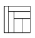

# <lo-sample/> EE.LHT.2024S.9_10.1

Kui palju leidub selliseid täisarvude kolmikuid $(x,y,z)$, mis rahuldavad tingimusi 
$1 < x \le y \le z$ ja $xyz = 2024$?


## Lahendus 1

*Vastus:* 16.

Arvu 2024 kõik tegurid on

$$1, 2, 4, 8, 11, 22, 23, 44, 46, 88, 92, 184, 253, 506, 1012, 2024.$$

Vaatame järjest läbi kõik võimalused $x$ kasvamise järjestuses.

- Kui $x=1$, siis $y$ saab olla 1, 2, 4, 8, 11, 22, 23, 44, kokku 8 võimalust.
- Kui $x=2$, siis $y$ saab olla 2, 4, 11, 22, 23 (edasi muutuks $z$ 
  väiksemaks kui $y$), kokku 5 võimalust.
- Kui $x=4$, siis $y$ saab olla 11, 22 (edasi muutuks $z$ 
  väiksemaks kui $y$), kokku 2 võimalust.
- Kui $x=8$, siis ainus võimalus on $y=11$ (edasi muutuks 
  $z$ väiksemaks kui $y$).
- Kui $x=11$, siis vähim kandidaat $y$ kohale oleks 23 
  (sest 22 jagub 11-ga, kuid 2024 ei jagu $11^2$-ga), siis aga $z=8<y$, vastuolu.
- Kui $x \ge 22$, siis jõuame vastuoluni sarnaselt eelmise juhuga.

Seega kokku on nõutud omadustega kolmikuid $8 + 5 + 2 + 1 = 16$.

## Lahendus 2

*Vastus:* 16.

Arvu 2024 kõik tegurid on

$$1, 2, 4, 8, 11, 22, 23, 44, 46, 88, 92, 184, 253, 506, 1012, 2024.$$

Vaatame järjest läbi kõik võimalused $x$ kasvamise järjestuses.
- Kui $x = 1$, siis $y$ saab olla 1, 2, 4, 8, 11, 22, 23, 44, kokku 8 võimalust.
- Kui $x = 2$, siis $y$ saab olla 2, 4, 11, 22, 23 (edasi muutuks $z$ väiksemaks kui $y$), kokku 5 võimalust.
- Kui $x = 4$, siis $y$ saab olla 11, 22 (edasi muutuks $z$ väiksemaks kui $y$), kokku 2 võimalust.
- Kui $x = 8$, siis ainus võimalus on $y = 11$ (edasi muutuks $z$ väiksemaks kui $y$).
- Kui $x = 11$, siis vähim kandidaat $y$ kohale oleks 23 (sest 22 jagub 11-ga, kuid 2024 ei jagu $11^2$-ga), siis aga $z = 8 < y$, vastuolu.
- Kui $x \ge 22$, siis jõuame vastuoluni sarnaselt eelmise juhuga.

Seega kokku on nõutud omadustega kolmikuid $8 + 5 + 2 + 1 = 16$.


## Lahendus 3

*Vastus:* 16.

Arvu 2024 kõik tegurid on

$$1, 2, 4, 8, 11, 22, 23, 44, 46, 88, 92, 184, 253, 506, 1012, 2024.$$

Vaatame järjest läbi kõik võimalused $z$ kahanemise järjestuses.
- Kui $z = 2024$, siis $xy = 1$, millest saame 1 võimaluse $x = y = 1$.
- Kui $z = 1012$, siis $xy = 2$, millest saame 1 võimaluse $x = 1$, $y = 2$.
- Kui $z = 506$, siis $xy = 4$, millest saame 2 võimalust $x = 1$, $y = 4$ ja $x = y = 2$.
- Kui $z = 253$, siis $xy = 8$, millest saame 2 võimalust $x = 1$, $y = 8$ ja $x = 2$, $y = 4$.
- Kui $z = 184$, siis $xy = 11$, millest saame 1 võimaluse $x = 1$, $y = 11$.
- Kui $z = 92$, siis $xy = 22$, millest saame 2 võimalust $x = 1$, $y = 22$ ja $x = 2$, $y = 11$.
- Kui $z = 88$, siis $xy = 23$, millest saame 1 võimaluse $x = 1$, $y = 23$.
- Kui $z = 46$, siis $xy = 44$, millest saame 3 võimalust $x = 1$, $y = 44$ ja $x = 2$, $y = 22$ ja $x = 4$, $y = 11$.
- Kui $z = 44$, siis $xy = 46$, millest saame 1 võimaluse $x = 2$, $y = 23$.
- Kui $z = 23$, siis $xy = 88$, millest saame 2 võimalust $x = 4$, $y = 22$ ja $x = 8$, $y = 11$.
- Kui $z = 22$, siis $xy = 92$, millest ühtegi sobivat võimalust ei saa.
- Kui $z \le 11$, siis $xy \ge 184 > 11^2$, mistõttu üks tegureist $x$ ja $y$ oleks suurem kui $z$.

Kokku leidsime $1 + 1 + 2 + 2 + 1 + 2 + 1 + 3 + 1 + 2 = 16$ võimalust.


# <lo-sample/> EE.LHT.2024S.9_10.2

Ruut on jaotatud 6 võrdse pindalaga ristkülikuks joonisel näidatud viisil, 
nii et alumise parempoolse ristküliku ühe külje pikkus on $1$ cm. 
Leia kõik võimalused, milline saab olla ruudu ümbermõõt.




## Lahendus 1

**Vastus:** $7,5~\mathrm{cm}$ ja $12,8~\mathrm{cm}$.

Olgu väikeste ristkülikute tipud ruudu alumisel küljel $A, B, C, D, E$ ning paremal küljel $E, F, G, H$ selles järjes­tuses (joonis 1). Olgu ruudu küljepikkus $x$; siis ruudu pindala on $x^2$. Kuna väikeseid ristkülikuid on 6 ja kõik nad on võrdse pindalaga, siis on iga ristküliku pindala $\frac{1}{6}x^2$. Paneme tähele järgmist.
- Vasakpoolse püstise ristküliku mõõtmed on $|AB|$ ja $x$. Saame võrrandi $|AB| \cdot x = \frac{1}{6}x^2$, kust $|AB| = \frac{1}{6}x$. Seega $|BE| = x - \frac{1}{6}x = \frac{5}{6}x$.
- Ülemise rõhtse ristküliku mõõtmed on $|GH|$ ja $\frac{5}{6}x$. Saame võrrandi $|GH| \cdot \frac{5}{6}x = \frac{1}{6}x^2$, kust $|GH| = \frac{1}{5}x$. Seega $|EG| = x - \frac{1}{5}x = \frac{4}{5}x$.


- Vasakult teise püstise ristküliku mõõtmed on $|BC|$ ja $\frac{4}{5}x$. 
  Saame võrrandi $|BC| \cdot \frac{4}{5}x = \frac{1}{6}x^2$, kust 
  $|BC| = \frac{5}{24}x$. Seega $|CE| = \frac{5}{6}x - \frac{5}{24}x = \frac{5}{8}x$.

- Ülevalt teise rõhtse ristküliku mõõtmed on $|FG|$ ja $\frac{5}{8}x$. 
  Saame võrrandi $|FG| \cdot \frac{5}{8}x = \frac{1}{6}x^2$, kust 
  $|FG| = \frac{4}{15}x$. Seega $|EF| = \frac{5}{8}x - \frac{4}{15}x = \frac{15}{24}x$.

- Vasakult kolmanda püstise ristküliku mõõtmed on $|CD|$ ja $\frac{8}{15}x$. 
  Saame võrrandi $|CD| \cdot \frac{8}{15}x = \frac{1}{6}x^2$, kust 
  $|CD| = \frac{15}{48}x = \frac{5}{16}x$. 
  Seega $|DE| = \frac{5}{8}x - \frac{5}{16}x = \frac{5}{16}x$.

Järelikult alumise parempoolse ristküliku mõõtmed on $\frac{8}{15}x$ ja $\frac{5}{16}x$. Kui esimene mõõde on 1 cm, siis $x = \frac{15}{8}$ cm ning ruudu ümbermõõt on sel juhul $\frac{15}{2}$ cm ehk 7,5 cm. Kui aga teine mõõde on 1 cm, siis $x = \frac{16}{5}$ cm ning ruudu ümbermõõt on sel juhul $\frac{64}{5}$ cm ehk 12,8 cm.


## Lahendus 2

Olgu väikeste ristkülikute tipud ruudu alumisel küljel 
$A, B, C, D, E$ ning paremal küljel $E, F, G, H$ selles järjestuses 
(joonis 1). Olgu ruudu küljepikkus $x$.

Kui ristkülikus mõõtmetega $u \times v$ eraldatakse riba, 
mis on paralleelne küljega, mille pikkus on $u$, ja mille pindala 
moodustab $\frac{1}{n}$ kogu ristküliku pindalast, siis riba 
mõõtmed on $u \times \frac{1}{n}v$ ning ristküliku ülejäänud 
osa mõõtmed on $u \times \frac{n-1}{n}v$. Kasutades seda 
teadmist korduvalt, saame teha järgmised tähelepanekud.

- Kuna ruut on jaotatud $6$ võrdpindseks ristkülikuks, siis 
$|AB| = \frac{1}{6}x$ ja $|BE| = \frac{5}{6}x$.
- Kuna vasakult esimesest ristkülikust üle jääv osa on jaotatud 
$5$ võrdpindseks ristkülikuks, siis $|GH| = \frac{1}{5}x$ ja $|EG| = \frac{4}{5}x$.
- Kuna ülevalt esimesest rõhtsest ristkülikust omakorda üle 
jääv osa on jaotatud $4$ võrdpindseks ristkülikuks, siis 
$|BC| = \frac{1}{4} \cdot \frac{5}{6}x = \frac{5}{24}x$ ja $|CE| = \frac{3 \cdot 5}{24}x = \frac{15}{24}x = \frac{5}{8}x$.

- Kuna vasakult teisest püstisest ristkülikust omakorda üle jääv osa on jaotatud 3 võrdpindseks ristkülikuks, siis $|FG| = \frac{1}{3} \cdot \frac{4}{5}x = \frac{4}{15}x$ ja $|EF| = \frac{2 \cdot 4}{15}x = \frac{8}{15}x$.
- Kuna ülevalt teisest rõhtsest ristkülikust omakorda üle jääv osa on jaotatud 2 võrdpindseks ristkülikuks, siis $|CD| = |DE| = \frac{1}{2} \cdot \frac{5}{8}x = \frac{5}{16}x$.

Seega alumise parempoolse ristküliku mõõtmed on $\frac{8}{15}x \times \frac{5}{16}x$. Kui esimene mõõde on 1 cm, siis $x = \frac{15}{8}$ cm ning ruudu ümbermõõt on sel juhul $\frac{15}{2}$ cm ehk 7,5 cm. Kui aga teine mõõde on 1 cm, siis $x = \frac{16}{5}$ cm ning ruudu ümbermõõt on sel juhul $\frac{64}{5}$ cm ehk 12,8 cm.

* *Märkus.* Kirjutisega $|l|$ on tähistatud lõigu $l$ pikkust.


# <lo-sample/> EE.LHT.2024S.9_10.3

Nimetame positiivset täisarvu $n$ *huvitavaks*, kui nii arvu $n$ kui ka arvu 
$n+1$ ristsumma on mingi täisarvu ruut ning arvudes $n$ ja $n + 1$ on ühepalju numbreid. 
Leia kõik positiivsed täisarvud $k$, 
mille korral leidub huvitav $k$-kohaline arv.

## Lahendus 1

*(Aleksei Ganyukov)*

**Vastus:** kõik positiivsed täisarvud $k \geq 10$.

Tähistagu $s(a)$ positiivse täisarvu $a$ numbrite summat. 
Alati, kui mingi arvu $n$ puhul arv $n+1$ ei lõpe nulliga, 
siis ilmselt $s(n+1)=s(n)+1$. Ainsad järjestikused täisarvud, 
mis on kumbki mingi täisarvu ruut, on $0$ ja $1$, aga 
$s(n)=0$ on positiivse $n$ puhul võimatu. Vastuolu näitab, 
et arv $n+1$ peab lõppema numbriga $0$ ja arv $n$ seega numbriga $9$.

Olgu $n$ selline huvitav arv, mille lõpus on täpselt $m$ 
numbrit $9$. On lihtne näha, et $s(n) - s(n+1) = 9m - 1$. 
Märkame, et naturaalarvu ruut saab $9$-ga jagades anda vaid 
jääke $0,1,4,7$. Et arv $s(n) - s(n+1)$ ehk $9m - 1$ annab 
$9$-ga jagades jäägi $8$, peab arv $s(n)$ andma jäägi $0$ 
ja arv $s(n+1)$ andma jäägi $1$. Kuid $s(n+1)=1$ pole võimalik, 
sest see tähendaks, et $n+1$ on kujul $10\ldots0$ ning arvud 
$n$ ja $n+1$ koosnevad erinevast arvust numbritest, mis on 
huvitavuse tingimusega vastuolus. Seega $s(n+1) \geq 8^2 = 64$, 
sest $8^2$ on suuruselt järgmine täisarvu ruut, mis annab 
$9$-ga jagades jäägi $1$. Kuna aga $s(n) > s(n+1)$, siis 
$s(n) > 9^2 = 81$. See tähendab, et arvus $n$ peab olema 
vähemalt $9$ numbrit. Täpselt $9$ numbrit oleks võimalik 
vaid juhul, kui arv $n$ koosneks ainult üheksatest, kuid 
sel juhul sisaldaks arv $n+1$ ühte numbri rohkem, mis on 
huvitavusega vastuolus. Seega peab arv $n$ sisaldama vähemalt $10$ numbrit.

Vaatleme nüüd $10$-kohalist arvu $n = 7888888899$. 
Selle arvu puhul $m = 2$, $s(n) = 81 = 9^2$, 
$s(n+1) = 81 - (9 \cdot 2 - 1) = 64 = 8^2$, seega see $n$ on huvitav.

Märkame, et mistahes arvu nullide lisamisel 7 ja 8 vahele 
$s(n)$ ja $s(n+1)$ ei muutu. Nii saame $m$-kohalise huvitava arvu iga $m \geq 10$ korral.

*Märkus.* Jääkide vaatlemine ei ole lahendamiseks tingimata vajalik. 
Selle asemel võib täisruutude $2^2, 3^2, 4^2, 5^2, 6^2, 7^2, 8^2$ 
vahed lihtsalt välja arvutada ja veenduda, et ükski neist ei esitu kujul $9m-1$.


# <lo-sample/> EE.LHT.2024S.9_10.4

Järgnevas kirjalikus liitmistehtes vastavad erinevatele tähtedele erinevad 
numbrid ja samale tähele alati sama number; seejuures võib arv alata ka nulliga:


Aednik Andresel on nii palju tomatitaimi, kui on selle liitmistehte suurim võimalik 
tulemus, ning ta tahab endale jätta nii palju tomatitaimi, kui on selle 
liitmise vähim võimalik tulemus. Ülejäänud taimed kavatseb ta maha müüa ja 
osta saadud raha eest õuna- või pirnipuid, mis on $10$ korda kallimad kui 
tomatitaimed. Mitu puud saab Andres osta?

## Lahendus 1

*Vastus:* 666.

Esmalt paneme tähele, et tähele $T$ peab vastama $0$. Tõepoolest, kuna kahe arvu kirjalikus liitmises ei saa uude järku üle kanda rohkem kui 1, siis $T \leq 1$. Kuid $T$ ei saa olla 1, sest $N + N$ annab tähaks $T$ paarisnumbri. Seega $T = 0$ ja $N = 5$.

Et saada võimalikult suurt väärtust, peab olema $O = 9$, mis annab ainsa võimalusena, et $P = 8$ ja eelmisest järgust kandub $1$ üle. Nüüd on meil veel kasutamata numbrid $1, 2, 3, 4, 6, 7$. Eelneva põhjal toimub sajallistes ülekande tuhandelistesse, mistõttu suurima $M$ jaoks peaksid $\tilde{O}$ ja $I$ olema mingis järjekorras $6$ ja $7$. Seejärel on alles $1, 2, 3, 4$, mida kasutades leiame $U + R + 1 \leq 3 + 4 + 1 = 8$ ja seega kümnelistest midagi üle ei kandu. Järelikult $M = 3$ ning võttes $U$ ja $R$ rolli mingis järjekorras $1$ ja $2$, saamegi $A = 4$ ehk kokkuvõttes peab tehe olema

```
  6 1 5
+ 8 7 2 5
---------
0 9 3 4 0
```

Selgitame nüüd välja võimalikult väikse väärtuse. Kuna $0$ on juba kasutusel, siis $O \geq 1$; kuid selleks, et $O$ oleks $1$, peaks olema $P = 0$, kuid $0$ on juba kasutusel. Seetõttu võtame $O = 2$, millest tulenevalt $P = 1$ ning eelmisest järgust kandub $1$ üle.

Nüüd on meil kasutamata 3, 4, 6, 7, 8 ja 9. Oletame, et kümnelistest tekib ülekande sajalistesse; see tähendab, et nii ühelisest, kümnelistest kui ka sajalistest tekib ülekande. Kuna tehtes esineb 10 erinevat tähte, siis peavad kõik numbrid olema kasutusel. Kuid number 9 ei saa esineda summas, sest kahe 9-st väiksema numbri summa ei saa tekitada summasse numbrit 9 koos ülekandega järgmisse järku, ega ka kummaski liidetavas, sest ülekannet arvestades oleksid teise liidetava ja summa vastavad numbrid siis võrdsed, neil kohtadel on aga erinevad tähed. Vastoluul näitab, et kümnelistest ei teki ülekannet sajalistesse. See aga tähendab, et $U$ ja $R$ on mingis järjestuses 3 ja 4, sest kõigi ülejäänud valikute korral $U + R + 1 \geq 10$. Seega $A = U + R + 1 = 3+4+1 = 8$ ja $M \geq 6$. Juht $M = 6$ on võimalik:

```
  9 3 5
+ 1 7 4 5
---------
0 2 6 8 0
```

Seega tahab Andres müüa 9340 - 2680 ehk 6660 tomatitaime, mille eest ta saaks 666 õuna- või pirnipuud.


## Lahendus 2

Vähima summani saab jõuda ka toetamata argumendile, et kõik numbrid on kasutusel. Nagu lahenduses 1 näitame, et $T=0$, $N=5$, $P=1$ ja $O=2$. Kui kümnelistest tekiks ülekande sajalistesse, siis tekiks meil võrrandisüsteem

$$\begin{cases}
U+R+1 = 10 + A \\
\tilde{O} + I + 1 = 10 + M \\
\end{cases}$$

Kuid see pole lahenduv, sest võrduste ahela

$$2 \cdot (20 + A + M) = U + R + 1 + 10 + A + \tilde{O} + I + 1 + 10 + M = 22 + 3 + 4 + 6 + 7 + 8 + 9 = 59$$

alguses on paarisarv, lõpus aga paaritu. Vastolu näitab, et kümnelistest ei teki ülekannet sajalistesse. Edasi jätkame nagu lahenduses 1.


# <lo-sample/> EE.LHT.2024S.9_10.5

On antud ristkülik $ABCD$. Nurga $\sphericalangle CAD$ poolitaja lõikab külge $CD$ 
punktis $L$. Punkt $M$ poolitab lõigu $AL$. Sirge $DM$ lõikab sirgeid 
$AC$ ja $AB$ vastavalt punktides $E$ ja $F$. On teada, et lõikude $AE$ 
ja $AF$ pikkused on võrdsed. Tõesta, et $ABCD$ on ruut.

## Lahendus 1

*Lahendus 1.* Tähistame $\sphericalangle DAL = \sphericalangle LAC = \alpha$ (joonis 2), siis

$$\sphericalangle CAB = \sphericalangle EAF = 90^\circ - 2\alpha.$$

Tingimusest $|AE| = |AF|$ saame nüüd

$$\sphericalangle AFE = \sphericalangle FEA = \frac{180^\circ - (90^\circ - 2\alpha)}{2} = 45^\circ + \alpha,$$


seega $\sphericalangle AED = 180^\circ - (45^\circ + \alpha) = 135^\circ - \alpha$. Kolmnurgast $AEM$ saame nüüd $\sphericalangle EMA = 180^\circ - \alpha - (135^\circ - \alpha) = 45^\circ$, mistõttu $\sphericalangle AMD = 180^\circ - 45^\circ = 135^\circ$.

Kolmnurga $MAD$ tipust $M$ tõmmatud kõrgus $MK$ on risti alusega $AD$ (joonis 3). Kuna ka ristküliku külg $CD$ on risti küljega $AD$, siis $MK$ ja $CD$ on paralleelsed. Kuna $M$ poolitab lõigu $AL$ ning $MK$ ja $LD$ on paralleelsed, on $MK$ kolmnurga $ALD$ kesklõik. Järelikult $K$ poolitab külge $AD$, millest tulenevalt on $MK$ kolmnurga $MAD$ mediaan. Kuna kolmnurga $MAD$ tipust $M$ tõmmatud kõrgus ja mediaan ühtivad, on $MAD$ võrdhaarne kolmnurk, kus

$$|MA| = |MD|.$$

Seega $\alpha = \sphericalangle MDA = \frac{180^\circ - 135^\circ}{2} = 22{,}5^\circ$. Siis $\sphericalangle DAC = 45^\circ$.

Kuna ristküliku $ABCD$ diagonaal poolitab nurga, on $ABCD$ ruut.

## Lahendus 2

Tähistame $\sphericalangle MAD = \sphericalangle MAE = \alpha$. Täisnurkse kolmnurga $ADL$ ümberringjoone keskpunkt asub tema hüpotenuusi keskpunktis $M$, mistõttu $|MD| = |MA|$ ehk kolmnurk $MAD$ on võrdhaarne tipunurgaga tipu $A$ juures (joonis 4). Seega ka $\sphericalangle MDA = \alpha$. Välisnurga omaduse põhjal kolmnurgas $MAD$ saame $\sphericalangle AME = \sphericalangle MAD + \sphericalangle MDA = 2\alpha$; kolmnurgas $MAE$ saame sama omaduse põhjal omakorda $\sphericalangle AEF = \sphericalangle MAE = 3\alpha$.

Kuna $|AE| = |AF|$, siis kolmnurk $AEF$ on võrdhaarne tipunurgaga tipu $A$ juures. Seega ka $\sphericalangle AFE = 3\alpha$ ning $\sphericalangle EAF = 180^\circ - 6\alpha$. Saame võrrandi $2\alpha + (180^\circ - 6\alpha) = 90^\circ$, kust $\alpha = 22{,}5^\circ$. Järelikult $\sphericalangle DAC = 45^\circ$ ehk ristküliku $ABCD$ diagonaal poolitab nurga, mistõttu $ABCD$ on ruut.


## Lahendus 3

Kuna $|AE| = |AF|$, siis kolmnurk $AEF$ on võrdhaarne tipunurgaga tipu $A$ juures (joonis 5). Tähistame $\sphericalangle AEF = \sphericalangle AFE = \beta$. Märkame, et kolmnurgad $MAF$ ja $MLD$ on võrdsed tunnuse NKN põhjal. Tõepoolest, $\sphericalangle FMA = \sphericalangle DML$ (tipunurgad) ja $\sphericalangle MAF = \sphericalangle MLD$ (põiknurgad) ning eelduse põhjal $|MA| = |ML|$. Seega $|AF| = |DL|$, millest tulenevalt $ADLF$ on ristkülik. Kuna ristküliku diagonaalid on võrdsed ja poolitavad teineteist, siis $|MA| = |MF|$, millest tulenevalt kolmnurk $MAF$ on võrdhaarne tipunurgaga tipu $M$ juures. Seega $\sphericalangle MAF = \sphericalangle MFA = \beta$.

Kuna $\sphericalangle EAF = 180^\circ - 2\beta$, siis järelikult $\sphericalangle MAE = \beta - (180^\circ - 2\beta) = 3\beta - 180^\circ$. Seega ka $\sphericalangle MAD = 3\beta - 180^\circ$, sest $AM$ poolitab nurga $DAE$. Saame võrrandi


$\beta + (3\beta - 180^\circ) = 90^\circ$, kust $\beta = 67{,}5^\circ$. Seega $\sphericalangle BAC = 180^\circ - 2 \cdot 67{,}5^\circ = 45^\circ$ ehk ristküliku $ABCD$ diagonaal poolitab nurga, mistõttu $ABCD$ on ruut.

## Lahendus 4

Olgu $\sphericalangle DAL = \sphericalangle LAC = \alpha$. Siis $\sphericalangle FAE = 90^\circ - 2\alpha$ ning kuna

$$\sphericalangle AFE = \frac{180^\circ - (90^\circ - 2\alpha)}{2} = 45^\circ + \alpha,$$

kui $|AE| = |AF|$. Teisalt, kuna $M$ on täisnurkse kolmnurga $ALD$ hüpotenuusi $AL$ kespunkt, siis $|MA| = |MD|$ ning seega $\sphericalangle MDA = \sphericalangle MAD = \alpha$, mistõttu täisnurkse kolmnurgas $AFD$ kehtib $\sphericalangle AFE = \sphericalangle AFD = 90^\circ - \alpha$. Järelikult $45^\circ + \alpha = 90^\circ - \alpha$ ehk $2\alpha = 45^\circ$, kust $\sphericalangle CAD = 2\alpha = 45^\circ$. Seega ka $\sphericalangle ACD = 45^\circ$, millest tulenevalt $|AD| = |CD|$ ehk $ABCD$ on ruut.

*Märkus.* Kirjutisega $|l|$ on tähistatud lõigu $l$ pikkust.


# <lo-sample/> EE.LHT.2024S.9_10.6

Kuningriigis on $n$ linna. Alguses puudub riigi teedevõrk; ühtegi teed 
pole. Kuningas soovib olukorda parandada. Selleks teeb ta $n-1$ käiku 
järgneva reegli järgi: $i$-ndal käigul valib ta kaks linna, mille elanike 
arvude vahe jagub arvuga $i$, ja laseb ehitada nende linnade vahele 
kahesuunalise otsetee. Kas sõltumata sellest, mitu elanikku igas linnas 
elab, on kuningal võimalik valida linnu nii, et ehitatud teedevõrgu 
kaudu saab igast linnast igasse teise linna? (Eeldame, et linnade elanike 
arvud vahepeal ei muutu.)


## Lahendus 1

*Vastus:* jah.

Muudame kuninga käigureeglit järgnevalt: $i$-ndal käigul laseb ta ehitada otsetee kahe linna vahele, mille elanike arvude vahe jagub arvuga $n-i$. Kui sellise käigureegli korral saab kuningas valida linna nii, et ehitatud teedevõrgu kaudu saab igast linnast igasse teise linna, siis on see võimalik ka algse käigureegli korral, sest teed saab ehitada vastupidises järjekorras.

Seega piisab näidata, et muudetud käigureegli korral saab kuningas valida linna nii, et ehitatud teedevõrgu kaudu saab igast linnast igasse teise linna. Enne esimest käiku on kuningriigis $n$ eraldatud linna. Esimesel käigul tuleb ühendada linnad, mille elanike arvude vahe jagub arvuga $n-1$. Viimane tingimus tähendab, et elanike arvude jäägid jagamisel arvuga $n-1$ on võrdsed. Dirichlet’ printsiibi põhjal leiduvad sellised kaks linna $a$ ja $b$, sest linna on rohkem kui võimalikke jääke. Ühendame need linnad otsetee ega jätame järgnevates toimingutes linna $b$ kõrvale. Alles jääb $n-1$ linna, mis pole üksteisega ühendatud, ja vaja on ehitada tee kahe linna vahele, mille elanike arvude jäägid jagamisel arvuga $n-2$ on võrdsed. Samamoodi jätkates on enne igat käiku linna 1 võrra rohkem kui võimalikke jääke, mistõttu saame alati ühendada kokku kaks linna, mis enne omavahel ühendatud pole.

Veendume, et lõpuks saavad kõik $n$ linna omavahel ühendatud. Selleks märkame, et protsessi käigus kehtib järgmine invariant: igasse kõrvalejäetud linna $x$ on võimalik juba ehitatud teede kaudu mingist allesolevast linnast jõuda. See tingimus kehtib alguses tühjalt, sest siis ühtki linna pole veel kõrvale jäetud. Oletame, et enne mingit käiku peab see tingimus paika, ja näitame, et see tingimus kehtib ka pärast käiku. Tõepoolest, olgu vaadeldaval käigul ühendatavad linnad $a$ ja $b$, kusjuures linn $b$ jäetakse pärast käiku kõrvale. Vaatleme suvalist linna $x$, mis pärast käiku on kõrvale jäetud. Kui $x = b$, siis saab linna $x$ jõuda allesolevast linnast $a$. Kui aga $x \neq b$, siis oli linn $x$ juba enne vaadeldavat käiku kõrvale jäetud, mistõttu sai sinna enne vaadeldavat käiku jõuda mingist allesolevast linnast $c$. Kui $c \neq b$, siis on linn $c$ alles ka pärast vaadeldavat käiku ja linna $x$ saab jätkuvalt linnast $c$ jõuda. Kui aga $c = b$, siis saab linna $x$ pärast vaadeldavat käiku jõuda linnast $a$.

Kuna vaadeldav invariant kehtib alguses ning kõik käigud säilitavad invariandi kehtivuse, siis kehtib see invariant ka lõpus. Kuna igal käigul jäetakse 1 linn kõrvale, siis on lõpus alles vaid 1 linn. Invariandi põhjal peab sellest linnast igasse teise linna saama. Seega saab igast linnast igasse teise linna selle ainsa allesoleva linna kaudu ehk nõutud teedevõrk on võimalik.


## Lahendus 2

Tõestame induktsiooniga $n$ järgi, et kuningal on alati võimalik valida linnu nii, et ehitatud teedevõrgu kaudu saab igast linnast igasse linna. Väide kehtib, kui $n=1$, sest siis ei pea nõutud teedevõrgu jaoks ühtki käiku tegema. Vaatleme nüüd olukorda $n$ linnaga, kus $n>1$, eeldades samas, et $n-1$ linna korral väide kehtib. Kuna linnu on $n$, kuid võimalikke jääke jagamisel arvuga $n-1$ saab olla $n-1$, siis leiduvad Dirichlet’ printsiibi põhjal kindlasti kaks linna, mille elanike arvud annavad jagamisel arvuga $n-1$ sama jäägi. Olgu need linnad $a$ ja $b$. Jätame linna $b$ kõrvale. Ülejäänud $n-1$ linna kohta kehtib induktsiooni eeldus, mistõttu on võimalik ülesandes nõutud viisil ehitada teedevõrk, mille kaudu saab igast allesolevast linnast igasse allesolevasse linna. Lõpuks ehitatagu tee linnade $a$ ja $b$ vahele. Pärast seda saab kuningriigi teedevõrgu kaudu igast linnast igasse linna. Tõepoolest, vaadeldava kahe linna seas ei ole linna $b$, siis on need linnad ühendatud juba enne viimast käiku, ja kui vaadeldava kahe linna seas on linn $b$, siis saab teisest vaadeldavast linnast linna $a$ teede kaudu, mis eksisteerivad juba enne viimast käiku, ja sealt edasi linna $b$ viimasena ehitatud teed mööda. Seega saab nõutud viisil teedevõrgu ehitada ka $n$ linna puhul.


# <lo-sample/> EE.LHT.2024S.11_12.1

Leia kõik sellised naturaalarvude paarid $(m,n)$, mille puhul $m-n=96$ ja $\text{VÜK}(m,n)=2024$.

## Lahendus 1

*Vastus:* (184, 88).

Olgu $m = m' d$ ja $n = n' d$, kus $\text{SÜT}(m', n') = 1$. Sel juhul $(m' - n')d = m-n = 96$ ja $m'n'd = \frac{mn}{d} = \frac{mn}{\text{SÜT}(m, n)} = \mathrm{VÜK}(m, n) = 2024$.

Paneme tähele, et $\mathrm{SÜT}(m', n', m'-n') = 1$. Tõepoolest, kui oletada väitevastaselt, et mingi algarv $p$ on arvude $m'n'$ ja $m' - n'$ ühine tegur, siis $p$ on kas arvu $m'$ või arvu $n'$ tegur ja samas arvu $m' - n'$ tegur, mistõttu ta peaks olema nii arvu $m'$ kui ka arvu $n'$ tegur. See aga on vastuolus arvude $m'$ ja $n'$ valikuga. Seega

$$\begin{align*}
d &= d \cdot 1 = \\
  &= d \cdot \mathrm{SÜT}(m'n', m' - n') = \\
  &= \mathrm{SÜT}(m'n'd, (m' - n')d) = \\
  &= \mathrm{SÜT}(2024, 96) = 8.
\end{align*}$$

Nüüd $m' - n' = \frac{m-n}{d} = \frac{96}{8} = 12$ ja $m'n' = \frac{m'n'd}{d} = \frac{2024}{8} = 253$.

Asendades võrrandisüsteemi

$$\begin{cases}
m' - n' = 12, \\
m'n' = 253
\end{cases}$$

esimesest võrrandist $m' = n' + 12$ teise võrrandisse, tekib ruutvõrrand $(n')^2 + 12n' - 253 = 0$, kust $n' = -6 \pm \sqrt{289} = -6 \pm 17$ ehk $n' = -23$ või $n' = 11$. Negatiivne lahend ei sobi; positiivne lahend annab $m' = 23$. Seega $m = 23 \cdot 8 = 184$, $n = 11 \cdot 8 = 88$.


## Lahendus 2

Kui $\mathrm{VÜK}(m, n) = 2024$, siis nii $m$ kui ka $n$ on arvu 2024 tegurid.
Arvu 2024 kõik tegurid on

$$1,\, 2,\, 4,\, 8,\, 11,\, 22,\, 23,\, 44,\, 46,\, 88,\, 92,\, 184,\, 253,\, 506,\, 1012,\, 2024.$$

Kui $m-n=96$, siis $m>96$, mis jätab sõelale võimalused $m=184$, $m=253$, $m=506$, $m=1012$ ja $m=2024$. Kuna tegurite 253, 506, 1012, 2024 omavahelised erinevused on ilmselt suuremad kui 96, siis piisab kontrollida variante $m=184$ ja $m=253$, mis annavad vastavalt $n=88$ ja $n=157$.

Arv $157$ ei esine arvu $2024$ tegurite seas. Arv $88$ esineb ja kontroll näitab, et tõepoolest $\mathrm{VÜK}(184, 88)=\mathrm{VÜK}(8 \cdot 23, 8 \cdot 11)=8 \cdot 23 \cdot 11=2024$.

## Lahendus 3

Kuna $\mathrm{VÜK}(m, n)=2024=8\cdot253$ ja $8=2^3$, siis vähemalt üks arvudest $m$ ja $n$ jagub 8-ga. Kuna $m-n=96$, siis peab ka teine neist arvudest jaguma 8-ga. Nii $m$ kui ka $n$ on arvu 2024 tegurid. Kõik arvu 2024 tegurid, mis jaguvad 8-ga, on 8, 88, 184 ja 2024. Ainsad, mille vahe on 96, on 184 ja 88.


# <lo-sample/> EE.LHT.2024S.11_12.2

Meist arengutasemelt miljoneid aastaid ees olevailt maavälistelt olenditelt 
saabunud sõnumi põhjal on nende planeedi kahe kõrgeima punkti kõrgus 
merepinnast $h$ ja madalaima maismaapunkti kõrgus merepinnast $l$ (kusjuures $h \ge 0 > l$). 
Planeedi raadius (merepinna kaugus planeedi keskpunktist) on aga $r$. 
Avalda suurim nende andmete poolt võimaldatav kaugus selle planeedi 
kahe sellise punkti vahel, millest üks on teisest näha.

## Lahendus 1

*Vastus:* $2\sqrt{(r+h)^2 - (r+l)^2}$ ehk $2\sqrt{(2r+h+l)(h-l)}$.

Paneme tähele, et selleks, et planeedi kahe punkti vaheline kaugus oleks maksimaalne, peab neid punkte ühendav sirge olema planeedile puutujaks, sest vastasel korral oleks meil võimalik neid punkte mööda planeedi pinda teineteisest kaugemale nihutada. Olgu planeedi keskpunkt $O$; olgu vaadeldavad kaks punkti $P_1$ ja $P_2$ ning puutepunkt $P_3$ (joonis 6). Tähistame $|OP_i| = d_i$ iga $i = 1, 2, 3$ korral. Kuna puutuja on risti puutepunkti tõmmatud ringjoone raadiusega, on $OP_1P_3$ ja $OP_2P_3$ täisnurkset kolmnurgad, mille hüpotenuusid on vastavalt $OP_1$ ja $OP_2$. Seega

$$|P_1P_2| = |P_1P_3| + |P_2P_3| = \sqrt{d_1^2 - d_3^2} + \sqrt{d_2^2 - d_3^2}.$$

Ilmselt on selle avaldise väärtus maksimaalne, kui $d_1$ ja $d_2$ on võimalikult suured ehk mõlemad $r + h$ ning $d_3$ on võimalikult väike ehk $r + l$. Nende väärtuste sisestamisel saame otsitava kauguse $2\sqrt{(r+h)^2-(r+l)^2}$ ehk $2\sqrt{(2r+h+l)(h-l)}$.


*Märkus 1.* Kirjutisega $|l|$ on tähistatud lõigu $l$ pikkust.

*Märkus 2.* Maakerra raadius on 6371 km, kõrgeima punkti kõrgus merepinnast 8,848 km (Džomolungma tipp) ja madalaima maismaapunkti kõrgus merepinnast $-0,414$ km (Surnumere rannajoon). Nende andmete põhjal oleks **suurim võimalik kaugus Maa** kahe teineteisest nähtava punkti vahel

$$2\sqrt{(6371 + 8{,}848)^2 - (6371 - 0{,}414)^2}$$

ehk ligikaudu 687 kilomeetrit. Väidetavalt on tegelik pikim ülesande tingimustele vastav vahemaa Maal 538 km, pikim selline pildile püütud vahemaa aga $443~\mathrm{km}$.


# <lo-sample/> EE.LHT.2024S.11_12.3

Positiivset täisarvu $m$ nimetatakse tavaliseks, kui arvu $m$ iga algteguri 
ruut on väiksem kui $m$.
**(A)** Tõesta, et leidub lõpmata palju positiivseid täisarve $n$, 
mille korral $n$ ja $n+1$ on mõlemad tavalised.  
**(B)** Kas leidub positiivne täisarv $n$, mille korral $n$, $n+1$ ja $n+2$ 
on kõik tavalised?


## Lahendus 1

*Vastus:* **(B)** jah.

Olgu $a$ selline kordarv, mille puhul ka $a+1$ on kordarv. Siis $a^2$ on tavaline, sest tema iga algteguri on ühtlasi arvu $a$ algtegur ja $a$ kordarvulisuse tõttu väiksem kui $a$, mistõttu on $a^2$ iga algteguri ruut väiksem kui $a^2$. Näitame, et ka $a^2-1$ on tavaline. Kuna $a^2-1 = (a-1)(a+1)$ ja $a+1$ on kordarv, siis arvu $a+1$ kõik algtegurid on väiksemad kui $a+1$, aga et $a+1$ ja tema mistahes algteguri vahe peab samuti selle algteguriga jaguma, ei saa arvu $a+1$ algtegur olla suuremad kui $a-1$. Seega arvu $a^2-1$ ükski algtegur pole suurem kui $a-1$, mistõttu arvu $a^2-1$ ühegi algteguri ruut pole suurem kui $(a-1)^2$. Kuna $(a^2-1)-(a-1)^2 = (a+1)((a+1)-(a-1)) = 2(a-1) > 0$, siis on arvu $a^2-1$ iga algteguri ruut väiksem kui $a^2-1$ ehk $a^2-1$ on tavaline. Seega sobib võtta $n = a^2-1$.

Kuna leidub kuitahes pikki järjestikuste kordarvude vahemikke, siis kahte järjestikust arvu, mis mõlemad kordarvud, saab valida lõpmata paljudel viisidel. Seega ka nõutud omadusega positiivseid täisarve $n$ on lõpmata palju.

Jääb märgata, et näiteks juhul $a=21$ on $a^2+1=442=2\cdot13\cdot17$, ja $2^2<13^2<17^2=289<442$. Seega $(440, 441, 442)$ on järjestikuste positiivsete täisarvude kolmik, mille kõik arvud on tavalised, ehk sobib võtta $n=440$.


## Lahendus 2

Vaatleme Pelli võrrandit $x^2-2y^2=1$. Sellel leidub triviaalse lahend $(x_0, y_0) = (1,0)$ ning alati, kui $(x_{k-1}, y_{k-1})$ on lahend, on lahend ka $(x_k, y_k) = (3x_{k-1}+4y_{k-1}, 2x_{k-1}+3y_{k-1})$. Tõepoolest,

$$\begin{align*}
x_k^2-2y_k^2 &= (3x_{k-1} + 4y_{k-1})^2 - 2(2x_{k-1} + 3y_{k-1})^2 \\
&= 9x_{k-1}^2 + 24x_{k-1}y_{k-1} + 16y_{k-1}^2 - 8x_{k-1}^2 - 24x_{k-1}y_{k-1} - 18y_{k-1}^2 \\
&= x_{k-1}^2 - 2y_{k-1}^2.
\end{align*}$$


Ilmselt $x_0 < x_1 < x_2 < \ldots$ ja $y_0 < y_1 < y_2 < \ldots$, mistõttu leitud lahendid on kõik erinevad. Paneme tähele, et $y_0$ jagub 3-ga ning alati, kui $y_{2k}$ jagub 3-ga, siis $x_{2k+1}$ ehk $3 x_{2k} + 4 y_{2k}$ jagub 3-ga, kui aga $x_{2k+1}$ jagub 3-ga, siis $y_{2k+2}$ ehk $2 x_{2k+1} + 3 y_{2k+1}$ jagub 3-ga. Seega $x_{2k+1}$ jagub iga naturaalarvu $k$ korral 3-ga.

Olgu $k$ suvaline positiivne täisarv. Näitame, et sobib võtta $n = 2 y_{2k+1}^2$, siis $n+1 = 2 y_{2k+1}^2 + 1 = x_{2k+1}^2$. Sobivuse tõestamiseks olgu kõigepealt $p$ arvnu suvaline algtegur. Kui $p > 2$, siis $p$ on arvu $y_{2k+1}^2$ tegur, mistõttu $p$ on arvu $y_{2k+1}$ tegur, kust saame $p \leq y_{2k+1}$. Kui aga $p = 2$, siis $p = y_1 < y_{2k+1}$ eelneva põhjal. Seega igal juhul $p^2 \leq y_{2k+1}^2 < 2 y_{2k+1}^2 = n$. Olgu nüüd $p$ arvu $n+1$ ehk $x_{2k+1}^2$ suvaline algtegur. Siis $p$ on ka arvu $x_{2k+1}$ algtegur. Eelnevas näitasime, et $x_{2k+1}$ jagub 3-ga. Kuna 3 = $x_1 < x_{2k+1}$, siis $x_{2k+1}$ on kordarv, mistõttu $p < x_{2k+1}$. Seega $p^2 < x_{2k+1}^2 = n+1$. Järelikult $n$ ja $n+1$ on mõlemad tavalised. Ülesande a-osa on sellega lahendatud, sest parameetrit $k$ saab valida lõpmata paljudel viisidel, mis annavad kõik erinevad lahendid.

Lahendamaks b-osa, piisab märkada, et kui $k=1$, siis $n = 2 \cdot 70^2 = 9800$ ja $n+1 = 99^2 = 9801$ ning $9802 = 2 \cdot 13^2 \cdot 29$. Kus $2^2 < 13^2 < 29^2 = 841 < 9802$. Seega 9800, 9801 ja 9802 on kolm järjestikust naturaalarvu, mis kõik on tavalised.

*Märkus 1.* Tegelikult võib vaadelda Pelli võrrandit $x^2-dy^2 = 1$ mistahes naturaalarvu $d$ korral, mis ei ole täisruut.

*Märkus 2.* Vähim järjestikuste positiivsete täisarvude kolmik, mille kõik arvud on tavalised, on $(350, 351, 352)$. Lahenduse 1 kolmiku $(440, 441, 442)$ leidmise lihtsustamiseks võib tähele panna, et $4^2+1=17$, mistõttu kõik arvud kuju $(17k+4)^2+1$ jaguvad 17-ga. Võttes $k=1$, saame otsitava kolmiku. (Sarnase mõttekäiguga saab sobiva kolmiku leida ka nt võrrandest $(-2)^2+1=5$ alustades, aga siis on vaja rohkem variante läbi vaadata. Esimesene sobiv kolmik oleks $(38^2-1, 38^2, 38^2+1)$.)


# <lo-sample/> EE.LHT.2024S.11_12.4

Leia kõik funktsioonid $f$, mis on määratud kõikidel reaalarvudel 
ja omandavad ainult reaalarvulisi väärtusi ning rahuldavad suvaliste 
reaalarvude $x$ ja $y$ korral tingimust

$$f!\big(y^{2}f(x)-f(xy)\big)=f!\left(y^{2}\right)+2\big(x^{2}-f(x)\big)\big(f(y)-1\big)+1.$$


## Lahendus 1

*Vastus:* $f(x) = x^2 + 1$.

Asendades antud võrrandisse $y=1$, saame peale lihtsustamist

$$f(0) = f(1) + 2\left(x^2 - f(x) \right) (f(1) - 1) + 1$$

ehk samaväärselt

$$2f(x)\left(f(1)-1\right) = f(1) - f(0) + 1 + 2x^2 (f(1)-1). \tag{1}$$

Siit näeme, et kas $f(1) = 1$ või $f(x) = x^2 + \dfrac{f(1) - f(0) + 1}{2\left(f(1) - 1\right)}$ iga reaalarvu $x$ korral. Kui $f(1) = 1$, siis võrrandist (1) saame $0 = 1 - f(0) + 1$, mis annab $f(0) = 2$. Asendades nüüd algsesse võrrandisse $y = 0$, saame võrdust $f(0) = 2$ arvestades

$$f(-2) = 2 + 2\left(x^2 - f(x)\right) + 1,$$

mis annab $f(x) = x^2 + c$, kus $c = \dfrac{3 - f(-2)}{2}$. Teisel juhul avaldub $f(x)$ samal kujul, kus $c = \dfrac{f(1) - f(0) + 1}{2(f(1) - 1)}$.

Näitame, et funktsioon $f(x) = x^2 + c$ rahuldab algset võrrandit parajasti siis, kui $c = 1$. Asendades $f(x) = x^2 + c$ algsesse võrrandisse, saame

$$\left(y^2(x^2 + c) - ((xy)^2 + c) \right)^2 + c = (y^2)^2 + c + 2\left(x^2 - (x^2 + c)\right) (y^2 + c - 1) + 1,$$

mis lihtsustub kujule

$$(c^2-1)y^4 + 2c(1-c)y^2 + (3c^2-2c-1) = 0.$$

See võrrand peab kehtima iga reaalarvu $y$ korral. Selleks peavad kõik vasakul pool oleva polünoomi kordajad olema nullid. Neljanda astme kordajast saame $c^2-1 = 0$, kust $c=1$ või $c=-1$. Ruutliikme kordajast saame $2c(1-c)=0$, kust $c=0$ või $c=1$. Kokkuvõttes on ainus võimalus $c=1$. Sel juhul on ka vabaliige null. Seega võrrandit rahuldab parajasti funktsioon $f(x)=x^2+1$.

## Lahendus 2

Asendades antud võrrandisse $y=0$, saame peale lihtsustamist

$$f(-f(0)) = f(0) + 2\left(x^2 - f(x)\right) (f(0) - 1) + 1$$

ehk samaväärselt

$$2f(x) (f(0) - 1) = f(0) - f(-f(0)) + 1 + 2x^2 (f(0) - 1). \tag{2}$$

Siit näeme, et kas $f(0) = 1$ või $f(x) = x^2 + \frac{f(0) - f(-f(0)) + 1}{2(f(0) - 1)}$ iga reaalarvu $x$ korral.

Vaatame juhtu $f(0)=1$. Asendades algsesse võrrandisse $x=0$, saame pärast lihtsustamist

$$f(y^2-1) = f(y^2) - 2(f(y)-1) + 1,$$

mis peab kehtima iga reaalarvu $y$ korral. Pannes selles 
võrrandis $y$ asemele $-y$, saame pärast lihtsustusi

$$f\left(y^2-1\right) = f\left(y^2\right) - 2(f(-y)-1) + 1,$$

mis peab samuti kehtima iga reaalarvu $y$ korral. Seega $f(y) = f(-y)$ iga reaalarvu $y$ korral ehk $f$ on paarisfunktsioon. Võrrandist (2) aga jääb pärast teguriga $f(0) - 1$ liikmete elimineerimist järele $0 = 1 - f(-1) + 1$ ehk $f(-1) = 2$. Asendades nüüd algsesse võrrandisse $y = -1$, saame

$$f(f(x) - f(-x)) = f(1) + 2\left(x^2 - f(x)\right)\left(f(-1) - 1\right) + 1.$$

Võttes arvesse, et $f$ on paarisfunktsioon ja $f(1) = f(-1) = 2$, saame siit $1 = 2 + 2\left(x^2 - f(x)\right) + 1$ ehk $f(x) = x^2 + 1$.

Järelikult $f(x) = x^2 + c$ iga reaalarvu $x$ korral, kus $c$ on mingi konstant. Edasi jätkame nagu lahenduses 1.


# <lo-sample/> EE.LHT.2024S.11_12.5

Teravnurkse kolmnurga $ABC$ ümberringjoone kespunkt on $O$. 
Küljel $BC$ valitakse punktid $D$ ja $E$ nii, et $AD$ on kolmnurga $ABC$ 
kõrgus ja $AE$ on nurga $CAD$ poolitaja. Kolmnurga $AOB$ nurgapoolitajad 
lõikuvad punktis $J$. Tõesta, et kolmnurk $JBE$ on võrdhaarne.

## Lahendus 1

Olgu $\sphericalangle BCA = \gamma$ ning sirgete $OJ$ ja $AB$ lõikepunkt $M$. Kuna $OM$ on kolmnurga $OAB$ nurgapoolitaja ja $|OA| = |OB|$, siis $OM \perp AB$. 

Samuti saame $\sphericalangle AOJ = \frac{1}{2} \sphericalangle AOB$, kesk- ja piirdenurga vaheilise seose põhjal aga $\frac{1}{2} \sphericalangle AOB = \sphericalangle ACB = \gamma$, arvestades et kolmnurga $ABC$ teravnurksuse tõttu asub punkt $O$ kolmnurga $ABC$ sees. Seega $\sphericalangle AOJ = \gamma$. Kuna $\sphericalangle AMO = 90^\circ = \sphericalangle ADC$, siis kolmnurgad $AMO$ ja $ADC$ on sarnased tunnuse NN põhjal. Seega ka $\sphericalangle MAO = \sphericalangle DAC = 90^\circ - \gamma$ ning

$$\sphericalangle MAJ = \sphericalangle JAO = \sphericalangle DAE = \sphericalangle EAC = \frac{1}{2}(90^\circ - \gamma).
\tag{3}$$

Järelikult on ka kolmnurgad $AJO$ ja $AEC$ tunnuse NN põhjal sarnased. Sellest saame võrdus

$$\frac{|AJ|}{|AE|} = \frac{|AO|}{|AC|}.
\tag{4}$$

Vaatleme nüüd kolmnurki $AJE$ ja $AOC$. Kui punkt $O$ asub kolmnurgas $ABE$ (joonis 7), siis

$$\sphericalangle JAE = \sphericalangle JAO + \sphericalangle OAE = \sphericalangle EAC + \sphericalangle OAE = \sphericalangle OAC.$$

Vastasel korral (joonis 8) saame analoogselt

$$\sphericalangle JAE = \sphericalangle JAO - \sphericalangle OAE = \sphericalangle EAC - \sphericalangle OAE = \sphericalangle OAC.$$


Seega igal juhul $\sphericalangle JAE = \sphericalangle OAC$. Arvestades ka võrdust (4), näeme, et kolmnurgad $AJE$ ja $AOC$ sarnased tunnuse KNK põhjal. Kuna $|OA| = |OC|$, siis järelikult ka $|JA| = |JE|$. Sümmeetria põhjal võrdhaarses kolmnurgas $AOB$ saame $|JA| = |JB|$. Kokkuvõttes oleme tõestanud, et $|JB| = |JE|$, mistõttu kolmnurk $JBE$ on võrdhaarne.

*Märkus 1.* Olles tõestanud kolmnurkade $AJO$ ja $AEC$ sarnasuse, saab kolmnurkade $AJE$ ja $AOC$ sarnasuse tõestada ka lühemalt, kasutades pöördhomoteetiate omadusi. Nimelt nähtub esimesest sarnasusest, et leidub selline pöördhomoteetia keskpunktiga $A$, mis saadab lõigu $JO$ lõiguks $EC$. Sellest tulenevalt leidub ka selline pöördhomoteetia, mis saadab lõigu $JE$ lõiguks $OC$. Seetõttu on ka kolmnurgad $AJE$ ja $AOC$ sarnased.


## Lahendus 2

Tähistame $\sphericalangle CAB = \alpha$, $\sphericalangle ABC = \beta$ ja $\sphericalangle BCA = \gamma$. Tõestame kõigepealt võrdused (3) nagu lahenduses 1. Edasi olgu sirgete $OJ$ ja $BC$ lõikepunkt $F$ ning sirgete $AJ$ ja $BC$ lõikepunkt $X$ (joonised 9 ja 10 kujutavad erinevaid olukordi punktide $E$ ja $F$ järjekorra poolest). Näitame, et punktid $A, J, E, F$ asuvad ühel ringjoonel. Võrdustest (3) tulenevalt saame

$$\begin{align*}
\sphericalangle JAE &= \sphericalangle BAC - \sphericalangle BAJ - \sphericalangle EAC \\
           &= \alpha - \frac{1}{2}(90^\circ - \gamma) - \frac{1}{2}(90^\circ - \gamma) \\
           &= \alpha - (90^\circ - \gamma) \\
           &= \alpha + \gamma - 90^\circ \\
           &= 180^\circ - \beta - 90^\circ \\
           &= 90^\circ - \beta.
\end{align*}$$

Kuna $|OA| = |OB|$, on sirge $OJ$ lõigu $AB$ keskristsirge. Seega

$$\sphericalangle XFJ = \sphericalangle BFJ = 90^\circ - \sphericalangle ABF = 90^\circ - \beta.$$

Kokkuvõttes $\sphericalangle XAE = \sphericalangle JAE = 90^\circ - \beta = \sphericalangle XFJ$, millest tulenevalt on punktid $A, J, E, F$ ühel ringjoonel.

Seega $\sphericalangle JEA = \sphericalangle JFA = \sphericalangle JFB = \sphericalangle JFX = \sphericalangle XAE = \sphericalangle JAE$, kust järeldub $|JA| = |JE|$. Et $J$ asub lõigu $AB$ keskristsirgel, siis $|JA| = |JB|$. Kokkuvõttes $|JB| = |JE|$, mistõttu on kolmnurk $JBE$ võrdhaarne.


## Lahendus 3

Kasutame tuntud fakti, et kolmnurga tipust selle kolmnurga kõrguste lõikepunkti ja ümberringjoone keskpunkti tõmmatud kiired on sümmeetrilised selle tipu juures oleva sisenurga poolitaja suhtes. Järelikult kolmnurga tipust tõmmatud kõrgus ja ümberringjoone raadius eraldavad kumbki oma külje poolt võrdse suurusega nurgad.


Kuna $AD$ ja $AO$ on vastavalt kolmnurga $ABC$ tipust $A$ tõmmatud kõrgus ja ümberringjoone raadius, siis mainitud fakti põhjal $\sphericalangle BAO = \sphericalangle CAD$. Eelduse põhjal on $AE$ nurga $CAD$ poolitaja ja $J$ kolmnurga $ABO$ nurgapoolitajate lõikepunkt, järelikult 

$$\sphericalangle BAJ = \frac{1}{2} \sphericalangle BAO = \frac{1}{2} \sphericalangle CAD = \sphericalangle EAD.$$

Seega kiired $AJ$ ja $AD$ eraldavad kolmnurgas $ABE$ kumbki oma külje poolt võrdse suurusega nurgad (ehk on sümmeetrilised kolmnurga $ABE$ tipu $A$ juures oleva sisenurga poolitaja suhtes). Kuna aga $AD$ on kõrgus ka kolmnurgas $ABE$, siis sama fakti põhjal peab sirge $AJ$ läbima kolmnurga $ABE$ ümberringjoone keskpunkti. Täpsemalt, kolmnurga $ABE$ ümberringjoone keskpunkt on küljel $AB$ keskristsirge lõikepunkt sirgega $AJ$. Kuna aga $|OA| = |OB|$, siis kolmnurga $AOB$ tipust $O$ tõmmatud nurgapoolitaja ühtib küle $AB$ keskristsirgega. Järelikult kolmnurga $ABE$ ümberringjoone keskpunkt on sirgete $AJ$ ja $OJ$ lõikepunkt $J$. Sellest tulenevalt $|JB| = |JE|$, mistõttu kolmnurk $JBE$ on võrdhaarne.

*Märkus 2:* Lahenduses 3 kasutatud fakti on lihtne nurkade arvutuse abil tõestada ja lahenduse 1 alguses on see kolmnurga $ABC$ ja tipu $A$ jaoks sisuliselt ära tehtud.


## Lahendus 4

Kuna $|OA| = |OB|$, siis kolmnurga $OAB$ tipu $O$ juures asuva nurga poolitaja ühtib külje $AB$ keskristsirgega. Seega punkt $J$ asub külje $AB$ keskristsirgel, mistõttu punktid $A$ ja $B$ asuvad mingil ringjoonel $\omega$ keskpunktiga $J$.

Näitame, et $\sphericalangle AJB = 2\sphericalangle AEB$. Tõepoolest,

$$\begin{align*}
\sphericalangle AEB &= \sphericalangle AED = 90^\circ - \sphericalangle EAD \\
          &= 90^\circ - \frac{\sphericalangle CAD}{2} \\
          &= 90^\circ - 90^\circ - \frac{\sphericalangle ACD}{2} \\
          &= 45^\circ + \frac{\sphericalangle ACD}{2}
\end{align*}$$

ning arvestades muuhulgas, et $|JA| = |JB|$ tõttu $\sphericalangle JAB = \sphericalangle JBA$, saame

$$\begin{align*}
\sphericalangle AJB &= 180^\circ - 2\sphericalangle JAB = 180^\circ - \sphericalangle OAB \\
           &= 180^\circ - \frac{180^\circ - \sphericalangle AOB}{2} \\
           &= 90^\circ + \frac{\sphericalangle AOB}{2} \\
           &= 90^\circ + \sphericalangle ACB = 2\sphericalangle AEB.
\end{align*}$$

Kesk- ja piirdenurga vahelise seose põhjal asub punkt $E$ ringjoonel $\omega$. Seega on $J$ kolmnurga $ABE$ ümberringjoone keskpunkt. Järelikult $|JB| = |JE|$, mistõttu kolmnurk $JBE$ on võrdhaarne.

*Märkus 3:* Kirjutisega $|l|$ on tähistatud lõigu $l$ pikkust.


# <lo-sample/> EE.LHT.2024S.11_12.6

Aednik Andres tahab oma aiamaale mõõtmetega $24 \times 2024$ istutada ühe 
sõstrapõõsa igasse ühikruutu. Seejuures tahab ta istutada võimalikult palju 
mustsõstrapõõsaid, kuid seda tingimusel, et aiamal oleks ka vähemalt üks 
punasesõstra- ja vähemalt üks valgesõstrapõõsas. 
Lisaks tahab ta, et iga mustsõstrapõõsa ühikruuduga ühist külge omavates 
ühikruutudes oleks võrdselt valge- ja punasesõstrapõõsaid 
(võib olla ka mõlemat $0$). Leia suurim arv mustsõstrapõõsaid, 
mida Andres saab istutada.

## Lahendus 1

*Vastus:* $46632$.

Näitame, et 46632 mustsõstrapõõsast on võimalik. Hakkame ülemisest vasakust ruudust diagonaalis panema punast ja valget sõstart vaheldumisi; kui jõuame servani, siis jätame ühe veeru vahele ja läheme teistpidi diagonaalis tagasi servani jne; ülejäänud tühikruutudele paneme mustsõstrad (joonis **11** kujutab aiamaa algust).

Nii vahelduvad 24 veerust koosnevad plokid, mille igas veerus on täpselt üks muud värvi sõstrapõõsas, üksikute veergudega, mis koosnevad ainult mustsõstrapõõsastest. Kuna 2024 = 80 * 25 + 24, siis viimane muud värvi sõstrapõõsastest koosnev diagonaal lõpeb parajasti aiamaa paremas alumises nurgas (kõige viimast mustsõstrapõõsaveergu ei teki). Igal muud värvi sõstrapõõsastest koosneva diagonaaliga külgneval ruudul ning samuti vahepealse veeru äärmisel ruudul on võrdselti üks punasest ja üks valgest sõstrast naaber. Ülejäänud sõstrapõõsaste kõik naabrid on mustsõstrad. Kokku on aiamaal $2024 \cdot 24 - 81 - 24$ ehk 46632 mustsõstrapõõsast.

Näitame nüüd, et rohkem mustsõstrapõõsaid olla ei saa. Selleks vaatleme suvalist tingimustele vastavat olukorda. Olgu aiamaal $24$ rida ja $2024$ veergu.


Kui aiamaal leidub veerg, mis sisaldab ainult mustsõstrapõõsaid, siis peab kindlasti leiduma kaks järjestikust veergu, millest üks sisaldab muud värvi sõstrapõõsaid ja teine mitte. Siis teises veerus oleval mustsõstrapõõsal, mille naabriks esimeses veerus on muud värvi sõstrapõõsas, peab teisel küljel olema naabriks samuti muud värvi sõstrapõõsas (joonis 12). Seega ei saa olla kaht ainult mustsõstrapõõsastest koosnevat veergu järjest ega saa ainult mustsõstrapõõsastest koosnev veerg olla aiamaa esimene või viimane.

Vaatleme nüüd $m$ järjestikusest vähemalt üht muud värvi sõstrapõõsast sisaldavast veerust koosnevat plokki, millele sama omadusega veerge kummaltki poolt juurde võtta ei saa. Näitame, et kui $m < 24$, siis on selles plokis kokku vähemalt $m + 1$ muud värvi sõstrapõõsast. Vaatame kahte juhtu.

* Kui leidub rida, mis selle ploki ulatuses sisaldab ainult mustsõstrapõõsaid, siis peab leiduma kaks järjestikust rida, millest üks sisaldab selles plokis muud värvi sõstrapõõsaid ja teine mitte. Sarnaselt eelnevaga peab teises reas oleval mustsõstrapõõsal, mille naabriks esimeses reas on muud värvi sõstrapõõsas, olema teisel küljel naabriks muud värvi sõstrapõõsas. Seega on tema veerus kaks muud värvi sõstrapõõsast. Kuna ploki igas veerus leidub vähemalt üks muud värvi sõstrapõõsas, ongi plokis kokku vähemalt $m + 1$ muud värvi sõstrapõõsast.

* Kui ei leidu rida, mis vaadeldava ploki ulatuses sisaldab ainult mustsõstrapõõsaid, siis on ploki igas reas vähemalt üks muud värvi sõstrapõõsas. Seega plokis on kokku vähemalt 24 muud värvi sõstrapõõsast. Kuna $m < 24$, siis on plokis kokku vähemalt $m + 1$ muud värvi sõstrapõõsast.


Lisame nüüd aiamaa algusse juurde ühe ainult mustsõstrapõõsastest koosneva veeru; eelneva põhjal ei teki sellest kaht kõrvuti olevat ainult mustsõstrapõõsastest koosnevat veergu. (Lisatud veerule me ülesande tingimust ei rakenda, see on sisse toodud vaid arutluse mugavuse jaoks.) Vaatleme aiamaad plokkidena, kus iga plokk algab veeruga, milles on ainult mustsõstrapõõsad, ja lõppeb viimase veeruga enne järgmist sellist veergu (või kogu aiamaa viimase veeruga, kui ploki esimene veerg oli viimane selline veerg). Plokkide valikust tulenevalt on $m$ veerust koosnevas plokis vähemalt $m-1$ muud värvi sõstrapõõsast; kui aga $m < 25$, siis on plokis eelneva põhjal vähemalt $m$ muud värvi sõstrapõõsast. Kuna $\frac{2025}{25} = 81$, siis saab blokke, milles on 1 võrra vähem muud värvi sõstrapõõsaid kui veergu, olla ülimalt 81. Seega on aiamaal kokku vähemalt $2025 - 81$ muud värvi sõstrapõõsast ning ülimalt $2024 \cdot 24 - (2025 - 81)$ ehk 46632 mustsõstrapõõsast.


