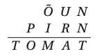

# <lo-sample/> EE.LHT.2024S.9_10.1

Kui palju leidub selliseid täisarvude kolmikuid $(x,y,z)$, mis rahuldavad tingimusi 
$1 < x \le y \le z$ ja $xyz = 2024$?

## Lahendus

*Vastus:* 16.

Arvu 2024 kõik tegurid on

$$1, 2, 4, 8, 11, 22, 23, 44, 46, 88, 92, 184, 253, 506, 1012, 2024.$$

Vaatame järjest läbi kõik võimalused $x$ kasvamise järjestuses.

- Kui $x=1$, siis $y$ saab olla 1, 2, 4, 8, 11, 22, 23, 44, kokku 8 võimalust.
- Kui $x=2$, siis $y$ saab olla 2, 4, 11, 22, 23 (edasi muutuks $z$ 
  väiksemaks kui $y$), kokku 5 võimalust.
- Kui $x=4$, siis $y$ saab olla 11, 22 (edasi muutuks $z$ 
  väiksemaks kui $y$), kokku 2 võimalust.
- Kui $x=8$, siis ainus võimalus on $y=11$ (edasi muutuks 
  $z$ väiksemaks kui $y$).
- Kui $x=11$, siis vähim kandidaat $y$ kohale oleks 23 
  (sest 22 jagub 11-ga, kuid 2024 ei jagu $11^2$-ga), siis aga $z=8<y$, vastuolu.
- Kui $x \ge 22$, siis jõuame vastuoluni sarnaselt eelmise juhuga.

Seega kokku on nõutud omadustega kolmikuid $8 + 5 + 2 + 1 = 16$.

## Lahendus

1. (Urve Kangro)

Kui palju leidub selliseid täisarvude kolmikuid $(x, y, z)$, mis rahuldavad tingimusi $1 \le x \le y \le z$ ja $xyz = 2024$?

Vastus: 16.

Lahendus 1. Arvu 2024 kõik tegurid on
1, 2, 4, 8, 11, 22, 23, 44, 46, 88, 92, 184, 253, 506, 1012, 2024.

Vaatame järjest läbi kõik võimalused $x$ kasvamise järjestuses.
- Kui $x = 1$, siis $y$ saab olla 1, 2, 4, 8, 11, 22, 23, 44, kokku 8 võimalust.
- Kui $x = 2$, siis $y$ saab olla 2, 4, 11, 22, 23 (edasi muutuks $z$ väiksemaks kui $y$), kokku 5 võimalust.
- Kui $x = 4$, siis $y$ saab olla 11, 22 (edasi muutuks $z$ väiksemaks kui $y$), kokku 2 võimalust.
- Kui $x = 8$, siis ainus võimalus on $y = 11$ (edasi muutuks $z$ väiksemaks kui $y$).
- Kui $x = 11$, siis vähim kandidaat $y$ kohale oleks 23 (sest 22 jagub 11-ga, kuid 2024 ei jagu $11^2$-ga), siis aga $z = 8 < y$, vastuolu.
- Kui $x \ge 22$, siis jõuame vastuoluni sarnaselt eelmise juhuga.

Seega kokku on nõutud omadustega kolmikuid $8 + 5 + 2 + 1 = 16$.

Lahendus 2. Arvu 2024 kõik tegurid on
1, 2, 4, 8, 11, 22, 23, 44, 46, 88, 92, 184, 253, 506, 1012, 2024.

Vaatame järjest läbi kõik võimalused $z$ kahanemise järjestuses.
- Kui $z = 2024$, siis $xy = 1$, millest saame 1 võimaluse $x = y = 1$.
- Kui $z = 1012$, siis $xy = 2$, millest saame 1 võimaluse $x = 1$, $y = 2$.
- Kui $z = 506$, siis $xy = 4$, millest saame 2 võimalust $x = 1$, $y = 4$ ja $x = y = 2$.
- Kui $z = 253$, siis $xy = 8$, millest saame 2 võimalust $x = 1$, $y = 8$ ja $x = 2$, $y = 4$.
- Kui $z = 184$, siis $xy = 11$, millest saame 1 võimaluse $x = 1$, $y = 11$.
- Kui $z = 92$, siis $xy = 22$, millest saame 2 võimalust $x = 1$, $y = 22$ ja $x = 2$, $y = 11$.
- Kui $z = 88$, siis $xy = 23$, millest saame 1 võimaluse $x = 1$, $y = 23$.
- Kui $z = 46$, siis $xy = 44$, millest saame 3 võimalust $x = 1$, $y = 44$ ja $x = 2$, $y = 22$ ja $x = 4$, $y = 11$.
- Kui $z = 44$, siis $xy = 46$, millest saame 1 võimaluse $x = 2$, $y = 23$.
- Kui $z = 23$, siis $xy = 88$, millest saame 2 võimalust $x = 4$, $y = 22$ ja $x = 8$, $y = 11$.
- Kui $z = 22$, siis $xy = 92$, millest ühtegi sobivat võimalust ei saa.
- Kui $z \le 11$, siis $xy \ge 184 > 11^2$, mistõttu üks tegureist $x$ ja $y$ oleks suurem kui $z$.

Kokku leidsime $1 + 1 + 2 + 2 + 1 + 2 + 1 + 3 + 1 + 2 = 16$ võimalust.

# <lo-sample/> EE.LHT.2024S.9_10.2

Ruut on jaotatud 6 võrdse pindalaga ristkülikuks joonisel näidatud viisil, 
nii et alumise parempoolse ristküliku ühe külje pikkus on $1$ cm. 
Leia kõik võimalused, milline saab olla ruudu ümbermõõt.

# <lo-sample/> EE.LHT.2024S.9_10.3

Nimetame positiivset täisarvu $n$ *huvitavaks*, kui nii arvu $n$ kui ka arvu 
$n+1$ ristsumma on mingi täisarvu ruut ning arvudes $n$ ja $n + 1$ on ühepalju numbreid. 
Leia kõik positiivsed täisarvud $k$, 
mille korral leidub huvitav $k$-kohaline arv.

# <lo-sample/> EE.LHT.2024S.9_10.4

Järgnevas kirjalikus liitmistehtes vastavad erinevatele tähtedele erinevad 
numbrid ja samale tähele alati sama number; seejuures võib arv alata ka nulliga:

Aednik Andresel on nii palju tomatitaimi, kui on selle liitmistehte suurim võimalik 
tulemus, ning ta tahab endale jätta nii palju tomatitaimi, kui on selle 
liitmise vähim võimalik tulemus. Ülejäänud taimed kavatseb ta maha müüa ja 
osta saadud raha eest õuna- või pirnipuid, mis on $10$ korda kallimad kui 
tomatitaimed. Mitu puud saab Andres osta?

# <lo-sample/> EE.LHT.2024S.9_10.5

On antud ristkülik $ABCD$. Nurga $\angle CAD$ poolitaja lõikab külge $CD$ 
punktis $L$. Punkt $M$ poolitab lõigu $AL$. Sirge $DM$ lõikab sirgeid 
$AC$ ja $AB$ vastavalt punktides $E$ ja $F$. On teada, et lõikude $AE$ 
ja $AF$ pikkused on võrdsed. Tõesta, et $ABCD$ on ruut.

# <lo-sample/> EE.LHT.2024S.9_10.6

Kuningriigis on $n$ linna. Alguses puudub riigi teedevõrk; ühtegi teed 
pole. Kuningas soovib olukorda parandada. Selleks teeb ta $n-1$ käiku 
järgneva reegli järgi: $i$-ndal käigul valib ta kaks linna, mille elanike 
arvude vahe jagub arvuga $i$, ja laseb ehitada nende linnade vahele 
kahesuunalise otsetee. Kas sõltumata sellest, mitu elanikku igas linnas 
elab, on kuningal võimalik valida linnu nii, et ehitatud teedevõrgu 
kaudu saab igast linnast igasse teise linna? (Eeldame, et linnade elanike 
arvud vahepeal ei muutu.)

# <lo-sample/> EE.LHT.2024S.11_12.1

Leia kõik sellised naturaalarvude paarid $(m,n)$, mille puhul $m-n=96$ ja $\text{VÜK}(m,n)=2024$.

# <lo-sample/> EE.LHT.2024S.11_12.2

Meist arengutasemelt miljoneid aastaid ees olevailt maavälistelt olenditelt 
saabunud sõnumi põhjal on nende planeedi kahe kõrgeima punkti kõrgus 
merepinnast $h$ ja madalaima maismaapunkti kõrgus merepinnast $l$ (kusjuures $h \ge 0 > l$). 
Planeedi raadius (merepinna kaugus planeedi keskpunktist) on aga $r$. 
Avalda suurim nende andmete poolt võimaldatav kaugus selle planeedi 
kahe sellise punkti vahel, millest üks on teisest näha.

# <lo-sample/> EE.LHT.2024S.11_12.3

Positiivset täisarvu $m$ nimetatakse tavaliseks, kui arvu $m$ iga algteguri 
ruut on väiksem kui $m$.
**(A)** Tõesta, et leidub lõpmata palju positiivseid täisarve $n$, 
mille korral $n$ ja $n+1$ on mõlemad tavalised.  
**(B)** Kas leidub positiivne täisarv $n$, mille korral $n$, $n+1$ ja $n+2$ 
on kõik tavalised?

# <lo-sample/> EE.LHT.2024S.11_12.4

Leia kõik funktsioonid $f$, mis on määratud kõikidel reaalarvudel 
ja omandavad ainult reaalarvulisi väärtusi ning rahuldavad suvaliste 
reaalarvude $x$ ja $y$ korral tingimust

$$f!\big(y^{2}f(x)-f(xy)\big)=f!\left(y^{2}\right)+2\big(x^{2}-f(x)\big)\big(f(y)-1\big)+1.$$

# <lo-sample/> EE.LHT.2024S.11_12.5

Teravnurkse kolmnurga $ABC$ ümberringjoone kespunkt on $O$. 
Küljel $BC$ valitakse punktid $D$ ja $E$ nii, et $AD$ on kolmnurga $ABC$ 
kõrgus ja $AE$ on nurga $CAD$ poolitaja. Kolmnurga $AOB$ nurgapoolitajad 
lõikuvad punktis $J$. Tõesta, et kolmnurk $JBE$ on võrdhaarne.

# <lo-sample/> EE.LHT.2024S.11_12.6

Aednik Andres tahab oma aiamaale mõõtmetega $24 \times 2024$ istutada ühe 
sõstrapõõsa igasse ühikruutu. Seejuures tahab ta istutada võimalikult palju 
mustsõstrapõõsaid, kuid seda tingimusel, et aiamal oleks ka vähemalt üks 
punasesõstra- ja vähemalt üks valgesõstrapõõsas. 
Lisaks tahab ta, et iga mustsõstrapõõsa ühikruuduga ühist külge omavates 
ühikruutudes oleks võrdselt valge- ja punasesõstrapõõsaid 
(võib olla ka mõlemat $0$). Leia suurim arv mustsõstrapõõsaid, 
mida Andres saab istutada.

