# <lo-sample/> EE.LHT.2024S.9_10.1

How many integer triples $(x, y, z)$ satisfy the conditions 
$1 < x \le y \le z$ and $xyz = 2024$?


## Solution 1

*Answer:* 16.

Here are all divisors of $2024$:

$$1, 2, 4, 8, 11, 22, 23, 44, 46, 88, 92, 184, 253, 506, 1012, 2024.$$

Consider all possibilities in order of increasing $x$.

- If $x=1$, then $y$ can be $1, 2, 4, 8, 11, 22, 23, 44$, a total of 8 possibilities.
- If $x=2$, then $y$ can be $2, 4, 11, 22, 23$ (if $y$ is larger, $z$ would become 
  smaller than $y$), a total of $5$ possibilities.
- If $x=4$, then $y$ can be $11, 22$ (if $y$ is larger, $z$ would become 
  smaller than $y$), a total of $2$ possibilities.
- If $x=8$, then the only possibility is $y=11$ (if $y$ is larger, $z$ would become 
  smaller than $y$).
- If $x=11$, then the smallest candidate for $y$ would be $23$ (because $22$ 
  is divisible by 11, but $2024$ is not divisible by $11^2$), but then 
  $z=8<y$, which is a contradiction.
- If $x \ge 22$, then we get a contradiction similarly as in the previous case.

Therefore, in total there are $8 + 5 + 2 + 1 = 16$ such triples.

## Solution 2

*Answer:* 16.

All divisors of $2024$ are

$$1, 2, 4, 8, 11, 22, 23, 44, 46, 88, 92, 184, 253, 506, 1012, 2024.$$

Let us consider all possibilities in order of increasing $x$.
- If $x = 1$, then $y$ can be 1, 2, 4, 8, 11, 22, 23, 44, a total of 8 possibilities.
- If $x = 2$, then $y$ can be 2, 4, 11, 22, 23 (further, $z$ would become smaller than $y$), a total of 5 possibilities.
- If $x = 4$, then $y$ can be 11, 22 (further, $z$ would become smaller than $y$), a total of 2 possibilities.
- If $x = 8$, then the only possibility is $y = 11$ (further, $z$ would become smaller than $y$).
- If $x = 11$, then the smallest candidate for $y$ would be 23 (because 22 is divisible by 11, but $2024$ is not divisible by $11^2$), but then $z = 8 < y$, a contradiction.
- If $x \ge 22$, then we get a contradiction as in the previous case.

Therefore, in total there are $8 + 5 + 2 + 1 = 16$ such triples.


## Solution 3

*Answer:* 16.

All divisors of $2024$ are

$$1, 2, 4, 8, 11, 22, 23, 44, 46, 88, 92, 184, 253, 506, 1012, 2024.$$

Let us consider all possibilities in order of decreasing $z$.
- If $z = 2024$, then $xy = 1$, from which we get 1 possibility: $x = y = 1$.
- If $z = 1012$, then $xy = 2$, from which we get 1 possibility: $x = 1$, $y = 2$.
- If $z = 506$, then $xy = 4$, from which we get 2 possibilities: $x = 1$, $y = 4$ and $x = y = 2$.
- If $z = 253$, then $xy = 8$, from which we get 2 possibilities: $x = 1$, $y = 8$ and $x = 2$, $y = 4$.
- If $z = 184$, then $xy = 11$, from which we get 1 possibility: $x = 1$, $y = 11$.
- If $z = 92$, then $xy = 22$, from which we get 2 possibilities: $x = 1$, $y = 22$ and $x = 2$, $y = 11$.
- If $z = 88$, then $xy = 23$, from which we get 1 possibility: $x = 1$, $y = 23$.
- If $z = 46$, then $xy = 44$, from which we get 3 possibilities: $x = 1$, $y = 44$ and $x = 2$, $y = 22$ and $x = 4$, $y = 11$.
- If $z = 44$, then $xy = 46$, from which we get 1 possibility: $x = 2$, $y = 23$.
- If $z = 23$, then $xy = 88$, from which we get 2 possibilities: $x = 4$, $y = 22$ and $x = 8$, $y = 11$.
- If $z = 22$, then $xy = 92$, from which we get no suitable possibilities.
- If $z \le 11$, then $xy \ge 184 > 11^2$, thus one of the factors $x$ or $y$ would be greater than $z$.

In total, we have found $1 + 1 + 2 + 2 + 1 + 2 + 1 + 3 + 1 + 2 = 16$ possibilities.


# <lo-sample/> EE.LHT.2024S.9_10.2

A square is divided into $6$ rectangles of equal area in the way shown in the figure,
so that one side of the bottom right rectangle has length $1$ cm.
Find all possible values for the perimeter of the square.

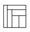


## Solution 1

**Answer:** $7.5~\mathrm{cm}$ and $12.8~\mathrm{cm}$.

Let the points where the small rectangles meet the bottom side of the square be $A, B, C, D, E$ and the points on the right side be $E, F, G, H$, in this order (see Figure 1). Let the side length of the square be $x$; then the area of the square is $x^2$. Since there are 6 small rectangles and they all have equal area, the area of each rectangle is $\frac{1}{6}x^2$. Note the following.

- The leftmost vertical rectangle has dimensions $|AB|$ and $x$. We get the equation $|AB| \cdot x = \frac{1}{6}x^2$, from which $|AB| = \frac{1}{6}x$. So $|BE| = x - \frac{1}{6}x = \frac{5}{6}x$.
- The topmost horizontal rectangle has dimensions $|GH|$ and $\frac{5}{6}x$. We get the equation $|GH| \cdot \frac{5}{6}x = \frac{1}{6}x^2$, hence $|GH| = \frac{1}{5}x$. Therefore $|EG| = x - \frac{1}{5}x = \frac{4}{5}x$.


- The second vertical rectangle from the left has dimensions $|BC|$ and $\frac{4}{5}x$.
  We get the equation $|BC| \cdot \frac{4}{5}x = \frac{1}{6}x^2$, from which
  $|BC| = \frac{5}{24}x$. Thus $|CE| = \frac{5}{6}x - \frac{5}{24}x = \frac{5}{8}x$.

- The second horizontal rectangle from the top has dimensions $|FG|$ and $\frac{5}{8}x$.
  We get the equation $|FG| \cdot \frac{5}{8}x = \frac{1}{6}x^2$, hence
  $|FG| = \frac{4}{15}x$. Therefore $|EF| = \frac{5}{8}x - \frac{4}{15}x = \frac{15}{24}x$.

- The third vertical rectangle from the left has dimensions $|CD|$ and $\frac{8}{15}x$.
  We get the equation $|CD| \cdot \frac{8}{15}x = \frac{1}{6}x^2$, from which
  $|CD| = \frac{15}{48}x = \frac{5}{16}x$.
  Therefore $|DE| = \frac{5}{8}x - \frac{5}{16}x = \frac{5}{16}x$.

Hence, the bottom right rectangle has dimensions $\frac{8}{15}x$ and $\frac{5}{16}x$. If the first dimension is $1$ cm, then $x = \frac{15}{8}$ cm and the perimeter of the square in this case is $\frac{15}{2}$ cm, i.e., $7.5$ cm. If the second dimension is $1$ cm, then $x = \frac{16}{5}$ cm and the perimeter of the square in this case is $\frac{64}{5}$ cm, i.e., $12.8$ cm.


## Solution 2

Let the points where the small rectangles meet the bottom side of the square
be $A, B, C, D, E$ and the points on the right side be $E, F, G, H$, in this order
(see Figure 1). Let the side length of the square be $x$.

If in a rectangle of dimensions $u \times v$ a strip is separated off
parallel to the side of length $u$, and the area of the strip is $\frac{1}{n}$
of the total rectangle area, then the dimensions of the strip are $u \times \frac{1}{n}v$ and the dimensions of the remaining part of the rectangle are $u \times \frac{n-1}{n}v$.
By applying this repeatedly, we obtain the following.

- Since the square is divided into $6$ rectangles of equal area,
$|AB| = \frac{1}{6}x$ and $|BE| = \frac{5}{6}x$.
- Since the part left after removing the first rectangle from the left is divided into
$5$ rectangles of equal area, $|GH| = \frac{1}{5}x$ and $|EG| = \frac{4}{5}x$.
- Since the part left after removing the first horizontal rectangle from the top is divided into $4$ rectangles of equal area, $|BC| = \frac{1}{4} \cdot \frac{5}{6}x = \frac{5}{24}x$ and $|CE| = \frac{3 \cdot 5}{24}x = \frac{15}{24}x = \frac{5}{8}x$.

- Since the part left after removing the second vertical rectangle from the left is divided into 3 equal rectangles, $|FG| = \frac{1}{3} \cdot \frac{4}{5}x = \frac{4}{15}x$ and $|EF| = \frac{2 \cdot 4}{15}x = \frac{8}{15}x$.
- Since the part left after removing the second horizontal rectangle from the top is divided into 2 equal rectangles, $|CD| = |DE| = \frac{1}{2} \cdot \frac{5}{8}x = \frac{5}{16}x$.

Thus, the dimensions of the bottom right rectangle are $\frac{8}{15}x \times \frac{5}{16}x$. If the first dimension is $1$ cm, then $x = \frac{15}{8}$ cm and the perimeter of the square in this case is $\frac{15}{2}$ cm, i.e., $7.5$ cm. If the second dimension is $1$ cm, then $x = \frac{16}{5}$ cm and the perimeter of the square in this case is $\frac{64}{5}$ cm, i.e., $12.8$ cm.

*Note.* The notation $|l|$ denotes the length of segment $l$.


# <lo-sample/> EE.LHT.2024S.9_10.3

We call a positive integer $n$ *interesting* if both the digit sum of $n$ and the digit sum of $n+1$ are perfect squares, and $n$ and $n+1$ have the same number of digits.
Find all positive integers $k$ for which there exists an interesting $k$-digit number.

## Solution 1

*(Aleksei Ganyukov)*

**Answer:** all positive integers $k \geq 10$.

Let $s(a)$ denote the sum of the digits of a positive integer $a$.
Whenever for some number $n$, the number $n+1$ does not end with a zero, then clearly $s(n+1) = s(n) + 1$.
The only consecutive perfect squares are $0$ and $1$, but $s(n) = 0$ is impossible for a positive $n$.
This contradiction shows that $n+1$ must end with a $0$, so $n$ ends with a $9$.

Let $n$ be such an interesting number that ends with exactly $m$ digits $9$. It is easy to see that $s(n) - s(n+1) = 9m - 1$.
Note that the remainder of a perfect square modulo $9$ can only be $0, 1, 4$, or $7$. Since $s(n) - s(n+1) = 9m - 1$ leaves a remainder of $8$ modulo $9$, the number $s(n)$ must leave a remainder of $0$, and $s(n+1)$ a remainder of $1$. But $s(n+1) = 1$ is impossible, because this would mean $n+1$ is of the form $10\ldots0$, which would make $n$ and $n+1$ have a different number of digits, violating the "interesting" condition. Therefore, $s(n+1) \geq 8^2 = 64$, because $8^2$ is the next perfect square that leaves remainder $1$ modulo $9$. But since $s(n) > s(n+1)$, $s(n) > 9^2 = 81$. This means that $n$ must have at least $9$ digits. Exactly $9$ digits would only be possible if $n$ were made up of all nines, but then $n+1$ would have one digit more, again violating the "interesting" condition. Thus, $n$ must have at least $10$ digits.

Now, consider the $10$-digit number $n = 7888888899$.
For this number, $m = 2$, $s(n) = 81 = 9^2$,
$s(n+1) = 81 - (9\cdot 2 - 1) = 64 = 8^2$, so this $n$ is interesting.

Note that by inserting any number of zeros between the $7$ and $8$ in $n$,
the digit sums $s(n)$ and $s(n+1)$ do not change.
Thus, for every $m \geq 10$, there exists an interesting $m$-digit number.

*Note.* Looking at remainders modulo $9$ is not strictly necessary for this solution.
Instead, one can explicitly compute the differences between the consecutive squares $2^2, 3^2, 4^2, 5^2, 6^2, 7^2, 8^2$ and check that none of them fits the form $9m-1$.


# <lo-sample/> EE.LHT.2024S.9_10.4

In the following written addition, different letters correspond to different digits, and the same letter always to the same digit; numbers may also begin with zero:

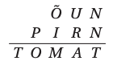

Gardener Andres has as many tomato seedlings as the largest possible sum in this addition; he wants to keep as many seedlings as the smallest possible sum. He plans to sell the rest of the plants and use the money to buy apple or pear trees, which are $10$ times more expensive than tomato seedlings. How many trees can Andres buy?

## Solution 1

*Answer:* 666.

First, note that the letter $T$ must correspond to $0$. Indeed, since in the written addition of two numbers, it's not possible to carry over more than 1 to the next digit, $T \leq 1$. But $T$ cannot be $1$, since $N + N$ would produce an even digit for $T$. Therefore, $T = 0$ and $N = 5$.

To achieve the largest possible value, we need $O = 9$, which, as the only possibility, gives $P = 8$ with a carry of $1$ from the previous place. Now we still have digits $1, 2, 3, 4, 6, 7$ unused. From previous reasoning, there is a carry from the hundreds to the thousands place, so for the greatest $M$, $\tilde{O}$ and $I$ should be $6$ and $7$ in some order. This leaves $1, 2, 3, 4$ for the other letters, and we compute $U + R + 1 \leq 3 + 4 + 1 = 8$, so there is no carry from the tens to the hundreds. Therefore $M = 3$, and taking $U$ and $R$ as $1$ and $2$ in some order, we get $A = 4$. That is, the addition must be

```
  6 1 5
+ 8 7 2 5
---------
0 9 3 4 0
```

Now, let's find the smallest possible value. Since $0$ is already used, $O \geq 1$; but for $O = 1$, we would have $P = 0$, which is already taken. Therefore, set $O = 2$, and therefore $P = 1$, with a carry of $1$ from the previous digit.

Now the unused digits are $3, 4, 6, 7, 8, 9$. Suppose there is a carry from the tens to the hundreds; that is, there are carries from the ones, tens, and hundreds digits. Since the sum involves 10 different letters, all digits must be used. However, the number 9 cannot appear in the sum, because the sum of two digits less than 9 plus any carry can't give a 9 in the sum, nor can it appear in either addend, because with carrying, corresponding digits in the second addend and the sum would have to be equal, but those positions are different letters. This contradiction shows that there is no carry from the tens to the hundreds. Therefore, $U$ and $R$ must be $3$ and $4$ in some order, as all other combinations would give $U + R + 1 \geq 10$. Thus $A = U + R + 1 = 3+4+1 = 8$ and $M \geq 6$. The case $M = 6$ is possible:

```
  9 3 5
+ 1 7 4 5
---------
0 2 6 8 0
```

So Andres wants to sell $9340 - 2680 = 6660$ tomato plants, and for this he could buy $666$ apple or pear trees.

## Solution 2

The smallest sum can also be reached without using the unsupported argument that all digits are used. As shown in solution 1, $T=0$, $N=5$, $P=1$ and $O=2$. If there were a carry from the tens to the hundreds, we would form the system

$$\begin{cases}
U+R+1 = 10 + A \\
\tilde{O} + I + 1 = 10 + M \\
\end{cases}$$

But this has no solution, since the sequence

$$2 \cdot (20 + A + M) = U + R + 1 + 10 + A + \tilde{O} + I + 1 + 10 + M = 22 + 3 + 4 + 6 + 7 + 8 + 9 = 59$$

has an even number at the beginning and an odd one at the end. This contradiction shows that there is no carry from the tens to the hundreds. From here, we continue as in solution 1.


# <lo-sample/> EE.LHT.2024S.9_10.5

Given rectangle $ABCD$. The angle bisector of $\sphericalangle CAD$ cuts the side $CD$ at point $L$. Point $M$ is the midpoint of segment $AL$. Line $DM$ intersects lines $AC$ and $AB$ at points $E$ and $F$, respectively. It is known that the lengths of segments $AE$ and $AF$ are equal. Prove that $ABCD$ is a square.

## Solution 1

Let $\sphericalangle DAL = \sphericalangle LAC = \alpha$ (see Figure 2), then

$$\sphericalangle CAB = \sphericalangle EAF = 90^\circ - 2\alpha.$$

From the condition $|AE| = |AF|$, we now obtain

$$\sphericalangle AFE = \sphericalangle FEA = \frac{180^\circ - (90^\circ - 2\alpha)}{2} = 45^\circ + \alpha,$$

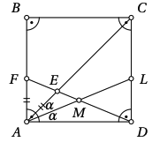

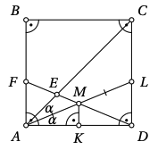

so $\sphericalangle AED = 180^\circ - (45^\circ + \alpha) = 135^\circ - \alpha$. From triangle $AEM$ we get $\sphericalangle EMA = 180^\circ - \alpha - (135^\circ - \alpha) = 45^\circ$, so $\sphericalangle AMD = 180^\circ - 45^\circ = 135^\circ$.

The altitude $MK$ from vertex $M$ of triangle $MAD$ is perpendicular to the base $AD$ (see Figure 3). Since the rectangle’s side $CD$ is also perpendicular to side $AD$, $MK$ and $CD$ are parallel. Since $M$ is the midpoint of segment $AL$, and $MK$ and $LD$ are parallel, $MK$ is the midline of triangle $ALD$. Therefore, $K$ is the midpoint of side $AD$, and thus $MK$ is the median of triangle $MAD$. Since the altitude and median from vertex $M$ of triangle $MAD$ coincide, $MAD$ is an isosceles triangle with

$$|MA| = |MD|.$$

Thus, $\alpha = \sphericalangle MDA = \frac{180^\circ - 135^\circ}{2} = 22.5^\circ$. Then $\sphericalangle DAC = 45^\circ$.

Since the diagonal of rectangle $ABCD$ bisects the angle, $ABCD$ is a square.

## Solution 2

Let $\sphericalangle MAD = \sphericalangle MAE = \alpha$. The center of the circumcircle of the right triangle $ADL$ is at the midpoint $M$ of its hypotenuse, so $|MD| = |MA|$, i.e., triangle $MAD$ is isosceles with apex angle at $A$ (see Figure 4). Thus, also $\sphericalangle MDA = \alpha$. By the exterior angle property in triangle $MAD$, we have $\sphericalangle AME = \sphericalangle MAD + \sphericalangle MDA = 2\alpha$; in triangle $MAE$ the same property gives $\sphericalangle AEF = \sphericalangle MAE = 3\alpha$.

Since $|AE| = |AF|$, triangle $AEF$ is isosceles with apex angle at $A$. Therefore, also $\sphericalangle AFE = 3\alpha$ and $\sphericalangle EAF = 180^\circ - 6\alpha$. We get the equation $2\alpha + (180^\circ - 6\alpha) = 90^\circ$, which gives $\alpha = 22.5^\circ$. Therefore, $\sphericalangle DAC = 45^\circ$, i.e., the diagonal of rectangle $ABCD$ bisects the angle, so $ABCD$ is a square.

## Solution 3

Since $|AE| = |AF|$, triangle $AEF$ is isosceles with apex angle at $A$ (see Figure 5). Let $\sphericalangle AEF = \sphericalangle AFE = \beta$. Note that triangles $MAF$ and $MLD$ are congruent by the SAS criterion. Indeed, $\sphericalangle FMA = \sphericalangle DML$ (vertical angles), $\sphericalangle MAF = \sphericalangle MLD$ (alternate interior angles), and by assumption $|MA| = |ML|$. Therefore $|AF| = |DL|$, and thus quadrilateral $ADLF$ is a rectangle. Since the diagonals of a rectangle are equal and bisect each other, $|MA| = |MF|$, so triangle $MAF$ is isosceles with apex at $M$. Thus $\sphericalangle MAF = \sphericalangle MFA = \beta$.

Since $\sphericalangle EAF = 180^\circ - 2\beta$, we have $\sphericalangle MAE = \beta - (180^\circ - 2\beta) = 3\beta - 180^\circ$. Likewise, $\sphericalangle MAD = 3\beta - 180^\circ$, since $AM$ bisects angle $DAE$. We obtain the equation

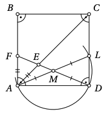

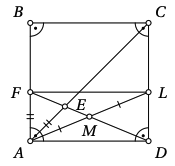

$\beta + (3\beta - 180^\circ) = 90^\circ$, from which $\beta = 67.5^\circ$. Therefore $\sphericalangle BAC = 180^\circ - 2 \cdot 67.5^\circ = 45^\circ$, i.e., the diagonal of rectangle $ABCD$ bisects the angle, so $ABCD$ is a square.

## Solution 4

Let $\sphericalangle DAL = \sphericalangle LAC = \alpha$. Then $\sphericalangle FAE = 90^\circ - 2\alpha$, and since

$$\sphericalangle AFE = \frac{180^\circ - (90^\circ - 2\alpha)}{2} = 45^\circ + \alpha,$$

as $|AE| = |AF|$. On the other hand, since $M$ is the midpoint of the hypotenuse $AL$ of the right triangle $ALD$, $|MA| = |MD|$, thus $\sphericalangle MDA = \sphericalangle MAD = \alpha$, so in the right triangle $AFD$ it holds that $\sphericalangle AFE = \sphericalangle AFD = 90^\circ - \alpha$. Therefore $45^\circ + \alpha = 90^\circ - \alpha$, i.e., $2\alpha = 45^\circ$, thus $\sphericalangle CAD = 2\alpha = 45^\circ$. Therefore $\sphericalangle ACD = 45^\circ$, so $|AD| = |CD|$, i.e., $ABCD$ is a square.

*Note.* The notation $|l|$ denotes the length of segment $l$.


# <lo-sample/> EE.LHT.2024S.9_10.6

There are $n$ cities in a kingdom. At the start, there is no road network; there are no roads at all. The king wants to improve the situation. To this end, he makes $n-1$ moves according to the following rule: on the $i$-th move, he chooses two cities whose population difference is divisible by $i$, and has a two-way direct road built between these cities. Is it possible for the king to choose the cities in such a way that, regardless of the number of residents in each city, the built road network allows travel from any city to any other city? (We assume that the number of residents in the cities does not change.)

## Solution 1

*Answer:* Yes.

Let’s modify the king's rule as follows: on the $i$-th move, he builds a direct road between two cities whose population difference is divisible by $n-i$. If, under this modified rule, the king can choose cities so that the constructed road network connects every city to every other city, then he can also do so under the original rule, since the roads can be built in reverse order.

Thus, it suffices to show that, under the modified rule, the king can choose cities so that the road network allows travel between any pair of cities. Before the first move, there are $n$ isolated cities. On the first move, he must connect two cities whose population difference is divisible by $n-1$. This means these two cities have the same remainder when their populations are divided by $n-1$. By the pigeonhole principle (Dirichlet principle), such a pair exists, since there are more cities than possible remainders. He links these two cities with a road and “removes” one of them (say, city $b$) from further consideration. Now there are $n-1$ disconnected cities, and in the next round, he must find two cities among them with equal remainders modulo $n-2$; he connects those, and yet again, one city is removed.

Continuing this process, at each step, there is always one more city than possible remainders, enabling the process to continue until only one city remains.

Let us verify that, at the end, all $n$ cities are connected. Note that at each stage, the following invariant holds: any removed city $x$ remains reachable from one of the remaining cities using the currently built roads. This is vacuously true at the beginning (no cities have been removed). Assume it is true before some move. Consider connecting cities $a$ and $b$, with $b$ being removed after the move. For any previously removed city $x$, if $x = b$, then one can reach $x$ from the still-remaining city $a$. If $x \neq b$, then it must have been removed earlier, and, by the induction, was reachable from some remaining city $c$ before this step. Now, if $c \neq b$, then $c$ is still present and nothing changes; if $c = b$, then $x$ is reachable from $a$ instead, via $b$’s new connection.

With the invariant always upheld, in the end, only one city remains, and every other (removed) city is reachable from it. Thus, every city is connected through this sole remaining city—i.e., the required road network is possible.

## Solution 2

We prove by induction on $n$ that it is always possible for the king to arrange the cities so that, after construction, it is possible to reach any city from any other. The claim is clear for $n=1$: no roads need to be built. Now consider $n > 1$ cities, assuming by induction that the claim holds for $n-1$ cities. Since there are $n$ cities but only $n-1$ possible remainders modulo $n-1$, by the pigeonhole principle there exist two cities whose populations give the same remainder modulo $n-1$. Let these be cities $a$ and $b$. Remove city $b$ from consideration. For the remaining $n-1$ cities, by induction, there is a way to build the required connected road network. Finally, connect $a$ and $b$ with a road. After this is done, one can reach every city from every other city: if the two cities do not include $b$, they were already connected; if one of them is $b$, then one can travel via $a$ (connected already in the previous step) and then to $b$ using the newly-built road. Thus, we can build the required road network for any $n$.


# <lo-sample/> EE.LHT.2024S.11_12.1

Find all pairs of natural numbers $(m,n)$ such that $m-n=96$ and $\mathrm{LCM}(m,n)=2024$.

## Solution 1

*Answer:* (184, 88).

Let $m = m'd$ and $n = n'd$, where $\gcd(m', n') = 1$. Then $(m' - n')d = m-n = 96$ and $m'n'd = \frac{mn}{d} = \frac{mn}{\gcd(m, n)} = \mathrm{LCM}(m, n) = 2024$.

Note that $\gcd(m', n', m'-n') = 1$. Indeed, suppose to the contrary that some prime $p$ divides both $m'n'$ and $m'-n'$. Then $p$ divides either $m'$ or $n'$, and also divides $m'-n'$; so $p$ must divide both $m'$ and $n'$. This contradicts the assumption that $\gcd(m', n') = 1$. Therefore,

$$\begin{align*}
d &= d \cdot 1 = \\
  &= d \cdot \gcd(m'n', m'-n') = \\
  &= \gcd(m'n'd, (m' - n')d) = \\
  &= \gcd(2024, 96) = 8.
\end{align*}$$

Now $m' - n' = \frac{m-n}{d} = \frac{96}{8} = 12$ and $m'n' = \frac{m'n'd}{d} = \frac{2024}{8} = 253$.

Substituting into the system

$$\begin{cases}
m' - n' = 12, \\
m'n' = 253
\end{cases}$$

We get from the first equation $m' = n' + 12$; plugging into the second gives the quadratic $(n')^2 + 12n' - 253 = 0$, so $n' = -6 \pm \sqrt{289} = -6 \pm 17$, i.e., $n' = -23$ or $n' = 11$. The negative solution is inadmissible; the positive solution gives $m' = 23$. So $m = 23 \cdot 8 = 184$, $n = 11 \cdot 8 = 88$.

## Solution 2

If $\mathrm{LCM}(m, n) = 2024$, then both $m$ and $n$ are divisors of $2024$.
All divisors of $2024$ are

$$1,\, 2,\, 4,\, 8,\, 11,\, 22,\, 23,\, 44,\, 46,\, 88,\, 92,\, 184,\, 253,\, 506,\, 1012,\, 2024.$$

If $m-n=96$, then $m>96$, which leaves possible values $m=184$, $m=253$, $m=506$, $m=1012$, and $m=2024$. Since the differences among the larger divisors (253, 506, ...) are clearly more than 96, it suffices to check $m=184$ and $m=253$, which give $n=88$ and $n=157$, respectively.

The number $157$ is not among the divisors of $2024$. The number $88$ is, and a check confirms that indeed $\mathrm{LCM}(184, 88)=\mathrm{LCM}(8 \cdot 23, 8 \cdot 11)=8 \cdot 23 \cdot 11=2024$.

## Solution 3

Since $\mathrm{LCM}(m, n)=2024=8\cdot253$ and $8=2^3$, at least one of $m$ or $n$ is divisible by 8. Since $m-n=96$, the other must also be divisible by 8. Both $m$ and $n$ must be divisors of $2024$. All divisors of $2024$ that are divisible by 8 are 8, 88, 184, and 2024. The only pair with difference 96 is 184 and 88.


# <lo-sample/> EE.LHT.2024S.11_12.2

According to a message received from extraterrestrial beings millions of years ahead of us in development, the heights above sea level of the two highest points on their planet are $h$ and that of the lowest point on land is $l$ (with $h \ge 0 > l$). The planet's radius (distance from sea level to the planet's center) is $r$. Express the greatest distance, according to this data, possible between two points on the planet such that one is visible from the other.

## Solution 1

*Answer:* $2\sqrt{(r+h)^2 - (r+l)^2}$ or $2\sqrt{(2r+h+l)(h-l)}$.

Note that, for the distance between two points on the planet to be maximal, the straight line joining them must be tangent to the planet; otherwise, we could move the points along the surface to make them farther apart. Let the planet's center be $O$; let the two considered points be $P_1$ and $P_2$, and the point of tangency $P_3$ (see Figure 6). Let $|OP_i| = d_i$ for each $i = 1,2,3$. Since the tangent is perpendicular to the radius at the point of tangency, $OP_1P_3$ and $OP_2P_3$ are both right triangles with hypotenuses $OP_1$ and $OP_2$ respectively. Thus,

$$|P_1P_2| = |P_1P_3| + |P_2P_3| = \sqrt{d_1^2 - d_3^2} + \sqrt{d_2^2 - d_3^2}.$$

Clearly, this expression is maximized when $d_1$ and $d_2$ are as large as possible, i.e., both $r + h$, and $d_3$ is as small as possible, i.e., $r + l$. Substituting these values, we get the desired distance as $2\sqrt{(r + h)^2 - (r + l)^2}$ or $2\sqrt{(2r + h + l)(h - l)}$.

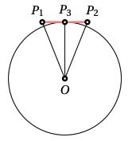

*Note 1.* The notation $|l|$ denotes the length of segment $l$.

*Note 2.* The radius of the Earth is 6371 km, the height of the highest point above sea level is 8.848 km (Mount Everest), and the height of the lowest point on land above sea level is $-0.414$ km (shore of the Dead Sea). According to this data, the **maximum possible distance between two mutually visible points on Earth** would be

$$2\sqrt{(6371 + 8.848)^2 - (6371 - 0.414)^2}$$

which is approximately 687 kilometers. Reportedly, the actual longest distance on Earth fulfilling the problem's conditions is 538 km, and the longest such distance ever photographed is $443~\mathrm{km}$.


# EE.LHT.2024S.11_12.3

A positive integer $m$ is called **regular** if the square of each prime divisor of $m$ is less than $m$.

**(A)** Prove that there exist infinitely many positive integers $n$ such that both $n$ and $n+1$ are regular.  
**(B)** Does there exist a positive integer $n$ such that $n$, $n+1$, and $n+2$ are all regular?

## Solution 1

*Answer:* **(B)** yes.

Let $a$ be such a composite number for which $a+1$ is also composite. Then $a^2$ is regular, because each of its prime divisors is also a prime divisor of $a$, and since $a$ is composite, each such prime divisor is less than $a$, so the square of any of its prime divisors is less than $a^2$. Next, let us show that $a^2-1$ is also regular. Since $a^2-1 = (a-1)(a+1)$ and $a+1$ is composite, all of the prime divisors of $a+1$ are less than $a+1$, but since the difference between $a+1$ and any of its prime divisors must also be divisible by that prime, the prime divisors of $a+1$ cannot be greater than $a-1$. Therefore, none of the prime divisors of $a^2-1$ are greater than $a-1$, so the square of any prime divisor of $a^2-1$ is not greater than $(a-1)^2$. Since $(a^2-1)-(a-1)^2 = (a+1)\big((a+1)-(a-1)\big) = 2(a-1) > 0$, the square of any prime divisor of $a^2-1$ is less than $a^2-1$, i.e., $a^2-1$ is regular. Thus, we can take $n = a^2-1$.

Since there exist arbitrarily long intervals of consecutive composite numbers, we can select two consecutive composite numbers in infinitely many ways. Thus, there are infinitely many positive integers $n$ with the required property.

We further note that, for example, in the case $a=21$, we have $a^2+1=442=2\cdot13\cdot17$, and $2^2<13^2<17^2=289<442$. Therefore, $(440, 441, 442)$ is a triple of consecutive positive integers, all of which are regular, so $n=440$ is suitable.

## Solution 2

Let us consider the Pell equation $x^2-2y^2=1$. It has the trivial solution $(x_0, y_0) = (1,0)$, and whenever $(x_{k-1}, y_{k-1})$ is a solution, $(x_k, y_k) = (3x_{k-1}+4y_{k-1}, 2x_{k-1}+3y_{k-1})$ is also a solution. Indeed,

$$\begin{align*}
x_k^2-2y_k^2 &= (3x_{k-1} + 4y_{k-1})^2 - 2(2x_{k-1} + 3y_{k-1})^2 \\
&= 9x_{k-1}^2 + 24x_{k-1}y_{k-1} + 16y_{k-1}^2 - 8x_{k-1}^2 - 24x_{k-1}y_{k-1} - 18y_{k-1}^2 \\
&= x_{k-1}^2 - 2y_{k-1}^2.
\end{align*}$$

Clearly, $x_0 < x_1 < x_2 < \ldots$ and $y_0 < y_1 < y_2 < \ldots$, so the solutions found are all distinct. Notice that $y_0$ is divisible by 3, and whenever $y_{2k}$ is divisible by 3, then $x_{2k+1}$, i.e., $3 x_{2k} + 4 y_{2k}$, is divisible by 3; and if $x_{2k+1}$ is divisible by 3, then $y_{2k+2}$, i.e., $2 x_{2k+1} + 3 y_{2k+1}$, is divisible by 3. Therefore, $x_{2k+1}$ is divisible by 3 for every natural $k$.

Let $k$ be an arbitrary positive integer. We show that we can take $n = 2 y_{2k+1}^2$, then $n+1 = 2 y_{2k+1}^2 + 1 = x_{2k+1}^2$. To show that these numbers are suitable, let $p$ be an arbitrary prime divisor of $n$. If $p > 2$, then $p$ divides $y_{2k+1}^2$, so $p$ divides $y_{2k+1}$, and thus $p \leq y_{2k+1}$. If $p = 2$, then $p = y_1 < y_{2k+1}$ from above. Thus, in any case $p^2 \leq y_{2k+1}^2 < 2 y_{2k+1}^2 = n$. Now, let $p$ be an arbitrary prime divisor of $n+1 = x_{2k+1}^2$. Then $p$ also divides $x_{2k+1}$. Previously, we showed that $x_{2k+1}$ is divisible by 3. Since $3 = x_1 < x_{2k+1}$, $x_{2k+1}$ is composite, so $p < x_{2k+1}$. Therefore $p^2 < x_{2k+1}^2 = n+1$. Consequently, both $n$ and $n+1$ are regular. This solves part (A), because the parameter $k$ can be chosen in infinitely many ways, yielding infinitely many distinct solutions.

To solve part (B), it suffices to note that if $k=1$, then $n = 2 \cdot 70^2 = 9800$ and $n+1 = 99^2 = 9801$, and $9802 = 2 \cdot 13^2 \cdot 29$. Here $2^2 < 13^2 < 29^2 = 841 < 9802$. Thus, 9800, 9801, and 9802 are three consecutive natural numbers, all of which are regular.

*Remark 1.* In fact, the Pell equation $x^2-dy^2 = 1$ can be considered for any natural number $d$ that is not a perfect square.

*Remark 2.* The smallest triple of consecutive positive integers all of which are regular is $(350, 351, 352)$. To make finding the triple $(440, 441, 442)$ in solution 1 easier, note that $4^2+1=17$, so all numbers of the form $(17k+4)^2+1$ are divisible by 17. Taking $k=1$, we get the desired triple. (With similar reasoning, one could also find a suitable triple, e.g., starting from $(-2)^2+1=5$, though more cases need to be checked. The first such triple would be $(38^2-1, 38^2, 38^2+1)$.)


# <lo-sample/> EE.LHT.2024S.11_12.4

Find all functions $f$ defined on all real numbers and taking only real values, such that for all real numbers $x$ and $y$,
$$f\left(y^{2}f(x)-f(xy)\right)=f\left(y^{2}\right)+2\left(x^{2}-f(x)\right)\left(f(y)-1\right)+1.$$

## Solution 1

*Answer:* $f(x) = x^2 + 1$.

Substituting $y=1$ into the given equation and simplifying, we get
$$f(0) = f(1) + 2\left(x^2 - f(x) \right) (f(1) - 1) + 1$$
or, equivalently,
$$2f(x)\left(f(1)-1\right) = f(1) - f(0) + 1 + 2x^2 (f(1)-1). \tag{1}$$

From this, we see that either $f(1) = 1$ or $f(x) = x^2 + \dfrac{f(1) - f(0) + 1}{2\left(f(1) - 1\right)}$ for all real $x$. If $f(1) = 1$, then from equation (1) we get $0 = 1 - f(0) + 1$, so $f(0) = 2$. Now substitute $y = 0$ into the original equation; using $f(0) = 2$, we get
$$f(-2) = 2 + 2\left(x^2 - f(x)\right) + 1,$$
which yields $f(x) = x^2 + c$ with $c = \dfrac{3 - f(-2)}{2}$. In the other case, $f(x)$ has the same form, where $c = \dfrac{f(1) - f(0) + 1}{2(f(1) - 1)}$.

Let us show that the function $f(x) = x^2 + c$ satisfies the original equation if and only if $c = 1$. Substituting $f(x) = x^2 + c$ into the original equation gives
$$\left(y^2(x^2 + c) - ((xy)^2 + c) \right)^2 + c = (y^2)^2 + c + 2\left(x^2 - (x^2 + c)\right) (y^2 + c - 1) + 1,$$
which simplifies to
$$(c^2-1)y^4 + 2c(1-c)y^2 + (3c^2-2c-1) = 0.$$

This equation must hold for all real $y$. Therefore, all coefficients of the polynomial on the left must be zero. From the coefficient of $y^4$, we get $c^2-1 = 0$, hence $c=1$ or $c=-1$. From the coefficient of $y^2$, we get $2c(1-c)=0$, hence $c=0$ or $c=1$. Altogether, the only possibility is $c=1$. In this case, the constant term is also zero. Therefore, the only function that satisfies the equation is $f(x) = x^2 + 1$.

## Solution 2

Substituting $y=0$ into the given equation and simplifying, we get
$$f(-f(0)) = f(0) + 2\left(x^2 - f(x)\right) (f(0) - 1) + 1$$
or, equivalently,
$$2f(x) (f(0) - 1) = f(0) - f(-f(0)) + 1 + 2x^2 (f(0) - 1). \tag{2}$$

From this, we see that either $f(0) = 1$ or $f(x) = x^2 + \frac{f(0) - f(-f(0)) + 1}{2(f(0) - 1)}$ for all real $x$.

Consider the case $f(0) = 1$. Substituting $x=0$ into the original equation and simplifying, we get
$$f(y^2-1) = f(y^2) - 2(f(y)-1) + 1,$$
which must hold for all real $y$. Substitute $-y$ for $y$ in this equation and after simplification we get
$$f\left(y^2-1\right) = f\left(y^2\right) - 2(f(-y)-1) + 1,$$
which also must hold for all real $y$. Thus $f(y) = f(-y)$ for each real $y$, i.e., $f$ is an even function. From equation (2), after eliminating terms with the factor $f(0) - 1$, we are left with $0 = 1 - f(-1) + 1$, i.e., $f(-1) = 2$. Now substitute $y = -1$ into the original equation; we get
$$f(f(x) - f(-x)) = f(1) + 2\left(x^2 - f(x)\right)\left(f(-1) - 1\right) + 1.$$

Taking into account that $f$ is even and $f(1) = f(-1) = 2$, we get $1 = 2 + 2\left(x^2 - f(x)\right) + 1$, i.e., $f(x) = x^2 + 1$.

Therefore, $f(x) = x^2 + c$ for all real $x$, where $c$ is a constant. We continue as in solution 1.


# <lo-sample/> EE.LHT.2024S.11_12.5

The circumcenter of an acute triangle $ABC$ is $O$. Points $D$ and $E$ are chosen on side $BC$ such that $AD$ is the altitude of triangle $ABC$ and $AE$ is the angle bisector of angle $CAD$. The angle bisectors of triangle $AOB$ meet at point $J$. Prove that triangle $JBE$ is isosceles.

## Solution 1

Let $\sphericalangle BCA = \gamma$, and let $M$ be the intersection point of lines $OJ$ and $AB$. Since $OM$ is the angle bisector from $O$ in triangle $OAB$ and $|OA| = |OB|$, then $OM \perp AB$.

Also, we have $\sphericalangle AOJ = \frac{1}{2} \sphericalangle AOB$, and by the relation between inscribed and central angles, $\frac{1}{2} \sphericalangle AOB = \sphericalangle ACB = \gamma$, noting that since triangle $ABC$ is acute, the point $O$ lies inside triangle $ABC$. Thus, $\sphericalangle AOJ = \gamma$. Since $\sphericalangle AMO = 90^\circ = \sphericalangle ADC$, triangles $AMO$ and $ADC$ are similar by AA. Thus, also $\sphericalangle MAO = \sphericalangle DAC = 90^\circ - \gamma$, and

$$\sphericalangle MAJ = \sphericalangle JAO = \sphericalangle DAE = \sphericalangle EAC = \frac{1}{2}(90^\circ - \gamma).
\tag{3}$$

Therefore, triangles $AJO$ and $AEC$ are similar by AA. From this, we get

$$\frac{|AJ|}{|AE|} = \frac{|AO|}{|AC|}.
\tag{4}$$

Now consider triangles $AJE$ and $AOC$. If the point $O$ is inside triangle $ABE$ (Figure 7), then

$$\sphericalangle JAE = \sphericalangle JAO + \sphericalangle OAE = \sphericalangle EAC + \sphericalangle OAE = \sphericalangle OAC.$$

Otherwise (Figure 8), analogously, we get

$$\sphericalangle JAE = \sphericalangle JAO - \sphericalangle OAE = \sphericalangle EAC - \sphericalangle OAE = \sphericalangle OAC.$$

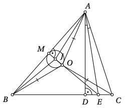

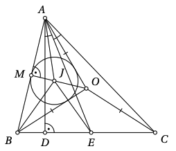

Therefore, in any case, $\sphericalangle JAE = \sphericalangle OAC$. Considering also equation (4), we see that triangles $AJE$ and $AOC$ are similar by SAS. Since $|OA| = |OC|$, it follows $|JA| = |JE|$. By symmetry in the isosceles triangle $AOB$, we have $|JA| = |JB|$. Thus, we have proved that $|JB| = |JE|$, so triangle $JBE$ is isosceles.

*Remark 1.* Once the similarity of triangles $AJO$ and $AEC$ is established, the similarity of triangles $AJE$ and $AOC$ can be proved more briefly by using properties of spiral similarity. Namely, from the first similarity it follows that there is a spiral similarity with center $A$ that maps segment $JO$ to $EC$. Therefore, there is a spiral similarity that maps segment $JE$ to $OC$, and thus triangles $AJE$ and $AOC$ are similar.

## Solution 2

Let $\sphericalangle CAB = \alpha$, $\sphericalangle ABC = \beta$, and $\sphericalangle BCA = \gamma$. Let us first prove equations (3) as in solution 1. Next, let $F$ be the intersection point of lines $OJ$ and $BC$, and $X$ be the intersection point of lines $AJ$ and $BC$ (Figures 9 and 10 depict different configurations for the order of points $E$ and $F$). We show that points $A, J, E, F$ are concyclic. From equations (3) we get

$$\begin{align*}
\sphericalangle JAE &= \sphericalangle BAC - \sphericalangle BAJ - \sphericalangle EAC \\
           &= \alpha - \frac{1}{2}(90^\circ - \gamma) - \frac{1}{2}(90^\circ - \gamma) \\
           &= \alpha - (90^\circ - \gamma) \\
           &= \alpha + \gamma - 90^\circ \\
           &= 180^\circ - \beta - 90^\circ \\
           &= 90^\circ - \beta.
\end{align*}$$

Since $|OA| = |OB|$, line $OJ$ is the perpendicular bisector of $AB$. Therefore,

$$\sphericalangle XFJ = \sphericalangle BFJ = 90^\circ - \sphericalangle ABF = 90^\circ - \beta.$$

So $\sphericalangle XAE = \sphericalangle JAE = 90^\circ - \beta = \sphericalangle XFJ$, hence points $A, J, E, F$ are concyclic.

Thus $\sphericalangle JEA = \sphericalangle JFA = \sphericalangle JFB = \sphericalangle JFX = \sphericalangle XAE = \sphericalangle JAE$, so $|JA| = |JE|$. As $J$ lies on the perpendicular bisector of segment $AB$, $|JA| = |JB|$. So $|JB| = |JE|$, proving that triangle $JBE$ is isosceles.

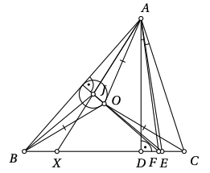

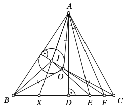

## Solution 3

We use the well-known fact that, in a triangle, the lines from the vertex to the orthocenter and to the circumcenter are symmetric with respect to the angle bisector at that vertex. Therefore, the altitude and the radius from the vertex cut off equal angles with the sides at that vertex.

Since $AD$ and $AO$ are, respectively, the altitude and the circumradius from vertex $A$ of triangle $ABC$, by the above fact, $\sphericalangle BAO = \sphericalangle CAD$. By hypothesis, $AE$ is the angle bisector of $\sphericalangle CAD$, and $J$ is the intersection point of the angle bisectors of triangle $ABO$; therefore,

$$\sphericalangle BAJ = \frac{1}{2} \sphericalangle BAO = \frac{1}{2} \sphericalangle CAD = \sphericalangle EAD.$$

Therefore, lines $AJ$ and $AD$ make equal angles with the sides of triangle $ABE$ at vertex $A$ (i.e., are symmetric with respect to the angle bisector at $A$ of triangle $ABE$). Moreover, $AD$ is the altitude in triangle $ABE$, so the same fact shows that line $AJ$ passes through the circumcenter of triangle $ABE$. More precisely, the circumcenter of triangle $ABE$ is the intersection of the perpendicular bisector of $AB$ and the line $AJ$. Since $|OA| = |OB|$, the angle bisector from $O$ in triangle $AOB$ coincides with the perpendicular bisector of $AB$. Thus, the circumcenter of $ABE$ is the intersection point $J$ of lines $AJ$ and $OJ$. Therefore $|JB| = |JE|$, and so $JBE$ is isosceles.

*Remark 2:* The fact used in Solution 3 can be proved directly by angle chasing, and is essentially established at the beginning of Solution 1 for triangle $ABC$ and vertex $A$.

## Solution 4

Since $|OA| = |OB|$, the angle bisector from $O$ in triangle $OAB$ coincides with the perpendicular bisector of $AB$. Thus, point $J$ lies on the perpendicular bisector of $AB$, so points $A$ and $B$ lie on some circle $\omega$ with center $J$.

Let us show that $\sphericalangle AJB = 2\sphericalangle AEB$. Indeed,

$$\begin{align*}
\sphericalangle AEB &= \sphericalangle AED = 90^\circ - \sphericalangle EAD \\
          &= 90^\circ - \frac{\sphericalangle CAD}{2} \\
          &= 90^\circ - 90^\circ - \frac{\sphericalangle ACD}{2} \\
          &= 45^\circ + \frac{\sphericalangle ACD}{2}
\end{align*}$$

and since $|JA| = |JB|$ implies $\sphericalangle JAB = \sphericalangle JBA$, we get

$$\begin{align*}
\sphericalangle AJB &= 180^\circ - 2\sphericalangle JAB = 180^\circ - \sphericalangle OAB \\
           &= 180^\circ - \frac{180^\circ - \sphericalangle AOB}{2} \\
           &= 90^\circ + \frac{\sphericalangle AOB}{2} \\
           &= 90^\circ + \sphericalangle ACB = 2\sphericalangle AEB.
\end{align*}$$

By the relation between central and inscribed angles, the point $E$ also lies on circle $\omega$. Thus, $J$ is the circumcenter of triangle $ABE$. Therefore $|JB| = |JE|$, so triangle $JBE$ is isosceles.

*Note 3:* The notation $|l|$ denotes the length of the segment $l$.


# <lo-sample/> EE.LHT.2024S.11_12.6

Gardener Andres wants to plant one currant bush in each unit square of his garden plot, which has dimensions $24 \times 2024$. He wants to plant as many blackcurrant bushes as possible, but with the condition that there must be at least one redcurrant and at least one whitecurrant bush somewhere on the plot. Additionally, he wants that, for every unit square with a blackcurrant bush, the adjacent unit squares (sharing a side) must contain an equal number of whitecurrant and redcurrant bushes (it may also be both $0$). Find the maximum number of blackcurrant bushes Andres can plant.

## Solution 1

*Answer:* $46632$.

Let's show that $46632$ blackcurrant bushes is possible. Starting from the top left square, plant redcurrant and whitecurrant bushes alternately along diagonals; when you reach the edge, skip one column and go back along a diagonal in the opposite direction, etc.; place blackcurrant bushes on all remaining empty squares (figure **11** shows the beginning of the garden plot).

Thus, blocks of $24$ columns alternate, where in each column there is exactly one currant bush of the other color, with single columns in between that consist only of blackcurrant bushes. Since $2024 = 80 \times 25 + 24$, the last diagonal consisting of currant bushes of other colors ends exactly at the bottom right corner of the garden plot (so there is no final column consisting only of blackcurrants). For each square adjacent to a diagonal of other colored currants, and likewise for the boundary squares of the intervening column, there is exactly one redcurrant and one whitecurrant neighbor. All other currant bushes have only blackcurrant neighbors. In total, the garden contains $2024 \cdot 24 - 81 - 24$, i.e., $46632$ blackcurrant bushes.

Now let's show that there cannot be more blackcurrant bushes. Let's consider an arbitrary arrangement that meets the conditions. The garden has $24$ rows and $2024$ columns.

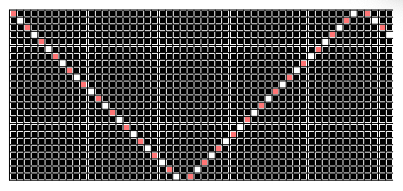

If the garden contains a column with only blackcurrant bushes, then there must also exist two consecutive columns, one containing other colored currant bushes, and the other not. Then, for a blackcurrant bush in the second column that is adjacent in the first column to a bush of a different color, its other neighboring square must also contain a different colored currant bush (figure 12). Therefore, there cannot be two adjacent columns containing only blackcurrant bushes, nor can the first or last column of the garden be a column of only blackcurrants.

Now consider a block of $m$ consecutive columns, each containing at least one bush of a different color, and such that you cannot add another such column on either side. We will show that if $m < 24$, then this block must contain at least $m+1$ bushes of other colors. Consider two cases.

* If there is a row that, in this block, contains only blackcurrant bushes, then there must exist two consecutive rows, one containing a bush of another color in this block, and one that does not. Similarly to before, for a blackcurrant bush in the second row adjacent to a bush of another color in the first row, its other neighboring square must also contain a bush of another color. Thus, in its column, there are two bushes of other colors. Since every column in the block contains at least one bush of another color, altogether the block contains at least $m+1$ bushes of other colors.
  
* If there is no row that, in this block, contains only blackcurrant bushes, then every row in the block contains at least one bush of another color. Thus, there are at least $24$ bushes of other colors in the block. Since $m < 24$, in this case too, the block contains at least $m+1$ bushes of other colors.


Now, let's add at the beginning of the garden one extra column composed only of blackcurrant bushes; by the previous argument, this does not create two consecutive columns consisting only of blackcurrants. (We do not apply the problem's condition to the added column; it is introduced merely for convenience in reasoning.) Now consider dividing the garden into blocks, each starting with a column of only blackcurrants and ending with the last column before the next such column (or with the last column of the entire garden, if the first column of the block was the last such column). By construction, in a block of $m$ columns there are at least $m-1$ bushes of other colors; if $m < 25$, as shown above, there are at least $m$ bushes of other colors in the block. Since $\frac{2025}{25} = 81$, there can be at most $81$ blocks in which the number of bushes of other colors is $1$ less than the number of columns. Therefore, in total, the garden contains at least $2025 - 81$ bushes of other colors, and thus at most $2024 \cdot 24 - (2025 - 81)$, i.e., $46632$ blackcurrant bushes.