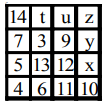
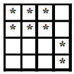
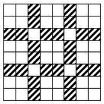
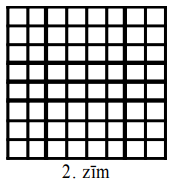
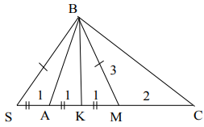
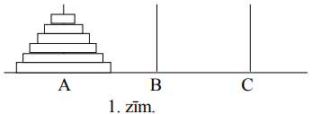
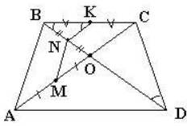
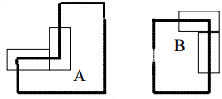

# <lo-sample/> LV.AMO.2005.5.1

Kvadrāts sastāv no $4 \times 4$ vienādām kvadrātiskām rūtiņām. Katrā rūtiņā 
ierakstīts naturāls skaitlis no $1$ līdz $16$ (visi skaitļi dažādi). Skaitļu 
summas rindiņās, kolonnās un abās diagonālēs ir $10$ pēc kārtas sekojoši 
naturāli skaitļi.

Daļa ierakstīto skaitļu parādīti 1.zīm. Kāds skaitlis ierakstīts rūtiņā, kurā 
ir jautājuma zīme?

<small>

* questionType:
* domain:

</small>

## Atrisinājums

Kreisajā summa ir $30$, aizpildītajā diagonālē tā ir $39$. Tātad apskatāmās 
summas ir no $30$ līdz $39$. Vēl jāieraksta skaitļi $1;\ 2;\ 8;\ 15;\ 16$. 
Skaidrs, ka $t$ un $y$ var būt tikai $15$ vai $16$; tad $z=8$. Tad nevar būt 
$y=15$. Tāpēc $y=16,\ t=15$ un tabulu var aizpildīt arī tālāk: $u=1,\ x=2$.

# <lo-sample/> LV.AMO.2005.5.2

Uz galda atrodas $7$ pēc ārējā izskata vienādas monētas. Ir zināms, ka $6$ no 
tām masas ir vienādas, bet septītajai masa **varbūt** ir citāda. Kā ar $2$ 
svēršanām uz sviras svariem bez atsvariem noskaidrot, vai atšķirīgā monēta ir 
un, ja tā ir, tad vai tā vieglāka vai smagāka par citām?

<small>

* questionType:
* domain:

</small>

## Atrisinājums

Ar pirmo svēršanu salīdzinām $A$, $B$ pret $C$, $D$. Ja svari **nav** 
līdzsvarā, tad pašreiz uz tiem ir atšķirīgā monēta. Ar otro svēršanu salīdzinām
$A,\ B$ pret $E,\ F$ ($E,\ F$ ir "īstās"). Ja ir līdzsvars, tad atšķirīgās 
monētas attiecības ar īstajām noskaidro no $1.$ svēršanas rezultātiem 
(atšķirīgā ir viena no $C,\ D$). Ja nav līdzsvars, tad atšķirīgā ir viena no 
$A,\ B$; gan $1.$, gan $2.$ svēršana rāda, vai tā ir smagāka vai vieglāka par 
īsto.

Ja pirmajā svēršanā ir līdzsvars, tad otrajā svēršanā salīdzinām $A,\ B,\ C$ 
(tās visas ir "īstās") ar $E,\ F,\ G$. Ja atkal ir līdzsvars, tad atšķirīgās 
monētas nav. Ja nav līdzsvara, tad vajadzīgo uzzinām no otrās svēršanas 
(atšķirīgā monēta ir $E,\ F$ vai $G$).

# <lo-sample/> LV.AMO.2005.5.3

Kvadrātiska tabula sastāv no **(A)** $5 \times 5$, **(B)** $4 \times 4$ 
vienādām kvadrātiskām rūtiņām. Vai var dažās rūtiņās ierakstīt pa vienai 
zvaigznītei tā, lai katrā kolonnā būtu pāra skaits zvaigznīšu, bet katrā 
rindiņā - nepāra skaits zvaigznīšu?

<small>

* questionType:
* domain:

</small>

## Atrisinājums

**(A)** nē, nav iespējams. Ja tāda tabula pastāvētu, tad kopējais zvaigznīšu 
skaits tajā, skaitot pa kolonnām, būtu pāra skaitlis, bet, skaitot, pa 
rindiņām - nepāra skaitlis.

**(B)** jā, ir iespējams. Skat. zīm.

# <lo-sample/> LV.AMO.2005.5.4

Ir $2005$ zelta gabali. Pierādīt, ka divus no tiem var katru sadalīt divos 
gabalos tā, lai pēc tam visus $2007$ gabalus varētu sadalīt $4$ kaudzēs 
$A,\ B,\ C,\ D$ ar īpašību: kaudze $A$ ir tikpat vērtīga, cik kaudze $B$, bet 
kaudze $C$ ir tikpat vērtīga, cik kaudze $D$. (Kaudzes vērtību nosaka tikai 
kopējais zelta daudzums tajā.)

<small>

* questionType:
* domain:

</small>

## Atrisinājums

Vienu sākotnējo gabalu sadala divos vienādos; tās būs kaudzes $A$ un $B$. 
Pārējos gabalus noliek rindā un rindu sadala divās daļās tā, lai šajās daļās 
būtu vienādi zelta daudzumi. Tās ir kaudzes $C$ un $D$.

Ja, veidojot kaudzes $C$ un $D$, nācās sadalīt vienu gabalu divos, visi 
uzdevuma nosacījumi izpildīti. Ja nē (dalījuma līnija iet **starp** zelta 
gabaliem), sadalām divos gabalos jebkuru vienu gabalu, atstājot iegūtās daļas 
tai pašā kaudzē.

# <lo-sample/> LV.AMO.2005.5.5

No kvadrāta, kas sastāv no $8 \times 8$ rūtiņām, izgrieza $12$ gabalus ar formu
. Vai no atlikušās daļas noteikti var izgriezt gabalu
ar formu ?

<small>

* questionType:
* domain:

</small>

## Atrisinājums

Nē, ne noteikti. Skat. Zīm.

# <lo-sample/> LV.AMO.2005.6.1

Kurš no skaitļiem $200420042004 \times 20052005$ un 
$200520052005 \times 20042004$ ir lielāks?

<small>

* questionType:
* domain:

</small>

## Atrisinājums

Abi skaitļi ir vienādi ar $2004 \cdot 2005 \cdot 10001 \cdot 100010001$.

# <lo-sample/> LV.AMO.2005.6.2

Vairākās kaudzītēs kopā ir $78$ sērkociņi; nevienā kaudzītē nav ne mazāk par 
$1$, ne vairāk par $14$ sērkociņiem.

Pierādīt: ir vai nu divas kaudzītes, kurās ir vienāds sērkociņu skaits, vai arī
divas kaudzītes, kurās kopā ir tieši $15$ sērkociņu.

<small>

* questionType:
* domain:

</small>

## Atrisinājums

Pieņemam pretējo tam, kas jāpierāda. Tad no katra skaitļu pāra 
$(1;\ 14),\ (2;\ 13),\ (3;\ 12),\ (4;\ 11),\ (5;\ 10),\ (6;\ 9),\ (7;\ 8)$ 
augstākais viens var būt sērkociņu skaits kādā kaudzītē. Tāpēc sērkociņu nav 
vairāk par $8+9+10+11+12+13+14=77$ - pretruna.

# <lo-sample/> LV.AMO.2005.6.3

Doti $4$ atsvari. Katram no tiem masa ir $10~\mathrm{g}$ vai $11~\mathrm{g}$. 
Doti arī svari, kas rāda uz tiem uzlikto atsvaru kopējo masu. Vai ar $3$ 
svēršanām var noteikt katra atsvara masu?

<small>

* questionType:
* domain:

</small>

## Atrisinājums

Sveram $A+B$. Ja $A+B=20$ vai $A+B=22$, $A$ un $B$ masas jau zināmas. Tālāk ar 
$2$ svēršanām atrodam atsevišķi $C$ un $D$.

Ja $A+B=21$, sveram $A+C$. Gadījumus $A+C=20$ un $A+C=22$ analizē kā iepriekš.

Ja $A+C=21$, tad no $A+B=A+C$ seko $\mathbf{B=C}$. Trešajā reizē sveram 
$B+C+D$. Ievērosim, ka $B+C$ - pāra skaitlis ($20$ vai $22$). Iegūstam tabulu:

| $\mathbf{B}+\mathbf{C}+\mathbf{D}$ | $\mathbf{B}+\mathbf{C}$ | $\mathbf{D}$ | $\mathbf{B}$ | $\mathbf{C}$ | $\mathbf{A}$ |
| :---: | :---: | :---: | :---: | :---: | :---: |
| $30$ | $20$ | $10$ | $10$ | $10$ | $11$ |
| $31$ | $20$ | $11$ | $10$ | $10$ | $11$ |
| $32$ | $22$ | $10$ | $11$ | $11$ | $10$ |
| $33$ | $22$ | $11$ | $11$ | $11$ | $10$ |

# <lo-sample/> LV.AMO.2005.6.4

Katra no monētām sver $5~\mathrm{g}$ vai $6~\mathrm{g}$, to kopējā masa ir 
$600~\mathrm{g}$. Pierādīt, ka monētas var sadalīt $10$ kaudzēs, kuru masas 
visas vienādas savā starpā.

<small>

* questionType:
* domain:

</small>

## Atrisinājums

To monētu kopējam svaram gramos, kuras katra sver $5~\mathrm{g}$, jādalās ar 
$6$. Tāpēc to skaitam jādalās ar $6$, un tās var apvienot kaudzītēs pa $6$, kas
katra sver $30~\mathrm{g}$. Līdzīgi iegūstam, ka $6~\mathrm{g}$ smagās monētas 
var apvienot kaudzītēs pa $5$, kas katra sver $30~\mathrm{g}$. Kaudzīšu pavisam
ir $600~\mathrm{g}:30~\mathrm{g}=20$. Apvienojot tās $10$ pāros, iegūstam $10$ 
kaudzes, kas katra sver $60~\mathrm{g}$.

# <lo-sample/> LV.AMO.2005.6.5

Režģis ar izmēriem $8 \times 8$ rūtiņas salikts no stienīšiem, kuru garumi ir 
naturāli skaitļi (rūtiņas malas garums ir $1$, skat. 2.zīm.). Stienīši savā 
starpā nekrustojas. Kāds ir mazākais iespējamais tādu stienīšu daudzums, kuru 
garums ir $1$?

<small>

* questionType:
* domain:

</small>

## Atrisinājums

**Atbilde:** $14$.

**(A)** Piemēru ar $14$ "vienības stienīšiem" skat. zīmējumā.

**(B)** Apskatīsim melnās rūtiņas, kas atrodas pie kvadrāta malām, ja kvadrāts 
izkrāsots šaha galdiņa kārtībā. Tādu rūtiņu ir $14$, un nekādām divām no tām 
nav kopīgas malas. Ja pierādīsim, ka katru malējo rūtiņu norobežo vismaz viens 
vienības nogrieznis, tad būs pierādīts, ka vienības nogriežņu jābūt vismaz 
$14$.

Šķirojam divus gadījumus:

**(B1)** Skaidrs, ka melnai stūra rūtiņai stienīši, kas veido tās malas $e$ un 
$f$, abi vienlaicīgi nevar būt garāki par $1$.

**(B2)** Ja malas $x$ un $y$ veido stienīši, kas garāki par $1$, tad malu $z$ 
noteikti veido vienības stienītis.

# <lo-sample/> LV.AMO.2005.7.1

Trijstūrī $ABC$ punkti $K$ un $M$ atrodas uz malas $AC$, pie tam $M$ ir $AC$ 
viduspunkts. Ir zināms, ka $BM=3,\ AK=1,\ MC=2$ un 
$\sphericalangle BMC=120^{\circ}$.

Pierādīt, ka $AB=BK$.

<small>

* questionType:
* domain:

</small>

## Atrisinājums

Atliekam uz taisnes $AC$ nogriezni $AS=1$; tad $MS=3=MB$. Tā ka 
$\sphericalangle AMB=180^{\circ}-120^{\circ}=60^{\circ}$, tad $\Delta SMB$ ir 
vienādsānu ar virsotnes leņķi $60^{\circ}$, tātad vienādmalu. Tāpēc $BS=BM$. Tā
kā $SA=1=MK$ un $\sphericalangle BSA=\sphericalangle BMK$, tad 
$\triangle BSA=\triangle BMK$, no kā seko vajadzīgais.

# <lo-sample/> LV.AMO.2005.7.2

Kādam mazākajam naturālajam $n$ visas daļas 
$\frac{5}{n+7},\ \frac{6}{n+8},\ \frac{7}{n+9},\ \ldots,\ \frac{35}{n+37},\ \frac{36}{n+38}$
ir nesaīsināmas?

<small>

* questionType:
* domain:

</small>

## Atrisinājums

Uzrakstām daļas kā 
$\frac{5}{(n+2)+5},\ \frac{6}{(n+2)+6},\ \ldots,\ \frac{36}{(n+2)+36}$. Daļas 
visas būs nesaīsināmas tad un tikai tad, ja $n+2$ nevarēs saīsināt ne ar vienu 
no skaitļiem $5;\ 6;\ \ldots;\ 36$. Acīmredzot mazākais tāds $n+2$ ir $37$, 
tāpēc $n=35$.

# <lo-sample/> LV.AMO.2005.7.3

Pankūka no katras puses jācep $6$ minūtes (varbūt ar pārtraukumiem). Uz pannas 
vienlaicīgi var atrasties augstākais $4$ pankūkas. Kādā īsākajā laikā var no 
abām pusēm apcept $5$ pankūkas?

Pankūku nomaiņai laiks nav jāparedz.

<small>

* questionType:
* domain:

</small>

## Atrisinājums

Piecām pankūkām ir $10$ apcepamas virsmas, tātad jāpatērē $10 \cdot 6=60$ 
"virsmminūtes". Tā kā augstākais četras "virsmminūtes" var tikt izmantotas 
vienlaicīgi, tad vajag vismaz $60:4=15$ minūtes. Ar $15$ minūtēm uzdevumu var 
veikt, kā redzams tabulā (rūtiņās ierakstīti pankūku kārtas numuri):

$\underline{Piezīme:}$ veidojot šādu tabulu, jāseko, lai katrā kolonnā visi 
skaitļi būtu dažādi, jo vienu pankūku nevar reizē apcept no abām pusēm.

# <lo-sample/> LV.AMO.2005.7.4

Triju veselu pozitīvu skaitļu summa ir $407$. Ar kādu lielāko daudzumu nuļļu 
var beigties šo skaitļu reizinājums?

<small>

* topic:DivisibilityRulesLastDigits
* topic:ModularArithmetic
* concepts:decimal-notation
* questionType:FindOptimal
* domain:NT
* seeAlso:LT.VILNIUS.2008.12.1

</small>

## Atrisinājums

**Atbilde:** ar $6$ nullēm.

Piemērs $407=250+125+32$ parāda, ka $6$ nulles var būt. Tiešām, 
$250 \cdot 125 \cdot 32=2 \cdot 5^{3} \cdot 5^{3} \cdot 2^{5}=1000000$.

Parādīsim, ka vairāk par $6$ nullēm nevar būt. Visi saskaitāmie ir mazāki par 
$5^{4}=625$; tātad augstākā piecinieka pakāpe, ar kādu tie var dalīties, ir 
$5^{3}$. Turklāt vismaz viens saskaitāmais ar $5$ nedalās, jo visu saskaitāmo 
summa nedalās ar $5$. Tāpēc visi $3$ saskaitāmie kopā satur ne vairāk kā 
$3+3=\mathbf{6}$ pirmreizinātājus $5$. Tāpēc arī vairāk par $6$ nullēm nevar 
būt.

## Atrisinājums 

Pamatosim, ka vēl vairāk nuļļu dabūt nevar dabūt.
Divi saskaitāmie nevar beigties ar "5", jo atlikušajam tad jābeidzas ar "7". 
Tātad vismaz viens saskaitāmais beigsies ar nulli. 

Vairāk kā sešus $5$-pirmreizinātājus nevar iegūt 
($125=5^3$ un $250=5^3\cdot{}2$ ir optimāli).

# <lo-sample/> LV.AMO.2005.7.5

Rindā izrakstīti $10$ dažādi skaitļi, kas visi lielāki par $0$ un mazāki par 
$1$. To skaitļu summa, kas atrodas $2.,\ 4.,\ 6.,\ 8.,\ 10.$ vietās, par $1$ 
lielāka nekā to skaitļu summa, kas atrodas $1.,\ 3.,\ 5.,\ 7.,\ 9.$ vietās.

Pierādiet: rindā var atrast tādu skaitli, kas mazāks par abiem saviem 
kaimiņiem.

<small>

* questionType:
* domain:

</small>

## Atrisinājums

Pieņemsim pretējo tam, kas jāpierāda.

Tātad katram skaitlim, izņemot $A_{1}$ un $B_{5}$, eksistē tāds kaimiņš, kurš 
ir mazāks par šo skaitli. Atradīsim pa **vienam** tādam kaimiņam skaitļiem 
$A_{2},\ A_{3},\ A_{4},\ A_{5}$. Atrastie kaimiņi visi ir dažādi (citādi šis 
kaimiņš, kas atrasts divreiz, būtu mazāks par abiem $A_{i}$, kuriem viņš 
atrasts, bet mēs pieņēmām, ka šāda skaitļa nav).

Tāpēc $A_{2}+A_{3}+A_{4}+A_{5}>K_{1}+K_{2}+K_{3}+K_{4}$, kur 
$K_{1},\ K_{2},\ K_{3},\ K_{4}$ ir **četri** no skaitļiem 
$B_{1},\ B_{2},\ B_{3},\ B_{4},\ B_{5}$. Ja $B_{i}$ ir tas no skaitļiem 
$B_{1},\ \ldots,\ B_{5}$, kas nav neviens no izvēlētajiem kaimiņiem, tad 
$A_{1}+1>B_{i}$, jo gan $A_{1}$, gan $B_{i}$ atrodas intervālā $(0;\ 1)$. 
Saskaitot abas "ierāmētās" nevienādības, iegūstam 
$\left(A_{1}+\ldots+A_{5}\right)+1>\left(B_{1}+\ldots+B_{5}\right)$, no 
kurienes seko 
$\left(B_{1}+\ldots+B_{5}\right)-\left(A_{1}+\ldots+A_{5}\right)<1$ - pretruna 
ar doto.

# <lo-sample/> LV.AMO.2005.8.1

Dots, ka kvadrātvienādojuma $x^{2}+px+q=0$ saknes ir $x_{1}$ un $x_{2}$, bet 
kvadrātvienādojuma $x^{2}+ax+b=0$ saknes ir $x_{1}^{2}$ un $x_{2}^{2}$. Izsacīt
$a$ un $b$ ar $p$ un $q$ palīdzību.

<small>

* questionType:
* domain:

</small>

## Atrisinājums

No Vjeta teorēmas 
$b=x_{1}^{2} \cdot x_{2}^{2}=\left(x_{1}x_{2}\right)^{2}=q^{2}$, bet 
$a=-\left(x_{1}^{2}+x_{2}^{2}\right)=2x_{1}x_{2}-\left(x_{1}+x_{2}\right)^{2}=2q-p^{2}$

# <lo-sample/> LV.AMO.2005.8.2

Par Fibonači skaitļiem sauc skaitļus $1;\ 2;\ 3;\ 5;\ 8;\ 13;\ 21;\ \ldots$ 
(katru nākamo skaitli šajā virknē iegūst, saskaitot divus iepriekšējos).

Vai var pastāvēt vienādība $a+b=c+d$, ja $a,\ b,\ c,\ d$ ir dažādi Fibonači 
skaitļi?

<small>

* questionType:
* domain:

</small>

## Atrisinājums

Pieņemsim, ka $d$ - lielākais no šiem skaitļiem. Apzīmēsim ar $x$ un $y$ tos 
Fibonači skaitļus, kuru summa ir $d:x+y=d$. Skaidrs, ka $a+b \leq x+y$, jo 
Fibonači skaitļu virkne ir augoša. Tātad $a+b \leq d$ un $a+b<c+d$, jo $c>0$.

# <lo-sample/> LV.AMO.2005.8.3

Kā var sadalīt naturālos skaitļus no $1$ līdz $9$ ieskaitot divās daļās tā, lai
vienas daļas visu skaitļu summa būtu vienāda ar otras daļas visu skaitļu 
reizinājumu?

<small>

* topic:TreeTraversalBacktracking
* concepts:partition
* subdomain:DOM_NumericSets
* questionType:FindExample
* domain:Alg
* method:MTH_ExhaustiveAlgorithms

</small>

## Atrisinājums-1

Ievērojam, ka $1+2+\ldots+9=45$. Skaidrs, ka neviens skaitlis pats par sevi nav
pārējo summa, jo pat lielākais no tiem - skaitlis $9$ - mazāks par pārējo $8$ 
summu. Pieņemsim, ka ir divi skaitļi $x$ un $y$, kuru reizinājums vienāds ar 
pārējo summu. Tad $x+y+xy=45$, no kurienes iegūstam $(1+x)(1+y)=46=2 \cdot 23$.
Tā kā $1+x>1$ un $1+y>1$, tad vai nu $1+x=23$, vai $1+y=23$, bet tas nevar būt.
Ja triju skaitļu $x,\ y,\ z$ reizinājums vienāds ar pārējo summu $(x<y<z)$, tad
$x+y+z+xyz=45$. Ir vairākas iespējas:

1. $x=1$; tad $y+z+yz=44,(1+y)(1+z)=45$, no kurienes $1+y=5,1+z=9,\ y=4,\ y=8$ 
   (citos variantos $y$ vai $z$ iznāk pārāk lieli).
2. $x=2$; tad iegūstam $y+z+2yz=43$, no kurienes $(2y+1)(2z+1)=87=3 \cdot 29$ 
   (atrisinājuma nav).
3. $x \geq 3$; tad $xyz \geq 3 \cdot 4 \cdot 5=6045$ - tā nevar būt.

Līdzīgi no $x+y+z+t+xyzt=45,\ x<y<z<t$, iegūstam variantus

1. $x=1;\ y=2$, no kurienes $2zt+z+t=42$, $(2z+1)(2t+1)=85=5 \cdot 17$ un 
   $z=2$ - pretruna.
2. ja $x \neq 1$ vai $y \neq 2$, tad 
   $xyzt \geq 1 \cdot 3 \cdot 4 \cdot 5=60>45$ - pretruna.

Piecu skaitļu reizinājums nav mazāks par 
$1 \cdot 2 \cdot 3 \cdot 4 \cdot 5=120$ - pretruna.

Tātad vienīgā atbilde ir $\{1;\ 4;\ 8\}$ un $\{2;\ 3;\ 5;\ 6;\ 7;\ 9\}$.

## Atrisinājums-2

Summa $1 + 2 + 3 + \ldots + 9 = 45$; šo varēs izmantot skaitļu noteikšanai.

Pieņemsim, ka otrajā daļā tiek reizināti 
tieši trīs skaitļi $a,b,c$.
Var izvēlēties $abc=32$ un tad $a+b+c=45-32=13$ (jo visu pārējo 
skaitļu summai jābūt vienādai ar $32$). 

$$\left\{ \begin{array}{ll}
abc & = 32 \\
a + b + c & = 13 \\
\end{array} \right.$$

Šai sistēmai ir atrisinājums $(a,b,c)=(1,4,8)$.

# <lo-sample/> LV.AMO.2005.8.4

Trijstūrī $ABC$ pastāv sakarības $AC=BC$ un $\sphericalangle ACB=20^{\circ}$. 
Leņķa $CAB$ bisektrise un malas $AC$ vidusperpendikuls krustojas punktā $M$. 
Aprēķināt

**(A)** $\sphericalangle MCB$, **(B)** $\sphericalangle MBC$.

<small>

* questionType:
* domain:

</small>

## Atrisinājums

Skaidrs, ka $\sphericalangle CAB=\sphericalangle CBA=80^{\circ}$ un 
$\sphericalangle CAM=\sphericalangle BAM=40^{\circ}$. Tā kā $AM=CM$ ($M$ uz 
$AC$ vidusperpendikula), tad $\triangle AMC$ - vienādsānu. Tāpēc 
$\sphericalangle ACM=\sphericalangle CAM=40^{\circ}$; no šejienes 
$\sphericalangle \mathbf{MCB}=\mathbf{40}^{\mathbf{\circ}}-\mathbf{20}^{\mathbf{\circ}}=\mathbf{20}^{\mathbf{\circ}}$.

Novelkam $BY \perp AD$. Tā kā $\triangle YAB$ bisektrise ir arī augstums, tad 
$\triangle YAB$ - vienādsānu, $AY=AB$. Tāpēc 
$\triangle AYD=\triangle ABD\ (m \ell m)$. Tā kā 
$\sphericalangle ADB=180^{\circ}-40^{\circ}-80^{\circ}=60^{\circ}$, tad arī 
$\sphericalangle YDA=60^{\circ}$ un 
$\sphericalangle YDC=180^{\circ}-60^{\circ}-60^{\circ}=60^{\circ}$; arī 
$\sphericalangle MDC=60^{\circ}$, jo $\sphericalangle MDC=\sphericalangle ADB$.

Tātad $\triangle MDC=\triangle YDC\ (\ell m \ell)$, tāpēc $YD=MD$. Tā kā 
$YD=BD$, tad $MD=BD$, t.i., $\triangle MDB$ - vienādsānu. Tā kā 
$\sphericalangle MDB=180^{\circ}-60^{\circ}=120^{\circ}$, tad 
$\sphericalangle \mathbf{MBC}=\frac{\mathbf{1}}{\mathbf{2}}\left(\mathbf{180}^{\circ}-\mathbf{120}^{\circ}\right)=\mathbf{30}^{\circ}$.

# <lo-sample/> LV.AMO.2005.8.5

Kvadrāts sastāv no $8 \times 8$ vienādām kvadrātiskām rūtiņām. Katra rūtiņa 
nokrāsota vienā no $n$ krāsām. Ir zināms: katrai rūtiņai var atrast vismaz 
divas kaimiņu rūtiņas, kas nokrāsotas tādā pašā krāsā kā viņa. (Rūtiņas sauc 
par kaimiņu rūtiņām, ja tām ir kopīga mala.)

Kāda ir lielākā iespējamā $n$ vērtība?

<small>

* questionType:
* domain:

</small>

## Atrisinājums

**Atbilde:** $16$.

Ja kvadrātu sadala $16$ kvadrātos ar izmēriem $2 \times 2$ rūtiņas katru un 
katru daļu nokrāso savā krāsā, uzdevuma nosacījumi izpildās.

Pieņemsim, ka $n>16$. tad eksistē krāsa, kurā nokrāsotas ne vairāk par $3$ 
rūtiņām (citādi rūtiņu kopējais skaits pārsniegtu $64$). N̦emam vienu no tām 
$A$. Tās divi kaimiņi $B$ un $C$, kas nokrāsoti tādā pašā krāsā kā $A$, var būt
nokrāsoti tikai divos principiāli atšķirīgos veidos:

Abos gadījumos rūtiņām $B$ un $C$ uzdevuma nosacījumi neizpildās - pretruna.

# <lo-sample/> LV.AMO.2005.9.1

Atrast mazāko naturālo skaitli, kas dalās ar $225$ un kura decimālajā pierakstā
neizmanto nevienu no cipariem $3;\ 4;\ 5;\ 6;\ 7;\ 8;\ 9$.

<small>

* concepts:divisibility,decimal-notation
* questionType:FindOptimal
* domain:NT

</small>

## Atrisinājums

Tā kā $225=9 \cdot 25$, skaitlim jābeidzas vismaz ar divām nullēm, bet pārējo 
ciparu summai jādalās ar $9$. Lieku nuļļu ieviešana pagarinās skaitli, tātad 
palielinās to. Tāpēc pārējie cipari ir $1;\ 2;\ 2;\ 2;\ 2$ tieši šādā secībā 
(lai skaitlis iznāktu iespējami mazs), un meklējamais skaitlis ir $1222200$.

# <lo-sample/> LV.AMO.2005.9.2

Trijstūra $ABC$ ievilktā riņķa centrs ir $I$. Dots, ka $CA+AI=CB$. Pierādīt, ka
$\sphericalangle BAC=2 \sphericalangle CBA$.

<small>

* questionType:
* domain:

</small>

## Atrisinājums

Atliksim uz $CA$ pagarinājuma $AM=AI$ (skat.zīm.).

Tad $CM=CA+AM=CA+AI=CB$, tātad $\triangle MCB$ - vienādsānu. Tā kā 
$\sphericalangle CAI=\frac{1}{2} \sphericalangle A$, tad no $\triangle MAI$ 
ārējā leņķa īpašības 
$\sphericalangle AMI=\frac{1}{2} \sphericalangle CAI=\frac{1}{4} \sphericalangle A$.
Tā kā $I$ atrodas uz vienādsānu trijstūra $MCB$ bisektrises, tad 
$\triangle MCI=\triangle BCI\ (m \ell m)$; tāpēc 
$\frac{1}{2} \sphericalangle B=\sphericalangle IBC=\sphericalangle IMC=\sphericalangle IMA=\frac{1}{4} \sphericalangle A$
un $\sphericalangle A=2 \sphericalangle B$, k.b.j.

# <lo-sample/> LV.AMO.2005.9.3

Dots, ka $n$ - naturāls skaitlis. Katrs no $2n+1$ rūķīšiem Lieldienās vienu 
reizi ieradās pie Sniegbaltītes un kādu laiku tur uzturējās. Ja divi rūķīši 
vienlaikus bija pie Sniegbaltītes, tad viņi tur satikās. Zināms, ka katrs 
rūķītis pie Sniegbaltītes satika vismaz $n$ citus rūķīšus.

Pierādīt: ir tāds rūķītis, kas pie Sniegbaltītes satika visus $2n$ citus 
rūķīšus.

<small>

* questionType:
* domain:

</small>

## Atrisinājums

Apzīmēsim rūķīti, kurš atnāca pēdējais, ar $A$, un rūķīti, kurš aizgāja 
pirmais, ar $B$. Ar $K_{A}$ apzīmēsim kompāniju, kas sastāv no paša $A$ un viņa
satiktajiem rūķīšiem; līdzīgi ieviešam $K_{B}$. Gan $K_{A}$, gan $K_{B}$ katrā 
ir vismaz $n+1$ rūķītis. Tā kā $(n+1)+(n+1)>2n+1$, tad eksistē tāds rūķītis, 
kas pieder gan $K_{A}$, gan $K_{B}$; apzīmēsim to ar $R$. Ja kāds rūķītis $X$ 
aizietu agrāk, nekā atnāca $R$, tad arī $B$ būtu aizgājis agrāk, nekā atnāca 
$R$; bet tad $B$ nebūtu saticis $R$ pretruna. Ja kāds rūķītis $Y$ atnāktu 
vēlāk, nekā aizgāja $R$, tad arī $A$ atnāktu vēlāk, nekā aizgāja $R$, un $A$ 
nebūtu saticis $R$ - pretruna.

No minētā seko, ka $R$ satika visus rūķīšus.

# <lo-sample/> LV.AMO.2005.9.4

Dots, ka $x^{2}+yz \leq 2,\ y^{2}+xz \leq 2$ un $z^{2}+xy \leq 2$. Atrast 
izteiksmes $x+y+z$ lielāko un mazāko iespējamo vērtību.

<small>

* questionType:
* domain:

</small>

## Atrisinājums

Saskaitot dotās nevienādības, iegūstam

$$\begin{equation*}
\left(x^{2}+y^{2}+z^{2}\right)+(xy+xz+yz) \leq 6 \tag{1}
\end{equation*}$$

No nevienādības  
$(x-y)^{2}+(x-z)^{2}+(y-z)^{2} \geq 0$, atverot iekavas, seko

$$\begin{equation*}
x^{2}+y^{2}+z^{2} \geq xy+xz+yz \tag{2}
\end{equation*}$$

No (1) un (2) acīmredzami seko 

$$\begin{equation*}
xy+xz+yz \leq 3 \tag{3}
\end{equation*}$$

Saskaitot (1) un (3), iegūstam

$$\begin{align*}
& x^{2}+y^{2}+z^{2}+2xy+2xz+2yz \leq 9 \\
& (x+y+z)^{2} \leq 9 \\
& -3 \leq x+y+z \leq 3
\end{align*}$$

Vērtības $(-3)$ un $(3)$ tiek sasniegtas pie, piemēram, $x=y=z=-1$ resp. 
$x=y=z=1$, kas apmierina uzdevuma nosacījumus. Tātad $\mathbf{\min =-3}$ un 
$\mathbf{\max =3}$.

# <lo-sample/> LV.AMO.2005.9.5

Doti $3$ stienīši. Uz viena no tiem sākotnēji uzmaukti $n$ dažādu izmēru diski 
ar caurumiem vidū tā, ka to rādiusi samazinās no lejas uz augšu; abi pārējie 
stienīši sākotnēji ir tukši (skat. 1.zīm., kur $n=6$).

Ar vienu gājienu var pārlikt augšējo disku no jebkura stienīša uz jebkuru citu,
ja tikai pārliekamais disks $D$ nav lielāks par to disku, kas atrodas pašā 
apakšā uz stienīša, uz kuru pārliek $D$.

Ar kādu mazāko gājienu skaitu var panākt, lai visi diski atrastos uz stienīša 
$C$ tādā pašā kārtībā, kādā tie sākotnēji atradās uz stienīša $A$?

<small>

* questionType:
* domain:

</small>

## Atrisinājums

Apzīmēsim meklējamo skaitu ar $x_{n}$ (skaidrs, $x_{1}=1$). Ar $y_{n}$ 
apzīmēsim minimālo gājienu skaitu līdzīgā uzdevumā, kura vienīgā atšķirība - uz
$C$ diskiem nav jābūt tādā pašā secībā kā sākotnēji uz $A$ (tātad 
**lielākajam** diskam tomēr ir jābūt apakšā). Skaidrs, ka $y_{1}=1$.

Lai atrisinātu izmainīto uzdevumu, **vajag** pārcelt $n-1$ diskus uz $B$, tad 
apakšējo disku uz $C$, tad $n-1$ gājienos atlikušos diskus uz $C$. Tas prasa 
$y_{n-1}+1+(n-1)$ gājienus. Tātad $y_{n}=y_{n-1}+n$. Tāpēc 
$y_{n}=1+2+\ldots+n=\frac{1}{2} n(n+1)$.

"Īstajā" uzdevumā **vajag** vispirms pārcelt $n-1$ diskus uz $B$, tad apakšējo 
disku uz $C$ un tad $n-1$ atlikušos diskus uz $C$, atcerieties, ka uz $C$ vajag
sākotnējo secību. Ar kursīvu izceltās daļas operācijas izpildot apgrieztā 
secībā, iegūstam izmainītā uzdevuma risinājumu $n-1$ diskiem. Tāpēc 
$x_{n}=y_{n-1}+1+y_{n-1}=2y_{n-1}+1=2 \cdot \frac{1}{2}(n-1)n+1=n^{2}-n+1$.

# <lo-sample/> LV.AMO.2005.10.1

Vai noteikti $x+\frac{9}{x}>y+\frac{9}{y}$, ja

**(A)** $x>y>0$, **(B)** $x>y>3$?

<small>

* questionType:
* domain:

</small>

## Atrisinājums

**(A)** nē; piemēram, $x=1$ un $y=0,00001$.

**(B)** jā, jo 
$\left(x+\frac{9}{x}\right)-\left(y+\frac{9}{y}\right)=(x-y)\left(1-\frac{9}{xy}\right)>0$.

# <lo-sample/> LV.AMO.2005.10.2

Pusriņķa līnijas diametrs ir $AB$. Uz pusriņķa līnijas ņemti divi punkti $M$ un
$N$, kas nesakrīt ne ar $A$, ne ar $B$. Stari $AM$ un $BN$ krustojas punktā 
$O$.

Pierādīt: ap $\triangle MNO$ apvilktās riņķa līnijas garums atkarīgs tikai no 
hordas $MN$ garuma, nevis no tās novietojuma.

<small>

* questionType:
* domain:

</small>

## Atrisinājums

Apzīmēsim hordas $MN$ garumu ar $a$, bet tās savilktā loka leņķisko lielumu ar 
$\omega$. Iespējami divi gadījumi:

Atliek ievērot, ka 
$\sin \left(90^{\circ}-\frac{\omega}{2}\right)=\sin \left(90^{\circ}+\frac{\omega}{2}\right)$,
un izmantot sinusu teorēmu $MN=2R \cdot \sin \sphericalangle MON$.

# <lo-sample/> LV.AMO.2005.10.3

Kādiem naturāliem skaitļiem $n$ abi skaitļi $2^{n}-1$ un $2^{n}+1$ ir 
pirmskaitļi?

<small>

* concepts:primes
* questionType:FindAll
* domain:NT

</small>

## Atrisinājums

Pie $n=1$ skaitlis $2^{n}-1=1$ nav pirmskaitlis.

Pie $n=2$ abi skaitļi $2^{n}-1=3$ un $2^{n}+1=5$ ir pirmskaitļi.

Ja $n \geq 3$, apskatām $3$ viensotram sekojošus naturālus skaitļus 
$2^{n}-1;\ 2^{n};\ 2^{n}+1$. Tie visi **lielāki par** $\mathbf{3}$, un viens no
tiem dalās ar $3$. Tā kā $2^{n}$ nedalās ar $3$, tad vai nu $2^{n}-1$, vai 
$2^{n}+1$ dalās ar $3$; šis skaitlis nav pirmskaitlis.

# <lo-sample/> LV.AMO.2005.10.4

Funkcijas $f(t)$ definīcijas apgabals un vērtību apgabals ir kopa 
$\{1;\ 2;\ \ldots;\ n\}$, pie tam visas vērtības ir dažādas. Vai iespējams, ka 
visi skaitļi $|f(x)-x|,\ x=1;\ 2;\ \ldots;\ n$, ir dažādi, ja

**(A)** $n=15$, **(B)** $n=16$?

<small>

* concepts:function
* questionType:ProveDisprove,ProveDisprove
* domain:NT

</small>

## Atrisinājums

**(A)** Pie $n=15$ tas nav iespējams. Jābūt

$|f(1)-1|+|f(2)-2|+\ldots+|f(15)-15|=0+1+\ldots+14$, jo vienīgās iespējamās 
moduļu vērtības ir $0;\ 1;\ \ldots;\ 14$, tāpēc tām visām jāparādās. Ievērosim,
ka atbrīvojoties no moduļu zīmēm, katrs skaitlis $1;\ 2;\ 3;\ \ldots;\ 15$ 
kreisajā pusē parādās vai nu ar reizinātāju $2$, var ar reizinātāju $(-2)$, vai
ar reizinātāju $0$, tātad kreisajā pusē ir pāra skaitlis. Bet 
$0+1+\ldots+14=105$, kas ir nepāra skaitlis - pretruna.

**(B)** Pie $n=16$ piemēru skat. tabulā:

| $\boldsymbol{n}$ | $\boldsymbol{f(n)}$ | $\boldsymbol{n}-\boldsymbol{f}(\boldsymbol{n})$ |
| ---- | ---- | ---- |
| $1$ | $16$ | $15$ |
| $2$ | $15$ | $13$ |
| $3$ | $14$ | $11$ |
| $4$ | $13$ | $9$ |
| $5$ | $11$ | $6$ |
| $6$ | $10$ | $4$ |
| $7$ | $9$ | $2$ |
| $8$ | $1$ | $7$ |
| $9$ | $8$ | $1$ |
| $10$ | $7$ | $3$ |
| $11$ | $6$ | $5$ |
| $12$ | $12$ | $0$ |
| $13$ | $5$ | $8$ |
| $14$ | $4$ | $10$ |
| $15$ | $3$ | $12$ |
| $16$ | $2$ | $14$ |

# <lo-sample/> LV.AMO.2005.10.5

Katrs naturāls skaitlis no $1$ līdz $10$ ieskaitot uzrakstīts uz vienas baltas,
vienas melnas, vienas sarkanas un vienas zaļas kartītes; uz katras kartītes 
uzrakstīts tikai viens skaitlis. Šīs kartītes kaut kā izvietotas $4$ rindās un 
$10$ kolonnās. Ar vienu gājienu var mainīt vietām divas kartītes, uz kurām 
uzrakstīti vienādi skaitļi. Pierādiet: var panākt, ka katrā kolonnā pārstāvētas
visas $4$ krāsas.

<small>

* questionType:
* domain:

</small>

## Atrisinājums

Pieņemsim, ka pirmajās $k-1$ kolonnās ir visas krāsas, bet $k$-jā kolonnā - nē 
$(k=1;\ 2;\ \ldots;\ 9 $; skaidrs, ka nevar būt $k=10$). Parādīsim, kā 
"izlabot" $k$-to kolonnu, "nesabojājot" pirmās $k-1$ kolonnas.

Pieņemsim, ka $k$-tajā kolonnā krāsa $x$ sastopama vismaz divas reizes, bet 
krāsa $y$ tur nav sastopama. Katru no kolonnām attēlosim ar punktu. Katram 
$i=1;\ 2;\ \ldots;\ 10$ novilksim bultiņu no tās kolonnas, kurā skaitlis $i$ ir
krāsā $x$, uz to kolonnu, kurā skaitlis $i$ ir krāsā $y$. Katrā no pirmajām 
$k-1$ kolonnām viena bultiņa ieiet un viena bultiņa iziet. Savukārt $k$-jā 
kolonnā neieiet neviena bultiņa, bet no tās iziet vismaz $2$ bultiņas.

Ja mēs sāksim iet pa bultiņām no $k$-tās kolonnas, mēs varam sasniegt kolonnu 
ar numuru $>\boldsymbol{k}$. Pretējā gadījumā mēs nonākam pirmo $k-1$ kolonnu 
grupā, no kuras ārā iziet vairs nevaram, un tas nozīmē, ka pirmo $k-1$ kolonnu 
grupai ir vairāk ieejošo bultiņu nekā izejošo (pa vienai agrāk pieminētajai un 
vēl tā bultiņa, pa kuru mēs nonākam šajā grupā no kolonnas $k$) - pretruna. 
Tātad eksistē bultiņu virkne, kas sākas ar $k$-to kolonnu un beidas ar kolonnu 
" $>k$ ". Izdarot maiņas, kas atbilsts šīm bultiņām (maiņas sākam no kolonnas 
ar numuru $>k$), mēs "izlabojam" kolonnu ar numuru $k$ attiecībā uz krāsu $y$. 
Izlabojot to, ja vajadzīgs, attiecībā uz citām krāsām, panākam, ka arī $k$-tā 
kolonna ir laba.

# <lo-sample/> LV.AMO.2005.11.1

Vai eksistē tāds polinoms $P(x)$, ka visiem $x$ pastāv vienādība

$$P(x)=\sin x+2005?$$

<small>

* questionType:
* domain:

</small>

## Atrisinājums

Nē, neeksistē. skaidrs, ka tas nevar būt konstants polinoms. Apzīmējam 
$P(x)$ $=a_{0}x^{n}+a_{1}x^{n-1}+\ldots+a_{n-1}x+a_{n},\ a_{0} \neq 0,\ n \geq 1$.
Tad $|P(x)|=\left|a_{0}x^{n}\right| \cdot\left|1+\frac{a_{1}}{a_{0}x}+\frac{a_{2}}{a_{0}x^{2}}+\ldots+\frac{a_{n}}{a_{0}x^{n}}\right|$.
Ja $x$ ņems pēc moduļa ļoti lielu, otrā "iekava" nav mazāka par $\frac{1}{2}$ 
(jo visi locekļi, kas satur $x$, kļūst pēc moduļa ļoti mazi). Tātad $|P(x)|$ 
neierobežoti aug. Bet $|\sin x+2005|$ ir ierobežota funkcija.

# <lo-sample/> LV.AMO.2005.11.2

Vienādsānu trapecē $ABCD$ zināms, ka $AB=BC=CD$ un $BC<AD$; diagonāļu 
krustpunkts ir $O$. Pierādīt, ka nogriežņu $AO$ un $BC$ viduspunkti, kā arī 
virsotnes $C$ un $D$ atrodas uz vienas riņķa līnijas.

<small>

* questionType:
* domain:

</small>

## Atrisinājums

Atzīmējam arī $BO$ viduspunktu (skat. zīm.). No viduslīniju īpašībām seko, ka 
$MNKC$ vienādsānu trapece, tāpēc punkti 
$\mathbf{M},\ \mathbf{N},\ \mathbf{K},\ \mathbf{C}$ **atrodas uz vienas riņķa 
līnijas**. Tā kā $\triangle BOC$ - vienādsānu, tad arī $\triangle BNK$ - 
vienādsānu. Tāpēc (atceramies, ka arī $\triangle BCD$ vienādsānu) 
$\sphericalangle ODC+\sphericalangle NKC=\sphericalangle OBC+\sphericalangle NKC=\sphericalangle BKN+\sphericalangle NKC=180^{\circ}$,
tātad $\mathbf{N},\ \mathbf{K},\ \mathbf{C},\ \mathbf{D}$ atrodas uz vienas 
riņķa līnijas. No abiem pasvītrotajiem apgalvojumiem seko vajadzīgais.

# <lo-sample/> LV.AMO.2005.11.3

Volejbola turnīrā piedalās $(n+2) \cdot 2^{n-1}-2$ komandas ( $n$ - naturāls 
skaitlis), katra ar katru citu spēlē tieši vienu reizi (neizšķirtu nav). 
Pierādīt: pēc turnīra beigām var izvēlēties $n$ no šīm komandām tā, ka katra no
pārējām zaudējusi vismaz vienai no izvēlētajām $n$.

<small>

* questionType:
* domain:

</small>

## Atrisinājums

Vismaz vienam turnīra dalībniekam noslēgumā būs vismaz $(n+2) \cdot 2^{n-2}-1$ 
uzvara un tātad ne vairāk kā $(n+2) \cdot 2^{n-2}-2$ zaudējumi (pretējā 
gadījumā katram dalībniekam uzvaru būtu mazāk nekā zaudējumu, bet tā nevar 
būt). Atrodam šādu $A_{1}$ un apskatām tos $\leq(n+2) \cdot 2^{n-2}-2$ 
spēlētājus, kam viņš ir zaudējis. Šo spēlētāju "iekšējē turnīrā" var atrast 
spēlētāju, kam nav vairāk par $(n+2) \cdot 2^{n-3}-2$ zaudējumiem, utt. Līdzīgi
turpinot, pēc $n-1$ gājieniem būs atrasti spēlētāji 
$A_{1},\ A_{2},\ \ldots A_{n-1}$ ar īpašību:

$A_{n-1}$ cietusi $\leq n$ zaudējumus pēdējā apskatītajā "apakšturnīrā", un 
katra komanda, izņemot $A_{1},\ A_{2},\ \ldots,\ A_{n-1}$ un tās $\leq n$ 
komandas, kam $A_{n-1}$ zaudējusi pēdējā "apakšturnīrā", zaudējusi vismaz pret 
vienu no $A_{1},\ A_{2},\ \ldots,\ A_{n-1}$. Šķirojam divas iespējas:

**(A)** Eksistē tāda komanda, kam zaudējušas visas minētās $\leq n$ 
"apakšturnīra" komandas, kurām zaudējusi $A_{n-1}$. Pievienojot to grupai 
$A_{1},\ A_{2},\ \ldots,\ A_{n-1}$, iegūstam vajadzīgo.

**(B)** Tādas komandas nav. Tādā gadījumā pašas šīs $\leq n$ komandas veido 
vajadzīgo grupu (papildinot to līdz skaitam $n$ ar patvaļīgām komandām).

# <lo-sample/> LV.AMO.2005.11.4

Dots, ka $a<b \leq c<d$ ir pozitīvi veseli skaitļi, $ad=bc$ un 
$\sqrt{d}-\sqrt{a} \leq 1$. Pierādīt, ka $a$ ir vesela skaitļa kvadrāts.

<small>

* concepts:square-Alg
* questionType:Prove
* domain:NT

</small>

## Atrisinājums

Apzīmējam $b=a+n,\ c=a+m,\ d=a+p$, kur $0<n \leq m<p$. No $a(a+p)=(a+n)(a+m)$ 
seko $p=m+n+\frac{m \cdot n}{a}$. Tā kā $p$ - naturāls skaitlis, tad 
$a \leq m \cdot n$ un $p \geq m+n+1$, pie tam vienādība pastāv tad un tikai 
tad, ja $a=m \cdot n$. No $\sqrt{a+p} \leq \sqrt{a}+1$ seko 
$p \leq 2 \sqrt{a}+1$, tātad 
$m+n+1 \leq p \leq 2 \sqrt{a}+1 \leq 2 \sqrt{mn}+1$, no kurienes 
$m+n+1 \leq 2 \sqrt{mn}+1$, $m-2 \sqrt{mn}+n \leq 0$ un 
$(\sqrt{m}-\sqrt{n})^{2} \leq 0$, no kurienes $m=n$. Acīmredzami jāpastāv 
vienādībai $p=m+n+1$, jo citādi būs $(\sqrt{m}-\sqrt{n})^{2}<0$, kā nevar būt. 
Atceroties iepriekš iegūto, no šejienes seko, ka $a=m \cdot n=m^{2}$, k.b.j.

# <lo-sample/> LV.AMO.2005.11.5

Kvadrāts sastāv no $2005 \times 2005$ vienādām kvadrātiskām rūtiņām, kas 
izkrāsotas šaha galdiņa kārtībā; stūra rūtiņas ir melnas. Viens domino kauliņš 
pārklāj tieši $2$ rūtiņas. Sākotnēji uz kvadrāta novietoti 
$\frac{2005^{2}-1}{2}$ domino kauliņi, kas pārklāj visas rūtiņas, izņemot vienu
melnu rūtiņu pie kvadrāta malas.

$\underline{Pierādīt:}$ lai uz kuru melnu rūtiņu $R$, kas atrodas 
$1.,\ 3.,\ 5.,\ \ldots,\ 2003.,\ 2005.$ rindiņā, mēs norādītu, domino kauliņus 
var tā pārbīdīt pa kvadrātu, nepaceļot no tā plaknes un neizbīdot ārpusē, ka 
rūtiņa $R$ nebūs pārklāta.

<small>

* questionType:
* domain:

</small>

## Atrisinājums

Apskatām domino kauliņu, kas pārklāj $R$. Uzzīmējam uz tā bultiņu no $R$ centra
uz otras pārklātās (baltās) rūtiņas centru. Šī bultiņa norāda uz citu melnu 
rūtiņu, kas arī atrodas $1.,\ 3.,\ \ldots,\ 2005.$ rindiņā. Sākot ar šo melno r
ūtiņu, izdarām to pašu, utt. Iegūstam maršrutu pa rūtiņām. Ja tas nonāk 
sākotnēji nepārklātā rūtiņā, viss ir kārtībā. Pretējā gadījumā veidojas cikls. 
Pierādīsim, ka cikla nevar būt, un uzdevums būs atrisināts. Skaidrs, ka, ja 
veidojas cikls, tad sākotnēji nepārklātā rūtiņa nav tā iekšienē, tāpēc 
iekšienei jābūt pārklātai ar domino. Tāpēc mums pietiek pierādīt, ka apskatāmā 
veida ciklos noteikti iekšpusē atrodas nepāra skaits rūtiņu, jo tas dos 
pretrunu.

Apzīmējam rūtiņas malas garumu ar $1$. Apskatām lauzto līniju $L$, kas savieno 
ciklā iesaistīto domino centrus. Tā kā katra šīs līnijas posma garums ir pāra 
skaitlis, tās iekļautais laukums dalās ar $4$. Šai laukumā ietilpst domino 
kauliņu laukumu daļa un iekšējais laukums. No katra domino kauliņa ir iekļauts 
laukums $1$ plus $\frac{1}{4}$ pie katra $A$ tipa stūra vai mīnus $\frac{1}{4}$
pie katra $B$ tipa stūra. Tā kā $B$ tipa stūru ir par $4$ vairāk nekā $A$ tipa 
stūru, tad šīs korekcija "samazina" laukumu par $1$.

Atliek pamatot, ka domino skaits ciklā ir pāra skaitlis. Tā kā līnija $L$ ir 
slēgta, tad, apstaigājot to, pa labi virzāmies tikpat lielu attālumu, cik pa 
kreisi. Tā kā katra $L$ posma garums ir pāra skaitlis, tad horizontālo posmu 
kopgarums dalās ar $4$. Tas pats attiecas uz vertikālajiem posmiem. Tāpēc $L$ 
kopgarums dalās ar $4$. Katra domino iekšienē $L$ garums ir tieši $2$, tātad 
domino skaits ir pāra skaitlis.

Tātad $L$ ietver pāra laukumu; no tā viena daļa - nepāra laukums - ir domino 
sastāvdaļas. Tātad cikla iekšpusē ir nepāra laukums, t.i., nepāra skaits 
rūtiņu, k.b.j.

# <lo-sample/> LV.AMO.2005.12.1

Vai eksistē tāds vesels pozitīvs skaitlis $n$, ka skaitlim $n^{2}$ ir tikpat 
daudz naturālu dalītāju, kas dod atlikumu $1$, dalot ar $3$, cik naturālu 
dalītāju, kas dod atlikumu $2$, dalot ar $3$?

<small>

* seeAlso:LV.AMO.2003.12.2
* concepts:divisibility,remainder
* questionType:ProveDisprove
* domain:NT

</small>

## Atrisinājums

Varam apzīmēt $n=3^{k} \cdot a$, kur $a$ nedalās ar $3$. Tad 
$n^{2}=3^{2k} \cdot a^{2}$. Dalītāji, par kuriem runā uzdevumā, ir precīzi 
skaitļa $a^{2}$ dalītāji (citi skaitļa $n^{2}$ dalītāji dalās ar $3$).

Tā kā $a^{2}$ ir nepāra skaits dalītāju (visi dalītāji, izņemot $a$, apvienojas
pa pāriem tā, ka vienā pārī ieejošo dalītāju reizinājums ir $a^{2}$), tad 
uzdevumā prasītais skaitlis neeksistē.

# <lo-sample/> LV.AMO.2005.12.2

Par parabolu sauc līniju, kas vienāda ar funkcijas $y=x^{2}$ grafiku. Vai var 
plaknē novietot $2005$ parabolas tā, lai katrs plaknes punkts atrastos vismaz 
starp vienas parabolas zariem?

<small>

* questionType:
* domain:

</small>

## Atrisinājums

Novilksim taisni, kas nav paralēla nevienas parabolas asij. Katra parabola vai 
nu krusto šo taisni divos punktos, vai pieskaras tai, vai arī pilnībā atrodas 
vienā pusē no tās. tātad katras parabolas "iekšpusē" atrodas tikai viens šīs 
taisnes nogrieznis vai ari neviens tās punkts. Tāpēc visas parabolas 
"nepārklāj" pat šo vienu taisni.

# <lo-sample/> LV.AMO.2005.12.3

Kvadrāti $ABCD$ un $A_{1}B_{1}C_{1}D_{1}$ atrodas paralēlās plaknēs; abiem 
virsotnes uzrādītas pulksteņa rādītāja kustības virzienā. Pierādīt, ka 
$AA_{1}^{2}+CC_{1}^{2}=BB_{1}^{2}+DD_{1}^{2}$.

<small>

* questionType:
* domain:

</small>

## Atrisinājums

Apzīmējam $ABCD$ centru un malas garumu attiecīgi ar $X$ un 
$x,\ A_{1}B_{1}C_{1}D_{1}$ centru un malas garumu attiecīgi ar $Y$ un $y$, bet 
$\overrightarrow{XY}=\vec{\omega}$. Tad

$$\begin{gathered}
AA_{1}^{2}+CC_{1}^{2}=\left(\overrightarrow{AX}+\overrightarrow{\omega}+\overrightarrow{YA_{1}}\right)^{2}+\left(\overrightarrow{CX}+\overrightarrow{\omega}+\overrightarrow{YC_{1}}\right)^{2}= \\
=AX^{2}+YA_{1}^{2}+CX^{2}+YC_{1}^{2}+2 \omega^{2}+2 \overrightarrow{\omega}(\underbrace{\overrightarrow{AX}+\overrightarrow{CX}}_{\overrightarrow{0}}+\underbrace{\overrightarrow{YA_{1}}+\overrightarrow{YC_{1}}}_{\overrightarrow{0}})+2 \overrightarrow{AX} \cdot \overrightarrow{YA_{1}}+2 \overrightarrow{CX} \cdot \overrightarrow{YC_{1}}= \\
=x^{2}+y^{2}+2 \omega^{2}+2\left(\overrightarrow{AX} \cdot \overrightarrow{YA_{1}}+\overrightarrow{CX} \cdot \overrightarrow{YC_{1}}\right)
\end{gathered}$$

Līdzīgi izsakot $BB_{1}^{2}+DD_{1}^{2}$, iegūstam, ka jāpierāda vienādība

$$\overrightarrow{AX} \cdot \overrightarrow{YA_{1}}+\overrightarrow{CX} \cdot \overrightarrow{YC_{1}}=\overrightarrow{BX} \cdot \overrightarrow{YB_{1}}+\overrightarrow{DX} \cdot \overrightarrow{YD_{1}}$$

Šīs vienādības pareizība seko no tā, ka 
$|\overrightarrow{AX}|=|\overrightarrow{CX}|=|\overrightarrow{BX}|=|\overrightarrow{DX}|$, 
$\left|\overrightarrow{YA_{1}}\right|=\left|\overrightarrow{YC_{1}}\right|=\left|\overrightarrow{YB_{1}}\right|=\left|\overrightarrow{YD_{1}}\right|$
un 
$\sphericalangle\left(\overrightarrow{AX}, \overrightarrow{YA_{1}}\right)=\sphericalangle\left(\overrightarrow{CX}, \overrightarrow{YC_{1}}\right)=\sphericalangle\left(\overrightarrow{BX}, \overrightarrow{YB_{1}}\right)=\sphericalangle\left(\overrightarrow{DX}, \overrightarrow{YD_{1}}\right)$.

# <lo-sample/> LV.AMO.2005.12.4

Pieņemsim, ka $x_{1},\ x_{2},\ \ldots,\ x_{n}$ ir nenegatīvi reāli skaitļi, 
$n \geq 2$. Noskaidrot, kurām $n$ vērtībām nevienādība

$$\frac{\left(x_{1}^{2}+x_{2}^{2}\right)\left(x_{2}^{2}+x_{3}^{2}\right) \ldots\left(x_{n-1}^{2}+x_{n}^{2}\right)\left(x_{n}^{2}+x_{1}^{2}\right)}{2^{n}} \geq\left(\frac{x_{1}x_{2}+x_{2}x_{3}+\ldots+x_{n-1}x_{n}+x_{n}x_{1}}{n}\right)^{n}$$

ir identiski patiesa.

<small>

* questionType:
* domain:

</small>

## Atrisinājums

Pie $n=2$ nevienādība ir 
$\frac{\left(x_{1}^{2}+x_{2}^{2}\right)^{2}}{4} \geq\left(\frac{x_{1} x_{2}+x_{2}x_{1}}{2}\right)^{2}$,
kas reducējas par $\left(x_{1}-x_{2}\right)^{2} \geq 0$ un ir identiski 
patiesa.

Pie $n \geq 4$ nevienādība ir aplama, ja $x_{1}=x_{2}=0$ un 
$x_{3}=x_{4}=\ldots=x_{n}=1$.

Apskatām $n=3$. Apzīmējam 
$S_{1}=x_{1}+x_{2}+x_{3},\ S_{2}=x_{1}x_{2}+x_{2}x_{3}+x_{3}x_{1},\ S_{3}=x_{1}x_{2}x_{3}$.
Ievēroja, ka nevienādības pareizība vai nepareizība nemainās, ja visus $x_{i}$ 
dala ar vienu un to pašu pozitīvu skaitli. Izdarām to tā, lai būtu $S_{2}=1$. 
(To nevar izdarīt, ja vismaz divi no $x_{i}$ ir $0$, bet tad nevienādība ir 
pareiza.) Tad mūsu nevienādība kļūst par

$$\frac{1}{8}\left(x_{1}^{2}+x_{2}^{2}\right)\left(x_{2}^{2}+x_{3}^{2}\right)\left(x_{3}^{2}+x_{1}^{2}\right) \geq \frac{1}{27}$$

Ievērojam, ka $S_{1}^{2}=x_{1}^{2}+x_{2}^{2}+x_{3}^{2}+2S_{2}$. Tā kā 
$x_{1}^{2}+x_{2}^{2}+x_{3}^{2} \geq S_{2}$ (tas seko no 
$\left(x_{1}-x_{2}\right)^{2}+\left(x_{2}-x_{3}\right)^{2}+\left(x_{3}-x_{1}\right)^{2} \geq 0$),
tad $S_{1}^{2} \geq 3$ un $S_{1} \geq \sqrt{3}$. No nevienādības starp vidējo 
aritmētisko un vidējo ģeometrisko iegūstam

$\frac{1}{3}=\frac{S_{2}}{3} \geq \sqrt[3]{S_{3}^{2}}$, tāpēc $S_{3} \leq \frac{1}{3 \sqrt{3}}$

Tāpēc

$$\begin{aligned}
& \frac{1}{8}\left(x_{1}^{2}+x_{2}^{2}\right)\left(x_{2}^{2}+x_{3}^{2}\right)\left(x_{3}^{2}+x_{1}^{2}\right) \geq\left(\frac{x_{1}+x_{2}}{2}\right)^{2} \cdot\left(\frac{x_{2}+x_{3}}{2}\right)^{2} \cdot\left(\frac{x_{3}+x_{1}}{2}\right)^{2}= \\
& =\frac{1}{64}\left(S_{1}-x_{3}\right)^{2}\left(S_{1}-x_{1}\right)^{2}\left(S_{1}-x_{2}\right)^{2}=\frac{1}{64}\left[\left(S_{1}-x_{1}\right)\left(S_{1}-x_{2}\right)\left(S_{1}-x_{3}\right)\right]^{2}= \\
& =\frac{1}{64}\left[S_{1}^{3}-S_{1}^{2}\left(x_{1}+x_{2}+x_{3}\right)+S_{1} \cdot S_{2}-S_{3}\right]^{2}=\frac{1}{64}\left(S_{1}^{3}-S_{1}^{3}+S_{1}S_{2}-S_{3}\right)^{2}= \\
& =\frac{1}{64}\left(S_{1}S_{2}-S_{3}\right)^{2}=\frac{1}{64}\left(S_{1}-S_{3}\right)^{2} \geq \frac{1}{64}\left(\sqrt{3}-\frac{1}{3 \sqrt{3}}\right)^{2}=\frac{1}{27},
\end{aligned}$$

k.b.j.

# <lo-sample/> LV.AMO.2005.12.5

Divi spēlētāji spēlē sekojošu spēli, izdarot gājienus pēc kārtas. Sākumā doti 
divi stieņi: viens ar garumu $n$, otrs ar garumu $n+1$ ($n$ - pozitīvs vesels 
skaitlis). Ar vienu gājienu var vai nu salauzt vienu stieni divos īsākos, kuru 
garumi ir pozitīvi veseli skaitļi, vai arī izslēgt no turpmākās spēles gaitas 
$k$ stieņus, katram no kuriem garums ir $k$ ($k$ - jebkurš vesels pozitīvs 
skaitlis). Spēlētājs, kurš izdara pēdējo gājienu, uzvar.

Kurš spēlētājs uzvar, pareizi spēlējot?

<small>

* questionType:ProveDisprove
* domain:NT

</small>

## Atrisinājums

Apzīmēsim ar $U$ to pozīciju kopu, kurās ir pāra daudzums stieņu un augstākais 
viens stienis ar pāra garumu. Apzīmēsim ar $Z$ to pozīciju kopu, kurās ir 
nepāra daudzums stieņu un augstākais divi stieņi ar pāra garumu. Viegli 
pārbaudīt, ka

- no $U$ pozīcijas katrs gājiens ved uz $Z$ pozīciju,
- no $Z$ pozīcijas var pāriet uz $U$ pozīciju,
- gan sākuma pozīcija, gan uzvarošā beigu pozīcija ir $U$ pozīcijas.

Tātad otrais spēlētājs var ar savu gājienu vienmēr iegūt $U$ pozīciju. Tātad 
pirmais spēlētājs nevar uzvarēt. Tā kā neizšķirts (bezgalīga spēle) nav 
iespējams, tad otrais spēlētājs var garantēt sev uzvaru.

