# <lo-sample/> LV.AMO.2006.5.1

Kvadrāts sastāv no $4 \times 4$ vienādām kvadrātiskām rūtiņām; četras no tām 
iekrāsotas (skat. 1.zīm.). Parādīt, ka kvadrātu var sagriezt $4$ vienādās daļās
tā, lai katra daļa saturētu vienu iekrāsoto rūtiņu. (Griezumiem jāiet pa rūtiņu
līnijām.)

Vai šādu sagriešanu var izdarīt divos dažādos veidos tā, lai vienā sagriešanā 
iegūtās daļas pēc formas atšķirtos no otrā sagriešanā iegūtajām daļām?

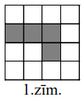

<small>

* questionType:
* domain:

</small>

## Atrisinājums

Skat. 1.zīm.

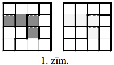

# <lo-sample/> LV.AMO.2006.5.2

Uz galda atrodas $7$ pēc ārējā izskata vienādas monētas. Ir zināms, ka $6$ no 
tām masas ir vienādas, bet septītajai masa **varbūt** ir citāda. Kā ar $2$ 
svēršanām uz sviras svariem bez atsvariem noskaidrot, vai atšķirīgā monēta ir 
un, ja tā ir, tad vai tā vieglāka vai smagāka par citām?

<small>

* questionType:
* domain:

</small>

## Atrisinājums

Ar pirmo svēršanu salīdzinām $A$, $B$ pret $C$, $D$. Ja svari **nav** līdzsvarā, 
tad pašreiz uz tiem ir atšķirīgā monēta. Ar otro svēršanu salīdzinām $A,\ B$ 
pret $E,\ F$ ($E,\ F$ ir "īstās"). Ja ir līdzsvars, tad atškirīīgās monētas 
attiecības ar īstajām noskaidro no $1.$ svēršanas rezultātiem (atškirīgā ir 
viena no $C,\ D$). Ja līdzsvara nav, tad atšķirīgā ir viena no $A,\ B$; gan 
$1.$, gan $2.$ svēršana rāda, vai tā smagāka vai vieglāka par īsto.

Ja pirmajā svēršanā ir līdzsvars, tad otrajā salīdzinām $A,\ B,\ C$ (tās visas 
ir "īstas") ar $E,\ F,\ G$. Ja atkal ir līdzsvars, tad atšķirīgās monētas nav. 
Ja nav līdzsvara, tad vajadzīgo uzzinām no otrās svēršanas (atšķirīgā monēta ir
$E,\ F$ vai $G$).

# <lo-sample/> LV.AMO.2006.5.3

Pa apli stāv Andris, Dzintars, Gunārs, Juliata, Maija un Skaidrīte. Visi 
attālumi starp bērniem ir dažādi. Katrs bērns nosauc sev vistuvāk stāvošā bērna
vārdu. Cik vārdi var tikt nosaukti divreiz? (Attālumus starp bērniem mēra "pa 
apli".)

<small>

* questionType:
* domain:

</small>

## Atrisinājums

**Atbilde:** $0,\ 1$ vai $2$.

**Risinājums.** Piemērus skat. 2.zīm.

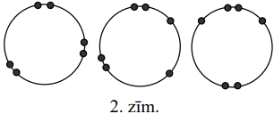

Tā kā $4$ vai vairāk vārdus divas reizes nosaukt nevar, atliek pamatot, kāpēc 
$2$ reizes nevar nosaukt $3$ vārdus. Pieņemam, ka tas noticis. Tad trīs citi 
vārdi vispār nav nosaukti. Pieņemsim, ka vārds $X$ nosaukts $2$ reizes; tad to 
nosaukuši abi $X$ kaimiņi $Y$ un $Z$. Bērns $X$ nosauks vai nu $Y$, vai $Z$; 
varam pieņemt, ka $X$ nosauks $Y$. Tad vārdu $Y$ nosaucis vēl kāds bērns. Tāpēc
blakus stāvošie $X$ un $Y$ nosaukti divas reizes, pie tam abi nosaukuši viens 
otru. Līdzīgi spriežot, trešajam divreiz nosauktajam bērnam $E$ jābūt kaimiņam 
$F$, kas arī nosaukts divas reizes, pie tam $E$ un $F$ nosaukuši viens otru - 
pretruna.

# <lo-sample/> LV.AMO.2006.5.4

Istabā atrodas $3$ rūķīši: Alfa, Beta un Gamma. Katrs no viņiem vai nu vienmēr 
runā patiesību, vai vienmēr melo, un katrs zina visu par abiem pārējiem. Uz 
jautājumu: "Cik starp jums trijiem ir meļu?" viņi atbildēja šādi:

Alfa: "Viens."  
Beta: "Divi."  
Gamma: "Trīs"  

Kuri no rūķīšiem melo, kuri - runā patiesību?

<small>

* questionType:
* domain:

</small>

## Atrisinājums

Patieso rūķīšu nav vairāk kā viens, jo visas atbildes ir dažādas. Tā kā vismaz 
viena atbilde ir patiesa (meļu skaits nav $0$), tad viens rūķītis runā 
patiesību, bet divi melo. Tātad Beta runā patiesību, bet Alfa un Gamma melo.

# <lo-sample/> LV.AMO.2006.5.5

Vai naturālos skaitļus no $1$ līdz $14$ ieskaitot var sadalīt trīs daļās tā, 
lai visu daļu summas būtu vienādas?

Vai to var izdarīt ar skaitļiem no $1$ līdz $13$ ieskaitot?

<small>

* questionType:
* domain:

</small>

## Atrisinājums

**(A)** jā, var, piemēram:

$\{14; 13; 8\}, \quad \{12; 11; 10; 2\}, \quad \{1; 3; 4; 5; 6; 7; 9\}$

**(B)** nē, nevar; summa $1+2+\ldots+13=91$ nedalās ar $3$.

# <lo-sample/> LV.AMO.2006.6.1

Trīsciparu skaitļa $x$ simtu cipars ir $a$, desmitu cipars ir $b$ un vienu 
cipars ir $c$. Pierādīt: ar $7$ dalās visi tie un tikai tie skaitļi $x$, kuriem
izteiksme $2a+3b+c$ dalās ar $7$.

<small>

* questionType:
* domain:

</small>

## Atrisinājums

Ievērojam, ka 
$\overline{abc}=100a+10b+c=(98a+7b)+(2a+3b+c)=7(14a+b)+(2a+3b+c)$.

# <lo-sample/> LV.AMO.2006.6.2

Doti $4$ atsvari. Katram no tiem masa ir $10~\mathrm{g}$ vai $11~\mathrm{g}$. 
Doti arī svari, kas rāda uz tiem uzlikto atsvaru kopējo masu. Vai ar $3$ 
svēršanām var noteikt katra atsvara masu?

<small>

* questionType:
* domain:

</small>

## Atrisinājums

Sveram $A+B$. Ja $A+B=20$ vai $A+B=22$, $A$ un $B$ masas jau zināmas. Tālāk ar 
$2$ svēršanām atrodam atsevišķi $C$ un $D$.

Ja $A+B=21$, sveram $A+C$. Gadījumus $A+C=20$ un $A+C=22$ analizē kā iepriekš. 
Ja $A+C=21$, tad no $A+B=A+C$ seko $B=C$.

Trešajā reizē sveram $B+C+D$. Ievērosim, ka $B+C$ - pāra skaitlis ($20$ vai 
$22$). Iegūstam tabulu:

| $B+C+D$ | $B+C$ | $D$ | $B$ | $C$ | $A$ |
| :---: | :---: | :---: | :---: | :---: | :---: |
| $30$ | $20$ | $10$ | $10$ | $10$ | $11$ |
| $31$ | $20$ | $11$ | $10$ | $10$ | $11$ |
| $32$ | $22$ | $10$ | $11$ | $11$ | $10$ |
| $33$ | $22$ | $11$ | $11$ | $11$ | $10$ |

# <lo-sample/> LV.AMO.2006.6.3

Katrā no $3$ groziem ir gan āboli, gan bumbieri. Pierādīt: Andris var paņemt 
$2$ grozus tā, lai tajos kopā būtu vairāk nekā puse ābolu un vairāk nekā puse 
bumbieru.

<small>

* questionType:
* domain:

</small>

## Atrisinājums

Andris paņem to grozu, kurā ir visvairāk ābolu (vai vienu no tādiem, ja to ir 
vairāki) un to grozu, kurā ir visvairāk bumbieru (vai vienu no tādiem, ja to ir
vairāki).

Ja tas ir viens un tas pats grozs, tad kā otro Andris ņem jebkuru grozu.

Skaidrs, ka **lielākais** ābolu daudzums kopā ar jebkuru no abiem pārējiem 
ābolu daudzumiem ir vairāk nekā otrais no abiem pārējiem ābolu daudzumiem. 
Līdzīgi spriežam par bumbieriem.

# <lo-sample/> LV.AMO.2006.6.4

Kvadrāts sastāv no $4 \times 4$ vienādām kvadrātiskām rūtiņās. Kādu mazāko 
daudzumu rūtiņu malu var nokrāsot, lai katrai rūtiņai būtu nokrāsotas vismaz 
$2$ malas?

<small>

* questionType:
* domain:

</small>

## Atrisinājums

Pavisam jābūt nokrāsotām $16 \times 2=32$ malām. Viena nogriežņa nokrāsošana 
dod vienas vai divu malu krāsojumu (atkarībā no tā, vai šis nogrieznis ir uz 
kvadrāta kontūra vai tā iekšpusē). Tātad jākrāso vismaz $32:2=16$ nogriežņi. 
To, ka ar $16$ nogrieznīšu nokrāsošanu pietiek, skat. 3.zīm.

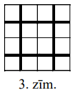

# <lo-sample/> LV.AMO.2006.6.5

Kvadrāts sadalīts $10 \times 10$ vienādās kvadrātiskās rūtiņās un izkrāsots 
šaha galdiņa kārtībā. Trīsdesmit trijās baltajās rūtiņās atrodas pa dukātam. 
Sprīdītis staigā pa kvadrātu, ar katru soli šķērsojot divu rūtiņu kopējo malu. 
(Sprīdītis neiet caur rūtiņu stūri un neieiet rūtiņā, kurā jau ir bijis.) 
Ieraugot dukātu, viņš to paņem.

Pierādīt: ja Sprīdītis pavisam pabūs vismaz $54$ rūtiņās, tad viņam būs vismaz 
$10$ dukāti.

<small>

* questionType:
* domain:

</small>

## Atrisinājums

Ievērosim, ka Sprīdītis ir pamīšus baltās un melnās rūtiņās, tāpēc viņš 
apmeklējis $54:2=27$ baltas rūtiņas. Pavisam balto rūtiņu ir 
$10 \times 10:2=50$. Tāpēc neapmeklētas paliek $50-27=23$ baltas rūtiņas. Pat 
ja visās neapmeklētajās baltajās rūtiņās ir pa dukātam, Sprīdītis ir savācis 
$33-23=10$ dukātus; pretējā gadījumā viņam dukātu ir vairāk.

# <lo-sample/> LV.AMO.2006.7.1

Vilcienā Rīga-Mehiko vietas numurētas ar naturāliem skaitļiem, sākot ar $1$ 
(numerācija ir vienota visam vilcienam, t.i., ir tikai viena vieta ar numuru 
$1$, viena vieta ar numuru $2$ utt; numuri piešķirti virzienā no lokomotīves uz
vilciena "asti"). Visos vagonos ir vienāds vietu skaits. Vietas ar numuriem 
$1996$ un $2015$ ir vienā vagonā, bet vietas ar numuriem $630$ un $652$ - 
dažādos vagonos, kas pie tam nav blakus viens otram. Cik vietu ir katrā vagonā?

<small>

* topic:SeriesMembersSumsClosedFormulas
* topic:SequenceGaps
* topic:ExhaustionMethod
* concepts:sequence
* questionType:FindAll
* domain:Alg

</small>

## Atrisinājums

No $1996$ līdz $2015$ (ieskaitot) ir $20$ naturāli skaitļi, tātad vagonā 
**ir vismaz** $20$ vietas. Starp tiem vagoniem, kuros ir $630.$ un 
$652.$ vieta, nav citu vietu kā vien varbūt 
$631.,\ 632.,\ \ldots,\ 650.,\ 651.$ vieta; to skaits ir $21$. Tātad vagonā nav
vairāk par $21$ vietu. No izceltajiem apgalvojumiem seko, ka vagonā ir $20$ vai
$21$ vieta.

Ja tur būtu $20$ vietas, rastos pretruna ar uzdevuma nosacījumiem ($1996.$ 
vieta būtu simtajā vagonā, bet $2015.$ vieta - simt pirmajā vagonā). Atbilde 
"$21$" apmierina abus uzdevuma nosacījumus: $1996.$ un $2015.$ vietas ir 
$96.$ vagonā, $630.$ vieta - $30.$ vagonā, bet $652.$ vieta $32.$ vagonā (jo 
$31 \cdot 21=651$).

*Piezīme.* Ja pamato, ka vietu skaits $k \in \{ 20,21 \}$. Tad
$1995$ vai $1994$ jādalās ar $k$, jo ar šo vietu beidzas kārtējais vagons.
Tas ļauj izlemt par labu $k = 21$. 

# <lo-sample/> LV.AMO.2006.7.2

Triju veselu pozitīvu skaitļu summa ir $407$. Ar kādu lielāko daudzumu nuļļu 
var beigties šo skaitļu reizinājums?

<small>

* questionType:
* domain:

</small>

## Atrisinājums

Piemērs $407=250+125+32$ parāda, ka $6$ nulles var būt. Tiešām, 
$250 \cdot 125 \cdot 32=2 \cdot 5^{3} \cdot 5^{3} \cdot 2^{5}=1000000$.

Parādīsim, ka vairāk par $6$ nullēm nevar būt. Visi saskaitāmie ir mazāki par 
$5^{4}=625$; tātad augstākā piecinieka pakāpe, ar kādu tie var dalīties, ir 
$5^{3}$. Turklāt vismaz viens saskaitāmais ar $5$ vispār nedalās, jo visu 
saskaitāmo summa nedalās ar $5$. Tāpēc visi $3$ saskaitāmie kopā satur ne 
vairāk kā $3+3=6$ pirmreizinātājus $5$. Tāpēc arī vairāk par $6$ nullēm nevar 
būt.

# <lo-sample/> LV.AMO.2006.7.3

Katram no trijstūriem $ABC$ un $ADE$ visi leņķi ir $60^{\circ}$ lieli (skat. 
2.zīm.). Pierādīt, ka $BD=CE$.

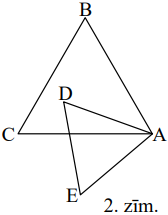

<small>

* questionType:
* domain:

</small>

## Atrisinājums

Tā kā trijstūrī pret vienādiem leņķiem atrodas vienādas malas, tad $AE=AD$ un 
$AC=AB$. Bez tam 
$\sphericalangle EAC=60^{\circ}-\sphericalangle CAD=\sphericalangle DAB$. Tāpēc
$\triangle EAC=\triangle DAB$ pēc pazīmes $\mathbf{m \ell m}$, un no tā seko, 
ka $EC=DB$.

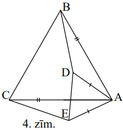

# <lo-sample/> LV.AMO.2006.7.4

Radījuši Trio salu, dievi tajā nometināja $2005$ princeses, $2006$ bruņiniekus 
un $2007$ pūķus. Pūķi ēd princeses; bruņinieki nogalina pūķus; princeses noved 
līdz bojāejai bruņiniekus. Saskaņā ar dievu ieviesto kārtību nav iespējams 
iznīcināt to, kurš pats iznīcinājis nepāra skaitu citu būtņu. Pašreiz Trio salā
palikusi tikai viena dzīva būtne. Kas tā ir?

<small>

* questionType:
* domain:

</small>

## Atrisinājums

**Atbilde:** pūķis.

Pieņemsim, ka dzīvs palicis bruņinieks. Tad pūķi kopā apēduši nepāra skaitu 
princešu, tātad **kāds** pūķis apēdis nepāra skaitu princešu, un šo pūķi 
neviens bruņinieks nevarēja nogalināt. Iegūta pretruna.

Pieņemsim, ka dzīva palikusi princese. Tad bruņinieki kopā nogalinājuši nepāra 
skaitu pūķu, tāpēc **kāds** bruņinieks nogalinājis nepāra skaitu pūķu, un 
vismaz **šo** bruņinieku neviena no princesēm nomocīt līdz nāvei nevarēja. 
Iegūta pretruna.

Atliek parādīt, ka kāds pūķis tiešām var palikt dzīvs saskaņā ar uzdevuma 
nosacījumiem. Tas var notikt šādi:

**(A)** vispirms viens bruņinieks nogalina $2006$ pūķus,

**(B)** pēc tam viena princese nomoka līdz nāvei $2006$ bruņiniekus,

**(C)** pēc tam atlikušais pūķis, noskaities uz nepateicīgajām princesēm, apēd 
tās visas.

# <lo-sample/> LV.AMO.2006.7.5

Pa apli izvietoti $24$ trauki; katrā ir pa vienai konfektei. Ar vienu gājienu 
var paņemt vienu konfekti no jebkura trauka. Ja abos blakus esošajos traukos 
arī ir pa vienai konfektei, tad paņemto konfekti drīkst apēst; pretējā gadījumā
tā jāieliek tajā blakus esošajā traukā, kurā konfekšu nav (jebkurā no tiem, ja 
tie abi ir tukši). Kādu lielāko konfekšu daudzumu var apēst?

<small>

* questionType:
* domain:

</small>

## Atrisinājums

Skaidrs, ka brīdī, kad būtu palikušas $2$ konfektes, nevienu no tām apēst vairs
nevarēs. Tāpēc apēsto konfekšu skaits nepārsniedz $22$. Parādīsim, kā apēst 
$22$ konfektes. Sanumurēsim traukus pēc kārtas ar numuriem 
$1.,\ 2.,\ \ldots,\ 23.,\ 24.$ Pirmajā gājienā ēdam konfekti no $1.$ trauka. 
Pieņemsim, ka jau iztukšoti $1.,\ 2.,\ 3.,\ \ldots,\ k$-ais trauki 
$(k \leq 21)$, bet $(k+1)$-ā, $(k+2)$-ā, $\ldots,\ 24$-ā traukā ir pa konfektei
(konfektes ir vismaz $3$ traukos). Parādīsim, kā iztukšot vēl $(k+1)$-o trauku:

**(A)** apēdam konfekti no $(k+2)$-ā trauka,

**(B)** paņemam konfekti no $(k+1)$-ā trauka un ieliekam to $(k+2)$-ā traukā.

Tā rīkojamies, kamēr iztukšoti $1.,\ 2.,\ 3.,\ \ldots,\ 21.,\ 22.$ trauki.

# <lo-sample/> LV.AMO.2006.8.1

Dots, ka kvadrātvienādojuma $x^{2}+px+q=0$ saknes ir $x_{1}$ un $x_{2}$, bet 
kvadrātvienādojuma $x^{2}+ax+b=0$ saknes ir $x_{1}^{2}$ un $x_{2}^{2}$. Izsacīt
$a$ un $b$ ar $p$ un $q$ palīdzību.

<small>

* questionType:
* domain:

</small>

## Atrisinājums

No Vjeta teorēmas seko 
$b=x_{1}^{2} \cdot x_{2}^{2}=\left(x_{1}x_{2}\right)^{2}=q^{2}$ un 
$a=-\left(x_{1}^{2}+x_{2}^{2}\right)=2x_{1}x_{2}-\left(x_{1}+x_{2}\right)^{2}=2q-p^{2}$.

# <lo-sample/> LV.AMO.2006.8.2

Matemātikas pulciņā piedalās Andris, Dzintars, Gunārs, Juliata, Liene un Maija.
Uzdevumus viņi risina grupās pa trim. Kāds mazākais skaits uzdevumu tika 
risināts, ja katri divi bērni kopā risināja vismaz vienu no tiem?

<small>

* questionType:
* domain:

</small>

## Atrisinājums

Katram bērnam jāpiedalās uzdevumu risināšanā kopā ar $5$ citiem. Tā kā vienā 
grupā katrs bērns ir kopā $2$ citiem, tad katram bērnam jārisina vismaz $3$ 
uzdevumi (jo $2 \cdot 2=4<5$). Tātad notiek vismaz $6 \cdot 3=18$ risināšanas 
(par risināšanu **šeit** saucam procesu, kad **viens** bērns piedalās darbā ar 
**vienu** uzdevumu). Tā kā katras grupas darbā notiek trīs risināšanas, tad 
vajadzīgs, lai būtu vismaz $\frac{18}{3}=6$ grupas. Ar $6$ grupām mērķi var 
sasniegt, piemēram, šādi: $ADJ,\ AGM,\ ALM,\ DGL,\ DJM,\ GJL$.

# <lo-sample/> LV.AMO.2006.8.3

Naturāla skaitļa $x$ ciparu summu apzīmēsim ar $S(x)$. Pieņemsim, ka $n$ - tāds
naturāls skaitlis, kam vienlaicīgi izpildās īpašības $S(n)=10$ un $S(5n)=5$.

**(A)** atrodiet kaut vienu tādu skaitli,  
**(B)** vai tādu skaitļu ir bezgalīgi daudz?  
**(C)** vai kāds no tādiem skaitļiem ir nepāra?

<small>

* topic:DivisibilityRulesFor2And4
* topic:NotationInsert
* subdomain:DOM_DigitManipulation
* questionType:FindExample,ProveDisprove,ProveDisprove
* domain:NT

</small>

## Atrisinājums

**(A)** piemēram, $n=64$;

**(B)** piemēram, visi skaitļi $64 \underbrace{0 \ldots 0}_{x\ nulles}$;

**(C)** nē, nav. Ja $n$ - **nepāra** naturāls skaitlis, tad $5n$ ir nepāra 
skaitlis, kas beidzas ar ciparu $5$. Ja piedevām $S(5n)=5$, tad skaitlim $5n$ 
nav citu ciparu kā pēdējais cipars, tātad $5n=5$ un $n=1$, bet $n=1$ 
neapmierina uzdevuma nosacījumus.

## Atrisinājums

Uzminēts piemērs (pāru cipari divreiz samazinās, ja reizina ar $5$).

**(A)** $22222$ der  
**(B)** Var $22222$ vidū iespraust $0$ (arī $64\cdot 10^k$ der).   
**(C)** Ja $n$ nepāra, $5n$ beigtos ar $5$, nav iespējams, jo $n \neq 1$. 

# <lo-sample/> LV.AMO.2006.8.4

Šaurleņķu trijstūrī $ABC$ uz malām $AC$ un $AB$ izvēlēti attiecīgi tādi punkti 
$K$ un $L$ , ka $KL \parallel BC$ un $KL=KC$. Uz malas $BC$ izvēlēts tāds 
punkts $M$, ka $\sphericalangle KMB=\sphericalangle BAC$. Pierādīt, ka $KM=AL$.

<small>

* questionType:
* domain:

</small>

## Atrisinājums

Atliekam uz $BC$ tādu punktu $N$, ka $\sphericalangle KNC=\sphericalangle KMB$ 
(tā kā $\triangle ABC$ - šaurleņķu, tad $N$ nesakrīt ar $M$). Pēc dotā 
$\sphericalangle C=\sphericalangle LKA$. No $\triangle AKL$ un $\triangle NCK$ 
seko, ka $\sphericalangle ALK=\sphericalangle NKC$. Tāpēc 
$\Delta ALK=\Delta NKC\ (\mathbf{\ell m \ell})$ un tāpēc $AL=NK$. Tā kā 
$\Delta NKM$ vienādsānu, tad no tā seko $AL=KM$, k.b.j.

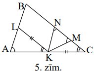

# <lo-sample/> LV.AMO.2006.8.5

Kvadrāts sastāv no $33 \times 33$ kvadrātiskām rūtiņām. No šīm rūtiņām $32$ ir 
nokrāsotas melnas, pārējās baltas. Ar vienu gājienu var izvēlēties baltu 
rūtiņu, no kuras kaimiņu rūtiņām vismaz divas jau ir melnas, un nokrāsot arī šo
rūtiņu melnu. (Rūtiņas sauc par kaimiņu rūtiņām, ja tām ir kopīga mala)

Vai var gadīties, ka izdodas nokrāsot melnu visu kvadrātu?

Vai tas var gadīties, ja sākotnēji melnas ir $33$ rūtiņas?

<small>

* questionType:
* domain:

</small>

## Atrisinājums

Ja nokrāsotas $32$ rūtiņas, visu kvadrātu melnu nokrāsot neizdosies.

Pieņemsim, ka tas izdevies. Sākumā melni nokrāsotā apgabala robežas kopgarums 
nav lielāks par $32 \cdot 4=128$. Beigās tam jākļūst $33 \cdot 4=132$.

Ja mēs parādīsim, ka šis kopgarums nevar augt, mūsu apgalvojums būs pierādīts. 
Bet, nokrāsojot melnā krāsā sākotnēji baltu rūtiņu, kurai ir $\geq 2$ melni 
kaimiņi, malas ar šiem kaimiņiem vairs nav ,"melni - balti" robežas fragmenti, 
un no jauna rodas ne vairāk kā divas šādas malas (jo nokrāsotajai rūtiņai 
pavisam ir $4$ malas). Līdz ar to mūsu apgalvojums ir pierādīts.

Ja sākotnēji melnā krāsā nokrāsotas $33$ vienas diagonāles rūtiņas, tad, 
krāsojot baltās rūtiņas "pa diagonālēm", var visu kvadrātu nokrāsot melnu.

# <lo-sample/> LV.AMO.2006.9.1

Kāda ir lielākā iespējamā ciparu summa septiņciparu naturālam skaitlim, kas 
dalās ar $8$?

<small>

* concepts:sum,divisibility
* questionType:FindOptimal
* domain:NT

</small>

## Atrisinājums

Septiņciparu naturāls skaitlis dalās ar $8$ tad un tikai tad, ja tā pēdējo $3$ 
ciparu veidotais skaitlis dalās ar $8$ (jo 
$\ldots abc=\ldots 000+abc=\ldots \cdot 10^{3}+\overline{abc})$.

Ja pirmie $4$ cipari ir $9$ un $\overline{abc}=888$, ciparu summa ir 
$4 \cdot 9+3 \cdot 8=60$. Pierādīsim, ka $\overline{abc}$ ciparu summa nevar 
būt lielāka par $24$. Lai tā būtu lielāka par $24$, pastāv šādas iespējas:

1) viens no cipariem $a,\ b,\ c$ ir $9$, bet divi - $8$,
2) divi no cipariem $a,\ b,\ c$ ir $9$, bet viens - $8$,
3) visi cipari $a,\ b,\ c$ ir $9$,
4) divi no cipariem $a,\ b,\ c$ ir $9$, bet viens - $7$.

Viegli pārbaudīt, ka neviens no šādiem skaitļiem nedalās ar $8$.

# <lo-sample/> LV.AMO.2006.9.2

Dots, ka $n$ - naturāls skaitlis. Katrs no $2n+1$ rūķīšiem Lieldienās vienu 
reizi ieradās pie Sniegbaltītes un kādu laiku tur uzturējās. Ja divi rūķīši 
vienlaikus bija pie Sniegbaltītes, tad viņi tur satikās. Zināms, ka katrs 
rūķītis pie Sniegbaltītes satika vismaz $n$ citus rūķīšus.

Pierādīt: ir tāds rūķītis, kas pie Sniegbaltītes satika visus $2n$ citus 
rūķīšus.

<small>

* questionType:
* domain:

</small>

## Atrisinājums

Pieņemsim, ka pēdējais atnāca rūķītis $A$, bet pirmais aizgāja rūķītis $B$. Ja 
$A=B$, tas ir meklējamais rūķītis. Ja $A \neq B$, tad ar $K_{A}$ apzīmēsim 
kompāniju, kas sastāv no paša $A$ un viņa satiktajiem rūķīšiem; līdzīgi 
ieviešam $K_{B}$. Gan $K_{A}$, gan $K_{B}$ katrā ir vismaz $n+1$ rūķītis. Tā kā
$(n+1)+(n+1)>2n+1$, tad eksistē tāds rūķītis, kas pieder gan $K_{A}$, gan 
$K_{B}$; apzīmēsim to ar $R$. Ja kāds rūķītis $X$ aizietu agrāk, nekā atnāca 
$R$, tad arī $B$ būtu aizgājis agrāk, nekā atnāca $R$; bet tad $B$ nebūtu 
saticis $R$ - pretruna. Ja kāds rūķītis $Y$ atnāktu vēlāk, nekā aizgāja $R$, 
tad arī $A$ atnāktu vēlāk, nekā aizgāja $R$, un $A$ nebūtu saticis $R$ - 
pretruna.

No minētā seko, ka $R$ satika visus rūķīšus.

# <lo-sample/> LV.AMO.2006.9.3

Dots, ka $\triangle ABC$ ir regulārs. Punkts $P$ atrodas uz $ABC$ apvilktās 
riņķa līnijas (skat. 1.zīm.) Taisnes, kas caur $P$ vilktas paralēli 
$AB,\ BC$ un $CA$, krusto atbilstoši taisnes $BC,\ AC$ un $AB$ attiecīgi 
punktos $M$, $K$ un $N$. Pierādīt, ka $\sphericalangle BMN=\sphericalangle BMK$

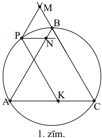

<small>

* questionType:
* domain:

</small>

## Atrisinājums

No konstrukcijas seko, ka $PMBN$ ir trapece, pie tam vienādsānu (leņķi pie 
pamata $PM$ abi ir $60^{\circ}$ ). Tāpēc 
$\sphericalangle \mathbf{BMN}=\sphericalangle \mathbf{BPN}$.

Līdzīgi $PMCK$ ir vienādsānu trapece, tāpēc 
$\sphericalangle \mathbf{BMK}=\sphericalangle \mathbf{BCP}$, un mums pietiek 
pierādīt, ka $\sphericalangle BPN=BCP$. Tā kā tie abi ir ievilkti leņķi, tad 
pietiek pierādīt, ka $B$ ir loka $PBL$ viduspunkts. Bet tas seko no vienādībām 
$\cup APB=\cup CLB=120^{\circ}$ un $\cup AmP=\cup CnL$ (loki starp paralēlām 
hordām), atņemot tās vienu no otras.

$\underline{Piezīme.}$ No pierādītā seko, ka $M,\ N,\ K$ atrodas uz vienas 
taisnes.

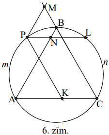

# <lo-sample/> LV.AMO.2006.9.4

Apzīmēsim $f(x)=x^{2}+px+q$. Ir dots, ka vienādojumam $f(x)=0$ ir divas saknes,
kas atšķiras viena no otras vismaz par $5$. Pierādīt, ka vienādojumam 
$f(x)+f(x+1)+f(x+2)=0$ arī ir divas saknes.

<small>

* questionType:
* domain:

</small>

## Atrisinājums

Apzīmējam vienādojuma $f(x)=0$ saknes $x_{1}$ un $x_{2},\ x_{1}<x_{2}$. Tad pie
$x_{1}<x<x_{2}$ pastāv nevienādība $f(x)<0$, bet pie $x>x_{2}$ un pie $x<x_{1}$
pastāv nevienādība $f(x)>0$. Tāpēc pie $x_{3}=x_{1}+0,1$ pastāv nevienādības 
$f\left(x_{3}\right)<0$, $f\left(x_{3}+1\right)<0$ un 
$f\left(x_{3}+2\right)<0$; pie $x_{4}=x_{1}-10$ pastāv nevienādības 
$f\left(x_{4}\right)>0,\ f\left(x_{4}+1\right)>0$ un $f\left(x_{4}+2\right)>0$;
pie $x_{5}>x_{2}$ pastāv nevienādības 
$f\left(x_{5}\right)>0,\ f\left(x_{5}+1\right)>0$ un $f\left(x_{5}+2\right)>0$.
Tātad funkcija $F(x)=f(x)+f(x+1)+f(x+2)$ maina zīmi starp $x_{5}$ un $x_{3}$, 
kā arī starp $x_{3}$ un $x_{4}$, no kurienes seko vajadzīgais.

# <lo-sample/> LV.AMO.2006.9.5

Apskatām naturālos skaitļus no $1$ līdz $100$ ieskaitot. Kādu lielāko daudzumu 
no tiem var izvēlēties tā, lai nekādi divi izvēlētie skaitļi nedalītos viens ar
otru un katriem diviem izvēlētajiem skaitļiem lielākais kopīgais dalītājs būtu 
lielāks par $1$?

<small>

* concepts:divisibility,gcd
* questionType:FindOptimal
* domain:NT

</small>

## Atrisinājums

**Atbilde:** $25$ skaitļus.

**Risinājums.** Apskatīsim skaitļus $52;\ 54;\ 56;\ \ldots;\ 96;\ 98;\ 100$. 
Tie visi dalās ar $2$ un neviens nedalās ar otru, jo pat lielākā skaitļa 
dalījums ar mazāko ir $\frac{100}{52}<2$, tātad nekādu divu apskatāmo skaitļu 
dalījums nav naturāls skaitlis.

Pierādīsim, ka vairāk par $25$ skaitļiem, kas apmierina uzdevuma prasības, 
izvēlēties nevar. Pieņemsim, ka kopa $M$ ir kopa ar maksimālo skaitļu skaitu 
tajā. Ja eksistē tāds $x \in M$, ka $x \leqslant 50$, tad $2x \notin M$; mazāko
no šādiem $x$ var aizstāt ar $2x$. (Viegli pārbaudīt, ka kopai $M$ izvirzāmās 
prasības saglabājas.) Ar galīgu skaitu gājienu $M$ varam pārveidot par 
$M_{1}$, kurā visi skaitļi ir lielāki par $50$, bet elementu ir tikpat, cik 
kopā $M$. Ja $M_{1}$ būtu **vairāk nekā** $\mathbf{25}$ elementi, tad vismaz divi
no tiem atrastos vienā no $25$ pāriem 
$(51; 52),\ (53; 54),\ (55; 56),\ \ldots,\ (97; 98),\ (99; 100)$. Bet tā ir 
pretruna, jo diviem skaitļiem, kas atšķiras viens no otra par $1$, lielākais 
kopīgais dalītājs ir $1$.

# <lo-sample/> LV.AMO.2006.10.1

Kvadrāts sastāv no $5 \times 5$ vienādām kvadrātiskām baltām rūtiņām. Parādiet,
ka **(A)** $8$, **(B)** $9$, **(C)** $10$ no tām var nokrāsot melnas tā, lai 
katrai atlikušajai baltajai rūtiņai $R$ būtu tieši viena melna rūtiņa, ar kuru 
$R$ ir kopīga mala.

<small>

* questionType:
* domain:

</small>

## Atrisinājums

Skat., piem., 7.zīm.

# <lo-sample/> LV.AMO.2006.10.2

Pusriņķa līnijas diametrs ir $AB$. Uz pusriņķa līnijas ņemti divi punkti $M$ un
$N$, kas nesakrīt ne ar $A$, ne ar $B$. Stari $AM$ un $BN$ krustojas punktā 
$O$.

Pierādīt: ap $\Delta MNO$ apvilktās riņķa līnijas garums atkarīgs tikai no 
hordas $MN$ garuma, nevis no tās novietojuma.

<small>

* questionType:
* domain:

</small>

## Atrisinājums

Apzīmēsim hordas $MN$ garumu ar $a$, bet tās savilktā loka leņķisko lielumu ar 
$\omega$. Iespējami divi gadījumi:

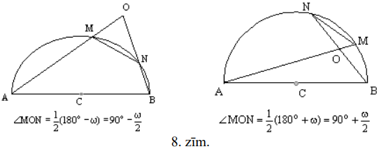

Atliek ievērot, ka 
$\sin \left(90^{\circ}-\frac{\omega}{2}\right)=\sin \left(90^{\circ}+\frac{\omega}{2}\right)$,
un izmantot sinusu teorēmu $MN=2R \cdot \sin \sphericalangle MON$.

# <lo-sample/> LV.AMO.2006.10.3

Ir dots, ka, sareizinot visus naturālos skaitļus no $1$ līdz $33$ ieskaitot, 
iegūst $86833176188xy8864955181944012zt000000$, kur $x,\ y,\ z,\ t$ ir cipari. 
Noskaidrojiet $x,\ y,\ z$ un $t$ vērtības.

<small>

* questionType:FindAll
* domain:NT

</small>

## Atrisinājums

Ievērosim, ka 
$33!=31 \cdot 29 \cdot 23 \cdot 19 \cdot 17 \cdot 13^{2} \cdot 11^{3} \cdot 7^{4} \cdot 3^{15} \cdot 5^{7} \cdot 2^{31}=M \cdot 11^{3} \cdot 3^{15} \cdot 2^{24} \cdot 10^{7}$,
kur $M$ - naturāls skaitlis, kas nebeidzas ar $0$. Tāpēc $33!$ beidzas tieši ar
$7$ nullēm. No tā seko, ka $t=0,\ z \neq 0$. Skaitlis, ko iegūst, nosvītrojot 
pēdējās $7$ nulles, acīmredzami dalās ar $8$; tāpēc tā pēdējo triju ciparu 
veidotajam skaitlim jādalās ar $8$. Skaitlis $\overline{12z}$ dalās ar $8$, ja 
$z=0$ vai $z=8$; tā ka $z \neq 0$, tad $\mathbf{z=8}$.

Tā kā $33!$ dalās ar $9$, tad tā ciparu summai jādalās ar $9$, t.i., $142+x+y$ 
jādalās ar $9$ (jeb, kas ir tas pats, $x+y-2$ jādalās ar $9$). Tā kā $33!$ 
dalās ar $11$, tad tā alternējošai ciparu summai (nepāra vietās esošie cipari 
ar " $+$ " zīmi, pāra vietās esošie cipari ar " $-$ " zīmi) jādalās ar $11$, 
t.i., $(-x+y-22)$ jādalās ar $11$ (jeb, kas ir tas pats, $y-x$ jādalās ar 
$11$). Tā kā $x$ un $y$ - cipari, tad no šejienes seko, ka $y=x$; tad no tā, ka
$x+y-2$ dalās ar $9$, seko, ka $\mathbf{x=y=1}$.

**Atbilde:** $x=y=1;\ z=8;\ t=0$.

# <lo-sample/> LV.AMO.2006.10.4

Tenisa turnīrā piedalījās $n$ spēlētāji, katrs ar katru citu spēlēja tieši $2$ 
reizes. Neizšķirtu tenisā nav. Turnīra noslēgumā tieši vienam spēlētājam bija 
$13$ uzvaras un tieši $2$ spēlētājiem - pa $10$ uzvarām citiem katram bija vai 
nu $11$, vai $12$ uzvaras. Kāda var būt $n$ vērtība?

<small>

* questionType:
* domain:

</small>

## Atrisinājums

**Atbilde:** $n=12$.

**Risinājums.** Skaidrs, ka $n \geqslant 3$. Apzīmēsim spēlētāju izcīnīto 
uzvaru daudzumus ar

$$10=k_{1}=k_{2}<k_{3} \leq k_{4} \leq \ldots \leq k_{n-1}<k_{n}=13$$

"Uzvarētājs" pavisam spēlēja $2(n-1)$ reizes, tātad zaudēja $2n-15$ reizes. Tā 
kā "uzvarētājs" nevarēja zaudēt vairāk nekā uzvarēt (un nevarēja arī zaudēt 
tikpat, cik uzvarēt, jo ir spēlētāji, kas zaudējuši vairāk nekā uzvarējuši), 
tad $2n-15<13$, no kurienes $n<14$, tātad $n \leqslant 13$. Līdzīgi (apskatot, 
zaudētājus") iegūstam, ka $2n-12>10$, tātad $n>11$ un $n \geqslant 12$.

Tātad vai nu $n=12$, vai $n=13$. Pieņemsim, ka $n=13$. Ja $i$ spēlētājiem bija 
$11$ uzvaras katram un $j$ spēlētājiem bija $12$ uzvaras katram, tad pavisam 
tika izcīnītas $2 \cdot 10+11i+12j+13=11i+12j+33$ uzvaras. Bet pavisam tika 
spēlētas $13 \cdot 12=156$ spēles, tāpēc $\mathbf{11i+12j=123}$. Tā kā 
$\mathbf{i+j=10}$, tad iegūstam $j=13,\ i=-3$; tā nevar būt. Tāpēc $n \neq 13$,
tātad vienīgā iespēja varētu būt $n=12$. Tāda iespēja tiešām pastāv: piemēram, 
"uzvarētājs" abās spēlēs uzvar katru no abiem "zaudētājiem", bet visu citu 
tenisistu pāru spēlēs katram no abiem spēlētājiem ir pa vienai uzvarai.

# <lo-sample/> LV.AMO.2006.10.5

Dots, ka $x,\ y$ un $z$ ir pozitīvi skaitļi.

**(A)** Pieņemsim, ka zināms: $x+y+z \leq 3$. Vai noteikti 
$\frac{1}{x}+\frac{1}{y}+\frac{1}{z} \geq 3$?

**(B)** Pieņemsim, ka zināms: $x+y+z \geq 3$. Vai noteikti 
$\frac{1}{x}+\frac{1}{y}+\frac{1}{z} \leq 3$?

<small>

* questionType:
* domain:

</small>

## Atrisinājums

**(A)** jā, noteikti. Ievērosim, ka 
$(x+y+z)\left(\frac{1}{x}+\frac{1}{y}+\frac{1}{z}\right)=3+\left(\frac{x}{y}+\frac{y}{x}\right)+\left(\frac{x}{z}+\frac{z}{x}\right)+\left(\frac{y}{z}+\frac{z}{y}\right)$.

Tā kā pozitīviem $\alpha$ ir spēkā 
$\alpha+\frac{1}{\alpha} \geq 2 \sqrt{\alpha \cdot \frac{1}{\alpha}}=2$, tad 
apskatāmā reizinājuma vērtība ir vismaz $3+3 \cdot 2=9$. No tā seko 
apgalvojums.

**(B)** nē, ne noteikti. Piemēram, var būt $x=0,1;\ y=0,1;\ z=100$.

# <lo-sample/> LV.AMO.2006.11.1

Apskatām $n$ pēc kārtas ņemtus naturālus skaitļus. Vai var gadīties, ka tos var
sadalīt divās grupās tā, ka katras grupas skaitļu summa ir pirmskaitlis, ja 
**(A)** $n=8$, **(B)** $n=10$? Katrā grupā jābūt vismaz $2$ skaitļiem.

<small>

* questionType:
* domain:

</small>

## Atrisinājums

**(A)** jā; piemēram, $1+2+4=7$ un $3+5+6+7+8=29$.

**(B)** nē. Starp $10$ pēc kārtas ņemtiem naturāliem skaitļiem ir tieši $5$ 
pāra un $5$ nepāra skaitļi, tātad visu $10$ skaitļu summa ir nepāra skaitlis.
Tāpēc viena no apskatāmo grupu summām ir nepāra skaitlis, otra - pāra skaitlis.
Tā kā abas summas ir lielākas par $2$, tad tā summa, kas ir pāra skaitlis, nav 
pirmskaitlis.

# <lo-sample/> LV.AMO.2006.11.2

Dots, ka $a<b \leq c<d$ ir pozitīvi veseli skaitļi, $ad=bc$ un 
$\sqrt{d}-\sqrt{a} \leq 1$. Pierādīt, ka $a$ ir vesela skaitļa kvadrāts.

<small>

* concepts:square-Alg
* questionType:Prove
* domain:NT

</small>

## Atrisinājums

Apzīmējam $b=a+n, \quad c=a+m, \quad d=a+p$, kur $0<n \leq m<p$. No 
$a(a+p)=(a+n)(a+m)$ seko $p=m+n+\frac{m \cdot n}{a}$. Tā kā $p$ - naturāls 
skaitlis, tad $a \leq m \cdot n$ un $p \geq m+n+1$, pie tam vienādība pastāv 
tad un tikai tad, ja $a=m \cdot n$. No $\sqrt{a+p} \leq \sqrt{a}+1$ seko 
$p \leq 2 \sqrt{a}+1$, tātad 
$m+n+1 \leq p \leq 2 \sqrt{a}+1 \leq 2 \sqrt{mn}+1$, no kurienes 
$m+n+1 \leq 2 \sqrt{mn}+1$, $m-2 \sqrt{mn}+n \leq 0$ un 
$(\sqrt{m}-\sqrt{n})^{2} \leq 0$, no kurienes $m=n$. Acīmredzami jāpastāv 
vienādībai $p=m+n+1$, jo citādi būs $(\sqrt{m}-\sqrt{n})^{2}<0$, kā nevar būt. 
Atceroties iepriekš iegūto, no šejienes seko, ka $a=m \cdot n=m^{2}$, k.b.j.

# <lo-sample/> LV.AMO.2006.11.3

Punkts $P$ atrodas regulāra trijstūra $ABC$ iekšpusē. Pierādīt, ka:

**(A)** $PA+PB+PC<3 \cdot AB$,

**(B)** $PA+PB+PC<2 \cdot AB$.

<small>

* questionType:
* domain:

</small>

## Atrisinājums

**Lemma.** $PA<AB$.

Tiešām, pagarinām $AP$ līdz krustpunktam $A_{1}$ ar malu $BC$. Vai nu 
$\sphericalangle AA_{1}B \geqslant 90^{\circ}$, vai arī 
$\sphericalangle AA_{1}C \geqslant 90^{\circ}$; varam pieņemt, ka 
$\sphericalangle AA_{1}B \geqslant 90^{\circ}$. Tad trijstūrī $AA_{1}B$ leņķis 
$AA_{1}B$ ir lielākais leņķis, tātad pret to atrodas lielākā mala; tāpēc 
$AB>AA_{1}>AP$. Otrā gadījumā $AB=AC>AA_{1}>AP$.

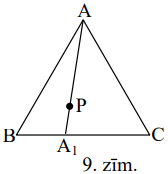

Tagad atrisināsim uzdevumu.

**(A)** no lemmas $PA<a,\ PB<a,\ PC<a$, kur $a$ - regulārā trijstūra malas 
garums. Saskaitot šīs nevienādības, iegūstam vajadzīgo.

**(B)** novelkam $MN \parallel BC$; tad $\triangle MAN$ ir regulārs. No 
trijstūra nevienādības seko $BP+CP<(BM+MP)+(CN+NP)$, tātad 

$$\begin{equation*}
BP+CP<BM+CN+MN \tag{1}
\end{equation*}$$

No lemmas seko

$$\begin{equation*}
AP<AM \tag{2}
\end{equation*}$$

Saskaitot (1) un (2) un ievērojot, ka $MN=AN$, iegūstam 

$BP+CP+AP<BM+CN+MN+AM=$  
$=(BM+AM)+(CN+AN)=BA+AC=2 \cdot AB$ k.b.j.

# <lo-sample/> LV.AMO.2006.11.4

Dots, ka $a$ - pozitīvs skaitlis. Atrisināt vienādojumu 
$x+a^{3}=\sqrt[3]{a-x}$.

<small>

* questionType:
* domain:

</small>

## Atrisinājums

Pārveidojam vienādojumu:

$$\begin{aligned}
& x+a^{3}=\sqrt[3]{a-x} \\
& \sqrt[3]{a-x}-x=a^{3} \\
& \sqrt[3]{\sqrt[3]{a-x}-x}=a
\end{aligned}$$

Uzskatīsim $a$ par mainīgo, bet $x$ - par parametru un apskatīsim funkciju

$$f(a)=\sqrt[3]{a-x}$$

Mūsu vienādojums pierakstāms formā

$$f(f(a))=a$$

Ievērosim, ka $f(a)$ ir augoša funkcija. Tāpēc, ja $f(a)>a$, tad 
$f(f(a))>f(a)>a$; ja $f(a)<a$, tad $f(f(a))<f(a)<a$. Tātad jābūt $f(a)=a$. No 
šejienes iegūstam $x=a-a^{3}$. Pārbaude parāda, ka šī sakne der.

$\underline{Piezīme.}$ Šo sakni nav grūti arī vienkārši uzminēt. Tas, ka tā ir 
vienīgā, tad seko no fakta, ka dotā vienādojuma kreisajā pusē ir argumenta $x$ 
augoša funkcija, bet labajā pusē argumenta $x$ dilstoša funkcija.

# <lo-sample/> LV.AMO.2006.11.5

Dots, ka $n$ - naturāls skaitlis, $n \geq 3$. Katri divi no $n$ zinātniekiem 
sarakstās vienā no $n$ valodām, turklāt visas $n$ valodas tiek izmantotas. 
Pierādiet: var atrast tādus trīs zinātniekus, kas savstarpējā sarakstē izmanto 
trīs dažādas valodas.

<small>

* questionType:Prove
* domain:Comb
* method:MTH_InductionWithStepOne

</small>

## Atrisinājums

Izmantosim matemātisko indukciju. Pie $n=3$ uzdevuma apgalvojums ir 
acīmredzams. Pieņemsim, ka tas ir patiess pie $n=3;\ 4;\ \ldots;\ k$. Apskatām 
$n=k+1$. Izvēlamies vienu zinātnieku $A$ un šķirojam divus gadījumus.

1. Ir tādi divi zinātnieki $B$ un $C$, ka valoda $AB$ netiek lietota nevienā 
   citā sarakstē un valoda $AC$ arī netiek lietota nevienā citā sarakstē. Tad 
   $A,\ B,\ C$ ir meklējamā grupa.

2. Tādu divu zinātnieku nav. Tas nozīmē, ka no valodām, kuras izmanto $A$, 
   **augstākais viena** citās sarakstēs netiek lietota. Aizmirsīsim par 
   zinātnieku $A$ un viņa sarakstēm. Ja **tieši viena** no $A$ lietotajām 
   valodām citās sarakstēs netiek lietota, tad atlikušie $k$ zinātnieki izmanto
   $k$ valodas, un lietojam induktīvo hipotēzi. Ja visas $A$ lietotās valodas 
   tiek lietotas arī citur, tad atlikušajā $k$ zinātnieku grupā apvienojam 
   $k$-to un $(k+1)$-o valodas un lietojam induktīvo hipotēzi. Iegūtajā 
   trijniekā "integrēto" valodu atšifrējam tās sākotnējā formā.

# <lo-sample/> LV.AMO.2006.12.1

Vai eksistē tāds vesels pozitīvs skaitlis $n$, ka skaitlim $n^{2}$ ir tikpat 
daudz naturālu dalītāju, kas dod atlikumu $1$, dalot ar $3$, cik naturālu 
dalītāju, kas dod atlikumu $2$, dalot ar $3$?

<small>

* concepts:divisibility,divisors,remainder
* questionType:ProveDisprove
* domain:NT

</small>

## Atrisinājums

Varam apzīmēt $n=3^{k} \cdot a$, kur $a$ nedalās ar $3$. Tad 
$n^{2}=3^{2k} \cdot a^{2}$. Dalītāji, par kuriem runā uzdevumā, ir precīzi 
skaitļa $a^{2}$ dalītāji (citi skaitļa $n^{2}$ dalītāji dalās ar $3$).

Tā kā $a^{2}$ ir nepāra skaits dalītāju (visi dalītāji, izņemot $a$, apvienojas
pa pāriem tā, ka vienā pārī ieejošo dalītāju reizinājums ir $a^{2}$), tad 
uzdevumā prasītais skaitlis neeksistē.

# <lo-sample/> LV.AMO.2006.12.2

Pierādīt, ka $\sphericalangle AMB=\sphericalangle ANB=\sphericalangle AKB$, kur
$A,\ B,\ M,\ N,\ K$ - punkti, kas atrodas kvadrātiska režģa virsotnēs (skat. 
2.zīm.)

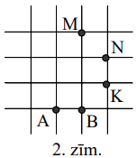

<small>

* questionType:
* domain:

</small>

## Atrisinājums

Viegli pārliecināties, ka punkti $A,\ B,\ K,\ N,\ M$ atrodas vienādos attālumos
no iekrāsotās rūtiņas centra, tātad atrodas uz vienas riņķa līnijas. Tātad 
apskatāmie leņķi ir ievilkti leņķi, kas balstās uz vienu un to pašu loku.

Iespējami ļoti daudzi citi risinājumi.

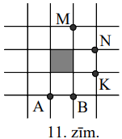

# <lo-sample/> LV.AMO.2006.12.3

Zināms, ka katram no vienādojumiem $ax^{2}+bx+c=0$ un $Ax^{2}+Bx+C=0$ ir divas 
dažādas reālas saknes. Zināms arī, ka visiem reāliem $x$ pastāv nevienādība 
$\left|ax^{2}+bx+c\right| \leq\left|Ax^{2}+Bx+C\right|$. Pierādīt, ka 
$a^{2}+b^{2}+c^{2} \leq A^{2}+B^{2}+C^{2}$

<small>

* questionType:
* domain:

</small>

## Atrisinājums

No dotā seko, ka $a \neq 0$ un $A \neq 0$. Funkciju 
$f(x)=\left|ax^{2}+bx+c\right|$ un $F(x)=\left|Ax^{2}+Bx+C\right|$ grafiki 
shematiski attēloti 12.zīm.

Lai nevienādība $|f(x)| \leq|F(x)|$ varētu izpildīties visiem reāliem $x$, 
abiem vienādojumiem jābūt vienām un tām pašām saknēm. Tātad 
$f(x)=a\left(x-x_{1}\right)\left(x-x_{2}\right)$ un 
$F(x)=A\left(x-x_{1}\right)\left(x-x_{2}\right)$; tātad $f(x)$ un $F(x)$ 
koeficienti ir proporcionāli. Pie $x=0$ iegūstam $|c| \leqslant|C|$. Izmantojot
minēto proporcionalitāti, arī $|b| \leqslant |B|$ un $|a| \leqslant |A|$, no 
kurienes seko vajadzīgais.

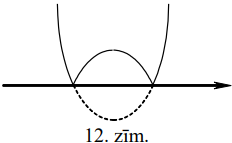

# <lo-sample/> LV.AMO.2006.12.4

Dotas $5$ pēc ārējā izskata vienādas monētas. Trīs no tām ir īstas (to masas ir
vienādas savā starpā), divas - viltotas (to masas arī ir vienādas savā starpā, 
bet citādas nekā īstajām monētām). Nav zināms, vai viltotā monēta vieglāka vai 
smagāka par īsto. Mūsu rīcībā ir sviras svari; ir iespējams nolasīt uz kausiem 
uzlikto masu starpību. Ar kādu iespējami mazu svēršanu skaitu Jūs varat atras 
kaut vienu īsto monētu? (**Nav jāpierāda**, ka Jūsu piedāvātais svēršanu skaits
ir mazākais iespējamais.)

<small>

* questionType:
* domain:

</small>

## Atrisinājums

Parādīsim, kā to var izdarīt ar $2$ svēršānām. Apzīmēsim monētas ar 
$A,\ B,\ C,\ D,\ E$.

Nosveram $A$ un $B$ pret $C$ un $D$; nenegatīvo starpību apzīmējam ar $x$. 
Nosveram $A$ pret $C$; nenegatīvo starpību apzīmējam ar $y$.

Ja $x=0$, tad $E$ ir īsta monēta.

Ja $x \neq 0$ un $y=0$, tad $A$ un $C$ abas ir īstas.

Ja $x \neq 0$ un $x=y$, tad $B$ un $D$ abas ir īstas.

Ja $x \neq 0$ un $x=2 y$, tad $E$ ir īsta.

$\underline{Piezīme.}$ Var pierādīt, ka ar vienu svēršanu nepietiek.

# <lo-sample/> LV.AMO.2006.12.5

Vai eksistē tāda funkcija $f$, kuras definīcijas apgabals sastāv no visiem 
plaknes daudzstūriem, visas vērtības ir lielākas par $0$ un mazākas par $1$ un 
kam piemīt īpašība: ja daudzstūris $D$ sadalīts divos daudzstūros $D_{1}$ un 
$D_{2}$, tad noteikti $f(D)=f\left(D_{1}\right)+f\left(D_{2}\right)$?

**Piezīme.** Ja daudzstūri $x_{1}$ un $x_{2}$ ir vienādi, bet atšķiras viens no
otra ar novietojumu plaknē, tad varbūt 
$f\left(x_{1}\right) \neq f\left(x_{2}\right)$.

<small>

* questionType:
* domain:

</small>

## Atrisinājums

Sadalīsim plakni vienības kvadrātos un sanumurēsim tos "pa spirāli" ar 
naturāliem skaitļiem, kā parādīts 13.zīm.

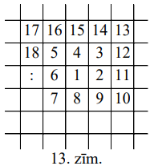

Katram daudzstūrim $D$ eksistē tāds $k$, ka $D$ neiziet ārpus pirmo $k$ 
vienības kvadrātu veidotās figūras. Pieņemsim, ka $D$ aizņemtais laukums $i$-tā
vienības kvadrāta iekšpusē ir $S_{i}(i=1;\ 2;\ \ldots;\ k)$. Tad definējam

$$f(D)=\frac{S_{1}}{2}+\frac{S_{2}}{4}+\frac{S_{3}}{8}+\ldots+\frac{S_{k}}{2^{k}}$$

Īpašības 
$f(D)>0$ un $f\left(D_{1} \cup D_{2}\right)=f\left(D_{1}\right)+f\left(D_{2}\right)$,
ja $D_{1}$ un $D_{2}$ nav kopēju iekšēju punktu, ir acīmredzamas.

Tā kā $\forall i S_{i} \leqslant 1$, tad 
$f(D) \leq \frac{1}{2}+\frac{1}{4}+\frac{1}{8}+\ldots+\frac{1}{2^{k}}=1-\frac{1}{2^{k}}<1$,
un viss pierādīts.

