# <lo-sample/> LV.AMO.2022B.5.1

Kāds ir mazākais naturālais skaitlis, kura pierakstā izmantoti tikai 
cipari $0$ un $2$ un kurš dalās ar $15$?

<small>

* concepts:divisibility,digit
* questionType:FindOptimal
* domain:NT
* subdomain:DOM_NumeralSystems
* topic:DivisibilityRulesLastDigits
* topic:DivisibilityRulesFor3And9
* topic:DecimalNotationDigits

</small>

## Atrisinājums

Pamatosim, ka mazākais skaitlis, kas atbilst nosacijumiem ir $2220$. 
Lai skaitlis dalītos ar $15$, tam jādalās gan ar $3$, gan ar $5$. 
Lai skaitlis dalītos ar $3$, tā ciparu summai jādalās ar $3$. 
Tātad ciparam $2$ šajā skaitlī jāparādās vismaz $3$ reizes. 
Lai uzdevumā aprakstītais skaitlis dalītos ar 5, 
tā pēdējam ciparam jābūt $0$. Līdz ar to meklētajam skaitlim ir vismaz $4$ 
cipari un šis skaitlis ir $2220$.

    
# <lo-sample/> LV.AMO.2022B.5.2

Pa rūtiņu līnijām uzzīmē tādu sešstūri, kuram perimetra un laukuma vērtības sakrīt!  
*Piezīme.* Laukums ir sešstūri veidojošo rūtiņu skaits un perimetrs ir 
rūtiņu malu, kas pilnībā atrodas uz robežas, skaits.

<small>

* concepts:area,perimeter,grid,hexagon,square-side
* questionType:FindExample
* domain:Geom
* subdomain:DOM_Polygons
* topic:SquareGridShapes
* topic:PolygonPerimeter
* topic:Area

</small>

## Atrisinājums

Piemēram, der 1.att. redzamais sešstūris, kuram perimetrs ir 
$20$ un arī laukums ir $20$.

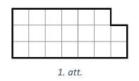

# <lo-sample/> LV.AMO.2022B.5.3

Uz teātra izrādi tika izgatavotas $250$ biļetes un vismaz puse 
no biļetēm tika pārdotas. Zināms, ka tieši trešdaļa
no skatītājiem bija skolēni, tieši piektdaļa – studenti un tieši 
septītdaļa – pensionāri. Cik biļetes tika pārdotas?

<small>

* concepts:fractions,at-least
* questionType:FindAll
* domain:NT
* subdomain:DOM_Divisibility
* topic:MutualPrimes
* topic:ArithmeticSeriesDivisibility

</small>

## Atrisinājums

Lai skatītāju skaitu varētu sadalīt tieši trīs, piecās un 
septiņās daļās, pārdoto biļešu skaitam jādalās ar $3$, $5$ un $7$. 
Tātad pārdoto biļešu skaitam jādalās ar $3 \cdot 5 \cdot 7=105$. 
Tā kā vismaz puse no biļetēm tika pārdotas, tad tika pārdotas 
$105 \cdot 2=210$ biļetes.

# <lo-sample/> LV.AMO.2022B.5.4

Zināms, ka svari (a), (b) un (c) atrodas līdzsvarā. 
Cik bultiņu jāliek jautājuma zīmes vietā, lai svari (d) atrastos
līdzsvarā? Atbildi pamatot!  

<small>

* concepts:equality,pentagon
* questionType:FindAll
* domain:Alg
* subdomain:DOM_EquationSystems
* topic:SystemsSubstituteVariables

</small>

## Atrisinājums

Jautājuma zīmes vietā jāliek sešas bultiņas. Izteiksim visu figūru 
masu bultiņās. No tā, ka svari (c) atrodas līdzsvarā, secinām, 
ka aplīša masa ir vienāda ar četru bultiņu masu.

Līdz ar to varam uzskatīt, ka svariem (b) kreisajā kausā atrodas 
sešas bultiņas, kas sver tikpat, cik trīs kvadrāti. Tātad viena kvadrāta 
masa ir tikpat, cik divu bultiņu masa.

Tālāk apskatām svarus (a). Aizvietojot aplīti ar četrām bultiņām un 
katru kvadrātu ar divām bultiņām, iegūstam, ka piecstūra un četru bultiņu 
masa ir tikpat, cik desmit bultiņu masa. Tātad piecstūra masa ir 
tikpat, cik sešu bultiņu masa.

  
# <lo-sample/> LV.AMO.2022B.5.5

Katrai no trīs meitenēm Elīnai, Gunai un Marutai patīk viena no krāsām: 
zaļa, dzeltena, oranža (katrai cita krāsa),
bet abas pārējās krāsas nepatīk. Zināms, ka tieši viens no apgalvojumiem ir patiess:

* Gunai nepatīk oranža krāsa;
* Elīnai nepatīk zaļa krāsa;
* Elīnai nepatīk oranža krāsa.

Kāda krāsa patīk katrai meitenei? Atbildi pamatot!

<small>

* concepts:true-statement
* questionType:FindAll
* domain:Comb
* subdomain:DOM_Logic
* topic:PartitioningInPairsBijections

</small>

## Atrisinājums

Gunai patīk oranžā, Elīnai - zalā un Marutai - dzeltenā krāsa.

Skaidrs, ka vismaz viens no diviem pēdējiem apgalvojumiem ir patiess, 
jo Elīnai nevar patikt gan zaļā, gan oranžā krāsa. Tā kā kopā 
ir tikai viens patiess apgalvojums, tad pirmais apgalvojums 
noteikti ir aplams un Gunai patīk oranžā krāsa.

Ja Elīnai patiktu dzeltenā krāsa, tad abi pēdējie apgalvojumi 
būtu patiesi, kas nav iespējams. Tā kā Gunai patīk oranžā krāsa, 
tad secinām, ka Elīnai patīk zalā krāsa. Tātad Marutai patīk dzeltenā krāsa.

    
# <lo-sample/> LV.AMO.2022B.6.1

Uz papīra lapas uzrakstīti visi naturālie skaitļi no $1$ līdz $2022$ (katrs vienu reizi). 
Vispirms Amanda ar sarkanu zīmuli apvilka visus skaitļus, kas dalās ar $3$. 
Tad viņa ar zilu zīmuli apvilka visus skaitļus, kas dalās ar $5$. 
Un visbeidzot viņa ar zaļu zīmuli apvilka visus skaitļus, kas dalās ar $7$. 
Cik ir tādu skaitļu, kas ir apvilkti ar vismaz divām dažādām krāsām?

<small>

* concepts:natural-numbers,divisibility
* questionType:FindCount
* domain:NT
* subdomain:DOM_Divisibility
* topic:OtherCountingSetOperations
* topic:MutualPrimes

</small>

## Atrisinājums

Pamatosim, ka $249$ skaitlii ir apvilkti ar vismaz divu krāsu zīmuļiem.

Lai kāds skaitlis būtu apvilkts ar vismaz divu krāsu zīmuļiem, 
nepieciešams aplūkot visus skaitļus, kas dalās vismaz ar diviem 
no dotajiem skaitliem $3$, $5$ vai $7$.

Ja skaitlis dalās ar $3$ un $5$, tad tas dalās ar $15$. 
Tā kā $2022=15 \cdot 134+12$, tad ar $15$ dalās $134$ skaiți no visiem uzrakstītajiem skaitliem.

Ja skaitlis dalās ar $3$ un $7$, tad tas dalās ar $21$. 
Tā kā $2022=21 \cdot 96+6$, tad ar 21 dalās 96 skaitli no visiem uzrakstītajiem skaitliem.

Ja skaitlis dalās ar $5$ un $7$, tad tas dalās ar $35$. Tā kā 
$2022=35 \cdot 57+27$, tad ar $35$ dalās $57$ skaitli no visiem uzrakstītajiem skaitliem.

Ievērojam, ka ir vairāki skaitli, kas vienlaicīgi dalās ar $3$, $5$ un $7$, 
tātad tie dalās arī ar $3 \cdot 5 \cdot 7=105$. Tā kā $2022 = 105 \cdot 19 + 27$, 
tad ar $105$ dalās $19$ skaitļi no visiem uzrakstītajiem skaitļiem. 
Skaitļi, kas dalās ar $105$, tiek ieskaitīti pie skaitļiem, kas dalās ar 
$15$, $21$ un $35$, tātad tie tiek ieskaitīti trīs reizes. 
Secinām, ka kopā ir $134+96+57-38 = 249$ skaitļi, kas dalās ar 
vismaz diviem skaitlliem, tātad tie ir apvilkti ar vismaz divu krāsu zīmuļiem.

    
# <lo-sample/> LV.AMO.2022B.6.2

Parādi, kā no 1. att. dotās rūtiņu lapas var izgriezt desmit figūras, 
kādas dotas 2. att. (iezīmē, kur jāiet griezuma līnijām)! 
Figūras var būt arī pagrieztas.  
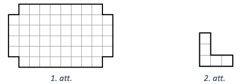

<small>

* concepts:grid,shape,rotation
* questionType:FindExample
* domain:Geom
* subdomain:DOM_CuttingCoversColoring
* topic:SquareGridCutting
* topic:RotationBy90

</small>

## Atrisinājums

Skat., piemēram, 4. att.

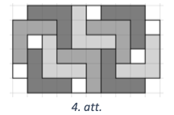

    
# <lo-sample/> LV.AMO.2022B.6.3

Tumšā rudens vakarā Māris izdomāja saskaitīt visus naturālos skaitļus 
no $1$ līdz $n$, kur $n$ ir kāds naturāls skaitlis.
Vai var gadīties, ka Māris ieguva summu, kuras pēdējais cipars ir
**(A)** $8$, **(B)** $9$?

<small>

* concepts:natural-numbers,sum,last-digit
* questionType:ProveDisprove,ProveDisprove
* domain:NT
* subdomain:DOM_Congruences
* topic:PeriodicRemainders
* topic:SeriesOneToNSum

</small>

## Atrisinājums

**(A)** Jā, var, piemēram, $1+2+3+4+5+6+7=28$.

**(B)** Nē, nevar. Apskatām skaitlu summu $S_{n}$ dažām $n$ vērtībām:

* $S_{1}=1$
* $S_{2}=1+2=3$
* $S_{3}=1+2+3=6$
* $S_{4}=1+2+3+4=S_{3}+4=6+4=10$
* $S_{5}=1+2+3+4+5=S_{4}+5=10+5=15$
* $S_{6}=S_{5}+6=15+6=21$
* $\circ$...

Izveidosim tabulu, kurā rakstīsim skaitļa $n$ pēdējo ciparu un 
skaitļu summas $S_{n}$ pēdējo ciparu. Ievērojam, ka summas 
$S_{n}$ pēdējo ciparu iegūstam, ja iepriekšējās summas pēdējam 
ciparam pieskaitām skaitļa $n$ pēdējo ciparu.

| Skaitļa $n$ pēdējais cipars | Summas $S_{n}$ pēdējais cipars |
| --------------------------- | ------------------------------ |
| $\mathbf{1}$                | $\mathbf{1}$                   |
| 2                           | 3                              |
| 3                           | 6                              |
| 4                           | 0                              |
| 5                           | 5                              |
| 6                           | 1                              |
| 7                           | 8                              |
| 8                           | 6                              |
| 9                           | 5                              |
| 0                           | 5                              |
| 1                           | 6                              |
| 2                           | 8                              |
| 3                           | 1                              |
| 4                           | 5                              |
| 5                           | 0                              |
| 6                           | 6                              |
| 7                           | 3                              |
| 8                           | 1                              |
| 9                           | 0                              |
| 0                           | 0                              |
| $\mathbf{1}$                | $\mathbf{1}$                   |

Tā kā tabulas pēdējā rindiņā skaitla $n$ un summas $S_{n}$ 
pēdējie cipari ir tādi paši kā pirmajā, tad tālāk vērtības tabulā sāks 
periodiski atkārtoties. Cipars $9$ nav tabulas otrajā kolonnā, 
tāpēc tas nevar būt summas pēdējais cipars.

    
# <lo-sample/> LV.AMO.2022B.6.4

Zināms, ka svari (a), (b) un (c) atrodas līdzsvarā. Cik aplīšu jāliek 
jautājuma zīmes vietā, lai svari (d) atrastos
līdzsvarā? Atbildi pamatot!  

<small>

* concepts:equality
* questionType:FindAll
* domain:Alg
* subdomain:DOM_EquationSystems
* topic:SystemsSubstituteVariables

</small>

## Atrisinājums

Jautājuma zīmes vietā jāliek pieci aplǐši. Izteiksim visu figūru 
masu aplīšos. No tā, ka svari (c) atrodas līdzsvarā, secinām, 
ka piecstūra masa ir vienāda ar četru aplīšu masu.

Tātad varam uzskatīt, ka svariem (b) kreisajā kausā atrodas seši aplīši, 
kuru masa ir tikpat, cik trīs bultiņu masa. Tātad vienas bultiņas 
masa ir tikpat, cik divu aplīšu masa.

Tālāk apskatīsim svarus (a). Aizvietojot piecstūri ar četriem 
aplīšiem un katru bultiņu ar diviem aplīšiem, iegūstam, ka 
četrstūra un piecu aplīšu masa ir tikpat, cik desmit aplīšu masa. 
Tātad četrstūra masa ir tikpat, cik piecu aplīšu masa.

# <lo-sample/> LV.AMO.2022B.6.5

Daži no 273 ciema iedzīvotājiem visu laiku saka patiesību, 
pārējie visu laiku melo. Katram no ciema iedzīvotājiem
ir tieši viena mīļākā nedēļas diena. Aptaujājot iedzīvotājus, 
viņiem tika lūgts atbildēt uz septiņiem jautājumiem,
katrā no tiem izvēloties vienu no dotajām atbildēm:  
  
Uz katru jautājumu saņemto apstiprinošo ("jā") atbilžu skaits bija šāds: 
pirmdiena – $51$, otrdiena – $52$,
trešdiena – $53$, ceturtdiena – $54$, piektdiena – $55$, 
sestdiena – $56$, svētdiena – $57$. Cik ciema iedzīvotāji visu laiku melo?  

<small>

* concepts:truth,falsehood,mapping
* questionType:FindCount
* domain:Comb
* subdomain:DOM_Logic
* topic:TrueAndFalseStatements
* topic:DoubleCounting

</small>

## Atrisinājums

Ciemā ir $21$ melis.

Kopā tika sanemtas $51+52+53+54+55+56+57=378$ atbildes "jā". 
Ievērosim, ka katrs ciema iedzīvotājs, kas saka patiesību, 
atbildēja "jā" tieši vienu reizi (savai mīlākajai dienai), 
bet katrs melis - tieši sešas reizes (visām dienām, kas 
nav viņa mīlākā diena). Tātad, ja mēs vienu iedzīvotāju, 
kurš saka patiesību, pārvērstu par meli, tad papildus mēs 
iegūstu piecas "liekas" atbildes jā.

Iesākumā pieņemsim, ka visi ciema iedzīvotāji saka patiesību, 
tādā gadījumā mums kopā būtu tieši $273$ atbildes "jā". 
Tā kā mums ir $378$ atbildes "jā", tad mums "liekas" ir 
$378-273=105$ atbildes "jā". Tātad par meļiem mums 
jāpārvērš $105:5=21$ ciema iedzīvotājs.

    
# <lo-sample/> LV.AMO.2022B.7.1

Uz tāfeles bija uzrakstīts šāds teksts: $A869B$. 
Katrs no burtiem $A$ un $B$ jāaizstāj ar vienu ciparu (tie var būt arī
vienādi) tā, lai iegūtais piecciparu skaitlis dalītos ar $15$. 
Cik dažādos veidos to var izdarīt?

<small>

* concepts:variable,digit,divisibility
* questionType:FindCount
* domain:NT
* subdomain:DOM_NumeralSystems
* topic:DivisibilityRulesLastDigits
* topic:DivisibilityRulesFor3And9

</small>

## Atrisinājums

Prasīto var izdarīt $6$ veidos.

Lai skaitlis $\overline{A869B}$ dalītos ar $15$, tam jādalās 
gan ar $3$, gan ar $5$. Apskatīsim divus iespējamos gadījumus, 
kāds cipars var būt ierakstīts $B$ vietā, lai skaitlis dalītos ar $5$.

* Ja $B=0$, tad skaitla ciparu summa ir $A+8+6+9+0=A+23$. 
  Lai skaitlis dalītos ar $3$, tā ciparu summai jādalās ar $3$, 
  tāpēc iespējamās $A$ vērtības ir $1$, $4$ vai $7$.
* Ja $B=5$, tad skaitla ciparu summa ir $A+8+6+9+5=A+28$. 
  Lai skaitlis dalītos ar $3$, tā ciparu summai jādalās ar $3$, 
  tāpēc iespējamās $A$ vērtības ir $2$, $5$ vai $8$.

Līdz ar to iespējami seši dažādi varianti, kādus ciparus var ierakstīt 
$A$ un $B$ vietā:
$A=1$ un $B=0$;
$A=4$ un $B=0$;
$A=7$ un $B=0$;
$A=2$ un $B=5$;
$A=5$ un $B=5$;
$A=8$ un $B=5$.

    
# <lo-sample/> LV.AMO.2022B.7.2

Vai var atrast **(A)** $5$; **(B)** $15$ naturālus skaitļus 
(ne obligāti dažādus), kuru summa ir vienāda ar to reizinājumu?

<small>

* concepts:sum,product
* questionType:ProveDisprove
* domain:Alg
* subdomain:DOM_Equations
* topic:EquationsAndMonotonicity

</small>

## Atrisinājums 

**(A)** Jā, var, piemēram, der skaitļi $1,1,2,2,2$, jo $1+1+2+2+2=8$ un 
$1 \cdot 1 \cdot 2 \cdot 2 \cdot 2=8$

**(B)** Jā, var, der, piemēram, skaitli $1, 1, 1, 1, 1, 1, 1, 1, 1, 1, 1, 1, 1, 2, 15$ 
($13$ vieninieki, $2$ un $15$), jo $13 \cdot 1+2+15=30$ un $1 \cdot 2 \cdot 15=30$.

*Piezīme.* **(A)** gadījumā der arī $1, 1, 1, 3, 3$ vai $1,1,1,2,5$.

    
# <lo-sample/> LV.AMO.2022B.7.3

Parādi, kā plaknē novilkt $6$ taisnes un uz tām atlikt $7$ punktus tā, 
lai uz katras no taisnēm būtu atzīmēti tieši trīs punkti!

<small>

* concepts:plane,line,point
* questionType:FindExample
* domain:Geom
* subdomain:DOM_ObjectSystemsGeometry
* topic:CountingPointsSegmentsAndOthers

</small>

## Atrisinājums

Skat., piemēram, 5. att.

    
# <lo-sample/> LV.AMO.2022B.7.4

Uz galda ir kaudze ar konfektēm. Karlsons un Brālītis pēc kārtas izdara gājienus, 
Karlsons sāk spēli. Vienā gājienā
spēlētājs var paņemt no kaudzes un apēst vai nu vienu, 
vai divas konfektes. Uzvar tas spēlētājs, kurš apēd pēdējo
konfekti. Kurš spēlētājs, pareizi spēlējot, vienmēr var uzvarēt, 
ja sākumā kaudzē ir **(A)** $6$ konfektes;
**(B)** $2022$ konfektes?

<small>

* concepts:game,set,remove,to-win
* questionType:Algorithm,Algorithm
* domain:NT
* subdomain:DOM_Divisibility,FixedInvariant
* method:MTH_FixedInvariant
* topic:GameInvariant

</small>

## Atrisinājums 

Abos gadījumos vienmēr var uzvarēt Brālītis. Lai to panāktu, 
viņš var rīkoties šādi: katrā gājienā, ja Karlsons ēd vienu konfekti, 
tad Brālītis ēd divas un otrādi, ja Karlsons ēd divas, 
tad Brālītis - vienu. Šādi spēlējot, pēc katra (abu spēlētāju) 
gājiena konfekšu skaits kaudzē samazinās tieši par 3. 
Tā kā sākumā kaudzē konfekšu skaits dalī̄ās ar $3$ (gan $6$, gan $2022$ 
dalās ar $3$), tad arī abos gadījumos pēc kāda Brāliša gājiena 
tas kļūs vienāds ar $0$, tātad Brālītis uzvarēs.

*Piezīme.* **(A)** gadījumā Brālītis uzvarēs jau pēc otrā gājiena, 
bet **(B)** gadījumā Brālítis uzvarēs pēc $2022: 3=674$. gājiena.

# <lo-sample/> LV.AMO.2022B.7.5

Daži no $272$ ciema iedzīvotājiem visu laiku saka patiesību, 
pārējie visu laiku melo. Katram no ciema iedzīvotājiem
ir tieši viena mīļākā nedēļas diena. Aptaujājot iedzīvotājus, 
viņiem tika lūgts atbildēt uz septiņiem jautājumiem,
katrā no tiem izvēloties vienu no dotajām atbildēm:  

  

Uz katru jautājumu saņemto apstiprinošo ("jā") atbilžu skaits bija šāds: 
pirmdiena – $53$, otrdiena – $54$,
trešdiena – $55$, ceturtdiena – $56$, piektdiena – $57$, sestdiena – $58$, svētdiena – $59$. 
Cik ciema iedzīvotāju visu laiku melo?

<small>

* concepts:truth,falsehood,mapping
* questionType:FindCount
* domain:Comb
* subdomain:DOM_Logic
* topic:DoubleCounting

</small>

## Atrisinājums

*Atbilde.* Ciemā ir $24$ meļi.

Kopā tika saņemtas $53+54+55+56+57+58+59=392$ atbildes "jā". 
Ievērosim, ka katrs ciema iedzīvotājs, kas saka patiesību, 
atbildēja "jā" tieši vienu reizi (savai mīlākajai dienai), 
bet katrs melis - tieši sešas reizes (visām dienām, 
kas nav vina mīļākā diena). Tātad, ja mēs vienu iedzīvotāju, 
kurš saka patiesību, pārvērstu par meli, tad papildus mēs iegūstu 
piecas "liekas" atbildes jā.

Iesākumā pieņemsim, ka visi ciema iedzīvotāji saka patiesību, 
tādā gadījumā mums kopā būtu tieši $272$ atbildes "jā". Tā kā mums 
ir $392$ atbildes "jā", tad mums "liekas" ir $392-272=120$ 
atbildes "jā". Tātad par meļiem mums jāpārvērš $120:5=24$ ciema iedzīvotāji.

    
# <lo-sample/> LV.AMO.2022B.8.1

Uz tāfeles bija uzrakstīts šāds teksts: $N597M$. 
Katrs no burtiem $N$ un $M$ jāaizstāj ar vienu ciparu (tie var būt arī
vienādi) tā, lai iegūtais piecciparu skaitlis dalītos ar $12$. 
Cik dažādos veidos to var izdarīt?

<small>

* concepts:divisibility,variable,digit
* questionType:FindCount
* domain:NT
* subdomain:DOM_NumeralSystems
* topic:DivisibilityRulesFor2And4
* topic:DivisibilityRulesFor3And9

</small>

## Atrisinājums

Prasīto var izdarīt $6$ dažādos veidos.

Lai skaitlis $\overline{N597M}$ dalītos ar 12, tam jādalās 
gan ar $3$, gan ar $4$. Lai skaitlis dalītos ar $4$, 
tā pēdējo divu ciparu veidotajam skaitlim jādalās ar $4$. 
Apskatīsim divus iespējamos gadījumus, kāds cipars var 
būt ierakstīts $M$ vietā, lai skaitlis dalītos ar $4$.

* Ja $M=2$, tad skaitla ciparu summa ir $N+5+9+7+2=N+23$. 
  Lai skaitlis dalītos ar 3, tā ciparu summai jādalās ar $3$, 
  tāpēc iespējamās $N$ vērtības ir $1$, $4$ vai $7$.
* Ja $M=6$, tad skaitla ciparu summa ir $N+5+9+7+6=N+27$. 
  Lai skaitlis dalítos ar 3, tā ciparu summai jādalās ar $3$, 
  tāpēc iespējamās $N$ vērtības ir $0$, $3$, $6$ vai $9$. 
  Tā kā skaitlis nevar sākties ar $0$, 
  iespējamās $N$ vērtības ir $3$, $6$ vai $9$.

Līdz ar to iespējami seši dažādi varianti, kādus ciparus var 
ierakstīt $M$ un $N$ vietā: $(N,M)=(1,2)$; $(N,M)=(4,2)$; 
$(N,M)=(7,2)$; $(N,M)=(3,6)$; $(N,M)=(6,6)$; $(N,M)=(9,6)$.

    
# <lo-sample/> LV.AMO.2022B.8.2

Skolēnam tika uzdots mājas darbs, kurā bija $20$ uzdevumi. 
Par katru pareizi atrisinātu uzdevumu tiek doti $8$
punkti, par katru nepareizi atrisinātu uzdevumu tiek atņemti $5$ punkti, 
ja uzdevums nav risināts, tad par to ir $0$ punkti. 
Cik uzdevumus skolēns atrisināja pareizi, 
ja kopā viņš ieguva $13$ punktus?

<small>

* concepts:add,subtract
* questionType:FindAll
* domain:NT
* subdomain:DOM_IntegerEquations
* topic:NumTheoryInequalitySideComparison
* method:MTH_ExhaustiveAlgorithms

</small>

## Atrisinājums 

Skolēns pareizi atrisināja $6$ uzdevumus. Pamatosim, 
ka tā ir vienīgā derīgā vērtība. Apzīmējam pareizi 
atrisināto uzdevumu skaitu ar $x$ un nepareizi 
atrisināto uzdevumu skaitu ar $y$. legūstam vienādojumu

$$8x-5y=13$$

Tā kā $8x$ ir pāra skaitlis, tad $5y$ noteikti ir nepāra skaitlis, 
jo starpībai jābūt 13. Tātad $y$ ir nepāra skaitlis. 
No vienādības $8x-5y=13$ izsakot $x$, iegūstam $x=(13+5y):8$. 
Ievērojam, ka kopā bija 20 uzdevumi, tātad $x+y \leq 20$ un 
ir iespējamas tikai 6 dažādas $y$ vērtības, kuras attēlotas 
tabulā. Ja $y \geq 12$, tad $x>9$ un $x+y>20$. Ja aprēķinātā 
$x$ vērtība ir naturāls skaitlis, tad iegūtās $x$ un $y$ vērtības 
ir derīgas. Tabulā redzams, ka vienīgās derīgās vērtības ir 
$x=6$ un $y=7$, tātad skolēns pareizi atrisināja 6 uzdevumus, 
nepareizi atrisināja $7$ uzdevumus, bet $7$ uzdevumus nerisināja.

| $\boldsymbol{y}$ | Vai vērtība $\boldsymbol{x}=(\mathbf{1 3}+\mathbf{5} \boldsymbol{y}): \mathbf{8}$ ir naturāls skaitlis? |
| :---: | :---: |
| $\mathbf{1}$ | Nē |
| $\mathbf{3}$ | Nē |
| $\mathbf{5}$ | Nē |
| $\mathbf{7}$ | Jā, $x=6$ |
| $\mathbf{9}$ | Nē |
| $\mathbf{11}$ | Nē |

    
# <lo-sample/> LV.AMO.2022B.8.3

Trijstūrī $ABC$ uz malas $BC$ atlikts tāds punkts $D$, 
ka $AD = BD$ un $AB = DC = AC$. Aprēķināt trijstūra $ABC$ leņķus!

<small>

* concepts:triangle
* questionType:FindAll
* domain:Geom
* subdomain:DOM_AnglesParallelsSimilarity
* topic:TriangleAngles,TrianglesIsosceles

</small>

## Atrisinājums

Tā kā $AD=BD$, tad trijstūris $ABD$ ir vienādsānu 
trijstūris ar pamatu $AB$ un tā pamata pielenķi ir vienādi, 
tātad $\sphericalangle ABD=\sphericalangle BAD=\alpha$ (skat. 6. att.).

No trijstūra $ABD$ iegūstam, ka 
$\sphericalangle ADB=180^{\circ}-\alpha-\alpha=180^{\circ}-2 \alpha$.

Ievērojam, ka 
$\sphericalangle ADC=180^{\circ} - \sphericalangle ADB=180^{\circ}-\left(180^{\circ}-2 \alpha\right)=2 \alpha$ kā blakusleņki. Tā kā $AC=DC$, tad arī trijstūris $ACD$ 
ir vienādsānu un tā pamata pieleņki ir vienādi, tātad 
$\sphericalangle DAC=\sphericalangle ADC = 2\alpha$.

Tā kā $AB=AC$, tad arī trijstūris $ABC$ ir vienādsānu un tā pamata pieleņķi ir vienādi, tātad $\sphericalangle ABC=\sphericalangle ACB=\alpha$. 
No trijstūra $ACD$ iegūstam, ka

$$\sphericalangle ADC+\sphericalangle DAC+\sphericalangle ACD = 2 \alpha+2 \alpha+\alpha=180^{\circ}$$

Atrisinot vienādojumu $5 \alpha=180^{\circ}$, iegūstam, ka $\alpha=36^{\circ}$.

Aprēkinām trijstūra $ABC$ leņķu vērtības:

$$\begin{aligned}
& \circ \quad \sphericalangle ABC = \sphericalangle ACB = \alpha=36^{\circ};\\
& \circ \quad \sphericalangle BAC = \sphericalangle BAD + \sphericalangle DAC = \alpha+2 \alpha=108^{\circ}.
\end{aligned}$$

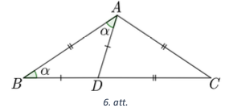

    
# <lo-sample/> LV.AMO.2022B.8.4

Vai pa apli var uzrakstīt skaitļus  
**(A)** $0;\;1;\;2;\;3;\;4;\;5;\;6;\;7;\;8;\;9$;
**(B)** $0;\;1;\;2;\;3;\;4;\;5;\;6;\;7;\;8;\;9;\;10;\;11;\;12;\;13$;
tā, lai katri divi blakus esoši skaitļi atšķirtos par $3$; $4$ vai $5$?

<small>

* concepts:integer-numbers,distance
* questionType:ProveDisprove,ProveDisprove
* domain:Comb
* subdomain:DOM_Graphs
* method:MTH_ContradictionForExistence
* topic:HamiltonCircuits

</small>

## Atrisinājums 

**(A)** Pamatosim, ka prasītais nav iespējams.  
Ievērosim, ka skaitli 0; 1; 2; 8 un 9 nevar būt uzrakstiti blakus 
viens otram, jo katru divu skaitlu starpība nav 3; 4 vai 5. 
Tātad tos jāraksta, izlaižot vienu pozīciju (skat. 7. att., 
kur ar burtiem apzīmētas vietas, kurās jāieraksta šie skaitlii). 
Skaitli $7$ var rakstīt blakus tikai skaitlim $2$, jo to starpība ir $5$, 
bet to nevar rakstīt blakus pārējiem pa apli uzrakstītajiem 
skaitliem $0$; $1$; $8$ vai $9$, tātad dotos skaitlus nevar 
uzrakstīt tā, lai katri divi blakus esoši skaitļi atškirtos par $3$; $4$ vai $5$.

**(B)** Jā, var, piemēram, skat. 8. att., kur rinķa iekšpusē 
ierakstīts, par cik atškiras skaitļi.

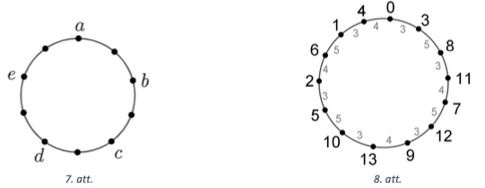

    
# <lo-sample/> LV.AMO.2022B.8.5

Piecu draugu lokā izvērsās strīds, kurā:

* Elīna saka: "Es vienmēr saku taisnību."
* Guna saka: "Gan Elīna, gan Agnese melo."
* Maruta saka: "Visi saka taisnību."
* Agnese saka: "Elīna melo."
* Emīls saka: "Visi melo."
    
Cik draugu saka taisnību?

<small>

* concepts:truth,falsehood
* questionType:FindCount
* domain:Comb
* subdomain:DOM_Logic
* topic:TrueAndFalseStatements

</small>

## Atrisinājums 

Pamatosim, ka tikai viens no draugiem saka taisnību. Ievērojam:

* ja Elīna saka taisnību, tad Agnese melo, tātad viņas abas nevar runāt taisnību;
* ja Agnese melo, tad Elīna saka taisnību, tātad viņas abas nevar melot.

Tātad vai nu Elīna, vai Agnese runā taisnību un otra melo. 
No tā izriet, ka gan Guna, gan Maruta, gan Emīls melo. 
Tātad tikai viens no draugiem saka taisnību.

    
# <lo-sample/> LV.AMO.2022B.9.1

Cik ir tādu četrciparu skaitļu $\overline{ABBA}$, kas dalās ar $99$? 
(Vienādiem burtiem atbilst vienādi cipari, dažādiem burtiem
var atbilst arī vienādi cipari.)

<small>

* concepts:divisibility,digit,variable
* questionType:FindCount
* domain:NT
* subdomain:DOM_NumeralSystems
* topic:DivisibilityRuleFor11
* topic:DivisibilityRulesFor3And9

</small>

## Atrisinājums 

Pamatosim, ka ir 10 skaitlļi, kas atbilst uzdevuma nosacījumiem: 
$1881$, $2772$, $3663$, $4554$, $5445$, $6336$, $7227$, $8118$, $9009$, $9999$.

Lai skaitlis dalītos ar $99$, tam jādalās gan ar $11$, gan ar $9$. 
Ievērojam, ka dotais skaitlis dalās ar $11$, jo tā ciparu summas, 
kas atrodas nepāra pozīcijās, un ciparu summas, kas atrodas 
pāra pozīcijās, starpība ir $(A+B)-(B+A)=0$, kas dalās ar $11$.

Lai skaitlis dalītos ar $9$, tā ciparu summai jādalās ar $9$. 
Tātad $A+B+B+A=2(A+B)$ jādalās ar $9$. Tā kā $A$ un $B$ ir cipari, 
tad iespējami divi gadījumi: $A+B=9$ vai $A+B=18$.

Ja $A+B=9$, tad iespējami devini gadijumi:

$$A+B=1+8=2+7=3+6=4+5=5+4=6+3=7+2=8+1=9+0$$

Ja $A+B=18$, tad iespējams tikai viens gadijums $A+B=9+9$.

    
# <lo-sample/> LV.AMO.2022B.9.2

Vai noteikti $x + \frac{9}{x} > y + \frac{9}{y}$, ja **(A)** $x > y > 0$, **(B)** $x > y > 3$? 

<small>

* concepts:inequality
* questionType:ProveDisprove,ProveDisprove
* domain:Alg
* subdomain:DOM_Inequalities
* method:MTH_PolynomialTransformations
* topic:AddingOrMultiplyingInequalities

</small>

## Atrisinājums

**(A)** Nē, piemēram, ja $x=1$ un $y=0.1$, tad 
$x+\frac{9}{x}=10$ un $y+\frac{9}{y}=90.1$, bet $10<90.1$.

**(B)** Pamatosim, ka, ja $x>y>3$, tad dotā nevienādība ir patiesa.

Nevienādības $x+\frac{9}{x}>y+\frac{9}{y}$ abas puses reizinot 
ar pozitīvu izteiksmi $xy$, iegūstam ekvivalentu nevienādību

$$x^{2} y+9 y>x y^{2}+9x$$

Lai pierādītu, ka dotā nevienādība ir patiesa, pietiek pamatot, ka 
$x^{2}y + 9y - xy^{2} - 9x > 0$.
Ievērojam, ka $x-y>0$ un $xy-9>0$, jo pēc dotā $x>y>3$.

Apskatām divu pozitīvu izteiksmju reizinājumu un to ekvivalenti pārveidojam:

$$0 < (xy-9)(x-y)=x^{2}y - xy^{2} -9x + 9y$$

Līdz ar to esam ieguvuši vajadzīgo.

    
# <lo-sample/> LV.AMO.2022B.9.3

Taisnleņķa trijstūrī $ACB$ ($\sphericalangle C = 90^{\circ}$) 
novilkts augstums $CH$. Uz malas $AC$ atlikts punkts $K$ tā, ka 
$\sphericalangle CBK = \sphericalangle BAC$.
Pierādīt, ka taisne $CH$ dala nogriezni $BK$ divās vienādās daļās!

<small>

* concepts:right-triangle,altitude,line,segment
* questionType:Prove
* domain:Geom
* subdomain:DOM_AnglesParallelsSimilarity
* topic:TrianglesIsosceles

</small>

## Atrisinājums

Apzīmējam $CH$ un $KB$ krustpunktu ar $O$ un 
$\sphericalangle CBK=\sphericalangle BAC=\alpha$, 
$\sphericalangle ABC=\beta$ (skat. 9.att.). 
No trijstūra $ABC$ iegūstam, ka 
$\sphericalangle BAC=180^{\circ}-\sphericalangle ACB-\sphericalangle ABC$ 
jeb $\alpha=90^{\circ}-\beta$. No trijstūra $BHC$ iegūstam, ka 
$\sphericalangle HCB=180^{\circ}-\sphericalangle CHB-\sphericalangle HBC=90^{\circ}-\beta=\alpha$, tātad trijstūris $COB$ ir vienādsānu trijstūris, jo divi tā leņķi ir vienādi 
$\sphericalangle OBC=\sphericalangle OCB=\alpha$. 
No tā izriet, ka $BO = OC$ kā vienādsānu trijstūra sānu malas.

No trijstūra $KCB$ iegūstam, ka 
$\sphericalangle BKC=180^{\circ}-\sphericalangle KCB-\sphericalangle KBC =  90^{\circ}-\alpha=\beta$. 
Ievērojam, ka 
$\sphericalangle ACH=\sphericalangle ACB-\sphericalangle HCB=90^{\circ}-\alpha=\beta$. 
Tātad trijstūris $KOC$ ir vienādsānu, jo divi tā leņķi ir vienādi 
$\sphericalangle OKC=\sphericalangle KCO = \beta$, un tā sānu malas ir vienādas $CO=OK$.

No vienādībām $BO=OC$ un $CO=OK$ iegūstam, ka $BO=OK$, tātad $CH$ 
dala nogriezni $BK$ divās vienādās daļās

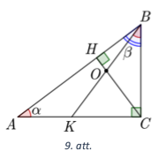

    
# <lo-sample/> LV.AMO.2022B.9.4

Vai pa apli var uzrakstīt skaitļus  
**(A)** 1; 2; 3; 4; 5; 6; 7; 8; 9; 10; 11; 12; 13;  
**(B)** 1; 2; 3; 4; 5; 6; 7; 8; 9; 10; 11; 12; 13; 14;  
tā, lai katri divi blakus esoši skaitļi atšķirtos par $3$; $4$ vai $5$?

<small>

* concepts:integer-numbers,distance
* questionType:ProveDisprove
* domain:Comb
* subdomain:DOM_Graphs
* method:MTH_ContradictionForExistence
* topic:HamiltonCircuits

</small>

## Atrisinājums 

**(A)** Pamatosim, ka prasītais nav iespējams.

Ievērosim, ka skaitļi $1$; $2$; $3$; $11$; $12$ un $13$ nevar būt 
uzrakstīti blakus viens otram, jo katru divu skaitļu starpība nav 
$3$; $4$ vai $5$. Tātad tos jāraksta, izlaižot vienu pozīciju, 
tādējādi rodas tikai divas blakus vietas, kurās nav ierakstīti 
skaitļi (skat. 10.att.).

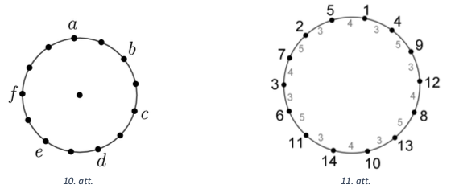

Skaitli 4 var rakstīt blakus tikai skaitlim $1$, jo to starpība ir $3$, 
bet to nevar rakstīt blakus pārējiem jau uzrakstītajiem skaitļiem 
$2$; $3$; $11$; $12$ vai $13$. Tātad skaitli $4$ jāraksta 
vienā no divām blakus esošajām brīvajām vietām.

Skaitli $10$ var rakstīt blakus tikai skaitlim 13, bet to nevar 
rakstīt blakus pārējiem pa apli uzrakstītajiem skaitļiem $1$; $2$; $3$; $11$ vai $12$. 
Tātad skaitli 10 jāraksta vienā no divām blakus esošajām brīvajām vietām. 
No tā izriet, ka skaitļus 4 un 10 jāraksta blakus, bet rodas pretruna 
ar uzdevuma nosacījumiem, jo to starpība ir $6$. Tātad dotos skaitļus 
nevar uzrakstīt tā, lai katri divi blakus esoši skaitļi atšķirtos par $3$; $4$ vai $5$.

**(B)** Jā, var, piemēram, skat. 11. att., kur rinķa iekšpusē ierakstīts, 
par cik atšķiras skaitļi.

    
    
# <lo-sample/> LV.AMO.2022B.9.5

Mākslas muzeja plānojums ir taisnstūris ar izmēriem **(A)** $8 \times 9$; 
**(B)** $9 \times 11$ rūtiņas, 
kur viena rūtiņa atbilst vienai muzeja telpai. 
Muzeja vadītājs vēlas izveidot apmeklētāju maršrutu, 
kuram izpildās šādas īpašības:

* maršruts sākas kādā no rūtiņām (telpām), kas atrodas pie taisnstūra malas;
* apmeklētājs no vienas rūtiņas (telpas) var pāriet uz citu rūtiņu (telpu), ja tām ir kopīga mala;
* apmeklētājs maršruta laikā apmeklē katru rūtiņu (telpu) tieši vienu reizi;
* maršruts beidzas rūtiņā (telpā), kas atrodas pie taisnstūra malas blakus maršruta sākuma rūtiņai (telpai).

Vai muzeja vadītājs var izveidot šādu maršrutu?

<small>

* concepts:grid,square-side,rectangle,path
* questionType:ProveDisprove,ProveDisprove
* domain:Comb
* method:MTH_ContradictionForExistence
* subdomain:DOM_Graphs
* topic:GraphColoredVertices

</small>

## Atrisinājums

**(A)** Jā, var, skat., piemēram, 12. att.

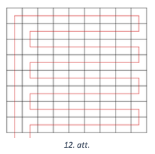

**(B)** Pierādīsim, ka prasīto maršrutu nav iespējams izveidot. 
Iekrāsosim taisnstūra rūtiņas šaha galdiņa veidā un ievērosim, ka šādam 
krāsojumam izpildās īpašība: blakus esošām rūtiņām ir dažādas krāsas. 
Pieņemsim pretējo, ka prasītais maršruts eksistē. Tā kā maršruts iziet cauri 
visām rūtiņām, kuru ir nepāra skaits, tad pāreja no vienas krāsas 
rūtiņas uz otras krāsas rūtiņu notiek pāra skaitu reižu. Līdz ar to maršruts 
beigsies tādas pašas krāsas rūtiņā kā maršruta sākuma rūtiņa. 
Taču tā nevar būt, jo šī rūtiņas atrodas blakus rūtiņai, 
kurā maršruts sākās. Līdz ar to iegūta pretruna, tāpēc šāds maršruts neeksistē.

    
    
# <lo-sample/> LV.AMO.2022B.10.1

Kāds ir skaitļa $2022^{2022}$ pēdējais cipars?

<small>

* concepts:power,last-digit
* questionType:FindAll
* domain:NT
* subdomain:DOM_Congruences

</small>

## Atrisinājums-1

Skaitļa pēdējo ciparu noskaidrosim, apskatot doto skaitli 
pēc moduļa $10$. Ievērosim, ka $2022^{2022} \equiv 2^{2022}(\bmod 10)$. 
Tātad mums jānoskaidro skaitļa $2^{2022}$ pēdējais cipars.

Virkne $2^{n}, n=1,2, \ldots$, ir periodiska pēc moduļa $10$, 
apskatīsim šīs virknes pirmos locekļus:

* ja $n=1$, tad $2^{1} \equiv 2 \pmod {10}$;
* ja $n=2$, tad $2^{2} \equiv 4 \pmod {10}$;
* ja $n=3$, tad $2^{3} \equiv 8 \pmod {10}$;
* ja $n=4$, tad $2^{4} \equiv 16 \equiv 6 \pmod {10}$;
* ja $n=5$, tad $2^{5} \equiv 32 \equiv 2 \pmod {10}$.

Šo informāciju ērti apkopot tabulā:

| $n$ | 1 | 2 | 3 | 4 | 5 | $\ldots$ |
| :---: | :---: | :---: | :---: | :---: | :---: | :---: |
| $2^{n} \pmod {10}$ | $\mathbf{2}$ | 4 | 8 | 6 | $\mathbf{2}$ | $\ldots$ |

Redzam, ka virkne $2^{n}(\bmod 10)$ ir periodiska ar perioda garumu $4$. 
Tā kā $2022=4 \cdot 505+2$, tad virknes 2022.locekļa pēdējais cipars būs 
tāds pats kā virknes 2.locekļa pēdējais cipars, tātad pēdējais 
cipars būs $4$. Līdz ar to esam ieguvuši, ka skaitļa 
$2022^{2022}$ pēdējais cipars ir $4$.

## Atrisinājums-2

Skaitļa pēdējo ciparu noskaidrosim, apskatot doto skaitli pēc moduļa $10$. 
Ievērojot, ka $2^{4} \equiv 16 \equiv 6(\bmod 10)$ un 
$6^{n} \equiv 6(\bmod 10)$, iegūstam

$$2022^{2022} \equiv 2^{2022} \equiv 2^{2020} \cdot 2^{2} \equiv\left(2^{4}\right)^{505} \cdot 4 \equiv 6 \cdot 4 \equiv 4 \pmod {10}$$

Līdz ar to esam ieguvuši, ka skaitla $2022^{2022}$ pēdējais cipars ir $4$.

    
# <lo-sample/> LV.AMO.2022B.10.2

Apskatām $n$ pēc kārtas ņemtus naturālus skaitļus. 
Vai var gadīties, ka tos var sadalīt divās grupās tā, ka katras
grupas skaitļu summa ir pirmskaitlis, ja **(A)** $n = 8$, 
**(B)** $n = 10$? Katrā grupā jābūt vismaz $2$ skaitļiem.

<small>

* concepts:primes,natural-numbers,disjoint-sets,sum
* questionType:ProveDisprove,ProveDisprove
* domain:NT
* subdomain:DOM_NumberRepresentation
* method:MTH_FixedInvariant
* topic:Divisibility

</small>

## Atrisinājums 

**(A)** Jā, piemēram, skait!us no 1 līdz 8 var sadalīt šādās divās grupās:

$$1+2+4=7 \text { un } 3+5+6+7+8=29$$

**(B)** Nē, tas nav iespējams. Starp 10 pēc kārtas ņemtiem naturāliem 
skaitļiem ir tieši 5 pāra un tieši 5 nepāra skaitļi, tātad visu $10$ 
skaitļu summa ir nepāra skaitlis. Tāpēc viena no apskatāmo grupu 
summām ir nepāra skaitlis, bet otra - pāra skaitlis. 
Tā kā abas summas ir lielākas nekā $2$, tad tā summa, 
kas ir pāra skaitlis, nav pirmskaitlis.

# <lo-sample/> LV.AMO.2022B.10.3

Uz taisnleņķa trijstūra $ACB$ hipotenūzas $AB$ atlikts punkts $O$, 
kas ir centrs riņķa līnijai ar rādiusu $3$, kura pieskaras
abām katetēm. Aprēķināt trijstūra $ACB$ laukumu, ja $OB = 5$.

<small>

* concepts:right-triangle,area,legs-in-right-triangle,circle,tangent
* questionType:FindAll
* domain:Geom
* method:MTH_AnglesParallelsSimilarity,AugmentationWithNewElements

</small>

## Atrisinājums

Punktus, kur riņķa līnijas rādiuss pieskaras katetēm, apzīmēsim ar 
$M$ un $N$ (skat. 13. att.). Tā kā rādiuss ir perpendikulārs 
pieskarei, tad trijstūris $OMB$ ir taisnleņka trijstūris. 
Pēc Pitagora teorēmas $MB=\sqrt{OB^{2}-MO^{2}}=\sqrt{25-9}=4 \mathrm{~cm}$.

Tā kā rādiusi ir perpendikulāri pieskarēm un trijstūris $ACB$ 
ir taisnleņka, tad četrstūra ONCM trīs leņki ir taisni 
$\sphericalangle NCM=\sphericalangle CNO=\sphericalangle CMO=90^{\circ}$. 
Četrstūra $ONCM$ divas blakusmalas ir vienādas $ON=OM$ kā rādiusi, 
tāpēc četrstūris $ONCM$ ir kvadrāts un $MC=OM=3 \mathrm{~cm}$, 
$CB=BM+MC=7 \mathrm{~cm}$. Ievērojam, ka $\triangle OMB \sim \triangle ACB$ 
pēc pazīmes $\ell \ell$, jo $\sphericalangle B$ ir kopīgs un 
$\sphericalangle OMB=\sphericalangle ACB=90^{\circ}$. 
Tad $\frac{AC}{OM}=\frac{CB}{MB'}$, no kā iegūstam, ka 
$AC=\frac{OM \cdot CB}{MB}=\frac{3 \cdot 7}{4}=5,25 \mathrm{~cm}$. 
Līdz ar to $S_{ACB}=\frac{AC \cdot CB}{2}=18 \frac{3}{8} \mathrm{~cm}^{2}$.

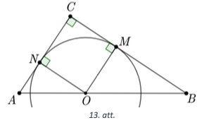

# <lo-sample/> LV.AMO.2022B.10.4

Doti reāli skaitļi $a$, $b$ un $c$, kuriem $abc = 1$. Pierādīt, ka vienādojumam

$$ax^4 + (2b + a)x^2 - 2cx + b^3c + bc + bc^3 = 0$$

nav reālu sakņu!

<small>

* concepts:equation,real-numbers,root
* questionType:Prove
* domain:Alg
* method:MTH_PolynomialTransformations
* subdomain:DOM_Equations

</small>

## Atrisinājums

Abas vienādojuma puses reizinām ar $a$ un veicam ekvivalentus 
pārveidojumus (izmantojot, ka $abc=1$):

$$\begin{gathered}
a^{2} x^{4}+\left(2 a b+a^{2}\right) x^{2}-2 a c x+a b^{3} c+a b c+a b c^{3}=0 \\
a^{2} x^{4}+2 a b x^{2}+a^{2} b^{2}-2 a c x+b^{2}+1+c^{2}=0 \\
\left(a^{2} x^{4}+2 a b x^{2}+b^{2}\right)+\left(a^{2} x^{2}-2 a c x+c^{2}\right)+1=0 \\
\left(a x^{2}+b\right)^{2}+(a x-c)^{2}+1=0
\end{gathered}$$

Tā kā vienādojuma kreisās puses vērtība ir vismaz $1$, jo kvadrātu vērtība 
ir nenegatīva, tad dotajam vienādojumam nav reālu sakņu.

    
# <lo-sample/> LV.AMO.2022B.10.5

Restorānā ieradās pieci deputāti un pirms pusdienām daži no viņiem 
paspieda viens otram roku. 
Zināms, ka, ja kādi divi deputāti nepaspieda viens otram roku, 
tad abi kopā viņi izdarīja vismaz 
piecus rokasspiedienus. Pierādīt, ka deputātus var sasēdināt 
ap apaļu galdu tā, lai katrs būtu paspiedis 
roku abiem saviem blakussēdētājiem!

<small>

* concepts:graph,vertex,edge
* questionType:Prove
* domain:Comb
* subdomain:DOM_Graphs
* method:MTH_ContradictionForExistence

</small>

## Atrisinājums-1

Pirmkārt pamatosim, ka no jebkuriem trīs deputātiem vismaz kādi divi 
ir paspieduši viens otram roku. Pieņemsim pretējo, ka kādi trīs 
deputāti nav savā starpā izdarīuši nevienu rokasspiedienu. 
Paņemsim jebkurus divus no tiem, tad tie kopā ir izdarijuš̌i 
lielākais četrus rokasspiedienus (katrs ar diviem atlikušajiem deputātiem) - pretruna. (1)

Otrkārt pamatosim, ka katrs deputāts ir izdarijis vismaz divus rokasspiedienus. 
Pieņemsim pretējo, ka kāds deputāts ir izdarīijs tikai vienu (vai nevienu) 
rokasspiedienu. Apzīmēsim šo deputātu ar $X$ un vienu no deputātiem, 
kam viņš nepaspieda roku, apzīmēsim ar Y. Deputāts $X$ ir paspiedis roku 
ne vairāk kā vienu reizi, bet deputāts $Y$ - ne vairāk kā trīs reizes 
(jo viņš nepaspieda roku deputātam $X$), tātad abi kopā viņi ir paspieduši 
roku ne vairāk kā 4 reizes - pretruna. (2)

Treškārt ievērosim, ka, ja kādi divi deputāti nepaspieda viens otram roku, 
tad vismaz viens no viniem paspieda roku visiem trim pārējiem 
(ja abiem būtu kāds "izlaists" rokasspiediens, tad abiem kopā 
būtu lielākais $2+2=4$ rokasspiedieni). (3)

Pieņemsim, ka kādi divi deputāti nepaspieda viens otram roku 
(ja visi paspieda, tad tos var sēdināt patvalīgi) un nosēdināsim 
tos vietās $A$ un $C$ (skat. 14. att.), vietā $C$ sēdināsim to, 
kurš paspieda roku visiem pārējiem (no (3) tāds noteikti ir). 
Turpmāk šos divus deputātus sauksim par $A$ un $C$.

Iespējami divi gadīumi:

* ja arī $A$ ir paspiedis roku visiem trim pārējiem, tad atlikušos 
  nosēdināsim vietās $B$, $D$ un $E$ tā, lai vietās $D$ un $E$ 
  sēdētu kādi, kas ir paspieduši viens otram roku 
  (no (1) tādi noteikti ir). Ar to prasītais būtu panākts.

* ja $A$ nav paspiedis roku vēl kādam deputātam, tad nosēdināsim 
  to vietā $E$ (un turpmāk sauksim par deputātu $E$). Deputāts $A$ 
  noteikti ir paspiedis roku abiem atlikušajiem deputātiem 
  (citādi viņš būtu izdarījis tikai vienu rokasspiedienu). 
  Deputāts $E$ noteikti ir paspiedis roku vismaz vienam no atlikušajiem 
  diviem deputātiem (citādi $E$ būtu izdarīis tikai vienu rokasspiedienu), 
  šo deputātu nosēdināsim vietā $D$. Redzams, ka ar šo prasītais ir panākts.

## Atrisinājums-2

Uzskatīsim, ka, ja kādi deputāti nepaspieda viens otram roku, tad viņi 
savstarpēji viens otru ienīst. No dotā izriet, ka, ja kādi divi deputāti 
viens otru ienīst, tad abi kopā viņi ienīst vēl lielākais vienu citu deputātu. 
No šī viegli redzēt, ka deputāts var ienīst lielākais divus citus deputātus. 
Mūsu uzdevums ir sasēdināt tos ap galdu tā, lai blakus nesēdētu divi, kas ienīst viens otru.

Pieņemsim, ka ir kāds deputāts, kas ienīst divus citus deputātus. 
Nosēdināsim šo deputātu vietā A (skat. 14. att.) un tos, ko vinš ienīst -- 
vietās $C$ un $D$ (tālāk sauksim šos deputātus attiecīgi par $A, C$ un $D$). 
Ievērosim, ka visi trīs šie deputāti neienīst nevienu no abiem pārējiem. 
Patiešām, tā kā $A$ un $C$ ienīst viens otru un $A$ ienīst vēl arī $D$, 
tad tie ( $A$ un $C$ ) nevar ienīst vairs nevienu citu. 
Tādu pašu spriedumu var izveikt arī par $A$ un $D$.
Tātad, abus atlikušos deputātus nosēdinot vietās $B$ un $E$, prasītais ir panākts.

Atliek aplūkot gadījumu, kad katrs deputāts ienīst lielākais vienu citu 
deputātu. Tad mums ir lielākais divi pāri deputātu, kas viens otru ienīst, 
nosēdinot tos ne blakus (piemēram, vietās $A$-$C$ un $B$-$D$) prasītais būs panākts.

    
# <lo-sample/> LV.AMO.2022B.11.1

Vai skaitli 2022 var izteikt kā divu veselu skaitļu kubu summu?

<small>

* concepts:sum,cube-Alg,integer-numbers
* questionType:ProveDisprove
* domain:NT
* subdomain:DOM_Congruences
* method:MTH_ContradictionForExistence

</small>

## Atrisinājums 

Vispirms noskaidrosim, ar ko var būt kongruenti veselu skaitlu kubi pēc moduļa $9$:

* ja $n \equiv 0\pmod 9$, tad $n^{3} \equiv 0^{3} \equiv 0\pmod 9$;
* ja $n \equiv 1\pmod 9$, tad $n^{3} \equiv 1^{3} \equiv 1\pmod 9 ;$
* ja $n \equiv 2\pmod 9$, tad $n^{3} \equiv 2^{3} \equiv 8 \equiv-1\pmod 9$;
* ja $n \equiv 3\pmod 9$, tad $n^{3} \equiv 3^{3} \equiv 27 \equiv 0\pmod 9$;
* ja $n \equiv 4\pmod 9$, tad $n^{3} \equiv 4^{3} \equiv 64 \equiv 1\pmod 9$;
* ja $n \equiv 5 \equiv-4\pmod 9$, tad $n^{3} \equiv(-4)^{3} \equiv-1\pmod 9$;
* ja $n \equiv 6 \equiv-3\pmod 9$, tad $n^{3} \equiv(-3)^{3} \equiv 0\pmod 9$;
* ja $n \equiv 7 \equiv-2\pmod 9$, tad $n^{3} \equiv(-2)^{3} \equiv 1\pmod 9$;
* ja $n \equiv 8 \equiv-1\pmod 9$, tad $n^{3} \equiv(-1)^{3} \equiv-1\pmod 9$.

Tātad veselu skaitlu kubi ir kongruenti ar 0 vai $\pm 1$ pēc moduļa $9$. 
Aplūkosim, ar ko var būt kongruenta divu veselu skaitllu kubu summa pēc moduļa $9$.

| $a^{3}\pmod 9$ | -1 | 0 | 1 |
| :---: | :--- | :--- | :--- |
| $b^{3}\pmod 9$ |  |  |  |
| -1 | -2 | -1 | 0 |
| 0 | -1 | 0 | 1 |
| 1 | 0 | 1 | 2 |

Esam ieguvuši, ka divu šādu skaitlu summa pēc moduļa $9$ var 
pieņemt jebkuru no vērtībām $-2,-1,0,1,2$, taču nekādas citas. 
Tā kā $2022 \equiv 6 \equiv-3 \pmod 9$ neparādās starp šīm vērtībām, 
tad divu veselu skaitļu kubu summa nevar būt $2022$.

# <lo-sample/> LV.AMO.2022B.11.2

Kādām reālām $p$ vērtībām vienādojuma $x^2 + x + p = 0$ sakņu kvadrātu summa ir $16$?

<small>

* concepts:equation,square-Alg,sum,value
* questionType:FindAll
* domain:Alg
* method:MTH_
* subdomain:DOM_Equations
* method:MTH_PolynomialTransformations

</small>

## Atrisinājums

Apzīmēsim kvadrātvienādojuma saknes ar $x_{1}$ un $x_{2}$. 
Pēc Vjeta teorēmas zināms, ka $x_{1} x_{2}=p$ un $x_{1}+x_{2}=-1$. 
Izmantojot summas kvadrāta formulu, varam aprēķināt, ka

$$x_{1}^{2}+x_{2}^{2}=\left(x_{1}+x_{2}\right)^{2}-2 x_{1} x_{2}=1-2 p=16$$

Esam ieguvuši, ka $2p=-15$ jeb $p=-7,5$.

    
# <lo-sample/> LV.AMO.2022B.11.3

Trijstūrī $ABC$ ievilktā riņķa līnija pieskaras malai 
$AB$ punktā $D$ tā, ka $AD = 8$ un $BD = 1$. Aprēķināt malas $BC$
garumu, ja trijstūra leņķa $B$ lielums ir $120^{\circ}$.

<small>

* concepts:triangle,inscribed-circle,angle,tangent
* questionType:FindAll
* domain:Geom
* subdomain:DOM_CirclesAndRelatedAngles
* method:MTH_AugmentationWithNewElements

</small>

## Atrisinājums

Apzīmējam riņka līnijas pieskaršanās punktu malai $BC$ ar $E$ un 
malai $AC$ ar $F$ skat. 15.att. Tā kā trijstūrī $ABC$ ir ievilkta riņķa 
līnija, tad pieskaru nogriežņi ir vienādi: $BD=BE=1$,
$AD=AF=8$ un $CE=CF=x$. Tātad $AB=9, BC=1+x, AC=8+x$. 
Izmantojot kosinusu teorēmu, iegūstam

$AC^{2} = AB^{2} + BC^{2} - 2 \cdot AB \cdot BC \cdot \cos \sphericalangle B$  
$(8+x)^{2}=9^{2}+(1+x)^{2}-2 \cdot 9 \cdot(1+x) \cdot \cos 120^{\circ}$  
$64+16 x+x^{2}=81+1+2 x+x^{2}-2 \cdot 9(1+x) \cdot(-0,5)$  
$5x=27$  
$x=5.4$.

Tātad $BC=1+x=6.4$.

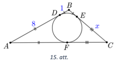

    
    
# <lo-sample/> LV.AMO.2022B.11.4

Pierādīt, ka katru naturālu skaitli, kas ir lielāks nekā $3$, 
var vienā vienīgā veidā izteikt kā trīs naturālu
skaitļu $x,y,z$ ($x \leq y \leq z$) summu tā, lai skaitļiem 
$x$, $y$, $z$ izpildītos nevienādība

$$x^2 + y^2 + z^2 - xy - yz - xz \leq 1.$$

<small>

* concepts:inequality,natural-numbers,sum
* questionType:Prove
* domain:NT
* method:MTH_PolynomialTransformations

</small>

## Atrisinājums

Ievērosim, ka

$$\begin{gathered}
(x-y)^{2}+(y-z)^{2}+(z-x)^{2}=x^{2}-2 x y+y^{2}+y^{2}-2 y z+z^{2}+z^{2}-2 x z+x^{2}= \\
=2\left(x^{2}+y^{2}+z^{2}-x y-y z-x z\right) \leq 2
\end{gathered}$$

Tātad $(x-y)^{2}+(y-z)^{2}+(z-x)^{2} \leq 2$.

No iegūtās nevienādības izriet, ka vienīgie iespējamie skaitļu 
trijnieki $(x ; y ; z)$, kas apmierina to, ir 
$(k;k;k)$, $(k;k;k+1)$ un $(k;k+1;k+1)$. 
Tas nozīmē, ka ar pirmo trijnieku var izteikt visus skaitļus, 
kuri ir kongruenti ar skaitli $0$ pēc moduļa $3$; ar otro trijnieku 
var izteikt visus skaitļus, kuri ir kongruenti ar skaitli $1$ 
pēc moduļa $3$ un ar trešo trijnieku var izteikt visus skaițus, 
kuri ir kongruenti ar skaitli $2$ pēc moduļa $3$.
Var redzēt, ka iegūtais sadalījums katru reizi ir unikāls.

# <lo-sample/> LV.AMO.2022B.11.5

Mākslas muzeja plānojums ir taisnstūris ar izmēriem $m \times n$ 
($m \geq 2$, $n \geq 2$) rūtiņas, 
kur viena rūtiņa atbilst vienai muzeja telpai. 
Muzeja vadītājs vēlas izveidot apmeklētāju maršrutu, kuram izpildās šādas īpašības:

* maršruts sākas kādā no rūtiņām (telpām), kas atrodas pie taisnstūra malas;
* apmeklētājs no vienas rūtiņas (telpas) var pāriet uz citu rūtiņu (telpu), ja tām ir kopīga mala;
* apmeklētājs maršruta laikā apmeklē katru rūtiņu (telpu) tieši vienu reizi;
* maršruts beidzas rūtiņā (telpā), kas atrodas pie taisnstūra malas blakus 
  maršruta sākuma rūtiņai (telpai).

Kādām $m$ un $n$ vērtībām muzeja vadītājs var izveidot šādu maršrutu?

<small>

* concepts:grid,square-side,rectangle,path
* questionType:FindAll
* domain:Comb
* subdomain:DOM_Graphs
* method:MTH_ContradictionForExistence

</small>

## Atrisinājums

Muzeja vadītājs var izveidot aprakstīto maršrutu visām 
$m;n \geq 2$ vērtībām, kurām vismaz viens no $m$ vai $n$ dalās ar 2. 
Aplūkojam trīs gadījumus.

1. Ja $m=2$ un $n \geq 2$, pagriezīsim taisnstūri tā, lai $m=2$ 
   būtu rindu skaits. Tātad maršruta pirmā daļa ved no apakšējā kreisā stūra 
   uz apakšējo labo stūri (visa apakšējā rinda), tālāk uz augšējo 
   labo stūri un pēc tam augšējo kreiso stūri (visa augšējā rinda). 
   Redzams, ka maršruts apmierina uzdevuma nosacijumus.

2. Ja $m>2$ dalās ar $2$ un $n>2$, pagriezīsim taisnstūri tā, lai 
   $m=2 k(k \geq 2)$ būtu rindu skaits. Lai konstruētu maršrutu, 
   kas apmierina uzdevumu nosacijumus, ieviešam rūtiņu koordinātu 
   sistēmu $(m;n)$, kur $m$ - rindas numurs, $n$-kolonnas numurs un 
   $(1;1)$ ir apakšējais kreisais stūris.

   Aplūkojam maršrutu, kas secīgi vienas rindas vai vienas kolonnas ietvaros savieno šādas rūtiņas:

   * $(i ; 2)$ ar $(i ; n)$
   * $(i ; n)$ ar $(i+1 ; n)$
   * $(i+1 ; n)$ ar $(i+1 ; 2)$;
   * $(i+1 ; 2)$ ar $(i+2 ; 2)$

   kur $i$ secīgi vienāds ar $\{1;3;5;\ldots;m-1=2 k-1\}$.

   Konstruētais maršruts noslēgsies rūtiņā $(m;2)$. 
   Tālāk vedam maršrutu uz $(m;1)$ un attiecīgi $(1;1)$ 
   pa pirmo kolonnu. Redzams, ka maršruts apmierina uzdevuma 
   nosacījumu. Maršruta piemērs redzams 16. att. ar vērtībām $m=4$ un $n=5$.

   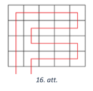

3. Ja gan $m$, gan $n$ nedalās ar $2$ ($m;n \neq 1$), 
   pierādīsim, ka prasīto maršrutu nav iespējams izveidto. 
   Iekrāsosim taisnstūra rūtiņas šaha galdiņa veidā un ievērosim, 
   ka šādam krāsojumam izpildās īpašība: blakus esošām rūtiņām ir dažādas krāsas.

   Pieņemsim pretējo, ka prasītais maršruts eksistē. Tā kā maršruts 
   iziet cauri visām rūtinām, kuru ir nepāra skaits, tad pārejas no 
   vienas rūtiņas uz otru notiek pāra skaitu reižu. Līdz ar to maršruts 
   beigsies tādas pašas krāsas rūtiņā kā sākuma rūtiņa. Taču tā nevar būt, 
   ja šī rūtiņas atrodas blakus, jo tām būtu jābūt dažādās krāsās. 
   Līdz ar to iegūta pretruna un šāds maršruts neeksistē.

Tā kā mainīgos $m$ un $n$ uzdevumā kontekstā var mainīt vietām, tad ir aplūkoti visi iespējamie gadījumi.
    
    
# <lo-sample/> LV.AMO.2022B.12.1

Vai skaitli $2023^2$ var izteikt kā trīs veselu skaitļu kubu summu?

<small>

* concepts:integer-numbers,cube-Alg,sum
* questionType:ProveDisprove
* domain:NT
* subdomain:DOM_Congruences
* method:MTH_ContradictionForExistence

</small>

## Atrisinājums

Vispirms noskaidrosim, ar ko var būt kongruenti veselu skaitlu kubi pēc moduļa $9$:

* ja $n \equiv 0 \pmod 9$, tad $n^{3} \equiv 0^{3} \equiv 0 \pmod 9$;
* ja $n \equiv 1 \pmod 9$, tad $n^{3} \equiv 1^{3} \equiv 1 \pmod 9$;
* ja $n \equiv 2 \pmod 9$, tad $n^{3} \equiv 2^{3} \equiv 8 \equiv-1 \pmod 9$;
* ja $n \equiv 3 \pmod 9$, tad $n^{3} \equiv 3^{3} \equiv 27 \equiv 0 \pmod 9$;
* ja $n \equiv 4 \pmod 9$, tad $n^{3} \equiv 4^{3} \equiv 64 \equiv 1 \pmod 9$;
* ja $n \equiv 5 \equiv-4 \pmod 9$, tad $n^{3} \equiv(-4)^{3} \equiv-4^{3} \equiv-1 \pmod 9$;
* ja $n \equiv 6 \equiv-3 \pmod 9$, tad $n^{3} \equiv(-3)^{3} \equiv 0 \pmod 9$;
* ja $n \equiv 7 \equiv-2 \pmod 9$, tad $n^{3} \equiv(-2)^{3} \equiv 1 \pmod 9$;
* ja $n \equiv 8 \equiv-1 \pmod 9$, tad $n^{3} \equiv(-1)^{3} \equiv-1 \pmod 9$.

Tātad veselu skaitlu kubi ir kongruenti ar 0 vai $\pm 1$ pēc moduļa 9. Aplūkosim, ar ko var būt kongruenta divu veselu skaitlu kubu summa pēc moduļa 9.

| $a^{3} \pmod 9$ | -1 | 0 | 1 |
| :---: | :--- | :--- | :--- |
| $b^{3} \pmod 9$ | -2 | -1 | 0 |
| -1 | -1 | 0 | 1 |
| 0 | 0 | 1 | 2 |
| 1 |  |  |  |

Tagad aplūkojam, ar ko var būt kongruenta trīs veselu skaitļu kubu summa pēc modula 9.

| $a^{3}+b^{3} \pmod 9$ | -1 | 0 | 1 | -2 | 2 |
| :---: | :--- | :--- | :--- | :--- | :--- |
| -1 | -2 | -1 | 0 | -3 | 1 |
| 0 | -1 | 0 | 1 | -2 | 2 |
| 1 | 0 | 1 | 2 | -1 | 3 |

Esam ieguvuši, ka trīs šādu skaițu summa pēc moduļa 9 var pienemt jebkuru no vērtībām $-3 ;-2 ;-1 ; 0 ; 1 ; 2 ; 3$ un nekādas citas. Tā kā $2023^{2} \equiv 7^{2} \equiv 4 \equiv-5 \pmod 9$ neparādās starp šīm vērtībām, tad trīs veselu skaitļu kubu summa nevar būt $2023^{2}$.

    
# <lo-sample/> LV.AMO.2022B.12.2

Kādām reālām $p$ vērtībām vienādojuma $x^2 + x + p$ sakņu kubu summa ir $(-16)$?

<small>

* concepts:real-numbers,cube-Alg,equation
* questionType:FindAll
* domain:Alg
* subdomain:DOM_Equations
* method:MTH_PolynomialTransformations

</small>

## Atrisinājums

Apzīmēsim kvadrātvienādojuma saknes ar $x_{1}$ un $x_{2}$. 
Pēc Vjeta teorēmas zināms, ka $x_{1} x_{2}=p$ un $x_{1}+x_{2}=-1$. 
Izmantojot summas kvadrāta formulu, varam aprēķināt, ka

$$x_{1}^{2}+x_{2}^{2}=\left(x_{1}+x_{2}\right)^{2}-2 x_{1} x_{2}=1-2p.$$

Sakņu kubu summu var izteikt kā

$$x_{1}^{3}+x_{2}^{3}=\left(x_{1}+x_{2}\right)\left(x_{1}^{2}-x_{1} x_{2}+x_{2}^{2}\right)=-1(1-2 p-p) = 3p-1 = -16.$$

Tātad $3p=-15$ un $p=-5$.

    
    
# <lo-sample/> LV.AMO.2022B.12.3

Trijstūrī $ABC$ no virsotnes $A$ vilktā augstuma garums ir $1$,
no virsotnes $C$ vilktās mediānas garums arī ir $1$, bet
augstuma no virsotnes $B$ garums ir $\sqrt{3}$. Kāds var būt šī trijstūra laukums?

<small>

* concepts:triangle,median,altitude,area
* questionType:FindAll
* domain:Geom
* subdomain:DOM_Triangles
* method:MTH_AugmentationWithNewElements

</small>

## Atrisinājums

Apzīmēsim $AB$ viduspunktu ar $M$ un novilksim perpendikulus 
$MP$ un $MT$ attiecīgi pret malām $AC$ un $BC$. 
Augstuma pamatus, kas vilkti no virsotnēm $A$ un $B$, apzīmēsim attiecīgi 
ar $Q$ un $N$. Tā kā $MT \| AQ$, jo $MT \perp BC$ un $AQ \perp BC$, 
tad $M T$ ir trijstūra $A Q B$ viduslīnija, 
tātad $M T=\frac{1}{2} A Q=\frac{1}{2}$. 
Līdzīgi iegūstam, ka $M P=\frac{1}{2} B N=\frac{\sqrt{3}}{2}$.

Ievērojam, ka taisnleņķa trijstūrī $MTC$ izpildās, ka 
$\sin \sphericalangle MCT=\frac{M T}{M C}=\frac{1}{2}$, tātad 
$\sphericalangle M C T=30^{\circ}$. Līdzīgi iegūstam, ka taisnleņka trijstūrī 
$MPC$ izpildās, ka $\sin \sphericalangle M C P=\frac{M P}{M C}=\frac{\sqrt{3}}{2}$, 
tātad $\sphericalangle M C P=60^{\circ}$.

Aplūkojam iespējamās $\sphericalangle MCB$ vērtības:

* ja $T$ atrodas uz $BC$, tad $\sphericalangle M C B=30^{\circ}$;
* ja $T$ atrodas uz $BC$ pagarinājuma, tad $\sphericalangle M C B=150^{\circ}$.

Tā kā $\sphericalangle ACB=\sphericalangle MCA+\sphericalangle MCB$, gadījums, 
ka $\sphericalangle MCB=150^{\circ}$, nav iespējams, jo tad pie 
jebkuras $\sphericalangle M C B$ vērtības $\sphericalangle A C B$ būs vienāds 
vai lielāks nekā $180^{\circ}$. No tā izriet, ka $\sphericalangle MCB=30^{\circ}$.

Līdzīgi aplūkojam iespējamās $\sphericalangle MCA$ un $\sphericalangle ACB$ vērtības:

* ja $P$ atrodas $AC$, tad $\sphericalangle MCA = 60^{\circ}$ un $\sphericalangle ACB = 90^{\circ}$,
* ja $P$ atrodas uz $AC$ pagarinājuma, tad $\sphericalangle MCA = 120^{\circ}$ un 
  $\sphericalangle A C B=150^{\circ}$.

Ja $\sphericalangle ACB=90^{\circ}$ (skat. 17. att.), tad augstumi no virsotnēm 
$A$ un $B$ sakrīt ar katetēm $AC$ un $BC$, tātad

$$S_{ABC}=\frac{AC \cdot BC}{2}=\frac{1 \cdot \sqrt{3}}{2}=\frac{\sqrt{3}}{2}.$$

Ja $\sphericalangle ACB=150^{\circ}$ (skat. 18. att.), aplūkojam taisnleņķa trijstūri $AQC$, kurā $\sphericalangle A C Q=30^{\circ}$, tātad $\frac{A Q}{A C}=\sin \sphericalangle ACQ=\frac{1}{2}$. No tā izriet, ka $A C=2 \cdot A Q=2$ un

$$S_{ABC}=\frac{AC \cdot BN}{2}=2 \cdot \frac{\sqrt{3}}{2}=\sqrt{3}.$$

Tātad trijstūra laukums var būt $\frac{\sqrt{3}}{2}$ vai $\sqrt{3}$.

# <lo-sample/> LV.AMO.2022B.12.4

Atrisināt reālos skaitļos vienādojumu $3 \sin x + 4 \cos x = 6$.

<small>

* concepts:equation,real-numbers,sine,cosine
* questionType:FindAll
* domain:Alg
* method:MTH_PolynomialTransformations
* subdomain:DOM_Equations

</small>

## Atrisinājums-1

Izdalām abas vienādojuma puses ar $5$:

$$\frac{3}{5} \sin x+\frac{4}{5} \cos x=\frac{6}{5}.$$

Izvēlēsimies tādu šauru leņki $\alpha$, ka $\sin \alpha=\frac{4}{5}$. Tādā gadījumā 
$\cos \alpha=\sqrt{1-\sin ^{2} \alpha}=\sqrt{1-\left(\frac{4}{5}\right)^{2}}=\frac{3}{5}$ un vienādojumu varam pārrakstīt kā

$$\begin{aligned}
& \sin x \cos \alpha+\cos x \sin \alpha=\frac{6}{5} \\
& \sin (x+\alpha)=\frac{6}{5}
\end{aligned}$$

Tā kā sinusa vērtības nepārsniedz 1, tad šim vienādojumam atrisinājumu nav. 
Tātad arī dotajam vienādojumam atrisinājuma nav.

## Atrisinājums-2

Izmantojot divkāršā leņka formulas un $\cos ^{2} \frac{x}{2}+\sin ^{2} \frac{x}{2}=1$, 
iegūstam, ka

$$\begin{aligned}
& 3 \cdot 2 \sin \frac{x}{2} \cos \frac{x}{2}+4\left(\cos ^{2} \frac{x}{2}-\sin ^{2} \frac{x}{2}\right)=6\left(\cos ^{2} \frac{x}{2}+\sin ^{2} \frac{x}{2}\right) \\
& 6 \sin \frac{x}{2} \cos \frac{x}{2}+4 \cos ^{2} \frac{x}{2}-4 \sin ^{2} \frac{x}{2}=6 \cos ^{2} \frac{x}{2}+6 \sin ^{2} \frac{x}{2} \\
& 2 \cos ^{2} \frac{x}{2}-6 \sin \frac{x}{2} \cos \frac{x}{2}+10 \sin ^{2} \frac{x}{2}=0
\end{aligned}$$

Abas vienādojuma puses dalot ar $2 \sin ^{2} \frac{x}{2} \neq 0$, iegūstam, ka

$$\operatorname{ctg}^{2} \frac{x}{2}-3 \operatorname{ctg} \frac{x}{2}+5=0$$

Apzīmējot $\operatorname{ctg} \frac{x}{2}=t$, iegūstam kvadrātvienādojumu 
$t^{2}-3 t+5=0$, kura diskriminants $D=(-3)^{2}-4 \cdot 1 \cdot 5=-11<0$, 
tātad kvadrātvienādojumam nav sakņu, līdz ar to dotajam vienādojumam nav atrisinājuma.

## Atrisinājums-3

No abām vienādojuma pusēm atņemot $4 \cos x$, iegūstam, ka $3 \sin x=6-4 \cos x$.
Kāpinot abas vienādojuma puses kvadrātā, iegūstam, ka

$$9 \sin ^{2} x=36-48 \cos x+16 \cos ^{2} x$$

Izmantojot $\sin ^{2} x=1-\cos ^{2} x$, iegūstam, ka

$$\begin{gathered}
9\left(1-\cos ^{2} x\right)=36-48 \cos x+16 \cos ^{2} x \\
9-9 \cos ^{2} x=36-48 \cos x+16 \cos ^{2} x \\
25 \cos ^{2} x-48 \cos x+27=0
\end{gathered}$$

Apzīmējot $\cos x=t$, iegūstam kvadrātvienādojumu $25 t^{2}-48 t+27=0$, 
kura diskriminants $D=(-48)^{2}-4 \cdot 25 \cdot 27=48 \cdot 48-50 \cdot 54<0$, 
tātad kvadrātvienādojumam nav sakņu, līdz ar to arī dotajam vienādojumam nav sakņu.

## Atrisinājums-4

Pierādīsim, ka izpildās nevienādība $a \sin x+b \cos x \leq \sqrt{a^{2}+b^{2}}$. 
Kāpināsim abas nevienādības puses kvadrātā un izmantosim, ka 
$\sin ^{2} x+\cos ^{2} x=1$. Iegūstam, ka

$$\begin{gathered}
(a \sin x+b \cos x)^{2} \leq\left(a^{2}+b^{2}\right)\left(\sin ^{2} x+\cos ^{2} x\right) \\
a^{2} \sin ^{2} x+2 a b \sin x \cos x+b \cos ^{2} x \leq a^{2} \sin ^{2} x+a^{2} \cos ^{2} x+b^{2} \sin ^{2} x+b^{2} \cos ^{2} x \\
0 \leq a^{2} \cos ^{2} x-2 a b \sin x \cos x+b^{2} \sin ^{2} x \\
(a \cos x-b \sin x)^{2} \geq 0
\end{gathered}$$

Tā kā nevienādība ir patiesa jebkurai $a, b$ un $x$ vērtībai, 
tad sākotnējā nevienādība $a \sin x+b \cos x \leq \sqrt{a^{2}+b^{2}}$ 
ir patiesa. No tā izriet, ka $3 \sin x+4 \cos x \leq \sqrt{3^{2}+4^{2}}=5$, 
tātad dotajam vienādojumam nav sakņu.

    
    
# <lo-sample/> LV.AMO.2022B.12.5

Dota rūtiņu tabula $n \times n$. Ilmārs un Kims spēlē šādu spēli. 
Viņi pēc kārtas kādā vēl tukšā rūtiņā ieraksta skaitli $1$
vai $-1$. Spēli sāk Ilmārs. Ja pēc kāda spēlētāja gājiena tiek 
aizpildīta kāda rinda vai kolonna, tad tiek aprēķināts
tajā esošo skaitļu reizinājums. Ja tas ir vienāds ar $-1$, tad spēlētājs, 
kurš veica pēdējo gājienu, iegūst $1$ punktu
(ja spēlētājs ar savu gājienu vienlaicīgi pabeidz gan rindu, gan kolonnu 
un katrā skaitļu reizinājums ir $-1$, tad
viņš iegūst divus punktus). Spēle beidzas, kad tabula ir pilnībā aizpildīta. Uzvar spēlētājs, kurš iegūst visvairāk
punktu. Kuram spēlētājam ir uzvaroša stratēģija, ja **(A)** $n = 2021$; **(B)** $n = 2022$?

    
<small>

* concepts:game,table,row,column,product,winning-strategy
* questionType:ProveDisprove
* domain:Comb
* subdomain:DOM_CombinatorialGames

</small>

## Atrisinājums 

**(A)** Ja $n=2021$, uzvar Ilmārs. Pirmajā gājienā viņš centrālajā 
rūtiņā ieraksta skaitli $-1$, bet tālākajos gājienos spēlē simetriski 
attiecībā pret centrālo rūtinu un Kima gājienu. Tādā gadījumā, 
ja Kims pēc sava gājiena iegūs kādu punktu, Ilmārs simetriski 
arī iegūs punktu. Tātad Ilmārs iegūs tieši tikpat punktu, cik Kims. 
Papildus tam varam ievērot, ka Ilmārs būs tas, kurš aizpildīs 
vidējo rindu un vidējo kolonnu simetrijas dēl. Tā kā visi skaitļi 
tajās būs simetriski, izņemot to, ka pa vidu ir ierakstīts $-1$, 
tad varam secināt, ka reizinājums būs $-1$ un Ilmārs iegūs papildu 
$2$ punktus, kas ļaus viņam uzvarēt.

**(B)** Ja $n=2022$, uzvar Kims. Viņš katru savu gājienu veic 
simetriski pret vertikālo tabulas simetrijas asi un Ilmāra gājienu, 
izņemot tos brīžus, kad viņam ir jāveic gājiens rindā, kurā 
ir atlikusi tieši viena tukša rūtiņa. Tajos brīžos viņš izvēlas 
tādu skaitli, lai šīs rindas reizinājums būtu $-1$. 
Simetrijas dēl Kims vienmēr būs tas, kurš aizpilda kādu rindu, 
un šī stratēǵija garantēs viņam $2022$ punktus par rindām. 
Papildus varam ievērot, ka simetrijas dēļ katru reizi, 
kad Ilmārs aizpildīs kādu kolonnu, tad nākamajā gājienā Kims 
aizpildīs simetrisko kolonnu. Līdz ar to Ilmārs aizpildīs tieši 
$1011$ kolonnas, kas viņam dod ne vairāk kā $1011$ punktus. 
Tātad Kims uzvarēs.

    