# <lo-sample/> LV.AMO.2025.5.1

Ieraksti 1. att. aplīšos skaitļus no $1$ līdz $12$, katrā aplītī citu skaitli, tā, lai uz katras sešstūra malas esošo trīs skaitļu summa būtu viena un tā pati. Pietiek parādīt vienu veidu, kā to izdarīt.

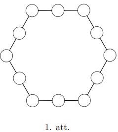

<small>

* questionType:
* domain:

</small>

## Atrisinājums

To var izdarīt, kā redzams 2. attēlā. Iespējami arī citi varianti.

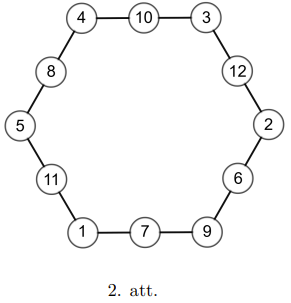

# <lo-sample/> LV.AMO.2025.5.2

Ieraksti burtu un zvaigznīšu vietā ciparus tā, lai būtu pareizs reizināšanas piemērs. Vienādu burtu vietā jābūt vienādiem cipariem, bet dažādu burtu vietā jābūt dažādiem. Zvaigznīšu vietā var būt patvaļīgi cipari, var būt arī kādi no tiem, kas ierakstīti burtu vietās. Neviens no cipariem (ne burtu, ne zvaigznīšu vietās) nedrīkst būt $0$. Burti ”a” un ”ā” apzīmē dažādus ciparus. Pietiek parādīt vienu veidu, kā to izdarīt.

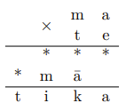

<small>

* questionType:
* domain:

</small>

## Atrisinājums

Šis ir vienīgais atrisinājums:

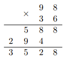

# <lo-sample/> LV.AMO.2025.5.3

Kāda ir mazākā iespējamā ciparu summa sešciparu skaitlim, kas dalās ar $24$?

<small>

* questionType:
* domain:

</small>

## Atrisinājums

Mazākā iespējamā summa ir $3$. Šāds skaitlis ir, piemēram, skaitlis $300000$, viegli redzēt, ka tas dalās, gan ar $3$ (jo tā ciparu summa dalās ar $3$), gan ar $8$ (jo tā pēdējo $3$ ciparu veidotais skaitlis $000$ dalās ar $8$).

Lai pamatotu, ka mazāka ciparu summa par $3$ nav iespējama, atliek ievērot, ka, ja skaitlis dalās ar $24$, tad tas dalās arī ar $3$, tātad arī tā ciparu summa dalās ar $3$. Tātad tā nevar būt mazāka par $3$.

# <lo-sample/> LV.AMO.2025.5.4

Parādi, kā $5 \times 7$ rūtiņu taisnstūri var sagriezt vienā $1 \times 3$ rūtiņu taisnstūrī (3. att.) un astoņās ”T” veida figūrās (4. att.), abu veidu figūras var būt arī pagrieztas.

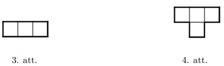

<small>

* questionType:
* domain:

</small>

## Atrisinājums

To var izdarīt šādi, kā redzams 5. attēlā.

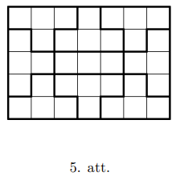

# <lo-sample/> LV.AMO.2025.5.5

Sākumā $3 \times 3$ rūtiņu tabula katrā rūtiņā ir ierakstīta nulle. Vienā gājienā Raitis 
izvēlas jebkuru $2 \times 2$ rūtiņu kvadrātu un visiem četriem tajā esošajiem skaitļiem 
pieskaita $1$. Pēc vairākiem šādiem gājieniem viņš rūpīgi aplūkoja iegūtos $9$ skaitļus. 
Vai var gadīties, ka tieši $8$ no tiem ir pirmskaitļi? Vai var gadīties, ka visi $9$ 
ir pirmskaitļi?

<small>

* questionType:
* domain:

</small>

## Atrisinājums

Var gadīties $8$ pirmskaitļi, bet nevar gadīties $9$ pirmskaitļi.

Ērtības labad apzīmēsim tabulas stūra rūtiņas ar $A, B, C, D$ (skat. 6. att.). 
Katrs $2 \times 2$ kvadrāts noklāj tieši vienu stūra rūtiņu. Sauksim tad arī iespējamos 
gājienus par $A, B, C, D$ gājieniem atkarībā no tā, kuru stūra rūtiņu tie noklāj.

Iegūt $8$ pirmskaitļus var, izdarot $A$ un $C$ gājienus $2$ reizes, bet $B$ un $D$ 
gājienus — $3$ reizes. Tad tabulā (7. att.) vienīgi centrālajā rūtiņā nav pirmskaitlis.

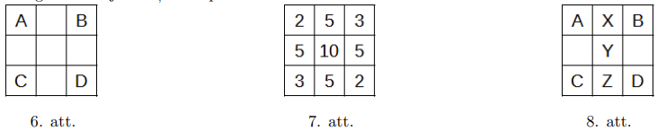

Atliek pamatot, ka visi $9$ skaitļi nevar būt pirmskaitļi. Pieņemsim pretējo, 
ka visi $9$ ir pirmskaitļi. Tad katrs gājiens $(A,B,C,D)$ ir izdarīts vismaz 
$2$ reizes, jo mazākais pirmskaitlis ir $2$. Tas nozīmē, ka visās trijās rūtiņās 
$X,Y,Z$ (8. att.) ir ierakstīti nepāra skaitļi (jo vienīgais pāra pirmskaitlis 
ir $2$, bet šajās rūtiņās skaitļi ir lielāki vai vienādi par $4$). Tā kā rūtiņā 
$X$ ir nepāra skaitlis, tas nozīmē, ka $A$ un $B$ gājieni kopā ir izdarīti 
nepāra skaitu reižu. Tā kā rūtiņā $Z$ ir nepāra skaitlis, tas nozīmē, ka $C$ 
un $D$ gājieni kopā ir izdarīti nepāra skaitu reižu. Bet tas nozīmē, ka visi 
gājieni $A, B, C$ un $D$ kopā ir izdarīti pāra skaitu reižu, tātad $Y$ rūtiņā 
ir pāra skaitlis — pretruna.

# <lo-sample/> LV.AMO.2025.6.1

Ieraksti 9. att. aplīšos skaitļus no $1$ līdz $14$, katrā aplītī citu skaitli, tā, 
lai uz katras septiņstūra malas esošo trīs skaitļu summa būtu viena un tā pati. 
Pietiek parādīt vienu veidu, kā to izdarīt.

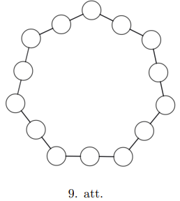

<small>

* questionType:
* domain:

</small>

## Atrisinājums

To var izdarīt, kā redzams 10 attēlā. Iespējami arī citi varianti.

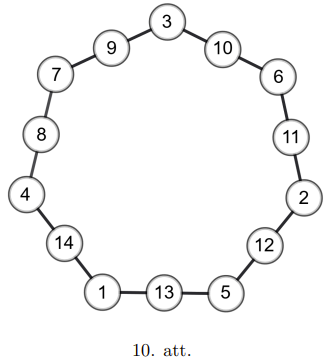

# <lo-sample/> LV.AMO.2025.6.2

Parādi, kā $9 \times 11$ rūtiņu taisnstūri var sagriezt vienā 
$1 \times 3$ rūtiņu taisnstūrī (11. att.) un $24$ ”T” veida figūrās 
(12. att.). Abu veidu figūras var būt arī pagrieztas.

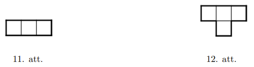

<small>

* questionType:
* domain:

</small>

## Atrisinājums

To var izdarīt tā, kā redzams 13. attēlā.

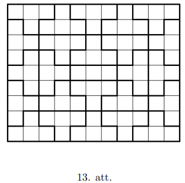

# <lo-sample/> LV.AMO.2025.6.3

Ieraksti burtu vietā ciparus tā, lai būtu pareizs saskaitīšanas piemērs, 
vienādu burtu vietā būtu vienādi cipari, bet dažādu burtu vietā būtu 
dažādi cipari. Burti ”a” un ”ā” apzīmē dažādus ciparus. Pietiek parādīt 
vienu veidu, kā to izdarīt. Atceries, ka skaitlis nevar sākties ar nulli!

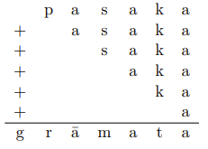

<small>

* questionType:
* domain:

</small>

## Atrisinājums

Šis ir vienīgais atrisinājums:

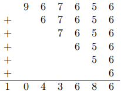

# <lo-sample/> LV.AMO.2025.6.4

Profesors Cipariņš uz tāfeles uzrakstīja divus septiņciparu skaitļus. 
Katru ciparu šajos skaitļos viņš aizstāja ar kādu burtu, vienādus ciparus 
ar vienādiem burtiem, dažādus ciparus ar dažādiem burtiem. Zināms, ka 
viens no uzrakstītajiem skaitļiem PLATONS dalās ar $45$. Pierādi, ka 
otrs uzrakstītais skaitlis SOKRATS nedalās ar $54$.

<small>

* questionType:
* domain:

</small>

## Atrisinājums

Tā kā PLATONS dalās ar $45$, tad tas dalās arī ar $5$, tātad $S=0$ 
vai $S=5$. Pirmais gadījums ($S=0$) nav iespējams, jo skaitlis nevar 
sākties ar $0$, tātad $S=5$. Tas nozīmē, ka skaitlis SOKRATS ir 
nepāra skaitlis, tātad tas nevar dalīties ar $54$.

# <lo-sample/> LV.AMO.2025.6.5

Zināms, ka $2786$. gadā no Marsa centrālā pasta tika nosūtīts tieši 
par $10\%$ telegrammu vairāk nekā $2785$. gadā. Arī nākamajos trijos 
gados (no $2787$. līdz $2789$. gadam) katru gadu no tā tika nosūtīts 
tieši par $10\%$ vairāk telegrammu nekā iepriekšējā gadā. Cik telegrammu 
tika nosūtīts no Marsa centrālā pasta $2789$. gadā, ja zināms, ka $2785$. 
gadā no tā tika nosūtīts ne vairāk kā $15000$ telegrammu?

<small>

* questionType:
* domain:

</small>

## Atrisinājums

Katru gadu nosūtīto telegrammu skaits palielinās tieši 
$\frac{110}{100}=\frac{11}{10}$ reizes. Tātad pa visiem šiem $4$ 
gadiem to skaits ir palielinājies tieši

$$
\frac{11}{10} \cdot \frac{11}{10} \cdot \frac{11}{10} \cdot \frac{11}{10} = \frac{14641}{10000}
$$

reizes. Tas nozīmē, ka $2785$. gadā nosūtīto telegrammu skaits 
dalījās ar $10000$ un, tā kā tas nebija lielāks par $15000$, tad tas 
bija tieši $10000$. Tātad $2789$. gadā no Marsa centrālā pasta tika 
nosūtītas tieši $14641$ telegrammas.

# <lo-sample/> LV.AMO.2025.7.1

Kādas ielas vienā pusē rindā stāv piecas mājas. Katrā mājā dzīvo 
vismaz divi cilvēki. Zināms arī, ka nav tādu divu māju, kurās 
dzīvotu vienāds skaits cilvēku.

Par cilvēka kaimiņiem sauksim tos cilvēkus, kuri dzīvo vai nu ar viņu 
vienā mājā, vai arī blakus mājās. Vai iespējams, ka katram cilvēkam 
ir vai nu tieši $20$, vai arī tieši $30$ kaimiņi?

<small>

* questionType:
* domain:

</small>

## Atrisinājums

Jā, tas ir iespējams, ja cilvēku skaits mājās ir, piemēram, šāds:

$$
16,5,10,6,15.
$$

iespējami arī citi varianti.

Piezīme: pie atrisinājuma var nonākt, piemēram, ar sekojošu spriedumu. 
Apzīmēsim mājas ar $A,B,C,D,E$. Ievērosim, ka cilvēkam no mājas $B$ 
ir vairāk kaimiņu nekā cilvēkam no mājas $A$, jo tam papildus vēl 
nāk klāt kaimiņi no mājas $C$. Līdz ar to varam secināt, ka mājās 
$A,B$ un $C$ kopā dzīvo $31$ cilvēks, bet mājās $A$ un $B$ kopā dzīvo 
$21$ cilvēks.

$$
\underbrace{\overbrace{A,B}^{21},C}_{31},D,E
$$

no kurienes redzams, ka mājā $C$ dzīvo tieši $10$ cilvēki.

Tālāk varam ievērot, ka cilvēkam no mājas $C$ nevar būt tikpat kaimiņu, 
kā cilvēkam no mājas $B$, jo tādā gadījumā mājās $A$ un $D$ būs vienāds 
cilvēku skaits. Līdz ar to cilvēkam no mājas $C$ ir $20$ kaimiņu un 
tātad mājās $B,C,D$ kopā dzīvo $21$ cilvēks. Tālāk piemeklēt skaitļus 
vairs nav grūti.

# <lo-sample/> LV.AMO.2025.7.2

Parādi, kā var $3 \times 3$ rūtiņu kvadrātu sagriezt $3$ dažādos gabalos 
(griežot pa rūtiņu līnijām) tā, lai katri divi no iegūtajiem gabaliem 
(nekur tos nepārvietojot) kopā veidotu simetrisku figūru. Katram gabalam 
jāpieskaras pie vismaz vienas kvadrāta malas (t.i. gabals nevar sastāvēt 
tikai no centrālās rūtiņas). Figūra ir simetriska, ja to var pārlocīt 
uz pusēm tā, ka abas puses sakrīt. Figūras (gabali) ir dažādas, ja, 
pārbīdot vai ”apmetot otrādi”, tās nevar uzlikt vienu uz otras tā, ka tās sakrīt.

<small>

* questionType:
* domain:

</small>

## Atrisinājums

To var izdarīt šādi, kā redzams 14. attēlā.

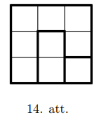

# <lo-sample/> LV.AMO.2025.7.3

Kāda ir mazākā iespējamā ciparu summa sešciparu skaitlim, kas dalās ar $99$?

<small>

* questionType:
* domain:

</small>

## Atrisinājums

Mazākā iespējamā ciparu summa šādam sešciparu skaitlim ir $18$, tāda tā ir, 
piemēram, skaitlim $990000$.

Pierādīsim, ka mazāka ciparu summa par $18$ nav iespējama. Ja skaitlis dalās 
ar $99$, tad tas dalās ar $9$ un ar $11$. Tā kā tas dalās ar $9$, 
tad arī tā ciparu summa dalās ar $9$, tātad tā ciparu summa var būt 
tikai $9,18,27,\ldots$. Tātad atliek pamatot, ka tā nevar būt $9$.

Apzīmēsim skaitļa ciparus ar $abcdef$ un pieņemsim pretējo, t.i., ka 
$a+b+c+d+e+f=9$. Apzīmēsim nepāra pozīcijās esošo ciparu summu ar $a+c+e=A$, 
bet pāra vietās esošo ciparu summu ar $b+d+f=B$. Tā kā skaitļa ciparu summa 
ir $9$, tad $A+B=9$, tātad skaitļiem $A$ un $B$ ir dažādas paritātes. 
Tā kā šis skaitlis dalās ar $11$, tad $A-B$ dalās ar $11$. Tā kā $A$ un $B$ 
ir dažādas paritātes, tad šī starpība nevar būt nulle. Tas nozīmē, 
ka vai nu $A-B \geq 11$, vai arī $A-B \leq -11$. Bet, ja $A-B \geq 11$, 
tad $A>11$, tas nozīmē, ka skaitļa ciparu summa ir vismaz $11$ — pretruna. 
Līdzīgi otrā gadījumā, ja $A-B \leq -11$, tad $B \geq 11$ un iegūstam 
tādu pašu pretrunu.

# <lo-sample/> LV.AMO.2025.7.4

Sākumā vienā rindā uz galda ir novietotas $12$ glāzes ar limonādi. Indriķis 
un Oto pēc kārtas izdara gājienus, Indriķis sāk. Vienā gājienā var vai nu 
izdzert jebkuru vienu glāzi, vai arī izdzert divas blakusstāvošas glāzes. 
Pēc izdzēršanas tukšās glāzes (glāze) tiek noliktas atpakaļ vietā. Uzvar 
tas spēlētājs, pēc kura gājiena visas glāzes ir tukšas. Kurš no spēlētājiem, 
Indriķis vai Oto, vienmēr var uzvarēt, pareizi spēlējot?

<small>

* questionType:
* domain:

</small>

## Atrisinājums

Indriķis vienmēr var uzvarēt. Lai to izdarītu viņam pirmajā gājienā 
jāizdzer $6$. un $7$. glāze, tādējādi atliks divi pilnu glāžu piecinieki. 
Tālāk Indriķis var spēlēt simetriski, piemēram, ja Oto izdzer vienā 
pieciniekā $3$. un $4$. glāzi, tad Indriķis var izdzert otrā 
pieciniekā $3$. un $4$. glāzi. Redzams, ka Indriķim pēc Oto gājiena vienmēr 
vēl būs iespēja izdarīt savu gājienu, tāpēc viņš arī izdarīs pēdējo gājienu.

# <lo-sample/> LV.AMO.2025.7.5

Zināms, ka $3546$. gadā no Saturna kosmiskās stacijas startēja tieši par $5\%$ starpplanētu lidojumu vairāk nekā $3545$. gadā. Arī nākamajos četros gados (no $3547$. līdz $3550$. gadam) starpplanētu lidojumu skaits no tās ar katru gadu pieauga. Precīzs šī pieauguma lielums procentos (attiecībā pret iepriekšējo gadu) par aplūkojamo piecu gadu periodu (no $3546$. līdz $3550$. gadam) redzams 1. tabulā. Cik starpplanētu lidojumu no Saturna kosmiskās stacijas startēja $3550$. gadā, ja zināms, ka $3545$. gadā to bija ne vairāk kā miljons?

| Gads | Pieaugums pret iepriekšējo gadu |
|---|---|
| $3546$ | $5\%$ |
| $3547$ | $5\%$ |
| $3548$ | $10\%$ |
| $3549$ | $10\%$ |
| $3550$ | $5\%$ |

1. tabula

<small>

* questionType:
* domain:

</small>

## Atrisinājums

Pieaugums par $5\%$ vai $10\%$ nozīmē, ka lidojumu skaits palielinājās attiecīgi 
$\frac{105}{100}=\frac{21}{20}$ vai $\frac{110}{100}=\frac{11}{10}$ reizes. 
Tātad pa visiem šiem $5$ gadiem to skaits ir palielinājies

$$
\frac{21}{20}\cdot \frac{21}{20}\cdot \frac{11}{10}\cdot \frac{11}{10}\cdot \frac{21}{20}
=
\frac{21^3\cdot 11^2}{800000}
$$

reizes. Tas nozīmē, ka $3545$. gadā lidojumu skaits dalījās ar $800000$ un, tā kā tas 
nebija lielāks par $1000000$, tad tas bija tieši $800000$. Tātad $3550$. gadā no 
Saturna kosmiskās stacijas startēja tieši $21^3\cdot 11^2=1120581$ starpplanētu lidojumi.

# <lo-sample/> LV.AMO.2025.8.1

Parādi, kā skaitli $2025$ var izteikt ar $9$ vieniniekiem, pēc vajadzības lietojot aritmētisko darbību zīmes, kāpināšanu un iekavas. Drīkst starp vieniniekiem nelikt arī nekādas zīmes (tādā veidā iegūstot skaitļus $11$, $111$ utt.). Ja neizdodas ar $9$ vieniniekiem, tad parādi ar pēc iespējas mazāku vieninieku skaitu, ar kādu izdodas.

<small>

* questionType:FindExample
* domain:Alg
* _hasSolutionConcept: DigitRepresentation, PerfectSquares, ArithmeticOperations
* _readingDifficulty: low

</small>

## Atrisinājums

$$
2025=(1+1)^{11}-11-11-1
$$

$$
2025=(11\cdot(1+1+1+1)+1)^{1+1}
$$

# <lo-sample/> LV.AMO.2025.8.2

Uz vienādsānu trijstūra $ABC$ sānu malām $AB$ un $BC$ izvēlēti attiecīgi punkti $M$ un $K$ tā, ka nogriežņi $AK$ un $MC$ ir perpendikulāri un $AM=AK=AC$. Aprēķini trijstūra $ABC$ leņķus.

<small>

* questionType:FindAll
* domain:Geom
* _hasSolutionConcept: Triangle, TriangleCongruence, ParallelPerpendicular, TriangleAngleSum
* _readingDifficulty: medium

</small>

## Atrisinājums

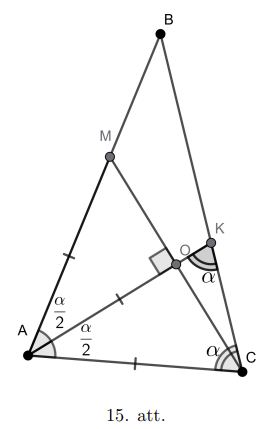

Apzīmēsim trijstūra $ABC$ pamata pieleņķus $\angle BAC=\angle BCA=\alpha$, tad virsotnes leņķis $\angle ABC=180^\circ-2\alpha$. Nogriezņu $AK$ un $MC$ krustpunktu apzīmēsim ar $O$.

Trijstūris $MAC$ ir vienādsānu (jo $AM=AC$) un, tā kā $AO$ ir tā augstums pret pamatu, tad $AO$ ir arī tā bisektrise. Tas nozīmē, ka $\angle KAC=\alpha/2$.

No tā, ka trijstūris $AKC$ ir vienādsānu (jo $AK=AC$), mēs varam secināt, ka $\angle AKC=\angle ACK=\alpha$. Tātad trijstūra $AKC$ leņķi ir $\frac{\alpha}{2}, \alpha, \alpha$. Tā kā trijstūra iekšējo leņķu summa ir $180^\circ$, tad iegūstam vienādojumu

$$
\frac{\alpha}{2}+\alpha+\alpha=180^\circ
$$

no kurienes iegūstam, ka $\alpha=72^\circ$. Tātad trijstūra $ABC$ leņķi ir $72^\circ,72^\circ,36^\circ$.

# <lo-sample/> LV.AMO.2025.8.3

Bezgalīgā naturālu skaitļu virknē katru locekli, sākot no otrā, iegūst, pieskaitot iepriekšējam loceklim tā lielāko ciparu. Piemēram, ja virknes pirmais loceklis ir $13$, tad virkne ir $13,16,22,24,28,36,\ldots$. Vai eksistē tāda virknes pirmā locekļa vērtība, ka visi virknes locekļi ir a) pāra skaitļi; b) nepāra skaitļi?

<small>

* questionType:ProveDisprove
* domain:NT
* _hasSolutionConcept: NumberSequence, ParityInvariant, DigitRepresentation
* _readingDifficulty: medium

</small>

## Atrisinājums

Pierādīsim, ka tas (ne a) ne b) gadījumi) nav iespējams. Aplūkosim virknes locekļu desmitu ciparu (t.i. otro no labās puses). Katrā solī tas vai nu nemainās, vai arī palielinās par vienu (vai arī no $9$ mainās uz $0$), jo katrā solī virknei tiek pieskaitīts kāds skaitlis, kas ir mazāks par $10$. Tas nozīmē, ka kādā brīdī šis te desmitu cipars būs vienāds ar $9$. Tajā brīdī tas būs lielākais šī skaitļa cipars, un, tā kā $9$ ir nepāra skaitlis, tad, to pieskaitot, nākamajam skaitlim mainīsies paritāte. Tātad, neatkarīgi no $a_1$ vērtības, šajā virknē noteikti būs, gan pāra, gan nepāra skaitļi.

# <lo-sample/> LV.AMO.2025.8.4

Ilmārs grib uznest augšā uz dzīvokli $150$ kg ķirbju. Zināms, ka katrs ķirbis sver ne vairāk kā $10$ kg. Vienā reizē viņš var uznest patvaļīgu daudzumu ķirbju, kas kopā sver ne vairāk kā $30$ kg. Kāds ir mazākais reižu skaits, ar kuru Ilmārs noteikti var uznest visus ķirbjus (neatkarīgi no to svara)? Griezt gabalos ķirbjus nedrīkst!

<small>

* questionType:FindOptimal
* domain:Comb
* _hasSolutionConcept: OptimumProofStructure, PositiveIntegers, LinearInequality, CaseAnalysis
* _readingDifficulty: medium

</small>

## Atrisinājums

Mazākais skaits ir $7$ reizes.

Vispirms parādīsim, ka ar $7$ reizēm noteikti pietiek. Katrā no pirmajām $6$ reizēm Ilmārs var ņemt ķirbjus līdz to svars pārsniedz (vai sakrīt) ar $20$kg. Tā ar $6$ piegājieniem viņš būs uznesis vismaz $120$kg. Tad pēdējā $7$. reizē viņam atliek uznest visus atlikušos, kas ir ne vairāk kā $150-120=30$kg.

Bet ar $6$ reizēm var nepietikt, piemēram, ja ir $19$ ķirbji, kuri visi sver vienādi, t.i. katrs sver $\frac{150}{19}=7\frac{17}{19}$kg. Tad, ja tos varētu uznes ar $6$ reizēm, pēc Dirihlē principa būtu tāda reize, kad būtu jānes vismaz $4$ ķirbji, kas ir vairāk nekā $30$kg.

Piezīme. 9.5. uzdevuma atrisinājumā ir parādīta metode, kas ļauj katrā reizē uznest vismaz $22{,}5$kg ķirbju.

# <lo-sample/> LV.AMO.2025.8.5

LAPSA un SPALS ir divi piecciparu skaitļi, kuros cipari aizstāti ar burtiem, vienādi cipari ar vienādiem burtiem, bet dažādi cipari — ar dažādiem. Zināms, ka abi šie skaitļi dalās ar $9$. Pierādi, ka tieši viens no tiem dalās ar $15$. Kurš tas ir?

<small>

* questionType:Prove,FindAll
* domain:Comb
* _hasSolutionConcept: DigitRepresentation, DivisibilityRules, DivisibilityRelation
* _readingDifficulty: medium

</small>

## Atrisinājums

Atbilde: LAPSA dalās ar $15$, bet SPALS nedalās.

Lai skaitlis dalītos ar $15$, tam jādalās ar $3$ un ar $5$. Tā kā abi šie skaitļi dalās ar $9$, tad tie abi dalās ar $3$. Tātad atliek noskaidrot, kurš no skaitļiem dalās ar $5$.

Tā kā abi šie skaitļi dalās ar $9$, tad to ciparu summas dalās ar $9$, tātad arī to ciparu summu starpība dalās ar $9$, tātad $|A-S|$ dalās ar $9$. Tas ir iespējams tikai tad, ja viens no šiem cipariem ($A$ un $S$) ir $9$, bet otrs ir $0$. Tā kā $S$ nevar būt $0$ (jo skaitlis nevar sākties ar $0$), tad $S=9$ un $A=0$. Tas nozīmē, ka skaitlis SPALS nedalās ar $5$ (jo tā pēdējais cipars ir $9$), bet LAPSA dalās ar $5$ (jo tā pēdējais cipars ir $0$).

# <lo-sample/> LV.AMO.2025.9.1

Atrodiet divus dažādus naturālu skaitļu trijniekus $(a,b,c)$, kuriem $a<b<c$ un

$$
\frac{1}{a}+\frac{1}{b}+\frac{1}{c}=\frac{4}{2025}.
$$

<small>

* questionType:
* domain:

</small>

## Atrisinājums

Šādu trijnieku ir ļoti daudz, te daži no tiem:

$$
\frac{1}{1296}+\frac{1}{1600}+\frac{1}{1728}=\frac{4}{2025}.
$$

$$
\frac{1}{810}+\frac{1}{2025}+\frac{1}{4500}=\frac{4}{2025}.
$$

Atrastu šādus trijniekus var palīdzēt šāds novērojums: ja mēs atrodam kādu skaitļu trijnieku $(a',b',c')$, kuram

$$
\frac{1}{a'}+\frac{1}{b'}+\frac{1}{c'}=\frac{4}{n},
$$

kur $n$ ir kāds skaitļa $2025$ dalītājs, tad, pareizinot visus trīs skaitļus $a',b',c'$ ar $\frac{2025}{n}$, mēs iegūsim prasīto trijnieku $(a,b,c)$. Tas nozīmē, ka sākotnēji var meklēt šādus trijniekus, kur $2025$ vietā ir kāds mazāks skaitlis $n$, kas ir $2025$ dalītājs.

Piemēram, paņemsim $n=5$, tad mums jāatrod skaitļi $a',b',c'$, kuriem

$$
\frac{1}{a'}+\frac{1}{b'}+\frac{1}{c'}=\frac{4}{5}.
$$

Šeit der, piemēram $a'=2,b'=5,c'=10$, jo

$$
\frac{1}{2}+\frac{1}{5}+\frac{1}{10}=\frac{8}{10}=\frac{4}{5}.
$$

Pareizinot $a',b',c'$ ar $2025/5=405$ iegūsim prasīto trijnieku $(a,b,c)$:

$$
a=2\cdot 405=810
$$

$$
b=5\cdot 405=2025
$$

$$
c=10\cdot 405=4500
$$

$$
\frac{1}{810}+\frac{1}{2025}+\frac{1}{4500}=\frac{4}{5\cdot 405}=\frac{4}{2025}.
$$

# <lo-sample/> LV.AMO.2025.9.2

Uz trijstūra $ABC$ malas $AC$ izvēlēts tāds punkts $D$, ka trijstūra $ABD$ mediāna $AM$ ir paralēla trijstūra $DBC$ mediānai $DN$. Aprēķiniet attiecību $\frac{AD}{DC}$.

<small>

* questionType:
* domain:

</small>

## Atrisinājums

Novilksim nogriezni $MN$, kas ir trijstūra $DBC$ viduslīnija (jo $M$ un $N$ ir malu viduspunkti).

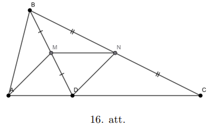

Tātad $DC=2MN$ pēc viduslīnijas īpašības.

Ievērosim, ka $AMND$ ir paralelograms, jo $AM \parallel DN$ pēc dotā, bet $MN \parallel AD$, jo trijstūra viduslīnija ir paralēla trijstūra malai, kuru tā nekrusto. Tā kā paralelograma pretējās malas ir vienādas, tad $AD=MN$.

Tātad

$$
\frac{AD}{DC}=\frac{MN}{2MN}=\frac{1}{2}.
$$

# <lo-sample/> LV.AMO.2025.9.3

Vai eksistē pirmskaitlis $p$, kuram $p \times p$ rūtiņu kvadrātu, griežot pa rūtiņu līnijām, var sagriezt tādos mazākos kvadrātos, ka katram no tiem mala ir vismaz $2$ rūtiņas gara?

<small>

* questionType:
* domain:

</small>

## Atrisinājums

Mazākais šāds pirmskaitlis ir $11$.

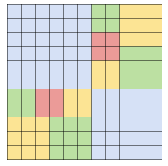

# <lo-sample/> LV.AMO.2025.9.4

Bezgalīgā veselu skaitļu virknē $1,2,3,6,1,\ldots$ katrs loceklis, sākot ar ceturto, ir iepriekšējo $3$ locekļu summas kvadrāta pēdējais cipars. Aprēķiniet šīs virknes $2025$. locekli.

<small>

* questionType:
* domain:

</small>

## Atrisinājums

Uzrakstot virknes pirmos locekļus

$$
1,2,3,6,1,0,9,0,1,0,1,4,5,0,1,6,9,6,1,6,9,6,1,6,9,6,\ldots
$$

varam ievērot, ka, sākot ar $15$. locekli, virkne ieciklojas ar periodu $4$ (tā ieciklojas sākot no vietas, kurā divas reizes parādās viens un tas pats trijnieks $1,6,9$), tāpēc sākot no $15$. locekļa $a_n=a_{n+4}$. Tāpēc virknes $2025$. loceklis ir vienāds ar $2025-502\cdot 4=17$. locekli, tātad tas ir $9$.

# <lo-sample/> LV.AMO.2025.9.5

Ilmārs grib uznest augšā uz dzīvokli $255$ kg ķirbju. Zināms, ka katrs ķirbis sver ne vairāk kā $10$ kg. Vienā reizē viņš var uznest patvaļīgu daudzumu ķirbju, kas kopā sver ne vairāk kā $30$ kg. Kāds ir mazākais reižu skaits, ar kuru Ilmārs noteikti var uznest visus ķirbjus (neatkarīgi no to svara)? Ķirbjus griezt gabalos nedrīkst!

<small>

* questionType:
* domain:

</small>

## Atrisinājums

Mazākais skaits ir $11$ reizes.

Vispirms parādīsim, ka ar $11$ reizēm noteikti pietiek. Katrā no pirmajām $10$ reizēm Ilmārs var noteikti paņemt vismaz $22{,}5$kg ķirbju. Lai to izdarītu, viņš var sakārtot ķirbjus pēc to svara dilstošā secībā un tad ņemt pēc kārtas, līdz vairāk nevar (paņemot nākamo kopējais svars pārsniegs $30$kg). Pamatosim, ka šādā veidā Ilmārs katrā reizē noteikti paņems vismaz $22{,}5$ kg ķirbju.

Pieņemsim pretējo, ka Ilmārs ir paņēmis mazāk par $22{,}5$kg. Tas nozīmē, ka šis te ”nākamais” ķirbis sver vairāk par $7{,}5$kg (jo, paņemot to, kopējais svars pārsniegs $30$kg). Bet tādā gadījumā arī visi līdz šim paņemtie ķirbji katrs sver vismaz $7{,}5$kg (jo tos ņem pēc svara dilstošā secībā). Bet tā kā Ilmārs ir paņēmis vismaz $3$ ķirbjus (jo neviens ķirbis nav smagāks par $10$kg), tad kopā viņš ir paņēmis vismaz $3\cdot 7{,}5=22{,}5$kg – pretruna.

Šādā veidā pirmajās $10$ reizēs Ilmārs kopā var uznest vismaz $22{,}5\cdot 10=225$kg ķirbju. Tad pēdējā $11$. reizē tam atliek ne vairāk par $255-225=30$kg.

Tagad pamatosim, ka ar $10$ reizēm var nepietikt. Aplūkosim gadījumu, kad Ilmāram ir $31$ ķirbis un tie visi sver vienādi, t.i. katrs ķirbis sver $\frac{255}{31}=8\frac{7}{31}$kg. Ja tos varētu uznest ar $10$ reizēm, tad pēc Dirihlē principa būtu tāda reize, kad būtu jānes vismaz $4$ ķirbji, bet tas ir vairāk nekā $30$kg.

# <lo-sample/> LV.AMO.2025.10.1

Doti divi dažādi naturāli skaitļi $a$ un $b$. Pierādīt, ka

$$
\frac{a}{b}+\frac{b}{a}\geq 2+\frac{1}{ab}.
$$

<small>

* questionType:
* domain:

</small>

## Atrisinājums

Pārnesot divnieku uz kreiso pusi un pareizinot abas puses ar $ab$ (kas ir pozitīvs skaitlis), iegūstam ekvivalentu nevienādību pierādāmajai:

$$
a^2+b^2-2ab\geq 1
$$

jeb

$$
(a-b)^2\geq 1,
$$

kas ir acīmredzami pareiza, ja $a$ un $b$ ir dažādi naturāli skaitļi (jo tādā gadījumā to starpības modulis ir vismaz $1$).

# <lo-sample/> LV.AMO.2025.10.2

Doti kvadrāti $ABCD$ un $BCEF$ ($BC$ tiem ir kopīga mala), punkts $M$ ir malas 
$EF$ viduspunkts. Kādā garumu attiecībā taisne $AC$ sadala nogriezni $MD$?

<small>

* questionType:
* domain:

</small>

## Atrisinājums

Attēlosim dotos kvadrātus uz kvadrātveida rūtiņu režģa kā redzams zīmējumā. Caur

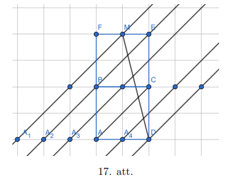

punktiem $A_1,A_2,A_3,A,A_4,D$ novilksim taisnes, kas paralēlas taisnei $AC$. 
Pēc Talesa teorēmas tās dala nogriezni $MD$ piecās vienādās daļās. Tas nozīmē, 
ka taisne $AC$ to dala attiecībā $3:2$.

# <lo-sample/> LV.AMO.2025.10.3

Bezgalīgā naturālu skaitļu virknē $24,69,21,18,\ldots$ katru skaitli, sākot 
no trešā, var iegūt, saskaitot divu iepriekšējo skaitļu ciparu summas. 
Aprēķināt šīs virknes $2025$. locekli.

<small>

* questionType:
* domain:

</small>

## Atrisinājums

Atbilde: virknes $2025$. loceklis ir $15$.

Turpinot virkni

$$
24,69,21,18,12,12,6,9,15,15,12,9,12,12,6,9
$$

redzam, ka tajā skaitļu pāris $(12,12)$ atkārtojas $5$. un $6$., kā arī $13$. un $14$. pozīcijā, līdz ar to (tā kā katrs loceklis ir atkarīgs no diviem iepriekšējiem) varam secināt, ka šī virkne sākot no $5$. locekļa ir periodiska ar garumu $8$ un tās periods ir $(12,12,6,9,15,15,12,9)$.

Līdz ar to tās $2025$. loceklis ir tas pats, kas $2025-8\cdot 252=9$. loceklis, tātad tas ir $15$.

# <lo-sample/> LV.AMO.2025.10.4

Uz tāfeles uzrakstīti $2025$ dažādi naturāli skaitļi. Reizi minūtē Elīna izvēlas jebkurus divus no tiem, apzīmēsim tos ar $a$ un $b$, tos nodzēš un to vietā uzraksta skaitļus $LKD(a,b)$ un $MKD(a,b)$. Pierādīt, ka noteikti (neatkarīgi no tā, kurus skaitļus Elīna izvēlas) pienāks tāds brīdis, kad viņa uzrakstīs uz tāfeles tos pašus skaitļus, ko nodzēsusi (tajā pašā gājienā).

Piezīme: ar $LKD(x,y)$ un $MKD(x,y)$ apzīmē attiecīgi skaitļu $x$ un $y$ lielāko kopīgo dalītāju un mazāko kopīgo dalāmo.

<small>

* questionType:
* domain:

</small>

## Atrisinājums

**1. atrisinājums.** Pierādīsim, ka jebkuriem naturāliem skaitļiem $a$ un $b$ ir spēkā

$$
LKD(a,b)\cdot MKD(a,b)=ab.
$$

Aplūkosim divus patvaļīgus naturālus skaitļus $a$ un $b$, kuru lielākais kopīgais dalītājs ir $d$. Tādā gadījumā mēs varam izteikt, ka $a=dx$ un $b=dy$ kaut kādiem $x$ un $y$, kuriem $LKD(x,y)=1$. Skaitļu $x$ un $y$ mazākais kopīgais dalāmais tātad ir $xy$, savukārt skaitļu $a=dx$ un $b=dy$ mazākais kopīgais dalāmais ir $dxy$. No tā seko prasītais (šis ir labi zināms fakts).

No tā seko, ka Elīnas nodzēsto skaitļu $a$ un $b$ reizinājums ir vienāds ar viņas uzrakstīto skaitļu $LKD(a,b)$ un $MKD(a,b)$ reizinājumu, kas nozīmē, ka visu uz tāfeles uzrakstīto skaitļu reizinājums nemainās.

Aplūkosim tagad, kā mainās uzrakstīto skaitļu summa (lietosim tos pašus apzīmējumus $a=dx$ un $b=dy$). Tā pieaug par

$$
dxy+d-dx-dy=d(x-1)(y-1)\geq 0,
$$

pie tam vienādība izpildās tikai tad, ja $x=1$ vai $y=1$.

No šejienes varam secināt, ka visu uz tāfeles uzrakstīto skaitļu summa nekad nesamazinās, un paliek tāda pati kā bija tikai tad, ja $x=1$ vai $y=1$, t.i., tajā gadījumā, ja viens no skaitļiem dalās ar otru. Šajā gadījumā (pieņemsim, ka $x=1$, tad skaitļi ir $a=d$ un $b=dy$) Elīna uzrakstīs uz tāfeles tos pašus skaitļus, ko nodzēsusi, jo $LKD(d,dy)=d$, bet $MKD(d,dy)=dy$.

Tā kā skaitļu summa nevar bezgalīgi pieaugt, ja to reizinājums nemainās, tad noteikti pienāks tāds brīdis, kad summa paliks tāda pati, un šajā brīdī Elīna uzrakstīs uz tāfeles tos pašus skaitļus, ko nodzēsusi.

**2. atrisinājums.** Vienkāršības labad pieņemsim, ka $a\leq b$. Ievērosim, ka tādā gadījumā $LKD(a,b)\leq a$, pie tam vienādība izpildās tikai tad, ja $LKD(a,b)=a$ un $MKD(a,b)=b$ t.i. tad, ja Elīna uzraksta tos pašus skaitļus, ko nodzēsusi.

Pieņemsim pretējo, ka Elīna darbojas bezgalīgi ilgi un nekad neuzraksta tos pašus skaitļus, ko tikko nodzēsusi. Tādā gadījumā viņa katrā solī uzraksta skaitli $(LKD(a,b))$, kas ir mazāks, par abiem viņas nodzēstajiem skaitļiem.

Aplūkosim vismazāko skaitli, kas šajā bezgalīgajā procesā parādās uz tāfeles. Pēc tā uzrakstīšanas, Elīna to vairs neizvēlas (jo uz tāfeles neparādās par to mazāks skaitlis), tāpēc viņa tālāk viņa darbojas tikai ar atlikušajiem $2024$ skaitļiem.

Pēc tam aplūkosim mazāko skaitli no atlikušajiem, kas šajā bezgalīgajā procesā parādās uz tāfeles. Pēc tā uzrakstīšanas (arī tad, ja tas tur jau bija no sākuma) Elīna to vairs neizvēlas (jo uz tāfeles neparādās par to mazāks skaitlis), tāpēc viņa tālāk darbojas tikai ar atlikušajiem $2023$ skaitļiem.

Atkārtojot šo spriedumu vēl $2022$ reizes mēs nonāksim situācijā, kad ir jau $2024$ skaitļi, ko Elīna vairs
neizvēlas un tātad atlicis tikai viens, ko viņa drīkst nodzēst — pretruna.

# <lo-sample/> LV.AMO.2025.10.5

Vai eksistē pirmskaitlis $p$, kuram $p \times p$ rūtiņu kvadrātu, griežot pa rūtiņu līnijām, var sagriezt tādos mazākos kvadrātos, ka jebkuram no tiem malas garums (rūtiņās) arī ir pirmskaitlis?

<small>

* questionType:
* domain:

</small>

## Atrisinājums

Mazākais šāds pirmskaitlis ir $11$.

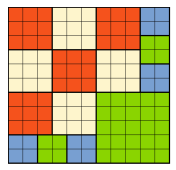

# <lo-sample/> LV.AMO.2025.11.1

Pierādīt, ka jebkuram naturālam skaitlim $k$ var atrast tādus naturālus skaitļus $a$ un $b$, ka $a!$ dalās ar $b$, $b!$ dalās ar $a$ un $a-b=k$.

Piezīme: naturāla skaitļa $n$ faktoriāls $n!$ ir visu naturālo skaitļu no $1$ līdz $n$ ieskaitot reizinājums: $n!=1\cdot 2\cdot \ldots \cdot n$. Piemēram, $4!=1\cdot 2\cdot 3\cdot 4=24$.

<small>

* questionType:
* domain:

</small>

## Atrisinājums

Vispirms ievērosim, ka, tā kā $a>b$ (jo $a-b=k>0$), tad nosacījums $a!$ dalās ar $b$ vienmēr izpildās. Tāpēc aplūkosim tikai otru nosacījumu. Parādīsim, kā katram naturālam $k$ atrast šādus skaitļus $a$ un $b$, ka $a-b=k$ un $b!$ dalās ar $a$.

- Ja $k=1$, tad var ņemt $a=6$ un $b=5$, redzams, ka $5!=120$ dalās ar $6$.
- Ja $k=2$, tad var ņemt $a=6$ un $b=4$, redzams, ka $4!=24$ dalās ar $6$.
- Jebkuram citam $k\geq 3$ ņemsim $a=2k$ un $b=k$, tad redzams, ka $k!=(k-1)!\cdot k$ dalās ar $2k$, jo skaitlis $(k-1)!$ dalās ar $2$.

# <lo-sample/> LV.AMO.2025.11.2

Regulāra $9$-stūra virsotnēs un malu viduspunktos ierakstīti naturālie skaitļi no $1$ līdz $18$ (katrs skaitlis izmantots tieši vienu reizi) tā, ka skaitļu summa uz katras tā malas ir viena un tā pati (uz katras malas atrodas $3$ skaitļi, divi virsotnēs un viens tās viduspunktā). Kāda ir mazākā iespējamā šīs summas vērtība?

<small>

* questionType:
* domain:

</small>

## Atrisinājums

Atbilde: mazākā iespējamā vērtība ir $24$. Vispirms parādīsim, ka vērtība $k=24$ ir iespējama. To var izdarīt, kā redzams 18. att.

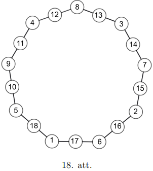

Atliek pamatot, ka mazāka summa nav iespējama. Apzīmēsim uz katras malas uzrakstīto skaitļu summu ar $k$ un aplūkosim visu šo malu summu summu. No vienas puses tās vērtība ir $9k$, jo mums ir $9$ malas un uz katras malas skaitļu summa ir $k$. No otras puses, šādā veidā mēs katru no $18$ skaitļiem esam ieskaitījuši vienu vai divas reizes: virsotnēs ierakstītos skaitļus katru divas reizes (jo tie pieder divām malām), bet malu viduspunktos ierakstītos skaitļus katru vienu reizi. Līdz ar to mēs varam uzrakstīt vienādojumu

$$
9k=S+S_v
$$

kur $S=\frac{18\cdot 19}{2}=171$ ir visu $18$ skaitļu summa, bet $S_v$ ir virsotnēs ierakstīto skaitļu summa. Tā kā $S_v\geq 1+2+\ldots+9=45$ (šādu mazāko summu mēs iegūstam, ja virsotnēs ir ierakstīti mazākie iespējamie skaitļi), tad iegūstam nevienādību

$$
9k\geq 171+45
$$

no kurienes $k\geq 24$.

# <lo-sample/> LV.AMO.2025.11.4

Cik dažādos veidos skaitli $12$ var izteikt kā vieninieku, divnieku un četrinieku summu? Veidi, kas atšķiras ar saskaitāmo secību, ir uzskatāmi par dažādiem. Piemēram, skaitli $4$ var izteikt sešos dažādos veidos: $1+1+1+1=1+1+2=1+2+1=2+1+1=2+2=4$.

<small>

* questionType:
* domain:

</small>

## Atrisinājums

Atbilde: $520$ veidos.

Apzīmēsim ar $a_n$ to, cik dažādos veidos skaitli $n$ var izteikt kā vieninieku, divnieku un četrinieku summu.

Tādā gadījumā $a_1=1$, $a_2=2$ (jo $2=1+1=2$), $a_3=3$ (jo $3=1+1+1=1+2=2+1$) un $a_4=6$ (kā uzdevumā dotajā piemērā). Visiem pārējiem $n\geq 5$ izteiksim $a_n$ rekurenti no iepriekšējām vērtībām.

Visus dažādos veidus kā skaitli $n$ var izteikt kā vieninieku divnieku un četrinieku summu var sadalīt $3$ grupās:

- tie, kas sākas ar $1$. Tādā gadījumā visi pārējie summas locekļi summā dod $n-1$, tātad šādu veidu ir tieši $a_{n-1}$.
- tie, kas sākas ar $2$. Tādā gadījumā visi pārējie summas locekļi summā dod $n-2$, tātad šādu veidu ir tieši $a_{n-2}$.
- tie, kas sākas ar $4$. Tādā gadījumā visi pārējie summas locekļi summā dod $n-4$, tātad šādu veidu ir tieši $a_{n-4}$.

No tā mēs varam secināt, ka visiem $n\geq 5$ ir spēkā $a_n=a_{n-1}+a_{n-2}+a_{n-4}$. Izmantojot šo, varam aprēķināt prasīto vērtību:

$$
a_5=a_4+a_3+a_1=6+3+1=10
$$

$$
a_6=a_5+a_4+a_2=10+6+2=18
$$

$$
a_7=a_6+a_5+a_3=18+10+3=31
$$

$$
a_8=a_7+a_6+a_4=31+18+6=55
$$

$$
a_9=a_8+a_7+a_5=55+31+10=96
$$

$$
a_{10}=a_9+a_8+a_6=96+55+18=169
$$

$$
a_{11}=a_{10}+a_9+a_7=169+96+31=296
$$

$$
a_{12}=a_{11}+a_{10}+a_8=296+169+55=520
$$

# <lo-sample/> LV.AMO.2025.11.5

Katrs no $7$ votivapām zina dažus pantiņus no votivapu himnas. Zināms, ka 
jebkuri $3$ votivapas kopā var to nodziedāt (tie kopā zina visus pantiņus). 
Vai noteikti var atrast divus votivapas, kas divatā var nodziedāt votivapu 
himnu, ja tajā ir **(A)** $20$ **(B)** $21$ pantiņi?

<small>

* questionType:
* domain:

</small>

## Atrisinājums

**(A)** Jā. Pieņemsim pretējo, ka šādu divu votivapu nav. Tādā gadījumā 
katriem $2$ votivapām ir pantiņš, kuru neviens no viņiem nezina. Kopā 
no $7$ votivapām var izveidot $21$ votivapu pāri, pēc Dirihlē principa 
(tā kā pantiņu ir tikai $20$) mums būs divi votivapu pāri, kas nezina 
vienu un to pašu pantiņu. Bet šajos abos pāros kopā ir vismaz $3$ votivapas, 
tā ir pretruna ar to, ka jebkuri $3$ votivapas kopā var nodziedāt himnu.

**(B)** Nē. Tagad mums ir $21$ pantiņš un $21$ votivapu pāris. Piekārtosim 
katram pantiņam votivapu pāri, kas to nezina, un pieņemsim, ka pārējie $5$ 
votivapas (kas nav šajā pārī) šo pantiņu zina. Šādā veidā neviens votivapu 
pāris nevar nodziedāt himnu (jo katram pārim ir pantiņš, kuru viņi nezina), 
bet katrs votivapu trijnieks var (jo katram pantiņam ir tikai $2$ votivapas, 
kas to nezina, līdz ar to no $3$ votivapām vismaz viens to zina).

# <lo-sample/> LV.AMO.2025.12.1

Atrisināt reālos skaitļos vienādojumu

$$
x\cdot\left(5\sqrt{x^2-1}+7\sqrt{x+1}\right)=-2.
$$

<small>

* questionType:
* domain:

</small>

## Atrisinājums

$x=-1$.

Acīmredzami, ka $x$ nevar būt pozitīvs, jo tādā gadījumā vienādojuma kreisā puse būs pozitīva. Acīmredzami arī, ka $x=0$ neder. Līdz ar to atliek aplūkot gadījumu, kad $x<0$.

Lai būtu definēta otrā kvadrātsakne, mums ir nepieciešams lai $x+1\geq 0$, t.i. $x\geq -1$. Bet, lai būtu definēta pirmā kvadrātsakne, mums ir nepieciešams, lai $x^2-1\geq 0$. Tā kā $x$ ir negatīvs, tad tas ir iespējams tikai, ka $x\leq -1$. Tātad abas kvadrātsaknes ir definētas tikai tad, ja $x=-1$. Pārbaudot konstatējam, ka šī $x$ vērtība der kā atrisinājums.

# <lo-sample/> LV.AMO.2025.12.2

Cik ir tādu sešciparu skaitļu, kas nesatur nevienu no cipariem $5,6,7,8,9,0$ un kuros nekur blakus neatrodas divi cipari $4$?

<small>

* questionType:
* domain:

</small>

## Atrisinājums

Atbilde: ir $3105$ šādi skaitļi.

Apzīmēsim ar $a_n$ tādu $n$-ciparu skaitļu skaitu, kas sastāv tikai no cipariem $1,2,3,4$ un kuros divi četrinieki neatrodas blakus. Viegli ievērot, ka $a_1=4$ (vienciparu skaitļi $1,2,3,4$) un $a_2=15$ (der visi divciparu skaitļi, izņemot $44$). Mūsu uzdevums ir atrast $a_6$ vērtību. Izteiksim šīs virknes $n$-to locekli rekurenti.

Sadalīsim visus $n$-ciparu skaitļus, kas atbilst uzdevuma nosacījumiem, divās grupās:

- skaitļi, kas sākas ar $1,2$ vai $3$. Šādu skaitļu kopā ir $3a_{n-1}$, jo katram no šiem trim pirmajiem cipariem atlikušo $n-1$ ciparu skaitļu ir tieši $a_{n-1}$.
- skaitļi, kas sākas ar $4$. Šādiem skaitļiem otrais cipars var būt tikai $1,2$ vai $3$ un atlikušo $n-2$ ciparu skaitļu skaits katrā no šiem gadījumiem ir tieši $a_{n-2}$. Tāpēc šādu skaitļu kopā ir $3a_{n-2}$.

No šejienes varam iegūt rekurentu sakarību $a_n=3a_{n-1}+3a_{n-2}$. Pēc tās aprēķinot virknes locekļus iegūstam

$$
a_1=4
$$

$$
a_2=15
$$

$$
a_3=3\cdot(a_1+a_2)=3\cdot(4+15)=57
$$

$$
a_4=3\cdot(a_2+a_3)=3\cdot(15+57)=216
$$

$$
a_5=3\cdot(a_3+a_4)=3\cdot(57+216)=819
$$

$$
a_6=3\cdot(a_4+a_5)=3\cdot(216+819)=3105
$$

# <lo-sample/> LV.AMO.2025.12.3

Trijstūrī $ABC$ novilkts augstums $BD$ un mediāna $BE$, zināms, ka 
punkts $D$ atrodas starp $C$ un $E$. Zināms arī, ka 
$\angle ABE=\angle CBD=23^\circ$. Aprēķināt $\angle DBE$ lielumu grādos!

<small>

* questionType:
* domain:

</small>

## Atrisinājums

Pagarināsim $BE$ aiz $E$ tā, ka $EF=BE$. Tad $ABCF$ ir paralelograms 
(jo tā diagonāles krustpunktā dalās uz pusēm) un 
$\angle ABF=\angle CFB=\alpha=23^\circ$. Pagarināsim $BD$ aiz $D$ tā, 
ka $DG=BD$. Tā kā $BD\perp AC$, tad $BCG$ ir vienādsānu trijstūris 
(jo tajā $CD$ ir gan augstums, gan mediāna) un tātad 
$\angle CGD=\angle CBD=\alpha$.

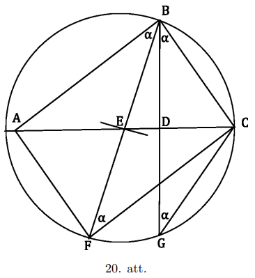

Aplūkosim četrstūri $BCGF$. Divi vienādi lieli leņķi $\angle CFB$ un 
$\angle CGD$ balstās uz $BC$. Tas nozīmē, ka ap četrstūri $BCGF$ var 
apvilkt riņķa līniju. Šīs riņķa līnijas centrs atrodas $BG$ un $BF$ 
vidusperpendikulu krustpunktā. Tā kā $BG$ vidusperpendikuls ir $AC$, 
kas iet caur punktu $E$, un arī $BF$ vidusperpendikuls iet caur 
punktu $E$, tad $E$ arī ir ap četrstūri $BCGF$ apvilktās riņķa 
līnijas centrs.

Tā kā šīs riņķa līnijas rādiuss ir $CE=AE$, tad $AC$ ir šīs riņķa 
līnijas diametrs un $\angle ABC=90^\circ$. Tātad 
$\angle DBE=90^\circ-2\alpha=44^\circ$.

# <lo-sample/> LV.AMO.2025.12.4

Katrs no $7$ šillišallām zina dažus pantiņus no šillišallu himnas. 
Zināms, ka jebkuri $4$ no viņiem kopā var to nodziedāt (tie kopā 
zina visus pantiņus). Vai noteikti var atrast trīs šillišallas, 
kas kopā var nodziedāt šillišallu himnu, ja tajā ir **(A)** $34$ **(B)** $35$ pantiņi?

<small>

* questionType:
* domain:

</small>

## Atrisinājums

**(A)** Jā. Pieņemsim pretējo, ka šādu divu šillišallu nav. Tādā gadījumā katram šillišallu trijniekam ir pantiņš, kuru neviens no viņiem nezina. Kopā no $7$ šillišallām var izveidot $C_7^3=\frac{7\cdot 6\cdot 5}{1\cdot 2\cdot 3}=35$ šillišallu trijniekus, pēc Dirihlē principa mums būs divi šillišallu trijnieki, kas nezina vienu un to pašu pantiņu. Bet šajos abos trijniekos kopā ir vismaz $4$ šillišallas, tā ir pretruna ar to, ka jebkuri $4$ šillišallas kopā var nodziedāt himnu.

**(B)** Nē. Tagad mums ir $35$ pantiņi un $35$ šillišallu trijnieki, piekārtosim katram pantiņam šillišallu trijnieku, kas to nezina un pieņemsim, ka pārējie $4$ šillišallas (kas nav šajā trijniekā) šo pantiņu zina. Šādā veidā neviens šillišallu trijnieks nevar nodziedāt himnu (jo katram trijniekam ir pantiņš, kuru viņi nezina), bet katri četri šillišallas var (jo katram pantiņam ir tikai $3$ šillišallas, kas to nezina, līdz ar to no $4$ šillišallām vismaz viens to zina).

# <lo-sample/> LV.AMO.2025.12.5

Doti tādi naturāli skaitļi $x$ un $y$, ka $x+2y+1$ ir pirmskaitlis. Pierādīt, ka $x^2+2xy-2y$ nevar būt naturāla skaitļa kvadrāts.

<small>

* questionType:
* domain:

</small>

## Atrisinājums

Apzīmēsim $p=x+2y+1$ un ievērosim, ka $p\geq x+3$ (jo $y\geq 1$). Ievērosim arī, ka $x\geq 2$ 
($x$ jābūt pāra skaitlim, pretējā gadījumā $x+2y+1$ būs pāra skaitlis, tātad nebūs pirmskaitlis).

Pārveidosim doto izteiksmi, izmantojot to, ka $p=x+2y+1$:

$$
x^2+2xy-2y=(x^2+2xy+x)-(x+2y+1)+1=px-p+1.
$$

Pieņemsim pretējo, ka tas ir kāda naturāla skaitļa kvadrāts un apzīmēsim to ar $n^2$. Tādā gadījumā

$$
px-p=n^2-1
$$

$$
p(x-1)=(n-1)(n+1)
$$

Tātad vai nu $n-1$, vai $n+1$ dalās ar $p$. Aplūkosim šos gadījumus.

1. $n-1$ dalās ar $p$. Tādā gadījumā $x-1$ dalās ar $n+1$. Tātad $n-1\geq p$ un $x-1\geq n+1$ 
   (šeit ir svarīgi, ka $x\geq 2$), jeb $x-3\geq n-1$.
   Saliekot abas šīs nevienādības kopā iegūstam, ka $x-3\geq n-1\geq p$, kas ir pretruna ar to, ka $p\geq x+3$.

2. $n+1$ dalās ar $p$. Tādā gadījumā $x-1$ dalās ar $n-1$. Tātad $n+1\geq p$ un $x-1\geq n-1$, jeb $x+1\geq n+1$.
   Saliekot abas šīs nevienādības kopā iegūstam, ka $x+1\geq n+1\geq p$, kas ir pretruna ar to, ka $p\geq x+3$.

