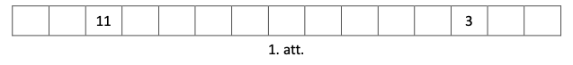

# <lo-sample/> LV.NOL.2023.5.1

Write a number in each empty cell (see Figure 1) so that the sum of the 
numbers in any three consecutive cells is the same, and the total sum 
of all the numbers written in the cells (including the two given numbers) 
is $223$. It is sufficient to show one example of how to achieve this.

{ width=300px }

## Solution

The required solution can be achieved as shown in Figure 2, where the sum 
of every three consecutive numbers is $51$.

{ width=300px }

Let's explain how these numbers can be found. Consider four consecutive 
cells that contain the numbers $x;a;b$ and $y$ (see Figure 3).

{ width=150px }

Since the sum of the numbers in any three consecutive cells is the same, 
we have $x+a+b=a+b+y$, which implies $x=y$, and thus the numbers $x$ and 
$y$ must be the same. Therefore, the numbers written in the cells repeat 
with a period of $3$ (see Figure 4), where $n$ is an unknown number 
(the same everywhere).

{ width=300px }

If we remove the very last number $19$, we find that in four blocks of 
three cells $(19;20;n)$, the total sum of the numbers is $223-19=204$. 
Hence, the sum of the numbers in one such block $(19;20;n)$ is $204:4=51$. 
Therefore, the number $n$ must be $51-19-20=12$.

# <lo-sample/> LV.NOL.2023.5.2

In the forest, gnomes have built eight houses and created several paths 
between them. Each path connects two houses, and paths can intersect. 
Is it possible that the houses have the following number 
of paths coming out of them:  
**(A)** $2, 2, 2, 4, 4, 4, 4, 4$ paths respectively;  
**(B)** $1, 2, 2, 2, 2, 3, 4, 5$ paths respectively?

## Solution

**(A)** Yes, for example, see Fig. 5, where dots represent houses, lines 
represent paths, and the number of lines emanating from each point is 
noted next to each point.

**(B)** Let us show that this is not possible. Since each path has two 
endpoints, the total number of path ends must be an even number. 
From the given data, we get that there are $1+2+2+2+2+3+4+5=21$ 
endpoints. Since $21$ is an odd number, the required configuration 
is not possible.

{ width=200px }

# <lo-sample/> LV.NOL.2023.5.3

Show how the figure in Fig.2 (a $6 \times 8$ rectangle, 
from which a $3 \times 4$ rectangle has been removed), 
by cutting along the grid lines, can be subdivided into three identical shapes! 
The shapes are considered identical if they can be placed one on top of 
the other so that they coincide (the shapes may be rotated and flipped).

{ width=200px }

<small>

* questionType:FindExample
* domain:Geom

</small>

## Solution

See Fig. 7.

{ width=200px }

# <lo-sample/> LV.NOL.2023.5.4

Show how the number $174$ can be written as the sum of $3$ distinct natural numbers such 
that the sum of any two of these numbers is divisible by the third number!

<small>

* questionType:FindExample
* domain:NT

</small>

## Solution

This can be done as follows: $174=29+58+87$. Let's verify that the sum of any two of 
these numbers is divisible by the third number:

$$\begin{aligned}
& \circ \quad(29+58): 87=87: 87=1 \\
& \circ \quad(29+87): 58=116: 58=2 \\
& \circ \quad(58+87): 29=145: 29=5
\end{aligned}$$

# <lo-sample/> LV.NOL.2023.5.5

If a red coin is inserted into the machine, it gives out $5$ blue coins, 
but if a blue coin is inserted into the machine, it gives out $3$ red coins. Is it 
possible, by repeatedly using the machine, to obtain equal numbers 
of red and blue coins if initially one red coin is given?

<small>

* questionType:ProveDisprove
* domain:Comb
* subdomain:DOM_FixedInvariant

</small>

## Solution

No, this is not possible. Observe that initially there is one coin, and with each 
operation the number of coins increases by $4$ coins (if you insert $1$ red coin, 
it outputs $5$ blue coins) or by $2$ coins (if you insert $1$ blue coin, it outputs 
$3$ red coins), so the total number of coins will always be an odd number. 
But if the blue and red coins were in equal numbers, then the total number 
of coins would be even. Therefore, this is impossible.

# <lo-sample/> LV.NOL.2023.6.1

Find one set of natural numbers to substitute for $x, y$, and $z$ so that the equality

$$2+\frac{1}{x+\frac{1}{y+\frac{1}{z}}}=\frac{37}{13}$$

holds!

<small>

* questionType:FindExample
* domain:Alg

</small>

## Solution

The values $x=1$; $y=5$ and $z=2$ work. With these values the equality holds, since

$$2+\frac{1}{1+\frac{1}{5+\frac{1}{2}}}=2+\frac{1}{1+\frac{2}{11}}=2+\frac{1}{1 \frac{2}{11}}=2+\frac{11}{13}=2 \frac{11}{13}=\frac{37}{13}$$

*Note.* We will show how one can obtain the required values. Observe that $\frac{37}{13}=2 \frac{11}{13}$, 
hence $\frac{1}{x+\frac{1}{y+\frac{1}{Z}}}=\frac{11}{13}$, from which we get that 
$x+\frac{1}{y+\frac{1}{z}}=\frac{13}{11}$. Since $\frac{13}{11}=1 \frac{2}{11}$, then $x=1$ 
and $\frac{1}{y+\frac{1}{z}}=\frac{2}{11}$, from which we obtain that $y+\frac{1}{z}=\frac{11}{2}$. 
Noting that $\frac{11}{2} = 5\frac{1}{2}$, we obtain $y=5$ and $z=2$.

# <lo-sample/> LV.NOL.2023.6.2

The dwarfs in the forest have built ten houses and created several 
paths between them. Each path connects two houses, and the paths may cross. 
Is it possible that the numbers of paths leaving the houses are respectively:
**(A)** $2, 2, 2, 2, 2, 3, 3, 3, 3, 7$ paths;   
**(B)** $2, 2, 2, 2, 4, 4, 4, 4, 4, 4$ paths?

<small>

* questionType:ProveDisprove
* domain:Comb
* subdomain:DOM_FixedInvariant

</small>

## Solution

**(A)** We will prove that this is not possible. Since each path has two ends, 
the total number of path ends must be even, but from the given we get that 
$2+2+2+2+2+3+3+3+3+7=29$ path ends. Since $29$ is an odd number, 
the required configuration is impossible.

**(B)** Yes, for example, see Fig. 8, where the houses are represented by points, 
the paths by lines, and next to each point the number of lines leaving it is indicated.

{ width=200px }

# <lo-sample/> LV.NOL.2023.6.3

Show how, by cutting along the grid lines, the figure given in Fig. 1 can be cut into 
$4$ identical shapes! The shapes are identical if they can be placed one on top of 
the other so that they coincide (the shapes may be rotated and flipped).

{ width=200px }

<small>

* questionType:FindExample
* domain:Geom

</small>

## Solution

See, for example, Fig. 10 or Fig. 11.

{ width=250px }

# <lo-sample/> LV.NOL.2023.6.4

Can the number: **(A)** $72$, **(B)** $73$ be expressed as the sum of three distinct 
natural numbers such that the sum of any two of these numbers is divisible by the remaining number?

<small>

* questionType:ProveDisprove,ProveDisprove
* domain:NT

</small>

## Solution

**(A)** Yes, for example: $72=12+24+36$. Let us check that the sum of any two of these 
numbers is divisible by the third number:

$$\begin{aligned}
& \circ \quad(12+24): 36=36: 36=1 \\
& \circ \quad(12+36): 24=48: 24=2 \\
& \circ \quad(24+36): 12=60: 12=5
\end{aligned}$$

**(B)** We show that this is not possible. 
By contradiction, assume that $a+b+n=73$ and $a+b$ is divisible by $n$. 

If $a+b$ is divisible by some number $n$, then the sum of all three numbers $a+b+n$ is 
also divisible by $n$. Therefore, $73=a+b+n$, must be 
divisible by $a$, $b$, and $n$. But the number $73$ is prime, divisible 
only by $1$ and $73$. Hence three distinct numbers can only take two 
values $1$ or $73$, which is impossible.

# <lo-sample/> LV.NOL.2023.6.5

We start with the number $17$. We can repeatedly apply any of the following operations:

1. Multiply the current number by $2$.
2. Delete any of the digits $0$, $3$, $6$, or $9$ from the number.

Is it possible to obtain **(A)** the number 1? **(B)** the number 15?

<small>

* questionType:ProveDisprove,ProveDisprove
* domain:NT
* subdomain:DOM_FixedInvariant

</small>

## Solution

**(A)** Yes, for example, as follows:

$$17 \rightarrow 34 \rightarrow 4 \rightarrow 8 \rightarrow 16 \rightarrow 1$$

**(B)** No, it is not possible. The initial number $17$ is not divisible by $3$. 
If a number is not divisible by $3$, then after performing the allowed operations 
the resulting number will not be divisible by $3$:

- if a number not divisible by $3$ is multiplied by $2$, the product is also not divisible by $3$;
- if from a number not divisible by $3$ one deletes a digit $0,3,6,9$, 
  then the resulting number is also not divisible by $3$ (the digit sum of the initial 
  number is not divisible by $3$ (the divisibility rule for $3$); deleting $0,3,6,9$ 
  yields a digit sum that is still not divisible by $3$).

Therefore, even after several operations, the resulting number will not be divisible by $3$. 
This means that the number $15$ cannot be obtained, since it is divisible by $3$.

# <lo-sample/> LV.NOL.2023.7.1

Is it possible to write one natural number in each empty square (see Fig. 1) so that
all natural numbers from $1$ to $25$ are written and any two numbers whose difference 
is $1$ are placed in squares sharing a common side?

{ width=200px }

<small>

* questionType:ProveDisprove
* domain:Comb

</small>

## Solution

Solution. Yes, it is possible; see the figure.

{ width=150px }

# <lo-sample/> LV.NOL.2023.7.2

Can **(A)** $90$ light bulbs, **(B)** $73$ light bulbs be connected with wires so that 
each of them is connected by a wire to exactly $5$ other light bulbs?

<small>

* questionType:ProveDisprove,ProveDisprove
* domain:Comb
* subdomain:DOM_FixedInvariant

</small>

## Solution

**(A)** Yes, it is possible. Divide the $90$ bulbs into $15$ groups of $6$ bulbs each. 
In each group, connect every pair of bulbs with a wire (see Fig. 14, where bulbs are 
represented by points and wires by line segments connecting these points). In this way, 
each of the $90$ bulbs will be connected to exactly $5$ other bulbs.

{ width=150px }

**(B)** Since from each bulb there are $5$ wires, the number of wire ends is $73 \cdot 5=365$. 
But each wire has $2$ ends, so the total number of ends cannot be an odd number. 
Therefore, $73$ bulbs cannot be connected with wires to each other in such 
a way that each of them is connected to exactly $5$ other bulbs.

# <lo-sample/> LV.NOL.2023.7.3

Given a quadrilateral $ABCD$ with all angles less than $180^{\circ}$, 
$\sphericalangle A=\sphericalangle B$, $BC=1$ and $AD=3$. Prove that $CD>2$.

<small>

* questionType:Prove
* domain:Geom
* method:MTH_AugmentationWithNewElements

</small>

## Solution

Draw the segment $BD$ (see Fig. 15). From the given it follows that 
$\sphericalangle DAB = \sphericalangle ABC > \sphericalangle ABD$. 
Since in triangle $ABD$ the side opposite the larger angle is longer, we have $BD > AD=3$.

From the triangle inequality in triangle $BCD$ we get that $DC>DB-BC>3-1=2$.

{ width=150px }

# <lo-sample/> LV.NOL.2023.7.4

How many natural numbers $n$ are there such that the number $n^{2}$ 
has as many digits as the number $n^{3}$?

<small>

* questionType:FindCount
* domain:NT

</small>

## Solution

There are three numbers that satisfy the problem’s conditions: 
$1$, $2$, and $4$, because $1^{2}=1^{3}=1$; $2^{2}=4$ and $2^{3}=8$ 
are all one-digit numbers, and $4^{2}=16$ and $4^{3}=64$ are both two-digit numbers. 
We will show that there are no other valid values of $n$.

The number $3$ does not work, since $3^{2}=9$, but $3^{3}=27$.

The squares of the numbers from $5$ to $9$ are two-digit numbers, 
since $5^{2}=25$ and $9^{2}=81$ are both two-digit; therefore, the squares of 
$6$, $7$, and $8$ are also two-digit numbers. The cubes of these numbers are 
three-digit numbers, since $5^{3}=125$ and $9^{3}=729$ are both three-digit; 
hence the cubes of the numbers in-between are also three-digit.

For numbers greater than $9$, to obtain the cube from the square, one must 
multiply by the number itself, i.e., by at least $10$. In that case, 
the number of digits of the cube $n^3$ is at least one more than the number 
of digits of the square $n^2$. 

# <lo-sample/> LV.NOL.2023.7.5

In a box there are white, red, and green balls. In one move, you may take 
out two balls of different colors from the box and put into the box one ball 
of the third color (there are always enough balls of any color to put into 
the box). Is it possible to achieve that only one ball remains in the box, 
if initially the box contains:  
**(A)** $10$ white, $12$ red, and $16$ green balls;  
**(B)** $10$ white, $12$ red, and $15$ green balls?

<small>

* questionType:ProveDisprove,ProveDisprove
* domain:Comb
* subdomain:DOM_FixedInvariant

</small>

## Solution

**(A)** No, it is not possible. With each move, the parity of the number of 
balls of every color changes (from even to odd and vice versa). Therefore, we cannot 
obtain a situation where two color counts are $0$ (even) and one count is $1$ (odd), 
since initially the number of balls of every color is even.

**(B)** Yes, it is possible. With three consecutive moves taking white–red 
(denote by *WR*), white–green (denote by *WG*), red–green (denote by *RG*), 
the number of balls of each color decreases by $1$. Repeating such triples 
of moves $9$ times, we obtain that the box contains $1$ white, $3$ red, and $6$ 
green balls. Next, with moves *RG*, *RG*, *WG* we have the box with 
$2$ white, $2$ red, and $3$ green balls. With the moves *WR*, *RG*, *WG*, *RG*, *WG*, *WR* 
we get the box with $0$ white, $0$ red, and $1$ green ball.

# <lo-sample/> LV.NOL.2023.8.1

Fill each empty square in Figure 1 with a prime number. Numbers may be repeated.
The completed grid must satisfy two conditions:

1. The sum of the numbers in any four adjacent squares must be the same.
2. The total sum of all numbers in the grid (including the two given numbers) is $127$.

Provide one arrangement of numbers that meets these conditions.

{ width=400px }

<small>

* questionType:FindExample
* domain:NT

</small>

## Solution

This can be done as shown in Fig. 17, where the sum of every four consecutive entered numbers is $36$.

{ width=400px }

*Note.* Let us explain how these numbers can be found. Consider five consecutive squares 
in which the numbers $x;a;b;c$ and $y$ are written (see Fig. 18).

{ width=150px }

Since in every four adjacent squares the sum of the numbers is the same, we have $x+a+b+c=a+b+c+y$, 
hence $x=y$, and the same number must be written in the squares $x$ and $y$. Therefore, 
the numbers written in the squares repeat with period $4$ (see Fig. 19), 
where $m$ and $n$ are some as-yet unknown prime numbers.

{ width=400px }

From the fact that the sum of all the numbers is $127$ we obtain that 
$4m+3n=127-(3+11) \cdot 4=71$, from which we get $n=(71-4m):3$. Let us consider some 
possible values of the prime $m$ until we obtain a valid value of $n$:

- if $m=2$, then $n=(71-8): 3=21$ (not a prime);
- if $m=3$, then $n=(71-12): 3=19 \frac{2}{3}$ 
  (not a prime);
- if $m=5$, then $n=(71-20): 3=51: 3=17$ 
  (a prime).

# <lo-sample/> LV.NOL.2023.8.2

At an event, $m$ people met. Each of them is friends with exactly $3$ other 
people (if $A$ is friends with $B$, then $B$ is friends with $A$). It is known 
that among any three people one can find two who are not friends with each other. 
Can it happen that **(A)** $m=11$, **(B)** $m=10$?

<small>

* questionType:ProveDisprove,ProveDisprove
* domain:Comb
* subdomain:DOM_FixedInvariant

</small>

## Solution

**(A)** No, it cannot. Imagine people as points and friendships as line segments connecting 
these points. Since exactly $3$ segments emanate from each point and each segment 
is counted twice (segment $AB$ and $BA$ are the same segment), the total number of 
segments is $11 \cdot 3 / 2 = 16.5$. This is a contradiction, because the number of 
segments must be an integer.

*Note.* One could also count segment endpoints: 
Since $3$ segments emanate from each point, in total there are $11 \cdot 3 = 33$ 
segment endpoints, but each segment has two endpoints, so there must be an 
even number endpoints. A contradiction.

**(B)** Yes, it can happen; for example, see Fig. 20. In the given example, the 
participants are divided into two groups of five such that each participant of the 
first group is friends with exactly three participants from the second group 
and with none from their own group. Since among any three participants at 
least two are in the same group, they are not friends with each other, 
and the problem’s conditions are satisfied.

{ width=120px }

# <lo-sample/> LV.NOL.2023.8.3

Given an isosceles triangle $ABC$ with $AB = BC$. On side $AB$ 
a point $M$ is chosen and on side $BC$ a point $K$ is chosen such 
that $AM = AK = AC$. It is known that $AK \perp MC$. Calculate the angles of triangle $ABC$!

<small>

* questionType:FindAll
* domain:Geom
* method:MTH_AugmentationWithNewElements

</small>

## Solution

Denote the intersection point of $AK$ and $MC$ by $H$ (see Fig. 21). 
Since $\triangle KAC$ and $\triangle ABC$ are isosceles 
triangles, we have $\sphericalangle AKC=\sphericalangle ACK=\sphericalangle BAC=\alpha$. 
The segment $AH$ is the altitude to the base of the isosceles triangle $MAC$, 
hence also its angle bisector, therefore 
$\sphericalangle KAC=\sphericalangle BAC: 2=\frac{\alpha}{2}$. 
Since the sum of the interior angles of triangle $KAC$ is 
$180^{\circ}$, we obtain that 
$\frac{\alpha}{2}+\alpha+\alpha=180^{\circ}$, 
whence $\frac{5}{2} \alpha=180^{\circ}$, 
i.e. $\alpha=72^{\circ}$.

Therefore $\sphericalangle BAC = \sphericalangle ACB = 72^{\circ}$ and 
$\sphericalangle B=180^{\circ} - 2 \cdot 72^{\circ}=36^{\circ}$.

{ width=120px }

# <lo-sample/> LV.NOL.2023.8.4

Show how, by cutting along the grid lines, the figure given in Fig. 2 can be 
cut into $4$ identical figures! Two figures are identical if they can be 
placed one on top of the other so that they coincide (the figures may be 
rotated and flipped over).

{ width=200px }

<small>

* questionType:FindExample
* domain:Geom

</small>

## Solution

See Fig. 23 or Fig. 24.

{ width=300px }

# <lo-sample/> LV.NOL.2023.8.5

Around a circular track, in one direction Kārlis is running on foot 
and Sandris is riding a scooter, while in the opposite direction Vilnis is riding a 
bicycle and Mārtiņš a motorbike (each moves at their own constant speed). 
It is known that Kārlis meets Vilnis every $12$ minutes, Sandris overtakes 
Kārlis every $20$ minutes, and Mārtiņš overtakes Vilnis every $5$ minutes. 
How often does Mārtiņš meet Sandris?

<small>

* questionType:FindAll
* domain:Alg

</small>

## Solution-1

Let Kārlis’s speed be $k$, Sandris’s speed $s$, Vilnis’s speed $v$, 
Mārtiņš’s speed $m$, and the track length $\ell$.

From the fact that Kārlis meets Vilnis every $12$ minutes, it follows that 
$k+v=\frac{\ell}{12}$.

From the fact that Sandris overtakes Kārlis every 20 minutes, it follows that 
$s-k=\frac{\ell}{20}$.

From the fact that Mārtiņš overtakes Vilnis every 5 minutes, it follows that 
$m-v=\frac{\ell}{5}$.

Since 
$m+s=(m-v)+(s-k)+(k+v)=\frac{\ell}{5}+\frac{\ell}{20}+\frac{\ell}{12}=\frac{\ell}{3}$, 
we conclude that Mārtiņš meets Sandris every $3$ minutes.

## Solution 2

Assume that Kārlis and Sandris move to the right, 
but Vilnis and Kārlis — to the left. Also assume that 
they all start moving at the same time from the same point, 
and determine how many laps and in which direction in $60$ minutes 
the others make relative to Kārlis ($60$ is chosen as the least 
common multiple of $5$, $12$, and $20$ minutes). From the fact that Kārlis 
meets Vilnis every $12$ minutes, it follows that Vilnis has 
completed $60:12=5$ laps to the left relative to Kārlis.

From the fact that Mārtiņš overtakes Vilnis every $5$ minutes, it follows that 
Mārtiņš has completed $60:5=12$ laps to the left relative 
to Vilnis, hence he has completed $12+5=17$ laps to the 
left relative to Kārlis.

From the fact that Sandris overtakes Kārlis every 20 minutes, it follows that 
Sandris has completed $60:20=3$ laps to the right 
relative to Kārlis.

Since Mārtiņš has completed $17$ laps to the left relative 
to Kārlis, while Sandris has completed 3 laps to the right, 
they have met $17+3=20$ times in these $60$ minutes. 
Thus they meet every $60:20=3$ minutes.

# <lo-sample/> LV.NOL.2023.9.1

Given that $x$ is a natural number. What is the largest number of the numbers 
$x$; $x+2$; $x+4$; $x+6$; $x+8$ that can simultaneously be prime?

<small>

* questionType:FindOptimal
* domain:NT

</small>

## Solution

If $x=1$, then there are $3$ primes, namely $3; 5; 7$ 
($1+8=9$ is not a prime).

If $x$ is an even number, then there is at most one prime 
(the prime $2$; the rest are even numbers, hence not primes).

If $x=3$, then the number of primes is $4$, namely 
$3;5;7;11$ ($3+6=9$ is not a prime).

If $x=5$, then the number of primes is $4$, namely 
$5;7;11;13$ ($5+4=9$ is not a prime).

If $x$ is an odd number and $x>5$, then the last digit of $x$ 
can be $1;3;5;7;9$, but then one of the numbers will have last digit 
$5$ (since $1+4=5$; $3+2=5$, $7+8=15$, $9+6=15$), hence it will not be a 
prime, because it is divisible by $5$ and greater than $5$. Therefore, 
at least one of the numbers will not be prime, and the number of primes 
will not be greater than $4$.

Thus, the largest number of primes is $4$.

*Note:* One can show that one of the numbers $x, x+2$ or $x+4$ is divisible by 
$3$ (and is greater than $3$).

# <lo-sample/> LV.NOL.2023.9.2

In Novadia there live $73$ dwarfs, and some of them are friends with each other 
(if dwarf $A$ is friends with dwarf $B$, then $B$ is also friends with $A$, 
that is, friendship is mutual). Can it be that each dwarf has exactly $9$ friends?

<small>

* questionType:ProveDisprove
* domain:Comb
* subdomain:DOM_FixedInvariant

</small>

## Solution

Represent the dwarfs by points and connect two points by a segment if the 
corresponding dwarfs are friends with each other. Since every point connects to 
$9$ segment ends, the total number of segment ends is $73 \cdot 9 = 657$, 
which is an odd number. But each segment has two ends, so the total number 
of segment ends must be even. It is a contradiction. 
Therefore it is impossible that each dwarf has exactly $9$ friends.

# <lo-sample/> LV.NOL.2023.9.3

Point $X$ is the midpoint of the diagonal $AC$ of a convex quadrilateral $ABCD$. 
It is known that $CD \| BX$. Calculate the length of $AD$ if $BX=3$, $BC=7$, and $CD=6$.

<small>

* questionType:FindAll
* domain:Geom
* method:MTH_AugmentationWithNewElements

</small>

## Solution-1

Let $Y$ be the midpoint of $CD$ and draw the segment 
$XY$ (see Fig. 1). Since $CD=6$, we have $CY=3$. Since the segments 
$BX=CY=3$ are equal and parallel, the quadrilateral $BCYX$ is a parallelogram. 
In that case $XY=BC=7$ as sides of a parallelogram. The segment $XY$ 
is the midline of triangle $ACD$, hence $AD=2XY=14$.

{ width=300px }

## Solution-2

Since $BX \| CD$, we have $\sphericalangle BXC = \sphericalangle ACD$ as interior 
alternate angles with parallel lines (see Fig. 2). From the given data it follows that 
$\frac{BX}{CD}=\frac{CX}{AC}=\frac{1}{2}$. Therefore 
$\triangle BXC \sim \triangle DCA$ by the SAS criterion. 
Hence $AD=2BC=14$ as corresponding sides in similar triangles.

# <lo-sample/> LV.NOL.2023.9.4

Find all pairs of real numbers $(x;y)$ such that

$$\left(x^{4}+1\right)\left(y^{4}+1\right) = 4 x^{2} y^{2}.$$

<small>

* questionType:FindAll
* domain:Alg
* method:MTH_PolynomialTransformations

</small>

## Solution-1

Expanding the brackets and subtracting 
$4x^{2}y^{2}$ from both sides, we obtain:

$$\begin{aligned}
& x^{4} y^{4}+x^{4}+y^{4}+1-4 x^{2} y^{2}=0 \\
& \left(x^{4} y^{4}-2 x^{2} y^{2}+1\right)+\left(x^{4}-2 x^{2} y^{2}+y^{4}\right)=0 \\
& \left(x^{2} y^{2}-1\right)^{2}+\left(x^{2}-y^{2}\right)^{2}=0
\end{aligned}$$

The sum of two squares is zero only when each summand 
is zero, therefore

$$x^{2} y^{2}=1 \text { and } x^{2}=y^{2}$$

This means that $x^{2}=y^{2}=1$. Hence the equation has four solutions: 
$(-1 ;-1),(-1 ; 1),(1 ;-1)$ and $(1 ; 1)$.

## Solution-2

Since the square of a real number is nonnegative, we have

$$\begin{aligned}
& \left(x^{2}-1\right)^{2} \geq 0 \\
& x^{4}-2 x^{2}+1 \geq 0 \\
& x^{4}+1 \geq 2 x^{2}
\end{aligned}$$

Similarly, we obtain $y^{4}+1 \geq 2 y^{2}$. Multiplying 
the last two inequalities together (this is allowed because 
both sides of both inequalities are nonnegative), we get

$$\left(x^{4}+1\right)\left(y^{4}+1\right) \geq 4 x^{2} y^{2}$$

From the preceding arguments it follows that equality holds 
if and only if $\left(x^{2}-1\right)^{2}=0$ and 
$\left(y^{2}-1\right)^{2}=0$, that is, $x^{2}=y^{2}=1$. 
Thus the equation has four solutions: 
$(-1;-1)$, $(-1;1)$, $(1;-1)$ and $(1;1)$.

# <lo-sample/> LV.NOL.2023.9.5

In a nature reserve, the age of each tree in years is expressed as 
a natural number. The average age of the trees before yesterday’s 
thunderstorm was exactly $72$ years. During the storm, due to a 
lightning strike, one $2023$-year-old tree perished, and now the 
average age of the trees in the reserve is exactly $71$ years. 
What is the largest number of $2023$-year-old trees that could 
have been in the reserve before yesterday’s storm? 

*Note.* Over these two days no tree has become older.

<small>

* questionType:FindOptimal
* domain:Alg

</small>

## Solution

Let $n$ be the number of trees before the storm, and let 
$s$ be the sum of their ages.

Then $s=72n$ and $s-2023=71(n-1)$. Therefore $72n-2023 = 71n-71$, 
and we obtain $n=1952$ and $s=72 \cdot 1952=140544$.

Let us determine the largest possible number of 2023-year-old trees. 
Observe that $s=2023 \cdot 69$ + 957. Thus, the number of 
$2023$-year-old trees cannot exceed $69$. Assuming that the remaining 
trees have the smallest possible age (1 year), the total number of 
trees is less than the number of trees in the park: $69+957=1026<1952$. 
Therefore, the number of $2023$-year-old trees cannot be $69$.

The next possible value is $68$. Express $s=2023 \cdot 68+2980$. 
Suppose that among the remaining trees there are $v$ one-year-old trees 
and one tree that is $x$ years old ($x>1$).

Then the number of trees $68+v+1=1952$, from which we obtain $v=1883$, 
i.e., there are $1883$ one-year-old trees in the park. Taking into account 
that $v+x=2980$, we obtain $x=1097$, i.e., the remaining tree is $1097$ years old.

Thus, the largest number of $2023$-year-old trees in the park before 
yesterday’s storm is $68$.

# <lo-sample/> LV.NOL.2023.10.1

Determine whether the number $\sqrt{4+2 \sqrt{3}}-\sqrt{4-2 \sqrt{3}}$ 
is rational or irrational!

<small>

* questionType:ProveDisprove
* domain:Alg

</small>

## Solution 1

Perform equivalent transformations:

$$\begin{aligned}
\sqrt{4+2 \sqrt{3}} & -\sqrt{4-2 \sqrt{3}}=\sqrt{(\sqrt{3})^{2}+2 \cdot \sqrt{3} \cdot 1+1^{2}}-\sqrt{(\sqrt{3})^{2}-2 \cdot \sqrt{3} \cdot 1+1^{2}}= \\
& =\sqrt{(\sqrt{3}+1)^{2}}-\sqrt{(\sqrt{3}-1)^{2}}=\sqrt{3}+1-(\sqrt{3}-1)=2
\end{aligned}$$

Thus we have obtained that the given number is a rational number.

## Solution 2

By squaring the given number, we obtain

$$\left( \sqrt{4+2 \sqrt{3}}-\sqrt{4-2 \sqrt{3}} \right)^{2} = 
4 + 2\sqrt{3} - 2 \sqrt{ \left( 4+2 \sqrt{3} \right) \left( 4-2 \sqrt{3} \right)}
+ 4 - 2\sqrt{3}=8-2 \sqrt{16-12}=4.$$

Since the square of the number is $4$, the given number is rational.

# <lo-sample/> LV.NOL.2023.10.2

Some points are marked on a sheet of paper so that no three points 
lie on a single straight line. Some points are connected by segments 
in such a way that exactly $4$ segments emanate from each point. 
It is known that no triangle whose vertices are the given points 
has been drawn. What is the smallest number of points that can be 
marked on the sheet of paper?

<small>

* questionType:FindOptimal
* domain:Comb

</small>

## Solution

The smallest possible number of points is eight. In the given example 
(see Fig. 3) the points are divided into two groups (Group 1 and Group 2) 
of four points each, so that each point of the first group is connected to 
every point of the second group, but is not connected to any point of its 
own group. When choosing any three points, at least two will be in the same group, 
thus those two points are not connected by a segment, and hence no triangle 
with vertices among the given points is drawn.

{ width=300px }

We will prove that a smaller number of points cannot be marked on the sheet. 
Consider a point $A$ (see Fig. 4), which is connected to exactly $4$ 
other points. Consider a point $B$ (see Fig. 4). Since no triangle is drawn, 
point $B$ cannot be connected to any other point that is connected to $A$, 
but in that case at least $3$ other points are needed; that is, in total at least 
$8$ points are marked on the sheet.

# <lo-sample/> LV.NOL.2023.10.3

The altitudes of an acute triangle $ABC$ intersect at point $H$. 
Calculate the area of quadrilateral $ABHC$ if $AH = BC = 8$.

<small>

* questionType:FindAll
* domain:Geom
* method:MTH_AugmentationWithNewElements

</small>

## Solution-1

Denote the altitudes drawn to sides $BC$ and $AC$ by 
$A A_{1}$ and $B B_{1}$ (see Fig. 5).
Note that $S_{ABHC}=S_{ABH}+S_{ACH}$.

Using the triangle area formula $S_{\triangle}=\frac{1}{2} a \cdot h_{a}$, we obtain

$$S_{ABHC}=S_{ABH}+S_{ACH}=\frac{1}{2} AH \cdot BA_{1}+\frac{1}{2} AH \cdot A_{1}C = \frac{1}{2} AH \left(BA_{1}+A_{1}C \right) = \frac{1}{2} AH \cdot BC=\frac{1}{2} \cdot 8 \cdot 8=32.$$

{ width=150px }

## Solution-2

Denote the altitudes drawn to sides $BC$ and $AC$ by 
$AA_{1}$ and $BB_{1}$ (see Fig. 5). 
Note that $S_{ABHC}=S_{ABC}-S_{HBC}$.

Using the triangle area formula 
$S_{\triangle}=\frac{1}{2} a \cdot h_{a}$, we obtain

$$S_{ABHC} = S_{ABC}-S_{HBC} = 
\frac{1}{2} BC \cdot AA_{1}-\frac{1}{2} BC \cdot HA_{1} =
\frac{1}{2} BC \left(AA_{1}-HA_{1}\right) = 
\frac{1}{2} BC \cdot AH=\frac{1}{2} \cdot 8 \cdot 8=32.$$

# <lo-sample/> LV.NOL.2023.10.4

Find the largest natural number $N$ with the property that for every prime 
$p<N$ the number $N+2p$ is also prime!

<small>

* questionType:FindOptimal
* domain:NT

</small>

## Solution

Consider the value $N=7$ and check whether $N+2p$ is prime 
for all $p$ smaller than $N$:

* if $p=2$, then $7+2 \cdot 2=11$ (prime);
* if $p=3$, then $7+2 \cdot 3=13$ (prime);
* if $p=5$, then $7+2 \cdot 5=17$ (prime).

Let us justify that numbers larger than $7$ do not work. If $N>7$, 
then one of the three numbers $N+4, N+6, N+14$ is not a prime, because

* $N+6$ is divisible by $3$ if $N=3k$,
* $N+14$ is divisible by $3$ if $N = 3k+1$, 
* $N+14$ is divisible by $3$ if $N=3k+1$,
* $N+4$ is divisible by $3$ if $N=3k+2$.

# <lo-sample/> LV.NOL.2023.10.5

In a volleyball tournament, each team played every other team exactly once; 
there were no draws. It is known that whichever team we choose (denote it by $K$), 
it has won exactly as many matches as the total number of wins by all the teams 
that $K$ defeated. What can be the number of teams that participated in 
this tournament? (In any tournament there are at least $2$ teams.)

<small>

* questionType:FindAll
* domain:Comb

</small>

## Solution

There could have been $3$ or $4$ teams in the tournament; for example, 
see Fig. 6 for suitable match outcomes, where the number $1$ indicates a win 
for the row team against the column team, and the number $0$ indicates a loss 
(for example, in the three-team case, team $A$ beat team $B$ and lost to 
team $C$). Let us justify that no other number of teams is possible. 
The number of teams cannot be $2$, since then there is only one game 
with a winner and a loser.

{ width=250px }

Note that $x$ teams together play 
$(x-1)+(x-2)+\cdots+2+1=\frac{x(x-1)}{2}$ games and achieve the same 
number of wins. Since on average there are $\frac{x-1}{2}$ wins per team, 
there is a team with at least $\frac{x-1}{2}$ wins (otherwise the 
total number of wins would be less than $\frac{x(x-1)}{2}$).

Let $x$ be the number of teams in the tournament and suppose that 
the largest number of wins by a single team is $y$; denote this team by $A$. 
The $y$ teams that lost to $A$ played among themselves 
$\frac{y(y-1)}{2}$ games, in which $\frac{y(y-1)}{2}$ wins were achieved; 
besides, they may have some other wins as well. 
Therefore $y \geq \frac{y(y-1)}{2}$, from which it follows that $y \leq 3$.

Consider all possible values of $y$.

* If $y=3$, then $A$ has $3$ wins against $B$, $C$, $D$. Thus among $B$, $C$, and $D$ 
  there are also $3$ wins in total. If there were another team $E$, then it would 
  have beaten $A$ as well as $B$, $C$, and $D$ (otherwise $B$, $C$, and $D$ together 
  would have more than $3$ wins), which contradicts the fact that $A$ has the largest 
  number of wins. Thus in this case there are no other teams, and there are $4$ teams in the tournament.
* If $y=2$, then from the previously obtained inequality 
  $y \geq \frac{x-1}{2}$ it follows that $x \leq 5$. We only need to determine whether 
  $x=5$ is possible. If $x=5$, then $10$ games are played and $10$ wins are achieved. 
  If the largest number of wins is $2$, then each team has $2$ wins, which contradicts 
  the problem’s condition. Therefore $x \neq 5$.
* If $y=1$, then from $y \geq \frac{x-1}{2}$ it follows that $x \leq 3$. Thus there 
  are no possibilities other than those given at the beginning.

# <lo-sample/> LV.NOL.2023.11.1

Prove that $x^{2}+y^{2}+\frac{1}{2} \geq x+y$ for all real $x$ and $y$.

<small>

* questionType:Prove
* domain:Alg
* method:MTH_PolynomialTransformations

</small>

## Solution-1

Multiply both sides of the inequality by $4$ and do equivalent transformations:

$$\begin{gathered}
4 x^{2}-4 x+4 y^{2}-4 y+2 \geq 0 \\
\left(4 x^{2}-4 x+1\right)+\left(4 y^{2}-4 y+1\right) \geq 0 \\
(2 x-1)^{2}+(2 y-1)^{2} \geq 0
\end{gathered}$$

Since the sum of two squares is nonnegative, the obtained inequality 
is true, and therefore the original inequality is also true.

## Solution-2

Perform equivalent transformations:

$$\begin{gathered}
x^{2}-x+y^{2}-y+\frac{1}{2} \geq 0 \\
x^{2}-2 \cdot \frac{1}{2} x+\left(\frac{1}{2}\right)^{2}+y^{2}-2 \cdot \frac{1}{2} y+\left(\frac{1}{2}\right)^{2} \geq 0 \\
\left(x-\frac{1}{2}\right)^{2}+\left(y-\frac{1}{2}\right)^{2} \geq 0
\end{gathered}$$

Since the sum of two squares is nonnegative, the obtained inequality 
is true, and therefore the original inequality is also true.

# <lo-sample/> LV.NOL.2023.11.2

In a certain land live dwarves; any two of them either are friends or hate each other. 
It is known that there are no three dwarves who all hate each other. Must there 
necessarily exist three dwarves who are all pairwise friends if in this land 
there are **(A)** $5$ dwarves, **(B)** $6$ dwarves?

<small>

* questionType:ProveDisprove,ProveDisprove
* domain:Comb
* method:MTH_ContradictionForExistence
* method:MTH_PigeonholePrincipleBasic

</small>

## Solution

Represent each dwarf by a point. If two dwarves are friends, connect them with 
a green segment (solid line); if they hate each other, connect them with a red segment (dashed line).

**(A)** No; it may happen that there are no three dwarves who are all pairwise friends, 
for example, see Fig. 7.

{ width=400px }

**(B)** We will prove that one can always find three dwarves who are all pairwise friends.

Consider point $A$. From it emanate at least $3$ segments of the same color, since any 
two dwarves are either friends or enemies and from one point there are $5$ outgoing segments 
(by the pigeonhole principle). Consider the two possible cases for the colors of the 
segments $AB$, $AC$, and $AD$.

1. If the segments $AB$, $AC$, $AD$ are red (hate), then the segments $BC$, $CD$, $BD$ 
   must be green (see Fig. 8) so that the red triangles $ABC$, $ACD$, and $ABD$ do not appear, 
   because by the given condition there are no three dwarves who all hate each other. 
   Thus there are three dwarves $B, C$, and $D$ who are all friends with each other 
   (a green triangle $BCD$ forms).
2. The segments $AB$, $AC$, $AD$ are green (friends). Assume the contrary, that there are 
   no three dwarves who are all pairwise friends (no green triangle). Then the points 
   $B, C, D$ must be connected by red segments $BC$, $CD$, $BD$ (see Fig. 9) so that none 
   of the triangles $ABC$, $ACD$, and $ABD$ is green. But then dwarves $B, C, D$ all 
   hate each other, which contradicts the given condition. Therefore the assumption is false, 
   and there do exist three dwarves who are all pairwise friends.

# <lo-sample/> LV.NOL.2023.11.3

Given an isosceles triangle $ABC$ with $AB = AC$ and $\sphericalangle BAC<60^{\circ}$. 
The circle with center at point $B$ and radius $BC$ intersects the sides $AC$ and $AB$ 
of the triangle at points $D$ and $E$, respectively. Compute $\frac{AD}{DC}$ if $\frac{AE}{EB}=\frac{2}{5}$.

<small>

* questionType:FindAll
* domain:Geom
* method:MTH_AugmentationWithNewElements

</small>

## Solution-1

Let $AE=2x$ and $EB=BD=BC=5x$. Then $AB=AC=7x$.

Triangles $ABC$ and $BCD$ are isosceles ($AB=AC$ by the given and $BC=BD$ as radii), 
moreover the base angles of both triangles are equal ($\sphericalangle ACB$ 
is common to both triangles, see Fig. 10). Therefore $\triangle BCD \sim \triangle ABC$ 
by the AA criterion for triangle similarity.

In similar triangles, the lengths of corresponding sides are proportional, 
therefore $\frac{AB}{BC}=\frac{BC}{DC}$ and hence we obtain 
$DC=\frac{BC^{2}}{AB}=\frac{(5x)^{2}}{7x}=\frac{25x}{7}$. 
Thus $AD=7x-\frac{25x}{7}=\frac{24x}{7}$ and $\frac{AD}{DC}=\frac{24}{25}$.

{ width=200px }

## Solution-2

Let $AE=2x$ and $EB=BD=BC=5x$ (see Fig. 10). Then $AB=AC=7x$.

Extend $AB$ to its second intersection with the circle, denote it by $F$. 
In that case $BF=EB=5x$ as radii and $AF=AE+EB+BF=12x$. Using the secant property, we obtain that

$$AE \cdot AF = AD \cdot AC;\quad 2x \cdot 12x=AD \cdot 7x; \quad AD=\frac{24x^{2}}{7x}=\frac{24x}{7}$$

Since $DC=AC-AD=7x-\frac{24x}{7}=\frac{25x}{7}$, it follows that $\frac{AD}{DC}=\frac{24}{25}$.

# <lo-sample/> LV.NOL.2023.11.4

Prove that the product of any two consecutive natural numbers cannot be expressed 
in the form $36n+8$, where $n$ is a natural number!

<small>

* questionType:Prove
* domain:NT
* method:MTH_ContradictionForExistence

</small>

## Solution-1

Assume the contrary that such numbers exist and denote them by $x$ and $x+1$, 
obtaining the equation $x(x+1)=36n+8$.

Multiplying both sides of the equation by $4$ and adding $1$, we get that

$$\begin{gathered}
4 x^{2}+4 x+1=144 n+33 \\
(2 x+1)^{2}=144 n+33
\end{gathered}$$

Note that $144$ is divisible by $9$, whereas $33$ is divisible by $3$ but not by $9$. 
Hence $144 n+33$ is divisible by $3$ but not by $9$, and it cannot be the square 
of a natural number. Thus we have obtained a contradiction. Therefore there are no  
no two consecutive natural numbers such that their product equals $36n+8$ 
for a positive integer $n$.

## Solution-2

Assume that such a pair of consecutive natural numbers exists. Then their 
product modulo $9$ is $8$, since $36n+8 \equiv 8 \pmod 9$. Let us examine 
what remainders modulo $9$ can be obtained by multiplying consecutive numbers $x$ and $(x+1)$.

| $x \pmod {9}$ | $x+1 \pmod {9}$ | $x(x+1) \pmod {9}$ |
| :---: | :---: | :---: |
| 0 | 1 | 0 |
| 1 | 2 | 2 |
| 2 | 3 | 6 |
| 3 | 4 | 3 |
| 4 | 5 | 2 |
| 5 | 6 | 3 |
| 6 | 7 | 6 |
| 7 | 8 | 2 |
| 8 | 0 | 0 |

All possible cases have been considered, and in none of them is the remainder 
of the product modulo $9$ equal to $8$. Thus we have obtained a contradiction. 
Therefore the product of any two consecutive natural numbers is not expressible 
in the form $36n+8$, where $n$ is a natural number.

# <lo-sample/> LV.NOL.2023.11.5

A sequence with $N$ elements will be called a permutation of the $N$ smallest 
natural numbers if it contains all natural numbers from $1$ to $N$.

It is known that the sequence $\left\{ a_{i} \right\}$ is a permutation of the 
$n$ smallest natural numbers ($n>3$).

The elements of the sequence $\left\{ b_{i} \right\}$ ($1 \leq i \leq n-1$) 
are computed by the formula $b_{i}=\left|a_{i+1}-a_{i}\right|$.

The elements of the sequence $\left\{ c_{i} \right\}$ ($1 \leq i \leq n-2$) 
are computed by the formula $c_{i}=\left|b_{i+1}-b_{i}\right|$.

Prove that $\left\{ b_{i} \right\}$ and $\left\{ c_{i} \right\}$ cannot both 
simultaneously be permutations of the $n-1$ and $n-2$ smallest natural numbers, 
respectively!

<small>

* questionType:Prove
* domain:Comb

</small>

## Solution

Assume the contrary, that both sequences $\left\{b_{i}\right\}$ and $\left\{c_{i}\right\}$ 
are permutations of the $n-1$ and $n-2$ smallest numbers, respectively. This means that 
the sequence $\left\{c_{i}\right\}$ contains the number $n-2$, while the sequence 
$\left\{b_{i}\right\}$ contains all numbers from $1$ to $n-1$.

For clarity, write the sequences one under the other so that the element $b_{i}$ 
is placed below and between the elements $a_{i}$ and $a_{i+1}$, and the element 
$c_{i}$ is placed below and between $b_{i}$ and $b_{i+1}$. Directly above $n-2$ 
in the sequence $\left\{c_{i}\right\}$ there must be the numbers $1$ and $n-1$ 
from the sequence $\left\{b_{i}\right\}$, since there is no other way to obtain 
$n-2$ in $\left\{c_{i}\right\}$. Similarly, directly above $n-1$ in the sequence 
$\left\{b_{i}\right\}$ there must be the numbers $1$ and $n$ from the sequence 
$\left\{a_{i}\right\}$, since there is no other way to obtain the number $n-1$ in 
$\left\{b_{i}\right\}$. Thus there are two possibilities for which numbers 
are in the sequence $\left\{a_{i}\right\}$ above $1$ and $n-1$ (see Figs. 11 and 12). 
The cases where the numbers $1$ and $n-1$ in the sequence $\left\{b_{i}\right\}$ 
appear in the opposite order are symmetric to these.

{ width=300px }

In the sequence $\left\{b_{i}\right\}$ the number $n-2$ must also appear somewhere, 
which can be obtained only in two ways: either as $n-2$, or as $(n-1)-1$. 
Therefore, in the sequence $\left\{a_{i}\right\}$ either the pair of numbers 
$(1;n-1)$ or $(2;n)$ must be adjacent. But in neither case is this possible. 
Indeed, in the case of Fig. 11, $1$ and $n-1$ are not adjacent, while both 
neighbors of $n$ are already occupied; similarly, in the case of Fig. 12, 
the numbers $2$ and $n$ are not adjacent, while both neighbors of $1$ are 
already occupied. Thus the assumption was false, and the sequences 
$\left\{b_{i}\right\}$ and $\left\{c_{i}\right\}$ cannot simultaneously 
be permutations of the $n-1$ and $n-2$ smallest natural numbers.

