# <lo-sample/> LV.NOL.2026.5.1

Trīs meitenēm kopā bija 120 konfektes. No sākuma Jūlija iedeva Nellijai un Sintijai tik konfekšu, cik viņām katrai tobrīd jau bija. Tad Nellija iedeva Sintijai un Jūlijai tik konfekšu, cik viņām katrai tobrīd jau bija. Visbeidzot Sintija iedeva Jūlijai un Nellijai tik konfekšu, cik viņām katrai tobrīd jau bija. Beigās visām meitenēm bija vienāds konfekšu daudzums. Cik konfekšu bija katrai meitenei sākumā?

<small>

* questionType:
* domain:

</small>

## Atrisinājums

Mēs zinām, ka beigās katrai meitenei bija $120 : 3 = 40$ konfektes. Pirms pēdējās (trešās) dalīšanas Jūlijai un Nellijai bija divreiz mazāk. Tas nozīmē, ka Jūlijai un Nellijai katrai bija 20 konfektes, bet Sintijai - 80. Pirms otrās dalīšanas Jūlijai un Sintijai bija divreiz mazāk, t.i., Jūlijai bija 10 un Sintijai - 40, attiecīgi Nellija bija $120 - 10 - 40 = 70$. Pirms pirmās dalīšanas Sintijai un Nellija bija divreiz mazāk konfekšu, t.i. Sintijai bija 20 konfektes, Nellijai bija 35 konfektes un Jūlijai bija $120 - 20 - 35 = 65$ konfektes.

**Atbilde:** Sākumā Jūlijai bija 65 konfektes, Sintijai - 20, Nellija - 35.

# <lo-sample/> LV.NOL.2026.5.2

Jānītis vēlas 1. att. redzamo figūru sadalīt 4 vienādos daudzstūros, griežot pa rūtiņu līnijām. Parādi 5 dažādus veidus, kā viņš to var izdarīt (veidi skaitās dažādi, ja iegūtie daudzstūri ir dažādi)!

*Piezīme.* Daudzstūri ir vienādi, ja tos (pagriežot vai apmetot otrādi) var uzlikt vienu uz otra tā, ka tie sakrīt.

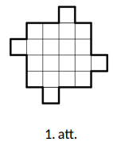

<small>

* questionType:
* domain:

</small>

## Atrisinājums

5 derīgi varianti redzami 2. attēlā.

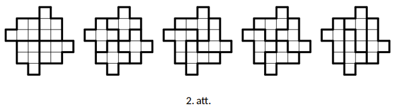

# <lo-sample/> LV.NOL.2026.5.3

Uzrakstiet tādu deviņciparu skaitli, kuram visi cipari ir dažādi un katrs skaitlis, ko veido divi blakusesoši cipari, dalās ar $7$ vai ar $13$.

<small>

* questionType:
* domain:

</small>

## Atrisinājums

**Atbilde:** $784913526$.

$78 : 13 = 6$  
$84 : 7 = 12$  
$49 : 7 = 7$  
$91 : 13 = 7$ vai $91 : 7 = 13$  
$13 : 13 = 1$  
$35 : 7 = 5$  
$52 : 13 = 4$  
$26 : 13 = 2$

*Piezīme:* Atbildi iespējams iegūt, uzzīmējot shēmu, kurā attēloti visi cipari, un savienoti ar bultiņām cipari, kas var sekot viens otram (skat. 3. att. (a)). Pamanām, ka $7$ ir pirmais cipars (jo neviens divciparu skaitlis, kam vienu cipars ir $7$ un desmitu cipars ir cits, nedalās ne ar $7$, ne $13$). Tam noteikti seko $8$, kam seko $4$. No shēmas izdzēšot visas nevajadzīgās bultiņas (skat. 3. att. (b)), iegūst, ka pēc $4$ ir vai nu $9$, vai nu $2$. Ja pēc $4$ ir $9$, tad tālāk ir $1$ un tālākā izvēle ir viennozīmīga. Savukārt, ja pēc $4$ ir $2$, tad, apskatot visus gadījumus, var viegli iegūt, ka atrisinājumu nav.

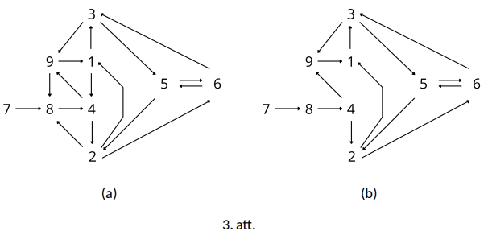

# <lo-sample/> LV.NOL.2026.5.4

Alise mežā satika 5 rūķīšus. Katrs no viņiem vai nu vienmēr saka patiesību, vai vienmēr melo. Kad Alise pajautāja, cik no viņiem ir meļi, viņa saņēma 5 atšķirīgas atbildes. Tās visas bija veseli skaitļi, kas nav mazāki kā 0 un nav lielāki kā 5. Vai noteikti bija kāds rūķītis, kas pateica: **(A)** 3; **(B)** 4?

<small>

* questionType:
* domain:

</small>

## Atrisinājums

**(A)** Nē. Piemēram, ja tieši viens no rūķīšiem saka patiesību, tad to atbildes varēja būt 0, 1, 2, 4, 5 (tas, kas saka patiesību, teica 4, pārējie meloja).

**(B)** Jā. Tā kā visas atbildes bija dažādas, patiesību teica viens vai neviens rūķītis. Ja viens, tad viņš arī pateica 4. Ja neviens, tad neviens nepateica 5, jo tā būtu patiesība, tāpēc pāri paliek pieci varianti (0, 1, 2, 3, 4), kuri visi arī tika pateikti, tajā skaitā 4.

# <lo-sample/> LV.NOL.2026.5.5

Kādu mazāko skaitu mazo trijstūrīšu var nokrāsot melnus tā, lai katram mazajam baltajam trijstūrītim būtu kopēja mala ar vismaz vienu melno (skat. 4.att.)?

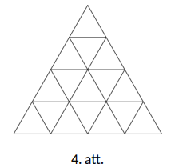

<small>

* questionType:
* domain:

</small>

## Atrisinājums

Ar 4 trijstūrīšiem pietiek, kā redzams zīmējumā. Ar mazāku skaitu nepietiek, jo katrā no četriem izdalītajiem “vidējā lieluma” trijstūriem, ko veido 4 mazie trijstūriši, vismaz vienam mazajam trijstūrītim jābūt melnam, citādi centrālajam mazajam trijstūrītim uzdevuma prasības neizpildās.

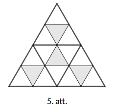

# <lo-sample/> LV.NOL.2026.6.1

$4 \times 4$ rūtiņu tabulā ierakstīti 16 veseli skaitļi (ne obligāti dažādi), kas nav mazāki par 0, katrā rūtiņā viens skaitlis. Alfrēds aprēķināja skaitļu reizinājumu katrā rindā un katrā kolonnā un iegūtos rezultātus augošā secībā ierakstīja burtnīcā. Vai iespējams, ka Alfrēda burtnīcā ir ierakstīti skaitļi $0, 0, 2, 6, 20, 26, 2026, 2026$?

<small>

* questionType:
* domain:

</small>

## Atrisinājums

Jā, tas ir iespējams, ja tabula aizpildīta, piemēram, kā 1. tabulā:

| 2026 | 1 | 1 | 1 |
|---:|---:|---:|---:|
| 6 | 1 | 1 | 1 |
| 2 | 1 | 1 | 1 |
| 0 | 20 | 26 | 2026 |

1. tabula

# <lo-sample/> LV.NOL.2026.6.2

Vai no 6. att. redzamām figūrām var salikt  
**(A)** taisnstūri ar izmēriem $5 \times 10$ rūtiņas,  
**(B)** taisnstūri ar izmēriem $3 \times 8$ rūtiņas?

Figūras var būt arī pagrieztas vai apmestas otrādi, bet tās nevar pārklāties viena ar otru vai iziet ārpus taisnstūra robežām.

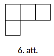

<small>

* questionType:
* domain:

</small>

## Atrisinājums

**(A)** Nē, nevar, jo kopējais taisnstūra rūtiņu skaits ir $5 \cdot 10 = 50$, kas nedalās ar 4, bet katra figūra aizņem 4 rūtiņas; tātad kopējais noklāto rūtiņu skaits dalīsies ar 4.

**(B)** Jā, var; skat., piemēram, 7. att.

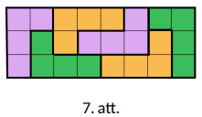

# <lo-sample/> LV.NOL.2026.6.3

Sportisti Māris, Kims un Ilmārs skrēja maratonu. Pirms maratona 4 eksperti bija izteikuši savas prognozes par sportistu rezultātiem.

Pirmais: “Uzvarēs Māris vai Kims.”  
Otrais: “Ja Kims ieņems otro vietu, tad Ilmārs uzvarēs.”  
Trešais: “Ja Kims atskries trešais, tad Māris neuzvarēs.”  
Ceturtais: “Vai nu Kims, vai Ilmārs būs otrajā vietā.”

Pēc sacensībām izrādījās, ka neviens no ekspertiem nav kļūdījies. Kādā secībā finišēja sportisti?

<small>

* questionType:
* domain:

</small>

## Atrisinājums

Izveidosim tabulu, kur katrai iespējamai finišēšanas secībai atliksim nekļūdīgo viedokļu skaitu. Ja eksperts pie dotās secības nav kļūdījies, viņa kolonnā atliksim “+”. Rezultāts attēlots 2. tabulā.

| Secība | Pirmais | Otrais | Trešais | Ceturtais |
|---|:---:|:---:|:---:|:---:|
| MKI | + |  | + | + |
| MIK | + | + |  | + |
| KIM | + | + | + | + |
| KMI | + | + | + |  |
| IKM |  | + | + | + |
| IMK |  | + | + |  |

2. tabula

Redzams, ka vienīgā secība, pie kuras neviens no ekspertiem nav kļūdījies, ir secība Kims, Ilmārs, Māris.

# <lo-sample/> LV.NOL.2026.6.4

Divi $n$-ciparu skaitļi katrs satur visus ciparus no $1$ līdz $n$ ieskaitot. Vai var gadīties, ka šo skaitļu summā visi cipari ir nepāra, ja **(A)** $n = 5$; **(B)** $n = 7$?

<small>

* questionType:
* domain:

</small>

## Atrisinājums

**(A)** Nē, nevar. Skaitot stabiņā, šķiru pārnese var notikt tikai tad, ja 5 ir zem 5, taču tādā gadījumā viens no cipariem būs 0, kas ir pāra. Bet, ja šķiru pārneses nav, tad, lai iegūtu nepāra ciparu, konkrētajā šķirā jābūt pāra un nepāra ciparam, taču katrā skaitlī ir tikai 2 pāra cipari, tāpēc būs vismaz viena šķira, kur abi saskaitāmie cipari būs nepāra un viņu summa būs pāra cipars.

**(B)** Jā, var (iepriekšējais arguments vairs nestrādā, jo var izmantot šķiru pārnesi). Der, piemēram,  
$2314657 + 7425316 = 9739973$.

# <lo-sample/> LV.NOL.2026.6.5

Kādu taisnstūru ar veseliem malu garumiem ir vairāk: ar perimetru 2024 vai ar perimetru 2026? (Taisnstūri $a \times b$ un $b \times a$ tiek uzskatīti par vienādiem).

<small>

* questionType:
* domain:

</small>

## Atrisinājums

Ja taisnstūra perimetrs ir vienāds ar 2024, tad tā blakus malu summa ir vienāda ar 1012. No tā seko, ka īsākās malas garums var pieņemt vērtības no 1 līdz 506. Savukārt, ja taisnstūra perimetrs ir vienāds ar 2026, tad tā blakus malu summa ir vienāda ar 1013. No tā seko, ka īsākās malas garums arī var pieņemt vērtības no 1 līdz 506. Tādējādi abos gadījumos ir vienāds iespējamo taisnstūru skaits - 506.

**Atbilde:** Vienādi daudz.

# <lo-sample/> LV.NOL.2026.7.1

$4 \times 4$ rūtiņu tabulā ierakstīti 16 veseli skaitļi (ne obligāti dažādi), katrā rūtiņā viens skaitlis. Alfrēds aprēķināja skaitļu reizinājumu katrā rindā un katrā kolonnā un iegūtos rezultātus augošā secībā ierakstīja burtnīcā. Vai iespējams, ka Alfrēda burtnīcā ir ierakstīti skaitļi

**(A)** $-2, 1, 2, 3, 4, 5, 6, 10$;  
**(B)** $-10, -6, -5, -4, -3, -2, 1, 2$?

<small>

* questionType:
* domain:

</small>

## Atrisinājums

**(A)** Nevar.

Apzīmēsim visu 16 tabulā ierakstīto skaitļu reizinājumu ar $S$. Pieņemsim, ka pa rindām reizinot iegūtie rezultāti ir $r_1$, $r_2$, $r_3$, $r_4$, bet pa kolonnām reizinot iegūti rezultāti $k_1$, $k_2$, $k_3$, $k_4$. Tad redzams, ka $r_1 \cdot r_2 \cdot r_3 \cdot r_4 = k_1 \cdot k_2 \cdot k_3 \cdot k_4 = S$. Bet tas nav iespējams, jo no mūsu 8 skaitļiem tieši viens ir negatīvs, tas nozīmē, ka vai nu rindu reizinājums ir pozitīvs un kolonnu reizinājums ir negatīvs, vai arī otrādi.

**(B)** Var, piemēram, šādi:

| 2 | 3 | 1 | -1 |
|---:|---:|---:|---:|
| -1 | 1 | -1 | 1 |
| 1 | -1 | 2 | 5 |
| -1 | 1 | 2 | 1 |

# <lo-sample/> LV.NOL.2026.7.2

Vai iespējams noklāt 9. att. redzamās figūras ar 8. att. redzamajām figūrām? Dalījuma līnijas drīkst iet tikai pa rūtiņu līnijām. 8. att. figūras drīkst būt pagrieztas vai apmestas otrādi, bet tās nevar pārklāties viena ar otru vai iziet ārpus 9. att. figūrām.

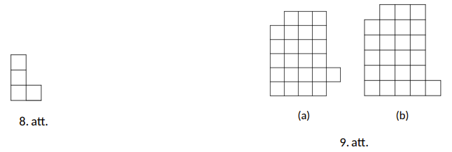

<small>

* questionType:
* domain:

</small>

## Atrisinājums

**(A)** Jā, var, skatīt 10. att.

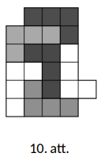

**(B)** Nē, nevar. Pieņemsim, ka prasītais ir iespējams. Izkrāsosim doto figūru kā šaha galdiņu (skat. 11. att.). Redzams, ka iegūtas 11 melnas un 13 baltas rūtiņas, taču, neatkarīgi no novietojuma, 8. att. figūra noklāj vienādu skaitu melno un balto rūtiņu. Tātad, iegūta pretruna un prasītais nav iespējams.

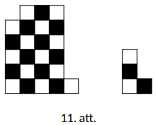

# <lo-sample/> LV.NOL.2026.7.3

Piecās kastēs kopā ir 21 bumbiņa, bumbiņu skaits jebkurās divās kastēs ir atšķirīgs. Zināms, ka, izvēloties jebkuras divas kastes un paņemot visas bumbiņas no tām, šīs bumbiņas var ievietot pārējās trīs kastēs tā, lai jaunais bumbiņu skaits katrā no šīm trim kastēm būtu vienāds. Pierādiet, ka vienā no kastēm ir tieši 7 bumbiņas. Norādiet piemēru, kas atbilst uzdevuma nosacījumiem.

<small>

* questionType:
* domain:

</small>

## Atrisinājums

Vispirms pierādīsim, ka nevienā kastē nevar būt vairāk par 7 bumbiņām. Apzīmēsim visas kastes ar A, B, C, D, E. Pieņemsim pretējo - kādā no kastēm, piemēram, kastē A, ir vairāk nekā 7 bumbiņas, tātad, vismaz 8. Tagad, izvēloties jebkuras divas citas kastes, piemēram, kastes B un C, pēc dotā mēs varam ievietot visas bumbiņas no šīm divām kastēm pārējās, lai bumbiņu skaits tajās būtu vienāds. Tā kā kopā ir 21 bumbiņa, tad katrā no kastēm A, D, E jābūt tieši 7 bumbiņām. Bet tas nav iespējams, jo kastē A jau bija vismaz 8 bumbiņas.

Tagad pierādīsim, ka nevar būt tā, ka visās kastēs ir mazāk par 7 bumbiņām. Ja katra kaste satur mazāk par 7 bumbiņām, tad maksimālais iespējamais kopējais bumbiņu skaits ir $6 + 5 + 4 + 3 + 2 = 20$, jo visās kastēs ir dažāds bumbiņu skaits. Tā ir pretruna ar to, ka kopā ir 21 bumbiņa.

Piemērs $7, 5, 4, 3, 2$ atbilst uzdevuma nosacījumiem.

# <lo-sample/> LV.NOL.2026.7.4

$3 \times 3$ punktu režģī (skat. 12. att.) 5 no punktiem nokrāsoti sarkani. Tomass uzzīmēja visus iespējamos trijstūrus, kuriem visas 3 virsotnes ir sarkanajos punktos, apzīmēsim to skaitu ar $n$. Atrast visas iespējamās $n$ vērtības.

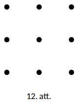

<small>

* questionType:
* domain:

</small>

## Atrisinājums

**Atbilde:** $n$ var būt 8, 9 vai 10. Nosauksim trijstūri, kam visas virsotnes ir sarkanajos punktos, par sarkano trijstūri. Katrs sarkano punktu trijnieks mums var veidot sarkano trijstūri, izņemot, ja šie trīs punkti atrodas uz vienas taisnes. Līdz ar to sarkano trijstūru skaitu $n$ mēs varam aprēķināt no visu trijnieku skaita atņemot to trijnieku skaitu, kuros punkti atrodas uz vienas taisnes.

Pamanīsim, ka kopā mums ir 10 sarkano punktu trijnieki. Ievērosim, ka katru trijnieku mēs varam raksturot ar to divu atlikušo sarkano punktu pāri, kas neietilpst šajā trijniekā. Tātad sarkano punktu trijnieku ir tikpat, cik sarkano punktu pāru. Bet no 5 punktiem var izveidot tieši 10 pārus (katrs punkts no 5 punktiem var būt pārī kopā ar jebkuru no 4 citiem, bet katrs pāris šādi tiek ieskaitīts divreiz, līdz ar to pāru skaits ir $\frac{5 \cdot 4}{2} = 10$).

Tagad aprēķināsim, cik mums var būt tādu trijnieku, kuros punkti atrodas uz vienas taisnes. Var būt, ka

- Nekādi 3 punkti nav uz vienas taisnes. Šajā gadījumā ir 10 sarkanie trijstūri (skat. 13. att.).
- Ir tieši viens punktu trijnieks, kas atrodas uz vienas taisnes. Šajā gadījumā mums būs $10 - 1 = 9$ sarkanie trijstūri (skat. 14. att.).
- Ir 2 punktu trijnieki, kas katrs ir uz savas taisnes (ar 1 kopīgu punktu). Šajā gadījumā mums ir $10 - 2 = 8$ sarkanie trijstūri (skat.15. att.).

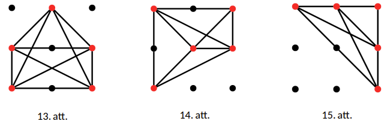

Vairāk punktu trijnieku uz vienas taisnes nav iespējams iegūt, jo katriem diviem trijniekiem var būt lielākais viens
kopīgs punkts, līdz ar to jebkuri divi šādi trijnieki jau kopā satur visus $5$ punktus. Bet tad, ja būtu vēl trešais šāds
punktu trijnieks, tad tam ar kādu no pirmajiem diviem būtu vismaz divi kopīgi punkti.
Attiecīgi esam pierādījuši, ka visas iespējamās $n$ vērtības ir $\{8, 9, 10\}$.

# <lo-sample/> LV.NOL.2026.7.5

Kādu lielāko skaitu dažādu naturālu skaitļu var uzrakstīt uz tāfeles tā, ka neviens no uzrakstītajiem skaitļiem nedalās ar 210, bet, sareizinot jebkurus četrus no tiem, reizinājums dalās ar 210?

<small>

* questionType:
* domain:

</small>

## Atrisinājums

**Atbilde:** 12 skaitļus.

Sadalot 210 pirmreizinātājos, iegūsim $210 = 2 \cdot 3 \cdot 5 \cdot 7$. Ja skaitlis dalās ar 210, tad tas dalās ar katru no šiem pirmreizinātājiem 2, 3, 5 un 7. Savukārt, ja skaitlis nedalās ar 210, tad tas ar vismaz vienu no tiem nedalās.

Vispirms pamatosim, ka uz tāfeles var būt uzrakstīti ne vairāk kā 12 skaitļi. Sāksim ar to, ka pamatosim, ka uz tāfeles drīkst būt uzrakstīti ne vairāk kā trīs skaitļi, kas nedalās ar 2. Patiešām, ja uz tāfeles būtu uzrakstīti četri skaitļi, kas nedalās ar 2, tad arī to reizinājums nedalītos ar 2, tātad nedalītos arī ar 210. Bet tas ir pretrunā ar doto, ka jebkuru četru uz tāfeles uzrakstīto skaitļu reizinājums dalās ar 210. Analoģiski var pamatot, ka uz tāfeles var būt ne vairāk kā trīs skaitļi, kas nedalās ar 3, trīs skaitļi, kas nedalās ar 5 un trīs skaitļi, kas nedalās ar 7. Tā kā katrs uz tāfeles uzrakstītais skaitlis nedalās ar kādu no šiem četriem skaitļiem 2, 3, 5, 7 (jo tas nedalās ar 210), tad uz tāfeles drīkst būt uzrakstīti ne vairāk kā $3 + 3 + 3 + 3 = 12$ skaitļi.

Atliek parādīt, ka uz tāfeles var uzrakstīt 12 skaitļus, kas atbilst uzdevuma nosacījumiem. Der, piemēram, šādi skaitļi: 105, 315, 525, 70, 140, 280, 42, 84, 126, 30, 60, 90. Pamatosim, ka neviens no tiem nedalās ar 210, bet jebkuru četru no tiem reizinājums dalās. Pirmie trīs skaitļi 105, 315 un 525 katrs dalās ar 3, 5 un 7, bet nedalās ar 2. Līdzīgi katrs no skaitļiem 70, 140 un 280 dalās ar 2, 5 un 7, bet nedalās ar 3, katrs no skaitļiem 42, 84 un 126 dalās ar 2, 3 un 7, bet nedalās ar 5 un katrs no skaitļiem 30, 60 un 90 dalās ar 2, 3 un 5, bet nedalās ar 7. Redzams, ka neviens no šiem 12 skaitļiem nedalās ar 210, jo katrs no tiem nedalās vai nu ar 2, vai ar 3, vai ar 5, vai arī ar 7. Bet jebkuru četru reizinājums dalās ar 210, jo tas noteikti dalās gan ar 2, gan ar 3, gan ar 5, gan ar 7.

# <lo-sample/> LV.NOL.2026.8.1

Dots izliekts četrstūris $ABCD$, tā diagonāles krustojas punktā $O$, zināms, ka $AB = DC$ un $AC = DB$. Pierādīt, ka $AO = DO$!

*Piezīme.* Par izliektu sauc daudzstūri, kuram visi leņķi ir mazāki nekā $180^\circ$.

<small>

* questionType:
* domain:

</small>

## Atrisinājums

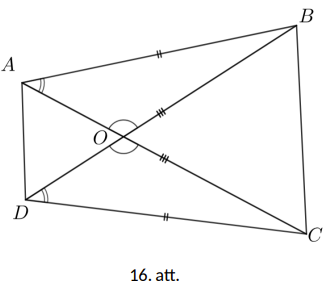

Dots, ka $AB = CD$ un $AC = DB$, bet $BC$– kopīga mala trijstūros $ABC$ un $DCB$ (skat. 16.att.), tātad $\triangle ABC = \triangle DCB(mmm)$. Tad $\angle CAB = \angle BDC$ kā atbilstošie leņķi vienādos trijstūros. Tāpat $\angle AOB = \angle DOC$ kā krustleņķi. Aplūkojot trijstūrus $AOB$ un $DOC$, iegūstam, ka $\angle ABD = 180^\circ - \angle AOB - \angle BAO = 180^\circ - \angle DOC - \angle BDC = \angle DCA$ no trijstūra iekšējo leņķu summas. Tad $\triangle AOB = \triangle DOC(lml)$ un $AO = DO$ kā vienādu trijstūru atbilstošās malas.

# <lo-sample/> LV.NOL.2026.8.2

Vai iespējams noklāt 18. att. redzamās figūras ar 17. att. redzamajām figūrām? Dalījuma līnijas drīkst iet tikai pa rūtiņu līnijām. 17. att. figūras drīkst būt pagrieztas vai apmestas otrādi, bet tās nevar pārklāties viena ar otru vai iziet ārpus 18. att. figūrām.

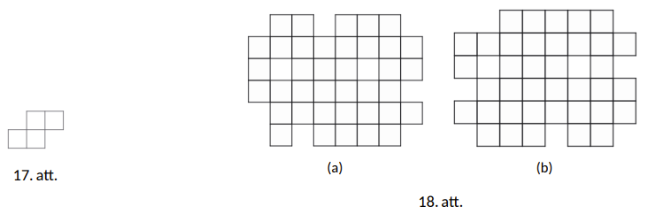

<small>

* questionType:
* domain:

</small>

## Atrisinājums

**(A)** Jā, var, skatīt 19.att.

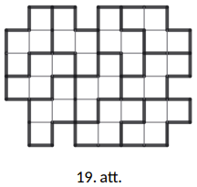

**(B)** Pieņemsim, ka prasītais ir iespējams. Izkrāsosim doto figūru kā šaha galdiņu (skat. 20. att.). Redzams, ka iegūtas 22 melnas un 18 baltas rūtiņas, taču, neatkarīgi no novietojuma, 17. att. figūra noklāj vienādu skaitu melno un balto rūtiņu. Tātad, iegūta pretruna un prasītais nav iespējams.

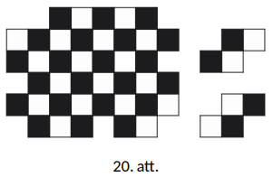

# <lo-sample/> LV.NOL.2026.8.3

Doti naturāli skaitļi $a$ un $b$, kuriem ir spēkā $34a = 43b$. Pierādīt, ka skaitlis $a + b$ nav pirmskaitlis!

<small>

* questionType:
* domain:

</small>

## Atrisinājums

Tā kā $34a = 43b$, tad $a = \frac{43}{34}b$. Pieskaitot abām vienādojuma pusēm skaitli $b$, iegūstam $a + b = \frac{43}{34}b + b = \frac{77}{34}b$ jeb $34(a + b) = 77b$. Tātad $34(a + b)$ dalās ar 77. Tā kā 77 un 34 ir savstarpēji pirmskaitļi, tad $a + b$ ir jādalās ar 77. Tā kā $77 = 11 \cdot 7$, tad $a + b$ noteikti nav pirmskaitlis, jo tas dalīsies ar 7 un 11.

# <lo-sample/> LV.NOL.2026.8.4

Viens aiz otra uzrakstīti 9 veseli (ne noteikti dažādi) skaitļi. Zināms, ka katru piecu pēc kārtas uzrakstītu skaitļu vidējais aritmētiskais ir 10. Vai iespējams, ka visu 9 uzrakstīto skaitļu vidējais aritmētiskais ir 2026?

*Piezīme.* Par doto skaitļu vidējo aritmētisko sauc doto skaitļu summas dalījumu ar šo skaitļu skaitu.

<small>

* questionType:
* domain:

</small>

## Atrisinājums

Jā, ja viens aiz otra uzrakstīti, piemēram, šādi skaitļi

$$
0, 0, 0, 9 \cdot 2026 - 50, 100 - 9 \cdot 2026, 0, 0, 0, 9 \cdot 2026 - 50.
$$

Redzams, ka katru piecu pēc kārtas uzrakstīto skaitļu vidējais aritmētiskais ir

$$
\frac{0 + 0 + 0 + (9 \cdot 2026 - 50) + (100 - 9 \cdot 2026)}{5} = 10,
$$

bet visu deviņu skaitļu vidējais aritmētiskais ir

$$
\frac{0 + 0 + 0 + (9 \cdot 2026 - 50) + (100 - 9 \cdot 2026) + 0 + 0 + 0 + (9 \cdot 2026 - 50)}{9} = 2026.
$$

*Piezīme.* Paskaidrosim, kā šādus skaitļus atrast. Apzīmēsim šos skaitļus ar $a_1$ līdz $a_9$. Tā kā katru piecu pēc kārtas sekojošu skaitļu vidējais aritmētiskais ir 10, tad to summa ir 50. Bet visu skaitļu summa ir $9 \cdot 2026$ (jo to vidējais aritmētiskais ir 2026).

Ievērosim, ka pirmo četru skaitļu summa ir $a_1 + a_2 + a_3 + a_4 = 9 \cdot 2026 - 50$, jo to var iegūt no visu deviņu skaitļu summas, atņemot pēdējo piecu skaitļu summu. Zinot to, mēs varam aprēķināt $a_5$ vērtību:

$$
a_5 = (a_1 + a_2 + a_3 + a_4 + a_5) - (a_1 + a_2 + a_3 + a_4) = 50 - (9 \cdot 2026 - 50) = 100 - 9 \cdot 2026.
$$

Skaitļus $a_1$, $a_2$, $a_3$ un $a_4$ var izvēlēties patvaļīgi (bet tā, lai to summa būtu $9 \cdot 2026 - 50$). Skaitlim $a_6$ jābūt vienādam ar $a_1$ (jo $a_1 + a_2 + a_3 + a_4 + a_5 = a_2 + a_3 + a_4 + a_5 + a_6$). Līdzīgi arī $a_7 = a_2$, $a_8 = a_3$ un $a_9 = a_4$.

# <lo-sample/> LV.NOL.2026.8.5

Sākumā uz tāfeles ir uzrakstīts skaitlis 1234. Pēteris un Lote spēlē spēli. Viņi izdara gājienus pamīšus, Pēteris sāk pirmais. Katrā gājienā spēlētājs atņem no tobrīd uz tāfeles esošā skaitļa vienu no tā nenulles cipariem un uzraksta uz tāfeles iegūto starpību (esošo skaitli nodzēš). Uzvar tas spēlētājs, kurš savā gājienā uzraksta skaitli 0. Kurš spēlētājs noteikti var uzvarēt, pareizi spēlējot (kuram no spēlētājiem ir uzvarošā stratēģija)?

<small>

* questionType:
* domain:

</small>

## Atrisinājums

Pēteris vienmēr var uzvarēt, kā pirmo gājienu veicot $1234 - 4 = 1230$. Pētera uzvarošā stratēģija ir atstāt Lotei skaitli, kas beidzas ar nulli. Ja rezultāts ir nulle, viņš ir uzvarējis. Ja rezultāts nav nulle, tad eksistē vismaz viens nenulles cipars. Lote būs spiesta atņemt no skaitļa nenulles ciparu, atstājot Pēterim skaitli, kas nebeidzas ar nulli. Pēteris atkal var atņemt no skaitļa tā pēdējo ciparu, turpinot uzvarošso stratēģiju.

# <lo-sample/> LV.NOL.2026.9.1

Uz paralelograma $ABCD$ malas $AB$ atlikts punkts $E$ tāds, ka $AE : EB = 1 : 2$. Taisnes $AC$ un $ED$ krustojas punktā $O$. Aprēķināt nogriežņa $AO$ garumu, ja zināms, ka $AC = 20$.

<small>

* questionType:
* domain:

</small>

## Atrisinājums

Tā kā $AB \parallel CD$ kā paralelograma $ABCD$ pretējās malas un tās krusto $AC$, tad $\angle BAC = \angle ACD$ (iekšējie šķērsleņķi pie paralēlām taisnēm) (skat. 1.att.). Iegūstam, ka $\triangle AOE \sim \triangle COD$ $(\ell\ell)$, jo $\angle BAC = \angle ACD$ un $\angle AOE = \angle COD$ (krustleņķi). Tā kā $AE : EB = 1 : 2$, tad $AE : CD = AE : AB = 1 : 3$. No šīs attiecības un no $\triangle AOE \sim \triangle COD$ iegūstam, ka $AO : OC = AE : CD = 1 : 3$, un tā kā $AO + OC = AC = 20$, iegūstam, ka $AO = 5$.

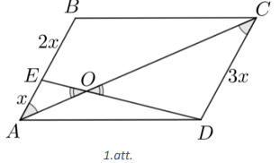

# <lo-sample/> LV.NOL.2026.9.2

Vai izteiksmi $(2 + 1)(2^2 + 1)(2^4 + 1)(2^8 + 1) ... (2^{128} + 1)$ var izteikt formā $2^a - 2^b$, kur $a$ un $b$ ir veseli skaitļi?

<small>

* questionType:
* domain:

</small>

## Atrisinājums

Jā, var. Reizinām doto izteiksmi ar $(2 - 1)$. Tā kā reizinātāja vērtība ir 1, tas nemainīs izteiksmes vērtību. Tad iegūstam, ka

$$(2 - 1)(2 + 1)(2^2 + 1)(2^4 + 1)(2^8 + 1) ... (2^{128} + 1).$$

Izmantojot saīsinātās reizināšanas formulas, pirmo divu iekavu reizinājums kļūst par $(2^2 - 1)$. Tad atkal varam lietot saīsinātās reizināšanas formulu, katru reizi iegūstot reizinātāju $(2^a - 1)$, ja nākamais reizinātājs izteiksmē ir $(2^a + 1)$.

$$(2^2 - 1)(2^2 + 1)(2^4 + 1)(2^8 + 1) ... (2^{128} + 1) =$$

$$= (2^4 - 1)(2^4 + 1)(2^8 + 1) ... (2^{128} + 1) =$$

$$= (2^8 - 1)(2^8 + 1)(2^{16} + 1) ... (2^{128} + 1) = ... = (2^{128} - 1)(2^{128} + 1) =$$

$$= 2^{256} - 1 = 2^{256} - 2^0.$$

# <lo-sample/> LV.NOL.2026.9.3

Dots naturāls skaitlis $N$. Elza kartē uzzīmēja 99 pilsētas un savienoja tā, lai starp katrām divām pilsētām ir ne vairāk kā 1 ceļš un kopā ir $N$ ceļi. Pēc tam Elza un Ramona, sākot ar Elzu, pamīšus dzēš pa vienai pilsētai, līdz paliek tieši divas. Ja tās ir savienotas ar ceļu, uzvar Elza; pretējā gadījumā uzvar Ramona. Atrast mazāko $N$ vērtību, pie kuras Elzai ir uzvaroša stratēģija!

<small>

* questionType:
* domain:

</small>

## Atrisinājums

Mazākā $N$ vērtība ir 49.

Ja $N \leq 48$, tad katram ceļam Ramona izvēlas vienu galapunktu (pilsētu); tādu pilsētu ir ne vairāk kā $N$, tātad ne vairāk kā 48. Visām pārējām (vismaz $99 - 48 = 51$) pilsētām savā starpā ceļu nav, jo katra ceļa izvēlētais galapunkts jau ieiet kādā no izvēlētajām pilsētām. Ramona katrā savā gājienā dzēš kādu no šīm izvēlētajām pilsētām; viņai ir 48 gājieni, tāpēc viņa var izdzēst visas šīs pilsētas. Tad starp 3 pēdējām pilsētām noteikti nebūs ceļa, un pēc Elzas pēdējā dzēšanas soļa paliek divas ar ceļu nesavienotas pilsētas.

Ja $N = 49$, Elza var uzvarēt. Elza savieno pilsētas $(1,2), (3,4), ..., (97,98)$ un pilsētu 99 atstāj bez ceļiem. Tā var izdarīt, jo 49 ceļi var savienot ne vairāk kā 98 pilsētas, bet pavisam ir 99 pilsētas. Elza pirmajā gājienā dzēš pilsētu, kurā neieiet neviens ceļš. Pēc tam, ja Ramona dzēš vienu pilsētu no kāda pāra, Elza dzēš otru no tā paša pāra. Tā pilsētas pazūd pa divām, un spēles beigās paliek tieši viens pāris, kura abas pilsētas ir savienotas ar ceļu.

# <lo-sample/> LV.NOL.2026.9.4

Atrast visus tādus naturālos skaitļus $n$, ka a) $n! - 8$; b) $n! - 1$ ir naturāla skaitļa kvadrāts!

*Piezīme:* Ar $n!$ apzīmē visu to naturālo skaitļu reizinājumu, kuri nepārsniedz $n$. Piemēram, $5! = 1 \cdot 2 \cdot 3 \cdot 4 \cdot 5 = 120$.

<small>

* questionType:
* domain:

</small>

## Atrisinājums

**1.atrisinājums a)** Pieņemsim, ka $n \geq 6$. Tādā gadījumā $n! - 8 = x^2$. Vienādojuma kreisā puse dalās ar 8, jo $n!$ dalās ar 8 un saskaitāmais 8 dalās ar 8. Vienādojuma labā puse ir naturāla skaitļa kvadrāts, tātad satur visus dažādos skaitļa $x$ pirmreizinātājus pāra pakāpē. Tas nozīmē, ka vienādojuma abām pusēm jādalās ar 16, jo tas ir mazākais skaitlis, kas dalās ar 8 un ir skaitlis 2 pāra pakāpē. Tā kā $n!$ dalās ar 16, ja $n \geq 6$ (jo sareizinot naturālos skaitļus no 1 līdz vismaz 6, pirmreizinātājs 2 ieiet reizinājumā 4 reizes – no skaitļiem 2, 4 un 6), tad iegūta pretruna, jo 8 nedalās ar 16, tātad vienādojuma kreisā puse nedalās ar 16.

Atliek pārbaudīt vērtības $1 \leq n \leq 5$. Vērtības $n \leq 3$ neder, jo tad $n! < 8$ un vienādojuma kreisā puse ir negatīva, bet naturāla skaitļa kvadrāts nevar būt negatīvs. Ja $n = 4$, tad $1 \cdot 2 \cdot 3 \cdot 4 - 8 = 16$ ir naturāla skaitļa kvadrāts, bet $n = 5$ neder, jo $1 \cdot 2 \cdot 3 \cdot 4 \cdot 5 - 8 = 112$ nav naturāla skaitļa kvadrāts. Tātad der tikai $n = 4$.

**2.atrisinājums a)** Sākot ar $n \geq 5$, visi $n!$ beidzas ar ciparu 0. Tādā gadījumā, $n! - 8$ visiem $n \geq 5$ beigsies ar ciparu 2. Aplūkosim, ar kādiem cipariem var beigties naturāla skaitļa kvadrāts.

| $x$ pēdējais cipars | 0 | 1 | 2 | 3 | 4 | 5 | 6 | 7 | 8 | 9 |
|---|---:|---:|---:|---:|---:|---:|---:|---:|---:|---:|
| $x^2$ pēdējais cipars | 0 | 1 | 4 | 9 | 6 | 5 | 6 | 9 | 4 | 1 |

Redzams, ka naturāla skaitļa kvadrāts nekad nevar beigties ar 2, tādēļ prasītais neizpildās neviena $n \geq 5$. Tā kā pie $n \leq 3$ vienādojuma kreisā puse ir negatīva, tad atliek vēl pārbaudīt tikai variantu $n = 4$, kurš šajā gadījumā der un ir vienīgā atbilde.

**b)** Pieņemsim, ka $n \geq 4$. Tādā gadījumā vienādojuma kreisā puse $n! - 1$ vienmēr dod atlikumu 3, dalot ar 4, jo $n!$, ja $n \geq 4$, dalās ar 4 (jo skaitlis 4 ir kā reizinātājs). Aplūkosim, kādus atlikumus, dalot ar 4, var dot $x^2$.

| Atlikums, $x$ dalot ar 4 | 0 | 1 | 2 | 3 |
|---|---:|---:|---:|---:|
| Atlikums, $x^2$ dalot ar 4 | 0 | 1 | 0 | 1 |

Naturāla skaitļa kvadrāts nevar dot atlikumu 3, dalot ar 4, nevienā gadījumā. Tātad iegūta pretruna un atliek pārbaudīt vērtības $1 \leq n \leq 3$. Ja $n = 1$, tad $n! - 1 = 0$, bet 0 nav naturāla skaitļa kvadrāts. Ja $n = 2$, tad $n! - 1 = 1$, kas ir naturāla skaitļa kvadrāts un, ja $n = 3$, tad $n! - 1 = 5$, kas nav naturāla skaitļa kvadrāts.

# <lo-sample/> LV.NOL.2026.9.5

Dots trijstūris $ABC$ ar $\angle A = 120^\circ$. Uz $\angle BAC$ bisektrises atlikts punkts $D$, tāds, ka $AD = AB + AC$. Pierādīt, ka trijstūris $BDC$ ir vienādmalu.

<small>

* questionType:
* domain:

</small>

## Atrisinājums

Atliek punktu $E$ uz $AD$ tā, lai $AE = AB$. Tad $ED = AC$, jo $AD = AB + AC$ (skat. 2.att.). Tā kā $AD$ – bisektrise $\angle BAC$, tad $\angle BAE = \angle CAE = 60^\circ$. Tā kā $AE = AB$ pēc konstrukcijas un $\angle BAE = 60^\circ$, tad trijstūris $BAE$ ir vienādmalu. Tā kā vienādmalu trijstūrī visi leņķi ir $60^\circ$, tad $\angle AEB = \angle ABE = 60^\circ$ un $\angle ABC = 60^\circ - \angle CBE$. Tad $\angle BED = 180^\circ - \angle BEA = 180^\circ - 60^\circ = 120^\circ$. Tas nozīmē, ka $\triangle ABC = \triangle EBD$ $(m\ell m)$, jo $\angle BAC = \angle BED$, $AB = EB$ un $AC = ED$. Tad $CB = BD$ kā vienādu trijstūru atbilstošās malas un trijstūris $BCD$ ir vienādsānu. Tāpat $\angle ABC = \angle EBD = 60^\circ - \angle CBE$ kā vienādu trijstūru atbilstošie leņķi. Tātad $\angle CBD = 60^\circ - \angle CBE + \angle CBE = 60^\circ$, jeb $\triangle CBD$ ir vienādmalu kā vienādsānu trijstūris ar leņķi $60^\circ$.

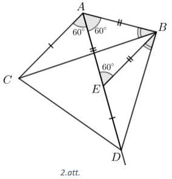

# <lo-sample/> LV.NOL.2026.10.1

Dots taisnleņķa trijstūris $ABC$ ar leņķiem $\angle C = 90^\circ$ un $\angle B = 30^\circ$. Uz malas $AC$ atlikts punkts $D$ tā, ka $DC = 3$. Uz malas $BC$ atlikts punkts $E$ tā, ka $EB = 4$. Aprēķināt malas $AC$ garumu, ja $DE = 6$.

<small>

* questionType:
* domain:

</small>

## Atrisinājums

Apskatām $\triangle DEC$: $DE = 6$, $DC = 3$, $\angle ACB = 90^\circ$ (skat. 3.att.). No tā iegūstam, ka $\angle DEC = 30^\circ$, jo hipotenūza ir divas reizes garāka nekā katete, un $CE = 3\sqrt{3}$ kā trešā mala taisnleņķa trijstūrī ar $30^\circ$ leņķi. Tāpat $\triangle DEC \sim \triangle ABC$ $(\ell \ell)$, jo $\angle DEC = 30^\circ = \angle ABC$ un $\angle ACB$ ir kopīgs. No trijstūru līdzības iegūstam, ka $\frac{DC}{AC} = \frac{EC}{BC} = \frac{3\sqrt{3}}{4 + 3\sqrt{3}}$. Tā kā $DC = 3$, iegūstam vienādību $\frac{3}{AC} = \frac{3\sqrt{3}}{4 + 3\sqrt{3}}$ jeb $3\sqrt{3}AC = 3(4 + 3\sqrt{3})$, no kā $AC = 3 + \frac{4\sqrt{3}}{3}$.

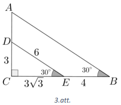

# <lo-sample/> LV.NOL.2026.10.2

Māris izvēlējās trīs dažādus pozitīvus reālus skaitļus $a, b, c$ un uzrakstīja uz tāfeles sešus skaitļus $a + b$, $b + c$, $c + a$, $ab$, $bc$, $ca$. Kāds ir mazākais iespējamais dažādu skaitļu skaits uz tāfeles?

<small>

* questionType:
* domain:

</small>

## Atrisinājums

Nezaudējot vispārīgumu, varam pieņemt, ka $a < b < c$. Tad $a + b < a + c < b + c$ un $ab < ac < cb$. Ja pieņem, ka uz tāfeles ir trīs dažādi skaitļi, tad jāizpildās, ka $a + b = ab$, $a + c = ac$, $b + c = bc$. Apskatīsim vienādojumus $a + b = ab$ un $a + c = ac$. Atņemot tos vienu no otra, iegūst:

$$
a + b - (a + c) = ab - ac;
$$

$$
b - c = a(b - c) \; | : (b - c) \neq 0;
$$

$$
a = 1.
$$

Analogi iegūst, ka $b = 1$ un $c = 1$. Iegūta pretruna, jo skaitļiem jābūt dažādiem.

Pierādīsim, ka uz tāfeles var būt uzrakstīti 4 dažādi skaitļi. Der, piemēram, $a = 1{,}5$; $b = 3$; $c = 6$. Tādā gadījumā $a + b = 4{,}5$; $a + c = 7{,}5$; $b + c = 9$; $ab = 4{,}5$; $bc = 18$; $ac = 9$ un ir iegūtas 4 dažādas vērtības.

*Piezīme.* Derīgus skaitļus var atrast, apskatot gadījumu, kad divām summām ir jāsakrīt ar diviem reizinājumiem. Piemēram, $a + b = ab$ un $b + c = ac$. Tādā gadījumā:

$$
a + b = ab \; | : b \neq 0
\quad \Rightarrow \quad
\frac{a}{b} + 1 = a
\quad \Rightarrow \quad
\frac{a}{b} = a - 1
\quad \Rightarrow \quad
b = \frac{a}{a - 1}.
$$

Lai vienādība izpildītos, tad $a \neq 1$. Varam izvēlēties, piemēram, $a = 1{,}5$. Tad $b = 3$, bet $c$ iegūst no $b + c = ac$.

# <lo-sample/> LV.NOL.2026.10.3

No 24 melniem un 25 baltiem kubiņiem ir izveidots “tornis”, saliekot kubiņus vienu virs otra. Uz katra melnā kubiņa ir uzrakstīts balto kubiņu skaits, kas atrodas virs tā, bet uz katra baltā kubiņa ir uzrakstīts melno kubiņu skaits, kas atrodas virs tā. Kāda var būt visu uzrakstīto skaitļu summa?

<small>

* questionType:
* domain:

</small>

## Atrisinājums

**1. atrisinājums.** Vispārinot uzdevumu, varam pieņemt, ka melno un baltu kubiņu skaits ir attiecīgi $m$ un $n$. Aplūkosim kubiņu pārus, kur pa vienam ir no katras krāsas kubiņiem. Katrā šādā kubiņu pārī, vienam no kubiņiem ir tornī jāatrodas virs otra, tātad tieši viens no kubiņiem (tas, kurš tornī ir augstāk), ir pieskaitīts skaitļu uz otra kubiņa. Kopā var izveidot $mn$ pārus ar dažādu krāsu kubiņiem. Katrā pārī savstarpēji tieši viens kubiņš ir pieskaitīts skaitļu uz otra kubiņa, līdz ar to visu uzrakstīto skaitļu summa sakrīt ar pāru skaitu, kas šajā gadījumā ir $24 \cdot 25 = 600$.

**2. atrisinājums.** Pamatosim, ka, ja tornī divus blakus kubiņus samaina vietām (un no jauna uz katra kubiņa uzraksta virs tā esošo pretējas krāsas kubiņu skaitu), tad uz kubiņiem uzrakstīto skaitļu summa nemainās. Vispirms ievērosim, ka, samainot divus blakus kubiņus vietām, nav jāmaina uz pārējiem 47 kubiņiem uzrakstītie skaitļi. Ja kubiņi, ko samaina, ir vienā krāsā, tad arī uz tiem uzrakstītie skaitļi paliek tādi paši. Aplūkosim, kas notiek, ja kubiņi, ko samaina, ir dažādās krāsās, Pieņemsim, ka sākumā melnais kubiņš atrodas virs baltā (otrs gadījums ir analogs). Samainot tos vietām, uz melnā kubiņa esošais skaitlis jāpalielina par 1 (jo tagad virs tā atradīsies par vienu balto kubiņu vairāk), bet uz baltā kubiņa esošais skaitlis jāsamazina par 1 (jo virs tā tagad atradīsies par vienu melno kubiņu mazāk). Līdz ar to arī šajā gadījumā uz kubiņiem uzrakstīto skaitļu summa nemainīsies.

Ievērosim, ka, atkārtojot šo darbību (mainot vietām blakus kubiņus), mēs visus torņa kubiņus varam sakārtot patvaļīgā secībā. Sakārtosim tos tā, ka visi melnie kubiņi atrodas apakšējās 24 vietās, bet augšējās 25 vietās atrodas baltie. Tad uz katra melnā kubiņa ir rakstīts skaitlis 25, bet uz katra baltā kubiņa ir rakstīts skaitlis 0, tātad uz kubiņiem uzrakstīto skaitļu summa ir $24 \cdot 25 = 600$. Tā kā šī summa nav mainījusies, tad arī sākumā (pirms kubiņi bija sakārtoti), tā bija 600.

# <lo-sample/> LV.NOL.2026.10.4

Dots izliekts četrstūris $ABCD$, kuram $\angle CBD = 2 \angle CAD$ un $\angle CDB = 2 \angle CAB$. Pierādīt, ka $CA$ ir $\angle BCD$ bisektrise!

<small>

* questionType:
* domain:

</small>

## Atrisinājums

**1.atrisinājums.** Atliekam punktu $X$ uz $CA$ tā, ka $BX$ ir $\angle CBD$ bisektrise, un punktu $Y$ uz $CA$ tā, ka $DY$ ir $\angle CDB$ bisektrise (skat. 4.att.).

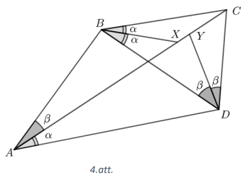

Ievērosim, ka tad $\angle XBD = \angle CAD$ un $\angle YDB = \angle CAB$, jo bisektrise dala leņķi uz pusēm. Četrstūrī $XBAD$ leņķi $\angle XBD = \angle CAD$, no kā var secināt, ka ap $XBAD$ var apvilkt riņķa līniju (apgrieztā īpašība uz vienu loku balstītajiem ievilktajiem leņķiem). Analogi no leņķiem $\angle YDB = \angle CAB$ var secināt, ka ap $ABYD$ var apvilkt riņķa līniju. Tas nozīmē, ka trijstūra $ABD$ apvilktā riņķa līnija krusto $CA$ punktos $X, Y$ un $A$. Tā kā visi trīs no šiem punktiem atrodas uz vienas taisnes, tā ir pretruna, izņemot gadījumu, kad $X = Y$. Secinām, ka $\angle CBD$ un $\angle CDB$ bisektrises krustojas punktā $X$, kas atrodas uz $CA$. Aplūkojot trijstūri $BCD$, $CX$ ir $\angle BCD$ bisektrise, jo trijstūra bisektrises krustojas vienā punktā.

**2.atrisinājums.** Atliekam punktu $X$ uz $CA$ tā, ka $BX$ ir $\angle CBD$ bisektrise (skat. 5.att.)

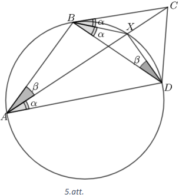

Ievērosim, ka tad $\angle XBD = \angle CAD$, jo bisektrise dala leņķi uz pusēm. Tad ap četrstūri $BXDA$ var apvilkt riņķa līniju (apgrieztā īpašība uz vienu loku balstītiem ievilktajiem leņķiem). Tas nozīmē, ka četrstūrī $XBAD$ leņķi $\angle BAX = \angle BDX$ kā uz viena loka balstītie ievilktie leņķi. Tā kā $\angle CDB = 2 \angle CAB$ un $\angle XDB = \angle CAB$, tad $\angle XDC = \angle XDB$ jeb $XD$ ir leņķa $\angle CDB$ bisektrise. Tā kā trijstūra bisektrises krustojas vienā punktā, tad $CX$ ir $\angle BCD$ bisektrise.

# <lo-sample/> LV.NOL.2026.10.5

Atrast visus naturālos skaitļus $n$, kuriem vienlaicīgi izpildās šādas divas īpašības: 1) skaitļi $n - 1$ un $n + 1$ abi ir pirmskaitļi; 2) skaitļa $n$ visu pozitīvo dalītāju (ieskaitot 1 un $n$) summa ir vienāda ar $2n$.

<small>

* questionType:
* domain:

</small>

## Atrisinājums

Ievērojam, ka $n$ ir pāra skaitlis, jo pretējā gadījumā $n - 1$ un $n + 1$ abi ir pāra skaitļi un neeksistē divi pāra pirmskaitļi. Pierādīsim, ka $n$ dalās ar 3. Pieņemsim pretējo, ka $n$ nedalās ar 3. Tad ir iespējami divi gadījumi.

1) $n$ dod atlikumu 1, dalot ar 3. Tad $n - 1$ dalās ar 3, kas nozīmē, ka $n - 1 = 3$ un $n = 4$ (jo 3 ir vienīgais pirmskaitlis, kas dalās ar 3). Taču skaitļa 4 dalītāju summa ir $1 + 2 + 4 = 7 \neq 8$.

2) $n$ dod atlikumu 2, dalot ar 3. Tad $n + 1$ dalās ar 3, kas nozīmē, ka $n + 1 = 3$ un $n = 2$. Tādā gadījumā $n - 1 = 1$, kas nav pirmskaitlis. Secinām, ka pieņēmums ir aplams, un līdz ar to $n$ dalās ar 3.

Pieņemsim, ka $n \neq 6$, tad $1$, $n$, $\frac{n}{2}$, $\frac{n}{3}$ un $\frac{n}{6}$ ir atšķirīgi skaitļa $n$ dalītāji. Tā kā tie pat var nebūt vienīgie skaitļa dalītāji, tad visu pozitīvo dalītāju summa ir vismaz $1 + n + \frac{n}{2} + \frac{n}{3} + \frac{n}{6} = 2n + 1 > 2n$ – pretruna. Līdz ar to vienīgais skaitlis, kas atbilst uzdevuma nosacījumiem, ir $n = 6$.

# <lo-sample/> LV.NOL.2026.11.1

Uz šaurleņķu trijstūra $ABC$ malas $AB$ atlikts punkts $D$, un uz malas $AC$ atlikts punkts $E$ tā, ka $ED \parallel BC$. Nogriezņi $EB$ un $CD$ krustojas punktā $F$. Zināms, ka $S(\triangle BFD) = 4$ un $S(\triangle EFD) = 2$. Aprēķināt $S(\triangle ABC)$.

<small>

* questionType:
* domain:

</small>

## Atrisinājums

Tā kā $S(\triangle BFD) = 4$ un $S(\triangle EFD) = 2$, un abus šo trijstūru laukumus var izteikt, izmantojot vienu un to pašu augstumu no punkta $D$ pret taisni $EB$, iegūstam, ka $EF : FB = 1 : 2$ (skat. 6.att.). No tā, ka $ED \parallel BC$, un ka šīs paralēlās taisnes krusto nogriežņi $EB$ un $CD$, izriet, ka $\triangle EDF \sim \triangle BCF$ $(\ell\ell)$, jo $\angle EDF = \angle BCF$ un $\angle DEF = \angle FBC$ kā iekšējie šķērsleņķi. Tā kā līdzības koeficients ir $k = \frac{EF}{FB} = \frac{1}{2}$, tad laukumu attiecība ir $S(\triangle EDF) : S(\triangle BCF) = k^2 = \frac{1}{4}$, no kā iegūstam, ka $S(\triangle BCF) = 8$. No šo trijstūru līdzības arī seko, ka $DF : FC = 1 : 2$, un, analoģiski iepriekšējam spriedumam, var secināt, ka $S(\triangle CEF) = 4$. Tādējādi trapeces $BCED$ laukums ir visu tajā esošo trijstūru laukumu summa: $S(BCED) = S(\triangle BCF) + S(\triangle CEF) + S(\triangle EFD) + S(\triangle BFD) = 8 + 4 + 2 + 4 = 18$. Tā kā $ED : BC = 1 : 2$ (no līdzīgiem trijstūriem) un no $\angle A$– kopīgs, $\angle AED = \angle ACB$ (kāpšļu leņķi pie $ED \parallel CB$, krustojot $AC$) secinām, ka $\triangle AED \sim \triangle ACB$ $(\ell\ell)$. Tad $S(\triangle AED) : S(\triangle ACB) = 1 : 4$. Tātad trapeces $BCED$ laukums veido $\frac{3}{4}$ no trijstūra $ABC$ laukuma daļām, un līdz ar to $S(\triangle ABC) = 24$.

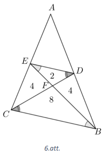

# <lo-sample/> LV.NOL.2026.11.2

Atrisināt reālos pozitīvos skaitļos vienādojumu sistēmu

$$
\begin{cases}
2x^2 + y^2 = 3 \\
3y^2 + z^3 = 4 \\
4z^2 + x^3 = 5
\end{cases}
$$

<small>

* questionType:
* domain:

</small>

## Atrisinājums

Ja $x > 1$, tad $y^2 = 3 - 2x^2 < 3 - 2 = 1$, kas nozīmē, ka $y < 1$. No otrā vienādojuma izriet, ka $z^3 = 4 - 3y^2 > 4 - 3 = 1$, kas nozīmē, ka $z > 1$. No trešā vienādojuma izriet, ka $x^3 = 5 - 4z^2 < 5 - 4 < 1$, kas nozīmē, ka $x < 1$ – pretruna ar sākotnējo pieņēmumu.

Ja $x < 1$, tad $y^2 = 3 - 2x^2 > 3 - 2 = 1$, kas nozīmē, ka $y > 1$. No otrā vienādojuma izriet, ka $z^3 = 4 - 3y^2 < 4 - 3 = 1$, kas nozīmē, ka $z < 1$. No trešā vienādojuma izriet, ka $x^3 = 5 - 4z^2 > 5 - 4 = 1$, kas nozīmē, ka $x > 1$ – pretruna ar sākotnējo pieņēmumu.

Secinām, ka $x = 1$, no pirmā vienādojuma izriet, ka $y = 1$ un no otrā vienādojuma, ka $z = 1$. Līdz ar to atrisinājums ir $(x; y; z) = (1; 1; 1)$.

# <lo-sample/> LV.NOL.2026.11.3

Šaurleņķu trijstūrī $ABC$ novilkti augstumi $BE$ un $CF$, kas krustojas punktā $H$. Nogriežnis $HT$ ir trijstūra $FHE$ augstums. Trijstūru $ABC$ un $BHT$ apvilktās riņķa līnijas vēlreiz krustojas punktā $X$. Pierādīt, ka $\angle TXA = \angle BAC$.

<small>

* questionType:
* domain:

</small>

## Atrisinājums

Tā kā $\angle BFC = \angle BEC = 90^\circ$, tad ap $BFEC$ var apvilkt riņķa līniju (ievilkta četrstūra pazīme). Ievērosim, ka $\angle BCF = 90^\circ - \angle FBC = \angle FEB$ (kā leņķi, kas balstās uz vienu loku ap četrstūri $BFEC$ apvilktai riņķa līnijai) (skat. 7.att.). Tad $\angle FBC = 90^\circ - \angle FCB = 90^\circ - \angle FEB$ un $\angle THE = \angle FBC$ (taisnleņķa trijstūra šauro leņķu summa ir $90^\circ$). Tas nozīmē, ka $\angle THB = 180^\circ - \angle FBC$.

Tā kā $THBX$ ir ievilkts četrstūris, tad $\angle THB + \angle BXT = 180^\circ$ (ievilkta četrstūra pretējo leņķu summa), kas nozīmē, ka $\angle BXT = 180^\circ - \angle THB = \angle FBC$. Galu galā $BXAC$ ir ievilkts, kas nozīmē, ka $\angle BXA + \angle ACB = 180^\circ = \angle TXB + \angle TXA + \angle ACB = \angle FBC + \angle TXA + \angle ACB$. Tad $\angle TXA = 180^\circ - \angle ACB - \angle FBC$. Tā kā $\angle BAC = 180^\circ - \angle ACB - \angle FBC$ (trijstūra iekšējo leņķu summa), tad $\angle TXA = \angle BAC$.

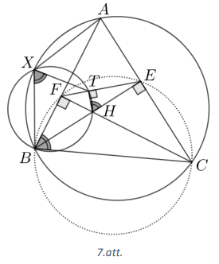

# <lo-sample/> LV.NOL.2026.11.4

Rūtiņu tabulā $2026 \times 2026$ atzīmētas 2026 rūtiņas tā, ka katrā rindā un katrā kolonnā ir atzīmēta tieši viena rūtiņa. Kāds lielākais rūtiņu skaits var būt taisnstūrim, kurā neviena rūtiņa nav atzīmēta? Taisnstūra malām jāatrodas uz rūtiņu malām.

<small>

* questionType:
* domain:

</small>

## Atrisinājums

Aplūkosim taisnstūri $m \times n$, kurā neatrodas neviena atzīmēta rūtiņa, kurš ir novietots tā, ka tas aizņem $m$ kolonnas un $n$ rindas. Tajās $n$ rindās, kurās atrodas šis taisnstūris, ir tieši $n$ iekrāsotas rūtiņas un tās ir sadalītas pa $2026 - m$ kolonnām, kuras šis taisnstūris nenoklāj. Tā kā katra no $n$ rūtiņām atrodas citā kolonnā, tad iegūstam $2026 - m \geq n$ jeb $m + n \leq 2026$. Tā kā varam izteikt $mn = \frac{(m+n)^2 - (m-n)^2}{4}$, tad ir spēkā

$$
mn \leq \frac{2026^2 - 0^2}{4} = \frac{2026^2}{4}.
$$

Izvietojums, kur $mn = \frac{2026^2}{4} = 1013^2$ ir iespējams, atzīmējot pa vienai rūtiņai katrā rindā apgabalā, ko veido pirmās 1013 rindas un pirmās 1013 kolonnas, kā arī atzīmējot pa vienai rūtiņai katrā rindā apgabalā, ko veido pēdējās 1013 rindas un pēdējās 1013 kolonnas. Tad apgabalā, ko veido pirmās 1013 rindas un pēdējās 1013 kolonnas, nebūs neviena atzīmēta rūtiņa un šis apgabals sastāv no $1013^2$ rūtiņām. Uzskatāmībai 8.att. dots piemērs izkārtojumam gadījumā ar $8 \times 8$ rūtiņu tabulu, kurā atzīmētas 8 rūtiņas.

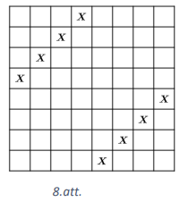

*Piezīme.* Alternatīvi, varam izteikt $mn \leq n(2026 - n)$. Tad maksimālā $mn$ vērtība ir kvadrātvienādojuma $-n^2 + 2026n$ maksimālā vērtība, jeb šīs parabolas virsotne $n_0 = \frac{-2026}{-2} = 1013$. No tā varam secināt, ka maksimāli laukums var būt $1013^2$ rūtiņas.

# <lo-sample/> LV.NOL.2026.11.5

Doti naturāli skaitļi $a$ un $b$ ar īpašību, ka $a + d(a) = b^2 + 2$, kur $d(n)$ ir skaitļa $n$ naturālo dalītāju skaits (ieskaitot 1 un $n$). Pierādīt, ka $a - b$ ir pāra skaitlis!

<small>

* questionType:
* domain:

</small>

## Atrisinājums

Aplūkosim naturālo skaitli $n$. Ievērosim, ka, ja skaitlis $d$ ir skaitļa $n$ dalītājs, tad $\frac{n}{d}$ arī ir skaitļa dalītājs. Tas nozīmē, ka visus $n$ dalītājus var sadalīt pāros $\left(d; \frac{n}{d}\right)$, līdz ar to skaitļa $n$ dalītāju skaits (tas ir skaitlis $d(n)$) ir pāra skaitlis, izņemot gadījumu $n = k^2$, jo tādā gadījumā $k$ un $\frac{k^2}{k}$ sakrīt. Secinām, ka $d(n)$ ir pāra skaitlis, izņemot to gadījumu, kad $n$ ir naturāla skaitļa kvadrāts (tad $d(n)$ ir nepāra skaitlis).

Ja $a$ nav naturāla skaitļa kvadrāts, $d(a)$ ir pāra skaitlis. Ievērosim, ka $a - b^2 = 2 - d(a)$. Labā puse ir pāra skaitlis, jo tā ir divu pāra skaitļu starpība. Tas nozīmē, ka kreisā puse arī ir pāra skaitlis, kas nozīmē, ka $a$ un $b^2$ ir vienāda paritāte. Ievērosim, ka skaitlim $b^2$ un $b$ ir vienāda paritāte, līdz ar to skaitļiem $a$ un $b$ ir vienāda paritāte, kas nozīmē, ka $a - b$ ir pāra skaitlis.

Ja $a$ ir naturāla skaitļa kvadrāts, tad $a = k^2$, kur $k$ ir naturāls skaitlis. Ja $k = 1$, tad $1 + 1 = b^2 + 2$, tad $b = 0$, kas ir pretrunā ar to, ka tas ir naturāls skaitlis. Līdz ar to pieņemsim, ka $k > 1$. Ievērosim, ka $b^2 = k^2 + d(k^2) - 2$. Tā kā $d(k^2) > 2$, jo vienīgais skaitlis, kam ir 2 dalītāji ir pirmskaitlis un naturāla skaitļa kvadrāts nav pirmskaitlis, tad $b^2 > k^2$. Ievērosim, ka $d(k^2) \leq 2k - 1$, jo skaitlim $k^2$ dalītāji (pieņemot ekstremālo variantu, ka der itin visi naturālie skaitļi līdz $k$), var būt $1; 2; \ldots; k$ un attiecīgi $\frac{k^2}{1}; \frac{k^2}{2}; \ldots; \frac{k^2}{k}$, bet $k$ un $\frac{k^2}{k}$ sakrīt. Secinām, ka $b^2 = k^2 + d(k^2) - 2 \leq k^2 + 2k - 1 - 2 < k^2 + 2k + 1 = (k + 1)^2$. Esam ieguvuši, ka $(k + 1)^2 > b^2 > k^2$ – pretruna, jo naturāla skaitļa kvadrāts nevar būt starp diviem veselu skaitļu kvadrātiem.

# <lo-sample/> LV.NOL.2026.12.1

Dots kvadrāts $ABCD$, kura malas garums ir 12. Uz malas $AB$ atlikts punkts $E$ tā, ka $AE = 3$. Caur punktu $E$ novilkta taisne, kas paralēla $BD$, tā krusto malu $AD$ punktā $F$. Taisne $CF$ krusto malas $AB$ pagarinājumu punktā $G$. Aprēķināt nogriežņa $CG$ garumu!

<small>

* questionType:
* domain:

</small>

## Atrisinājums

Ievērojam, ka $\triangle AEF \sim \triangle ABD$ $(\ell \ell)$, jo $\angle BAD = 90^\circ$ ir kopīgs un $\angle AEF = \angle ABD$ (kāpšļu leņķi pie $EF \parallel BD$, krustojoties ar $AB$ (skat. 9.att.). Tā kā $AB = AD$, tad $AF = AE = 3$, no kā izriet, ka $FD = AD - AF = 12 - 3 = 9$. Tālāk apskatām trijstūrus $\triangle AGF$ un $\triangle DCF$; tā kā $AB \parallel CD$ kā kvadrāta malas un šīs paralēlās taisnes krusto taisne $CG$, iegūstam vienādus iekšējos šķērsleņķus $\angle EGF = \angle FCD$, kā arī krustleņķus $\angle AFG = \angle CFD$, tāpēc $\triangle AGF \sim \triangle DCF$ $(\ell \ell)$. No trijstūru līdzības izriet, ka $\frac{AG}{AF} = \frac{DC}{FD} = \frac{12}{9}$, un, tā kā $AF = 3$, iegūstam $AG = 4$. Trijstūrī $AGF$ pēc Pitagora teorēmas $GF = 5$, bet $\triangle CDF$ pēc Pitagora teorēmas $CF = 15$, tāpēc $CG = GF + CF = 5 + 15 = 20$.

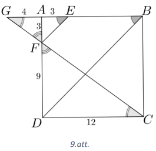

# <lo-sample/> LV.NOL.2026.12.2

Atrisināt reālos skaitļos vienādojumu sistēmu

$$
\begin{cases}
x + y - z = 1 \\
x^2 - y^2 + z^2 = 1 \\
x^3 + y^3 - z^3 = 1
\end{cases}
$$

<small>

* questionType:
* domain:

</small>

## Atrisinājums

No pirmā vienādojuma izsakām $z = x + y - 1$ un ievietojam otrajā vienādojumā, lai iegūtu, ka

$$
x^2 - y^2 + (x + y - 1)^2 = 1;
$$

$$
x^2 - y^2 + x^2 + y^2 - 2x - 2y + 2xy + 1 = 1;
$$

$$
2(x^2 - x - y + xy) = 0
\quad \Rightarrow \quad
2(x(x + y) - 1(x + y)) = 0
\quad \Rightarrow \quad
(x - 1)(x + y) = 0.
$$

Lai šī vienādība būtu spēkā, vai nu $x = 1$, vai $x = -y$. Ja $x = 1$, tad no pirmās vienādības $y = z$. Ievietojot šos lielumus trešajā vienādojumā, iegūst $1^3 + y^3 - y^3 = 1$ jeb $1 = 1$, kas spēkā visiem $y \in \mathbb{R}$. Arī otrajā vienādojumā ievietojot šo atrisinājumu, vienādība ir spēkā. Tātad der $(1; y; y)$, kur $y \in \mathbb{R}$. Ja $x + y = 0$, tad no pirmās vienādības $z = -1$ un jāpārbauda trijnieki $(x; -x; -1)$, kur $x \in \mathbb{R}$.

$$
\begin{cases}
x - x - (-1) = 1 \\
x^2 - (-x)^2 + (-1)^2 = 1 \\
x^3 + (-x)^3 - (-1)^3 = 1
\end{cases}
\quad \Rightarrow \quad
\begin{cases}
x - x + 1 = 1 \\
x^2 - x^2 + 1 = 1 \\
x^3 - x^3 - (-1)^3 = 1
\end{cases}
\quad \Rightarrow \quad
\begin{cases}
1 = 1 \\
1 = 1 \\
1 = 1
\end{cases}
$$

Tātad dotās vienādojumu sistēmas atrisinājumi ir $(1; x; x)$ un $(x; -x; -1)$, kur $x \in \mathbb{R}$.

# <lo-sample/> LV.NOL.2026.12.3

Atrast visus tādus naturālos skaitļus $n$, ka $n! - 144$ ir naturāla skaitļa kvadrāts!

<small>

* questionType:
* domain:

</small>

## Atrisinājums

**1. atrisinājums.** Apzīmēsim $n! - 144 = x^2$. Lai $x \in N$, nepieciešams, lai $n \geq 6$, citādi vienādojuma kreisā puse pieņem negatīvas vērtības, bet naturāla skaitļa kvadrāts nevar būt negatīvs. Ja $n \geq 7$, tad vienādojuma kreisā puse vienmēr dos atlikumu 3, dalot ar 7, jo, ja $n \geq 7$, tad $n!$ dalās ar 7, bet 144 dod atlikumu 4, dalot ar 7. Vienādojuma labajā pusē ir naturāla skaitļa kvadrāts. Aplūkosim, kādus atlikumus var dot naturāla skaitļa kvadrāts, dalot to ar 7.

| Atlikums, $x$ dalot ar 7 | 0 | 1 | 2 | 3 | 4 | 5 | 6 |
|---|---:|---:|---:|---:|---:|---:|---:|
| Atlikums, $x^2$ dalot ar 7 | 0 | 1 | 4 | 2 | 2 | 4 | 1 |

Tā kā naturāla skaitļa kvadrāts nekad nevar dot atlikumu 3, dalot ar 7, tad iegūta pretruna un $n$ nevar būt lielāks vai vienāds kā 7. Atliek pārbaudīt vērtību $n = 6$. Tad $6! - 144 = 720 - 144 = 576 = 24^2$. Vienīgā $n$ vērtība, kas atbilst uzdevuma nosacījumiem, ir $n = 6$.

**2. atrisinājums.** Ja $n \leq 5$, tad vienādojuma kreisā puse ir negatīva. Līdz ar to $n \geq 6$. Vērtība $n = 6$ der kā atrisinājums, bet $n = 7$ neder, jo $7! - 144 = 4896$ nav naturāla skaitļa kvadrāts. Atliek pierādīt, ka vienādojumam $n! - 144 = a^2$ nav atrisinājuma naturālos skaitļos, ja $n \geq 8$.

Ja $n \geq 8$, tad $n!$ dalās ar $3 \cdot 4 \cdot 6 \cdot 8 = 144 \cdot 4$, tātad var uzrakstīt, ka $n! = 4 \cdot 144 \cdot k$ kādam naturālam $k$. Ievietojot to izteiksmē, iegūstam, ka $4 \cdot 144 \cdot k - 144 = a^2$.

Tā kā vienādojuma kreisā puse dalās ar 144, tad dalās arī labā, tātad $a^2$ dalās ar 144 jeb $a$ dalās ar 12. Izdalot abas puses ar 144, iegūstam $4k - 1 = \left(\frac{a}{12}\right)^2$. Tā kā vienādojuma kreisā puse ir nepāra skaitlis, tad secinām, ka arī labā vienādojuma puse ir nepāra skaitlis, tātad arī $\frac{a}{12}$ ir nepāra skaitlis, tātad $\frac{a}{12} = 2m + 1$ kādam veselam skaitlim $m$.

Ievietojot to vienādojumā, iegūstam, ka

$$
4k - 1 = (2m + 1)^2
$$

$$
4k - 1 = 4m^2 + 4m + 1
$$

$$
4k - 4m^2 - 4m = 2
$$

Iegūstam pretrunu, jo vienādojuma kreisā puse dalās ar 4, bet labā nedalās.

# <lo-sample/> LV.NOL.2026.12.4

Doti sviras svari un 30 atsvari, kuru svars ir 1 kg, 2 kg, 3 kg, ..., 30 kg. Alfrēds un Kims spēlē spēli, Alfrēds sāk. Vienā gājienā spēlētājs izvēlas (vēl iepriekš neizvēlētu) atsvaru un uzliek to uz viena no svaru kausiem. Kad visi 30 atsvari ir salikti uz svaru kausiem, tad aprēķina uz tiem uzliktās masas starpību (no smagākā kausa atņemot vieglāko). Apzīmēsim šo starpību ar $S$. Alfrēda uzdevums ir panākt pēc iespējas mazāku $S$ vērtību. Kāda ir mazākā iespējamā $S$ vērtība, ko Alfrēds noteikti var panākt, neatkarīgi no tā, kā spēlē Kims?

<small>

* questionType:
* domain:

</small>

## Atrisinājums

Sadalīsim atsvarus pa pāriem šādā veidā: $(1, 2)$, $(3, 4)$, ..., $(27, 28)$ un $(29, 30)$ kg. Ja Alfrēds kādā no pirmajiem 14 pāriem vienu atsvaru uzliek uz viena no svaru kausiem, tad Kims otru atsvaru no šī pāra uzliek uz otra svaru kausa. Tad katrā šāda pāra starpība ir $\pm 1$, un, ja aplūkotu tikai šos pārus, tad $S$ nepārsniedz 14. Pārī $(29, 30)$ Kims otru atsvaru uzliek uz tā paša svaru kausa, uz kura Alfrēds uzlika pirmo. Tādējādi šī pāra summa ir $(29 + 30) = 59$. Tātad gala rezultāts $S \geq 59 - 14 = 45$, un Kims var garantēt vismaz 45.

Tagad pierādīsim, ka Alfrēds var garantēt, ka $S$ nepārsniegs 45. Viņam jāizvēlas lielāko atsvaru, kas vēl nav uzlikts uz svariem, un jānovieto to uz tā svaru kausa, kurā šobrīd ir mazākais svars. Ja uz abiem svaru kausiem ir vienāda masa, tad izvēlas jebkuru no svaru kausiem, kurā šo atsvaru ieliek. Sadalīsim gājienus 15 kārtās (Alfrēda $i$-tais gājiens kopā ar Kima $i$-to gājienu). Ar $k$ apzīmēsim tādu naturālu skaitli, ka $k$-tā kārta ir pēdējā, pēc kuras smagākais svaru kauss mainās (vai arī pēdējā, kurā svaru kausos ir vienāda masa). Pirms $k$-tās kārtas jau ir izmantoti vismaz $k - 1$ lielākie atsvari, tāpēc divi lielākie neizmantotie atsvari ir $30 - (k - 1)$ un $30 - k$, un līdz ar to, pēc $k$-tās kārtas $S \leq (30 - (k - 1)) + (30 - k) = 61 - 2k$. Pēc šīs kārtas vairs nemainās tas, kurš no svaru kausiem ir smagākais, un katrs no atlikušajiem $15 - k$ Alfrēda gājieniem samazina $S$ vismaz par 1, tādēļ $S \leq (61 - 2k) - (15 - k) = 46 - k \leq 45$. Tātad Alfrēds var nodrošināt, ka $S$ nepārsniedz 45, un līdz ar to garantētā vērtība Kimam ir 45.

# <lo-sample/> LV.NOL.2026.12.5

Šaurleņķu trijstūra $ABC$ apvilktajai riņķa līnijai punktā $A$ novilkta pieskare. Punkti $D$ un $E$ atrodas uz pieskares ar īpašību, ka $AD = AB$ un $AC = AE$ un tā, ka punkts $D$ atrodas tuvāk punktam $B$ nekā $C$, un punkts $E$ atrodas tuvāk punktam $C$ nekā $B$. Pierādīt, ka trijstūru $DLE$ un $BLC$ apvilktās riņķa līnijas pieskaras, ja punkts $L$ ir trijstūrī $ABC$ ievilktās riņķa līnijas centrs!

<small>

* questionType:
* domain:

</small>

## Atrisinājums

Tā kā $\angle DAB$ ir hordas-pieskares leņķis un $\angle ACB$ – ievilkts leņķis lokam $AB$, tad $\angle DAB = \angle ACB$ (skat. 10.att.). Analogi $\angle CAE = \angle ABC$. Aplūkojot $\triangle EAC$ un $\triangle ADB$, tie ir vienādsānu pēc dotā. Vienādsānu trijstūrī pamata pieleņķi ir vienādi, tātad $\angle ADB = 90^\circ - \frac{\angle ACB}{2}$ un $\angle AEC = 90^\circ - \frac{\angle ABC}{2}$. Tā kā $L$ ir trijstūrī $ABC$ ievilktās riņķa līnijas centrs, tad $AL$ un $BL$ ir bisektrises. Tad no trijstūra iekšējo leņķu summas

$$
\angle ALB = 180^\circ - \left(\frac{\angle CAB}{2} + \frac{\angle ABC}{2}\right) = 180^\circ - \frac{(180^\circ - \angle ACB)}{2} = 90^\circ + \frac{\angle ACB}{2}.
$$

Tas nozīmē, ka $\angle ADB + \angle ALB = 180^\circ$. Līdzīgi varam iegūt, ka $\angle AEC + \angle ALC = 180^\circ$, kas nozīmē, ka ap četrstūriem $ALBD$ un $ALCE$ var apvilkt riņķa līniju. Tas nozīmē, ka $\angle DLB = \angle DAB = \angle ACB$ (kā leņķi kas balstās uz viena loka ap četrstūri $ALBD$ apvilktajā riņķa līnijā). Novilksim pieskari $\triangle BLC$ apvilktai riņķa līnijai punktā $L$ un atliksim uz tās punktu $T$ tā, lai $T$ ir tuvāk $B$ nekā $C$. No pieskares īpašības izriet, ka $\angle TLB = \angle LCB = \frac{\angle ACB}{2}$, kas nozīmē, ka

$$
\angle TLD = \angle DLB - \angle TLB = \angle ACB - \angle TLB = \angle ACB - \frac{\angle ACB}{2} = \frac{\angle ACB}{2}.
$$

Ievērosim, ka $\angle LCA = \angle AEL = \frac{\angle ACB}{2}$ (kā leņķi, kas balstās uz viena loka ap četrstūri $ALCE$ apvilktajā riņķa līnijā), kas nozīmē, ka $\angle TLD = \angle AEL = \frac{\angle ACB}{2}$. Tad $TL$ ir ap trijstūri $DLE$ apvilktās riņķa līnijas pieskare (hordas-pieskares leņķa apgrieztā īpašība). Tas nozīmē, ka $TL$ ir abu riņķa līniju pieskare, tātad abas riņķa līnijas pieskaras punktā $L$.

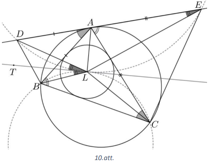

