# <lo-sample/> LV.VOL.2026.5.1

Izteiksmē

$$\frac{\ast}{\ast + \ast} + \frac{\ast}{\ast + \ast}$$

ieraksti zvaigznīšu vietā skaitļus **(A)** $0, 1, 2, 3, 4, 2026$; **(B)** $10, 11, 20, 74, 100, 2026$ (katras zvaigznītes vietā citu skaitli) tā, lai izteiksmes vērtība būtu vesels skaitlis!

## Atrisinājums

**(A)** $\frac{2}{0+4}+\frac{2026}{1+3}=\frac{2028}{4}=507$ (iespējami arī citi varianti).

**(B)** $\frac{20}{10+11}+\frac{100}{74+2026}=\frac{20}{21}+\frac{1}{21}=1$.

# <lo-sample/> LV.VOL.2026.5.2

Vai taisnstūrveida torti, kuras pamatnes platums ir $n$ cm un garums ir $55$ cm, var sagriezt $n$ gabalos, kuru izmērs ir $5 \times 11$ cm (tie var būt novietoti gan horizontāli, gan vertikāli), ja **(A)** $n=38$; **(B)** $n=39$?

## Atrisinājums

**(A)** Jā, ir iespējams, piemēram, kā parādīts 1. att.

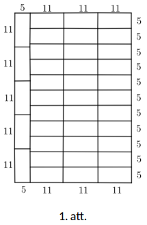

**(B)** Nē, nav iespējams. Pieņemsim, ka prasītais ir iespējams. Tad tortes mala ar garumu $39$ cm ir sadalīta tikai $5$ un $11$ vienību garos gabalos. Tā kā mala ir $39$ cm gara, tajā ietilpst $0, 1, 2$ vai $3$ gabali ar garumu $11$ cm, lai nepārsniegtu kopējo garumu $39$. Atkarībā no $11$ cm garo gabalu skaita, malas garums, kas jāaizpilda ar $5$ cm garajiem gabaliem, ir attiecīgi $39, 28, 17$ vai $6$ cm. Tomēr neviens no šiem garumiem nedalās ar $5$ bez atlikuma un tukšumus atstāt nevar, jo tortes laukums precīzi sakrīt ar gabalu kopējo laukumu. Tātad iegūta pretruna un prasītais nav iespējams.

# <lo-sample/> LV.VOL.2026.5.3

Cik dažādos veidos $3 \times 3$ rūtiņu tabulā var ierakstīt skaitļus no $1$ līdz $9$ (katrā rūtiņā citu skaitli) tā, lai katrā stūra rūtiņā esošais skaitlis būtu vismaz par $4$ lielāks nekā katrs no tā abiem kaimiņiem?

Piezīme. Par kaimiņiem sauc rūtiņas, kurām ir kopīga mala. Izkārtojumi, kurus var iegūt citu no cita ar simetrijām vai pagriezieniem, tiek uzskatīti par dažādiem.

## Atrisinājums

Ievērojam, ka stūros nevar būt skaitļi $1, 2, 3, 4$. Stūra rūtiņai ir divi kaimiņi, tāpēc, ja tajā būtu $5$, tad abiem kaimiņiem būtu jābūt ne lielākiem kā $1$, kas nav iespējams. Tātad stūros var būt tikai skaitļi $6, 7, 8, 9$. Līdz ar to pārējās rūtiņās ir skaitļi $1, 2, 3, 4, 5$. Centrā jābūt $5$, jo tas nevar reizē būt kaimiņš diviem stūriem. Sānu vidējās rūtiņas satur $1, 2, 3, 4$. Ja sānu rūtiņa atrodas starp stūriem ar skaitļiem $x < y$, tad tajā var būt ne vairāk kā $x - 4$. No tā izriet, ka skaitlis $4$ var atrasties tikai starp $8$ un $9$, tātad $8$ un $9$ jābūt blakus stūros. Tad skaitlis $3$ atrodas starp $7$ un vienu no $8, 9$, bet divas rūtiņas, kas robežojas ar $6$, satur $1$ un $2$ jebkurā secībā. Izvēlamies vietu skaitlim $8$ ($4$ veidi), tad blakus esošu vietu skaitlim $9$ ($2$ veidi), atlikušajos stūros izvietojam $6$ un $7$ ($2$ veidi), un visbeidzot varam samainīt vietām $1$ un $2$ ($2$ veidi), kopā $4 \cdot 2 \cdot 2 \cdot 2 = 32$.

# <lo-sample/> LV.VOL.2026.5.4

Dotas $79$ pēc ārējā izskata vienādas monētas, no tām $7$ ir viltotas, bet pārējās ir īstas. Visu īsto monētu masa ir vienāda, visu viltoto monētu masa arī ir vienāda, īstā monēta ir smagāka par viltoto. Kā ar $3$ svēršanām uz sviras svariem bez atsvariem atrast $9$ īstās monētas?

## Atrisinājums

Pirmajā svēršanā uzliksim uz katra svaru kausa $39$ monētas (vienu atstāsim malā). Izvēlēsimies smagāko kausu (ja svari ir līdzsvarā, tad jebkuru), tajā ir ne vairāk kā $3$ viltotās monētas. Ja tajā būtu vismaz $4$ viltotās monētas, tad vieglākajā kausā būtu ne vairāk kā $3$ viltotās monētas, bet tad tas vairs nebūtu vieglākais kauss.

Otrajā svēršanā uzliksim uz katra svaru kausa $19$ monētas (no pirmajā svēršanā izvēlētajām $39$). Izvēlēsimies smagāko kausu (ja svari ir līdzsvarā, tad jebkuru), tajā ir ne vairāk kā $1$ viltotā monēta.

Trešajā svēršanā uzliksim uz katra svaru kausa $9$ monētas (no otrajā svēršanā izvēlētajām $19$). Izvēlēsimies smagāko kausu (ja svari ir līdzsvarā, tad jebkuru), tajā viltotu monētu nav.

# <lo-sample/> LV.VOL.2026.5.5

Spēles vienā gājienā drīkst vai nu pieskaitīt skaitlim vienu no tā cipariem, vai arī atņemt no skaitļa vienu no tā cipariem. Nākamajā gājienā tiek izmantots jaunais skaitlis. (Piemēram, no skaitļa $128$ var iegūt $128-2=126$, tad nākamajā gājienā $126+6=132$ utt.)

**(A)** Vai, izpildot vairākus gājienus, no skaitļa $10$ var iegūt skaitli $31$?

**(B)** Vai, izpildot vairākus gājienus, no skaitļa $1000$ var iegūt skaitli $3001$?

## Atrisinājums

**(A)** Jā, var. Piemēram,

$$
10 \xrightarrow{+1} 11 \xrightarrow{+1} 12 \xrightarrow{+2} 14 \xrightarrow{+4} 18 \xrightarrow{+8} 26 \xrightarrow{+6} 32 \xrightarrow{+2} 34 \xrightarrow{-3} 31.
$$

Katrā solī mēs pieskaitām vai atņemam vienu no attiecīgā skaitļa cipariem.

**(B)** Jā, var. Sākot no skaitļa $1000$, katrā solī pieskaitām ciparu $1$, līdz iegūstam $2000$:

$$
1000 \xrightarrow{+1} 1001 \xrightarrow{+1} 1002 \xrightarrow{+1} \ldots \xrightarrow{+1} 1999 \xrightarrow{+1} 2000.
$$

Tas ir iespējams, jo katrs skaitlis no $1000$ līdz $1999$ satur ciparu $1$. Pēc tam no skaitļa $2000$ katrā solī pieskaitām tūkstošu ciparu $2$, līdz iegūstam $2998$:

$$
2000 \xrightarrow{+2} 2002 \xrightarrow{+2} 2004 \xrightarrow{+2} \ldots \xrightarrow{+2} 2996 \xrightarrow{+2} 2998.
$$

Visbeidzot

$$
2998 \xrightarrow{+9} 3007 \xrightarrow{-3} 3004 \xrightarrow{-3} 3001.
$$

# <lo-sample/> LV.VOL.2026.6.1

Vai, izmantojot viencipara skaitļus $1, 2, 3, 4, 5, 6, 7, 8, 9$, var uzrakstīt trīs nesaīsināmas daļas $\frac{a}{b}$, $\frac{c}{d}$ un $\frac{e}{f}$ tā, ka

$$\frac{a}{b} \cdot \frac{c}{d} \cdot \frac{e}{f}=1?$$

Katru skaitli drīkst izmantot tieši vienu reizi vai arī neizmantot vispār.

Piezīme. Daļa $\frac{a}{b}$ ir nesaīsināma, ja skaitļu $a$ un $b$ lielākais kopīgais dalītājs ir $1$.

## Atrisinājums

Jā, var, piemēram, izvēloties $a=2$, $c=3$, $e=6$ un $b=9$, $d=4$, $f=1$, iegūsim, ka

$$\frac{a}{b} \cdot \frac{c}{d} \cdot \frac{e}{f} = \frac{a \cdot c \cdot e}{b \cdot d \cdot f} = \frac{2 \cdot 3 \cdot 6}{9 \cdot 4 \cdot 1} = \frac{36}{36} = 1.$$

Piezīme. Atbildi ir iespējams atrast, ievērojot, ka $\frac{a}{b} \cdot \frac{c}{d} \cdot \frac{e}{f}=\frac{a \cdot c \cdot e}{b \cdot d \cdot f}=1$ jeb $a \cdot c \cdot e=b \cdot d \cdot f$, tātad, ja $a, c$ vai $e$ dalās ar kādu pirmreizinātāju, tad arī kādam no $b, d, f$ ar to ir jādalās. Viegli ievērot, ka ir pieejams tikai viens skaitlis, kas dalās ar $5$, kas ir pats $5$, un tikai viens, kas dalās ar $7$, kas ir $7$, tādat tie neder. Tālāk var sadalīt atlikušos skaitļus pirmreizinātājos $2$ un $3$ un sadalīt grupās tā, lai, sareizinot vienas grupas locekļus, iegūst tādas pašas pirmskaitļu pakāpes, kā sareizinot otras grupas locekļus.

# <lo-sample/> LV.VOL.2026.6.2

Vai iespējams 2. att. redzamo figūru noklāt ar desmit **(A)** 3. att.; **(B)** 4. att. redzamajām figūrām? Dalījuma līnijas drīkst iet tikai pa rūtiņu līnijām, figūras drīkst pagriezt vai apmest otrādi, bet tās nevar pārklāties vai iziet ārpus 2. att. figūras robežām.

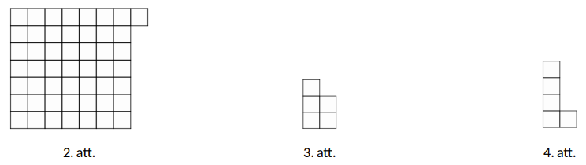

## Atrisinājums

**(A)** Nē, prasītais nav iespējams. Lai noklātu visu 2. att. redzamo figūru, nepieciešamas 10 mazās figūras. Iekrāsosim deviņas rūtiņas, kā redzams 5. att. Ievērosim, ka katra 3. att. redzamā figūra vienmēr noklāj vismaz vienu melno rūtiņu. Tā kā melnas rūtiņas ir tikai deviņas, desmit šādas figūras ievietot nevar.

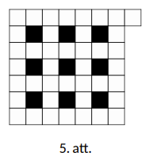

**(B)** Jā, lielo figūru ir iespējams noklāt, piemēram, kā redzams 6. att.:

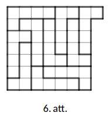

# <lo-sample/> LV.VOL.2026.6.3

Kvadrāts sastāv no $4 \times 4$ vienādām kvadrātiskām rūtiņām. Rūtiņās ierakstīti naturāli skaitļi no $1$ līdz $16$ (katrā rūtiņā cits skaitlis). Rūtiņu sauc par *izcilu*, ja tajā ierakstītais skaitlis ir mazāks par ne vairāk kā vienā kaimiņu rūtiņā ierakstītu skaitli (divas rūtiņas sauc par kaimiņu rūtiņām, ja tām ir kopīga mala vai kopīgs stūris). Kāds lielākais skaits rūtiņu var būt *izcilas*?

## Atrisinājums

Katrā $2 \times 2$ rūtiņu kvadrātā ne vairāk kā divas rūtiņas var būt izcilas: ja tādu būtu trīs, tad rūtiņa, kurā ierakstīts mazākais skaitlis no šiem trim, nevarētu būt izcila – pretruna. Tātad izcilu rūtiņu nav vairāk kā $4 \cdot 2 = 8$. Piemērs ar $8$ izcilām rūtiņām, kas iekrāsotas zilā krāsā:

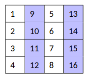

# <lo-sample/> LV.VOL.2026.6.4

Kāds ir lielākais septiņciparu palindroms, kas dalās ar $18$?

Piezīme. Palindroms ir naturāls skaitlis, kuru, lasot no otra gala (no labās puses uz kreiso), iegūst to pašu skaitli. Piemēram, palindromi ir $77, 151, 8338$ u.c.

## Atrisinājums

Lielākais septiņciparu palindroms ir $8992998$. Lai septiņciparu skaitlis būtu palindroms, tam ir jābūt formā $abcdcba$. Skaitlis dalās ar $18$ tad un tikai tad, ja tas dalās ar $2$ un $9$. Savukārt ar $2$ skaitlis dalās tad un tikai tad, ja tā pēdējais cipars ir pāra. Tā kā pirmais un pēdējais cipars sakrīt, tad $a$ ir pāra cipars. Lai skaitlis būtu pēc iespējas lielāks, jāizvēlas lielākais iespējamais pāra cipars, kas ir $a=8$. Tātad skaitlis ir formā $8bcdcb8$. Lai tas būtu maksimāls, izvēlamies $b=9$ un $c=9$, iegūstot $899d998$. Skaitlis dalās ar $9$ tad un tikai tad, ja tā ciparu summa dalās ar $9$. Šajā gadījumā $8+9+9+d+9+9+8=52+d$. Jāpanāk, lai $52+d$ dalītos ar $9$. Tā kā $52$ dod atlikumu $7$, dalot ar $9$, tad $d$ jādod atlikums $2$, dalot ar $9$. Tas nozīmē, ka $d=2$ un mēs iegūstam skaitli $8992998$. Ievērojam, ka, izvēloties katru no cipariem, esam izvēlējušies lielāko iespējamo vērtību katram ciparam, līdz ar to esam atraduši lielāko skaitli, kam izpildās dotās īpašības. Pārbaudām: $8+9+9+2+9+9+8=54$, un $54$ dalās ar $9$, turklāt pēdējais cipars ir pāra, tātad skaitlis dalās ar $18$. Tātad lielākais septiņciparu palindroms, kas dalās ar $18$, ir $8992998$.

# <lo-sample/> LV.VOL.2026.6.5

Olimpiādes komisija piedalījās cepumu cepšanas konkursā. Katrs komisijas loceklis izcepa dažus cepumus. No visiem izceptajiem cepumiem $\frac{1}{4}$ izrādījās konkursam nederīgi. Visvairāk derīgo cepumu bija tieši diviem komisijas locekļiem, katram no viņiem derīgo cepumu skaits bija tieši $\frac{1}{8}$ no visu sākotnējo (gan derīgo, gan nederīgo) cepumu kopskaita. Vismazāk derīgo cepumu bija tieši pieciem komisijas locekļiem, katram no viņiem derīgo cepumu skaits bija tieši $\frac{1}{12}$ no visu derīgo cepumu kopskaita. Cik cilvēku ir olimpiādes komisijā?

## Atrisinājums

Vispirms noskaidrojam, ka $1-\frac{1}{4}=\frac{3}{4}$ no visiem cepumiem ir derīgi. Zināms, ka tie divi komisijas locekļi, kas izcepa visvairāk derīgos cepumus, izcepa $2 \cdot \frac{1}{8}=\frac{1}{4}$ no visiem cepumiem. Tie komisijas locekļi, kas izcepa vismazāk derīgo cepumu, kopā izcepa $5 \cdot \frac{1}{12}=\frac{5}{12}$ no derīgajiem cepumiem jeb $\frac{5}{12}$ no $\frac{3}{4}=\frac{5}{12} \cdot \frac{3}{4}=\frac{5}{16}$ no visiem cepumiem. Tas nozīmē, ka pārējie komisijas locekļi izcepa $\frac{3}{4}-\frac{1}{4}-\frac{5}{16}=\frac{3}{16}$ no visiem cepumiem, turklāt zināms, ka katrs no viņiem noteikti izcepa mazāk nekā $\frac{1}{8}$ un vairāk nekā $\frac{1}{16}$ no visiem cepumiem, jo zināms, ka atlikušie komisijas locekļi neizcepa ne visvairāk, ne vismazāk derīgo cepumu. Tā kā katrs atlikušais komisijas loceklis nevarēja izcept vairāk kā $\frac{1}{8}=\frac{2}{16}<\frac{3}{16}$, tad noteikti ir vēl vismaz divi komisijas locekļi. Nevar būt, ka ir trīs vai vairāk atlikušo komisijas locekļu, jo tad viņi kopā noteikti izceptu vairāk nekā $3 \cdot \frac{1}{16}=\frac{3}{16}$ no visiem cepumiem. Divi cilvēki var panākt prasīto, piemēram, katrs izcepot $\frac{3}{32}$ no visiem cepumiem. Tātad kopā ir $2+5+2=9$ komisijas locekļi.

# <lo-sample/> LV.VOL.2026.7.1

Saskaitot divus naturālus skaitļus, Kristīne nejauši pierakstīja $0$ viena skaitļa beigās. Rezultātā viņa ieguva summu $999999$, lai gan pareizajai summai bija jābūt $333333$. Kādi bija sākotnējie skaitļi, kurus Kristīne gribēja saskaitīt?

## Atrisinājums

Apzīmējam skaitļus, kurus gribēja saskaitīt, kā $x$ un $y$. Iegūstam, ka $x+y=333333$. Pieņemsim, ka $y$ bija tas skaitlis, kam beigās pielika $0$. Ja skaitlim beigās pieraksta $0$, tad to reizina ar $10$. Tātad tika saskaitīti $x$ un $10y$, no kā iegūstam, ka $x+10y=999999$. Ievērojam, ka $x+10y=x+y+9y=333333+9y=999999$. Tad $9y=666666$, kur, izdalot abas puses ar $9$, iegūsim $y=74074$. Ievietojot iegūto $y$ vērtību pirmajā vienādojumā, iegūsim, ka $x=259259$.

# <lo-sample/> LV.VOL.2026.7.2

Trijstūra malu garumi ir $a, b, c$ ($a>b>c$); viens no trijstūra leņķiem ir $60^\circ$ liels. Pierādīt, ka eksistē trijstūris, kura malu garumi ir $a, b, a-c$ un viens no leņķiem arī ir $60^\circ$ liels.

## Atrisinājums

Ievērosim, ka $60^\circ$ leņķis atrodas pret malu $b$ (ja tas būtu pret $a$ vai $c$, tad trijstūra leņķu summa attiecīgi sanāktu mazāka vai lielāka nekā $180^\circ$). Tālāk skat. 7. att., kur $ABC$ - dotais trijstūris, bet $BCM$ - vienādmalu trijstūris. Redzam, ka $MC=a$, $MA=a-c$, $AC=b$, $\angle M=60^\circ$; tātad trijstūris $ACM$ ir meklētais.

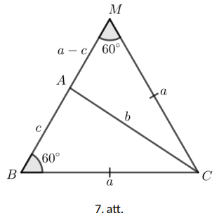

# <lo-sample/> LV.VOL.2026.7.3

Kādā ciemā dzīvo $n>3$ pļāpas; katrai mājās ir telefons. Šodien katra pļāpa piezvanīja vismaz vienai citai. Starp katrām divām pļāpām notika tieši viena saruna. Pierādīt, ka var atrast trīs tādas pļāpas $A$, $B$ un $C$, ka $A$ piezvanīja $B$, $B$ piezvanīja $C$ un $C$ piezvanīja $A$.

## Atrisinājums

Katra pļāpa zvanījusi vismaz $1$ reizi un ne vairāk kā $(n-1)$ reizi, tātad dažādu iespējamu zvanīšanu daudzumu ir $n-1$. Pļāpu ir $n$; ievērojam, ka $n>n-1$. Tāpēc ir $2$ pļāpas (apzīmēsim tās ar $A$ un $B$), kas zvanījušas vienādu daudzumu reižu. Viena no tām zvanījusi otrai; pieņemsim, ka pļāpa $A$ zvanījusi pļāpai $B$. Tad pļāpa $B$ nav zvanījusi pļāpai $A$. Lai pļāpas $A$ un $B$ būtu veikušas vienādu skaitu zvanu, ir jābūt tādai pļāpai - apzīmēsim to ar $C$ - kam $B$ ir zvanījusi, bet $A$ nav zvanījusi (citādi $A$ veikto zvanu būtu vismaz par $1$ vairāk nekā $B$ veikto zvanu). Ja $A$ nav zvanījusi $C$, tad $C$ ir zvanījusi $A$. Vajadzīgās $3$ pļāpas ir atrastas.

# <lo-sample/> LV.VOL.2026.7.4

Artim, Brencim un Centim katram mamma iedeva $n$ eiro. Par savu naudu Artis nopirka vienu cirkuli, Brencis nopirka divas pildspalvas, bet Centis nopirka piecus zīmuļus. Saskaitot atlikušo naudu, izrādījās, ka visiem zēniem kopā ir tieši $n$ eiro. Pierādīt, ka kāds no zēniem var nopirkt sev vēl vienu tādu pašu rakstāmpiederumu (Artis - cirkuli, Brencis - pildspalvu vai Centis - zīmuli), izmantojot tikai savu naudas atlikumu.

## Atrisinājums

Pieņemsim pretējo - neviens no zēniem nevar vairs nopirkt sev tādu pašu rakstāmpiederumu. Tad varam secināt, ka:

- cirkulis maksā vairāk nekā $\frac{n}{2}$ eiro. Ja tas maksātu $\frac{n}{2}$ eiro vai lētāk, tad Artis varētu nopirkt vismaz divus cirkuļus;
- pildspalva maksā vairāk nekā $\frac{n}{3}$ eiro. Ja tā maksātu $\frac{n}{3}$ eiro vai lētāk, tad Brencis varētu nopirkt vismaz trīs pildspalvas;
- zīmulis maksā vairāk nekā $\frac{n}{6}$ eiro. Ja tas maksātu $\frac{n}{6}$ eiro vai lētāk, tad Centis varētu nopirkt vismaz sešus zīmuļus.

Tā kā cirkulis maksā vairāk nekā $\frac{n}{2}$ eiro, tad Artim ir atlicis mazāk par $\frac{n}{2}$ eiro. Tā kā pildspalva maksā vairāk nekā $\frac{n}{3}$ eiro, tad par divām pildspalvām Brencis ir iztērējis vairāk nekā $\frac{2n}{3}$ eiro un tam ir atlicis mazāk nekā $\frac{n}{3}$ eiro. Tā kā zīmulis maksā vairāk nekā $\frac{n}{6}$ eiro, tad par pieciem zīmuļiem Centis ir iztērējis vairāk nekā $\frac{5n}{6}$ eiro un tam ir atlicis mazāk nekā $\frac{n}{6}$ eiro.

Tātad visiem kopā viņiem ir atlicis mazāk nekā $\frac{n}{2}+\frac{n}{3}+\frac{n}{6}=n$ eiro, kas ir pretrunā ar to, ka viņiem visiem kopā ir atlicis tieši $n$ eiro. Tātad secinām, ka mūsu sākotnējais pieņēmums ir aplams un kāds no zēniem var nopirkt sev vēl vienu tādu pašu rakstāmpiederumu, izmantojot tikai savu naudas atlikumu.

# <lo-sample/> LV.VOL.2026.7.5

Andris ir iedomājies patvaļīgu naturālu skaitli $n$. Juris savā gājienā pasaka Andrim piecus dažādus naturālus skaitļus $a, b, c, d, e$, un Andris pasaka Jurim vienu no skaitļiem $na, nb, nc, nd, ne$ (bet nepaskaidro, kura reizinājuma vērtību viņš saka). Vai Juris vienmēr var noskaidrot $n$ vērtību **(A)** vienā gājienā; **(B)** divos gājienos?

## Atrisinājums

**(A)** Ar vienu gājienu nepietiek: ja Andris pateiks Jurim skaitli $abcde$, Juris nezinās, vai Andris kā skaitli $n$ ir iedomājies $abcd, abce, acde$ vai $bcde$.

**(B)** Izmantojot divus gājienus, Juris var rīkoties šādi. Pēc Andra pirmās atbildes $A$ viņš izvēlas $5$ dažādus pirmskaitļus $p_1, p_2, p_3, p_4, p_5$, ar kuriem nedalās $A$ (un tātad arī $n$), un pasaka tos Andrim. Atkarībā no tā, ar kuru no šiem pirmskaitļiem dalās Andra otrā atbilde, Juris noskaidros $n$.

# <lo-sample/> LV.VOL.2026.8.1

Saskaitot divus naturālus skaitļus, Kristīne nejauši pierakstīja $0$ viena skaitļa beigās. Rezultātā viņa ieguva summu $10000$, lai gan pareizajai summai bija jābūt $2026$. Kādi bija sākotnējie skaitļi, kurus Kristīne gribēja saskaitīt?

## Atrisinājums

Apzīmējam skaitļus, kurus gribēja saskaitīt, kā $x$ un $y$. Iegūstam, ka $x+y=2026$. Pieņemsim, ka $y$ bija tas skaitlis, kam beigās pielika $0$. Ja skaitlim beigās pieraksta $0$, tad to reizina ar $10$. Tātad tika saskaitīti $x$ un $10y$, no kā iegūstam, ka $x+10y=10000$. Ievērojam, ka $x+10y=x+y+9y=2026+9y=10000$. Tad iegūst, ka $9y=10000-2026=7974$, kur, izdalot abas puses ar $9$, iegūsim $y=886$. Ievietojot iegūto $y$ vērtību pirmajā vienādojumā, iegūsim, ka $x=1140$.

# <lo-sample/> LV.VOL.2026.8.2

Šaurleņķu trijstūrī $ABC$ novilkti augstumi $CH$ un $AA_1$, turklāt $AH=BC$. Caur $H$ novilkta taisne paralēli malai $BC$, tā krusto augstumu $AA_1$ punktā $K$. Pierādīt, ka $K$ atrodas uz leņķa $ABC$ bisektrises.

## Atrisinājums

Ievērosim, ka $AK \perp HK$, jo $AA_1 \perp BC$ un $HK \parallel BC$. Tas nozīmē, ka $\angle KAH=90^\circ-\angle ABC=\angle HCB$. Tāpēc $\triangle KAH=\triangle HCB$ pēc pazīmes $hl$, no kā izriet, ka $HK=BH$. Tātad $\triangle KHB$ - vienādsānu un $\angle HBK=\angle HKB$. Bet $\angle HKB=\angle KBC$, jo $HK \parallel BC$, tātad $\angle HBK=\angle KBC$, kas bija jāpierāda.

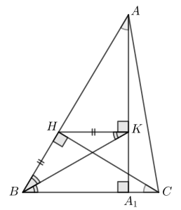

# <lo-sample/> LV.VOL.2026.8.3

Dārzā aug $4$ bumbieres un dažas ābeles. Zināms, ka no katras ābeles tieši $10$ metru attālumā aug tieši divas bumbieres. Kāds lielākais skaits ābeļu var augt šādā dārzā?

## Atrisinājums

Atbilde: Lielākais skaits ābeļu, kas var augt dārzā, ir $12$.

Vispirms parādīsim, ka dārzā var augt $12$ ābeles. Iestādīsim bumbieres vienā rindā ik pēc $5$ metriem. Tad ābeles var augt tā kā parādīts 8. att. (shēmā ar zaļu krāsu atzīmētas ābeles, bet ar sarkanu – bumbieres).

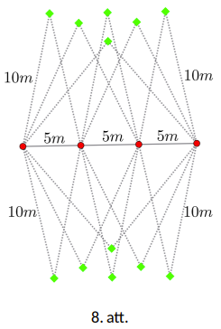

Atliek pamatot, ka vairāk nekā $12$ ābeles šādi augt nevar. Katram bumbieru pārim ir ne vairāk kā divi punkti, kas atrodas $10$ metru attālumā no tām abām. Tā kā no $4$ bumbierēm var izveidot $6$ bumbieru pārus, tad tādu punktu, kas atrodas tieši $10$ punktu attālumā no kāda pāra, ir ne vairāk kā $6 \cdot 2=12$.

# <lo-sample/> LV.VOL.2026.8.4

Dots $45$-ciparu skaitlis, tā pieraksts sastāv no viena vieninieka, diviem divniekiem, trīs trijniekiem, $\ldots$, deviņiem devītniekiem. Pierādīt, ka tas nevar būt vesela skaitļa kvadrāts!

## Atrisinājums

Aplūkosim šāda skaitļa ciparu summu. Tā kā skaitļa sastāvā katrs no minētajiem $9$ cipariem ir tikpat reižu, cik tas pats ir, ciparu summa skaitlim ir

$$
1 \cdot 1 + 2 \cdot 2 + 3 \cdot 3 + \ldots + 9 \cdot 9 = 1^2 + 2^2 + 3^2 + \ldots + 9^2 = 285.
$$

Ievērosim, ka ciparu summa dalās ar $3$, bet nedalās ar $9$, jo ciparu summas ciparu summa ir $15$. Taču neeksistē tāds vesela skaitļa kvadrāts, kas dalās ar $3$, bet nedalās ar $9$, jo tad tam jāsatur pirmreizinātājs $3$ tikai vienu reizi. Kāpinot skaitli kvadrātā, jauni pirmreizinātāji nevar rasties, taču visi skaitlī jau esošie pirmreizinātāji pēc kāpināšanas kvadrātā būs pāra skaitā, jo skaitlis tiek reizināts pats ar sevi.

# <lo-sample/> LV.VOL.2026.8.5

Sienāzis lec pa skaitļu taisni $2$ vai $3$ vienības pa labi. Tas nedrīkst nonākt punktos, kas atbilst pirmskaitļiem. Cik dažādos veidos tas no $1$ var nokļūt uz $36$?

Piezīme. Pirmskaitlis ir naturāls skaitlis, kas ir lielāks par $1$ un kam ir tieši divi dažādi dalītāji – pats skaitlis un $1$.

## Atrisinājums

Apzīmēsim ar $f(n)$ veidu skaitu, kā nokļūt līdz skaitlim $n$. Tad katram atļautajam skaitlim $f(n)=f(n-2)+f(n-3)$, jo pēdējais lēciens var būt $2$ vai $3$ vienības garš. Ja $n$ ir pirmskaitlis, tad $f(n)=0$. Pirmskaitļi, kas nepārsniedz $36$, ir $2, 3, 5, 7, 11, 13, 17, 19, 23, 29, 31$. Tālāk aprēķinām:

$$
\begin{aligned}
&f(1)=1,\quad f(4)=1,\quad f(6)=1,\quad f(8)=1,\quad f(9)=1,\quad f(10)=1,\\
&f(12)=2,\quad f(14)=2,\quad f(15)=2,\quad f(16)=2,\quad f(18)=4,\quad f(20)=4,\\
&f(21)=4,\quad f(22)=4,\quad f(24)=8,\quad f(25)=4,\quad f(26)=8,\quad f(27)=12,\\
&f(28)=12,\quad f(30)=24,\quad f(32)=24,\quad f(33)=24,\quad f(34)=24,\quad f(35)=48,\quad f(36)=48.
\end{aligned}
$$

Tātad sienāzis no $1$ līdz $36$ var nokļūt $48$ veidos.

# <lo-sample/> LV.VOL.2026.9.1

Doti četri naturāli skaitļi $a<b<c<d$. Zināms, ka skaitļu $a, b, c$ vidējais aritmētiskais ir divas reizes mazāks par skaitļu $a, b, c, d$ vidējo aritmētisko. Kāda ir mazākā iespējamā $d$ vērtība?

## Atrisinājums.

No uzdevuma nosacījumiem izriet, ka

$$
2\frac{a+b+c}{3}=\frac{a+b+c+d}{4}
$$

$$
8(a+b+c)=3(a+b+c+d)
$$

$$
8(a+b+c)-3(a+b+c)=3d
$$

$$
5(a+b+c)=3d
$$

$$
d=\frac{5}{3}(a+b+c).
$$

Tā kā $a\geq 1$, $b\geq 2$, $c\geq 3$, tad secinām, ka

$$
d=\frac{5}{3}(a+b+c)\geq \frac{5}{3}(1+2+3)=10,
$$

kas nozīmē, ka mazākā iespējamā $d$ vērtība ir $10$. To var sasniegt, ja $a=1$, $b=2$, $c=3$ un $d=10$.

# <lo-sample/> LV.VOL.2026.9.2

Ilmārs un Kims spēlē spēli, pamīšus izdarot gājienus, Ilmārs sāk pirmais. Sākumā uz tāfeles ir uzrakstīts skaitlis $2$. Savā gājienā spēlētājs nodzēš uz tāfeles uzrakstīto skaitli $x$ un tā vietā uzraksta kādu naturālu skaitli $y$, kuram $x<y<2x$. Uzvar tas spēlētājs, kas uzraksta uz tāfeles skaitli **(A)** $31$; **(B)** $2026$. Kuram spēlētājam ir uzvaroša stratēģija?

## Atrisinājums.

**(B)** Ievērosim, ka, ja spēlētājs savā gājienā uzraksta skaitli $k$, tad savā nākamajā gājienā viņš noteikti var uzrakstīt vai nu skaitli $2k$, vai arī $2k+1$.

Patiešām, ja spēlētājs uzraksta uz tāfeles skaitli $k$, tad pretinieks nākamajā gājienā var iegūt tikai skaitli no intervāla $[k+1;2k-1]$. Redzams, ka pat pašam mazākajam skaitlim no šī intervāla $k+1$ izpildās nevienādības $k+1<2k<2(k+1)$ un $k+1<2k+1<2(k+1)$, un acīmredzami tās izpildīsies arī visiem pārējiem skaitļiem no šī intervāla, tātad gan skaitli $2k$, gan $2k+1$ viņš savā nākamajā gājienā uzrakstīt varēs.

No šī varam secināt, ka spēlētājs, kurš savā gājienā uzrakstīs skaitli $1013$, var garantēti uzvarēt (jo savā nākamajā gājienā viņš vienmēr varēs uzrakstīt skaitli $2\cdot 1013=2026$). Līdzīgi spriežot, spēlētājs, kurš savā gājienā uzrakstīs skaitli $506$, arī var garantēt uzvaru (jo tad savā nākamajā gājienā viņš varēs uzrakstīt skaitli $2\cdot 506+1=1013$ un aiznākamajā – $2026$). Analoģiski turpinot šo virkni, iegūsim, ka uzvaru var garantēt tas spēlētājs, kas savā gājienā uzraksta skaitli

$$
2026, 1013, 506, 253, 126, 63, 31, 15, 7, 3
$$

(šajā virknē katrs skaitlis $k$ ir izsakāms no iepriekšējā, kā $\frac{k}{2}$, ja $k$ ir pāra, un $\frac{k-1}{2}$, ja $k$ ir nepāra).

Tātad uzvarēs pirmais spēlētājs (Ilmārs), jo savā pirmajā gājienā viņš varēs uzrakstīt skaitli $3$ (un tad attiecīgi savā otrajā gājienā skaitli $7$, savā trešajā gājienā skaitli $15$ utt.).

**(A)** Ievērosim, ka (B) gadījumā iegūtajā virknē ir arī skaitlis $31$, tātad, ievērojot to pašu stratēģiju, Ilmārs atkal var garantēt uzvaru.

# <lo-sample/> LV.VOL.2026.9.3

Vai eksistē tāds naturāls skaitlis $n$, ka tam var atrast trīs dažādus tā dalītājus $a, b, c$, kuri ir lielāki par $1$ un kuriem izpildās, ka skaitlis $(a-1)(b-1)(c-1)$ dalās ar: **(A)** $n$; **(B)** $n^2$?

## Atrisinājums.

**(A)** Jā, eksistē.

Der, piemēram, $n=60$, $a=4$, $b=5$, $c=6$, jo tādā gadījumā $(a-1)(b-1)(c-1)=(4-1)(5-1)(6-1)=60$, tātad visas dalāmības izpildās.

**(B)** Nē, neeksistē.

Pieņemsim pretējo, ka eksistē. Nezaudējot vispārīgumu, pieņemsim, ka $c<b<a$. Ievērosim, ka, tā kā $n$ dalās ar $a$, tad $n^2:a^2$, līdz ar to ir jāizpildās $(a-1)(b-1)(c-1):a^2$. Ievērosim, ka skaitļi $a$ un $a-1$ ir savstarpēji pirmskaitļi, tāpēc $a^2$ un $a-1$ arī ir savstarpēji pirmskaitļi. Tas nozīmē, ka $(b-1)(c-1):a^2$. Ievērosim, ka

$$
(b-1)(c-1)=bc-b-c+1<bc<a^2,
$$

līdz ar to dalāmība nevar izpildīties. Secinām, ka mūsu pieņēmums ir aplams, līdz ar to skaitlis $n$, kas apmierina uzdevuma prasības, neeksistē.

# <lo-sample/> LV.VOL.2026.9.4

Skolotājs uz tāfeles uzrakstīja kvadrātvienādojumu $x^2+10x+20=0$. Pēc tam katrs skolēns pēc kārtas palielināja vai samazināja par $1$ vai nu koeficientu pie $x$, vai brīvo locekli (bez $x$). Galarezultātā uz tāfeles palika uzrakstīts kvadrātvienādojums $x^2+20x+10=0$. Vai noteikti var apgalvot, ka kādā brīdī uz tāfeles bija uzrakstīts kvadrātvienādojums ar veselām saknēm?

## Atrisinājums.

Jā, kvadrātvienādojums ar veselām saknēm vienmēr atradīsies.

Apzīmēsim koeficientus uz tāfeles kā $x^2+bx+c=0$. Sākumā $(b,c)=(10,20)$, bet beigās $(b,c)=(20,10)$. Aplūkosim starpību $d=b-c$. Sākumā $d=10-20=-10$, bet beigās $d=20-10=10$. Ievērosim, ka starpība $d$ vienmēr mainās tieši par $\pm 1$, jo:

- ja $b \to b\pm 1$, tad $d \to d\pm 1$;
- ja $c \to c\pm 1$, tad $d \to d\mp 1$.

Tā kā sākumā $d=-10$ un beigās $d=10$, tad kaut kādā brīdī $d$ vērtība bija vienāda ar $1$. Tas nozīmē, ka $d=b-c=1$ jeb $b=c+1$. Tādā gadījumā uz tāfeles ir uzrakstīts kvadrātvienādojums $x^2+(c+1)x+c=0$ un tam ir $2$ veselas saknes: $-1$ un $-c$.

# <lo-sample/> LV.VOL.2026.9.5

Uz vienādsānu trijstūra $ABC$ sānu malām $AB$ un $AC$ atlikti attiecīgi punkti $K$ un $L$ tā, ka $AK=CL$ un $\angle ALK+\angle BKL=60^\circ$. Pierādīt, ka $KL=BC$.

## Atrisinājums.

Tā kā $AK=LC$ un trijstūris $ABC$ ir vienādsānu, tad arī $AL=KB$. Konstruē taisni $t_1 \parallel AC$, kas iet caur punktu $B$, un taisni $t_2 \parallel BC$, kas iet caur punktu $L$ (skat. 1. att.). Apzīmējam taisņu $t_1$ un $t_2$ krustpunktu ar $M$. Tādā gadījumā četrstūris $CLMB$ ir paralelograms, jo tā malas ir pa pāriem paralēlas. Paralelograma pretējās malas ir pa pāriem vienādas, tātad $LC=BM$ un $LM=CB$. Tā kā $AC \parallel MB$, tad $\angle CAB=\angle ABM$ kā iekšējie šķērsleņķi pie $AC \parallel MB$, ko krusto $AB$, kas nozīmē, ka $\triangle AKL=\triangle BMK$ ($mlm$). Tad (kā vienādu trijstūru atbilstošie elementi) $\angle ALK=\angle MKB=\alpha$ un $KL=MK$. Aplūkojot trijstūri $LKM$, tas ir vienādsānu ($KL=MK$) ar $\angle LKM=60^\circ$, no kā var secināt, ka $\triangle LKM$ ir vienādmalu un $LK=KM=ML$. Kā pierādīts iepriekš, $ML=CB$, tātad arī $KL=CB$, kas arī bija jāpierāda.

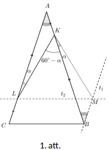

# <lo-sample/> LV.VOL.2026.10.1

Vai eksistē kvadrāttrinoms $ax^2+bx+c$, kur $a, b, c$ ir veseli nepāra skaitļi un $\frac{1}{2026}$ ir viena no tā saknēm?

## Atrisinājums.

Nē, jo, ievietojot $\frac{1}{2026}$ vienādojumā, iegūst

$$
a\left(\frac{1}{2026}\right)^2+b\cdot \frac{1}{2026}+c=0 \quad |\cdot 2026^2
$$

$$
2026^2c+2026b+a=0.
$$

Tā kā pirmie divi saskaitāmie ir pāra skaitļi neatkarīgi no $b$ un $c$ paritātes, tad, lai summa iegūtu $0$ (pāra skaitli), arī $a$ jābūt pāra skaitlim, kas ir pretrunā ar doto.

# <lo-sample/> LV.VOL.2026.10.2

Ar $d(a)$ apzīmēsim naturāla skaitļa $a$ dalītāju skaitu no $1$ līdz $a$ ieskaitot. Naturālu skaitli $n>1$ sauksim par *stilīgu*, ja tam izpildās šādas divas īpašības:

- $d(n)$ ir nepāra skaitlis;
- $d(k)\leq d(l)$ visiem $k<l$, kas abi ir skaitļa $n$ dalītāji.

Pierādi, ka skaitlis ir stilīgs tad un tikai tad, ja tas izsakāms formā $p^{2m}$, kur $m$ ir naturāls skaitlis un $p$ ir pirmskaitlis!

## Atrisinājums.

Vispirms pierādīsim, ka $d(n)$ ir nepāra tikai naturālu skaitļu kvadrātiem. Aplūkosim naturālu skaitli $n$. Ievērosim, ka, ja skaitlis $l$ ir skaitļa $n$ dalītājs, tad skaitlis $\frac{n}{l}$ arī ir dalītājs. Tas nozīmē, ka visus skaitļa $n$ dalītājus var sadalīt pāros $\left(l,\frac{n}{l}\right)$, līdz ar to skaitļa $n$ dalītāju skaits (tas ir, skaitlis $d(n)$) ir pāra skaitlis, izņemot gadījumu $n=k^2$, jo tādā gadījumā $k$ un $\frac{k^2}{k}$ sakrīt. Secinām, ka $d(n)$ ir pāra skaitlis visiem skaitļiem, izņemot, ja $n$ ir naturāla skaitļa kvadrāts (jeb pāra pakāpe), kas arī bija jāpierāda.

Pierādīsim, ka tādu skaitļu pāra pakāpes, kuru pirmreizinātāju vidū ir vairāk nekā viens pirmskaitlis, neder. Pieņemsim, ka dota tāda naturāla skaitļa, kas satur pirmreizinātājus $p_1<p_2$, pāra pakāpe. Tad šīs pakāpes dalītāju vidū ir skaitļi $p_1^2<p_1p_2<p_2^2$. Tā kā tie ir pirmskaitļi, tad $d(p_2)=3$, jo $p_2^2$ dalās tikai ar $1, p_2, p_2^2$, bet $d(p_1p_2)=4$, jo $p_1p_2$ dalās ar $1, p_1, p_2$ un $p_1p_2$. Iegūta pretruna, jo $p_1p_2<p_2^2$, bet $d(p_1p_2)>d(p_2^2)$.

Visbeidzot pamatosim, ka skaitļiem, kas ir viena pirmskaitļa pāra pakāpes, izpildās prasītais. Tad varam izteikt $n=p^{2m}$, kur $m\in\mathbb{N}$. Tas nozīmē, ka skaitļa $n$ dalītāju vidū ir $1,p,p^2,p^3,\ldots,p^{2m}$. Tā kā $p$ - pirmskaitlis, tad skaidrs, ka katra nākamā pakāpe ir lielāka par iepriekšējo, un tās dalītāju skaits palielinās par $1$, tāpēc uzdevuma nosacījumi izpildīsies.

# <lo-sample/> LV.VOL.2026.10.3

Dots trijstūris $ABC$. Punkts $O$ ir trijstūrim $ABC$ apvilktās riņķa līnijas centrs. 
Perpendikuls, kas vilkts no punkta $B$ pret $AO$, krusto malu $AC$ punktā $M$. 
Perpendikuls, kas vilkts no punkta $C$ pret $AO$, krusto taisni $AB$ punktā $N$. 
Pierādīt, ka $BC^2=BM\cdot CN$.

## Atrisinājums.

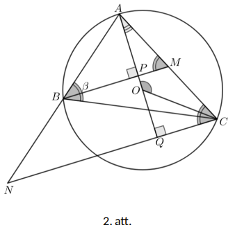

Apzīmēsim $\angle ABC=\beta$ (skat. 2. att.). Tad $\angle AOC=2\beta$ kā centra leņķis 
trijstūrim $ABC$ apvilktajā riņķa līnijā. Tā kā $AO=OC$, tad 
$\angle OAC=\angle OCA=\frac{180^\circ-2\beta}{2}=90^\circ-\beta$. Aplūkojot trijstūra $AQC$ 
iekšējo leņķu summu, iegūst $\angle ACN=\beta$. Aplūkojot trijstūra $APM$ iekšējo leņķu 
summu, $\angle AMB=\beta$. Tad $\triangle ABM\sim \triangle ACB$, jo 
$\angle AMB=\angle ABC=\beta$ un $\angle BAC$- kopīgs leņķis. No tā izriet, ka 
$\frac{BM}{BC}=\frac{AB}{AC}$. Tāpat $\triangle ACN\sim \triangle ABC$, 
jo $\angle BAC$- kopīgs leņķis un $\angle ACN=\angle ABC=\beta$. 
No tā izriet, ka $\frac{CN}{BC}=\frac{AC}{AB}$. Tā kā

$$\left.\begin{array}{ccc}
\dfrac{BM}{BC} & = & \dfrac{AB}{AC} \\ \dfrac{CN}{BC} & = & \dfrac{AC}{AB} \\
\end{array} \right\} \Rightarrow BM\cdot CN=BC^2\cdot \frac{AB}{AC}\cdot \frac{AC}{AB}=BC^2.$$

# <lo-sample/> LV.VOL.2026.10.4

Uz $6 \times 6$ šaha galdiņa katra lauciņa sākumā atrodas pa tornim. Katrā gājienā drīkst noņemt no galdiņa jebkuru vienu torni, kas apdraud nepāra skaitu citu torņu (torņi apdraud viens otru, ja tie atrodas vienā rindā vai vienā kolonnā un starp tiem nav citu torņu). Kāds ir lielākais torņu skaits, ko var noņemt?

## Atrisinājums.

Atbilde ir $31$.

Vispirms pierādīsim, ka noteikti vismaz $5$ torņi paliks nenoņemti. Acīmredzami, ka torņi, kas ir stūros, paliks nenoņemti, jo jebkurā brīdī stūros esošie torņi apdraud tieši $2$ torņus. Brīdī, kad uz šaha galdiņa palikuši $5$ torņi, aplūkosim torni, kas nav viens no stūros esošajiem torņiem. Ja šis tornis atrodas pirmajā rindā, pēdējā rindā, pirmajā kolonnā vai pēdējā kolonnā, tad tas apdraud tieši $2$ citus torņus, pretējā gadījumā šis tornis apdraud $0$ citus torņus. Secinām, ka šo torni mēs noņemt nevarēsim, tāpēc vismaz $5$ torņi paliks nenoņemti. Līdz ar to noņemt mēs varēsim ne vairāk kā $36-5=31$ torni.

Konstrukcija, kā noņemt $31$ torni, ir šāda. Zemāk redzamajā tabulā katrā rūtiņā ierakstītais skaitlis attēlo gājiena numuru, kurā no attiecīgās rūtiņas tika noņemts tornis.

$$
\begin{array}{c|cccccc}
 & 1 & 2 & 3 & 4 & 5 & 6\\
\hline
1 & X & 1 & 26 & 24 & 21 & X\\
2 & 3 & 2 & 23 & 25 & 22 & 20\\
3 & 4 & 27 & 30 & 29 & 18 & 19\\
4 & 5 & 8 & 31 & 28 & 17 & X\\
5 & 6 & 7 & 16 & 14 & 13 & 15\\
6 & X & 9 & 10 & 11 & 12 & X
\end{array}
$$

Uzdevumam pastāv arī alternatīvās konstrukcijas, kas ļauj panākt $31$ noņemtu torni.

# <lo-sample/> LV.VOL.2026.10.5

Doti pozitīvi reāli skaitļi $x, y, z$ ar īpašību, ka jebkuru divu šo skaitļu starpība ir mazāka nekā $2$. Pierādīt, ka

$$
\sqrt{xy+1}+\sqrt{yz+1}+\sqrt{zx+1}>x+y+z.
$$

## Atrisinājums.

Ievērosim, ka, ja mēs pierādītu, ka $\sqrt{xy+1}>\frac{x+y}{2}$, $\sqrt{yz+1}>\frac{y+z}{2}$ un $\sqrt{zx+1}>\frac{z+x}{2}$, tad, saskaitot šīs $3$ nevienādības kopā, mēs iegūtu, ka

$$
\sqrt{xy+1}+\sqrt{yz+1}+\sqrt{zx+1}>
\frac{x+y}{2}+\frac{y+z}{2}+\frac{z+x}{2}=x+y+z,
$$

kas ir mūsu pierādāmā nevienādība.

Pierādīsim, ka $\sqrt{xy+1}>\frac{x+y}{2}$ (pārējās divas nevienādības pierāda analogi). Veicot ekvivalentus pārveidojumus, varam iegūt, ka

$$
\sqrt{xy+1}>\frac{x+y}{2}
$$

$$
xy+1>\frac{(x+y)^2}{4}
$$

$$
4xy+4>(x+y)^2=x^2+2xy+y^2
$$

$$
4>x^2-2xy+y^2=(x-y)^2.
$$

Pēdējā nevienādība ir patiesa, jo pēc uzdevuma nosacījumiem $2>|x-y|$, kas nozīmē, ka $4>(x-y)^2$. Analoģiski varam pierādīt, ka $\sqrt{yz+1}>\frac{y+z}{2}$ un $\sqrt{zx+1}>\frac{z+x}{2}$, kas atrisina uzdevumu.

# <lo-sample/> LV.VOL.2026.11.1

Doti pozitīvi reāli skaitļi $a, b$. Zināms, ka $2026$ skaitļu $\frac{a+1}{b+1}, \frac{a+2}{b+2}, \ldots, \frac{a+2026}{b+2026}$ summa ir vienāda ar $2026$. Ar ko ir vienāds šo $2026$ skaitļu reizinājums?

## Atrisinājums.

Doto $2026$ skaitļu reizinājums ir vienāds ar $1$.

Ievērosim, ka

$$
\frac{a+1}{b+1}+\frac{a+2}{b+2}+\ldots+\frac{a+2026}{b+2026}=2026
$$

$$
\left(\frac{a+1}{b+1}-1\right)+\left(\frac{a+2}{b+2}-1\right)+\ldots+\left(\frac{a+2026}{b+2026}-1\right)=0
$$

$$
\frac{a-b}{b+1}+\frac{a-b}{b+2}+\ldots+\frac{a-b}{b+2026}=0
$$

$$
(a-b)\cdot\left(\frac{1}{b+1}+\frac{1}{b+2}+\ldots+\frac{1}{b+2026}\right)=0.
$$

Tā kā $\frac{1}{b+1}+\frac{1}{b+2}+\ldots+\frac{1}{b+2026}\neq 0$, jo $b$ ir pozitīvs skaitlis, tad secinām, ka $a-b=0$, kas nozīmē, ka $a=b$. Tādā gadījumā

$$
\frac{a+1}{b+1}=\frac{a+2}{b+2}=\ldots=\frac{a+2026}{b+2026}=1,
$$

kas nozīmē, ka doto $2026$ skaitļu reizinājums ir vienāds ar $1$.

# <lo-sample/> LV.VOL.2026.11.2

Reālu skaitļu trijnieku $x, y, z$ sauksim par *triādi*, ja $x+y+z=1$.

**(A)** Atrast lielāko konstanti $C$ ar īpašību, ka jebkurai triādei $\max(x^2+y, y^2+z, z^2+x)\geq C$.

**(B)** Pierādīt, ka neeksistē tāda konstante $C$, ka jebkurai triādei $\min(x^2+y, y^2+z, z^2+x)\leq C$.

## Atrisinājums.

**(A)** Lielākā iespējamā $C$ vērtība ir $C=\frac{4}{9}$.

Ja $x=y=z=\frac{1}{3}$, tad $x+y+z=1$ un $x^2+y=y^2+z=z^2+x=\frac{4}{9}$, kas nozīmē, ka $\frac{4}{9}\geq C$. Tagad pierādīsim, ka jebkurai triādei izpildās, ka

$$
\max(x^2+y, y^2+z, z^2+x)\geq \frac{4}{9}.
$$

Ievērosim, ka visiem reāliem skaitļiem $a,b,c$ izpildās, ka $\max(a,b,c)\geq \frac{a+b+c}{3}$, tāpēc, ja mēs pierādītu, ka

$$
\frac{(x^2+y)+(y^2+z)+(z^2+x)}{3}\geq \frac{4}{9}
$$

$$
x^2+y^2+z^2+x+y+z\geq \frac{4}{3}
$$

$$
x^2+y^2+z^2+1\geq \frac{4}{3}
$$

$$
x^2+y^2+z^2\geq \frac{1}{3},
$$

tad prasītais būtu pierādīts. Taču, izmantojot to, ka $x+y+z=1$, varam iegūt, ka

$$
x^2+y^2+z^2\geq \frac{1}{3}
$$

$$
3(x^2+y^2+z^2)\geq 1
$$

$$
3(x^2+y^2+z^2)\geq (x+y+z)^2
$$

$$
3(x^2+y^2+z^2)\geq x^2+y^2+z^2+2xy+2yz+2zx
$$

$$
2x^2+2y^2+2z^2-2xy-2yz-2zx\geq 0
$$

$$
(x-y)^2+(y-z)^2+(z-x)^2\geq 0.
$$

Pēdējā nevienādība ir patiesa, jo reālu skaitļu kvadrātu summa ir nenegatīvs lielums. Tā kā šī nevienādība tika iegūta, ekvivalenti pārveidojot sākotnējo nevienādību, tad arī sākotnējā nevienādība ir patiesa.

**(B)** Tagad pierādīsim, ka neeksistē tāda konstante, ka $\min(x^2+y, y^2+z, z^2+x)\leq C$. Aplūkosim skaitļus $x=0$, $y=t$, $z=1-t$, kur $t$ ir reāls skaitlis. Tad

$$
\min(x^2+y, y^2+z, z^2+x)=\min(t, t^2-t+1, 1-2t+t^2)
$$

Ievērosim, ka jebkurai $t>3$ vērtībai izpildās, ka $t^2-t+1>t$, jo tas ir ekvivalenti ar $(t-1)^2>0$, un $t^2-2t+1>t$, jo tas ir ekvivalenti ar $t(t-3)+1>0$. Līdz ar to

$$
\min(x^2+y, y^2+z, z^2+x)=\min(t, t^2-t+1, 1-2t+t^2)=t
$$

Taču, tā kā mēs skaitli $t$ varam izvēlēties pēc patikas lielu, tad neeksistē tāda konstante $C$, ka $t\leq C$, kas arī bija jāpierāda.

# <lo-sample/> LV.VOL.2026.11.3

Dots riņķa līnijā ievilkts četrstūris $ABCD$, kuram $BC<AD$. Punkts $E$ ir taisņu $AB$ un $CD$ krustpunkts. Punkti $K$ un $L$ ir izvēlēti attiecīgi uz malām $CD$ un $AB$ ar īpašību, ka $\angle KAD=\angle KBC$ un $\angle LDA=\angle LCB$. Pierādīt, ka $EK=EL$.

## Atrisinājums.

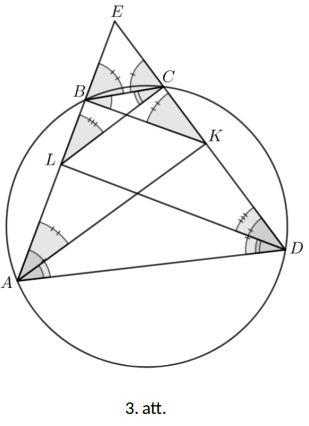

Ievērosim, ka, tā kā ap četrstūri $ABCD$ var apvilkt riņķa līniju, tad $\angle BAD=\angle BCE$ un $\angle CDA=\angle CBE$. Ievērosim, ka

$$
\angle EAK=\angle BAD-\angle KAD=\angle BCE-\angle KBC=\angle BKE,
$$

$$
\angle EDL=\angle CDA-\angle LDA=\angle EBC-\angle LCB=\angle ELC,
$$

kur mēs izmantojam to, ka $\angle BCE$ ir trijstūra $BCK$ ārējais leņķis un $\angle EBC$ ir trijstūra $KBC$ ārējais leņķis.

Tā kā $\angle EAK=\angle BKE$, tad $\triangle EBK\sim \triangle EKA$ pēc pazīmes $\ell\ell$, un, tā kā $\angle EDL=\angle ELC$, tad $\triangle ELC\sim \triangle EDL$ pēc pazīmes $\ell\ell$. Līdz ar to

$$
\frac{EL}{EC}=\frac{ED}{EL}\Rightarrow EL^2=ED\cdot EC
$$

$$
\frac{EK}{EB}=\frac{EA}{EK}\Rightarrow EK^2=EB\cdot EA.
$$

Līdz ar to, tā kā $\angle BAD=\angle BCE$ un $\angle CDA=\angle CBE$, tad $\triangle EBC\sim \triangle EDA$ pēc pazīmes $\ell\ell$, kas nozīmē, ka

$$
\frac{EB}{ED}=\frac{EC}{EA}\Rightarrow EB\cdot EA=EC\cdot ED.
$$

Secinām, ka

$$
EL^2=ED\cdot EC=EB\cdot EA=EK^2\Rightarrow EL=EK,
$$

kas arī bija jāpierāda.

# <lo-sample/> LV.VOL.2026.11.4

Atrast visus naturālo skaitļu trijniekus $a,b,c$, kuriem eksistē tādi naturāli skaitļi $x,y,z$, ka $ab+1=x!$, $bc+1=y!$ un $ca+1=z!$.

Piezīme. Ar $n!$ apzīmē skaitļa $n$ faktoriālu – pirmo $n$ naturālo skaitļu reizinājumu, piemēram, $5!=5\cdot 4\cdot 3\cdot 2\cdot 1=120$.

## Atrisinājums.

Nezaudējot vispārīgumu, pieņemsim, ka $a\leq b\leq c$. Tādā gadījumā $ab\leq ac\leq bc$ un

$$
ab+1\leq ac+1\leq cb+1\Rightarrow x\leq z\leq y.
$$

Tā kā $z!\vdots x!$ un $y!\vdots x!$, jo $x\leq z$ un $x\leq y$, tad secinām, ka $(ca+1)\vdots (ab+1)$ un $(bc+1)\vdots (ab+1)$. Pamanīsim, ka

$$
a(c-b)=((ca+1)-(ab+1))\vdots (ab+1)
$$

$$
b(c-a)=((bc+1)-(ab+1))\vdots (ab+1).
$$

Ievērosim, ka $\text{LKD}(ab+1,a)=\text{LKD}(bc+1,b)=1$, līdz ar to $(c-b)\vdots (ab+1)$ un $(c-a)\vdots (ab+1)$. Tas nozīmē, ka

$$
(c-a)-(c-b)=(b-a)\vdots (ab+1).
$$

Lai šī dalāmība izpildītos, ir jābūt patiesai nevienādībai $ab+1\leq b-a$, taču ievērosim, ka $b-a<b\leq ba<ba+1$, tāpēc dalāmība var izpildīties tad un tikai tad, ja $a-b=0$ jeb $a=b=t$, kur $t$ ir kaut kāds naturāls skaitlis. Ievērosim, ka tādā gadījumā $t^2+1=x!$. Ja $x\geq 3$, tad $x!$ dalās ar $3$, kas nozīmē, ka $(t^2+1)\vdots 3$. Taču $t^2$ dod atlikumus $0$ vai $1$, dalot ar $3$, tāpēc $(t^2+1)\nvdots 3$. Secinām, ka $x=1$ vai $x=2$. Acīmredzami, ka $x=1$ nav iespējams, tāpēc $x=2$, kas nozīmē, ka $a=b=1$. Tādā gadījumā $c+1=y!$, kas nozīmē, ka $c=y!-1$. Secinām, ka visi iespējamie atrisinājumi ir $(t!-1,1,1)$, $(1,t!-1,1)$ un $(1,1,t!-1)$.

# <lo-sample/> LV.VOL.2026.11.5

Alberts ir pierakstījis virkni $a_1, a_2, \ldots, a_{2026}$, kurā katrs no skaitļiem $1, 2, \ldots, 2026$ parādās tieši vienu reizi. Kristīne vēlas noteikt šo virkni, veicot vairākus gājienus, pēc kuriem Alberts viņai sniedz informāciju. Vienā gājienā Kristīne uz lapas uzraksta skaitļus no $1$ līdz $2026$ un dažus no tiem savieno ar līnijām tā, ka katrs skaitlis ir savienots ar ne vairāk kā vienu citu skaitli. Pēc tam viņa iedod šo lapu Albertam. Tad Alberts uz citas lapas uzraksta skaitļus no $1$ līdz $2026$ un katram skaitļu pārim $i$ un $j$, kurus Kristīne savienoja ar līniju, viņš savieno ar līniju skaitļus $a_i$ un $a_j$. Beigās viņš iedod šo lapu Kristīnei. Kāds ir mazākais gājienu skaits, kas nepieciešams, lai Kristīne varētu noteikt Alberta sākotnējo virkni?

## Atrisinājums.

Atbilde ir $n=2$.

Pēc viena gājiena Kristīne nekādi nevar ar pārliecību noteikt Alberta virkni. Proti, ja uz Alberta lapas ir savienoti skaitļi $a_i$ un $a_j$, tad Kristīne nevar zināt, kurš no tiem ir $a_i$ un kurš ir $a_j$.

Pierādīsim, ka Kristīne vienmēr var ar pārliecību noteikt Alberta virkni pēc diviem gājieniem, tāpēc minimālais nepieciešamais gājienu skaits ir tieši $2$. Pirmajā gājienā Kristīne savieno pārus $3$-$4$, $5$-$6$, ..., $2025$-$2026$. Otrajā gājienā Kristīne savieno pārus $2$-$3$, $4$-$5$, ..., $2024$-$2025$.

Pamatosim, ka pēc šiem diviem gājieniem Kristīne zina skaitļus $a_1, a_2$ un $a_{2026}$. Patiešām, skaitlis $a_1$ ir vienīgais, kas nebija savienots ar nevienu citu skaitli ne pirmajā, ne otrajā gājienā. Skaitlis $a_2$ ir vienīgais, kas tika savienots ar kādu citu skaitli tikai otrajā gājienā, bet skaitlis $a_{2026}$ ir vienīgais, kas tika savienots ar kādu citu skaitli tikai pirmajā gājienā.

Tālāk Kristīne zina arī $a_3$, jo pēc otrā gājiena šis skaitlis ir savienots ar $a_2$. Savukārt skaitlis $a_4$ pirmajā gājienā bija savienots ar $a_3$, tāpēc Kristīne zina arī $a_4$. Turpinot šādi spriest, Kristīne nosaka visus pārējos skaitļus no $a_1$ līdz $a_n$; $(n+1)$-ajā solī viņa nosaka $a_{n+1}$, jo šis skaitlis tieši vienā no apmaiņām bija savienots ar $a_n$, un, atkarībā no skaitļa $n$ paritātes, viņa zina arī, kurā no apmaiņām tas notika.

# <lo-sample/> LV.VOL.2026.12.1

Kāda trijstūra leņķi ir $\alpha$, $\beta$ un $\gamma$. Zināms, ka $\alpha < \beta < \gamma$ un

$$
\sin^2 \alpha + \sin^2 \beta = \cos^2 \alpha + \cos^2 \beta.
$$

Pierādīt, ka $\gamma = 90^\circ$.

<small>

* questionType:
* domain:

</small>

## Atrisinājums

**1. atrisinājums.** Tā kā trijstūra leņķu summa ir $180^\circ$, tad mums pietiek pierādīt, ka $\alpha+\beta = 90^\circ$. Skaidrs, ka leņķi $\alpha$ un $\beta$ ir šauri, apzīmēsim $\varphi = 90^\circ - \beta$ un ievērosim, ka arī $\varphi$ ir šaurs. Tādā gadījumā mums jāpierāda, ka $\alpha = \varphi$. Ievietojot dotajā vienādojumā $\beta = 90^\circ - \varphi$ un izmantojot to, ka $\sin (90^\circ - \varphi) = \cos \varphi$ un $\cos (90^\circ - \varphi) = \sin \varphi$, iegūstam, ka

$$
\sin^2 \alpha + \cos^2 \varphi = \cos^2 \alpha + \sin^2 \varphi.
$$

Tālāk ievietojot $\cos^2 \alpha = 1 - \sin^2 \alpha$ un $\cos^2 \varphi = 1 - \sin^2 \varphi$, iegūstam, ka

$$
\sin^2 \alpha + 1 - \sin^2 \varphi = 1 - \sin^2 \alpha + \sin^2 \varphi,
$$

ko vienkāršojot iegūstam, ka $\sin^2 \alpha = \sin^2 \varphi$. Tā kā $\alpha$ un $\varphi$ ir šauri leņķi, tad to sinusi ir pozitīvi, tātad $\sin \alpha = \sin \varphi$.
Tā kā sinuss ir augoša funkcija intervālā $[0,90^\circ]$, tad varam secināt, ka $\alpha = \varphi$, kas arī bija vajadzīgs.

**2. atrisinājums.** Pamanīsim, ka $\alpha$ un $\beta$ ir šauri leņķi (citādi trijstūra leņķu summa pārsniegtu $180^\circ$, jo $\gamma \geq \beta$). Pārveidosim doto izteiksmi:

$$
(\cos^2 \alpha - \sin^2 \alpha) + (\cos^2 \beta - \sin^2 \beta) = 0
$$

$$
\cos 2\alpha + \cos 2\beta = 0
$$

$$
2 \cos \frac{2\alpha - 2\beta}{2} \cos \frac{2\alpha + 2\beta}{2} = 0
$$

$$
\cos(\alpha - \beta)\cos(\alpha + \beta) = 0
$$

Ievērosim, ka, tā kā $\alpha$ un $\beta$ ir šauri, tad $|\alpha - \beta| < 90^\circ$, tātad $\cos(\alpha - \beta) \neq 0$. Tas nozīmē, ka $\cos(\alpha + \beta) = 0$, tātad $\alpha + \beta = 90^\circ + 180^\circ n$, kur $n \in \mathbb{Z}$. Tā kā $\alpha$ un $\beta$ ir šauri, mums der tikai $\alpha + \beta = 90^\circ$, taču no trijstūra leņķu summas izriet, ka $90^\circ = \alpha + \beta = 180^\circ - \gamma$, tātad $\gamma = 90^\circ$, kas arī bija jāpierāda.

# <lo-sample/> LV.VOL.2026.12.2

Doti reāli skaitļi $a_1, a_2, \ldots, a_{104}$, kuriem izpildās

$$a_1 + a_2 \cdot a_3 \cdot \ldots \cdot a_{104} = a_2 + a_3 \cdot \ldots \cdot a_{104} \cdot a_1 = \ldots =$$

$$= a_{104} + a_1 \cdot a_2 \cdot \ldots \cdot a_{103} = 2026.$$

Pierādīt, ka starp skaitļiem $a_1, a_2, \ldots, a_{104}$ ir vismaz $52$ vienādi.

<small>

* questionType:
* domain:

</small>

## Atrisinājums

Ar $P$ apzīmēsim $a_1 a_2 \cdot \ldots \cdot a_{104}$. Ievērosim, ka no uzdevuma nosacījumiem izriet, ka $a_i^2 + P = 2026a_i$ katram $1 \leq i \leq 104$. Tas nozīmē, ka skaitļi $a_1, a_2, \ldots, a_{104}$ ir vienādojuma $x^2 - 2026x + P = 0$ saknes. Taču kvadrātvienādojumam ir ne vairāk kā $2$ dažādas saknes, tāpēc pēc Dirihlē principa starp skaitļiem $a_1, a_2, \ldots, a_{104}$ vismaz $104 \div 2 = 52$ ir vienādi.

# <lo-sample/> LV.VOL.2026.12.3

Riņķa līnijā $\omega$, kuras centrs ir punkts $O$, ir ievilkts piecstūris $ABCDE$ tā, ka taisnes $AE$ un $BD$ ir paralēlas. Uz diagonālēm $AC$ un $CE$ ir attiecīgi izvēlēti punkti $X$ un $Y$ ar īpašību, ka

$$\angle ABX = \angle CBD \quad \text{un} \quad \angle EDY = \angle CDB$$

Pierādīt, ka ap trijstūriem $DYO$ un $BXO$ apvilktās riņķa līnijas vēlreiz krustojas punktā, kas atrodas uz $\omega$.

<small>

* questionType:
* domain:

</small>

## Atrisinājums

Tā kā $AE \parallel BD$, tad $ABDE$ ir vienādsānu trapece, tāpēc $AB = DE$. 
Ievērosim, ka $\angle BAX = \angle BDC = \angle EDY = \alpha$ un 
$\angle ABX = \angle DBC = \angle DEY = \beta$, kur mēs izmantojām to, 
ka leņķi, kas balstās uz vienu un to pašu loku, ir vienādi. Secinām, ka 
$\triangle ABX = \triangle DEY$ pēc pazīmes $\ell m \ell$. Tādā gadījumā 
$BX = YE$ kā vienādos trijstūros atbilstošie elementi.

Ievērosim, ka $OB = OA = OE = OD$ kā rādiusi un $\angle BOA = \angle EOD$, 
jo loki $AB$ un $DE$ ir vienādi, kas nozīmē, ka 
$\angle OBA = \angle OAB = \angle OED = \angle ODE$. Tādā gadījumā

$$\angle XBO = \angle OBA - \angle ABX = \angle OED - \angle YED = \angle YEO.$$

Secinām, ka $\triangle XBO = \triangle YEO$ pēc pazīmes $m\ell m$. 
Tādā gadījumā $\angle BXO = \angle OYE$ kā vienādos trijstūros atbilstošie elementi.

Pieņemsim, ka trijstūra $BXO$ apvilktā riņķa līnija krusto $\omega$ punktā $T$. 
Ievērosim, ka $\angle BTO = 180^\circ - \angle BXO = 180^\circ - \angle OYE = \angle OYC$. 
Pieņemsim, ka taisnes $CE$ un $BT$ krustojas punktā $Z$. Tādā gadījumā esam 
ieguvuši, ka $\angle ZTO = \angle OYZ$, kas nozīmē, ka ap četrstūri $OYTZ$ 
var apvilkt riņķa līniju.

Ievērosim, ka $\angle ZYD = \angle YDE + \angle YED = \alpha + \beta$ kā trijstūra $YDE$ ārējais leņķis. Atzīmēsim arī to, ka

$$\angle BCD = 180^\circ - \angle DBC - \angle CDB = 180^\circ - \beta - \alpha = \angle BTD$$

kā leņķi, kas balstās uz vienu un to pašu loku. Secinām, ka $\angle BTD + \angle ZYD = 180^\circ$, kas nozīmē, ka ap četrstūri $ZTYD$ var apvilkt riņķa līniju. Esam ieguvuši, ka četrstūri $OYTZ$ un $ZTYD$ ir ievilkti. Tādā gadījumā punkti $O$ un $D$ pieder trijstūrim $ZTY$ apvilktai riņķa līnijai, tāpēc visi pieci punkti $Z,T,Y,O,D$ atrodas uz vienas riņķa līnijas. Secinām, ka ap četrstūri $OYDT$ var apvilkt riņķa līniju, kas atrisina uzdevumu.

# <lo-sample/> LV.VOL.2026.12.4

Dota $10 \times 10$ rūtiņu tabula, katrā tās rūtiņā ir ierakstīts kāds vesels skaitlis (starp tiem var gadīties arī vienādi). Sauksim rūtiņu par **labu**, ja visu skaitļu summa kolonnā, kurā atrodas šī rūtiņa, nepārsniedz visu skaitļu summu rindā, kurā atrodas šī rūtiņa. Atrodiet mazāko iespējamo labo rūtiņu skaitu šādā tabulā.

<small>

* questionType:
* domain:

</small>

## Atrisinājums

Mazākais iespējamais labo rūtiņu skaits ir $10$. Piemēram, pirmajā rindā visās rūtiņās ieraksta $1$, bet visās pārējās rindās visās rūtiņās ieraksta $0$ (skat. 5. att. (a)). Tad pirmās rindas summa ir $10$, bet katras kolonnas summa ir $1$, tāpēc visas pirmās rindas rūtiņas ir labas (to ir $10$), bet visas pārējās nav labas; tātad var panākt tieši $10$ labas rūtiņas.

Tagad pierādīsim, ka mazāk par $10$ labām rūtiņām nevar būt. Sadalām tabulas rūtiņas $10$ grupās pa $10$ rūtiņām tā, lai katrā grupā rūtiņas atrastos dažādās rindās un dažādās kolonnās (piemēram, ņemot cikliskās diagonāles, kā redzams 5. att. (b)). Pieņemsim, ka kādā grupā visas rūtiņas nav labas; tad katrai rūtiņai šajā grupā tās rindas summa ir mazāka nekā tās kolonnas summa. Saskaitot šīs nevienādības pa visām grupas rūtiņām, iegūstam, ka visu tabulas skaitļu summa, saskaitīta pa rindām, ir mazāka nekā tā pati summa, saskaitīta pa kolonnām, kas nav iespējams. Tātad katrā grupā ir vismaz viena laba rūtiņa, un labo rūtiņu skaits ir vismaz $10$.

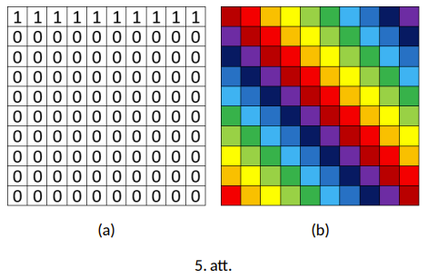

# <lo-sample/> LV.VOL.2026.12.5

Naturālu skaitļu kopu $S$ sauksim par **latvisku**, ja tai izpildās šādas divas īpašības:

- katriem diviem dažādiem kopas $S$ elementiem $a,b$ piemīt īpašība, ka $a^2 + 1$ dalās ar $b$ un $b^2 + 1$ dalās ar $a$;
- katrs kopas $S$ elements ir lielāks nekā $2026$.

Atrast visus naturālos skaitļus $n \geq 2$, kuriem eksistē latviska naturālu skaitļu kopa, kas sastāv tieši no $n$ dažādiem elementiem.

<small>

* questionType:
* domain:

</small>

## Atrisinājums

Atbilde ir $n = 2$.

Pieņemsim, ka eksistē latviska skaitļu kopa, kas sastāv no $n \geq 3$ elementiem. Aplūkosim $3$ šīs kopas lielākos elementus $a < b < c$. No uzdevuma nosacījumiem izriet, ka $(a^2 + 1): b$ un $(a^2 + 1): c$. Ja skaitļiem $b,c$ ir kopīgs dalītājs $d$, tad tā kā $(b^2 + 1):c$ no uzdevuma nosacījumiem un $d$ dala gan $c$, gan $b^2$, tad tam ir jādala $1$. Secinām, ka $b,c$ ir savstarpēji pirmskaitļi, līdz ar to $(a^2 + 1):bc$. Taču ievērosim, ka $a^2 + 1 < bc$, tāpēc dalāmība nevar izpildīties.

Tagad pierādīsim, ka eksistē latviska skaitļu kopa, kas sastāv no $2$ elementiem. Vajag atrast naturālu skaitļu pārus $x,y > 2026$, kuriem izpildās, ka $(y^2 + 1):x$ un $(x^2 + 1):y$. Ievērosim, ka, ja mēs atradīsim skaitļu pārus, kuriem izpildās $x^2 + y^2 + 1 = 3xy$, tad

$$
(x^2 + y^2 + 1):x \Longrightarrow (y^2 + 1):x
$$

$$
(x^2 + y^2 + 1):y \Longrightarrow (x^2 + 1):y.
$$

Pierādīsim, ka, ja $(x_0,y_0)$ ir vienādojuma $x^2 + y^2 + 1 = 3xy$ atrisinājums, tad arī $(y_0,3y_0 - x_0)$ ir atrisinājums. Patiešām

$$
y_0^2 + (3y_0 - x_0)^2 + 1 = 3y_0(3y_0 - x_0)
$$

$$
y_0^2 + 9y_0^2 - 6x_0y_0 + x_0^2 + 1 = 9y_0^2 - 3x_0y_0
$$

$$
x_0^2 + y_0^2 + 1 = 3x_0y_0.
$$

Pēdējā sakarība ir patiesa, jo pēc pieņēmuma $(x_0,y_0)$ ir vienādojuma $x^2 + y^2 + 1 = 3xy$ atrisinājums. Līdz ar to, tā kā $(1,1)$ ir vienādojuma $x^2 + y^2 + 1 = 3xy$ atrisinājums, tad varam iegūt šādu bezgalīgu atrisinājumu virkni:

$$
(1,1) \to (1,2) \to (2,5) \to (5,13) \to \ldots
$$

Redzam, ka, turpinot šo atrisinājumu virkni pietiekami ilgi, iegūsim atrisinājumu, kurā $x,y > 2026$, kas arī atrisina uzdevumu.

