# <lo-sample/> EE.PK.2006TEST.7.1

Aprēķini: $\frac{2006 \cdot 2007 - 2005 \cdot 2006}{1003} =$

<small>

* answer:$4$
* questionType:ShortAnswer

</small>

## Atrisinājums

$\frac{2006 \cdot 2007 - 2005 \cdot 2006}{1003} = \frac{2006 \cdot (2007 - 2005)}{1003} = 2 \cdot 2 = 4.$

# <lo-sample/> EE.PK.2006TEST.7.2

Sakārto dilstošā secībā skaitļiem $0,2$; $-0,02$ un $\frac{1}{4}$ pretējos skaitļus.

<small>

* answer:$0,02 > -0,2 > -\frac{1}{4}$
* questionType:ShortAnswer

</small>

## Atrisinājums

Šo skaitļu pretējie skaitļi ir $-0,2$; $0,02$ un $-\frac{1}{4} = -0,25$, jeb dilstošā secībā $0,02$; $-0,2$; $-0,25$.

# <lo-sample/> EE.PK.2006TEST.7.3

Trīsciparu skaitļa visi cipari ir dažādi, un vienu cipars ir vienāds ar desmitu un simtu ciparu summu. Atrodi lielāko šādu skaitli.

<small>

* answer:$819$
* questionType:ShortAnswer

</small>

## Atrisinājums

Ja simtu cipars ir $9$, tad arī vienu cipars ir $9$, jo tas nevar būt lielāks par $9$. Šajā gadījumā skaitlī būtu vienādi cipari. Ja simtu cipars ir $8$, tad desmitu cipars var būt ne vairāk kā $1$. Vienu cipars šajā gadījumā ir $9$, tas nesakrīt ar iepriekšējiem cipariem. Skaitlis ir $819$.

# <lo-sample/> EE.PK.2006TEST.7.4

Kādu daļu no pirmajiem desmit naturālajiem skaitļiem veido skaitļi, kas nav pirmskaitļi?

<small>

* answer:$\frac{3}{5}$
* questionType:ShortAnswer

</small>

## Atrisinājums

Pirmskaitļi starp pirmajiem desmit naturālajiem skaitļiem ir $2$, $3$, $5$ un $7$. Skaitļu, kas nav pirmskaitļi, tātad ir $10 - 4 = 6$, to daļa ir $\frac{6}{10}$ jeb $\frac{3}{5}$.

# <lo-sample/> EE.PK.2006TEST.7.5

Kādā dienā tīmekļa lapa tika skatīta $110$ reizes. Turklāt $7$ apmeklētāji to skatīja trīs reizes, $10$ apmeklētāji divas reizes, bet visi pārējie vienu reizi. Cik dažādu apmeklētāju skatīja tīmekļa lapu šajā dienā?

<small>

* answer:$86$
* questionType:ShortAnswer

</small>

## Atrisinājums

$7$ apmeklētāji, kas skatīja trīs reizes, kopā dod $7 \cdot 3 = 21$ skatījumu, un $10$ apmeklētāji, kas skatīja divas reizes, dod $10 \cdot 2 = 20$ skatījumu. Paliek $110 - 21 - 20 = 69$ apmeklētāji, kas skatīja vienu reizi. Dažādo apmeklētāju kopskaits ir $7 + 10 + 69 = 86$.

# <lo-sample/> EE.PK.2006TEST.7.6

Cik dažāda garuma nogriežņus var novilkt starp zīmējumā atzīmētajiem punktiem?

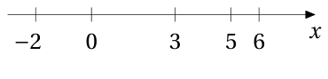

<small>

* answer:$7$
* questionType:ShortAnswer

</small>

## Atrisinājums

Nogriežņu garumi ir veseli skaitļi, mazākais ir $1$ (nogrieznis $[5;6]$), lielākais $8$ (nogrieznis $[-2;6]$). Pārstāvēti ir visi garumi, izņemot $4$. Tātad zīmējumā ir $7$ dažāda garuma nogriežņi.

# <lo-sample/> EE.PK.2006TEST.7.7

Trijstūra taisnas prizmas augstums ir $6$ cm un sānu virsmas laukums $72$ cm$^2$. Atrodi prizmas trešās pamata šķautnes garumu, ja divu pamata šķautņu garumi ir $3$ cm un $5$ cm.

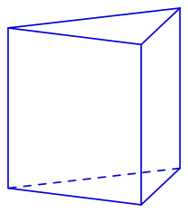

<small>

* answer:$4$ cm
* questionType:ShortAnswer

</small>

## Atrisinājums

Sānu virsmas laukums ir vienāds ar pamata perimetra un augstuma reizinājumu. Tātad pamata perimetrs ir $72 : 6 = 12$ cm. Trešās pamata šķautnes garums ir $12 - 3 - 5 = 4$ cm.

# <lo-sample/> EE.PK.2006TEST.7.8

No trijstūra $ABC$ virsotnes $A$ novilkts augstums $AD$. Zināms, ka $|AD| = |DB|$ un $\angle CAB = 114^\circ$. Atrodi leņķa $ACB$ lielumu.

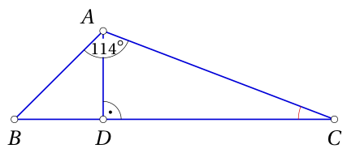

<small>

* answer:$21^\circ$
* questionType:ShortAnswer

</small>

## Atrisinājums

Trijstūris $ADB$ ir taisnleņķa un vienādsānu, tāpēc $\angle ABC = 45^\circ$. Tātad $\angle ACB = 180^\circ - 114^\circ - 45^\circ = 21^\circ$.

# <lo-sample/> EE.PK.2006TEST.7.9

Kvadrāta perimetrs ir $4$ cm. Riņķa rādiuss ir $1,2$ reizes lielāks par kvadrāta malas garumu. Atrodi riņķa līnijas garumu.

<small>

* answer:$2,4\pi$ cm
* questionType:ShortAnswer

</small>

## Atrisinājums

Kvadrāta malas garums ir $1$ cm, un riņķa rādiuss ir $1,2$ cm. Riņķa līnijas garums ir $2\pi \cdot 1,2 = 2,4\pi$ cm.

# <lo-sample/> EE.PK.2006TEST.7.10

Raiko vēlējās sadalīt kubu divās daļās un uzzīmēja uz kuba skaldnēm griezuma līnijas, kā parādīts pa kreisi. Pa labi attēlots šī kuba virsmas izklājums, uz kura saglabājusies tikai daļa no līnijām. Uzzīmē izklājumā visas trūkstošās griezuma līnijas.

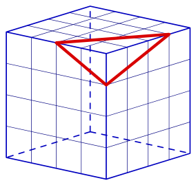

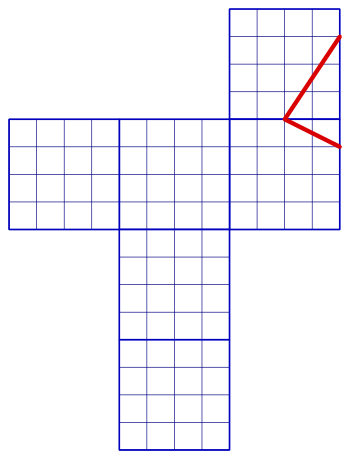

<small>

* answer:Sk. 1. zīmējumu.
* questionType:ShortAnswer

</small>

## Atrisinājums

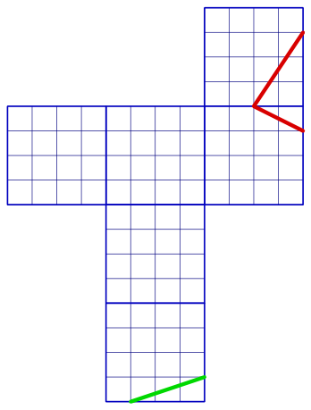

1. zīmējums

Jāatrod skaldne, kas pēc kuba salocīšanas kļūst par abu labās puses skaldņu kaimiņu. Šo triju skaldņu kopīgā virsotne ir tieši apakšējā kvadrāta apakšējā labā virsotne. Griezuma līnijas viens galapunkts atrodas no tās viena, bet otrs galapunkts trīs vienību attālumā (attiecīgi augšā un pa kreisi).

# <lo-sample/> EE.PK.2006TEST.8.1

Rindā uzraksta pāra skaitļus no 2 līdz 50 un starp tiem pārmaiņus liek zīmes − un +:

$$2 - 4 + 6 - 8 + 10 - \ldots + 50.$$

Atrodi izteiksmes vērtību.

<small>

* answer:26
* questionType:ShortAnswer

</small>

## Atrisinājums

Dotās izteiksmes vērtība ir $(2-4)+(6-8)+\ldots+(46-48)+50=(-2)\cdot 12+50=50-24=26.$

# <lo-sample/> EE.PK.2006TEST.8.2

Kādu daļu no pirmajiem divdesmit naturālajiem skaitļiem veido skaitļi, kas nav pirmskaitļi?

<small>

* answer:3/5
* questionType:ShortAnswer

</small>

## Atrisinājums

Pirmskaitļi starp pirmajiem divdesmit naturālajiem skaitļiem ir $2, 3, 5, 7, 11, 13, 17$ un $19$. Skaitļu, kas nav pirmskaitļi, tātad ir $20-8=12$, to daļa ir $\frac{12}{20}$ jeb $\frac{3}{5}$.

# <lo-sample/> EE.PK.2006TEST.8.3

Cik dažādus ciparus var likt skaitlī $5x8$ burta $x$ vietā, lai iegūtais trīsciparu skaitlis dalītos ar 6?

<small>

* answer:3
* questionType:ShortAnswer

</small>

## Atrisinājums

Tā kā skaitlis jebkurā gadījumā ir pāra skaitlis, vienīgais nosacījums ir, lai tas dalītos ar 3. Skaitļa ciparu summa ir $13+x$, tā dalās ar 3, ja $x=2, 5, 8$. Tas nozīmē, ka iespējamo ciparu ir 3.

# <lo-sample/> EE.PK.2006TEST.8.4

Kādā dienā tīmekļa lapa tika skatīta 149 reizes. Turklāt 3 apmeklētāji to skatīja četras reizes, 7 apmeklētāji trīs reizes, 10 apmeklētāji divas reizes, bet visi pārējie vienu reizi. Cik dažādu apmeklētāju skatīja tīmekļa lapu šajā dienā?

<small>

* answer:116
* questionType:ShortAnswer

</small>

## Atrisinājums

3 apmeklētāji, kas skatīja četras reizes, kopā dod $3\cdot 4=12$ skatījumus, 7 apmeklētāji, kas skatīja trīs reizes, dod $7\cdot 3=21$ skatījumu, un 10 apmeklētāji, kas skatīja divas reizes, dod $10\cdot 2=20$ skatījumu. Paliek $149-12-21-20=96$ apmeklētāji, kas skatīja vienu reizi. Dažādo apmeklētāju kopskaits ir $3+7+10+96=116$.

# <lo-sample/> EE.PK.2006TEST.8.5

Saldējuma cena veido $\frac{17}{20}$ no tā iepriekšējās cenas. Par cik procentiem saldējuma cena samazinājās?

<small>

* answer:15%
* questionType:ShortAnswer

</small>

## Atrisinājums

Cenas samazinājums salīdzinājumā ar sākotnējo ir $\frac{3}{20}$ jeb 15%.

# <lo-sample/> EE.PK.2006TEST.8.6

Taisnes $y=3x-2$ un $y=5x+3$ krusto $y$ asi attiecīgi punktos $A$ un $B$. Atrodi nogriežņa $AB$ garumu.

<small>

* answer:5
* questionType:ShortAnswer

</small>

## Atrisinājums

Ievietojot vienādojumos $x=0$, iegūstam punktam $A$ $y=-2$, bet punktam $B$ $y=3$ (4. zīmējums). Nogriežņa $AB$ garums ir $2+3=5$.

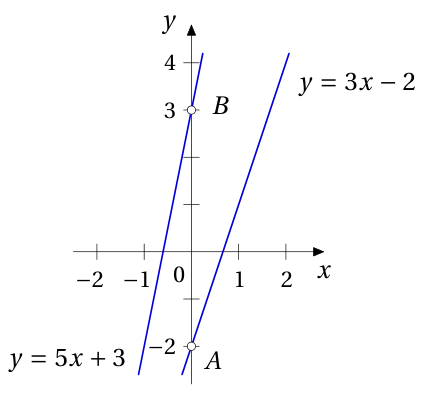

# <lo-sample/> EE.PK.2006TEST.8.7

Riņķa diametrs veido 120% no kvadrāta malas garuma. Atrodi riņķa un kvadrāta laukumu attiecību.

<small>

* answer:0,36\pi
* questionType:ShortAnswer

</small>

## Atrisinājums

Ja kvadrāta malas garums ir 1, tad arī tā laukums ir 1, riņķa diametrs ir 1,2 un riņķa laukums ir $\pi\cdot\frac{1,2^2}{4}=\frac{1,44}{4}\pi=0,36\pi$. Riņķa un kvadrāta laukumu attiecība ir $0,36\pi:1=0,36\pi$.

# <lo-sample/> EE.PK.2006TEST.8.8

Trijstūra $KLM$ malu garumi ir saistīti ar vienādībām $|KL|+|LM|=12$ cm, $|LM|+|MK|=15$ cm un $|MK|+|KL|=13$ cm. Pie kuras ar burtu apzīmētās virsotnes atrodas trijstūra lielākais leņķis?

<small>

* answer:L
* questionType:ShortAnswer

</small>

## Atrisinājums

Saskaitot vienādības, iegūstam $2|KL|+2|LM|+2|MK|=40$ cm. No šejienes atrodam $|KL|+|LM|+|MK|=20$ cm. Atņemot no pēdējās vienādības pēc kārtas uzdevuma vienādības, iegūstam $|MK|=8$ cm, $|KL|=5$ cm un $|LM|=7$ cm. Lielākais leņķis atrodas pretī garākajai malai $MK$, tātad pie virsotnes $L$.

# <lo-sample/> EE.PK.2006TEST.8.9

Uz trijstūra $ABC$ malas $AB$ atzīmēts punkts $D$ tā, ka nogrieznis $AD$ ir trīs reizes garāks par nogriezni $DB$, turklāt uz malas $AC$ atzīmēts punkts $E$ tā, ka nogrieznis $AE$ ir trīs reizes īsāks par nogriezni $EC$. Trijstūra $ADE$ laukums ir $3\ \text{cm}^2$. Atrodi trijstūra $ABC$ laukumu.

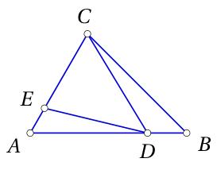

<small>

* answer:16 cm^2
* questionType:ShortAnswer

</small>

## Atrisinājums

Trijstūrim $ADC$ ar trijstūri $ADE$ ir kopīgs no virsotnes $D$ novilktais augstums, bet pamats ir 4 reizes garāks. Tātad trijstūra $ADC$ laukums ir 4 reizes lielāks par trijstūra $ADE$ laukumu jeb $12\ \text{cm}^2$. Trijstūrim $ABC$ ar trijstūri $ADC$ ir kopīgs no virsotnes $C$ novilktais augstums, bet pamats ir $\frac{4}{3}$ reizes garāks, tātad trijstūra $ABC$ laukums ir $12\cdot\frac{4}{3}=16\ \text{cm}^2$.

# <lo-sample/> EE.PK.2006TEST.8.10

Mihkels vēlējās sadalīt kubu divās daļās un uzzīmēja uz kuba skaldnēm griezuma līnijas, kā parādīts pa kreisi. Pa labi attēlots šī kuba virsmas izklājums, uz kura saglabājusies tikai daļa no līnijām. Uzzīmē izklājumā visas trūkstošās griezuma līnijas.

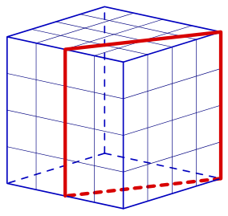

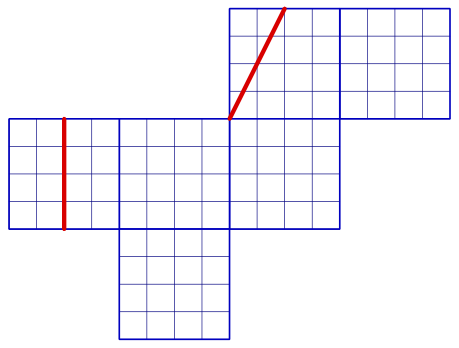

<small>

* answer:Sk. 3. zīmējumu.
* questionType:ShortAnswer

</small>

## Atrisinājums

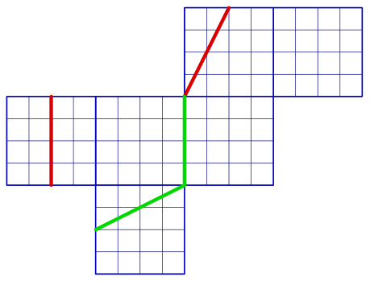

Izklājuma kreisā skaldne ir kuba priekšējā skaldne. Pārbīdot tajā esošo līniju paralēli pa labi, atzīmējam to griezuma līniju, kas atrodas uz kuba šķautnes. Ar to ir noteikts arī apakšējās skaldnes līnijas viens galapunkts, otrs galapunkts atrodas skaldnes malas viduspunktā.

# <lo-sample/> EE.PK.2006TEST.9.1

Atrodi visus veselos skaitļus $a$, kuriem ir spēkā nevienādība $a^2 - 4a + 4 < 1$.

<small>

* answer:$2$
* questionType:ShortAnswer

</small>

## Atrisinājums

Dotā nevienādība ir ekvivalenta nevienādībai $(a - 2)^2 < 1$ jeb $|a - 2| < 1$. Tā kā runa ir par veseliem skaitļiem, vienīgā iespēja ir $|a - 2| = 0$ jeb $a = 2$.

# <lo-sample/> EE.PK.2006TEST.9.2

Atrodi izteiksmes
$$1 + \frac{100}{2006} - \frac{101}{2006} + \frac{102}{2006} - \frac{103}{2006} + \ldots$$
vērtību, ja izteiksmē ir $1003$ plus zīmes un $1003$ mīnus zīmes.

<small>

* answer:$\frac{1}{2}$
* questionType:ShortAnswer

</small>

## Atrisinājums

Izteiksmes vērtība ir
$$1 + \left(\frac{100}{2006} - \frac{101}{2006}\right) + \left(\frac{102}{2006} - \frac{103}{2006}\right) + \ldots = 1 + \left(-\frac{1}{2006}\right) \cdot 1003 = \frac{1}{2}.$$

# <lo-sample/> EE.PK.2006TEST.9.3

Atrodi skaitli, kas ir mazāks par skaitli $\frac{7}{16}$ par tikpat, par cik skaitlis $1\frac{1}{4}$ ir lielāks par skaitli $1\frac{1}{8}$.

<small>

* answer:$\frac{5}{16}$
* questionType:ShortAnswer

</small>

## Atrisinājums

Tā kā $1\frac{1}{4} - 1\frac{1}{8} = \frac{1}{4} - \frac{1}{8} = \frac{1}{8}$, tad meklējamais skaitlis ir $\frac{7}{16} - \frac{1}{8} = \frac{7 - 2}{16} = \frac{5}{16}$.

# <lo-sample/> EE.PK.2006TEST.9.4

Starp daļām, kas mazākas par $1$, atrodi lielāko tādu, kuras skaitītājs un saucējs ir naturāli skaitļi un skaitītāja un saucēja summa ir $99$.

<small>

* answer:$\frac{49}{50}$
* questionType:ShortAnswer

</small>

## Atrisinājums

Daļa $\frac{49}{50}$ apmierina uzdevuma nosacījumus; visām pārējām daļām, kas mazākas par $1$ un kuru skaitītāja un saucēja summa ir $99$, skaitītājs ir mazāks un saucējs lielāks, t.i., visas šīs daļas ir mazākas par šo daļu.

# <lo-sample/> EE.PK.2006TEST.9.5

Kvadrātfunkcijas $y = 2x^2 + x - 15$ grafiks krusto $x$ asi punktos $A$ un $B$. Atrodi nogriežņa $AB$ garumu.

<small>

* answer:$5,5$
* questionType:ShortAnswer

</small>

## Atrisinājums

1. atrisinājums. Vienādojuma $2x^2 + x - 15 = 0$ saknes ir
$$x_{1,2} = \frac{-1 \pm \sqrt{1^2 - 4 \cdot 2 \cdot (-15)}}{2 \cdot 2} = \frac{-1 \pm \sqrt{121}}{4} = \frac{-1 \pm 11}{4}$$
jeb $x_1 = -\frac{12}{4} = -3$ un $x_2 = \frac{10}{4} = 2,5$. Nogriežņa $AB$ garums ir $3 + 2,5 = 5,5$ (8. zīmējums).

2. atrisinājums. Parabolas $y = ax^2 + bx + c$ nullpunktu attālumu $l$ var aprēķināt pēc formulas $l = |x_1 - x_2| = \frac{\sqrt{b^2 - 4ac}}{|a|}$. Tātad dotajā gadījumā
$$l = \frac{\sqrt{1^2 - 4 \cdot 2 \cdot (-15)}}{2} = \frac{\sqrt{121}}{2} = \frac{11}{2}.$$

# <lo-sample/> EE.PK.2006TEST.9.6

Leņķa $AOB$ lielums ir $140^\circ$. Punkts $C$ atrodas vienādā attālumā no leņķa $AOB$ malām, un punkts $D$ atrodas vienādā attālumā no leņķa $AOC$ malām. Cik liels ir leņķis $COD$?

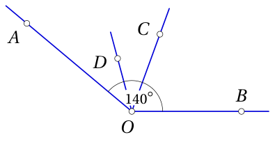

<small>

* answer:$35^\circ$
* questionType:ShortAnswer

</small>

## Atrisinājums

Taisne $OC$ ir leņķa $AOB$ bisektrise. Tātad leņķa $AOC$ lielums ir $70^\circ$. Taisne $OD$ ir leņķa $AOC$ bisektrise. Leņķa $COD$ lielums ir $35^\circ$.

# <lo-sample/> EE.PK.2006TEST.9.7

Uz taisnleņķa trijstūra $ABC$ hipotenūzas $BC$ atzīmēti punkti $K$ un $L$ tā, ka $|AB| = |BK|$, $|AC| = |CL|$ un $|AK| = |AL|$. Atrodi leņķa $CBA$ lielumu.

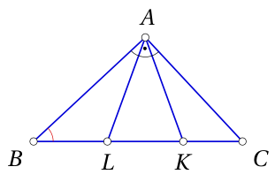

<small>

* answer:$45^\circ$
* questionType:ShortAnswer

</small>

## Atrisinājums

Vienādsānu trijstūru $BAK$ un $CAL$ leņķi pie pamata ir savā starpā vienādi, jo arī trijstūris $LAK$ ir vienādsānu. Tātad arī trijstūru $BAK$ un $CAL$ virsotnes leņķi ir vienādi. Līdz ar to trijstūris $BAC$ ir vienādsānu taisnleņķa trijstūris un $\angle CBA = \angle BCA = 45^\circ$.

# <lo-sample/> EE.PK.2006TEST.9.8

Kvadrāta $ABCD$ malas garums ir $4$ cm. Punkti $K$, $L$ un $M$ ir malu viduspunkti. Atrodi tumši iekrāsotās figūras laukumu.

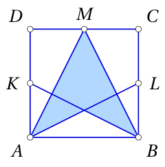

<small>

* answer:$6\ \mathrm{cm}^2$
* questionType:ShortAnswer

</small>

## Atrisinājums

1. atrisinājums. Trijstūra $ABM$ pamats un augstums abi ir $4$ cm, tātad šī trijstūra laukums ir $\frac{1}{2} \cdot 4^2 = 8\ \mathrm{cm}^2$. Pieņemsim, ka $X$ ir nogriežņu $AL$ un $BK$ krustpunkts. Trijstūra $ABX$ pamats ir $4$ cm un augstums ir puse no nogriežņa $AK$ garuma jeb $1$ cm, tātad šī trijstūra laukums ir $\frac{1}{2} \cdot 4 \cdot 1 = 2\ \mathrm{cm}^2$. Iekrāsotās figūras laukums ir $8 - 2 = 6\ \mathrm{cm}^2$.

2. atrisinājums. Pieņemsim, ka $X$ ir nogriežņu $AL$ un $BK$ krustpunkts un $Y$ – no virsotnes $M$ pret malu $AB$ novilktā augstuma pamats. Trijstūra $AYM$ laukums ir puse no taisnstūra $AYMD$ laukuma, kas savukārt ir puse no kvadrāta $ABCD$ laukuma. Trijstūra $BYM$ laukums ir tikpat liels. Tātad trijstūra $AMB$ laukums ir $2 \cdot \frac{1}{4} \cdot 16 = 8\ \mathrm{cm}^2$. Tālāk, četrstūris $KLBA$ ir taisnstūris. Tātad trijstūra $ABX$ laukums ir puse no trijstūra $ABL$ laukuma, kas savukārt veido pusi no taisnstūra $KLBA$ laukuma, kas savukārt ir puse no kvadrāta $ABCD$ laukuma. Trijstūra $ABX$ laukums ir $\frac{1}{8} \cdot 16 = 2\ \mathrm{cm}^2$, iekrāsotās figūras laukums ir $8 - 2 = 6\ \mathrm{cm}^2$.

# <lo-sample/> EE.PK.2006TEST.9.9

Uz riņķa līnijas ar centru $O$ un diametru $AB$ izvēlas punktu $C$ tā, ka leņķa $BAC$ lielums ir $\frac{1}{3}$ no leņķa $ACB$ lieluma. Atrodi zīmējumā tumši iekrāsotās daļas laukumu, ja riņķa līnijas rādiuss ir $1$ cm.

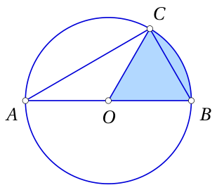

<small>

* answer:$\frac{\pi}{6}\ \mathrm{cm}^2$
* questionType:ShortAnswer

</small>

## Atrisinājums

Leņķis $ACB$ ir taisns leņķis, leņķa $BAC$ lielums ir $\frac{1}{3} \cdot 90^\circ = 30^\circ$, un uz to pašu loku balstītā centra leņķa $BOC$ lielums ir $60^\circ$. Tā kā atrastais centra leņķis ir $\frac{1}{6}$ no pilna leņķa, tad arī atbilstošās riņķa daļas laukums ir $\frac{1}{6}$ no visa riņķa laukuma jeb $\frac{1}{6} \cdot \pi \cdot 1^2 = \frac{\pi}{6}\ \mathrm{cm}^2$.

# <lo-sample/> EE.PK.2006TEST.9.10

Kelli vēlējās sadalīt kubu divās daļās un uzzīmēja uz kuba skaldnēm griezuma līnijas, kā parādīts pa kreisi. Pa labi attēlots šī kuba virsmas izklājums, uz kura saglabājusies tikai daļa no līnijām. Uzzīmē izklājumā visas trūkstošās griezuma līnijas.

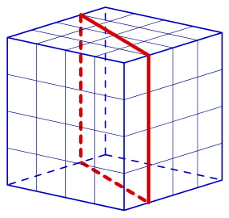

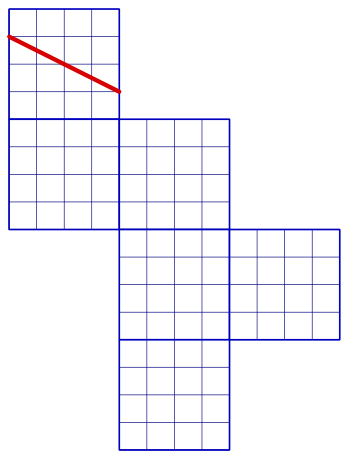

<small>

* answer:Sk. 7. zīmējumu.
* questionType:ShortAnswer

</small>

## Atrisinājums

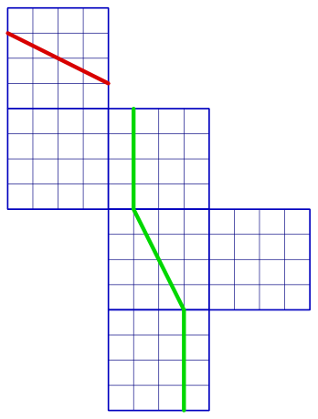

Nezaudējot vispārīgumu, varam uzskatīt, ka izklājumā ar līniju atzīmētā skaldne ir kuba augšējā skaldne. Nākamais vertikālais līnijas nogrieznis atrodas vidējās kolonnas augšējā skaldnē. Vidējās kolonnas vidējā skaldnē līnija turpinās un beidzas vienas vienības attālumā no kuba virsotnes. Izklājumā sākotnēji atzīmētās līnijas otrs gals turpinās izklājuma apakšējā skaldnē, tur esošais līnijas nogrieznis ir paralēls skaldnes malai.
