# <lo-sample/> EE.PK.2007TEST.7.1

Cik ciparu ir skaitlī $10^{2007} - 2007$ ?

<small>

* answer:2007
* questionType:ShortAnswer

</small>

## Atrisinājums

Skaitlis $10^{2007}$ ir mazākais $2008$ ciparu skaitlis: $1$ un $2007$ nulles. Atņemot no tā skaitli $2007$, iegūstam $99 \ldots 97993$, kas ir $2007$ ciparu skaitlis.

# <lo-sample/> EE.PK.2007TEST.7.2

Kāds cipars jāpieraksta skaitļa $3107$ beigās, lai iegūtais piecciparu skaitlis dalītos ar $9$?

<small>

* answer:7
* questionType:ShortAnswer

</small>

## Atrisinājums

Skaitļa $\overline{3107x}$ ciparu summa ir $11 + x$. Vienīgais cipars, ar kuru šī ciparu summa dalās ar $9$, ir $x = 7$.

# <lo-sample/> EE.PK.2007TEST.7.3

Apvelc visas patiesās nevienādības:

$$\frac{2}{312} < \frac{2}{315} \qquad \frac{11}{175} < \frac{19}{175} \qquad 5 \leq 0 \qquad \frac{1}{3} < \frac{150}{450} \qquad \frac{17}{23} > \frac{71}{231}$$

<small>

* answer:otro un piekto
* questionType:ShortAnswer

</small>

## Atrisinājums

Pirmā nav patiesa, jo no daļām ar vienādu skaitītāju lielāka ir tā, kurai saucējs ir mazāks (skaitītājs un saucējs – pozitīvi skaitļi). Otrā ir patiesa, jo ar vienādu saucēju lielāka ir daļa ar lielāku skaitītāju. Trešā nav patiesa. Ceturtā nav patiesa, jo abu pušu vērtības patiesībā ir vienādas (neviena nav mazāka par otru). Piektā ir patiesa, jo $\frac{17}{23} > \frac{1}{2}$, bet $\frac{71}{231} < \frac{1}{2}$.

# <lo-sample/> EE.PK.2007TEST.7.4

Oskars, Kalle un Viktors ir mūziķi. Viens no viņiem ir dziedātājs, otrs pianists un trešais vijolnieks. Zināms, ka Kalle un dziedātājs ir kaimiņi, pianists un Oskars ir brāļi, un dziedātājs ir Oskara labākais draugs. Kāda ir Kalles profesija?

<small>

* answer:pianists
* questionType:ShortAnswer

</small>

## Atrisinājums

No dotā redzam, ka Oskars un pianists ir dažādi cilvēki, un arī Oskars un dziedātājs ir dažādi cilvēki. Tātad Oskars ir vijolnieks. Tā kā Kalle nevar būt ne dziedātājs, ne vijolnieks, Kallem jābūt pianistam.

# <lo-sample/> EE.PK.2007TEST.7.5

Aprēķini:

$$1+\frac{4}{2+\frac{2}{3}} =$$

<small>

* answer:$\frac{5}{2}$
* questionType:ShortAnswer

</small>

## Atrisinājums

Tā kā $2 + \frac{2}{3} = \frac{8}{3}$, tad izteiksmes vērtība ir $1 + 4 \cdot \frac{3}{8} = 1 + \frac{3}{2} = \frac{5}{2}$.

# <lo-sample/> EE.PK.2007TEST.7.6

Cik dažādos veidos var izveidot skaitli $2007$, sākot zīmējumā attēlotajā figūrā no trijstūra ar ciparu $2$ un katrā solī pārejot no viena trijstūra uz citu trijstūri pāri kopīgai malai?

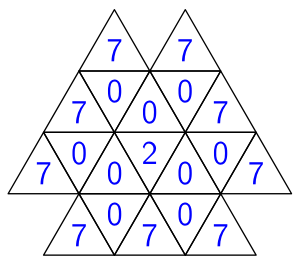

<small>

* answer:12
* questionType:ShortAnswer

</small>

## Atrisinājums

Sākot no vidējā kvadrāta, pirmo nulli varam izvēlēties $3$ veidos. Pie katras šādas izvēles otro nulli varam izvēlēties $2$ veidos. Savukārt pēc katras šādas izvēles septiņnieku varam izvēlēties $2$ veidos. Tātad pavisam ir $3 \cdot 2 \cdot 2 = 12$ izvēles iespējas.

# <lo-sample/> EE.PK.2007TEST.7.7

Zirnekļmātes austais tīkls veido regulāru rūtiņu tīklu, kura mezglu pārus $B$ un $K$, $F$ un $A$, $G$ un $E$ un $L$ un $D$ savieno taisni pavedieni.

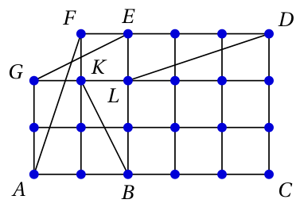

Ieraksti katrā tukšajā vietā pareizo sakarību „garāks nekā“, „īsāks nekā“ vai „tikpat garš kā“.

ceļš $BKFA$ ir ceļš $GELD$

ceļš $GELD$ ir ceļš $FKBC$

ceļš $FKBC$ ir ceļš $BKFA$

<small>

* answer:tikpat garš kā; garāks nekā; īsāks nekā
* questionType:ShortAnswer

</small>

## Atrisinājums

Maršruts $BKFA$ ir tikpat garš kā maršruts $GELD$, jo katrs no tiem sastāv no trim posmiem, kuru garumi ir savstarpēji vienādi. Savukārt maršruts $BKFA$ ir garāks nekā maršruts $FKBC$, jo tie atšķiras tikai ar posmiem $FA$ un $BC$, bet $FA$ ir garāks nekā $BC$.

# <lo-sample/> EE.PK.2007TEST.7.8

No taisnstūra virsotnes novilkti stari sadala taisnstūra leņķi sešos leņķos, no kuriem trīs ir ar lielumu $\alpha$ un pārējie trīs ar lielumu $\beta$. Atrodi $\alpha + \beta$.

<small>

* answer:$30^\circ$
* questionType:ShortAnswer

</small>

## Atrisinājums

Taisnstūra leņķa lielums ir $90^\circ$. Sešu izveidojušos leņķu lielumu summa ir $3\alpha + 3\beta = 90^\circ$. Tātad $\alpha + \beta = 30^\circ$.

# <lo-sample/> EE.PK.2007TEST.7.9

Punkts $C$ ir nogriežņa $AB$ viduspunkts, un punkts $D$ ir nogriežņa $AC$ viduspunkts. Uz nogriežņiem $AB$, $AC$ un $AD$ balstās trīs pusriņķi. Atrodi zīmējumā tumši iekrāsotās figūras precīzu laukumu kvadrātcentimetros, ja $|AB| = 16$ cm.

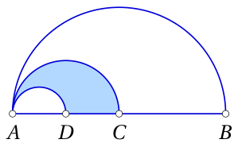

<small>

* answer:$6\pi\ \mathrm{cm}^2$
* questionType:ShortAnswer

</small>

## Atrisinājums

Tā kā $|AB| = 16$ cm, tad $|AC| = 8$ cm un $|AD| = 4$ cm. Uz diametra $AC$ balstītā pusriņķa laukums ir puse no riņķa ar tādu pašu diametru laukuma jeb $\frac{1}{2} \cdot \pi \cdot \frac{8^2}{4} = 8\pi\ \mathrm{cm}^2$. Uz diametra $AD$ balstītā pusriņķa laukums analoģiski ir $\frac{1}{2} \cdot \pi \cdot \frac{4^2}{4} = 2\pi\ \mathrm{cm}^2$. Tumši iekrāsotās figūras laukums ir šo laukumu starpība jeb $6\pi\ \mathrm{cm}^2$.

# <lo-sample/> EE.PK.2007TEST.7.10

Zīmējumā dots trijstūra taisnas prizmas virsmas izklājums, kurā norādīti dažu nogriežņu garumi. Aprēķini šīs prizmas visu šķautņu garumu summu.

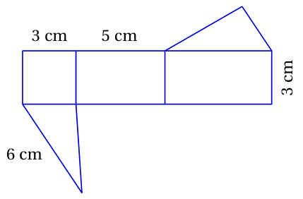

<small>

* answer:37 cm
* questionType:ShortAnswer

</small>

## Atrisinājums

Prizmas pamata šķautņu garumi ir $6$ cm, $5$ cm un $3$ cm, prizmas augstums ir $3$ cm. Prizmas šķautnes ir apakšējā un augšējā pamata šķautnes un trīs šķautnes, kas savieno abus pamatus. Tātad visu šķautņu kopgarums ir $2 \cdot (6 + 5 + 3) + 3 \cdot 3$ cm jeb $37$ cm.

# <lo-sample/> EE.PK.2007TEST.8.1

Atrodi summas $2007^2 + 2007^0 + 2007^0 + 2007^7$ pēdējo ciparu.

<small>

* answer:4
* questionType:ShortAnswer

</small>

## Atrisinājums

Ja esam atraduši kāda skaitļa $2007^n$ vienu ciparu $a$, tad skaitļa $2007^{n+1}$ vienu cipars ir tāds pats kā skaitļa $a\cdot 7$ vienu cipars. Tātad

$$
\begin{array}{c|cccccccc}
n & 0 & 1 & 2 & 3 & 4 & 5 & 6 & 7 \\
\hline
2007^n\ \text{vienu cipars} & 1 & 7 & 9 & 3 & 1 & 7 & 9 & 3
\end{array}
$$

Meklējamā skaitļa vienu cipars ir tāds pats kā skaitļa $9 + 1 + 1 + 3 = 14$ vienu cipars.

# <lo-sample/> EE.PK.2007TEST.8.2

Atrodi lielāko piecciparu skaitli, kas dalās ar 15 un kuram, izsvītrojot pirmo un pēdējo ciparu, paliek skaitlis 107.

<small>

* answer:81075
* questionType:ShortAnswer

</small>

## Atrisinājums

Meklējamā skaitļa $\overline{a107b}$ ciparu summai jādalās ar 3, un šim skaitlim jābeidzas ar 0 vai 5. Ja $a = 9$, tad $b = 5$ un $b = 0$ dod ciparu summu attiecīgi 22 un 17. Ja $a = 8$, tad der $b = 5$, ciparu summa tad ir 21.

# <lo-sample/> EE.PK.2007TEST.8.3

Doti pirmie desmit locekļi skaitļu virknei, kas turpinās pēc tās pašas likumsakarības:

$$
1,\quad 2,\quad \frac{3}{4},\quad 5,\quad 6,\quad \frac{7}{8},\quad 9,\quad 10,\quad \frac{11}{12},\quad 13,\quad \ldots
$$

No skaitļiem

$$
\frac{2005}{2006}\qquad 2006\qquad 2007\qquad \frac{2007}{2008}\qquad 2010
$$

apvelc visus tos, kas ir sastopami iepriekš dotajā virknē.

<small>

* answer:otro, ceturto un piekto
* questionType:ShortAnswer

</small>

## Atrisinājums

Virknē sastopamo parasto daļu saucēji ir tieši skaitļi, kas dalās ar 4. Tātad skaitlis $\frac{2005}{2006}$ virknē nav sastopams, bet skaitlis $\frac{2007}{2008}$ ir. Pēdējā skaitļa apkārtnē virknes locekļi ir

$$
\ldots,\quad 2005,\quad 2006,\quad \frac{2007}{2008},\quad 2009,\quad 2010,\quad \ldots
$$

# <lo-sample/> EE.PK.2007TEST.8.4

Diviem ekskavatoriem trīs vienādu bedru izrakšanai vajag pusotru stundu. Cik ekskavatoru vajag, lai izraktu četras tādas pašas bedres vienā stundā?

<small>

* answer:4
* questionType:ShortAnswer

</small>

## Atrisinājums

Diviem ekskavatoriem četru vienādu bedru izrakšanai vajag $\frac{4}{3}\cdot 1{,}5 = 2$ stundas. Lai paveiktu darbu 2 reizes ātrāk, ekskavatoru jābūt 2 reizes vairāk jeb 4.

# <lo-sample/> EE.PK.2007TEST.8.5

Vienādojuma $ax - 4 = 0$ saknes $x$ apgrieztā skaitļa pretējais skaitlis ir $\frac{1}{6}$. Atrodi koeficientu $a$.

<small>

* answer:$-\frac{2}{3}$
* questionType:ShortAnswer

</small>

## Atrisinājums

1. atrisinājums. Vienādojuma sakne ir $x = \frac{4}{a}$, tās apgrieztais skaitlis ir $\frac{a}{4}$, un tā pretējais skaitlis ir $-\frac{a}{4}$. Tātad $-\frac{a}{4} = \frac{1}{6}$, no kurienes $a = -\frac{2}{3}$.

2. atrisinājums. Tā kā saknes $x$ apgrieztā skaitļa pretējais skaitlis ir $\frac{1}{6}$, tad $x = -6$. Tātad $a\cdot (-6) = 4$, no kurienes $a = -\frac{2}{3}$.

# <lo-sample/> EE.PK.2007TEST.8.6

Cik dažādos veidos var izveidot skaitli $2007$, sākot zīmējumā attēlotajā figūrā no riņķa ar ciparu 2 un katrā solī pārejot no viena riņķa uz citu, tam pieskarošos riņķi?

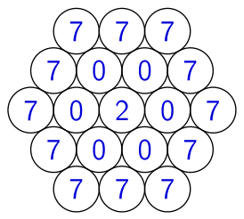

<small>

* answer:36
* questionType:ShortAnswer

</small>

## Atrisinājums

Sākot no vidējā riņķa, pirmo nulli varam izvēlēties 6 veidos. Pie katras šādas izvēles otro nulli varam izvēlēties 2 veidos. Savukārt pēc katras šādas izvēles septiņnieku varam izvēlēties 3 veidos. Tātad pavisam ir $6\cdot 2\cdot 3 = 36$ izvēles iespējas.

# <lo-sample/> EE.PK.2007TEST.8.7

Riņķis ar rādiusiem sadalīts sešos sektoros tā, ka trīs sektoru leņķi ir ar lielumu $\alpha$ un pārējo trīs sektoru leņķi ar lielumu $\beta$. Atrodi $\alpha + \beta$.

<small>

* answer:$120^\circ$
* questionType:ShortAnswer

</small>

## Atrisinājums

Pilns leņķis ir $360^\circ$. Sešu sektoru leņķu lielumu summa ir $3\alpha + 3\beta = 360^\circ$. Tātad $\alpha + \beta = 120^\circ$.

# <lo-sample/> EE.PK.2007TEST.8.8

Divi vienādi pusriņķi ar centriem $A$ un $B$ un rādiusu $1$ cm daļēji pārklājas tā, ka viena pusriņķa diametra galapunkts atrodas uz otra pusriņķa robežlīnijas (punkti $A$ un $B$ pieder abu pusriņķu robežlīnijām). Atrodi zīmējumā tumši iekrāsotās figūras precīzu laukumu kvadrātcentimetros.

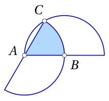

<small>

* answer:$\frac{\pi}{6}\ \mathrm{cm}^2$
* questionType:ShortAnswer

</small>

## Atrisinājums

Tā kā pusriņķiem ir vienādi rādiusi, tad $|AC| = |AB| = |BC|$. Tātad trijstūris $ABC$ ir vienādmalu un $\angle BAC = 60^\circ$. Līdz ar to aplūkojamā sektora laukums ir $\frac{1}{6}$ no riņķa ar tādu pašu rādiusu laukuma jeb $\frac{1}{6}\cdot \pi\cdot 1^2 = \frac{\pi}{6}\ \mathrm{cm}^2$.

# <lo-sample/> EE.PK.2007TEST.8.9

Atrodi $\alpha$, ja punkti $A$, $B$ un $E$ atrodas uz vienas taisnes, nogrieznis $CE$ ir perpendikulārs nogrieznim $BD$ un $|AC| = |BC| = |DB| = |DC|$.

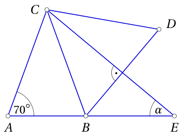

<small>

* answer:$40^\circ$
* questionType:ShortAnswer

</small>

## Atrisinājums

Tā kā trijstūris $ABC$ ir vienādsānu, tad $\angle ABC = 70^\circ$ un $\angle EBC = 180^\circ - 70^\circ = 110^\circ$. Tā kā trijstūris $BCD$ ir vienādmalu, tad $\angle BCD = 60^\circ$. Taisne $CE$ ir šī trijstūra augstums un vienlaikus arī bisektrise, tāpēc $\angle BCE = 30^\circ$. No trijstūra $EBC$ tagad iegūstam $\angle CEB = 180^\circ - 110^\circ - 30^\circ = 40^\circ$.

# <lo-sample/> EE.PK.2007TEST.8.10

Taisnas prizmas pamati ir taisnleņķa trapeces. Šīs prizmas virsmas izklājumā norādīti dažu nogriežņu garumi. Aprēķini šīs prizmas pilnas virsmas laukumu.

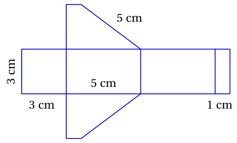

<small>

* answer:$60\ \mathrm{cm}^2$
* questionType:ShortAnswer

</small>

## Atrisinājums

Prizmas pamata šķautņu garumi ir 5 cm, 5 cm, 1 cm, 3 cm, prizmas augstums ir 3 cm. Pamata trapeces laukums ir $\frac{5 + 1}{2}\cdot 3 = 9\ \mathrm{cm}^2$, tātad abu pamatu laukums ir $18\ \mathrm{cm}^2$. Prizmas sānu virsmas laukums ir pamata perimetra un augstuma reizinājums jeb $(5 + 5 + 1 + 3)\cdot 3 = 42\ \mathrm{cm}^2$. Pilnas virsmas laukums ir $18 + 42 = 60\ \mathrm{cm}^2$.

# <lo-sample/> EE.PK.2007TEST.9.1

Aprēķini: $(2007^2 - 2007) - (2006^2 - 2006) =$ 

<small>

* answer:4012
* questionType:ShortAnswer

</small>

## Atrisinājums

Izteiksmes vērtība ir $2007 \cdot (2007 - 1) - 2006 \cdot (2006 - 1) = 2007 \cdot 2006 - 2006 \cdot 2005 = 2006 \cdot (2007 - 2005) = 2006 \cdot 2 = 4012$.

# <lo-sample/> EE.PK.2007TEST.9.2

Pierakstā $7*32*$ zvaigznītes aizstāj ar piemērotiem cipariem un iegūst skaitli, kas, dalot ar 15, dod atlikumu 2. Atrodi lielāko no šādiem skaitļiem.

<small>

* answer:79322
* questionType:ShortAnswer

</small>

## Atrisinājums

*1. atrisinājums.* Meklējamā skaitļa $\overline{7a32b}$ ciparu summai, dalot ar 3, jādod atlikums 2, un šim skaitlim jābeidzas ar 2 vai 7. Ja $a = 9$, tad pie $b = 7$ iegūstam ciparu summu 28, kas neder, bet pie $b = 2$ iegūstam derīgu ciparu summu 23.

*2. atrisinājums.* Atņemot no dotā skaitļa 2, iegūstam skaitli $\overline{7x32y}$, kas dalās ar 15 bez atlikuma (skaitļa priekšpēdējais cipars ar šo darbību nemainās). Iegūtā skaitļa pēdējais cipars ir vai nu 0, vai 5, un tā ciparu summai jādalās ar 3. Ja $x = 9$ un $y = 5$, tad ciparu summa ir 26, kas neder. Ja $x = 9$ un $y = 0$, tad iegūstam derīgu ciparu summu 21. Meklējamais skaitlis ir par 2 lielāks par šo skaitli jeb 79322.

# <lo-sample/> EE.PK.2007TEST.9.3

Kurā vietā atrodas skaitlis $\frac{59}{60}$ skaitļu virknē $1, 2, \frac{3}{4}, 5, 6, \frac{7}{8}, 9, 10, \ldots$?

<small>

* answer:45. vietā
* questionType:ShortAnswer

</small>

## Atrisinājums

Virkne sastāv no trīs locekļu blokiem, kuros pēdējā vietā atrodas parastā daļa, kuras saucējs dalās ar 4. Attiecīgā dalījuma vērtība ir tieši bloka kārtas numurs. Tā kā $60 = 4 \cdot 15$, tad, skaitot pēc kārtas, līdz meklējamajam loceklim jāpaiet 15 blokiem jeb $3 \cdot 15 = 45$ elementiem.

# <lo-sample/> EE.PK.2007TEST.9.4

Četriem ekskavatoriem četru vienādu bedru izrakšanai vajag četras stundas. Cik daudz laika vajag sešiem ekskavatoriem divpadsmit tādu pašu bedru izrakšanai?

<small>

* answer:8 stundas
* questionType:ShortAnswer

</small>

## Atrisinājums

Četriem ekskavatoriem 12 vienādu bedru izrakšanai vajag 12 stundas. Tātad sešiem ekskavatoriem 12 bedru izrakšanai vajag $\frac{4}{6} \cdot 12 = 8$ stundas.

# <lo-sample/> EE.PK.2007TEST.9.5

Atrodi funkcijas $y = x^2 + 6x + 9$ grafika virsotnes attālumu līdz $y$ asij.

<small>

* answer:3
* questionType:ShortAnswer

</small>

## Atrisinājums

Dotā kvadrātfunkcija ir formā $y = (x + 3)^2$, no šejienes redzam, ka grafika virsotne ir pie $x = -3$ un tā atrodas tieši uz $x$ ass. Tātad virsotnes attālums līdz $y$ asij ir 3.

# <lo-sample/> EE.PK.2007TEST.9.6

Cik dažādos veidos var izveidot skaitli 2007, sākot no rūtiņas ar ciparu 2 un katrā solī pārejot uz citu rūtiņu, kurai ar iepriekšējo rūtiņu ir kopīga mala vai kopīga virsotne?

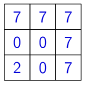

<small>

* answer:18
* questionType:ShortAnswer

</small>

## Atrisinājums

Ja, veidojot skaitli 200, esam nonākuši līdz nullei, kas atrodas virs sākuma rūtiņas (2 iespējas), ciparu 7 varam izvēlēties divos veidos, kopā 4 varianti. Analoģiski ir 4 varianti nullei, kas atrodas pa labi no sākuma rūtiņas. Lai nonāktu līdz tabulas vidū esošajai nullei, ir 2 iespējas, un ciparu 7 beigās varam pievienot piecos veidos, kopā $2 \cdot 5 = 10$ varianti. Tātad pavisam ir $4 + 4 + 10 = 18$ varianti.

# <lo-sample/> EE.PK.2007TEST.9.7

Zīmējumā 6 taisnes apzīmētas ar mazajiem burtiem un atzīmēti dažu leņķu lielumi. Atrodi visus paralēlo taišņu pārus.

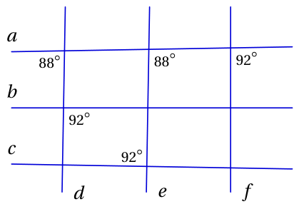

<small>

* answer:$(a,b), (d,f)$
* questionType:ShortAnswer

</small>

## Atrisinājums

Taisnes $a$ un $b$ ir paralēlas, jo tās krusto taisni $d$ vienādā leņķī. Taisne $c$ nav paralēla taisnei $a$, jo tās krusto taisni $e$ dažādos leņķos. Aplūkojot leņķus, kas veidojas, taisnēm $d$, $e$ un $f$ krustojoties ar taisni $a$, iegūstam, ka vienīgās paralēlās ir taisnes $d$ un $f$.

# <lo-sample/> EE.PK.2007TEST.9.8

Dots nogrieznis $AB$ un trīs punkti $O_1$, $O_2$ un $O$ tā, ka punkti $A$, $B$ un $O_2$ atrodas uz riņķa līnijas ar centru $O_1$, un punkti $A$, $B$ un $O$ atrodas uz riņķa līnijas ar centru $O_2$. Atrodi leņķa $AOB$ lielumu, ja leņķis $AO_1B$ ir taisns leņķis.

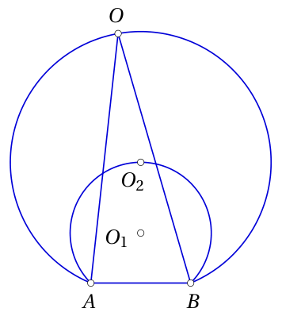

<small>

* answer:$22,5^\circ$
* questionType:ShortAnswer

</small>

## Atrisinājums

Ievilkta leņķa lielums ir puse no uz to pašu loku balstītā centra leņķa lieluma. Tā kā $O_1$ ir mazākās riņķa līnijas centrs un $\angle AO_1B = 90^\circ$, tad $\angle AO_2B = 45^\circ$. Analoģiski $O_2$ ir lielākās riņķa līnijas centrs, tātad $\angle AOB = 22,5^\circ$.

# <lo-sample/> EE.PK.2007TEST.9.9

Trijstūra $ABC$ mediānu $AK$ un $BL$ krustpunkts ir $M$. Atrodi trijstūra $ABM$ laukumu, ja trijstūra $MKL$ laukums ir $1,6\ \mathrm{cm}^2$.

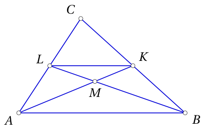

<small>

* answer:$6,4\ \mathrm{cm}^2$
* questionType:ShortAnswer

</small>

## Atrisinājums

Mediānu krustpunkts dala mediānu attiecībā $2 : 1$. Tātad $|AM| = 2|KM|$ un $|BM| = 2|LM|$. Turklāt $KL$ ir trijstūra viduslīnija, tāpēc $|AB| = 2|KL|$. Tātad trijstūris $ABM$ ir līdzīgs trijstūrim $MKL$ ar līdzības koeficientu 2, un tā laukums ir 4 reizes lielāks par trijstūra $MKL$ laukumu.

# <lo-sample/> EE.PK.2007TEST.9.10

Taisnas prizmas pamati ir taisnleņķa trapeces. Šīs prizmas virsmas izklājumā norādīti dažu nogriežņu garumi. Aprēķini prizmas tilpumu.

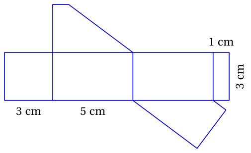

<small>

* answer:$27\ \mathrm{cm}^3$
* questionType:ShortAnswer

</small>

## Atrisinājums

Prizmas pamata šķautņu garumi ir 5 cm, 5 cm, 1 cm, 3 cm, prizmas augstums ir 3 cm. Pamata trapeces laukums ir $\frac{5 + 1}{2} \cdot 3 = 9\ \mathrm{cm}^2$. Prizmas tilpums ir pamata laukuma un augstuma reizinājums jeb $9 \cdot 3 = 27\ \mathrm{cm}^3$.
