# <lo-sample/> EE.PK.2008TEST.7.1

Kirjuta vabadesse lahtritesse arvud nii, et pärast viimase tehte sooritamist saame vastuseks $0$.

<small>

* answer:17, 20 ja 5
* questionType:ShortAnswer

</small>

## Lahendus

Kolmandas lahtris on arv $0 - (-5) = 5$, teises lahtris arv $5 \cdot 4 = 20$ ning esimeses lahtris arv $20 + (-3) = 17$.

# <lo-sample/> EE.PK.2008TEST.7.2

Arvule $2008$ vastab arv $1000$, arvule $2009$ vastab arv $1001$ jne, nagu näidatud joonisel. Millisele arvule vastab arv $2008$?

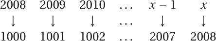

<small>

* answer:3016
* questionType:ShortAnswer

</small>

## Lahendus

Arvu ja talle vastava arvu vahe on alati $1008$. Arvule $2008$ vastab seega arv $2008 + 1008 = 3016$.

# <lo-sample/> EE.PK.2008TEST.7.3

Kärt mõtles ühe naturaalarvu $150$ ja $270$ vahel. Selle arvu numbrite korrutis oli $81$. Millise arvu Kärt mõtles?

<small>

* answer:199
* questionType:ShortAnswer

</small>

## Lahendus

Arv $81$ jagub numbritest ainult $1$, $3$ ja $9$-ga. Otsitav arv peab olema kolmekohaline ja tema esimene number saab olla ainult $1$. Seega kaks viimast numbrit on $9$ ja $9$.

# <lo-sample/> EE.PK.2008TEST.7.4

Kui palju leidub arvude $100$ ja $200$ vahel selliseid naturaalarve, mille kirjutises sisaldub number $3$ või number $7$?

<small>

* answer:36
* questionType:ShortAnswer

</small>

## Lahendus

Kui kolmekohaline arv $\overline{1AB}$ ei sisalda numbrit $3$ ega $7$, siis $A$ kohale sobib $8$ numbrit ja $B$ kohale samuti $8$ numbrit. Seega niisuguseid arve on $8 \cdot 8 = 64$. Ülejäänud arvud sisaldavad numbrit $3$ või $7$. Et arve kujul $\overline{1AB}$ on üldse $100$ tükki, siis otsitavaid arve on $100 - 64 = 36$.

# <lo-sample/> EE.PK.2008TEST.7.5

Kahe viimase aasta jooksul on olnud $3$ kuud normist külmemad ja kõik ülejäänud kuud normist soojemad. Mitu protsenti kuudest on olnud sel perioodil normist soojemad?

<small>

* answer:87,5%
* questionType:ShortAnswer

</small>

## Lahendus

Kaks aastat koosneb $24$ kuust, millest $21$ on olnud normist soojemad. Nende kuude osakaal on seega $\frac{21}{24} = \frac{7}{8} = 87{,}5\%$.

# <lo-sample/> EE.PK.2008TEST.7.6

Digitaalne kell näitab $24$ tunni režiimis tunde ja minuteid (näiteks $21:25$). Mis kellaajal on numbrilaual olevate numbrite summa suurim?

<small>

* answer:19:59
* questionType:ShortAnswer

</small>

## Lahendus

Tundide arvu numbrite summa on suurim, kui tundide arv on $19$. Minutite arvu numbrite summa on suurim, kui minutite arv on $59$.

# <lo-sample/> EE.PK.2008TEST.7.7

Koordinaatteljestikus on antud punkt $A(-2; 3)$. Leia kõik sellest erinevad punktid, mis asuvad nii $x$-teljest kui ka $y$-teljest sama kaugel kui $A$.

<small>

* answer:$(-2; -3)$, $(2; -3)$ ja $(2; 3)$
* questionType:ShortAnswer

</small>

## Lahendus

Otsitavad punktid on parajasti punkti $A$ kõikvõimalikud peegeldused koordinaattelgede suhtes. Ühte niisugust peegeldust kirjeldab punkti koordinaadi märgi muutmine vastupidiseks. Punktist $A(-2; 3)$ saame seega punktid $(-2; -3)$, $(2; -3)$ ja $(2; 3)$.

# <lo-sample/> EE.PK.2008TEST.7.8

Nelinurgas $ABCD$ on külgede $AB$, $BC$ ja $AD$ pikkus $1$. Nurk $BAD$ on täisnurk ja $\angle ABC = 60^\circ$. Leia nurga $ADC$ suurus.

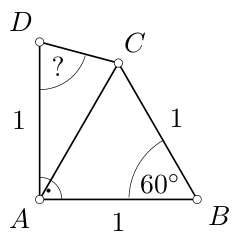

<small>

* answer:$75^\circ$
* questionType:ShortAnswer

</small>

## Lahendus

Kolmnurk $ABC$ on võrdkülgne, seetõttu $\angle CAB = 60^\circ$ ja $|AC| = 1$. Kolmnurk $ADC$ on võrdhaarne tipunurgaga $30^\circ$. Selle kolmnurga alusnurk on $\angle ADC = \frac{180^\circ - 30^\circ}{2} = 75^\circ$.

# <lo-sample/> EE.PK.2008TEST.7.9

Leia värvitud ala täpne pindala, kui välimise ringi diameeter on $2$ cm ja sisemise ringi diameeter $1$ cm.

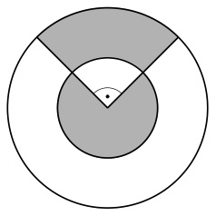

<small>

* answer:$\frac{3\pi}{8}$ cm$^2$
* questionType:ShortAnswer

</small>

## Lahendus

Sisemise ringi pindala on $\frac{\pi}{4}$ cm$^2$, värvitud on sellest kolmveerand ehk $\frac{3\pi}{16}$ cm$^2$. Välimise rõnga pindala on $\frac{\pi \cdot 2^2}{4}$ cm$^2 - \frac{\pi}{4}$ cm$^2 = \frac{3\pi}{4}$ cm$^2$, värvitud on sellest veerand ehk $\frac{3\pi}{16}$ cm$^2$. Üldse on värvitud $\frac{3\pi}{16}$ cm$^2 + \frac{3\pi}{16}$ cm$^2 = \frac{3\pi}{8}$ cm$^2$.

# <lo-sample/> EE.PK.2008TEST.7.10

Mitme eri pikkusega servi võib olla kolmnurksel püstprismal? Tee ring ümber sobivatele arvudele.

$1 \quad 2 \quad 3 \quad 4 \quad 5 \quad 6 \quad 7 \quad 8 \quad 9 \quad 10 \quad 11 \quad 12$

<small>

* answer:1, 2, 3 ja 4
* questionType:ShortAnswer

</small>

## Lahendus

Püstprisma alusel võib olla $3$, $2$ või $1$ erineva pikkusega serva. Püstprisma kõrgus võib aluse mõne serva pikkusega kokku langeda või olla neist kõigist erinev. Kolmnurksel püstprismal saab olla niisiis kas $4$, $3$, $2$ või $1$ erineva pikkusega serva.

# <lo-sample/> EE.PK.2008TEST.8.1

Kirjuta vabadesse lahtritesse arvud nii, et pärast viimase tehte sooritamist saame vastuseks 1.

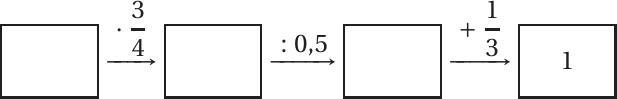

<small>

* answer:$\frac{4}{9}$, $\frac{1}{3}$ ja $\frac{2}{3}$
* questionType:ShortAnswer

</small>

## Lahendus

Kolmandas lahtris on arv $1-\frac{1}{3}=\frac{2}{3}$, teises lahtris arv $\frac{2}{3}\cdot 0,5=\frac{1}{3}$ ning esimeses lahtris arv $\frac{1}{3}:\frac{3}{4}=\frac{1}{3}\cdot\frac{4}{3}=\frac{4}{9}$.

# <lo-sample/> EE.PK.2008TEST.8.2

Arvule 2008 vastab arv 999, arvule 2010 vastab arv 1001 jne, nagu näidatud joonisel. Millisele arvule vastab arv 2009?

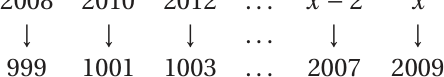

<small>

* answer:$3018$
* questionType:ShortAnswer

</small>

## Lahendus

Arvu ja talle vastava arvu vahe on alati 1009. Arv, mis vastab arvule 2009, on seega $2009+1009=3018$.

# <lo-sample/> EE.PK.2008TEST.8.3

Leia vähim positiivne täisarv, mis annab jagamisel 5-ga jäägi 3 ja jagamisel 7-ga jäägi 2.

<small>

* answer:$23$
* questionType:ShortAnswer

</small>

## Lahendus

Jagamisel 5-ga annavad jäägi 3 arvud 3, 8, 13, 18, 23, 28 jne. Nende hulgas esimene, mis jagamisel 7-ga annab jäägi 2, on arv 23.

# <lo-sample/> EE.PK.2008TEST.8.4

Kui palju leidub selliseid kahekohalisi positiivseid arve, mille kirjutises sisaldub number 1 või number 5?

<small>

* answer:$34$
* questionType:ShortAnswer

</small>

## Lahendus

Kui kahekohaline arv $\overline{AB}$ ei sisalda numbrit 1 ega numbrit 5, siis $A$ kohale sobib 7 numbrit (arv ei saa alata nulliga) ning $B$ kohale 8 numbrit. Seega niisuguseid arve on $7\cdot 8=56$. Ülejäänud arvud sisaldavad numbrit 1 või numbrit 5. Et kahekohalisi arve 10-st 99-ni on üldse 90, siis otsitavaid arve on $90-56=34$.

# <lo-sample/> EE.PK.2008TEST.8.5

Mitmel viisil saab 5 õpilasest valida 3-liikmelise võistkonna, kui kaks neist, Pärt ja Märt, keelduvad olemast koos samas võistkonnas?

<small>

* answer:$7$
* questionType:ShortAnswer

</small>

## Lahendus

Võistkonna valimiseks tuleb 5 õpilasest 2 välja jätta. On 3 varianti, kus esimene omavahel konfliktis olevatest õpilastest ei kuulu võistkonda ja teine kuulub, samuti 3 varianti, kus teine nendest õpilastest ei kuulu võistkonda ja esimene kuulub, ning 1 variant, kus kumbki õpilane ei kuulu võistkonda. Kokku $3+3+1=7$.

# <lo-sample/> EE.PK.2008TEST.8.6

200-liitrise vanni täis vett valgus ühtlase kihina laiali 40-ruutmeetrise korteri põrandale. Leia tekkinud veekihi paksus.

<small>

* answer:$5$ mm
* questionType:ShortAnswer

</small>

## Lahendus

200 liitrit on $0,2\ \mathrm{m}^3$. Veekihi paksus on $\frac{0,2\ \mathrm{m}^3}{40\ \mathrm{m}^2}=0,005\ \mathrm{m}$ ehk 5 mm.

# <lo-sample/> EE.PK.2008TEST.8.7

Ringjoon läbib punkte $A(-3;-3)$, $B(5;-3)$, $C(5;3)$ ja $D(-3;3)$. Leia selle ringjoone keskpunkti koordinaadid.

<small>

* answer:$(1;0)$
* questionType:ShortAnswer

</small>

## Lahendus

Antud punktid määravad ristküliku, mille küljed on paralleelsed koordinaattelgedega. Ringjoone keskpunkti $x$-koordinaat on seega punktide $A$ ja $B$ $x$-koordinaatide keskmine ehk $\frac{-3+5}{2}=1$, ringjoone keskpunkti $y$-koordinaat on punktide $A$ ja $D$ $y$-koordinaatide keskmine ehk $\frac{-3+3}{2}=0$. Keskpunkt on niisiis $(1;0)$.

# <lo-sample/> EE.PK.2008TEST.8.8

Kolmnurk $ABC$ on täisnurkne täisnurgaga tipu $A$ juures. Lõigud $AD$, $AE$ ja $EB$ on võrdse pikkusega ning $\angle ADE=75^\circ$. Leia nurga $CAD$ suurus.

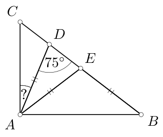

<small>

* answer:$22,5^\circ$
* questionType:ShortAnswer

</small>

## Lahendus

Kolmnurk $DAE$ on võrdhaarne alusnurgaga $75^\circ$, seega tema tipunurk on $180^\circ-2\cdot75^\circ=30^\circ$. Kolmnurk $AEB$ on samuti võrdhaarne tipunurgaga $180^\circ-75^\circ=105^\circ$, seega tema alusnurk on $\frac{180^\circ-105^\circ}{2}=37,5^\circ$. Järelikult $\angle CAD=90^\circ-30^\circ-37,5^\circ=22,5^\circ$.

# <lo-sample/> EE.PK.2008TEST.8.9

Trapetsi $ABCD$ alused on $AB$ ja $CD$. Lõigud $AE$ ja $BF$ on risti alusega. On teada, et $|DE|=3$ cm, $|EF|=1,5$ cm ja $|FC|=1,5$ cm. Kui suure osa trapetsi pindalast moodustab kolmnurga $AED$ pindala?

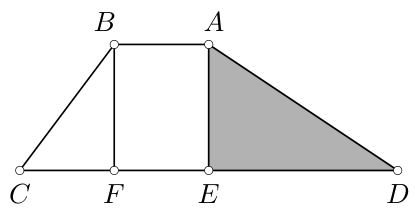

<small>

* answer:$\frac{2}{5}$
* questionType:ShortAnswer

</small>

## Lahendus

Kolmnurga $BFC$ pindala on pool ristküliku $ABFE$ pindalast, viimane omakorda võrdub kolmnurga $AED$ pindalaga. Kolmnurga $AED$ pindala moodustab trapetsi pindalast $\frac{1}{0,5+1+1}=\frac{1}{2,5}=\frac{2}{5}$ ehk 40%.

# <lo-sample/> EE.PK.2008TEST.8.10

Mitme eri pikkusega servi võib olla püströöptahukal? Tee ring ümber sobivatele arvudele.

$1$    $2$    $3$    $4$    $5$    $6$    $7$    $8$    $9$    $10$    $11$    $12$

<small>

* answer:$1$, $2$ ja $3$
* questionType:ShortAnswer

</small>

## Lahendus

Püströöptahuka alusel võib olla 2 või 1 erineva pikkusega serva, sest aluse vastasservad on võrdse pikkusega. Püströöptahuka kõrgus võib aluse mõne serva pikkusega kokku langeda või olla nendest erinev. Erineva pikkusega servi võib seega olla 3, 2 või 1.

# <lo-sample/> EE.PK.2008TEST.9.1

Mitme erineva positiivse täisarvuga jagub arv $\frac{2008^2 - 1907^2}{3915}$?

<small>

* answer:2
* questionType:ShortAnswer

</small>

## Lahendus

Et $\frac{2008^2 - 1907^2}{3915} = \frac{(2008 - 1907)(2008 + 1907)}{3915} = \frac{101 \cdot 3915}{3915} = 101$ ja $101$ on algarv, siis antud arv jagub kahe erineva positiivse täisarvuga: $1$ ja $101$.

# <lo-sample/> EE.PK.2008TEST.9.2

Leia korrutise $2^{2008} \cdot 5^{2011}$ numbrite summa.

<small>

* answer:8
* questionType:ShortAnswer

</small>

## Lahendus

Avaldise võime esitada kujul $2^{2008} \cdot 5^{2011} = 2^{2008} \cdot 5^{2008} \cdot 5^3 = 125000\ldots 00$, sest $2^{2008} \cdot 5^{2008} = 10^{2008} = 1000\ldots 00$. Arvu numbrite summa on niisiis $1 + 2 + 5 + 0 + \ldots + 0 = 8$.

# <lo-sample/> EE.PK.2008TEST.9.3

Arvule $1000$ vastab arv $2008$, arvule $999$ vastab arv $2006$ jne, nagu näidatud joonisel. Milline arv vastab arvule $-2008$?

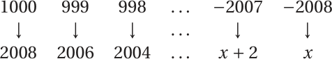

<small>

* answer:-4008
* questionType:ShortAnswer

</small>

## Lahendus

Arvust $1000$ arvuni $-2008$ jõudmiseks tuleb teha $1000 - (-2008) = 3008$ sammu. Alumise rea arv väheneb iga sammuga $2$ võrra. Seega $3008$ sammu järel tekib arv $2008 - 2 \cdot 3008 = 2008 - 6016 = -4008$.

# <lo-sample/> EE.PK.2008TEST.9.4

Korrutis $5 \cdot 6$ jagub $N$ positiivse täisarvuga, korrutis $5 \cdot 6 \cdot 7$ jagub $M$ positiivse täisarvuga. Leia $\frac{M}{N}$.

<small>

* answer:2
* questionType:ShortAnswer

</small>

## Lahendus

Et $7$ on algarv, siis arvu $5 \cdot 6$ igale jagajale $x$ vastab kaks arvu $5 \cdot 6 \cdot 7$ jagajat: $x$ ja $7x$. Järelikult on teisel arvul jagajaid kaks korda rohkem kui esimesel.

# <lo-sample/> EE.PK.2008TEST.9.5

Leia $x + 2y$, kui on teada, et $3x + 2y = 14$ ja $x + 6y = 22$.

<small>

* answer:9
* questionType:ShortAnswer

</small>

## Lahendus

Liidame võrduste $3x + 2y = 14$ ja $x + 6y = 22$ pooled, saame $4x + 8y = 36$. Jagame tulemuse pooled $4$-ga, saame $x + 2y = 9$.

# <lo-sample/> EE.PK.2008TEST.9.6

On antud ring pindalaga $4\pi\ \text{cm}^2$ ja sama pindalaga kolmnurk, mille ühe külje pikkus on võrdne ringi raadiusega. Kui pikk on kolmnurga sellele küljele tõmmatud kõrgus?

<small>

* answer:$4\pi$ cm
* questionType:ShortAnswer

</small>

## Lahendus

Kui $r$ on ringi raadius, siis kehtib seos $\pi r^2 = 4\pi\ \text{cm}^2$, millest $r = 2$ cm. Kui $h$ on kolmnurga kõrgus, siis kehtib seos $\frac{1}{2} \cdot r \cdot h = 4\pi\ \text{cm}^2$, millest $h = 4\pi$ cm.

# <lo-sample/> EE.PK.2008TEST.9.7

Kolmnurgad $ABC$ ja $PQR$ on võrdkülgsed. Leia nurga $CXY$ suurus.

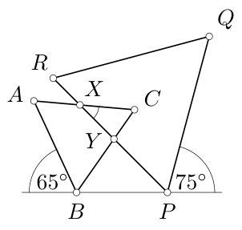

<small>

* answer:$40^\circ$
* questionType:ShortAnswer

</small>

## Lahendus

Et kolmnurgad on võrdkülgsed, siis $\angle BPR = 180^\circ - 75^\circ - 60^\circ = 45^\circ$ ja $\angle PBC = 180^\circ - 65^\circ - 60^\circ = 55^\circ$. Kolmnurgast $BPY$ leiame nüüd $\angle BYP = 180^\circ -55^\circ -45^\circ = 80^\circ$. Järelikult ka $\angle CYX = 80^\circ$. Et $\angle XCY = 60^\circ$, siis $\angle CXY = 180^\circ - 80^\circ - 60^\circ = 40^\circ$.

# <lo-sample/> EE.PK.2008TEST.9.8

Jukul on tempel, mille jäljend on näidatud vasakul. Milline on vähim arv templivajutusi, millega saab moodustada joonisel näidatud kujundi?

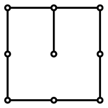

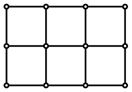

<small>

* answer:3
* questionType:ShortAnswer

</small>

## Lahendus

Keskmise rea kolm horisontaaljoont saab moodustada ainult kolme erineva templivajutusega. Pärast neid kolme vajutust on ka kõik ülejäänud jooned olemas.

# <lo-sample/> EE.PK.2008TEST.9.9

Täisnurkse kolmnurga $ABC$ kaatetil $AC$ on märgitud punkt $M$ nii, et see jaotab selle kaateti kaheks võrdseks osaks. Hüpotenuusil $BC$ on märgitud punkt $D$ nii, et lõik $MD$ on risti hüpotenuusiga. Leia kolmnurga $ABC$ pindala, kui $|MD| = 3,5$ cm ja $|BC| = 10$ cm.

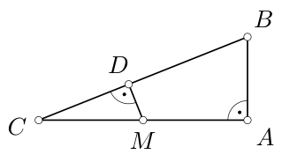

<small>

* answer:$35\ \text{cm}^2$
* questionType:ShortAnswer

</small>

## Lahendus

Kolmnurga $BCM$ pindala on $\frac{1}{2} \cdot 10 \cdot 3,5\ \text{cm}^2 = \frac{35}{2}\ \text{cm}^2$. Kolmnurga $ABC$ pindala on kolmnurga $BCM$ pindalast kaks korda suurem, sest tema alus $AC$ on kaks korda pikem, kuid kõrgused on samad. Otsitav pindala on seega $35\ \text{cm}^2$.

# <lo-sample/> EE.PK.2008TEST.9.10

Mitme eri pikkusega servi võib olla nelinurksel püstprismal? Tee ring ümber sobivatele arvudele.

$1 \quad 2 \quad 3 \quad 4 \quad 5 \quad 6 \quad 7 \quad 8 \quad 9 \quad 10 \quad 11 \quad 12$

<small>

* answer:1, 2, 3, 4 ja 5
* questionType:ShortAnswer

</small>

## Lahendus

Püstprisma alusel võib olla $4$, $3$, $2$ või $1$ erineva pikkusega serva. Püstprisma kõrgus võib aluse mõne serva pikkusega kokku langeda või olla neist kõigist erinev. Nelinurksel püstprismal saab olla niisiis kas $5$, $4$, $3$, $2$ või $1$ erineva pikkusega serva.
