# <lo-sample/> EE.PK.2009TEST.7.1

Aprēķini:

$$
\frac{2007 + 2 \cdot (2008 + 2009 + 2010) + 2011}{2009}
$$

<small>

* answer:8
* questionType:ShortAnswer

</small>

## Atrisinājums

Izmantojot vienādības $2007 + 2011 = 2 \cdot 2009$ un $2008 + 2010 = 2 \cdot 2009$, iegūstam, ka

$$
\frac{2007 + 2 \cdot (2008 + 2009 + 2010) + 2011}{2009}
=
\frac{2 \cdot 2009 + 2 \cdot (3 \cdot 2009)}{2009}
=
$$

$$
=
\frac{8 \cdot 2009}{2009}
= 8.
$$

# <lo-sample/> EE.PK.2009TEST.7.2

Saliec iekavas tā, lai būtu spēkā vienādība:

$$
1 + 2 \cdot 3 - 4 : 5 = 1.
$$

<small>

* answer:$((1 + 2)\cdot 3 - 4) : 5 = 1$
* questionType:ShortAnswer

</small>

## Atrisinājums

$((1 + 2) \cdot 3 - 4) : 5 = (3 \cdot 3 - 4) : 5 = 5 : 5 = 1.$

# <lo-sample/> EE.PK.2009TEST.7.3

Skaitli 222000000999 dala ar skaitli 111. Cik ciparu ir dalījumā?

<small>

* answer:10
* questionType:ShortAnswer

</small>

## Atrisinājums

Tā kā $222\ 000\ 000\ 999 : 111 = 2\ 000\ 000\ 009$, tad dalījums ir 10 ciparu skaitlis.

# <lo-sample/> EE.PK.2009TEST.7.4

Sareizina visus nepāra skaitļus, sākot ar skaitli 1 un beidzot ar skaitli 2009. Atrodi reizinājuma vienu ciparu.

<small>

* answer:5
* questionType:ShortAnswer

</small>

## Atrisinājums

Nepāra skaitļu reizinājums vienmēr ir nepāra skaitlis. Starp dotajiem skaitļiem ir skaitlis 5. Ja kādu nepāra skaitli reizina ar 5, rezultāts vienmēr ir skaitlis, kas beidzas ar 5.

# <lo-sample/> EE.PK.2009TEST.7.5

Dots $\angle AOB = 58^\circ$ un $\angle AOC = 24^\circ$ (sk. zīmējumu). $OB_1$ ir leņķa $AOB$ bisektrise un $OC_1$ – leņķa $AOC$ bisektrise. Atrodi leņķa $B_1OC_1$ lielumu.

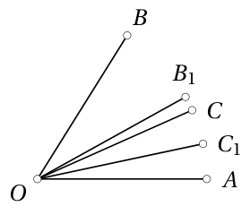

<small>

* answer:$17^\circ$
* questionType:ShortAnswer

</small>

## Atrisinājums

$\angle B_1OC_1 = \frac{1}{2}\angle AOB - \frac{1}{2}\angle AOC = \frac{1}{2}\cdot 58^\circ - \frac{1}{2}\cdot 24^\circ = 17^\circ.$

# <lo-sample/> EE.PK.2009TEST.7.6

Kvadrāta katra mala sadalīta trīs vienādās daļās. Tumši iekrāsotā četrstūra virsotnes atrodas kvadrāta malu dalījuma punktos (sk. zīmējumu). Atrodi kvadrāta malas garumu, ja tumši iekrāsotā četrstūra laukums ir $50\ \text{cm}^2$.

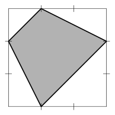

<small>

* answer:10 cm
* questionType:ShortAnswer

</small>

## Atrisinājums

Novelkam tumši iekrāsotā četrstūra diagonāles un redzam, ka tumši iekrāsotās daļas laukums ir tieši puse no kvadrāta laukuma (1. zīmējums). Tātad kvadrāta laukums ir $100\ \text{cm}^2$, no kā izriet, ka kvadrāta malas garums ir 10 cm.

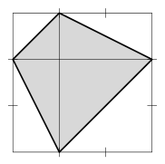

# <lo-sample/> EE.PK.2009TEST.7.7

Punkti $A$, $B$ un $C$ atrodas uz vienas taisnes, un punkti $K$ un $L$ atrodas ārpus šīs taisnes (sk. zīmējumu). Nogriežņu $AB$ un $BC$ garumi ir veseli skaitļi, un $|AK| = |KB| = 4$ un $|BL| = |LC| = 5$. Atrodi nogriežņa $AC$ lielāko iespējamo garumu.

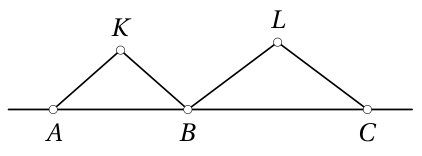

<small>

* answer:16
* questionType:ShortAnswer

</small>

## Atrisinājums

Zinām, ka $|AB| < |AK| + |KB| = 4 + 4 = 8$ un $|BC| < |BL| + |LC| = 5 + 5 = 10$. Tātad nogriežņa $AB$ lielākais iespējamais veselais garums ir 7 un nogriežņa $BC$ lielākais iespējamais veselais garums ir 9. Līdz ar to nogriežņa $AC$ lielākais iespējamais garums ir 16.

# <lo-sample/> EE.PK.2009TEST.7.8

Uz rūtiņu papīra atzīmēti 13 punkti, kā parādīts zīmējumā. Cik ir kvadrātu, kuru visas virsotnes atrodas atzīmētajos punktos? (Jāieskaita arī tie kvadrāti, kas nesakrīt ar rūtiņu papīra rūtiņām.)

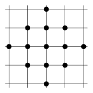

<small>

* answer:11
* questionType:ShortAnswer

</small>

## Atrisinājums

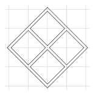

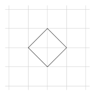

Teiksim, ka rūtiņu tīkls sastāv no vienības kvadrātiem. Tad ir

* 1 kvadrāts, kura malas garums ir vienāds ar vienības kvadrāta diagonāles divkāršu garumu; 5 kvadrāti, kuru malas garums ir vienāds ar vienības kvadrāta diagonāles garumu (2. un 3. zīmējums);
* 1 kvadrāts, kura malas garums ir vienāds ar vienības kvadrāta divkāršu malas garumu; 4 kvadrāti, kuru malas garums ir vienāds ar vienības kvadrāta malas garumu (4. zīmējums).

Tātad ir tieši 11 kvadrāti.

# <lo-sample/> EE.PK.2009TEST.7.9

Jaunajā kompaktdiskā ir dziesmas gan igauņu, gan krievu valodā. Vairāk nekā $95\%$ dziesmu ir igauņu valodā. Kāds ir mazākais iespējamais dziesmu skaits šajā diskā?

<small>

* answer:21
* questionType:ShortAnswer

</small>

## Atrisinājums

Saskaņā ar uzdevuma nosacījumiem ir vismaz viena dziesma krievu valodā. Tā kā dziesmu krievu valodā ir mazāk nekā $5\%$, tad dziesmu skaitam jābūt lielākam par $1 : 0,05 = 20$. Mazākais iespējamais dziesmu skaits ir 21, jo, ja diskā ir tieši 20 dziesmas igauņu valodā un 1 krievu valodā, uzdevuma nosacījumi ir izpildīti.

# <lo-sample/> EE.PK.2009TEST.7.10

No kuba ar izmēriem $3 \times 3 \times 3$ izņemti daži vienības kubi un iegūts zīmējumā redzamais ķermenis. Cik vienības kubu ir izņemti?

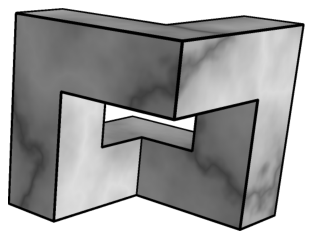

<small>

* answer:15
* questionType:ShortAnswer

</small>

## Atrisinājums

Tieši saskaitot, atrodam, ka palikuši 12 vienības kubi. Tātad izņemti $3 \cdot 3 \cdot 3 - 12 = 27 - 12 = 15$ vienības kubi.

# <lo-sample/> EE.PK.2009TEST.8.1

Skaitļi $A$, $B$, $C$, $D$ un $E$ ir pieci pēc kārtas sekojoši naturāli skaitļi augošā secībā. Atrodi skaitļu $A$ un $E$ summu, ja $B + C + D = 63$.

<small>

* answer:42
* questionType:ShortAnswer

</small>

## Atrisinājums

Tā kā $B$, $C$ un $D$ ir trīs pēc kārtas sekojoši naturāli skaitļi, iegūstam $B + C + D = C - 1 + C + C + 1 = 3C = 63$, no kurienes $C = 21$. Tātad $A + E = 21 - 2 + 21 + 2 = 42$.

# <lo-sample/> EE.PK.2009TEST.8.2

Saliec iekavas tā, lai būtu spēkā vienādība:

$$1 : 2 + 3 : 4 : 5 = 4.$$

<small>

* answer:$1 : ((2 + 3) : 4 : 5) = 4$
* questionType:ShortAnswer

</small>

## Atrisinājums

$1 : ((2 + 3) : 4 : 5) = 1 : (5 : 4 : 5) = 1 : (1 : 4) = 4$.

# <lo-sample/> EE.PK.2009TEST.8.3

Juku, kārtojot drēbju skapi, atklāja, ka pusei no viņa kreisās rokas cimdiem un divām trešdaļām no labās rokas cimdiem trūkst pāra. Cik procentiem Juku cimdu nav pāra?

<small>

* answer:60%
* questionType:ShortAnswer

</small>

## Atrisinājums

Pieņemsim, ka kreisās rokas cimdu skaits ir $2x$, tad pāris ir $x$ kreisās rokas cimdiem. Tātad pāris ir $x$ labās rokas cimdiem, tāpēc labās rokas cimdu ir $3x$. Pavisam cimdu ir $2x + 3x = 5x$, un no tiem bez pāra ir $x + 2x = 3x$. Tātad bez pāra ir $\frac{3x}{5x} \cdot 100\% = 60\%$.

# <lo-sample/> EE.PK.2009TEST.8.4

Visus pirmskaitļus, kas nav lielāki par 2009, sareizina. Atrodi reizinājuma vienu ciparu.

<small>

* answer:0
* questionType:ShortAnswer

</small>

## Atrisinājums

Starp reizinājuma reizinātājiem ir pirmskaitļi 2 un 5, tāpēc reizinājumam jādalās ar 10.

# <lo-sample/> EE.PK.2009TEST.8.5

Cik ir tādu naturālu skaitļu $m$, ka kādam naturālam skaitlim $n$ izpildās $m^n = 16$?

<small>

* answer:3
* questionType:ShortAnswer

</small>

## Atrisinājums

Iespējas ir $16^1$, $4^2$ un $2^4$, tātad pavisam 3 iespējas.

# <lo-sample/> EE.PK.2009TEST.8.6

Divi kvadrāti pārklājas, kā parādīts zīmējumā. Atrodi leņķu $x$ un $y$ summu.

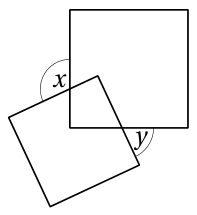

<small>

* answer:$180^\circ$
* questionType:ShortAnswer

</small>

## Atrisinājums

*1. atrisinājums.* Kvadrātu kopīgā daļa ir četrstūris, kura divi leņķi ir $90^\circ$ un divi leņķi ir attiecīgi vienādi ar leņķiem $x$ un $y$. Tā kā četrstūra iekšējo leņķu summa ir $360^\circ$, tad leņķu $x$ un $y$ summa ir $180^\circ$.

*2. atrisinājums.* Novelkam ar mazākā kvadrāta malām paralēlas taisnes, kas iet caur lielā kvadrāta virsotni, kura atrodas mazākā kvadrāta iekšpusē (5. zīmējums). Paralēlām taisnēm krustojoties ar trešo taisni, iegūtie atbilstošie leņķi ir vienādi, tātad leņķu $x$ un $y$ summai jābūt $180^\circ$.

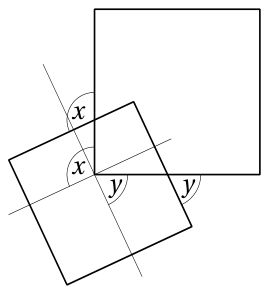

# <lo-sample/> EE.PK.2009TEST.8.7

Kvadrāta katra mala sadalīta piecās vienādās daļās. Tumši iekrāsotā četrstūra virsotnes atrodas kvadrāta malu dalījuma punktos (sk. zīmējumu). Atrodi kvadrāta malas garumu, ja tumši iekrāsotās daļas laukums ir par $8$ cm$^2$ lielāks nekā kvadrāta neiekrāsotās daļas laukums.

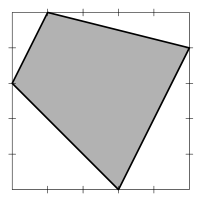

<small>

* answer:10 cm
* questionType:ShortAnswer

</small>

## Atrisinājums

*1. atrisinājums.* Uzskatot vienu lielā kvadrāta malas daļu par garuma vienību, redzam, ka lielais kvadrāts sastāv no 25 vienības kvadrātiem. Ievērosim, ka tumši iekrāsotās daļas laukums ir par 2 vienības kvadrātu laukumu lielāks nekā neiekrāsotās daļas laukums (6. zīmējums). Tā kā šī starpība ir $8$ cm$^2$, tad viena vienības kvadrāta malas garums ir 2 cm un tātad lielā kvadrāta malas garums ir 10 cm.

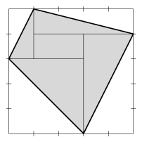

*2. atrisinājums.* Pieņemsim, ka kvadrāta malas garums ir $5a$. Kvadrāta neiekrāsotās daļas (četru taisnleņķa trijstūru) laukums šajā gadījumā ir

$$\frac{a \cdot 2a}{2} + \frac{a \cdot 4a}{2} + \frac{2a \cdot 4a}{2} + \frac{3a \cdot 3a}{2} = a^2 + 2a^2 + 4a^2 + \frac{9}{2}a^2 = \frac{23}{2}a^2.$$

Tātad iekrāsotās daļas laukums ir $25a^2 - \frac{23}{2}a^2 = \frac{27}{2}a^2$, un iekrāsotās un neiekrāsotās daļas laukumu starpība ir $\frac{27}{2}a^2 - \frac{23}{2}a^2 = 2a^2$. Pēc uzdevuma nosacījumiem $2a^2 = 8$ cm$^2$, no kurienes $a = 2$ cm. Tātad kvadrāta malas garums ir $5a = 10$ cm.

# <lo-sample/> EE.PK.2009TEST.8.8

Nogrieznis sadalīts četrās daļās tā, ka pirmās daļas garums ir vienāds ar otrās un trešās daļas garumu summu. Divas garākās daļas abas ir 4 cm garas. Atrodi visa nogriežņa garumu.

<small>

* answer:12 cm
* questionType:ShortAnswer

</small>

## Atrisinājums

Tā kā pirmā daļa acīmredzot ir garāka par otro un trešo daļu un tā kā teikts, ka divas garākās daļas abas ir 4 cm garas, tad tikpat gara kā pirmā daļa var būt tikai ceturtā. Tātad pirmā un ceturtā daļa ir 4 cm garas, un otrās un trešās garumu summa arī ir 4 cm. Līdz ar to visa nogriežņa garums ir 12 cm.

# <lo-sample/> EE.PK.2009TEST.8.9

Uz rūtiņu papīra atzīmēti 9 punkti, kā parādīts zīmējumā. Cik ir tādu vienādsānu taisnleņķa trijstūru, kuru visas virsotnes atrodas atzīmētajos punktos?

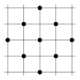

<small>

* answer:28
* questionType:ShortAnswer

</small>

## Atrisinājums

Uzskaitām rūtiņu tīklā esošos taisnleņķa trijstūrus pēc hipotenūzas garuma:

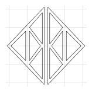

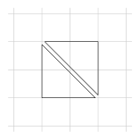

* trijstūri, kuru hipotenūzas garums ir 2 vienības kvadrāta malas – 16; trijstūri, kuru hipotenūzas garums ir 4 vienības kvadrāta malas – 4 (7. zīmējums un tā par $90^\circ$ pagrieztais variants).
* trijstūri, kuru hipotenūzas garums ir 2 vienības kvadrāta diagonāles – 8 (8. un 9. zīmējums un pirmā zīmējuma par $90^\circ$ pagrieztais variants);

# <lo-sample/> EE.PK.2009TEST.8.10

No kuba ar izmēriem $3 \times 3 \times 3$ izņemti daži vienības kubi un iegūts zīmējumā redzamais ķermenis. Atrodi šī ķermeņa pilnas virsmas laukumu.

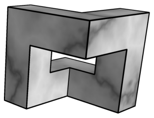

<small>

* answer:48
* questionType:ShortAnswer

</small>

## Atrisinājums

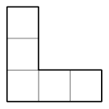

Tieši saskaitot, noskaidrojas, ka iegūtajam ķermenim ir 6 skaldnes, kas attēlotas 10. zīmējumā, un arī 6 skaldnes, kas attēlotas 11. zīmējumā. Kopumā ķermeņa pilnas virsmas laukums ir $6 \cdot 5 + 6 \cdot 3 = 30 + 18 = 48$.

# <lo-sample/> EE.PK.2009TEST.9.1

Skaitļi $A$, $B$, $C$, $D$ un $E$ ir pieci pēc kārtas sekojoši naturāli skaitļi augošā secībā. Atrodi skaitļu $B$ un $D$ summu, ja $A + C + E = 63$.

<small>

* answer:42
* questionType:ShortAnswer

</small>

## Atrisinājums

Tā kā $A + C + E = C - 2 + C + C + 2 = 3C = 63$, tad $C = 21$. Tātad $B + D = 21 - 1 + 21 + 1 = 42$.

# <lo-sample/> EE.PK.2009TEST.9.2

Atrodi pirmo 2009 pozitīvo nepāra skaitļu vidējo aritmētisko.

<small>

* answer:2009
* questionType:ShortAnswer

</small>

## Atrisinājums

Pirmie 2009 pozitīvie nepāra skaitļi ir: $1, 3, 5, \ldots, 4015, 4017$. Pirmā un pēdējā summa ir 4018, otrā un priekšpēdējā summa ir 4018 utt. Šādu pāru ir 1004, turklāt paliek vidējais skaitlis 2009. Tātad šo skaitļu summa ir $1004 \cdot 4018 + 2009 = (1004 \cdot 2 + 1) \cdot 2009$, un to vidējais aritmētiskais ir $\frac{(1004 \cdot 2 + 1) \cdot 2009}{2009} = 2009$.

# <lo-sample/> EE.PK.2009TEST.9.3

Pirmskaitļiem $p$ un $q$ ir spēkā vienādība $4p + 11q = 66$. Atrodi skaitļu $p$ un $q$ summu.

<small>

* answer:13
* questionType:ShortAnswer

</small>

## Atrisinājums

Tā kā $4p$ un 66 dalās ar 2, tad arī $11q$ jādalās ar 2, un tātad $q = 2$. Tā kā $4p = 44$, tad $p = 11$ un $p + q = 2 + 11 = 13$.

# <lo-sample/> EE.PK.2009TEST.9.4

Cik ir tādu veselu skaitļu $m$, ka kādam veselam skaitlim $n$ izpildās $m^n = 81$?

<small>

* answer:5
* questionType:ShortAnswer

</small>

## Atrisinājums

Iespējas ir $81^1$, $9^2$, $(-9)^2$, $3^4$ un $(-3)^4$, tātad pavisam 5 iespējas.

# <lo-sample/> EE.PK.2009TEST.9.5

Izteiksmē $(a + b + c + d)(a + b - c - d)$ atver iekavas un savelk līdzīgos locekļus. Cik saskaitāmo ir rezultātā?

<small>

* answer:6
* questionType:ShortAnswer

</small>

## Atrisinājums

$(a + b + c + d)(a + b - c - d) = (a + b)^2 - (c + d)^2$. Tā kā divu saskaitāmo summas kvadrātā ir trīs saskaitāmie, tad izteiksmē, kas iegūta pēc līdzīgo locekļu savilkšanas, ir 6 saskaitāmie.

# <lo-sample/> EE.PK.2009TEST.9.6

No vienā reklāmas pauzē parādītajiem klipiem mazāk nekā 50%, bet vairāk nekā 40% reklamēja pārtikas produktus. Atrodi mazāko iespējamo klipu skaitu šajā pauzē.

<small>

* answer:7
* questionType:ShortAnswer

</small>

## Atrisinājums

Pieņemsim, ka pauzē parādīto reklāmas klipu skaits ir $x$ un pārtikas produktu reklāmas klipu skaits ir $y$. Jāatrod mazākā iespējamā $x$ vērtība, pie kuras iespējams, ka $0{,}4 < \frac{y}{x} < 0{,}5$. Tieša pārbaude parāda, ka šāda daļa ar mazāko saucēju ir $\frac{3}{7}$.

# <lo-sample/> EE.PK.2009TEST.9.7

Divi kvadrāti pārklājas, kā parādīts zīmējumā. Atrodi leņķu $x$ un $y$ summu.

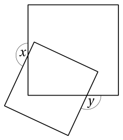

<small>

* answer:$270^\circ$
* questionType:ShortAnswer

</small>

## Atrisinājums

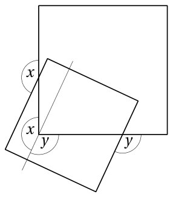

12. zīmējums

1. atrisinājums. Kvadrātu kopīgā daļa ir piecstūris, kura trīs leņķi ir $90^\circ$. Leņķu $x$ un $y$ summa ir vienāda ar piecstūra divu netaisno leņķu summu: $x + y = (5 - 2) \cdot 180^\circ - 3 \cdot 90^\circ = 270^\circ$.

2. atrisinājums. Novelkam ar mazākā kvadrāta malu paralēlu taisni, kas iet caur lielā kvadrāta virsotni, kura atrodas mazākā kvadrāta iekšpusē (12. zīmējums). Paralēlām taisnēm krustojoties ar trešo taisni, iegūtie atbilstošie leņķi ir vienādi, tātad leņķu $x$ un $y$ summai jābūt $270^\circ$.

# <lo-sample/> EE.PK.2009TEST.9.8

Kvadrāta katra mala sadalīta četrās vienādās daļās. Tumši iekrāsoto trijstūru virsotnes atrodas kvadrāta malu dalījuma punktos (sk. zīmējumu). Atrodi kvadrāta neiekrāsotās un tumši iekrāsotās daļas laukumu attiecību.

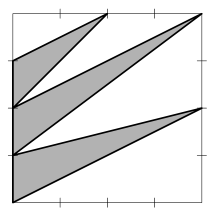

<small>

* answer:11 : 5
* questionType:ShortAnswer

</small>

## Atrisinājums

Uzskatot vienu lielā kvadrāta malas daļu par garuma vienību, redzam, ka lielais kvadrāts sastāv no 16 vienības kvadrātiem. Izmantojot trijstūra laukuma formulu ar pamatu un augstumu, atrodam, ka iekrāsotās daļas laukums ir $\frac{1}{2} \cdot 1 \cdot 4 + \frac{1}{2} \cdot 1 \cdot 4 + \frac{1}{2} \cdot 1 \cdot 2 = 5$ kvadrātvienības. Tātad tumši iekrāsotās daļas laukums veido $\frac{5}{16}$ no visa kvadrāta laukuma, un neiekrāsotās daļas laukums – $\frac{11}{16}$ no visa kvadrāta laukuma. Līdz ar to neiekrāsotās un tumši iekrāsotās daļas laukumu attiecība ir $11 : 5$.

# <lo-sample/> EE.PK.2009TEST.9.9

Uz pusriņķa līnijas ar diametru $KL$ un centru $O$ atrodas punkti $A$ un $B$ tā, ka nogrieznis $AL$ ir perpendikulārs nogrieznim $OB$. Atrodi leņķa $ABO$ lielumu, ja $\angle KOB = 110^\circ$.

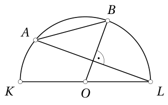

<small>

* answer:$55^\circ$
* questionType:ShortAnswer

</small>

## Atrisinājums

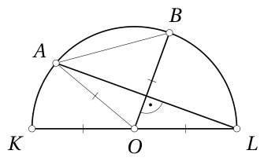

13. zīmējums

1. atrisinājums. Leņķis $BAL$ ir uz loka $BL$ balstīts ievilktais leņķis (13. zīmējums). Tā kā $\angle BOL = 70^\circ$, tad $\angle BAL = 35^\circ$. No taisnleņķa trijstūra iegūstam, ka $\angle ABO + \angle BAL = 90^\circ$, un tātad $\angle ABO = 55^\circ$.

2. atrisinājums. Tā kā $\angle BOL = 70^\circ$, tad no taisnleņķa trijstūra $\angle ALO = 20^\circ$. No vienādsānu trijstūra $AOL$ atrodam, ka $\angle AOL = 180^\circ - 2 \cdot 20^\circ = 140^\circ$. Tātad $\angle AOB = \angle AOL - \angle BOL = 70^\circ$, kas vienlaikus ir vienādsānu trijstūra $AOB$ virsotnes leņķis. No šejienes $\angle ABO = \frac{180^\circ - 70^\circ}{2} = 55^\circ$.

# <lo-sample/> EE.PK.2009TEST.9.10

Cik ir tādu taisnleņķa trijstūru, kuru visas virsotnes atrodas dotā kuba virsotnēs?

<small>

* answer:48
* questionType:ShortAnswer

</small>

## Atrisinājums

1. atrisinājums. Ievērosim, ka kuba katras skaldnes diagonāle var būt hipotenūza diviem taisnleņķa trijstūriem, kuru katetes tad ir šīs skaldnes divas šķautnes. Šādus taisnleņķa trijstūrus var iegūt 24.

Kuba katras skaldnes diagonāle var būt arī katete taisnleņķa trijstūrim, kura hipotenūza ir kuba diagonāle. Katras skaldnes katra diagonāle var būt katete diviem taisnleņķa trijstūriem. Šādus taisnleņķa trijstūrus var iegūt 24.

Tātad taisnleņķa trijstūru, kuru visas virsotnes atrodas kuba virsotnēs, ir 48.

2. atrisinājums. Kubam ir 8 virsotnes, tāpēc no šīm virsotnēm pavisam var izveidot $\binom{8}{3} = 56$ trijstūrus. Turklāt tieši tie trijstūri, kuru visas malas ir skaldņu diagonāles, nav taisnleņķa. Šādu trijstūru ir 8 (pa vienam ap katru kuba virsotni), tāpēc taisnleņķa trijstūru ir $56 - 8 = 48$.
