# <lo-sample/> EE.PK.2010TEST.7.1

Arv $a$ moodustab $2000\%$ arvust $b$. Leia jagatis $b : a$.

<small>

* answer:$1:20$
* questionType:ShortAnswer

</small>

## Lahendus

Arv $a$ on $\frac{2000\%}{100\%}=20$ korda suurem arvust $b$, seega $b:a=1:20$.

# <lo-sample/> EE.PK.2010TEST.7.2

Arvud $-\frac{1}{6}$, $\frac{1}{7}$, $-\frac{1}{4}$, $\frac{1}{5}$ ja $-\frac{1}{3}$ järjestatakse suuruse järjekorras. Milline neist arvudest on selles järjestuses keskmisel kohal?

<small>

* answer:$-\frac{1}{6}$
* questionType:ShortAnswer

</small>

## Lahendus

Et $-\frac{1}{3}<-\frac{1}{4}<-\frac{1}{6}<\frac{1}{7}<\frac{1}{5}$, siis suuruse järjestuses keskmisel kohal on arv $-\frac{1}{6}$.

# <lo-sample/> EE.PK.2010TEST.7.3

Aastaarvu $2010$ kahest esimesest numbrist moodustuv arv $20$ on täpselt kaks korda suurem kui tema kahest viimasest numbrist moodustuv arv $10$. Milline on järgmine sellise omadusega aastaarv?

<small>

* answer:$2211$
* questionType:ShortAnswer

</small>

## Lahendus

Aastaarvu kahest esimesest numbrist moodustuv arv peab olema paaris ja suurem kui $20$ (sest kahe esimese numbriga on ka kaks viimast numbrit üheselt määratud, mistõttu $20$ korral on $2010$ ainus sellise omadusega aastaarv). Vähim selline arv on $22$, mis annab aastaarvuks $2211$.

# <lo-sample/> EE.PK.2010TEST.7.4

Leia vähim positiivne täisarv, millega arvu $600$ korrutades saame mingi täisarvu ruudu.

<small>

* answer:$6$
* questionType:ShortAnswer

</small>

## Lahendus

Et $600=6\cdot 100$ ja $100=10^2$, siis tuleb arvu $600$ korrutada niisuguse arvuga $k$, et $k\cdot 6=m^2$, kus $m$ on mingi täisarv. Lihtne kontroll näitab, et $1\cdot 6=6$, $2\cdot 6=12$, $3\cdot 6=18$, $4\cdot 6=24$ ja $5\cdot 6=30$ ei ole täisarvude ruudud, ent $6\cdot 6=36=6^2$ ja $6\cdot 600=3600=60^2$.

# <lo-sample/> EE.PK.2010TEST.7.5

Ruudustikku kirjutatakse naturaalarvud $1$ kuni $10$ joonisel näidatud viisil. Kui palju on ruudustikus selliseid ristkülikuid, milles on täpselt üks paarisarv?

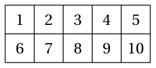

<small>

* answer:$21$
* questionType:ShortAnswer

</small>

## Lahendus

Iga otsitav ristkülik peab sisaldama täpselt üht arvudest $2$, $4$, $6$, $8$ ja $10$. Järgmises tabelis on näidatud eri suurusega sobivate ristkülikute arvud igaühe jaoks neist.

| Arv | $1\times 1$ | $1\times 2$ | $1\times 3$ | Kokku |
|---|---:|---:|---:|---:|
| $2$ | $1$ | $3$ | $1$ | $5$ |
| $4$ | $1$ | $3$ | $1$ | $5$ |
| $6$ | $1$ | $2$ | $0$ | $3$ |
| $8$ | $1$ | $3$ | $1$ | $5$ |
| $10$ | $1$ | $2$ | $0$ | $3$ |
| Kokku | $5$ | $13$ | $3$ | $21$ |

# <lo-sample/> EE.PK.2010TEST.7.6

Võrdhaarse kolmnurga $ABC$ alusel $BC$ valitakse punkt $D$ ja haara $AC$ pikendusel üle punkti $C$ valitakse punkt $E$ nii, et $|CD|=|CE|$. Leia nurga $BAC$ suurus, kui $\angle CED=25^\circ$.

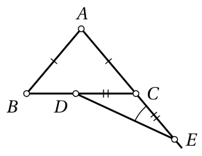

<small>

* answer:$80^\circ$
* questionType:ShortAnswer

</small>

## Lahendus

Võrdhaarsest kolmnurgast $DCE$ saame, et $\angle DCE=180^\circ-2\angle CED=130^\circ$, kust $\angle BCA=180^\circ-130^\circ=50^\circ$. Võrdhaarsest kolmnurgast $BAC$ saame nüüd, et $\angle BAC=180^\circ-2\angle BCA=80^\circ$.

# <lo-sample/> EE.PK.2010TEST.7.7

Leia tähe $N$ pindala, kui ühe ruudukese pindala on $1$ pindalaühik.

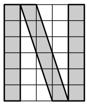

<small>

* answer:$18$ pindalaühikut
* questionType:ShortAnswer

</small>

## Lahendus

Kogu ruudustiku pindala on $5\cdot 6=30$ ja kummagi värvimata kolmnurga pindala on $\frac{1}{2}\cdot 2\cdot 6=6$, kust tumedaks värvitud tähe $N$ pindala on $30-2\cdot 6=18$ pindalaühikut.

# <lo-sample/> EE.PK.2010TEST.7.8

Täisnurkse kolmnurga $ABC$ tipu $A$ koordinaadid on $(-3;1)$, täisnurga tipu $B$ koordinaadid on $(-2;-2)$ ja tipp $C$ asub $x$-teljel. Joonesta koordinaattasandile kolmnurk $ABC$.

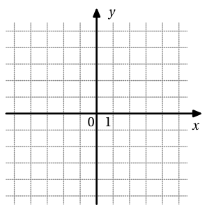

<small>

* answer:$(-3;1)$, $(-2;-2)$ ja $(4;0)$
* questionType:ShortAnswer

</small>

## Lahendus

Pöörates punkti $A$ $90^\circ$ võrra ümber keskpunkti $B$, saame punkti $A'(1;-1)$. Kolmnurga tipp $C$ peab niisiis paiknema sirge $BA'$ lõikepunktis $x$-teljega, kust leiame, et $C(4;0)$.

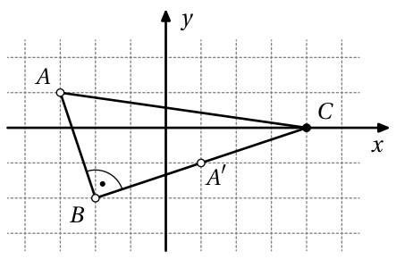

Joonis 1

# <lo-sample/> EE.PK.2010TEST.7.9

Ringi raadiused $OA$ ja $OB$ on risti ning punkt $C$ poolitab raadiuse $OA$. Leia tumedaks värvitud kujundi täpne pindala, kui $|OB|=2$ cm.

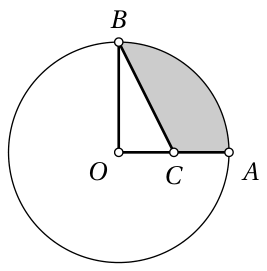

<small>

* answer:$(\pi-1)\ \mathrm{cm}^2$
* questionType:ShortAnswer

</small>

## Lahendus

Ringi pindala on $\pi\cdot 2^2=4\pi$ ruutsentimeetrit ja kõõlude $OA$ ja $OB$ vahele jääva veerandringi pindala seega $\pi\ \mathrm{cm}^2$. Et kolmnurga $BOC$ pindala on $\frac{1}{2}\cdot 2\cdot 1=1$ ruutsentimeetrit, siis värvitud kujundi pindala on $(\pi-1)\ \mathrm{cm}^2$.

# <lo-sample/> EE.PK.2010TEST.7.10

Ruut on jaotatud horisontaalse joonega pooleks. Kumbki pool on omakorda jaotatud joonisel näidatud viisil võrdseteks ristkülikuteks. Leia ruudu vähim võimalik küljepikkus, kui kõigi ristkülikute küljepikkused sentimeetrites on täisarvulised.

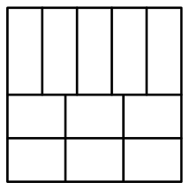

<small>

* answer:$60$ cm
* questionType:ShortAnswer

</small>

## Lahendus

Olgu ruudu küljepikkus $x$ sentimeetrit. Horisontaalsetest külgedest näeme, et $x$ peab jaguma arvudega $5$ ja $3$; vertikaalsetest külgedest näeme, et $x$ peab jaguma ka $4$-ga. Et arvud $3$, $4$ ja $5$ on paarikaupa ühistegurita, peab $x$ jaguma nende korrutisega $3\cdot 4\cdot 5=60$, st $x\geq 60$.

# <lo-sample/> EE.PK.2010TEST.8.1

Milline arvudest $a$, $b$, $c$, $d$, $e$ on suurim, kui $a = \frac{1}{3} + \frac{1}{4}$, $b = \frac{1}{3} - \frac{1}{4}$, $c = \frac{1}{3} \cdot \frac{1}{4}$, $d = \frac{1}{3} : \frac{1}{4}$ ja $e = \frac{1}{4} : \frac{1}{3}$?

<small>

* answer:$d$
* questionType:ShortAnswer

</small>

## Lahendus

Et arvud $a$, $b$, $c$ ja $e$ on kõik väiksemad kui $1$, kuid $d = \frac{4}{3} > 1$, siis $d$ on neist arvudest suurim.

# <lo-sample/> EE.PK.2010TEST.8.2

Aastaarvul 2010 on järgmine omadus: esimene number on suurem teisest, teine on väiksem kolmandast, kolmas on omakorda suurem neljandast numbrist. Milline oli eelmine sellise omadusega aastaarv?

<small>

* answer:1098
* questionType:ShortAnswer

</small>

## Lahendus

Kui otsitava 2010-st väiksema aastaarvu esimene number oleks 2, siis saaks teine number olla ainult 0 ja kolmas number peaks olema vähemalt 1, seega sellist 2010-st väiksemat aastaarvu ei leidu. Otsitava arvu esimene number on seega 1 ja teine number saab olla ainult 0. Et arv oleks võimalikult suur, võtame kolmandaks numbriks 9, siis neljas number saab olla ülimalt 8.

# <lo-sample/> EE.PK.2010TEST.8.3

Leia vähim positiivne täisarv, millega arv 2520 ei jagu.

<small>

* answer:11
* questionType:ShortAnswer

</small>

## Lahendus

Et arvu 2520 viimane number on 0, siis jagub ta 5 ja 10-ga. Et tema numbrite summa on 9, siis jagub ta ka 3 ja 9-ga. Paneme veel tähele, et $2520 = 8 \cdot 315 = 7 \cdot 360$ ning jaguvusest 8-ga järeldub ka jaguvus 2 ja 4-ga, jaguvusest 2-ga ja 3-ga aga järeldub jaguvus 6-ga. Seega jagub arv 2520 kõigi 11-st väiksemate positiivsete täisarvudega; arvuga 11 ta aga ei jagu, sest $2520 = 229 \cdot 11 + 1$.

# <lo-sample/> EE.PK.2010TEST.8.4

Ruudustikku kirjutatakse naturaalarvud 1 kuni 9 joonisel näidatud viisil. Kui palju on ruudustikus selliseid ristkülikuid, millesse kirjutatud arvude seas on täpselt üks täisarvu ruut?

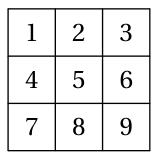

<small>

* answer:15
* questionType:ShortAnswer

</small>

## Lahendus

Iga otsitav ristkülik peab sisaldama täpselt üht arvudest 1, 4 ja 9. Järgmises tabelis on näidatud eri suurusega sobivate ristkülikute arvud igaühe jaoks neist.

| Arv | $1 \times 1$ | $1 \times 2$ | $1 \times 3$ | $2 \times 2$ | $2 \times 3$ | Kokku |
|---|---:|---:|---:|---:|---:|---:|
| 1 | 1 | 1 | 1 | 0 | 0 | 3 |
| 4 | 1 | 2 | 1 | 1 | 0 | 5 |
| 9 | 1 | 2 | 2 | 1 | 1 | 7 |
| Kokku | 3 | 5 | 4 | 2 | 1 | 15 |

# <lo-sample/> EE.PK.2010TEST.8.5

Kui suur on nurk, mis moodustab 25% oma kõrvunurgast?

<small>

* answer:$36^\circ$
* questionType:ShortAnswer

</small>

## Lahendus

Olgu otsitav nurk $x$, siis tema kõrvunurk on $4x$ ja võrdusest $x + 4x = 180^\circ$ leiame, et $x = 36^\circ$.

# <lo-sample/> EE.PK.2010TEST.8.6

Võrdkülgse kolmnurga külgedele on konstrueeritud ristkülikud. Leia kaarekesega märgitud nurkade suuruste summa.

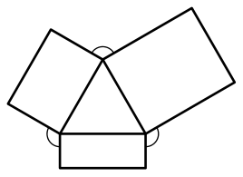

<small>

* answer:$360^\circ$
* questionType:ShortAnswer

</small>

## Lahendus

Iga kaarekesega märgitud nurga suurus on $360^\circ - 60^\circ - 2 \cdot 90^\circ = 120^\circ$ ning nende summa on seega $3 \cdot 120^\circ = 360^\circ$.

# <lo-sample/> EE.PK.2010TEST.8.7

Ristküliku $ABCD$ diagonaal on ristküliku $ACEF$ küljeks ning punkt $D$ asub küljel $EF$. Leia viisnurga $ABCEF$ pindala, kui $|AB| = 12$ cm ja $|BC| = 5$ cm.

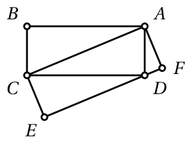

<small>

* answer:$90\ \mathrm{cm}^2$
* questionType:ShortAnswer

</small>

## Lahendus

Kolmnurga $ACD$ pindala moodustab poole sama aluse ja kõrgusega ristküliku $ACEF$ pindalast. Viisnurga $ABCEF$ pindala on niisiis

$$
S_{ABC} + S_{ACEF} = S_{ABC} + 2 \cdot S_{ACD} = 3 \cdot S_{ABC} = 3 \cdot \frac{1}{2} \cdot |AB| \cdot |BC| = 90\ \mathrm{cm}^2.
$$

# <lo-sample/> EE.PK.2010TEST.8.8

Võrdhaarse trapetsi $ABCD$ aluse $AB$ otspunktide koordinaadid on $A(-3;-1)$ ja $B(1;3)$ ning alus $CD$ läbib punkti $E(3;1)$ ja on kaks korda pikem alusest $AB$. Joonesta koordinaattasandile trapets $ABCD$.

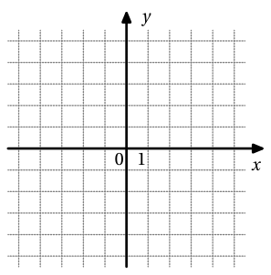

<small>

* answer:$(-3;-1)$, $(1;3)$, $(5;3)$, $(-3;-5)$
* questionType:ShortAnswer

</small>

## Lahendus

Paneme tähele, et $\angle ABE = 90^\circ$, ja leiame punkti $F$ nii, et $ABEF$ on ristkülik. Siis $F(-1;-3)$ (vt joonist 2) ning trapetsi tippude $C$ ja $D$ leidmiseks tuleb pikendada lõiku $EF$ poole tema pikkuse võrra vastavalt üle otspunkti $E$ ja üle otspunkti $F$. Niiviisi leiame, et $C(5;3)$ ja $D(-3;-5)$.

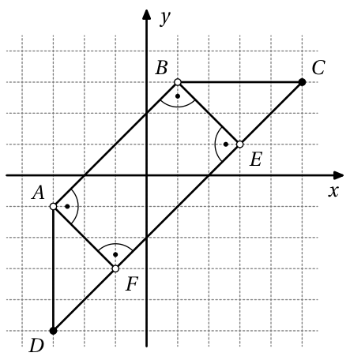

Joonis 2

# <lo-sample/> EE.PK.2010TEST.8.9

Ringi raadiusele $OA$ on konstrueeritud poolring. Leia tumedaks värvitud kujundi täpne ümbermõõt, kui raadiuste $OA$ ja $OB$ vaheline nurk on suurusega $30^\circ$ ja $|OA| = 6$ cm.

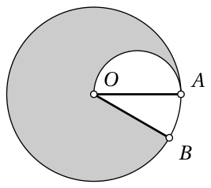

<small>

* answer:$(14\pi + 6)\ \mathrm{cm}$
* questionType:ShortAnswer

</small>

## Lahendus

Suure ringi ümbermõõt on $2\pi \cdot 6 = 12\pi$ sentimeetrit. Et kõõlude $OA$ ja $OB$ vahele jääva sektori kaar moodustab $\frac{30^\circ}{360^\circ} = \frac{1}{12}$ kogu ringjoonest, siis ringjoone ülejäänud osa pikkus on $\frac{11}{12} \cdot 12\pi = 11\pi$ sentimeetrit. Väikese poolringjoone pikkus on $\frac{1}{2} \cdot 2\pi \cdot 3 = 3\pi$ sentimeetrit ja raadiuse $OB$ pikkus on 6 cm, seega värvitud kujundi koguümbermõõt on $11\pi + 3\pi + 6 = 14\pi + 6$ sentimeetrit.

# <lo-sample/> EE.PK.2010TEST.8.10

Ruut on jaotatud neljaks võrdseks ruuduks, millest igaüks on omakorda jaotatud joonisel näidatud viisil võrdseteks ristkülikuteks. Leia suure ruudu vähim võimalik küljepikkus, kui kõigi ristkülikute küljepikkused sentimeetrites on täisarvulised.

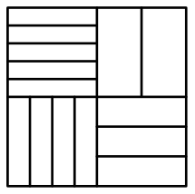

<small>

* answer:$120\ \mathrm{cm}$
* questionType:ShortAnswer

</small>

## Lahendus

Olgu ruudu küljepikkus $x$ sentimeetrit. Horisontaalsetest külgedest näeme, et $\frac{x}{2}$ peab jaguma arvudega 2 ja 4; vertikaalsetest külgedest näeme, et $\frac{x}{2}$ peab jaguma ka 3-ga ja 5-ga. Et arvud 3, 4 ja 5 on paarikaupa ühistegurita, peab $\frac{x}{2}$ jaguma nende korrutisega $3 \cdot 4 \cdot 5 = 60$, kust $x \geq 120$.

# <lo-sample/> EE.PK.2010TEST.9.1

Mitu korda tuleb arvu $2010$ vähemalt järjest kirjutada, et tekiks $18$-ga jaguv arv?

<small>

* answer:3
* questionType:ShortAnswer

</small>

## Lahendus

Et iga numbriga $0$ lõppev arv jagub $2$-ga, siis piisab leida, millal saadav arv jagub $9$-ga. Selleks peab tema numbrite summa jaguma $9$-ga, st arv $2010$, mille numbrite summa on $3$, tuleb järjest kirjutada vähemalt $3$ korda.

# <lo-sample/> EE.PK.2010TEST.9.2

Leia arvude $1 \cdot 2 \cdot 3 \cdot 4 \cdot 5 \cdot 6$ ja $6^3$ suurim ühistegur.

<small>

* answer:72
* questionType:ShortAnswer

</small>

## Lahendus

Et $1 \cdot 2 \cdot 3 \cdot 4 \cdot 5 \cdot 6 = 2 \cdot 5 \cdot 72$ ja $6^3 = 6 \cdot 36 = 3 \cdot 72$, siis jaguvad mõlemad antud arvud $72$-ga. Kuna ülejäävad kordajad $2 \cdot 5 = 10$ ja $3$ on ühistegurita, siis ongi $72$ antud arvude suurim ühistegur.

# <lo-sample/> EE.PK.2010TEST.9.3

Leia positiivne arv $n$, mille korral $2009 \cdot 2011 + 1 = n^2$.

<small>

* answer:2010
* questionType:ShortAnswer

</small>

## Lahendus

Et $2009 \cdot 2011 = (2010 - 1) \cdot (2010 + 1) = 2010^2 - 1$, siis $n = 2010$.

# <lo-sample/> EE.PK.2010TEST.9.4

Ruudustikku kirjutatakse naturaalarvud $1$ kuni $10$ joonisel näidatud viisil. Kui palju on ruudustikus selliseid ristkülikuid, millesse kirjutatud arvude seas on täpselt üks $3$-ga jaguv arv?

<small>

* answer:24
* questionType:ShortAnswer

</small>

## Lahendus

Iga otsitav ristkülik peab sisaldama täpselt üht arvudest $3$, $6$ ja $9$. Järgmises tabelis on näidatud eri suurusega sobivate ristkülikute arvud igaühe jaoks neist.

| Arv | $1 \times 1$ | $1 \times 2$ | $1 \times 3$ | $1 \times 4$ | $1 \times 5$ | $2 \times 2$ | Kokku |
|---|---:|---:|---:|---:|---:|---:|---:|
| $3$ | $1$ | $3$ | $3$ | $2$ | $1$ | $1$ | $11$ |
| $6$ | $1$ | $2$ | $1$ | $0$ | $0$ | $1$ | $5$ |
| $9$ | $1$ | $3$ | $2$ | $1$ | $0$ | $1$ | $8$ |
| Kokku | $3$ | $8$ | $6$ | $3$ | $1$ | $3$ | $24$ |

# <lo-sample/> EE.PK.2010TEST.9.5

Kui suur on võrdhaarse kolmnurga tipunurk, kui see moodustab $1600\%$ kolmnurga alusnurgast?

<small>

* answer:$160^\circ$
* questionType:ShortAnswer

</small>

## Lahendus

Olgu alusnurga suurus $x$, siis tipunurga suurus on $\frac{1600\%}{100\%} \cdot x = 16x$. Võrdusest $2x + 16x = 180^\circ$ leiame nüüd, et $x = 10^\circ$ ja tipunurga suuruseks saame $16x = 160^\circ$.

# <lo-sample/> EE.PK.2010TEST.9.6

Ringjoonel keskpunktiga $O$ asuvad punktid $A$, $B$, $C$ ja $D$, kusjuures $AD$ on ringjoone diameeter. Leia nurga $COD$ suurus, kui $\angle AOB = 50^\circ$ ja $\angle BDC = 30^\circ$.

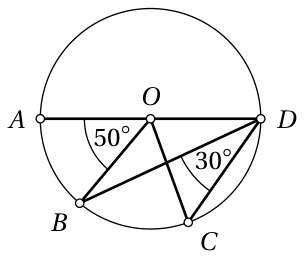

<small>

* answer:$70^\circ$
* questionType:ShortAnswer

</small>

## Lahendus

Et nurk $BDC$ on kõõlule $BC$ toetuv piirdenurk ja nurk $BOC$ samale kõõlule toetuv kesknurk, siis $\angle BOC = 2\angle BDC = 60^\circ$ ning

$$
\angle COD = 180^\circ - \angle AOB - \angle BOC = 180^\circ - 50^\circ - 60^\circ = 70^\circ .
$$

# <lo-sample/> EE.PK.2010TEST.9.7

Leia kaarekestega märgitud kuue nurga suuruste summa.

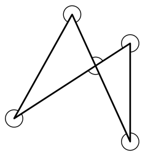

<small>

* answer:$1440^\circ$
* questionType:ShortAnswer

</small>

## Lahendus

Liites kaarekesega märgitud nurkadele kahe joonisel oleva kolmnurga sisenurgad, saime kokku $5 \cdot 360^\circ = 1800^\circ$. Kaarekesega märgitud nurkade summa on niisiis $1800^\circ - 2 \cdot 180^\circ = 1440^\circ$.

# <lo-sample/> EE.PK.2010TEST.9.8

Rombi kolme tipu koordinaadid on $(-1; 0)$, $(1; 2)$ ja $(2; -1)$. Kirjuta rombi neljanda tipu võimalike asukohtade koordinaadid.

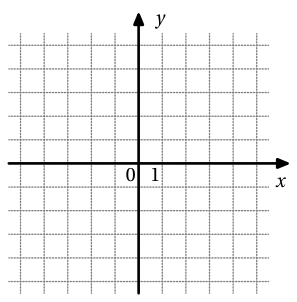

<small>

* answer:$(-2;3)$
* questionType:ShortAnswer

</small>

## Lahendus

Tähistame $A(-1;0)$, $B(2;-1)$ ja $C(1;2)$ (vt joonist 3), siis lõigud $AB$ ja $BC$ on ühepikkused ja lõik $AC$ on neist lühem (viimase väite põhjenduseks vt joonisel 4 kujutatud täisnurkset kolmnurka, mille hüpotenuus ja kaatet on vaadeldavate lõikudega sama pikad). Seega peab rombi neljas tipp $D$ paiknema tipu $B$ vastas, st tema ainus võimalik asukoht on $D(-2;3)$.

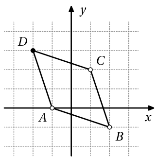

Joonis 3

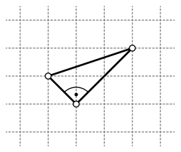

Joonis 4

# <lo-sample/> EE.PK.2010TEST.9.9

Kolmnurga $ABC$ külgedel $AB$ ja $BC$ võetakse punktid $M$ ja $N$ nii, et $|AM| = 2|MB|$ ja $|CN| = 2|NB|$. Küljel $AC$ valitakse mingi punkt $P$. Leia kolmnurga $ABC$ pindala, kui nelinurga $PMBN$ pindala on $12\ \mathrm{cm}^2$.

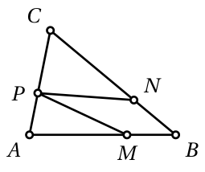

<small>

* answer:$36\ \mathrm{cm}^2$
* questionType:ShortAnswer

</small>

## Lahendus

Et $|CN| = 2|NB|$, siis kolmnurga $CNP$ pindala on kaks korda suurem kolmnurga $BNP$ pindalast (sest nende tipust $P$ tõmmatud kõrgused on võrdsed). Analoogiliselt saame, et kolmnurga $AMP$ pindala on kaks korda suurem kolmnurga $BMP$ pindalast. Niisiis on kolmnurga $ABC$ selle osa pindala, mis jääb nelinurgast $PMBN$ väljapoole, kaks korda suurem nelinurga $PMBN$ pindalast, ning kolmnurga $ABC$ kogupindala on kolm korda suurem nelinurga $PMBN$ pindalast, st $3 \cdot 12 = 36$ ruutsentimeetrit.

# <lo-sample/> EE.PK.2010TEST.9.10

Joonisel on näidatud risttahuka pinnalaotus, kus iga tahk on jaotatud võrdseteks ristkülikuteks. Leia risttahuka vähim võimalik ruumala, kui kõigi ristkülikute küljepikkused sentimeetrites on täisarvulised.

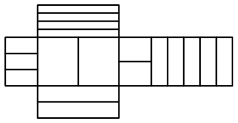

<small>

* answer:$240\ \mathrm{cm}^3$
* questionType:ShortAnswer

</small>

## Lahendus

Olgu risttahuka servapikkused joonisel kasvavas järjestuses $x$, $y$ ja $z$ sentimeetrit. Näeme, et $x$ peab jaguma $2$-ga ja $4$-ga, $y$ peab jaguma $2$-ga ja $3$-ga ning $z$ peab jaguma $2$-ga ja $5$-ga. Et VÜK $(2, 4) = 4$, VÜK $(2, 3) = 6$ ja VÜK $(2, 5) = 10$, siis on vähim võimalik ruumala $4 \cdot 6 \cdot 10 = 240$ kuupsentimeetrit.
