# <lo-sample/> EE.PK.2011TEST.7.1

Найти натуральное число $n$ такое, что $\frac{2^{100}+2^{99}}{3}=2^n$.

<small>

* answer:99
* questionType:ShortAnswer

</small>

## Решение

Вынося в числителе общий множитель $2^{99}$ за скобки, получаем

$$
\frac{2^{100}+2^{99}}{3}=\frac{2^{99}\cdot(2+1)}{3}=2^{99}.
$$

# <lo-sample/> EE.PK.2011TEST.7.2

Найти наименьшее положительное целое число $a$, при котором число $2011+a$ делится на число $201$.

<small>

* answer:200
* questionType:ShortAnswer

</small>

## Решение

Так как $2011=10\cdot 201+1$, то для деления на $201$ без остатка к числу $2011$ нужно прибавить $201-1=200$.

# <lo-sample/> EE.PK.2011TEST.7.3

В этой четверти Юра получил по математике только три двойки. Сколько пятёрок должен теперь получить Юра, чтобы его средняя оценка по математике была бы ровно $4$?

<small>

* answer:6
* questionType:ShortAnswer

</small>

## Решение

Заметим, что $2+5+5=12=3\cdot 4$, т.е. на одну двойку нужны две пятёрки, чтобы средняя оценка получилась $4$. Поэтому на три двойки нужно $6$ пятёрок.

# <lo-sample/> EE.PK.2011TEST.7.4

Найти все положительные целые числа $a$, при которых найдётся такое положительное целое число $b$, что

$$
\frac{1}{2}-\frac{b}{3}=\frac{1}{a}.
$$

<small>

* answer:6
* questionType:ShortAnswer

</small>

## Решение

Приводя дроби в левой части к общему знаменателю и выполняя вычитание, получаем $\frac{3-2b}{6}=\frac{1}{a}$, то есть $(3-2b)\cdot a=6$. Так как $b$ — положительное целое число, то единственное возможное положительное значение $3-2b$ равно $3-2\cdot 1=1$, при этом $a=6$. Если $3-2b$ отрицательно, то подходящего положительного числа $a$, очевидно, не существует.

# <lo-sample/> EE.PK.2011TEST.7.5

Сколько всего существует таких положительных целых чисел $n$, что $n\leqslant 100$, а дробь $\frac{n}{22}$ является несократимой?

<small>

* answer:45
* questionType:ShortAnswer

</small>

## Решение

Дробь $\frac{n}{22}$ является несократимой, если у чисел $n$ и $22$ нет общих простых множителей. Так как $22=2\cdot 11$, это означает, что $n$ не делится ни на $2$, ни на $11$. Значит, подходят все нечётные числа, меньшие $100$, которые не кратны $11$. Нечётных чисел, меньших $100$, всего $50$, а кратных $11$ среди них $5$ (это $11$, $33$, $55$, $77$ и $99$), поэтому подходящих чисел $50-5=45$.

# <lo-sample/> EE.PK.2011TEST.7.6

На координатной плоскости расположен прямоугольник, координаты вершин которого равны $(1;1)$, $(5;1)$, $(5;3)$ и $(1;3)$. Внутри прямоугольника обозначена точка $K$ с координатами $(2;2)$. Этот прямоугольник вместе с точкой $K$ поворачивают на $90^\circ$ по часовой стрелке вокруг точки $(5;1)$. Найти координаты точки $K$ после поворота.

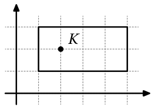

<small>

* answer:(6; 4)
* questionType:ShortAnswer

</small>

## Решение

На рисунке 1 показано расположение прямоугольника и точки $K$ до и после поворота. Видим, что после поворота координаты точки $K$ равны $(6; 4)$.

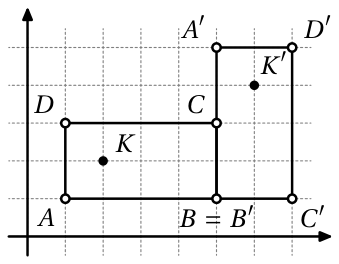

# <lo-sample/> EE.PK.2011TEST.7.7

На рисунке изображены два равнобедренных треугольника, углы при вершинах которых равны $40^\circ$ и $50^\circ$, и основания которых лежат на одной прямой. Найти величину угла $x$.

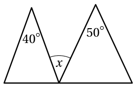

<small>

* answer:45°
* questionType:ShortAnswer

</small>

## Решение

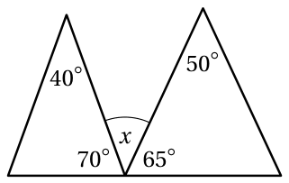

Величины углов при основаниях равнобедренных треугольников равны $\frac{180^\circ-40^\circ}{2}=70^\circ$ и $\frac{180^\circ-50^\circ}{2}=65^\circ$ (см. рисунок 2). Следовательно, $x=180^\circ-70^\circ-65^\circ=45^\circ$.

# <lo-sample/> EE.PK.2011TEST.7.8

Изображённая на рисунке фигура состоит из трёх квадратов, а площадь окрашенной тёмным цветом части равна $1\text{ дм}^2$. Найти площадь неокрашенной части фигуры.

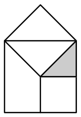

<small>

* answer:9 дм^2
* questionType:ShortAnswer

</small>

## Решение

Из рисунка 3 видно, что вся фигура состоит из $10$ равных треугольников, один из которых окрашен тёмным цветом. Следовательно, площадь неокрашенной части фигуры равна $10\text{ дм}^2-1\text{ дм}^2=9\text{ дм}^2$.

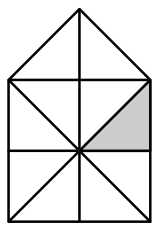

# <lo-sample/> EE.PK.2011TEST.7.9

Длина минутной стрелки часов равна $10\text{ см}$. За сколько времени кончик минутной стрелки пройдёт путь длиной $55\pi\text{ см}$?

<small>

* answer:2 часа 45 минут
* questionType:ShortAnswer

</small>

## Решение

Кончик минутной стрелки движется по окружности радиуса $10\text{ см}$ и длиной окружности $2\pi\cdot 10\text{ см}=20\pi\text{ см}$. Следовательно, минутная стрелка сделала $\frac{55\pi}{20\pi}=2\frac{3}{4}$ оборота, то есть прошло 2 часа и 45 минут.

# <lo-sample/> EE.PK.2011TEST.7.10

Маша складывает на столе горку из $20$ мандаринов в виде треугольной пирамиды. Первые $10$ мандаринов она кладёт на стол так, как показано на левом рисунке, на них она кладёт второй слой из $6$ мандаринов (каждый из которых опирается на три мандарина из нижнего слоя) и так далее.

Мандарины можно забирать из горки, поднимая их по одному. Но чтобы забрать мандарин, нельзя, чтобы он касался какого-либо мандарина, находящегося выше него. Сколько мандаринов нужно по крайней мере забрать из горки перед тем, как появится возможность получить мандарин с номером $6$?

<small>

* answer:7
* questionType:ShortAnswer

</small>

## Решение

Мандарин номер 6 касается мандаринов второго слоя 12, 14 и 15, которые, в свою очередь, касаются всех мандаринов третьего слоя. Следовательно, чтобы достать мандарин номер 6, сначала нужно полностью убрать четвёртый и третий слои, то есть мандарины 20, 17, 18 и 19, а затем мандарины 12, 14 и 15.

# <lo-sample/> EE.PK.2011TEST.8.1

Найти натуральное число $n$ такое, что $\frac{2^{2011}+2^{2010}}{6}=2^n$.

<small>

* answer:2009
* questionType:ShortAnswer

</small>

## Решение

Вынося в числителе за скобки общий множитель $2^{2010}$, получаем
$$\frac{2^{2011}+2^{2010}}{6}=\frac{2^{2010}\cdot(2+1)}{2\cdot3}=\frac{2^{2010}}{2}=2^{2009}.$$

# <lo-sample/> EE.PK.2011TEST.8.2

Найти наименьшее положительное целое число $a$, при котором число $2011+a$ делится на число 18.

<small>

* answer:5
* questionType:ShortAnswer

</small>

## Решение

Число делится на 18 тогда и только тогда, когда оно чётное и сумма его цифр делится на 9. Из чисел $2011+a$ наименьшее такое число — 2016, при $a=5$.

# <lo-sample/> EE.PK.2011TEST.8.3

В мешке лежат только красные и зелёные яблоки. Количество красных яблок составляет $\frac{3}{4}$ от количества зелёных яблок. Какую часть составляет количество красных яблок от количества всех яблок в мешке?

<small>

* answer:3/7
* questionType:ShortAnswer

</small>

## Решение

Пусть количество зелёных яблок равно $4n$, тогда количество красных яблок равно $\frac{3}{4}\cdot4n=3n$, а общее количество яблок равно $4n+3n=7n$. Следовательно, количество красных яблок составляет $\frac{3n}{7n}=\frac{3}{7}$ от общего количества яблок.

# <lo-sample/> EE.PK.2011TEST.8.4

Найти все положительные целые числа $a$, при которых найдётся такое положительное целое число $b$, что
$$\frac{b}{2}-\frac{b}{3}=\frac{1}{a}.$$

<small>

* answer:1, 2, 3, 6
* questionType:ShortAnswer

</small>

## Решение

Приводя дроби в левой части к общему знаменателю и выполняя вычитание, получаем $\frac{1}{a}=\frac{3b-2b}{6}=\frac{b}{6}$, то есть $ab=6$. Следовательно, подходят все делители числа 6: 1, 2, 3 и 6; соответствующие им значения $b$ равны 6, 3, 2 и 1.

# <lo-sample/> EE.PK.2011TEST.8.5

Сколько всего существует таких положительных целых чисел $n$, при которых как $\frac{n}{2}$, так и $2n$ являются трёхзначными натуральными числами?

<small>

* answer:150
* questionType:ShortAnswer

</small>

## Решение

Чтобы $\frac{n}{2}$ было натуральным числом, $n$ должно быть чётным. Из условия трёхзначности получаем, что $\frac{n}{2}\ge100$ и $2n<1000$, то есть $200\le n<500$. Таких чётных чисел $\frac{500-200}{2}=150$.

# <lo-sample/> EE.PK.2011TEST.8.6

На координатной плоскости расположен прямоугольник, координаты вершин которого равны $(1;1)$, $(5;1)$, $(5;4)$ и $(1;4)$. Внутри прямоугольника обозначена точка $K$ с координатами $(2;2)$. Этот прямоугольник вместе с точкой $K$ поворачивают два раза на $90^\circ$ против часовой стрелки: сначала вокруг точки $(5;1)$, а затем вокруг точки $(5;-3)$. Найти координаты точки $K$ после двух поворотов.

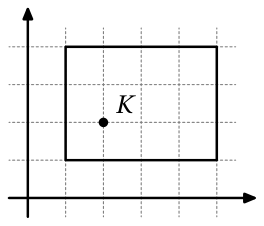

<small>

* answer:(4; -4)
* questionType:ShortAnswer

</small>

## Решение

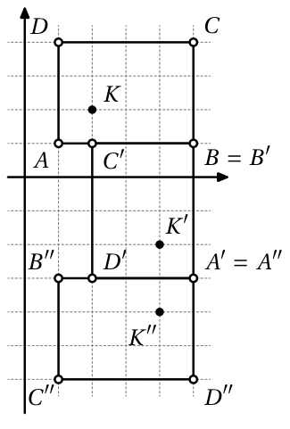

На рисунке 4 показано положение прямоугольника и точки $K$ вначале, после первого поворота и после второго поворота. Видим, что после двух поворотов координаты точки $K$ равны $(4;-4)$.

# <lo-sample/> EE.PK.2011TEST.8.7

Одна из вершин изображённого на рисунке четырёхугольника лежит в центре окружности, а три другие вершины лежат на окружности. Найти сумму величин углов, обозначенных буквами $x$ и $y$.

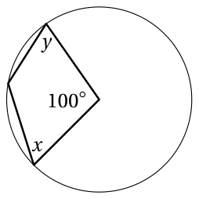

<small>

* answer:130°
* questionType:ShortAnswer

</small>

## Решение

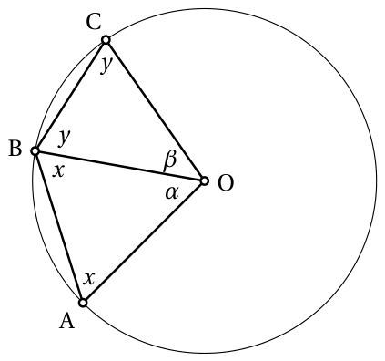

Разделим четырёхугольник $OABC$ диагональю, проведённой из вершины $O$, на два треугольника $OAB$ и $OBC$ (см. рисунок 5). Так как $|OA|=|OB|=|OC|$, то эти треугольники равнобедренные с углами при основаниях соответственно $x$ и $y$, а сумма их углов при вершинах $\alpha+\beta=100^\circ$. Следовательно, сумма внутренних углов четырёхугольника $OABC$ равна $2x+2y+100^\circ=360^\circ$, откуда $x+y=130^\circ$.

# <lo-sample/> EE.PK.2011TEST.8.8

На рисунке изображена равнобедренная трапеция, одно из оснований которой в 5 раз длиннее другого. Во сколько раз площадь трапеции больше площади окрашенного тёмным цветом прямоугольника?

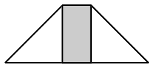

<small>

* answer:3
* questionType:ShortAnswer

</small>

## Решение

Пусть высота трапеции равна $h$, а длина меньшего основания равна $a$, тогда длина большего основания равна $5a$, и трапеция состоит из окрашенного тёмным цветом прямоугольника со сторонами $a$ и $h$ и двух равных прямоугольных треугольников с катетами длиной $2a$ и $h$ (см. рисунок 6). Тогда площадь всей трапеции равна $S=ah+2\cdot\frac{2a\cdot h}{2}=3ah$, то есть в 3 раза больше площади окрашенного тёмным цветом прямоугольника $ah$.

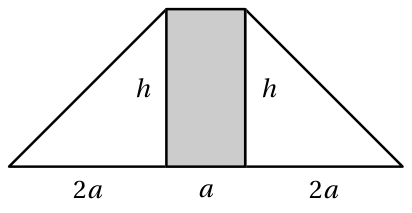

# <lo-sample/> EE.PK.2011TEST.8.9

На изображённой на рисунке клетчатой доске можно образовывать слова, передвигаясь с клетки на клетку через их общую сторону. Сколько всего существует возможностей для выбора пяти различных клеток так, чтобы передвигаясь по ним получить слово AHHAA?

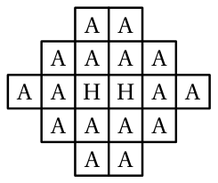

<small>

* answer:50
* questionType:ShortAnswer

</small>

## Решение

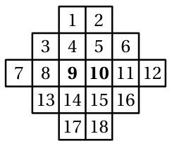

Для выбора букв H в слове AHHAA есть только две возможности, отличающиеся друг от друга порядком (9–10 или 10–9, если пронумеровать клетки так, как показано на рисунке 7).

При выборе 9–10 первая буква A должна находиться в какой-либо соседней с клеткой 9 клетке (4, 8 или 14), а четвёртая буква A — в какой-либо соседней с клеткой 10 клетке (5, 11 или 15). Пятая буква A, в свою очередь, должна находиться в какой-либо соседней с клеткой, содержащей четвёртую букву A, клетке (в зависимости от выбора четвёртой буквы A это соответственно 4, 2, 6 или 6, 12, 16 или 14, 16, 18). Так получаем $3\cdot3\cdot3=27$ возможностей выбора клеток, но две из них (4–9–10–5–4 и 5–10–9–4–5) не подходят, так как первая и последняя буквы A находятся в одной и той же клетке.

Итак, при выборе букв H 9–10 получаем 25 возможностей для выбора остальных букв. В силу симметрии второй выбор букв H 10–9 даёт столько же возможностей для выбора остальных букв, причём множества выбранных клеток во всех этих случаях различны — значит, всего возможностей 50.

# <lo-sample/> EE.PK.2011TEST.8.10

Маша складывает на столе горку из 20 мандаринов в виде треугольной пирамиды. Первые 10 мандаринов она кладёт на стол так, как показано на левом рисунке, на них она кладёт второй слой из 6 мандаринов (каждый из которых опирается на три мандарина из нижнего слоя) и так далее.

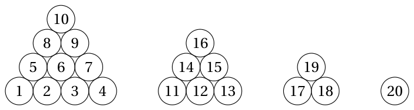

Мандарины можно забирать из горки, поднимая их по одному. Но чтобы забрать мандарин, нельзя, чтобы он касался какого-либо мандарина, находящегося выше него. Сколько мандаринов нужно по крайней мере забрать из горки перед тем, как появится возможность получить мандарин с номером 4?

<small>

* answer:3
* questionType:ShortAnswer

</small>

## Решение

Мандарин с номером 4 касается из второго слоя только мандарина с номером 13, который, в свою очередь, касается из третьего слоя только мандарина с номером 18, а тот касается единственного мандарина четвёртого слоя с номером 20. Поэтому, чтобы получить мандарин с номером 4, необходимо предварительно убрать мандарины 20, 18 и 13.

# <lo-sample/> EE.PK.2011TEST.9.1

Найти натуральное число $n$ такое, что $\frac{2^{2011} + 2^{2010} + 2^{2009}}{28} = 2^n$.

<small>

* answer:2007
* questionType:ShortAnswer

</small>

## Решение

Вынося в числителе за скобки общий множитель $2^{2009}$, получаем
$$
\frac{2^{2011} + 2^{2010} + 2^{2009}}{28} = \frac{2^{2009} \cdot (4 + 2 + 1)}{4 \cdot 7} = \frac{2^{2009}}{4} = 2^{2007}.
$$

# <lo-sample/> EE.PK.2011TEST.9.2

Найти такие положительные целые числа $a$ и $b$, что $2011 = 11a + b$, где $b < 11$.

<small>

* answer:a=182, b=9
* questionType:ShortAnswer

</small>

## Решение

Деля с остатком, получаем $2011 = 182 \cdot 11 + 9$, т. е. $a = 182$ и $b = 9$.

# <lo-sample/> EE.PK.2011TEST.9.3

В течение учебной четверти нужно было сдать 5 контрольных тестов. За каждый тест можно было получить до 100 баллов. Средний результат четырёх тестов Юры был равен 75 баллам. Скольким баллам может быть максимально равен средний результат пяти его тестов?

<small>

* answer:80 баллов
* questionType:ShortAnswer

</small>

## Решение

Так как средний результат четырёх тестов был равен 75 баллам, то за них Юра получил всего $4 \cdot 75 = 300$ баллов. Если за пятый тест он получит максимальные 100 баллов, то общая сумма равна $300 + 100 = 400$ баллам и средний результат пяти тестов равен $\frac{400}{5} = 80$ баллам.

# <lo-sample/> EE.PK.2011TEST.9.4

Найти все положительные целые числа $a$, при которых найдётся такое положительное целое число $b$, что
$$
\frac{4}{b} - \frac{b}{5} = \frac{1}{a}.
$$

<small>

* answer:5
* questionType:ShortAnswer

</small>

## Решение

Приводя дроби в левой части к общему знаменателю и выполняя вычитание, получаем $\frac{20 - b^2}{5b} = \frac{1}{a}$, т. е. $b^2 \le 20$. Возможные значения $b$ — это 1, 2, 3 и 4. При вычислении видим, что при $b = 1$, $b = 2$ и $b = 3$ значение левой части соответственно равно $\frac{19}{5}$, $\frac{8}{5}$ и $\frac{11}{15}$, что не представляется в виде $\frac{1}{a}$, где $a$ — натуральное число. Если $b = 4$, то получаем значение левой части $\frac{4}{4} - \frac{4}{5} = 1 - \frac{4}{5} = \frac{1}{5}$, откуда $a = 5$.

# <lo-sample/> EE.PK.2011TEST.9.5

Сколько всего существует таких положительных целых чисел $n$, при которых как $\frac{n}{3}$, так и $3n$ являются четырёхзначными натуральными числами?

<small>

* answer:112
* questionType:ShortAnswer

</small>

## Решение

Чтобы $\frac{n}{3}$ было натуральным числом, $n$ должно делиться на 3. Из условия четырёхзначности получаем, что $\frac{n}{3} \ge 1000$ и $3n < 10000$, т. е. $3000 \le n < 3333\frac{1}{3}$. Таких чисел, делящихся на 3, равно $\frac{3333 - 3000}{3} + 1 = 112$.

# <lo-sample/> EE.PK.2011TEST.9.6

На координатной плоскости расположен прямоугольник, координаты вершин которого равны $(1;1)$, $(5;1)$, $(5;4)$ и $(1;4)$. Внутри прямоугольника обозначена точка $K$ с координатами $(2;2)$. Этот прямоугольник вместе с точкой $K$ поворачивают два раза на $90^\circ$: сначала против часовой стрелки вокруг точки $(1;1)$, а затем по часовой стрелке вокруг точки $(-2;5)$. Найти координаты точки $K$ после двух поворотов.

<small>

* answer:(-5;3)
* questionType:ShortAnswer

</small>

## Решение

На рисунке 8 показано положение прямоугольника и точки $K$ вначале, после первого поворота и после второго поворота. Видим, что после двух поворотов координаты точки $K$ равны $(-5;3)$.

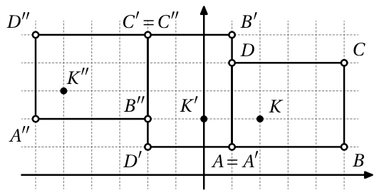

# <lo-sample/> EE.PK.2011TEST.9.7

Найти сумму величин углов, обозначенных на рисунке буквами $x$ и $y$.

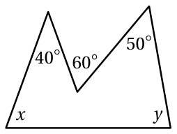

<small>

* answer:150°
* questionType:ShortAnswer

</small>

## Решение

Сумма внутренних углов пятиугольника равна $(5 - 2) \cdot 180^\circ = 540^\circ$. Так как величины внутренних углов данного в задаче пятиугольника равны $x$, $y$, $50^\circ$, $360^\circ - 60^\circ = 300^\circ$ и $40^\circ$, то $x + y + 50^\circ + 300^\circ + 40^\circ = 540^\circ$, откуда $x + y = 150^\circ$.

# <lo-sample/> EE.PK.2011TEST.9.8

Две окружности различной величины касаются друг друга внешним образом. Основания равнобедренной трапеции $ABCD$ являются диаметрами этих окружностей. Найти радиусы окружностей, если площадь трапеции равна $64\text{ см}^2$, а радиус одной окружности составляет $60\%$ от радиуса другой окружности.

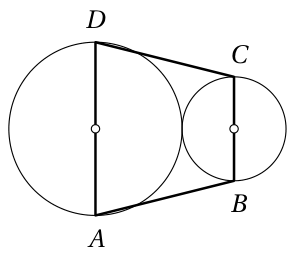

<small>

* answer:5 см и 3 см
* questionType:ShortAnswer

</small>

## Решение

Пусть радиус большей окружности равен $r$ см, тогда радиус меньшей окружности равен $0{,}6r$ см. Длины оснований трапеции равны соответственно $2r$ и $1{,}2r$ сантиметров, а высота равна $r + 0{,}6r = 1{,}6r$ сантиметров. Для площади трапеции в квадратных сантиметрах получаем равенство $\frac{2r + 1{,}2r}{2} \cdot 1{,}6r = 64$, или $(1{,}6r)^2 = 64$, откуда $1{,}6r = 8$ и $r = 5$. Радиус большей окружности, таким образом, равен $5\text{ см}$, а меньшей окружности — $0{,}6 \cdot 5\text{ см} = 3\text{ см}$.

# <lo-sample/> EE.PK.2011TEST.9.9

Сколько всего можно нарисовать различных ломаных, вершинами которых являются обозначенные на окружности точки (каждая точка по одному разу), которые начинаются с точки, обозначенной буквой M, и заканчиваются в точке, обозначенной буквой A, так, чтобы двигаясь вдоль такой ломаной, образовывалось слово MATEMAATIKA?

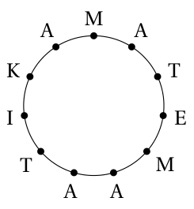

<small>

* answer:96
* questionType:ShortAnswer

</small>

## Решение

Запишем под каждой буквой слова MATEMAATIKA число возможностей выбора вершины, обозначенной этой буквой, если вершины, соответствующие предыдущим буквам, уже выбраны.
$$
\begin{array}{c|c|c|c|c|c|c|c|c|c|c}
\mathrm{M} & \mathrm{A} & \mathrm{T} & \mathrm{E} & \mathrm{M} & \mathrm{A} & \mathrm{A} & \mathrm{T} & \mathrm{I} & \mathrm{K} & \mathrm{A} \\
\hline
2 & 4 & 2 & 1 & 1 & 3 & 2 & 1 & 1 & 1 & 1
\end{array}
$$

Общее число возможностей равно произведению этих чисел, т. е. $2 \cdot 4 \cdot 2 \cdot 3 \cdot 2 = 96$.

# <lo-sample/> EE.PK.2011TEST.9.10

Маша складывает на столе горку из 20 мандаринов в виде треугольной пирамиды. Первые 10 мандаринов она кладёт на стол так, как показано на левом рисунке, на них она кладёт второй слой из 6 мандаринов (каждый из которых опирается на три мандарина из нижнего слоя) и так далее.

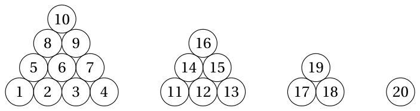

Мандарины можно забирать из горки, поднимая их по одному. Но чтобы забрать мандарин, нельзя, чтобы он касался какого-либо мандарина, находящегося выше него. Сколько мандаринов нужно по крайней мере забрать из горки перед тем, как появится возможность получить мандарин с номером 7?

<small>

* answer:5
* questionType:ShortAnswer

</small>

## Решение

Мандарин номер 7 касается мандаринов 13 и 15 из второго слоя, которые, в свою очередь, касаются мандаринов 18 и 19 из третьего слоя, а они касаются единственного мандарина четвёртого слоя номер 20. Поэтому, чтобы получить мандарин номер 7, нужно предварительно убрать мандарины 20, 18, 19, 13 и 15.
