# <lo-sample/> EE.PK.2012TEST.7.1

Maksājot par preci, pircējs iedod kasierim 19 simt eiro un 16 desmit eiro banknotes un saņem atpakaļ 48 viena eiro monētas. Cik viena eiro monētu pircējam vismaz vajadzētu, lai samaksātu par šo pirkumu tikai ar tām?

<small>

* answer:2012
* questionType:ShortAnswer

</small>

## Atrisinājums

Pircējs par preci maksā $19 \cdot 100 + 16 \cdot 10 - 48 = 2012$ eiro. Tātad pircējam vajadzētu vismaz 2012 viena eiro monētas, lai samaksātu tikai ar tām.

# <lo-sample/> EE.PK.2012TEST.7.2

Ja no skaitļa 2012 atņem četrciparu skaitli, ko iegūst, uzrakstot skaitļa 2012 ciparus pretējā secībā, tad iegūtā starpība ir negatīva. Atrodi mazāko naturālo skaitli, kas lielāks par 2012 un kuram šādi iegūtā divu četrciparu skaitļu starpība ir pozitīva. (Skaitlis nesākas ar ciparu 0.)

<small>

* answer:2021
* questionType:ShortAnswer

</small>

## Atrisinājums

Aplūkojamā starpība ir pozitīva, ja sākotnējais skaitlis ir lielāks par skaitli, ko iegūst, apgriežot tā ciparu secību. Lai tā būtu, sākotnējā skaitļa vienu cipars nedrīkst būt lielāks par tā tūkstošu ciparu, un turklāt vienu cipars nedrīkst būt 0, jo tad skaitlis, kas iegūts, apgriežot ciparu secību, sāktos ar ciparu 0. Tātad sākotnējā skaitļa vienu ciparam jābūt 1 vai 2. Pirmais šāds skaitlis, kas lielāks par 2012, ir 2021, kas arī der: $2021 - 1202 = 819 > 0$.

# <lo-sample/> EE.PK.2012TEST.7.3

Pieņemsim, ka $a$, $b$ un $c$ ir pēc kārtas sekojoši nepāra naturāli skaitļi, turklāt $a > b > c$. Atrodi izteiksmes $(a - b)(b - c)(c - a)$ vērtību.

<small>

* answer:-16
* questionType:ShortAnswer

</small>

## Atrisinājums

Tā kā pēc kārtas sekojoši nepāra skaitļi atšķiras viens no otra par 2 un $a > b > c$, tad $a - b = 2$, $b - c = 2$ un $c - a = -(a - c) = -4$. Tātad to reizinājums ir $2 \cdot 2 \cdot (-4) = -16$.

# <lo-sample/> EE.PK.2012TEST.7.4

Summā $2012 + 2012 + \ldots + 2012$ visi saskaitāmie ir vienādi. Atrodi mazāko iespējamo saskaitāmo skaitu, pie kura šī summa dalās ar skaitli 20.

<small>

* answer:5
* questionType:ShortAnswer

</small>

## Atrisinājums

Pieņemsim, ka aplūkojamajā summā ir $n$ saskaitāmie, tad summas vērtība ir $2012 \cdot n$. Ievērosim, ka $20 = 4 \cdot 5$, kur 5 ir pirmskaitlis. Tā kā skaitlis 2012 nedalās ar 5, tad, lai $2012 \cdot n$ dalītos ar 5, $n$ jādalās ar 5. Tā kā skaitlis 2012 dalās ar 4, šis nosacījums nodrošina arī summas $2012 \cdot n$ dalāmību ar 20. Tātad mazākais derīgais saskaitāmo skaits ir 5.

# <lo-sample/> EE.PK.2012TEST.7.5

Rūtiņu tīkla augšējā rindā atkārtoti pēc kārtas raksta vārdu KLASS, bet apakšējā rindā atkārtoti pēc kārtas raksta vārdu KASS. Katrā rūtiņā ir viens burts, un tukšu rūtiņu nav. Šajā rūtiņu tīklā ir 100 kolonnas. Cik kolonnās burti K atrodas viens pret otru?

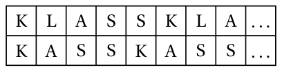

<small>

* answer:5
* questionType:ShortAnswer

</small>

## Atrisinājums

Augšējā rindā burts K atkārtojas ik pēc 5 kolonnām un apakšējā rindā ik pēc 4 kolonnām. Rūtiņu tīkla pirmajā kolonnā abās rindās ir K, un tāda pati situācija atkārtojas ik pēc $m$ kolonnām, kur $m = \text{MKD}(4, 5)$. Tā kā skaitļi 4 un 5 ir savstarpēji pirmskaitļi, to mazākais kopīgais dalāmais ir $4 \cdot 5 = 20$, t.i., burti K atrodas viens pret otru kolonnās 1, 21, 41, 61 un 81 jeb 5 kolonnās.

# <lo-sample/> EE.PK.2012TEST.7.6

Mari saskaita kādu trīs taisnstūra malu garumus un iegūst rezultātu 20 cm. Jüri saskaita kādu trīs tā paša taisnstūra malu garumus un iegūst rezultātu 22 cm. Atrodi taisnstūra perimetru.

<small>

* answer:28 cm
* questionType:ShortAnswer

</small>

## Atrisinājums

Taisnstūrim ir 2 garākās un 2 īsākās malas. Tā kā Jüri ieguva lielāku skaitli, viņa izvēlēto malu vidū bija jābūt 2 garākajām un 1 īsākajai malai, bet Mari izvēlēto malu vidū – 2 īsākajām un 1 garākajai malai. Tātad viņu atrasto garumu summa $20\ \text{cm} + 22\ \text{cm} = 42\ \text{cm}$ ir garākās un īsākās malas garumu summas trīskāršā vērtība, bet taisnstūra perimetrs ir garākās un īsākās malas garumu summas divkāršā vērtība. Tātad taisnstūra perimetrs ir $\frac{2}{3} \cdot 42\ \text{cm} = 28\ \text{cm}$.

# <lo-sample/> EE.PK.2012TEST.7.7

Atrodi taisnstūra paralēlskaldņa tumši iekrāsotās skaldnes laukumu, ja paralēlskaldņa tilpums ir $8\ \text{dm}^3$ un zīmējumā šķautnes garums dots centimetros.

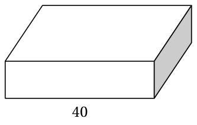

<small>

* answer:2 dm^2
* questionType:ShortAnswer

</small>

## Atrisinājums

Zīmējumā atzīmētās šķautnes garums ir $40\ \text{cm} = 4\ \text{dm}$. Tā kā šī šķautne ir pret paralēlskaldņa tumši iekrāsoto skaldni novilktais augstums, tad tumši iekrāsotās skaldnes laukums ir $\frac{8\ \text{dm}^3}{4\ \text{dm}} = 2\ \text{dm}^2$.

# <lo-sample/> EE.PK.2012TEST.7.8

Uz taisnstūra vienas malas uzzīmē vienādmalu trijstūri. Šī trijstūra vienu malu pagarina, kā parādīts zīmējumā. Atrodi platā leņķa $\alpha$ starp trijstūra malas pagarinājumu un taisnstūra malu lielumu.

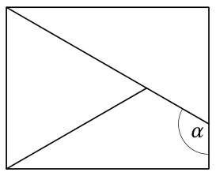

<small>

* answer:120°
* questionType:ShortAnswer

</small>

## Atrisinājums

Vienādmalu trijstūra iekšējā leņķa lielums ir $60^\circ$. Tā kā taisnstūra pretējās malas ir paralēlas, tad meklējamā leņķa $\alpha$ blakusleņķa lielums arī ir $60^\circ$, kā parādīts 1. zīmējumā. Tātad $\alpha = 180^\circ - 60^\circ = 120^\circ$.

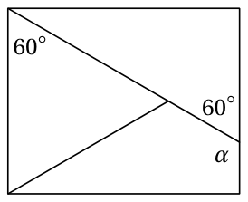

1. zīmējums

# <lo-sample/> EE.PK.2012TEST.7.9

Platleņķa trijstūra visi leņķi ir dažāda lieluma, un katra leņķa lielums ir vesels grādu skaits. Cik dažādi iespējamie lielumi ir šī trijstūra platajam leņķim?

<small>

* answer:87
* questionType:ShortAnswer

</small>

## Atrisinājums

Veselos grādos izteikta platā leņķa lielumam jābūt vismaz 91 grādam. Tā kā trijstūra pārējie divi leņķi ir dažāda lieluma un katra no tiem lielums arī ir vesels grādu skaits, tad to lielumu summa ir vismaz $1 + 2 = 3$ grādi. Tātad platā leņķa lielums var būt no 91 grāda līdz 177 grādiem. Šajā intervālā ir $177 - 91 + 1 = 87$ dažādi veseli skaitļi. Visi tie arī der, jo, ja platā leņķa lielums ir $n$ grādi, tad pārējo divu leņķu lielumi var būt 1 grāds un $180 - n - 1$ grādi, kur $1 < 180 - n - 1 < n$.

# <lo-sample/> EE.PK.2012TEST.7.10

Uz grozāma galda vienu uz otra novieto divus metamos kauliņus, kā parādīts zīmējumā. Uz katra kauliņa skaldnēm uzrakstīti naturālie skaitļi no 1 līdz 6 tā, ka uz pretējām skaldnēm esošo skaitļu summa ir 7. Atrodi uz kauliņu deviņām redzamajām skaldnēm esošo skaitļu lielāko iespējamo summu.

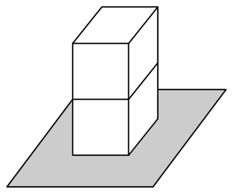

<small>

* answer:34
* questionType:ShortAnswer

</small>

## Atrisinājums

Uz viena kauliņa skaldnēm esošo skaitļu summa ir $1 + 2 + 3 + 4 + 5 + 6 = 21$, abiem kauliņiem kopā 42. Nav redzams apakšējā kauliņa viens pretējo skaldņu pāris, uz kura esošo skaitļu summa ir 7, un augšējā kauliņa viena skaldne, uz kuras esošais skaitlis ir vismaz 1. Tātad uz kauliņu redzamajām skaldnēm esošo skaitļu summa ir ne vairāk kā $42 - 7 - 1 = 34$.

# <lo-sample/> EE.PK.2012TEST.8.1

Skaitlim $2012$ ir šāda īpašība: jebkuri tā trīs blakus esošie cipari ir dažādi pēc kārtas sekojoši veseli skaitļi kaut kādā secībā. Atrodi mazāko piecciparu naturālo skaitli ar šādu īpašību.

<small>

* answer:10210
* questionType:ShortAnswer

</small>

## Atrisinājums

Atradīsim šī piecciparu skaitļa ciparus pa vienam no kreisās uz labo pusi, katrā solī izvēloties mazāko iespējamo ciparu. Tā kā skaitlis nesākas ar $0$, mazākais iespējamais pirmais cipars ir $1$; otrais cipars var būt $0$, un trešajam ciparam tad jābūt $2$, lai prasītais nosacījums būtu izpildīts. Ceturtais cipars pēc tam var būt tikai $1$; piektais cipars varētu būt $0$ vai $3$, no kuriem izvēlamies $0$.

# <lo-sample/> EE.PK.2012TEST.8.2

Divu veselu skaitļu summa ir $1$ un to reizinājums ir $-6$. Atrodi šo skaitļu lielāko iespējamo dalījumu.

<small>

* answer:$-\frac{2}{3}$
* questionType:ShortAnswer

</small>

## Atrisinājums

Skaitli $-6$ var izteikt kā divu veselu reizinātāju reizinājumu četros veidos: $-6 = 1 \cdot (-6) = (-1) \cdot 6 = 2 \cdot (-3) = (-2) \cdot 3$. Reizinātāju summu $1$ iegūstam tikai tad, ja par reizinātājiem ņem $-2$ un $3$. Tātad iespējamie dalījumi ir $\frac{-2}{3} = -\frac{2}{3}$ un $\frac{3}{-2} = -\frac{3}{2}$, no kuriem lielākais ir $-\frac{2}{3}$.

# <lo-sample/> EE.PK.2012TEST.8.3

Preces cenu decembrī paaugstināja par $25\%$ un janvārī samazināja atpakaļ līdz iepriekšējam līmenim. Par cik procentiem preces cena janvārī samazinājās salīdzinājumā ar decembra cenu?

<small>

* answer:$20\%$
* questionType:ShortAnswer

</small>

## Atrisinājums

Pieņemsim, ka $a$ ir preces sākotnējā cena. Tad pēc paaugstināšanas cena ir $1,25a$. Tā kā cena pēc jaunās samazināšanas ir vienāda ar sākotnējo cenu $a$, tad cenas samazinājums ir

$$
\frac{1,25a-a}{1,25a} \cdot 100\% = \frac{0,25}{1,25} \cdot 100\% = 20\%.
$$

# <lo-sample/> EE.PK.2012TEST.8.4

Uz tāfeles uzrakstīti visi naturālie skaitļi no $1$ līdz $n$. No šiem skaitļiem nodzēš visus tos, kas dalās vismaz ar vienu no skaitļiem $2$ un $3$. Uz tāfeles paliek $5$ skaitļi. Atrodi skaitļa $n$ lielāko iespējamo vērtību.

<small>

* answer:16
* questionType:ShortAnswer

</small>

## Atrisinājums

Uz tāfeles paliek skaitļi, kas nedalās ne ar $2$, ne ar $3$. Seši mazākie šādi naturālie skaitļi ir $1$, $5$, $7$, $11$, $13$ un $17$. Tā kā uz tāfeles paliek $5$ skaitļi, jābūt $n < 17$, t.i., lielākā iespējamā $n$ vērtība ir $16$.

# <lo-sample/> EE.PK.2012TEST.8.5

Rūtiņu tīkla augšējā rindā atkārtoti pēc kārtas raksta vārdu RUUT, bet apakšējā rindā atkārtoti pēc kārtas raksta vārdu RISTKÜLIK. Katrā rūtiņā ir viens burts, un tukšu rūtiņu nav. Pirmajā kolonnā burti R atrodas viens pret otru. Kurā kolonnā burti R nākamo reizi atrodas viens pret otru?

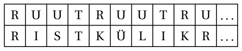

<small>

* answer:37. kolonnā
* questionType:ShortAnswer

</small>

## Atrisinājums

Augšējā rindā burts R atkārtojas ik pēc $4$ kolonnām un apakšējā rindā ik pēc $9$ kolonnām. Rūtiņu tīkla pirmajā kolonnā abās rindās ir R, un tāda pati situācija atkārtojas ik pēc $m$ kolonnām, kur $m = \mathrm{MKD}(4, 9)$. Tā kā skaitļi $4$ un $9$ ir savstarpēji pirmskaitļi, to mazākais kopīgais dalāmais ir $4 \cdot 9 = 36$, t.i., burti R nākamo reizi atrodas viens pret otru $37$. kolonnā.

# <lo-sample/> EE.PK.2012TEST.8.6

Atrodi trijstūra $ABC$ leņķa $BAC$ lielumu $\alpha$, ja nogriežņi $BD$ un $CD$ ir šī trijstūra leņķu bisektrises un leņķa $BDC$ lielums ir $5\alpha$.

<small>

* answer:$20^\circ$
* questionType:ShortAnswer

</small>

## Atrisinājums

Pieņemsim, ka $\beta = \angle DBA = \angle DBC$ un $\gamma = \angle DCA = \angle DCB$ (sk. $2$. zīmējumu). No trijstūra $BDC$ atrodam, ka $5\alpha + \beta + \gamma = 180^\circ$, no kurienes $\beta + \gamma = 180^\circ - 5\alpha$. No trijstūra $ABC$ tagad iegūstam, ka $\alpha + 2\beta + 2\gamma = 180^\circ$, no kurienes

$$
\alpha = 180^\circ - 2(\beta + \gamma) = 180^\circ - 2 \cdot (180^\circ - 5\alpha) = 10\alpha - 180^\circ,
$$

t.i., $9\alpha = 180^\circ$ jeb $\alpha = 20^\circ$.

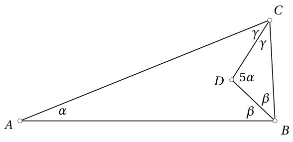

# <lo-sample/> EE.PK.2012TEST.8.7

Taisnstūris sadalīts divos taisnstūros, un tie savukārt – trijstūros. Zīmējumā trijstūros ierakstīti to laukumi kvadrātcentimetros. Taisnstūra vienas malas garums ir $4$ cm. Atrodi taisnstūra otras malas garumu $y$.

<small>

* answer:3 cm
* questionType:ShortAnswer

</small>

## Atrisinājums

Sadalām labās puses taisnstūri savukārt divos taisnstūros, kā parādīts $3$. zīmējumā. Lielais taisnstūris tagad sastāv no trim mazākiem taisnstūriem, no kuriem katra laukums ir vienāds ar tajā esošā trijstūra divkāršu laukumu. Tātad lielā taisnstūra laukums ir $6 + 4 + 2 = 12$ kvadrātcentimetri, un šī taisnstūra otras malas garums ir $\frac{12\ \text{cm}^2}{4\ \text{cm}} = 3$ cm.

# <lo-sample/> EE.PK.2012TEST.8.8

Taisnstūris sadalīts kvadrātos, kā parādīts zīmējumā. Mazākā kvadrāta laukums ir $1$ kvadrātvienība. Atrodi taisnstūra laukumu.

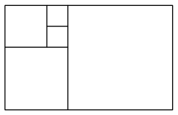

<small>

* answer:40 kvadrātvienības
* questionType:ShortAnswer

</small>

## Atrisinājums

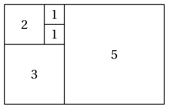

No $4$. zīmējuma redzams, ka kvadrātu malu garumi ir $1$, $1$, $2$, $3$ un $5$ vienības. Tātad taisnstūra laukums ir $1^2 + 1^2 + 2^2 + 3^2 + 5^2 = 1 + 1 + 4 + 9 + 25 = 40$ kvadrātvienības.

# <lo-sample/> EE.PK.2012TEST.8.9

Šaurleņķa trijstūra visi leņķi ir dažāda lieluma, un katra leņķa lielums ir vesels grādu skaits. Cik dažādi iespējamie lielumi ir šī trijstūra lielākajam leņķim?

<small>

* answer:29
* questionType:ShortAnswer

</small>

## Atrisinājums

Veselos grādos izteikta šaura leņķa lielums var būt ne vairāk kā $89$ grādi. No otras puses, trijstūra lielākajam leņķim jābūt lielākam par $\frac{180}{3} = 60$ grādiem. Tātad lielākā šaurā leņķa lielums var būt no $61$ grāda līdz $89$ grādiem. Šajā intervālā ir $89 - 61 + 1 = 29$ dažādi veseli skaitļi. Visi tie arī der, jo, ja lielākā šaurā leņķa lielums ir $n$ grādi, tad pārējo divu leņķu lielumi var būt $60$ grādi un $120 - n$ grādi, kur $120 - n < 60 < n$.

# <lo-sample/> EE.PK.2012TEST.8.10

Uz grozāma galda blakus novieto divus metamos kauliņus, kā parādīts zīmējumā. Uz katra kauliņa skaldnēm uzrakstīti naturālie skaitļi no $1$ līdz $6$ tā, ka uz pretējām skaldnēm esošo skaitļu summa ir $7$. Atrodi uz kauliņu astoņām redzamajām skaldnēm esošo skaitļu lielāko iespējamo summu.

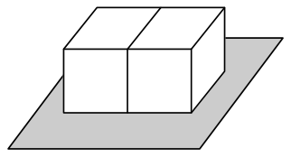

<small>

* answer:36
* questionType:ShortAnswer

</small>

## Atrisinājums

Uz viena kauliņa skaldnēm esošo skaitļu summa ir $1 + 2 + 3 + 4 + 5 + 6 = 21$, abiem kauliņiem kopā $42$. Katram kauliņam ir divas neredzamas skaldnes, kas nav viena otrai pretējās – uz tām esošo skaitļu summa ir vismaz $1 + 2 = 3$. Tātad uz kauliņu redzamajām skaldnēm esošo skaitļu summa ir ne vairāk kā $42 - 2 \cdot 3 = 36$.

# <lo-sample/> EE.PK.2012TEST.9.1

Skaitlim $2012$ ir šāda īpašība: ja izraksta katru divu tā blakus esošo ciparu summu, tad šīs summas $2$, $1$ un $3$ ir trīs pēc kārtas sekojoši veseli skaitļi kaut kādā secībā. Atrodi mazāko piecciparu naturālo skaitli, kam ir līdzīga īpašība, t.i., tā blakus esošo ciparu summas ir četri pēc kārtas sekojoši veseli skaitļi kaut kādā secībā.

<small>

* answer:10021
* questionType:ShortAnswer

</small>

## Atrisinājums

Atradīsim šī piecciparu skaitļa ciparus pa vienam no kreisās uz labo pusi, katrā solī izvēloties mazāko iespējamo ciparu. Tā kā skaitlis nesākas ar 0, mazākais iespējamais pirmais cipars ir 1. Otrais un trešais cipars var būt 0 – skaitļa pirmo divu ciparu summa tad ir 1, un otrā un trešā cipara summa ir 0. Skaitļa ceturtais cipars nevar būt 0 vai 1, jo tad summas atkārtotos, bet var būt 2, tad trešā un ceturtā cipara summa ir 2. Tātad divu pēdējo ciparu summai jābūt 3, t.i., par skaitļa pēdējo ciparu jāizvēlas 1.

# <lo-sample/> EE.PK.2012TEST.9.2

Par *palindromu* sauc skaitli, kas, lasot no beigām uz sākumu, dod to pašu skaitli. Piemēram, skaitļi $353$ un $5445$ ir palindromi. Atrodi mazāko tādu naturālo skaitli $k$, kuram skaitlis $k + 2573$ ir palindroms.

<small>

* answer:89
* questionType:ShortAnswer

</small>

## Atrisinājums

Mazākais palindroms, kas lielāks par skaitli 2573, ir 2662. No šejienes atrodam, ka $k = 2662 - 2573 = 89$.

# <lo-sample/> EE.PK.2012TEST.9.3

Trīs dažādu veselu skaitļu reizinājums ir $12$ un summa ir $3$. Atrodi šo trīs skaitļu mazākā skaitļa mazāko iespējamo vērtību.

<small>

* answer:-2
* questionType:ShortAnswer

</small>

## Atrisinājums

Izsakot skaitli 12 kā trīs veselu reizinātāju reizinājumu, reizinātāju absolūtajām vērtībām ir četras iespējas: $(1, 1, 12)$, $(1, 2, 6)$, $(1, 3, 4)$ un $(2, 2, 3)$. Tā kā reizinātāju summa 3 ir nepāra skaitlis, starp reizinātājiem jābūt vai nu 1, vai 3 nepāra skaitļiem – tā paliek absolūto vērtību trijnieki $(1, 2, 6)$ un $(2, 2, 3)$. No pirmā trijnieka summu 3 iegūstam tikai tad, ja reizinātāji ir $-1$, $-2$ un 6. No otrā trijnieka summu 3 iegūstam tikai tad, ja reizinātāji ir 2, $-2$ un 3, taču to reizinājums tad ir $-12$. Tātad vienīgā derīgā iespēja ir $12 = (-1) \cdot (-2) \cdot 6$, un mazākais reizinātājs tad ir $-2$.

# <lo-sample/> EE.PK.2012TEST.9.4

Pieņemsim, ka $a$ un $b$ ir pozitīvi skaitļi. Zināms, ka skaitlis $a$ veido $b$ procentus no skaitļa $b$, un skaitlis $b$ veido $a$ procentus no skaitļa $a$. Atrodi skaitļu $a$ un $b$ summu.

<small>

* answer:200
* questionType:ShortAnswer

</small>

## Atrisinājums

Pieņemsim, ka $b > a$, tad $b$ procenti no skaitļa $b$ ir vairāk nekā $a$ procenti no skaitļa $a$, t.i., $a > b$ – pretruna. Tāpat iegūstam pretrunu no pieņēmuma, ka $b < a$. Tātad $b = a$, un skaitlis $a$ veido $a$ procentus no sevis, t.i., $a = b = 100$ un $a + b = 200$.

# <lo-sample/> EE.PK.2012TEST.9.5

Rūtiņu tīkla augšējā rindā atkārtoti pēc kārtas raksta vārdu MATEMAATIKA, bet apakšējā rindā atkārtoti pēc kārtas raksta vārdu FÜÜSIKA. Katrā rūtiņā ir viens burts, un tukšu rūtiņu nav. Kurā kolonnā burti K pirmo reizi atrodas viens pret otru?

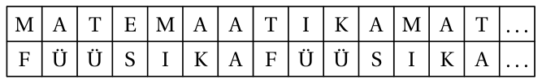

<small>

* answer:76. kolonnā
* questionType:ShortAnswer

</small>

## Atrisinājums

*1. atrisinājums.* Augšējā rindā burts K pirmo reizi parādās 10. kolonnā un tālāk ik pēc 11 kolonnām, t.i., kolonnās ar numuriem $10 + 11k$, kur $k = 0, 1, \ldots$ . Apakšējā rindā burts K pirmo reizi parādās 6. kolonnā un tālāk ik pēc 7 kolonnām, t.i., kolonnās ar numuriem $6 + 7m$, kur $m = 0, 1, \ldots$ . Burti K abās rindās atrodas viens pret otru, ja $10 + 11k = 6 + 7m$ jeb $11k + 4 = 7m$. Pēc kārtas pārbaudot skaitļus formā $11k + 4$, atrodam, ka pirmais no tiem, kas dalās ar 7, ir skaitlis $70 = 11 \cdot 6 + 4$, t.i., $k = 6$. Tātad meklējamās kolonnas numurs ir $10 + 11 \cdot 6 = 76$.

*2. atrisinājums.* Augšējā rindā burts K atkārtojas ik pēc 11 kolonnām un apakšējā rindā ik pēc 7 kolonnām. Papildinām rūtiņu tīklu pa kreisi ar divām kolonnām, lai to numuri ir 0 un $-1$. Tad kolonnā ar numuru $-1$ abās rindās ir K, un tāda pati situācija atkārtojas ik pēc $m$ kolonnām, kur $m = \mathrm{MKD}(11, 7)$. Tā kā skaitļi 11 un 7 ir savstarpēji pirmskaitļi, to mazākais kopīgais dalāmais ir $11 \cdot 7 = 77$, t.i., nākamo reizi burti K atrodas viens pret otru kolonnā ar numuru $-1 + 77 = 76$.

# <lo-sample/> EE.PK.2012TEST.9.6

Skaitlī $324$ visi cipari ir dažādi, un tas dalās ar katru savu ciparu. Atrodi mazāko trīsciparu skaitli ar šādu īpašību.

<small>

* answer:124
* questionType:ShortAnswer

</small>

## Atrisinājums

Atradīsim šī trīsciparu skaitļa ciparus pa vienam no kreisās uz labo pusi, katrā solī izvēloties mazāko iespējamo ciparu. Tā kā ar 0 dalīt nevar, mazākais iespējamais simtu cipars ir 1; mazākais iespējamais desmitu cipars tad ir 2, un vienu ciparam jābūt pāra, lai iegūtais skaitlis dalītos ar 2. Tātad mazākais iespējamais vienu cipars ir 4, un iegūtajam skaitlim 124 arī ir prasītā īpašība.

# <lo-sample/> EE.PK.2012TEST.9.7

Taisnstūra īsākā mala ir pusriņķa līnijas diametrs un vienādsānu trijstūra pamats. Vienādsānu trijstūra pamatam pretējā virsotne atrodas uz šīs pusriņķa līnijas. Atrodi platā leņķa $\alpha$ starp trijstūra vienas sānu malas pagarinājumu un taisnstūra garāko malu lielumu.

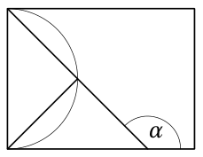

<small>

* answer:$135^\circ$
* questionType:ShortAnswer

</small>

## Atrisinājums

Tā kā vienādsānu trijstūra pamats ir pusriņķa līnijas diametrs un pretējā virsotne atrodas uz pusriņķa līnijas, tad virsotnes leņķa lielums ir $90^\circ$ (uz diametra balstīts ievilktais leņķis). Tātad vienādsānu trijstūra leņķis pie pamata ir $45^\circ$, un leņķa $\alpha$ blakusleņķis ir $180^\circ - 90^\circ - 45^\circ = 45^\circ$ (sk. 5. zīmējumu), no kurienes $\alpha = 180^\circ - 45^\circ = 135^\circ$.

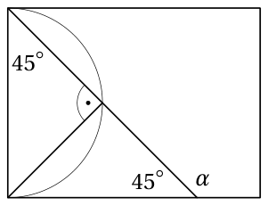

# <lo-sample/> EE.PK.2012TEST.9.8

Zīmējumā parādītā figūra sastāv no sešiem vienādiem vienādsānu trijstūriem. Cik reizes figūras baltās daļas laukums ir lielāks par tumši iekrāsotās daļas laukumu?

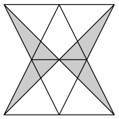

<small>

* answer:2
* questionType:ShortAnswer

</small>

## Atrisinājums

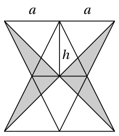

Pieņemsim, ka katra vienādsānu trijstūra pamata garums ir $a$ un augstums ir $h$ (sk. 6. zīmējumu). Visas figūras laukums tad ir $6 \cdot \frac{ah}{2} = 3ah$. Baltā daļa sastāv no diviem trijstūriem ar pamatu $2a$ un augstumu $h$, t.i., tās laukums ir $2 \cdot \frac{2ah}{2} = 2ah$, kas veido divas trešdaļas no visas figūras laukuma. Tātad tumši iekrāsotā daļa veido vienu trešdaļu no visas figūras laukuma, jeb baltā daļa ir 2 reizes lielāka par tumši iekrāsoto daļu.

# <lo-sample/> EE.PK.2012TEST.9.9

Trijstūra visi leņķi ir dažāda lieluma, un katra leņķa lielums ir vesels grādu skaits. Trijstūra lielākais un mazākais leņķis pēc lieluma atšķiras no vidējā leņķa par tieši vienādu grādu skaitu. Cik dažādi iespējamie lielumi ir šī trijstūra mazākajam leņķim?

<small>

* answer:59
* questionType:ShortAnswer

</small>

## Atrisinājums

Pieņemsim, ka pēc lieluma vidējais leņķis ir $n$ grādi, tad mazākais un lielākais leņķis ir attiecīgi $n - k$ un $n + k$ grādi, kur $k$ ir kāds naturāls skaitlis. Tātad $180 = n + (n - k) + n + k = 3n$, no kurienes $n = 60$. Tātad mazākā leņķa lielums var būt no 1 līdz 59 grādiem, un visi tie acīmredzot arī ir iespējami.

# <lo-sample/> EE.PK.2012TEST.9.10

Uz grozāma galda novieto četrus metamos kauliņus, kā parādīts zīmējumā. Uz katra kauliņa skaldnēm uzrakstīti naturālie skaitļi no $1$ līdz $6$ tā, ka uz pretējām skaldnēm esošo skaitļu summa ir $7$. Atrodi uz kauliņu $14$ redzamajām skaldnēm esošo skaitļu lielāko iespējamo summu.

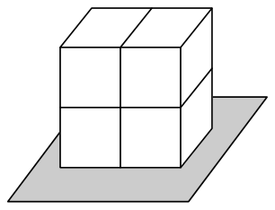

<small>

* answer:62
* questionType:ShortAnswer

</small>

## Atrisinājums

Uz viena kauliņa skaldnēm esošo skaitļu summa ir $1 + 2 + 3 + 4 + 5 + 6 = 21$, četriem kauliņiem kopā 84. Katram no diviem apakšējiem kauliņiem nav redzams viens pretējo skaldņu pāris, uz kura esošo skaitļu summa ir 7, un turklāt viena skaldne, uz kuras esošais skaitlis ir vismaz 1. Katram no diviem augšējiem kauliņiem ir divas neredzamas skaldnes, kas nav viena otrai pretējās, uz tām esošo skaitļu summa ir vismaz $1 + 2 = 3$. Tātad uz kauliņu redzamajām skaldnēm esošo skaitļu summa ir ne vairāk kā $84 - 2 \cdot (7 + 1) - 2 \cdot (1 + 2) = 84 - 16 - 6 = 62$.
