# <lo-sample/> EE.PK.2013TEST.7.1

Atrodi lielāko iespējamo nepāra skaitļu skaitu starp pieciem naturāliem skaitļiem $a$, $b$, $c$, $d$ un $e$, ja ir spēkā vienādība

$$a \cdot b \cdot c + d \cdot e = 2013.$$

<small>

* answer:4
* questionType:ShortAnswer

</small>

## Atrisinājums

Tā kā divu reizinājumu summa $2013$ ir nepāra skaitlis, viens reizinājums ir nepāra, bet otrs pāra. Pāra reizinājumā vismaz viens reizinātājs ir pāra skaitlis. Tātad no dotajiem pieciem skaitļiem vismaz vienam jābūt pāra skaitlim, ne vairāk kā četri var būt nepāra. Četri nepāra skaitļi arī ir iespējami, piemēram, $1 \cdot 1 \cdot 1 + 1 \cdot 2012 = 2013$.

# <lo-sample/> EE.PK.2013TEST.7.2

Kurš no šiem sešiem skaitļiem pēc lieluma ir vistuvāk skaitlim $1$?

$$0{,}54 \qquad 1{,}45 \qquad \frac{4}{5} \qquad \frac{5}{4} \qquad 1\frac{4}{5} \qquad \frac{55}{44}$$

<small>

* answer:$\frac{4}{5}$
* questionType:ShortAnswer

</small>

## Atrisinājums

$\left|1-\frac{4}{5}\right| = 0{,}2$, turpretī $\left|1-\frac{5}{4}\right| = \left|1-\frac{55}{44}\right| = 0{,}25$, un pārējie skaitļi acīmredzot ir vēl tālāk no skaitļa $1$.

# <lo-sample/> EE.PK.2013TEST.7.3

Olimpiādē piedalījušos $32$ skolēnu gala rezultātu vidū bija $24$ dažādas punktu summas. Atrodi lielāko iespējamo skolēnu skaitu, kuri par savu darbu varēja saņemt vienādu punktu summu.

<small>

* answer:9
* questionType:ShortAnswer

</small>

## Atrisinājums

Saskaņā ar nosacījumiem varam atrast $24$ skolēnus, kuri visi saņēma dažādas punktu summas. Paliek $8$ skolēni. Ja viņi visi saņēma vienādu punktu summu, tad šo punktu summu saņēmušo kopā ir $1 + 8$ jeb $9$.

No otras puses, ja kāda punktu summa būtu vismaz $10$ skolēniem, tad pārējās $23$ dažādās punktu summas būtu jāiegūst ne vairāk kā $32 - 10$ jeb $22$ skolēniem, kas nav iespējams.

# <lo-sample/> EE.PK.2013TEST.7.4

Zināms, ka Karls ir vecāks par Tiitu, bet jaunāks par Piretu. Elisa ir vecāka par Tiitu, un Viktors ir jaunāks par Anniki. Karls ir vecāks par Elisu, un Pireta ir jaunāka par Viktoru. Kurš no sešiem draugiem ir visvecākais?

<small>

* answer:Anniki
* questionType:ShortAnswer

</small>

## Atrisinājums

Saskaņā ar nosacījumiem Anniki ir vecāka par Viktoru, Viktors ir vecāks par Piretu, Pireta ir vecāka par Karlu, Karls ir vecāks par Elisu un Elisa ir vecāka par Tiitu. Tātad vecākā no šiem sešiem ir Anniki.

*Piezīme.* Pieņēmums, ka Karls ir vecāks par Tiitu, risinājumā nav vajadzīgs, jo tas izriet no pārējiem pieņēmumiem (Elisa ir vecāka par Tiitu, un Karls ir vecāks par Elisu).

# <lo-sample/> EE.PK.2013TEST.7.5

Naturāls skaitlis $m$ dalās ar skaitli $4$, un skaitlis $m + 1$ dalās ar skaitli $5$. Atrodi skaitļa $m + 2$ pēdējo ciparu.

<small>

* answer:6
* questionType:ShortAnswer

</small>

## Atrisinājums

Tā kā $m + 1$ dalās ar $5$, tad $m + 1$ beidzas vai nu ar $5$, vai ar $0$. Tātad $m$ beidzas vai nu ar $4$, vai ar $9$. Tā kā $m$ dalās ar $4$, tas ir pāra skaitlis, tāpēc tas nevar beigties ar $9$. Tātad $m$ beidzas ar $4$, un skaitļa $m + 2$ pēdējais cipars ir $6$.

# <lo-sample/> EE.PK.2013TEST.7.6

No riņķa līnijas centra $O$ iziet $3$ stari, kas sadala riņķi trīs sektoros, kuru leņķu lielumi ir $\alpha$, $\beta$ un $\gamma$. Leņķu $\alpha$ un $\beta$ summa ir izstiepts leņķis, leņķu $\beta$ un $\gamma$ summa ir $200^\circ$. Cik liela ir $\alpha$ un $\gamma$ summa?

<small>

* answer:$340^\circ$
* questionType:ShortAnswer

</small>

## Atrisinājums

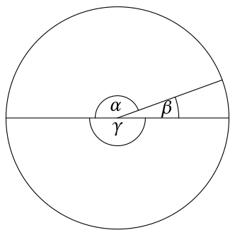

Pilnā leņķī ir $360$ grādi, t.i., $\alpha + \beta + \gamma = 360^\circ$. Tā kā $\alpha + \beta = 180^\circ$, tad $\gamma = 360^\circ - 180^\circ = 180^\circ$. Tagad no $\beta + \gamma = 200^\circ$ iegūstam $\beta = 20^\circ$. Tātad $\alpha = 180^\circ - \beta = 160^\circ$. Kopumā $\alpha + \gamma = 340^\circ$ (1. zīmējums).

# <lo-sample/> EE.PK.2013TEST.7.7

Taisnstūri, kura platums ir $10$ cm, sadala $5$ vienādos mazos taisnstūros, kā parādīts zīmējumā.

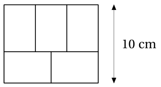

Cik liels ir viena mazā taisnstūra laukums?

<small>

* answer:$24\ \text{cm}^2$
* questionType:ShortAnswer

</small>

## Atrisinājums

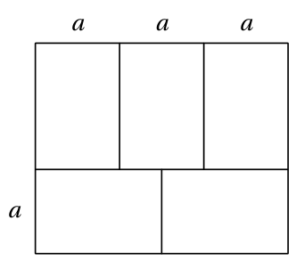

Pieņemsim, ka mazā taisnstūra īsākās malas garums ir $a$ (2. zīmējums). No lielā taisnstūra dalījuma horizontālā virzienā iegūstam, ka mazā taisnstūra garākās malas garums ir $\frac{3a}{2}$. No vertikālā virziena atrodam $a + \frac{3a}{2} = 10$ cm jeb $\frac{5}{2}a = 10$ cm, no kurienes $a = 4$ cm. Tātad mazā taisnstūra izmēri ir $4$ cm un $6$ cm, kas dod laukumu $24\ \text{cm}^2$.

# <lo-sample/> EE.PK.2013TEST.7.8

Kuba virsmas izklājuma perimetrs ir $70$ cm. Cik liels ir šī kuba tilpums?

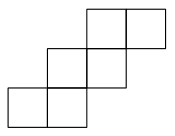

<small>

* answer:$125\ \text{cm}^3$
* questionType:ShortAnswer

</small>

## Atrisinājums

Izklājuma kontūra sastāv no $14$ kuba šķautnēm. Tātad kuba šķautnes garums ir $\frac{70\ \text{cm}}{14}$ jeb $5$ cm. Kuba tilpums tad ir $125\ \text{cm}^3$.

# <lo-sample/> EE.PK.2013TEST.7.9

Auklas garums ir vesels metru skaits. Auklu sagrieza gabalos, kuru garums ir $35$ cm. Atrodi visas auklas mazāko iespējamo garumu.

<small>

* answer:7 m
* questionType:ShortAnswer

</small>

## Atrisinājums

Jāatrod mazākais gabala garuma daudzkārtnis, kas vienlaikus ir vesels metru skaits. Šim nolūkam izsakām gan gabala garumu, gan metru centimetros un atrodam centimetru skaitu mazāko kopīgo dalāmo. Skaitļu $35$ un $100$ mazākais kopīgais dalāmais ir $700$, tātad visas auklas mazākais iespējamais garums ir $700$ cm jeb $7$ m.

# <lo-sample/> EE.PK.2013TEST.7.10

Kubs salikts no $27$ vienības kubiem. No kuba izņem visus kuba virsotnēs esošos vienības kubus. Cik skaldņu ir iegūtajam ķermenim?

<small>

* answer:30
* questionType:ShortAnswer

</small>

## Atrisinājums

Izņemot virsmas vienības kubu, ķermenim rodas viena jauna skaldne par katru izņemtā vienības kuba apslēpto skaldni. Kuba virsotnē esošajam vienības kubam ir $3$ apslēptas skaldnes ($3$ ir redzamas), kubam ir $8$ virsotnes. Visas sākotnējā kuba $6$ skaldnes paliek (par četriem vienības kvadrātiem mazākas), tātad iegūtajai figūrai ir $3 \cdot 8 + 6$ jeb $30$ skaldņu.

# <lo-sample/> EE.PK.2013TEST.8.1

Atrodi naturālu skaitli $x$, kuram $x^2 = 3102 - 2013$.

<small>

* answer:33
* questionType:ShortAnswer

</small>

## Atrisinājums

Tā kā $x^2 = 3102 - 2013 = 1089 = 3^2 \cdot 11^2$ un $x$ ir naturāls skaitlis, tad $x = 33$.

# <lo-sample/> EE.PK.2013TEST.8.2

Atrodi lielāko iespējamo pāra skaitļu skaitu starp septiņiem naturāliem skaitļiem $a$, $b$, $c$, $d$, $e$, $f$ un $g$, ja ir spēkā vienādība

$$
a \cdot b \cdot c \cdot d + e \cdot f \cdot g = 12345.
$$

<small>

* answer:4
* questionType:ShortAnswer

</small>

## Atrisinājums

Tā kā divu reizinājumu summa 12345 ir nepāra skaitlis, viens reizinājums ir nepāra, bet otrs pāra. Nepāra reizinājumā visi reizinātāji ir nepāra, pāra reizinājumā kaut vai visi reizinātāji var būt pāra. Vairāk pāra skaitļu iegūstam tad, ja pāra ir reizinājums ar 4 reizinātājiem. No otras puses, 4 pāra skaitļi arī ir iespējami, piemēram, $2 \cdot 2 \cdot 2 \cdot 2 + 1 \cdot 1 \cdot 12329 = 12345$.

# <lo-sample/> EE.PK.2013TEST.8.3

Atrodi skaitli $a$, ja

$$
\frac{1}{a} = \frac{1}{1+\frac{1}{4}} - \frac{1}{1+\frac{1}{3}}.
$$

<small>

* answer:20
* questionType:ShortAnswer

</small>

## Atrisinājums

Tā kā

$$
\frac{1}{a} = \frac{1}{1+\frac{1}{4}} - \frac{1}{1+\frac{1}{3}} = \frac{4}{5} - \frac{3}{4} = \frac{1}{20},
$$

tad $a = 20$.

# <lo-sample/> EE.PK.2013TEST.8.4

Atrodi lielāko divciparu naturālo skaitli, kas, dalot ar skaitli 2, dod atlikumu 1 un, dalot ar skaitli 3, dod atlikumu 2.

<small>

* answer:95
* questionType:ShortAnswer

</small>

## Atrisinājums

1. atrisinājums. Dalot ar 2, atlikumu 1 dod nepāra skaitļi. Sāksim pārbaudīt divciparu nepāra skaitļus pēc lieluma, sākot ar lielāko. Skaitlis 99, dalot ar 3, dod atlikumu 0 un skaitlis 97 – atlikumu 1, tātad tie neder. Bet skaitlis 95, dalot ar 3, dod atlikumu 2.

2. atrisinājums. Par meklējamo skaitli par 1 lielāks skaitlis dalās gan ar 2, gan ar 3, tātad ar 6. Lielākais ar 6 dalāmais skaitlis, kas nav lielāks par 100, ir 96. Tātad meklējamais skaitlis ir 95.

# <lo-sample/> EE.PK.2013TEST.8.5

Trīs dēli un viena meita no vecākiem saņemto kabatas naudu sadalīja savā starpā vienādi. Ja šo naudu būtu sadalījuši vienādi tikai zēni, katrs no viņiem būtu saņēmis par 3 eiro vairāk. Cik liela bija no vecākiem saņemtā kabatas nauda?

<small>

* answer:36 €
* questionType:ShortAnswer

</small>

## Atrisinājums

1. atrisinājums. Visa nauda sadalās vienādi tikai starp zēniem, ja meita savu daļu sadala vienādi starp brāļiem. Lai katrs no 3 brāļiem tā saņemtu 3 € klāt, meitai no vecākiem bija jāsaņem 9 €. Tātad no vecākiem saņemtā kabatas nauda kopā bija $4 \cdot 9$ € jeb 36 €.

2. atrisinājums. Pieņemsim, ka no vecākiem saņemtā kabatas nauda ir $x$. Saskaņā ar uzdevuma nosacījumiem iegūstam vienādojumu $\frac{x}{3} = \frac{x}{4} + 3$ €. No šejienes $x = 36$ €.

# <lo-sample/> EE.PK.2013TEST.8.6

Taisnstūrī $ABCD$ ir $\angle CBD = 25^\circ$. Uz malas $BC$ ņem punktu $E$ tā, ka $|CE| = |CD|$. Atrodi leņķa $BDE$ lielumu.

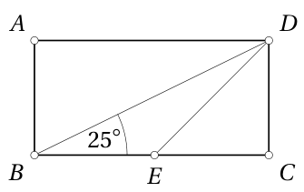

<small>

* answer:20°
* questionType:ShortAnswer

</small>

## Atrisinājums

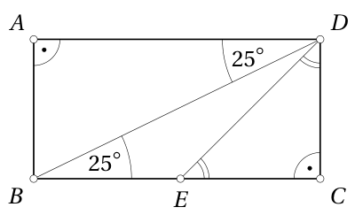

3. zīmējums

No iekšējiem šķērsleņķiem atrodam $\angle ADB = \angle CBD = 25^\circ$ (3. zīmējums; otra iespēja ir vispirms aprēķināt $\angle ABD = 90^\circ - \angle EBD = 65^\circ$ un pēc tam $\angle ADB = 180^\circ - \angle BAD - \angle ABD = 90^\circ - 65^\circ = 25^\circ$). No vienādsānu taisnleņķa trijstūra $CDE$ iegūstam $\angle CDE = \frac{90^\circ}{2} = 45^\circ$. Tātad

$$
\angle BDE = 90^\circ - \angle ADB - \angle CDE = 20^\circ.
$$

# <lo-sample/> EE.PK.2013TEST.8.7

Kvadrātu sadala četros vienādos taisnstūros, no kuriem, kā parādīts zīmējumā, izveido kvadrātveida rāmi.

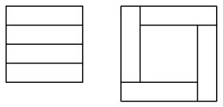

Zināms, ka rāmja iekšpusē esošā tukšā kvadrāta laukums ir $36\ \mathrm{cm}^2$. Atrodi sākotnējā kvadrāta laukumu.

<small>

* answer:64 cm^2
* questionType:ShortAnswer

</small>

## Atrisinājums

1. atrisinājums. Pieņemsim, ka sākotnējā kvadrāta malas garums ir $a$, tad taisnstūra īsākās malas garums ir $\frac{1}{4} a$ (4. zīmējums). Tukšā kvadrāta malas garums ir $a - \frac{1}{4} a$ jeb $\frac{3}{4} a$. Tātad $\left(\frac{3}{4}a\right)^2 = 36\ \mathrm{cm}^2$, no kurienes $\frac{3}{4}a = 6\ \mathrm{cm}$ un $a = 8\ \mathrm{cm}$. Līdz ar to sākotnējā kvadrāta laukums ir $64\ \mathrm{cm}^2$.

2. atrisinājums. Pieņemsim, ka sākotnējā kvadrāta laukums ir $x$, tad viena taisnstūra laukums ir $\frac{1}{4}x$.

Iegūstam vienādojumu $x = \frac{1}{4}x + \frac{3}{4} \cdot \frac{1}{4}x + 36\ \mathrm{cm}^2$ (5. zīmējumā iekrāsots kvadrāts, kura laukums vienāds ar sākotnējā kvadrāta laukumu), no kurienes $\frac{9}{16}x = 36\ \mathrm{cm}^2$ un $x = 64\ \mathrm{cm}^2$.

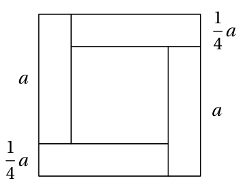

4. zīmējums

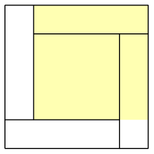

5. zīmējums

# <lo-sample/> EE.PK.2013TEST.8.8

Plaknē atrodas divas vienādas, viena otru krustojošas riņķa līnijas ar centriem $A$ un $B$ tā, ka šo riņķa līniju krustpunkti ar nogriezni $AB$ sadala šo nogriezni trīs vienādās daļās. Nogriežņa $AB$ garums ir 12 cm. Atrodi vienas riņķa līnijas precīzu garumu.

<small>

* answer:16\pi cm
* questionType:ShortAnswer

</small>

## Atrisinājums

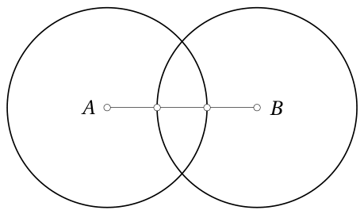

6. zīmējums

Riņķa līnijas rādiuss ir divas trešdaļas no nogriežņa $AB$ garuma (6. zīmējums) jeb 8 cm. Tātad riņķa līnijas garums ir $2\pi \cdot 8$ cm jeb $16\pi$ cm.

Piezīme. Aptuvenā skaitliskā vērtība ir $16\pi \approx 50{,}2654824574$.

# <lo-sample/> EE.PK.2013TEST.8.9

Vienādmalu trijstūris sadalīts četros vienādos trijstūros, kā parādīts zīmējumā.

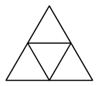

Katru mazo trijstūri nokrāso vai nu sarkanu, vai melnu. Cik dažādi nokrāsotus lielos trijstūrus tā var iegūt? (Divus nokrāsotus lielos trijstūrus uzskatām par vienādiem, ja vienu var iegūt no otra pagriežot.)

<small>

* answer:8
* questionType:ShortAnswer

</small>

## Atrisinājums

Sagrupēsim visas iespējas pēc sarkano trijstūru skaita. Iespēja, kurā visi trijstūri ir melni, ir 1 (7. zīmējums). Iespējas, kurās tieši viens trijstūris ir sarkans, ir 2: sarkanais trijstūris var būt stūrī (8. zīmējums) vai vidū (9. zīmējums). Iespējas, kurās tieši divi trijstūri ir sarkani, arī ir 2: viens sarkanais trijstūris jebkurā gadījumā ir stūrī, bet otrs sarkanais trijstūris var būt citā stūrī (10. zīmējums) vai vidū (11. zīmējums). Analoģiski iepriekšējam ir 2 iespējas, kurās tieši trīs trijstūri ir sarkani jeb tieši viens trijstūris ir melns (12. un 13. zīmējums), un 1 iespēja, kurā visi trijstūri ir sarkani (14. zīmējums). Kopā esam ieguvuši 8 iespējas.

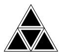

7. zīmējums

8. zīmējums

9. zīmējums

10. zīmējums

11. zīmējums

12. zīmējums

13. zīmējums

14. zīmējums

# <lo-sample/> EE.PK.2013TEST.8.10

Kubs salikts no 125 vienības kubiem. No katras kuba šķautnes vidus izņem vienu vienības kubu. Cik skaldņu ir iegūtajam ķermenim?

<small>

* answer:54
* questionType:ShortAnswer

</small>

## Atrisinājums

Izņemot virsmas vienības kubu, ķermenim rodas viena jauna skaldne par katru izņemtā vienības kuba apslēpto skaldni. Kuba šķautnes vidū esošajam vienības kubam ir 4 apslēptas skaldnes (2 ir redzamas), kubam ir 12 šķautnes. Visas sākotnējā kuba 6 skaldnes paliek (par četriem vienības kvadrātiem mazākas), tātad iegūtajai figūrai ir $4 \cdot 12 + 6$ jeb 54 skaldnes.

# <lo-sample/> EE.PK.2013TEST.9.1

Atrodi lielāko pirmskaitli, ar kuru dalās starpība $3012 - 2013$.

<small>

* answer:37
* questionType:ShortAnswer

</small>

## Atrisinājums

Skaitlis $3012 - 2013$ jeb $999$ izsakāms formā $999 = 3 \cdot 3 \cdot 3 \cdot 37$, kur visi reizinātāji ir pirmskaitļi. Lielākais pirmreizinātājs ir $37$.

# <lo-sample/> EE.PK.2013TEST.9.2

Atrodi lielāko iespējamo nepāra skaitļu skaitu starp septiņiem naturāliem skaitļiem $a$, $b$, $c$, $d$, $e$, $f$ un $g$, ja ir spēkā vienādība

$$
(a + b) \cdot (c \cdot d + (e + f) \cdot g) = 12345.
$$

<small>

* answer:6
* questionType:ShortAnswer

</small>

## Atrisinājums

Tā kā reizinājums $12345$ ir nepāra skaitlis, abi reizinātāji $a + b$ un $c \cdot d + (e + f) \cdot g$ ir nepāra. Lai summa $a + b$ būtu nepāra, vienam no saskaitāmajiem $a$ un $b$ jābūt pāra, bet otram nepāra. Tātad vismaz vienam no septiņiem skaitļiem jābūt pāra, ne vairāk kā seši var būt nepāra. Seši nepāra skaitļi arī ir iespējami, piemēram, $(1 + 2) \cdot (1 \cdot 1 + (1 + 4113) \cdot 1) = 12345$.

# <lo-sample/> EE.PK.2013TEST.9.3

Pozitīviem skaitļiem $a$, $b$ un $c$ ir $a \cdot b = 3$, $b \cdot c = 27$ un $c \cdot a = 16$. Atrodi skaitli $c$.

<small>

* answer:12
* questionType:ShortAnswer

</small>

## Atrisinājums

Sareizinot triju vienādību atbilstošās puses, iegūstam $a^2b^2c^2 = 3 \cdot 27 \cdot 16 = 3^4 \cdot 2^4 = 6^4$. Tātad $abc = 6^2 = 36$, no kurienes $c = \frac{abc}{ab} = 12$.

# <lo-sample/> EE.PK.2013TEST.9.4

Atrodi mazāko trīsciparu naturālo skaitli, kas, dalot ar skaitli $2$, dod atlikumu $1$, dalot ar skaitli $3$, dod atlikumu $2$ un, dalot ar skaitli $5$, dod atlikumu $4$.

<small>

* answer:119
* questionType:ShortAnswer

</small>

## Atrisinājums

*1. atrisinājums.* Dalot ar $5$, atlikumu $0$ dod skaitļi, kas beidzas ar $0$ vai $5$. Tātad atlikumu $4$, dalot ar $5$, dod skaitļi, kas beidzas ar $4$ vai $9$. Dalot ar $2$, atlikumu $1$ dod nepāra skaitļi, tāpēc pēdējais cipars nevar būt $4$. Sāksim pārbaudīt trīsciparu skaitļus, kas beidzas ar $9$, pēc lieluma, sākot ar mazāko. Skaitlis $109$, dalot ar $3$, dod atlikumu $1$, tātad neder. Bet skaitlis $119$, dalot ar $3$, dod atlikumu $2$.

*2. atrisinājums.* Par meklējamo skaitli par $1$ lielāks skaitlis dalās ar $2$, $3$ un $5$, tātad arī ar skaitli MKD$(2, 3, 5)$ jeb $30$. Mazākais ar $30$ dalāmais skaitlis, kas lielāks par $100$, ir $120$. Tātad meklējamais skaitlis ir $119$.

# <lo-sample/> EE.PK.2013TEST.9.5

Bļodā ir $100$ Mari mīļākās konfektes „Oravake“ un $50$ Jüri mīļākās konfektes „Tallinn“. Viņi pēc kārtas drīkst ņemt no bļodas pa vienai konfektei, līdz viens no viņiem ir dabūjis $5$ savas mīļākās konfektes. Mari sāk ņemt konfektes pirmā. Atrodi lielāko iespējamo konfekšu skaitu, ko šādos nosacījumos bērni abi kopā var paņemt no bļodas.

<small>

* answer:109
* questionType:ShortAnswer

</small>

## Atrisinājums

Ja bērni sākumā katrs ņem tikai otra bērna mīļākās konfektes, tad pēc tam, kad katrs ir paņēmis $50$ konfektes, bļodā paliek $50$ Mari mīļākās konfektes. Pēc tam abi ņem tās, līdz Mari ir dabūjusi $5$ savas mīļākās konfektes. Tā bērni kopā paņem $109$ konfektes.

No otras puses, ja bērni jebkādā noteikumiem atbilstošā veidā paņem kopā $109$ konfektes, tad Mari ir paņēmusi $55$ konfektes. Tā kā ne vairāk kā $50$ no tām var būt Jüri mīļākās konfektes, tad Mari ir dabūjusi $5$ savas mīļākās konfektes, un vairāk pēc noteikumiem ņemt nevar.

# <lo-sample/> EE.PK.2013TEST.9.6

Trijstūra $ABC$ bisektrises krustojas punktā $S$. Atrodi leņķa $ASB$ lielumu, ja $\angle ACS = 10^\circ$.

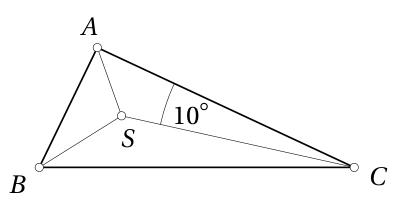

<small>

* answer:$100^\circ$
* questionType:ShortAnswer

</small>

## Atrisinājums

Apzīmēsim $\alpha = \angle BAS$ un $\beta = \angle ABS$. Tad trijstūra $ABC$ leņķu lielumi ir $2\alpha$, $2\beta$ un $2 \cdot 10^\circ$ ($15$. zīmējums), tātad $\alpha + \beta + 10^\circ = \frac{180^\circ}{2} = 90^\circ$. Tātad $\alpha + \beta = 80^\circ$. Iegūstam

$$
\angle ASB = 180^\circ - (\alpha + \beta) = 100^\circ.
$$

# <lo-sample/> EE.PK.2013TEST.9.7

Kvadrātu sadala četros vienādos taisnstūros, no kuriem, kā parādīts zīmējumā,

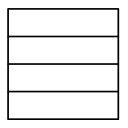

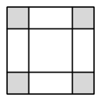

izveido kvadrātveida rāmi tā, ka blakus esošie taisnstūri ar galiem pārklājas (zīmējumā pārklājošās daļas iekrāsotas pelēkas). Zināms, ka rāmja iekšpusē esošā tukšā kvadrāta laukums ir $10\ \text{cm}^2$. Atrodi sākotnējā kvadrāta laukumu.

<small>

* answer:$40\ \text{cm}^2$
* questionType:ShortAnswer

</small>

## Atrisinājums

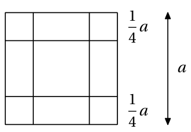

*1. atrisinājums.* Pieņemsim, ka sākotnējā kvadrāta malas garums ir $a$, tad taisnstūra īsākās malas garums ir $\frac{1}{4}a$ ($16$. zīmējums) un taisnstūra laukums ir $\frac{1}{4}a^2$. Rāmja iekšpusē esošā tukšā kvadrāta malas garums ir $a - \frac{1}{4}a - \frac{1}{4}a$ jeb $\frac{1}{2}a$, tātad tā laukums ir $\frac{1}{4}a^2$ jeb tāds pats kā taisnstūrim. Tātad $\frac{1}{4}a^2 = 10\ \text{cm}^2$, no kurienes $a^2 = 40\ \text{cm}^2$.

*2. atrisinājums.* Pieņemsim, ka sākotnējā kvadrāta laukums ir $x$; tas vienlaikus ir arī rāmja un tā iekšpusē esošā tukšā kvadrāta kopējais laukums. Tā kā rāmja iekšpusē esošā tukšā kvadrāta malas garums ir divas ceturtdaļas jeb puse no sākotnējā kvadrāta malas garuma, tad tukšā kvadrāta laukums veido ceturtdaļu no laukuma $x$, t.i., $\frac{1}{4}x = 10\ \text{cm}^2$. Tātad $x = 40\ \text{cm}^2$.

# <lo-sample/> EE.PK.2013TEST.9.8

Pusriņķī ievelk lielāko iespējamo riņķi. Šī riņķa līnijas garums ir $2$ metri. Atrodi pusriņķa precīzu laukumu.

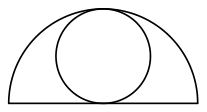

<small>

* answer:$\frac{2}{\pi}\ \text{m}^2$
* questionType:ShortAnswer

</small>

## Atrisinājums

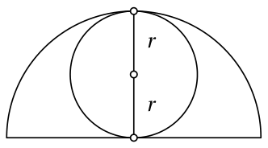

Pieņemsim, ka riņķa rādiuss ir $r$ ($17$. zīmējums). Tā kā $2\pi r = 2\ \text{m}$, tad $r = \frac{1}{\pi}\ \text{m}$. Pusriņķa rādiuss ir $2r$, tātad pusriņķa laukums ir $\frac{1}{2}\pi(2r)^2$ jeb $\frac{2}{\pi}\ \text{m}^2$.

*Piezīme.* Aptuvenā skaitliskā vērtība ir $\frac{2}{\pi} \approx 0{,}636619772368$.

# <lo-sample/> EE.PK.2013TEST.9.9

Vienādmalu trijstūris sadalīts trīs vienādās daļās, kā parādīts zīmējumā.

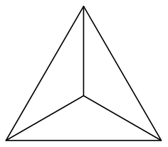

Katru daļu nokrāso vai nu sarkanu, vai zaļu, vai melnu (dažādas daļas var būt nokrāsotas arī vienā krāsā). Cik dažādi nokrāsotus lielos trijstūrus tā var iegūt? (Divus nokrāsotus lielos trijstūrus uzskatām par vienādiem, ja vienu var iegūt no otra pagriežot.)

<small>

* answer:11
* questionType:ShortAnswer

</small>

## Atrisinājums

Sākumā uzskatīsim pagriežot iegūtos krāsojumus par dažādiem. Tā kā katru daļu krāso ar vienu no $3$ krāsām un daļu ir $3$, tad visu krāsošanas iespēju kopā ir $3^3$ jeb $27$.

Tā kā krāsas ir $3$, tad ir arī $3$ tādas krāsošanas iespējas, kurās visi trijstūri ir vienā krāsā. Paliek $24$ iespējas, kurās izmantotas vismaz divas krāsas. Ievērosim, ka visi šādi krāsojumi sadalās $3$ locekļu grupās, kurās krāsojumi iegūstami viens no otra pagriežot. Tātad, ja pagriežot iegūstamos krāsojumus uzskata par vienādiem, krāsojumu, kuros izmantotas vismaz divas krāsas, ir $\frac{24}{3}$ jeb $8$. Kopā ar vienkrāsainajiem krāsojumiem tātad ir $3 + 8$ jeb $11$ iespējas.

# <lo-sample/> EE.PK.2013TEST.9.10

Kubs salikts no $125$ vienības kubiem. No katras kuba skaldnes vidus izņem vienu vienības kubu. Cik skaldņu ir iegūtajam ķermenim?

<small>

* answer:36
* questionType:ShortAnswer

</small>

## Atrisinājums

Izņemot virsmas vienības kubu, ķermenim rodas viena jauna skaldne par katru izņemtā vienības kuba apslēpto skaldni. Skaldnes vidū esošajam vienības kubam ir $5$ apslēptas skaldnes ($1$ ir redzama), kubam ir $6$ skaldnes. Visas sākotnējā kuba skaldnes paliek (par vienu vienības kvadrātu mazākas), tātad iegūtajai figūrai ir $5 \cdot 6 + 6$ jeb $36$ skaldnes.
