# <lo-sample/> EE.PK.2014TEST.7.1

Aprēķini:

$$1001 - 2332 + 5445 - 6776 + 9889 =$$

<small>

* answer:7227
* questionType:ShortAnswer

</small>

## Atrisinājums

Mainot darbību secību, iegūstam

$$1001 + (-2332 + 5445) + (-6776 + 9889) = 1001 + 3113 + 3113 = 7227.$$

# <lo-sample/> EE.PK.2014TEST.7.2

Skaitļi $a$ un $b$ ir mazākie iespējamie naturālie skaitļi, kuriem ir spēkā vienādība

$$\frac{1}{2} : \frac{1}{3} + \frac{1}{4} : \frac{1}{5} = \frac{1}{a} : \frac{1}{b}.$$

Atrodi skaitļus $a$ un $b$.

<small>

* answer:a = 4, b = 11
* questionType:ShortAnswer

</small>

## Atrisinājums

Uzrakstām vienādību formā $\frac{3}{2} + \frac{5}{4} = \frac{b}{a}$ jeb $\frac{11}{4} = \frac{b}{a}$. Tā kā skaitļi 11 un 4 ir savstarpēji pirmskaitļi, tad mazākie derīgie skaitļi ir $a = 4$ un $b = 11$.

# <lo-sample/> EE.PK.2014TEST.7.3

Cik reizes viens metrs ir lielāks par pusi centimetra?

<small>

* answer:200
* questionType:ShortAnswer

</small>

## Atrisinājums

Vienā metrā ir 100 cm, un $100 : 0,5 = 200$.

# <lo-sample/> EE.PK.2014TEST.7.4

Vienpadsmitciparu skaitlis $\overline{2013abc2014}$ dalās ar skaitli 9, un arī skaitļi $\overline{2013ab2014}$ un $\overline{2013a2014}$ dalās ar skaitli 9. Cik ir šādu vienpadsmitciparu skaitļu $\overline{2013abc2014}$?

<small>

* answer:4
* questionType:ShortAnswer

</small>

## Atrisinājums

Uzdevumā doto skaitļu ciparu summas ir attiecīgi $13 + a + b + c$, $13 + a + b$ un $13 + a$. Lai visas ciparu summas dalītos ar 9, jābūt $a = 5$, un $b$ un $c$ izvēlei ir četras iespējas: $b = c = 0$, $b = 0$ un $c = 9$, $b = 9$ un $c = 0$, kā arī $b = c = 9$.

# <lo-sample/> EE.PK.2014TEST.7.5

Ja kastē esošos ābolus sadala klases skolēniem tā, lai katrs saņemtu 5 ābolus, tad kastē paliek 6 āboli. Lai katrs saņemtu 6 ābolus, kastē vajadzētu būt par 5 āboliem vairāk. Cik ābolu ir kastē?

<small>

* answer:61
* questionType:ShortAnswer

</small>

## Atrisinājums

Dalot ābolus pa sešiem, to vajag par $6 + 5 = 11$ vairāk salīdzinājumā ar dalīšanu pa pieciem, tātad klasē ir 11 skolēni. Kastē ir $5 \cdot 11 + 6 = 61$ ābols.

# <lo-sample/> EE.PK.2014TEST.7.6

Vienādībā viens cipars jāaizstāj ar kādu citu ciparu tā, lai vienādība būtu pareiza.

$$1 \cdot 2 - 3 + 4 \cdot 5 - 6 = 7$$

<small>

* answer:3 jāaizstāj ar 9
* questionType:ShortAnswer

</small>

## Atrisinājums

Vienādības kreisās puses vērtība ir 13, lai vienādība būtu spēkā, kreisās puses vērtība jāsamazina par 6. Reizinājumus $1 \cdot 2$ un $4 \cdot 5$ nav iespējams samazināt par 6, nomainot vienu ciparu. Tāpat nav iespējams samazināt skaitli $-6$, jo rezultāts vairs nebūtu viencipara. Vienīgā iespēja ir aizstāt 3 ar 9.

# <lo-sample/> EE.PK.2014TEST.7.7

Liels taisnstūris sadalīts piecos vienādos kvadrātos un sešos vienādos taisnstūros. Lielā taisnstūra laukums ir $140\ \text{cm}^2$. Atrodi lielā taisnstūra perimetru.

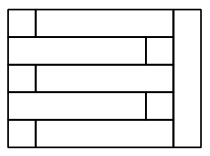

<small>

* answer:48 cm
* questionType:ShortAnswer

</small>

## Atrisinājums

Pieņemsim, ka kvadrāta malas garums ir $x$, tad lielā taisnstūra izmēri ir $5x$ un $7x$. Tā kā $35x^2 = 140\ \text{cm}^2$, tad $x = 2$ cm. Lielā taisnstūra perimetrs ir $2 \cdot (5x + 7x) = 24x = 48$ cm.

# <lo-sample/> EE.PK.2014TEST.7.8

Zīmējumā attēlotajā četrstūrī $|AB| = |CD|$. Atrodi leņķa $ABC$ lielumu.

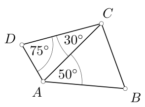

<small>

* answer:65°
* questionType:ShortAnswer

</small>

## Atrisinājums

Tā kā $\angle CAD = 180^\circ - 30^\circ - 75^\circ = 75^\circ$, tad $|AC| = |CD| = |AB|$ un $\angle ABC = (180^\circ - 50^\circ) : 2 = 65^\circ$.

# <lo-sample/> EE.PK.2014TEST.7.9

Rūtiņu tīkla laukums ir $90\ \text{cm}^2$. Atrodi tumši iekrāsotās figūras laukumu.

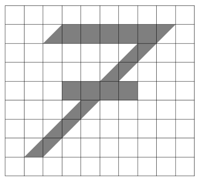

<small>

* answer:15 cm²
* questionType:ShortAnswer

</small>

## Atrisinājums

Vienas rūtiņas laukums ir $1\ \text{cm}^2$. Tumšās daļas laukums ir vienāds ar 9 veselu rūtiņu un 12 pusrūtiņu laukumu, $9 + 12 : 2 = 15$.

# <lo-sample/> EE.PK.2014TEST.7.10

Zīmējumā dots kuba virsmas izklājums, kurā viena virsotne apzīmēta ar burtu $A$. Atrodi to skaldņu skaitļu summu, kurām pēc kuba salikšanas viena virsotne ir $A$.

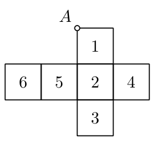

<small>

* answer:12
* questionType:ShortAnswer

</small>

## Atrisinājums

Virsotne $A$ nonāk uz skaldnēm 1, 5 un 6, un prasītā summa ir $1 + 5 + 6 = 12$.

# <lo-sample/> EE.PK.2014TEST.8.1

Atrodi $x$ vērtību, ja

$$
2\frac{3}{4} : 5{,}5 = \frac{x}{6}.
$$

<small>

* answer:3
* questionType:ShortAnswer

</small>

## Atrisinājums

Pārveidojam vienādību formā $\frac{11}{4} : \frac{11}{2} = \frac{x}{6}$ jeb $\frac{1}{2} = \frac{x}{6}$, no kurienes $x = 3$.

# <lo-sample/> EE.PK.2014TEST.8.2

Pieņemsim, ka $a$ un $b$ ir tādi naturāli skaitļi, ka $a - b = 2014$ un $a + b$ ir četrciparu skaitlis. Atrodi skaitļa $b$ lielāko iespējamo vērtību.

<small>

* answer:3992
* questionType:ShortAnswer

</small>

## Atrisinājums

No pirmā nosacījuma iegūstam, ka $a = b + 2014$. Pēc otrā nosacījuma $2b + 2014 \leq 9999$ jeb $2b \leq 7985$, tāpēc $b$ var būt ne vairāk kā 3992.

# <lo-sample/> EE.PK.2014TEST.8.3

Annai ir divreiz vairāk uzkrājumu nekā Bertai. Bertai ir trīsreiz vairāk uzkrājumu nekā Celiai, un Celiai ir četrreiz vairāk uzkrājumu nekā Donnai. Cik reizes Annai, Bertai un Celiai kopā ir vairāk uzkrājumu nekā Donnai?

<small>

* answer:40
* questionType:ShortAnswer

</small>

## Atrisinājums

Pieņemsim, ka Donnai ir $x$ uzkrājumu, tad Celiai ir $4x$, Bertai $12x$ un Annai $24x$ uzkrājumu. Annai, Bertai un Celiai kopā ir $40x$ uzkrājumu jeb 40 reizes vairāk nekā Donnai.

# <lo-sample/> EE.PK.2014TEST.8.4

Skaitļi $x$ un $y$ ir tādi, ka $x + y < 0$, $x \cdot y < 0$ un $x < y$. Sakārto skaitļus $x$, $-x$, $y$ un $-y$, sākot ar mazāko.

<small>

* answer:$x < -y < y < -x$
* questionType:ShortAnswer

</small>

## Atrisinājums

Tā kā $x \cdot y < 0$, tad $x$ un $y$ jābūt ar dažādām zīmēm. No nevienādības $x < y$ izriet, ka $x$ ir negatīvs un $y$ pozitīvs. Tā kā $x + y < 0$, tad $|x| > |y|$. No iegūtajiem nosacījumiem $x < -y < y < -x$.

# <lo-sample/> EE.PK.2014TEST.8.5

Cik veselu skaitļu intervālā no 201 līdz 699 dalās gan ar 4, gan ar 5?

<small>

* answer:24
* questionType:ShortAnswer

</small>

## Atrisinājums

Skaitlim, kas dalās ar 5 un 4, jādalās ar 20. Dotajās robežās mazākais ar 20 dalāmais skaitlis ir $220 = 11 \cdot 20$, bet lielākais $680 = 34 \cdot 20$. Ar 20 dalāmo skaitļu ir $34 - 11 + 1 = 24$.

# <lo-sample/> EE.PK.2014TEST.8.6

Atrodi izteiksmes

$$
\frac{a \cdot b \cdot c}{2 \cdot 3 \cdot 4 \cdot 5 \cdot 6}
$$

mazāko iespējamo veselo vērtību, ja $a$, $b$ un $c$ ir trīs pēc kārtas sekojoši naturāli skaitļi.

<small>

* answer:1
* questionType:ShortAnswer

</small>

## Atrisinājums

Ņemot $a = 8$, $b = 9$, $c = 10$, izteiksmes vērtība ir 1, kas ir mazākais naturālais skaitlis.

*Piezīme.* Izsakot izteiksmes saucēju kā pirmreizinātāju reizinājumu, iegūstam $\frac{a \cdot b \cdot c}{2^4 \cdot 3^2 \cdot 5}$, kam jābūt veselam skaitlim. Tā kā no trim pēc kārtas sekojošiem skaitļiem tikai viens dalās ar trīs, tad vienam no skaitļiem $a$, $b$, $c$ jādalās ar 9, un vienam jādalās ar 5. Būtu jāaplūko skaitļa 9 daudzkārtņi $9k$, kuriem starp skaitļiem $9k - 2$, $9k - 1$, $9k$, $9k + 1$ un $9k + 2$ būtu ar 5 dalāms skaitlis.

# <lo-sample/> EE.PK.2014TEST.8.7

Trijstūris $ABC$ ir taisnleņķa. Punkts $K$ atrodas uz malas $AC$ un $|KB| = 15$ cm. Atrodi malas $AC$ garumu.

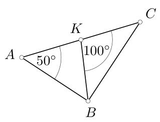

<small>

* answer:30 cm
* questionType:ShortAnswer

</small>

## Atrisinājums

Tā kā trijstūris $BKC$ ir platleņķa, tad leņķis $\angle C$ nevar būt taisns leņķis. Tātad $\angle ABC = 90^\circ$. No trijstūra $ABC$ iegūstam, ka $\angle C = 90^\circ - 50^\circ = 40^\circ$, no trijstūra $BKC$ iegūstam, ka $\angle CBK = 180^\circ - 100^\circ - 40^\circ = 40^\circ$. Pie virsotnes $B$ ir taisns leņķis, tātad $\angle KBA = 90^\circ - 40^\circ = 50^\circ$. Trijstūri $AKB$ un $BKC$ ir vienādsānu, tāpēc $|AC| = 2 \cdot |KB| = 30$ cm.

# <lo-sample/> EE.PK.2014TEST.8.8

Leņķa $ACB$ bisektrise krustojas ar leņķa $CBD$ bisektrisi punktā $E$. Atrodi leņķa $CEB$ lielumu.

<small>

* answer:31°
* questionType:ShortAnswer

</small>

## Atrisinājums

Trijstūra $ABC$ trešā leņķa lielums ir $\angle ACB = 180^\circ - 62^\circ - 54^\circ = 64^\circ$, un ārējā leņķa lielums ir $\angle CBD = 62^\circ + 64^\circ = 126^\circ$. Tā kā $\angle ABE = \frac{1}{2}\angle CBD = 63^\circ$ un $\angle BCE = \frac{1}{2}\angle ACB = 32^\circ$, tad $\angle CEB = 180^\circ - 63^\circ - 54^\circ - 32^\circ = 31^\circ$.

# <lo-sample/> EE.PK.2014TEST.8.9

Rūtiņu tīkla laukums ir $88\ \text{cm}^2$. Atrodi tumši iekrāsotās daļas laukumu.

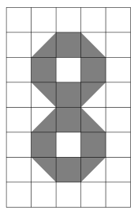

<small>

* answer:26,4 cm^2
* questionType:ShortAnswer

</small>

## Atrisinājums

Vienas rūtiņas laukums ir $88\ \text{cm}^2 : 40 = 2{,}2\ \text{cm}^2$. Tumšās daļas laukums ir vienāds ar 12 rūtiņu laukumu, kas ir $12 \cdot 2{,}2\ \text{cm}^2 = 26{,}4\ \text{cm}^2$.

# <lo-sample/> EE.PK.2014TEST.8.10

Zīmējumā dots kuba virsmas izklājums, kurā viena virsotne apzīmēta ar burtu $A$. Atrodi to skaldņu skaitļu summu, kurām pēc kuba salikšanas viena virsotne ir $A$.

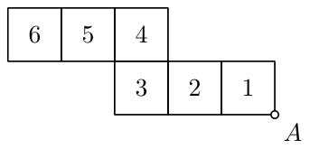

<small>

* answer:12
* questionType:ShortAnswer

</small>

## Atrisinājums

Virsotne $A$ nonāk uz skaldnēm 1, 5 un 6, un prasītā summa ir $1 + 5 + 6 = 12$.

# <lo-sample/> EE.PK.2014TEST.9.1

Skaitlis $a$ ir naturāls skaitlis. Cik veselu skaitļu ir lielāki par $2014a^2 + 1000$, bet mazāki par $2014(a^2 + 1000)$?

<small>

* answer:2012999
* questionType:ShortAnswer

</small>

## Atrisinājums

Skaitļu ir $2014(a^2 + 1000) - (2014a^2 + 1000) - 1 = 2013 \cdot 1000 - 1 = 2012999$.

# <lo-sample/> EE.PK.2014TEST.9.2

Pieņemsim, ka $a$, $b$, $c$ un $d$ ir tādi skaitļi, ka $abc = 4$, $bcd = 12$ un $a + d = 2$. Atrodi reizinājumu $abcd$.

<small>

* answer:6
* questionType:ShortAnswer

</small>

## Atrisinājums

1. atrisinājums. Tā kā $\frac{abc}{bcd} = \frac{4}{12}$ jeb $\frac{a}{d} = \frac{1}{3}$, tad $d = 3a$. Ievietojot to vienādībā $a + d = 2$, iegūstam $a = \frac{1}{2}$. Tātad $abcd = \frac{1}{2} \cdot 12 = 6$.

2. atrisinājums. Saskaitot pirmās divas vienādības, iegūstam $bc(a + d) = 16$, no kurienes, ņemot vērā trešo vienādību, $bc = 8$. Savukārt, sareizinot pirmās divas vienādības, iegūstam $ab^2c^2d = 48$; tā kā $bc = 8$, tad $abcd = 6$.

# <lo-sample/> EE.PK.2014TEST.9.3

Kuba formas ēkas tilpums ir par $2699900\%$ lielāks nekā šīs ēkas maketa tilpums. Cik reizes ēkas augstums ir lielāks par maketa augstumu?

<small>

* answer:30
* questionType:ShortAnswer

</small>

## Atrisinājums

Ēkas tilpums veido $2700000\%$ no maketa tilpuma jeb ēkas tilpums ir $27000$ reizes lielāks par maketa tilpumu. Ēkas augstums ir $\sqrt[3]{27000} = 30$ reizes lielāks par maketa augstumu.

# <lo-sample/> EE.PK.2014TEST.9.4

Cik nepāra naturālu dalītāju ir skaitlim $6^{2014}$?

<small>

* answer:2015
* questionType:ShortAnswer

</small>

## Atrisinājums

Skaitļa $2^{2014} \cdot 3^{2014}$ nepāra naturālie dalītāji ir $1, 3, 3^2, 3^3, \ldots, 3^{2014}$, to pavisam ir $2015$.

# <lo-sample/> EE.PK.2014TEST.9.5

Atrodi izteiksmes

$$
\frac{a \cdot b \cdot c}{3 \cdot 4 \cdot 5 \cdot 6 \cdot 7}
$$

mazāko iespējamo veselo vērtību, ja $a$, $b$ un $c$ ir trīs pēc kārtas sekojoši naturāli skaitļi.

<small>

* answer:17
* questionType:ShortAnswer

</small>

## Atrisinājums

Izsakot izteiksmes saucēju kā pirmreizinātāju reizinājumu, iegūstam $\frac{a \cdot b \cdot c}{2^3 \cdot 3^2 \cdot 5 \cdot 7}$, kam jābūt veselam skaitlim. Tā kā no trim pēc kārtas sekojošiem skaitļiem tikai viens dalās ar trīs, tad vienam no skaitļiem $a$, $b$, $c$ jādalās ar $9$. Starp skaitļiem $a, b, c$ jābūt arī skaitlim, kas dalās ar $5$, un skaitlim, kas dalās ar $7$. Aplūkosim skaitļa $9$ daudzkārtņus $9k$, kuriem starp skaitļiem $9k - 2$, $9k - 1$, $9k$, $9k + 1$ un $9k + 2$ būtu ar $5$ un ar $7$ dalāms skaitlis: pie $9$ tie ir $10$ un $7$; pie $27$ – $25$ un $28$, taču neviens no šiem trijniekiem nav trīs pēc kārtas sekojoši skaitļi; pie $36$ skaitlis $35$ dalās gan ar $5$, gan ar $7$. Tā kā $34 \cdot 35 \cdot 36 = 2^3 \cdot 3^2 \cdot 5 \cdot 7 \cdot 17$, tad dalījuma vērtība ir $17$, kas patiešām ir vesels skaitlis.

# <lo-sample/> EE.PK.2014TEST.9.6

Atrodi $\frac{y}{z}$, ja $\frac{1}{x} + \frac{2}{y} + \frac{3}{z} = 0$ un $\frac{1}{x} - \frac{6}{y} - \frac{5}{z} = 0$.

<small>

* answer:$-1$
* questionType:ShortAnswer

</small>

## Atrisinājums

Atņemam vienu no otra vienādojumu atbilstošās puses, iegūstam $\frac{8}{y} + \frac{8}{z} = 0$, no kurienes $y = -z$. Tātad $\frac{y}{z} = -1$.

# <lo-sample/> EE.PK.2014TEST.9.7

Trijstūrī $ABC$ novilkta viduslīnija $KL$. Četrstūra $ABKL$ perimetrs ir $38$ cm, un trijstūra $ABC$ perimetrs ir $48$ cm. Atrodi malas $AB$ garumu.

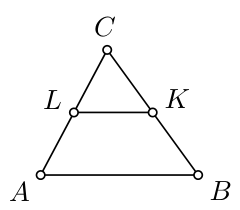

<small>

* answer:14 cm
* questionType:ShortAnswer

</small>

## Atrisinājums

Pieņemsim, ka $|AB| = 2c$, $|BC| = 2a$ un $|AC| = 2b$ (sk. 1. zīmējumu), tad no dotajiem perimetriem $2c + a + c + b = 38$ cm un $2(a + b + c) = 48$ cm. Tā kā $a + b + c = 48$ cm $: 2 = 24$ cm, tad $|AB| = 2c = 38$ cm $- 24$ cm $= 14$ cm.

# <lo-sample/> EE.PK.2014TEST.9.8

Hordas $AC$ un $BD$ krustojas punktā $K$. Loks $AB$ veido $\frac{1}{10}$ no riņķa līnijas, un loks $CD$ veido $\frac{1}{5}$ no riņķa līnijas. Atrodi leņķa $AKB$ lielumu.

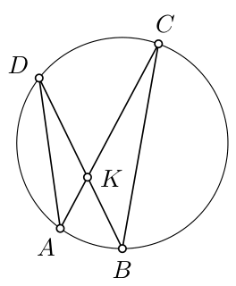

<small>

* answer:$54^\circ$
* questionType:ShortAnswer

</small>

## Atrisinājums

Uz loka $AB$ balstītais centra leņķis ir $\frac{1}{10} \cdot 360^\circ = 36^\circ$, tātad atbilstošais ievilktais leņķis ir $\angle ACB = 36^\circ : 2 = 18^\circ$. Uz loka $CD$ balstītais centra leņķis ir $\frac{1}{5} \cdot 360^\circ = 72^\circ$, tātad atbilstošais ievilktais leņķis ir $\angle CBD = 72^\circ : 2 = 36^\circ$. Leņķis $AKB$ ir trijstūra $KBC$ ārējais leņķis, tātad $\angle AKB = \angle KCB + \angle CBK = 18^\circ + 36^\circ = 54^\circ$.

# <lo-sample/> EE.PK.2014TEST.9.9

Rūtiņu tīkla laukums ir $40$ cm$^2$. Tumši iekrāsotais cipars $9$ sastāv no rūtiņām un ceturtdaļriņķiem. Atrodi tumši iekrāsotās daļas precīzu laukumu.

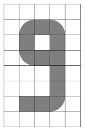

<small>

* answer:$(9+\pi)\text{ cm}^2$
* questionType:ShortAnswer

</small>

## Atrisinājums

Vienas rūtiņas laukums ir $1$ cm$^2$. Tumšās daļas laukums ir vienāds ar $9$ rūtiņu un $4$ ceturtdaļriņķu laukumu. Četri ceturtdaļriņķi veido pilnu riņķi ar rādiusu $1$ cm, tātad tumši iekrāsotās daļas laukums ir $(9 + \pi)$ cm$^2$.

# <lo-sample/> EE.PK.2014TEST.9.10

Zīmējumā dots kuba virsmas izklājums, kurā viena virsotne apzīmēta ar burtu $A$. Atrodi to skaldņu skaitļu summu, kurām pēc kuba salikšanas viena virsotne ir $A$.

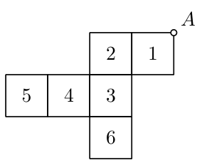

<small>

* answer:12
* questionType:ShortAnswer

</small>

## Atrisinājums

Virsotne $A$ nonāk uz skaldnēm $1$, $5$ un $6$, un prasītā summa ir $1 + 5 + 6 = 12$.
