# <lo-sample/> EE.PK.2015TEST.7.1

Atrodi izteiksmes $3 \cdot 2 \cdot 2 \cdot 2 \cdot 2 \cdot 3 \cdot 5 \cdot 5 \cdot 5 \cdot 5 \cdot 3$ vērtību.

<small>

* answer:270000
* questionType:ShortAnswer

</small>

## Atrisinājums

$3 \cdot 2 \cdot 2 \cdot 2 \cdot 2 \cdot 3 \cdot 5 \cdot 5 \cdot 5 \cdot 5 \cdot 3 = 3^3 \cdot 2^4 \cdot 5^4 = 27 \cdot 10^4 = 270000.$

# <lo-sample/> EE.PK.2015TEST.7.2

Atrodi daļu $\frac{1}{2}$, $\frac{2}{3}$, $\frac{3}{5}$, $\frac{4}{7}$ un $\frac{2}{9}$ lielākās un mazākās summu.

<small>

* answer:8/9
* questionType:ShortAnswer

</small>

## Atrisinājums

Daļu secība pēc lieluma ir $\frac{2}{3} > \frac{3}{5} > \frac{4}{7} > \frac{1}{2} > \frac{2}{9}$, un $\frac{2}{3} + \frac{2}{9} = \frac{8}{9}$.

# <lo-sample/> EE.PK.2015TEST.7.3

Tests sākas pulksten $9.48$ un ilgst tieši divas ar ceturtdaļu stundas. Cikos tests beidzas?

<small>

* answer:12.03
* questionType:ShortAnswer

</small>

## Atrisinājums

Tests sākas $48$ minūtes pēc pulksten $9$. Par divām ar ceturtdaļu stundām jeb $2$ stundām $15$ minūtēm vēlāks brīdis ir $63$ minūtes pēc pulksten $11$ jeb $12.03$.

# <lo-sample/> EE.PK.2015TEST.7.4

Atrodi lielāko viencipara skaitli, ar kuru dalās summa $1 \cdot 3 \cdot 5 \cdot 7 \cdot 9 + 2 \cdot 4 \cdot 6 \cdot 8 \cdot 10$.

<small>

* answer:5
* questionType:ShortAnswer

</small>

## Atrisinājums

Summa dalās ar $5$, jo abi saskaitāmie dalās ar $5$. Tā kā viens saskaitāmais ir nepāra, bet otrs pāra, summa ir nepāra skaitlis un tātad nedalās ne ar $6$, ne ar $8$. Summa nedalās arī ar $7$ un $9$, jo pirmais saskaitāmais dalās ar abiem, bet otrais saskaitāmais nedalās ne ar vienu no tiem.

# <lo-sample/> EE.PK.2015TEST.7.5

Divu draugu vecumi pilnos gados ir starp $10$ un $20$, un viņu vecumu reizinājums ir vienāds ar kāda naturāla skaitļa kubu. Atrodi abu draugu vecumus.

<small>

* answer:12 un 18
* questionType:ShortAnswer

</small>

## Atrisinājums

Tā kā meklējamie veselie skaitļi ir starp $10$ un $20$, to reizinājums ir starp $100$ un $400$. Šajā intervālā esošie pilnie kubi ir $5^3$, $6^3$ un $7^3$ jeb attiecīgi $125$, $216$ un $343$. Pirmais un pēdējais no tiem neder, jo $5$ un $7$ ir pirmskaitļi, tāpēc, izsakot to kubus kā divu veselu skaitļu reizinājumu, abiem reizinātājiem būtu jābūt šo pirmskaitļu pakāpēm, bet starp $10$ un $20$ nav ne $5$, ne $7$ pakāpju. Lai izteiktu skaitli $6^3$ jeb $2^3 \cdot 3^3$ kā prasītajās robežās esošu veselu skaitļu reizinājumu, abiem reizinātājiem jādalās tikai ar pirmskaitļiem $2$ un $3$. Atlasē paliek $12$ un $18$, kuru reizinājums patiešām ir $216$.

# <lo-sample/> EE.PK.2015TEST.7.6

Trijstūra $ABC$ malas $AB$ un $AC$ ir vienāda garuma, un leņķa $ACB$ lielums ir $70^\circ$. Uz malas $AC$ ņem punktu $P$ tā, ka $BP$ un $BC$ ir vienāda garuma. Atrodi ar burtu $x$ apzīmētā leņķa lielumu.

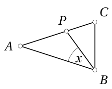

<small>

* answer:30°
* questionType:ShortAnswer

</small>

## Atrisinājums

Saskaņā ar uzdevuma nosacījumiem $\angle ABC = \angle ACB = 70^\circ$. Tā kā $|BP| = |BC|$, tad $\angle BPC = \angle BCP = 70^\circ$ un $\angle CBP = 180^\circ - 2 \cdot 70^\circ = 40^\circ$. Tātad $x = 70^\circ - 40^\circ = 30^\circ$.

# <lo-sample/> EE.PK.2015TEST.7.7

Taisnstūra $ABCD$ malas $AB$ garums ir $10\ \text{cm}$. Uz malas $AB$ atrodas tāds punkts $P$, ka $PB$ garums ir $2\ \text{cm}$ un trijstūra $DAP$ laukums ir $12\ \text{cm}^2$. Atrodi taisnstūra $ABCD$ laukumu.

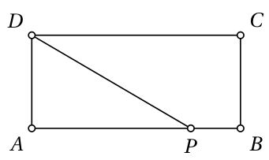

<small>

* answer:30 cm^2
* questionType:ShortAnswer

</small>

## Atrisinājums

Tā kā $|PB| = 2\ \text{cm}$, tad $|AP| = 8\ \text{cm}$. Tā kā trijstūra $DAP$ laukums ir $12\ \text{cm}^2$, tad $|AD| = 3\ \text{cm}$. Tātad taisnstūra $ABCD$ laukums ir $30\ \text{cm}^2$.

# <lo-sample/> EE.PK.2015TEST.7.8

Pelēku kvadrātu sadala $5$ vienādos taisnstūros, kā parādīts zīmējumā, divus malējos un vidējo no tiem nokrāso melnus. Kāda daļa no kvadrāta kontūras paliek pelēka?

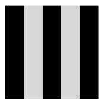

<small>

* answer:1/5
* questionType:ShortAnswer

</small>

## Atrisinājums

No divām kvadrāta malām pelēkas paliek $\frac{2}{5}$, pārējās malas ir pilnīgi melnas.

Tātad no kvadrāta kontūras pelēka ir $\frac{\frac{2}{5} \cdot 2 + 0 \cdot 2}{4}$ jeb $\frac{1}{5}$.

# <lo-sample/> EE.PK.2015TEST.7.9

Trijstūra leņķu lielumi $\alpha$, $\beta$ un $\gamma$ ir tādi, ka $\alpha + \beta + 7\gamma = 270^\circ$. Atrodi $\gamma$.

<small>

* answer:15°
* questionType:ShortAnswer

</small>

## Atrisinājums

Tā kā $\alpha + \beta + 7\gamma = 270^\circ$ un $\alpha + \beta + \gamma = 180^\circ$, tad $6\gamma = 90^\circ$, no kurienes $\gamma = 15^\circ$.

# <lo-sample/> EE.PK.2015TEST.7.10

Masīvkoka taisnstūra paralēlskaldnim, kura izmēri ir $3\ \text{cm} \times 4\ \text{cm} \times 5\ \text{cm}$, visas skaldnes nokrāso zilas. Paralēlskaldni pārgriež uz pusēm ar vienu griezumu, kas iet caur visu paralēlskaldņa garāko šķautņu viduspunktiem. Atrodi abu iegūto ķermeņu zili nenokrāsoto skaldņu laukumu summu.

<small>

* answer:24 cm^2
* questionType:ShortAnswer

</small>

## Atrisinājums

Griezuma virsmas izmēri sakrīt ar paralēlskaldņa diviem mazākajiem izmēriem jeb ir $3\ \text{cm} \times 4\ \text{cm}$. Tā kā griežot rodas divas griezuma virsmas (pa vienai katrai pusei), nenokrāsoto skaldņu laukumu summa ir $2 \cdot (3 \cdot 4)$ jeb $24$ kvadrātcentimetri.

# <lo-sample/> EE.PK.2015TEST.8.1

Atrodi izteiksmes $\frac{2013 - 2014}{3} + \frac{2014 - 2015}{3} - \frac{2015 - 2016}{3}$ vērtību.

<small>

* answer:$-\frac{1}{3}$
* questionType:ShortAnswer

</small>

## Atrisinājums

Visas daļas dotajā izteiksmē ir vienādas ar skaitli $-\frac{1}{3}$. Tātad izteiksmes vērtība ir vienāda ar skaitli $a + a - a$, kur $a = -\frac{1}{3}$, jeb ar skaitli $-\frac{1}{3}$.

# <lo-sample/> EE.PK.2015TEST.8.2

Zināms, ka $g + f = 5$ un $g \cdot f = 3$. Atrodi $g^2 + f^2$.

<small>

* answer:19
* questionType:ShortAnswer

</small>

## Atrisinājums

Ievērosim, ka $g^2 + f^2 = (g + f)^2 - 2gf$. Tā kā $g + f = 5$ un $gf = 3$, tad $g^2 + f^2 = 5^2 - 2 \cdot 3 = 19$.

# <lo-sample/> EE.PK.2015TEST.8.3

Skaitļus no 1 līdz 100 uzraksta divās rindās, kā parādīts zīmējumā

$$
\begin{array}{rrrrrrrrrrrrr}
1 & 99 & 3 & 97 & 5 & 95 & 7 & \ldots & \ldots & \ldots & 53 & 49 & 51 \\
100 & 2 & 98 & 4 & 96 & 6 & 94 & \ldots & \ldots & \ldots & 48 & 52 & 50
\end{array}
$$

Par cik apakšējā rindā esošo skaitļu summa ir lielāka par augšējā rindā esošo skaitļu summu?

<small>

* answer:50
* questionType:ShortAnswer

</small>

## Atrisinājums

Aplūkosim doto $2 \times 50$ tabulu pa $2 \times 2$ blokiem. Katrā blokā katrs apakšējās rindas skaitlis ir par 1 lielāks nekā pretējā stūrī esošais augšējās rindas skaitlis. Tātad katra bloka divu apakšējo skaitļu summa ir par 2 lielāka nekā divu augšējās rindas skaitļu summa. Tā kā tabulā pavisam ir 25 bloki, apakšējās rindas skaitļu summa kopā ir par 50 lielāka nekā augšējās rindas skaitļu summa.

# <lo-sample/> EE.PK.2015TEST.8.4

Atrodi mazāko naturālo skaitli, ar kuru skaitlis $1 \cdot 2 \cdot 3 \cdot 4 \cdot 5 + 6 \cdot 7 \cdot 8 \cdot 9 \cdot 10$ nedalās.

<small>

* answer:7
* questionType:ShortAnswer

</small>

## Atrisinājums

Katrs summas saskaitāmais dalās ar visiem naturālajiem skaitļiem no 1 līdz 6. Tātad arī summa dalās ar visiem šiem skaitļiem. Taču ar 7 dalās tikai otrais saskaitāmais, tāpēc summa ar 7 nedalās.

# <lo-sample/> EE.PK.2015TEST.8.5

Trim draugiem kopā ir 75 automašīnu modeļi. Karlam ir tieši 2 reizes mazāk automašīnu nekā Albertam un Paulam kopā. Paulam ir tieši par 5 automašīnām mazāk nekā vienam no viņa diviem draugiem. Cik automašīnu modeļu ir Albertam?

<small>

* answer:30
* questionType:ShortAnswer

</small>

## Atrisinājums

Pieņemsim, ka Alberta, Paula un Karla automašīnu modeļu skaits ir attiecīgi $a$, $b$ un $c$. Saskaņā ar uzdevuma nosacījumiem $a + b + c = 75$ un $c = \frac{a + b}{2}$ jeb $a + b = 2c$. No šejienes $2c + c = 75$ jeb $c = 25$.

No uzdevuma nosacījumiem vēl iegūstam, ka ir spēkā vai nu $b = a - 5$, vai $b = c - 5$. Tā kā $a + b = 2c$ un $2c$ ir pāra skaitlis, tad $a$ un $b$ ir ar vienādu paritāti, tāpēc $b = a - 5$ nav iespējams. Tātad $b = c - 5 = 20$ un $a = 75 - 25 - 20 = 30$.

# <lo-sample/> EE.PK.2015TEST.8.6

Trijstūra leņķu lielumi $\alpha$, $\beta$ un $\gamma$ ir tādi, ka $\alpha + \beta + 2\gamma = 200^\circ$ un $2\alpha + \beta + \gamma = 250^\circ$. Atrodi $\beta$.

<small>

* answer:$90^\circ$
* questionType:ShortAnswer

</small>

## Atrisinājums

Tā kā $\alpha$, $\beta$ un $\gamma$ ir trijstūra leņķi, tad $\alpha + \beta + \gamma = 180^\circ$. Saskaņā ar uzdevuma nosacījumiem $\alpha + \beta + 2\gamma = 200^\circ$ un $2\alpha + \beta + \gamma = 250^\circ$, no kurienes iegūstam attiecīgi $\gamma = 20^\circ$ un $\alpha = 70^\circ$. Kopumā $\beta = 180^\circ - 20^\circ - 70^\circ = 90^\circ$.

# <lo-sample/> EE.PK.2015TEST.8.7

Kvadrātā, kā parādīts zīmējumā, uzzīmē kvadrātus ar laukumiem $A$ un $B$. Atrodi $A : B$.

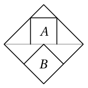

<small>

* answer:$\frac{8}{9}$
* questionType:ShortAnswer

</small>

## Atrisinājums

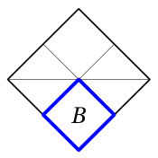

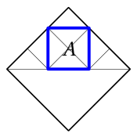

Apakšējā kvadrāta laukums $B$ acīmredzot ir $\frac{1}{4}$ no lielā kvadrāta laukuma (1. zīmējums).

Augšējā kvadrāta laukums $A$ ir 4 reizes lielāks par virs šī kvadrāta esošā mazā trijstūra laukumu un 2 reizes lielāks par katras sānu puses trijstūra laukumu (2. zīmējums). Tātad virs lielā kvadrāta diagonāles esošās daļas laukums ir vienāds ar 9 mazo trijstūru laukumu, tāpēc laukums $A$ veido $\frac{4}{9}$ no virs lielā kvadrāta diagonāles esošās daļas laukuma un $\frac{2}{9}$ no lielā kvadrāta laukuma. Kopumā $A : B = \frac{2}{9} : \frac{1}{4} = \frac{8}{9}$.

# <lo-sample/> EE.PK.2015TEST.8.8

Četras taisnes krustojas, kā parādīts zīmējumā. Atrodi ar burtu $x$ apzīmētā leņķa lielumu.

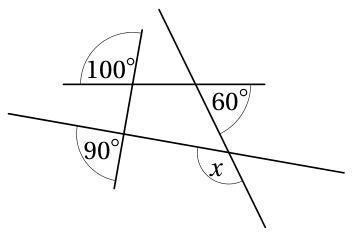

<small>

* answer:$130^\circ$
* questionType:ShortAnswer

</small>

## Atrisinājums

Taisnēm krustojoties izveidojušās četrstūra trīs iekšējo leņķu lielumi ir $90^\circ$, $100^\circ$ un $120^\circ$. Ceturtā iekšējā leņķa lielums tad ir $50^\circ$, jo četrstūra iekšējo leņķu summa ir $360^\circ$. Tātad $x = 130^\circ$.

# <lo-sample/> EE.PK.2015TEST.8.9

Uz riņķa līnijas ar centru $O$ ņem punktus $A$ un $B$ tā, ka loks $AB$ veido piektdaļu no visas riņķa līnijas. Atrodi leņķa $OAB$ lielumu.

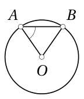

<small>

* answer:$54^\circ$
* questionType:ShortAnswer

</small>

## Atrisinājums

Saskaņā ar uzdevuma nosacījumiem $\angle AOB = \frac{1}{5} \cdot 360^\circ = 72^\circ$. Tā kā $|OA| = |OB|$, tad $\angle OAB = \angle OBA$, tāpēc $\angle OAB = \frac{180^\circ - 72^\circ}{2} = 54^\circ$.

# <lo-sample/> EE.PK.2015TEST.8.10

Masīvkoka taisnstūra paralēlskaldnim, kura izmēri ir $3\ \text{cm} \times 4\ \text{cm} \times 5\ \text{cm}$, visas skaldnes nokrāso zilas. Paralēlskaldni vispirms pārgriež uz pusēm ar griezumu, kas iet caur visu paralēlskaldņa garāko šķautņu viduspunktiem. Pēc tam katru no iegūtajiem ķermeņiem savukārt pārgriež uz pusēm ar griezumu, kas iet caur to garāko šķautņu viduspunktiem. Atrodi iegūto četru ķermeņu zili nenokrāsoto skaldņu laukumu summu.

<small>

* answer:$54\ \text{cm}^2$
* questionType:ShortAnswer

</small>

## Atrisinājums

Pirmās griezuma virsmas izmēri sakrīt ar paralēlskaldņa diviem mazākajiem izmēriem jeb ir $3\ \text{cm} \times 4\ \text{cm}$. Griežot iegūtā viena gabala trešais izmērs ir $2{,}5\ \text{cm}$. Tātad otrais griezums pārdala uz pusēm malas, kuru garums ir $4\ \text{cm}$. Otro griezumu var izdarīt abām pusēm reizē, un tad tas ir it kā sākotnējā paralēlskaldņa griešana. Šīs griezuma virsmas izmēri ir $3\ \text{cm} \times 5\ \text{cm}$. Tā kā griežot rodas divas griezuma virsmas (pa vienai katrai pusei), nenokrāsoto skaldņu laukumu summa ir $2 \cdot (3 \cdot 4 + 3 \cdot 5)$ jeb 54 kvadrātcentimetri.

# <lo-sample/> EE.PK.2015TEST.9.1

Atrodi izteiksmes $\frac{601}{6} + \frac{301}{3} - \frac{201}{2}$ vērtību.

<small>

* answer:100
* questionType:ShortAnswer

</small>

## Atrisinājums

Tā kā $\frac{601}{6} = 100 + \frac{1}{6}$, $\frac{301}{3} = 100 + \frac{1}{3}$ un $\frac{201}{2} = 100 + \frac{1}{2}$, tad

$$
\frac{601}{6} + \frac{301}{3} - \frac{201}{2} = 100 + 100 - 100 + \frac{1}{6} + \frac{1}{3} - \frac{1}{2} = 100.
$$

# <lo-sample/> EE.PK.2015TEST.9.2

Visus naturālos skaitļus pēc lieluma ieraksta 5 kolonnu tabulā, katrā rindā no kreisās uz labo pusi.

$$
\begin{array}{ccccc}
1 & 2 & 3 & 4 & 5\\
6 & 7 & 8 & 9 & 10\\
11 & 12 & 13 & 14 & 15\\
\cdots
\end{array}
$$

Kurā rindā esošo skaitļu summa ir $2015$?

<small>

* answer:81
* questionType:ShortAnswer

</small>

## Atrisinājums

1. atrisinājums. $81$. rindā ir skaitļi no $80 \cdot 5 + 1$ līdz $80 \cdot 5 + 5$ jeb no $401$ līdz $405$, kas kopā dod $2015$.

2. atrisinājums. $1$. rindā skaitļu summa ir $15$. Katrā nākamajā rindā katrs skaitlis ir par $5$ lielāks par iepriekšējās rindas atbilstošo skaitli. Tātad $k$-tās rindas skaitļu summas vispārīgā forma ir $15 + \underbrace{25 + 25 + \ldots + 25}_{k - 1\text{ reizes}}$ jeb $15 + 25(k - 1)$. Atrisinot vienādojumu $15 + 25(k - 1) = 2015$, atrodam, ka $k = 81$.

# <lo-sample/> EE.PK.2015TEST.9.3

Allas un Paula telefonu grāmatās kopā ir $120$ dažādi telefona numuri. Allas telefonu grāmatā ir par $20$ telefona numuriem vairāk nekā Paula grāmatā, un $30$ telefona numuri viņu grāmatās ir vienādi. Cik telefona numuru ir Allas telefonu grāmatā?

<small>

* answer:85
* questionType:ShortAnswer

</small>

## Atrisinājums

Tā kā $30$ telefona numuri ir kopīgi, tad Allas un Paula telefona numuru skaitu summa ir $120 + 30$ jeb $150$. Apzīmējot Allas un Paula telefona numuru skaitu attiecīgi ar mainīgajiem $a$ un $b$, iegūstam vienādojumu sistēmu

$$
\begin{cases}
a + b = 150,\\
a - b = 20.
\end{cases}
$$

Saskaitot vienādojumus, iegūstam $2a = 170$, no kurienes $a = 85$.

# <lo-sample/> EE.PK.2015TEST.9.4

Atrodi mazāko naturālo skaitli, ar kuru skaitlis $1 \cdot 2 \cdot 3 \cdot 4 \cdot 5 \cdot 6 \cdot 7 + 11 \cdot 12 \cdot 13 \cdot 14 \cdot 15 \cdot 16 \cdot 17$ nedalās.

<small>

* answer:11
* questionType:ShortAnswer

</small>

## Atrisinājums

Abi saskaitāmie dalās ar visiem naturālajiem skaitļiem no 1 līdz 10. Tātad arī summa dalās ar visiem šiem skaitļiem. Taču ar 11 dalās tikai otrais saskaitāmais, tāpēc summa ar 11 nedalās.

# <lo-sample/> EE.PK.2015TEST.9.5

Trijstūra leņķu lielumi $\alpha$, $\beta$ un $\gamma$ ir tādi, ka $\alpha + 2\beta + 2\gamma = 300^\circ$ un $\alpha + \beta + 3\gamma = 200^\circ$. Atrodi $\beta$.

<small>

* answer:110^\circ
* questionType:ShortAnswer

</small>

## Atrisinājums

Tā kā $\alpha$, $\beta$ un $\gamma$ ir trijstūra leņķi, tad $\alpha + \beta + \gamma = 180^\circ$. Saskaņā ar uzdevuma nosacījumiem $\alpha + 2\beta + 2\gamma = 300^\circ$ un $\alpha + \beta + 3\gamma = 200^\circ$, no kurienes iegūstam attiecīgi $\beta + \gamma = 120^\circ$ un $2\gamma = 20^\circ$. Tātad $\gamma = 10^\circ$ un $\beta = 110^\circ$.

# <lo-sample/> EE.PK.2015TEST.9.6

Taisne $a$ krusto taisnes $s$ un $t$ punktā $A$, bet taisne $b$ krusto taisnes $s$ un $t$ attiecīgi punktos $B$ un $C$. Taisnes $a$ un $b$ ir paralēlas. Divu zīmējumā apzīmēto leņķu lielums ir $y$, un leņķa $ABC$ lielums ir $80^\circ$. Atrodi $y$.

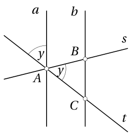

<small>

* answer:50^\circ
* questionType:ShortAnswer

</small>

## Atrisinājums

Taišņu $a$ un $b$ paralelitātes dēļ $\angle ACB = y$. Tagad no trijstūra $ABC$ iegūstam $y + y + 80^\circ = 180^\circ$, kas dod $y = 50^\circ$.

# <lo-sample/> EE.PK.2015TEST.9.7

Četrstūrī $ABCD$ ir $|AB| = 18$ cm un $|BC| = 8$ cm. Leņķi $ADB$ un $BCD$ ir taisni leņķi, un leņķi $DAB$ un $BDC$ ir vienāda lieluma. Atrodi diagonāles $DB$ garumu.

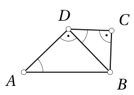

<small>

* answer:12 cm
* questionType:ShortAnswer

</small>

## Atrisinājums

Saskaņā ar uzdevuma nosacījumiem trijstūri $ABD$ un $DBC$ ir līdzīgi pēc pazīmes LL. Tātad $\frac{|BC|}{|BD|} = \frac{|BD|}{|BA|}$, no kurienes $|BD|^2 = |BA| \cdot |BC| = 18\text{ cm} \cdot 8\text{ cm}$. No šejienes $|BD| = 12$ cm.

# <lo-sample/> EE.PK.2015TEST.9.8

Četrstūris $ABCD$ ir paralelograms. Uz malas $AB$ ņem punktu $N$ tā, ka $NB$ ir 3 reizes īsāks nekā $AN$. Uz malas $DC$ ņem punktu $M$ tā, ka $DM$ ir 3 reizes īsāks nekā $MC$. Nogriežņa $MN$ garums ir 8 cm. Paralelograma $ABCD$ perimetrs ir 52 cm. Atrodi četrstūra $NBCM$ perimetru.

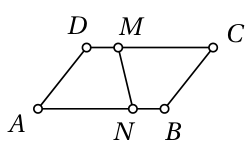

<small>

* answer:34 cm
* questionType:ShortAnswer

</small>

## Atrisinājums

Tā kā $|MD| = |NB|$, tad arī $|MC| = |NA|$. Kopumā četrstūri $ADMN$ un $CBNM$ ir vienādi. Četrstūru $ADMN$ un $CBNM$ perimetru summa ir vienāda ar paralelograma $ABCD$ perimetra un nogriežņa $MN$ divkāršā garuma summu. Tātad četrstūra $NBCM$ perimetrs ir $\frac{52\text{ cm} + 2 \cdot 8\text{ cm}}{2}$ jeb 34 cm.

# <lo-sample/> EE.PK.2015TEST.9.9

Kvadrātā ar malas garumu 8 cm uzzīmē kvadrātu ar malas garumu 2 cm. Kvadrātu atbilstošās malas ir paralēlas. Atrodi divu zīmējumā tumši iekrāsoto trijstūru laukumu summu.

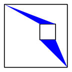

<small>

* answer:6 cm^2
* questionType:ShortAnswer

</small>

## Atrisinājums

Lielā un mazā kvadrāta malu garumu starpība 6 cm ir vienāda ar abu trijstūru augstumu summu. Pamati abiem ir 2 cm gari. Tātad laukumu summa ir $\frac{2\text{ cm} \cdot 6\text{ cm}}{2}$ jeb $6\text{ cm}^2$.

# <lo-sample/> EE.PK.2015TEST.9.10

Masīvkoka taisnstūra paralēlskaldnim, kura izmēri ir 3 cm $\times$ 4 cm $\times$ 5 cm, visas skaldnes nokrāso zilas. Paralēlskaldni vispirms pārgriež uz pusēm ar griezumu, kas iet caur visu paralēlskaldņa garāko šķautņu viduspunktiem. Pēc tam katru no iegūtajiem ķermeņiem savukārt pārgriež uz pusēm ar griezumu, kas iet caur to garāko šķautņu viduspunktiem. Visbeidzot katru iegūto ķermeni vēlreiz pārgriež uz pusēm ar griezumu, kas iet caur to garāko šķautņu viduspunktiem. Atrodi visu beigās iegūto ķermeņu zili nenokrāsoto skaldņu laukumu summu.

<small>

* answer:94 cm^2
* questionType:ShortAnswer

</small>

## Atrisinājums

Pirmās griezuma virsmas izmēri sakrīt ar paralēlskaldņa diviem mazākajiem izmēriem jeb ir 3 cm $\times$ 4 cm. Griežot iegūtā viena gabala trešais izmērs ir 2,5 cm. Tātad otrais griezums pārdala uz pusēm malas, kuru garums ir 4 cm. Otro griezumu var izdarīt abām pusēm reizē, un tad tas ir it kā sākotnējā paralēlskaldņa griešana. Šīs griezuma virsmas izmēri ir 3 cm $\times$ 5 cm, un mazā gabala izmēri ir 3 cm $\times$ 2,5 cm $\times$ 2 cm. Tātad trešais griezums pārdala uz pusēm malas, kuru garums ir 3 cm. Arī trešos griezumus var izdarīt reizē, saliekot četrus mazos ķermeņus kopā sākotnējā paralēlskaldnī, un šīs griezuma virsmas izmēri ir 4 cm $\times$ 5 cm. Tā kā griežot rodas divas griezuma virsmas (pa vienai katrai pusei), nenokrāsoto skaldņu laukumu summa ir $2 \cdot (3 \cdot 4 + 3 \cdot 5 + 4 \cdot 5)$ jeb 94 kvadrātcentimetri.
