# <lo-sample/> EE.PK.2016TEST.7.1

Leia arvu $123456777777654321$ numbrite summa.

<small>

* answer:$91$
* questionType:ShortAnswer

</small>

## Lahendus

$(1 + 6) + (2 + 5) + (3 + 4) + 7 \cdot 7 + (6 + 1) + (5 + 2) + (4 + 3) = 13 \cdot 7 = 91$.

# <lo-sample/> EE.PK.2016TEST.7.2

Leia arvu $2016$ suurim paarituarvuline jagaja.

<small>

* answer:$63$
* questionType:ShortAnswer

</small>

## Lahendus

Esitame arvu $2016$ algtegurite korrutisena $2016 = 2^5 \cdot 3^2 \cdot 7$. Suurim paarituarvuline jagaja on $3^2 \cdot 7 = 63$.

# <lo-sample/> EE.PK.2016TEST.7.3

Tabeli igas reas ja igas veerus peaks kolme arvu summa olema $1$. Mõned arvud on juba kantud tabelisse. Milline arv peaks olema tabeli keskmises ruudus?

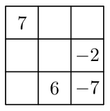

<small>

* answer:$11$
* questionType:ShortAnswer

</small>

## Lahendus

Alumises vasakus ruudus peaks olema arv $1 - (6 + (-7)) = 2$. Vasakpoolse veeru keskmises ruudus peaks olema arv $1 - (7 + 2) = -8$. Tabeli keskmises ruudus peaks olema arv $1 - ((-8) + (-2)) = 11$.

# <lo-sample/> EE.PK.2016TEST.7.4

Kert asus leiutama uut arvude rida. Esimeseks arvuks valis ta arvu $2$. Iga järgneva arvu sai ta siis, kui lahutas arvust $1$ viimati kirjutatud arvu pöördarvu. Milline oli kahekümnes arv selles reas?

<small>

* answer:$0{,}5$
* questionType:ShortAnswer

</small>

## Lahendus

Teine arv selles reas on $1 - \frac{1}{2} = 0{,}5$. Kolmas arv selles reas on $1 - \frac{1}{0{,}5} = -1$.

Neljas arv selles reas on $1 - \frac{1}{-1} = 2$. Seega reas korduvad tsükliliselt arvud $2$, $0{,}5$ ja $-1$. Kuna $20$ annab $3$-ga jagades jäägi $2$, siis kahekümnes arv selles reas on $0{,}5$.

# <lo-sample/> EE.PK.2016TEST.7.5

Multikaid näidati eile alates kella $16.20$-st kuni kella $20.16$-ni. Iga multikas kestis täpselt $16$ minutit ja iga kahe multika vahel oli täpselt $4$ minutit reklaami. Mitu multikat eile näidati?

<small>

* answer:$12$
* questionType:ShortAnswer

</small>

## Lahendus

Ühes tunnis näidati kolm multikat ja kolm tsüklit reklaami. Et multikaid näidati $16.20$-st $20.16$-ni, st $4$ minutit vähem kui $4$ tundi ja reklaami pikkus on $4$ minutit, siis näidati eile $4 \cdot 3 = 12$ multikat.

# <lo-sample/> EE.PK.2016TEST.7.6

Ruudu $ABCD$ ja ristküliku $EFGB$ pindalad on $36\ \text{cm}^2$. Lõigu $EF$ pikkus on võrdne ruudu $ABCD$ ümbermõõduga. Leia lõigu $FG$ pikkus.

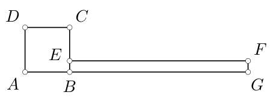

<small>

* answer:$1{,}5\ \text{cm}$
* questionType:ShortAnswer

</small>

## Lahendus

Ruudu $ABCD$ külje pikkus on $6\ \text{cm}$, ümbermõõt $4 \cdot 6\ \text{cm} = 24\ \text{cm}$. Lõigu $FG$ pikkus on $36\ \text{cm}^2 : 24\ \text{cm} = 1{,}5\ \text{cm}$.

# <lo-sample/> EE.PK.2016TEST.7.7

Ruudustiku kogupindala on $25\ \text{cm}^2$. Leia tumedaks värvitud kujundi pindala.

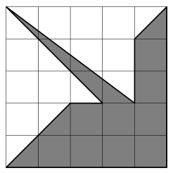

<small>

* answer:$12\ \text{cm}^2$
* questionType:ShortAnswer

</small>

## Lahendus

Väikese ruudu küljepikkus on $1\ \text{cm}$ ja pindala $1\ \text{cm}^2$. Jaotame tumedaks värvitud kujundi kolmnurkadeks ja ristkülikuteks (vt joonis 1). Tumedaks värvitud kujundi pindala on $\frac{2 \cdot 2}{2} + \frac{1 \cdot 3}{2} + \frac{1 \cdot 1}{2} + 6 + 2 = 12$ ruutsentimeetrit.

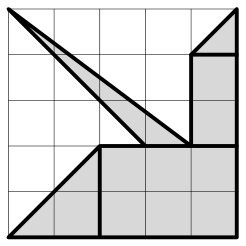

Joonis 1

# <lo-sample/> EE.PK.2016TEST.7.8

Leia tähega $y$ tähistatud nurga suurus, kui tähega $x$ tähistatud nurgad on omavahel võrdse suurusega.

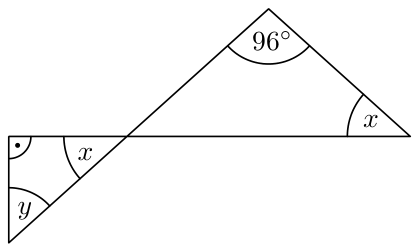

<small>

* answer:$48^\circ$
* questionType:ShortAnswer

</small>

## Lahendus

Tippnurkade võrdsuse tõttu on suurem kolmnurk võrdhaarne ning

$$
x = (180^\circ - 96^\circ) : 2 = 42^\circ.
$$

Täisnurksest kolmnurgast saame

$$
y = 90^\circ - 42^\circ = 48^\circ.
$$

# <lo-sample/> EE.PK.2016TEST.7.9

Pitsa jaotati seitsmeks tükiks nii, et $6$ tükki olid võrdsed ning seitsmes tükk moodustas $\frac{1}{3}$ osa kogu pitsast. Kui suure osa pitsast moodustas kõige väiksem lõigatud tükkidest?

<small>

* answer:$\frac{1}{9}$
* questionType:ShortAnswer

</small>

## Lahendus

Et seitsmes tükk moodustas $\frac{1}{3}$ osa pitsast, siis esimesed kuus võrdsed tükki kokku moodustasid $\frac{2}{3} = \frac{6}{9}$ osa pitsast. Pisemad tükid moodustasid kõik pitsast $\frac{1}{9}$ osa.

# <lo-sample/> EE.PK.2016TEST.7.10

Juku märkis ringjoonele $7$ punkti ja joonestas kõik neid punkte paarikaupa ühendavad kõõlud. Osutus, et kolm neist olid sama pikad kui selle ringjoone diameeter. Mitu tõmmatud kõõlu olid diameetrist lühemad?

<small>

* answer:$18$
* questionType:ShortAnswer

</small>

## Lahendus

Igast punktist saab tõmmata $6$ kõõlu, kuid sel juhul on kõik kõõlud loetud topelt. Seega kõõle on kokku $\frac{7 \cdot 6}{2} = 21$. Kuna diameetrist pikemaid kõõle ei eksisteeri, siis kõik $21 - 3 = 18$ kõõlu olid diameetrist lühemad.

# <lo-sample/> EE.PK.2016TEST.8.1

Leia arvu 808182838485868788898 numbrite summa.

<small>

* answer:133
* questionType:ShortAnswer

</small>

## Lahendus

$11\cdot 8 + (0+9) + (1+8) + (2+7) + (3+6) + (4+5) = 88 + 5\cdot 9 = 133$.

# <lo-sample/> EE.PK.2016TEST.8.2

Kell 18.00 oli välistemperatuur $-5^\circ\mathrm{C}$. Ilmaennustus hoiatas, et lähema 10 tunni jooksul võib temperatuur langeda iga tunniga $2^\circ\mathrm{C}$ võrra. Mis kell selle ennustuse kohaselt oleks temperatuur $-19^\circ\mathrm{C}$?

<small>

* answer:01.00
* questionType:ShortAnswer

</small>

## Lahendus

Temperatuur langeb $-5 - (-19) = 14$ kraadi võrra ennustuse kohaselt $14:2=7$ tunniga ehk kella 01.00-ks.

# <lo-sample/> EE.PK.2016TEST.8.3

Leia naturaalarv $k$, kui

$$
k=\frac{20162016}{2}-\frac{20162016}{4}-\frac{20162016}{8}.
$$

<small>

* answer:2520252
* questionType:ShortAnswer

</small>

## Lahendus

$k = 20162016\cdot\left(\frac{1}{2}-\frac{1}{4}-\frac{1}{8}\right)=20162016\cdot\frac{1}{8}=2520252$.

# <lo-sample/> EE.PK.2016TEST.8.4

Üheksa naturaalarvu $1, 2, 3, \ldots, 9$ seast tuleks kustutada üks nii, et ülejäänud kaheksa arvu vähim ühiskordne oleks võimalikest vähim. Milline arv tuleks kustutada?

<small>

* answer:7
* questionType:ShortAnswer

</small>

## Lahendus

Arvude $1, 2, 3, \ldots, 9$ vähim ühiskordne on $2^3\cdot 3^2\cdot 5\cdot 7$. Arvu 9 kustutamisel väheneks vähim ühiskordne 3 korda, arvu 8 kustutamisel väheneks 2 korda, arvu 7 kustutamisel väheneks 7 korda, arvu 5 kustutamisel väheneks 5 korda. Ülejäänud arvude kustutamine vähimat ühiskordset ei mõjuta.

# <lo-sample/> EE.PK.2016TEST.8.5

Leia jääk, mis tekib, kui jagada summa

$$
2016^3+2016^2+2016^1+2016^0
$$

arvuga 9.

<small>

* answer:1
* questionType:ShortAnswer

</small>

## Lahendus

Et 2016 jagub 9-ga, siis $2016^3+2016^2+2016^1$ jagub 9-ga. Arv $2016^0=1$ annab jagades jäägi 1.

# <lo-sample/> EE.PK.2016TEST.8.6

Kõigile jooksujalatsitele kehtis soodustus 20% tavahinnast. Kati ostis ühed soodustusega jalatsid ja maksis 16 eurot tavahinnast vähem. Kui palju Kati maksis oma jalatsite eest?

<small>

* answer:64 eurot
* questionType:ShortAnswer

</small>

## Lahendus

Kuna 16 eurot moodustab 20%, siis tavahind on $16:0{,}2=80$ eurot. Kati maksis $80-16=64$ eurot.

# <lo-sample/> EE.PK.2016TEST.8.7

Ruudu $ABCD$ ja ristküliku $HAGF$ pindalad on $36\ \mathrm{cm}^2$. Punkt $H$ on lõigu $AD$ keskpunkt. Leia kuusnurga $AGFECD$ ümbermõõt.

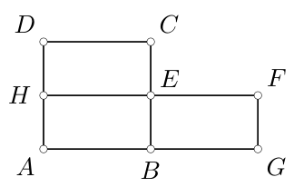

<small>

* answer:36 cm
* questionType:ShortAnswer

</small>

## Lahendus

Ruudu $ABCD$ külje pikkus on $\sqrt{36\ \mathrm{cm}^2}=6\ \mathrm{cm}$. Ristküliku külgede pikkused on $|AH|=6\ \mathrm{cm}:2=3\ \mathrm{cm}$ ning $|AG|=36\ \mathrm{cm}^2:3\ \mathrm{cm}=12\ \mathrm{cm}$. Kuusnurga $AGFECD$ ümbermõõt on $12+3+6+3+6+6=36$ sentimeetrit.

# <lo-sample/> EE.PK.2016TEST.8.8

Ristkülikusse $ABCD$ on joonestatud poolring diameetriga $AB$ ja keskpunktiga $E$. Poolring puutub külge $DC$. Leia tumedaks värvitud kujundi täpne pindala, kui ristküliku $ABCD$ pindala on $32\ \mathrm{cm}^2$.

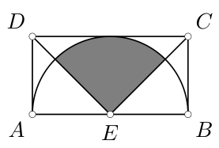

<small>

* answer:$4\pi\ \mathrm{cm}^2$
* questionType:ShortAnswer

</small>

## Lahendus

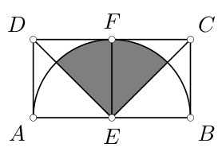

Ristküliku pikem külg on lühemast 2 korda pikem, seega lõik $EF$ (vt joonis 2) jaotab ristküliku kaheks ruuduks küljepikkusega

$$
|DA|=|AE|=|EB|=|BC|=\sqrt{32\ \mathrm{cm}^2:2}=4\ \mathrm{cm}.
$$

Kuna kolmnurgad $DAE$ ja $EBC$ on võrdhaarsed täisnurksed, siis

$$
\angle DEA=\angle CEB=45^\circ.
$$

Tumedaks värvitud kujund on ringi sektor kesknurgaga $180^\circ-2\cdot 45^\circ=90^\circ$ ning pindalaga $\frac{1}{4}\cdot\pi(4\ \mathrm{cm})^2=4\pi\ \mathrm{cm}^2$.

# <lo-sample/> EE.PK.2016TEST.8.9

Punkt $C$ on lõikude $AD$ ja $EB$ lõikepunkt. Kolmnurk $ACE$ on võrdhaarne. Leia nurga $EAB$ suurus.

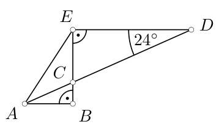

<small>

* answer:$57^\circ$
* questionType:ShortAnswer

</small>

## Lahendus

*Lahendus 1.* Täisnurksest kolmnurgast $DEC$ avaldame teise teravnurga $\angle ECD = 90^\circ - 24^\circ = 66^\circ$ (vt joonis 3). Kuna $\angle ECD$ on kolmnurga $ECA$ välisnurk, siis $\angle AEC + \angle EAC = 66^\circ$. Kolmnurk $ECA$ on võrdhaarne, seega $\angle AEC = \angle EAC = 66^\circ:2 = 33^\circ$. Täisnurksest kolmnurgast $ABE$ leiame

$$
\angle EAB = 90^\circ - \angle AEB = 90^\circ - \angle AEC = 90^\circ - 33^\circ = 57^\circ.
$$

*Lahendus 2.* Sirged $ED$ ja $AB$ on paralleelsed, sest sirge $EB$ on nende mõlemaga risti. Põiknurkade võrdsuse tõttu $\angle CAB = \angle EDC = 24^\circ$. Täisnurksest kolmnurgast $ABE$ saame, et $\angle EAC + \angle AEC = 90^\circ - 24^\circ = 66^\circ$. Kuna kolmnurk $ACE$ on võrdhaarne, siis $\angle EAC = 66^\circ:2 = 33^\circ$. Kokkuvõttes

$$
\angle EAB = \angle EAC + \angle CAB = 33^\circ + 24^\circ = 57^\circ.
$$

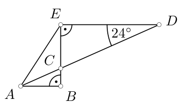

# <lo-sample/> EE.PK.2016TEST.8.10

Jukul oli musta pliiatsiga joonestatud ringjoon ja sellele sama värvi pliiatsiga tõmmatud üks diameeter. Punase pliiatsiga tõmbas Juku veel neli selle ringjoone diameetrit ja märkis punasega ka nende diameetrite otspunktid. Maksimaalselt mitu sellist punaseid ringjoone punkte ühendavat kõõlu saab ta tõmmata, mis ei lõikuks musta diameetriga?

<small>

* answer:12
* questionType:ShortAnswer

</small>

## Lahendus

Mustast diameetrist ühel pool on 4, teisel pool 4 punast punkti. Nelja punkti ühendamiseks saab joonestada 6 kõõlu. Kokku on seega $2\cdot 6=12$ kõõlu.

# <lo-sample/> EE.PK.2016TEST.9.1

Leia arvu $19299399949999599999699999979999999$ numbrite summa.

<small>

* answer:280
* questionType:ShortAnswer

</small>

## Lahendus

Et $1 + 2 + 3 + 4 + 5 + 6 + 7 = 28$, siis numbrite summa on $28 + 28 \cdot 9 = 280$.

# <lo-sample/> EE.PK.2016TEST.9.2

Kui $n^*$ on arvu $n$ kõikide paaritute jagajate summa, siis millega võrdub $20^* + 16^*$?

<small>

* answer:7
* questionType:ShortAnswer

</small>

## Lahendus

Arvu $20$ paaritud jagajad on $1$ ja $5$, arvu $16$ ainus paaritu jagaja on $1$. Jagajate summa on $1 + 5 + 1 = 7$.

# <lo-sample/> EE.PK.2016TEST.9.3

Leia täisarv $k$, kui

$$
k = \frac{2016 \cdot 2017^2 - 2016 \cdot 2015^2}{2016^2}.
$$

<small>

* answer:4
* questionType:ShortAnswer

</small>

## Lahendus

$$
k = \frac{2016 \cdot (2017 - 2015) \cdot (2017 + 2015)}{2016^2} = \frac{2016 \cdot 2 \cdot (2 \cdot 2016)}{2016^2} = 4.
$$

# <lo-sample/> EE.PK.2016TEST.9.4

Korrutada võib ainult sellist kahte tabelisse kirjutatud arvu, mis asuvad naaberruutudes (ühist külge omavad ruudud). Mitu sel viisil saadud korrutist on väiksemad arvust $6^4$?

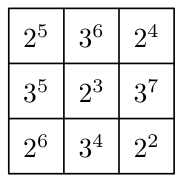

<small>

* answer:2
* questionType:ShortAnswer

</small>

## Lahendus

Naaberruutudes asuvate arvude korral üks on alati arvu $2$ aste ning teine arvu $3$ aste. Et $6^4 = 2^4 \cdot 3^4$, tasub vaadelda ainult neid naaberruutude paare, milles vähemalt ühe arvu astendaja on väiksem kui $4$. Arvust $4$ väiksemaid astendajaid esineb tabelis ainult kahes kohas. Tabeli keskel asuva arvu $2^3$ korrutamisel naaberruutudes asetsevate arvudega on $6^4$-st väiksem vaid $2^3 \cdot 3^4$. All paremal asuva arvu $2^2$ korral on $6^4$-st väiksem vaid $2^2 \cdot 3^4$.

# <lo-sample/> EE.PK.2016TEST.9.5

Kalle tellis netipoest tahvelarvuti, mille eest ta tasus koos saateküluga $180$ eurot. Kui saatekulu oleks olnud $3$ korda suurem, oleks tal tulnud tasuda $240$ eurot. Kui palju tulnuks Kallel tasuda siis, kui saatekulu oleks olnud $3$ korda väiksem?

<small>

* answer:160 eurot
* questionType:ShortAnswer

</small>

## Lahendus

Saatekulu oli $(240 - 180) : 2 = 30$ eurot. Kui saatekulu oleks kolm korda väiksem ehk $10$ eurot, tuleks Kallel tasuda $180 - 30 + 10 = 160$ eurot.

# <lo-sample/> EE.PK.2016TEST.9.6

Kui palju on selliseid naturaalarve $x$, mille korral on avaldise $18 + \frac{19 - x}{2}$ väärtus suurem avaldise $6 - \frac{x - 7}{2}$ väärtusest ning kehtib $0 < x \leq 99$?

<small>

* answer:99
* questionType:ShortAnswer

</small>

## Lahendus

Avaldise

$$
18 + \frac{19 - x}{2} = 27{,}5 - \frac{x}{2}
$$

väärtus on iga $x$ väärtuse korral suurem avaldise

$$
6 - \frac{x - 7}{2} = 9{,}5 - \frac{x}{2}
$$

väärtusest, sest nende avaldiste vahe võrdub alati arvuga $18$. Piirkonnas $0 < x \leq 99$ on kokku $99$ naturaalarvu.

# <lo-sample/> EE.PK.2016TEST.9.7

Ruudu $ABCD$ ja ristküliku $KLMN$ pindalad on $36$ cm$^2$. Leia tumedaks värvitud ristküliku pindala, kui ristküliku $KLMN$ pikkuse ja laiuse suhe on $4$.

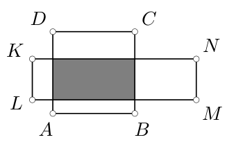

<small>

* answer:18 cm$^2$
* questionType:ShortAnswer

</small>

## Lahendus

Ruudu $ABCD$ küljepikkus on $\sqrt{36\ \text{cm}^2} = 6$ cm. Olgu ristküliku $KLMN$ külgede pikkused $a$ ja $4a$, siis võrrandist $4a^2 = 36$ cm$^2$ saame $a = 3$ cm. Tumedaks värvitud ristküliku pindala on $6$ cm $\cdot\ 3$ cm $= 18$ cm$^2$.

# <lo-sample/> EE.PK.2016TEST.9.8

Ringi sektori $AOB$ pindala on $1{,}8\pi$ cm$^2$ ja kesknurga $AOB$ suurus on $72^\circ$. Leia kaare $AB$ täpne pikkus sentimeetrites.

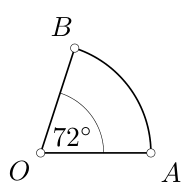

<small>

* answer:$1{,}2\pi$ cm
* questionType:ShortAnswer

</small>

## Lahendus

Sektor moodustab täisringist $\frac{72}{360} = \frac{1}{5}$ osa. Olgu $r = |OA|$ ringi raadiuse pikkus. Kuna $\frac{1}{5}\pi r^2 = 1{,}8\pi$ cm$^2$, siis $r = 3$ cm. Kaare $AB$ pikkus on $\frac{1}{5} \cdot 2\pi r = 1{,}2\pi$ cm.

# <lo-sample/> EE.PK.2016TEST.9.9

Sirged $DE$ ja $AB$ on paralleelsed. Sirged $AD$ ja $BE$ lõikuvad punktis $C$ ning kehtivad võrdused $|DB| = |DC| = |BE|$. Leia nurga $DCE$ suurus.

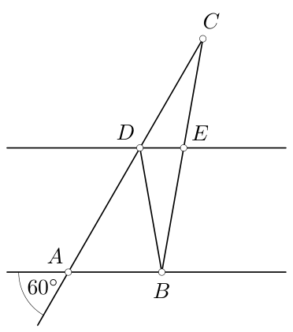

<small>

* answer:$20^\circ$
* questionType:ShortAnswer

</small>

## Lahendus

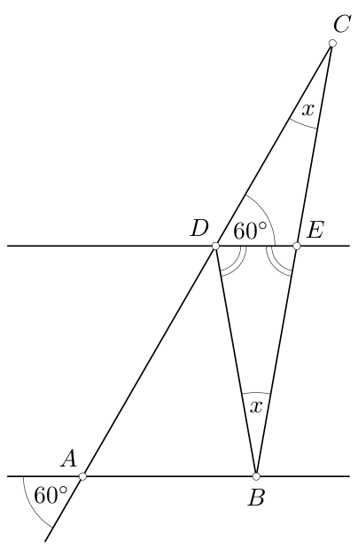

Kuna $AB \parallel DE$, siis tipp- ja põiknurkade võrdsuse tõttu $\angle CDE = 60^\circ$ (vt joonis 4). Olgu $\angle DCE = x$. Võrdusest $|DB| = |DC|$ saame, et kolmnurk $BDC$ on võrdhaarne, seega $\angle DBE = x$. Kuna $\angle DEB$ on kolmnurga $DEC$ välisnurk, võime kirjutada, et $\angle DEB = 60^\circ + x$. Võrdusest $|DB| = |BE|$ saame, et kolmnurk $DBE$ on võrdhaarne, seega $\angle EDB = 60^\circ + x$. Kolmnurga $DBE$ sisenurkade summa on $(60^\circ + x) + x + (60^\circ + x) = 180^\circ$, millest $x = 20^\circ$.

# <lo-sample/> EE.PK.2016TEST.9.10

Tarmo paigutas ringjoonele $9$ erinevat punkti nii, et saaks tõmmata läbi nende punktide võimalikult palju selliseid erinevaid kõõle, mis läbiksid ringjoone keskpunkti. Maksimaalselt kui palju saab ta nende punktide vahele tõmmata erinevaid kõõle, mis ei läbi ringjoone keskpunkti?

<small>

* answer:32
* questionType:ShortAnswer

</small>

## Lahendus

Tarmo paigutas punktid nii, et ta sai tõmmata $4$ kõõlu, mis läbisid ringjoone keskpunkti. Kuna $9$ punkti vahel on võimalik tõmmata $\frac{8 \cdot 9}{2} = 36$ kõõlu, siis $32$ neist ei läbi ringjoone keskpunkti.
