# <lo-sample/> EE.PK.2017TEST.7.1

Cik ir tādu četrciparu nepāra skaitļu, kas sastāv no dažādiem cipariem 2, 0, 1 un 7?

<small>

* answer:8
* questionType:ShortAnswer

</small>

## Atrisinājums

Nepāra skaitļa beigās var būt 1 vai 7 (2 iespējas). Skaitļa sākumā var būt 2 vai tas nepāra cipars, kas nav beigās (2 iespējas). Divi vidējie cipari var būt jebkurā secībā (2 iespējas). Kopā $2 \cdot 2 \cdot 2$ jeb 8 iespējas.

# <lo-sample/> EE.PK.2017TEST.7.2

Atrodi izteiksmes $20 : 17 : (20 : 17 : 20 : 17)$ vērtību.

<small>

* answer:340
* questionType:ShortAnswer

</small>

## Atrisinājums

$20 : 17 : (20 : 17 : 20 : 17) = 20 : 17 : (1 : 17^2) = 20 \cdot 17 = 340$.

# <lo-sample/> EE.PK.2017TEST.7.3

Atrodi četrciparu naturālu skaitli, kura visi cipari ir dažādi, ja zināms, ka, samazinot divus šī skaitļa ciparus par 1 un palielinot pārējos divus ciparus par 1, var iegūt skaitli 2570.

<small>

* answer:3461
* questionType:ShortAnswer

</small>

## Atrisinājums

Pēdējo ciparu var iegūt tikai samazinot ciparu 1. Tātad pirmo ciparu nevar iegūt palielinot ciparu 1, bet tikai samazinot ciparu 3. Līdz ar to pārējiem cipariem 5 un 7 jābūt iegūtiem, palielinot attiecīgi ciparus 4 un 6.

# <lo-sample/> EE.PK.2017TEST.7.4

Lai iegūtu dotā skaitļa kvadrātu, pašu skaitli jāreizina ar skaitli 4. Par cik dotā skaitļa kubs ir lielāks par pašu skaitli?

<small>

* answer:60
* questionType:ShortAnswer

</small>

## Atrisinājums

Lai iegūtu skaitļa kvadrātu, skaitlis jāreizina pašam ar sevi. Saskaņā ar uzdevuma nosacījumu skaitļa kvadrātu iegūst, reizinot ar 4. Tātad dotais skaitlis ir vienāds ar 4. Skaitlis $4^3$ jeb 64 ir par 60 lielāks nekā skaitlis 4.

# <lo-sample/> EE.PK.2017TEST.7.5

Atrodi mazāko iespējamo naturālo skaitli $n$, kuram skaitlis $n^2$ dalās ar skaitli 5 un skaitlis $(n + 1)^2$ dalās ar skaitli 7.

<small>

* answer:20
* questionType:ShortAnswer

</small>

## Atrisinājums

Skaitļa kvadrāts dalās ar pirmskaitli 5 tieši tad, ja pats skaitlis dalās ar skaitli 5. Tāpat skaitļa kvadrāts dalās ar pirmskaitli 7 tieši tad, ja pats skaitlis dalās ar skaitli 7. Tātad jāatrod mazākais naturālais skaitlis $n$, lai $n$ dalītos ar 5 un $n + 1$ dalītos ar 7. Divi mazākie ar 7 dalāmie skaitļi 7 un 14 neder $n + 1$ vietā, jo tad $n$ nedalītos ar 5. Nākamais ar 7 dalāmais skaitlis 21 der $n + 1$ vietā.

# <lo-sample/> EE.PK.2017TEST.7.6

Uz trijstūra $ABC$ malas $BC$ atrodas tāds punkts $D$, ka trijstūris $ABD$ ir vienādmalu un trijstūris $ACD$ ir vienādsānu. Atrodi leņķa $ACB$ lielumu.

<small>

* answer:$30^\circ$
* questionType:ShortAnswer

</small>

## Atrisinājums

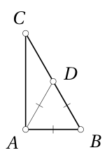

Tā kā trijstūris $ABD$ ir vienādmalu (1. zīmējums), tā leņķi ir $60^\circ$ lieli. Tā kā $\angle ADC = 180^\circ - 60^\circ = 120^\circ$, trijstūris $ADC$ var būt vienādsānu tikai tad, ja $ADC$ ir virsotnes leņķis. Leņķi pie pamata tad ir $\frac{180^\circ - 120^\circ}{2}$ jeb $30^\circ$ lieli. Tātad arī $\angle ACB = 30^\circ$.

# <lo-sample/> EE.PK.2017TEST.7.7

Divi vienādi kvadrāti ar malas garumu 4 cm pārklājas tā, kā parādīts zīmējumā.

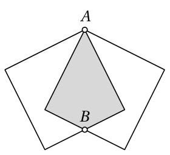

Punkts $A$ ir abu kvadrātu virsotne, bet punkts $B$ – abu kvadrātu malas viduspunkts. Atrodi šo kvadrātu pārklājošās daļas laukumu.

<small>

* answer:$8\ \text{cm}^2$
* questionType:ShortAnswer

</small>

## Atrisinājums

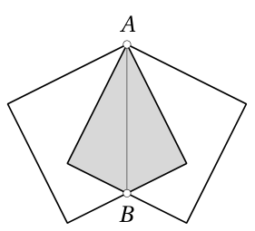

Simetrijas dēļ nogrieznis $AB$ sadala pārklājošos apgabalu uz pusēm (2. zīmējums). Katra puse ir taisnleņķa trijstūris ar laukumu $\frac{1}{2} \cdot 4 \cdot 2$ jeb 4 kvadrātcentimetri. Tātad kopā pārklājošās daļas laukums ir $8\ \text{cm}^2$.

# <lo-sample/> EE.PK.2017TEST.7.8

Uz nogriežņa ar vienādiem atstatumiem atzīmēti četri punkti $A$, $B$, $C$ un $D$.

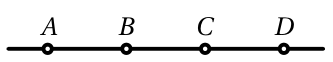

Nogriezni pagriež vispirms ap punktu $B$, tad ap punktu $C$ un visbeidzot ap punktu $D$, katru reizi tieši par izstieptu leņķi. Nosauc no četriem atzīmētajiem punktiem visus tos, kuru atrašanās vieta pēc šīm pagriešanām ir tāda pati kā sākumā.

<small>

* answer:C
* questionType:ShortAnswer

</small>

## Atrisinājums

Pēc pirmās pagriešanas punkts $C$ atrodas tur, kur sākumā bija punkts $A$, un $D$ – vienu vietu pa kreisi no tā. Pagriešana ap punktu $C$ nemaina punkta $C$ atrašanās vietu, bet punkts $D$ pārvietojas vienu vietu pa labi no tā, kur sākotnēji bija $B$. Tātad pēdējā pagriešana ap punktu $D$ atgriež punktu $C$ tā sākotnējā vietā. Tā kā katra pagriešana maina atzīmēto punktu secību uz pretējo un pagriešanu skaits ir nepāra, pārējie punkti nevar atrasties savā sākotnējā vietā. 3. zīmējumā viens zem otra pēc kārtas attēlots nogriežņa sākotnējais novietojums un novietojums pēc katras pagriešanas.

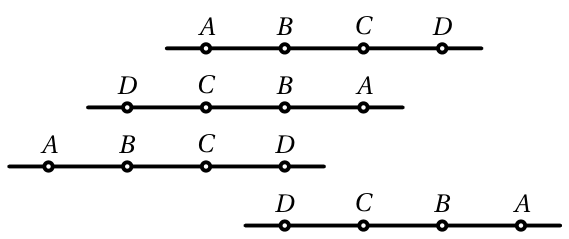

# <lo-sample/> EE.PK.2017TEST.7.9

Dažādmalu trijstūra katras malas garums ir nepāra skaitlis centimetru. Atrodi šī trijstūra mazāko iespējamo perimetru.

<small>

* answer:$15\ \text{cm}$
* questionType:ShortAnswer

</small>

## Atrisinājums

Nevienas trijstūra malas garums nevar būt 1 cm, jo pārējo divu malu garumu starpība ir lielāka par to. Ja trijstūra īsākās malas garums ir 3 cm, tad pārējo malu garumi var būt 5 cm un 7 cm. Tātad mazākais iespējamais perimetrs ir 15 cm.

# <lo-sample/> EE.PK.2017TEST.7.10

Katrā kubiņa virsotnē ieraksta vienu no burtiem A, B, C, D, E, F, G un H. Katrā virsotnē ieraksta citu burtu.

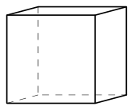

Piecu skaldņu virsotnēs esošie burti alfabēta secībā ir šādi:

A, B, E, H;  
C, D, F, G;  
B, D, E, G;  
A, C, F, H;  
B, C, G, H.

Atrodi sestās skaldnes virsotnēs esošos burtus.

<small>

* answer:A, D, E, F
* questionType:ShortAnswer

</small>

## Atrisinājums

1. atrisinājums. Katra virsotne pieder trim skaldnēm. Piecu skaldņu virsotņu sarakstos burti A, D, E, F sastopami divas reizes, bet pārējie burti trīs reizes. Tātad trūkstošās skaldnes virsotnēs ir A, D, E, F.

2. atrisinājums. Divām skaldnēm var būt divas kopīgas virsotnes vai neviena. Kopīgās virsotnes ir kuba šķautnes galapunkti.

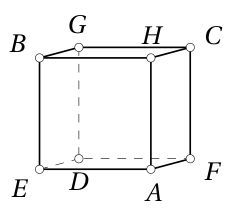

• No pirmās un trešās skaldnes izriet šķautne ar galapunktiem B un E, bet no pirmās un piektās skaldnes – šķautne ar galapunktiem B un H. Tātad pirmās skaldnes virsotņu secība pa šķautnēm ir A, E, B, H.

• Tā kā ir šķautne ar galapunktiem B un E, tad šīs šķautnes pretējā šķautne trešajā skaldnē ir ar galapunktiem D un G. Pēc piektās skaldnes burtiem jābūt savienotiem B un G. Tātad trešās skaldnes virsotņu secība pa šķautnēm ir B, E, D, G.

• Tā kā ir šķautne ar galapunktiem A un H, tad šīs šķautnes pretējā šķautne ceturtajā skaldnē ir ar galapunktiem C un F. Pēc piektās skaldnes burtiem jābūt savienotiem C un H. Tātad ceturtās skaldnes virsotņu secība pa šķautnēm ir A, H, C, F.

No iepriekšējā izriet, ka piektajā skaldnē virsotņu secība pa šķautnēm ir B, H, C, G un otrajā skaldnē G, D, F, C (4. zīmējums). Paliek skaldne ar virsotnēm A, E, D, F.

# <lo-sample/> EE.PK.2017TEST.8.1

Cik ir tādu četrciparu pāra skaitļu, kas sastāv no dažādiem cipariem 2, 0, 1 un 7 un nedalās ar skaitli 4?

<small>

* answer:6
* questionType:ShortAnswer

</small>

## Atrisinājums

Pāra skaitļa beigās var būt 0 vai 2. Ja skaitļa beigās ir 0, desmitu ciparam jābūt 1 vai 7, lai skaitlis nedalītos ar 4 (2 iespējas). Divi pirmie cipari var būt jebkurā secībā (2 iespējas). Tātad ar 0 beigušos skaitļu ar prasīto īpašību ir $2 \cdot 2$ jeb 4. Ja skaitļa beigās ir 2, desmitu ciparam jābūt 0, lai skaitlis nedalītos ar 4 (1 iespēja). Divi pirmie cipari var būt jebkurā secībā (2 iespējas). Tātad ar 2 beigušos skaitļu ar prasīto īpašību ir $1 \cdot 2$ jeb 2. Kopā prasīto skaitļu ir $4 + 2$ jeb 6.

# <lo-sample/> EE.PK.2017TEST.8.2

Atrodi izteiksmes $2017-(2016-(2015-(2014-(2013-2017))))$ vērtību.

<small>

* answer:$-2$
* questionType:ShortAnswer

</small>

## Atrisinājums

Iegūstam
$$
\begin{aligned}
2017-(2016-(2015-(2014-(2013-2017)))) & = \\
& = 2017-(2016-(2015-(2014-(-4)))) = \\
& = 2017-(2016-(2015-2018)) = \\
& = 2017-(2016-(-3)) = \\
& = 2017-2019 = \\
& = -2.
\end{aligned}
$$

# <lo-sample/> EE.PK.2017TEST.8.3

Atrodi sešciparu naturālu skaitli, kura visi cipari ir dažādi, ja zināms, ka, samazinot trīs šī skaitļa ciparus par 1 un palielinot pārējos trīs ciparus par 1, var iegūt skaitli 742809.

<small>

* answer:653718
* questionType:ShortAnswer

</small>

## Atrisinājums

Ciparu 0 var iegūt tikai samazinot ciparu 1. Tātad ciparu 2 nevar iegūt palielinot ciparu 1, bet tikai samazinot ciparu 3. Līdzīgi ciparu 4 nevar iegūt palielinot ciparu 3, bet tikai samazinot ciparu 5. Līdz ar to cipariem 7, 8 un 9 jābūt iegūtiem, palielinot attiecīgi ciparus 6, 7 un 8.

# <lo-sample/> EE.PK.2017TEST.8.4

No kartona izgriezts zināms skaits trijstūru un kvadrātu. Kvadrātu ir par 8 vairāk nekā trijstūru, un visām šīm figūrām kopā ir 88 stūri. Cik figūru izgrieztas no kartona?

<small>

* answer:24
* questionType:ShortAnswer

</small>

## Atrisinājums

*1. atrisinājums.* Pieņemsim, ka trijstūru skaits ir $x$, tad kvadrātu ir $x+8$. Trijstūriem kopā ir $3x$ virsotnes, bet kvadrātiem $4(x+8)$ jeb $4x+32$ virsotnes. Tātad $3x+4x+32=88$, no kurienes $x=8$. Līdz ar to trijstūru ir 8 un kvadrātu 16, kopā 24 figūras.

*2. atrisinājums.* Pieņemsim, ka trijstūru skaits ir $x$ un kvadrātu skaits ir $y$. No uzdevuma nosacījumiem iegūstam vienādojumu sistēmu
$$
\begin{cases}
y-x=8,\\
4y+3x=88.
\end{cases}
$$
Reizinot otrā vienādojuma abas puses ar 2 un atņemot pirmo vienādojumu, iegūstam $7y+7x=168$, no kurienes $7(x+y)=168$ un $x+y=24$.

# <lo-sample/> EE.PK.2017TEST.8.5

Atrodi mazāko naturālo skaitli $n$, kuram skaitlis $n^2$ dalās ar skaitli 5 un skaitlis $(n+2)^2$ dalās ar skaitli 8.

<small>

* answer:10
* questionType:ShortAnswer

</small>

## Atrisinājums

Skaitļa kvadrāts dalās ar pirmskaitli 5 tieši tad, ja pats skaitlis dalās ar skaitli 5. Tātad jāatrod mazākais ar 5 dalāmais naturālais skaitlis $n$, kuram $(n+2)^2$ dalās ar 8. Gadījumos $n=0$ un $n=5$ iegūstam attiecīgi $(n+2)^2=4$ un $(n+2)^2=49$, kas ar 8 nedalās. Bet gadījumā $n=10$ ir $(n+2)^2=144=8 \cdot 18$.

# <lo-sample/> EE.PK.2017TEST.8.6

No taisnleņķa trijstūra $ABC$ taisnā leņķa virsotnes $C$ novilkts augstums $CD$, kas krustojas ar no virsotnes $B$ novilkto bisektrisi punktā $L$. Leņķa $BLC$ lielums ir $110^\circ$. Atrodi leņķa $ACD$ lielumu.

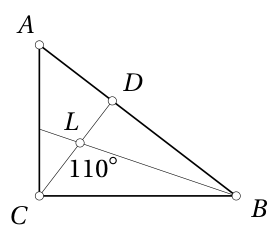

<small>

* answer:$40^\circ$
* questionType:ShortAnswer

</small>

## Atrisinājums

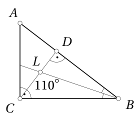

Tā kā $\angle BLD = 180^\circ - 110^\circ = 70^\circ$, tad no trijstūra $DBL$ iegūstam vienādību $\angle DBL = 180^\circ - 90^\circ - 70^\circ = 20^\circ$ (5. zīmējums). Tātad $\angle CBA = 2 \cdot 20^\circ = 40^\circ$. Tā kā trijstūri $ACD$ un $ABC$ ir līdzīgi pēc pazīmes LL, tad arī $\angle ACD = 40^\circ$.

# <lo-sample/> EE.PK.2017TEST.8.7

Zīmējumā ir trīs kvadrāti, no tiem lielākā malas garums ir 3 cm un katra no mazākajiem malas garums ir 1 cm. Punkti $A$, $B$ un $C$ ir šo kvadrātu virsotnes. Atrodi trijstūra $ABC$ laukumu.

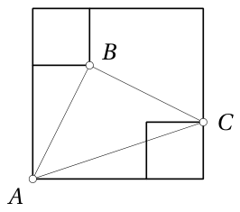

<small>

* answer:$2{,}5\ \mathrm{cm}^2$
* questionType:ShortAnswer

</small>

## Atrisinājums

Apzīmējam punktus $D$, $E$, $K$, $L$, $M$, kā parādīts 6. zīmējumā.

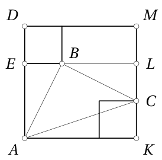

Apzīmēsim ar $S_{\mathcal{K}}$ figūras $\mathcal{K}$ laukumu. Iegūstam
$$
S_{AKMD}=3\ \mathrm{cm}\cdot 3\ \mathrm{cm}=9\ \mathrm{cm}^2,
$$
$$
S_{ELMD}=1\ \mathrm{cm}\cdot 3\ \mathrm{cm}=3\ \mathrm{cm}^2,
$$
$$
S_{ABE}=\frac{2\ \mathrm{cm}\cdot 1\ \mathrm{cm}}{2}=1\ \mathrm{cm}^2,
$$
$$
S_{AKC}=\frac{1\ \mathrm{cm}\cdot 3\ \mathrm{cm}}{2}=1{,}5\ \mathrm{cm}^2,
$$
$$
S_{BLC}=\frac{2\ \mathrm{cm}\cdot 1\ \mathrm{cm}}{2}=1\ \mathrm{cm}^2.
$$
Tātad
$$
S_{ABC}=S_{AKMD}-(S_{ELMD}+S_{ABE}+S_{AKC}+S_{BLC})=2{,}5\ \mathrm{cm}^2.
$$

# <lo-sample/> EE.PK.2017TEST.8.8

Uz nogriežņa atzīmēti trīs punkti $A$, $B$ un $C$ tā, ka $|AB|=|BC|=1$ cm. Nogriezni pagriež vispirms ap punktu $B$ un tad ap punktu $C$, katru reizi pulksteņa rādītāju kustības virzienā tieši par taisnu leņķi. Cik garu ceļu šo pagriešanu laikā veic punkts $A$?

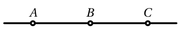

<small>

* answer:$1{,}5\pi\ \mathrm{cm}$
* questionType:ShortAnswer

</small>

## Atrisinājums

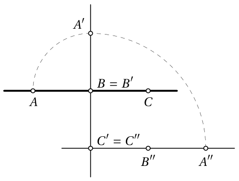

Pirmās pagriešanas laikā ap punktu $B$ punkts $A$ veic ceturtdaļu no riņķa līnijas, kuras rādiuss ir 1 cm. Veiktā ceļa garums ir $\frac{1}{4}\cdot 2\pi \cdot 1\ \mathrm{cm}$ jeb $\frac{1}{2}\pi\ \mathrm{cm}$. Otrās pagriešanas laikā ap punktu $C$ punkts $A$ veic ceturtdaļu no riņķa līnijas, kuras rādiuss ir 2 cm. Veiktā ceļa garums tagad ir $\frac{1}{4}\cdot 2\pi \cdot 2\ \mathrm{cm}$ jeb $\pi\ \mathrm{cm}$. Tātad punkts $A$ kopā veic ceļu $\frac{3}{2}\pi\ \mathrm{cm}$ garumā. 7. zīmējumā punktu $A$, $B$, $C$ atrašanās vietas pēc pirmās pagriešanas apzīmētas attiecīgi ar $A'$, $B'$, $C'$ un pēc otrās pagriešanas attiecīgi ar $A''$, $B''$, $C''$.

# <lo-sample/> EE.PK.2017TEST.8.9

Četrstūra $ABCD$ malu garumi ir $|AB|=8$ cm, $|BC|=6$ cm, $|CD|=4$ cm un $|DA|=16$ cm. Atrodi diagonāles $AC$ garumu, ja zināms, ka tas ir vesels centimetru skaits.

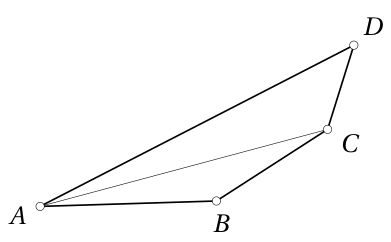

<small>

* answer:$13\ \mathrm{cm}$
* questionType:ShortAnswer

</small>

## Atrisinājums

Trijstūrī $ABC$ malas $AB$ un $BC$ ir attiecīgi 8 cm un 6 cm garas, tāpēc malas $AC$ garumam jābūt mazākam par 14 cm. No otras puses, trijstūrī $ADC$ malas $AD$ un $DC$ ir attiecīgi 16 cm un 4 cm garas, tāpēc malas $AC$ garumam jābūt lielākam par 12 cm. Vienīgais veselais skaitlis starp 12 un 14 ir 13.

# <lo-sample/> EE.PK.2017TEST.8.10

Katrā kubiņa virsotnē ieraksta vienu no cipariem no 1 līdz 8. Katrā virsotnē ieraksta citu ciparu. Piecu skaldņu virsotnēs esošie cipari pēc lieluma ir šādi:

1, 2, 4, 5;

3, 6, 7, 8;

2, 5, 7, 8;

1, 3, 4, 6;

2, 3, 4, 7.

Kurš cipars ir virsotnē, kas atrodas vistālāk no virsotnes ar ciparu 8?

<small>

* answer:4
* questionType:ShortAnswer

</small>

## Atrisinājums

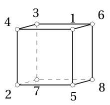

*1. atrisinājums.* Katra virsotne pieder trim skaldnēm. Piecu skaldņu virsotņu sarakstos cipari 1, 5, 6, 8 sastopami divas reizes, bet pārējie cipari trīs reizes. Tātad trūkstošās skaldnes virsotnēs ir cipari 1, 5, 6, 8. Divas kuba virsotnes ir kuba diagonāles galapunkti tieši tad, ja tās neatrodas uz vienas un tās pašas skaldnes. No skaldnēs esošo ciparu sarakstiem redzam, ka 8 neatrodas uz vienas skaldnes ar ciparu 4.

*2. atrisinājums.* Divām skaldnēm var būt divas kopīgas virsotnes vai neviena. Kopīgās virsotnes ir kuba šķautnes galapunkti.

* No pirmās un trešās skaldnes izriet šķautne ar galapunktiem 2 un 5, bet no pirmās un piektās skaldnes – šķautne ar galapunktiem 2 un 4. Tātad pirmās skaldnes virsotņu secība pa šķautnēm ir 1, 4, 2, 5.
* Tā kā ir šķautne ar galapunktiem 2 un 5, tad šīs šķautnes pretējā šķautne trešajā skaldnē ir ar galapunktiem 7 un 8. Pēc piektās skaldnes cipariem jābūt savienotiem 2 un 7. Tātad trešās skaldnes virsotņu secība pa šķautnēm ir 2, 5, 8, 7.
* Tā kā ir šķautne ar galapunktiem 1 un 4, tad šīs šķautnes pretējā šķautne ceturtajā skaldnē ir ar galapunktiem 3 un 6. Pēc piektās skaldnes cipariem jābūt savienotiem 4 un 3. Tātad ceturtās skaldnes virsotņu secība pa šķautnēm ir 1, 4, 3, 6.

No iepriekšējā izriet, ka piektajā skaldnē virsotņu secība pa šķautnēm ir 2, 7, 3, 4, otrajā skaldnē 3, 6, 7, 8 (8. zīmējums). Paliek skaldne ar virsotnēm 1, 5, 8, 6. Kuba diagonāle, kas sākas virsotnē ar ciparu 8, beidzas virsotnē ar ciparu 4.

# <lo-sample/> EE.PK.2017TEST.9.1

Atrodi mazāko naturālo skaitli, kas lielāks par skaitli $2017$ un dalās ar skaitli $201$.

<small>

* answer:2211
* questionType:ShortAnswer

</small>

## Atrisinājums

Skaitlis $2010$ dalās ar skaitli $201$. Pēc lieluma nākamais skaitlis, kas dalās ar skaitli $201$, ir $2010 + 201$ jeb $2211$. Tā kā $2010 < 2017$ un $2211 > 2017$, tad $2211$ ir mazākais skaitlis, kas lielāks par $2017$ un dalās ar skaitli $201$.

# <lo-sample/> EE.PK.2017TEST.9.2

Atrodi izteiksmes $2017^2 + 2018^2 - 2017 \cdot 2018 - 2017 \cdot 2019$ vērtību.

<small>

* answer:-2016
* questionType:ShortAnswer

</small>

## Atrisinājums

Izmantojot divu skaitļu starpības kvadrāta formulu, iegūstam

$$
\begin{aligned}
2017^2 + 2018^2 - 2017 \cdot 2018 - 2017 \cdot 2019
&= 2017^2 + 2018^2 - 2 \cdot 2017 \cdot 2018 + 2017 \cdot 2018 - 2017 \cdot 2019 \\
&= (2017 - 2018)^2 + 2017 \cdot (2018 - 2019) \\
&= 1 - 2017 \\
&= -2016.
\end{aligned}
$$

# <lo-sample/> EE.PK.2017TEST.9.3

Automašīna brauc ar vienmērīgu ātrumu $100\ \mathrm{km/h}$. Ar kādu ātrumu šai automašīnai būtu jābrauc, lai katrā minūtē veiktu par $100$ metriem vairāk?

<small>

* answer:106 km/h
* questionType:ShortAnswer

</small>

## Atrisinājums

Par $100$ metriem vairāk katrā minūtē stundā kopā dod $60 \cdot 100$ metrus jeb $6$ kilometrus. Automašīnai būtu jābrauc ar ātrumu $100 + 6$ jeb $106$ kilometri stundā.

# <lo-sample/> EE.PK.2017TEST.9.4

Pozitīviem skaitļiem $a$, $b$ un $c$ ir spēkā vienādības $ab = 3$, $ac = 6$ un $bc = 8$. Atrodi summu $a + b + c$.

<small>

* answer:7,5
* questionType:ShortAnswer

</small>

## Atrisinājums

No dotā iegūstam $c^2 = \dfrac{ac \cdot bc}{ab} = \dfrac{6 \cdot 8}{3} = 16$. Tātad $c = 4$. Tagad $a = \dfrac{6}{c} = 1,5$ un $b = \dfrac{8}{c} = 2$. Līdz ar to $a + b + c = 7,5$.

# <lo-sample/> EE.PK.2017TEST.9.5

Atrodi mazāko naturālo skaitli $n$, kuram skaitlis $n^2$ dalās ar skaitli $5$ un skaitlis $(n + 2)^2$ dalās ar skaitli $9$.

<small>

* answer:10
* questionType:ShortAnswer

</small>

## Atrisinājums

Skaitļa kvadrāts dalās ar pirmskaitli $5$ tieši tad, ja pats skaitlis dalās ar skaitli $5$. Tātad jāatrod mazākais ar $5$ dalāmais naturālais skaitlis $n$, kuram $(n + 2)^2$ dalās ar $9$. Gadījumos $n = 0$ un $n = 5$ iegūstam attiecīgi $(n + 2)^2 = 4$ un $(n + 2)^2 = 49$, kas ar $9$ nedalās. Bet gadījumā $n = 10$ ir $(n + 2)^2 = 144 = 9 \cdot 16$.

# <lo-sample/> EE.PK.2017TEST.9.6

No šaurleņķa trijstūra $ABC$ virsotnes $C$ novelk bisektrisi $CD$. Viens no trijstūra $ACD$ iekšējiem leņķiem ir $60^\circ$ liels, un viens no trijstūra $BCD$ iekšējiem leņķiem ir $100^\circ$ liels. Atrodi leņķa $ACB$ lielumu.

<small>

* answer:80°
* questionType:ShortAnswer

</small>

## Atrisinājums

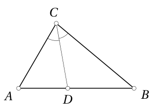

Trijstūra $BCD$ leņķis, kura lielums ir $100^\circ$, nevar būt pie virsotnes $B$, jo saskaņā ar pieņēmumu trijstūris $ABC$ ir šaurleņķa, nedz arī pie virsotnes $C$, jo puse no trijstūra leņķa nevar būt plats leņķis (9. zīmējums). No tā izriet, ka $\angle BDC = 100^\circ$, no kurienes iegūstam $\angle ADC = 80^\circ$. Tātad trijstūra $ACD$ leņķis, kura lielums ir $60^\circ$, nevar būt pie virsotnes $D$, un tas nevar būt arī pie virsotnes $C$, jo puse no šaura leņķa ir mazāka par $45^\circ$. Tātad $\angle DAC = 60^\circ$. Trijstūrī $ACD$ tagad iegūstam $\angle ACD = 180^\circ - 80^\circ - 60^\circ = 40^\circ$, no kurienes $\angle ACB = 2 \cdot 40^\circ = 80^\circ$.

# <lo-sample/> EE.PK.2017TEST.9.7

Diviem kvadrātiem ar malu garumiem $3\ \mathrm{cm}$ un $1\ \mathrm{cm}$ ir kopīga virsotne $B$. Mazākā kvadrāta tieši viena mala atrodas uz lielākā kvadrāta malas. Punkts $A$ ir virsotnei $B$ pretējā virsotne lielajā kvadrātā, bet punkts $C$ – virsotnei $B$ pretējā virsotne mazajā kvadrātā. Atrodi trijstūra $ABC$ laukumu.

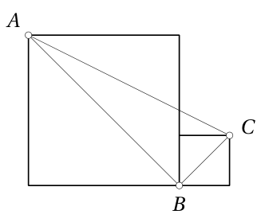

<small>

* answer:3 cm²
* questionType:ShortAnswer

</small>

## Atrisinājums

*1. atrisinājums.* Tā kā lielā kvadrāta laukums $9\ \mathrm{cm}^2$ pēc romba laukuma formulas izsakāms formā $\dfrac{1}{2}|AB|^2$ un mazā kvadrāta laukums līdzīgi formā $\dfrac{1}{2}|BC|^2$, tad $|AB| = \sqrt{18}\ \mathrm{cm}$ un $|BC| = \sqrt{2}\ \mathrm{cm}$. Nogriežņi $AB$ un $BC$ ir savstarpēji perpendikulāri, jo $\angle ABC = 45^\circ + 45^\circ = 90^\circ$ (10. zīmējums). Tātad trijstūra $ABC$ laukums ir $\dfrac{|AB| \cdot |BC|}{2}$ jeb $3\ \mathrm{cm}^2$.

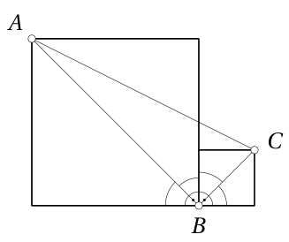

*2. atrisinājums.* Pieņemsim, ka $K$ un $L$ ir attiecīgi lielā kvadrāta un mazā kvadrāta virsotnes, starp kurām atrodas punkts $B$ (11. zīmējums). Pieņemsim, ka punkts $M$ ir tāds, ka $AKLM$ ir taisnstūris. Apzīmēsim ar $S_{\mathcal K}$ figūras $\mathcal K$ laukumu. Iegūstam

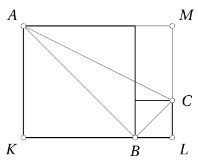

$$
S_{AKB} = \frac{3\ \mathrm{cm} \cdot 3\ \mathrm{cm}}{2} = 4,5\ \mathrm{cm}^2,
$$

$$
S_{BLC} = \frac{1\ \mathrm{cm} \cdot 1\ \mathrm{cm}}{2} = 0,5\ \mathrm{cm}^2,
$$

$$
S_{CMA} = \frac{2\ \mathrm{cm} \cdot 4\ \mathrm{cm}}{2} = 4\ \mathrm{cm}^2.
$$

Turklāt $S_{AKLM} = 3\ \mathrm{cm} \cdot 4\ \mathrm{cm} = 12\ \mathrm{cm}^2$. Tātad

$$
S_{ABC} = S_{AKLM} - (S_{AKB} + S_{BLC} + S_{CMA}) = 3\ \mathrm{cm}^2.
$$

# <lo-sample/> EE.PK.2017TEST.9.8

Taisnstūra $ABCD$ malu garumi ir $|AB| = |CD| = 2\ \mathrm{cm}$ un $|BC| = |DA| = 1\ \mathrm{cm}$. Taisnstūri pagriež vispirms ap punktu $A$, tad ap punktu $B$ un visbeidzot ap punktu $C$, katru reizi pulksteņa rādītāju kustības virzienā tieši par taisnu leņķi. Atrodi attālumu starp punkta $D$ sākotnējo un pēc pagriešanām iegūto atrašanās vietu.

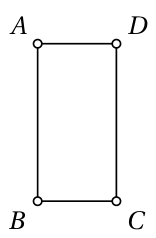

<small>

* answer:6 cm
* questionType:ShortAnswer

</small>

## Atrisinājums

Pirmajā pagriešanā punkts $A$ paliek uz vietas, bet punkts $B$ nonāk uz taisnes, uz kuras sākotnēji atrodas punkti $A$ un $D$. Otrajā pagriešanā punkts $B$ paliek uz vietas, bet punkts $C$ nonāk uz iepriekš minētās taisnes. Trešajā pagriešanā punkts $C$ paliek uz vietas, un punkts $D$ nonāk uz tās pašas taisnes. Kopumā attālums starp $D$ sākotnējo un pēc pagriešanām iegūto atrašanās vietu ir vienāds ar taisnstūra perimetru $2 \cdot (1 + 2)$ jeb $6$ centimetri. 12. zīmējumā punktu $A$, $B$, $C$, $D$ atrašanās vietas pēc pirmās pagriešanas apzīmētas attiecīgi ar $A'$, $B'$, $C'$, $D'$, pēc otrās pagriešanas attiecīgi ar $A''$, $B''$, $C''$, $D''$ un pēc trešās pagriešanas attiecīgi ar $A'''$, $B'''$, $C'''$, $D'''$.

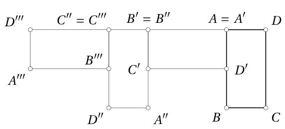

# <lo-sample/> EE.PK.2017TEST.9.9

Cik ir tādu vienādsānu trijstūru, kuru katras malas garums ir vesels centimetru skaits, pamats ir garāks par sānu malu un kuros ir mala ar garumu $5\ \mathrm{cm}$?

<small>

* answer:6
* questionType:ShortAnswer

</small>

## Atrisinājums

Ja pamata garums ir $5\ \mathrm{cm}$, tad par to īsākās sānu malas garums var būt $4\ \mathrm{cm}$ vai $3\ \mathrm{cm}$, jo divu vēl īsāku sānu malu garumu summa būtu mazāka par $5\ \mathrm{cm}$. Ja sānu malas garums ir $5\ \mathrm{cm}$, tad par to garākā pamata garums var būt $6\ \mathrm{cm}$, $7\ \mathrm{cm}$, $8\ \mathrm{cm}$ vai $9\ \mathrm{cm}$, jo tālāk pamata garums pārsniegtu abu sānu malu garumu summu. Kopā meklējamo trijstūru ir $6$.

# <lo-sample/> EE.PK.2017TEST.9.10

Katrā kubiņa virsotnē ieraksta vienu no cipariem no $1$ līdz $8$. Katrā virsotnē ieraksta citu ciparu. Piecu skaldņu virsotnēs esošie cipari pēc lieluma ir šādi:

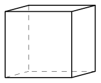

$1$, $2$, $5$, $8$;

$3$, $4$, $6$, $7$;

$2$, $4$, $5$, $7$;

$1$, $3$, $6$, $8$;

$2$, $3$, $7$, $8$.

Atrodi lielāko skaitli, ko var iegūt, sareizinot skaitļus, kas atrodas kādas kubiņa diagonāles galapunktos.

<small>

* answer:32
* questionType:ShortAnswer

</small>

## Atrisinājums

*1. atrisinājums.* Katra virsotne pieder trim skaldnēm. Piecu skaldņu virsotņu sarakstos cipari $1$, $4$, $5$, $6$ sastopami divas reizes, bet pārējie cipari trīs reizes. Tātad trūkstošās skaldnes virsotnēs ir cipari $1$, $4$, $5$, $6$. Divas kuba virsotnes ir kuba diagonāles galapunkti tieši tad, ja tās neatrodas uz vienas un tās pašas skaldnes. No skaldnēs esošo ciparu sarakstiem redzam, ka cipars $4$ neatrodas uz vienas skaldnes ar ciparu $8$, kas dod reizinājumu $32$. Lai starp pārējiem atrastu divus ciparus ar lielāku reizinājumu, vienam no reizinātājiem vajadzētu būt $7$, jo $6 \cdot 5 = 30 < 32$. Otram reizinātājam vajadzētu būt $6$ vai $5$, taču $7$ atrodas uz vienas skaldnes gan ar $6$, gan ar $5$.

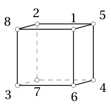

*2. atrisinājums.* Divām skaldnēm var būt divas kopīgas virsotnes vai neviena. Kopīgās virsotnes ir kuba šķautnes galapunkti.

- No pirmās un trešās skaldnes izriet šķautne ar galapunktiem $2$ un $5$, bet no pirmās un piektās skaldnes – šķautne ar galapunktiem $2$ un $8$. Tātad pirmās skaldnes virsotņu secība pa šķautnēm ir $1$, $8$, $2$, $5$.
- Tā kā ir šķautne ar galapunktiem $2$ un $5$, tad šīs šķautnes pretējā šķautne trešajā skaldnē ir ar galapunktiem $4$ un $7$. Pēc piektās skaldnes cipariem jābūt savienotiem $2$ un $7$. Tātad trešās skaldnes virsotņu secība pa šķautnēm ir $2$, $5$, $4$, $7$.
- Tā kā ir šķautne ar galapunktiem $1$ un $8$, tad šīs šķautnes pretējā šķautne ceturtajā skaldnē ir ar galapunktiem $3$ un $6$. Pēc piektās skaldnes cipariem jābūt savienotiem $8$ un $3$. Tātad ceturtās skaldnes virsotņu secība pa šķautnēm ir $1$, $8$, $3$, $6$.

No iepriekšējā izriet, ka piektajā skaldnē virsotņu secība pa šķautnēm ir $2$, $8$, $3$, $7$, otrajā skaldnē $3$, $6$, $4$, $7$ (8. zīmējums). Paliek skaldne ar virsotnēm $1$, $5$, $4$, $6$. Kuba diagonāļu galapunktos ir cipari $1$ un $7$, cipari $2$ un $6$, cipari $3$ un $5$, kā arī cipari $4$ un $8$. Lielāko reizinājumu $32$ dod $4$ un $8$.
