# <lo-sample/> EE.PK.2018TEST.7.1

Aprēķini:

$$2{,}018 : 0{,}2 \cdot 10 =$$

<small>

* answer:100,9
* questionType:ShortAnswer

</small>

## Atrisinājums

$2{,}018 : 0{,}2 \cdot 10 = 2{,}018 : \frac{2}{10} \cdot 10 = 2{,}018 \cdot \frac{10}{2} \cdot 10 = (2{,}018 : 2) \cdot 100 = 100{,}9.$

# <lo-sample/> EE.PK.2018TEST.7.2

Kallem un Mallei ir konfekšu kārbas, kurās ir vienāds skaits konfekšu. Ja Kalle iedod no savas kārbas 8 konfektes Mallei, tad Mallei ir divreiz vairāk konfekšu nekā Kallem. Cik konfekšu sākotnēji ir katra bērna kārbā?

<small>

* answer:24
* questionType:ShortAnswer

</small>

## Atrisinājums

Ja Kalle iedod 8 konfektes Mallei, tad Mallei ir par 8 konfektēm vairāk un Kallem par 8 konfektēm mazāk nekā sākumā, t.i., Mallei ir par 16 konfektēm vairāk nekā Kallem. Tā kā Mallei tagad ir divreiz vairāk konfekšu nekā Kallem, tad Kallem ir 16 un Mallei 32 konfektes, t.i., kopā viņiem ir 48 konfektes. Tātad katra kārbā bija 24 konfektes.

# <lo-sample/> EE.PK.2018TEST.7.3

Ja piecciparu skaitlī $\overline{20a18}$ burtu $a$ pēc kārtas aizstāj ar visiem iespējamajiem cipariem, iegūstam desmit dažādus skaitļus. Atrodi mazāko naturālo skaitli, ar kuru nedalās neviens no šiem desmit skaitļiem.

<small>

* answer:4
* questionType:ShortAnswer

</small>

## Atrisinājums

Tā kā visi iegūtie skaitļi ir pāra skaitļi, tie dalās ar skaitļiem 1 un 2. Ar skaitli 3 dalās, piemēram, skaitlis 20118, ko iegūstam pie $a = 1$. Bet ar skaitli 4 nedalās neviens iegūtais skaitlis, jo visos tajos pēdējie divi cipari ir 1 un 8, un skaitlis 18 ar 4 nedalās.

# <lo-sample/> EE.PK.2018TEST.7.4

Skaitļi $x$ un $y$ ir tādi, ka $x(y+1)-y(x+1)=7$. Atrodi starpības $y(x+2)-x(y+2)$ vērtību šādiem $x$ un $y$.

<small>

* answer:-14
* questionType:ShortAnswer

</small>

## Atrisinājums

Vienkāršojot iegūstam $x(y+1)-y(x+1)=xy+x-yx-y=x-y$, t.i., $x-y=7$. Tagad

$$y(x+2)-x(y+2)=yx+2y-xy-2x=-2(x-y)=-14.$$

# <lo-sample/> EE.PK.2018TEST.7.5

Roberta uzbūvētais robots vienā sekundē veic 5 centimetrus. Cik metru šis robots veiktu vienā stundā?

<small>

* answer:180
* questionType:ShortAnswer

</small>

## Atrisinājums

Tā kā vienā stundā ir 60 minūtes un katrā minūtē 60 sekundes, tad stundā ir $60 \cdot 60 = 3600$ sekundes. Tātad robots vienā stundā veiktu $3600 \cdot 5 = 18000$ centimetrus jeb $\frac{18000}{100} = 180$ metrus.

# <lo-sample/> EE.PK.2018TEST.7.6

Atrodi leņķa $z$ lielumu, ja zīmējumā attēlotais četrstūris ir kvadrāts un leņķa $x$ lielums ir $23^\circ$, bet leņķa $y$ lielums ir $32^\circ$.

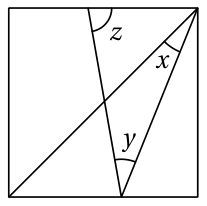

<small>

* answer:$80^\circ$
* questionType:ShortAnswer

</small>

## Atrisinājums

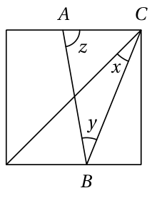

Tā kā leņķis starp kvadrāta malu un diagonāli ir $45^\circ$, tad trijstūrī $ABC$ (sk. 1. zīmējumu) iegūstam $(\angle x + 45^\circ) + \angle y + \angle z = 180^\circ$. Tātad

$$\angle z = 180^\circ - 45^\circ - \angle x - \angle y = 180^\circ - 45^\circ - 23^\circ - 32^\circ = 80^\circ.$$

# <lo-sample/> EE.PK.2018TEST.7.7

Zīmējumā ir viens riņķis ar rādiusu 7, viens riņķis ar rādiusu 3 un seši riņķi ar rādiusu 1. Lielā riņķa iekšpusē pelēki iekrāsotās daļas laukums kopā ir $k \cdot \pi$ laukuma vienības. Atrodi skaitli $k$.

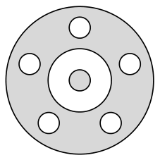

<small>

* answer:36
* questionType:ShortAnswer

</small>

## Atrisinājums

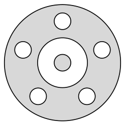

Pelēki iekrāsotā daļa sastāv no diviem atsevišķiem gabaliem (sk. 2. zīmējumu): ārējā gabala laukums ir $\pi \cdot 7^2 - \pi \cdot 3^2 - 5 \cdot \pi \cdot 1^2 = (49 - 9 - 5) \cdot \pi = 35 \cdot \pi$, un iekšējā gabala laukums ir $\pi \cdot 1^2 = 1 \cdot \pi$. Tātad pelēki iekrāsotās daļas kopējais laukums ir $(35 + 1) \cdot \pi$ jeb $36 \cdot \pi$.

# <lo-sample/> EE.PK.2018TEST.7.8

Regulāru 12-stūri ar vienu taisnu griezienu sagriež divās vienādās figūrās (figūras uzskatām par vienādām, ja tās var precīzi uzlikt vienu uz otras, izmantojot pārbīdi, pagriešanu un apgriešanu otrādi). Katru iegūto gabalu vēlreiz ar vienu taisnu griezienu sagriež divās vienādās figūrās. Šādu griešanu divās vienādās figūrās turpina ar katru jauno gabalu tik ilgi, kamēr tas ir iespējams. Atrodi lielāko gabalu skaitu, ko šādi var iegūt.

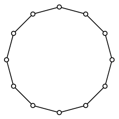

<small>

* answer:8
* questionType:ShortAnswer

</small>

## Atrisinājums

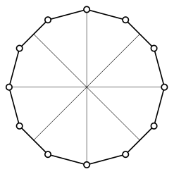

Tā kā vienādām figūrām cita starpā ir vienādi laukumi, pirmajam griezienam jāiet caur 12-stūra centru. Vienīgā iespēja otrajā solī sagriezt abus gabalus divās vienādās daļās ir izdarīt pirmajam griezienam perpendikulāru griezienu caur 12-stūra centru. Ja pirmais griezums tika izdarīts pa taisni, kas iet caur 12-stūra pretējām virsotnēm vai pretējo malu viduspunktiem, tad trešajā solī varam esošos 4 gabalus vēlreiz sadalīt divās vienādās figūrās, pievienojot divus griezumus caur 12-stūra centru, kas dala uz pusēm tur ar iepriekšējiem griezumiem izveidojušos 4 leņķus (sk. 3. zīmējumu). Šādi iegūtos 8 gabalus vairs nav iespējams ar taisnu griezumu sadalīt divās vienādās figūrās.

# <lo-sample/> EE.PK.2018TEST.7.9

Uz nogriežņa $AB$, kura garums ir 100 cm, atrodas punkts $C$. Vabole skrien pa šo nogriezni no viena punkta uz otru pēc shēmas $A \to B \to A \to C \to A$ un kopā veic 250 cm. Cik garš būtu vaboles skrējiens, ja tā skrietu pēc shēmas $B \to A \to B \to C \to B$?

<small>

* answer:350 cm
* questionType:ShortAnswer

</small>

## Atrisinājums

Skrienot pēc shēmas $A \to B \to A \to C \to A$, vabole divreiz veic nogriezni $AB$ un divreiz nogriezni $AC$. Tā kā vaboles skrējiena kopgarums ir 250 cm un $|AB| = 100$ cm, tad $2|AC| = 250$ cm $- 2 \cdot 100$ cm $= 50$ cm jeb $|AC| = 25$ cm.

Skrienot pēc shēmas $B \to A \to B \to C \to B$, vabole divreiz veiktu nogriezni $AB$ un divreiz nogriezni $BC$. Tā kā $|AB| = 100$ cm un $|BC| = |AB|-|AC| = 75$ cm, tad vaboles skrējiena garums šajā gadījumā būtu $2 \cdot 100$ cm $+ 2 \cdot 75$ cm $= 350$ cm.

# <lo-sample/> EE.PK.2018TEST.7.10

Taisnstūra paralēlskaldņa vienu sānu skaldni var sadalīt divos taisnstūros ar izmēriem $2 \times 4$ vienības, bet otru sānu skaldni – trīs $2 \times 4$ taisnstūros. Atrodi mazāko iespējamo $2 \times 4$ taisnstūru skaitu, kuros var sadalīt šī paralēlskaldņa pamata skaldni.

<small>

* answer:3
* questionType:ShortAnswer

</small>

## Atrisinājums

Tās sānu skaldnes izmēri, ko var sadalīt divos $2 \times 4$ taisnstūros, var būt vai nu $4 \times 4$, vai $2 \times 8$ vienības. Otras sānu skaldnes izmēri, ko var sadalīt trīs $2 \times 4$ taisnstūros, var būt vai nu $4 \times 6$, vai $2 \times 12$ vienības. Tā kā šīm sānu skaldnēm ir kopīga šķautne (kas ir paralēlskaldņa augstums), tad sānu skaldņu izmēri var būt vai nu $4 \times 4$ un $4 \times 6$ vienības, vai $2 \times 8$ un $2 \times 12$ vienības. Pirmajā gadījumā pamata skaldnes izmēri ir $4 \times 6$ vienības, un to var sadalīt 3 taisnstūros ar izmēriem $2 \times 4$; otrajā gadījumā pamata skaldnes izmēri ir $8 \times 12$ vienības, un to var sadalīt 12 taisnstūros ar izmēriem $2 \times 4$.

# <lo-sample/> EE.PK.2018TEST.8.1

Aprēķini:

$$
3\cdot\left(\frac{1}{3}+3\cdot\left(\frac{1}{3}+3\cdot\left(\frac{1}{3}+3\right)\right)\right)=
$$

<small>

* answer:94
* questionType:ShortAnswer

</small>

## Atrisinājums

$$
3\cdot\left(\frac{1}{3}+3\cdot\left(\frac{1}{3}+3\cdot\left(\frac{1}{3}+3\right)\right)\right)=3\cdot\left(\frac{1}{3}+3\cdot\left(\frac{1}{3}+3\cdot\frac{10}{3}\right)\right)=3\cdot\left(\frac{1}{3}+3\cdot\frac{31}{3}\right)=3\cdot\frac{94}{3}=94.
$$

# <lo-sample/> EE.PK.2018TEST.8.2

Konfekšu kārbā ir vairāk nekā 5 un mazāk nekā 25 konfektes. Ja visas konfektes sadala vai nu pa 4, vai pa 6, abos gadījumos pāri paliek 3 konfektes. Cik konfekšu ir šajā kārbā?

<small>

* answer:15
* questionType:ShortAnswer

</small>

## Atrisinājums

Ja no kārbas izņem 3 konfektes, tad atlikušo konfekšu skaits dalās gan ar 4, gan ar 6. Tā kā kārbā sākotnēji bija vairāk nekā 5 un mazāk nekā 25 konfektes, tad atlikušo konfekšu skaitam jābūt lielākam par 2 un mazākam par 22. Vienīgais skaitlis šajā intervālā, kas dalās gan ar 4, gan ar 6, ir 12. Tātad kārbā ir 12 + 3 jeb 15 konfektes.

# <lo-sample/> EE.PK.2018TEST.8.3

Aprēķini:

$$
\frac{2017\cdot 0{,}2018}{2{,}017\cdot 20{,}18}=
$$

<small>

* answer:10
* questionType:ShortAnswer

</small>

## Atrisinājums

$$
\frac{2017\cdot 0{,}2018}{2{,}017\cdot 20{,}18}=\frac{2{,}017\cdot 0{,}2018\cdot 1000}{2{,}017\cdot 0{,}2018\cdot 100}=\frac{1000}{100}=10.
$$

# <lo-sample/> EE.PK.2018TEST.8.4

Atrodi piecciparu skaitļa $\overline{2018a}$ pēdējā cipara $a$ visas iespējamās vērtības, pie kurām šis skaitlis dalās ar skaitli 6.

<small>

* answer:4
* questionType:ShortAnswer

</small>

## Atrisinājums

Skaitlis $\overline{2018a}$ dalās ar 6, ja tas dalās ar 2 un ar 3, t.i., ir pāra skaitlis un tā ciparu summa dalās ar 3. Tā kā skaitļa 2018 ciparu summa 11, dalot ar 3, dod atlikumu 2, tad meklējamajam ciparam $a$ jābūt pāra un, dalot ar 3, jādod atlikums 1. Vienīgais šāds cipars ir 4.

# <lo-sample/> EE.PK.2018TEST.8.5

Skaitļi $x$ un $y$ ir tādi, ka $x-y=4$ un $x\cdot y=3$. Atrodi reizinājuma $(x+1)(y-1)$ vērtību šādiem $x$ un $y$.

<small>

* answer:-2
* questionType:ShortAnswer

</small>

## Atrisinājums

Vienkāršojot iegūstam:

$$
(x+1)(y-1)=xy-x+y-1=xy-(x-y)-1=3-4-1=-2.
$$

# <lo-sample/> EE.PK.2018TEST.8.6

Trijstūra malu garumi ir $a$ cm, $b$ cm un $c$ cm, turklāt $a$, $b$ un $c$ ir naturāli skaitļi un $a+b+c=25$ un $a\cdot b=24$. Atrodi šī trijstūra garākās malas garumu.

<small>

* answer:12 cm
* questionType:ShortAnswer

</small>

## Atrisinājums

Skaitli 24 var izteikt kā divu naturālu skaitļu reizinājumu četros veidos:

$$
24=1\cdot 24=2\cdot 12=3\cdot 8=4\cdot 6.
$$

Tātad, nezaudējot vispārīgumu, varam uzskatīt, ka pāris $(a,b)$ ir $(1,24)$, $(2,12)$, $(3,8)$ vai $(4,6)$. Ja $(a,b)=(1,24)$, tad no vienādības $a+b+c=25$ iegūstam $c=0$, kas neder. Ja $(a,b)=(3,8)$, tad iegūstam $c=14$, kas neder, jo trijstūra jebkuru divu malu garumu summa ir lielāka par trešās malas garumu, bet $3+8<14$. Ja $(a,b)=(4,6)$, tad iegūstam $c=15$, kas arī neder, jo $4+6<15$. Paliek iespēja, ka $(a,b)=(2,12)$, tad $c=11$, un trijstūris ar malu garumiem 2 cm, 12 cm un 11 cm eksistē, un tā garākās malas garums ir 12 cm.

# <lo-sample/> EE.PK.2018TEST.8.7

Atrodi leņķa $x$ lielumu, ja zīmējumā attēlotais četrstūris ir paralelograms.

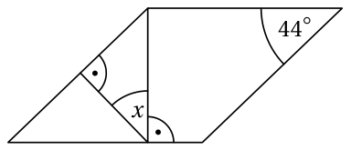

<small>

* answer:44^\circ
* questionType:ShortAnswer

</small>

## Atrisinājums

Tā kā paralelograma pretējie leņķi ir vienāda lieluma, tad taisnleņķa trijstūrī $ABC$ (sk. 4. zīmējumu) iegūstam $(90^\circ-\angle x)+44^\circ=90^\circ$. Tātad $90^\circ-\angle x=90^\circ-44^\circ$ jeb $\angle x=44^\circ$.

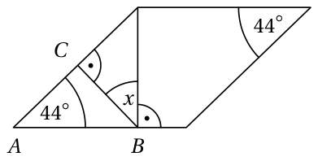

4. zīmējums

# <lo-sample/> EE.PK.2018TEST.8.8

Regulāru astoņstūri ar vienu taisnu griezienu sagriež divās vienādās figūrās (figūras uzskatām par vienādām, ja tās var precīzi uzlikt vienu uz otras, izmantojot pārbīdi, pagriešanu un apgriešanu otrādi). Katru iegūto gabalu vēlreiz ar vienu taisnu griezienu sagriež divās vienādās figūrās. Šādu griešanu divās vienādās figūrās turpina ar katru jauno gabalu tik ilgi, kamēr tas ir iespējams. Atrodi lielāko gabalu skaitu, ko šādi var iegūt.

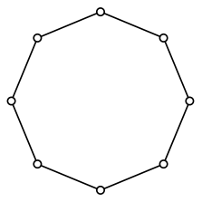

<small>

* answer:16
* questionType:ShortAnswer

</small>

## Atrisinājums

Tā kā vienādām figūrām cita starpā ir vienādi laukumi, pirmajam griezienam jāiet caur astoņstūra centru. Vienīgā iespēja otrajā solī sagriezt abus gabalus divās vienādās daļās ir izdarīt pirmajam griezienam perpendikulāru griezienu caur astoņstūra centru. Trešajā solī atkal ir tikai viena iespēja sagriezt katru no iegūtajiem 4 gabaliem divās vienādās daļās: jāizdara divi griezumi caur astoņstūra centru, kas dala uz pusēm tur ar iepriekšējiem griezumiem izveidojušos 4 leņķus. Ja pirmais griezums tika izdarīts pa taisni, kas iet caur astoņstūra pretējām virsotnēm vai pretējo malu viduspunktiem, tad ceturtajā solī varam esošos 8 gabalus vēlreiz sadalīt divās vienādās figūrās, pievienojot četrus griezumus caur astoņstūra centru, kas dala uz pusēm tur ar iepriekšējiem griezumiem izveidojušos 8 leņķus (sk. 5. zīmējumu). Šādi iegūtos 16 gabalus vairs nav iespējams ar taisnu griezumu sadalīt divās vienādās figūrās.

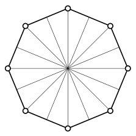

5. zīmējums

# <lo-sample/> EE.PK.2018TEST.8.9

Taisnstūrī ar malu garumiem 10 cm un 20 cm ir divas riņķa līnijas, kas pieskaras viena otrai un taisnstūra malām. Zem taisnstūra diagonāles ar riņķiem nepārklātās taisnstūra daļas iekrāsotas pelēkas. Atrodi pelēki iekrāsoto daļu precīzu kopējo laukumu.

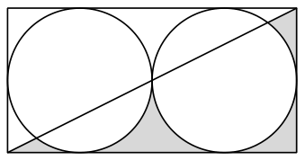

<small>

* answer:(100 - 25\pi) cm^2
* questionType:ShortAnswer

</small>

## Atrisinājums

Simetrijas dēļ pelēki iekrāsoto daļu laukumu summa ir tieši puse no taisnstūra laukuma un abu riņķu kopējā laukuma starpības (sk. 6. zīmējumu):

$$
S=\frac{1}{2}\cdot(S_{\text{taisnstūris}}-2S_{\text{riņķis}})=\frac{1}{2}(10\text{ cm}\cdot 20\text{ cm}-2\cdot\pi\cdot(5\text{ cm})^2)=(100-25\pi)\text{ cm}^2.
$$

6. zīmējums

# <lo-sample/> EE.PK.2018TEST.8.10

Taisnstūra paralēlskaldņa vienu sānu skaldni var sadalīt divos taisnstūros ar izmēriem $2\times 4$ vienības, bet otru sānu skaldni – trīs $2\times 4$ taisnstūros. Atrodi lielāko iespējamo $2\times 4$ taisnstūru skaitu, kuros var sadalīt šī paralēlskaldņa pamata skaldni.

<small>

* answer:12
* questionType:ShortAnswer

</small>

## Atrisinājums

Tās sānu skaldnes izmēri, ko var sadalīt divos $2\times 4$ taisnstūros, var būt vai nu $4\times 4$, vai $2\times 8$ vienības. Otras sānu skaldnes izmēri, ko var sadalīt trīs $2\times 4$ taisnstūros, var būt vai nu $4\times 6$, vai $2\times 12$ vienības. Tā kā šīm sānu skaldnēm ir kopīga šķautne (kas ir paralēlskaldņa augstums), tad sānu skaldņu izmēri var būt vai nu $4\times 4$ un $4\times 6$ vienības, vai $2\times 8$ un $2\times 12$ vienības. Pirmajā gadījumā pamata skaldnes izmēri ir $4\times 6$ vienības, un to var sadalīt 3 taisnstūros ar izmēriem $2\times 4$; otrajā gadījumā pamata skaldnes izmēri ir $8\times 12$ vienības, un to var sadalīt 12 taisnstūros ar izmēriem $2\times 4$.

# <lo-sample/> EE.PK.2018TEST.9.1

Atrodi skaitli $x$, ja $2 \cdot \left(\dfrac{1}{2}+2 \cdot \left(\dfrac{1}{2}+2 \cdot \left(\dfrac{1}{2}+2x\right)\right)\right)=111$.

<small>

* answer:6,5
* questionType:ShortAnswer

</small>

## Atrisinājums

$2 \cdot \left(\dfrac{1}{2}+2 \cdot \left(\dfrac{1}{2}+2 \cdot \left(\dfrac{1}{2}+2x\right)\right)\right)=2 \cdot \left(\dfrac{1}{2}+2 \cdot \left(\dfrac{1}{2}+(1+4x)\right)\right)=2 \cdot \left(\dfrac{1}{2}+(3+8x)\right)=7+16x$. No vienādojuma $7+16x=111$ atrodam, ka $16x=111-7=104$ jeb $x=6,5$.

# <lo-sample/> EE.PK.2018TEST.9.2

Cik ir tādu naturālu skaitļu pāru $(m,n)$, kuriem vienlaikus ir spēkā nevienādības $5<m+n<10$ un $3<m-n<6$?

<small>

* answer:4
* questionType:ShortAnswer

</small>

## Atrisinājums

*1. atrisinājums.* Summas $m+n$ iespējamās vērtības ir 6, 7, 8 un 9, un starpībai $m-n$ turklāt jābūt vai nu 4, vai 5. Ievērosim vēl, ka summa $m+n$ un starpība $m-n$ vienmēr ir abas pāra vai abas nepāra (jo to starpība ir $2n$, kas ir pāra skaitlis). Tātad, ja $m+n=6$, tad $m-n=4$ un $m=5$ un $n=1$. Ja $m+n=7$, tad $m-n=5$ un $m=6$ un $n=1$; ja $m+n=8$, tad $m-n=4$ un $m=6$ un $n=2$; ja $m+n=9$, tad $m-n=5$ un $m=7$ un $n=2$. Kopā atradām 4 derīgus pārus $(m,n)$.

*2. atrisinājums.* Saskaitot abas dotās nevienādības, iegūstam $8<2m<16$. Tātad $4<m<8$ jeb $m$ ir 5, 6 vai 7. Ja $m=5$, tad abas dotās nevienādības apmierina tikai $n=1$. Ja $m=6$, tad abas dotās nevienādības ir izpildītas gadījumos $n=1$ un $n=2$. Ja $m=7$, tad atkal ir tikai viena iespēja, $n=2$. Tātad kopā ir 4 derīgi pāri $(m,n)$.

# <lo-sample/> EE.PK.2018TEST.9.3

Kad trīs draugi Martins, Gregors un Allans saskaitīja kopā savos bankas kontos esošās summas, viņi ieguva kopā 2018 eiro. Pēc tam, kad no katra viņu bankas konta bija noņemta viena un tā pati summa par atpūtas paketi, Martinam kontā palika 180 eiro, Gregoram 208 eiro un Allanam 820 eiro. Cik eiro sākumā bija Allana bankas kontā?

<small>

* answer:1090
* questionType:ShortAnswer

</small>

## Atrisinājums

Pieņemsim, ka atpūtas paketes cena vienam cilvēkam ir $x$ eiro, tad sākotnēji Martina bankas kontā bija $180+x$, Gregora $208+x$ un Allana $820+x$ eiro. Tātad

$$(180+x)+(208+x)+(820+x)=2018$$

jeb $1208+3x=2018$ jeb $3x=2018-1208=810$, no kurienes atrodam $x=270$. Tātad Allana bankas kontā sākumā bija $820+270=1090$ eiro.

# <lo-sample/> EE.PK.2018TEST.9.4

Par trim naturāliem skaitļiem $a$, $b$ un $c$ zināms, ka $\dfrac{a}{b}=\dfrac{2}{3}$, $\dfrac{b}{c}=\dfrac{5}{4}$ un $c-a=6$. Atrodi skaitli $c$.

<small>

* answer:36
* questionType:ShortAnswer

</small>

## Atrisinājums

No dotajām vienādībām iegūstam, ka $\dfrac{a}{c}=\dfrac{a}{b}\cdot\dfrac{b}{c}=\dfrac{2}{3}\cdot\dfrac{5}{4}=\dfrac{5}{6}$ jeb $a=\dfrac{5}{6}c$. Tātad $6=c-a=c-\dfrac{5}{6}c=\dfrac{1}{6}c$, no kurienes atrodam, ka $c=36$.

# <lo-sample/> EE.PK.2018TEST.9.5

Atrodi mazāko naturālo skaitli $n$, kuram summa $2018+4n$ dalās ar skaitli 9.

<small>

* answer:4
* questionType:ShortAnswer

</small>

## Atrisinājums

Ja $n=0,1,2,3$, tad summas $2018+4n$ vērtība ir attiecīgi 2018, 2022, 2026, 2030 — neviens no šiem skaitļiem nedalās ar skaitli 9. Bet, ja $n=4$, tad summa $2018+4n=2034$ dalās ar 9.

# <lo-sample/> EE.PK.2018TEST.9.6

Atrodi leņķa $x$ lielumu, ja zīmējumā attēlotais četrstūris ir rombs un $M$ ir tā malas viduspunkts.

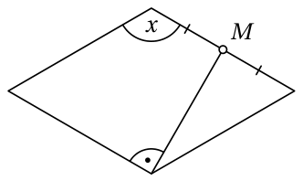

<small>

* answer:$120^\circ$
* questionType:ShortAnswer

</small>

## Atrisinājums

Pieņemsim, ka romba virsotnes ir $A$, $B$, $C$ un $D$, kā parādīts 7. zīmējumā. Tā kā nogrieznis $BM$ ir perpendikulārs romba malai $AB$, tas ir perpendikulārs arī tās pretējai malai $CD$, t.i., ir trijstūra $BCD$ augstums. Tā kā augstums $BM$ trijstūrī $BCD$ vienlaikus ir arī mediāna, tad $|BC|=|BD|$, un tā kā romba malas ir vienāda garuma, tad arī $|BC|=|CD|$, t.i., trijstūris $BCD$ ir vienādmalu. Tātad $\angle BCD=60^\circ$ un $\angle x=180^\circ-\angle BCD=120^\circ$.

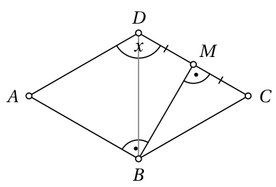

# <lo-sample/> EE.PK.2018TEST.9.7

Taisnstūris ar malām paralēlām līnijām sadalīts deviņos vienādos taisnstūros, kā parādīts zīmējumā. Pelēki iekrāsotā četrstūra laukums ir $9\ \text{cm}^2$. Atrodi lielā taisnstūra laukumu.

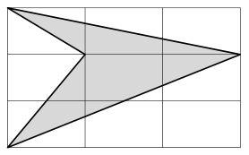

<small>

* answer:$27\ \text{cm}^2$
* questionType:ShortAnswer

</small>

## Atrisinājums

Pieņemsim, ka lielā taisnstūra $ABCD$ malu garumi ir $|AB|=x$ un $|AD|=y$, un pelēki iekrāsotā četrstūra pārējās virsotnes ir $K$ un $L$, kā parādīts 8. zīmējumā. Tad

$$S_{LKA}=\dfrac{1}{2}\cdot\dfrac{2}{3}x\cdot\dfrac{2}{3}y=\dfrac{2}{9}xy,\qquad S_{LKD}=\dfrac{1}{2}\cdot\dfrac{2}{3}x\cdot\dfrac{1}{3}y=\dfrac{1}{9}xy,$$

turpretī $S_{ABCD}=xy$. Tātad pelēki iekrāsotā četrstūra laukums $9\ \text{cm}^2$ veido $\dfrac{3}{9}$ jeb $\dfrac{1}{3}$ no lielā taisnstūra laukuma. Līdz ar to lielā taisnstūra laukums ir $27\ \text{cm}^2$.

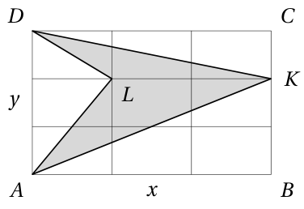

# <lo-sample/> EE.PK.2018TEST.9.8

Regulāru 24-stūri ar vienu taisnu griezienu sagriež divās vienādās figūrās (figūras uzskatām par vienādām, ja tās var precīzi uzlikt vienu uz otras, izmantojot pārbīdi, pagriešanu un apgriešanu otrādi). Katru iegūto gabalu vēlreiz ar vienu taisnu griezienu sagriež divās vienādās figūrās. Šādu griešanu divās vienādās figūrās turpina ar katru jauno gabalu tik ilgi, kamēr tas ir iespējams. Atrodi lielāko gabalu skaitu, ko šādi var iegūt.

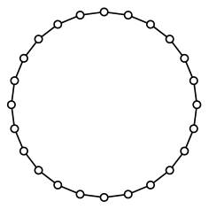

<small>

* answer:16
* questionType:ShortAnswer

</small>

## Atrisinājums

Tā kā vienādām figūrām cita starpā ir vienādi laukumi, pirmajam griezienam jāiet caur 24-stūra centru. Vienīgā iespēja otrajā solī sagriezt abus gabalus divās vienādās daļās ir izdarīt pirmajam griezienam perpendikulāru griezienu caur 24-stūra centru. Trešajā solī atkal ir tikai viena iespēja sagriezt katru no iegūtajiem 4 gabaliem divās vienādās daļās: jāizdara divi griezumi caur 24-stūra centru, kas dala uz pusēm tur ar iepriekšējiem griezumiem izveidojušos 4 leņķus. Ja pirmais griezums tika izdarīts pa taisni, kas iet caur 24-stūra pretējām virsotnēm vai pretējo malu viduspunktiem, tad ceturtajā solī varam esošos 8 gabalus vēlreiz sadalīt divās vienādās figūrās, pievienojot četrus griezumus caur 24-stūra centru, kas dala uz pusēm tur ar iepriekšējiem griezumiem izveidojušos 8 leņķus (sk. 9. zīmējumu). Šādi iegūtos 16 gabalus vairs nav iespējams ar taisnu griezumu sadalīt divās vienādās figūrās.

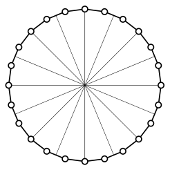

# <lo-sample/> EE.PK.2018TEST.9.9

No punkta $C$ pret riņķa līniju novilktas taisnes $CA$ un $CD$, kas krusto riņķa līniju, tā, ka uz taisnes $CA$ atrodas riņķa līnijas diametrs $AB$, un $|BC|=|BD|$ un $\angle BCD=20^\circ$ (sk. zīmējumu). Punkts $E$ atrodas uz šīs riņķa līnijas. Atrodi leņķa $DEB$ lielumu.

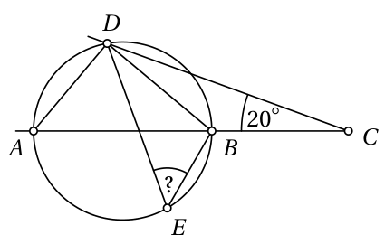

<small>

* answer:$50^\circ$
* questionType:ShortAnswer

</small>

## Atrisinājums

Tā kā ievilktie leņķi $DEB$ un $DAB$ balstās uz vienas un tās pašas hordas $DB$ (sk. 10. zīmējumu), tad $\angle DEB=\angle DAB$. Uz riņķa līnijas diametra $AB$ balstītais ievilktais leņķis $ADB$ ir taisns leņķis. No taisnleņķa trijstūra $ABD$ tagad atrodam, ka

$$\angle DAB=90^\circ-\angle DBA=90^\circ-(180^\circ-\angle DBC)=90^\circ-(\angle BCD+\angle BDC).$$

Tā kā trijstūrī $BDC$ ir $|BC|=|BD|$, tad $\angle BDC=\angle BCD=20^\circ$, tāpēc $\angle DAB=90^\circ-2\cdot20^\circ=50^\circ$ un līdz ar to arī $\angle DEB=50^\circ$.

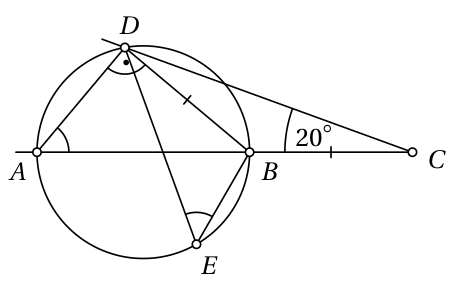

# <lo-sample/> EE.PK.2018TEST.9.10

Taisnstūra paralēlskaldņa vienu sānu skaldni var sadalīt divos taisnstūros ar izmēriem $2\times4$ vienības, bet otru sānu skaldni – četros $2\times4$ taisnstūros. Atrodi mazāko iespējamo $2\times4$ taisnstūru skaitu, kuros var sadalīt šī paralēlskaldņa pamata skaldni.

<small>

* answer:1
* questionType:ShortAnswer

</small>

## Atrisinājums

Tās sānu skaldnes izmēri, ko var sadalīt divos $2\times4$ taisnstūros, var būt vai nu $4\times4$, vai $2\times8$ vienības. Otras sānu skaldnes izmēri, ko var sadalīt četros $2\times4$ taisnstūros, var būt vai nu $4\times8$, vai $2\times16$ vienības. Tā kā šīm sānu skaldnēm ir kopīga šķautne (kas ir paralēlskaldņa augstums), tad sānu skaldņu izmēri var būt vai nu $4\times4$ un $4\times8$ vienības, vai $2\times8$ un $4\times8$ vienības, vai $2\times8$ un $2\times16$ vienības. Pirmajā gadījumā pamata skaldnes izmēri ir $4\times8$ vienības, un to var sadalīt 4 taisnstūros ar izmēriem $2\times4$; otrajā gadījumā pamata skaldnes izmēri ir $2\times4$ vienības, un to var pārklāt ar 1 taisnstūri ar izmēriem $2\times4$; trešajā gadījumā pamata skaldnes izmēri ir $8\times16$ vienības, un to var sadalīt 16 taisnstūros ar izmēriem $2\times4$.
