# <lo-sample/> EE.PK.2019TEST.7.1

Вычислить:

$2019020190 : 2019 =$

<small>

* answer:100010
* questionType:ShortAnswer

</small>

## Решение

В числе $2019020190$ два числа $20190$ сдвинуты относительно друг друга на $5$ разрядов. Так как $20190 : 2019 = 10$, то в требуемом в задаче частном два числа $10$ сдвинуты относительно друг друга на $5$ разрядов.

# <lo-sample/> EE.PK.2019TEST.7.2

Числа $a$ и $b$ такие, что $3a = 4b$ и $a \neq 0$. Найти значение дроби $\frac{6a-b}{6a+b}$.

<small>

* answer:7/9
* questionType:ShortAnswer

</small>

## Решение

Из равенства $3a = 4b$ получаем $6a = 8b$. Так как $a \neq 0$, то и $b \neq 0$. Следовательно, $\frac{6a-b}{6a+b} = \frac{8b-b}{8b+b} = \frac{7b}{9b} = \frac{7}{9}$.

# <lo-sample/> EE.PK.2019TEST.7.3

Сколько всего среди двадцати чисел $1, 2, 3, \ldots, 20$ таких, которые можно представить в виде суммы двух различных слагаемых, каждое из которых выбрано из чисел $1, 2, 3, \ldots, 10$? (Например, $8 = 2 + 6$, где слагаемые различны и выбраны из чисел $1, 2, 3, \ldots, 10$.)

<small>

* answer:17
* questionType:ShortAnswer

</small>

## Решение

Наименьшее число, которое представляется в виде суммы двух различных слагаемых, выбранных из чисел $1, 2, \ldots, 10$, равно $1 + 2$, то есть $3$, а наибольшее число равно $9 + 10$, то есть $19$. Следовательно, числа $1, 2$ и $20$ требуемым способом представить нельзя. Числа $4, 5, \ldots, 11$ представляются в виде $1 + b$, где $b = 3, 4, \ldots, 10$, а числа $12, 13, \ldots, 18$ — в виде $a + 10$, где $a = 2, 3, \ldots, 8$. В итоге требуемым способом представляются $17$ чисел.

# <lo-sample/> EE.PK.2019TEST.7.4

В первый ряд таблицы в порядке возрастания записывают подряд все кратные числа $2$, а во второй ряд таким же образом записывают все кратные числа $3$. Найти порядковый номер столбца, в котором сумма двух записанных чисел будет равна $70$.

$$
\begin{array}{cccc}
2 & 4 & 6 & \ldots\\
3 & 6 & 9 & \ldots
\end{array}
$$

<small>

* answer:14
* questionType:ShortAnswer

</small>

## Решение

В столбце номер $i$ таблицы находятся числа $2i$ и $3i$. Из уравнения $2i + 3i = 70$, то есть $5i = 70$, получаем $i = 14$.

# <lo-sample/> EE.PK.2019TEST.7.5

Из чисел $2, 0, 1$ и $9$ образовали все такие пары, в которых первое число было меньше второго. Затем для каждой образованной пары нашли арифметическое среднее входящих в нее чисел. Найти сумму всех полученных средних.

<small>

* answer:18
* questionType:ShortAnswer

</small>

## Решение

Каждое число $2, 0, 1, 9$ встречается в составленных парах $3$ раза: по одному разу в паре с каждым из остальных чисел (порядок членов пары определяется величиной чисел). Следовательно, сумма сумм членов всех пар равна $3 \cdot (2 + 0 + 1 + 9)$, то есть $36$. Арифметическое среднее членов пары равно половине их суммы, значит, и сумма арифметических средних членов всех пар равна половине числа $36$, то есть $18$.

# <lo-sample/> EE.PK.2019TEST.7.6

На стороне $AB$ прямоугольного треугольника $ABC$ лежит точка $D$ так, что $|CD| = |DB|$ и величина угла $ACD$ равна $24^\circ$. Найти величину угла $ABC$.

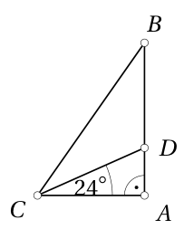

<small>

* answer:33°
* questionType:ShortAnswer

</small>

## Решение

Из треугольника $ACD$ получаем $\angle BDC = \angle DAC + \angle ACD = 90^\circ + 24^\circ = 114^\circ$. Так как $|BD| = |CD|$, то $\angle DBC = \angle DCB$. Следовательно, $\angle ABC = \frac{180^\circ - 114^\circ}{2} = 33^\circ$.

# <lo-sample/> EE.PK.2019TEST.7.7

Дан отрезок $AB$ длиной $12$ см. Из точки $A$ нарисовали кривую $AC$, которая состояла из полуокружности и еще половины такой же полуокружности. Найти точное значение длины кривой $AC$, если угол $ABC$ прямой.

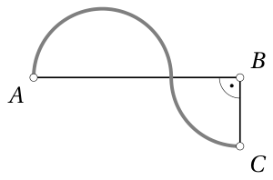

<small>

* answer:6π см
* questionType:ShortAnswer

</small>

## Решение

Из условий следует, что сумма диаметра и радиуса использованной полуокружности равна $12$ см. Так как диаметр равен двум радиусам, то $12$ см равны трём радиусам, откуда получаем, что радиус равен $4$ см. Сумма длин полуокружности и четверти окружности равна $\pi \cdot 4$ см $+ \frac{1}{2}\pi \cdot 4$ см, то есть $6\pi$ см.

# <lo-sample/> EE.PK.2019TEST.7.8

На сторонах $AB$ и $CD$ квадрата $ABCD$ выбрали соответственно точки $K$ и $L$ так, чтобы величины углов $AKD$, $LKB$ и $ABL$ были равны между собой. Какую часть от площади квадрата $ABCD$ составила площадь треугольника $KBL$, окрашенного в тёмный цвет?

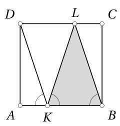

<small>

* answer:1/3
* questionType:ShortAnswer

</small>

## Решение

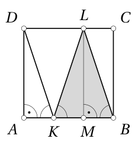

Рисунок 1

Пусть длина стороны квадрата $ABCD$ равна $a$. Пусть $M$ — основание высоты, проведённой из вершины $L$ треугольника $KLB$ (рисунок 1). Высота, проведённая из вершины равнобедренного треугольника, делит основание пополам, значит, $|KM| = |MB|$. Так как $\angle LBM = \angle DKA$ и $\angle BML = 90^\circ = \angle KAD$, а также $|LM| = |DA|$, то треугольники $LMB$ и $DAK$ равны. Следовательно, $|AK| = |MB|$. В итоге $|AK| = |KM| = |MB| = \frac{1}{3}a$. Значит, площадь треугольника $KBL$ равна $\frac{1}{2} \cdot \frac{2}{3}a \cdot a$, то есть $\frac{1}{3}a^2$, то есть $\frac{1}{3}$ площади квадрата $ABCD$.

# <lo-sample/> EE.PK.2019TEST.7.9

Точки $A$, $B$, $C$ и $D$ лежат на числовой оси. Расстояние от точки $A$ до точки $C(-4)$ равно $5$, а расстояние от точки $B$ до точки $D(3)$ равно $8$. Найти наименьшее возможное расстояние между точками $A$ и $B$.

<small>

* answer:4
* questionType:ShortAnswer

</small>

## Решение

Возможные положения точки $A$ — это $A(-9)$ и $A(1)$, а возможные положения точки $B$ — $B(-5)$ и $B(11)$ (рисунок 2). Для расстояния между точками $A$ и $B$ получаем следующие возможности:
* $(-5) - (-9)$, то есть $4$;
* $11 - (-9)$, то есть $20$;
* $1 - (-5)$, то есть $6$;
* $11 - 1$, то есть $10$.

Наименьшее из них равно $4$.

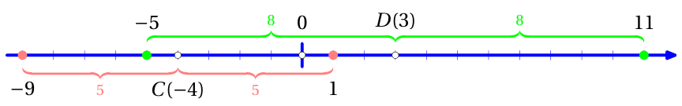

Рисунок 2

# <lo-sample/> EE.PK.2019TEST.7.10

Периметр данной фигуры, составленной из одинаковых клеток, равен $P$. От этой фигуры по одной отрезают клетки так, чтобы после отрезания каждой клетки оставшаяся фигура не распалась на несколько разных частей и имела периметр $P$. Найти наибольшее возможное количество клеток, которые можно отрезать от данной фигуры. (Части, связанные только углами клеток, считаем различными.)

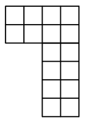

<small>

* answer:7
* questionType:ShortAnswer

</small>

## Решение

Периметр сохраняется, если у удаляемой клетки ровно половина сторон, то есть $2$ стороны, соединены с другими клетками, потому что тогда потерянная часть границы фигуры заменяется такой же по длине. Удаляя $7$ клеток в порядке, показанном на рисунке 3, получаем, что периметр фигуры при каждом удалении остаётся тем же.

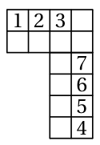

Рисунок 3

С другой стороны, чтобы фигура, состоящая из $n$ клеток, не распалась на части, клетки должны быть соединены в общей сложности как минимум по $n - 1$ сторонам. При этом каждая общая сторона одновременно принадлежит двум клеткам. Эти общие стороны не вносят вклад в периметр $P$. Всего у $n$ клеток $4n$ сторон. Значит, периметр фигуры не превосходит $4n - 2(n - 1)$, то есть $2n + 2$. Так как для исходной фигуры получаем $P = 20$, то $20 \leq 2n + 2$, откуда $n \geq 9$, то есть при сохранении периметра должно остаться как минимум $9$ клеток. Поскольку в исходной фигуре $16$ клеток, при сохранении периметра из них можно удалить не более $16 - 9$, то есть $7$.

# <lo-sample/> EE.PK.2019TEST.8.1

Вычислить:
$$
\frac{2\cdot(0-1):9}{2\cdot0-1:9}
$$

<small>

* answer:2
* questionType:ShortAnswer

</small>

## Решение

Так как $2\cdot(0-1):9=-\frac{2}{9}$ и $2\cdot0-1:9=-\frac{1}{9}$, то искомое частное равно 2.

# <lo-sample/> EE.PK.2019TEST.8.2

Найти число $a$, при котором $\frac{21}{19}=1+\frac{1}{a+\frac{1}{2}}$.

<small>

* answer:9
* questionType:ShortAnswer

</small>

## Решение

Вычтем из обеих частей уравнения 1, найдём обратную величину полученного результата и вычтем $\frac{1}{2}$. Получим $a=\frac{18}{2}=9$.

# <lo-sample/> EE.PK.2019TEST.8.3

Сколько всего среди тридцати чисел $1,2,3,\ldots,30$ таких, которые невозможно представить в виде суммы трёх различных слагаемых, каждое из которых выбрано из чисел $1,2,3,\ldots,10$?

<small>

* answer:8
* questionType:ShortAnswer

</small>

## Решение

Наименьшее число, которое представляется в виде суммы трёх различных слагаемых, выбранных из чисел $1,2,\ldots,10$, равно $1+2+3$, то есть 6, а наибольшее число равно $8+9+10$, то есть 27. Следовательно, числа 1, 2, 3, 4, 5, 28, 29 и 30 требуемым образом представить нельзя. Числа $7,8,\ldots,13$ представляются в виде $1+2+c$, где $c=4,5,\ldots,10$, числа $14,15,\ldots,19$ — в виде $1+b+10$, где $b=3,4,\ldots,8$, а числа $20,21,\ldots,26$ — в виде $a+9+10$, где $a=1,2,\ldots,7$. В итоге требуемым образом представляются 22 числа и не представляются 8 чисел.

# <lo-sample/> EE.PK.2019TEST.8.4

В первый ряд таблицы в порядке возрастания записывают подряд все кратные числа 2, во второй ряд таким же образом записывают все кратные числа 3, а в третий ряд таким же образом записывают все кратные числа 4. Найти порядковый номер столбца, в котором сумма трёх записанных чисел будет равна 234.

$$
\begin{array}{rrrr}
2 & 4 & 6 & \ldots\\
3 & 6 & 9 & \ldots\\
4 & 8 & 12 & \ldots
\end{array}
$$

<small>

* answer:26
* questionType:ShortAnswer

</small>

## Решение

В столбце номер $i$ стоят числа $2i$, $3i$ и $4i$. Из уравнения $2i+3i+4i=234$, то есть $9i=234$, получаем $i=26$.

# <lo-sample/> EE.PK.2019TEST.8.5

Даны $n$ чисел, арифметическое среднее которых равно 20. Если к данным числам добавить ещё одно число 100, то среднее арифметическое всех чисел будет равно 25. Найти число $n$.

<small>

* answer:15
* questionType:ShortAnswer

</small>

## Решение

Если арифметическое среднее $n$ чисел равно 20, то сумма этих чисел равна $20n$.

Если к набору чисел добавить 100, то арифметическое среднее чисел равно $\frac{20n+100}{n+1}$.

Уравнение $\frac{20n+100}{n+1}=25$ преобразуется к виду $20n+100=25n+25$, откуда $n=15$.

# <lo-sample/> EE.PK.2019TEST.8.6

В треугольнике $ABC$ стороны $AC$ и $BC$ равны. Из точки $D$, лежащей на стороне $AB$, провели отрезок $DE$, который пересёк сторону $AC$ в точке $K$. Найти величину угла $ACB$, если $\angle ADK = 97^\circ$ и $\angle DKC = 123^\circ$.

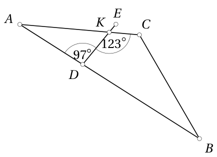

<small>

* answer:$128^\circ$
* questionType:ShortAnswer

</small>

## Решение

Из смежных углов получаем $\angle AKD=180^\circ-123^\circ=57^\circ$. Из треугольника $AKD$ теперь получаем $\angle DAK=180^\circ-97^\circ-57^\circ=26^\circ$. Так как $|AC|=|BC|$, то $\angle CBA=\angle CAB=26^\circ$. Следовательно, $\angle ACB=180^\circ-26^\circ-26^\circ=128^\circ$.

# <lo-sample/> EE.PK.2019TEST.8.7

На рисунке изображены две равные окружности с радиусом 3 см, одна из которых проходит через центр другой. Найти точный периметр ограниченной этими окружностями фигуры (на рисунке закрашена в тёмный цвет).

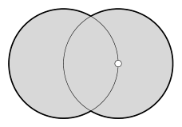

<small>

* answer:$8\pi$ см
* questionType:ShortAnswer

</small>

## Решение

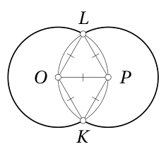

Пусть центры этих двух окружностей соответственно $O$ и $P$, а точки пересечения $K$ и $L$ (рисунок 4). Тогда $|OK|=|OP|=|OL|=|PK|=|PL|=3$ см. Из равносторонних треугольников $OPK$ и $OPL$ получаем $\angle KOL=60^\circ+60^\circ=120^\circ$, также $\angle KPL=120^\circ$. Следовательно, от каждой окружности к объединённой фигуре принадлежит часть, соответствующая центральному углу величиной $360^\circ-120^\circ$, то есть $240^\circ$, что составляет $\frac{2}{3}$ полного оборота. В итоге периметр объединённой фигуры равен $2\cdot\frac{2}{3}\cdot2\pi\cdot3$ см, то есть $8\pi$ см.

# <lo-sample/> EE.PK.2019TEST.8.8

Величина одного из углов треугольника равна $54^\circ$, причём эта величина на 40% меньше величины другого угла этого треугольника. Найти величину третьего угла этого треугольника.

<small>

* answer:$36^\circ$
* questionType:ShortAnswer

</small>

## Решение

По условию задачи $54^\circ$ составляет 60% величины другого угла треугольника. Следовательно, величина другого угла треугольника равна $\frac{100}{60}\cdot54^\circ$, то есть $90^\circ$. Величина третьего угла равна $180^\circ-54^\circ-90^\circ$, то есть $36^\circ$.

# <lo-sample/> EE.PK.2019TEST.8.9

Два равных прямоугольника, площадь каждого из которых $4\ \mathrm{см}^2$, поместили друг на друга так, чтобы каждая из точек пересечения $K$ и $L$ сторон этих прямоугольников являлась серединой обеих сторон, на которых она лежит. Найти площадь, которую покрывают эти прямоугольники (на рисунке закрашена в тёмный цвет).

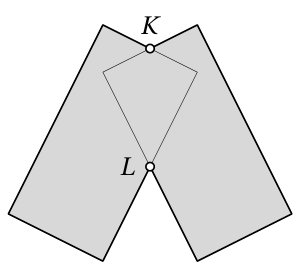

<small>

* answer:$7\ \mathrm{см}^2$
* questionType:ShortAnswer

</small>

## Решение

Пусть остальные две вершины фигуры, покрытой прямоугольниками дважды, — $A$ и $E$ (рисунок 5).

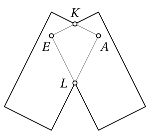

Так как $K$ и $L$ являются серединами сторон прямоугольника, то площадь треугольника $KAL$ составляет $\frac{1}{2}\cdot\frac{1}{2}\cdot\frac{1}{2}$, то есть $\frac{1}{8}$ площади прямоугольника $4\ \mathrm{см}^2$. Следовательно, площадь треугольника $KAL$ равна $\frac{1}{2}\ \mathrm{см}^2$. Также площадь треугольника $KEL$ равна $\frac{1}{2}\ \mathrm{см}^2$. Следовательно, площадь четырёхугольника $KALE$ равна $1\ \mathrm{см}^2$. Тогда площадь фигуры, покрытой двумя прямоугольниками, равна $4\ \mathrm{см}^2+4\ \mathrm{см}^2-1\ \mathrm{см}^2$, то есть $7\ \mathrm{см}^2$.

# <lo-sample/> EE.PK.2019TEST.8.10

Периметр данной фигуры, составленной из одинаковых клеток, равен $P$. От этой фигуры по одной отрезают клетки так, чтобы после отрезания каждой клетки оставшаяся фигура не распалась на несколько разных частей и имела периметр $P$. Найти наибольшее возможное количество клеток, которые можно отрезать от данной фигуры. (Части, связанные только углами клеток, считаем различными.)

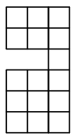

<small>

* answer:6
* questionType:ShortAnswer

</small>

## Решение

Периметр сохраняется, если у удаляемой клетки ровно половина сторон, то есть 2 стороны, соединены с другими клетками, поскольку тогда потерянная часть границы фигуры заменяется такой же по длине.

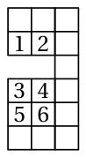

Удаляя 6 клеток в порядке, показанном на рисунке 6, получаем, что периметр фигуры при каждом удалении остаётся тем же.

С другой стороны, чтобы фигура, состоящая из $n$ клеток, не распадалась на части, клетки должны быть соединены в общей сложности хотя бы по $n-1$ сторонам. При этом каждое общее ребро одновременно принадлежит двум клеткам. Эти общие рёбра не вносят вклад в периметр $P$. Всего у $n$ клеток $4n$ сторон. Следовательно, периметр фигуры не превосходит $4n-2(n-1)$, то есть $2n+2$. Так как для исходной фигуры получаем $P=22$, то $22\leq 2n+2$, откуда $n\geq 10$, то есть при сохранении периметра должно остаться как минимум 10 клеток. Поскольку в исходной фигуре 16 клеток, при сохранении периметра из них можно удалить не более $16-10$, то есть 6.

# <lo-sample/> EE.PK.2019TEST.9.1

Вычислить:
$$
\frac{20 : 19 \cdot 20 : 19}{20 : (19 \cdot 20) : 19}
$$

<small>

* answer:400
* questionType:ShortAnswer

</small>

## Решение

Числитель дроби равен $\frac{20^2}{19^2}$, а знаменатель дроби равен $\frac{1}{19^2}$. Следовательно, значение дроби равно $20^2$, то есть 400.

# <lo-sample/> EE.PK.2019TEST.9.2

Найти натуральные числа $m$ и $n$, если $\frac{2019}{2009} = 1 + \frac{1}{200 + \frac{1}{m + \frac{1}{n}}}$.

<small>

* answer:m = 1, n = 9
* questionType:ShortAnswer

</small>

## Решение

Вычтем из обеих частей равенства 1, найдём обратную величину, вычтем 200 и снова найдём обратную величину. Получим $\frac{10}{9} = m + \frac{1}{n}$. Так как $\frac{10}{9} = 1 + \frac{1}{9}$ и $\frac{1}{n} \leq 1$, то единственная возможность: $\frac{1}{n} = \frac{1}{9}$, откуда $n = 9$ и $m = 1$.

# <lo-sample/> EE.PK.2019TEST.9.3

В первый ряд таблицы записывают подряд все чётные числа, начиная с числа 20, а во второй ряд таким же образом записывают все нечётные числа, начиная с числа 19. Найти порядковый номер столбца, в котором сумма двух записанных чисел будет равна 111.

$$
\begin{array}{cccc}
20 & 22 & 24 & \ldots \\
19 & 21 & 23 & \ldots
\end{array}
$$

<small>

* answer:19
* questionType:ShortAnswer

</small>

## Решение

*Решение 1.* В каждом столбце находятся два последовательных натуральных числа вида $2i - 1$ и $2i$. Если их сумма равна 111, то $i = 55$. В первом столбце $i = 19$. Следовательно, порядковый номер искомого столбца равен $\frac{55 - 19}{2} + 1$, то есть 19.

*Решение 2.* Добавим в начало таблицы 9 столбцов с числами $1, 2, \ldots, 18$. Тогда в столбце номер $i$ находятся числа $2i - 1$ и $2i$. Из уравнения $(2i - 1) + 2i = 111$, то есть $4i = 112$, получаем $i = 28$. Следовательно, в исходной таблице требуемый столбец имеет порядковый номер 19.

# <lo-sample/> EE.PK.2019TEST.9.4

Сколько всего среди последовательных целых чисел $1, 2, 3, \ldots, 2019$ таких, которые можно представить в виде суммы четырёх различных слагаемых, каждое из которых выбрано из чисел $1, 2, 3, \ldots, 100$?

<small>

* answer:385
* questionType:ShortAnswer

</small>

## Решение

Наименьшее число, которое представляется в виде суммы четырёх различных слагаемых, выбранных из чисел $1, 2, \ldots, 100$, равно $1 + 2 + 3 + 4$, то есть 10, а наибольшее число равно $97 + 98 + 99 + 100$, то есть 394. Чисел от 10 до 394 ровно 385. Убедимся, что все они могут быть представлены. Числа $10, 11, \ldots, 106$ представляются в виде $1 + 2 + 3 + d$, где $d = 4, 5, \ldots, 100$, числа $107, 108, \ldots, 202$ представляются в виде $1 + 2 + c + 100$, где $c = 4, 5, \ldots, 99$, числа $203, 204, \ldots, 297$ представляются в виде $1 + b + 99 + 100$, где $b = 3, 4, \ldots, 97$, а числа $298, 299, \ldots, 394$ — в виде $a + 98 + 99 + 100$, где $a = 1, 2, \ldots, 97$.

# <lo-sample/> EE.PK.2019TEST.9.5

Арифметическое среднее трёх положительных целых чисел 2, 3 и $n$ является целым числом, которое делится как на число 2, так и на число 3. Найти наименьшее из возможных значений числа $n$.

<small>

* answer:13
* questionType:ShortAnswer

</small>

## Решение

Число делится как на число 2, так и на число 3 тогда и только тогда, когда оно делится на число 6. Следовательно, арифметическое среднее чисел 2, 3 и $n$ делится на 6, что показывает, что $2 + 3 + n$ делится на 18. Наименьшее $n$, при котором это выполняется, равно 13.

# <lo-sample/> EE.PK.2019TEST.9.6

На стороне $AB$ правильного пятиугольника $ABCDE$ нарисовали квадрат $ABLM$, а на стороне $BC$ равносторонний треугольник $BCK$. Найти величину угла $BKL$.

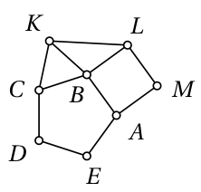

<small>

* answer:39^\circ
* questionType:ShortAnswer

</small>

## Решение

Так как равносторонний треугольник $BCK$ построен на стороне $BC$ правильного пятиугольника, а квадрат $ABLM$ построен на стороне $AB$ того же правильного пятиугольника, то $|BK| = |BC| = |AB| = |BL|$. Величина внутреннего угла правильного пятиугольника равна $\frac{3}{5} \cdot 180^\circ$, то есть $108^\circ$. Следовательно, $\angle KBL = 360^\circ - 60^\circ - 90^\circ - 108^\circ = 102^\circ$, откуда $\angle BKL = \frac{180^\circ - 102^\circ}{2} = 39^\circ$.

# <lo-sample/> EE.PK.2019TEST.9.7

Дан отрезок $AB$ длиной 24 см, который поделён точками $K$, $L$ и $M$ на четыре равные части. Полуокружность с диаметром $AL$ пересекает в точке $C$ полуокружность с диаметром $KM$, которая в свою очередь пересекает в точке $D$ полуокружность с диаметром $LB$. Найти точное значение длины кривой $ACDB$, образованной из дуг этих полуокружностей.

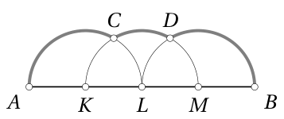

<small>

* answer:10\pi см
* questionType:ShortAnswer

</small>

## Решение

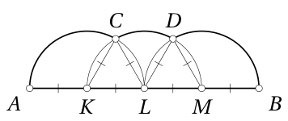

По условию задачи $|AK| = |KL| = |LM| = |MB| = \frac{24}{4}$ см $= 6$ см. Следовательно, также $|KC| = |LC| = |LD| = |MD| = 6$ см (рисунок 7). Из равносторонних треугольников $KLC$ и $LMD$ получаем $\angle CKL = \angle CLK = \angle DLM = \angle DML = 60^\circ$, откуда также $\angle AKC = \angle BML = 120^\circ$ и $\angle CLD = 60^\circ$. Это означает, что дуги $AC$ и $BD$ соответствуют центральному углу $\frac{1}{3}$ полного оборота, а дуга $CD$ — центральному углу $\frac{1}{6}$ полного оборота. В итоге получаем длину кривой $ACDB$: $\frac{1}{3} \cdot 2\pi \cdot 6$ см $+ \frac{1}{6} \cdot 2\pi \cdot 6$ см $+ \frac{1}{3} \cdot 2\pi \cdot 6$ см, то есть $10\pi$ см.

# <lo-sample/> EE.PK.2019TEST.9.8

Три равных прямоугольника, площадь каждого из которых 16 см$^2$, поместили друг на друга так, чтобы каждая из точек пересечения $K$, $L$, $M$ и $N$ сторон этих прямоугольников являлась серединой всех сторон, на которых она лежит. Найти общую площадь тех частей плоскости, которые дважды покрыты этими прямоугольниками.

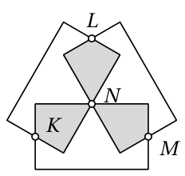

<small>

* answer:12 см^2
* questionType:ShortAnswer

</small>

## Решение

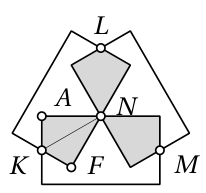

Рассмотрим два прямоугольника, которые пересекаются в точках $K$ и $N$. Пусть две остальные вершины фигуры, дважды покрытой этими прямоугольниками, — это $A$ и $F$ (рисунок 8). Так как $K$ и $N$ являются серединами сторон прямоугольника, то площадь треугольника $KAN$ составляет $\frac{1}{2} \cdot \frac{1}{2} \cdot \frac{1}{2}$, то есть $\frac{1}{8}$ площади прямоугольника 16 см$^2$. Следовательно, площадь треугольника $KAN$ равна 2 см$^2$. Так же площадь треугольника $KFN$ равна 2 см$^2$. Значит, площадь четырёхугольника $KANF$ равна 4 см$^2$. Аналогично видим, что площади двух остальных дважды покрытых фигур также равны 4 см$^2$. Следовательно, общая площадь этих областей равна 12 см$^2$.

# <lo-sample/> EE.PK.2019TEST.9.9

Для покраски всех граней деревянного куба необходимо 0,12 л краски. Куб поделили двумя перпендикулярными разрезами на четыре прямых параллелепипеда. Сколько всего краски необходимо для покраски всех граней полученных параллелепипедов?

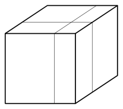

<small>

* answer:0,2 л
* questionType:ShortAnswer

</small>

## Решение

Площадь одного разреза равна площади грани куба, а один разрез добавляет такую поверхность дважды (по одной для каждого из получающихся параллелепипедов). Следовательно, двумя разрезами добавляется поверхность, равная 4 граням куба. У куба 6 граней, и для покраски их общей поверхности необходимо 0,12 л краски. Поэтому для покраски общей поверхности параллелепипедов, получающихся после разрезов, необходимо $\frac{6 + 4}{6} \cdot 0{,}12$ л краски, то есть 0,2 л.

# <lo-sample/> EE.PK.2019TEST.9.10

В лесу четыре тропинки длиной 3 км и одна тропинка длиной 4 км. Поход по этим тропинкам длиной 36 км начинается из точки $A$, а заканчивается в точке $B$. Каждую тропинку нужно проходить целиком, и ни одну тропинку нельзя проходить несколько раз подряд. Сколько всего раз придётся пройти тропинку длиной 4 км?

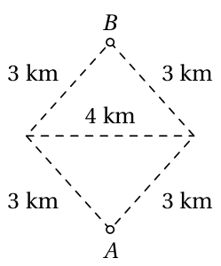

<small>

* answer:3
* questionType:ShortAnswer

</small>

## Решение

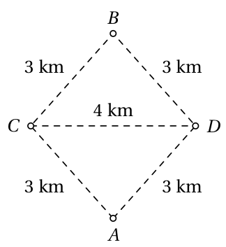

Пусть тропинку длиной 4 км проходят ровно $n$ раз. Так как все остальные тропинки имеют длину 3 км, число $36 - 4n$ должно делиться на 3. Так как 36 делится на 3, для этого число $4n$ должно делиться на 3; так как 4 и 3 взаимно просты, то $n$ должно делиться на 3. Следовательно, $n = 0$, $n = 3$, $n = 6$ или $n = 9$; при большем $n$ число прохождений 3-километровых тропинок было бы отрицательным. Очевидно, что $n = 9$ невозможно, потому что тогда число прохождений 3-километровых тропинок должно быть равно 0, что невозможно, так как для того, чтобы попасть из точки $A$ в точку $B$, нужно пройти как минимум 2 тропинки длиной 3 км. Невозможно и $n = 6$, потому что каждому прохождению 4-километровой тропинки должно предшествовать и за ним должно следовать прохождение 3-километровой тропинки, а $(4 + 3) \cdot 6 > 36$. Случай $n = 3$ возможен; обозначив концы 4-километровой тропинки $C$ и $D$ (рисунок 9), условиям удовлетворяет поход, который проходит последовательно вершины $A, C, D, A, C, D, A, C, D, A, C, B$. Случай $n = 0$ невозможен, потому что без прохождения 4-километровой тропинки поход закончился бы в начальной точке $A$.
