# <lo-sample/> EE.PK.2020TEST.7.1

Arvuta:

$$\frac{\frac{2}{3} + \frac{4}{5}}{\frac{2}{5} + \frac{1}{3}} =$$

<small>

* answer:2
* questionType:ShortAnswer

</small>

## Lahendus

$$\frac{\frac{2}{3} + \frac{4}{5}}{\frac{2}{5} + \frac{1}{3}} = \frac{2 \cdot \frac{1}{3} + 2 \cdot \frac{2}{5}}{\frac{1}{3} + \frac{2}{5}} = 2.$$

# <lo-sample/> EE.PK.2020TEST.7.2

Arvud $a$, $b$, $c$ ja $d$ on sellised, et $a + b = 4$, $b + c = 5$ ja $c + d = 7$. Leia summa $a + d$.

<small>

* answer:6
* questionType:ShortAnswer

</small>

## Lahendus

Ülesande tingimustest tulenevalt $a + b + c + d = 4 + 7 = 11$, mistõttu $a + d = 11 - (b + c) = 6$.

# <lo-sample/> EE.PK.2020TEST.7.3

Kui eraldada aastaarvus 2001 kaks esimest numbrit ülejäänutest punktiga, võime seda tõlgendada kuupäevana 20. jaanuar. Aastaarv 2000 aga ei võimalda sellisel viisil kuupäeva saada. Mitme aastaarvuga on kogu XXI sajandi jooksul võimalik kirjeldatud viisil kuupäeva moodustada?

<small>

* answer:12
* questionType:ShortAnswer

</small>

## Lahendus

Kaks viimast numbrit saavad esitada 12 kuud. Kuna igas kuus on 20. kuupäev olemas, siis lisades kaheks esimeseks numbriks 20, saame kõigil neil juhtudel kuupäeva.

# <lo-sample/> EE.PK.2020TEST.7.4

Leia kõik numbrid $x$, mille korral on kolmekohaline arv $\overline{x0x}$ arvu 2020 tegur.

<small>

* answer:1, 2, 4, 5
* questionType:ShortAnswer

</small>

## Lahendus

Kuna $2020 = 2^2 \cdot 5 \cdot 101$, kus 2, 5 ja 101 on algarvud, siis 2020 jagub arvudega 101, 202, 404 ja 505 ning ei jagu arvudega 303, 606, 707, 808 ja 909.

# <lo-sample/> EE.PK.2020TEST.7.5

Vutimuna valge moodustab muna massist 55%, munakollane 33% ning ülejäänud osa on munakoor, mis kaalub 1,2 grammi. Kui palju kaalub kooreta vutimuna?

<small>

* answer:8,8 grammi
* questionType:ShortAnswer

</small>

## Lahendus

Vutimuna koor massiga 1,2 grammi moodustab ülesande tingimuste põhjal $100\% - 55\% - 33\%$ ehk 12% muna massist. Seega muna mass on 10 grammi, kooreta muna mass aga 8,8 grammi.

# <lo-sample/> EE.PK.2020TEST.7.6

Nelinurk $ABCD$ on ristkülik ja $ABE$ on võrdhaarne kolmnurk, mille tipunurk suurusega $88^\circ$ asub tipu $E$ juures. Nurga $ACB$ suurus on $77^\circ$. Lõigud $AC$ ja $BE$ lõikuvad punktis $F$. Leia nurga $AFB$ suurus.

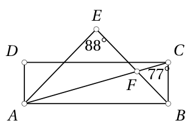

<small>

* answer:$121^\circ$
* questionType:ShortAnswer

</small>

## Lahendus

Kuna $ABE$ on võrdhaarne kolmnurk tipunurgaga tipu $E$ juures, siis kehtib

$$\angle ABE = \frac{180^\circ - \angle AEB}{2} = \frac{180^\circ - 88^\circ}{2} = 46^\circ.$$

Et $ABCD$ on ristkülik, siis $\angle ABC = 90^\circ$; kuna $\angle ACB = 77^\circ$, siis $\angle BAC = 180^\circ - 90^\circ - 77^\circ = 13^\circ$. Kolmnurgas $ABF$ saame nüüd

$$\angle AFB = 180^\circ - \angle FAB - \angle FBA = 180^\circ - 13^\circ - 46^\circ = 121^\circ.$$

# <lo-sample/> EE.PK.2020TEST.7.7

Jooksurada kulgeb ümber ristküliku $ABCD$ mööda ristküliku külgi, kusjuures $|AB| = 8$ km ja $|BC| = 10$ km. Start ja finiš on tipus $A$ ning teised tipud läbitakse järjestuses $B$, $C$, $D$. Täpselt poolel teel punktist $A$ punkti $C$ asub esimene vahefiniš $K$, täpselt poolel teel punktist $K$ punkti $D$ asub teine vahefiniš $L$ ning täpselt poolel teel punktist $L$ finišisse asub kolmas vahefiniš $M$. Leia kaugus punktist $M$ talle lähima ristküliku $ABCD$ tipuni.

<small>

* answer:0,75 km
* questionType:ShortAnswer

</small>

## Lahendus

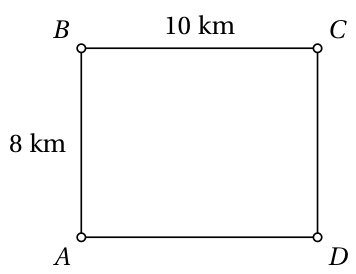

Joonis 1

Tee punktist $A$ punkti $C$ koosneb kahest ristküliku lähisküljest, mille kogupikkus on 18 km (joonis 1). Seega punkt $K$ asub 9 km kaugusel stardist; et kogu raja pikkus on 36 km, on punktist $K$ finišini 27 km. Punkt $D$ asub finišist 10 km kaugusel, seega punktist $K$ punkti $D$ on 17 km. Järelikult punktist $L$ punkti $D$ on 8,5 km ja finišini 18,5 km. Seega punktist $M$ finišini on 9,25 km. Lähim ristküliku tipp on $D$, millest $M$ jääb 0,75 km kaugusele.

# <lo-sample/> EE.PK.2020TEST.7.8

Noole alguspunkt asub ringi keskpunktis. Noolt pööratakse ümber selle ringi keskpunkti päripäeva $2020^\circ$ võrra. Leia noole alg- ja lõppasendi vahelise (vähima mittenegatiivse) nurga suurus.

<small>

* answer:$140^\circ$
* questionType:ShortAnswer

</small>

## Lahendus

Pööre $2020^\circ$ võrra koosneb 5 täisringist ja pöördest $220^\circ$ võrra. Seega alg- ja lõppasendi vaheline nurk on suurusega $\min(220^\circ, 360^\circ - 220^\circ)$ ehk $140^\circ$.

# <lo-sample/> EE.PK.2020TEST.7.9

Joonisel on ruut mõõtmetega 7 cm × 7 cm. Selle ruudu sees on tumedaks värvitud üks kuusnurk, mille neli külge pikkusega 2 cm asuvad ruudu külgedel. Leia tumedaks värvitud kuusnurga täpne pindala.

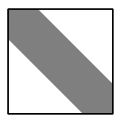

<small>

* answer:$24\text{ cm}^2$
* questionType:ShortAnswer

</small>

## Lahendus

Ruudu kogupindala on $49\text{ cm}^2$. Värvimata alad annavad kokku ruudu küljepikkusega 5 cm. Seega värvimata alade kogupindala on $25\text{ cm}^2$. Tumedaks värvitud osa pindala on seega $24\text{ cm}^2$.

# <lo-sample/> EE.PK.2020TEST.7.10

Joonisel on kujutatud ühe täringu kaks vaadet.

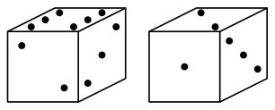

On teada, et täringu tahkudel on kõik silmade arvud 1-st 6-ni, kuid vastastahkudel olevate silmade arvude summa pole alati 7 nagu tavalisel täringul. Mitu silma on 3 silmaga tahu vastastahul?

<small>

* answer:5
* questionType:ShortAnswer

</small>

## Lahendus

Naabertahkudel, millel on vastavalt 2 ja 3 silma, on üks ühine naabertahk 6 silmaga ja teine ühine naabertahk 1 silmaga. Et kahel naabertahul on vaid 2 ühist naabertahku ja need on teineteise vastastahud, on ühe vastastahkude paari silmade arvude summa 7. Kui veel ühe vastastahkude paari silmade arvude summa oleks 7, peaks ka viimase vastastahkude paari silmade arvude summa olema 7, mis on vastuolus ülesande tingimusega. Järelikult rohkem selliseid vastastahkude paare ei ole. Seega 3 silmaga tahu vastastahul on 5 silma, sest 4 silma annaks summaks 7 ja 2 silma on lähistahul.

# <lo-sample/> EE.PK.2020TEST.8.1

Arvuta:
$$
\frac{\frac{4}{5}\left(1+\frac{1}{4}\right)}{\frac{3}{4}\left(1-\frac{1}{3}\right)}
$$

<small>

* answer:$2$
* questionType:ShortAnswer

</small>

## Lahendus

$$
\frac{\frac{4}{5}\left(1+\frac{1}{4}\right)}{\frac{3}{4}\left(1-\frac{1}{3}\right)}
=
\frac{\frac{4}{5}\cdot\frac{5}{4}}{\frac{3}{4}\cdot\frac{2}{3}}
=
\frac{1}{\frac{1}{2}}
=2.
$$

# <lo-sample/> EE.PK.2020TEST.8.2

Praad on 2 korda kallim kui magustoit, jook aga 2 korda odavam kui magustoit. Praad ja jook maksavad kokku 10 eurot. Leia magustoidu hind.

<small>

* answer:4 eurot
* questionType:ShortAnswer

</small>

## Lahendus

Ülesande tingimuste põhjal on prae hind võrdne 2 magustoidu hinnaga, joogi hind aga 0,5 magustoidu hinnaga. Seega prae ja joogi koguhind 10 eurot võrdub 2,5 magustoidu hinnaga. Magustoit maksab järelikult 4 eurot.

# <lo-sample/> EE.PK.2020TEST.8.3

Leia arvu 2020 suurima ja vähima algteguri jagatis.

<small>

* answer:$50,5$
* questionType:ShortAnswer

</small>

## Lahendus

Et $2020=2^2\cdot 5\cdot 101$, kus 2, 5 ja 101 on algarvud, siis arvu 2020 suurima ja vähima algteguri jagatis on $\frac{101}{2}$ ehk 50,5.

# <lo-sample/> EE.PK.2020TEST.8.4

Kui palju leidub arvul $2^8$ selliseid positiivseid tegureid, millest igaüks on mingi täisarvu ruut?

<small>

* answer:$5$
* questionType:ShortAnswer

</small>

## Lahendus

Arvu $2^8$ kõik tegurid on kujul $2^k$, kus $0\le k\le 8$. Täisarvude ruudud on neist sellised, kus $k$ on paarisarv ehk üks arvudest 0, 2, 4, 6, 8. Seega arvul $2^8$ on 5 tegurit, mis on täisarvude ruudud.

# <lo-sample/> EE.PK.2020TEST.8.5

On kolm kaarti, mille kummalegi küljele on kirjutatud üks arv. Ühel kaardil on arvud 3 ja 10, teisel 4 ja 11 ning kolmandal 5 ja 12. Need kolm kaarti asetatakse korraga lauale ja arvutatakse nähtaval oleva kolme arvu summa. Mitu erinevat summat saab nii tekkida?

<small>

* answer:$4$
* questionType:ShortAnswer

</small>

## Lahendus

Kui igal kaardil on näha väiksem arv, siis on summa 12. Kui igal kaardil on näha suurem arv, siis on summa 33. Kui kahel kaardil on näha väiksem ja ühel suurem arv, siis on summa 19. Kui kahel kaardil on näha suurem ja ühel väiksem arv, siis on summa 26.

*Märkus.* Veenduda, et muud summad pole võimalikud, saab lihtsasti tähelepaneku abil, et igal kaardil olevad arvud erinevad teineteisest täpselt 7 võrra, mistõttu ka summa saab muutuda ainult 7 kordsete võrra.

# <lo-sample/> EE.PK.2020TEST.8.6

Joonisel tähistatud nurkade kohta on teada võrdus $\alpha+\beta+\gamma=125^\circ$. Leia $\alpha$.

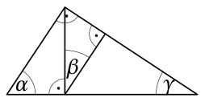

<small>

* answer:$55^\circ$
* questionType:ShortAnswer

</small>

## Lahendus

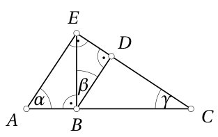

Tähistame punktid $A$, $B$, $C$, $D$, $E$ nagu joonisel 2. Siis $\alpha+\gamma=90^\circ$, sest täisnurkses kolmnurgas $ACE$ on teravnurgad suurusega $\alpha$ ja $\gamma$. Et ülesande tingimuse põhjal $\alpha+\beta+\gamma=125^\circ$, siis $\beta=125^\circ-90^\circ=35^\circ$. Kuna aga lõigud $AE$ ja $BD$ on mõlemad risti lõiguga $CE$, on lõigud $AE$ ja $BD$ paralleelsed. Põiknurkadest saame $\angle AEB=\beta=35^\circ$. Kuna täisnurkse kolmnurga $ABE$ teravnurgad on suurusega $\alpha$ ja $35^\circ$, siis $\alpha=90^\circ-35^\circ=55^\circ$.

# <lo-sample/> EE.PK.2020TEST.8.7

Suur ristkülik ümbermõõduga 60 cm on jaotatud üheks ruuduks ja üheks ristkülikuks nii, et tekkinud ristküliku ümbermõõt on 6 cm võrra suurem ruudu ümbermõõdust. Leia suure ristküliku pindala.

<small>

* answer:$189\ \text{cm}^2$
* questionType:ShortAnswer

</small>

## Lahendus

Olgu suure ristküliku lühema külje pikkus $a$. Eraldame väiksest ristkülikust omakorda ruudu küljepikkusega $a$ (joonis 3).

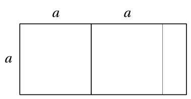

Et suurest ristkülikust ühe ruudu eraldamisel saadava ristküliku ümbermõõt on 6 cm võrra suurem ruudu ümbermõõdust, jääb suurest ristkülikust kahe ruudu eemaldamisel üle ristkülik, mille suure ristküliku pikema küljega paralleelse külje pikkus on 3 cm. Suure ristküliku ümbermõõt avaldub seega kujul $6a+6$ cm, ülesande tingimuse põhjal on see 60 cm. Võrrandi lahendamisel saame $a=9$ cm, millest tulenevalt on suure ristküliku pikema külje pikkus 21 cm. Suure ristküliku pindala on seega 189 cm$^2$.

# <lo-sample/> EE.PK.2020TEST.8.8

Jüril on universaalne kalender, mis koosneb kuu nimetust näitavast alusest ja kahest kõrvuti asetsevast kuubist, mille tahkudel olevatest numbritest saab moodustada kõik veebruari kuupäevad. Leia vähim võimalik kuupide tahkutel olevate numbrite summa.

<small>

* answer:$48$
* questionType:ShortAnswer

</small>

## Lahendus

Tahkudel peavad esinema kõik numbrid 0-st 9-ni. Kuupäevade 11 ja 22 moodustamiseks peavad 1 ja 2 olema topelt. Seega vähim võimalik kahe kuubi tahkudel olevate numbrite summa on $1+2+3+4+5+6+7+8+9+1+2$ ehk 48.

*Märkus.* Kuna kahel kuubil on kokku 12 tahku ja vaja läheb 12 numbrit, on leitud summa 48 tegelikult ainus võimalus.

# <lo-sample/> EE.PK.2020TEST.8.9

Joonisel on ruut mõõtmetega 8 cm $\times$ 8 cm. Selle ruudu sees on tumedaks värvitud üks 16-nurk, mille kaheksa külge pikkusega 1 cm asuvad ruudu külgedel ja igaüks ülejäänud kaheksast küljest on ruudu mingi diagonaaliga paralleelne. Leia tumedaks värvitud 16-nurga täpne pindala.

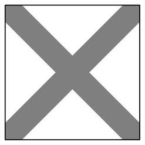

<small>

* answer:$28\ \text{cm}^2$
* questionType:ShortAnswer

</small>

## Lahendus

Antud ruudu pindala on 64 cm$^2$. Värvimata kolmnurkadest saab kokku panna ruudu küljepikkusega 6 cm. Seega värvimata osa pindala on 36 cm$^2$. Tumedaks värvitud osa pindala on järelikult 28 cm$^2$.

# <lo-sample/> EE.PK.2020TEST.8.10

Ülemine keha on moodustatud 9 ühesuurusest kuubist ja tema täispindala on 150 cm$^2$. Alumine keha on moodustatud 9 samasugusest kuubist. Leia alumise keha täispindala.

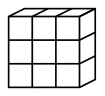

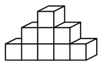

<small>

* answer:$170\ \text{cm}^2$
* questionType:ShortAnswer

</small>

## Lahendus

Ülemise keha kumbki ruudukujuline tahk moodustub 9 kuubi tahust ja iga muu tahk 3 kuubi tahust. Seega ülemise keha pind moodustub $2\cdot 9+4\cdot 3$ ehk 30 kuubi tahust. Et ülemise keha täispindala on 150 cm$^2$, on kuubi tahu pindala 5 cm$^2$. Alumisel kehal koosneb esi- ja tagatahk 9 kuubi tahust nagu ülemisel kehal ning ka vasak ja parem vaade koosnevad mõlemal kehal 3 kuubi tahust. Alt- ja pealtvaade koosnevad ülemisel kehal kumbki 3 kuubi tahust, alumisel kehal aga 5 kuubi tahust. Seega alumise keha täispindala on $2\cdot 2$ kuubi tahu pindala ehk 20 cm$^2$ võrra suurem kui ülemise keha kogupindala. Järelikult on alumise keha täispindala 170 cm$^2$.

# <lo-sample/> EE.PK.2020TEST.9.1

Arvuta:

$$
\frac{\frac{6}{7}+\frac{4}{11}-\frac{2}{17}}{\frac{1}{17}-\frac{3}{7}-\frac{2}{11}} =
$$

<small>

* answer:-2
* questionType:ShortAnswer

</small>

## Lahendus

$$
\frac{\frac{6}{7}+\frac{4}{11}-\frac{2}{17}}{\frac{1}{17}-\frac{3}{7}-\frac{2}{11}} =
\frac{(-2)\cdot\frac{1}{17}-(-2)\cdot\frac{3}{7}-(-2)\cdot\frac{2}{11}}{\frac{1}{17}-\frac{3}{7}-\frac{2}{11}} = -2.
$$

# <lo-sample/> EE.PK.2020TEST.9.2

Arvud $a$ ja $b$ on sellised, et $a^2 + b^2 = 2ab$ ja $a + b = 2,2$. Leia $a$.

<small>

* answer:1,1
* questionType:ShortAnswer

</small>

## Lahendus

Tingimus $a^2 + b^2 = 2ab$ on samaväärne võrdusega $a^2 - 2ab + b^2 = 0$ ehk $(a - b)^2 = 0$, millest järeldub võrdus $a = b$. Et $a + b = 2,2$, siis $a = b = 1,1$.

# <lo-sample/> EE.PK.2020TEST.9.3

Aastas 2019 leidus ainult üks niisugune kuupäev, mille tavalist üleskirjutust 19.01.19 sai tõlgendada korrutustabeli reana kujul $19 \times 1 = 19$. Aastas 2018 oli selliseid kuupäevi rohkem, näiteks 03.06.18 või 09.02.18. Mitu nii tõlgendatavat kuupäeva on aastas 2020?

<small>

* answer:5
* questionType:ShortAnswer

</small>

## Lahendus

Korrutise rollis on arv $20$. Selle arvu positiivsed tegurid on $1, 2, 4, 5, 10$ ja $20$, millest ainult viimane ei märgi ühtki kalendrikuud. Esimesel viiel juhul on teiseks teguriks vastavalt $20, 10, 5, 4, 2$, mis kõik on meie kalendri kuupäevad. Seega on aastas 2020 kokku $5$ korrutustabeli reana tõlgendatavat kuupäeva.

# <lo-sample/> EE.PK.2020TEST.9.4

Kui palju leidub arvul $9^9$ selliseid positiivseid tegureid, millest igaüks on mingi täisarvu ruut?

<small>

* answer:10
* questionType:ShortAnswer

</small>

## Lahendus

Et $9^9 = (3^2)^9 = 3^{18}$ ja $3$ on algarv, siis arvu $9^9$ kõik tegurid on kujul $3^k$, kus $0 \leq k \leq 18$. Täisarvude ruudud on neist sellised, kus $k$ on paarisarv ehk üks arvudest $0, 2, 4, 6, 8, 10, 12, 14, 16, 18$. Seega arvul $9^9$ on $10$ tegurit, mis on täisarvude ruudud.

# <lo-sample/> EE.PK.2020TEST.9.5

Munakollase mass moodustab 50% munavalge massist. Munavalge mass on aga 500% munakoore massist. Mitu protsenti moodustab munakoore mass munakollase massist?

<small>

* answer:40
* questionType:ShortAnswer

</small>

## Lahendus

Et munakollase mass on 50% munavalge massist, siis munavalge mass on $2$ korda suurem munakollase massist. Et munavalge mass on 500% munakoore massist, siis munakoore mass on $\frac{1}{5}$ munavalge massist ehk $\frac{2}{5}$ ehk $40$ protsenti munakollase massist.

# <lo-sample/> EE.PK.2020TEST.9.6

Punktid $A$ ja $D$ asuvad ringjoonel, mille diameeter on $BC$. Leia nurga $ABC$ suurus, kui $\angle ADB = 55^\circ$.

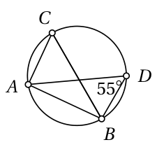

<small>

* answer:35°
* questionType:ShortAnswer

</small>

## Lahendus

Piirdenurkade omaduse põhjal $\angle ACB = \angle ADB = 55^\circ$. Thalese teoreemi põhjal $\angle BAC = 90^\circ$, mistõttu $\angle ABC = 90^\circ - 55^\circ = 35^\circ$.

# <lo-sample/> EE.PK.2020TEST.9.7

Joonisel on kahe ühise keskpunktiga ringi sektorid, mille kesknurkade vastavad haarad ühtivad. Ringide raadiused erinevad $2$ korda. Kui suur osa suurema sektori pindalast asub väljaspool väiksemat sektorit?

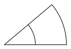

<small>

* answer:75%
* questionType:ShortAnswer

</small>

## Lahendus

Sektorid on sarnased teguriga $2$, mistõttu nende pindalad erinevad $4$ korda. Suurema sektori osa, mis jääb väiksemast väljapoole, on seega $3$ korda suurema pindalaga kui väiksem sektor. Kokkuvõttes moodustab suurema sektori osa, mis jääb väiksemast väljapoole, suuremast sektorist $\frac{3}{4}$.

# <lo-sample/> EE.PK.2020TEST.9.8

Järjestikused kiirel $AB$ märgitud punktid on teineteisest kaugusel $1$ cm. Igat märgitud punkti läbiv murdjoon algab punktist $A$ ja lõpeb punktis $C$, mis asub kiirel $AB$ punktist $A$ kaugusel $2020$ cm. Mitu lüli on sel murdjoonel, kui on teada, et joonisel esitatud algusosa kordub tsükliliselt?

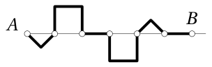

<small>

* answer:4041
* questionType:ShortAnswer

</small>

## Lahendus

Punktide $A$ ja $B$ vaheline kaugus on $6$ cm, murdjoone algusosas punktide $A$ ja $B$ vahel on $12$ lüli. Et $2020 = 6 \cdot 336 + 4$, mahub punktide $A$ ja $C$ vahele $336$ sellist täispikka juppi. Üle jääb $4$ cm pikkune lõik täpselt $9$ lüliga. Seega on murdjoonel kokku $12 \cdot 336 + 9$ ehk $4041$ lüli.

# <lo-sample/> EE.PK.2020TEST.9.9

Kahel ruudul küljepikkustega vastavalt $2$ cm ja $5$ cm on täpselt üks ühine punkt ja vastavad küljed samasihilised. Punktid $A$ ja $B$ on väiksema ruudu külgede keskpunktid. Leia sirge $AB$ poolt suuremast ruudust eraldatud kolmnurga (joonisel tumedaks värvitud) täpne pindala.

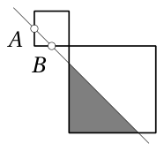

<small>

* answer:8 cm^2
* questionType:ShortAnswer

</small>

## Lahendus

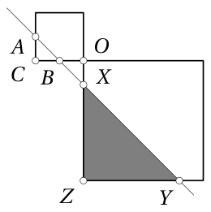

Olgu ruutude ühine punkt $O$ ning punktide $A$ ja $B$ vahele jääv väikse ruudu tipp $C$. Olgu sirge $AB$ lõikepunktid suure ruudu külgedega $X$ ja $Y$ ning nende punktide vahele jääv suure ruudu tipp $Z$ (joonis 4). Et $A$ ja $B$ on ruudu külgede keskpunktid, siis $|AC| = |BC|$. Seega $ABC$ on võrdhaarne täisnurkne kolmnurk, millest tulenevalt $\angle CAB = 45^\circ$. Et ruutude vastavad küljed on samasihilised, siis ka $\angle BXO = \angle ZXY = 45^\circ$. Seega ka $BXO$ ja $ZXY$ on võrdhaarsed täisnurksed kolmnurgad. Kuna $|OC| = 2$ cm ja $B$ on külje $OC$ keskpunkt, siis $|OB| = |OX| = 1$ cm. Et samas $|OZ| = 5$ cm, siis $|XZ| = |YZ| = 4$ cm. Seega kolmnurga $XYZ$ pindala on $\frac{1}{2}\cdot 4 \cdot 4$ ehk $8$ ruutsentimeetrit.

# <lo-sample/> EE.PK.2020TEST.9.10

Kolm ühesuurust ruudukujulist raami on ühendatud nii, nagu joonisel näidatud.

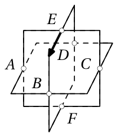

Märgitud punktidest $A$, $B$, $C$, $D$, $E$ ja $F$ igaüks on mingi kahe raami külgede ühine keskpunkt. Alustades punktist $E$ noolega näidatud suunas, liigub sitikas mööda raami välisserva kuni esimese ettetuleva märgitud punktini ja pöördub seal paremale. Jõudnud järgmise teeloleva märgitud punktini, pöördub ta vasakule. Sellest järgmises märgitud punktis liigub sitikas otse, edasi taas paremale, siis vasakule ja lõpuks veelkord vasakule. Millisesse märgitud punkti sitikas seejärel jõuab?

<small>

* answer:C
* questionType:ShortAnswer

</small>

## Lahendus

Sitika teekond on järgmine:

* punktist $E$ noole suunas, jõuab punkti $B$;
* punktist $B$ paremale, jõuab punkti $A$;
* punktist $A$ vasakule, jõuab punkti $F$;
* punktist $F$ otse, jõuab punkti $C$;
* punktist $C$ paremale, jõuab punkti $D$;
* punktist $D$ vasakule, jõuab punkti $E$;
* punktist $E$ vasakule, jõuab punkti $C$.
