# <lo-sample/> EE.PK.2021TEST.7.1

Arvuta:

$1 - 2 - (3 - 4 - (5 - 6 - (7 - 8))) =$

<small>

* answer:0
* questionType:ShortAnswer

</small>

## Lahendus

$1 - 2 - (3 - 4 - (5 - 6 - (7 - 8))) = 1 - (1 - (1 - 1)) = 1 - (1 - 0) = 1 - 1 = 0.$

# <lo-sample/> EE.PK.2021TEST.7.2

Arvuta:

$\frac{2021}{47} : \frac{43}{2021} - \frac{2020}{101} : \frac{20}{2020} =$

<small>

* answer:1
* questionType:ShortAnswer

</small>

## Lahendus

$\frac{2021}{47} : \frac{43}{2021} - \frac{2020}{101} : \frac{20}{2020} = \frac{2021^2}{47 \cdot 43} - \frac{2020^2}{101 \cdot 20} = \frac{2021^2}{2021} - \frac{2020^2}{2020} = 1.$

# <lo-sample/> EE.PK.2021TEST.7.3

Sõites Karjakülast Marjakülla, märkasid notsud rongi aknast teeviita „Marjakülla 66 km“. Läbinud rongiga veel 7 km, märkasid nad teist teeviita „Karjakülla 55 km“. Mitu kilomeetrit tuleb rongiga sõita, et jõuda Karjakülast Marjakülla?

<small>

* answer:114
* questionType:ShortAnswer

</small>

## Lahendus

Olgu Karjakülast Marjakülla $x$ km. Siis esimese teeviida kohal on läbitud $x - 66$ kilomeetrit ja veel $7$ kilomeetri läbimisel juba $x - 59$ kilomeetrit. Teise teeviida põhjal seega $x - 59 = 55$, kust $x = 114$.

# <lo-sample/> EE.PK.2021TEST.7.4

Leia vähim viiekohaline arv kujul *3*4*, mille numbrid on kõik erinevad ja mis jagub arvudega 3 ja 4. (Iga tärn tuleb asendada ühe numbriga.)

<small>

* answer:13248
* questionType:ShortAnswer

</small>

## Lahendus

Arv jagub 4-ga parajasti siis, kui tema kahest viimasest numbrist moodustatud arv jagub 4-ga. Seega üheliste number saab olla vaid 0 või 8, arvestades et numbrid ei tohi korduda.

Vähim võimalik kümnetuhandeliste number on 1. Vähim võimalik sajaliste number on 0, kuid sel juhul saaks üheliste number olla vaid 8, mis ei anna kokku 3-ga jaguvat arvu. Sajaliste number ei saa olla 1, kui kümnetuhandeliste number on 1. Suuruselt järgmine sajaliste number on 2. Proovimise teel leiame, et üheliste numbri 0 korral arv ei jagu 3-ga, kuid numbri 8 korral jagub.

# <lo-sample/> EE.PK.2021TEST.7.5

Mitme erineva naturaalarvuga saab korrutada arvu 202,1 nii, et tulemuseks on 4-kohaline naturaalarv?

<small>

* answer:4
* questionType:ShortAnswer

</small>

## Lahendus

Arvu 202,1 korrutamisel naturaalarvuliste teguritega tekib tulemusena naturaalarv ainult siis, kui tegur lõpeb nulliga. Seega samaväärne küsimus on, mitme erineva naturaalarvuga saab korrutada arvu 2021 nii, et tulemuseks on 4-kohaline naturaalarv. Sobivad tegurid 1, 2, 3 ja 4. Teguri 5 puhul on korrutis 5-kohaline, järelikult rohkem võimalusi ei ole.

# <lo-sample/> EE.PK.2021TEST.7.6

Tikkudest moodustatud kuusnurkade rea algus on näidatud joonisel.

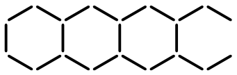

Kokku on kasutatud 2021 tikku. Mitu kuusnurka on reas?

<small>

* answer:404
* questionType:ShortAnswer

</small>

## Lahendus

Üks kuusnurk koosneb 6 tikust, kuid kahel järjestikusel kuusnurgal on ühine tikk. Seega iga kuusnurk sisaldab 5 unikaalset tikku, arvestades ühised tikud alati parempoolse kuusnurga koosseisu. Siis 2020 tikuga saab joonistada $\frac{2020}{5}$ ehk 404 kuusnurka, kusjuures viimasel kuusnurgal on parempoolne tikk puudu. Selle tühimiku täidab viimane tikk.

# <lo-sample/> EE.PK.2021TEST.7.7

Ruudu $ABCD$ tipust $C$ on tõmmatud lõik, mis moodustab nii diagonaaliga $BD$ kui ka küljega $AD$ nurga suurusega $\alpha$. Leia $\alpha$.

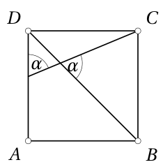

<small>

* answer:67,5°
* questionType:ShortAnswer

</small>

## Lahendus

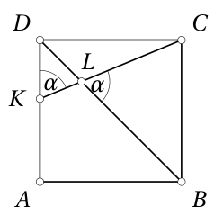

Ruudu diagonaal poolitab nurgad, seega $\angle ADB = 45^\circ$. Olgu tipust $C$ tõmmatud lõigu lõikepunktid küljega $AD$ ja diagonaaliga $BD$ vastavalt $K$ ja $L$ (joonis 1). Tippnurkadest saame $\angle KLD = \angle CLB = \alpha$. Kolmnurgast $DKL$ nüüd $45^\circ + 2\alpha = 180^\circ$, kust $\alpha = \frac{135^\circ}{2} = 67,5^\circ$.

# <lo-sample/> EE.PK.2021TEST.7.8

Punktid $A$, $B$, $C$ ja $D$ asuvad ühel sirgel.

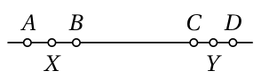

Punkt $X$ on lõigu $AB$ keskpunkt, punkt $Y$ aga lõigu $CD$ keskpunkt. Leia lõigu $XY$ pikkus, kui lõigu $AD$ pikkus on 21 cm ja lõigu $BC$ pikkus on 12 cm.

<small>

* answer:16,5 cm
* questionType:ShortAnswer

</small>

## Lahendus

Lõik $XY$ on lõigust $AD$ niisama palju lühem kui lõik $BC$ lõigust $XY$, sest üleminekul $AD \to XY \to BC$ lüheneb lõik kummaski otsas mõlemal sammul ühepalju. Seega lõigu $XY$ pikkus on lõikude $AD$ ja $BC$ pikkuste keskmine ehk $|XY| = \frac{|AD| + |BC|}{2} = 16,5$ cm.

# <lo-sample/> EE.PK.2021TEST.7.9

Kujund koosneb 8 ühesuurusest ruudust. Selle kujundi ümbermõõt on 9 cm. Leia selle kujundi pindala.

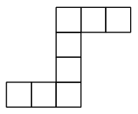

<small>

* answer:2 cm^2
* questionType:ShortAnswer

</small>

## Lahendus

Olgu ühe ruudu küljepikkus $a$. Siis kujundi ümbermõõt on $18a$. Niisiis $18a = 9$ cm, millest $a = \frac{1}{2}$ cm. Järelikult ühe ruudu pindala on $\frac{1}{4}\text{ cm}^2$ ja kujundi pindala $8 \cdot \frac{1}{4}\text{ cm}^2$ ehk $2\text{ cm}^2$.

# <lo-sample/> EE.PK.2021TEST.7.10

Joonisel on antud kuubi pinnalaotus, mille üks tipp on $A$ ja ülejäänud tipud on tähistatud arvudega 1 kuni 11. Milliste arvudega tähistatud tipud ühtivad tipuga $A$, kui see pinnalaotus kuubiks kokku voltida?

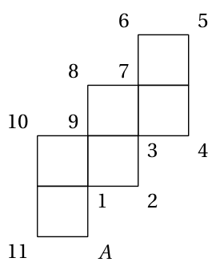

<small>

* answer:2 ja 4
* questionType:ShortAnswer

</small>

## Lahendus

Esimene voltimine tippu $A$ sisaldava tahuga toimub piki serva, mille ühes tipus on 1 ja teine tipp on tähistamata, järgmine voltimine aga piki serva, mille tippudes on 9 ja 1. See viib tipu $A$ kokku tipuga, milles on arv 2. Analoogselt jätkates saame selle tipu kokku viia ka tipuga, milles on arv 4. Et kuubi iga tipp kuulub kolmele tahule, siis rohkem pinnalaotuse tippe samasse kuubi tippu kokku sattuda ei saa.

# <lo-sample/> EE.PK.2021TEST.8.1

Arvuta:
$$\frac{20+20\cdot20-21\cdot21+21}{20^2+21^2}=$$

<small>

* answer:$0$
* questionType:ShortAnswer

</small>

## Lahendus

$$\frac{20+20\cdot20-21\cdot21+21}{20^2+21^2}=\frac{20(1+20)-21(21-1)}{20^2+21^2}=\frac{20\cdot21-21\cdot20}{20^2+21^2}=0.$$

# <lo-sample/> EE.PK.2021TEST.8.2

Leia arv, mis paikneb arvteljel arvude $\frac{1}{3}$ ja $\frac{1}{2}$ vahel ja on arvule $\frac{1}{3}$ kaks korda lähemal kui arvule $\frac{1}{2}$.

<small>

* answer:$\frac{7}{18}$
* questionType:ShortAnswer

</small>

## Lahendus

Arvu kirjeldusest saame võrrandi $\frac{1}{2}-x=2\left(x-\frac{1}{3}\right)$, mille lihtsustamisel saame $3x=\frac{1}{2}+\frac{2}{3}=\frac{7}{6}$, kust $x=\frac{7}{18}$.

# <lo-sample/> EE.PK.2021TEST.8.3

Leia $a-2b$, kui $3(4b-5)-2(3a+4)=1$.

<small>

* answer:$-4$
* questionType:ShortAnswer

</small>

## Lahendus

Antud võrdus $3(4b-5)-2(3a+4)=1$ lihtsustub kujule $12b-6a=24$, kus võrduse poolte jagamisel arvuga $-6$ saame $a-2b=-4$.

# <lo-sample/> EE.PK.2021TEST.8.4

Leia vähim algarv, mis on võrdne kolme erineva algarvu summaga.

<small>

* answer:$19$
* questionType:ShortAnswer

</small>

## Lahendus

Kolme erineva algarvu summa on ilmselt suurem kui ainus paaris algarv 2. Seega see summa on paaritu. Järelikult on kõik kolm liidetavat paaritud, sest ühe paaris ja kahe paaritu algarvu liitmisel tekiks paarisarv. Kolm vähimat paaritut algarvu 3, 5, 7 annavad summaks 15, mis pole algarv. Suuruselt järgmine summa tuleb, kui liidetava 7 asemel võtta järgmine algarv 11. Nüüd on summa 19, mis on algarv.

# <lo-sample/> EE.PK.2021TEST.8.5

Kahe T-särgi hinnad erinevad 20 euro võrra. Nende keskmine hind on 21 eurot. Kui palju maksab neist odavam T-särk?

<small>

* answer:$11$ eurot
* questionType:ShortAnswer

</small>

## Lahendus

Olgu odavama särgi hind $x$ eurot, siis kallima särgi hind on $x+20$ eurot. Saame võrrandi $\frac{x+(x+20)}{2}=21$, kust $x=11$.

# <lo-sample/> EE.PK.2021TEST.8.6

Kui suur osa kõikidest neljakohalistest arvudest, mille numbriteks on 2, 0, 2 ja 1, jagub arvuga 4?

<small>

* answer:$\frac{1}{3}$
* questionType:ShortAnswer

</small>

## Lahendus

Numbri 0 asukoha valikuks neljakohalises arvus on 3 võimalust, sest arv ei saa alata nulliga. Pärast seda on numbri 1 asukoha valikuks veel 3 võimalust. Sellega on antud numbritest moodustuv neljakohaline arv määratud, sest ülejäänud kohtadel peavad asuma numbrid 2. Kokkuvõttes on antud numbritest võimalik moodustada $3\cdot3$ ehk 9 erinevat neljakohalist arvu. Jagumaks arvuga 4, peab kahest viimasest numbrist moodustuv arv jaguma arvuga 4. Antud numbritest moodustatud sellised kahekohalised arvud on 12 ja 20. Esimesel juhul on kahe esimese numbri järjestus määratud, sest arv ei saa alata nulliga. Teisel juhul on kahe esimese numbri järjestuse valikuks 2 võimalust. Kokku saame 3 sobivat neljakohalist arvu. Nende osakaal kõigi moodustatavate neljakohaliste arvude seas on $\frac{3}{9}$ ehk $\frac{1}{3}$.

# <lo-sample/> EE.PK.2021TEST.8.7

Joonisel on märgitud viisnurga kolm täisnurka ja nurk suurusega $45^\circ$ ning kolme külje pikkused sentimeetrites. Leia tähega $x$ tähistatud külje pikkus.

<small>

* answer:$10,5$ cm
* questionType:ShortAnswer

</small>

## Lahendus

Pikendame külge pikkusega 4 sentimeetrit lõikumiseni küljega, mille pikkust küsitakse (joonis 2).

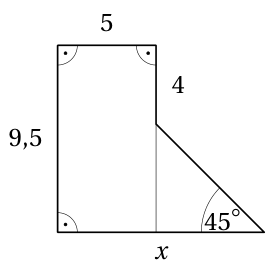

Joonis 2

Tekib ristkülik ja täisnurkne võrdhaarne kolmnurk, otsitav külg koosneb ristküliku lühemast küljest ja kolmnurga kaatetist. Ristküliku lühema külje pikkus on 5 sentimeetrit. Kolmnurga kaateti pikkus on $9,5-4$ ehk $5,5$ sentimeetrit. Seega otsitava külje pikkus on $5+5,5$ ehk $10,5$ sentimeetrit.

# <lo-sample/> EE.PK.2021TEST.8.8

Kolmnurga üks külgedest on jaotatud lõikudeks pikkustega 1 cm, 2 cm ja 3 cm. Leia tumedaks värvitud kolmnurga pindala, kui värvimata osade pindalade summa on $7\ \mathrm{cm}^2$.

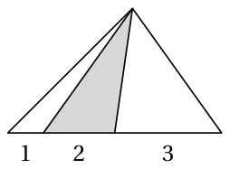

<small>

* answer:$3,5\ \mathrm{cm}^2$
* questionType:ShortAnswer

</small>

## Lahendus

Kahe värvimata kolmnurga aluste pikkuste summa on 4 cm ehk 2 korda suurem värvitud kolmnurga aluse pikkusest 2 cm. Et kõigil kolmel kolmnurgal on ühine kõrgus, on ka värvimata kolmnurkade pindalade summa 2 korda suurem kui värvitud kolmnurga pindala. Järelikult värvitud kolmnurga pindala on pool värvimata alade pindalade summast ehk $3,5\ \mathrm{cm}^2$.

# <lo-sample/> EE.PK.2021TEST.8.9

Kujund koosneb ruudust küljepikkusega 1 cm ja veerandringist raadiusega 1 cm. Leia tumedaks värvitud osa täpne pindala, kui nurga $ABC$ suurus on $60^\circ$.

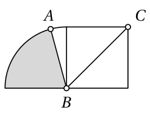

<small>

* answer:$\frac{5}{24}\pi\ \mathrm{cm}^2$
* questionType:ShortAnswer

</small>

## Lahendus

Nurk $ABC$ koosneb ruudu külje ja diagonaali vahelisest nurgast ning veerandringi värvimata sektori nurgast. Ruudu külje ja diagonaali vaheline nurk on $45^\circ$. Järelikult veerandringi värvimata sektori nurk on $15^\circ$. Värvitud sektori nurk on siis $75^\circ$. Sektori pindala on $\frac{75^\circ}{360^\circ}\cdot\pi\cdot1^2$ ehk $\frac{5}{24}\pi$ ruutsentimeetrit.

# <lo-sample/> EE.PK.2021TEST.8.10

Kuubi üks tippudest on $A$. Kuubi mistahes kolm tippu on mingi kolmnurga tippudeks. Kui palju on nende kolmnurkade seas selliseid, mille üks tipp on $A$ ning mis asuvad tervikuna kuubi mingil tahul?

<small>

* answer:$9$
* questionType:ShortAnswer

</small>

## Lahendus

Kuubi tahul, mille üks tipp on $A$, on veel 3 tippu. Nende seast kolmnurga 2 tipu valikuks on 3 võimalust. Tipp $A$ kuulub 3 tahule. Järelikult on otsitavaid kolmnurki $3\cdot3$ ehk 9 tükki.

# <lo-sample/> EE.PK.2021TEST.9.1

Leia $x + y$, kui $x=\frac{2021}{2020}+\frac{2020}{2021}+\frac{2021}{2022}$ ja $y=\frac{1}{2022}+\frac{1}{2021}-\frac{1}{2020}$.

<small>

* answer:3
* questionType:ShortAnswer

</small>

## Lahendus

$x + y = \frac{2021 - 1}{2020} + \frac{2020 + 1}{2021} + \frac{2021 + 1}{2022} = 1 + 1 + 1 = 3.$

# <lo-sample/> EE.PK.2021TEST.9.2

Arvude $m$ ja $n$ summa on 90 ning vahe on 4. Leia arvude $m$ ja $n$ korrutis.

<small>

* answer:2021
* questionType:ShortAnswer

</small>

## Lahendus

Süsteemi

$$
\begin{cases}
m + n = 90,\\
m - n = 4
\end{cases}
$$

lahend on $m = 47$, $n = 43$. Seega $mn = 47 \cdot 43 = 2021$.

# <lo-sample/> EE.PK.2021TEST.9.3

Leia arv $a$, kui $\frac{a}{b}=2$, $\frac{c}{a}=3$ ja $\frac{ab}{c}=4$.

<small>

* answer:24
* questionType:ShortAnswer

</small>

## Lahendus

Antud kolme võrduse vastavate poolte korrutamisel saame $\frac{a^2bc}{abc}=24$. Et $\frac{a^2bc}{abc}=a$, siis $a=24$.

# <lo-sample/> EE.PK.2021TEST.9.4

Arvu 260 kolm erinevat algtegurit kirjutatakse üksteise kõrvale nii, et moodustuks võimalikest suurim arv. Leia see arv.

<small>

* answer:5213
* questionType:ShortAnswer

</small>

## Lahendus

Arvu 260 kanooniline esitus on $2^2 \cdot 5 \cdot 13$. Suurima arvu moodustamiseks peab suurim number ehk 5 olema esimene. Ülejäänud tegurite järjestust varieerides saame kaks varianti 5213 ja 5132, millest esimene on suurem.

# <lo-sample/> EE.PK.2021TEST.9.5

Poes oli kampaania: ostes kaks täishinnaga T-särki, saad odavama poole hinnaga. Kampaania ajal osteti kaks täishinnaga T-särki ja nende eest tuli maksta kokku 40 eurot. Neist ühe täishind oli 24 eurot. Leia teise ostetud T-särgi täishind.

<small>

* answer:28 eurot
* questionType:ShortAnswer

</small>

## Lahendus

Kui särk hinnaga 24 eurot oleks kallim särk, siis oleks teise särgi täishind $(40 - 24) \cdot 2$ ehk 32 eurot. Kuid siis poleks särk hinnaga 24 eurot kallim särk. Seega särk hinnaga 24 eurot on odavam särk ning teise särgi täishind on $40 - \frac{24}{2}$ ehk 28 eurot.

# <lo-sample/> EE.PK.2021TEST.9.6

Korrapärase kolmnurga $KLM$ tipud $K$ ja $L$ asuvad ristküliku $ABCD$ vastaskülgedel $AB$ ja $CD$. Nurga $BKL$ suurus on $99^\circ$. Kui suur on joonisel tähega $\alpha$ märgitud nurk?

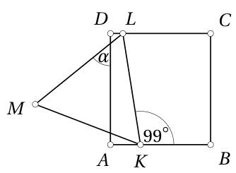

<small>

* answer:$51^\circ$
* questionType:ShortAnswer

</small>

## Lahendus

Olgu ristküliku külje $AD$ ja kolmnurga külje $LM$ lõikepunkt $Q$ (joonis 3). Põiknurkadest saame $\angle DLK = \angle BKL = 99^\circ$. Et võrdkülgse kolmnurga sisenurgad on suurusega $60^\circ$, siis $\angle QLD = 99^\circ - 60^\circ = 39^\circ$. Kolmnurgast $DLQ$ seega $\angle DQL = 180^\circ - 90^\circ - 39^\circ = 51^\circ$. Tippnurkade tõttu on niisama suur ka otsitav nurk.

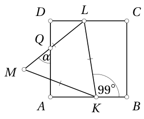

Joonis 3

# <lo-sample/> EE.PK.2021TEST.9.7

Arvteljel on märgitud arvude $a$, $b$ ja $c$ asukohad.

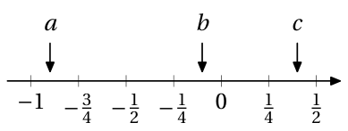

Järjesta avaldised $a + c$, $b - a$, $ab$ ja $\frac{a}{c}$ väärtuse järgi alates väikseimast.

<small>

* answer:$\frac{a}{c}$, $a+c$, $ab$, $b-a$
* questionType:ShortAnswer

</small>

## Lahendus

Et $0 < c < 1$ ja $a < 0$, siis $\frac{a}{c} < a$. Et $c > 0$, siis $a + c > a$. Kokkuvõttes $\frac{a}{c} < a + c$. Et $a < -\frac{1}{2}$ ja $c < \frac{1}{2}$, siis $a + c < 0$. Et samas $a < 0$ ja $b < 0$, siis $ab > 0$. Kokkuvõttes $a + c < ab$. Et $|a| < 1$ ja $|b| < \frac{1}{2}$, siis $ab < \frac{1}{2}$. Et aga $b > -\frac{1}{4}$ ja $a < -\frac{3}{4}$, siis $b - a > \frac{1}{2}$. Kokkuvõttes $ab < b - a$.

# <lo-sample/> EE.PK.2021TEST.9.8

Punktid $A$, $B$, $C$, $D$ ja $E$ asuvad ühel ringjoonel, kusjuures $\angle ABE = 30^\circ$, $\angle BEC = 50^\circ$ ja $\angle ECD = 25^\circ$. Sirged $AC$ ja $BD$ lõikuvad punktis $X$. Leia nurga $DXA$ suurus.

<small>

* answer:$105^\circ$
* questionType:ShortAnswer

</small>

## Lahendus

Kuna

$$
\angle XDC = \angle BDC = \angle BEC = 50^\circ,
$$

$$
\angle XCD = \angle ACD = \angle ACE + \angle ECD = \angle ABE + \angle ECD = 30^\circ + 25^\circ = 55^\circ,
$$

siis kolmnurgast $CDX$ saame $\angle CXD = 180^\circ - 50^\circ - 55^\circ = 75^\circ$. Järelikult $\angle DXA = 180^\circ - 75^\circ = 105^\circ$.

# <lo-sample/> EE.PK.2021TEST.9.9

Ruudu üks vastastippudest ühtib ringjoone keskpunktiga ja teine asub ringjoonel. Leia selle ruudu täpne pindala, kui ringi pindala on $22\pi\ \text{cm}^2$.

<small>

* answer:$11\ \text{cm}^2$
* questionType:ShortAnswer

</small>

## Lahendus

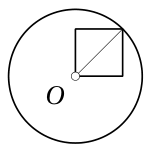

Joonis 4

Ringjoone raadius $r$ võrdub ruudu diagonaaliga (joonisel 4 on ringi keskpunkt märgitud kui $O$). Ringi pindala on $\pi r^2$ ja ruudu pindala $\frac{1}{2}r^2$. Et $\pi r^2 = 22\pi\ \text{cm}^2$, siis ruudu pindala on $22\pi\ \text{cm}^2 : \pi \cdot \frac{1}{2}$ ehk $11\ \text{cm}^2$.

# <lo-sample/> EE.PK.2021TEST.9.10

Kuubi üks tippudest on $A$. Kuubi mistahes kolm tippu on mingi kolmnurga tippudeks. Kui palju on nende kolmnurkade seas selliseid, mille üks tipp on $A$ ning mis ei asu tervikuna kuubi ühelgi tahul?

<small>

* answer:12
* questionType:ShortAnswer

</small>

## Lahendus

Kuubil on 8 tippu ehk peale $A$ veel 7 tippu. Võimalusi nende 7 tipu hulgast valida 2 kolmnurga tippu on 21. Ühel tahul on 4 tippu ehk peale $A$ veel 3 tippu. Võimalusi nende 3 tipu hulgast valida 2 kolmnurga tippu on 3. Tipp $A$ kuulub 3 tahule. Seega võimalusi valida 2 tippu, mis kuuluvad koos tipuga $A$ ühele ja samale tahule, on $3 \cdot 3$ ehk 9. Kolmnurki, kus kõik tipud ei kuulu ühele ja samale kuubi tahule, on järelikult $21 - 9$ ehk 12.
