# <lo-sample/> EE.PK.2022TEST.7.1

Сейчас время 20.45. Сколько будет времени ровно через 20 часов и 22 минуты?

<small>

* answer:17.07
* questionType:ShortAnswer

</small>

## Решение

20 часов — это на 4 часа меньше, чем сутки, значит ровно через 20 часов после времени 20.45 часы покажут 16.45. Ещё через 15 минут будет 17.00, значит через 22, то есть 15 + 7 минут, будет 17.07.

# <lo-sample/> EE.PK.2022TEST.7.2

Найти значение цифры $A$, при котором действует равенство

$$(\overline{AA}+\overline{AA}+1)\cdot A=\overline{AAA},$$

где $\overline{AA}$ двузначное и $\overline{AAA}$ трёхзначное натуральное число.

<small>

* answer:5
* questionType:ShortAnswer

</small>

## Решение

Так как $\overline{AA}=11\cdot A$ и $\overline{AAA}=111\cdot A$, получаем уравнение $(22\cdot A+1)\cdot A=111\cdot A$. Поскольку $A$ является первой цифрой числа, то $A\ne 0$, поэтому можем разделить на $A$ и получить равносильное уравнение $22\cdot A+1=111$. Отсюда $A=5$.

# <lo-sample/> EE.PK.2022TEST.7.3

Найти наименьшее положительное целое число, на которое число 20222022 не делится.

<small>

* answer:4
* questionType:ShortAnswer

</small>

## Решение

Любое число делится на 1. Так как число 20222022 оканчивается чётной цифрой 2, то это число делится на 2, а так как сумма цифр числа 20222022 равна $6\cdot 2$, что делится на 3, то это число делится на 3. Число 20222022 не делится на 4, потому что число 22, образованное двумя последними цифрами, не делится на 4 (при делении на 4 даёт остаток 2).

# <lo-sample/> EE.PK.2022TEST.7.4

В корзине на 15 помидоров больше, чем в мешке. Сколько помидоров нужно из корзины переложить в мешок так, чтобы в мешке оказалось на 7 помидоров больше, чем в корзине?

<small>

* answer:11
* questionType:ShortAnswer

</small>

## Решение

Сначала разность количества помидоров в корзине и в мешке равна 15, а в конце равна $-7$. Значит, разность нужно уменьшить на $15-(-7)$, то есть на 22. Перекладывание одного помидора из корзины в мешок уменьшает разность на 2, потому что количество помидоров в корзине уменьшается на 1, а количество помидоров в мешке увеличивается на 1. Значит, из корзины в мешок нужно переложить $\frac{22}{2}$, то есть 11 помидоров.

# <lo-sample/> EE.PK.2022TEST.7.5

Про четыре различных положительных целых числа $a$, $b$, $c$ и $d$ известно, что $c+b=4$, $a+d=7$ и $b+d=6$. Найти значение числа $a$.

<small>

* answer:2
* questionType:ShortAnswer

</small>

## Решение

Так как $c+b=4$, а слагаемые являются различными положительными целыми числами, то $b$ и $c$ — это 1 и 3 в некотором порядке. Поскольку $b+d=6$ и $b\ne d$, то $b\ne 3$. Следовательно, $b=1$ и $d=5$. Из равенства $a+d=7$ теперь получаем $a=2$.

# <lo-sample/> EE.PK.2022TEST.7.6

Равносторонний треугольник, периметр которого равен 27 см, поделён на равносторонний треугольник и четырёхугольник. Периметр полученного меньшего треугольника равен 18 см. Найти периметр полученного четырёхугольника.

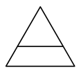

<small>

* answer:21 см
* questionType:ShortAnswer

</small>

## Решение

Так как периметр большого равностороннего треугольника равен 27 см, то длина его стороны равна трети этого, то есть 9 см. Аналогично получаем, что длина стороны маленького треугольника равна 6 см. Две стороны четырёхугольника совпадают соответственно со сторонами большого и маленького треугольников, а длина двух остальных сторон равна разности длин сторон большого и маленького треугольников, то есть 3 см. В итоге периметр четырёхугольника равен $9+6+3+3$, то есть 21 сантиметру.

# <lo-sample/> EE.PK.2022TEST.7.7

На стороне $CD$ прямоугольника $ABCD$ лежит точка $E$ так, что $\angle EAB = 45^\circ$ и $|EC| = 3$ см. Также известно, что $|BC| = 4$ см. Найти площадь прямоугольника $ABCD$.

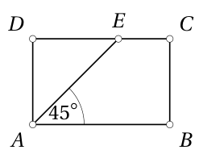

<small>

* answer:28 см²
* questionType:ShortAnswer

</small>

## Решение

Так как четырёхугольник $ABCD$ является прямоугольником, то $\angle BAD = \angle ADC = 90^\circ$. Следовательно, $\angle EAD = 90^\circ - 45^\circ = 45^\circ$. Из треугольника $ADE$ теперь можем вычислить $\angle AED = 180^\circ - 90^\circ - 45^\circ = 45^\circ = \angle EAD$. Значит, $|DE| = |DA|$. Так как $ABCD$ — прямоугольник, то $|DA| = |BC| = 4$ см. В итоге $|DE| = 4$ см, откуда $|CD| = |DE| + |EC| = 7$ см. Значит, площадь прямоугольника $ABCD$ равна $4\cdot 7$, то есть 28 квадратным сантиметрам.

# <lo-sample/> EE.PK.2022TEST.7.8

В круге проведены два диаметра, угол между которыми равен $40^\circ$. Найти наименьшее количество диаметров, которые необходимо дополнительно провести, чтобы все диаметры поделили круг на равные сектора.

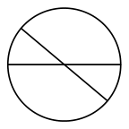

<small>

* answer:7
* questionType:ShortAnswer

</small>

## Решение

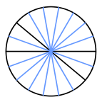

Рисунок 1

Круг нужно разделить на равные сектора, которые одновременно разделяют и данный сектор с углом $40^\circ$ на равные сектора. Значит, искомое разбиение вместе с каждым диаметром содержит и диаметр, повёрнутый на $40^\circ$. Тогда, кроме двух данных диаметров, должны быть ещё диаметры, повёрнутые на $80^\circ$, $120^\circ$, $160^\circ$, $200^\circ$, $240^\circ$, $280^\circ$ и $320^\circ$, всего 7 диаметров. Остаётся заметить, что полученные диаметры все различны, потому что среди них нет двух, которые были бы повёрнуты друг относительно друга на $180^\circ$. Вместе они делят круг на сектора, угол которых равен $20^\circ$ (на рисунке 1 синим отмечены новые диаметры).

# <lo-sample/> EE.PK.2022TEST.7.9

Нужно выбрать одно яблоко, одну грушу и один перец. Каждый плод может быть красного, жёлтого или зелёного цвета. Среди выбранных плодов:

1) должен быть хотя бы один жёлтого цвета;

2) не должно быть красного перца, жёлтого яблока, зелёного яблока и зелёной груши.

Сколько всего различных возможностей для выбора плодов? Две возможности считаются различными, если они отличаются цветом хотя бы одного выбранного плода.

<small>

* answer:3
* questionType:ShortAnswer

</small>

## Решение

Так как жёлтого и зелёного яблока быть не должно, то нужно выбрать красное яблоко. Далее есть две возможности.

* Если выбирается хотя бы один зелёный плод, то перец должен быть зелёным, потому что другие плоды по условию 2 зелёными быть не могут. Так как ни яблоко, ни перец не являются жёлтыми, то для выполнения условия 1 груша должна быть жёлтой. Здесь выбор единственный.
* Если не выбирается ни одного зелёного плода, то перец должен быть жёлтым, а груша может быть красной или жёлтой, что даёт 2 возможности выбора.

Значит, всего есть $1+2$, то есть 3 возможности выполнить условия.

# <lo-sample/> EE.PK.2022TEST.7.10

Тело на рисунке получили склеиванием некоторых граней трёх одинаковых кубиков. На сколько количество рёбер в полученном теле больше количества граней?

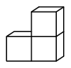

<small>

* answer:10
* questionType:ShortAnswer

</small>

## Решение

У данного тела столько же прямоугольных граней, сколько рёбер у фигуры, составленной из трёх квадратов, то есть 6, кроме того есть 2 основания, всего 8. У данного тела $3\cdot 6$, то есть 18 рёбер. Значит, рёбер на $18-8$, то есть на 10 больше.

# <lo-sample/> EE.PK.2022TEST.8.1

Вычислить:
$$\frac{202,2}{2,021}\cdot\frac{202,1}{20,22}$$

<small>

* answer:1000
* questionType:ShortAnswer

</small>

## Решение

Заметим, что
$$\frac{202,2}{2,021}\cdot\frac{202,1}{20,22}=\frac{202,2\cdot 202,1}{2,021\cdot 20,22}=\frac{202,1\cdot 202,2}{2,021\cdot 20,22}=\frac{202,1}{2,021}\cdot\frac{202,2}{20,22}=100\cdot 10=1000.$$

# <lo-sample/> EE.PK.2022TEST.8.2

Найти сумму цифр $A$ и $B$, если действует равенство $\overline{AAAA}=\overline{AA}\cdot\overline{ABA}$, где $\overline{AA}$ двузначное, $\overline{ABA}$ трёхзначное и $\overline{AAAA}$ четырёхзначное натуральное число.

<small>

* answer:1
* questionType:ShortAnswer

</small>

## Решение

Так как $\overline{AA}=11\cdot A$, $\overline{ABA}=101\cdot A+10\cdot B$ и $\overline{AAAA}=1111\cdot A$, получаем уравнение $1111\cdot A=11\cdot A\cdot(101\cdot A+10\cdot B)$. Поскольку $A$ является первой цифрой числа, то $A\ne 0$, поэтому, разделив на $11\cdot A$, получаем равносильное уравнение $101=101\cdot A+10\cdot B$. Если $A>1$ или $B>0$, то очевидно $101\cdot A+10\cdot B>101$. Следовательно, единственная возможность: $A=1$ и $B=0$, откуда $A+B=1$.

# <lo-sample/> EE.PK.2022TEST.8.3

Найти наименьшее простое число, которое не может оказаться делителем пятизначного числа $20X22$ ни при каком значении цифры $X$.

<small>

* answer:5
* questionType:ShortAnswer

</small>

## Решение

Так как $20X22$ оканчивается чётной цифрой $2$ независимо от выбора цифры $X$, то простое число $2$ всегда является делителем числа $20X22$. Выбрав, например, $X=0$, получаем, что число $20X22$ делится на простое число $3$, поскольку сумма цифр этого числа $6$ делится на $3$. Следующее простое число $5$ не может быть делителем числа $20X22$ ни при каком $X$, так как независимо от выбора $X$ это число оканчивается цифрой $2$, которая не делится на $5$.

# <lo-sample/> EE.PK.2022TEST.8.4

Известно, что $250$ миллилитров манной крупы весит $0,2$ килограмма. Сколько граммов весит $0,4$ литра манной крупы?

<small>

* answer:320
* questionType:ShortAnswer

</small>

## Решение

Так как $250$ миллилитров манной крупы весит $0,2$ килограмма, то есть $200$ граммов, а $0,4$ литра, то есть $400$ миллилитров, в $\frac{400}{250}$, то есть в $\frac{8}{5}$ раза больше, чем $250$ миллилитров, то $0,4$ литра манной крупы весит $200\cdot\frac{8}{5}$, то есть $320$ граммов.

# <lo-sample/> EE.PK.2022TEST.8.5

Даны два положительных числа $a$ и $b$. Число $a$ составляет $60\%$ от числа $b$. Если вычесть из большего данного числа меньшее, то в результате получится число, которое на $60$ меньше числа $a$. Найти значение числа $a$.

<small>

* answer:180
* questionType:ShortAnswer

</small>

## Решение

Так как положительное число $a$ составляет $60\%$ от числа $b$, то число $b$ больше числа $a$ и $a=0,6b$. Из условий задачи получаем уравнение $b-0,6b=0,6b-60$. Это уравнение упрощается до вида $0,2b=60$, откуда $b=300$. Следовательно, $a=0,6\cdot 300=180$.

# <lo-sample/> EE.PK.2022TEST.8.6

На рисунке большой квадрат поделён на два меньших квадрата, периметры которых равны $20$ см и $12$ см, а также на закрашенную в тёмный цвет фигуру. Найти периметр закрашенной в тёмный цвет фигуры.

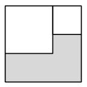

<small>

* answer:26 см
* questionType:ShortAnswer

</small>

## Решение

У квадратов с периметрами $20$ см и $12$ см длины сторон соответственно равны $5$ см и $3$ см. Следовательно, длина стороны большого квадрата равна $8$ см. Поэтому периметр закрашенной в тёмный цвет фигуры равен $2\cdot(8+(8-3))$, то есть $26$ сантиметрам.

# <lo-sample/> EE.PK.2022TEST.8.7

На стороне $CD$ прямоугольника $ABCD$ лежит точка $E$ так, что $\angle EAD=47^\circ$ и $\angle AEB=92^\circ$. Также известно, что $|AD|=7$ см. Найти площадь треугольника $BCE$.

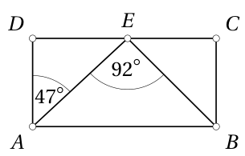

<small>

* answer:$24,5\ \text{см}^2$
* questionType:ShortAnswer

</small>

## Решение

Поскольку $ABCD$ — прямоугольник, то $|BC|=|AD|=7$ см и $\angle ADE=\angle ECB=90^\circ$. Из треугольника $ADE$ получаем $\angle AED=180^\circ-90^\circ-47^\circ=43^\circ$, откуда следует, что $\angle BEC=180^\circ-92^\circ-43^\circ=45^\circ$. Из треугольника $BCE$ теперь получаем $\angle EBC=180^\circ-90^\circ-45^\circ=45^\circ=\angle BEC$. Следовательно, $|EC|=|BC|=7$ см. Площадь треугольника $BCE$ равна $\frac{7\cdot 7}{2}$, то есть $24,5$ квадратного сантиметра.

# <lo-sample/> EE.PK.2022TEST.8.8

Две окружности имеют общий центр, а их радиусы равны $3$ см и $2$ см. Площадь части сектора, которая закрашена в тёмный цвет, равняется $\pi$ см$^2$. Найти величину угла этого сектора.

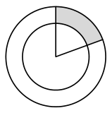

<small>

* answer:$72^\circ$
* questionType:ShortAnswer

</small>

## Решение

Пусть величина угла сектора равна $\alpha$. Площадь сектора большей окружности равна $\frac{\alpha}{360^\circ}\cdot\pi\cdot 3^2$, а площадь сектора меньшей окружности — $\frac{\alpha}{360^\circ}\cdot\pi\cdot 2^2$ квадратных сантиметров. Площадь закрашенной в тёмный цвет части равна разности этих площадей. Отсюда $\frac{\alpha}{360^\circ}\cdot\pi\cdot(3^2-2^2)=\pi$, откуда $\alpha=\frac{360^\circ}{5}=72^\circ$.

# <lo-sample/> EE.PK.2022TEST.8.9

Сколько всего трёхзначных чисел, которые делятся на число $4$ и последняя цифра которых также равна $4$?

<small>

* answer:45
* questionType:ShortAnswer

</small>

## Решение

Число делится на $4$ тогда и только тогда, когда число, образованное двумя его последними цифрами, делится на $4$. Из таких чисел на $4$ оканчиваются $04$, $24$, $44$, $64$ и $84$, а остальные, то есть $14$, $34$, $54$, $74$ и $94$, не делятся на $4$. Следовательно, для каждой цифры сотен существует ровно $5$ трёхзначных чисел с требуемым свойством. Всего их, следовательно, $9\cdot 5$, то есть $45$.

# <lo-sample/> EE.PK.2022TEST.8.10

Тело получили склеиванием некоторых граней четырёх одинаковых кубиков так, что склеенные грани целиком совпадают. На рисунке показан вид спереди этого тела. Найти количество граней этого тела.

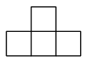

<small>

* answer:10
* questionType:ShortAnswer

</small>

## Решение

Кроме $2$ граней основания, у тела столько же боковых граней, сколько рёбер у основания, то есть $8$. Следовательно, у тела всего $10$ граней.

# <lo-sample/> EE.PK.2022TEST.9.1

Найти значение числа $x$ из равенства $\frac{1}{2}-\frac{3}{4}+\frac{x}{6}=\frac{3}{2}+\frac{5}{4}-\frac{7}{6}$.

<small>

* answer:11
* questionType:ShortAnswer

</small>

## Решение

Перенеся члены $\frac{1}{2}$ и $-\frac{3}{4}$ вправо, получим $\frac{x}{6}=\frac{2}{2}+\frac{8}{4}-\frac{7}{6}=3-\frac{7}{6}=\frac{11}{6}$. Следовательно, $x=11$.

# <lo-sample/> EE.PK.2022TEST.9.2

Найти сумму цифр $A$ и $B$, если действует равенство $\overline{BA}\cdot B\cdot A=\overline{AAA}$, где $\overline{BA}$ двузначное и $\overline{AAA}$ трёхзначное натуральное число.

<small>

* answer:10
* questionType:ShortAnswer

</small>

## Решение

Так как $\overline{AAA}=111\cdot A$, получим уравнение $\overline{BA}\cdot B\cdot A=111\cdot A$. Поскольку $A$ является первой цифрой числа, то $A\ne0$. Поэтому, разделив на величину $A$, получим равносильное уравнение $\overline{BA}\cdot B=111$. Единственные делители числа 111 — это $1,3,37,111$, так как $111=3\cdot37$, где множители являются простыми числами. Следовательно, $\overline{BA}=37$, откуда $A=7$ и $B=3$. Значит, $A+B=10$.

# <lo-sample/> EE.PK.2022TEST.9.3

Сколько всего таких двузначных натуральных чисел, у которых все множители, большие числа 1, чётные?

<small>

* answer:3
* questionType:ShortAnswer

</small>

## Решение

Искомые числа — это в точности степени 2, так как у других натуральных чисел есть нечётный простой множитель. Двузначные степени 2 — это 16, 32 и 64, всего 3 числа.

# <lo-sample/> EE.PK.2022TEST.9.4

Среди всех участников школьного спортивного дня мальчиков было $52\%$, а девочек было на 6 меньше, чем мальчиков. Сколько всего было участников на этом спортивном дне?

<small>

* answer:150
* questionType:ShortAnswer

</small>

## Решение

Так как мальчики составляли $52\%$ участников, то девочки составляли $48\%$ участников. Разность количеств мальчиков и девочек, следовательно, составляет $52\%-48\%$, то есть $4\%$ от числа всех участников. Так как эта разность равна 6, то всего участников было $6\cdot\frac{100\%}{4\%}$, то есть 150.

# <lo-sample/> EE.PK.2022TEST.9.5

Произведение $ab$ положительных чисел $a$ и $b$ в четыре раза больше частного $\frac{a}{b}$ и в четыре раза меньше частного $\frac{b}{a}$. Найти сумму чисел $a$ и $b$.

<small>

* answer:2,5
* questionType:ShortAnswer

</small>

## Решение

По условиям задачи $ab=4\cdot\frac{a}{b}$, откуда $b^2=4$, то есть $b=2$. Также получим $ab=\frac{b}{a}:4$, откуда $a^2=\frac{1}{4}$, то есть $a=\frac{1}{2}$. Итак, $a+b=2+\frac{1}{2}=2,5$.

# <lo-sample/> EE.PK.2022TEST.9.6

Точки $B$ и $C$ соответственно лежат на параллельных прямых $s$ и $t$. Величина угла $BAC$ равна $96^\circ$. Найти величину острого угла между прямыми $AC$ и $t$, если известно, что эта величина в три раза больше величины острого угла между прямыми $AB$ и $s$.

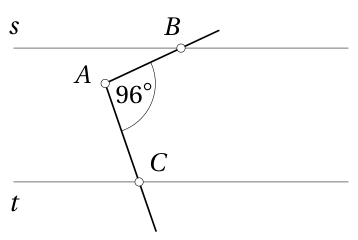

<small>

* answer:72°
* questionType:ShortAnswer

</small>

## Решение

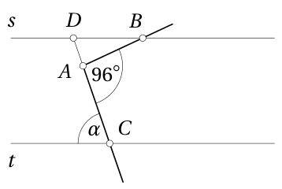

Рисунок 2

Пусть величина острого угла между прямой $AC$ и прямой $t$ равна $\alpha$. Продлим отрезок $AC$ за точку $A$ до прямой $s$, пусть соответствующая точка пересечения будет $D$ (рисунок 2). Из накрест лежащих углов получим $\angle BDA=\alpha$. Величина внешнего угла при вершине $A$ треугольника $ABD$ равна $96^\circ$, а величины внутренних углов при вершинах $B$ и $D$ соответственно равны $\frac{\alpha}{3}$ и $\alpha$. Следовательно, $96^\circ=\frac{\alpha}{3}+\alpha=\frac{4}{3}\alpha$, откуда $\alpha=72^\circ$.

# <lo-sample/> EE.PK.2022TEST.9.7

В полукруг, радиус которого равен 6 см, вписан прямоугольник, большая сторона которого лежит на диаметре и две вершины которого лежат на полуокружности. Одна сторона прямоугольника в два раза длиннее другой. Найти площадь прямоугольника.

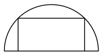

<small>

* answer:36 см^2
* questionType:ShortAnswer

</small>

## Решение

Пусть центр полуокружности — точка $O$. Так как большая сторона прямоугольника в 2 раза длиннее меньшей стороны, прямоугольник можно разделить на два квадрата, длина стороны которых равна длине меньшей стороны прямоугольника (рисунок 3). В силу симметрии одна общая вершина квадратов находится в точке $O$. Следовательно, длина диагонали каждого квадрата равна радиусу полуокружности, то есть 6 см. Значит, площадь прямоугольника равна $2\cdot\frac{1}{2}\cdot6^2$, то есть 36 квадратных сантиметров.

Рисунок 3

# <lo-sample/> EE.PK.2022TEST.9.8

Равносторонний треугольник поделили на равносторонний треугольник и четырёхугольник так, что периметры обеих меньших фигур были равны 15 см. Найти периметр большего треугольника.

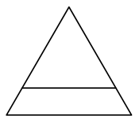

<small>

* answer:20 см
* questionType:ShortAnswer

</small>

## Решение

Так как периметр маленького равностороннего треугольника равен 15 см, длина стороны маленького треугольника составляет треть от этого, то есть 5 см. Поскольку маленький треугольник и четырёхугольник имеют одинаковый периметр и у этих фигур есть общая сторона, длина которой равна длине стороны маленького треугольника, то часть границы четырёхугольника, совпадающая с границей большого треугольника, имеет такую же длину, как две оставшиеся стороны маленького треугольника вместе. Следовательно, периметр большого треугольника равен $2\cdot2\cdot5$, то есть 20 сантиметров.

# <lo-sample/> EE.PK.2022TEST.9.9

Сколькими различными способами можно добавить ровно две запятые между цифрами чисел, представленных в выражении $\frac{2022}{2021}\cdot\frac{2021}{2022}$, так, чтобы значением выражения оказалось число 100?

<small>

* answer:5
* questionType:ShortAnswer

</small>

## Решение

Так как $\frac{2022}{2021}\cdot\frac{2021}{2022}=1$, то с помощью запятых нужно увеличить значение выражения ровно в 100 раз. Запятые должны быть в разных числах. Если бы оба числа с запятой были в числителях, то значение выражения стало бы меньше.

Если обе запятые находятся в знаменателях, то к значению выражения добавляется столько нулей, сколько всего цифр после запятых. Следовательно, после запятых должно быть всего 2 цифры, чего можно достичь только 1 способом, поставив запятую перед последней цифрой каждого знаменателя. Если одна запятая находится в числителе, а другая в знаменателе, то запятая в знаменателе должна отделять справа на 2 цифры больше, чем запятая в числителе. Это возможно только так, что запятая в числителе стоит перед последней цифрой, а запятая в знаменателе стоит после первой цифры. Так как числителей 2 и знаменателей тоже 2, то для такой постановки запятых есть $2\cdot2$, то есть 4 возможности. Всего требуемых способов расстановки запятых $1+4$, то есть 5.

# <lo-sample/> EE.PK.2022TEST.9.10

Тело получили склеиванием некоторых граней пяти одинаковых кубиков так, что склеенные грани целиком совпадают. На рисунке показан вид спереди этого тела. На сколько количество вершин в полученном теле больше количества граней?

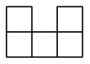

<small>

* answer:6
* questionType:ShortAnswer

</small>

## Решение

Помимо 2 оснований, у тела столько же боковых граней, сколько у основания рёбер, то есть 8. Следовательно, всего у тела 10 граней. Вершинами тела являются в точности вершины обоих оснований, которых всего $2\cdot8$, то есть 16. Разность количества вершин и граней равна $16-10$, то есть 6.
