# <lo-sample/> EE.PK.2023TEST.7.1

Arvuta: $1248 \cdot 12 : 48 =$ 

<small>

* answer:312
* questionType:ShortAnswer

</small>

## Lahendus

Kuna $12 : 48 = \frac{1}{4}$, siis $1248 \cdot 12 : 48 = \frac{1248}{4} = 312$.

# <lo-sample/> EE.PK.2023TEST.7.2

Leia vähim naturaalarv $a$, mille numbrite summa on 20 ning mille korral arv $a + 7$ jagub arvuga 5.

<small>

* answer:398
* questionType:ShortAnswer

</small>

## Lahendus

*Lahendus 1.* Arv jagub arvuga 5 parajasti siis, kui tema viimane number on kas 0 või 5. Seega lõpeb arv $a$ kas numbriga 3 või numbriga 8. Lõpunumbri 3 korral on ülejäänud numbrite summa 17 ning vähim selline arvudest on 893. Lõpunumbri 8 korral on ülejäänud numbrite summa 12 ja vähim selline arv oleks 398. Kuna see on varem leitud arvust väiksem, siis 398 ongi otsitav.

*Lahendus 2.* Naturaalarvudest, mis on väiksemad kui 300, on arvul 299 numbrite summa suurim ja see on 20. Kuid arv $299 + 7$ ei jagu arvuga 5. Arvudest 300 kuni 399 on numbrite summa 20 arvudel 389 ja 398, kuid arv $389 + 7$ ei jagu arvuga 5. Arv $398 + 7$ aga jagub arvuga 5, mistõttu otsitav arv on 398.

# <lo-sample/> EE.PK.2023TEST.7.3

Leia arv $a + 2b - 3c$, kui arv $a$ on 2 võrra väiksem arvust $b$ ja 3 võrra väiksem arvust $c$.

<small>

* answer:-5
* questionType:ShortAnswer

</small>

## Lahendus

Tingimuste põhjal $b = a + 2$ ja $c = a + 3$. Seega

$$
a + 2b - 3c = a + 2(a + 2) - 3(a + 3) = a + 2a + 4 - 3a - 9 = 4 - 9 = -5.
$$

# <lo-sample/> EE.PK.2023TEST.7.4

Reas on kolm korvi, milles on kokku 50 õuna. Kahes vasakpoolseimas korvis on kokku 40 õuna ja kahes parempoolseimas kokku 30 õuna. Mitu õuna on kahes äärmises korvis kokku?

<small>

* answer:30
* questionType:ShortAnswer

</small>

## Lahendus

Olgu kahes äärmises korvis kokku $x$ õuna. Siis $40 + 30 + x = 2 \cdot 50 = 100$ (iga korvi õunu on arvestatud topelt). Seega $x = 30$.

# <lo-sample/> EE.PK.2023TEST.7.5

Leia naturaalarv, mille ruut on sada korda suurem kui miljon.

<small>

* answer:10000
* questionType:ShortAnswer

</small>

## Lahendus

Sada on $10^2$, miljon on $10^6$. Otsitava arvu ruut on seega $10^2 \cdot 10^6$ ehk $10^8$. Arv ise on $10^4$ ehk 10000.

# <lo-sample/> EE.PK.2023TEST.7.6

Nelinurga $ABCD$ külgede $AD$, $DC$ ja $CB$ pikkused on võrdsed ning nurgad $ADC$ ja $DCB$ suurused on vastavalt $100^\circ$ ja $110^\circ$. Leia nelinurga $ABCD$ diagonaalide vahelise teravnurga suurus.

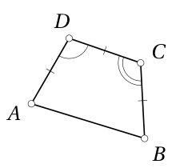

<small>

* answer:75°
* questionType:ShortAnswer

</small>

## Lahendus

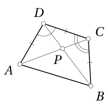

Joonis 1

Kuna $|AD| = |DC|$, siis $\angle DAC = \angle DCA = \frac{180^\circ - \angle ADC}{2} = 40^\circ$. Kuna $|DC| = |CB|$, siis $\angle CDB = \angle CBD = \frac{180^\circ - \angle DCB}{2} = 35^\circ$.

Olgu nelinurga $ABCD$ diagonaalide lõikepunkt $P$ (joonis 1). Eelneva põhjal $\angle DCP = 40^\circ$ ja $\angle CDP = 35^\circ$, mistõttu $\angle DPA = 40^\circ + 35^\circ = 75^\circ$. Kuna $75^\circ < 90^\circ$, siis $\angle DPA$ ongi nelinurga $ABCD$ diagonaalide vaheline teravnurk.

# <lo-sample/> EE.PK.2023TEST.7.7

Punkt $E$ ristküliku $ABCD$ küljel $BC$ valitakse nii, et nelinurga $ABED$ pindala on 7 korda suurem kolmnurga $ECD$ pindalast. Mitu korda on lõigu $BE$ pikkus suurem lõigu $EC$ pikkusest?

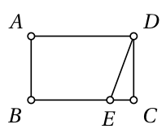

<small>

* answer:3
* questionType:ShortAnswer

</small>

## Lahendus

Olgu $F$ selline punkt küljel $AD$, et $EF \parallel CD$ (joonis 2). Siis $EFDC$ on samuti ristkülik. Seega $|EC| = |FD|$ ja $|EF| = |CD|$, mistõttu kolmnurgad $EFD$ ja $ECD$ on võrdse pindalaga. Paneme tähele, et kolmnurkade $EFD$ ja $ECD$ pindalade summa võrdub ristküliku $EFDC$ pindalaga.

Tähistame kujundi $K$ pindala $S_K$. Eelduse põhjal $S_{ABED} = 7 \cdot S_{ECD}$, millest tulenevalt

$$
\begin{aligned}
S_{ABEF} &= S_{ABED} - S_{EFD} = 7 \cdot S_{ECD} - S_{ECD} = 6 \cdot S_{ECD} = 3 \cdot 2 \cdot S_{ECD} \\
&= 3 \cdot (S_{ECD} + S_{EFD}) = 3 \cdot S_{EFDC}.
\end{aligned}
$$

Kuna $ABEF$ ja $EFDC$ on ristkülikud, mille kõrgused on võrdsed, siis nende pindalad suhtuvad nagu aluste pikkused ehk $BE$ ja $EC$. Seega eelneva põhjal $|BE| = 3 \cdot |EC|$.

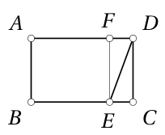

Joonis 2

# <lo-sample/> EE.PK.2023TEST.7.8

Mitu erinevat võimalust on arvus 2023 ühe numbri asendamiseks mõne teise numbriga nii, et saadud arv jaguks arvuga 3?

<small>

* answer:12
* questionType:ShortAnswer

</small>

## Lahendus

Arv jagub 3-ga parajasti siis, kui tema ristsumma jagub 3-ga. Arvu 2023 ristsumma on 7. Muutes arvu ühte numbrit, muutub ristsumma samavõrra samas suunas. Et saada 7 asemele 3-ga jaguv arv, tuleb teda kas vähendada 1, 4 või 7 võrra või suurendada 2 või 5 või 8 või jne võrra. Arvestades olemasolevaid numbreid, on võimalused järgmised:

* tuhandeliste numbrit vähendada 1 võrra või suurendada 2 või 5 võrra;
* sajaliste numbrit suurendada 2, 5 või 8 võrra;
* kümneliste numbrit vähendada 1 võrra või suurendada 2 või 5 võrra;
* üheliste numbrit vähendada 1 võrra või suurendada 2 või 5 võrra.

Kokku on võimalusi 12.

# <lo-sample/> EE.PK.2023TEST.7.9

On kahe pikkusega tikke: lühikesed ja pikad. Kuuest lühikesest ja kolmest pikast tikust moodustatakse joonisel olev rööpkülik. Leia rööpküliku ümbermõõt, kui pika tiku pikkus on 7 cm.

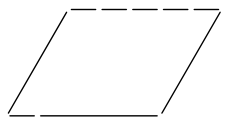

<small>

* answer:31,5 cm
* questionType:ShortAnswer

</small>

## Lahendus

Ülemisest ja alumisest küljest näeme, et pika tiku pikkus võrdub 4 lühikese tiku pikkusega. Seega rööpküliku ümbermõõt võrdub $6 \cdot 1 + 3 \cdot 4$ ehk 18 lühikese tiku pikkusega. Kuna pika tiku pikkus on 7 cm, on lühikese tiku pikkus $\frac{7}{4}$ cm. Kokkuvõttes on rööpküliku ümbermõõt $18 \cdot \frac{7}{4}$ cm ehk $\frac{63}{2}$ cm ehk 31,5 cm.

# <lo-sample/> EE.PK.2023TEST.7.10

Joonisel on antud üleni hallidest ja valgetest kuubikutest moodustatud kujundi pealtvaade.

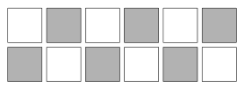

Ühe kuubiku saab kujundist ära võtta, kui tema vähemalt 3 tahku on nähtavad. Kõigi kuubikute alumised tahud asuvad ühel ja samal tasapinnal ning ei ole nähtavad. Milline on vähim arv valgeid kuubikuid, mis tuleb ära võtta selleks, et saaks ära võtta kõik hallid kuubikud?

<small>

* answer:2
* questionType:ShortAnswer

</small>

## Lahendus

Nurgapealsed mustad kuubikud saab kohe eemaldada. Kui seejärel ära võtta pildil alumise rea vasakpoolseim ja ülemise rea parempoolseim valge kuubik (joonisel 3 märgitud mummuga), siis saab eemaldada ka kõik ülejäänud mustad kuubikud. Seega piisab eemaldada 2 valget kuubikut.

Näitame, et ühe valge kuubiku eemaldamisest ei piisa. Nurgapealse valge kuubiku eemaldamine vabastaks ainult ühe musta kuubiku neljast, mida algseisus eemaldada ei saa, ning vasakult või paremalt teises veerus asuva valge kuubiku eemaldamine vabastaks kaks sellist musta kuubikut. Igal juhul jääks vähemalt kaks musta kuubikut eemaldamata.

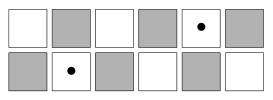

Joonis 3

# <lo-sample/> EE.PK.2023TEST.8.1

Esita taandumatu murruna: $\dfrac{7\cdot 88+8\cdot 77}{77\cdot 88}=$

<small>

* answer:$\frac{2}{11}$
* questionType:ShortAnswer

</small>

## Lahendus

$\dfrac{7\cdot 88+8\cdot 77}{77\cdot 88}=\dfrac{7\cdot 8\cdot 11+8\cdot 7\cdot 11}{7\cdot 11\cdot 8\cdot 11}=\dfrac{7\cdot 8\cdot 11\cdot 2}{7\cdot 8\cdot 11\cdot 11}=\dfrac{2}{11}$.

# <lo-sample/> EE.PK.2023TEST.8.2

Leia arvust 80 väiksem naturaalarv, millega arv 80 jagub, aga arv 120 ei jagu.

<small>

* answer:$16$
* questionType:ShortAnswer

</small>

## Lahendus

Antud arvude lahutused algtegureiks on $80=2^4\cdot 5$ ja $120=2^3\cdot 3\cdot 5$. Et arvu 80 tegur ei oleks arvu 120 tegur, peab ta sisaldama tegurit $2^4$. Arvu 80 sellised tegurid on $2^4$ ja $2^4\cdot 5$, kuid $2^4\cdot 5=80$. Seega ainus ülesande tingimusi rahuldav arv on $2^4$ ehk 16.

# <lo-sample/> EE.PK.2023TEST.8.3

Leia arv $x$, kui arvud $a$ ja $b$ on erinevad ning kehtib $ax-8b=bx-8a$.

<small>

* answer:$-8$
* questionType:ShortAnswer

</small>

## Lahendus

Antud võrdus on samaväärne võrdusega $(a-b)(8+x)=0$. Kuna $a\ne b$, siis $a-b\ne 0$. Järelikult $8+x=0$, kust $x=-8$.

# <lo-sample/> EE.PK.2023TEST.8.4

Annil on 3 korda rohkem komme kui Bennol. Bennol on 8 kommi vähem kui Annil. Mitu kommi on Annil ja Bennol kokku?

<small>

* answer:$16$
* questionType:ShortAnswer

</small>

## Lahendus

Olgu Anni ja Benno kommide arvud vastavalt $a$ ja $b$. Ülesande tingimuste kohaselt $a=3b$ ja $a-b=8$. Seega $3b-b=8$ ehk $2b=8$, kust $b=4$ ja $a=12$. Järelikult $a+b=16$ ehk Annil ja Bennol on kokku 16 kommi.

# <lo-sample/> EE.PK.2023TEST.8.5

Kolmest järjestikusest naturaalarvust keskmine annab arvuga 9 jagamisel jäägi 2. Millise jäägi annab nende kolme arvu korrutis jagamisel arvuga 9?

<small>

* answer:$6$
* questionType:ShortAnswer

</small>

## Lahendus

Kuna kolmest järjestikusest arvust keskmine annab 9-ga jagamisel jäägi 2, siis esimene arv annab jäägi 1 ja kolmas jäägi 3. Seega nende kolme arvu korrutis annab 9-ga jagamisel sama jäägi nagu arv $1\cdot 2\cdot 3$ ehk 6.

# <lo-sample/> EE.PK.2023TEST.8.6

Nürinurkse kolmnurga teravnurga poolitaja jaotab selle kolmnurga kaheks väiksemaks nürinurkseks kolmnurgaks, mille nürinurkade suurused on vastavalt $130^\circ$ ja $150^\circ$. Leia esialgse nürinurkse kolmnurga väikseima nurga suurus.

<small>

* answer:$10^\circ$
* questionType:ShortAnswer

</small>

## Lahendus

Kuna poolitatakse teravnurka, siis algse kolmnurga nürinurk leidub ka ühes kahest tekkivast kolmnurgast (joonis 4). Teises tekkivas kolmnurgas on nürinurk suurem, sest tema kõrvunurk on üks teravnurkadest esimeses tekkivas kolmnurgas. Seega esimeses tekkivas kolmnurgas on nürinurk suurusega $130^\circ$, üks teravnurk suurusega $180^\circ-150^\circ$ ehk $30^\circ$ ja teine teravnurk suurusega $180^\circ-130^\circ-30^\circ$ ehk $20^\circ$. Kuna viimane on pool algse kolmnurga teravnurgast, siis algse kolmnurga üks teravnurk on suurusega $2\cdot 20^\circ$ ehk $40^\circ$ ja teine teravnurk suurusega $180^\circ-130^\circ-40^\circ$ ehk $10^\circ$. Viimane ongi väikseim algse kolmnurga nurk.

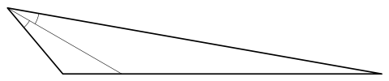

Joonis 4

# <lo-sample/> EE.PK.2023TEST.8.7

Ruut küljepikkusega 6 cm on külgedega paralleelsete lõikudega jaotatud 3 võrdseks osaks, mis on ruudu kahe diagonaaliga omakorda jaotatud osadeks. Leia halliks värvitud osa pindala.

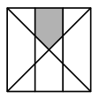

<small>

* answer:$5\ \mathrm{cm}^2$
* questionType:ShortAnswer

</small>

## Lahendus

*Lahendus 1.* Kuna ruut küljepikkusega 6 cm jaotatakse 3 võrdseks ristkülikuks, on iga ristküliku lühema külje pikkus 2 cm. Ruudu diagonaal on külgedega $45^\circ$ nurga all, mistõttu eraldab äärmistest ristkülikutest võrdhaarse täisnurkse kolmnurga.

Halliks värvitud osa saame, kui kahe diagonaali poolt eraldatud ülemisest veerandruudust eemaldame kummagi äärmise ristküliku otsast äralõigatud kolmnurga. Veerandruudu pindala on $\dfrac14\cdot 6^2\ \mathrm{cm}^2$ ehk $9\ \mathrm{cm}^2$, kummagi kolmnurga pindala on aga $\dfrac12\cdot 2^2\ \mathrm{cm}^2$ ehk $2\ \mathrm{cm}^2$. Seega värvitud osa pindala on $5\ \mathrm{cm}^2$.

*Lahendus 2.* Jaotame ruudu ka horisontaaljoontega kolmeks võrdseks ristkülikuks (joonis 5). Nii jaotub ruut 9 võrdseks ruuduks küljepikkusega 2 cm. Iga sellise ruudu pindala on $4\ \mathrm{cm}^2$. Halliks värvitud osa sisaldab ühe sellise ruudu tervenisti ja teisest ruudust veerandi. Seega halliks värvitud osa pindala on $5\ \mathrm{cm}^2$.

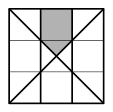

Joonis 5

# <lo-sample/> EE.PK.2023TEST.8.8

Mitu sellist neljakohalist naturaalarvu, mille numbrid on 2, 0, 2 ja 3 mingis järjekorras, saab moodustada?

<small>

* answer:$9$
* questionType:ShortAnswer

</small>

## Lahendus

Number 0 saab olla kolmel erineval kohal (tuhandeliste kohal ei saa). Olles valinud numbrile 0 koha, saab number 3 paikneda 3 erineval kohal (kõigil kohtadel peale selle, kus on 0). Nende valikutega on ka numbrite 2 kohad määratud. Seega kokku saab numbritest 2, 0, 2, 3 moodustada $3\cdot 3$ ehk 9 arvu.

# <lo-sample/> EE.PK.2023TEST.8.9

Traat pikkusega 12 cm lõigati 12 jupiks. Neist moodustati neljaks väiksemaks ristkülikuks jaotatud suur ristkülik. Leia suure ristküliku ümbermõõt.

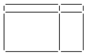

<small>

* answer:$8\ \mathrm{cm}$
* questionType:ShortAnswer

</small>

## Lahendus

Keskmine vertikaaljoon on niisama pikk kui ristküliku vertikaalne külg ning keskmine horisontaaljoon on niisama pikk kui ristküliku horisontaalne külg.

Seega ristküliku vertikaalsete külgede pikkuste summa moodustab $\dfrac23$ kõigi vertikaalsete traadijuppide pikkuste summast ning horisontaalsete külgede pikkuste summa moodustab $\dfrac23$ kõigi horisontaalsete traadijuppide pikkuste summast. Kokkuvõttes moodustab ristküliku kõigi nelja külje pikkuste summa $\dfrac23$ kõigi traadijuppide pikkuste summast 12 cm. Järelikult ristküliku ümbermõõt on 8 cm.

# <lo-sample/> EE.PK.2023TEST.8.10

Joonisel on antud üleni hallidest ja valgetest kuubikutest moodustatud kujundi pealtvaade.

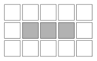

Ühe kuubiku saab kujundist ära võtta, kui tema vähemalt 3 tahku on nähtavad. Kõigi kuubikute alumised tahud asuvad ühel ja samal tasapinnal ning ei ole nähtavad. Milline on vähim arv valgeid kuubikuid, mis tuleb ära võtta selleks, et saaks ära võtta kõik hallid kuubikud?

<small>

* answer:$5$
* questionType:ShortAnswer

</small>

## Lahendus

Kui eemaldada üks nurgakuubik, tema kõrvalt lühema otsa keskmine kuubik ja pikemalt poolt kolm järjestikust kuubikut (joonisel 6 on märgitud eemaldatavad kuubikud järjekorranumbritega), saab eemaldada kõik hallid kuubikud. Seega piisab eemaldada 5 valget kuubikut.

Näitame, et väiksema arvu valgete kuubikute eemaldamisest ei piisa. Selleks, et hallidest kuubikutest esimesena eemaldada keskmine, peaks enne tema mõlemalt poolt eemaldama valge kuubiku, aga neist kummagi eemaldamiseks on vaja eemaldada veel kaks valget kuubikut. See teeb kokku 6 valget kuubikut. Seega optimaalse tegevuse korral eemaldataks hallidest kuubikutest esimesena otsmine. Sellise kuubiku eemaldamiseks on vaja enne eemaldada valge kuubik kahest küljest, mis omakorda eeldab ühe nurgapealse kuubiku eemaldamist. Seega esimese halli kuubiku eemaldamiseks on vaja eemaldada vähemalt 3 valget kuubikut. Kummagi ülejäänud halli kuubiku eemaldamiseks on vaja eemaldada veel üks valge kuubik. Seega on vaja kokku eemaldada 5 valget kuubikut.

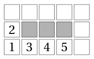

Joonis 6

# <lo-sample/> EE.PK.2023TEST.9.1

Arvuta: $1236 : (12 + 36) \cdot (12 - 36) =$.

<small>

* answer:$-618$
* questionType:ShortAnswer

</small>

## Lahendus

Kuna $12 + 36 = 48 = 2 \cdot 24$ ja $12 - 36 = -24$, siis

$$
1236 : (12 + 36) \cdot (12 - 36) = 1236 : (-2) = -618.
$$

# <lo-sample/> EE.PK.2023TEST.9.2

Leia vähim naturaalarv $n$, mille korral arv $97n + 8$ jagub arvuga 10.

<small>

* answer:$6$
* questionType:ShortAnswer

</small>

## Lahendus

Et arv jaguks 10-ga, peab ta lõppema numbriga 0. Seega arvu $97n$ lõpus peab olema number 2. Et see juhtuks, peab arvu $n$ lõpus olema number 6. Vähim niisugune naturaalarv on 6.

# <lo-sample/> EE.PK.2023TEST.9.3

Teada on, et $a = 2b$ ja $3b = 4c$, kus $a$, $b$ ja $c$ on nullist erinevad arvud. Leia arv $\frac{a + b}{c}$.

<small>

* answer:$4$
* questionType:ShortAnswer

</small>

## Lahendus

Kuna $a = 2b$, siis $a + b = 2b + b = 3b$. Nüüd kuna $3b = 4c$, siis

$$
\frac{a + b}{c} = \frac{4c}{c} = 4.
$$

# <lo-sample/> EE.PK.2023TEST.9.4

Kolme lauamängu A, B ja C hindade kohta on teada, et mängud B ja C maksavad kokku 50 eurot rohkem kui mäng A ning mängud A ja B maksavad kokku 60 eurot rohkem kui mäng C. Kui palju maksab mäng B?

<small>

* answer:55 eurot
* questionType:ShortAnswer

</small>

## Lahendus

Olgu mängude A, B ja C hinnad vastavalt $a$, $b$ ja $c$ eurot. Ülesande tingimustest saame $b + c - a = 50$ ja $a + b - c = 60$. Liites nende kahe võrduse vastavad pooled, saame $2b = 110$. Seega $b = 55$ ehk mäng B maksab 55 eurot.

# <lo-sample/> EE.PK.2023TEST.9.5

Kolm erinevat naturaalarvu $a$, $b$ ja $c$ annavad kõik arvuga 9 jagamisel jäägi 4. Millise jäägi annab korrutis $abc$ jagamisel arvuga 9?

<small>

* answer:$1$
* questionType:ShortAnswer

</small>

## Lahendus

Korrutis $abc$ annab 9-ga jagamisel sama jäägi nagu vastavate jääkide korrutis ehk $4 \cdot 4 \cdot 4$ ehk arv 64. Et $64 = 7 \cdot 9 + 1$, siis otsitav jääk on 1.

# <lo-sample/> EE.PK.2023TEST.9.6

Kui palju on arvust 2023 suuremaid neljakohalisi arve, mille numbrite summa on 7 ja milles on täpselt kaks numbrit 2?

<small>

* answer:$8$
* questionType:ShortAnswer

</small>

## Lahendus

Kuna nelja numbri summa on 7 ja sealhulgas kahe number 2 summa on 4, peab ülejäänud kahe numbri summa olema 3. Ilma number 2 kasutamata on see võimalik vaid juhul, kui üks number on 0 ja teine 3. Number 0 saab asuda kõigil kohtadel peale tuhandeliste. Olles ära paigutanud numbri 0, saab numbrit 3 paigutada 3 erinevale kohale. Sellega on kogu arv määratud. Seega on neist numbritest arvu koostamiseks $3 \cdot 3$ ehk 9 võimalust, kuid saadud arvudest vähim, 2023, ei sobi, sest küsitud on arvust 2023 suuremaid arve. Seega on otsitavaid arve 8.

# <lo-sample/> EE.PK.2023TEST.9.7

Sirged $a$ ja $b$ on paralleelsed, lõigud $CB$ ja $AB$ on võrdse pikkusega. Joonisel märgitud nurkade suuruste $\alpha$, $\beta$ ja $\gamma$ summa on $150^\circ$. Leia $\alpha$.

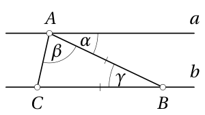

<small>

* answer:$40^\circ$
* questionType:ShortAnswer

</small>

## Lahendus

Kuna $|CB| = |AB|$, siis $\angle BCA = \angle CAB = \beta$. Seega $2\beta + \gamma = 180^\circ$. Sirgete $a$ ja $b$ paralleelsuse tõttu aga $\alpha = \gamma$, seega ülesande tingimuse põhjal $\beta + 2\gamma = 150^\circ$. Korrutades võrrandisüsteemi

$$
\begin{cases}
2\beta + \gamma = 180^\circ,\\
\beta + 2\gamma = 150^\circ
\end{cases}
$$

teise võrrandi pooled 2-ga ja lahutades esimese võrrandi vastavad pooled, saame $3\gamma = 120^\circ$, kust $\gamma = 40^\circ$. Seega ka $\alpha = 40^\circ$.

# <lo-sample/> EE.PK.2023TEST.9.8

Kolmnurga $ABC$ pindala on $16\ \text{cm}^2$. Leia halliks värvitud ala pindala, kui $AK$ on kolmnurga $ABC$ mediaan ja $LM$ on kolmnurga $ABC$ kesklõik.

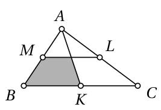

<small>

* answer:$6\ \text{cm}^2$
* questionType:ShortAnswer

</small>

## Lahendus

Kuna mediaan poolitab kolmnurga külje, kuid vastavale küljesihile tõmmatud kõrgus algses ja jaotamise teel saadud kolmnurgas on sama, siis mediaan poolitab ka kolmnurga pindala. Seega kolmnurga $ABK$ pindala on $\frac{1}{2} \cdot 16\ \text{cm}^2$ ehk $8\ \text{cm}^2$. Kiirteteoreemi põhjal poolitab kesklõik $ML$ ka mediaani $AK$; olgu sirgete $ML$ ja $AK$ lõikepunkt $P$ (joonis 7).

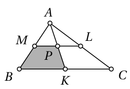

Siis kolmnurk $AMP$ on sarnane kolmnurgaga $ABK$ teguriga $\frac{1}{2}$. Seega kolmnurga $AMP$ pindala on $\frac{1}{4}$ kolmnurga $ABK$ pindalast ehk $\frac{1}{4} \cdot 8\ \text{cm}^2$ ehk $2\ \text{cm}^2$. Nelinurga $MBKP$ pindala on järelikult $6\ \text{cm}^2$.

# <lo-sample/> EE.PK.2023TEST.9.9

Ringist diameetritega $AB$ ja $CD$ ja keskpunktiga $O$ on välja lõigatud sektor $BOD$. Ringist alles jäänud osast moodustab halliks värvitud sektor $COA$ ühe viiendiku. Kui suure osa moodustab sektor $COA$ esialgsest ringist?

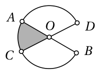

<small>

* answer:$\frac{1}{6}$
* questionType:ShortAnswer

</small>

## Lahendus

Ringist välja lõigatud sektor on niisama suur kui halliks värvitud sektor $COA$. Seega alles jäänud osa on 5 korda suurem kui väljalõigatud osa, millest tulenevalt on väljalõigatud osa $\frac{1}{6}$ kogu ringist. Järelikult ka sektor $COA$ moodustab $\frac{1}{6}$ esialgsest ringist.

# <lo-sample/> EE.PK.2023TEST.9.10

Joonisel on antud üleni hallidest ja valgetest kuubikutest moodustatud kujundi pealtvaade. Ühe kuubiku saab kujundist ära võtta, kui tema vähemalt 3 tahku on nähtavad. Kõigi kuubikute alumised tahud asuvad ühel ja samal tasapinnal ning ei ole nähtavad. Milline on vähim arv valgeid kuubikuid, mis tuleb ära võtta selleks, et saaks ära võtta kõik hallid kuubikud?

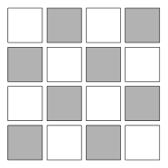

<small>

* answer:$4$
* questionType:ShortAnswer

</small>

## Lahendus

Võttes algul ära kaks nurkmist halli kuubikut, saab järgnevalt ära võtta eemaldatud kuubikute 4 valget naaberkuubikut. Pärast seda saab ära võtta kõik ülejäänud hallid kuubikud. Seega piisab eemaldada 4 valget kuubikut. Näitame, et väiksema arvu valgete kuubikute eemaldamisest ei piisa. Vaatleme kahte juhtu.

* Oletame, et eemaldatakse kaks keskmist valget kuubikut. Neist esimese eemaldamiseks tuleb eemaldada kaks halli naaberkuubikut, mis aga eeldab veel vähemalt ühe valge kuubiku eemaldamist. Ainult ühe valge lisakuubiku eemaldamine oleks võimalik ainult juhul, kui see oleks nurgakuubik. Siis aga pole võimalik teise keskmise valge kuubiku eemaldamine ilma veel üht valget kuubikut eemaldamata.

* Oletame, et vähemalt üks kahest keskmisest valgest kuubikust jääb paigale. Üldisust kitsendamata olgu see keskpunkti suhtes kagusuunaline kuubik. Kahest keskmisest hallist kuubikust kummagi ülejäänud kolmest valgest naaberkuubikust tuleb kaks eemaldada. Selleks, et piirduda vähem kui 4 valge kuubiku eemaldamisega, peab üks neist keskmiste hallide kuubikute valgetest naaberkuubikutest olema sama. Ainus selline kuubik on loodepoolne keskmine valge kuubik. Seega see kuubik tuleb eemaldada, lisaks üks vasaku alumise veerandi kahest valgest kuubikust ja üks parema ülemise veerandi kahest valgest kuubikust. Et oleks võimalik eemaldada parema alumise veerandi halle kuubikuid, tuleb aga eemaldada üks alumise rea valgetest kuubikutest ja üks parempoolse veeru valgetest kuubikutest. Kõik see kokku on võimalik saavutada 3 valge kuubiku eemaldamisega ainult juhul, kui eemaldatakse vasakult teise veeru ja ülevalt teise rea valged kuubikud. Kuid loodepoolse keskmise valge kuubiku eemaldamiseks on vaja eemaldada vähemalt üks ülemise rea või vasakpoolse veeru kuubik. Seega vähem kui 4 valge kuubiku eemaldamisega pole võimalik kõiki halle kuubikuid ära võtta.

*Märkus.* Erinevaid lahendusi 4 valge kuubiku eemaldamisega on rohkem. Näiteks võib eemaldada nurkmised valged kuubikud, siis nende kõrval asuvad hallid kuubikud ning seejärel saab kummaltki poolt eemaldada ühe keskmistest valgetest kuubikutest. Pärast seda on eemaldatavad kõik ülejäänud hallid kuubikud.
