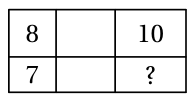
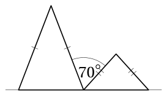
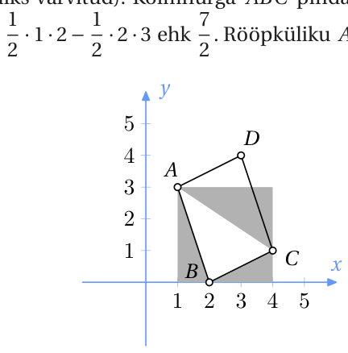
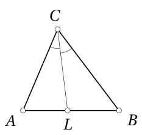
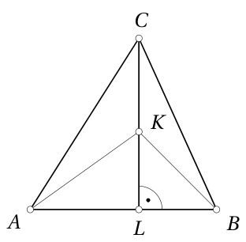
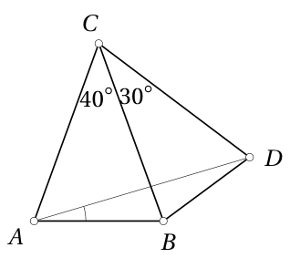

# <lo-sample/> EE.PK.2024TEST.7.1

Arvuta:

$987 + 654 + 321 - 876 - 543 - 210 =$

<small>

* answer:333
* questionType:ShortAnswer

</small>

## Lahendus

Kuna $987 - 876 = 654 - 543 = 321 - 210 = 111$, siis

$$987 + 654 + 321 - 876 - 543 - 210 = 3 \cdot 111 = 333.$$

# <lo-sample/> EE.PK.2024TEST.7.2

Kirjutises $2024*$ asendatakse tärn ühe numbriga nii, et saadud viiekohaline arv ei jagu 2-ga, 3-ga ega 5-ga. Leia kõigi tärni asemele sobivate numbrite summa.

<small>

* answer:12
* questionType:ShortAnswer

</small>

## Lahendus

Tärni kohale ei sobi paarisnumbrid ega $5$, sest arv ei tohi jaguda 2-ga ega 5-ga. Kui tärni asemele panna $1$, siis oleks saadava arvu ristsumma $9$, mis jagub 3-ga. Seega jaguks ka arv ise 3-ga. Samuti jaguks saadav arv 3-ga, kui tärni asemele panna $7$. Kui tärni asemele panna $3$ või $9$, siis ristsumma ei jaguks 3-ga. Kokkuvõttes on sobivad numbrid $3$ ja $9$. Nende summa on $12$.

# <lo-sample/> EE.PK.2024TEST.7.3

Neli vrappi ja kolm jooki maksavad kokku 7 eurot rohkem kui kaks vrappi ja üks jook kokku. Kui palju tuleb maksta, ostes neli vrappi ja neli jooki?

<small>

* answer:14 eurot
* questionType:ShortAnswer

</small>

## Lahendus

Neli vrappi ja kolm jooki ületab kaht vrappi ja üht jooki täpselt kahe vrapi ja kahe joogi võrra. Seega kaks vrappi ja kaks jooki maksab kokku $7$ eurot. Neli vrappi ja neli jooki maksab kaks korda enam ehk $14$ eurot.

# <lo-sample/> EE.PK.2024TEST.7.4

Üks poiss ja mõned tüdrukud sõid tühjaks kreekeripaki, milles oli alguses 150 kreekerit. Sama ajaga, kui poiss sõi 3 kreekerit, sõi iga tüdruk 2 kreekerit. Kui palju oli tüdrukuid, kui poiss sõi kokku $\frac{1}{5}$ kõigist kreekeritest?

<small>

* answer:6
* questionType:ShortAnswer

</small>

## Lahendus

Poiss sõi $150$ kreekerist $\frac{1}{5}$ ehk $30$ kreekerit. Tüdrukud sõid seega kokku $150 - 30$ ehk $120$ kreekerit. Kuna iga tüdruk sõi $20$ kreekerit sama ajaga kui poiss sõi oma $30$ kreekerit, pidi tüdrukuid olema $\frac{120}{20}$ ehk $6$.

# <lo-sample/> EE.PK.2024TEST.7.5

Ristkülik on jaotatud 6 väikeseks ristkülikuks. Neist 3 väikese ristküliku ümbermõõdud on joonisel kirjutatud nende ristkülikute sisse. Leia alumise parempoolse ristküliku ümbermõõt.

<small>

* answer:9
* questionType:ShortAnswer

</small>

## Lahendus

Samas veerus asuvate ristkülikute ümbermõõdud erinevad parajasti kahekordse nende ristkülikute kõrguste erinevuse võrra, sest nende ristkülikute laiused on võrdsed. Vasakpoolse veeru ülemise ristküliku ümbermõõt on $1$ võrra suurem alumise ristküliku ümbermõõdust. Seega ka parempoolse veeru ülemise ristküliku ümbermõõt on $1$ võrra suurem alumise ristküliku ümbermõõdust, sest vastavad kõrgused on samad nagu vasakpoolses veerus. Järelikult alulmise parempoolse ristküliku ümbermõõt on $10 - 1$ ehk $9$.

# <lo-sample/> EE.PK.2024TEST.7.6

Joonisel on kõrvuti kaks võrdhaarset kolmnurka, mille alused asuvad ühel sirgel ja omavad ühist otspunkti. Ühe kolmnurga alusnurk ja teise kolmnurga tipunurk on mõlemad suurusega $\alpha$. Joonisel näidatud kolmnurkade haarade vahelise nurga suurus on $70^\circ$. Leia $\alpha$.

<small>

* answer:40°
* questionType:ShortAnswer

</small>

## Lahendus

Kolmnurgas, mille tipunurga suurus on $\alpha$, on alusnurga suurus $\frac{180^\circ - \alpha}{2}$

ehk $90^\circ - \frac{1}{2}\alpha$. Seega $\alpha + 70^\circ + \left(90^\circ - \frac{1}{2}\alpha\right) = 180^\circ$, kust $\alpha = 40^\circ$.

# <lo-sample/> EE.PK.2024TEST.7.7

Arvteljel on märgitud punktid $A(20)$, $B(24)$ ja $C$. Punkt $C$ asub punktist $A$ kolm korda kaugemal kui punktist $B$. Leia punkti $C$ kõik võimalikud koordinaadid.

<small>

* answer:23, 26
* questionType:ShortAnswer

</small>

## Lahendus

Punkt $C$ saab asuda kas punktide $A$ ja $B$ vahel või punktist $B$ paremal, sest punktid, mis asuvad punktist $A$ vasakul, on punktile $A$ lähemal kui punktile $B$. Kui punkt $C$ asub punktide $A$ ja $B$ vahel, siis saame võrrandi $x - 20 = 3(24 - x)$, kust $x = 23$. Kui punkt $C$ asub punktist $B$ paremal, siis saame võrrandi $x - 20 = 3(x - 24)$, kust $x = 26$.

# <lo-sample/> EE.PK.2024TEST.8.1

Arvuta:

$$
\frac{20 \cdot 24 + 24 \cdot 22}{21}
$$

<small>

* answer:48
* questionType:ShortAnswer

</small>

## Lahendus

Lugejas saame

$$
20 \cdot 24 + 24 \cdot 22 = 24 \cdot (20 + 22) = 24 \cdot 42 = 24 \cdot 2 \cdot 21 = 48 \cdot 21.
$$

Seega $\frac{20 \cdot 24 + 24 \cdot 22}{21} = \frac{48 \cdot 21}{21} = 48$.

# <lo-sample/> EE.PK.2024TEST.8.2

Numbrite

$$
9\ 8\ 7\ 6\ 5\ 4\ 3\ 2\ 1\ 0
$$

vahele tuleb panna kolm plussmärki nii, et saadud avaldise väärtus oleks väiksem kui 1000. Leia see väärtus.

<small>

* answer:927
* questionType:ShortAnswer

</small>

## Lahendus

Kolm plussmärki jaotab numbrid 4 liidetavaks. Ükski liidetav ei tohi olla nelja- või enamakohaline, sest siis oleks avaldise väärtus suurem kui 1000. Kolmekohalisi liidetavaid ei tohi olla 3, sest nende vähim võimalik summa oleks $210 + 543 + 876$, mis on suurem kui 1000. Kui aga kolmekohalisi liidetavaid oleks 1, siis peaks ülejäänud 7 numbrit jagunema 3 vähematkohalise liidetava vahel, mis pole võimalik. Samuti kui kolmekohalisi liidetavaid oleks 0, siis peaks 10 numbrit jagunema 4 vähemakohalise liidetava vahel ja see pole võimalik. Seega ainus variant on, et kolmekohalisi liidetavaid on 2. Sel juhul jääb üle 4 numbrit, mis peavad jagunema 2 vähemakohalise liidetava vahel. Ainus võimalus on, et ülejäänud 2 liidetavat on kahekohalised. Kui suurem kolmekohaline liidetav oleks 987 või 876, siis isegi koos vähima võimaliku kolmekohalise liidetavaga 210 oleks summa suurem kui 1000. Kui suurem kolmekohaline liidetav oleks 765, siis üks kahekohaline liidetav peaks olema 98. Koos vähima võimaliku kolmekohalise liidetavaga 210 oleks summa jällegi suurem kui 1000. Suurem kolmekohaline liidetav ei saa olla 654, sest numbritest 9, 8 ja 7 jääks üks kasutamata. Seega on ainus võimalus, et kolmekohalised liidetavad on 543 ja 210 ning kahekohalised liidetavad 98 ja 76. Nende nelja arvu summa on 927.

# <lo-sample/> EE.PK.2024TEST.8.3

Kolm naturaalarvu suhtuvad nagu $2 : 3 : 4$ ja nende aritmeetiline keskmine on 78. Leia neist kolmest arvust vähim.

<small>

* answer:52
* questionType:ShortAnswer

</small>

## Lahendus

Need kolm naturaalarvu avalduvad kujul $2a, 3a, 4a$. Siit $\frac{2a + 3a + 4a}{3} = 78$ ehk $3a = 78$, mis annab $a = 26$. Vähim kolmest arvust on siis $2 \cdot 26$ ehk 52.

# <lo-sample/> EE.PK.2024TEST.8.4

Kevin võttis endale $\frac{2}{3}$ karbis olnud mandariinidest. Liisa võttis karbist endale kõik ülejäänud mandariinid ning lisaks sai 8 mandariini Kevinilt. Pärast seda oli Kevinil ja Liisal mandariine võrdselt. Mitu mandariini oli algselt karbis?

<small>

* answer:48
* questionType:ShortAnswer

</small>

## Lahendus

Olgu algul karbis $x$ mandariini. Pärast seda, kui lapsed olid võtnud karbi tühjaks ja Kevin oli andnud Liisale 8 mandariini, oli Kevinil $\frac{2}{3}x - 8$ ja Liisal $x - \frac{2}{3}x + 8$ mandariini. Seega $\frac{2}{3}x - 8 = x - \frac{2}{3}x + 8$, kust $\frac{1}{3}x = 16$ ehk $x = 48$.

# <lo-sample/> EE.PK.2024TEST.8.5

Koordinaattasandile on joonestatud rööpkülik $ABCD$, mille kolm tippu on $A(1;3)$, $B(2;0)$ ja $C(4;1)$. Leia rööpküliku $ABCD$ pindala.

<small>

* answer:7
* questionType:ShortAnswer

</small>

## Lahendus

Kolmnurk $ABC$ moodustab poole rööpküliku $ABCD$ pindalast. Kolmnurk $ABC$ jääb järele, kui eemaldada ruudust küljepikkusega 3 kolm kolmnurka (joonisel 1 halliks värvitud). Kolmnurga $ABC$ pindala on sellest tulenevalt

$3 \cdot 3 - \frac{1}{2} \cdot 1 \cdot 3 - \frac{1}{2} \cdot 1 \cdot 2 - \frac{1}{2} \cdot 2 \cdot 3$ ehk $\frac{7}{2}$. Rööpküliku $ABCD$ pindala on siis 7.

# <lo-sample/> EE.PK.2024TEST.8.6

Kolmnurgas $ABC$ tõmmatakse nurgapoolitaja $CL$. On teada, et nurkade $ACL$ ja $CAL$ suuruste summa on $100^\circ$ ning nurkade $BCL$ ja $BLC$ suuruste summa on $130^\circ$. Leia kolmnurga $ABC$ suurima nurga suurus.

<small>

* answer:$70^\circ$
* questionType:ShortAnswer

</small>

## Lahendus

Kolmnurgas $BCL$ saame

$$
\angle CBL = 180^\circ - (\angle BCL + \angle BLC) = 180^\circ - 130^\circ = 50^\circ.
$$

Kolmnurgas $ABC$ saame nüüd

$$
\angle ACB + \angle BAC = 180^\circ - 50^\circ = 130^\circ.
$$

Kuna aga $\angle ACL + \angle BAC = \angle ACL + \angle CAL = 100^\circ$, siis

$$
\angle BCL = \angle ACB - \angle ACL = 130^\circ - 100^\circ = 30^\circ.
$$

Seega $\angle ACB = 2 \cdot 30^\circ = 60^\circ$, sest $CL$ on nurgapoolitaja. Sellest tulenevalt $\angle BAC = 180^\circ - 50^\circ - 60^\circ = 70^\circ$ ja see on kolmnurga $ABC$ nurkadest suurim.

# <lo-sample/> EE.PK.2024TEST.8.7

Mitu erinevat võimalust on sõnas TOSIN tähtede ümberjärjestamiseks nii, et ükski täht ei oleks oma kohal ega naabertähe kohal?

<small>

* answer:4
* questionType:ShortAnswer

</small>

## Lahendus

Täht S saab minna kas esimeseks või viimaseks. Kui täht S läheb esimeseks, siis täht I peab minema teiseks ja täht N kolmandaks. Tähed T ja O lähevad kahele viimasele kohale emmas-kummas järjestuses. Seega võimalusi, kus täht S läheb esimeseks, on 2. Sümmeetria tõttu on võimalusi, kus täht S läheb viimaseks, samuti 2. Järelikult on otsitavaid ümberjärjestusi kokku 4.

# <lo-sample/> EE.PK.2024TEST.9.1

Arvuta:

$(789 : 3 + 789 : 6) : (789 : 12) =$

<small>

* answer:6
* questionType:ShortAnswer

</small>

## Lahendus

Kirjutades tehte ümber murdudega ja taandades arvuga 789, saame võrdväärse avaldise $\frac{\frac{1}{3}+\frac{1}{6}}{\frac{1}{12}}$. Selle murru lugeja on $\frac{1}{2}$ ja nimetaja $\frac{1}{12}$, seega murru väärtus on $12 : 2$ ehk 6.

# <lo-sample/> EE.PK.2024TEST.9.2

Numbritest $A$, $B$ ja $C$ moodustatud kolmekohalise arvu korrutamisel ühekohalise arvuga $D$ on tulemuseks 2024. Leia numbrite $A$, $B$, $C$ ja $D$ suurim võimalik summa.

<small>

* answer:18
* questionType:ShortAnswer

</small>

## Lahendus

Arvu 2024 kanooniline esitus on $2^3 \cdot 11 \cdot 23$, mistõttu tema ühekohalised tegurid on 1, 2, 4, 8. Jagamisel teguritega 1 ja 2 tekib neljakohaline jagatis. Jagamisel teguriga 4 või 8 tekib vastavalt jagatis 506 või 253. Esimesel juhul on vaadeldav numbrite summa $5+0+6+4$ ehk 15, teisel juhul aga $2+5+3+8$ ehk 18. Suurem neist on 18.

# <lo-sample/> EE.PK.2024TEST.9.3

Olgu $a$, $b$ ja $c$ positiivsed arvud. Arv $a$ on 3 korda väiksem summast $b + c$ ja 3 korda suurem vahest $b - c$. Mitu korda on arv $b$ suurem arvust $c$?

<small>

* answer:1,25
* questionType:ShortAnswer

</small>

## Lahendus

Kuna $a=\frac{b+c}{3}=3(b-c)$, siis $b+c=9(b-c)$. Siit $8b=10c$, millest saame $b=\frac{5}{4}c$.

# <lo-sample/> EE.PK.2024TEST.9.4

Kahes karbis on kokku 120 mustikat. On teada, et 20% ühe karbi mustikate arvust on 9 võrra suurem kui 30% teise karbi mustikate arvust. Mitu mustikat on karbis, milles on mustikaid vähem?

<small>

* answer:30
* questionType:ShortAnswer

</small>

## Lahendus

Olgu teises karbis $x$ mustikat; siis esimeses karbis on $120-x$ mustikat. Ülesande tingimustest saame võrrandi $0{,}2(120-x)=0{,}3x+9$, mille lahend on $x=30$. Seega teises karbis on 30 ja esimeses 90 mustikat. Teise karbi mustikate arv on väiksem.

# <lo-sample/> EE.PK.2024TEST.9.5

Teravnurkse kolmnurga $ABC$ kõrgusel $CL$ on märgitud punkt $K$. On teada, et $|AB| = 12$ cm ja $|CK| = 6$ cm. Leia nelinurga $ACBK$ pindala.

<small>

* answer:36 cm²
* questionType:ShortAnswer

</small>

## Lahendus

Nelinurga $ACBK$ pindala võrdub kolmnurkade $ACK$ ja $BCK$ pindalade summaga (joonis 2). Võttes mõlema kolmnurga aluseks $CK$, on kõrgused vastavalt $AL$ ja $BL$. Nelinurga $ACBK$ pindala on $\frac{1}{2}\cdot |CK|\cdot |AL|+\frac{1}{2}\cdot |CK|\cdot |BL|$ ehk $\frac{1}{2}\cdot |CK|\cdot (|AL|+|BL|)$ ehk $\frac{1}{2}\cdot |CK|\cdot |AB|$. Kuna $|AB| = 12$ cm ja $|CK| = 6$ cm, siis nelinurga $ACBK$ pindala on $\frac{1}{2}\cdot 6\cdot 12$ ehk 36 ruutsentimeetrit.

Joonis 2

# <lo-sample/> EE.PK.2024TEST.9.6

Kõrvuti paiknevate võrdhaarsete kolmnurkade $ABC$ ja $BCD$ tipunurkade $ACB$ ja $BCD$ suurused on vastavalt $40^\circ$ ja $30^\circ$. Leia nurga $BAD$ suurus.

<small>

* answer:15°
* questionType:ShortAnswer

</small>

## Lahendus

Kolmnurga $ABC$ alusnurga suurus on $\frac{180^\circ-40^\circ}{2}$ ehk $70^\circ$. Arvestades, et $|AC|=|BC|=|CD|$, on võrdhaarne ka kolmnurk $ACD$ ja tema tipunurga suurus on $40^\circ+30^\circ$ ehk $70^\circ$. Seega kolmnurga $ACD$ alusnurga suurus on $\frac{180^\circ-70^\circ}{2}$ ehk $55^\circ$. Järelikult $\angle BAD=\angle BAC-\angle DAC=70^\circ-55^\circ=15^\circ$.

# <lo-sample/> EE.PK.2024TEST.9.7

Arvud $x$ ja $y$ valitakse nii, et $|x| = |x + y| = 9$. Leia avaldise $|x - y|$ kõik võimalikud väärtused.

<small>

* answer:9, 27
* questionType:ShortAnswer

</small>

## Lahendus

On kaks võimalust, kas $x=x+y$ või $x=-(x+y)$. Esimesel juhul $y=0$; siis $|x-y|=|x|=9$. Teisel juhul $y=-2x$; siis

$$|x-y|=|x-(-2x)|=|3x|=3|x|=3\cdot 9=27.$$
