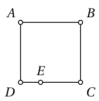
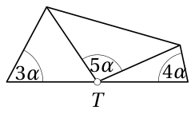
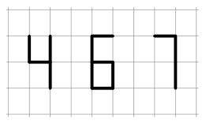
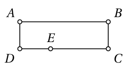
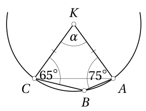
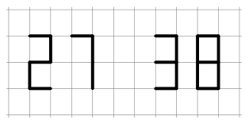
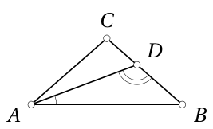
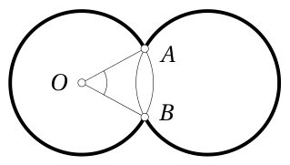
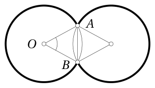
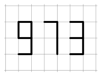

# <lo-sample/> EE.PK.2025TEST.7.1

Вычислить:

$$
7 \cdot 6 : \left(1 + \frac{2}{3 - \frac{4}{5}}\right) =
$$

<small>

* answer:22
* questionType:ShortAnswer

</small>

## Решение

$$
7 \cdot 6 : \left(1 + \frac{2}{3 - \frac{4}{5}}\right)
= 42 : \left(1 + \frac{2}{\frac{15 - 4}{5}}\right)
= 42 : \left(1 + \frac{10}{11}\right)
= 42 : \frac{11 + 10}{11}
= 42 \cdot \frac{11}{21} = 2 \cdot 11 = 22.
$$

# <lo-sample/> EE.PK.2025TEST.7.2

Пусть $a$, $b$, $c$, $d$ и $e$ такие различные натуральные числа, что действует равенство $a \cdot b \cdot c \cdot d \cdot e = 2025$. Найти сумму $a + b + c + d + e$.

<small>

* answer:33
* questionType:ShortAnswer

</small>

## Решение

Разложение на простые множители даёт $2025 = 3 \cdot 3 \cdot 3 \cdot 3 \cdot 5 \cdot 5$. Эти 6 простых множителей нужно распределить между числами $a$, $b$, $c$, $d$, $e$ так, чтобы все 5 чисел были различными. Очевидно, что в какое-то из этих чисел должно попасть как минимум 2 простых множителя. Рассмотрим разные случаи.

* Если в какое-то число попало бы 3 или более простых множителя, то оставшиеся не более 3 простых множителя нужно было бы распределить между оставшимися 4 числами, что означает, что по крайней мере одно число осталось бы без какого-либо простого множителя, то есть должно было бы равняться числу 1. Так как числа должны быть различными, то не может быть нескольких чисел, равных 1. Следовательно, каждое из оставшихся 3 чисел должно содержать ровно один простой множитель. Но в нашем распоряжении есть только 2 различных простых множителя. Противоречие показывает, что каждое из чисел $a$, $b$, $c$, $d$, $e$ содержит не более 2 простых множителей.
* Если чисел, содержащих 2 простых множителя, было бы 3, то оставшиеся 2 числа были бы равны числу 1, что невозможно.
* Если чисел, содержащих 2 простых множителя, 2, то оставшиеся 3 числа должны быть 1, 3 и 5. Значит, для образования первых двух чисел можно использовать простые множители 3, 3, 3, 5. Единственная возможность разбить их на пары так, чтобы произведения были различными, — это $3 \cdot 3$ и $3 \cdot 5$. Следовательно, $a$, $b$, $c$, $d$, $e$ — это 1, 3, 5, 9, 15 в некотором порядке, что даёт $a + b + c + d + e = 33$.
* Если чисел, содержащих 2 простых множителя, было бы 1, то осталось бы по крайней мере два простых множителя 3, поэтому среди оставшихся чисел число 3 встречалось бы повторно. Противоречие показывает, что и этот случай невозможен.

Итак, $a + b + c + d + e = 33$ — единственная возможность.

# <lo-sample/> EE.PK.2025TEST.7.3

В команде всего 4 игрока, средний возраст которых равен 25 годам. Если бы вместо самого младшего игрока в команде был 35-летний игрок, то средний возраст игроков команды был бы равен 28 годам. Сколько лет самому младшему игроку этой команды?

<small>

* answer:23 года
* questionType:ShortAnswer

</small>

## Решение

Так как средний возраст 4 игроков равен 25 годам, то сумма возрастов этих игроков равна $4 \cdot 25$, то есть 100 лет. Если бы возраст самого младшего игрока был 35 лет, то средний возраст игроков был бы 28 лет, что дало бы сумму возрастов $4 \cdot 28$, то есть 112 лет. Значит, изменение возраста самого младшего игрока увеличило бы сумму возрастов на $112 - 100$, то есть на 12 лет. Следовательно, возраст самого младшего игрока равен $35 - 12$, то есть 23 года.

# <lo-sample/> EE.PK.2025TEST.7.4

Сколько всего таких пар цифр $(x, y)$, при которых шестизначное число $\overline{20x25y}$ делится как на число 3, так и на число 5?

<small>

* answer:7
* questionType:ShortAnswer

</small>

## Решение

Цифра $y$ может быть либо 0, либо 5, чтобы число делилось на 5. Если $y = 0$, то $x$ может быть 0, 3, 6 или 9, чтобы сумма цифр числа, а значит и само число, делилась на 3. Если $y = 5$, то аналогично $x$ может быть 1, 4 или 7. Всего получаем $4 + 3$, то есть 7 возможностей.

# <lo-sample/> EE.PK.2025TEST.7.5

На стороне $CD$ квадрата $ABCD$ выбрана такая точка $E$, что длина дробной линии $ADE$ равна 20 см, а длина дробной линии $BCE$ равна 25 см. Найти площадь квадрата $ABCD$.

<small>

* answer:225 см^2
* questionType:ShortAnswer

</small>

## Решение

Сумма длин дробных линий $ADE$ и $BCE$ равна 45 см. Эти две дробные линии вместе образуют ровно три стороны квадрата (рисунок 1). Значит, длина стороны квадрата равна 15 см, а площадь — 225 см$^2$.

Рисунок 1

# <lo-sample/> EE.PK.2025TEST.7.6

На рисунке изображены три равнобедренных треугольника. Угол при вершине каждого треугольника лежит в точке $T$, и эти три угла при вершинах образуют вместе развёрнутый угол. Величины трёх обозначенных на рисунке углов равны $3\alpha$, $4\alpha$ и $5\alpha$. Найти $\alpha$.

<small>

* answer:20°
* questionType:ShortAnswer

</small>

## Решение

В треугольнике, в котором величина угла при основании равна $3\alpha$, величина угла при вершине равна $180^\circ - 6\alpha$. В треугольнике, в котором величина угла при основании равна $4\alpha$, величина угла при вершине равна $180^\circ - 8\alpha$. Так как три угла при вершинах вместе образуют развёрнутый угол, то

$$
(180^\circ - 6\alpha) + 5\alpha + (180^\circ - 8\alpha) = 180^\circ,
$$

откуда $9\alpha = 180^\circ$, то есть $\alpha = 20^\circ$.

# <lo-sample/> EE.PK.2025TEST.7.7

На листке бумаги, который поделён на равные прямоугольники, записали цифры 4, 6 и 7 так, как показано на рисунке. Общие длины отрезков, необходимых для записи цифр 4 и 6, равны соответственно 13 см и 18 см. Найти общую длину отрезков, необходимых для записи цифры 7.

<small>

* answer:9,5 см
* questionType:ShortAnswer

</small>

## Решение

При записи цифры 4 проводят 1 горизонтальный отрезок и 3 вертикальных отрезка, при записи цифры 6 — 3 горизонтальных отрезка и 3 вертикальных отрезка. Значит, при записи цифры 6 проводят на 2 горизонтальных отрезка больше и столько же вертикальных отрезков, сколько при записи цифры 4. Следовательно, общая длина 2 горизонтальных отрезков равна 5 см, что даёт длину горизонтального отрезка 2,5 см. Тогда общая длина 3 вертикальных отрезков равна 10,5 см, что даёт длину вертикального отрезка 3,5 см. Для записи цифры 7 проводят 1 горизонтальный отрезок и 2 вертикальных отрезка, общая длина которых равна 9,5 см.

# <lo-sample/> EE.PK.2025TEST.8.1

Вычислить:

$$
\frac{1}{2}:\frac{2}{3}:\frac{3}{4}:\frac{4}{5}:\frac{5}{6}:\frac{6}{7}:\frac{7}{8}=
$$

<small>

* answer:2
* questionType:ShortAnswer

</small>

## Решение

$$
\frac{1}{2}:\frac{2}{3}:\frac{3}{4}:\frac{4}{5}:\frac{5}{6}:\frac{6}{7}:\frac{7}{8}=
\frac{1}{2}\cdot\frac{3}{2}\cdot\frac{4}{3}\cdot\frac{5}{4}\cdot\frac{6}{5}\cdot\frac{7}{6}\cdot\frac{8}{7}=
\frac{1}{2}\cdot\frac{8}{2}=\frac{8}{4}=2.
$$

# <lo-sample/> EE.PK.2025TEST.8.2

Сколько всего различных возможностей для замены одной цифры числа 2025 на какую-то другую цифру так, чтобы полученное четырёхзначное число не делилось на число 3?

<small>

* answer:26
* questionType:ShortAnswer

</small>

## Решение

Так как число 2025 делится на число 3, то для замены подходят ровно те цифры, которые при делении на число 3 дают остаток, отличный от остатка заменяемой цифры. Для замены первой цифры 2 подходят цифры 1, 3, 4, 6, 7, 9. Для замены другой цифры 2 дополнительно подходит цифра 0. Те же цифры подходят для замены цифры 5. Для замены цифры 0 подходят цифры 1, 2, 4, 5, 7, 8. Всего $6+7+7+6$, то есть 26 возможностей.

# <lo-sample/> EE.PK.2025TEST.8.3

В команде всего три игрока, возрасты которых относятся как $4:5:6$. Средний возраст этих игроков равен 30 годам. Сколько лет самому младшему игроку этой команды?

<small>

* answer:24 года
* questionType:ShortAnswer

</small>

## Решение

Пусть возрасты трёх игроков равны $4x$, $5x$ и $6x$ лет. Так как средний возраст этих игроков равен 30 годам, то $\frac{4x+5x+6x}{3}=30$, откуда $15x=90$, то есть $x=6$. Следовательно, возраст самого младшего игрока равен $4\cdot 6$, то есть 24 года.

# <lo-sample/> EE.PK.2025TEST.8.4

Значениями неизвестных $a$, $b$ и $c$ являются такие различные натуральные числа, что действует равенство $a^2\cdot b^2\cdot c^2=2025$. Найти наибольшее возможное значение суммы $a+b+c$.

<small>

* answer:19
* questionType:ShortAnswer

</small>

## Решение

Разложение на простые множители даёт $2025=3\cdot 3\cdot 3\cdot 3\cdot 5\cdot 5$. Эти простые множители нужно распределить парами одинаковых множителей между числами $a^2$, $b^2$ и $c^2$ так, чтобы все 3 числа были различными. Рассмотрим разные случаи.

* Если какое-либо из чисел содержало бы все простые множители, то остальные были бы равны числу 1, что не разрешено.
* Если какое-либо из чисел содержит две пары простых множителей, то эти пары могут быть либо $3\cdot 3, 3\cdot 3$, либо $3\cdot 3,5\cdot 5$. Тогда это число было бы соответственно 81 или 225. Оставшиеся два числа были бы соответственно 25 и 1 или 9 и 1. Значения неизвестных $a$, $b$ и $c$ были бы либо 9, 5 и 1, либо 15, 3 и 1, что даёт значение выражения $a+b+c$ соответственно 15 или 19. Большее из них равно 19.
* Если ни одно из чисел не содержало бы двух пар простых множителей, то два числа были бы равны $3\cdot 3$, что не разрешено.

Следовательно, наибольшее возможное значение $a+b+c$ равно 19.

# <lo-sample/> EE.PK.2025TEST.8.5

Периметр прямоугольника $ABCD$ равен 60 см. На его большей стороне $CD$ выбрана такая точка $E$, что длина отрезка $DE$ равна 8 см. Ломаная линия $ADE$ в 3 раза короче ломаной линии $ABCE$. Найти площадь прямоугольника $ABCD$.

<small>

* answer:$161\ \text{см}^2$
* questionType:ShortAnswer

</small>

## Решение

Ломаные линии $ADE$ и $ABCE$ вместе покрывают все стороны прямоугольника $ABCD$ (рисунок 2). Следовательно, сумма длин этих ломаных равна периметру 60 см. Так как ломаная $ADE$ в 3 раза короче ломаной $ABCE$, то длины ломаных $ADE$ и $ABCE$ составляют от периметра прямоугольника $ABCD$ соответственно $\frac{1}{4}$ и $\frac{3}{4}$, что даёт их длины соответственно 15 см и 45 см. Ломаная $ADE$ состоит из меньшей стороны прямоугольника $AD$ и отрезка $DE$ длиной 8 см. Следовательно, меньшая сторона имеет длину 7 см. Тогда большая сторона должна иметь длину 23 см. По длинам сторон находим площадь прямоугольника $161\ \text{см}^2$.

# <lo-sample/> EE.PK.2025TEST.8.6

На окружности с центром $K$ выбраны в указанном порядке точки $A$, $B$ и $C$ так, что $\angle KAB=75^\circ$ и $\angle BCK=65^\circ$. Найти величину угла $CKA$.

<small>

* answer:$80^\circ$
* questionType:ShortAnswer

</small>

## Решение

*Решение 1.* Так как точки $A$, $B$, $C$ находятся на окружности с центром $K$, то $|KA|=|KB|=|KC|$ (рисунок 3). Из равнобедренного треугольника $KAB$ получаем $\angle KBA=\angle KAB=75^\circ$, из равнобедренного треугольника $KBC$ аналогично $\angle KBC=\angle KCB=65^\circ$. Следовательно, $\angle ABC=75^\circ+65^\circ=140^\circ$. Из четырёхугольника $KABC$ теперь получаем $\angle CKA=360^\circ-75^\circ-65^\circ-140^\circ=80^\circ$.

*Решение 2.* Обозначим $\angle CKA=\alpha$. На основании связи между центральным и вписанным углами, опирающимися на одну и ту же хорду $AC$, должно выполняться либо $\angle ABC=\frac{1}{2}\alpha$, либо $\angle ABC=180^\circ-\frac{1}{2}\alpha$. В первом случае из внутренних углов четырёхугольника $KABC$ получаем уравнение $75^\circ+65^\circ+(360^\circ-\alpha)+\frac{1}{2}\alpha=360^\circ$, откуда $\frac{1}{2}\alpha=140^\circ$, то есть $\alpha=280^\circ$, что невозможно. Во втором случае (рисунок 4) аналогично получаем уравнение $75^\circ+65^\circ+\alpha+\left(180^\circ-\frac{1}{2}\alpha\right)=360^\circ$, откуда $\frac{1}{2}\alpha=40^\circ$, то есть $\alpha=80^\circ$.

# <lo-sample/> EE.PK.2025TEST.8.7

На листке бумаги, который поделён на равные прямоугольники, записали числа 27 и 38 так, как показано на рисунке. Общая длина отрезков, необходимых для записи числа 27, равна 27 см. Найти общую длину отрезков, необходимых для записи числа 38.

<small>

* answer:40,5 см
* questionType:ShortAnswer

</small>

## Решение

При записи числа 27 проводится всего 4 горизонтальных отрезка и 4 вертикальных отрезка. При записи числа 38 проводится всего 6 горизонтальных отрезков и 6 вертикальных отрезков. Следовательно, общая длина отрезков, проводимых при записи числа 38, в 1,5 раза больше, чем при записи числа 27. Так как общая длина отрезков, проводимых при записи числа 27, равна 27 см, то общая длина отрезков, проводимых при записи числа 38, равна $1,5\cdot 27$ см, то есть 40,5 см.

# <lo-sample/> EE.PK.2025TEST.9.1

Вычислить:
$$
\frac{3636\cdot4545}{909^2}=
$$

<small>

* answer:20
* questionType:ShortAnswer

</small>

## Решение

$$
\frac{3636\cdot4545}{909^2}=\frac{(4\cdot909)\cdot(5\cdot909)}{909\cdot909}=4\cdot5=20.
$$

# <lo-sample/> EE.PK.2025TEST.9.2

Произведение $1\cdot2\cdot3\cdot4\cdot5\cdot6\cdot7\cdot8\cdot9\cdot10$ делится на число $2025$. Найти последнюю цифру частного.

<small>

* answer:2
* questionType:ShortAnswer

</small>

## Решение

Разложив на простые множители, получаем $2025=3\cdot3\cdot3\cdot3\cdot5\cdot5$. Сокращая все простые множители числа $2025$, получаем

$$
\frac{1\cdot2\cdot3\cdot4\cdot5\cdot6\cdot7\cdot8\cdot9\cdot10}{2025}=1\cdot2\cdot1\cdot4\cdot1\cdot2\cdot7\cdot8\cdot1\cdot2=2\cdot4\cdot2\cdot7\cdot8\cdot2.
$$

Последняя цифра полученного произведения равна $2$.

# <lo-sample/> EE.PK.2025TEST.9.3

В команде всего пять игроков разного возраста. Средний возраст двух самых младших игроков команды равен $20$ годам, а средний возраст оставшихся игроков команды равен $25$ годам. Найти наибольший возможный возраст самого старшего игрока этой команды. Возрасты игроков берутся в целых годах.

<small>

* answer:30 лет
* questionType:ShortAnswer

</small>

## Решение

Так как средний возраст двух самых младших игроков равен $20$ годам, а возрасты игроков различны и берутся в целых годах, то наименьший возможный возраст четвёртого по возрасту игрока равен $21$ году. Также находим, что наибольший возможный возраст третьего по возрасту игрока равен $24$ годам. Значит, возраст третьего по возрасту игрока может быть $24$, $23$ или $22$ года.

• Если возраст третьего по возрасту игрока равен $24$ годам, то возрасты второго по возрасту и самого старшего игроков должны быть соответственно $25$ и $26$ лет.

• Если возраст третьего по возрасту игрока равен $23$ годам, то возрасты второго по возрасту и самого старшего игроков могут быть либо $25$ и $27$, либо $24$ и $28$ лет.

• Если возраст третьего по возрасту игрока равен $22$ годам, то, учитывая, что чем младше второй по возрасту игрок, тем старше самый старший игрок, получаем наименьший возможный возраст второго по возрасту игрока $23$ года и наибольший возможный возраст самого старшего игрока $30$ лет.

Следовательно, наибольший возможный возраст самого старшего игрока равен $30$ годам.

# <lo-sample/> EE.PK.2025TEST.9.4

В числе $2025$ ровно две цифры $2$, а другие цифры различны. Сколько всего четырёхзначных натуральных чисел, которые меньше числа $2025$ и имеют такое же свойство?

<small>

* answer:28
* questionType:ShortAnswer

</small>

## Решение

Если искомое четырёхзначное число начинается с цифры $2$, то цифра сотен должна быть $0$. Вторая цифра $2$ может находиться либо в разряде десятков, либо в разряде единиц. Если цифра $2$ находится в разряде десятков, то в разряде единиц может быть $4$, $3$ или $1$, всего $3$ возможности. Если цифра $2$ находится в разряде единиц, то в разряде десятков может быть только $1$, всего $1$ возможность. Значит, таких возможностей всего $3+1$, то есть $4$.

Искомое четырёхзначное число может начинаться ещё и с цифры $1$. Тогда есть $3$ возможности выбрать разряды, в которых находятся цифры $2$: сотни и десятки; сотни и единицы; десятки и единицы. Независимо от этого выбора на оставшемся месте может быть одна из $8$ неиспользованных цифр. Значит, таких возможностей всего $3\cdot8$, то есть $24$.

Всего получаем $4+24$, то есть $28$ возможностей.

# <lo-sample/> EE.PK.2025TEST.9.5

В равнобедренном треугольнике $ABC$ с основанием $AB$ проведена биссектриса $AD$. Известно, что угол $ADB$ в $6$ раз больше угла $BAD$. Найти величину угла $ACB$.

<small>

* answer:100°
* questionType:ShortAnswer

</small>

## Решение

Пусть $\angle BAD=\alpha$. По условию задачи $\angle ABC=\angle BAC=2\alpha$ и $\angle ADB=6\alpha$. Из внутренних углов треугольника $ABD$ получаем уравнение

$$
\alpha+6\alpha+2\alpha=180^\circ
$$

то есть $9\alpha=180^\circ$, откуда $\alpha=20^\circ$. Следовательно, $\angle ABC=\angle BAC=2\cdot20^\circ=40^\circ$ и $\angle ACB=180^\circ-2\cdot40^\circ=100^\circ$.

# <lo-sample/> EE.PK.2025TEST.9.6

Две равные окружности с радиусом $5$ см пересекаются в точках $A$ и $B$. Точка $O$ является центром одной окружности. Найти величину центрального угла $AOB$, если длина жирной линии равна $17\pi$ см.

<small>

* answer:54° или $\frac{3}{10}\pi$
* questionType:ShortAnswer

</small>

## Решение

Пусть центральный угол $AOB$ составляет от полного оборота долю $x$. Тогда часть жирной линии на окружности с центром $O$ составляет от окружности долю $1-x$. Так как длина этой окружности равна $10\pi$ см, то длина части, проведённой жирной линией на этой окружности, равна $(1-x)\cdot10\pi$ см. На другой окружности часть, проведённая жирной линией, имеет такую же длину, поскольку окружности равны и длина хорды $AB$ одинакова (рисунок 5). Значит, длина найденной выше части жирной линии равна $\frac{17}{2}\pi$ см. Получаем уравнение $(1-x)\cdot10\pi=\frac{17}{2}\pi$, откуда $x=\frac{3}{20}$. Следовательно, $\angle AOB=\frac{3}{20}\cdot360^\circ=54^\circ$.

Рисунок 5

# <lo-sample/> EE.PK.2025TEST.9.7

На листке бумаги, который поделён на равные прямоугольники, записали число $973$ так, как показано на рисунке. Общая длина отрезков, необходимых для записи этого числа, равна $973$ мм. Найти общую длину отрезков, необходимых для записи цифры $9$.

<small>

* answer:417 мм
* questionType:ShortAnswer

</small>

## Решение

При записи цифры $9$ проводят $3$ горизонтальных и $3$ вертикальных отрезка, при записи цифры $7$ — $1$ горизонтальный и $2$ вертикальных отрезка, а при записи цифры $3$ проводят $3$ горизонтальных и $2$ вертикальных отрезка. Значит, при записи числа $973$ всего проводят $7$ горизонтальных и $7$ вертикальных отрезков, общая длина которых по условию задачи равна $973$ мм. $3$ горизонтальных и $3$ вертикальных отрезка, проведённых при записи цифры $9$, составляют $\frac{3}{7}$ от общей длины, что равно $417$ мм.
