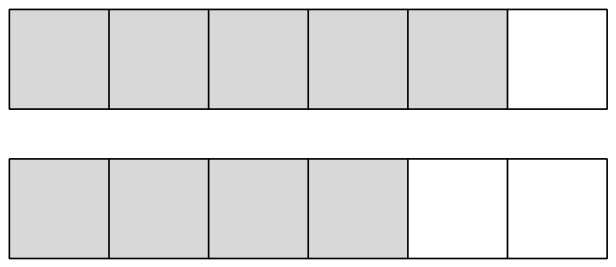
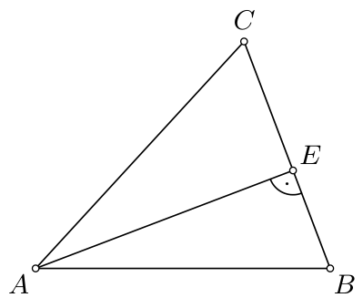
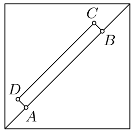
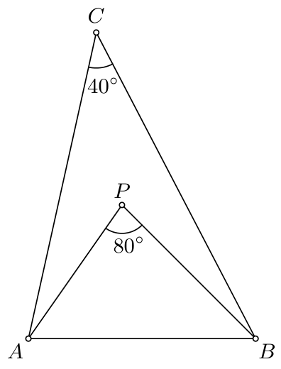
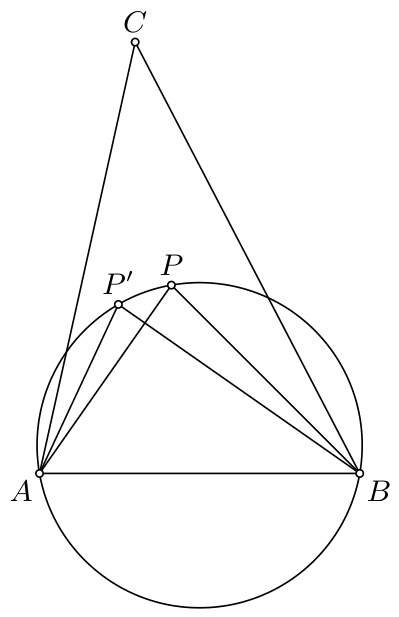
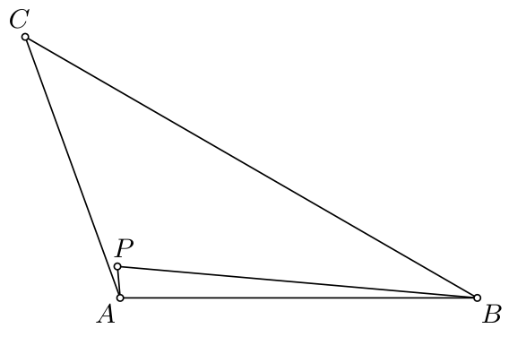

# <lo-sample/> PL.OMJ.2011TEST.7_8.1

Eksistē tāda prizma, kuras šķautņu skaits ir vienāds ar

**(a)** $3^{100}$;

**(b)** $5^{100}$;

**(c)** $100001$.

<small>

* answer:T,N,N
* questionType:ShortAnswer

</small>

## Atrisinājums

Aplūkosim prizmu, kuras pamats ir kāds $n$-stūris. Šīs prizmas šķautņu skaits ir $3n$. Tātad prizmas šķautņu skaits dalās ar 3.

a) Skaitlis $3^{100}$ dalās ar 3. Tas ir šķautņu skaits prizmai, kuras pamats ir $3^{99}$-stūris.

b), c) Skaitlis $5^{100}$ nedalās ar 3, jo šī skaitļa sadalījumā pirmreizinātājos neietilpst skaitlis 3. Arī skaitlis $100001$ nedalās ar 3, jo šī skaitļa ciparu summa nedalās ar 3.

# <lo-sample/> PL.OMJ.2011TEST.7_8.2

Eksistē 2011 tādi dažādi pirmskaitļi, ka

**(a)** to summa ir nepāra skaitlis;

**(b)** to summa ir pāra skaitlis;

**(c)** to reizinājums ir pāra skaitlis.

<small>

* answer:T,T,T
* questionType:ShortAnswer

</small>

## Atrisinājums

a) Aplūkosim jebkurus 2011 dažādus nepāra pirmskaitļus. To summa ir nepāra skaitlis.

b), c) Aplūkosim 2011 dažādus pirmskaitļus, no kuriem viens ir vienāds ar 2. To reizinājums dalās ar 2, t.i., ir pāra skaitlis.

Starp aplūkotajiem skaitļiem ir 2010 nepāra skaitļi. To summa ir pāra skaitlis. Pieskaitot skaitli 2, visu skaitļu summa joprojām ir pāra skaitlis.

# <lo-sample/> PL.OMJ.2011TEST.7_8.3

Skaitļi $a$, $b$, $c$ ir kāda trijstūra malu garumi, un $(a-b)(b-c)(c-a)=0$. No tā izriet, ka šis trijstūris ir

**(a)** vienādsānu;

**(b)** vienādmalu;

**(c)** šaurleņķa.

<small>

* answer:T,N,N
* questionType:ShortAnswer

</small>

## Atrisinājums

a) Tā kā $(a-b)(b-c)(c-a)=0$, tad $a-b=0$ vai $b-c=0$ vai $c-a=0$, tātad $a=b$ vai $b=c$ vai $c=a$. Līdz ar to kādas divas aplūkotā trijstūra malas ir vienādas, t.i., tas ir vienādsānu trijstūris.

b), c) Ievērosim, ka jebkura platleņķa vienādsānu trijstūra malas apmierina uzdevumā doto vienādību.

# <lo-sample/> PL.OMJ.2011TEST.7_8.4

Prece $X$ kļuva dārgāka par 20%, bet prece $Y$ kļuva dārgāka par 50%, un rezultātā abas preces maksā vienādi. No tā izriet, ka pirms cenu paaugstināšanas

**(a)** prece $X$ bija par 20% dārgāka nekā prece $Y$;

**(b)** prece $X$ bija par 25% dārgāka nekā prece $Y$;

**(c)** prece $X$ bija par 30% dārgāka nekā prece $Y$.

<small>

* answer:N,T,N
* questionType:ShortAnswer

</small>

## Atrisinājums

Pamatosim, ka prece $X$ bija par 25% dārgāka nekā prece $Y$. Parādīsim divus pamatojuma veidus.

**1. paņēmiens.**

Apzīmēsim ar $x$ preces $X$ sākotnējo cenu, bet ar $y$ — preces $Y$ sākotnējo cenu. Pēc cenas paaugstināšanas preces $X$ cena ir $x+\frac{20}{100}x=\frac65x$. Savukārt preces $Y$ cena pēc paaugstināšanas ir $y+\frac{50}{100}y=\frac32y$. Tātad $\frac65x=\frac32y$, t.i., $x=\frac54y$, tāpēc $x=\frac{125}{100}y=y+\frac{25}{100}y$.

**2. paņēmiens.**

Tā kā preces $X$ pašreizējā cena ir $\frac65$ no preces cenas pirms paaugstināšanas, tad šīs preces sākotnējā cena bija $\frac56$ no pašreizējās cenas. Līdzīgi pamatojam, ka preces $Y$ cena pirms paaugstināšanas bija $\frac23$ no pašreizējās cenas.

Aplūkosim divus vienādus taisnstūrus, kas attēlo preču $X$ un $Y$ pašreizējās, vienādās cenas (1. zīm.). Iekrāsosim pelēkā krāsā tās taisnstūru daļas, kas atbilst preču sākotnējām cenām, t.i., $\frac56$ no pirmā un $\frac23$ no otrā taisnstūra. Ievērosim, ka pelēkais taisnstūris, kas atbilst preces $X$ sākotnējai cenai, ir par $\frac14$ jeb 25% garāks nekā pelēkais taisnstūris, kas atbilst preces $Y$ sākotnējai cenai.

1. zīm.

# <lo-sample/> PL.OMJ.2011TEST.7_8.5

Pozitīvie skaitļi $a$, $b$ apmierina nosacījumu $a+b=1$. No tā izriet, ka

**(a)** $a^2+b^2<1$;

**(b)** $\sqrt a+\sqrt b<1$;

**(c)** $ab<1$.

<small>

* answer:T,N,T
* questionType:ShortAnswer

</small>

## Atrisinājums

a) Ievērosim, ka $(a+b)^2=1$, t.i., $a^2+2ab+b^2=1$, tātad $a^2+b^2=1-2ab$. Tā kā skaitļi $a$ un $b$ ir pozitīvi, tad $2ab>0$. No tā izriet, ka $a^2+b^2<1$.

b) Pieņemot $a=\frac12$ un $b=\frac12$, iegūstam $\sqrt a+\sqrt b=\frac{\sqrt2}{2}+\frac{\sqrt2}{2}=\sqrt2>1$.

c) Tā kā $a+b=1$ un skaitļi $a$ un $b$ ir pozitīvi, tad $a<1$ un $b<1$. Abas šo nevienādību puses ir pozitīvas, tāpēc tās varam sareizināt pa daļām. Iegūstam $ab<1$.

# <lo-sample/> PL.OMJ.2011TEST.7_8.6

Veselie skaitļi $x$ un $y$ ir pozitīvi, un to summa ir skaitlis, kas dalās ar 3. No tā izriet, ka

**(a)** katrs no skaitļiem $x$ un $y$ dalās ar 3;

**(b)** skaitlis $x^2+y^2$ dalās ar 3;

**(c)** skaitlis $x^2-y^2$ dalās ar 3.

<small>

* answer:N,N,T
* questionType:ShortAnswer

</small>

## Atrisinājums

a), b) Pieņemsim $x=1$ un $y=2$. Tad skaitlis $x+y=3$ dalās ar 3. Tomēr neviens no skaitļiem $x$, $y$ un $x^2+y^2=5$ nedalās ar 3.

c) Ievērosim, ka $x^2-y^2=(x+y)(x-y)$. Šī reizinājuma pirmais reizinātājs ir skaitlis, kas dalās ar 3. No tā izriet, ka skaitlis $x^2-y^2$ dalās ar 3.

# <lo-sample/> PL.OMJ.2011TEST.7_8.7

Trijstūrī $ABC$ augstumi $AE$ un $BF$ ir vienādi. No tā izriet, ka

**(a)** visi šī trijstūra augstumi ir vienādi;

**(b)** leņķi $BAC$ un $ABC$ ir vienādi;

**(c)** trijstūra $ABC$ mediānas $AK$ un $BL$ ir vienādas.

<small>

* answer:N,T,T
* questionType:ShortAnswer

</small>

## Atrisinājums

b) Trijstūra $ABC$ laukums ir $\frac12\cdot BC\cdot AE$, kā arī $\frac12\cdot AC\cdot BF$. Tātad

$$
\frac12\cdot BC\cdot AE=\frac12\cdot AC\cdot BF.
$$

Tā kā $AE=BF$, tad $BC=AC$. Tātad leņķi $BAC$ un $ABC$ ir vienādi.

c) Iepriekš pierādījām, ka $BC=AC$. No tā izriet, ka trijstūrim $ABC$ ir simetrijas ass, kas iet caur virsotni $C$. Secinām, ka trijstūra $ABC$ mediānas $AK$ un $BL$ ir vienādas.

a) Ievērosim, ka vienādsānu taisnleņķa trijstūris ar taisno leņķi pie virsotnes $C$ apmierina uzdevuma nosacījumus, taču ne visi šī trijstūra augstumi ir vienādi.

# <lo-sample/> PL.OMJ.2011TEST.7_8.8

Pozitīvam veselam skaitlim $n$ ir tieši trīs dažādi pozitīvi dalītāji. No tā izriet, ka

**(a)** skaitlis $n$ ir kāda vesela skaitļa kvadrāts;

**(b)** skaitlis $n$ ir vismaz divu dažādu pirmskaitļu reizinājums;

**(c)** skaitlim $n^2$ ir tieši seši dažādi pozitīvi dalītāji.

<small>

* answer:T,N,N
* questionType:ShortAnswer

</small>

## Atrisinājums

b) Pieņemsim, ka skaitlim $n$ ir vismaz divi dažādi pirmskaitļu dalītāji $p$ un $q$. Tad tā dalītāji ir vismaz četri dažādi pozitīvi skaitļi $1$, $p$, $q$ un $pq$, kas ir pretrunā ar pieņēmumu.

a) Tikko pierādījām, ka skaitlim $n$ ir ne vairāk kā viens pirmskaitļu dalītājs, t.i., tas ir vienāds ar $p^k$ kādam pirmskaitlim $p$ un kādam nenegatīvam veselam skaitlim $k$. Šāda veida skaitlim ir tieši $k+1$ dažādi pozitīvi dalītāji: $1,p,p^2,\ldots,p^k$. Tā kā skaitlim $n$ ir trīs dažādi pozitīvi dalītāji, tad $k+1=3$, t.i., $k=2$. No tā izriet, ka $n=p^2$ kādam pirmskaitlim $p$.

c) Tā kā $n=p^2$ kādam pirmskaitlim $p$, tad $n^2=p^4$. Tātad skaitlim $n^2$ ir tieši pieci dažādi pozitīvi dalītāji: $1$, $p$, $p^2$, $p^3$ un $p^4$.

**Piezīme.**

Ja $p_1^{k_1}\cdot p_2^{k_2}\cdot\ldots\cdot p_l^{k_l}$ ir skaitļa $n$ sadalījums pirmreizinātājos (skaitļi $p_1,p_2,\ldots,p_l$ ir dažādi pirmskaitļi, bet $k_1,k_2,\ldots,k_l$ — pozitīvi veseli skaitļi), tad skaitļa $n$ dalītāju skaits ir $(k_1+1)(k_2+1)\ldots(k_l+1)$.

# <lo-sample/> PL.OMJ.2011TEST.7_8.9

Katras no divām šaurleņķa trijstūra malām garums ir 2. No tā izriet, ka

**(a)** šī trijstūra laukums ir mazāks nekā 2;

**(b)** katra šī trijstūra augstuma garums ir mazāks nekā 2;

**(c)** šī trijstūra trešās malas garums ir mazāks nekā 2.

<small>

* answer:T,T,N
* questionType:ShortAnswer

</small>

## Atrisinājums

b) Aplūkosim jebkuru šaurleņķa trijstūri $ABC$ un tā augstumu $AE$ (2. zīm.). Taisnleņķa trijstūrī $AEB$ katete $AE$ ir īsāka par hipotenūzu $AB$. Līdzīgi pierādīsim, ka nogrieznis $AE$ ir īsāks par nogriezni $AC$.

Tātad šaurleņķa trijstūrī $ABC$ augstums, kas novilkts no jebkuras virsotnes, ir īsāks par katru no malām, kas iziet no šīs virsotnes. Tā kā trijstūrī, par kuru runāts uzdevumā, divu malu garums ir 2, tad katra šī trijstūra augstuma garums ir mazāks nekā 2.

2. zīm.

a) Aplūkosim dotā trijstūra augstumu, kas novilkts pret malu ar garumu 2. Iepriekš pierādījām, ka tā garums ir mazāks nekā 2. Tātad trijstūra laukums ir mazāks nekā $\frac12\cdot2\cdot2=2$.

c) Ievērosim, ka vienādmalu trijstūris ar malas garumu 2 apmierina uzdevuma nosacījumus.

# <lo-sample/> PL.OMJ.2011TEST.7_8.10

Starp jebkuriem pieciem dažādiem veseliem skaitļiem eksistē tādi divi, kuru

**(a)** starpība dalās ar 4;

**(b)** summa dalās ar 4;

**(c)** reizinājums dalās ar 4.

<small>

* answer:T,N,N
* questionType:ShortAnswer

</small>

## Atrisinājums

a) Katrs vesels skaitlis, dalot ar 4, dod vienu no četriem atlikumiem: 0, 1, 2 vai 3. Tātad starp jebkuriem pieciem dažādiem veseliem skaitļiem eksistē vismaz divi tādi $a$ un $b$, kas, dalot ar 4, dod vienādu atlikumu. Tas nozīmē, ka $a=4k+r$ un $b=4l+r$, kur $k$ un $l$ ir veseli skaitļi, bet skaitlis $r$ ir vienāds ar 0, 1, 2, 3 vai 4. Tātad $a-b=4(k-l)$. Skaitlis $k-l$ ir vesels, no kā secinām, ka skaitlis $a-b$ dalās ar 4.

b) Aplūkosim piecus dažādus veselus skaitļus, no kuriem katrs, dalot ar 4, dod atlikumu 1 (piem., 1, 5, 9, 13, 17). Jebkuru divu no tiem summa, dalot ar 4, dod atlikumu 2, tātad nedalās ar 4.

c) Aplūkosim piecus dažādus nepāra veselus skaitļus (piem., 1, 3, 5, 7, 9). Ievērosim, ka jebkuru divu no tiem reizinājums ir nepāra skaitlis, t.i., nedalās ar 4.

# <lo-sample/> PL.OMJ.2011TEST.7_8.11

Taisnstūris $ABCD$ atrodas kvadrātā ar malas garumu 1, un neviens no punktiem $A$, $B$, $C$, $D$ neatrodas uz šī kvadrāta robežas. No tā izriet, ka

**(a)** $AB\cdot BC<1$;

**(b)** $AB<1$;

**(c)** $AC<\sqrt2$.

<small>

* answer:T,N,T
* questionType:ShortAnswer

</small>

## Atrisinājums

a) Tā kā taisnstūris $ABCD$ atrodas kvadrātā ar malas garumu 1 un nav viss kvadrāts, tad tā laukums ir mazāks par šī kvadrāta laukumu, t.i., $AB\cdot BC<1$.

c) Garākais nogrieznis, kas atrodas kvadrātā, ir tā diagonāle. Tā kā uzdevumā dotā kvadrāta malas garums ir 1, tad tā diagonāles garums ir $\sqrt2$. Punkti $A$ un $C$ neatrodas uz kvadrāta robežas, t.i., nogrieznis $AC$ ir īsāks par kvadrāta diagonāli. Tātad $AC<\sqrt2$.

b) Pieņemsim, ka nogrieznis $AB$ ar garumu 1 atrodas uz kvadrāta diagonāles tā, ka neviens no punktiem $A$, $B$ nesakrīt ar kvadrāta virsotni (3. zīm.). Tad jebkurš taisnstūris ar malu $AB$, kas atrodas dotā kvadrāta iekšpusē, apmierina uzdevuma nosacījumus.

3. zīm.

# <lo-sample/> PL.OMJ.2011TEST.7_8.12

Doti tādi pozitīvi reāli skaitļi $a$, $b$, ka skaitļi $a^2+b^2$ un $ab$ ir racionāli. No tā izriet, ka racionāls ir skaitlis

**(a)** $\frac ab+\frac ba$;

**(b)** $(a+b)^2$;

**(c)** $a+b$.

<small>

* answer:T,T,N
* questionType:ShortAnswer

</small>

## Atrisinājums

a) Ievērosim, ka

$$
\frac ab+\frac ba=\frac{a^2}{ab}+\frac{b^2}{ab}=\frac{a^2+b^2}{ab}.
$$

Tātad skaitlis $\frac ab+\frac ba$ ir racionāls kā divu racionālu skaitļu dalījums.

b) Skaitļi $a^2+b^2$ un $2ab$ ir racionāli, tāpēc arī to summa $a^2+b^2+2ab=(a+b)^2$ ir racionāls skaitlis.

c) Pieņemsim $a=\sqrt2$ un $b=\sqrt2$. Tad skaitļi $a^2+b^2=2+2=4$ un $ab=2$ ir racionāli, bet skaitlis $a+b=2\sqrt2$ nav racionāls.

# <lo-sample/> PL.OMJ.2011TEST.7_8.13

Dots trijstūris $ABC$, kurā $\angle ACB=40^\circ$. Punkts $P$ atrodas trijstūra $ABC$ iekšpusē, turklāt $\angle APB=80^\circ$. No tā izriet, ka

**(a)** katrs no leņķiem $CAP$ un $CBP$ ir mazāks nekā $40^\circ$;

**(b)** trijstūris $ABP$ ir šaurleņķa;

**(c)** punkts $P$ ir trijstūrim $ABC$ apvilktās riņķa līnijas centrs.

<small>

* answer:T,N,N
* questionType:ShortAnswer

</small>

## Atrisinājums

a) Ieliektā četrstūra $APBC$ leņķu summa ir $360^\circ$, tāpēc

$$
(360^\circ-\angle APB)+\angle CAP+\angle CBP+\angle ACB=360^\circ,
$$

tātad $\angle CAP+\angle CBP=\angle APB-\angle ACB=80^\circ-40^\circ=40^\circ$. No tā izriet, ka katrs no leņķiem $CAP$ un $CBP$ ir mazāks nekā $40^\circ$.

c) Aplūkosim trijstūrim $ABP$ apvilkto riņķa līniju $\omega$ (5. zīm.). Ievērosim, ka jebkurš punkts $P'$, kas atrodas uz riņķa līnijas $\omega$ trijstūra $ABC$ iekšpusē, apmierina uzdevuma nosacījumus, jo $\angle AP'B=\angle APB=80^\circ$ kā ievilktie leņķi, kas balstās uz vienu un to pašu loku.

4. zīm.

5. zīm.

b) Aplūkosim trijstūri $ABC$, kurā $\angle CAB=110^\circ$ un $\angle ABC=30^\circ$ (6. zīm.). Tad $\angle ACB=40^\circ$. Izvēlēsimies punktu $P$, kas atrodas tajā pašā taisnes $AB$ pusē, kur punkts $C$, un kuram izpildās vienādības:

$$
\angle CAP=15^\circ \quad \text{un} \quad \angle CBP=25^\circ.
$$

Tad punkts $P$ atrodas trijstūra $ABC$ iekšpusē. Līdzīgi kā a) daļā pierādām, ka

$$
\angle APB=\angle CAP+\angle CBP+\angle ACB=15^\circ+25^\circ+40^\circ=80^\circ.
$$

Turklāt $\angle PAB=\angle CAB-\angle CAP=110^\circ-15^\circ=95^\circ$. Tātad trijstūris $ABP$ ir platleņķa.

6. zīm.

# <lo-sample/> PL.OMJ.2011TEST.7_8.14

Skaitlis $\sqrt{3-2\sqrt2}-\sqrt2$ ir

**(a)** vesels;

**(b)** iracionāls;

**(c)** pozitīvs.

<small>

* answer:T,N,N
* questionType:ShortAnswer

</small>

## Atrisinājums

Ievērosim, ka $3-2\sqrt2=2-2\sqrt2+1=(\sqrt2-1)^2$. Skaitlis $\sqrt2-1$ ir pozitīvs, tāpēc $\sqrt{3-2\sqrt2}=\sqrt2-1$. No tā izriet, ka

$$
\sqrt{3-2\sqrt2}-\sqrt2=\sqrt2-1-\sqrt2=-1.
$$

# <lo-sample/> PL.OMJ.2011TEST.7_8.15

Dota piramīda ar pāra skaitu virsotņu, kuras visas šķautnes ir vienāda garuma. No tā izriet, ka dotās piramīdas šķautņu skaits ir mazāks nekā

**(a)** 9;

**(b)** 11;

**(c)** 13.

<small>

* answer:N,T,T
* questionType:ShortAnswer

</small>

## Atrisinājums

b), c) Pieņemsim, ka aplūkotās piramīdas pamats ir kāds $n$-stūris. Tad šīs piramīdas šķautņu skaits ir $2n$, bet tās sānu skaldņu skaits ir $n$. Tātad šķautņu ir divreiz vairāk nekā sānu skaldņu.

Tā kā visas dotās piramīdas šķautnes ir vienāda garuma, tad tās sānu skaldnes ir vienādmalu trijstūri, kuru leņķi pie piramīdas virsotnes ir $60^\circ$. Plakano leņķu summai pie piramīdas (augšējās) virsotnes jābūt mazākai nekā $360^\circ$. Tātad sānu skaldņu skaits ir ne vairāk kā 5. Līdz ar to piramīdas šķautņu skaits ir ne vairāk kā 10.

a) Piramīda, kuras pamats ir regulārs piecstūris, bet sānu skaldnes ir vienādmalu trijstūri, apmierina uzdevuma nosacījumus.
