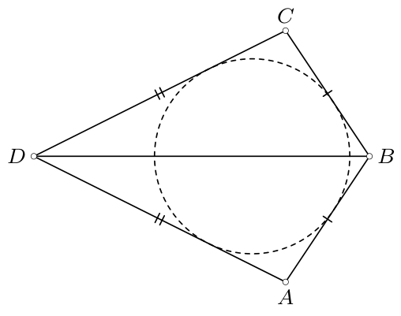
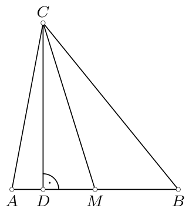
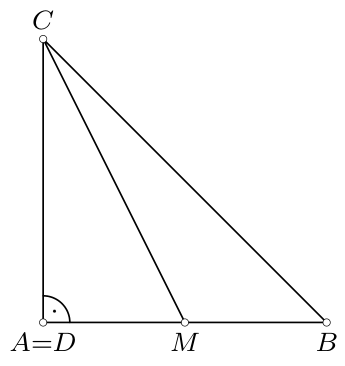
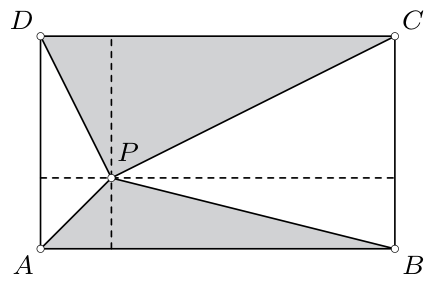
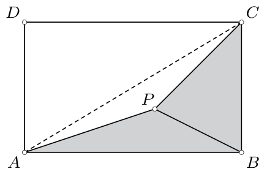
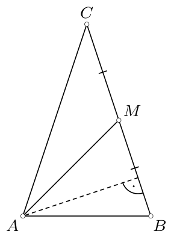
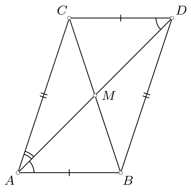
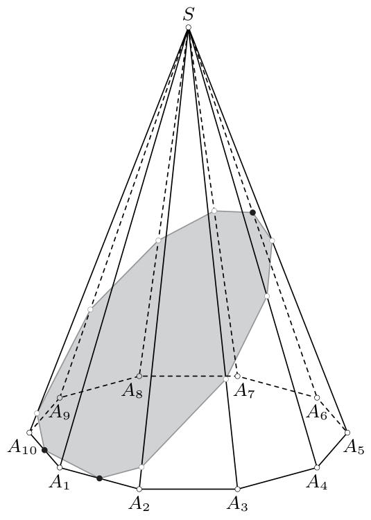
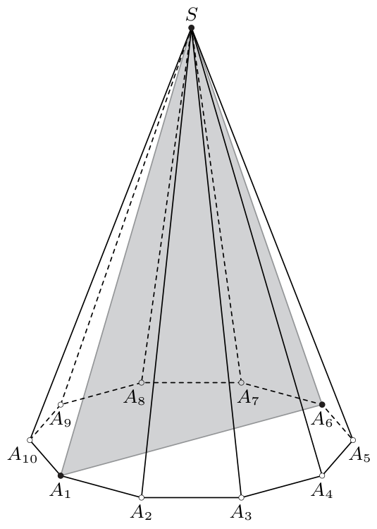

# <lo-sample/> PL.OMJ.2014TEST.7_8.1

Istnieje ostrosłup, który ma dokładnie $15^{14}$

**(a)** wierzchołków;

**(b)** krawędzi;

**(c)** ścian.

<small>

* answer:T,N,T
* questionType:ShortAnswer

</small>

## Rozwiązanie

a), c) Ostrosłup o podstawie $n$-kąta ma $n+1$ wierzchołków oraz $n+1$ ścian. Wobec tego dla $n=15^{14}-1$ otrzymujemy ostrosłup o $15^{14}$ wierzchołkach i $15^{14}$ ścianach.

b) Ostrosłup o podstawie $n$-kąta ma $2n$ krawędzi. W każdym ostrosłupie liczba krawędzi jest więc parzysta, podczas gdy $15^{14}$ nie jest liczbą parzystą.

# <lo-sample/> PL.OMJ.2014TEST.7_8.2

Mieszając w odpowiednich proporcjach roztwory soli kuchennej w wodzie, o stężeniach $10\%$ i $30\%$, można otrzymać roztwór o stężeniu

**(a)** $20\%$;

**(b)** $27\%$;

**(c)** $40\%$.

<small>

* answer:T,T,N
* questionType:ShortAnswer

</small>

## Rozwiązanie

W $a$ jednostkach roztworu o stężeniu $p\%$ znajduje się $\frac{a\cdot p}{100}$ jednostek soli. W takim razie mieszając $a_1$ jednostek roztworu o stężeniu $p_1\%$ oraz $a_2$ jednostek roztworu o stężeniu $p_2\%$, otrzymujemy $a_1+a_2$ jednostek roztworu, w którym liczba jednostek soli jest równa
$$
\frac{a_1\cdot p_1}{100}+\frac{a_2\cdot p_2}{100}.
$$
To oznacza, że po zmieszaniu uzyskujemy roztwór o stężeniu
$$
\frac{a_1\cdot p_1+a_2\cdot p_2}{100\cdot(a_1+a_2)}\cdot 100\%=\left(\frac{a_1\cdot p_1+a_2\cdot p_2}{a_1+a_2}\right)\%.
$$

a) W wyniku zmieszania jednej jednostki roztworu o stężeniu $10\%$ z jedną jednostką roztworu o stężeniu $30\%$ otrzymamy roztwór o stężeniu
$$
\left(\frac{1\cdot 10+1\cdot 30}{2}\right)\%=20\%.
$$

b) W wyniku zmieszania trzech jednostek roztworu o stężeniu $10\%$ z siedemnastoma jednostkami roztworu o stężeniu $30\%$ otrzymamy roztwór o stężeniu
$$
\left(\frac{3\cdot 10+17\cdot 30}{20}\right)\%=27\%.
$$

c) Mieszając dane roztwory, otrzymamy roztwór o stężeniu mniejszym od $30\%$. Rzeczywiście, w wyniku zmieszania $a_1$ jednostek roztworu o stężeniu $10\%$ z $a_2$ jednostkami roztworu o stężeniu $30\%$ uzyskujemy roztwór o stężeniu
$$
\left(\frac{a_1\cdot 10+a_2\cdot 30}{a_1+a_2}\right)\%<\left(\frac{a_1\cdot 30+a_2\cdot 30}{a_1+a_2}\right)\%=30\%.
$$
W związku z tym nie można otrzymać roztworu o stężeniu $40\%$.

# <lo-sample/> PL.OMJ.2014TEST.7_8.3

Nierówność $(x-4)(x-9)>0$ jest prawdziwa dla

**(a)** $x=\sqrt{3}$;

**(b)** $x=\sqrt{7}$;

**(c)** $x=\sqrt{17}$.

<small>

* answer:T,T,N
* questionType:ShortAnswer

</small>

## Rozwiązanie

Dana nierówność jest prawdziwa, gdy obie liczby $x-4$, $x-9$ są ujemne lub gdy obie są dodatnie. Pierwszy warunek oznacza, że $x<4$, a drugi jest spełniony jedynie dla $x>9$. Wobec tego dana nierówność jest spełniona wtedy i tylko wtedy, gdy $x<4$ lub $x>9$.

a) Jeśli $x=\sqrt{3}$, to $x<\sqrt{16}=4$.

b) Jeśli $x=\sqrt{7}$, to $x<\sqrt{16}=4$.

c) Jeśli $x=\sqrt{17}$, to $x>\sqrt{16}=4$ oraz $x<\sqrt{81}=9$.

# <lo-sample/> PL.OMJ.2014TEST.7_8.4

Cyfry $1$, $2$, $3$, $4$, $5$, $6$ można ustawić w takiej kolejności, aby otrzymać liczbę sześciocyfrową, która jest

**(a)** podzielna przez $5$;

**(b)** podzielna przez $9$;

**(c)** liczbą pierwszą.

<small>

* answer:T,N,N
* questionType:ShortAnswer

</small>

## Rozwiązanie

a) Ostatnią cyfrą liczby $123465$ jest $5$, więc jest to liczba podzielna przez $5$.

b) Dowolna liczba $n$, której cyframi są $1$, $2$, $3$, $4$, $5$, $6$ w pewnej kolejności, ma sumę cyfr równą $1+2+3+4+5+6=21$. Liczba $21$ nie jest podzielna przez $9$, więc korzystając z cechy podzielności przez $9$, wnosimy, że liczba $n$ również nie może być podzielna przez $9$.

c) Każda liczba sześciocyfrowa składająca się z cyfr $1$, $2$, $3$, $4$, $5$, $6$ ma sumę cyfr równą $21$. Liczba $21$ jest podzielna przez $3$, więc liczba sześciocyfrowa o sumie cyfr równej $21$ również jest podzielna przez $3$. Taka liczba, jako większa od $3$, nie może być liczbą pierwszą.

# <lo-sample/> PL.OMJ.2014TEST.7_8.5

Czworokąt wypukły $ABCD$ jest opisany na okręgu i $AB=BC$. Wynika z tego, że

**(a)** $\angle ABC=\angle ADC$;

**(b)** $CD=DA$;

**(c)** czworokąt $ABCD$ jest rombem.

<small>

* answer:N,T,N
* questionType:ShortAnswer

</small>

## Rozwiązanie

b) Skoro czworokąt $ABCD$ jest opisany na okręgu, to $AB+CD=BC+DA$. Stąd wynika, że jeśli $AB=BC$, to $CD=DA$.

a) Rozpatrzmy trójkąt $ABD$, w którym $AB<AD$. Niech $C$ będzie obrazem symetrycznym punktu $A$ względem prostej $BD$ (rys. 1). Wówczas $AB+CD=BC+DA$, a więc czworokąt $ABCD$ jest opisany na okręgu. Ponadto, skoro $AB<AD$, to $\angle ABD>\angle ADB$. Mnożąc tę nierówność stronami przez $2$, uzyskujemy $\angle ABC>\angle ADC$.

rys. 1

c) Czworokąt $ABCD$ zbudowany punkcie a) spełnia warunki zadania, ale nie jest rombem.

# <lo-sample/> PL.OMJ.2014TEST.7_8.6

Iloczyn $a\cdot b$ liczb całkowitych $a$, $b$ jest podzielny przez $400$. Wynika z tego, że co najmniej jedna z liczb $a$, $b$ jest podzielna przez

**(a)** $5$;

**(b)** $8$;

**(c)** $10$.

<small>

* answer:T,N,N
* questionType:ShortAnswer

</small>

## Rozwiązanie

a) Gdyby żadna z liczb $a$, $b$ nie była podzielna przez $5$, iloczyn $a\cdot b$ tych liczb również nie mógłby być podzielny przez $5$, a tym bardziej przez $400$.

b) Jeżeli $a=4$, $b=100$, to $a\cdot b=400$ jest liczbą podzielną przez $400$, ale żadna z liczb $a$, $b$ nie jest podzielna przez $8$.

c) Jeżeli $a=16$, $b=25$, to $a\cdot b=400$ jest liczbą podzielną przez $400$, ale żadna z liczb $a$, $b$ nie jest podzielna przez $10$.

# <lo-sample/> PL.OMJ.2014TEST.7_8.7

W trójkącie $ABC$ punkt $M$ jest środkiem boku $AB$, a punkt $D$ jest spodkiem wysokości poprowadzonej z wierzchołka $C$. Wynika z tego, że

**(a)** $2\cdot DM<AB$;

**(b)** $CD\leq AC$ oraz $CD\leq BC$;

**(c)** $CM<AC$ oraz $CM<BC$.

<small>

* answer:N,T,N
* questionType:ShortAnswer

</small>

## Rozwiązanie

b) Jeżeli punkty $A$ i $D$ pokrywają się, to $CD=CA$. W przeciwnym wypadku odcinek $CD$ jest przyprostokątną trójkąta prostokątnego $CDA$, więc długość tego odcinka jest mniejsza od długości przeciwprostokątnej $CA$ tego trójkąta, czyli $CD<CA$ (rys. 2). Wobec tego $CD\leq AC$. Analogicznie uzasadniamy, że $CD\leq CB$.

rys. 2

rys. 3

a), c) Niech $ABC$ będzie równoramiennym trójkątem prostokątnym o kącie prostym przy wierzchołku $A$ (rys. 3). Wówczas punkty $A$ i $D$ pokrywają się, więc $2DM=2AM=AB$. Odcinek $CA$ jest przyprostokątną trójkąta prostokątnego $CAM$, więc jego długość jest mniejsza od długości przeciwprostokątnej tego trójkąta, czyli $CM>AC$.

# <lo-sample/> PL.OMJ.2014TEST.7_8.8

Punkt $P$ znajduje się wewnątrz prostokąta $ABCD$ o polu $1$, przy czym $AB>BC$. Wynika z tego, że

**(a)** co najmniej jeden z trójkątów $ABP$, $BCP$, $CDP$, $DAP$ ma pole mniejsze od $0,26$;

**(b)** suma pól trójkątów $ABP$ i $CDP$ jest większa od $0,5$;

**(c)** suma pól trójkątów $ABP$ i $BCP$ jest większa od $0,5$.

<small>

* answer:T,N,N
* questionType:ShortAnswer

</small>

## Rozwiązanie

a) Gdyby każdy z omawianych czterech trójkątów miał pole równe co najmniej $0,26$, to suma pól tych trójkątów byłaby nie mniejsza od $4\cdot 0,26=1,04$. Tymczasem suma pól tych trójkątów jest równa polu prostokąta $ABCD$, jest więc równa $1$.

b) Udowodnimy, że niezależnie od wyboru punktu $P$ suma pól trójkątów $ABP$ i $CDP$ jest równa $0,5$.

Podzielmy prostokąt $ABCD$ na cztery mniejsze prostokąty prostymi przechodzącymi przez punkt $P$ (rys. 4). Każdy z otrzymanych mniejszych prostokątów możemy podzielić przekątną na dwa trójkąty przystające, a więc trójkąty o równych polach, z których jeden kolorujemy na szaro, a drugi na biało. Suma pól trójkątów $ABP$ i $CDP$, czyli szara powierzchnia, stanowi więc połowę pola prostokąta $ABCD$.

rys. 4

rys. 5

c) Jeżeli punkt $P$ należy do wnętrza trójkąta $ABC$ (rys. 5), to suma pól trójkątów $ABP$ i $BCP$ jest mniejsza od pola trójkąta $ABC$, równego $0,5$.

# <lo-sample/> PL.OMJ.2014TEST.7_8.9

Na tablicy napisano siedem różnych liczb całkowitych. Wynika z tego, że

**(a)** suma pewnych trzech spośród nich jest podzielna przez $2$;

**(b)** suma pewnych czterech spośród nich jest podzielna przez $2$;

**(c)** suma pewnych trzech spośród nich jest podzielna przez $3$.

<small>

* answer:N,T,T
* questionType:ShortAnswer

</small>

## Rozwiązanie

a) Jeżeli na tablicy znajduje się siedem liczb nieparzystych, to suma każdych trzech spośród nich jest liczbą nieparzystą.

b) Wśród każdych siedmiu liczb całkowitych są co najmniej cztery liczby parzyste lub co najmniej cztery liczby nieparzyste. Rzeczywiście, gdyby zarówno liczb parzystych, jak i nieparzystych było co najwyżej trzy, to łącznie na tablicy mogłoby być napisanych co najwyżej sześć liczb, podczas gdy jest ich siedem. Pozostaje zauważyć, że suma czterech liczb parzystych oraz suma czterech liczb nieparzystych są liczbami parzystymi.

c) Wśród każdych siedmiu liczb całkowitych są co najmniej trzy liczby dające tę samą resztę przy dzieleniu przez $3$. Rzeczywiście, gdyby każdą z trzech możliwych reszt dawały co najwyżej dwie liczby, to łącznie na tablicy mogłoby być napisanych co najwyżej sześć liczb, podczas gdy jest ich siedem. Pozostaje zauważyć, że suma trzech liczb dających tę samą resztę przy dzieleniu przez $3$ jest podzielna przez $3$.

# <lo-sample/> PL.OMJ.2014TEST.7_8.10

Liczba $\sqrt{(1-\sqrt{2})^2}+\sqrt{2}$ jest

**(a)** całkowita;

**(b)** niewymierna;

**(c)** większa od $1,8$.

<small>

* answer:N,T,T
* questionType:ShortAnswer

</small>

## Rozwiązanie

Oznaczmy daną liczbę przez $a$. Ponieważ $1-\sqrt{2}<0$, więc $|1-\sqrt{2}|=\sqrt{2}-1$. Wobec tego
$$
a=\sqrt{(1-\sqrt{2})^2}+\sqrt{2}=|1-\sqrt{2}|+\sqrt{2}=\sqrt{2}-1+\sqrt{2}=2\sqrt{2}-1.
$$

a), b) Gdyby liczba $a$ była wymierna, to również liczba $\frac{a+1}{2}=\sqrt{2}$ musiałaby być wymierna. Jednak liczba $\sqrt{2}$ jest niewymierna, więc liczba $a$ także musi być niewymierna.

c) Prawdziwa jest nierówność $\sqrt{2}>\sqrt{1,96}=1,4$. Stąd wynika, że
$$
a=2\sqrt{2}-1>2\cdot 1,4-1=1,8.
$$

# <lo-sample/> PL.OMJ.2014TEST.7_8.11

W trójkącie równoramiennym $ABC$ o podstawie $AB$ punkt $M$ jest środkiem ramienia $BC$. Wynika z tego, że

**(a)** $2\cdot AM<3\cdot BC$;

**(b)** pola trójkątów $ABM$ i $ACM$ są równe;

**(c)** $\angle CAM=\frac12\angle CAB$.

<small>

* answer:T,T,N
* questionType:ShortAnswer

</small>

## Rozwiązanie

a) Z nierówności trójkąta dla trójkąta $CAM$ wynika, że
$$
AM<AC+CM=BC+\frac12BC=\frac32BC,\quad\text{skąd}\quad 2\cdot AM<3\cdot BC.
$$

b) Trójkąty $ABM$ i $ACM$ mają równe podstawy $MB=MC$ oraz tę samą wysokość poprowadzoną na te podstawy (rys. 6). Stąd wniosek, że trójkąty te mają równe pola.

c) Niech $ABC$ będzie trójkątem równoramiennym o podstawie $AB$, w którym podstawa $AB$ jest krótsza od ramienia $AC$. Wykażemy, że wówczas $\angle CAM<\frac12\angle CAB$.

Niech $D$ będzie takim punktem, że czworokąt $ABDC$ jest równoległobokiem (rys. 7). Wówczas $DC<AC$, a więc $\angle CAM<\angle CDA=\angle MAB$. Wobec tego
$$
2\angle CAM<\angle CAM+\angle MAB=\angle CAB.
$$

rys. 6

rys. 7

# <lo-sample/> PL.OMJ.2014TEST.7_8.12

Istnieje $n$-kąt wypukły $(n\geq 4)$, w którym liczba przekątnych

**(a)** jest potęgą liczby $4$ o wykładniku całkowitym dodatnim;

**(b)** równa jest liczbie wierzchołków;

**(c)** jest mniejsza od połowy liczby wierzchołków.

<small>

* answer:N,T,N
* questionType:ShortAnswer

</small>

## Rozwiązanie

Wykażemy, że liczba przekątnych $n$-kąta wypukłego jest równa $\frac12n(n-3)$.

Każdy z wierzchołków $n$-kąta wypukłego jest końcem dokładnie $n-3$ przekątnych tego wielokąta. Stąd wniosek, że wszystkie przekątne mają łącznie dokładnie $n(n-3)$ końców. Skoro każda przekątna ma dwa końce, to przekątnych jest $\frac12n(n-3)$.

a) Przypuśćmy, że dla pewnej liczby całkowitej dodatniej $k$ zachodzi równość
$$
\frac12n(n-3)=4^k,\quad\text{czyli}\quad n(n-3)=2^{2k+1}.
$$
Liczby całkowite dodatnie $n$, $n-3$ różnią się o $3$, więc jedna z tych liczb jest parzysta, a druga — nieparzysta. Jedynym nieparzystym dzielnikiem liczby $2^{2k+1}$ jest liczba $1$, skąd wniosek, że $n-3=1$, czyli $n=4$. Jednak liczba przekątnych czworokąta wypukłego jest równa $2$, a $2$ nie jest potęgą liczby $4$ o wykładniku całkowitym. Uzyskana sprzeczność oznacza, że nie istnieje liczba $k$ o szukanych własnościach.

b) Każdy pięciokąt wypukły ma dokładnie $5$ przekątnych.

c) Ponieważ $n\geq 4$, więc $n-3\geq 1$, a zatem $\frac12n\cdot(n-3)\geq \frac12n$. To oznacza, że liczba przekątnych jest nie mniejsza od połowy liczby wierzchołków.

# <lo-sample/> PL.OMJ.2014TEST.7_8.13

Dodatnia liczba całkowita $n$ ma tę własność, że liczba $\sqrt{2+\sqrt{4+n}}$ jest naturalna. Wynika z tego, że liczba $n$ jest

**(a)** podzielna przez $2$;

**(b)** podzielna przez $3$;

**(c)** większa od $\sqrt{2014}$.

<small>

* answer:N,T,T
* questionType:ShortAnswer

</small>

## Rozwiązanie

Oznaczmy $k=\sqrt{2+\sqrt{4+n}}$. Przekształcając tę równość, otrzymujemy kolejno:
$$
k^2=2+\sqrt{4+n},
$$
$$
k^2-2=\sqrt{4+n},
$$
$$
k^4-4k^2+4=4+n,
$$
$$
k^2(k^2-4)=n,
$$
$$
k^2(k-2)(k+2)=n.
$$

b) Jeżeli $k$ jest liczbą naturalną, to jedna z liczb $k-2$, $k$, $k+2$ jest podzielna przez $3$. Rzeczywiście, jeżeli $k$ daje resztę $1$ przy dzieleniu przez $3$, to liczba $k+2$ jest podzielna przez $3$, a jeżeli $k$ daje resztę $2$ przy dzieleniu przez $3$, to liczba $k-2$ jest podzielna przez $3$. Stąd wniosek, że iloczyn $k^2(k-2)(k+2)$ jest liczbą podzielną przez $3$ dla każdej liczby naturalnej $k$.

c) Liczba $n=k^2(k-2)(k+2)$ jest dodatnia, skąd wynika, że $k\geq 3$. Wobec tego
$$
n=k^2(k-2)(k+2)\geq 3^2\cdot(3-2)(3+2)=45=\sqrt{2025}>\sqrt{2014}.
$$

a) Dla liczby nieparzystej $n=45$ liczba
$$
\sqrt{2+\sqrt{4+45}}=\sqrt{2+\sqrt{49}}=\sqrt{2+7}=\sqrt{9}=3
$$
jest naturalna.

# <lo-sample/> PL.OMJ.2014TEST.7_8.14

Liczba $\frac{2+\sqrt{6}}{3+\sqrt{6}}\cdot\frac{3+\sqrt{15}}{5+\sqrt{15}}\cdot\frac{5+\sqrt{10}}{2+\sqrt{10}}$ jest

**(a)** wymierna;

**(b)** większa od $1$;

**(c)** równa $\sqrt{30}$.

<small>

* answer:T,N,N
* questionType:ShortAnswer

</small>

## Rozwiązanie

$$
\frac{2+\sqrt{6}}{3+\sqrt{6}}\cdot\frac{3+\sqrt{15}}{5+\sqrt{15}}\cdot\frac{5+\sqrt{10}}{2+\sqrt{10}}
=
\frac{\sqrt{2}(\sqrt{2}+\sqrt{3})}{\sqrt{3}(\sqrt{3}+\sqrt{2})}\cdot
\frac{\sqrt{3}(\sqrt{3}+\sqrt{5})}{\sqrt{5}(\sqrt{5}+\sqrt{3})}\cdot
\frac{\sqrt{5}(\sqrt{5}+\sqrt{2})}{\sqrt{2}(\sqrt{2}+\sqrt{5})}=1.
$$

# <lo-sample/> PL.OMJ.2014TEST.7_8.15

Ostrosłup o podstawie będącej $10$-kątem wypukłym rozcięto płaszczyzną otrzymując w przekroju pewien wielokąt. Wynika z tego, że

**(a)** wielokąt ten ma co najwyżej $10$ wierzchołków;

**(b)** co najmniej jeden z wielościanów, na które został rozcięty dany ostrosłup, ma więcej niż $7$ wierzchołków;

**(c)** co najmniej jeden z wielościanów, na które został rozcięty dany ostrosłup, jest ostrosłupem.

<small>

* answer:N,N,N
* questionType:ShortAnswer

</small>

## Rozwiązanie

Rozważmy ostrosłup prawidłowy o podstawie dziesięciokąta foremnego $A_1A_2\ldots A_{10}$ oraz wierzchołku $S$.

a) Przetnijmy ostrosłup płaszczyzną przechodzącą przez środki krawędzi $A_1A_{10}$, $A_1A_2$ oraz $A_6S$ (rys. 8). Płaszczyzna ta przecina $11$ krawędzi wyjściowego ostrosłupa, więc w przekroju otrzymujemy pewien $11$-kąt wypukły.

c) Żadna z brył otrzymanych z przecięcia opisanego w poprzednim punkcie nie jest ostrosłupem. Jedna z tych brył ma dwie ściany $11$-kątne, a każdy ostrosłup ma co najwyżej jedną ścianę nie będącą trójkątem. Druga z otrzymanych brył ma dwie ściany czworokątne i jedną jedenastokątną, więc również nie może być ostrosłupem.

b) Przetnijmy ostrosłup płaszczyzną przechodzącą przez wierzchołki $A_1$, $A_6$ oraz $S$ (rys. 9). Wtedy każda z otrzymanych brył ma dokładnie $7$ wierzchołków.

rys. 8

rys. 9
