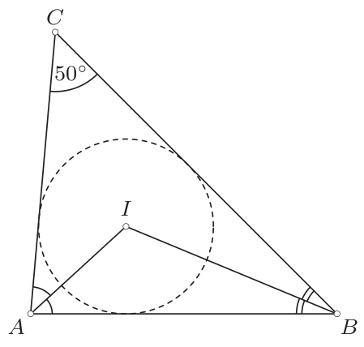
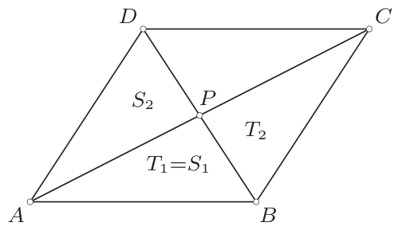
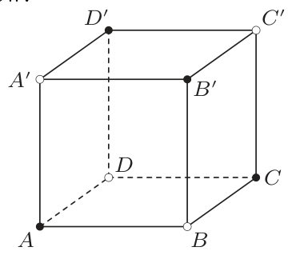
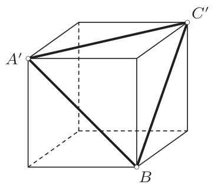
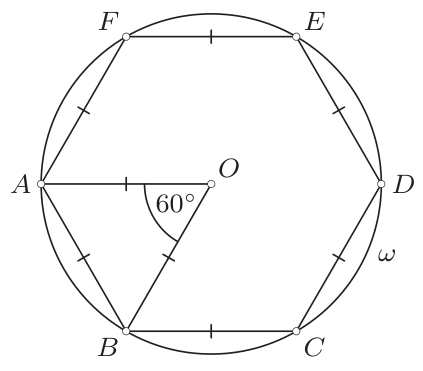
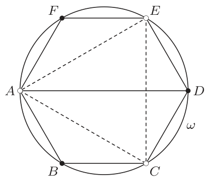
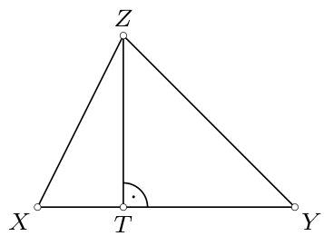
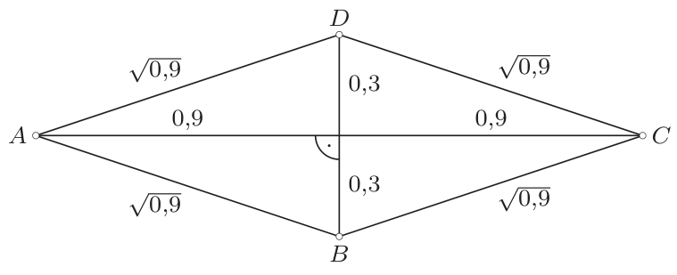
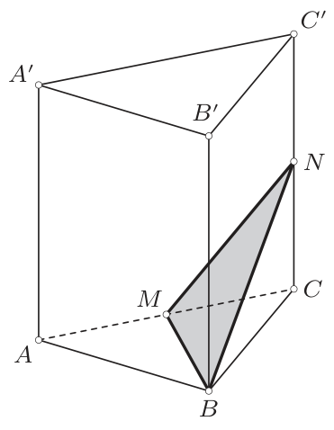

# <lo-sample/> PL.OMJ.2015TEST.7_8.1

Doti tādi pozitīvi skaitļi $a$ un $b$, ka $30\%$ no skaitļa $a$ ir vienādi ar $60\%$ no skaitļa $b$. No tā izriet, ka

**(a)** $a=2b$;

**(b)** $b=2a$;

**(c)** skaitlis $a$ ir par $100\%$ lielāks nekā skaitlis $b$.

<small>

* answer:T,N,T
* questionType:ShortAnswer

</small>

## Atrisinājums

Uzdevuma nosacījumus var pierakstīt šādi:
$$
30\%\cdot a=60\%\cdot b,
$$
$$
\frac{30}{100}a=\frac{60}{100}b,
$$
$$
a=2b.
$$
Konkrēti no tā izriet, ka $a=b+b=b+100\%\cdot b$.

# <lo-sample/> PL.OMJ.2015TEST.7_8.2

Divu taisnleņķa trijstūra malu garumi ir $3$ un $4$. No tā izriet, ka šī trijstūra trešās malas garums ir

**(a)** ne mazāks kā $5$;

**(b)** ne lielāks kā $5$;

**(c)** vienāds ar $5$.

<small>

* answer:N,T,N
* questionType:ShortAnswer

</small>

## Atrisinājums

Tā kā taisnleņķa trijstūra hipotenūza vienlaikus ir šī trijstūra garākā mala, tad malai ar garumu $3$ jābūt vienai no katetēm. Secinām, ka mala ar garumu $4$ ir vai nu otra katete, vai dotā trijstūra hipotenūza.

Pirmajā gadījumā saskaņā ar Pitagora teorēmu šī trijstūra hipotenūzas garums ir
$$
\sqrt{3^2+4^2}=5.
$$
Savukārt otrajā gadījumā otras katetes garums ir
$$
\sqrt{4^2-3^2}=\sqrt{7}.
$$
Atliek ievērot, ka $\sqrt{7}<\sqrt{25}=5$, no kā izriet, ka abos gadījumos aplūkotā trijstūra trešās malas garums nav lielāks kā $5$.

# <lo-sample/> PL.OMJ.2015TEST.7_8.3

Skaitlis $9^{16}-16^9$ dalās ar

**(a)** $4$;

**(b)** $5$;

**(c)** $3^{16}-4^9$.

<small>

* answer:N,T,T
* questionType:ShortAnswer

</small>

## Atrisinājums

a) Skaitlis $9^{16}$ ir nepāra, bet skaitlis $16^9$ ir pāra. Tātad starpība $9^{16}-16^9$ ir nepāra skaitlis, tāpēc tā nedalās ar $4$.

b) Skaitļa $9^{16}=81^8$ pēdējais cipars ir $1$, jo visas to skaitļu pakāpes, kas beidzas ar ciparu $1$, beidzas ar ciparu $1$. Līdzīgi skaitļa $16^9$ pēdējais cipars ir $6$, jo visas to skaitļu pakāpes, kas beidzas ar ciparu $6$, beidzas ar ciparu $6$. Tāpēc starpības $9^{16}-16^9$ pēdējais cipars ir $5$, tātad šī starpība dalās ar $5$.

c) Ievērosim, ka dotais skaitlis ir divu pozitīvu veselu skaitļu kvadrātu starpība, tāpēc to varam izteikt šādi:
$$
9^{16}-16^9=(3^{16})^2-(4^9)^2=(3^{16}-4^9)(3^{16}+4^9).
$$
Tātad aplūkotā starpība ir skaitlis, kas dalās ar $3^{16}-4^9$.

# <lo-sample/> PL.OMJ.2015TEST.7_8.4

Jebkuri divi no trim pozitīviem veseliem skaitļiem $a$, $b$, $c$ ir dažādi. Turklāt šie skaitļi apmierina sakarības $\operatorname{LKD}(a,b)=1$ un $\operatorname{LKD}(a,c)=1$ (ar $\operatorname{LKD}$ apzīmēts lielākais kopīgais dalītājs). No tā izriet, ka

**(a)** $\operatorname{LKD}(b,c)=1$;

**(b)** $\operatorname{LKD}(a,b+c)=1$;

**(c)** $\operatorname{LKD}(a,bc)=1$.

<small>

* answer:N,N,T
* questionType:ShortAnswer

</small>

## Atrisinājums

a), b) Ja $a=2$, $b=3$, $c=9$, tad $\operatorname{LKD}(a,b)=1$ un $\operatorname{LKD}(a,c)=1$, turklāt
$$
\operatorname{LKD}(b,c)=\operatorname{LKD}(3,9)=3\neq 1
$$
un
$$
\operatorname{LKD}(a,b+c)=\operatorname{LKD}(2,12)=2\neq 1.
$$

c) Pieņemsim, ka $\operatorname{LKD}(a,bc)>1$. Tas nozīmē, ka skaitļiem $a$ un $bc$ ir kopīgs dalītājs, kas lielāks par $1$. Tātad eksistē kāds skaitļu $a$ un $bc$ kopīgs pirmskaitļa dalītājs $p$. Tā kā $p$ dala reizinājumu $bc$, tad tas dala vismaz vienu no reizinātājiem $b$, $c$. Tātad vienam no pāriem $(a,b)$, $(a,c)$ ir kopīgs dalītājs, kas lielāks par $1$, t.i., $\operatorname{LKD}(a,b)\neq 1$ vai $\operatorname{LKD}(a,c)\neq 1$. Iegūtā pretruna pierāda, ka $\operatorname{LKD}(a,bc)=1$.

# <lo-sample/> PL.OMJ.2015TEST.7_8.5

Punkts $I$ ir trijstūrī $ABC$ ievilktās riņķa līnijas centrs, turklāt $\angle ACB=50^\circ$. No tā izriet, ka

**(a)** $\angle AIB=100^\circ$;

**(b)** $\angle AIB>110^\circ$;

**(c)** $\angle AIB<120^\circ$.

<small>

* answer:N,T,T
* questionType:ShortAnswer

</small>

## Atrisinājums

Punkts $I$ kā trijstūrī $ABC$ ievilktās riņķa līnijas centrs ir trijstūra $ABC$ iekšējo leņķu $BAC$ un $ABC$ bisektrišu krustpunkts (1. zīm.). Secinām, ka
$$
\angle BAI=\frac{\angle BAC}{2}
\quad\text{un}\quad
\angle ABI=\frac{\angle ABC}{2}.
$$
Trijstūra iekšējo leņķu summa ir $180^\circ$, no kurienes
$$
\angle BAC+\angle ABC=180^\circ-\angle ACB=130^\circ.
$$
Apvienojot iegūtās vienādības, iegūstam
$$
\angle AIB=180^\circ-\angle BAI-\angle ABI
=180^\circ-\frac{\angle BAC+\angle ABC}{2}
=180^\circ-\frac{130^\circ}{2}=115^\circ.
$$

1. zīm.

# <lo-sample/> PL.OMJ.2015TEST.7_8.6

Trijstūri $T$ sagrieza pa nogriezni divos trijstūros $T_1$ un $T_2$, bet trijstūri $S$ — trijstūros $S_1$ un $S_2$. Izrādījās, ka trijstūris $T_1$ ir vienāds ar trijstūri $S_1$, bet trijstūris $T_2$ ir vienāds ar trijstūri $S_2$. No tā izriet, ka trijstūriem $T$ un $S$

**(a)** ir vienādi laukumi;

**(b)** ir vienādi perimetri;

**(c)** ir vienādi.

<small>

* answer:T,N,N
* questionType:ShortAnswer

</small>

## Atrisinājums

a) Trijstūra $T$ laukums ir vienāds ar trijstūru $T_1$ un $T_2$ laukumu summu, bet trijstūra $S$ laukums ir vienāds ar trijstūru $S_1$ un $S_2$ laukumu summu. Vienādām figūrām ir vienādi laukumi, tāpēc trijstūru $T_1$ un $S_1$ laukumi ir vienādi un trijstūru $T_2$ un $S_2$ laukumi ir vienādi. Tātad arī trijstūru $T$ un $S$ laukumi ir vienādi.

b), c) Pieņemsim, ka $ABCD$ ir jebkurš paralelograms, kurā leņķis $ABC$ ir plats. Pieņemsim arī, ka $P$ ir diagonāļu $AC$ un $BD$ krustpunkts (2. zīm.). Apzīmēsim trijstūrus $ABC$, $ABP$, $BCP$ attiecīgi ar $T$, $T_1$, $T_2$, bet trijstūrus $ABD$, $ABP$, $DAP$ attiecīgi ar $S$, $S_1$, $S_2$. Ievērosim, ka tad trijstūri $T_1$ un $S_1$ ir vienādi (tas ir viens un tas pats trijstūris), un arī trijstūri $T_2$ un $S_2$ ir vienādi (viens ir otra attēls simetrijā attiecībā pret punktu $P$). Taču
$$
AB+BC+CA>AB+AD+DB,
$$
kas nozīmē, ka trijstūra $T$ perimetrs ir lielāks par trijstūra $S$ perimetru. No tā izriet arī, ka trijstūri $T$ un $S$ nav vienādi.

2. zīm.

# <lo-sample/> PL.OMJ.2015TEST.7_8.7

Reālie skaitļi $x$, $y$ apmierina nevienādību $x(x+2)<y(y+2)$. No tā izriet, ka

**(a)** $x<y$;

**(b)** $x+y\neq -2$;

**(c)** $|x+1|<|y+1|$.

<small>

* answer:N,T,T
* questionType:ShortAnswer

</small>

## Atrisinājums

b) Pieņemsim, ka $x+y=-2$. Tad $x+2=-y$ un $y+2=-x$, tāpēc
$$
x(x+2)=x\cdot(-y)=-xy
\quad\text{un}\quad
y(y+2)=y\cdot(-x)=-xy.
$$
No tā izriet, ka skaitļi $x(x+2)$ un $y(y+2)$ ir vienādi. Iegūtā pretruna pierāda, ka $x+y\neq 2$.

c) Uzdevumā doto nevienādību varam pārveidot ekvivalenti:
$$
x(x+2)<y(y+2),
$$
$$
x^2+2x<y^2+2y,
$$
$$
x^2+2x+1<y^2+2y+1,
$$
$$
(x+1)^2<(y+1)^2,
$$
$$
|x+1|<|y+1|.
$$

a) Pieņemot $x=0$, $y=-3$, iegūstam $x(x+2)=0$ un $y(y+2)=3$. Tātad šādi izvēlētiem skaitļiem izpildās dotā nevienādība $x(x+2)<y(y+2)$, bet $x>y$.

# <lo-sample/> PL.OMJ.2015TEST.7_8.8

Katru kuba virsotni nokrāsoja vienā no divām krāsām. No tā izriet, ka

**(a)** kādai šī kuba šķautnei abi galapunkti ir vienā krāsā;

**(b)** kādai šī kuba kādas skaldnes diagonālei abi galapunkti ir vienā krāsā;

**(c)** kādai šī kuba diagonālei abi galapunkti ir vienā krāsā.

<small>

* answer:N,T,N
* questionType:ShortAnswer

</small>

## Atrisinājums

Apzīmēsim divas pretējas kuba skaldnes ar $ABCD$ un $A'B'C'D'$ tā, lai nogriežņi $AA'$, $BB'$, $CC'$, $DD'$ būtu kuba šķautnes.

a), c) Ja nokrāsosim virsotnes $A$, $B'$, $C$, $D'$ melnā krāsā, bet virsotnes $A'$, $B$, $C'$, $D$ — baltā (3. zīm.), tad katrai kuba šķautnei un katrai kuba diagonālei galapunkti būs dažādās krāsās.

3. zīm.

b) Tā kā virsotnes nokrāsotas divās krāsās, tad kādas divas trijstūra $A'BC'$ virsotnes ir nokrāsotas vienā krāsā. Tas nozīmē, ka kādai šī trijstūra malai galapunkti ir vienā krāsā (4. zīm.).

4. zīm.

# <lo-sample/> PL.OMJ.2015TEST.7_8.9

Anteks, skrienot ar ātrumu $x$ km/h, vienu kilometru veic $x$ minūtēs, kur $x$ ir kāds pozitīvs reāls skaitlis. No tā izriet, ka

**(a)** $x$ ir racionāls skaitlis;

**(b)** Anteks skrien ar ātrumu, kas lielāks nekā $8$ km/h;

**(c)** ja Anteks ietu ar ātrumu $\frac12 x$ km/h, tad vienu kilometru viņš veiktu $2x$ minūtēs.

<small>

* answer:N,N,T
* questionType:ShortAnswer

</small>

## Atrisinājums

Tā kā Anteks vienu kilometru veic $x$ minūtēs, tad viņš skrien ar ātrumu $\frac{1}{x}$ kilometri minūtē, t.i., $\frac{60}{x}$ kilometri stundā. Tātad
$$
\frac{60}{x}=x,
$$
no kurienes aprēķinām $x=\sqrt{60}$.

a) Skaitlis $\sqrt{60}=2\sqrt{15}$ ir iracionāls.

b) Izpildās nevienādība $\sqrt{60}<\sqrt{64}=8$, tāpēc Anteks skrien ar ātrumu, kas mazāks nekā $8$ km/h.

c) Ja Anteks ietu divreiz lēnāk, tā paša ceļa veikšanai viņam būtu vajadzīgs divreiz vairāk laika.

# <lo-sample/> PL.OMJ.2015TEST.7_8.10

Daudzstūrim $A$ ir vismaz astoņas virsotnes un divreiz vairāk malu nekā daudzstūrim $B$. No tā izriet, ka daudzstūrim $A$ ir

**(a)** divreiz vairāk virsotņu nekā daudzstūrim $B$;

**(b)** divreiz vairāk diagonāļu nekā daudzstūrim $B$;

**(c)** pāra skaits diagonāļu.

<small>

* answer:T,N,N
* questionType:ShortAnswer

</small>

## Atrisinājums

a) Katram daudzstūrim ir tikpat malu, cik virsotņu. Tātad, ja daudzstūrim $A$ ir divreiz vairāk malu nekā daudzstūrim $B$, tad tam ir arī divreiz vairāk virsotņu.

b) Ievērosim, ka jebkura $n$-stūra diagonāļu skaits ir $\frac12 n(n-3)$. Patiešām, katra $n$-stūra virsotne ir galapunkts tieši $n-3$ šī daudzstūra diagonālēm. Secinām, ka visām diagonālēm kopā ir tieši $n(n-3)$ galapunkti. Tā kā katrai diagonālei ir divi galapunkti, tad diagonāļu ir $\frac12 n(n-3)$. Konkrēti no tā izriet, ka četrstūrim ir divas diagonāles, bet astoņstūrim, kuram ir divreiz vairāk malu, ir $20$, t.i., $10$ reizes vairāk, diagonāļu.

c) Izmantojot iepriekšējā punktā iegūto formulu izliekta $n$-stūra diagonāļu skaitam, konstatējam, ka katram izliektam desmitstūrim ir tieši
$$
\frac12\cdot 10\cdot(10-3)=35,
$$
t.i., nepāra skaits, diagonāļu.

# <lo-sample/> PL.OMJ.2015TEST.7_8.11

Katru riņķa līnijas $\omega$ ar rādiusu $1$ punktu nokrāsoja melnā vai baltā krāsā tā, ka katrai šīs riņķa līnijas hordai ar garumu $1$ galapunkti ir dažādās krāsās. No tā izriet, ka

**(a)** katram riņķa līnijas $\omega$ diametram galapunkti ir dažādās krāsās;

**(b)** katram riņķa līnijā $\omega$ ievilktam vienādmalu trijstūrim visas trīs virsotnes ir vienā krāsā;

**(c)** katram riņķa līnijā $\omega$ ievilktam kvadrātam ir divas melnas un divas baltas virsotnes.

<small>

* answer:T,T,T
* questionType:ShortAnswer

</small>

## Atrisinājums

Apzīmēsim ar $O$ riņķa līnijas $\omega$ centru. Pieņemsim, ka $A$ ir jebkurš riņķa līnijas $\omega$ punkts un $ABCDEF$ ir šajā riņķa līnijā ievilkts regulārs sešstūris (5. zīm.). Tad $\angle AOB=60^\circ$, jo tas ir centra leņķis, kas balstās uz loku, kas ir $\frac16$ no riņķa līnijas. Secinām, ka trijstūris $ABO$ ir vienādmalu, tāpēc $AB=OA=1$. Tas nozīmē, ka katra sešstūra $ABCDEF$ mala ir riņķa līnijas $\omega$ horda ar garumu $1$.

5. zīm.

6. zīm.

a) Nezaudējot vispārīgumu, pieņemsim, ka punkts $A$ ir nokrāsots baltā krāsā (spriedums gadījumā, kad punkts $A$ ir melns, ir pilnīgi analoģisks). Tad no uzdevuma nosacījumiem pēc kārtas izriet, ka punkti $B$ un $F$ ir nokrāsoti melnā krāsā, punkti $C$ un $E$ — baltā un visbeidzot punkts $D$ — melnā (6. zīm.). Nogrieznis $AD$ ir riņķa līnijas $\omega$ diametrs, kura galapunkti ir dažādās krāsās, un punkts $A$ tika izvēlēts patvaļīgi. Secinām, ka katram riņķa līnijas $\omega$ diametram galapunkti ir dažādās krāsās.

b) Trijstūris $ACE$ ar vienas krāsas virsotnēm ir vienādmalu un ievilkts riņķa līnijā $\omega$. Punkts $A$ tika izvēlēts patvaļīgi. No tā izriet, ka katram dotajā riņķa līnijā ievilktam vienādmalu trijstūrim virsotnes ir vienā krāsā.

c) Ievērosim, ka riņķa līnijā $\omega$ ievilkta kvadrāta diagonāles ir šīs riņķa līnijas diametri. No a) punkta zinām, ka katram šādam diametram viens galapunkts ir melns un viens balts. Secinām, ka starp kvadrāta virsotnēm vienmēr būs divas melnas un divas baltas virsotnes.

# <lo-sample/> PL.OMJ.2015TEST.7_8.12

Skaitlis $\sqrt{2}\cdot\sqrt[3]{2}\cdot\sqrt[6]{2}$ ir

**(a)** iracionāls;

**(b)** mazāks nekā $2$;

**(c)** vienāds ar $\sqrt[n]{2}$ kādam veselam skaitlim $n>1$.

<small>

* answer:N,N,N
* questionType:ShortAnswer

</small>

## Atrisinājums

Ievērosim, ka
$$
\sqrt{2}\cdot\sqrt[3]{2}\cdot\sqrt[6]{2}
=\sqrt[6]{2^3}\cdot\sqrt[6]{2^2}\cdot\sqrt[6]{2}
=\sqrt[6]{2^3\cdot 2^2\cdot 2}
=\sqrt[6]{2^6}=2.
$$

# <lo-sample/> PL.OMJ.2015TEST.7_8.13

Pozitīva vesela skaitļa $n$ ciparu reizinājums ir $4^{100}$. No tā izriet, ka

**(a)** skaitlis $n$ ir pāra;

**(b)** skaitlim $n$ ir vismaz $100$ cipari;

**(c)** skaitļa $n$ ciparu summa nav mazāka kā $400$.

<small>

* answer:N,N,T
* questionType:ShortAnswer

</small>

## Atrisinājums

a) Skaitlis $n=\underbrace{444\ldots 4}_{100\ \text{cipari }4}1$ ir nepāra, un tā ciparu reizinājums ir $4^{100}$.

b) Skaitlim $n=\underbrace{888\ldots 8}_{66\ \text{cipari }8}4$ ir $67$ cipari, un tā ciparu reizinājums ir
$$
8^{66}\cdot 4=2^{3\cdot 66}\cdot 2^2=2^{198+2}=2^{200}=4^{100}.
$$

c) Ievērosim, ka vienīgie iespējamie skaitļa $n$ cipari ir $1$, $2$, $4$ un $8$. Apzīmēsim ar $m_d$ cipara $d$ parādīšanās reižu skaitu skaitļa $n$ decimālajā pierakstā. Tad no uzdevuma nosacījumiem izriet, ka
$$
\underbrace{1\cdot 1\cdot\ldots\cdot 1}_{m_1\ \text{cipari }1}\cdot
\underbrace{2\cdot 2\cdot\ldots\cdot 2}_{m_2\ \text{cipari }2}\cdot
\underbrace{4\cdot 4\cdot\ldots\cdot 4}_{m_4\ \text{cipari }4}\cdot
\underbrace{8\cdot 8\cdot\ldots\cdot 8}_{m_8\ \text{cipari }8}
=4^{100},
$$
t.i., ekvivalenti
$$
1^{m_1}\cdot 2^{m_2}\cdot 4^{m_4}\cdot 8^{m_8}=4^{100},
$$
$$
2^{m_2}\cdot 2^{2m_4}\cdot 2^{3m_8}=2^{200},
$$
$$
2^{m_2+2m_4+3m_8}=2^{200},
$$
$$
m_2+2m_4+3m_8=200.
$$
Skaitļa $n$ ciparu summa ir
$$
\underbrace{1+1+\ldots+1}_{m_1\ \text{cipari }1}+
\underbrace{2+2+\ldots+2}_{m_2\ \text{cipari }2}+
\underbrace{4+4+\ldots+4}_{m_4\ \text{cipari }4}+
\underbrace{8+8+\ldots+8}_{m_8\ \text{cipari }8}
=m_1+2m_2+4m_4+8m_8.
$$
Tagad varam ievērot, ka
$$
m_1+2m_2+4m_4+8m_8
=m_1+2m_8+2\cdot(m_2+2m_4+3m_8)
=m_1+2m_8+2\cdot 200\geq 400,
$$
jo $m_1\geq 0$ un $m_8\geq 0$.

# <lo-sample/> PL.OMJ.2015TEST.7_8.14

Katras kāda četrstūra malas garums ir mazāks nekā $1$. No tā izriet, ka

**(a)** šī četrstūra laukums ir mazāks nekā $1$;

**(b)** eksistē kvadrāts ar malu $1$, kurā šis četrstūris atrodas;

**(c)** katras šī četrstūra diagonāles garums ir mazāks nekā $\sqrt{2}$.

<small>

* answer:T,N,N
* questionType:ShortAnswer

</small>

## Atrisinājums

Vispirms pierādīsim šādu faktu: ja vismaz divu trijstūra malu garums ir mazāks nekā $1$, tad šī trijstūra laukums ir mazāks nekā $\frac12$.

Pieņemsim, ka $XYZ$ ir trijstūris, kurā $XY<1$ un $XZ<1$ (7. zīm.). Apzīmēsim ar $T$ punkta $Z$ ortogonālo projekciju uz taisnes $XY$ (punkts $T$ var atrasties ārpus nogriežņa $XY$ vai sakrist ar vienu no punktiem $X$, $Y$). Taisnleņķa trijstūrī $XZT$ (kas var būt deģenerējies par nogriezni) hipotenūza $XZ$ nav īsāka par kateti $ZT$, t.i., $ZT\leq XZ$. Tātad iegūstam nevienādību
$$
[XYZ]=\frac{XY\cdot ZT}{2}\leq \frac{XY\cdot XZ}{2}<\frac{1\cdot 1}{2}=\frac12,
$$
kur $[\mathcal{F}]$ apzīmē figūras $\mathcal{F}$ laukumu. Ar to pierādījums pabeigts.

7. zīm.

a) Pieņemsim, ka $ABCD$ ir četrstūris, kura katras malas garums ir mazāks nekā $1$. Izmantojot sākumā pierādīto faktu, iegūstam
$$
[ABC]<\frac12
\quad\text{un}\quad
[ADC]<\frac12.
$$
Saskaitot abas šīs nevienādības pa daļām, iegūstam $[ABCD]<1$.

c) Aplūkosim perpendikulārus nogriežņus $AC$, $BD$ ar garumiem attiecīgi $1{,}8$ un $0{,}6$, kas krustpunktā dalās uz pusēm (8. zīm.). Tad četrstūris $ABCD$ ir rombs, kura katras malas garums ir
$$
\sqrt{0{,}9^2+0{,}3^2}=\sqrt{0{,}81+0{,}09}=\sqrt{0{,}9}<1.
$$
Savukārt diagonāles $AC$ garums ir lielāks nekā $\sqrt{2}$, jo $(1{,}8)^2=3{,}24>2=(\sqrt{2})^2$.

8. zīm.

b) Katra nogriežņa, kas atrodas kvadrātā ar malu $1$, garums nepārsniedz $\sqrt{2}$. Secinām, ka c) punktā konstruēto četrstūri $ABCD$ nevar novietot šāda kvadrāta iekšpusē.

# <lo-sample/> PL.OMJ.2015TEST.7_8.15

Regulāru trijstūra prizmu sagrieza ar plakni divos daudzskaldņos, šķēlumā iegūstot trijstūri. No tā izriet, ka

**(a)** katram no iegūtajiem daudzskaldņiem ir tieši divas trijstūra skaldnes;

**(b)** katrā katra iegūtā daudzskaldņa virsotnē satiekas tieši trīs šķautnes;

**(c)** katra katra iegūtā daudzskaldņa skaldne ir trijstūris vai četrstūris.

<small>

* answer:N,N,N
* questionType:ShortAnswer

</small>

## Atrisinājums

Aplūkosim regulāru trijstūra prizmu ar pamatiem $ABC$, $A'B'C'$, kas apzīmēti tā, ka $AA'$, $BB'$, $CC'$ ir prizmas sānu šķautnes. Pieņemsim, ka punkti $M$ un $N$ ir attiecīgi šķautņu $AC$ un $CC'$ viduspunkti.

Šķelsim prizmu ar plakni $BMN$, šķēlumā iegūstot trijstūri (9. zīm.). Tad vienam no iegūtajiem ķermeņiem ir trīs trijstūra skaldnes $ABM$, $BMN$, $A'B'C'$, tā virsotnē $B$ satiekas tieši četras šķautnes, un tam ir piecstūra skaldne $AMNC'A'$.

9. zīm.
