# <lo-sample/> PL.OMJ.2016TEST.7_8.1

Pozitīvs skaitlis $a$, palielināts par 50%, ir vienāds ar pozitīvu skaitli $b$, samazinātu par 50%. No tā izriet, ka skaitlis $b$ ir

**(a)** 2 reizes lielāks nekā skaitlis $a$;

**(b)** 3 reizes lielāks nekā skaitlis $a$;

**(c)** 4 reizes lielāks nekā skaitlis $a$.

<small>

* answer:N,T,N
* questionType:ShortAnswer

</small>

## Atrisinājums

No uzdevuma nosacījumiem izriet, ka
$$a+\frac{50}{100}a=b-\frac{50}{100}b,$$
no kurienes iegūstam $3a=b$.

# <lo-sample/> PL.OMJ.2016TEST.7_8.2

Kuba $A$ virsmas laukums ir 4 reizes mazāks nekā kuba $B$ virsmas laukums. No tā izriet, ka

**(a)** kuba $A$ šķautne ir 2 reizes mazāka nekā kuba $B$ šķautne;

**(b)** kuba $A$ šķautne ir 4 reizes mazāka nekā kuba $B$ šķautne;

**(c)** kuba $A$ tilpums ir 8 reizes mazāks nekā kuba $B$ tilpums.

<small>

* answer:T,N,T
* questionType:ShortAnswer

</small>

## Atrisinājums

a), b) Apzīmēsim ar $a$ kuba $A$ šķautnes garumu, bet ar $b$ — kuba $B$ šķautnes garumu. No uzdevuma nosacījumiem izriet, ka $6b^2=4\cdot 6a^2$, no kurienes iegūstam $b=2a$.

c) Kuba $A$ tilpums ir $a^3$, bet kuba $B$ tilpums ir
$$b^3=(2a)^3=8a^3,$$
t.i., tas ir 8 reizes lielāks nekā kuba $A$ tilpums.

# <lo-sample/> PL.OMJ.2016TEST.7_8.3

Reālie skaitļi $a$ un $b$ apmierina nevienādību $a\geqslant b$. No tā izriet, ka

**(a)** $a^2\geqslant ab$;

**(b)** $a^2\geqslant b^2$;

**(c)** $a^3\geqslant b^3$.

<small>

* answer:N,N,T
* questionType:ShortAnswer

</small>

## Atrisinājums

a), b) Ja $a=-1$, $b=-2$, tad nevienādība $a\geqslant b$ izpildās, bet
$$a^2=1<2=ab\quad\text{un}\quad a^2=1<4=b^2.$$

c) Tā kā $a\geqslant b$, tad iespējami trīs gadījumi: 1) $a\geqslant b\geqslant 0$, 2) $a>0>b$, 3) $0\geqslant a\geqslant b$. Gadījumā 1) abas nevienādības $a\geqslant b$ puses ir nenegatīvi skaitļi, tāpēc abas šīs nevienādības puses varam kāpināt jebkurā pakāpē, kuras kāpinātājs ir naturāls skaitlis. Konkrēti iegūstam $a^3\geqslant b^3$.

Gadījumā 2) skaitlis $a^3$ ir pozitīvs, bet skaitlis $b^3$ ir negatīvs, tāpēc $a^3>b^3$. Visbeidzot gadījumā 3) abi skaitļi $-a$ un $-b$ ir nenegatīvi un $-b\geqslant -a$. Tāpēc, kāpinot abas šīs nevienādības puses trešajā pakāpē, iegūstam $(-b)^3\geqslant (-a)^3$, t.i., $a^3\geqslant b^3$.

# <lo-sample/> PL.OMJ.2016TEST.7_8.4

Trijstūrī $ABC$ leņķis $ABC$ ir divreiz lielāks par leņķi $BAC$. Leņķa $ABC$ bisektrise krusto šim trijstūrim apvilkto riņķa līniju punktā $E$. No tā izriet, ka

**(a)** $EA=BC$;

**(b)** $CA=2\cdot BC$;

**(c)** taisnes $EC$ un $AB$ ir paralēlas.

<small>

* answer:T,N,T
* questionType:ShortAnswer

</small>

## Atrisinājums

a) Apzīmēsim trijstūrim $ABC$ apvilkto riņķa līniju ar $o$ (1. zīm.). No uzdevuma nosacījumiem izriet, ka $\angle BAC=\angle CBE=\angle EBA$. Šie leņķi ir ievilkti riņķa līnijā $o$ un balstās attiecīgi uz lokiem $BC$, $CE$ un $EA$, tātad šie loki ir vienāda garuma. Secinām, ka arī hordas $BC$, $CE$ un $EA$ ir vienāda garuma.

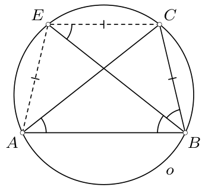

1. zīm.

b) Uzrakstot trijstūra nevienādību trijstūrim $ACE$, iegūstam
$$CA<CE+EA=2\cdot BC.$$

c) Leņķi $BEC$ un $EBA$ ir riņķa līnijā $o$ ievilkti leņķi, kas balstās attiecīgi uz lokiem $BC$ un $EA$, kuri ir vienāda garuma. Tātad $\angle BEC=\angle EBA$, un tas nozīmē, ka taisnes $EC$ un $AB$ ir paralēlas.

**Piezīme.** Atrisinājumā izmantojām riņķa līnijā ievilktu leņķu, kas balstās uz vienādiem lokiem, īpašību. Vairāk īpašību un to lietojuma piemēru uzdevumos var atrast rakstā „O łukach równej długości” (*Kwadrat* nr. 14, 2014. gada decembris).

# <lo-sample/> PL.OMJ.2016TEST.7_8.5

Skaitlis $\underbrace{33\ldots 3}_{n\ \text{trijnieki}}$ dalās ar 99. No tā izriet, ka skaitlis $n$ dalās

**(a)** ar 3;

**(b)** ar 6;

**(c)** ar 9.

<small>

* answer:T,T,N
* questionType:ShortAnswer

</small>

## Atrisinājums

Ieviesīsim apzīmējumu $A_n=\underbrace{33\ldots 3}_{n\ \text{trijnieki}}$.

a) Skaitlis $A_n$ dalās ar 99, tāpēc tas dalās arī ar 9. Tas nozīmē, ka skaitļa $A_n$ ciparu summa, kas ir $3n$, ir skaitlis, kas dalās ar 9. No tā izriet, ka $n$ ir skaitlis, kas dalās ar 3.

b) Tā kā $6=2\cdot 3$ un skaitļu 2 un 3 lielākais kopīgais dalītājs ir 1, tad, izmantojot a) punktu, pietiek pierādīt, ka skaitlis $n$ ir pāra.

Pieņemsim, ka skaitlis $n$ ir nepāra. Tad skaitlis
$$A_n=\underbrace{33\ldots 3}_{n-1\ \text{cipari}}0+3=33\cdot\underbrace{1010\ldots 10}_{n-1\ \text{cipari}}+3$$
dod atlikumu 3, dalot ar 33. Tātad tas nedalās ar 33, un jo vairāk ar 99. Esam ieguvuši pretrunu, no kuras izriet, ka skaitlis $n$ ir pāra.

c) Ievērosim, ka $A_6=333333=99\cdot 3367$, bet 6 nav skaitlis, kas dalās ar 9.

**Piezīme.** Var pierādīt, ka $A_n$ dalās ar 99 tad un tikai tad, ja $n$ dalās ar 6.

# <lo-sample/> PL.OMJ.2016TEST.7_8.6

Reālie skaitļi $a$ un $b$ ir atšķirīgi no nulles, un skaitlis $a\sqrt2+b\sqrt3$ ir racionāls. No tā izriet, ka

**(a)** abi skaitļi $a$ un $b$ ir iracionāli;

**(b)** vismaz viens no skaitļiem $a$, $b$ ir racionāls;

**(c)** vismaz viens no skaitļiem $a$, $b$ ir iracionāls.

<small>

* answer:N,N,T
* questionType:ShortAnswer

</small>

## Atrisinājums

a) Ja $a=\sqrt6$ un $b=-2$, tad
$$a\sqrt2+b\sqrt3=\sqrt{12}-2\sqrt3=2\sqrt3-2\sqrt3=0$$
ir racionāls skaitlis, bet viens no skaitļiem $a$, $b$ ir racionāls.

b) Ja $a=\sqrt2$ un $b=\sqrt3$, tad
$$a\sqrt2+b\sqrt3=2+3=5$$
ir racionāls skaitlis, bet neviens no skaitļiem $a$, $b$ nav racionāls.

c) Pieņemsim, ka abi skaitļi $a$ un $b$ ir racionāli. Ieviesīsim apzīmējumu $c=a\sqrt2+b\sqrt3$; no uzdevuma nosacījumiem izriet, ka $c$ ir racionāls skaitlis. Ievērosim, ka
$$(a\sqrt2+b\sqrt3)^2=c^2,$$
$$2a^2+2ab\sqrt6+3b^2=c^2,$$
$$2ab\sqrt6=c^2-2a^2-3b^2.$$
Tā kā abi skaitļi $a$ un $b$ ir atšķirīgi no 0, tad $ab\neq 0$. Tātad
$$\sqrt6=\frac{c^2-2a^2-3b^2}{2ab}.$$
Gan pēdējās vienādības labajā pusē esošās daļas skaitītājs, gan saucējs ir racionāli skaitļi, tāpēc visa daļa ir racionāls skaitlis. Turpretī pēdējās vienādības kreisā puse, kas ir $\sqrt6$, ir iracionāls skaitlis. Iegūtā pretruna nozīmē, ka vismaz viens no skaitļiem $a$ un $b$ ir iracionāls.

# <lo-sample/> PL.OMJ.2016TEST.7_8.7

Sešstūris $ABCDEF$ ir apvilkts ap riņķa līniju ar centru $S$. No tā izriet, ka

**(a)** $AB+CD+EF=BC+DE+FA$;

**(b)** $AD=BE=CF$;

**(c)** trijstūru $ABS$, $CDS$, $EFS$ laukumu summa ir vienāda ar trijstūru $BCS$, $DES$, $FAS$ laukumu summu.

<small>

* answer:T,N,T
* questionType:ShortAnswer

</small>

## Atrisinājums

a) Apzīmēsim attiecīgi ar $a$, $b$, $c$, $d$, $e$, $f$ to sešstūrī $ABCDEF$ ievilktās riņķa līnijas pieskaru nogriežņu garumus, kas novilkti no punktiem $A$, $B$, $C$, $D$, $E$, $F$ (2. zīm.). Tad
$$AB+CD+EF=a+b+c+d+e+f=BC+DE+FA.$$

c) Ievērosim, ka trijstūru $ABS$, $CDS$, $EFS$ augstumiem, kas novilkti no virsotnes $S$, ir viens un tas pats garums, kas vienāds ar sešstūrī $ABCDEF$ ievilktās riņķa līnijas rādiusu $r$ (3. zīm.). Tātad trijstūru $ABS$, $CDS$, $EFS$ laukumu summa ir
$$\frac{AB\cdot r}{2}+\frac{CD\cdot r}{2}+\frac{EF\cdot r}{2}=\frac r2(AB+CD+EF).$$
Analoģiski secinām, ka trijstūru $BCS$, $DES$, $FAS$ laukumu summa ir
$$\frac r2(BC+DE+FA).$$
Lai pārliecinātos, ka aplūkotās laukumu summas ir vienādas, atliek izmantot a) punkta secinājumu.

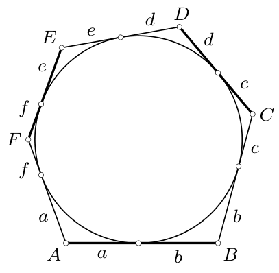

2. zīm.

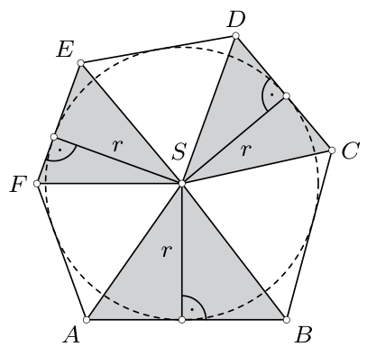

3. zīm.

b) Aplūkosim ap riņķa līniju $\omega$ apvilktu kvadrātu $ABKL$. Uz malām $AL$, $BK$ izvēlēsimies attiecīgi tādus punktus $F$, $C$, ka $AF=BC>\frac12 AB$ (4. zīm.). Visbeidzot pieņemsim, ka $D$, $E$ ir tādi nogrieznim $KL$ piederoši punkti, ka nogriežņi $CD$ un $EF$ pieskaras riņķa līnijai $\omega$. Tad $ABCDEF$ ir ap riņķa līniju $\omega$ apvilkts sešstūris, bet
$$CF=AB=AL<AD.$$

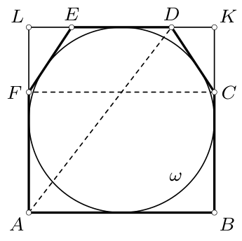

4. zīm.

# <lo-sample/> PL.OMJ.2016TEST.7_8.8

Skaitli $n$ var izteikt kā divu veselu skaitļu kvadrātu summu. No tā izriet, ka kā divu veselu skaitļu kvadrātu summu var izteikt arī skaitli

**(a)** $2n$;

**(b)** $3n$;

**(c)** $4n$.

<small>

* answer:T,N,T
* questionType:ShortAnswer

</small>

## Atrisinājums

No uzdevuma nosacījumiem izriet, ka eksistē tādi veseli skaitļi $a$ un $b$, ka $n=a^2+b^2$.

c) Ievērosim, ka $4n=4a^2+4b^2=(2a)^2+(2b)^2$, un skaitļi $2a$ un $2b$ ir veseli.

a) Ievērosim, ka
$$2n=2a^2+2b^2=a^2+2ab+b^2+a^2-2ab+b^2=(a+b)^2+(a-b)^2$$
un skaitļi $a+b$ un $a-b$ ir veseli.

b) Skaitlis $n=1=1^2+0^2$ ir divu veselu skaitļu kvadrātu summa, bet skaitli $3n=3$ nevar izteikt šādā formā.

**Piezīme.** 1. Var pierādīt, ka, ja no nulles atšķirīgu skaitli $n$ var izteikt kā divu veselu skaitļu kvadrātu summu, tad skaitli $3n$ nevar izteikt šādā formā.

2. c) un a) punktā iegūtās sakarības ir tā sauktās *Diofanta identitātes* speciālgadījumi. Vairāk par to var lasīt rakstā „Tożsamość Diofantosa” (*Kwadrat* nr. 2, 2011. gada decembris).

# <lo-sample/> PL.OMJ.2016TEST.7_8.9

Izliektam četrstūrim $ABCD$ ir tieši divas simetrijas asis. No tā izriet, ka šis četrstūris ir

**(a)** rombs;

**(b)** taisnstūris;

**(c)** paralelograms.

<small>

* answer:N,N,T
* questionType:ShortAnswer

</small>

## Atrisinājums

a) Jebkuram taisnstūrim, kas nav kvadrāts, ir tieši divas simetrijas asis (5. zīm.).

b) Jebkuram rombam, kas nav kvadrāts, ir tieši divas simetrijas asis (6. zīm.).

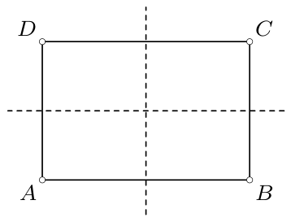

5. zīm.

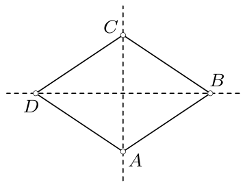

6. zīm.

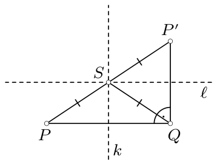

7. zīm.

c) Pierādīsim vispārīgāku faktu: ja daudzstūrim ir tieši divas simetrijas asis, tad tās ir perpendikulāras, un to krustpunkts ir daudzstūra simetrijas centrs. No tā izriet, ka, ja četrstūrim ir tieši divas simetrijas asis, tad tam ir arī simetrijas centrs, tātad tas ir paralelograms.

Pieņemsim, ka $k$ un $\ell$ ir (vienīgās divas) daudzstūra $\mathcal W$ simetrijas asis. Apzīmēsim ar $k'$ taisni, kas ir simetriska taisnei $k$ attiecībā pret taisni $\ell$. Tad arī taisne $k'$ ir daudzstūra $\mathcal W$ simetrijas ass un $k'\neq \ell$, no kā izriet, ka $k'=k$. Tātad taisne $k$ ir simetriska attiecībā pret taisni $\ell$ (kas atšķiras no $k$), un tas nozīmē, ka taisnes $k$ un $\ell$ ir perpendikulāras.

Apzīmēsim ar $S$ taisņu $k$ un $\ell$ krustpunktu. Pieņemsim, ka $P$ ir jebkurš plaknes punkts, $Q$ ir punktam $P$ simetrisks punkts attiecībā pret taisni $k$, bet $P'$ ir punktam $Q$ simetrisks punkts attiecībā pret taisni $\ell$ (7. zīm.). Ievērosim, ka punkts $P$ pieder daudzstūrim $\mathcal W$ tieši tad, ja punkts $Q$ pieder daudzstūrim $\mathcal W$, t.i., tieši tad, ja punkts $P'$ pieder daudzstūrim $\mathcal W$. Tātad pierādījums būs pabeigts, ja pierādīsim, ka punkti $P$ un $P'$ ir simetriski attiecībā pret punktu $S$ — tas nozīmēs, ka $S$ ir daudzstūra $\mathcal W$ simetrijas centrs.

Ievērosim, ka $SP=SQ=SP'$, tāpēc $S$ ir trijstūrim $PQP'$ apvilktās riņķa līnijas centrs. No taisņu $k$ un $\ell$ perpendikularitātes izriet, ka $\angle PQP'=90^\circ$, t.i., trijstūris $PQP'$ ir taisnleņķa, un tāpēc punkts $S$ ir hipotenūzas $PP'$ viduspunkts. Tas nozīmē, ka punkti $P$ un $P'$ ir simetriski attiecībā pret punktu $S$, un ar to fakta pierādījums ir pabeigts.

**Piezīme.** Var pamatot, ka, ja izliektam četrstūrim ir tieši divas simetrijas asis, tad tas ir taisnstūris (kas nav kvadrāts) vai rombs (kas nav kvadrāts). Gan taisnstūris, gan rombs ir paralelogrami. Tātad, ja izliektam četrstūrim ir tieši divas simetrijas asis, tad tas ir paralelograms, lai gan, protams, ne katram paralelogramam ir divas simetrijas asis.

# <lo-sample/> PL.OMJ.2016TEST.7_8.10

Racionālie skaitļi $a$, $b$, $c$ ir dažādi, un katrs no reizinājumiem $a\cdot b$, $b\cdot c$, $c\cdot a$ ir vesels skaitlis. No tā izriet, ka

**(a)** vismaz viens no skaitļiem $a$, $b$, $c$ ir vesels;

**(b)** vismaz divi no skaitļiem $a$, $b$, $c$ ir veseli;

**(c)** katrs no skaitļiem $a$, $b$, $c$ ir vesels.

<small>

* answer:N,N,N
* questionType:ShortAnswer

</small>

## Atrisinājums

Pieņemsim $a=\frac{3\cdot 5}{2}$, $b=\frac{5\cdot 2}{3}$, $c=\frac{2\cdot 3}{5}$. Skaitļi $a$, $b$, $c$ ir dažādi, racionāli, un neviens no tiem nav vesels skaitlis. Turpretī katrs no reizinājumiem $a\cdot b=25$, $b\cdot c=4$, $c\cdot a=9$ ir vesels skaitlis.

# <lo-sample/> PL.OMJ.2016TEST.7_8.11

Dots tāds trijstūris $ABC$, ka $\angle ACB=30^\circ$. Šim trijstūrim apvilktās riņķa līnijas rādiuss ir $R$, bet ievilktās riņķa līnijas rādiuss ir $r$. No tā izriet, ka

**(a)** $AB=R$;

**(b)** $r=\frac{R\sqrt3}{2}$;

**(c)** trijstūra $ABC$ laukums ir mazāks nekā $R^2$.

<small>

* answer:T,N,T
* questionType:ShortAnswer

</small>

## Atrisinājums

a) Apzīmēsim ar $O$ trijstūrim $ABC$ apvilktās riņķa līnijas centru (8. zīm.). Tā kā $\angle AOB=2\cdot\angle ACB=2\cdot 30^\circ=60^\circ$ un $AO=BO=R$, tad trijstūris $ABO$ ir vienādmalu. Secinām, ka $AB=R$.

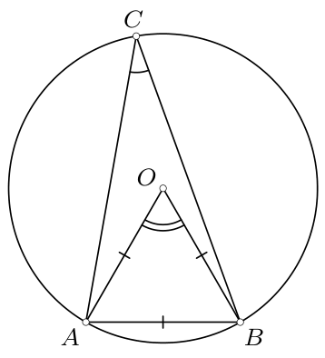

8. zīm.

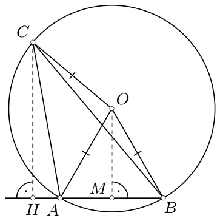

9. zīm.

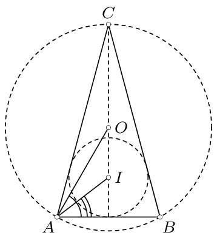

10. zīm.

c) Pieņemsim, ka $H$ ir trijstūra $ABC$ no virsotnes $C$ novilktā augstuma pamats, bet $M$ — vienādmalu trijstūra $ABO$ no virsotnes $O$ novilktā augstuma pamats (9. zīm.). Tad
$$CH\leqslant CO+OM=R+\frac{R\sqrt3}{2}<2R.$$
Tātad, apzīmējot ar $S$ trijstūra $ABC$ laukumu, iegūstam
$$S=\frac12\cdot AB\cdot CH<\frac12\cdot R\cdot 2R=R^2.$$

b) Aplūkosim trijstūri $ABC$, kurā $\angle ACB=30^\circ$ un $\angle BAC=\angle CBA=75^\circ$ (10. zīm.). Apzīmēsim šajā trijstūrī ievilktās riņķa līnijas centru ar $I$. Punkti $O$ un $I$ atrodas uz taisnes, kas ir perpendikulāra $AB$, un
$$\angle BAO=60^\circ>37.5^\circ=\frac{\angle BAC}{2}=\angle BAI.$$
Tātad punkta $I$ attālums līdz taisnei $AB$ ir mazāks nekā punkta $O$ attālums līdz taisnei $AB$, tātad $r<\frac{R\sqrt3}{2}$.

# <lo-sample/> PL.OMJ.2016TEST.7_8.12

Eksistē pozitīvs vesels skaitlis $n$ ar šādu īpašību: skaitļa $2^n$ decimālā pieraksta ciparus var tā pārkārtot, lai iegūtu kādu veselu pakāpi ar bāzi

**(a)** 3;

**(b)** 5;

**(c)** 7.

<small>

* answer:N,T,T
* questionType:ShortAnswer

</small>

## Atrisinājums

a) Ja $n$ ir pozitīvs vesels skaitlis, tad skaitlis $2^n$ nedalās ar 3. Tātad arī skaitļa $2^n$ decimālā pieraksta ciparu summa nedalās ar 3. Turpretī skaitlis, kas ir skaitļa 3 pakāpe ar pozitīvu veselu kāpinātāju, dalās ar 3, tātad tā decimālā pieraksta ciparu summa ir skaitlis, kas dalās ar 3.

b) Ja $n=9$, tad skaitļa $2^n=512$ ciparus var tā pārkārtot, lai iegūtu skaitli $125=5^3$.

c) Ja $n=10$, tad skaitļa $2^n=1024$ ciparus var tā pārkārtot, lai iegūtu skaitli $2401=7^4$.

# <lo-sample/> PL.OMJ.2016TEST.7_8.13

Katra $n$-stūra prizmas šķautne tika nokrāsota vienā no trim krāsām tā, ka katrā prizmas virsotnē satiekas trīs dažādu krāsu šķautnes. No tā izriet, ka

**(a)** $n$ ir pāra skaitlis;

**(b)** visas šīs prizmas sānu šķautnes ir vienā krāsā;

**(c)** šai prizmai ir pa $n$ katras krāsas šķautnēm.

<small>

* answer:N,N,T
* questionType:ShortAnswer

</small>

## Atrisinājums

a), b) Aplūkosim trijstūra prizmu ar pamatiem $ABC$, $A'B'C'$ un sānu šķautnēm $AA'$, $BB'$, $CC'$ (11. zīm.). Ja šķautnes $AA'$, $BC$, $B'C'$ nokrāsosim sarkanā krāsā, šķautnes $BB'$, $CA$, $C'A'$ — zaļā, bet šķautnes $CC'$, $AB$, $A'B'$ — zilā, tad uzdevuma nosacījumi būs izpildīti. Tad $n=3$ ir nepāra skaitlis, un šķautnes $AA'$, $BB'$, $CC'$ ir dažādās krāsās.

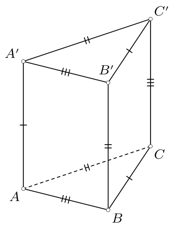

11. zīm.

c) Pieņemsim, ka prizmas šķautnes nokrāsotas sarkanā, zaļā un zilā krāsā. No uzdevuma nosacījumiem izriet, ka katra no $2n$ prizmas virsotnēm ir galapunkts tieši vienai sarkanai šķautnei. Tā kā katra šķautne savieno tieši divas prizmas virsotnes, tad sarkano šķautņu ir tieši $2n/2=n$. Pilnīgi analoģiski pamatojam, ka šim daudzskaldnim ir tieši $n$ zaļas šķautnes un tieši $n$ zilas šķautnes.

# <lo-sample/> PL.OMJ.2016TEST.7_8.14

No kāda regulāra divpadsmitstūra virsotnēm izcēla septiņas. No tā izriet, ka starp izceltajiem punktiem var norādīt tādus trīs, kas ir virsotnes trijstūrim, kurš ir

**(a)** taisnleņķa;

**(b)** vienādmalu;

**(c)** platleņķa vienādsānu.

<small>

* answer:T,N,N
* questionType:ShortAnswer

</small>

## Atrisinājums

Apzīmēsim doto regulāro divpadsmitstūri ar $A_1A_2\ldots A_{12}$.

a) Ievērosim, ka vismaz vienam no sešiem dotajam divpadsmitstūrim apvilktās riņķa līnijas diametriem
$$A_1A_7,\ A_2A_8,\ A_3A_9,\ A_4A_{10},\ A_5A_{11},\ A_6A_{12}$$
abi galapunkti ir izceltie punkti (12. zīm.), jo pretējā gadījumā izcelto punktu būtu ne vairāk kā seši. Pievienojot šāda diametra galapunktiem jebkuru citu izcelto punktu, iegūstam taisnleņķa trijstūra virsotnes.

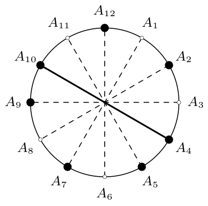

12. zīm.

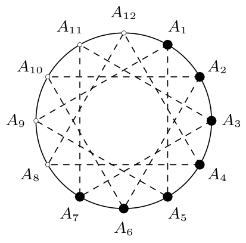

13. zīm.

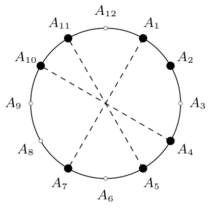

14. zīm.

b) Ja izcelti punkti $A_1$, $A_2$, $\ldots$, $A_7$, tad nekādi trīs no tiem nav vienādmalu trijstūra virsotnes (13. zīm.). Patiešām, tikai četri dotā divpadsmitstūra virsotņu trijnieki nosaka vienādmalu trijstūrus:
$$A_1A_5A_9,\ A_2A_6A_{10},\ A_3A_7A_{11},\ A_4A_8A_{12}$$
un neviens no tiem nesastāv tikai no izceltajiem punktiem.

c) Ja izcelti punkti $A_1$, $A_2$, $A_4$, $A_5$, $A_7$, $A_{10}$, $A_{11}$ (14. zīm.), tad nekādi trīs no tiem nav platleņķa vienādsānu trijstūra virsotnes. Tad vienīgie vienādsānu trijstūri ar virsotnēm izceltajos punktos ir
$$A_1A_4A_7,\ A_1A_4A_{10},\ A_1A_7A_{10},\ A_2A_5A_{11},\ A_4A_7A_{10}$$
un visi šie trijstūri ir taisnleņķa (jo nogriežņi $A_1A_7$, $A_4A_{10}$, $A_5A_{11}$ ir dotajam divpadsmitstūrim apvilktās riņķa līnijas diametri).

**Piezīme.** Var ievērot, ka, pievienojot punktu $A_8$ izcelto punktu septītniekiem b) un c) punkta pretpiemēros, iegūstam izcelto punktu astotniekus, kas joprojām ir atbilstoši pretpiemēri. Tātad atbildes b) un c) punktā nemainīsies, ja uzdevuma tekstā vārdu *septiņas* aizstāsim ar *astoņas*.

# <lo-sample/> PL.OMJ.2016TEST.7_8.15

Kubu var sagriezt

**(a)** trīs četrstūra piramīdās;

**(b)** četrās trijstūra prizmās;

**(c)** piecos tetraedros.

<small>

* answer:T,T,T
* questionType:ShortAnswer

</small>

## Atrisinājums

a) 15. zīmējumā kubs ir sadalīts trīs četrstūra piramīdās ar pamatiem $ABB'A'$, $BCC'B'$, $ABCD$ un kopīgu virsotni $D'$.

b) 16. zīmējumā kubs ir sadalīts četrās trijstūra prizmās ar pamatiem $ABE$, $BCE$, $CDE$, $DEF$ un kopīgu sānu šķautni $EE'$, kas savieno skaldņu $ABCD$ un $A'B'C'D'$ centrus.

c) 17. zīmējumā kubs ir sadalīts piecos tetraedros $A'BC'B'$, $A'BAD$, $A'D'C'D$, $CBC'D$ un $A'BC'D$.

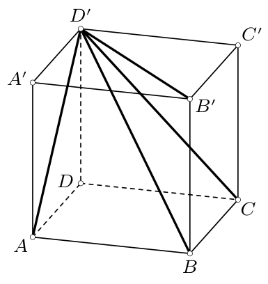

15. zīm.

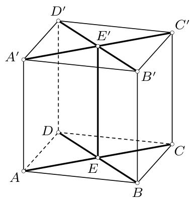

16. zīm.

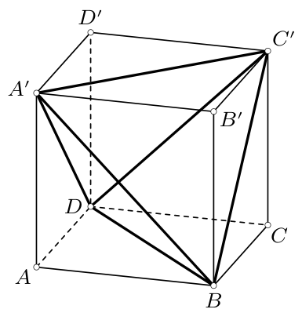

17. zīm.
