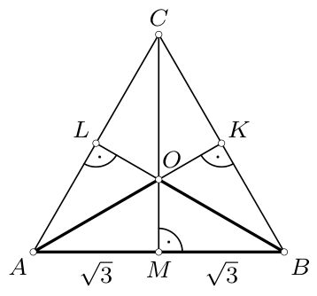
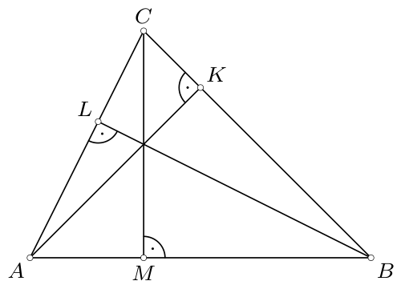
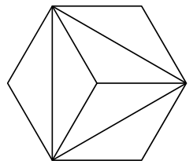
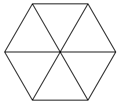
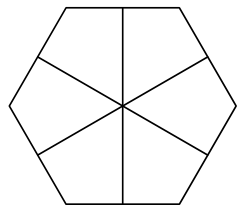
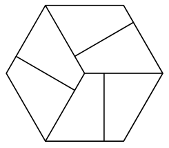
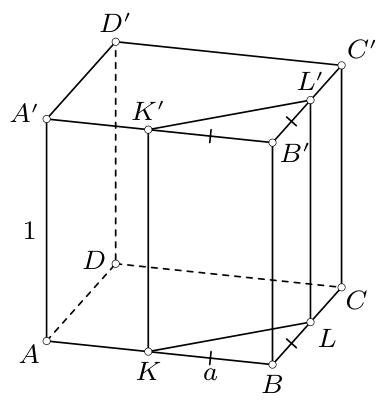
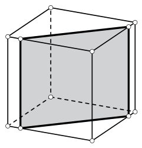
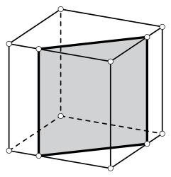
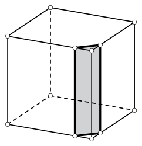

# <lo-sample/> PL.OMJ.2017TEST.7_8.1

W każdym z trzech lat 2018, 2019 i 2020 pensja pana Antoniego będzie o $5\%$ większa od jego pensji z roku poprzedniego. Wynika z tego, że pensja pana Antoniego w roku 2020 będzie większa od jego pensji z roku 2017 o

**(a)** dokładnie $15\%$;

**(b)** więcej niż $15\%$;

**(c)** mniej niż $15\%$.

<small>

* answer:N,T,N
* questionType:ShortAnswer

</small>

## Rozwiązanie

Oznaczmy przez $p_0$ wysokość pensji pana Antoniego w 2017 roku. Wówczas pensja $p_1$ pana Antoniego w roku 2018 będzie wynosić
$$
p_1=p_0+p_0\cdot 5\%=p_0+p_0\cdot 0,05=1,05\cdot p_0.
$$
Analogicznie wyznaczamy pensje $p_2$ i $p_3$ pana Antoniego odpowiednio w latach 2019 i 2020:
$$
p_2=1,05\cdot p_1=(1,05)^2\cdot p_0,
$$
$$
p_3=1,05\cdot p_2=(1,05)^3\cdot p_0.
$$
Ponieważ $(1,05)^3=1,157625$, więc $p_3=p_0+p_0\cdot 0,157625=p_0+p_0\cdot 15,7625\%$. Pensja pana Antoniego w roku 2020 będzie więc większa od jego pensji w roku 2017 o $15,7625\%$.

# <lo-sample/> PL.OMJ.2017TEST.7_8.2

Istnieje kwadrat, w którym przekątna jest dłuższa od boku o dokładnie

**(a)** $1$;

**(b)** $\sqrt{2}$;

**(c)** $\sqrt{2}-1$.

<small>

* answer:T,T,T
* questionType:ShortAnswer

</small>

## Rozwiązanie

W kwadracie o boku $a$ przekątna ma długość $a\sqrt{2}$, więc różnica między długością przekątnej a długością boku jest równa $a(\sqrt{2}-1)$. Aby zbudować odpowiedni kwadrat w kolejnych podpunktach, rozwiązujemy równania
$$
a(\sqrt{2}-1)=1,\qquad a(\sqrt{2}-1)=\sqrt{2},\qquad a(\sqrt{2}-1)=\sqrt{2}-1,
$$
uzyskując odpowiednio $a=\frac{1}{\sqrt{2}-1}$, $a=\frac{\sqrt{2}}{\sqrt{2}-1}$ oraz $a=1$.

# <lo-sample/> PL.OMJ.2017TEST.7_8.3

Liczby rzeczywiste $x$, $y$ są różne od $0$ oraz spełniają warunek $2x=3y$. Wynika z tego, że

**(a)** $x\leqslant y$;

**(b)** $x\geqslant y$;

**(c)** $x\neq y$.

<small>

* answer:N,N,T
* questionType:ShortAnswer

</small>

## Rozwiązanie

a) Jeżeli $(x,y)=(3,2)$, to $2x=3y$ oraz $x>y$.

b) Jeżeli $(x,y)=(-3,-2)$, to $2x=3y$ oraz $x<y$.

c) Gdyby zachodziła równość $x=y$, to $2x=3x$. Stąd $x=0$ wbrew założeniu, że liczba $x$ jest różna od $0$.

# <lo-sample/> PL.OMJ.2017TEST.7_8.4

Co najmniej $5$ krawędzi prostopadłościanu $\mathcal{P}$ ma długość $1$. Wynika z tego, że

**(a)** co najmniej $8$ krawędzi prostopadłościanu $\mathcal{P}$ ma długość $1$;

**(b)** co najmniej jedna ściana prostopadłościanu $\mathcal{P}$ jest kwadratem;

**(c)** prostopadłościan $\mathcal{P}$ jest sześcianem.

<small>

* answer:T,T,N
* questionType:ShortAnswer

</small>

## Rozwiązanie

a), b) Prostopadłościan o wymiarach $a\times b\times c$ ma cztery krawędzie o długości $a$, cztery krawędzie o długości $b$ i cztery o długości $c$. Wobec tego, jeżeli co najmniej $5$ krawędzi prostopadłościanu ma długość $1$, to co najmniej dwie z liczb $a$, $b$, $c$ są równe. To zaś oznacza, że pewne dwie przeciwległe ściany są kwadratami o boku długości $1$.

c) Prostopadłościan o wymiarach $1\times 1\times 2$ spełnia warunki zadania i nie jest sześcianem.

# <lo-sample/> PL.OMJ.2017TEST.7_8.5

Liczba dodatnich liczb nieparzystych, mniejszych od $2^{2018}$ jest równa

**(a)** $2^{1009}$;

**(b)** $2^{2017}$;

**(c)** $(-\sqrt{2})^{4034}$.

<small>

* answer:N,T,T
* questionType:ShortAnswer

</small>

## Rozwiązanie

a), b) Ponieważ liczba $2^{2018}$ jest parzysta, więc wśród liczb $1,2,3,\ldots,2^{2018}$ jest dokładnie tyle samo liczb parzystych co nieparzystych. Wobec tego dodatnich liczb nieparzystych, mniejszych od $2^{2018}$ jest $\frac12\cdot 2^{2018}=2^{2017}$.

c) Mamy $(-\sqrt{2})^{4034}=(-1)^{4034}\cdot(\sqrt{2})^{4034}=2^{2017}$.

# <lo-sample/> PL.OMJ.2017TEST.7_8.6

Istnieje trójkąt, w którym różnica miar pewnych dwóch kątów wewnętrznych jest równa

**(a)** $90^\circ$;

**(b)** $100^\circ$;

**(c)** $200^\circ$.

<small>

* answer:T,T,N
* questionType:ShortAnswer

</small>

## Rozwiązanie

a) Trójkąt o kątach $30^\circ,30^\circ,120^\circ$ ma zadaną własność, gdyż $120^\circ-30^\circ=90^\circ$.

b) Trójkąt o kątach $20^\circ,40^\circ,120^\circ$ ma zadaną własność, gdyż $120^\circ-20^\circ=100^\circ$.

c) Gdyby istniał trójkąt o opisanej własności, to co najmniej jeden z jego kątów wewnętrznych miałby miarę większą od $200^\circ$. Nie jest to jednak możliwe, gdyż każdy kąt wewnętrzny trójkąta ma miarę mniejszą od $180^\circ$.

# <lo-sample/> PL.OMJ.2017TEST.7_8.7

Liczba naturalna $a$ jest dwucyfrowa, a liczba naturalna $b$ jest trzycyfrowa. Wynika z tego, że

**(a)** suma $a+b$ jest liczbą trzycyfrową;

**(b)** iloczyn $a\cdot b$ jest liczbą czterocyfrową;

**(c)** suma $a+b$ ma mniej cyfr niż iloczyn $a\cdot b$.

<small>

* answer:N,N,N
* questionType:ShortAnswer

</small>

## Rozwiązanie

a), b) Jeżeli $a=20$ oraz $b=990$, to $a+b=1010$ jest liczbą czterocyfrową, a $a\cdot b=19800$ jest liczbą pięciocyfrową.

c) Jeżeli $a=10$ oraz $b=990$, to obie liczby $a+b=1000$ oraz $a\cdot b=9900$ są czterocyfrowe.

# <lo-sample/> PL.OMJ.2017TEST.7_8.8

Istnieje liczba pierwsza $p>13$ o tej własności, że każda cyfra liczby $p$ jest równa

**(a)** $0$ lub $7$;

**(b)** $1$ lub $3$;

**(c)** $2$ lub $5$.

<small>

* answer:N,T,N
* questionType:ShortAnswer

</small>

## Rozwiązanie

a) Każda liczba naturalna, której zapis zawiera tylko cyfry $0$, $7$ jest podzielna przez $7$. Wobec tego każda liczba o tej własności i większa od $7$ jest złożona.

c) Każda liczba naturalna zakończona cyfrą $2$ jest parzysta, a każda liczba zakończona cyfrą $5$ jest podzielna przez $5$. Wobec tego liczba $p$ składająca się tylko z cyfr $2$, $5$ jest podzielna przez $2$ lub przez $5$. Ponieważ $p>13$, więc liczba $p$ jest złożona.

b) Liczba $p=31$ jest pierwsza i większa od $13$.

# <lo-sample/> PL.OMJ.2017TEST.7_8.9

Liczby $a$, $b$, $c$ są długościami boków pewnego trójkąta. Wynika z tego, że istnieje trójkąt o bokach długości

**(a)** $a+1$, $b+1$, $c+1$;

**(b)** $a^2$, $b^2$, $c^2$;

**(c)** $\sqrt{a}$, $\sqrt{b}$, $\sqrt{c}$.

<small>

* answer:T,N,T
* questionType:ShortAnswer

</small>

## Rozwiązanie

Trójkąt o bokach $x$, $y$, $z$ istnieje wtedy i tylko wtedy, gdy
$$
x+y>z,\qquad y+z>x,\qquad z+x>y.
$$

a) Skoro $a$, $b$, $c$ są długościami boków pewnego trójkąta, to $a+b>c$. Wobec tego
$$
(a+1)+(b+1)=a+b+2>c+2>c+1.
$$
W pełni analogicznie wykazujemy pozostałe dwie nierówności. Stąd wniosek, że istnieje trójkąt o bokach długości $a+1$, $b+1$, $c+1$.

c) Skoro $a$, $b$, $c$ są długościami boków pewnego trójkąta, to $a+b>c$. A zatem
$$
a+b+2\sqrt{ab}>a+b>c,\qquad \text{skąd}\qquad (\sqrt{a}+\sqrt{b})^2>(\sqrt{c})^2.
$$
Wobec tego $\sqrt{a}+\sqrt{b}>\sqrt{c}$. Pozostałe dwie nierówności wykazujemy analogicznie.

b) Trójkąt o bokach $2$, $2$, $3$ istnieje, a trójkąt o bokach $2^2$, $2^2$, $3^2$ nie, gdyż $2^2+2^2<3^2$.

# <lo-sample/> PL.OMJ.2017TEST.7_8.10

Każda z dwóch wysokości pewnego trójkąta ma długość większą od $1$. Wynika z tego, że

**(a)** trzecia wysokość tego trójkąta również ma długość większą od $1$;

**(b)** każdy z boków tego trójkąta ma długość większą od $1$;

**(c)** pole tego trójkąta jest większe od $\frac12$.

<small>

* answer:N,T,T
* questionType:ShortAnswer

</small>

## Rozwiązanie

a) Rozważmy trójkąt równoboczny $ABC$ o boku długości $2\sqrt{3}$ i oznaczmy przez $O$ punkt przecięcia wysokości tego trójkąta, a przez $K$, $L$, $M$ — środki odpowiednio boków $BC$, $CA$, $AB$ (rys. 1).

rys. 1

rys. 2

W trójkącie $ABO$ odcinki $AL$, $BK$, $OM$ są wysokościami, przy czym
$$
AL=BK=\sqrt{3}\qquad \text{oraz}\qquad OM=\frac{CM}{3}=1.
$$
To oznacza, że dwie z wysokości trójkąta $ABO$ mają długość większą od $1$, a trzecia wysokość tego trójkąta ma długość równą $1$ (czyli nie większą od $1$).

b) Rozważmy dowolny trójkąt $ABC$ spełniający warunki zadania i oznaczmy spodki wysokości poprowadzonych z wierzchołków $A$, $B$, $C$ odpowiednio przez $K$, $L$, $M$ (rys. 2). Przypuśćmy, że $BL>1$ oraz $CM>1$. Wówczas, korzystając z twierdzenia Pitagorasa, uzyskujemy
$$
AB^2=AL^2+BL^2\geqslant BL^2,\qquad \text{skąd}\qquad AB\geqslant BL>1.
$$
Podobnie uzasadniamy, że
$$
BC^2=BL^2+CL^2\geqslant BL^2\qquad \text{oraz}\qquad CA^2=CM^2+AM^2\geqslant CM^2,
$$
skąd $BC\geqslant BL>1$ oraz $CA\geqslant CM>1$. Wobec tego każdy bok trójkąta $ABC$ ma długość większą od $1$.

c) Przy oznaczeniach z rozwiązania poprzedniego podpunktu, wykorzystując nierówności $AB>1$ oraz $CM>1$, otrzymujemy
$$
[ABC]=\frac12\cdot AB\cdot CM>\frac12\cdot 1\cdot 1=\frac12,
$$
gdzie $[ABC]$ oznacza pole trójkąta $ABC$.

# <lo-sample/> PL.OMJ.2017TEST.7_8.11

Liczba $x$ jest wymierna, a liczba $y$ jest niewymierna. Wynika z tego, że

**(a)** liczba $x+y$ jest niewymierna;

**(b)** liczba $x\cdot y$ jest niewymierna;

**(c)** liczba $x+y+x\cdot y$ jest niewymierna.

<small>

* answer:T,N,N
* questionType:ShortAnswer

</small>

## Rozwiązanie

a) Gdyby liczba $x+y$ była wymierna, to również liczba $y=(x+y)-x$ byłaby wymierna, jako różnica liczb wymiernych — sprzeczność. Wobec tego liczba $x+y$ jest niewymierna.

b) Przyjmując $x=0$ oraz $y=\sqrt{2}$, uzyskujemy $x\cdot y=0$, co jest liczbą wymierną.

c) Przyjmując $x=-1$ oraz $y=\sqrt{2}$, uzyskujemy $x+y+x\cdot y=-1+\sqrt{2}-\sqrt{2}=-1$, co jest liczbą wymierną.

# <lo-sample/> PL.OMJ.2017TEST.7_8.12

Dodatnia liczba całkowita $n$ jest podzielna przez każdą z następujących dziewięciu liczb: $1,2,3,\ldots,9$. Wynika z tego, że liczba $n$ jest

**(a)** podzielna przez $10$;

**(b)** podzielna przez $27$;

**(c)** większa lub równa $1\cdot 2\cdot 3\cdot\ldots\cdot 9$.

<small>

* answer:T,N,N
* questionType:ShortAnswer

</small>

## Rozwiązanie

b), c) Zauważmy, że liczba $n=5\cdot 7\cdot 8\cdot 9$ jest podzielna przez każdą z liczb $1,2,3,\ldots,9$. Jednak liczba ta nie jest podzielna przez $27$, gdyż liczba $\frac{n}{27}=\frac{280}{3}$ nie jest całkowita. Liczba $n$ jest także mniejsza od $1\cdot 2\cdot 3\cdot\ldots\cdot 9$.

a) Liczba $n$ jest podzielna przez $2$ i przez $5$, więc jest także podzielna przez najmniejszą wspólną wielokrotność liczb $2$ i $5$, czyli przez $10$.

# <lo-sample/> PL.OMJ.2017TEST.7_8.13

Sześciokąt foremny podzielono na sześć przystających wielokątów wypukłych. Wynika z tego, że każdy z tych wielokątów ma co najmniej

**(a)** jeden kąt wewnętrzny o mierze $60^\circ$;

**(b)** jeden kąt wewnętrzny o mierze $120^\circ$;

**(c)** dwa kąty wewnętrzne ostre.

<small>

* answer:N,N,N
* questionType:ShortAnswer

</small>

## Rozwiązanie

a) Sześciokąt foremny można podzielić na sześć przystających trójkątów o kątach $30^\circ,30^\circ,120^\circ$ (rys. 3).

b) Sześciokąt foremny można podzielić na sześć przystających trójkątów równobocznych (rys. 4).

c) Sześciokąt foremny można podzielić na sześć przystających czworokątów o kątach $60^\circ,90^\circ,90^\circ,120^\circ$ (rys. 5 lub rys. 6).

rys. 3

rys. 4

rys. 5

rys. 6

# <lo-sample/> PL.OMJ.2017TEST.7_8.14

Każdy punkt prostej pomalowano na czerwono albo na niebiesko w taki sposób, że każdy odcinek o długości $2$ zawarty w tej prostej ma końce różnych kolorów. Wynika z tego, że na tej prostej istnieje odcinek o końcach różnych kolorów, którego długość jest równa

**(a)** $4$;

**(b)** $5$;

**(c)** $6$.

<small>

* answer:N,T,T
* questionType:ShortAnswer

</small>

## Rozwiązanie

a) Oznaczmy przez $AB$ dowolny odcinek długości $4$ zawarty w danej prostej, a przez $M$ środek tego odcinka. Wówczas odcinki $AM$ oraz $BM$ mają długość $2$, więc z warunków zadania wynika, że zarówno $A$, jak i $B$ są innego koloru niż $M$. To oznacza, że punkty $A$ i $B$ mają ten sam kolor. Z dowolności wyboru odcinka $AB$ wynika, że każdy odcinek długości $4$ ma końce tego samego koloru.

c) Oznaczmy przez $AB$ dowolny odcinek długości $6$ zawarty w danej prostej, a przez $K$ i $L$ takie punkty, że $AK=KL=LB=2$. Wówczas punkty $A$ oraz $K$ są innego koloru, a punkty $K$ i $B$ są tego samego koloru (co wynika z rozwiązania pierwszego podpunktu). Wobec tego punkty $A$ i $B$ są różnych kolorów.

b) Oznaczmy przez $AB$ dowolny odcinek długości $10$ zawarty w danej prostej, przez $M$ — środek tego odcinka, a przez $N$ — taki punkt, że $AN=4$ oraz $NB=6$. Z rozwiązania podpunktu a) wnioskujemy, że $A$ i $N$ mają ten sam kolor, a z rozwiązania podpunktu c) otrzymujemy, że $N$ i $B$ są różnych kolorów. To oznacza, że punkty $A$ i $B$ są różnych kolorów. W takim razie jeden z odcinków $AM$, $BM$ długości $5$ ma końce różnych kolorów.

**Uwaga.**

Zauważmy, że w podpunkcie c) wykazaliśmy własność znacznie ogólniejszą niż sformułowaną w treści zadania, mianowicie każdy odcinek długości $6$ ma końce różnego koloru.

# <lo-sample/> PL.OMJ.2017TEST.7_8.15

Sześcian o krawędzi $1$ można tak przeciąć płaszczyzną, aby uzyskać w przekroju prostokąt, którego pole jest

**(a)** większe od $1$;

**(b)** równe $1$;

**(c)** mniejsze od $1$.

<small>

* answer:T,T,T
* questionType:ShortAnswer

</small>

## Rozwiązanie

Niech $ABCDA'B'C'D'$ będzie sześcianem o krawędzi $1$, którego wierzchołki są tak oznaczone, że kwadraty $ABCD$, $ABB'A'$ oraz $A'B'C'D'$ są jego ścianami. Oznaczmy przez $K$, $L$, $K'$, $L'$ takie punkty leżące odpowiednio na krawędziach $AB$, $BC$, $A'B'$, $B'C'$, że
$$
BK=BL=B'K'=B'L'=a,
$$
przy czym $0<a<1$ (rys. 7). Wówczas czworokąty $BKK'B'$ oraz $BLL'B'$ są prostokątami, więc wielościan $BKLB'K'L'$ jest graniastosłupem prostym. Zatem czworokąt $KLL'K'$ jest prostokątem, którego pole jest równe $KL\cdot KK'=a\sqrt{2}$.

rys. 7

rys. 8

rys. 9

rys. 10

a) Jeżeli $a>\frac{1}{\sqrt{2}}$ (rys. 8), to $KLL'K'$ jest prostokątem o polu większym od $1$.

b) Jeżeli $a=\frac{1}{\sqrt{2}}$ (rys. 9), to $KLL'K'$ jest prostokątem o polu równym $1$.

c) Jeżeli $a<\frac{1}{\sqrt{2}}$ (rys. 10), to $KLL'K'$ jest prostokątem o polu mniejszym od $1$.

**Uwaga.**

W podpunkcie b) odpowiednie cięcie można zrealizować również płaszczyzną równoległą do pewnej pary przeciwległych ścian sześcianu. Z kolei w podpunkcie a) można także na przykład rozważyć cięcie przez parę przeciwległych krawędzi sześcianu (np. płaszczyzną $ACC'A'$, co odpowiada $a=1$ w przedstawionej w rozwiązaniu konstrukcji).
