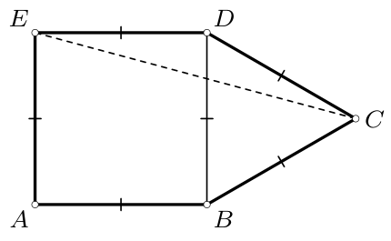
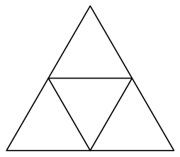
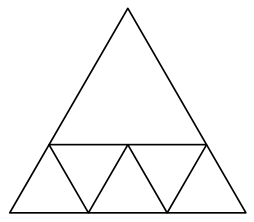
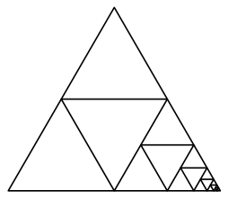
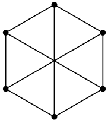
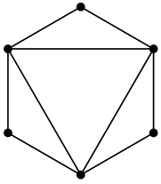
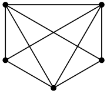
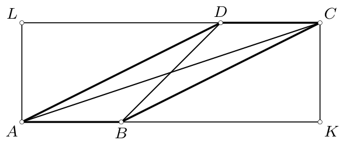
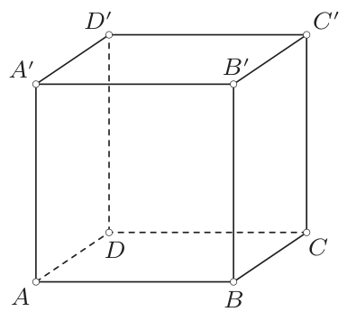

# <lo-sample/> PL.OMJ.2018TEST.7_8.1

Veikalā „U Bronka” bikšu cena bija vienāda ar kleitas cenu. Bikšu cenu vispirms paaugstināja par $5\%$, bet pēc tam jauno cenu pazemināja par $15\%$. Savukārt kleitas cenu vispirms pazemināja par $15\%$, bet pēc tam jauno cenu paaugstināja par $5\%$. No tā izriet, ka šo izmaiņu rezultātā

**(a)** bikšu cena ir lielāka nekā kleitas cena;

**(b)** bikšu cena ir vienāda ar kleitas cenu;

**(c)** bikšu cena ir mazāka nekā kleitas cena.

<small>

* answer:N,T,N
* questionType:ShortAnswer

</small>

## Atrisinājums

Pieņemsim, ka $a$ apzīmē bikšu un kleitas sākotnējo cenu.

Pēc cenas paaugstināšanas par $5\%$ bikses maksā $a+a\cdot 5\%=a\cdot 1{,}05$. Pēc šīs cenas pazemināšanas par $15\%$ bikšu cena ir $a\cdot 1{,}05-(a\cdot 1{,}05)\cdot 15\%=a\cdot 1{,}05\cdot 0{,}85$.

Savukārt pēc cenas pazemināšanas par $15\%$ kleita maksā $a-a\cdot 15\%=a\cdot 0{,}85$. Pēc šīs cenas paaugstināšanas par $5\%$ kleitas cena ir $a\cdot 0{,}85+a\cdot 0{,}85\cdot 5\%=a\cdot 0{,}85\cdot 1{,}05$.

Šo izmaiņu rezultātā bikšu un kleitas cenas ir vienādas.

# <lo-sample/> PL.OMJ.2018TEST.7_8.2

Skaitlis $6^6\cdot 12^{12}$ dalās ar

**(a)** $8^8$;

**(b)** $10^{10}$;

**(c)** $18^{18}$.

<small>

* answer:T,N,N
* questionType:ShortAnswer

</small>

## Atrisinājums

a) Ievērosim, ka $12^{12}=(2^2\cdot 3)^{12}=2^{24}\cdot 3^{12}$ un $8^8=(2^3)^8=2^{24}$. Tātad skaitlis $12^{12}$ dalās ar $8^8$, tāpēc arī skaitlis $6^6\cdot 12^{12}$ dalās ar $8^8$.

b) Skaitlis $10^{10}$ dalās ar $5$, bet reizinājums $6^6\cdot 12^{12}$ — nedalās.

c) Sadalām abus skaitļus $18^{18}$ un $6^6\cdot 12^{12}$ pirmreizinātājos:
$$
18^{18}=(2\cdot 3^2)^{18}=2^{18}\cdot 3^{36},
$$
$$
6^6\cdot 12^{12}=(2\cdot 3)^6\cdot (2^2\cdot 3)^{12}=2^6\cdot 3^6\cdot 2^{24}\cdot 3^{12}=2^{30}\cdot 3^{18}.
$$
No tā redzam, ka $18^{18}$ ir skaitlis, kas dalās ar $3^{36}$, bet $6^6\cdot 12^{12}$ — nedalās. Tātad $6^6\cdot 12^{12}$ nevar būt skaitļa $18^{18}$ daudzkārtnis.

# <lo-sample/> PL.OMJ.2018TEST.7_8.3

Eksistē tāds reāls skaitlis $x$, ka

**(a)** $x(x+1)=(x+1)(x+2)$;

**(b)** $x(x+1)=(x+2)(x+3)$;

**(c)** $x^2=(x+1)^2$.

<small>

* answer:T,T,T
* questionType:ShortAnswer

</small>

## Atrisinājums

a) Ja $x=-1$, tad $x(x+1)=-1\cdot 0=0\cdot 1=(x+1)(x+2)$.

b) Ja $x=-\frac{3}{2}$, tad $x(x+1)=-\frac{3}{2}\cdot\left(-\frac{1}{2}\right)=\frac{1}{2}\cdot\frac{3}{2}=(x+2)(x+3)$.

c) Ja $x=-\frac{1}{2}$, tad $x^2=\left(-\frac{1}{2}\right)^2=\left(\frac{1}{2}\right)^2=(x+1)^2$.

# <lo-sample/> PL.OMJ.2018TEST.7_8.4

Visas izliekta piecstūra $ABCDE$ malas ir vienāda garuma. No tā izriet, ka

**(a)** visas piecstūra $ABCDE$ diagonāles ir vienāda garuma;

**(b)** taisnes $AB$ un $CE$ ir paralēlas;

**(c)** piecstūris $ABCDE$ ir regulārs.

<small>

* answer:N,N,N
* questionType:ShortAnswer

</small>

## Atrisinājums

Pieņemsim, ka $ABDE$ ir kvadrāts, bet $BCD$ — vienādmalu trijstūris, kas konstruēts šī kvadrāta ārpusē (1. zīm.). Tad visas izliektā piecstūra $ABCDE$ malas ir vienāda garuma.

1. zīm.

a) $AD>BD$, jo taisnleņķa trijstūrī $ABD$ hipotenūza ir garāka par kateti.

b) Taisnes $AB$ un $DE$ ir paralēlas, bet taisnes $DE$ un $CE$ nav paralēlas. Tātad arī taisnes $AB$ un $CE$ nav paralēlas.

c) Ne visi piecstūra $ABCDE$ iekšējie leņķi ir vienādi, piem., $\sphericalangle EAB=90^\circ$, bet $\sphericalangle BCD=60^\circ$. Tātad tas nav regulārs piecstūris.

# <lo-sample/> PL.OMJ.2018TEST.7_8.5

Eksistē pozitīvs vesels skaitlis ar ciparu summu $2$, kas dalās ar

**(a)** $3$;

**(b)** $5$;

**(c)** $7$.

<small>

* answer:N,T,T
* questionType:ShortAnswer

</small>

## Atrisinājums

a) Skaitlis dalās ar $3$ tad un tikai tad, ja tā ciparu summa dalās ar $3$. Tātad neeksistē skaitlis ar ciparu summu $2$, kas dalās ar $3$.

b) Skaitļa $20$ ciparu summa ir $2$, un tas dalās ar $5$.

c) Skaitļa $1001$ ciparu summa ir $2$, un tas dalās ar $7$ ($1001=7\cdot 11\cdot 13$).

# <lo-sample/> PL.OMJ.2018TEST.7_8.6

Vesels skaitlis $a$ dalās ar $6$, bet vesels skaitlis $b$ dalās ar $10$. No tā izriet, ka skaitlis

**(a)** $a+b$ dalās ar $16$;

**(b)** $a\cdot b$ dalās ar $60$;

**(c)** $5a+3b$ dalās ar $15$.

<small>

* answer:N,T,T
* questionType:ShortAnswer

</small>

## Atrisinājums

Tā kā skaitlis $a$ dalās ar $6$, tad $a=6k$ kādam veselam skaitlim $k$. Līdzīgi, tā kā $b$ ir skaitlis, kas dalās ar $10$, tad $b=10\ell$ kādam veselam skaitlim $\ell$.

b) $a\cdot b=6k\cdot 10\ell=60\cdot k\ell$. Tā kā skaitlis $k\ell$ ir vesels, tad no pēdējās vienādības izriet, ka skaitlis $a\cdot b$ dalās ar $60$.

c) $5a+3b=5\cdot 6k+3\cdot 10\ell=15\cdot 2(k+\ell)$. Skaitlis $2(k+\ell)$ ir vesels, tāpēc no pēdējās sakarības izriet, ka skaitlis $5a+3b$ dalās ar $15$.

a) Pieņemsim $a=6$ un $b=0$. Tad $a$ ir skaitlis, kas dalās ar $6$, bet $b$ — skaitlis, kas dalās ar $10$. Tomēr skaitlis $a+b=6$ nedalās ar $16$.

# <lo-sample/> PL.OMJ.2018TEST.7_8.7

Eksistē tāds vesels skaitlis $n$, ka skaitļa $n^2$ pēdējie divi cipari ir

**(a)** $44$;

**(b)** $55$;

**(c)** $66$.

<small>

* answer:T,N,N
* questionType:ShortAnswer

</small>

## Atrisinājums

a) Pieņemsim $n=12$. Tad $n^2=144$.

b) Pieņemsim, ka eksistē tāds vesels skaitlis $n$, ka $n^2$ beidzas ar cipariem $55$. Tad skaitlis $n$ ir nepāra un dalās ar $5$. Tāpēc skaitlis $n^2$ ir nepāra un dalās ar $25$. Taču katrs nepāra skaitlis, kas dalās ar $25$, beidzas ar cipariem $25$ vai $75$.

c) Skaitlis, kura pēdējie divi cipari ir $66$, ir pāra, bet nedalās ar $4$. Šāds skaitlis nevar būt vesela skaitļa kvadrāts.

# <lo-sample/> PL.OMJ.2018TEST.7_8.8

Vienādmalu trijstūri var sagriezt

**(a)** $4$ vienādmalu trijstūros;

**(b)** $6$ vienādmalu trijstūros;

**(c)** $1000$ vienādmalu trijstūros.

<small>

* answer:T,T,T
* questionType:ShortAnswer

</small>

## Atrisinājums

a) Vienādmalu trijstūri var sagriezt $4$ vienādmalu trijstūros pa nogriežņiem, kas savieno malu viduspunktus (2. zīm.).

b) Vienādmalu trijstūri ar malas garumu $3$ var sagriezt $5$ vienādmalu trijstūros ar malas garumu $1$ un vienā vienādmalu trijstūrī ar malas garumu $2$ — kopā $6$ vienādmalu trijstūros (3. zīm.).

c) Ievērosim, ka vienu no a) punktā iegūtā sadalījuma daļām var atkal sagriezt $4$ vienādmalu trijstūros, tādējādi iegūstot $3$ papildu gabalus. Pēc tam jebkuru no šiem gabaliem var atkal sagriezt $4$ vienādmalu trijstūros un iegūt vēl $3$ daļas. Atkārtojot šo darbību kopā $332$ reizes, beigās iegūsim vienādmalu trijstūra sadalījumu $4+3\cdot 332=1000$ vienādmalu trijstūros (4. zīm.).

2. zīm.

3. zīm.

4. zīm.

# <lo-sample/> PL.OMJ.2018TEST.7_8.9

$6$ cilvēku grupas tikšanās laikā notika tieši $9$ rokasspiedieni, turklāt katrs cilvēku pāris apmainījās ne vairāk kā ar vienu rokasspiedienu. No tā izriet, ka

**(a)** kāds cilvēks piedalījās vismaz $4$ rokasspiedienos;

**(b)** kāds cilvēks piedalījās tieši $3$ rokasspiedienos;

**(c)** katrs piedalījās vismaz $1$ rokasspiedienā.

<small>

* answer:N,N,N
* questionType:ShortAnswer

</small>

## Atrisinājums

Turpmākajos attēlos katrs resnais punkts apzīmē cilvēku, bet nogrieznis, kas savieno divus punktus, — rokasspiedienu starp atbilstošajiem cilvēkiem.

a) Var gadīties, ka katrs piedalījās tieši $3$ rokasspiedienos (5. zīm.).

b) Var gadīties, ka katrs piedalījās $2$ vai $4$ rokasspiedienos (6. zīm.).

c) Var gadīties, ka kāds cilvēks nepiedalījās nevienā rokasspiedienā (7. zīm.).

5. zīm.

6. zīm.

7. zīm.

# <lo-sample/> PL.OMJ.2018TEST.7_8.10

Eksistē tādi reāli skaitļi $a$, $b$, $c$, ka starp skaitļiem $a\cdot b$, $b\cdot c$, $c\cdot a$ ir

**(a)** tieši divi pozitīvi;

**(b)** tieši divi negatīvi;

**(c)** tieši trīs negatīvi.

<small>

* answer:N,T,N
* questionType:ShortAnswer

</small>

## Atrisinājums

c) Ja visi trīs dotie reizinājumi būtu negatīvi, tad arī to reizinājums būtu negatīvs skaitlis. Taču
$$
a\cdot b\cdot b\cdot c\cdot c\cdot a=(abc)^2
$$
ir reāla skaitļa kvadrāts, tātad nenegatīvs skaitlis.

a) Pieņemsim, ka starp dotajiem trim reizinājumiem ir tieši divi pozitīvi. Tad neviens no skaitļiem $a$, $b$, $c$ nav vienāds ar $0$; pretējā gadījumā vismaz divi no reizinājumiem $a\cdot b$, $b\cdot c$, $c\cdot a$ būtu vienādi ar $0$, un tad nevarētu būt divi pozitīvi. Tāpēc trešais reizinājums nevar būt vienāds ar $0$, tātad tam jābūt negatīvam skaitlim. Tad, līdzīgi kā c) punkta atrisinājumā, iegūstam pretrunīgu nevienādību $(abc)^2<0$.

b) Pieņemot $a=1$ un $b=c=-1$, iegūstam
$$
a\cdot b=-1,\qquad b\cdot c=1,\qquad c\cdot a=-1.
$$
Starp šiem trim skaitļiem ir tieši divi negatīvi.

# <lo-sample/> PL.OMJ.2018TEST.7_8.11

Tieši $70\%$ kādas klases skolēnu mācās angļu valodu, tieši $50\%$ mācās vācu valodu un tieši $30\%$ mācās franču valodu. No tā izriet, ka

**(a)** katrs šīs klases skolēns mācās vismaz vienu svešvalodu;

**(b)** vismaz puse šīs klases skolēnu mācās vismaz divas valodas;

**(c)** eksistē skolēns, kurš mācās vismaz divas valodas, to skaitā vācu valodu.

<small>

* answer:N,N,T
* questionType:ShortAnswer

</small>

## Atrisinājums

a), b) Pieņemsim, ka $10$ skolēnu klasē ir:

• $3$ skolēni, kuri mācās visas trīs valodas;

• $2$ skolēni, kuri mācās tikai vācu valodu;

• $4$ skolēni, kuri mācās tikai angļu valodu;

• $1$ skolēns, kurš nemācās nevienu svešvalodu.

Tad uzdevuma nosacījumi ir izpildīti, turklāt eksistē skolēns, kurš nemācās nevienu svešvalodu, un mazāk nekā puse skolēnu mācās vismaz divas valodas.

c) Tā kā $50\%$ skolēnu mācās vācu valodu, bet $70\%$ skolēnu mācās angļu valodu, tad vismaz $20\%$ skolēnu mācās abas šīs valodas vienlaikus.

# <lo-sample/> PL.OMJ.2018TEST.7_8.12

Eksistē tāds izliekts četrstūris, ka katra tā diagonāle sadala to divos

**(a)** taisnleņķa trijstūros;

**(b)** šaurleņķa trijstūros;

**(c)** platleņķa trijstūros.

<small>

* answer:T,N,T
* questionType:ShortAnswer

</small>

## Atrisinājums

a) Katra taisnstūra diagonāle sadala to divos taisnleņķa trijstūros.

b) Ja šāds četrstūris eksistētu, tad katrs tā iekšējais leņķis būtu šaurs. Taču tad šī četrstūra iekšējo leņķu summa būtu mazāka nekā $4\cdot 90^\circ=360^\circ$, kas nav iespējams.

c) Aplūkosim taisnstūri $AKCL$, kurā $AK=3$, $KC=1$, un tādus punktus $B$ un $D$, kas atrodas attiecīgi uz malām $AK$ un $CL$, ka $AB=CD=1$ (8. zīm.). Tad leņķi $KBC$, $KBD$, $LDA$, $LDB$ ir šauri, tāpēc katra paralelograma $ABCD$ diagonāle sadala to divos platleņķa trijstūros.

8. zīm.

# <lo-sample/> PL.OMJ.2018TEST.7_8.13

Pozitīva vesela skaitļa $n$ ciparu summa ir vienāda ar skaitļa $n$ ciparu skaitu. No tā izriet, ka

**(a)** katrs skaitļa $n$ cipars ir $1$;

**(b)** skaitļa $n$ ciparu reizinājums ir mazāks nekā $2$;

**(c)** skaitļa $n+1$ ciparu summa ir lielāka nekā skaitļa $n$ ciparu summa.

<small>

* answer:N,T,N
* questionType:ShortAnswer

</small>

## Atrisinājums

a) Ja $n=20$, tad skaitlim $n$ ir divi cipari un ciparu summa ir $2$.

c) Ja $n=1000000009$, tad skaitļa $n$ ciparu summa un ciparu skaits ir vienādi (abi ir $10$). Turpretī skaitļa $n+1=1000000010$ ciparu summa ir $2$, tātad tā ir mazāka nekā skaitļa $n$ ciparu summa.

b) Ja kāds skaitļa $n$ cipars ir $0$, tad arī skaitļa $n$ ciparu reizinājums ir $0$, tātad tas noteikti ir mazāks nekā $2$. Pretējā gadījumā katrs skaitļa $n$ cipars ir pozitīvs. Tad no nosacījuma, ka skaitļa $n$ ciparu summa ir vienāda ar tā ciparu skaitu, izriet, ka visi skaitļa $n$ cipari ir $1$. Taču tad arī šāda skaitļa ciparu reizinājums ir mazāks nekā $2$.

# <lo-sample/> PL.OMJ.2018TEST.7_8.14

No kuba virsotnēm izvēlējās piecas. No tā izriet, ka starp izvēlētajiem punktiem eksistē

**(a)** divi, kurus savieno kuba šķautne;

**(b)** trīs, kas ir vienādmalu trijstūra virsotnes;

**(c)** četri, kas ir taisnstūra virsotnes.

<small>

* answer:T,T,N
* questionType:ShortAnswer

</small>

## Atrisinājums

Aplūkosim kubu ar pretējām skaldnēm $ABCD$ un $A'B'C'D'$, kas apzīmētas tā, ka nogriežņi $AA'$, $BB'$, $CC'$, $DD'$ ir kuba šķautnes (9. zīm.).

9. zīm.

a) Tā kā izvēlēti pieci punkti, tad izvēlēti abi galapunkti vismaz vienai no šķautnēm $AA'$, $BB'$, $CC'$, $DD'$.

b) Ievērosim, ka $AB'CD'$ un $A'BC'D$ ir tetraedri, kuru visas šķautnes ir vienāda garuma (vienāda ar kuba skaldnes diagonāles garumu). Tā kā izvēlēti pieci punkti, tad kādi trīs pieder vienam un tam pašam no šiem diviem tetraedriem, tātad nosaka vienādmalu trijstūri.

c) Pieņemsim, ka izvēlēti punkti $A$, $B$, $C$, $B'$, $D'$. Tad nekādi četri no šiem punktiem neatrodas vienā plaknē; tātad tie nevar būt taisnstūra virsotnes.

# <lo-sample/> PL.OMJ.2018TEST.7_8.15

Pozitīvi veseli skaitļi $a$, $b$, $c$ ir tādi, ka skaitļi $2^a$, $2^b$, $2^c$ ir kāda trijstūra malu garumi. No tā izriet, ka

**(a)** tas ir šaurleņķa trijstūris;

**(b)** skaitļi $a$, $b$, $c$ ir kāda trijstūra malu garumi;

**(c)** vismaz divi no skaitļiem $a$, $b$, $c$ ir vienādi.

<small>

* answer:T,T,T
* questionType:ShortAnswer

</small>

## Atrisinājums

Nezaudējot vispārīgumu, pieņemsim, ka $a\leq b\leq c$.

c) Pieņemsim, ka $b<c$, t.i., $b+1\leq c$. Tad
$$
2^a+2^b\leq 2^b+2^b=2^{b+1}\leq 2^c,
$$
kas ir pretrunā ar trijstūra nevienādību trijstūrim ar malām $2^a$, $2^b$, $2^c$. Tas nozīmē, ka $b=c$.

b) Tieši pārbaudām, ka $a+b>b=c$, $b+c>b\geq a$, $c+a>c\geq a$, tāpēc skaitļi $a$, $b$, $c$ apmierina trijstūra nevienādību.

a) No iepriekšējiem diviem punktiem izriet, ka trijstūris ar malām $2^a$, $2^b$, $2^c$ ir vienādsānu, un tā sānu malas garums nav mazāks par pamata garumu. Tā kā trijstūrī pret garāko malu atrodas lielākais leņķis, no tā izriet, ka leņķis starp sānu malām nav lielāks par leņķi starp pamatu un sānu malu, bet tas ir šaurs jebkurā vienādsānu trijstūrī.
