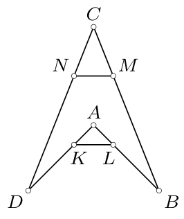
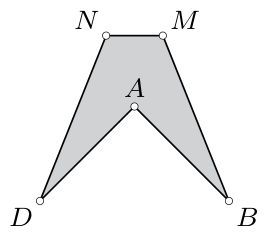
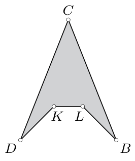
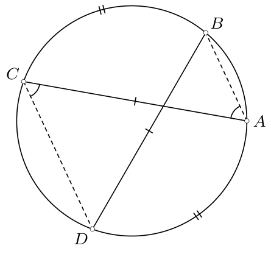
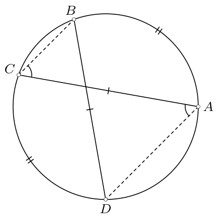
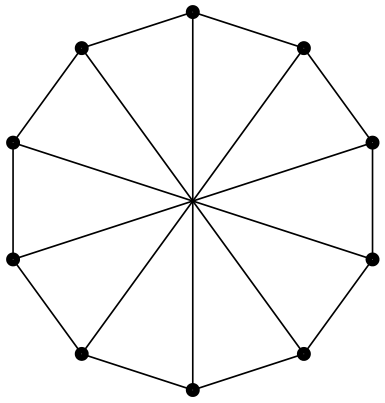
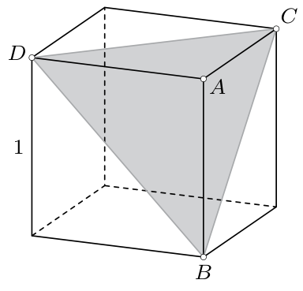
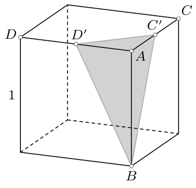

# <lo-sample/> PL.OMJ.2019TEST.7_8.1

Dodatnia liczba $a$ jest mniejsza od 1. Wynika z tego, że

**(a)** $a^2>a$;

**(b)** $\sqrt{a}>a$;

**(c)** $\frac{1}{a}>a$.

<small>

* answer:N,T,T
* questionType:ShortAnswer

</small>

## Rozwiązanie

a) Przyjmując $a=\frac{1}{2}$, uzyskujemy $a^2=\frac{1}{4}<\frac{1}{2}=a$.

b) Skoro $a<1$, to również $\sqrt{a}<1$. Jeśli pomnożymy obie strony ostatniej nierówności przez liczbę dodatnią $\sqrt{a}$, to otrzymamy $a<\sqrt{a}$.

c) Skoro $a<1$, to również $a^2<1$. Jeśli pomnożymy obie strony ostatniej nierówności przez liczbę dodatnią $\frac{1}{a}$, to otrzymamy $a<\frac{1}{a}$.

# <lo-sample/> PL.OMJ.2019TEST.7_8.2

Istnieje taki pięciokąt, w którym

**(a)** dokładnie jeden kąt wewnętrzny ma miarę większą od $180^\circ$;

**(b)** dokładnie dwa kąty wewnętrzne mają miary większe od $180^\circ$;

**(c)** dokładnie trzy kąty wewnętrzne mają miary większe od $180^\circ$.

<small>

* answer:T,T,N
* questionType:ShortAnswer

</small>

## Rozwiązanie

Niech $ABCD$ będzie czworokątem wklęsłym, w którym kąt przy wierzchołku $A$ ma miarę większą od $180^\circ$ (rys. 1). Niech ponadto $K$, $L$, $M$, $N$ będą takimi punktami znajdującymi się odpowiednio na bokach $DA$, $AB$, $BC$, $CD$, że odcinek $KL$ znajduje się na zewnątrz, a odcinek $MN$ — wewnątrz czworokąta $ABCD$.

rys. 1

rys. 2

rys. 3

a) W pięciokącie $ABMND$ (rys. 2) tylko kąt przy wierzchołku $A$ ma miarę większą od $180^\circ$.

b) W pięciokącie $KLBCD$ (rys. 3) kąty przy wierzchołkach $K$ i $L$ mają miary większe od $180^\circ$.

c) Suma miar kątów wewnętrznych dowolnego pięciokąta jest równa $540^\circ$. Tymczasem gdyby trzy kąty wewnętrzne miały miary większe od $180^\circ$, to suma miar kątów wewnętrznych byłaby większa od $540^\circ$. Uzyskana sprzeczność oznacza, że co najwyżej dwa kąty wewnętrzne pięciokąta mają miary większe od $180^\circ$.

# <lo-sample/> PL.OMJ.2019TEST.7_8.3

Liczby $a$, $b$, $c$, $d$ są dodatnie. Liczba $b$ jest o $100\%$ większa od liczby $a$, liczba $c$ jest o $100\%$ większa od liczby $b$, liczba $d$ jest o $100\%$ większa od liczby $c$. Wynika z tego, że liczba $d$ jest większa od liczby $a$ o

**(a)** $300\%$;

**(b)** $700\%$;

**(c)** $800\%$.

<small>

* answer:N,T,N
* questionType:ShortAnswer

</small>

## Rozwiązanie

Z treści zadania wynika kolejno, że

$$b=a+100\%\cdot a=2a,\quad c=b+100\%\cdot b=2b=4a,\quad d=c+100\%c=2c=8a,$$

czyli $d=a+7a=a+700\%\cdot a$, a zatem liczba $d$ jest większa od liczby $a$ o $700\%$.

# <lo-sample/> PL.OMJ.2019TEST.7_8.4

Istnieje taki trójkąt, którego dwa boki mają długości 5 oraz 10, a trzeci bok jest równy

**(a)** 16;

**(b)** 8;

**(c)** 4.

<small>

* answer:N,T,N
* questionType:ShortAnswer

</small>

## Rozwiązanie

Liczby dodatnie $a$, $b$, $c$ są długościami boków pewnego trójkąta wtedy i tylko wtedy, gdy spełnione są nierówności

$$a+b>c,\quad b+c>a,\quad c+a>b.$$

a) Liczby 5, 10, 16 nie są długościami boków trójkąta, gdyż $5+10<16$.

c) Liczby 5, 10, 4 nie są długościami boków trójkąta, gdyż $4+5<10$.

b) Trójkąt o bokach długości 5, 10, 8 istnieje, gdyż

$$5+10>8,\quad 10+8>5,\quad 8+5>10.$$

# <lo-sample/> PL.OMJ.2019TEST.7_8.5

Liczby całkowite $a$, $b$, $c$, $d$ są dodatnie, przy czym ułamki $\frac{a}{b}$ oraz $\frac{c}{d}$ są nieskracalne. Wynika z tego, że

**(a)** ułamek $\frac{a}{d}$ jest nieskracalny;

**(b)** ułamek $\frac{a+c}{b+d}$ jest nieskracalny;

**(c)** ułamek $\frac{a\cdot c}{b\cdot d}$ jest nieskracalny.

<small>

* answer:N,N,N
* questionType:ShortAnswer

</small>

## Rozwiązanie

Przyjmijmy $a=d=2$ oraz $b=c=3$. Ułamki $\frac{a}{b}=\frac{2}{3}$ oraz $\frac{c}{d}=\frac{3}{2}$ są wówczas nieskracalne, ale ułamki

$$\frac{a}{d}=\frac{2}{2},\quad \frac{a+c}{b+d}=\frac{5}{5},\quad \frac{a\cdot c}{b\cdot d}=\frac{6}{6}$$

są skracalne.

# <lo-sample/> PL.OMJ.2019TEST.7_8.6

Liczby całkowite $a$, $b$, $c$, $d$ są dodatnie, przy czym liczby $a+b$, $b+c$, $c+d$ są podzielne przez 3. Wynika z tego, że liczba

**(a)** $a+b+c+d$ jest podzielna przez 3;

**(b)** $a+c$ jest podzielna przez 3;

**(c)** $a+d$ jest podzielna przez 3.

<small>

* answer:T,N,T
* questionType:ShortAnswer

</small>

## Rozwiązanie

a) Skoro liczby $a+b$ oraz $c+d$ są podzielne przez 3, to również ich suma $a+b+c+d$ jest liczbą podzielną przez 3.

c) Skoro liczby $a+b+c+d$ oraz $b+c$ są podzielne przez 3, to również ich różnica $a+d$ jest liczbą podzielną przez 3.

b) Przyjmując $a=c=1$ oraz $b=d=2$ uzyskujemy $a+b=b+c=c+d=3$, więc liczby te spełniają założenia zadania. Tymczasem $a+c=2$ nie jest liczbą podzielną przez 3.

# <lo-sample/> PL.OMJ.2019TEST.7_8.7

Punkty $A$, $B$, $C$, $D$ leżą w tej właśnie kolejności na jednym okręgu, przy czym długości cięciw $AC$ i $BD$ są równe. Wynika z tego, że

**(a)** proste $AB$ i $CD$ są równoległe;

**(b)** proste $BC$ i $DA$ są równoległe;

**(c)** czworokąt $ABCD$ jest trapezem.

<small>

* answer:N,N,T
* questionType:ShortAnswer

</small>

## Rozwiązanie

a) Dowolny trapez równoramienny $ABCD$ nie będący prostokątem o podstawach $BC$ i $DA$ spełnia warunki zadania, a jego ramiona $AB$ i $CD$ nie są równoległe.

b) Dowolny trapez równoramienny $ABCD$ nie będący prostokątem o podstawach $AB$ i $CD$ spełnia warunki zadania, a jego ramiona $BC$ i $DA$ nie są równoległe.

c) Skoro długości cięciw $AC$ i $BD$ są równe, to długości odpowiednich łuków wyznaczanych przez te cięciwy także są równe. Są dwie możliwości.

Jeżeli łuk $AC$ zawierający punkt $B$ ma taką długość jak łuk $BD$ zawierający punkt $A$, to łuki $DA$ oraz $BC$ (nie zawierające żadnych innych wierzchołków czworokąta) są równe (rys. 4). Wobec tego $\angle DCA=\angle CAB$, gdyż są to kąty wpisane w okrąg oparte na przystających łukach, a w konsekwencji proste $AB$ i $CD$ są równoległe.

Jeżeli z kolei łuk $AC$ zawierający punkt $B$ ma taką długość jak łuk $BD$ zawierający punkt $C$, to łuki $AB$ oraz $CD$ są równe (rys. 5). Wobec tego, podobnie jak w poprzednim przypadku, $\angle ADB=\angle DBC$ i w konsekwencji proste $DA$ i $BC$ są równoległe.

W obydwu przypadkach pewna para przeciwległych boków czworokąta $ABCD$ to para boków równoległych, wobec czego czworokąt $ABCD$ jest trapezem.

rys. 4

rys. 5

# <lo-sample/> PL.OMJ.2019TEST.7_8.8

Objętość pewnego prostopadłościanu jest równa 8. Wynika z tego, że

**(a)** długość co najmniej jednej krawędzi tego prostopadłościanu jest liczbą parzystą;

**(b)** pole powierzchni tego prostopadłościanu jest mniejsze od 35;

**(c)** prostopadłościan ten jest sześcianem.

<small>

* answer:N,N,N
* questionType:ShortAnswer

</small>

## Rozwiązanie

Rozważmy prostopadłościan o wymiarach $\frac{2}{3}\times\frac{4}{3}\times 9$. Objętość tego prostopadłościanu jest równa 8, więc spełnia on założenia zadania. Tymczasem prostopadłościan ten nie jest sześcianem, żadna z jego krawędzi nie ma długości będącej liczbą parzystą, a pole powierzchni tego prostopadłościanu jest równe

$$2\cdot\left(\frac{2}{3}\cdot\frac{4}{3}+\frac{2}{3}\cdot 9+\frac{4}{3}\cdot 9\right)=37+\frac{7}{9},$$

a więc jest większe od 35.

# <lo-sample/> PL.OMJ.2019TEST.7_8.9

Istnieje taki prostokąt o polu równym 36, który można rozciąć na kwadraty, każdy o boku długości

**(a)** 2;

**(b)** $\sqrt{3}$;

**(c)** 4.

<small>

* answer:T,T,N
* questionType:ShortAnswer

</small>

## Rozwiązanie

c) Gdyby prostokąt o polu równym 36 można było rozciąć na $n$ kwadratów o boku długości 4, to suma pól tych kwadratów byłaby równa polu całego prostokąta, czyli $36=n\cdot 4^2$. Stąd uzyskujemy $n=\frac{36}{16}$, co nie jest liczbą całkowitą. Wobec tego taki podział nie jest możliwy.

a) Kwadrat o boku 6 ma pole równe 36 i można go rozciąć na 9 kwadratów, każdy o boku długości 2.

b) Prostokąt o wymiarach $3\sqrt{3}\times 4\sqrt{3}$ ma pole równe 36 i można go rozciąć na 12 kwadratów, każdy o boku długości $\sqrt{3}$.

# <lo-sample/> PL.OMJ.2019TEST.7_8.10

Liczby rzeczywiste $a$, $b$, $c$, $d$ są różne od 0 i spełniają warunek $ab>|cd|$. Wynika z tego, że

**(a)** liczby $a$ i $b$ mają ten sam znak;

**(b)** liczba $abcd$ jest dodatnia;

**(c)** $ab+1>|cd+1|$.

<small>

* answer:T,N,T
* questionType:ShortAnswer

</small>

## Rozwiązanie

a) Skoro $ab>|cd|$ oraz $|cd|>0$, to $ab>0$. Ponieważ iloczyn liczb $a$ i $b$ jest dodatni, więc obie te liczby są dodatnie albo obie te liczby są ujemne.

c) Zauważmy, że $ab+1>|cd|+1\geq |cd+1|$, skąd uzyskujemy tezę. Druga nierówność wynika stąd, że dla każdej pary liczb rzeczywistych $x$, $y$ zachodzi nierówność $|x|+|y|\geq |x+y|$. Aby ją uzasadnić, wystarczy wykazać, że $|x|+|y|\geq x+y$ oraz $|x|+|y|\geq -x-y$ — pierwsza z tych nierówności wynika z dodania stronami nierówności $|x|\geq x$ oraz $|y|\geq y$, druga zaś z dodania stronami nierówności $|x|\geq -x$ oraz $|y|\geq -y$.

b) Przyjmując $a=b=d=-1$ oraz $c=\frac{1}{2}$, uzyskujemy $ab=1>\frac{1}{2}=|cd|$, a przy tym $abcd=-\frac{1}{2}$ jest liczbą ujemną.

# <lo-sample/> PL.OMJ.2019TEST.7_8.11

W gronie $n$ osób każda ma dokładnie trzech znajomych (zakładamy, że jeśli osoba $A$ zna $B$, to osoba $B$ zna $A$). Wynika z tego, że liczba $n$ jest podzielna przez

**(a)** 2;

**(b)** 3;

**(c)** 4.

<small>

* answer:T,N,N
* questionType:ShortAnswer

</small>

## Rozwiązanie

a) Liczba wszystkich relacji znajomości w danej grupie jest równa $\frac{3n}{2}$. Ta liczba jest naturalna, skąd wniosek, że liczba $3n$, a w konsekwencji — liczba $n$ jest parzysta.

b), c) Rozważmy grupę 10 osób siedzących przy okrągłym stole w taki sposób, że każda osoba zna tylko swoich sąsiadów oraz osobę siedzącą naprzeciwko niej (na rysunku 6 kropki oznaczają osoby, a odcinki — znajomości). W takiej grupie każdy ma dokładnie trzech znajomych, a liczba $n=10$ nie jest podzielna ani przez 3, ani przez 4.

rys. 6

**Uwaga.**

Konstrukcja przedstawiona w rozwiązaniu może zostać wykorzystana do uzasadnienia, że dla każdej liczby naturalnej $n\geq 2$ istnieje grupa $2n$ osób, w której każdy ma dokładnie 3 znajomych. Wystarczy umieścić osoby w wierzchołkach $2n$-kąta foremnego i ustalić, że każdy zna tylko osoby umieszczone w sąsiednich oraz przeciwległym wierzchołku.

Inna ogólna konstrukcja może polegać na rozmieszczeniu osób w wierzchołkach graniastosłupa $n$-kątnego i ustaleniu, że dwie osoby znają się wtedy, gdy odpowiadające im wierzchołki są połączone krawędzią. W taki sposób uzyskujemy przykłady grup $2n$ osób o żądanej własności dla każdego $n\geq 3$.

# <lo-sample/> PL.OMJ.2019TEST.7_8.12

Każda spośród pewnych sześciu różnych cyfr jest niezerowa. Wynika z tego, że można te cyfry zapisać w takiej kolejności, aby otrzymać 6-cyfrową liczbę

**(a)** parzystą;

**(b)** nieparzystą;

**(c)** podzielną przez 4.

<small>

* answer:T,T,N
* questionType:ShortAnswer

</small>

## Rozwiązanie

a) Co najwyżej pięć spośród sześciu danych cyfr to cyfry nieparzyste. Wobec tego wśród danych sześciu cyfr jest pewna cyfra parzysta. Aby uzyskać 6-cyfrową liczbę parzystą, wystarczy tę cyfrę umieścić na końcu, jako cyfrę jedności.

b) Co najwyżej cztery spośród sześciu danych cyfr to cyfry parzyste. Wobec tego wśród danych sześciu cyfr są co najmniej dwie cyfry nieparzyste. Aby uzyskać 6-cyfrową liczbę nieparzystą, wystarczy jedną z nich umieścić na końcu, jako cyfrę jedności.

c) Jeżeli sześć danych cyfr to 1, 3, 5, 7, 9 oraz 4, to nie można z nich utworzyć 6-cyfrowej liczby podzielnej przez 4. Rzeczywiście, jedynym sposobem, aby uzyskać liczbę parzystą, jest umieszczenie cyfry 4 na końcu. Jednak wówczas dwucyfrowa końcówka może być równa tylko 14, 34, 54, 74 lub 94, więc na mocy cechy podzielności przez 4, cała liczba nie jest podzielna przez 4.

# <lo-sample/> PL.OMJ.2019TEST.7_8.13

Od sześcianu o krawędzi 1 można odciąć płaskim cięciem ostrosłup o objętości

**(a)** $\frac{1}{2}$;

**(b)** $\frac{1}{6}$;

**(c)** $\frac{1}{24}$.

<small>

* answer:N,T,T
* questionType:ShortAnswer

</small>

## Rozwiązanie

a) Każde cięcie sześcianu na dwie bryły o objętościach $\frac{1}{2}$ przechodzi przez środek symetrii tego sześcianu. Wobec tego w przekroju uzyskiwana jest figura środkowosymetryczna, a zatem nie będąca trójkątem. Stąd wniosek, że jeśli uzyskany zostanie ostrosłup, to płaszczyzna cięcia wyznacza podstawę tego ostrosłupa. Jednak płaszczyzna cięcia przechodzi co najwyżej przez cztery wierzchołki sześcianu, a zatem po każdej jej stronie znajdują się jeszcze co najmniej dwa wierzchołki sześcianu. Tymczasem, gdyby uzyskany został ostrosłup, po pewnej stronie musiałby pozostać tylko jeden wierzchołek. Uzyskana sprzeczność oznacza, że uzyskanie ostrosłupa nie jest możliwe.

b) Rozważmy sześcian o krawędzi 1, którego jednym z wierzchołków jest punkt $A$, a trzema z krawędzi są odcinki $AB$, $AC$, $AD$ (rys. 7). Płaszczyzna $BCD$ odcina od tego sześcianu czworościan (a więc i ostrosłup) $ABCD$ o objętości

$$\frac{1}{3}\cdot\frac{1}{2}\cdot AB\cdot AC\cdot AD=\frac{1}{6}.$$

rys. 7

c) Niech $C'$ oraz $D'$ będą środkami odpowiednio krawędzi $AC$ oraz $AD$ sześcianu wprowadzonego w rozwiązaniu poprzedniego punktu (rys. 8). Wówczas płaszczyzna $BC'D'$ odcina od tego sześcianu czworościan $ABC'D'$ o objętości

$$\frac{1}{3}\cdot\frac{1}{2}\cdot AB\cdot AC'\cdot AD'=\frac{1}{24}.$$

rys. 8

# <lo-sample/> PL.OMJ.2019TEST.7_8.14

Antek rozdzielił 100 cukierków pomiędzy swoich 15 kolegów, przy czym każdy z nich otrzymał od Antka co najmniej jednego cukierka. Wynika z tego, że

**(a)** co najmniej jeden kolega Antka otrzymał parzystą liczbę cukierków;

**(b)** co najmniej jeden kolega Antka otrzymał nieparzystą liczbę cukierków;

**(c)** pewnych dwóch kolegów Antka otrzymało po tyle samo cukierków.

<small>

* answer:T,N,T
* questionType:ShortAnswer

</small>

## Rozwiązanie

a) Gdyby wszyscy koledzy Antka otrzymali nieparzystą liczbę cukierków, to po zsumowaniu tych 15 liczb uzyskalibyśmy również liczbę nieparzystą. Tymczasem łączna liczba rozdanych cukierków, równa 100, jest parzysta. To oznacza, że co najmniej jeden kolega Antka otrzymał parzystą liczbę cukierków.

c) Gdyby każdych dwóch kolegów Antka otrzymało inne liczby cukierków, to Antek musiałby rozdać ich co najmniej

$$1+2+3+\ldots+15=120.$$

Tymczasem zostało rozdanych tylko 100 cukierków. To oznacza, że pewnych dwóch kolegów Antka otrzymało po tyle samo cukierków.

b) Antek mógł na przykład rozdać 14 kolegom po 2 cukierki, a piętnastemu koledze dać $100-2\cdot 14=72$ cukierki. Wówczas wszyscy koledzy otrzymaliby parzyste liczby cukierków.

# <lo-sample/> PL.OMJ.2019TEST.7_8.15

Każdą dodatnią liczbę całkowitą można przedstawić w postaci różnicy

**(a)** liczby podzielnej przez 101 i liczby podzielnej przez 100;

**(b)** liczby podzielnej przez 100 i liczby podzielnej przez 15;

**(c)** liczby podzielnej przez 7 i liczby podzielnej przez 5.

<small>

* answer:T,N,T
* questionType:ShortAnswer

</small>

## Rozwiązanie

a) Liczbę całkowitą $n$ można przedstawić jako $101n-100n$. Przedstawienie to ma żądaną własność, gdyż liczba $101n$ jest podzielna przez 101, a liczba $100n$ jest podzielna przez 100.

c) Liczbę całkowitą $n$ można przedstawić jako $21n-20n$. Przedstawienie to ma żądaną własność, gdyż liczba $21n$ jest podzielna przez 7, a liczba $20n$ jest podzielna przez 5.

b) Każda liczba będąca różnicą liczby podzielnej przez 100 i liczby podzielnej przez 15 jest liczbą podzielną przez 5. Wobec tego w żądanej postaci nie da się przedstawić żadnej liczby nieparzystej niepodzielnej przez 5, na przykład liczby 1.

**Uwaga.**

Każdą dodatnią liczbę całkowitą podzielną przez 5 można przedstawić w postaci opisanej w punkcie b):

$$5n=200n-195n=100\cdot 2n-15\cdot 13n.$$
