# <lo-sample/> PL.OMJ.2020TEST.7_8.1

Istnieje liczba pierwsza, która przy dzieleniu przez 6 daje resztę

**(a)** 2;

**(b)** 3;

**(c)** 4.

<small>

* answer:T,T,N
* questionType:ShortAnswer

</small>

## Rozwiązanie

a), b) Liczby 2 i 3 są pierwsze i dają odpowiednio reszty 2 i 3 przy dzieleniu przez 6.

c) Dodatnia liczba całkowita, która z dzielenia przez 6 daje resztę 4, jest postaci

$$6n+4=2(3n+2),$$

gdzie $n$ jest pewną liczbą całkowitą nieujemną. Czynniki 2 oraz $3n+2$ są większe od 1, skąd wniosek, że liczba $2(3n+2)$ jest złożona.

# <lo-sample/> PL.OMJ.2020TEST.7_8.2

Liczby rzeczywiste $a$, $b$ spełniają warunek $a+b>0$. Wynika z tego, że

**(a)** $a\cdot b>0$;

**(b)** $(a+1)\cdot (b+1)>a\cdot b$;

**(c)** $a^3+b^3>0$.

<small>

* answer:N,T,T
* questionType:ShortAnswer

</small>

## Rozwiązanie

a) Jeśli $a=2$, $b=-1$, to $a+b=1>0$, lecz $a\cdot b=-2<0$.

b) Przekształcając równoważnie nierówność $(a+1)\cdot (b+1)>a\cdot b$, uzyskujemy

$$a\cdot b+a+b+1>a\cdot b,$$

czyli $(a+b)+1>0$. Ostatnia nierówność jest prawdziwa, a więc również wyjściowa nierówność jest prawdziwa.

c) Z warunku $a+b>0$ wynika, że $a>-b$. Wobec tego również $a^3>(-b)^3$, czyli $a^3+b^3>0$.

# <lo-sample/> PL.OMJ.2020TEST.7_8.3

Bartek miał obliczyć wartość wyrażenia $a+b\cdot c$ dla pewnych dodatnich liczb rzeczywistych $a$, $b$, $c$. Zapomniał on jednak o kolejności wykonywania działań i najpierw dodał liczby $a$ i $b$, po czym uzyskaną sumę pomnożył przez $c$. Okazało się, że pomimo tego Bartek otrzymał prawidłowy wynik. Wynika z tego, że

**(a)** wszystkie liczby $a$, $b$, $c$ były całkowite;

**(b)** co najmniej jedna z liczb $a$, $b$, $c$ była całkowita;

**(c)** wszystkie liczby $a$, $b$, $c$ były równe 1.

<small>

* answer:N,T,N
* questionType:ShortAnswer

</small>

## Rozwiązanie

a), b), c) Z warunków zadania wynika, że $a+b\cdot c=(a+b)\cdot c$. Przekształcając równoważnie tę zależność, uzyskujemy kolejno

$$a+b\cdot c=a\cdot c+b\cdot c;$$

$$a\cdot c-a=0;$$

$$a\cdot (c-1)=0.$$

Ponieważ liczba $a$ jest różna od 0, więc ostatnia równość sprowadza się do $c=1$. Wobec tego liczby $a$, $b$, $c$ spełniają podany warunek wtedy i tylko wtedy, gdy $c=1$.

# <lo-sample/> PL.OMJ.2020TEST.7_8.4

Istnieje taki trójkąt $ABC$, w którym $AB=AC=1$ i którego pole

**(a)** jest mniejsze od $\frac{1}{2}$;

**(b)** jest równe $\frac{1}{2}$;

**(c)** jest większe od $\frac{1}{2}$.

<small>

* answer:T,T,N
* questionType:ShortAnswer

</small>

## Rozwiązanie

b) Trójkąt, w którym $AB=AC=1$ oraz $\angle BAC=90^\circ$ ma pole równe $\frac{1}{2}$ (rys. 1).

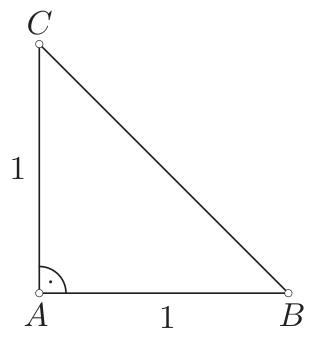

rys. 1

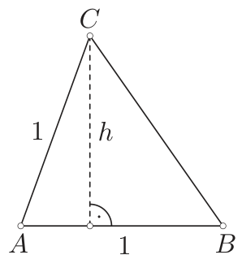

rys. 2

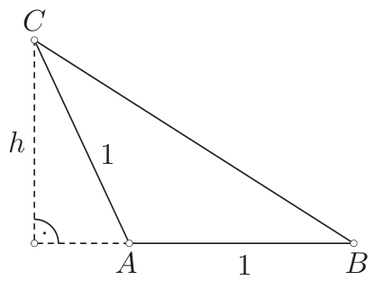

rys. 3

a) Uzasadnimy, że każdy trójkąt, w którym $AB=AC=1$ oraz $\angle BAC\ne 90^\circ$ ma pole mniejsze od $\frac{1}{2}$.

Oznaczmy przez $h$ wysokość trójkąta $ABC$ poprowadzoną z wierzchołka $C$ (rys. 2, 3). Wówczas $h<AC$, czyli $h<1$. Pole trójkąta $ABC$ jest wtedy równe

$$\frac{1}{2}AB\cdot h,$$

co z kolei jest mniejsze od $\frac{1}{2}\cdot 1\cdot 1=\frac{1}{2}$.

c) Z podpunktów a) i b) wynika, że każdy trójkąt, w którym $AB=AC=1$ ma pole albo równe $\frac{1}{2}$ (gdy $\angle BAC=90^\circ$) albo mniejsze od $\frac{1}{2}$ (gdy $\angle BAC\ne 90^\circ$).

# <lo-sample/> PL.OMJ.2020TEST.7_8.5

W okrąg jest wpisany kwadrat, a w ten kwadrat jest wpisany mniejszy okrąg. Wynika z tego, że pole pierścienia kołowego ograniczonego tymi okręgami

**(a)** jest równe polu koła wpisanego w dany kwadrat;

**(b)** jest mniejsze od pola kwadratu;

**(c)** jest większe od 75% pola kwadratu.

<small>

* answer:T,T,T
* questionType:ShortAnswer

</small>

## Rozwiązanie

Niech $ABCD$ będzie danym kwadratem. Oznaczmy ponadto przez $O$ wspólny środek obu okręgów i kwadratu, a przez $M$ — środek boku $AB$. Niech ponadto $r$ będzie promieniem mniejszego okręgu. Wówczas bok kwadratu $ABCD$ ma długość $2r$, a jego przekątna $2r\sqrt{2}$. Wobec tego promień większego okręgu równa się $r\sqrt{2}$. Pole pierścienia kołowego ograniczonego okręgami jest więc równe

$$\pi(r\sqrt{2})^2-\pi r^2=2\pi r^2-\pi r^2=\pi r^2.$$

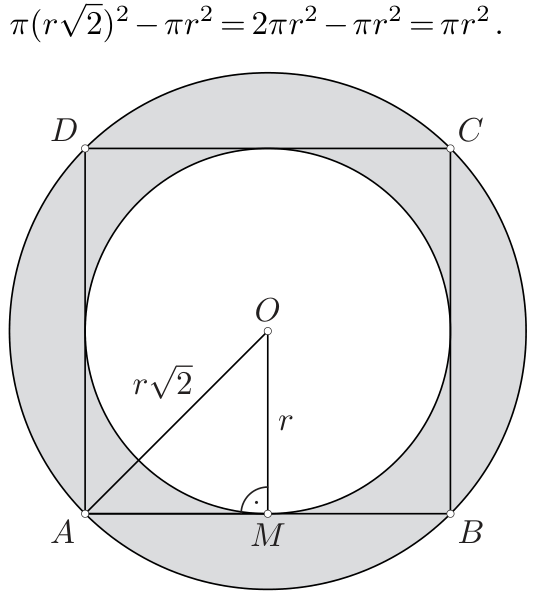

rys. 4

a) Pole mniejszego koła jest równe $\pi r^2$, czyli tyle samo, co pole pierścienia.

b) Ponieważ $\pi r^2<4r^2$, więc pole pierścienia jest mniejsze od pola kwadratu.

c) Z kolei $\pi r^2>\frac{3}{4}\cdot 4r^2$, więc pole pierścienia jest większe od 75% pola kwadratu.

# <lo-sample/> PL.OMJ.2020TEST.7_8.6

Bartek rzucił 100 razy sześcienną kostką do gry, a następnie pomnożył wszystkie uzyskane liczby oczek. Wynika z tego, że iloczyn, który otrzymał Bartek

**(a)** jest liczbą złożoną;

**(b)** jest liczbą składającą się z co najwyżej 100 cyfr;

**(c)** jest różny od $2^{150}\cdot 3^{50}$.

<small>

* answer:N,T,N
* questionType:ShortAnswer

</small>

## Rozwiązanie

a) Bartek mógł wyrzucić 99 razy liczbę 1 oraz jeden raz liczbę 2. Wtedy iloczyn wszystkich wyrzuconych oczek równa się 2, a więc jest liczbą pierwszą.

b) Bartek za każdym razem wyrzucił liczbę mniejszą od 10. Wobec tego iloczyn, który otrzymał, jest liczbą mniejszą od $10^{100}$, a liczby mniejsze od $10^{100}$ składają się z co najwyżej 100 cyfr.

c) Bartek mógł wyrzucić 50 razy liczbę 4 oraz 50 razy liczbę 6. Wtedy uzyskany iloczyn jest równy $4^{50}\cdot 6^{50}=2^{100}\cdot (2^{50}\cdot 3^{50})=2^{150}\cdot 3^{50}$.

# <lo-sample/> PL.OMJ.2020TEST.7_8.7

Każdą dodatnią liczbę całkowitą można przedstawić w postaci sumy

**(a)** dokładnie dwóch kolejnych liczb całkowitych;

**(b)** dokładnie trzech kolejnych liczb całkowitych;

**(c)** co najmniej dwóch kolejnych liczb całkowitych.

<small>

* answer:N,N,T
* questionType:ShortAnswer

</small>

## Rozwiązanie

a) Suma dwóch kolejnych liczb całkowitych jest liczbą nieparzystą. Istotnie, jeśli $n$ oznacza liczbę całkowitą, to $n+(n+1)=2n+1$. W związku z tym żadnej liczby parzystej (np. 2) nie da się przedstawić w postaci sumy dokładnie dwóch kolejnych liczb całkowitych.

b) Suma trzech kolejnych liczb całkowitych jest liczbą podzielną przez 3. Istotnie, jeśli $n$ oznacza liczbę całkowitą, to $n+(n+1)+(n+2)=3(n+1)$. Zatem dowolnej liczby niepodzielnej przez 3 (np. 1) nie da się przedstawić w postaci sumy dokładnie trzech kolejnych liczb całkowitych.

c) Jeśli $n$ jest dowolną liczbą całkowitą dodatnią, to

$$n=-(n-1)-(n-2)-\ldots-1+0+1+2+\ldots+(n-1)+n.$$

Prawa strona powyższej równości jest sumą kolejnych liczb całkowitych od $-(n-1)$ do $n$. Ta suma składa się z co najmniej dwóch składników, gdyż $n\geqslant 1$.

# <lo-sample/> PL.OMJ.2020TEST.7_8.8

Dodatnią liczbę całkowitą $a$ zmniejszono o 70%, a następnie uzyskany wynik powiększono o 20%. Uzyskano w ten sposób liczbę całkowitą $b$. Wynika z tego, że

**(a)** liczba $a$ jest podzielna przez 100;

**(b)** liczba $b$ jest podzielna przez 9;

**(c)** liczba $ab$ jest kwadratem liczby całkowitej.

<small>

* answer:N,T,T
* questionType:ShortAnswer

</small>

## Rozwiązanie

Po zmniejszeniu dodatniej liczby $a$ o 70% uzyskujemy $a-\frac{70}{100}\cdot a=\frac{3}{10}\cdot a$. Z kolei powiększając tę liczbę o 20%, dostajemy

$$b=\left(\frac{3}{10}\cdot a\right)+\frac{20}{100}\cdot \left(\frac{3}{10}\cdot a\right)=\frac{12}{10}\cdot \left(\frac{3}{10}\cdot a\right)=\frac{9}{25}\cdot a.$$

a) Przyjmując $a=25$, uzyskujemy $b=9$, czyli liczbę całkowitą. Jednak liczba 25 nie jest podzielna przez 100.

b) Uzyskaną wyżej równość możemy przepisać w postaci $9a=25b$. Ponieważ liczba 9 nie ma wspólnych dzielników pierwszych z liczbą 25, więc $b$ jest podzielne przez 9.

c) Powyższą równość możemy przepisać także w postaci

$$ab=\left(5\cdot \frac{b}{3}\right)^2.$$

Z podpunktu b) wiemy, że liczba $b$ jest podzielna przez 9, jest więc ona także podzielna przez 3. W związku z tym liczba $5\cdot \frac{b}{3}$ jest całkowita, jako iloczyn dwóch liczb całkowitych.

# <lo-sample/> PL.OMJ.2020TEST.7_8.9

Istnieją takie liczby całkowite $a>1$ oraz $b>1$, że

**(a)** $a^2=b^3$;

**(b)** $a^2=2\cdot b^3$;

**(c)** $a^2=2\cdot b^2$.

<small>

* answer:T,T,N
* questionType:ShortAnswer

</small>

## Rozwiązanie

a) Liczby $a=2^3$, $b=2^2$ spełniają podaną równość.

b) Liczby $a=4$, $b=2$ spełniają podaną równość.

c) Przypuśćmy, że takie liczby istnieją. Daną zależność możemy przekształcić do postaci

$$\left(\frac{a}{b}\right)^2=2.$$

Ułamek $\frac{a}{b}$ zapiszmy w postaci ułamka nieskracalnego $\frac{a_1}{b_1}$. Wtedy $\left(\frac{a_1}{b_1}\right)^2=2$, czyli $\frac{a_1^2}{b_1^2}=2$. Ponieważ ułamek $\frac{a_1}{b_1}$ jest nieskracalny, więc także ułamek $\frac{a_1^2}{b_1^2}$ jest nieskracalny. Skoro więc jego wartość jest równa 2, to $b_1=1$. Wobec tego $a_1^2=2$. Jednak nie istnieje liczba całkowita, której kwadrat jest równy 2. Otrzymaliśmy sprzeczność.

**Uwaga.** W podpunkcie c) wykazaliśmy, że nie istnieje taka liczba wymierna $\frac{a}{b}$, której kwadrat jest równy 2. Wynika stąd, że liczby $\sqrt{2}$ nie można przedstawić w postaci ułamka $\frac{a}{b}$, gdzie $a$ i $b$ są dodatnimi liczbami całkowitymi. Dowiedliśmy zatem, że liczba $\sqrt{2}$ jest niewymierna.

# <lo-sample/> PL.OMJ.2020TEST.7_8.10

W pewnym pięciokącie wypukłym wszystkie przekątne są równej długości. Wynika z tego, że

**(a)** wszystkie boki tego pięciokąta są równej długości;

**(b)** wszystkie kąty wewnętrzne tego pięciokąta są równej miary;

**(c)** jest to pięciokąt foremny.

<small>

* answer:N,N,N
* questionType:ShortAnswer

</small>

## Rozwiązanie

a), b), c) Pięciokąt $ABCDE$ przedstawiony na rysunku 5 nie spełnia żadnego z warunków a), b), c), lecz ma wszystkie przekątne równych długości. Można go skonstruować następująco:

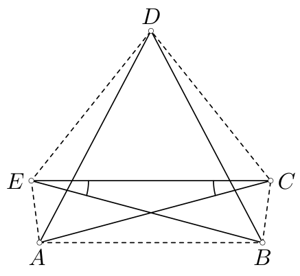

rys. 5

Niech $a$ będzie dowolną liczbą dodatnią, a $\alpha$ dowolnym kątem o mierze mniejszej od $36^\circ$. Konstrukcję zaczynamy od dwóch trójkątów równoramiennych $ACE$ i $BEC$, o ramionach równych $a$ i kątach $ACE$, $BEC$ równych $\alpha$. Następnie konstruujemy trójkąt $ABD$, w którym $AD=BD=a$.

# <lo-sample/> PL.OMJ.2020TEST.7_8.11

W pewnej grupie składającej się z co najmniej trzech osób każdy zna dokładnie jedną spośród pozostałych osób (przyjmujemy, że jeśli osoba $A$ zna osobę $B$, to $B$ zna $A$). Wynika z tego, że

**(a)** istnieje osoba w tej grupie, którą wszyscy znają;

**(b)** liczba osób w grupie jest parzysta;

**(c)** można posadzić wszystkie osoby tej grupy przy okrągłym stole w taki sposób, by każdy siedział obok swojego znajomego.

<small>

* answer:N,T,T
* questionType:ShortAnswer

</small>

## Rozwiązanie

a) Gdyby taka osoba istniała, to znałaby ona wszystkich pozostałych, a więc co najmniej 2 inne osoby. Jest to sprzeczne z warunkami zadania.

b), c) Wybierzmy dowolną osobę $A_1$. Zna ona pewną inną osobę $A_2$. Wybieramy kolejną osobę $A_3$, różną od $A_1$ i $A_2$. Ona także zna pewną osobę $A_4$, która nie jest ani $A_1$, ani $A_2$ — w przeciwnym razie osoba $A_4$ miałaby co najmniej dwóch znajomych. Dalej, wybieramy kolejną osobę $A_5$, różną od $A_1,A_2,A_3,A_4$. Ona również zna pewną osobę $A_6$, która jest różna od $A_1,A_2,A_3,A_4$. Postępowanie to kontynuujemy. Po jego zakończeniu uzyskamy wszystkie osoby z tej grupy połączone w pary znajomych:

$$(A_1,A_2),(A_3,A_4),\ldots,(A_{2n-1},A_{2n}).$$

Stąd wniosek, że w grupie jest parzysta liczba osób.

Wtedy także można je posadzić przy okrągłym stole w taki sposób, każdy siedział obok swojego znajomego (zob. rysunek 6 dla $n=6$).

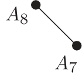

rys. 6

# <lo-sample/> PL.OMJ.2020TEST.7_8.12

Liczby $a$, $b$, $c$ są naturalne oraz $a+b+c$ jest liczbą parzystą. Wynika z tego, że

**(a)** $abc$ jest liczbą parzystą;

**(b)** $a-b+c$ jest liczbą parzystą;

**(c)** $ab+bc+ca$ jest liczbą parzystą.

<small>

* answer:T,T,N
* questionType:ShortAnswer

</small>

## Rozwiązanie

a) Przypuśćmy, że liczba $abc$ jest nieparzysta. Wtedy wszystkie czynniki $a$, $b$, $c$ są nieparzyste, wobec czego także suma $a+b+c$ jest liczbą nieparzystą. Otrzymaliśmy sprzeczność, która dowodzi, że liczba $abc$ jest parzysta.

b) Zauważmy, że $a-b+c=(a+b+c)-2b$. Obie liczby $a+b+c$ i $2b$ są parzyste, a więc liczba $a-b+c$ jest także parzysta, jako różnica dwóch liczb parzystych.

c) Przyjmijmy $a=b=1$, $c=2$. Wówczas suma $a+b+c=4$ jest liczbą parzystą, lecz $ab+bc+ca=5$ jest liczbą nieparzystą.

# <lo-sample/> PL.OMJ.2020TEST.7_8.13

Punkty $A$, $B$, $C$, $D$ leżą na okręgu o promieniu 1, przy czym cięciwy $AC$ i $BD$ przecinają się i są prostopadłe. Wynika z tego, że

**(a)** pole czworokąta $ABCD$ jest nie większe od 2;

**(b)** długość pewnego boku czworokąta $ABCD$ nie przekracza $\sqrt{2}$;

**(c)** czworokąt $ABCD$ jest kwadratem.

<small>

* answer:T,T,N
* questionType:ShortAnswer

</small>

## Rozwiązanie

a) Długości odcinków $AC$ i $BD$ nie przekraczają 2, ponieważ są one cięciwami okręgu o średnicy 2. Wobec tego

$$[ABCD]=\frac{1}{2}AC\cdot BD\leqslant \frac{1}{2}\cdot 2\cdot 2=2,$$

gdzie $[ABCD]$ oznacza pole czworokąta $ABCD$.

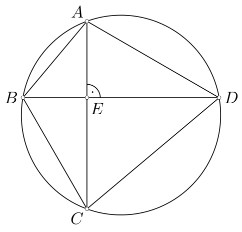

rys. 7

b) Oznaczmy przez $E$ punkt przecięcia przekątnych $AC$ i $BD$. Ponieważ długość odcinka $AC$ nie przekracza 2, więc długość któregoś z odcinków $AE$, $EC$ nie przekracza 1. Bez straty ogólności przyjmijmy, że $AE\leqslant 1$.

Podobnie, długość odcinka $BD$ nie przekracza 2, więc długość któregoś z odcinków $BE$, $ED$ nie przekracza 1. Bez straty ogólności przyjmijmy, że $BE\leqslant 1$. Wtedy

$$AB=\sqrt{AE^2+BE^2}\leqslant \sqrt{1^2+1^2}=\sqrt{2}.$$

c) Jeśli $AC$ i $BD$ są dwiema prostopadłymi, przecinającymi się cięciwami, z których co najmniej jedna nie jest średnicą okręgu, to czworokąt $ABCD$ spełnia warunki zadania i nie jest kwadratem.

# <lo-sample/> PL.OMJ.2020TEST.7_8.14

Równolegle do boków kwadratu o boku długości 4 poprowadzono proste dzielące ten kwadrat na 16 małych kwadratów o boku długości 1. Następnie w niektórych z uzyskanych kwadratów $1\times 1$ narysowano jedną przekątną w taki sposób, by żadne dwie narysowane przekątne nie miały wspólnych końców. Wynika z tego, że narysowano co najwyżej

**(a)** 7 przekątnych;

**(b)** 9 przekątnych;

**(c)** 12 przekątnych.

<small>

* answer:N,N,T
* questionType:ShortAnswer

</small>

## Rozwiązanie

a), b) Rysunek 8 przedstawia sposób narysowania 10 przekątnych w sposób opisany w treści zadania.

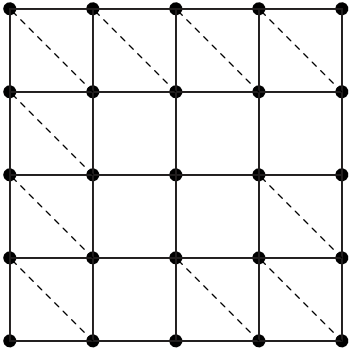

rys. 8

c) Gdyby było możliwe narysowanie 13 przekątnych zgodnie z warunkami zadania, to łączna liczba punktów zajętych przez końce narysowanych przekątnych byłaby równa $13\cdot 2=26$. Tymczasem koniec każdej przekątnej leży w jednym z punktów, zaznaczonych na rysunku 8, których jest tylko 25. Uzyskana sprzeczność dowodzi, że nie można narysować więcej niż 12 przekątnych spełniających warunki zadania.

# <lo-sample/> PL.OMJ.2020TEST.7_8.15

Dany jest prostopadłościan o podstawach $ABCD$, $KLMN$ oraz krawędziach bocznych $AK$, $BL$, $CM$, $DN$. Wynika z tego, że

**(a)** $\angle ALC=\angle ANC$;

**(b)** $\angle ALC=\angle DMB$;

**(c)** $\angle ANB=\angle BKC$.

<small>

* answer:T,T,N
* questionType:ShortAnswer

</small>

## Rozwiązanie

a) Zauważmy, że $CL=AN$ oraz $AL=CN$ (rys. 9). Wobec tego trójkąty $ACL$ i $CAN$ są przystające (cecha bok–bok–bok). Stąd $\angle ALC=\angle ANC$.

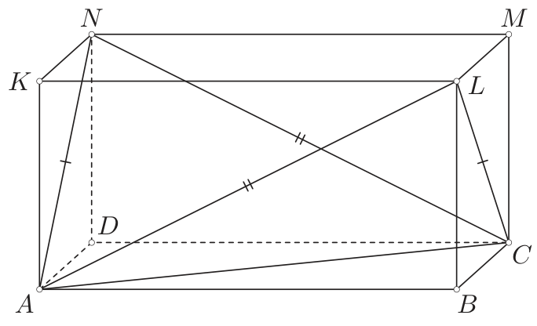

rys. 9

b) Zauważmy, że $AL=DM$, $AC=DB$ oraz $CL=BM$ (rys. 10). W związku z tym trójkąty $ALC$ i $DMB$ są przystające (cecha bok–bok–bok). Stąd $\angle ALC=\angle DMB$.

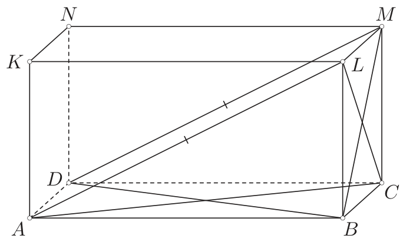

rys. 10

c) Rozpatrzmy prostopadłościan, w którym $AB=2$ oraz $BC=CM=1$ (rys. 11). Wykażemy, że wtedy $\angle ANB\ne \angle BKC$. Przypuśćmy przeciwnie, że $\angle ANB=\angle BKC$. Ponieważ

$$\angle BAN=\angle KBC=90^\circ \quad \text{oraz} \quad BN=CK,$$

więc trójkąty $ABN$ i $BCK$ są przystające (cecha kąt–bok–kąt). Jednak pierwszy z tych trójkątów ma boki długości $2$, $\sqrt{6}$, $\sqrt{2}$, a drugi $1$, $\sqrt{6}$, $\sqrt{5}$. Otrzymaliśmy sprzeczność, z której wynika, że $\angle ANB\ne \angle BKC$.

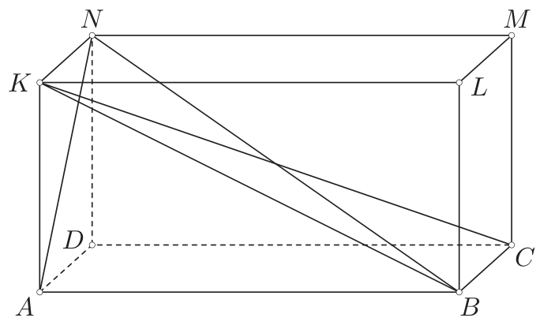

rys. 11
