# <lo-sample/> PL.OMJ.2021TEST.7_8.1

Eksistē tāds naturāls skaitlis, kura katrs cipars ir 2 vai 6 un kas dalās ar

**(a)** 4;

**(b)** 5;

**(c)** 9.

<small>

* answer:N,N,T
* questionType:ShortAnswer

</small>

## Atrisinājums

a) Viencipara skaitļi 2 un 6 nedalās ar 4. Naturāls skaitlis ar vismaz diviem cipariem, no kuriem katrs ir 2 vai 6, var beigties tikai ar cipariem 22, 26, 62 vai 66. Saskaņā ar dalāmības ar 4 pazīmi neviens šāds skaitlis nedalās ar 4.

b) Katrs skaitlis, kas dalās ar 5, beidzas ar ciparu 0 vai 5. Tāpēc neviens skaitlis, kura pēdējais cipars ir 2 vai 6, nedalās ar 5.

c) Naturāls skaitlis dalās ar 9, ja tā ciparu summa dalās ar 9. Tātad skaitļu, kas dalās ar 9 un kuru vienīgie cipari ir 2 un 6, piemēri ir 666, 66222, 222222222, jo katra šī skaitļa ciparu summa dalās ar 9.

# <lo-sample/> PL.OMJ.2021TEST.7_8.2

Eksistē tādi divi trijstūri, kuru kopīgā daļa ir

**(a)** piecstūris;

**(b)** sešstūris;

**(c)** septiņstūris.

<small>

* answer:T,T,N
* questionType:ShortAnswer

</small>

## Atrisinājums

a) Šādu divu trijstūru novietojuma piemērs ir parādīts 1. zīmējumā.

b) Šādu divu trijstūru novietojuma piemērs ir parādīts 2. zīmējumā.

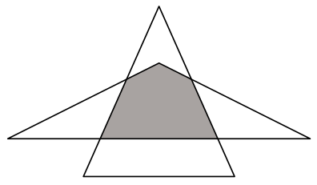

1. zīm.

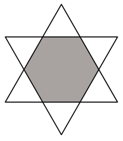

2. zīm.

c) Pieņemsim, ka daudzstūris $\mathcal{W}$ ir kādu divu trijstūru kopīgā daļa. Tad daudzstūra $\mathcal{W}$ malas atrodas uz šo divu trijstūru malām. Turklāt neviena no šo trijstūru sešām malām nevar saturēt vairāk nekā vienu daudzstūra $\mathcal{W}$ malu. Tāpēc daudzstūra $\mathcal{W}$ malu skaits nav lielāks kā 6.

# <lo-sample/> PL.OMJ.2021TEST.7_8.3

Piecu pa pāriem dažādu pozitīvu veselu skaitļu summa ir 17. No tā izriet, ka viens no šiem pieciem skaitļiem ir

**(a)** 2;

**(b)** 3;

**(c)** 4.

<small>

* answer:T,T,N
* questionType:ShortAnswer

</small>

## Atrisinājums

a) Pieņemsim, ka neviens no pieciem dotajiem skaitļiem nav vienāds ar 2. Tad šo piecu skaitļu summa nav mazāka kā $1+3+4+5+6=19$, tātad nevar būt vienāda ar 17.

b) Pieņemsim, ka neviens no pieciem dotajiem skaitļiem nav vienāds ar 3. Tad šo piecu skaitļu summa nav mazāka kā $1+2+4+5+6=18$, tātad nevar būt vienāda ar 17.

c) Izpildās vienādība $1+2+3+5+6=17$, turklāt neviens no pieciem saskaitāmajiem kreisajā pusē nav vienāds ar 4.

**Piezīme.** Uzdevumā aplūkotie skaitļi ir pa pāriem dažādi, t.i., nekādi divi no tiem nav vienādi. Konkrēti, skaitļu piecnieks 1, 1, 5, 5, 5 neapmierina uzdevuma nosacījumus.

# <lo-sample/> PL.OMJ.2021TEST.7_8.4

Eksistē tādi veseli skaitļi $x$, $y$, $z$, ka negatīvs ir katrs no skaitļiem

**(a)** $x+y$, $y+z$, $z+x$;

**(b)** $x-y$, $y-z$, $z-x$;

**(c)** $x\cdot y$, $y\cdot z$, $z\cdot x$.

<small>

* answer:T,N,N
* questionType:ShortAnswer

</small>

## Atrisinājums

a) Pieņemot $x=y=z=-1$, iegūstam $x+y=y+z=z+x=-2$.

b) Ja visi trīs skaitļi $x-y$, $y-z$, $z-x$ būtu negatīvi, tad arī to summa būtu negatīvs skaitlis. Turpretī

$$(x-y)+(y-z)+(z-x)=0$$

nav negatīvs skaitlis.

c) Ja visi trīs skaitļi $x\cdot y$, $y\cdot z$, $z\cdot x$ būtu negatīvi, tad arī to reizinājums būtu negatīvs skaitlis. Turpretī

$$(x\cdot y)\cdot (y\cdot z)\cdot (z\cdot x)=(x\cdot y\cdot z)^2$$

ir nenegatīvs skaitlis kā kāda vesela skaitļa kvadrāts.

# <lo-sample/> PL.OMJ.2021TEST.7_8.5

Naturāls skaitlis $n$ dalās ar 2, bet skaitlis $n+1$ dalās ar 3. No tā izriet, ka

**(a)** skaitlis $n+2$ dalās ar 4;

**(b)** skaitlis $n+3$ dalās ar 5;

**(c)** skaitlis $n+4$ dalās ar 6.

<small>

* answer:N,N,T
* questionType:ShortAnswer

</small>

## Atrisinājums

a), b) Skaitlis $n=8$ apmierina uzdevuma nosacījumus, jo tas dalās ar 2, bet skaitlis $n+1=9$ dalās ar 3. Tajā pašā laikā skaitlis $n+2=10$ nedalās ar 4, bet skaitlis $n+3=11$ nedalās ar 5.

c) Ja skaitlis $n$ ir pāra, tad arī skaitlis $n+4$ ir pāra. Ja skaitlis $n+1$ dalās ar 3, tad arī skaitlis $(n+1)+3=n+4$ dalās ar 3. Tā kā skaitlis $n+4$ ir pāra un dalās ar 3, tad tas dalās ar 6.

# <lo-sample/> PL.OMJ.2021TEST.7_8.6

Veseli skaitļi $a$ un $b$ apmierina nevienādību $a^3\geqslant b^2$. No tā izriet, ka

**(a)** $a\geqslant 0$;

**(b)** $b\geqslant 0$;

**(c)** $2a+b\geqslant 0$.

<small>

* answer:T,N,N
* questionType:ShortAnswer

</small>

## Atrisinājums

a) Jebkura vesela skaitļa kvadrāts ir nenegatīvs skaitlis, tāpēc $b^2\geqslant 0$. Apvienojot šo novērojumu ar pieņēmumu $a^3\geqslant b^2$, secinām, ka $a^3\geqslant 0$. No tā izriet, ka $a\geqslant 0$.

b), c) Pieņemot $a=9=3^2$ un $b=-27=-3^3$, iegūstam $a^3=3^6=b^2$. Taču tad $b<0$ un $2a+b=-9<0$.

# <lo-sample/> PL.OMJ.2021TEST.7_8.7

Eksistē tāds trijstūris, ko var sagriezt divos

**(a)** šaurleņķa trijstūros;

**(b)** taisnleņķa trijstūros;

**(c)** platleņķa trijstūros.

<small>

* answer:N,T,T
* questionType:ShortAnswer

</small>

## Atrisinājums

Ievērosim, ka, ja trijstūris ir sagriezts divos trijstūros, tad griezuma nogrieznis savieno vienu no tā virsotnēm ar kādu punktu, kas atrodas uz pretējās malas.

a) Pieņemsim, ka trijstūris $ABC$ ir sagriezts trijstūros $ACD$ un $BCD$. Tad nav iespējams, ka abi leņķi $ADC$ un $BDC$ būtu šauri, jo to lielumu summa ir $180^\circ$. Tas nozīmē, ka vismaz viens no trijstūriem $ACD$ un $BCD$ nav šaurleņķa.

b) Aplūkosim jebkuru šaurleņķa trijstūri. Jebkurš augstums šajā trijstūrī ir nogrieznis, kas to sagriež divos taisnleņķa trijstūros (3. zīm.).

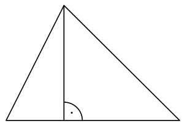

3. zīm.

c) Aplūkosim jebkuru platleņķa trijstūri $ABC$ ar plato leņķi pie virsotnes $C$ un izvēlēsimies uz malas $AB$ jebkuru punktu $D$ ar īpašību, ka $\sphericalangle ACD>90^\circ$ (4. zīm.). Tad $\sphericalangle ADC<90^\circ$ un līdz ar to $\sphericalangle BDC>90^\circ$. Tātad nogrieznis $CD$ sagriež trijstūri $ABC$ divos platleņķa trijstūros.

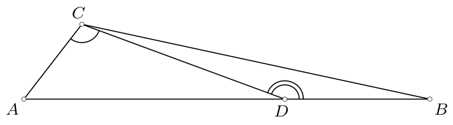

4. zīm.

# <lo-sample/> PL.OMJ.2021TEST.7_8.8

No kāda skaita taisnstūra paralēlskaldņa formas klucīšu ar izmēriem $1\times 2\times 3$ var uzbūvēt taisnstūra paralēlskaldni ar izmēriem

**(a)** $4\times 4\times 4$;

**(b)** $5\times 6\times 7$;

**(c)** $7\times 8\times 9$.

<small>

* answer:N,T,T
* questionType:ShortAnswer

</small>

## Atrisinājums

a) Kuba ar izmēriem $4\times 4\times 4$ tilpums ir 64, bet viena klucīša ar izmēriem $1\times 2\times 3$ tilpums ir 6. Tā kā 64 nedalās ar 6, tad nav iespējams uzbūvēt kubu ar šķautnes garumu 4 no klucīšiem ar izmēriem $1\times 2\times 3$.

b) Ievērosim, ka no pieciem klucīšiem ar izmēriem $1\times 2\times 3$ var uzbūvēt taisnstūra paralēlskaldni ar izmēriem $1\times 5\times 6$ (5. zīm.). Tāpēc, savienojot septiņus šādus slāņus, varam uzbūvēt taisnstūra paralēlskaldni ar izmēriem $5\times 6\times 7$ (izmantojot 35 klucīšus).

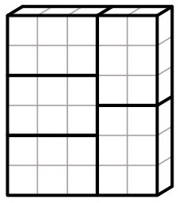

5. zīm.

c) Ievērosim, ka no divpadsmit klucīšiem ar izmēriem $1\times 2\times 3$ var uzbūvēt taisnstūra paralēlskaldni ar izmēriem $1\times 8\times 9$ (6. zīm.). Tāpēc, savienojot septiņus šādus slāņus, varam uzbūvēt taisnstūra paralēlskaldni ar izmēriem $7\times 8\times 9$ (izmantojot 84 klucīšus).

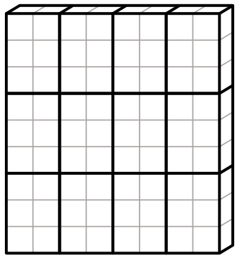

6. zīm.

# <lo-sample/> PL.OMJ.2021TEST.7_8.9

Pozitīva vesela skaitļa $a$ pozitīvo dalītāju skaits ir lielāks nekā pozitīva vesela skaitļa $b$ pozitīvo dalītāju skaits. No tā izriet, ka

**(a)** skaitlis $a$ ir lielāks nekā skaitlis $b$;

**(b)** skaitlim $a+1$ ir vairāk pozitīvu dalītāju nekā skaitlim $b+1$;

**(c)** skaitlim $2a$ ir vairāk pozitīvu dalītāju nekā skaitlim $2b$.

<small>

* answer:N,N,N
* questionType:ShortAnswer

</small>

## Atrisinājums

Pieņemsim $a=8$ un $b=9$. Tad skaitlim $a$ ir četri pozitīvi dalītāji: 1, 2, 4, 8, bet skaitlim $b$ ir trīs pozitīvi dalītāji: 1, 3, 9.

a) Šādi izvēlētiem skaitļiem $a$, $b$ izpildās nevienādība $a<b$.

b) Skaitlim $b+1=10$ ir četri pozitīvi dalītāji: 1, 2, 5, 10, bet skaitlim $a+1=9$ ir trīs pozitīvi dalītāji.

c) Skaitlim $2a=16$ ir pieci pozitīvi dalītāji: 1, 2, 4, 8, 16, bet skaitlim $2b=18$ ir seši pozitīvi dalītāji: 1, 2, 3, 6, 9, 18.

# <lo-sample/> PL.OMJ.2021TEST.7_8.10

Trijstūrī $ABC$ leņķa pie virsotnes $A$ lielums ir $60^\circ$. Augstums $CD$ sadala malu $AB$ nogriežņos ar garumiem $AD=2$ un $BD=6$. No tā izriet, ka

**(a)** viena trijstūra $ABC$ mala ir divreiz garāka par citu šī trijstūra malu;

**(b)** viens trijstūra $ABC$ leņķis ir divreiz lielāks par citu šī trijstūra leņķi;

**(c)** trijstūra $BCD$ laukums ir divreiz lielāks par trijstūra $ACD$ laukumu.

<small>

* answer:T,T,N
* questionType:ShortAnswer

</small>

## Atrisinājums

a) Taisnleņķa trijstūris $ACD$ ir puse no vienādmalu trijstūra, no kā secinām, ka $AC=2\cdot AD=4$. Tātad $AB=8=2\cdot AC$.

b) Tā kā trijstūrī $ABC$ leņķa pie virsotnes $A$ lielums ir $60^\circ$ un $AB=2\cdot AC$, tad arī šis trijstūris ir puse no vienādmalu trijstūra, un tāpēc $\sphericalangle ABC=30^\circ$.

c) Pieņemsim, ka $h$ ir nogriežņa $CD$ garums (7. zīm.). Apzīmējot ar $[T]$ trijstūra $T$ laukumu, iegūstam

$$[ACD]=\frac12 AD\cdot h\quad \text{un}\quad [BCD]=\frac12 BD\cdot h.$$

Secinām, ka $[BCD]=3\cdot [ACD]$, jo $BD=3\cdot AD$.

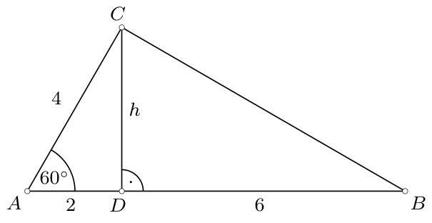

7. zīm.

# <lo-sample/> PL.OMJ.2021TEST.7_8.11

Pozitīvie skaitļi $x$ un $y$ apmierina vienādību $x+y=x\cdot y$. No tā izriet, ka skaitlis $\frac1x+\frac1y$ ir vienāds ar

**(a)** $\frac1x\cdot\frac1y$;

**(b)** $\frac1{x-1}\cdot\frac1{y-1}$;

**(c)** 1.

<small>

* answer:N,T,T
* questionType:ShortAnswer

</small>

## Atrisinājums

a) Skaitļi $x=y=2$ apmierina vienādību $x+y=x\cdot y$, bet

$$\frac1x+\frac1y=1\neq \frac14=\frac1x\cdot \frac1y.$$

b), c) Novedot aplūkotās summas saskaitāmos pie kopsaucēja un izmantojot pieņēmumu $x+y=x\cdot y$, iegūstam

$$\frac1x+\frac1y=\frac{y}{x\cdot y}+\frac{x}{x\cdot y}=\frac{y+x}{x\cdot y}=1.$$

Turklāt ievērosim, ka

$$\frac1{x-1}\cdot \frac1{y-1}=\frac1{(x-1)(y-1)}=\frac1{x\cdot y-(x+y)+1}=1,$$

kur atkal izmantojām pieņēmumu $x+y=x\cdot y$.

**Piezīme.** Ja skaitļi $x$, $y$ apmierina nosacījumu $x+y=x\cdot y$, tad $x\neq 1$ un $y\neq 1$, t.i., skaitļi $x-1$ un $y-1$ ir atšķirīgi no nulles. Patiešām, jebkuram skaitlim $x$ ir $x+1\neq x\cdot 1$, tātad $y\neq 1$ (analoģiski var pamatot, ka $x\neq 1$).

# <lo-sample/> PL.OMJ.2021TEST.7_8.12

Eksistē tāds kubs, kura šķautnes garums ir naturāls skaitlis un

**(a)** visu tā šķautņu garumu summa ir naturāla skaitļa kvadrāts;

**(b)** tā pilnās virsmas laukums ir naturāla skaitļa kvadrāts;

**(c)** tā tilpums ir naturāla skaitļa kvadrāts.

<small>

* answer:T,N,T
* questionType:ShortAnswer

</small>

## Atrisinājums

Kuba ar šķautnes garumu $n$ visu šķautņu garumu summa ir $12n$. Šāda kuba pilnās virsmas laukums ir $6n^2$, bet tā tilpums ir $n^3$.

a) Ja $n=12$, tad kuba šķautņu garumu summa ir $12^2$.

c) Ja $n=1$, tad kuba tilpums ir $1^2$.

b) Izmantosim šādu faktu: vesels skaitlis, kas lielāks par 1, ir vesela skaitļa kvadrāts tad un tikai tad, ja tā sadalījumā pirmreizinātājos visi kāpinātāji ir pāra skaitļi. Citiem vārdiem, vesela skaitļa, kas lielāks par 1, kvadrāta sadalījumā pirmreizinātājos katrs pirmskaitlis ir pāra skaitu reižu.

Saskaņā ar minēto faktu skaitļa $n^2$ sadalījumā pirmreizinātājos skaitlis 2 ir ar pāra kāpinātāju. Skaitļa $6n^2=2\cdot 3\cdot n^2$ sadalījumā pirmreizinātājos reizinātājs 2 ir ar par vienu lielāku, tātad nepāra kāpinātāju. Tas nozīmē, ka skaitlis $6n^2$ nav vesela skaitļa kvadrāts.

**Piezīme.** Minētā īpašība, kas raksturo veselu skaitļu, kas lielāki par 1, kvadrātus, kopā ar pierādījumu un lietojuma piemēriem ir aplūkota rakstā „Kwadraty i dzielniki” (Kwadrat nr. 11, 2013. gada decembris, 2. teorēma).

# <lo-sample/> PL.OMJ.2021TEST.7_8.13

Punkts $P$ atrodas trijstūra $ABC$ iekšpusē. No tā izriet, ka

**(a)** nogriežņu $AP$ un $BP$ garumu summa ir lielāka nekā nogriežņa $CP$ garums;

**(b)** trijstūru $ACP$ un $BCP$ perimetru summa ir lielāka nekā trijstūra $ABP$ perimetrs;

**(c)** trijstūru $ACP$ un $BCP$ laukumu summa ir lielāka nekā trijstūra $ABP$ laukums.

<small>

* answer:N,T,N
* questionType:ShortAnswer

</small>

## Atrisinājums

a) Aplūkosim trijstūri $ABP$, kurā $AP=BP=1$. Pieņemsim, ka $C$ ir tāds punkts, ka $CP>2$ un punkts $P$ atrodas trijstūra $ABC$ iekšpusē (8. zīm.). Tad $AP+BP<CP$.

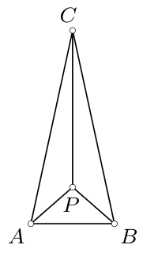

8. zīm.

b) Ievērosim, ka izpildās nevienādības $AC+BC>AB$ un $CP>0$. Tātad

$$(AC+CP+AP)+(BC+CP+BP)=AP+BP+(AC+BC)+2\cdot CP>AP+BP+AB,$$

t.i., trijstūru $ACP$ un $BCP$ perimetru summa ir lielāka nekā trijstūra $ABP$ perimetrs.

c) Aplūkosim jebkuru trijstūri $ABC$ un apzīmēsim ar $h$ no virsotnes $C$ novilktā augstuma garumu. Izvēlēsimies trijstūra iekšpusē jebkuru punktu $P$, kura attālums līdz taisnei $AB$ ir lielāks nekā $\frac12 h$ (9. zīm.). Tad trijstūra $ABP$ laukums ir lielāks nekā puse no trijstūra $ABC$ laukuma, un līdz ar to četrstūra $APBC$ laukums ir mazāks nekā puse no trijstūra $ABC$ laukuma. Līdz ar to trijstūru $ACP$ un $BCP$ laukumu summa ir mazāka nekā trijstūra $ABP$ laukums.

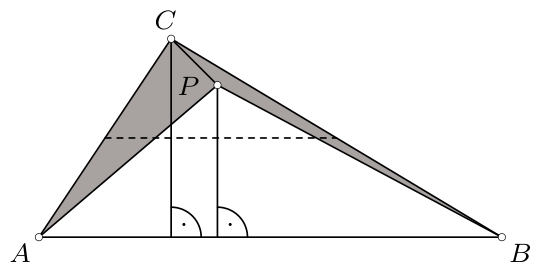

9. zīm.

# <lo-sample/> PL.OMJ.2021TEST.7_8.14

Sešu cilvēku grupā katrs pazīst tieši trīs no pārējiem pieciem cilvēkiem, turklāt, ja cilvēks $A$ pazīst cilvēku $B$, tad arī cilvēks $B$ pazīst cilvēku $A$. No tā izriet, ka

**(a)** kādi trīs no šiem sešiem cilvēkiem savstarpēji pazīstas;

**(b)** kādi trīs no šiem sešiem cilvēkiem savstarpēji nepazīstas;

**(c)** šos sešus cilvēkus var sadalīt trīs pāros, kuros cilvēki savstarpēji pazīstas.

<small>

* answer:N,N,T
* questionType:ShortAnswer

</small>

## Atrisinājums

Ievērosim, ka aplūkotajā grupā katram starp pārējiem pieciem cilvēkiem ir tieši divi nepazīstami cilvēki. Iedomāsimies, ka katrs sniedz roku katram no saviem nepazīstamajiem (vienam kreiso, otram labo). Tādā veidā visi rokasspiedieni veido „ciklus”, kas sastāv no vismaz trim cilvēkiem. Tas nozīmē, ka visas nepazīšanās grupā veido vai nu divus „trijstūrus” (10. zīm.), vai vienu „sešstūri” (11. zīm.), turklāt attēlos raustītie nogriežņi apzīmē nepazīšanos, bet nepārtrauktie nogriežņi — pazīšanos.

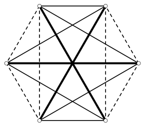

10. zīm.

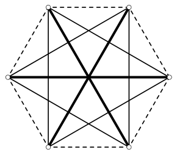

11. zīm.

a) Ja pazīšanās shēma izskatās tā, kā 10. zīmējumā, tad nav tādu trīs cilvēku, kas savstarpēji pazīstas.

b) Ja pazīšanās shēma izskatās tā, kā 11. zīmējumā, tad nav tādu trīs cilvēku, kas savstarpēji nepazīstas.

c) Abās iespējamajās situācijās var atrast atbilstošus sadalījumus pāros — tie ir atzīmēti 10. un 11. zīmējumā ar treknākiem nogriežņiem.

# <lo-sample/> PL.OMJ.2021TEST.7_8.15

Kādā regulārā četrstūra piramīdā pamata šķautnes garums ir 2, bet sānu šķautnes garums ir $b$. No tā izriet, ka

**(a)** $b>\sqrt2$;

**(b)** šīs piramīdas augstums ir mazāks nekā $b$;

**(c)** šīs piramīdas sānu virsmas laukums ir lielāks nekā 4.

<small>

* answer:T,T,T
* questionType:ShortAnswer

</small>

## Atrisinājums

Apzīmēsim dotās piramīdas pamatā esošo kvadrātu ar $ABCD$, pamata centru ar $P$, nogriežņa $AB$ viduspunktu ar $M$, bet piramīdas virsotni — ar $S$.

a), b) Taisnleņķa trijstūrī $APS$ hipotenūza $AS$ ar garumu $b$ ir garāka gan par kateti $AP$ ar garumu $\frac12\cdot AC=\frac12\cdot 2\sqrt2=\sqrt2$, gan par kateti $PS$, kas ir dotās piramīdas augstums (12. zīm.).

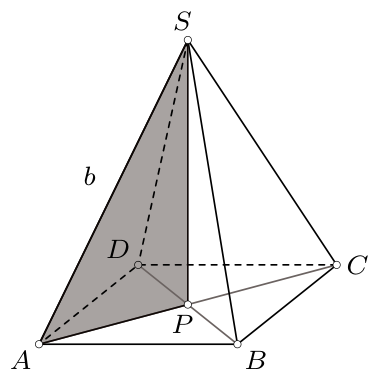

12. zīm.

c) Taisnleņķa trijstūrī $MPS$ hipotenūza $MS$ ir garāka par kateti $MP$ (13. zīm.). Līdz ar to skaldnes $ABS$ laukums, kas ir $\frac12\cdot AB\cdot MS$, ir lielāks nekā $\frac12\cdot AB\cdot MP$, t.i., trijstūra $ABP$ laukums. Analoģiski pamatojam, ka skaldņu $BCS$, $CDS$, $DAS$ laukumi ir lielāki attiecīgi par trijstūru $BCP$, $CDP$, $DAP$ laukumiem. Tātad piramīdas sānu virsmas laukums ir lielāks nekā šīs piramīdas pamata laukums, kas ir 4.

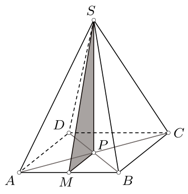

13. zīm.
