# <lo-sample/> PL.OMJ.2022TEST.7_8.1

Skaitlis $2022$ dalās ar savu ciparu summu. Šī īpašība piemīt arī skaitlim

**(a)** $2023$;

**(b)** $2024$;

**(c)** $2025$.

<small>

* answer:T,T,T
* questionType:ShortAnswer

</small>

## Atrisinājums

a) Tieši pārbaudām, ka $2023=7\cdot 289=(2+0+2+3)\cdot 289$.

b) Ievērosim, ka $2024$ ir skaitlis, kas beidzas ar cipariem „$024$”, tāpēc saskaņā ar dalāmības ar $8$ pazīmi tas ir skaitlis, kas dalās ar $8=2+0+2+4$.

c) Skaitļa $2025$ ciparu summa ir $9$, tāpēc saskaņā ar dalāmības ar $9$ pazīmi skaitlis $2025$ dalās ar $9=2+0+2+5$.

**Piezīme.**

Skaitļi $2022$, $2023$, $2024$, $2025$ ir četri pēc kārtas sekojoši naturāli skaitļi, no kuriem katrs dalās ar savu ciparu summu. Iepriekšējais šāds četrinieks ir skaitļi no $1014$ līdz $1017$, bet nākamais — no $3030$ līdz $3033$. Izrādās, ka eksistē pat $20$ pēc kārtas sekojoši naturāli skaitļi ar šo īpašību, bet $21$ — vairs ne.

# <lo-sample/> PL.OMJ.2022TEST.7_8.2

Skaitlis $100^{100}$ ir

**(a)** $100$-ciparu;

**(b)** $200$-ciparu;

**(c)** $300$-ciparu.

<small>

* answer:N,N,N
* questionType:ShortAnswer

</small>

## Atrisinājums

Ievērosim, ka

$$100^{100}=(10^2)^{100}=10^{200}=\underbrace{100\ldots0}_{200\ \text{nulles}},$$

kas nozīmē, ka skaitlis $100^{100}$ ir $201$-ciparu.

# <lo-sample/> PL.OMJ.2022TEST.7_8.3

Ja katru kvadrāta malu pagarināsim par $10\%$, tad

**(a)** šī kvadrāta diagonāles garums palielināsies par $10\%$;

**(b)** šī kvadrāta laukums palielināsies par $20\%$;

**(c)** šī kvadrāta perimetrs palielināsies par $40\%$.

<small>

* answer:T,N,N
* questionType:ShortAnswer

</small>

## Atrisinājums

Pieņemsim, ka sākotnēji kvadrāta malas garums ir $a$. Ja katru malu pagarināsim par $10\%$, tad iegūsim kvadrātu ar malu $1{,}1a$.

a) Kvadrāta ar malu $a$ diagonāles garums ir $a\sqrt2$, bet kvadrāta ar malu $1{,}1a$ diagonāles garums ir $1{,}1\cdot a\sqrt2$. Tas ir skaitlis, kas par $10\%$ lielāks nekā $a\sqrt2$.

b) Kvadrāta ar malu $a$ laukums ir $a^2$, bet kvadrāta ar malu $1{,}1a$ laukums ir $(1{,}1a)^2=1{,}21\cdot a^2$. Tas ir skaitlis, kas par $21\%$ lielāks nekā $a^2$.

c) Kvadrāta ar malu $a$ perimetrs ir $4a$, bet kvadrāta ar malu $1{,}1a$ perimetrs ir $4{,}4a=1{,}1\cdot 4a$. Tas ir skaitlis, kas par $10\%$ lielāks nekā $4a$.

# <lo-sample/> PL.OMJ.2022TEST.7_8.4

Vismaz viens perpendikulāru diagonāļu pāris ir

**(a)** regulāram piecstūrim;

**(b)** regulāram sešstūrim;

**(c)** regulāram astoņstūrim.

<small>

* answer:N,T,T
* questionType:ShortAnswer

</small>

## Atrisinājums

a) Divi nogriežņi ir perpendikulāri tieši tad, ja to vidusperpendikuli ir perpendikulāri. Turpretī leņķis starp regulāra piecstūra divu diagonāļu vidusperpendikuliem ir leņķa $\frac15\cdot 360^\circ=72^\circ$ vesels daudzkārtnis, tātad nevar būt taisns (1. zīm.).

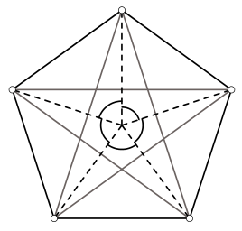

1. zīm.

b), c) Regulāra sešstūra perpendikulāru diagonāļu pāra piemērs ir parādīts 2. zīmējumā, bet regulāra astoņstūra perpendikulāru diagonāļu pāra piemērs — 3. zīmējumā. Abos gadījumos horizontālā diagonāle ir simetriska attiecībā pret taisni, uz kuras atrodas vertikālā diagonāle.

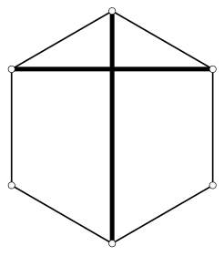

2. zīm.

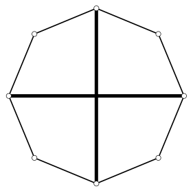

3. zīm.

**Piezīme.**

Regulāram daudzstūrim ir perpendikulāru diagonāļu pāris tieši tad, ja tam ir pāra skaits malu.

# <lo-sample/> PL.OMJ.2022TEST.7_8.5

Skaitli $18$ var izteikt kā summu

**(a)** trim pēc kārtas sekojošiem veseliem skaitļiem;

**(b)** sešiem pēc kārtas sekojošiem veseliem skaitļiem;

**(c)** divpadsmit pēc kārtas sekojošiem veseliem skaitļiem.

<small>

* answer:T,N,T
* questionType:ShortAnswer

</small>

## Atrisinājums

a), c) Ievērosim, ka $18=5+6+7=(-4)+(-3)+(-2)+(-1)+0+1+2+3+4+5+6+7$.

b) Pieņemsim, ka $18=n+(n+1)+(n+2)+(n+3)+(n+4)+(n+5)$ kādam skaitlim $n$. Tas nozīmē, ka $18=6n+15$, t.i., $n=\frac12$. Skaitlis $\frac12$ nav vesels, tāpēc prasītais izteikums nav iespējams.

**Piezīme.**

Visi skaitļi $n\geqslant 2$ ar īpašību, ka skaitli $18$ var izteikt kā $n$ pēc kārtas sekojošu veselu skaitļu summu, ir $3$, $4$, $9$, $12$ un $36$.

# <lo-sample/> PL.OMJ.2022TEST.7_8.6

Punkts $P$ atrodas vienādmalu trijstūra $ABC$ iekšpusē, turklāt izpildās vienādība $\angle PAB+\angle PBC=60^\circ$. No tā izriet, ka

**(a)** $\angle PAB=30^\circ$;

**(b)** $\angle PBC=30^\circ$;

**(c)** $\angle PCA=30^\circ$.

<small>

* answer:N,N,T
* questionType:ShortAnswer

</small>

## Atrisinājums

Ievērosim, ka $\angle PBA=60^\circ-\angle PBC$, tāpēc punkts $P$ apmierina uzdevumā doto vienādību tad un tikai tad, ja $\angle PAB=\angle PBA$ (4. zīm.).

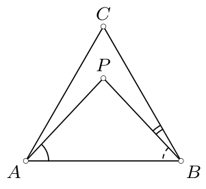

4. zīm.

c) Ja $\angle PAB=\angle PBA$, tad trijstūris $ABP$ ir vienādsānu un $AP=BP$. Savukārt trijstūris $ABC$ ir vienādmalu, tāpēc $AC=BC$. Tas nozīmē, ka trijstūri $PAC$ un $PBC$ ir vienādi (pazīme mmm), un līdz ar to $\angle PCA=\angle PCB=\frac12\cdot \angle ACB=30^\circ$.

a), b) Ja punkts $P$ tiks izvēlēts tā, ka $\angle PAB=\angle PBA\neq 30^\circ$ (5. zīm.), tad uzdevuma nosacījumi būs izpildīti, bet $\angle PAB\neq 30^\circ$ un $\angle PBC=60^\circ-\angle PBA\neq 30^\circ$.

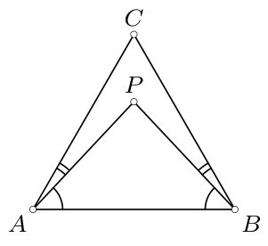

5. zīm.

# <lo-sample/> PL.OMJ.2022TEST.7_8.7

Eksistē tāds reāls skaitlis $x$, ka nekādi divi no skaitļiem $x$, $x^2$, $x^3$ nav vienādi, bet lielākais no tiem ir

**(a)** $x$;

**(b)** $x^2$;

**(c)** $x^3$.

<small>

* answer:T,T,T
* questionType:ShortAnswer

</small>

## Atrisinājums

a) Ja $x=\frac12$, tad $x^2=\frac14$ un $x^3=\frac18$, tāpēc $x$ ir lielākais no šiem trim skaitļiem.

b) Ja $x=-2$, tad $x^2=4$ un $x^3=-8$, tāpēc $x^2$ ir lielākais no šiem trim skaitļiem.

c) Ja $x=2$, tad $x^2=4$ un $x^3=8$, tāpēc $x^3$ ir lielākais no šiem trim skaitļiem.

**Piezīme.**

Skaitļi $x$, $x^2$, $x^3$ ir pa pāriem dažādi tieši tad, ja $x$ ir skaitlis, kas atšķiras no $-1$, $0$, $1$. Ja $x<0$, tad $x^2$ ir lielākais no skaitļiem $x$, $x^2$, $x^3$; ja $0<x<1$, tad $x$ ir lielākais no šiem trim skaitļiem, bet, ja $x>1$, tad $x^3$ ir lielākais no šiem trim skaitļiem.

# <lo-sample/> PL.OMJ.2022TEST.7_8.8

Kvadrātu $5\times 5$ var sagriezt taisnstūros, no kuriem katra izmēri ir

**(a)** $1\times 2$ vai $1\times 4$;

**(b)** $1\times 2$ vai $1\times 3$;

**(c)** $1\times 3$ vai $1\times 4$.

<small>

* answer:N,T,T
* questionType:ShortAnswer

</small>

## Atrisinājums

a) Kvadrāta $5\times 5$ laukums ir $25$, t.i., to izsaka nepāra skaitlis. Turpretī katra taisnstūra $1\times 2$ vai $1\times 4$ laukumu izsaka pāra skaitlis. Pāra skaitļu summa nevar būt nepāra skaitlis, kas nozīmē, ka sagriešana nav iespējama.

b), c) Sagriešanas piemēri ir parādīti 6. un 7. zīmējumā.

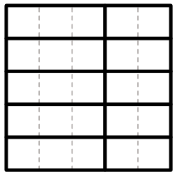

6. zīm.

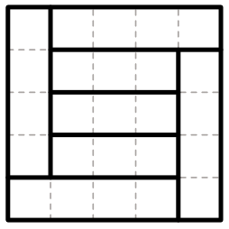

7. zīm.

# <lo-sample/> PL.OMJ.2022TEST.7_8.9

Punkts $P$ atrodas četrstūra $ABCD$ iekšpusē, turklāt trijstūri $ABP$ un $CDP$ ir vienādmalu. No tā izriet, ka

**(a)** $AB=CD$;

**(b)** $AC=BD$;

**(c)** $AD=BC$.

<small>

* answer:N,T,N
* questionType:ShortAnswer

</small>

## Atrisinājums

Ievērosim, ka

$$\angle BPC+\angle APD=360^\circ-\angle APB-\angle CPD=240^\circ,$$

tāpēc vismaz viena no leņķiem $BPC$, $APD$ lielums nav lielāks kā $120^\circ$. Pieņemsim, ka $\angle BPC\leqslant 120^\circ$; spriedums otrajā gadījumā ir analoģisks.

b) Tā kā $AP=BP$, $CP=DP$ un

$$\angle APC=\angle BPC+\angle APB=\angle BPC+60^\circ=\angle BPC+\angle CPD=\angle BPD,$$

tad trijstūri $APC$ un $BPD$ ir vienādi (pazīme mlm). Tas nozīmē, ka $AC=BD$.

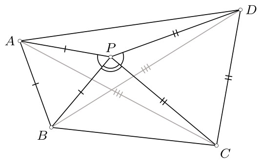

8. zīm.

a), c) Izvēloties punktus $A$, $B$, $C$, $D$, $P$ tā, ka $AP=BP\neq CP=DP$, $\angle APB=\angle CPD=60^\circ$ un $60^\circ<\angle BPC<120^\circ$ (8. zīm.), iegūstam konfigurāciju, kas apmierina uzdevuma nosacījumus un kurā $AB\neq CD$. Turklāt $\angle APD=240^\circ-\angle BPC>120^\circ$, t.i., konkrēti $\angle BPC\neq \angle APD$. Vienādība $AD=BC$ nozīmētu, ka trijstūri $BPC$ un $APD$ ir vienādi (pazīme mmm), no kurienes $\angle BPC=\angle APD$. Tas nozīmē, ka $AD\neq BC$.

# <lo-sample/> PL.OMJ.2022TEST.7_8.10

Naturālam skaitlim $m$ ir tieši $3$ pozitīvi dalītāji, bet naturālam skaitlim $n$ ir tieši $5$ pozitīvi dalītāji. No tā izriet, ka

**(a)** $m<n$;

**(b)** skaitlim $m\cdot n$ ir vismaz $8$ pozitīvi dalītāji;

**(c)** skaitlim $m\cdot n$ ir ne vairāk kā $15$ pozitīvi dalītāji.

<small>

* answer:N,N,T
* questionType:ShortAnswer

</small>

## Atrisinājums

a) Pieņemsim, ka $m=25$ un $n=16$. Tad skaitlim $m$ ir tieši $3$ pozitīvi dalītāji: $1$, $5$, $25$, skaitlim $n$ ir tieši $5$ pozitīvi dalītāji: $1$, $2$, $4$, $8$, $16$, un $m>n$.

b) Pieņemsim, ka $m=4$ un $n=16$. Tad skaitlim $m$ ir tieši $3$ pozitīvi dalītāji: $1$, $2$, $4$, bet skaitlim $n$ ir tieši $5$ pozitīvi dalītāji: $1$, $2$, $4$, $8$, $16$. Skaitlim $m\cdot n=64$ ir tieši $7$ pozitīvi dalītāji: $1$, $2$, $4$, $8$, $16$, $32$, $64$.

c) Katru skaitļa $m\cdot n$ pozitīvo dalītāju var izteikt formā $c\cdot d$, kur $c$ ir skaitļa $m$ pozitīvs dalītājs, bet $d$ ir skaitļa $n$ pozitīvs dalītājs (iespējams, vairāk nekā vienā veidā). Tas nozīmē, ka skaitlim $m\cdot n$ ir ne vairāk kā $3\cdot 5=15$ pozitīvi dalītāji.

**Piezīme.**

Var pamatot, ka, ja skaitlim $m$ ir tieši $3$ pozitīvi dalītāji, tad tas ir formā $p^2$ kādam pirmskaitlim $p$, bet, ja skaitlim $n$ ir tieši $5$ pozitīvi dalītāji, tad tas ir formā $q^4$ kādam pirmskaitlim $q$. Ja $p=q$, tad reizinājumam $m\cdot n$ ir tieši $7$ pozitīvi dalītāji. Savukārt, ja $p\neq q$, tad reizinājumam $m\cdot n$ ir tieši $15$ pozitīvi dalītāji.

# <lo-sample/> PL.OMJ.2022TEST.7_8.11

Daļu, kuras skaitītājs ir $1$, bet saucējs ir pozitīvs vesels skaitlis, sauksim par vienkāršu. Skaitli $\frac17$ var izteikt kā

**(a)** divu vienkāršu daļu reizinājumu;

**(b)** divu vienkāršu daļu starpību;

**(c)** divu vienkāršu daļu summu.

<small>

* answer:T,T,T
* questionType:ShortAnswer

</small>

## Atrisinājums

Ievērosim, ka $\frac17=\frac11\cdot \frac17=\frac16-\frac1{42}=\frac1{14}+\frac1{14}=\frac18+\frac1{56}$.

# <lo-sample/> PL.OMJ.2022TEST.7_8.12

Tieši septiņas kāda kuba šķautnes nokrāsoja sarkanā krāsā. No tā izriet, ka

**(a)** kāda kuba virsotne ir galapunkts mazāk nekā divām sarkanām šķautnēm;

**(b)** kādai kuba skaldnei ir tieši divas sarkanas malas;

**(c)** kādas trīs sarkanās šķautnes ir paralēlas.

<small>

* answer:T,N,T
* questionType:ShortAnswer

</small>

## Atrisinājums

a) Pieņemsim, ka katra virsotne ir galapunkts vismaz divām sarkanām šķautnēm. Tas nozīmē, ka sarkanajām šķautnēm kopā ir vismaz $8\cdot 2=16$ galapunkti, t.i., šo šķautņu ir vismaz $8$ (jo katrai šķautnei ir divi galapunkti). Tātad, ja sarkano šķautņu ir mazāk nekā $8$, tad kāda kuba virsotne ir galapunkts ne vairāk kā vienai sarkanai šķautnei.

c) Ievērosim, ka kubam ir trīs paralēlu šķautņu četrinieki (9. zīm.). Tāpēc, ja septiņas kuba šķautnes ir sarkanas, tad vismaz trīs sarkanās šķautnes pieder vienam un tam pašam četriniekam — t.i., ir paralēlas.

b) Ja sarkanā krāsā ir nokrāsotas 10. zīmējumā izceltās šķautnes, tad kubam ir četras skaldnes ar tieši trim sarkanām malām un divas skaldnes ar tieši vienu sarkanu malu.

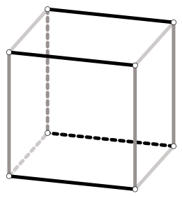

9. zīm.

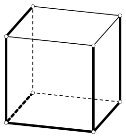

10. zīm.

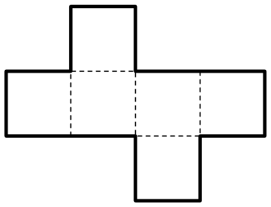

11. zīm.

**Piezīme.**

b) punkta krāsojuma piemēru var attēlot arī šādi: sarkanā krāsā krāsojam visas šķautnes, pa kurām tiek salīmēts 11. zīmējumā attēlotais kuba izklājums (izceltās), bet nenokrāsotas paliek šķautnes, pa kurām šis izklājums tiek locīts (raustītās).

# <lo-sample/> PL.OMJ.2022TEST.7_8.13

Eksistē tādi pozitīvi veseli skaitļi $a$, $b$, $c$, kuriem skaitļi $a+b$, $b+c$, $c+a$ kādā secībā ir vienādi ar

**(a)** $101$, $202$, $303$;

**(b)** $102$, $201$, $300$;

**(c)** $201$, $302$, $403$.

<small>

* answer:N,N,T
* questionType:ShortAnswer

</small>

## Atrisinājums

a) Ievērosim, ka, ja skaitļi $a$, $b$, $c$ ir pozitīvi, tad jebkuru divu no skaitļiem $a+b$, $b+c$, $c+a$ summa ir lielāka par trešo. Turpretī $101+202=303$.

b) Ievērosim, ka, ja skaitļi $a$, $b$, $c$ ir veseli, tad skaitļu $a+b$, $b+c$, $c+a$ summa, kas ir $2(a+b+c)$, ir pāra skaitlis. Turpretī $102+201+300=603$ ir nepāra skaitlis.

c) Ja $a=50$, $b=151$, $c=252$, tad $a+b=201$, $a+c=302$ un $b+c=403$.

**Piezīme.**

Zinot summu $a+b$, $b+c$, $c+a$ vērtības, skaitļus $a$, $b$, $c$ var noteikt, izmantojot vienādības

$$a=\frac{(a+b)+(c+a)-(b+c)}2,\quad b=\frac{(b+c)+(a+b)-(c+a)}2,\quad c=\frac{(c+a)+(b+c)-(a+b)}2.$$

Var arī pamatot, ka trīs skaitļi ir formā $a+b$, $b+c$, $c+a$ ar pozitīviem $a$, $b$, $c$ tieši tad, ja tie ir kāda trijstūra malu garumi.

# <lo-sample/> PL.OMJ.2022TEST.7_8.14

Badmintona turnīrā piedalījās $6$ cilvēki, katri divi cilvēki izspēlēja tieši vienu maču, un neviens mačs nebeidzās neizšķirti. No tā izriet, ka eksistē cilvēks, kurš uzvarēja

**(a)** nepāra skaitā maču;

**(b)** pāra skaitā maču;

**(c)** tieši $2$ mačos vai tieši $3$ mačos.

<small>

* answer:T,T,N
* questionType:ShortAnswer

</small>

## Atrisinājums

Par spēlētāja rezultātu sauksim šī spēlētāja uzvarēto maču skaitu. Tā kā tika izspēlēti tieši $15$ mači, tad visu sešu spēlētāju rezultātu summa ir $15$.

a) Ja katram spēlētājam būtu pāra rezultāts, tad arī visu rezultātu summa būtu pāra skaitlis, t.i., nevarētu būt vienāda ar $15$.

b) Ja katram spēlētājam būtu nepāra rezultāts, tad visu rezultātu summa būtu pāra skaitlis (kā sešu nepāra skaitļu summa), t.i., nevarētu būt vienāda ar $15$.

c) Nosauksim turnīra spēlētājus par $A$, $B$, $C$, $D$, $E$, $F$. Pieņemsim, ka $A$ uzvarēja $B$, $B$ uzvarēja $C$, $C$ uzvarēja $A$, un $D$ uzvarēja $E$, $E$ uzvarēja $F$, $F$ uzvarēja $D$, turklāt katrs no spēlētājiem $A$, $B$, $C$ uzvarēja katru no spēlētājiem $D$, $E$, $F$ (kas ilustrēts 12. zīmējumā, turklāt katra bultiņa vērsta no uzvarētāja uz zaudētāju). Pie šāda maču iznākumu sadalījuma katrs no spēlētājiem $A$, $B$, $C$ uzvarēja tieši $4$ mačos, bet katrs no spēlētājiem $D$, $E$, $F$ uzvarēja tieši $1$ mačā.

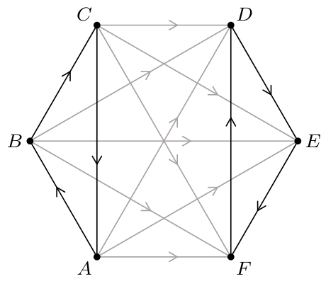

12. zīm.

# <lo-sample/> PL.OMJ.2022TEST.7_8.15

Nogriežņi $AC$ un $BD$ krustojas punktā $P$, turklāt $AP<CP$ un $BP<DP$. No tā izriet, ka

**(a)** $AB<CD$;

**(b)** trijstūra $ABP$ perimetrs ir mazāks par trijstūra $CDP$ perimetru;

**(c)** punkta $P$ attālums līdz taisnei $AB$ ir mazāks nekā punkta $P$ attālums līdz taisnei $CD$.

<small>

* answer:N,T,N
* questionType:ShortAnswer

</small>

## Atrisinājums

b) Pieņemsim, ka $A'$ ir tāds nogriežņa $CP$ punkts, ka $A'P=AP$, bet $B'$ ir tāds nogriežņa $DP$ punkts, ka $B'P=BP$. Citiem vārdiem — punkti $A'$ un $B'$ ir attiecīgi punktu $A$ un $B$ attēli centrālajā simetrijā attiecībā pret punktu $P$ (13. zīm.). Tad trijstūri $ABP$ un $A'B'P$ ir vienādi (pazīme mlm), no kā izriet, ka $AB=A'B'$ un trijstūra $ABP$ perimetrs ir vienāds ar trijstūra $A'B'P$ perimetru. Ievērosim, ka $A'B'<A'C+CD+DB'$, tāpēc

$$A'P+A'B'+B'P<A'P+A'C+CD+DB'+B'P=AC+CD+DP,$$

t.i., trijstūra $A'B'P$ perimetrs ir mazāks par trijstūra $CDP$ perimetru.

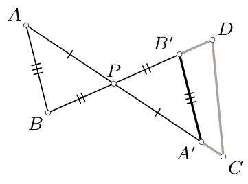

13. zīm.

a) Aplūkosim trijstūri $CDP$, kurā $CP=DP>CD$. Uz šī trijstūra malas $CP$ izvēlēsimies punktus $A'$ un $X$ tā, ka $A'X=CD$ un $A'$ atrodas uz nogriežņa $CX$, bet uz malas $DP$ — tādu punktu $B'$, ka nogrieznis $B'X$ ir paralēls $CD$ (14. zīm.). Visbeidzot definēsim punktus $A$ un $B$ kā attiecīgi punktiem $A'$ un $B'$ simetriskus punktus attiecībā pret punktu $P$. Tad trijstūrī $A'B'X$ leņķis pie virsotnes $X$ ir plats, tāpēc mala $A'B'$, kas atrodas pret šo leņķi, ir garāka par malu $A'X$. No tā $AB=A'B'>A'X=CD$.

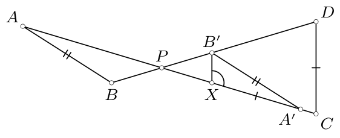

14. zīm.

c) Aplūkosim trijstūri $ABP$, kurā $AP=BP$ un $\angle APB<60^\circ$, un apzīmēsim ar $A'$, $B'$ punktus, kas attiecīgi simetriski punktiem $A$, $B$ attiecībā pret punktu $P$. Pieņemsim, ka $\omega$ ir riņķa līnija ar centru punktā $P$, kas pieskaras nogriežņiem $AB$ un $A'B'$. Aplūkosim jebkuru riņķa līnijas $\omega$ hordu, kuras pagarinājums krusto starus $PA'$, $PB'$ attiecīgi tādos punktos $C$, $D$, ka $PC>PA'$, $PD>PB'$ (15. zīm.). Tad punkta $P$ attālums līdz taisnei $CD$ ir mazāks par riņķa līnijas $\omega$ rādiusu, t.i., punkta $P$ attālumu līdz taisnei $AB$.

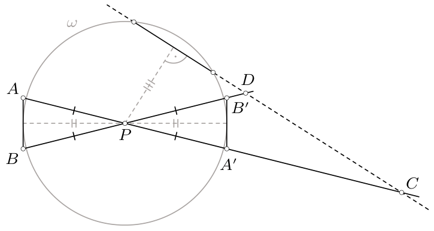

15. zīm.

**Piezīme.**

Lai pārliecinātos par atbilžu pareizību a) un c) punktā, nav jāveic precīzas konstrukcijas, bet pietiek paskatīties uz atbilstoši tendenciozi izvēlētām konfigurācijām. Pieņemsim, ka leņķis pie virsotnes $P$ ir neliels. Izvietojot punktus kā 16. zīmējumā, iegūstam $AB>CD$, bet, izvietojot kā 17. zīmējumā, — iegūstam, ka punkts $P$ ir tuvāk taisnei $CD$ nekā taisnei $AB$.

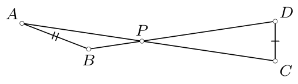

16. zīm.

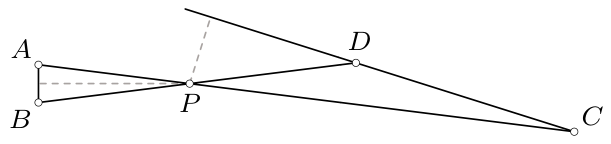

17. zīm.
