# <lo-sample/> PL.OMJ.2023TEST.7_8.1

Eksistē divi pirmskaitļi, kuru summa ir

**(a)** $17$;

**(b)** $18$;

**(c)** $19$.

<small>

* answer:N,T,T
* questionType:ShortAnswer

</small>

## Atrisinājums

a) Skaitlis $17$ ir nepāra, tāpēc katrā tā izteikumā kā divu veselu skaitļu summai viens saskaitāmais ir pāra, bet otrs — nepāra. Vienīgais pāra pirmskaitlis ir $2$, taču $17-2=15$ nav pirmskaitlis. No tā izriet, ka skaitli $17$ nevar izteikt kā divu pirmskaitļu summu.

b) $18=7+11$

c) $19=2+17$

# <lo-sample/> PL.OMJ.2023TEST.7_8.2

Kādi divi veseli skaitļi, kas lielāki par $10$, atšķiras par $10$. No tā izriet, ka šiem diviem skaitļiem

**(a)** ir vienādi vienu cipari;

**(b)** desmitu cipari atšķiras par $1$;

**(c)** ir vienādi atlikumi, dalot ar $2$.

<small>

* answer:T,N,T
* questionType:ShortAnswer

</small>

## Atrisinājums

a) Divi skaitļi, kas atšķiras par $10$, dod vienādus atlikumus, dalot ar $10$, bet pozitīva vesela skaitļa vienu cipars ir tieši atlikums, dalot šo skaitli ar $10$.

c) Divi skaitļi ar pāra starpību ir vai nu abi pāra, vai abi nepāra. Tas nozīmē, ka tie dod vienādus atlikumus, dalot ar $2$.

b) Skaitļi $90$ un $100$ atšķiras par $10$, bet to desmitu cipari atšķiras par $9$.

# <lo-sample/> PL.OMJ.2023TEST.7_8.3

Sešstūris $ABCDEF$ ir regulārs. No tā izriet, ka

**(a)** trijstūris $ABC$ ir vienādsānu;

**(b)** trijstūris $ACE$ ir vienādmalu;

**(c)** trijstūris $ACF$ ir taisnleņķa.

<small>

* answer:T,T,T
* questionType:ShortAnswer

</small>

## Atrisinājums

a) Tā kā sešstūris $ABCDEF$ ir regulārs, tad $AB=BC$.

c) Tā kā regulāra sešstūra iekšējā leņķa lielums ir $120^\circ$, tad katra no vienādsānu trijstūra $ABC$ leņķiem pie pamata $AC$ lielums ir $\frac12(180^\circ-120^\circ)=30^\circ$ (1. zīm.). No tā konkrēti izriet, ka

$$\angle FAC=\angle FAB-\angle BAC=120^\circ-30^\circ=90^\circ.$$

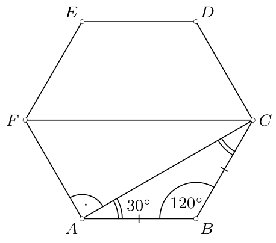

1. zīm.

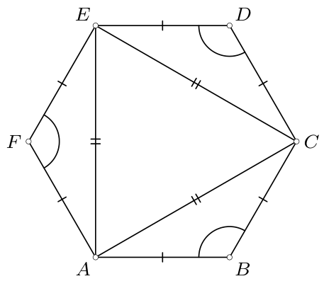

2. zīm.

b) Jebkuri divi no trijstūriem $ABC$, $CDE$, $EFA$ ir vienādi (pazīme mlm), no kurienes $AC=CE=EA$ (2. zīm.), t.i., trijstūris $ACE$ ir vienādmalu.

# <lo-sample/> PL.OMJ.2023TEST.7_8.4

Dota riņķa līnija ar rādiusu $5$. Eksistē šīs riņķa līnijas horda, kuras garums ir

**(a)** $5$;

**(b)** $10$;

**(c)** $15$.

<small>

* answer:T,T,N
* questionType:ShortAnswer

</small>

## Atrisinājums

Pieņemsim, ka $O$ ir dotās riņķa līnijas centrs, bet $A$, $B$, $C$ ir tādi šīs riņķa līnijas punkti, ka $\angle AOB=60^\circ$ un punkts $O$ atrodas uz nogriežņa $AC$ (3. zīm.).

a) Trijstūris $AOB$ ir vienādsānu, un leņķa starp tā sānu malām lielums ir $60^\circ$, tāpēc šis trijstūris ir vienādmalu. No tā $AB=OA=5$. Tātad dotās riņķa līnijas hordas $AB$ garums ir $5$.

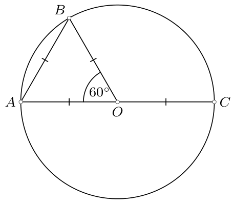

3. zīm.

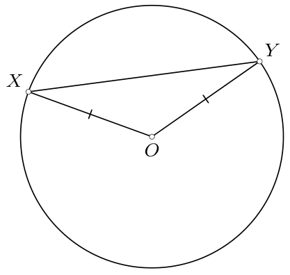

4. zīm.

b) Dotās riņķa līnijas diametra $AC$ garums ir $OA+OC=10$.

c) Aplūkosim jebkuru dotās riņķa līnijas hordu $XY$ (4. zīm.). No trijstūra nevienādības, kas piemērota punktiem $O$, $X$, $Y$, izriet, ka $XY\leq OX+OY=10$. Tātad katras dotās riņķa līnijas hordas garums nav lielāks kā $10$.

# <lo-sample/> PL.OMJ.2023TEST.7_8.5

Palielinot skaitli $50$ par $100\%$, iegūstam to pašu skaitli, ko iegūst,

**(a)** palielinot skaitli $100$ par $50\%$;

**(b)** samazinot skaitli $150$ par $50\%$;

**(c)** samazinot skaitli $200$ par $50\%$.

<small>

* answer:N,N,T
* questionType:ShortAnswer

</small>

## Atrisinājums

Palielinot skaitli $50$ par $100\%$, t.i., par skaitli $50$, iegūsim skaitli $100$.

a) $100+50\%\cdot 100=150\%\cdot 100=150$

b) $150-50\%\cdot 150=50\%\cdot 150=75$

c) $200-50\%\cdot 200=50\%\cdot 200=100$

# <lo-sample/> PL.OMJ.2023TEST.7_8.6

Eksistē šaurleņķa trijstūris, kura visu trīs malu garumi ir veseli skaitļi un perimetrs ir

**(a)** $3$;

**(b)** $4$;

**(c)** $5$.

<small>

* answer:T,N,T
* questionType:ShortAnswer

</small>

## Atrisinājums

a) Šāds trijstūris ir vienādmalu trijstūris ar malu $1$.

c) Vienādsānu trijstūrim ar pamata garumu $1$ un sānu malas garumu $2$ visu malu garumi ir veseli skaitļi un perimetrs ir $5$. Šis trijstūris ir šaurleņķa — leņķi pie pamata ir šauri, bet atlikušais leņķis ir mazāks par katru no tiem (jo sānu mala ir garāka par pamatu).

b) Skaitli $4$ var izteikt kā trīs pozitīvu veselu skaitļu summu tikai vienā veidā, proti: $4=1+1+2$. Taču neeksistē trijstūris ar malu garumiem $1$, $1$, $2$, jo skaitlis $2$ nav mazāks par abu pārējo summu.

# <lo-sample/> PL.OMJ.2023TEST.7_8.7

Spēļu kauliņam ir kuba forma, un uz katras tā skaldnes ir cits punktu skaits no $1$ līdz $6$. Jašs meta trīs šādus kauliņus, bet Malgoša — četrus. Pēc tam katrs no viņiem saskaitīja savus uzmestos punktus. No tā izriet, ka

**(a)** Malgošas iegūtais rezultāts ir lielāks nekā Jaša iegūtais rezultāts;

**(b)** starpība starp Jaša rezultātu un Malgošas rezultātu ir ne vairāk kā $6$;

**(c)** Jaša un Malgošas iegūtie rezultāti ir dažādi.

<small>

* answer:N,N,N
* questionType:ShortAnswer

</small>

## Atrisinājums

a), c) Malgoša varēja uzmest četrus vieniniekus, bet Jašs — trīs sešiniekus. Tad Malgošas rezultāts, kas ir $4$, ir mazāks nekā Jaša rezultāts, kas ir $18$. Turklāt starpība starp šiem rezultātiem ir lielāka nekā $6$.

b) Varēja gadīties, ka Malgoša uzmeta četrus trijniekus, bet Jašs — trīs četriniekus. Tad katrs no viņiem iegūtu rezultātu $3\cdot 4=12$.

# <lo-sample/> PL.OMJ.2023TEST.7_8.8

Veseli skaitļi $a$, $b$ apmierina nevienādības $a>1$ un $b>9$. No tā izriet, ka

**(a)** $a+b>11$;

**(b)** $ab>19$;

**(c)** $b-a\geq 8$.

<small>

* answer:T,T,N
* questionType:ShortAnswer

</small>

## Atrisinājums

a), b) Tā kā $a>1$ un $b>9$ un skaitļi $a$ un $b$ ir veseli, tad izpildās nevienādības $a\geq 2$ un $b\geq 10$. Tātad $a+b\geq 12>11$ un $ab\geq 20>19$.

c) Piemēram, skaitļi $a=b=10$ apmierina nevienādības $a>1$ un $b>9$, bet $b-a=0<8$.

# <lo-sample/> PL.OMJ.2023TEST.7_8.9

Uz kvadrāta ar malu $1$ malām izvēlējās trīs dažādus punktus $A$, $B$, $C$. No tā izriet, ka vismaz viena no nogriežņiem $AB$, $BC$, $CA$ garums ir

**(a)** ne lielāks kā $1$;

**(b)** ne mazāks kā $1$;

**(c)** atšķirīgs no $1$.

<small>

* answer:N,N,N
* questionType:ShortAnswer

</small>

## Atrisinājums

a) Punktus $A$, $B$, $C$ var izvēlēties tā, ka katras trijstūra $ABC$ malas garums ir lielāks nekā $1$. Piemēram, par punktu $A$ var ņemt vienu no kvadrāta virsotnēm, bet punktus $B$ un $C$ izvēlēties uz malām, kas tai nav piegulošas, tā, lai nogriežņa $BC$ garums būtu lielāks nekā $1$ (5. zīm.).

b) Punktus $A$, $B$, $C$ var izvēlēties tā, ka katra no nogriežņiem $AB$, $BC$, $CA$ garums ir mazāks nekā $1$ — piemēram, atzīmējot visus punktus uz vienas un tās pašas malas, bet ne tās galapunktos (6. zīm.), vai uz divām malām ar kopīgu galapunktu šī galapunkta tuvumā (7. zīm.).

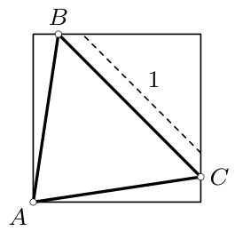

5. zīm.

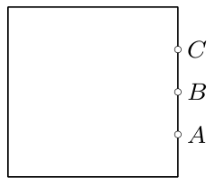

6. zīm.

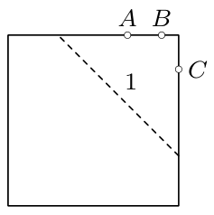

7. zīm.

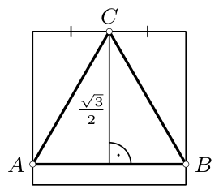

8. zīm.

c) Punktus $A$, $B$, $C$ var izvēlēties tā, ka trijstūris $ABC$ ir vienādmalu ar malu $1$ (8. zīm.). Šim nolūkam pietiek izvēlēties jebkuru kvadrāta malu, tās viduspunktu apzīmēt ar $C$, bet nogriezni $AB$ izvēlēties tā, lai tas būtu paralēls izvēlētajai kvadrāta malai un atrastos no tās attālumā $\frac12\sqrt3$ (vienādmalu trijstūra ar malu $1$ augstums).

# <lo-sample/> PL.OMJ.2023TEST.7_8.10

Eksistē tādi divi naturāli $19$-ciparu skaitļi, kuru reizinājums ir

**(a)** $37$-ciparu skaitlis;

**(b)** $38$-ciparu skaitlis;

**(c)** $39$-ciparu skaitlis.

<small>

* answer:T,T,N
* questionType:ShortAnswer

</small>

## Atrisinājums

a) Ja $a=b=10^{18}$, tad reizinājums $ab=10^{36}$ ir $37$-ciparu skaitlis.

b) Ja $a=2\cdot 10^{18}$ un $b=5\cdot 10^{18}$, tad reizinājums $ab=10^{37}$ ir $38$-ciparu skaitlis.

c) Pieņemsim, ka naturāli skaitļi $a$ un $b$ ir $19$-ciparu. Tas nozīmē, ka

$$10^{18}\leq a<10^{19}\quad \text{un}\quad 10^{18}\leq b<10^{19}.$$

Līdz ar to

$$10^{36}\leq ab<10^{38},$$

kas nozīmē, ka reizinājumam $ab$ ir vismaz $37$ cipari un ne vairāk kā $38$ cipari. Tātad tas nevar būt $39$-ciparu skaitlis.

# <lo-sample/> PL.OMJ.2023TEST.7_8.11

$3\times 3$ tabulas rūtiņās ierakstīja veselos skaitļus no $1$ līdz $9$, katru tieši vienu reizi. No tā izriet, ka trīs skaitļu summa kādā rindā ir

**(a)** pāra skaitlis;

**(b)** nepāra skaitlis;

**(c)** vismaz $15$.

<small>

* answer:N,T,T
* questionType:ShortAnswer

</small>

## Atrisinājums

Ievērosim, ka visu tabulas rūtiņās ierakstīto skaitļu summa ir $45$.

a) Ja skaitļi tiks ierakstīti, piemēram, 9. zīmējumā parādītajā veidā, tad katrā rindā (kā arī katrā kolonnā) ierakstīto skaitļu summa būs nepāra (vienāda ar $15$).

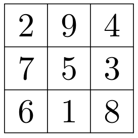

9. zīm.

b) Pieņemsim, ka katrā no trim rindām ierakstīto skaitļu summas ir pāra skaitļi. Tad šo trīs summu summa ir pāra skaitlis. No otras puses, tā ir visu tabulā esošo skaitļu summa, t.i., $45$ — nepāra skaitlis. Iegūtā pretruna nozīmē, ka nav iespējams, lai trīs skaitļu summa katrā rindā būtu pāra.

c) Pieņemsim, ka katrā rindā ierakstīto skaitļu summa ir mazāka nekā $15$. Tad šo trīs summu summa ir skaitlis, kas mazāks nekā $45$. No otras puses, tā ir visu tabulā esošo skaitļu summa, t.i., tieši $45$. Iegūtā pretruna nozīmē, ka kādā rindā trīs ierakstīto skaitļu summa nav mazāka kā $15$.

# <lo-sample/> PL.OMJ.2023TEST.7_8.12

Skaitlis $7^{19}+7^{20}+7^{21}$ dalās ar

**(a)** $19$;

**(b)** $20$;

**(c)** $21$.

<small>

* answer:T,N,T
* questionType:ShortAnswer

</small>

## Atrisinājums

Ievērosim, ka

$$7^{19}+7^{20}+7^{21}=7^{19}\cdot 1+7^{19}\cdot 7+7^{19}\cdot 49=7^{19}\cdot (1+7+49)=7^{19}\cdot 57=7^{19}\cdot 3\cdot 19.$$

Šis skaitlis dalās ar $19$ un ar $3\cdot 7=21$, bet nedalās ar $20$ (tas pat nav pāra).

# <lo-sample/> PL.OMJ.2023TEST.7_8.13

Ar $\operatorname{LKD}(x,y)$ apzīmējam skaitļu $x$ un $y$ lielāko kopīgo dalītāju. Eksistē pozitīvi veseli skaitļi $a$, $b$, $c$ ar īpašību, ka $\operatorname{LKD}(a,b)=2$, $\operatorname{LKD}(b,c)=4$ un

**(a)** $\operatorname{LKD}(a,c)=3$;

**(b)** $\operatorname{LKD}(a,c)=6$;

**(c)** $\operatorname{LKD}(a,c)=12$.

<small>

* answer:N,T,N
* questionType:ShortAnswer

</small>

## Atrisinājums

a) Ja $\operatorname{LKD}(a,b)=2$, tad skaitlis $a$ ir pāra. Ja turklāt $\operatorname{LKD}(b,c)=4$, tad arī skaitlis $c$ ir pāra. Secinām, ka skaitļu $a$ un $c$ lielākais kopīgais dalītājs ir pāra skaitlis, tātad atšķirīgs no $3$.

c) Ja $\operatorname{LKD}(b,c)=4$, tad skaitlis $b$ dalās ar $4$. Ja turklāt izpildītos vienādība $\operatorname{LKD}(a,c)=12$, tad arī skaitlis $a$ dalītos ar $4$. Secinām, ka skaitļu $a$ un $b$ lielākais kopīgais dalītājs dalās ar $4$ — taču tas ir vienāds ar $2$. Iegūtā pretruna nozīmē, ka $\operatorname{LKD}(a,c)\neq 12$.

b) Ja $a=6$, $b=4$, $c=12$, tad $\operatorname{LKD}(a,b)=2$, $\operatorname{LKD}(b,c)=4$ un $\operatorname{LKD}(a,c)=6$.

# <lo-sample/> PL.OMJ.2023TEST.7_8.14

Izliektā četrstūrī $ABCD$ izpildās vienādības $AB=AC=2$, $CB=CD=1$. No tā izriet, ka

**(a)** $BD\leq 2$;

**(b)** $\angle BAD\leq 60^\circ$;

**(c)** četrstūra $ABCD$ laukums nav lielāks par vienādmalu trijstūra ar malu $2$ laukumu.

<small>

* answer:T,T,N
* questionType:ShortAnswer

</small>

## Atrisinājums

a) No trijstūra nevienādības, kas piemērota trijstūrim $BCD$, izriet, ka

$$BD\leq CB+CD=1+1=2.$$

b) Aplūkosim riņķa līniju ar centru punktā $C$ un rādiusu $1$. No punkta $A$ novilksim šai riņķa līnijai pieskaru nogriežņus $AX$ un $AY$. Tā kā $AC=2$, tad katrs no taisnleņķa trijstūriem $ACX$, $ACY$ ir puse no vienādmalu trijstūra, tātad $\angle XAY=60^\circ$. Atliek ievērot, ka leņķis $BAD$ atrodas leņķa $XAY$ iekšpusē.

c) Pieņemsim, ka $AD=2$, t.i., četrstūris $ABCD$ sastāv no diviem vienādsānu trijstūriem ar malām $1$, $2$, $2$. Saskaņā ar Pitagora teorēmu šāda trijstūra augstuma, kas novilkts pret pamatu, garums ir $\sqrt{2^2-\left(\frac12\right)^2}=\frac12\sqrt{15}$. Tādā gadījumā četrstūra $ABCD$ laukums ir

$$2\cdot \frac12\cdot 1\cdot \frac12\sqrt{15}=\frac12\sqrt{15}.$$

Savukārt vienādmalu trijstūra ar malu $2$ laukums ir $\frac14\cdot 2^2\cdot \sqrt3=\sqrt3=\frac12\sqrt{12}<\frac12\sqrt{15}$.

# <lo-sample/> PL.OMJ.2023TEST.7_8.15

Septiņu cilvēku grupā katram ir vismaz $3$ paziņas starp pārējiem cilvēkiem (pieņemam, ka, ja $A$ ir $B$ paziņa, tad arī $B$ ir $A$ paziņa). No tā izriet, ka šajā grupā

**(a)** kādam cilvēkam ir vismaz $4$ paziņas starp pārējiem cilvēkiem;

**(b)** kādiem diviem cilvēkiem ir vismaz $3$ kopīgi paziņas;

**(c)** kādi trīs cilvēki savstarpēji pazīstas.

<small>

* answer:T,N,N
* questionType:ShortAnswer

</small>

## Atrisinājums

a) Pieņemsim, ka katram cilvēkam ir tieši $3$ paziņas starp pārējiem. Ja pajautāsim katram cilvēkam, cik viņam ir paziņu, un saskaitīsim atbildēs iegūtos skaitļus, tad iegūsim $3\cdot 7=21$. Taču tas nozīmētu, ka pazīšanās gadījumu skaits visā septiņu cilvēku grupā ir $\frac12\cdot 21=10{,}5$ (jo par katru pazīšanos mums pastāstīja divi cilvēki), un tas nav vesels skaitlis. Tas nozīmē, ka kādam cilvēkam ir vismaz $4$ paziņas.

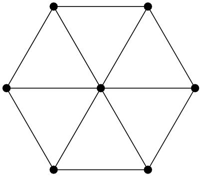

10. zīm.

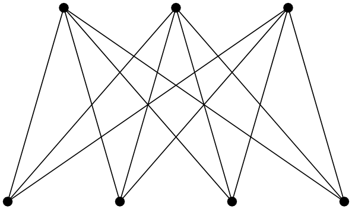

11. zīm.

b) Ja pazīšanās shēma izskatās tā, kā ilustrēts 10. zīmējumā (punkti atbilst cilvēkiem, bet nogriežņi starp tiem — pazīšanās gadījumiem), tad nekādiem diviem cilvēkiem nav trīs kopīgu paziņu, lai gan katram to ir vismaz $3$.

c) Ja pazīšanās shēma izskatās tā, kā ilustrēts 11. zīmējumā, tad nav tādu trīs cilvēku, kas visi savstarpēji pazītos, lai gan katram ir vismaz $3$ paziņas.
