# <lo-sample/> PL.OMJ.2024TEST.7_8.1

Kāda produkta sākotnējo cenu pazemināja par $50\%$, bet pēc tam jauno cenu pazemināja par $50\%$. Šo divu cenas pazeminājumu rezultātā sākotnējā cena samazinājās

**(a)** par $50\%$;

**(b)** par $75\%$;

**(c)** par $100\%$.

<small>

* answer:N,T,N
* questionType:ShortAnswer

</small>

## Atrisinājums

Pieņemsim, ka sākotnējā cena bija $c$. Tātad cena pēc pirmā pazeminājuma bija $\frac{1}{2}c$, bet cena pēc otrā pazeminājuma bija $\frac{1}{2}\cdot\frac{1}{2}c=\frac{1}{4}c=c-\frac{3}{4}c=c-75\%c$. Tātad abu pazeminājumu rezultātā sākotnējā cena samazinājās par $75\%$.

# <lo-sample/> PL.OMJ.2024TEST.7_8.2

Skaitlis $20^1\cdot20^2\cdot20^3$ ir vienāds ar

**(a)** $20^{1+2+3}$;

**(b)** $20^{1\cdot2\cdot3}$;

**(c)** $\left(\left(20^1\right)^2\right)^3$.

<small>

* answer:T,T,T
* questionType:ShortAnswer

</small>

## Atrisinājums

a), b) Dotais skaitlis ir $1+2+3=6$ reizinātāju, kas vienādi ar $20$, reizinājums, tāpēc tas ir vienāds ar $20^6$.

c) Jebkuriem pozitīviem veseliem skaitļiem $a$, $b$, $c$ ir $\left(a^b\right)^c=a^{b\cdot c}$, no kurienes
$$
\left(\left(20^1\right)^2\right)^3=\left(20^{1\cdot2}\right)^3=20^{1\cdot2\cdot3}=20^6.
$$

# <lo-sample/> PL.OMJ.2024TEST.7_8.3

Katrs kāda $9$-ciparu skaitļa $n$ cipars ir $2$ vai $5$. No tā izriet, ka skaitlis $n$ dalās ar

**(a)** $2$;

**(b)** $3$;

**(c)** $5$.

<small>

* answer:N,T,N
* questionType:ShortAnswer

</small>

## Atrisinājums

a) Ja skaitļa $n$ vienu cipars ir $5$, tad $n$ nav pāra skaitlis.

c) Ja skaitļa $n$ vienu cipars ir $2$, tad $n$ nav skaitlis, kas dalās ar $5$.

b) Katrs no skaitļiem $2=3-1$, $5=6-1$ ir par $1$ mazāks nekā kāds skaitlis, kas dalās ar $3$. Tātad deviņu skaitļu, no kuriem katrs ir $2$ vai $5$, summa ir par $9$ mazāka nekā deviņu skaitļu, kas dalās ar $3$, summa. Tas nozīmē, ka skaitļa $n$ ciparu summa dalās ar $3$, un līdz ar to arī skaitlis $n$ dalās ar $3$.

# <lo-sample/> PL.OMJ.2024TEST.7_8.4

Skaitlis $\sqrt{2}+\sqrt{3}$ ir

**(a)** mazāks nekā $\sqrt{5}$;

**(b)** vienāds ar $\sqrt{5}$;

**(c)** lielāks nekā $\sqrt{5}$.

<small>

* answer:N,N,T
* questionType:ShortAnswer

</small>

## Atrisinājums

Tā kā $\sqrt{3}>\sqrt{2}$ un $\sqrt{8}>\sqrt{5}$, tad $\sqrt{2}+\sqrt{3}>\sqrt{2}+\sqrt{2}=2\sqrt{2}=\sqrt{8}>\sqrt{5}$.

# <lo-sample/> PL.OMJ.2024TEST.7_8.5

Eksistē piecstūris, ko pa diagonāli var sagriezt divos daudzstūros, kuri

**(a)** ir ar vienādiem laukumiem;

**(b)** ir ar vienādiem perimetriem;

**(c)** ir regulāri.

<small>

* answer:T,T,T
* questionType:ShortAnswer

</small>

## Atrisinājums

Pieņemsim, ka $ABCD$ ir kvadrāts ar malu $1$.

a) Kvadrāta $ABCD$ ārpusē konstruēsim vienādsānu trijstūri $ADE$, kurā $AE=DE$ un no virsotnes $E$ novilktā augstuma garums ir $2$ (1. zīm.). Tad piecstūri $ABCDE$ pa diagonāli $AD$ var sagriezt divos daudzstūros ar laukumu $1$.

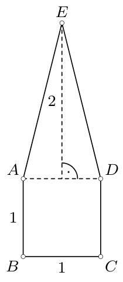

1. zīm.

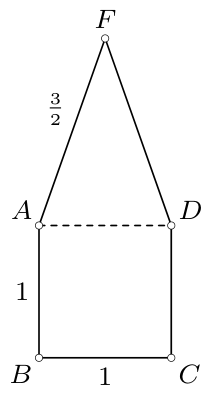

2. zīm.

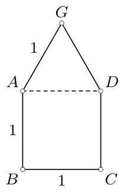

3. zīm.

b) Kvadrāta $ABCD$ ārpusē konstruēsim vienādsānu trijstūri $ADF$, kurā $AF=DF=\frac{3}{2}$ (2. zīm.). Tad piecstūri $ABCDF$ pa diagonāli $AD$ var sagriezt divos daudzstūros ar perimetru $4$.

c) Kvadrāta $ABCD$ ārpusē konstruēsim vienādmalu trijstūri $ADG$ (3. zīm.). Tad piecstūri $ABCDG$ pa diagonāli $AD$ var sagriezt divos regulāros daudzstūros.

# <lo-sample/> PL.OMJ.2024TEST.7_8.6

Eksistē četri pēc kārtas sekojoši veseli skaitļi, kuru summa dalās ar

**(a)** $18$;

**(b)** $19$;

**(c)** $20$.

<small>

* answer:T,T,N
* questionType:ShortAnswer

</small>

## Atrisinājums

a) Skaitlis $3+4+5+6=18$ dalās ar $18$.

b) Skaitlis $8+9+10+11=38$ dalās ar $19$.

c) Četru pēc kārtas sekojošu veselu skaitļu, no kuriem mazākais ir $n$, summa ir
$$
n+(n+1)+(n+2)+(n+3)=4n+6=2(2n+3).
$$
Jebkuram veselam skaitlim $n$ skaitlis $2n+3$ ir nepāra, tāpēc skaitlis $2(2n+3)$ nedalās ar $4$. Tātad tas nedalās arī ar $4\cdot5=20$.

# <lo-sample/> PL.OMJ.2024TEST.7_8.7

Eksistē reāli skaitļi $a$, $b$, $c$, kas apmierina nosacījumu $a<b<c$ un kuru vidējais aritmētiskais ir

**(a)** mazāks nekā skaitļu $a$ un $b$ vidējais aritmētiskais;

**(b)** mazāks nekā skaitļu $b$ un $c$ vidējais aritmētiskais;

**(c)** mazāks nekā skaitļu $a$ un $c$ vidējais aritmētiskais.

<small>

* answer:N,T,T
* questionType:ShortAnswer

</small>

## Atrisinājums

a) Tā kā $c>a$ un $c>b$, tad $2c>a+b$, t.i., $c>\frac{a+b}{2}$. Tātad
$$
\frac{a+b+c}{3}>\frac{a+b+\frac{a+b}{2}}{3}=\frac{\frac{3(a+b)}{2}}{3}=\frac{a+b}{2}.
$$

b), c) Ja $a=1$, $b=2$, $c=6$, tad skaitļu $a$, $b$, $c$ vidējais aritmētiskais ir $\frac{a+b+c}{3}=3$, tātad tas ir mazāks par katru no skaitļiem $\frac{a+c}{2}=3{,}5$ un $\frac{b+c}{2}=4$.

# <lo-sample/> PL.OMJ.2024TEST.7_8.8

Katru pozitīvu nepāra skaitli var izteikt kā

**(a)** divu pirmskaitļu starpību;

**(b)** divu saliktu skaitļu starpību;

**(c)** divu veselu skaitļu kvadrātu starpību.

<small>

* answer:N,T,T
* questionType:ShortAnswer

</small>

## Atrisinājums

a) Pierādīsim, ka skaitli $7$ nevar uzrakstīt kā divu pirmskaitļu starpību. Pieņemsim, ka $p-q=7$ kādiem pirmskaitļiem $p$, $q$. Tad viens no skaitļiem $p$, $q$ ir pāra, bet otrs — nepāra. Vienīgais pāra pirmskaitlis ir $2$, un, tā kā $p>7$, no tā izriet, ka $q=2$. Taču tad iegūstam $p=9$, un tas ir salikts skaitlis. Iegūtā pretruna nozīmē, ka skaitli $7$ nav iespējams izteikt kā divu pirmskaitļu starpību.

b) Ievērosim, ka $1=9-8$ ir meklētais skaitļa $1$ izteikums. Ja $n\geqslant3$ ir nepāra skaitlis, tad $n=3n-2n$. Katrs no skaitļiem $3n$ un $2n$ ir salikts, jo ir divu veselu skaitļu, kas lielāki par $1$, reizinājums.

c) Katru pozitīvu nepāra skaitli var uzrakstīt formā $2k-1$, kur $k\geqslant1$ ir vesels skaitlis. Tad $2k-1=k^2-(k-1)^2$ ir skaitļa $2k-1$ izteikums kā divu veselu skaitļu kvadrātu starpība.

# <lo-sample/> PL.OMJ.2024TEST.7_8.9

Reālie skaitļi $x$ un $y$ apmierina nosacījumu $x-y\geqslant x^2$. No tā izriet, ka

**(a)** $x\geqslant0$;

**(b)** $y\leqslant0$;

**(c)** $x\geqslant y$.

<small>

* answer:N,N,T
* questionType:ShortAnswer

</small>

## Atrisinājums

a) Ja $x=-1$ un $y=-2$, tad dotais nosacījums ir izpildīts un $x<0$.

b) Ja $x=\frac{1}{2}$ un $y=\frac{1}{4}$, tad dotais nosacījums ir izpildīts un $y>0$.

c) Tā kā $x^2\geqslant0$ jebkuram reālam skaitlim $x$, tad no dotā nosacījuma iegūstam, ka $x-y\geqslant0$, t.i., $x\geqslant y$.

# <lo-sample/> PL.OMJ.2024TEST.7_8.10

Eksistē taisnleņķa trijstūris, kurā visu malu garumi ir veseli skaitļi un turklāt

**(a)** tieši vienas malas garums ir pāra skaitlis;

**(b)** tieši divu malu garumi ir pāra skaitļi;

**(c)** visu trīs malu garumi ir pāra skaitļi.

<small>

* answer:T,N,T
* questionType:ShortAnswer

</small>

## Atrisinājums

a) Trijstūris ar malu garumiem $3$, $4$, $5$ ir taisnleņķa, un tam ir tieši viena mala ar pāra garumu.

c) Trijstūris ar malu garumiem $6$, $8$, $10$ ir taisnleņķa, un visām trim tā malām ir pāra garums.

b) Pieņemsim, ka kāda taisnleņķa trijstūra katešu garumi ir $a$, $b$, bet hipotenūzas garums ir $c$, turklāt skaitļi $a$, $b$, $c$ ir veseli. Saskaņā ar Pitagora teorēmu izpildās vienādība $a^2+b^2=c^2$. Tas nozīmē, ka skaitlis $a^2+b^2+c^2=2c^2$ ir pāra, tāpēc starp saskaitāmajiem $a^2$, $b^2$, $c^2$ ir pāra skaits nepāra skaitļu. Līdz ar to starp skaitļiem $a$, $b$, $c$ ir pāra skaits nepāra skaitļu. Tātad nav iespējams, ka tieši divi no šiem skaitļiem ir pāra.

# <lo-sample/> PL.OMJ.2024TEST.7_8.11

Punkts $P$ atrodas taisnleņķa trijstūra $ABC$ iekšpusē, turklāt $\angle ACB=90^\circ$ un $AC>BC$. No tā izriet, ka

**(a)** $\angle APB>90^\circ$;

**(b)** $\angle APC>90^\circ$;

**(c)** $\angle APC>\angle BPC$.

<small>

* answer:T,N,N
* questionType:ShortAnswer

</small>

## Atrisinājums

a) Ievērosim, ka $\angle PAB<\angle CAB$ un $\angle PBA<\angle CBA$ (4. zīm.). Tātad
$$
\angle PAB+\angle PBA<\angle CAB+\angle CBA=180^\circ-\angle ACB=90^\circ.
$$
Līdz ar to
$$
\angle APB=180^\circ-(\angle PAB+\angle PBA)>180^\circ-90^\circ=90^\circ.
$$

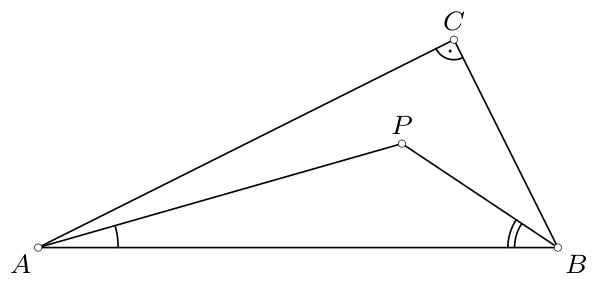

4. zīm.

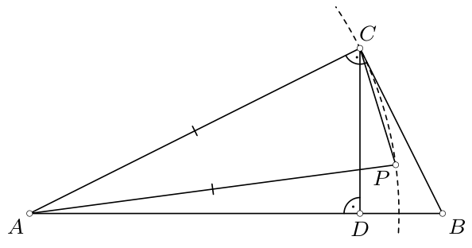

5. zīm.

b), c) Aplūkosim jebkuru taisnleņķa trijstūri $ABC$, kas apmierina uzdevuma nosacījumus. Izvēlēsimies punktu $P$ trijstūra iekšpusē tā, lai tas atrastos uz riņķa līnijas ar centru $A$ un rādiusu $AC$, t.i., $AP=AC$ (5. zīm.). Tad $\angle APC<90^\circ$, jo tas ir leņķis starp pamatu un sānu malu vienādsānu trijstūrī $ACP$.

Pieņemsim, ka $D$ ir trijstūra $ABC$ no virsotnes $C$ novilktā augstuma pamats. Tad punkts $P$ atrodas taisnleņķa trijstūra $BCD$ iekšpusē. Piemērojot šim trijstūrim jau pierādīto a) punktu, iegūstam $\angle BPC>90^\circ$. Kopā ar nevienādību $\angle APC<90^\circ$ tas nozīmē, ka $\angle BPC>\angle APC$.

# <lo-sample/> PL.OMJ.2024TEST.7_8.12

Tabula ar izmēriem $4\times4$ sastāv no kvadrātveida rūtiņām ar malu $1$. Tieši astoņas šīs tabulas rūtiņas ir melnā krāsā. No tā izriet, ka kādu divu no šīm astoņām rūtiņām centri atrodas attālumā

**(a)** $1$;

**(b)** $\sqrt{2}$;

**(c)** $2$.

<small>

* answer:N,N,N
* questionType:ShortAnswer

</small>

## Atrisinājums

a) Ja tabula ir nokrāsota tā, kā 6. zīmējumā („šaha galdiņa” veidā), tad nekādām divām melnajām rūtiņām nav kopīgas malas. Tātad nekādu divu melno rūtiņu centri neatrodas attālumā $1$.

b) Ja tabula ir nokrāsota tā, kā 7. zīmējumā („strīpās”), tad nekādas divas melnās rūtiņas nesaskaras tikai ar stūri. Tātad nekādu divu melno rūtiņu centri neatrodas attālumā $\sqrt{2}$.

c) Rūtiņas, kuru centri atrodas attālumā $2$, ir rūtiņas vienā rindā vai kolonnā, starp kurām atrodas tieši viena cita rūtiņa. Ja tabula ir nokrāsota tā, kā 8. zīmējumā, tad nekādu divu melno rūtiņu centri neatrodas attālumā $2$.

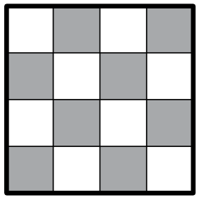

6. zīm.

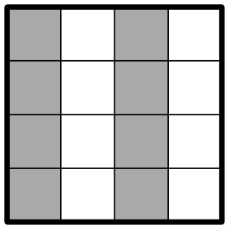

7. zīm.

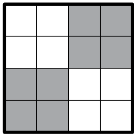

8. zīm.

# <lo-sample/> PL.OMJ.2024TEST.7_8.13

No jebkuriem pieciem pozitīviem veseliem skaitļiem var izvēlēties

**(a)** tādus divus, kuru summa dalās ar $2$;

**(b)** tādus trīs, kuru summa dalās ar $3$;

**(c)** tādus četrus, kuru summa dalās ar $4$.

<small>

* answer:T,T,N
* questionType:ShortAnswer

</small>

## Atrisinājums

a) Starp jebkuriem pieciem (un pat starp jebkuriem trim) veseliem skaitļiem ir vai nu vismaz divi pāra skaitļi, vai vismaz divi nepāra skaitļi. Gan divu pāra skaitļu summa, gan divu nepāra skaitļu summa ir skaitlis, kas dalās ar $2$.

b) Aplūkosim jebkurus piecus veselus skaitļus un aprēķināsim šo skaitļu atlikumus, dalot ar $3$. Ir divi iespējamie gadījumi:

* Kāds atlikums $r$ parādās vismaz trīs reizes.

  Izvēlēsimies jebkurus trīs skaitļus, kas, dalot ar $3$, dod šo atlikumu, t.i., skaitļus formā $3a+r$, $3b+r$, $3c+r$ kādiem veseliem skaitļiem $a$, $b$, $c$. Izvēlēto skaitļu summa ir
  $$
  (3a+r)+(3b+r)+(3c+r)=3(a+b+c+r),
  $$
  tātad tas ir skaitlis, kas dalās ar $3$.

* Katrs no atlikumiem $0$, $1$, $2$ parādās ne vairāk kā divas reizes.

  Tā kā skaitļu ir pieci, tad katrs no šiem atlikumiem parādās vismaz vienu reizi. Izvēlēsimies pa vienam skaitlim katram no šiem atlikumiem, t.i., skaitļus formā $3a$, $3b+1$, $3c+2$ kādiem veseliem skaitļiem $a$, $b$, $c$. Šo trīs skaitļu summa ir
  $$
  3a+(3b+1)+(3c+2)=3(a+b+c+1),
  $$
  tātad tā dalās ar $3$.

c) Aplūkosim skaitļus $1$, $2$, $4$, $8$, $12$. Neviena no četru šo piecu skaitļu summām:
$$
1+2+4+8=15,\quad 1+2+4+12=19,\quad 1+2+8+12=23,\quad 1+4+8+12=25,\quad 2+4+8+12=26
$$
nav skaitlis, kas dalās ar $4$.

# <lo-sample/> PL.OMJ.2024TEST.7_8.14

Katrs pozitīvs vesels skaitlis ir nokrāsots vai nu sarkanā, vai zilā krāsā. No tā izriet, ka

**(a)** kāds skaitlis, kas lielāks par $1$, ir tādā pašā krāsā kā visi tā pozitīvie dalītāji;

**(b)** kāds skaitlis ir tādā pašā krāsā kā tā divkāršotā vērtība;

**(c)** kādi divi skaitļi, kas atšķiras par $20$, ir vienā krāsā.

<small>

* answer:N,N,N
* questionType:ShortAnswer

</small>

## Atrisinājums

a) Ja skaitlis $1$ ir sarkans, bet visi pārējie skaitļi ir zili, tad katram skaitlim, kas lielāks par $1$, ir pozitīvs dalītājs citā krāsā nekā tā paša krāsa (proti, dalītājs $1$).

b) Aplūkosim krāsojumu, kurā visi skaitļi, kuru sadalījumā pirmreizinātājos ir pāra skaits divnieku, ir sarkani, bet visi skaitļi, kuru sadalījumā pirmreizinātājos ir nepāra skaits divnieku, ir zili. Tad katrs skaitlis ir citā krāsā nekā tā divkāršotā vērtība.

c) Aplūkosim krāsojumu, kurā sarkani ir skaitļi, kas, dalot ar $40$, dod vienu no atlikumiem $0$, $1$, $2$, $\ldots$, $19$, bet zili ir skaitļi, kas, dalot ar $40$, dod vienu no atlikumiem $20$, $21$, $22$, $\ldots$, $39$. Tad jebkuri divi skaitļi, kas atšķiras par $20$, ir dažādās krāsās.

# <lo-sample/> PL.OMJ.2024TEST.7_8.15

Punkti $D$ un $E$ atrodas attiecīgi uz trijstūra $ABC$ malām $BC$ un $AC$, turklāt $\angle ADC=\angle BEC$. Nogriežņi $AD$ un $BE$ krustojas punktā $P$. No tā izriet, ka

**(a)** $\angle CAD=\angle CBE$;

**(b)** $\angle ACP=\angle BCP$;

**(c)** $\angle DEP=\angle BAP$.

<small>

* answer:T,N,T
* questionType:ShortAnswer

</small>

## Atrisinājums

a) Izmantojot trijstūru $ACD$ un $BCE$ iekšējo leņķu lielumu summas īpašību (9. zīm.), iegūstam
$$
\angle CAD=180^\circ-\angle ACB-\angle ADC=180^\circ-\angle ACB-\angle BEC=\angle CBE.
$$

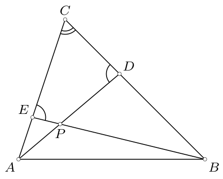

9. zīm.

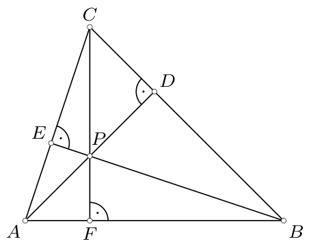

10. zīm.

b) Aplūkosim jebkuru šaurleņķa trijstūri $ABC$, kurā $\angle BAC\neq\angle ABC$. Apzīmēsim ar $D$ un $E$ attiecīgi no virsotnēm $A$ un $B$ novilkto augstumu pamatus (10. zīm.). Tad $\angle ADC=90^\circ=\angle BEC$.

Punkts $P$ ir divu trijstūra $ABC$ augstumu krustpunkts, tāpēc tas atrodas arī uz trešā augstuma. Tas nozīmē, ka, ja ar $F$ apzīmēsim taisnes $CP$ un malas $AB$ krustpunktu, tad $\angle AFC=\angle BFC=90^\circ$. Līdz ar to
$$
\angle ACP=\angle ACF=90^\circ-\angle BAC\neq90^\circ-\angle ABC=\angle BCF=\angle BCP.
$$

c) No a) punktā pierādītās vienādības $\angle DAE=\angle DBE$ un tā, ka punkti $A$ un $B$ atrodas vienā taisnes $DE$ pusē, izriet, ka ap četrstūri $ABDE$ var apvilkt riņķa līniju (11. zīm.). Līdz ar to $\angle DEP=\angle DEB=\angle DAB=\angle BAP$.

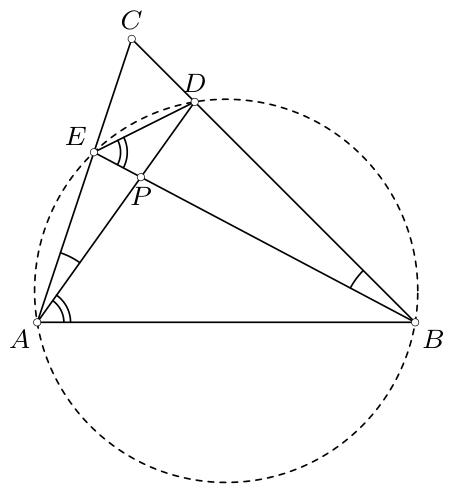

11. zīm.
