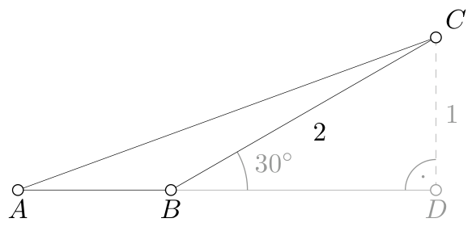
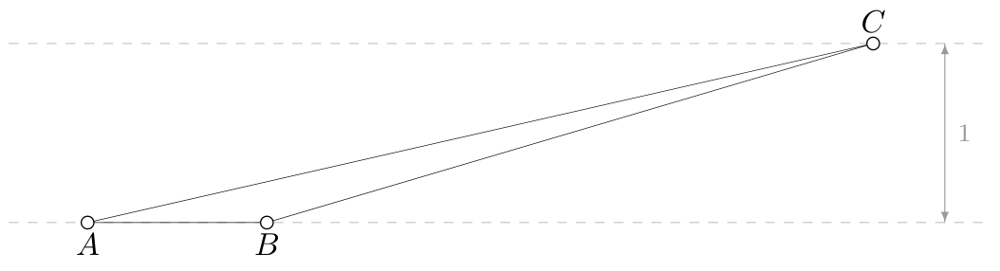
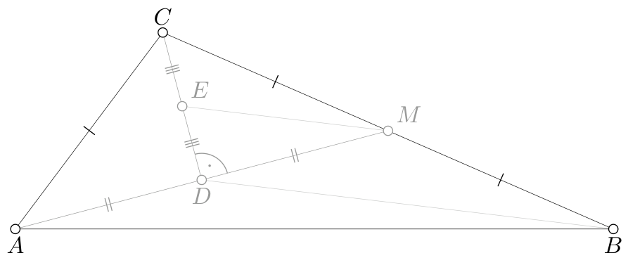
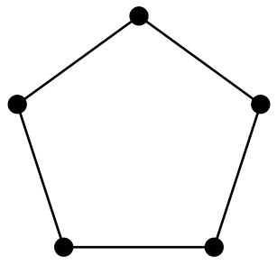
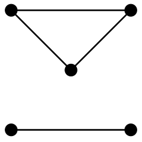

# <lo-sample/> PL.OMJ.2025TEST.7_8.1

Kostka do gry jest sześcianem i na każdej ścianie ma inną liczbę oczek, od 1 do 6. Czarek rzucił trzema takimi kostkami i wypadło łącznie 16 oczek. Wynika z tego, że na pewnej kostce

**(a)** wypadły 4 oczka;

**(b)** wypadło 5 oczek;

**(c)** wypadło 6 oczek.

<small>

* answer:N,N,T
* questionType:ShortAnswer

</small>

## Rozwiązanie

a) Jeśli liczby oczek są równe 5, 5, 6, to wypadło łącznie 16 oczek, ale na żadnej kostce nie wypadły 4 oczka.

b) Jeśli liczby oczek są równe 4, 6, 6, to wypadło łącznie 16 oczek, ale na żadnej kostce nie wypadło 5 oczek.

c) Gdyby na każdej kostce wypadło co najwyżej 5 oczek, to łączna liczba oczek byłaby nie większa od $5+5+5=15$.

# <lo-sample/> PL.OMJ.2025TEST.7_8.2

Pewien kąt wewnętrzny trójkąta równoramiennego ma miarę $45^\circ$. Wynika z tego, że trójkąt ten

**(a)** jest ostrokątny;

**(b)** jest prostokątny;

**(c)** nie jest rozwartokątny.

<small>

* answer:N,N,T
* questionType:ShortAnswer

</small>

## Rozwiązanie

a) Trójkąt o kątach $90^\circ$, $45^\circ$, $45^\circ$ spełnia warunki zadania, ale nie jest ostrokątny.

b) Trójkąt o kątach $45^\circ$, $67{,}5^\circ$, $67{,}5^\circ$ spełnia warunki zadania, ale nie jest prostokątny.

c) Jeżeli $45^\circ$ jest kątem między podstawą a ramieniem w trójkącie równoramiennym, to pozostałe kąty mają miary $45^\circ$ oraz $180^\circ-45^\circ-45^\circ=90^\circ$, więc trójkąt jest prostokątny.

Jeżeli $45^\circ$ jest kątem pomiędzy ramionami w trójkącie równoramiennym, to każdy z dwóch pozostałych kątów ma miarę $\frac12(180^\circ-45^\circ)=67{,}5^\circ$, więc trójkąt jest ostrokątny.

# <lo-sample/> PL.OMJ.2025TEST.7_8.3

Liczby $a$ oraz $b$ są dodatnie, przy czym liczba $a$ jest całkowita, a liczba $b$ nie jest całkowita. Wynika z tego, że

**(a)** liczba $a+b$ nie jest całkowita;

**(b)** liczba $a\cdot b$ nie jest całkowita;

**(c)** liczba $a^2+b^2$ nie jest całkowita.

<small>

* answer:T,N,N
* questionType:ShortAnswer

</small>

## Rozwiązanie

a) Gdyby liczba $a+b$ była całkowita, to również liczba $b=(a+b)-a$ byłaby całkowita, jako różnica liczb całkowitych.

b) Jeżeli $a=2$ oraz $b=\frac12$, to liczba $a\cdot b=2\cdot\frac12=1$ jest całkowita.

c) Jeżeli $a=1$ oraz $b=\sqrt2$, to liczba $a^2+b^2=1^2+(\sqrt2)^2=3$ jest całkowita.

# <lo-sample/> PL.OMJ.2025TEST.7_8.4

Istnieje taki dodatni dzielnik liczby 2025, który jest

**(a)** różnicą dwóch liczb nieparzystych;

**(b)** iloczynem trzech liczb złożonych;

**(c)** sumą czterech liczb pierwszych.

<small>

* answer:N,T,T
* questionType:ShortAnswer

</small>

## Rozwiązanie

a) Różnica dwóch liczb nieparzystych jest liczbą parzystą. Liczba 2025 jest nieparzysta, więc nie ma ona parzystych dzielników.

b) Zauważmy, że $2025=9\cdot9\cdot25$ i każdy z tych trzech czynników jest liczbą złożoną.

c) Zauważmy, że liczba $15=2+3+5+5$ jest sumą czterech liczb pierwszych oraz dzielnikiem liczby $2025=15\cdot135$.

# <lo-sample/> PL.OMJ.2025TEST.7_8.5

W trójkącie $ABC$ bok $AB$ ma długość 1. Wysokość opuszczona z wierzchołka $C$ na prostą $AB$ również ma długość 1. Wynika z tego, że

**(a)** pole trójkąta $ABC$ jest równe 1;

**(b)** obwód trójkąta $ABC$ jest większy od 3;

**(c)** obwód trójkąta $ABC$ jest mniejszy od 4.

<small>

* answer:N,T,N
* questionType:ShortAnswer

</small>

## Rozwiązanie

a) Pole tego trójkąta jest równe $\frac12\cdot1\cdot1=\frac12$.

b) Odcinek $AC$ łączy punkt $C$ z pewnym punktem prostej $AB$, więc jego długość jest nie mniejsza od odległości punktu $C$ od prostej $AB$, czyli liczby 1. Podobnie uzasadniamy, że odcinek $BC$ ma długość nie mniejszą od 1. Zatem obwód trójkąta $ABC$ jest nie mniejszy od 3. Ponieważ jednak odcinki $BC$, $AC$ nie mogą być jednocześnie wysokościami trójkąta $ABC$, więc obwód tego trójkąta jest liczbą większą od 3.

c) Oznaczmy przez $D$ taki punkt prostej $AB$, że $CD$ jest wysokością trójkąta $ABC$. Jeżeli $\angle ABC=150^\circ$, to $BCD$ jest trójkątem prostokątnym o kątach $30^\circ$, $60^\circ$, $90^\circ$, czyli połową trójkąta równobocznego (rys. 1). W konsekwencji $BC=2\cdot CD=2$. Odcinek $AC$ jest najdłuższym bokiem trójkąta $ABC$, gdyż leży naprzeciw największego kąta wewnętrznego. Wobec tego $AC>BC=2$. W konsekwencji obwód trójkąta $ABC$ jest liczbą większą od 4.

rys. 1

**Uwaga.**

O tym, że obwód trójkąta $ABC$ może być dowolnie dużą liczbą, można przekonać się nie wykonując obliczeń — wystarczy rozważyć trójkąt, w którym jeden z kątów przy boku $AB$ jest rozwarty i ma miarę nieznacznie mniejszą od $180^\circ$ (rys. 2).

rys. 2

# <lo-sample/> PL.OMJ.2025TEST.7_8.6

Dany jest kwadrat $ABCD$ o boku długości 1. Przekątne tego kwadratu przecinają się w punkcie $O$. Pewien okrąg o środku w punkcie $O$ dzieli bok $AB$ na trzy równe części. Promień tego okręgu

**(a)** jest mniejszy od $\frac12$;

**(b)** jest równy $\frac12$;

**(c)** jest większy od $\frac12$.

<small>

* answer:N,N,T
* questionType:ShortAnswer

</small>

## Rozwiązanie

Odległość punktu $O$ od każdego z boków kwadratu jest równa $\frac12$. Okrąg o promieniu $\frac12$ jest styczny do boków kwadratu, a okrąg o promieniu mniejszym od $\frac12$ — w ogóle ich nie przecina.

**Uwaga.**

Wykorzystując twierdzenie Pitagorasa można obliczyć, że promień okręgu jest równy

$$
\sqrt{\left(\frac16\right)^2+\left(\frac12\right)^2}=\frac{\sqrt{10}}6.
$$

Ponieważ $\sqrt{10}>\sqrt9=3$, więc promień jest większy od $\frac36=\frac12$.

# <lo-sample/> PL.OMJ.2025TEST.7_8.7

W akwarium Marka każda rybka jest jednego z trzech kolorów: złotego, czerwonego lub niebieskiego. Rybek czerwonych jest o 50% więcej niż złotych, a rybek niebieskich jest o 40% mniej niż czerwonych. Wynika z tego, że w akwarium Marka

**(a)** rybek złotych jest mniej niż niebieskich;

**(b)** liczba niebieskich rybek jest podzielna przez 9;

**(c)** liczba złotych rybek jest podzielna przez 10.

<small>

* answer:N,T,T
* questionType:ShortAnswer

</small>

## Rozwiązanie

Oznaczmy przez $z$ liczbę złotych rybek w akwarium Marka. Wówczas liczba rybek czerwonych jest równa $150\%\cdot z=\frac32z$, a liczba rybek niebieskich jest równa $60\%\cdot\frac32z=\frac9{10}z$.

a) Zauważmy, że $\frac9{10}z\leq z$, gdyż $z\geq0$.

c) Skoro liczba $\frac9{10}z$ jest całkowita i $\operatorname{NWD}(9,10)=1$, to $z$ jest liczbą podzielną przez 10.

b) Liczba niebieskich rybek jest równa $9\cdot\frac z{10}$. Z rozwiązania punktu c) wynika, że czynnik $\frac z{10}$ jest liczbą całkowitą.

# <lo-sample/> PL.OMJ.2025TEST.7_8.8

Istnieje całkowita wielokrotność liczby 21, w której zapisie dziesiętnym

**(a)** cyfra dziesiątek jest równa 1, a cyfra jedności jest równa 0;

**(b)** cyfra dziesiątek jest równa 0, a cyfra jedności jest równa 1;

**(c)** cyfra dziesiątek jest równa 1, a cyfra jedności jest równa 1.

<small>

* answer:T,T,T
* questionType:ShortAnswer

</small>

## Rozwiązanie

a) Zauważmy, że $21\cdot10=210$.

b) Zauważmy, że $21\cdot81=21+21\cdot80=21+1680=1701$.

c) Wystarczy dodać liczby znalezione w poprzednich punktach: $210+1701=1911$.

**Uwaga.**

Przykład opisany w punkcie b) można znaleźć w następujący sposób: aby uzyskać wielokrotność liczby 21 zakończoną na „01”, wystarczy dodać 21 do wielokrotności liczby 21 zakończonej na „80”. Tę zaś można uzyskać z wielokrotności liczby 21 zakończonej na „10” (punkt a) w wyniku pomnożenia przez 8.

Można udowodnić, że każda ze stu możliwych dwucyfrowych końcówek pojawia się dokładnie raz pośród liczb $1\cdot21$, $2\cdot21$, $3\cdot21$, $\ldots$, $100\cdot21$.

# <lo-sample/> PL.OMJ.2025TEST.7_8.9

Istnieje trójkąt prostokątny o bokach długości $a$, $b$, $c$, w którym

**(a)** $a^2+b^2=c^2$;

**(b)** $a^2-b^2=c^2$;

**(c)** $2\cdot a\cdot b=c^2$.

<small>

* answer:T,T,T
* questionType:ShortAnswer

</small>

## Rozwiązanie

a) Jeżeli $c$ jest długością przeciwprostokątnej, to równość $a^2+b^2=c^2$ wynika z twierdzenia Pitagorasa.

b) Jeżeli $a$ jest długością przeciwprostokątnej, to równość $b^2+c^2=a^2$ wynika z twierdzenia Pitagorasa. Stąd $c^2=a^2-b^2$.

c) Rozważmy trójkąt będący połówką kwadratu o boku 1 i oznaczmy długości jego boków w taki sposób, że $a=b=1$ oraz $c=\sqrt2$. Wówczas $c^2=2=2\cdot a\cdot b$.

**Uwaga.**

Boki każdego trójkąta prostokątnego można oznaczyć tak, aby spełnione były równości z punktów a) lub b). Równość z punktu c) oprócz trójkątów równoramiennych ($a=b$ oraz $c=a\sqrt2$) spełniają również trójkąty, w których jedna z przyprostokątnych ma długość $c$, a stosunek długości przeciwprostokątnej do drugiej przyprostokątnej jest równy $\sqrt2+1$.

# <lo-sample/> PL.OMJ.2025TEST.7_8.10

Liczby naturalne od 1 do 6 napisano na ścianach sześcianu, każdą na innej ścianie. Następnie dla każdej krawędzi sześcianu obliczono sumę liczb napisanych na dwóch ścianach, których wspólnym bokiem jest ta krawędź. Wynika z tego, że pewna spośród 12 obliczonych sum jest

**(a)** liczbą dwucyfrową;

**(b)** kwadratem liczby całkowitej;

**(c)** równa 7.

<small>

* answer:T,T,N
* questionType:ShortAnswer

</small>

## Rozwiązanie

a) Rozważmy ścianę, na której napisano 6. Co najmniej jedna z liczb 4, 5 jest na ścianie mającej z nią wspólny bok (gdyż co najwyżej jedna z nich może być na ścianie przeciwległej). Zatem wśród obliczonych sum jest co najmniej jedna z liczb $6+4=10$, $6+5=11$.

b) Podobnie jak w poprzednim punkcie uzasadniamy, że ściana z liczbą 3 ma wspólny bok ze ścianą z liczbą 1 lub ze ścianą z liczbą 6. Zatem wśród obliczonych sum jest co najmniej jedna z liczb $3+1=4=2^2$, $3+6=9=3^2$.

c) Liczbę 7 można zapisać w postaci sumy dwóch całkowitych składników z zakresu od 1 do 6 tylko na trzy sposoby: $1+6=2+5=3+4$. Jeżeli liczby 1, 6 napisano na przeciwległych ścianach sześcianu, liczby 2, 5 napisano na przeciwległych ścianach sześcianu i liczby 3, 4 napisano na przeciwległych ścianach sześcianu, to pośród obliczonych sum nie ma liczby 7.

# <lo-sample/> PL.OMJ.2025TEST.7_8.11

Liczby $a$, $b$ są dodatnie i mniejsze od 1. Wynika z tego, że

**(a)** $a\cdot b<a+b$;

**(b)** $a\cdot b<a^2+b^2$;

**(c)** $a\cdot b<a^3+b^3$.

<small>

* answer:T,T,N
* questionType:ShortAnswer

</small>

## Rozwiązanie

a) Skoro $0<b<1$, to $a\cdot b<a\cdot1=a<a+b$.

b) Jeżeli $a\leq b$, to $a\cdot b\leq b\cdot b<a^2+b^2$. Podobnie jeżeli $a>b$, to $a\cdot b<a^2<a^2+b^2$.

c) Jeżeli $a=b=\frac12$, to $a\cdot b=\frac14=\frac18+\frac18=a^3+b^3$.

# <lo-sample/> PL.OMJ.2025TEST.7_8.12

Istnieją dwie różne potęgi liczby 3 o wykładnikach całkowitych dodatnich, których suma jest

**(a)** potęgą liczby 2 o wykładniku całkowitym dodatnim;

**(b)** potęgą liczby 3 o wykładniku całkowitym dodatnim;

**(c)** potęgą liczby 6 o wykładniku całkowitym dodatnim.

<small>

* answer:N,N,T
* questionType:ShortAnswer

</small>

## Rozwiązanie

a) Suma dwóch potęg liczby 3 o wykładnikach całkowitych dodatnich jest liczbą podzielną przez 3. Z kolei każda potęga liczby 2 o wykładniku całkowitym dodatnim jest liczbą niepodzielną przez 3.

b) Każda potęga liczby 3 o wykładniku całkowitym dodatnim jest liczbą nieparzystą. Suma dwóch liczb nieparzystych zawsze jest liczbą parzystą.

c) Zauważmy, że $3^2+3^3=9+27=36=6^2$.

**Uwaga.**

Można uzasadnić, że przykład przywołany w rozwiązaniu punktu c) jest jedyny.

# <lo-sample/> PL.OMJ.2025TEST.7_8.13

Dany jest trójkąt $ABC$, w którym $BC=2\cdot AC$. Punkt $D$ leży wewnątrz tego trójkąta i spełnia równość $\angle ACD=\angle BCD$. Wynika z tego, że

**(a)** $BD=2\cdot AD$;

**(b)** pole trójkąta $BDC$ jest dwa razy większe od pola trójkąta $ADC$;

**(c)** $\angle BAC=2\cdot\angle ABC$.

<small>

* answer:N,T,N
* questionType:ShortAnswer

</small>

## Rozwiązanie

b) Skoro punkt $D$ leży na dwusiecznej kąta wewnętrznego przy wierzchołku $C$, to ma taką samą odległość od prostych $AC$ oraz $BC$ — oznaczmy tę odległość przez $h$. Wówczas pole trójkąta $BDC$ jest równe $\frac12BC\cdot h$, a pole trójkąta $ADC$ jest równe $\frac12AC\cdot h$. Założenie $BC=2\cdot AC$ prowadzi więc do wniosku, że pole trójkąta $BDC$ jest dwa razy większe od pola trójkąta $ADC$.

c) Rozważmy trójkąt $ABC$, w którym $\angle BAC=90^\circ$, $\angle ABC=30^\circ$ oraz $\angle BCA=60^\circ$. Wówczas $BC=2\cdot AC$ (trójkąt $ABC$ jest połową trójkąta równobocznego), więc założenie zadania jest spełnione. Jednak $\angle BAC=90^\circ\neq60^\circ=2\cdot\angle ABC$.

a) Rozważmy dowolny trójkąt $ABC$, w którym $BC=2\cdot AC$. Oznaczmy przez $M$ środek odcinka $BC$, przez $D$ środek odcinka $AM$ oraz przez $E$ środek odcinka $CD$ (rys. 3).

rys. 3

Zauważmy, że $MC=\frac12BC=AC$, więc trójkąt $ACM$ jest równoramienny. Środek $D$ podstawy $AM$ tego trójkąta leży na jego osi symetrii, więc $\angle ACD=\angle BCD$.

Odcinek $ME$ jest linią środkową w trójkącie $BCD$, więc $ME=\frac12BD$. W trójkącie prostokątnym $DEM$ przeciwprostokątna $ME$ jest dłuższa od przyprostokątnej $MD$, czyli

$$
\frac12BD=ME>MD=AD,\quad \text{skąd}\quad BD>2\cdot AD.
$$

**Uwaga.**

Można udowodnić, że nierówność $BD>2\cdot AD$ zachodzi dla każdego punktu $D$ wewnątrz trójkąta $ABC$ spełniającego $\angle ACD=\angle BCD$ (nie tylko dla środka odcinka $AM$).

# <lo-sample/> PL.OMJ.2025TEST.7_8.14

Dodatnia liczba całkowita $n$ ma następującą własność: liczba $n$-cyfrowa, której zapis dziesiętny składa się wyłącznie z cyfr równych 1, jest podzielna przez $n$. Wynika z tego, że liczba $n$ jest

**(a)** nieparzysta;

**(b)** podzielna przez 3;

**(c)** potęgą liczby 3 o wykładniku całkowitym nieujemnym.

<small>

* answer:T,N,N
* questionType:ShortAnswer

</small>

## Rozwiązanie

a) Każda liczba, której zapis składa się wyłącznie z cyfr równych 1 jest nieparzysta, a liczba nieparzysta nie ma parzystych dzielników.

b) Jeżeli $n=1$, to warunki zadania są spełnione, a 1 nie jest liczbą podzielną przez 3.

c) Jeżeli $n=111$, to warunki zadania są spełnione, gdyż

$$
\underbrace{1111\ldots11}_{111}=111\cdot\underbrace{1001001001\ldots001}_{36\ \text{segmentów „001”}},
$$

a 111 nie jest potęgą liczby 3 o wykładniku całkowitym nieujemnym.

**Uwaga.**

W punkcie b) przykład $n=1$ jest jedyny. Można udowodnić, że jeżeli liczba $n$ spełnia warunki zadania i $n\geq2$, to $n$ jest liczbą podzielną przez 3.

# <lo-sample/> PL.OMJ.2025TEST.7_8.15

W grupie 5 osób każda osoba ma pośród pozostałych osób w tej grupie co najmniej jednego znajomego i co najmniej jednego nieznajomego (przyjmujemy, że jeżeli $A$ jest znajomym $B$, to również $B$ jest znajomym $A$). Wynika z tego, że w tej grupie

**(a)** pewna osoba ma co najmniej dwóch znajomych;

**(b)** pewna osoba ma dokładnie trzech znajomych;

**(c)** pewne dwie osoby, które nie są znajomymi, mają wspólnego znajomego.

<small>

* answer:T,N,N
* questionType:ShortAnswer

</small>

## Rozwiązanie

a) Gdyby każda osoba miała dokładnie jednego znajomego, to wszystkie osoby w tej grupie można byłoby połączyć w pary z ich znajomymi, więc liczba osób byłaby parzysta.

b) Jeśli układ znajomości wygląda tak, jak zilustrowano na rysunku 4 (kropki odpowiadają osobom, a odcinki między nimi — znajomościom), to warunki zadania są spełnione: każda osoba ma co najmniej jednego znajomego i co najmniej jednego nieznajomego. Mimo to żadna osoba nie ma dokładnie trzech znajomych.

rys. 4

c) Jeśli układ znajomości wygląda tak, jak zilustrowano na rysunku 5, to żadna para nieznajomych nie ma wspólnego znajomego.

rys. 5
