# <lo-sample/> PL.OMJ.2026TEST.7_8.1

Do trzech pudełek rozdzielono 7 kul, nie pozostawiając żadnego pudełka pustego. Wynika z tego, że

**(a)** w pewnym pudełku znajduje się dokładnie jedna kula;

**(b)** w pewnym pudełku znajduje się parzysta liczba kul;

**(c)** w pewnych dwóch pudełkach znajduje się tyle samo kul.

<small>

* answer:N,N,N
* questionType:ShortAnswer

</small>

## Rozwiązanie

a) Jeżeli liczby kul w pudełkach są równe 2, 2, 3, to w żadnym pudełku nie znajduje się dokładnie jedna kula.

b) Jeżeli liczby kul w pudełkach są równe 1, 3, 3, to w każdym pudełku znajduje się nieparzysta liczba kul.

c) Jeżeli liczby kul w pudełkach są równe 1, 2, 4, to w każdym pudełku znajduje się inna liczba kul.

**Uwaga.**

Są tylko cztery możliwe układy liczb kul w pudełkach spełniające warunki zadania. Oprócz przedstawionych powyżej, jest jeszcze układ 1, 1, 5.

# <lo-sample/> PL.OMJ.2026TEST.7_8.2

Istnieją takie dwadzieścia dwie liczby całkowite, że iloczyn wszystkich tych liczb jest równy $-1$, a ich suma jest równa

**(a)** $-20$;

**(b)** $-21$;

**(c)** $-22$.

<small>

* answer:T,N,N
* questionType:ShortAnswer

</small>

## Rozwiązanie

Iloczyn liczb całkowitych jest równy $-1$ wtedy i tylko wtedy, gdy każda z tych liczb jest równa 1 lub $-1$, a ponadto liczba czynników równych $-1$ jest nieparzysta.

a) Jeżeli jedna z danych liczb jest równa 1, a pozostałe są równe $-1$, to iloczyn tych liczb jest równy $-1$, a ich suma jest równa $1+21\cdot(-1)=-20$.

b) Suma 22 liczb nieparzystych jest zawsze liczbą parzystą, więc różną od $-21$.

c) Jeżeli suma 22 liczb równych 1 lub $-1$ jest równa $-22$, to wszystkie te liczby są równe $-1$. Jednak wówczas ich iloczyn jest równy 1. To oznacza, że 22 liczby całkowite o iloczynie $-1$ nie mogą mieć sumy równej $-22$.

**Uwaga.**

Można uzasadnić, że jeżeli pewne 22 liczby spełniają warunki zadania, to ich suma jest liczbą podzielną przez 4, co stanowi inną metodę wykluczenia sumy równej $-21$ lub $-22$. Jeżeli oznaczymy przez $k$ liczbę czynników równych $-1$, to $k$ jest liczbą nieparzystą, a $22-k$ jest liczbą czynników równych 1. Wobec tego suma wszystkich 22 liczb jest równa

$$
k\cdot(-1)+(22-k)\cdot1=22-2k=2\cdot(11-k).
$$

Skoro $k$ jest liczbą nieparzystą, to liczba $11-k$ jest parzysta i w konsekwencji liczba $2\cdot(11-k)$ jest podzielna przez 4.

# <lo-sample/> PL.OMJ.2026TEST.7_8.3

Istnieje liczba całkowita $n$ o tej własności, że suma cyfr liczby $n$ oraz suma cyfr liczby $n+1$ są obie podzielne przez

**(a)** 2;

**(b)** 3;

**(c)** 5.

<small>

* answer:T,N,T
* questionType:ShortAnswer

</small>

## Rozwiązanie

a) Jeżeli $n=19$, to $n+1=20$ i sumy cyfr tych liczb są równe 10 oraz 2 — obie są podzielne przez 2.

b) Pośród liczb $n$, $n+1$ co najmniej jedna jest niepodzielna przez 3, więc na mocy cechy podzielności przez 3 ma sumę cyfr niepodzielną przez 3.

c) Jeżeli $n=49999$, to $n+1=50000$ i sumy cyfr tych liczb są równe 40 oraz 5 — obie są podzielne przez 5.

**Uwaga.**

Zauważmy, że jeżeli liczba $n$ jest zakończona w zapisie dziesiętnym dokładnie $k$ dziewiątkami, to $s(n+1)=s(n)+1-9k$, gdzie $s(m)$ oznacza sumę cyfr liczby $m$.

Jeżeli zarówno $s(n)$, jak i $s(n+1)$ są podzielne przez 5, to ich różnica $9k-1$ również jest podzielna przez 5. Najmniejsze możliwe $k$ jest równe 4, więc liczba $n$ musi kończyć się co najmniej czterema dziewiątkami. Łatwo bezpośrednio sprawdzić, że 49999 jest najmniejszym możliwym przykładem w punkcie c).

# <lo-sample/> PL.OMJ.2026TEST.7_8.4

Każde pole planszy $4\times4$ pomalowano na biało albo na czarno w taki sposób, że żadne dwa czarne pola nie sąsiadują bokiem oraz każde białe pole sąsiaduje bokiem z co najmniej jednym polem czarnym. Wynika z tego, że na tej planszy

**(a)** jest co najmniej 8 białych pól;

**(b)** jest co najmniej 6 czarnych pól;

**(c)** co najmniej jedno narożne pole jest białe.

<small>

* answer:T,N,N
* questionType:ShortAnswer

</small>

## Rozwiązanie

a) Podzielmy planszę na 8 prostokątów $1\times2$. Żaden z tych prostokątów nie może składać się z dwóch czarnych pól, więc każdy z nich ma co najmniej jedno pole białe. Łącznie na planszy jest więc co najmniej 8 białych pól.

b) Jeżeli na czarno pomalujemy 4 pola przedstawione na rysunku 1, to warunki zadania będą spełnione.

c) Jeżeli na czarno pomalujemy 6 pól przedstawionych na rysunku 2, to warunki zadania będą spełnione.

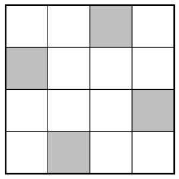

rys. 1

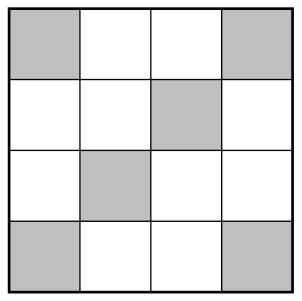

rys. 2

**Uwaga.**

Można udowodnić, że najmniejsza możliwa liczba czarnych pól to 4 (rysunek 1 pokazuje, że jest możliwa do uzyskania). Gdyby bowiem były tylko co najwyżej 3 czarne pola, to sąsiadowałyby bokiem łącznie z co najwyżej 12 białymi polami, podczas gdy białych pól byłoby co najmniej 13 — zatem pewne białe pole nie sąsiadowałoby z żadnym czarnym.

# <lo-sample/> PL.OMJ.2026TEST.7_8.5

Istnieje trójkąt prostokątny, w którym dwa boki mają długości całkowite, a trzeci bok ma długość

**(a)** $\sqrt{20}$;

**(b)** $\sqrt{21}$;

**(c)** $\sqrt{22}$.

<small>

* answer:T,T,N
* questionType:ShortAnswer

</small>

## Rozwiązanie

a) Trójkąt prostokątny o przyprostokątnych długości 4 oraz 2 ma przeciwprostokątną długości $\sqrt{4^2+2^2}=\sqrt{20}$.

b) Trójkąt prostokątny o przyprostokątnych długości 2 oraz $\sqrt{21}$ ma przeciwprostokątną długości $\sqrt{2^2+21}=5$.

c) Jeżeli trójkąt prostokątny o przyprostokątnych długości $a$ oraz $b$ ma przeciwprostokątną długości $\sqrt{22}$, to $a^2+b^2=22$. Bezpośrednio sprawdzamy, że liczby 22 nie można przedstawić jako sumy dwóch (niekoniecznie różnych) składników z listy: 1, 4, 9, 16, więc nie jest możliwe, aby obie liczby $a$, $b$ były całkowite.

Jeżeli zaś trójkąt prostokątny o przyprostokątnych długości $a$ oraz $\sqrt{22}$ ma przeciwprostokątną długości $c$, to $c^2-a^2=22$, czyli $(c-a)(c+a)=22$. Gdyby liczby $a$ oraz $c$ były całkowite, to liczby $c-a$ oraz $c+a$ byłyby albo jednocześnie nieparzyste, albo jednocześnie parzyste (jako liczby różniące się o liczbę parzystą $2a$). W pierwszym przypadku ich iloczyn byłby liczbą nieparzystą, w drugim zaś — liczbą podzielną przez 4; nie jest więc możliwe, aby był równy 22.

**Uwaga.**

Nietrudno sprawdzić, że kwadrat parzystej liczby całkowitej daje przy dzieleniu przez 8 resztę 0 lub 4, a kwadrat nieparzystej liczby całkowitej daje przy dzieleniu przez 8 resztę 1.

Wykorzystując ten fakt, stwierdzamy, że liczba będąca sumą dwóch kwadratów liczb całkowitych może przy dzieleniu przez 8 dawać wyłącznie resztę 0, 1, 2, 4 lub 5, więc nie może być równa 22. Podobnie liczba będąca różnicą dwóch kwadratów liczb całkowitych nie może przy dzieleniu przez 8 dawać reszty 2 ani 6 (więc ponownie nie może być równa 22). W ten sposób można alternatywnie rozstrzygnąć punkt c).

# <lo-sample/> PL.OMJ.2026TEST.7_8.6

Istnieją takie niezerowe liczby $x$ i $y$, że liczba $(x+y)^2$ jest równa

**(a)** $x^2-y^2$;

**(b)** $x^2$;

**(c)** $x^2+y^2$.

<small>

* answer:T,T,N
* questionType:ShortAnswer

</small>

## Rozwiązanie

a) Jeżeli $x=1$ oraz $y=-1$, to $(x+y)^2=0=x^2-y^2$.

b) Jeżeli $x=1$ oraz $y=-2$, to $(x+y)^2=1=x^2$.

c) Skoro $(x+y)^2=x^2+2xy+y^2$, to równość $(x+y)^2=x^2+y^2$ oznacza, że $2xy=0$, a tym samym $x=0$ lub $y=0$. Nie istnieją więc niezerowe liczby $x$ i $y$ spełniające tę równość.

**Uwaga.**

Równość $(x+y)^2=x^2-y^2$ można przekształcić do postaci $2y(x+y)=0$, co oznacza, że jest spełniona, gdy $y=0$ lub $y=-x$. Z kolei $(x+y)^2=x^2$ można przekształcić do postaci $y(2x+y)=0$, co oznacza, że jest spełniona, gdy $y=0$ lub $y=-2x$.

# <lo-sample/> PL.OMJ.2026TEST.7_8.7

Kwadratową kartkę można rozciąć na $n$ części, z których każda jest trójkątem prostokątnym równoramiennym o przyprostokątnej długości 2. Wynika z tego, że

**(a)** pole powierzchni tej kartki jest równe $2n$;

**(b)** liczba $2n$ jest kwadratem liczby całkowitej;

**(c)** tę samą kartkę można rozciąć na $2n$ części, z których każda jest trójkątem prostokątnym o przeciwprostokątnej długości 2.

<small>

* answer:T,N,T
* questionType:ShortAnswer

</small>

## Rozwiązanie

a) Pole trójkąta prostokątnego równoramiennego o przyprostokątnej długości 2 jest równe $\frac12\cdot2\cdot2=2$. Wobec tego łączne pole $n$ takich trójkątów jest równe $2n$.

b) Kwadrat o przekątnej długości 4 można rozciąć obiema przekątnymi na cztery trójkąty prostokątne równoramienne o przyprostokątnych długości 2. Wówczas dwukrotność liczby uzyskanych części jest równa 8 — nie jest więc kwadratem liczby całkowitej.

c) Trójkąt prostokątny równoramienny o przyprostokątnej długości 2 można rozciąć wzdłuż wysokości poprowadzonej z wierzchołka kąta prostego na dwa trójkąty prostokątne równoramienne o przeciwprostokątnej długości 2. Jeżeli w ten sposób podzielimy każdą część podziału opisanego w treści zadania, otrzymamy rozcięcie na $2n$ części, z których każda jest trójkątem prostokątnym równoramiennym o przeciwprostokątnej długości 2.

# <lo-sample/> PL.OMJ.2026TEST.7_8.8

Istnieje dwucyfrowa liczba naturalna o niezerowych cyfrach, która w wyniku zamiany miejscami swoich cyfr zwiększa się

**(a)** o 20%;

**(b)** o 25%;

**(c)** o 75%.

<small>

* answer:T,N,T
* questionType:ShortAnswer

</small>

## Rozwiązanie

b) Liczba dwucyfrowa o cyfrze dziesiątek równej $a$ oraz cyfrze jedności równej $b$ jest równa $10a+b$, a liczba uzyskana w wyniku zamiany miejscami jej cyfr to $10b+a$. Jeżeli $a$ oraz $b$ są niezerowe, to warunek $10b+a=\frac{125}{100}\cdot(10a+b)$ można przekształcić równoważnie kolejno do

$$
10b+a=\frac54\cdot(10a+b),\qquad 40b+4a=50a+5b,\qquad 35b=46a,\qquad \frac{a}{b}=\frac{35}{46}.
$$

Otrzymany ułamek jest nieskracalny, więc nie jest równy ilorazowi liczb jednocyfrowych.

a) Liczba 45 spełnia warunki zadania, gdyż $54=45+9=45+\frac{20}{100}\cdot45$.

c) Liczba 12 spełnia warunki zadania, gdyż $21=12+9=12+\frac{75}{100}\cdot12$.

**Uwaga.**

Przykład przedstawiony w punkcie a) jest jedyny, a w punkcie c) szukaną własność mają ponadto liczby 24, 36, 48. Aby odnaleźć te przykłady, można przekształcić równości analogiczne do tej zapisanej w rozwiązaniu punktu b).

Można także oprzeć rozumowanie na obserwacji, że różnica między liczbami $10b+a$ oraz $10a+b$ jest równa $9(b-a)$, więc jest podzielna przez 9.

W punkcie a), jeżeli istnieje liczba spełniająca warunki zadania, to 20% tej liczby jest podzielne przez 9. Zatem sama liczba jest podzielna przez 45. Po uwzględnieniu warunku $a<b$ (oznaczającego, że liczba w wyniku zmiany miejscami cyfr wzrosła) oraz niezerowości cyfr pozostaje tylko jedna kandydatura: 45, która rzeczywiście spełnia warunki zadania.

Podobnie w punkcie b) 25% szukanej liczby musiałoby być podzielne przez 9, więc sama liczba musiałaby być podzielna przez 36. Po uwzględnieniu warunku $a<b$ pozostaje tylko liczba 36, która jednak nie spełnia warunków zadania, gdyż liczba 63 jest od niej większa o 75%, a nie o 25%.

# <lo-sample/> PL.OMJ.2026TEST.7_8.9

Istnieje taki pięciokąt, w którym

**(a)** długość pewnego boku jest równa sumie długości pozostałych czterech boków;

**(b)** suma długości pewnych dwóch sąsiednich boków jest równa sumie długości pozostałych trzech boków;

**(c)** miara pewnego kąta wewnętrznego jest równa sumie miar pozostałych czterech kątów wewnętrznych.

<small>

* answer:N,T,T
* questionType:ShortAnswer

</small>

## Rozwiązanie

a) Długość łamanej łączącej dwa punkty, która nie jest zawarta w odcinku łączącym te punkty, jest większa od długości tego odcinka.

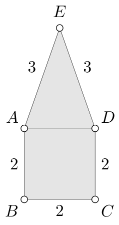

rys. 3

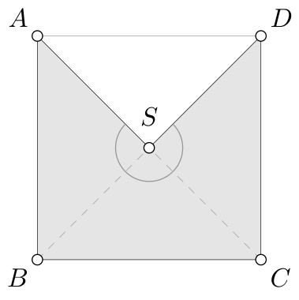

rys. 4

b) Rozważmy kwadrat $ABCD$ o boku długości 2 oraz taki punkt $E$ na zewnątrz tego kwadratu, że $AE=DE=3$ (rys. 3). Wówczas

$$
AE+DE=3+3=2+2+2=AB+BC+CD.
$$

c) Rozważmy kwadrat $ABCD$ oraz punkt $S$ będący środkiem tego kwadratu (rys. 4). Wówczas w pięciokącie wklęsłym $ABCDS$ miara kąta wewnętrznego przy wierzchołku $S$ jest równa $270^\circ$ i jest równa sumie miar kątów wewnętrznych przy pozostałych czterech wierzchołkach:

$$
\angle SAB+\angle ABC+\angle BCD+\angle CDS=45^\circ+90^\circ+90^\circ+45^\circ=270^\circ.
$$

**Uwaga.**

Suma miar kątów wewnętrznych w każdym pięciokącie jest równa $540^\circ$. Wobec tego w punkcie c) stosowny przykład stanowi dowolny pięciokąt, którego jeden z kątów wewnętrznych ma miarę $270^\circ$.

# <lo-sample/> PL.OMJ.2026TEST.7_8.10

Liczby rzeczywiste $a$, $b$ spełniają nierówności $a^2>b^2$ i $a+b<0$. Wynika z tego, że

**(a)** $a>b$;

**(b)** $ab>0$;

**(c)** $a^3<b^3$.

<small>

* answer:N,N,T
* questionType:ShortAnswer

</small>

## Rozwiązanie

a), b) Jeżeli $a=-2$, $b=1$, to warunki zadania są spełnione, a przy tym $a\leqslant b$ i $ab=-2\leqslant0$.

c) Pierwszy warunek możemy przekształcić do postaci $a^2-b^2>0$, czyli $(a-b)(a+b)>0$. Jeżeli czynnik $a+b$ jest liczbą ujemną, to iloczyn $(a-b)(a+b)$ jest dodatni tylko wtedy, gdy czynnik $a-b$ jest ujemny. To oznacza, że $a-b<0$, czyli $a<b$.

Skoro $a+b<0$, to co najmniej jedna z liczb $a$, $b$ jest ujemna. Jeżeli liczba $a$ jest ujemna, a liczba $b$ jest nieujemna, to $a^3<0\leqslant b^3$. Jeżeli zaś obie liczby $a$ i $b$ są ujemne, to z nierówności $a<b$ wynika, że $|a|>|b|$. W konsekwencji $-a^3=|a|^3>|b|^3=-b^3$, czyli $a^3<b^3$.

**Uwaga.**

Przedstawiony argument pokazuje również, po osobnym rozpatrzeniu nietrudnego przypadku $0\leqslant a<b$, że dla dowolnych liczb rzeczywistych $a<b$ zachodzi $a^3<b^3$. Dla kwadratów analogiczny fakt jest prawdziwy, jeżeli założymy dodatkowo, że liczby $a$, $b$ są nieujemne.

# <lo-sample/> PL.OMJ.2026TEST.7_8.11

W każde pole tablicy $3\times3$ wpisano liczbę całkowitą w taki sposób, że suma liczb w każdym wierszu jest parzysta. Wynika z tego, że:

**(a)** istnieją co najmniej trzy różne pola, w które wpisano liczbę parzystą;

**(b)** istnieje kolumna zawierająca trzy liczby o parzystej sumie;

**(c)** istnieją dwa wiersze zawierające sześć liczb o sumie podzielnej przez 4.

<small>

* answer:T,T,T
* questionType:ShortAnswer

</small>

## Rozwiązanie

a) W każdym wierszu tablicy znajdują się trzy liczby o parzystej sumie, więc co najmniej jedna z tych liczb jest parzysta — gdyby wszystkie trzy były nieparzyste, ich suma byłaby nieparzysta. To oznacza, że istnieją co najmniej trzy różne pola, w które wpisano liczby parzyste.

b) Suma wszystkich liczb w całej tablicy $S$ jest liczbą parzystą, gdyż jest sumą trzech liczb parzystych (sum w wierszach). Gdyby suma liczb w każdej kolumnie była nieparzysta, to $S$, jako suma trzech liczb nieparzystych, byłaby nieparzysta. To oznacza, że co najmniej jedna kolumna zawiera trzy liczby o parzystej sumie.

c) W każdym wierszu suma liczb jest liczbą parzystą, więc daje resztę 0 lub 2 przy dzieleniu przez 4. Jeżeli pewne dwa wiersze mają sumy podzielne przez 4, to suma sześciu liczb w tych dwóch wierszach również jest podzielna przez 4. Jeżeli zaś jest co najwyżej jeden wiersz o sumie podzielnej przez 4, to są co najmniej dwa wiersze o sumie dającej resztę 2 przy dzieleniu przez 4. Suma sześciu liczb w takich dwóch wierszach jest liczbą podzielną przez 4.

# <lo-sample/> PL.OMJ.2026TEST.7_8.12

Dany jest trapez $ABCD$ o podstawach $AB$ i $CD$, w którym $AB=AC=BD$. Wynika z tego, że

**(a)** $\angle BAD>60^\circ$;

**(b)** $BC\leqslant CD$;

**(c)** pole trójkąta $ABD$ jest większe od pola trójkąta $BCD$.

<small>

* answer:T,N,T
* questionType:ShortAnswer

</small>

## Rozwiązanie

a) Przyjmijmy oznaczenie $\angle BAD=\alpha$ (rys. 5). Skoro trapez $ABCD$ ma przekątne równej długości, to jest trapezem równoramiennym, więc $\angle ABC=\alpha$. Skoro $AB=BD$, to $\angle ADB=\alpha$ i $\angle ABD=180^\circ-2\alpha$. Zatem nierówność $\angle ABC>\angle ABD$ przybiera postać

$$
\alpha>180^\circ-2\alpha,\qquad czyli\qquad \alpha>60^\circ.
$$

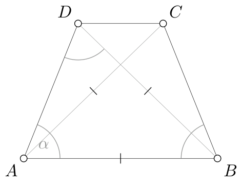

rys. 5

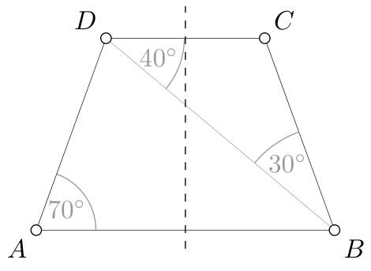

rys. 6

b) Nierówność $BC\leqslant CD$ jest równoważna nierówności $\angle BDC\leqslant\angle CBD$, gdyż w trójkącie $BCD$ naprzeciw większego kąta leży dłuższy bok. W terminach przyjętych wyżej oznaczeń mamy

$$
\angle BDC=\angle ABD=180^\circ-2\alpha\qquad oraz\qquad \angle CBD=\alpha-(180^\circ-2\alpha)=3\alpha-180^\circ.
$$

Wobec tego powyższa nierówność jest spełniona dokładnie wtedy, gdy

$$
180^\circ-2\alpha\leqslant3\alpha-180^\circ,\qquad czyli\qquad \alpha\geqslant72^\circ.
$$

Przykład, w którym nierówność $BC\leqslant CD$ nie jest spełniona, otrzymamy, gdy $60^\circ<\alpha<72^\circ$.

Przykładowo niech $ABD$ będzie trójkątem, w którym $\angle BAD=\angle ADB=70^\circ$, oraz niech $C$ będzie punktem symetrycznym do $D$ względem symetralnej odcinka $AB$ (rys. 6). Trapez $ABCD$ spełnia warunki zadania, ale $\angle CDB=40^\circ>30^\circ=\angle CBD$, więc $BC>CD$.

c) W trójkącie równoramiennym $ABD$ kąt między podstawą a ramieniem jest ostry, skąd $\angle BAD<90^\circ$. W konsekwencji kąty trapezu równoramiennego $ABCD$ przy podstawie $AB$ są ostre, a zatem podstawa $AB$ jest dłuższa od podstawy $CD$. Wysokość trójkąta $ABD$ opuszczona na podstawę $AB$ jest równa wysokości trójkąta $BCD$ opuszczonej na podstawę $CD$ (jest to odległość między prostymi $AB$ i $CD$), więc większe pole ma ten z tych dwóch trójkątów, który ma dłuższą podstawę. To oznacza, że pole trójkąta $ABD$ jest większe od pola trójkąta $BCD$.

**Uwaga.**

Warunki zadania można również zilustrować następującą konstrukcją. Narysujmy odcinek $AB$ oraz, po tej samej stronie prostej $AB$, dwa łuki okręgów o środkach $A$, $B$ i promieniu $AB$. Niech $E$ będzie punktem wspólnym tych łuków (rys. 7).

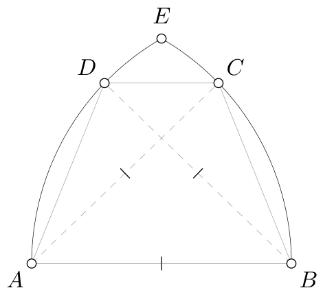

rys. 7

Jeżeli przetniemy tę figurę prostą równoległą do $AB$, przecinającą łuki odpowiednio w punktach $D$ i $C$, to otrzymamy trapez $ABCD$. Z konstrukcji mamy $BD=AB=AC$. W ten sposób można otrzymać każdy trapez spełniający warunki zadania.

Konstrukcja ta daje intuicję stojącą za przykładem skonstruowanym w punkcie b). Jeżeli prostą $CD$ poprowadzimy dostatecznie blisko punktu $E$, to odcinek $CD$ będzie bardzo krótki, podczas gdy odcinek $BC$ pozostanie znacznie dłuższy. Otrzymamy więc trapez, dla którego $BC>CD$.

# <lo-sample/> PL.OMJ.2026TEST.7_8.13

Dodatnie liczby całkowite $a$, $b$ są takie, że $\frac1a+\frac1b=\frac1{12}+\frac1{24}$. Wynika z tego, że

**(a)** liczby $a$ oraz $b$ są różne;

**(b)** liczba $a+b$ jest parzysta;

**(c)** liczba $a\cdot b$ jest niepodzielna przez 5.

<small>

* answer:N,N,N
* questionType:ShortAnswer

</small>

## Rozwiązanie

Zauważmy, że $\frac1{12}+\frac1{24}=\frac3{24}=\frac18$.

a) Jeżeli $a=b=16$, to $\frac1{16}+\frac1{16}=\frac18$ oraz liczby $a$ i $b$ są równe.

b) Jeżeli $a=9$ oraz $b=72$, to $\frac19+\frac1{72}=\frac18$ oraz liczba $a+b=81$ jest nieparzysta.

c) Jeżeli $a=10$ oraz $b=40$, to $\frac1{10}+\frac1{40}=\frac18$ oraz liczba $a\cdot b=400$ jest podzielna przez 5.

**Uwaga.**

Aby znaleźć wszystkie rozwiązania równania $\frac1a+\frac1b=\frac18$, można postąpić następująco. Po pierwsze zauważamy, że jeżeli $a$, $b$ spełniają to równanie, to $\frac1a<\frac18$ oraz $\frac1b<\frac18$, skąd $a>8$ oraz $b>8$. Równoważnie przekształcamy równanie kolejno do postaci

$$
8a+8b=ab,\qquad 0=ab-8a-8b,\qquad 64=ab-8a-8b+64,\qquad 64=(a-8)(b-8).
$$

Skoro $a>8$, $b>8$, to czynniki $a-8$ oraz $b-8$ są dodatnimi liczbami całkowitymi. Liczba 64 ma (z dokładnością do kolejności) następujące przedstawienia w postaci iloczynu dwóch takich liczb: $1\cdot64$, $2\cdot32$, $4\cdot16$ oraz $8\cdot8$. To oznacza, że wszystkimi parami $(a,b)$ spełniającymi warunki zadania, w których $a\leqslant b$ są: $(9,72)$, $(10,40)$, $(12,24)$, $(16,16)$.

# <lo-sample/> PL.OMJ.2026TEST.7_8.14

Piotr zaznaczył na kartce cztery różne punkty, z których żadne trzy nie leżą na jednej prostej. Następnie każde dwa z tych punktów połączył odcinkiem. Okazało się, że pośród długości tych odcinków występują tylko dwie różne liczby. Wynika z tego, że

**(a)** pewne dwa z narysowanych odcinków są prostopadłe;

**(b)** pewne dwa z narysowanych odcinków mają punkt wspólny niebędący końcem żadnego z nich;

**(c)** pewne trzy z zaznaczonych punktów są wierzchołkami trójkąta równobocznego.

<small>

* answer:N,N,N
* questionType:ShortAnswer

</small>

## Rozwiązanie

a), c) Jeżeli Piotr zaznaczył cztery spośród pięciu wierzchołków pięciokąta foremnego, to wśród narysowanych odcinków występują tylko dwie długości: długość boku i długość przekątnej pięciokąta. Żadne dwa z narysowanych odcinków nie są prostopadłe i żadne trzy z zaznaczonych punktów nie są wierzchołkami trójkąta równobocznego.

b) Jeżeli Piotr zaznaczył wierzchołki oraz środek pewnego trójkąta równobocznego, to wśród narysowanych odcinków występują tylko dwie długości: długość boku trójkąta oraz odległość jego środka od wierzchołka. Żadne dwa z narysowanych odcinków nie mają punktów wspólnych poza końcami.

**Uwaga.**

Na rysunku 8 przedstawiono wszystkie (z dokładnością do podobieństwa) konfiguracje 4 punktów płaszczyzny, między którymi występują tylko dwie różne odległości. Jedna z długości zaznaczona jest pogrubioną linią, a druga — przerywaną. Pierwsze dwie konfiguracje zostały przywołane w przedstawionych rozwiązaniach.

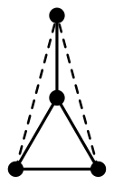

rys. 8

# <lo-sample/> PL.OMJ.2026TEST.7_8.15

Na powierzchni sześcianu o krawędzi 2 zaznaczono 20 punktów: wszystkie wierzchołki oraz środki wszystkich krawędzi. Pośród odcinków o obydwu końcach w zaznaczonych punktach są dokładnie 24 odcinki o długości

**(a)** 1;

**(b)** 2;

**(c)** 3.

<small>

* answer:T,T,T
* questionType:ShortAnswer

</small>

## Rozwiązanie

a) Odległość między zaznaczonymi punktami jest równa 1 dokładnie wtedy, gdy jeden z nich jest środkiem pewnej krawędzi sześcianu, a drugi — końcem tej krawędzi. Dla każdej z 12 krawędzi sześcianu są dwa końce, więc łączna liczba wszystkich odcinków o długości 1 jest równa $12\cdot2=24$.

b) Odległość między zaznaczonymi punktami jest równa 2, jeśli są to końce jednej z krawędzi sześcianu (takich par jest 12) lub jeśli są to środki przeciwległych boków pewnej ściany sześcianu (są dwie takie pary na każdej ścianie, więc łącznie takich par jest $6\cdot2=12$). Łączna liczba odcinków o długości 2 jest więc równa 24.

c) Odległość między zaznaczonymi punktami jest równa 3 wyłącznie jeśli jeden z tych punktów jest wierzchołkiem sześcianu, a drugi — środkiem jednej z trzech krawędzi wychodzących z wierzchołka przeciwległego do niego. Łączna liczba takich par jest równa $8\cdot3=24$.

**Uwaga.**

Aby wyczerpująco uzasadnić, że odcinki o długościach 1, 2, 3 nie występują w innych sytuacjach niż opisane w rozwiązaniu, rozpatrzymy wszystkie możliwe rodzaje odcinków ze względu na to, jakiego typu są ich końce. Jeżeli obydwa końce odcinka są wierzchołkami sześcianu (rys. 9), to odcinek ten ma długość:

* 2, gdy jest krawędzią sześcianu;

* $2\sqrt2$, gdy jest przekątną pewnej ściany;

* $2\sqrt3$, gdy jest przekątną sześcianu.

Jeżeli obydwa końce odcinka są środkami krawędzi sześcianu (rys. 10), to odcinek ten ma długość:

* $\sqrt2$, gdy są to środki sąsiednich boków pewnej ściany;

* 2, gdy są to środki przeciwległych boków pewnej ściany;

* $\sqrt6$, gdy są to środki pewnej pary krawędzi skośnych;

* $2\sqrt2$, gdy są to środki pewnej pary krawędzi przeciwległych.

Jeżeli jeden koniec odcinka jest wierzchołkiem sześcianu, a drugi — środkiem krawędzi (rys. 11), to odcinek ten ma długość:

* 1, gdy jest to środek krawędzi mającej koniec w danym wierzchołku;

* $\sqrt5$, gdy jest to środek krawędzi zawartej w tej samej ścianie co dany wierzchołek, ale niekończącej się w nim;

* 3, gdy jest to środek krawędzi wychodzącej z wierzchołka przeciwległego.

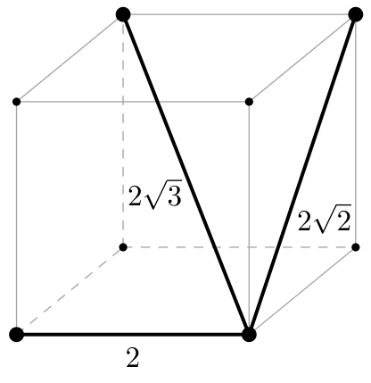

rys. 9

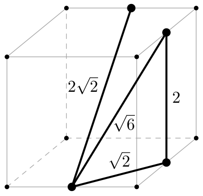

rys. 10

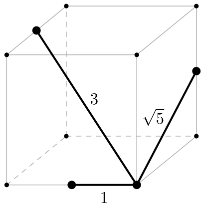

rys. 11

Poniższa tabela prezentuje łączną liczbę odcinków o poszczególnych długościach.

| długość | 1 | $\sqrt2$ | 2 | $\sqrt5$ | $\sqrt6$ | $2\sqrt2$ | 3 | $2\sqrt3$ |
|---|---:|---:|---:|---:|---:|---:|---:|---:|
| liczba odcinków | 24 | 24 | 24 | 48 | 24 | 18 | 24 | 4 |
