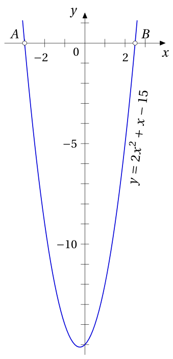
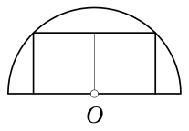
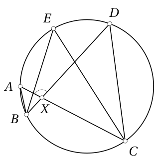

# 10. klase · Tests A · 1. daļa

Vārds, uzvārds: \_\_\_\_\_\_\_\_\_\_\_\_\_\_\_\_\_\_\_\_\_\_\_\_\_\_\_\_\_\_\_\_\_\_ Klase: \_\_\_\_\_\_ Rezultāts: \_\_\_\_\_ / 16 p.

**Laiks — 40 minūtes. Vērtē tikai to, kas ierakstīts rindiņā "Atbilde"; aprēķinus vari veikt lapas brīvajā vietā vai uz melnraksta.** Kalkulatoru nelieto; par nepareizu atbildi punktus neatņem; ja jāatrod *visi* atrisinājumi, uzraksti visus, atdalot ar komatiem (pārus raksti formā $(x;y)$).

<!-- SAGATAVE. Zem katra uzdevuma numura slīprakstā ir norāde, kāds uzdevums šeit ievietojams; pirms drukāšanas norādes dzēst.
     Priekšzināšanas: tikai 1.-9. klases kurss (10. klases temati nav mācīti).
     Struktūra: 1.-4. uzd. — skolas temats T1 (9.4. Izteiksmju sadalīšana reizinātājos); 5. un 10. uzd. — olimpiāžu temats O1 (Ģ4. Riņķa līnija: ievilktais leņķis; 9.-10. kl. līmenis);
     Programmas atbilstība (Skola2030, prog-validate): centra leņķis, ievilkts leņķis, loka leņķiskais lielums, ievilkts leņķis uz diametra
     apgūti 8. klasē (G8.4. "Daudzstūri un riņķa līnija", SR T66.B1.SR1-SR2, T66.B3.SR3). Hordas-pieskares leņķis, leņķis starp sekantēm,
     krustisku hordu īpašība un ievilkta četrstūra pretējo leņķu summa pamatskolā NAV — tie ir Matemātika II (T14 "Ģeometrija"); tos neizmantot.
     6.-9. uzd. — skolas temats T2 (9.5. Kvadrātvienādojums un kvadrātfunkcija). Katrā skolas tematā: 2 uzdevumi SOLO 1-2, 2 uzdevumi SOLO 3 (viens no tiem ar citu tematu).
     Punkti: SOLO 1-2 → 1 p., SOLO 3 → 2 p., olimpiāžu uzdevumi → 2 p. Kopā 16 p. (4 × 1 p. + 6 × 2 p.) -->

<!-- ŠIS FAILS ir uzdevumu komplekts kopā ar analīzi (metadati <small>, atbildes un pilni atrisinājumi).
     Skolēniem izdalāmajā variantā jāatstāj tikai uzdevumu teksti, zīmējumi un tukšās rindiņas "Atbilde". -->

## 1. uzdevums (1 p.)

<!-- *Šeit ievietot uzdevumu par tematu **saīsinātās reizināšanas formulas** (9.4.; A1), SOLO 1–2: aprēķināt bez kalkulatora skaitlisku izteiksmi, kur formulas $a^2-b^2$ vai $(a\pm b)^2$ ļauj izvairīties no gara rēķina — piemēram, $2026^2-2025^2$ vai $\frac{47^2-13^2}{34}$, vai $998\cdot 1002$. Atbilde — skaitlis.* -->

Aprēķini: $(2007^2 - 2007) - (2006^2 - 2006) =$

<small>

* source:EE.PK.2007TEST.9.1
* answer:4012
* questionType:ShortAnswer

</small>

**Atbilde:** $4012$

### Atrisinājums

Izteiksmes vērtība ir $2007 \cdot (2007 - 1) - 2006 \cdot (2006 - 1) = 2007 \cdot 2006 - 2006 \cdot 2005 = 2006 \cdot (2007 - 2005) = 2006 \cdot 2 = 4012$.

Var lietot arī kvadrātu starpības formulu: $(2007^2-2006^2)-(2007-2006)=(2007-2006)(2007+2006)-1=4013-1=4012$.

## 2. uzdevums (1 p.)

<!-- *Šeit ievietot uzdevumu par tematu **izteiksmju sadalīšana reizinātājos un simetriskas izteiksmes** (9.4.; A1), SOLO 2: zināmas vērtības $a+b$ un $ab$ (vai $x+\frac{1}{x}$), jāatrod $a^2+b^2$, $a^3+b^3$ vai $x^2+\frac{1}{x^2}$ — jāpārveido izteiksme, nevis jāatrod $a$ un $b$. Atbilde — skaitlis.* -->

Skaitļu $m$ un $n$ summa ir $90$ un starpība ir $4$. Atrodi skaitļu $m$ un $n$ reizinājumu.

<small>

* source:EE.PK.2021TEST.9.2
* answer:2021
* questionType:ShortAnswer

</small>

**Atbilde:** $2021$

### Atrisinājums

Sistēmas

$$
\begin{cases}
m + n = 90,\\
m - n = 4
\end{cases}
$$

atrisinājums ir $m = 47$, $n = 43$. Tātad $mn = 47 \cdot 43 = 2021$.

**Cits atrisinājums** (bez $m$ un $n$ atrašanas). Tā kā $(m+n)^2-(m-n)^2=4mn$, tad

$$mn=\frac{90^2-4^2}{4}=\frac{(90-4)(90+4)}{4}=\frac{86\cdot 94}{4}=43\cdot 47=2021.$$

## 3. uzdevums (2 p.)

<!-- *Šeit ievietot uzdevumu par tematu **sadalīšana reizinātājos vienādojumā veselos skaitļos** (9.4.; S5, 9.–10. kl.), SOLO 3: vienādojums tipa $xy-3x-2y=4$ vai $x^2-y^2=45$, kur pēc pārveidojuma $(x-2)(y-3)=10$ jāpārlasa skaitļa dalītāji un jāatrod **visi** naturālo (vai veselo) skaitļu pāri; jāpiesaka, kura skaitļu kopa — naturālie vai veselie, jo tas maina atbildi. Atbilde — pāru saraksts. Līdzīgi: LV.AMO.2024.10.1, LV.NOL.2024.10.4.* -->

Atrodi visus naturālo skaitļu pārus $(a;b)$, kuriem $a\leqslant b$ un

$$\frac1a+\frac1b=\frac18.$$

<small>

* adaptedFrom:PL.OMJ.2026TEST.7_8.13
* answer:(9;72), (10;40), (12;24), (16;16)
* questionType:FindAll

</small>

**Atbilde:** $(9;72),\ (10;40),\ (12;24),\ (16;16)$

### Atrisinājums

Ja $a$, $b$ apmierina vienādojumu, tad $\frac1a<\frac18$ un $\frac1b<\frac18$, no kurienes $a>8$ un $b>8$. Ekvivalenti pārveidojam vienādojumu pēc kārtas formās

$$
8a+8b=ab,\qquad 0=ab-8a-8b,\qquad 64=ab-8a-8b+64,\qquad 64=(a-8)(b-8).
$$

Tā kā $a>8$, $b>8$, tad reizinātāji $a-8$ un $b-8$ ir pozitīvi veseli skaitļi, turklāt $a-8\leqslant b-8$. Skaitli $64$ šādi var izteikt kā divu reizinātāju reizinājumu tieši četros veidos: $1\cdot64$, $2\cdot32$, $4\cdot16$ un $8\cdot8$. Tas nozīmē, ka visi pāri $(a;b)$, kas apmierina uzdevuma nosacījumus, ir $(9;72)$, $(10;40)$, $(12;24)$, $(16;16)$.

*Pielāgojums.* Oriģinālajā uzdevumā (PL.OMJ.2026TEST.7_8.13) bija dots $\frac1a+\frac1b=\frac1{12}+\frac1{24}$ un jānosaka „jā/nē” par trim apgalvojumiem; atrisinājuma piezīmē bija atrasti visi pāri. Šeit prasīts atrast visus pārus.

## 4. uzdevums (2 p.)

<!-- *Šeit ievietot uzdevumu par tematu **sadalīšana reizinātājos** (9.4.) **kombinācijā ar pirmskaitļiem vai dalāmību** (S2), SOLO 3: izteiksme ar $n$ (piem., $n^2-6n+8$, $n^4+4$ vai $n^3-n$) sadalāma reizinātājos, un jāatrod visas naturālās $n$ vērtības, kurām vērtība ir pirmskaitlis, vai jāatrod lielākais skaitlis, ar kuru vērtība dalās pie katra $n$. Nepieciešams sadalījums plus spriedums "reizinājums ir pirmskaitlis tikai tad, ja viens reizinātājs ir 1". Atbilde — saraksts vai skaitlis. Līdzīgi: LV.NOL.2021.10.4, LV.AMO.2019.10.4.* -->

Atrodi visus pirmskaitļus $p$, kuriem skaitlis $199p+1$ ir naturāla skaitļa kvadrāts.

<small>

* adaptedFrom:UKMT.SMC.2008.19
* sourceNote:UK Senior Mathematical Challenge 2008, 19. uzd. (UKMT Yearbook 2008-09)
* answer:197
* questionType:FindAll

</small>

**Atbilde:** $197$

### Atrisinājums

Pieņemsim, ka $199p+1=X^2$, kur $X$ ir naturāls skaitlis. Tad

$$199p=X^2-1=(X-1)(X+1).$$

Ievērosim, ka $199$ ir pirmskaitlis. Tā kā $p$ arī ir pirmskaitlis, skaitļa $199p$ vienīgie sadalījumi divu naturālu reizinātāju reizinājumā ir $1\cdot 199p$ un $199\cdot p$ (ja $p=199$, tad $199\cdot 199$). Reizinātāji $X-1$ un $X+1$ atšķiras par $2$.

* $X-1=1$, $X+1=199p$ nav iespējams, jo tad $199p=3$.
* $X-1=199$, $X+1=p$: tad $p=201=3\cdot 67$ — nav pirmskaitlis.
* $X+1=199$, $X-1=p$: tad $p=197$ — pirmskaitlis. Pārbaude: $199\cdot197+1=(198-1)(198+1)+1=198^2$.
* $p=199$: reizinātāji $199$ un $199$ neatšķiras par $2$.

Tātad vienīgais derīgais pirmskaitlis ir $p=197$.

*Pielāgojums.* Oriģinālais uzdevums bija izvēles uzdevums „Cik ir tādu pirmskaitļu $p$…?” (atbilde: $1$); šeit jāatrod pats pirmskaitlis.

## 5. uzdevums (2 p.)

<!-- *Šeit ievietot uzdevumu par olimpiāžu tematu **ievilktais leņķis un centra leņķis** (Ģ4, 9.–10. kl.), SOLO 2: zīmējumā riņķa līnija ar centru, horda un 2–3 atzīmēti punkti; dots viens leņķis, jāatrod cits, lietojot ievilktā leņķa teorēmu vai leņķi starp pieskari un hordu un vienādsānu trijstūri no rādiusiem. Zīmējums ar piezīmi "nav mērogā". Atbilde — leņķis grādos.* -->

Punkti $A$ un $D$ atrodas uz riņķa līnijas, kuras diametrs ir $BC$. Atrodi leņķa $ABC$ lielumu, ja $\angle ADB = 55^\circ$. (Zīmējums nav mērogā.)

<small>

* source:EE.PK.2020TEST.9.6
* answer:35°
* questionType:ShortAnswer

</small>

**Atbilde:** $35^\circ$

### Atrisinājums

Pēc ievilkto leņķu īpašības $\angle ACB = \angle ADB = 55^\circ$ (abi balstās uz loku $AB$). Pēc Talesa teorēmas $\angle BAC = 90^\circ$ (balstās uz diametru $BC$), tāpēc $\angle ABC = 90^\circ - 55^\circ = 35^\circ$.

*Piezīme skolotājam.* Izmantotās īpašības (ievilkti leņķi, kas balstās uz viena loka, ir vienādi; ievilkts leņķis uz diametra ir taisns) atbilst 8. klases tematam G8.4. „Daudzstūri un riņķa līnija”.

<!-- ===== Lapas otrā puse: 6.–10. uzdevums ===== -->

## 6. uzdevums (1 p.)

<!-- *Šeit ievietot uzdevumu par tematu **kvadrātvienādojums un parabola** (9.5.; A2, A4), SOLO 1–2: atrisināt kvadrātvienādojumu ar veselām saknēm vai atrast parabolas $y=ax^2+bx+c$ virsotnes koordinātas / funkcijas mazāko vērtību. Atbilde — sakņu saraksts vai skaitlis (vai koordinātu pāris).* -->

Kvadrātfunkcijas $y = 2x^2 + x - 15$ grafiks krusto $x$ asi punktos $A$ un $B$. Atrodi nogriežņa $AB$ garumu.

<small>

* source:EE.PK.2006TEST.9.5
* answer:$5,5$
* questionType:ShortAnswer

</small>

**Atbilde:** $5{,}5$

### Atrisinājums

1. atrisinājums. Vienādojuma $2x^2 + x - 15 = 0$ saknes ir
$$x_{1,2} = \frac{-1 \pm \sqrt{1^2 - 4 \cdot 2 \cdot (-15)}}{2 \cdot 2} = \frac{-1 \pm \sqrt{121}}{4} = \frac{-1 \pm 11}{4}$$
jeb $x_1 = -\frac{12}{4} = -3$ un $x_2 = \frac{10}{4} = 2{,}5$. Nogriežņa $AB$ garums ir $3 + 2{,}5 = 5{,}5$ (sk. zīmējumu).

2. atrisinājums. Parabolas $y = ax^2 + bx + c$ nullpunktu attālumu $l$ var aprēķināt pēc formulas $l = |x_1 - x_2| = \frac{\sqrt{b^2 - 4ac}}{|a|}$. Tātad dotajā gadījumā
$$l = \frac{\sqrt{1^2 - 4 \cdot 2 \cdot (-15)}}{2} = \frac{\sqrt{121}}{2} = \frac{11}{2}.$$

## 7. uzdevums (1 p.)

<!-- *Šeit ievietot uzdevumu par tematu **Vjeta teorēma** (9.5.; A2), SOLO 2: dots kvadrātvienādojums ar "neērtām" saknēm; bez to aprēķināšanas jāatrod $x_1^2+x_2^2$, $\frac{1}{x_1}+\frac{1}{x_2}$ vai $|x_1-x_2|$. Skaitļi jāizvēlas tā, lai sakņu tieša aprēķināšana būtu nepatīkama (diskriminants nav pilns kvadrāts). Atbilde — skaitlis.* -->

Kvadrātvienādojuma $x^{2}-507x+a=0$ saknes ir $p^{2}$ un $q$, kur $p$ un $q$ ir pirmskaitļi. Aprēķini $a$ skaitlisko vērtību.

<small>

* source:LV.AMO.2012.9.3
* answer:2012
* topic:ModularArithmetic
* questionType:FindAll
* domain:NT,Alg
* subdomain:DOM_ParametrizedEquations
* concepts:quadratic-equation,primes
* _hasSolutionConcept: QuadraticEquation, VietasFormulas, PrimeNumbers, EvenOddParity
* _readingDifficulty: low
* _hasReasoningMethod: ParityArgument, CompleteEnumeration
* _hasReasoningMistake: PrimeOnePointConfusion
* _mistakesFit: medium

</small>

**Atbilde:** $2012$

### Atrisinājums

No Vjeta teorēmas seko $p^{2}+q=507$ — nepāra skaitlis, tātad viens no pirmskaitļiem $p$ vai $q$ ir $2$. Ja $q=2$, tad $p^{2}=505$, bet tad $p$ nav vesels skaitlis. Tātad $p=2$ un $q=503$ ($503$ ir pirmskaitlis), no kurienes, atkal pēc Vjeta teorēmas, iegūstam $a=p^{2}q=4\cdot 503=2012$.

*Piezīme skolotājam.* Uzdevums neatbilst norādei par „neērtām” saknēm, bet atbilst tematam: Vjeta teorēma šeit jālieto divreiz, un saknes tieši aprēķināt nevar, jo $a$ nav zināms.

## 8. uzdevums (2 p.)

<!-- *Šeit ievietot uzdevumu par tematu **kvadrātvienādojums ar parametru** (9.5.; A2), SOLO 3: jāatrod **visas** parametra $m$ vērtības, kurām vienādojumam ir tieši viena sakne / saknes ir pretēji skaitļi / kvadrātfunkcija krusto $x$ asi dotā punktā, un jāuzrāda arī otra sakne. Jāpārbauda arī gadījums, kad vecākais koeficients kļūst 0, ja tas atkarīgs no $m$. Atbilde — saraksts. Līdzīgi: LV.NOL.2019.10.1, LV.NOL.2021.10.2.* -->

Dots vienādojums $(a-3)x^{2}+5x-2=0$. Atrodi visas parametra $a$ vērtības, kurām vienādojumam ir tieši viena sakne.

<small>

* source:LV.AMO.2018.9.1
* answer:3; -1/8
* questionType:FindAll
* domain:Alg
* subdomain:DOM_ParametrizedEquations
* topic:QuadraticEquationRootConditions
* _hasSolutionConcept: QuadraticEquation, LinearEquation, VariableExpression
* _readingDifficulty: low
* _hasReasoningMethod: CaseAnalysisBySignOrInterval, EquivalentTransformationsOfEquationsAndInequalities
* _hasReasoningMistake: CaseAnalysisIncomplete, UncheckedConsistencyOfFoundValues
* _mistakesFit: medium

</small>

**Atbilde:** $a=3$, $a=-\frac{1}{8}$

### Atrisinājums

Ja $a=3$, tad iegūstam lineāru vienādojumu $5x-2=0$, kuram ir viens atrisinājums $x=0{,}4$. Ja $a \neq 3$, tad dotais vienādojums ir kvadrātvienādojums un tam ir viena sakne, ja diskriminants $D=0$. Aprēķinām diskriminantu $D=5^{2}-4(a-3)(-2)=25+8a-24=8a+1$. Pielīdzinot iegūto izteiksmi $0$, iegūstam $8a+1=0$ jeb $a=-\frac{1}{8}$ (tad sakne ir $x=-\frac{5}{2(a-3)}=\frac{4}{5}$).

Tātad dotajam vienādojumam ir viena sakne, ja $a=3$ vai $a=-\frac{1}{8}$.

*Pielāgojums.* Oriģinālā ir arī (B) daļa: kādām $a$ vērtībām vienādojumam ir divas dažādas reālas saknes (atbilde: $a \in\left(-\frac{1}{8}; 3\right) \cup(3;+\infty)$); testā tā izlaista. Tipiskā kļūda — aizmirst gadījumu $a=3$.

## 9. uzdevums (2 p.)

<!-- *Šeit ievietot uzdevumu par tematu **kvadrātfunkcijas lielākā/mazākā vērtība** (9.5.; A4) **kombinācijā ar pilnā kvadrāta atdalīšanu vai ģeometrisku situāciju** (A3 ★ / Ģ5), SOLO 3: atrast izteiksmes $x^2+y^2-4x+6y+20$ mazāko vērtību (divi mainīgie, divi pilnie kvadrāti) vai lielāko laukumu taisnstūrim/trijstūrim, kura izmēri saistīti ar lineāru nosacījumu; atbildē tikai vērtība, bet ceļš prasa modelēt ar kvadrātfunkciju. Atbilde — skaitlis. Līdzīgi: LV.AMO.2023.10.2 (pārveidot par "mazākā vērtība").* -->

Pusriņķī ar rādiusu $6$ cm ievilkts taisnstūris: viena tā mala atrodas uz diametra, bet divas virsotnes — uz pusriņķa līnijas (sk. zīmējumu). Kāds ir lielākais iespējamais šāda taisnstūra laukums?

<small>

* adaptedFrom:EE.PK.2022TEST.9.7
* answer:36 cm^2
* questionType:FindOptimal

</small>

**Atbilde:** $36$ cm$^2$

### Atrisinājums

Pieņemsim, ka pusriņķa līnijas centrs ir $O$. Simetrijas dēļ taisnstūra mala uz diametra ir simetriska pret $O$; apzīmēsim tās pusi ar $x$, bet taisnstūra augstumu ar $y$. Virsotne uz pusriņķa līnijas atrodas attālumā $6$ no $O$, tāpēc pēc Pitagora teorēmas $x^2+y^2=36$. Taisnstūra laukums ir $S=2xy$.

Tā kā $(x-y)^2\geqslant 0$, tad $2xy\leqslant x^2+y^2=36$, turklāt vienādība ir tad un tikai tad, ja $x=y=3\sqrt2$. Tātad lielākais laukums ir $36$ cm$^2$; to sasniedz taisnstūris ar malām $6\sqrt2$ un $3\sqrt2$ cm, kura garākā mala ir divreiz garāka par īsāko.

**Ar kvadrātfunkciju.** $S^2=4x^2y^2=4x^2(36-x^2)$. Apzīmējot $t=x^2$ ($0<t<36$), iegūstam kvadrātfunkciju $S^2=4t(36-t)=-4(t-18)^2+1296$, kuras lielākā vērtība $1296$ ir, ja $t=18$. Tātad $S\leqslant\sqrt{1296}=36$.

Šādu taisnstūri (malu attiecība $2:1$) var sadalīt divos kvadrātos, kuru diagonāle ir rādiuss $6$ cm (sk. zīmējumu), tātad tā laukums ir $2\cdot\frac{1}{2}\cdot6^2=36$ cm$^2$.

*Pielāgojums.* Oriģinālajā uzdevumā (EE.PK.2022TEST.9.7) bija dots, ka taisnstūra viena mala ir divreiz garāka par otru, un jāatrod laukums (arī $36$ cm$^2$). Šeit tas pārveidots par lielākā laukuma atrašanu; izrādās, ka lielākais laukums ir tieši tam taisnstūrim.

## 10. uzdevums (2 p.)

<!-- *Šeit ievietot uzdevumu par olimpiāžu tematu **ievilkts četrstūris vai divas riņķa līnijas** (Ģ4, 9.–10. kl.), SOLO 3–4: konfigurācija ar divām riņķa līnijām, kas krustojas, vai ievilktu četrstūri ar diagonālēm; dots viens vai divi leņķi, jāaprēķina trešais, ķēdē lietojot ievilktos leņķus, ievilkta četrstūra pretējo leņķu summu un vienādsānu trijstūrus; risinājumā jāsaskata vairāki soļi, kurus tekstā nesaka priekšā. Šis ir daļas grūtākais uzdevums; formulēt kā aprēķinu, nevis pierādījumu. Atbilde — leņķis grādos. Līdzīgi: LV.NOL.2022.10.3, LV.NOL.2024.10.1, LV.AMO.2023.10.3.* -->

Punkti $A$, $B$, $C$, $D$ un $E$ atrodas uz vienas riņķa līnijas, turklāt $\angle ABE = 30^\circ$, $\angle BEC = 50^\circ$ un $\angle ECD = 25^\circ$. Taisnes $AC$ un $BD$ krustojas punktā $X$. Atrodi leņķa $DXA$ lielumu. (Zīmējums nav mērogā.)

<small>

* source:EE.PK.2021TEST.9.8
* answer:$105^\circ$
* questionType:ShortAnswer

</small>

**Atbilde:** $105^\circ$

### Atrisinājums

Tā kā ievilktie leņķi, kas balstās uz viena un tā paša loka, ir vienādi, tad

$$
\angle XDC = \angle BDC = \angle BEC = 50^\circ,
$$

$$
\angle XCD = \angle ACD = \angle ACE + \angle ECD = \angle ABE + \angle ECD = 30^\circ + 25^\circ = 55^\circ,
$$

tad no trijstūra $CDX$ iegūstam $\angle CXD = 180^\circ - 50^\circ - 55^\circ = 75^\circ$. Tātad $\angle DXA = 180^\circ - 75^\circ = 105^\circ$ (blakusleņķi).

*Piezīme skolotājam.* Atrisinājumā izmanto tikai ievilkto leņķu vienādību (8. klases temats G8.4.), trijstūra leņķu summu un blakusleņķus; ievilkta četrstūra pretējo leņķu summa nav vajadzīga. Galvenais nepateiktais solis — saskatīt, ka $\angle ACE=\angle ABE$ (abi balstās uz loku $AE$) un $\angle BDC=\angle BEC$ (abi balstās uz loku $BC$). Tipiskā kļūda — atbildē uzrakstīt $75^\circ$ (leņķis $CXD$, nevis $DXA$).

*Vieta aprēķiniem un zīmējumiem:*

&nbsp;

&nbsp;

&nbsp;

&nbsp;

---

<!-- Skolotājam. Šo sadaļu pirms drukāšanas skolēniem dzēst vai pārcelt uz atsevišķu failu. -->

## Atbilžu atslēga (tikai skolotājam)

| Nr. | Temats | SOLO | P. | Atbilde (A var.) | Pieņemamās ekvivalentās formas |
|---|---|---|---|---|---|
| 1 | T1 9.4. | 1–2 | 1 | 4012 | |
| 2 | T1 9.4. | 2 | 1 | 2021 | |
| 3 | T1 9.4. + S5 | 3 | 2 | (9;72), (10;40), (12;24), (16;16) | pāri jebkurā secībā; arī ar simetriskajiem pāriem |
| 4 | T1 9.4. + S2 | 3 | 2 | 197 | |
| 5 | O1 Ģ4 | 2 | 2 | 35° | |
| 6 | T2 9.5. | 1–2 | 1 | 5,5 | 11/2 |
| 7 | T2 9.5. | 2 | 1 | 2012 | |
| 8 | T2 9.5. | 3 | 2 | 3; −1/8 | jebkurā secībā; −0,125 |
| 9 | T2 9.5. + A3/Ģ5 | 3 | 2 | 36 (cm²) | |
| 10 | O1 Ģ4 | 3–4 | 2 | 105° | |

Jomu profils: T1 (1.–4. uzd.) — 6 p.; T2 (6.–9. uzd.) — 6 p.; O1 (5., 10. uzd.) — 4 p. Kopā 16 p.

Avoti: EE.PK (Igaunijas īso atbilžu testi, latviešu tulkojums `math/sources/EE_PK/`), PL.OMJ (`math/sources/PL_OMJ/`, pielāgots), UKMT (Senior Mathematical Challenge 2008, `math/sources/UKMT/Yearbook-2008-09.pdf`, pielāgots, tulkots), LV.AMO (`math/problembase/`).
