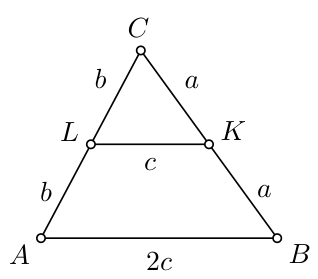

# 10. klase · Tests A · 2. daļa

Vārds, uzvārds: \_\_\_\_\_\_\_\_\_\_\_\_\_\_\_\_\_\_\_\_\_\_\_\_\_\_\_\_\_\_\_\_\_\_ Klase: \_\_\_\_\_\_ Rezultāts: \_\_\_\_\_ / 17 p.

**Laiks — 40 minūtes. Vērtē tikai to, kas ierakstīts rindiņā "Atbilde"; aprēķinus vari veikt lapas brīvajā vietā vai uz melnraksta.** Kalkulatoru nelieto; par nepareizu atbildi punktus neatņem; garumus un laukumus raksti precīzi (piem., $3\sqrt{2}$, nevis $4{,}24$).

<!-- SAGATAVE. Zem katra uzdevuma numura slīprakstā ir norāde, kāds uzdevums šeit ievietojams; pirms drukāšanas norādes dzēst.
     Priekšzināšanas: tikai 1.-9. klases kurss (10. klases temati nav mācīti).
     Struktūra: 11.-14. uzd. — skolas temats T3 (9.1. Līdzīgi trijstūri; priekšzināšanas — Pitagora teorēma 8.8., laukumi 8.4.); 15. un 20. uzd. — olimpiāžu temats O2 (K2. Dirihlē princips skaitļu teorijā un ģeometrijā; 9.-10. kl. līmenis);
     16.-19. uzd. — skolas temats T4 (8.2. Pakāpe ar veselu kāpinātāju un skaitļa sadalījums pirmreizinātājos). Katrā skolas tematā: 2 uzdevumi SOLO 1-2, 2 uzdevumi SOLO 3 (viens ar citu tematu).
     Punkti: SOLO 1-2 → 1 p., SOLO 3 → 2 p., olimpiāžu uzdevumi → 2 p. un 3 p. Kopā 17 p. Numerācija turpinās (11.-20.). -->

<!-- ŠIS FAILS ir uzdevumu komplekts kopā ar analīzi (metadati <small>, atbildes un pilni atrisinājumi).
     Skolēniem izdalāmajā variantā jāatstāj tikai uzdevumu teksti, zīmējumi un tukšās rindiņas "Atbilde". -->

## 11. uzdevums (1 p.)

<!-- *Šeit ievietot uzdevumu par tematu **līdzīgi trijstūri, Talesa teorēma** (9.1.; Ģ2), SOLO 1–2: trijstūrī novilkta taisne paralēli malai (vai divas krustojošas taisnes starp paralēlēm), doti trīs nogriežņi, jāatrod ceturtais. Viena proporcija. Zīmējums ar piezīmi "nav mērogā". Atbilde — skaitlis.* -->

Trijstūrī $ABC$ novilkta viduslīnija $KL$. Četrstūra $ABKL$ perimetrs ir $38$ cm, un trijstūra $ABC$ perimetrs ir $48$ cm. Atrodi malas $AB$ garumu. (Zīmējums nav mērogā.)

<small>

* source:EE.PK.2014TEST.9.7
* answer:14 cm
* questionType:ShortAnswer

</small>

**Atbilde:** $14$ cm

### Atrisinājums

Pieņemsim, ka $|AB| = 2c$, $|BC| = 2a$ un $|AC| = 2b$ (sk. zīmējumu). Viduslīnija ir paralēla malai $AB$ un divreiz īsāka par to (trijstūris $CLK$ ir līdzīgs trijstūrim $CAB$ ar koeficientu $\frac12$), tātad $|KL|=c$. No dotajiem perimetriem $2c + a + c + b = 38$ cm un $2(a + b + c) = 48$ cm. Tā kā $a + b + c = 48$ cm $: 2 = 24$ cm, tad $|AB| = 2c = 38$ cm $- 24$ cm $= 14$ cm.

## 12. uzdevums (1 p.)

<!-- *Šeit ievietot uzdevumu par tematu **līdzības koeficients, perimetru un laukumu attiecība** (9.1.; Ģ5), SOLO 2: divi līdzīgi trijstūri (vai trijstūris un tā daļa, ko nogriež viduslīnija), dots viens laukums vai perimetrs un koeficients, jāatrod otrs; jāzina, ka laukumu attiecība ir $k^2$. Atbilde — skaitlis.* -->

Zīmējumā ir divu riņķu ar kopīgu centru sektori, kuru centra leņķu atbilstošās malas sakrīt. Riņķu rādiusi atšķiras $2$ reizes. Cik procentu no lielākā sektora laukuma atrodas ārpus mazākā sektora?

<small>

* source:EE.PK.2020TEST.9.7
* answer:75%
* questionType:ShortAnswer

</small>

**Atbilde:** $75\%$

### Atrisinājums

Sektori ir līdzīgi ar koeficientu $2$, tāpēc to laukumi atšķiras $2^2=4$ reizes. Tātad lielākā sektora daļai, kas atrodas ārpus mazākā, ir $3$ reizes lielāks laukums nekā mazākajam sektoram. Kopumā lielākā sektora daļa, kas atrodas ārpus mazākā, veido $\frac{3}{4}$ jeb $75\%$ no lielākā sektora.

*Piezīme skolotājam.* Tipiskā kļūda — $50\%$ (laukumu attiecību uzskata par vienādu ar līdzības koeficientu).

## 13. uzdevums (2 p.)

<!-- *Šeit ievietot uzdevumu par tematu **līdzīgi trijstūri, kas jāsaskata** (9.1.; Ģ2), SOLO 3: konfigurācija, kurā līdzīgie trijstūri nav nosaukti — taisnleņķa trijstūra augstums uz hipotenūzas, trapeces diagonāļu krustpunkts, kvadrāta malu viduspunkti un nogriežņu krustpunkti; jāatrod nogriežņa garums vai nogriežņu attiecība. Atbilde — skaitlis vai attiecība $a:b$. Līdzīgi: LV.NOL.2021.10.3, LV.NOL.2025.10.3.* -->

Četrstūrī $ABCD$ ir $|AB| = 18$ cm un $|BC| = 8$ cm. Leņķi $ADB$ un $BCD$ ir taisni leņķi, un leņķi $DAB$ un $BDC$ ir vienāda lieluma. Atrodi diagonāles $DB$ garumu. (Zīmējums nav mērogā.)

<small>

* source:EE.PK.2015TEST.9.7
* answer:12 cm
* questionType:ShortAnswer

</small>

**Atbilde:** $12$ cm

### Atrisinājums

Saskaņā ar uzdevuma nosacījumiem trijstūri $ABD$ un $DBC$ ir līdzīgi pēc pazīmes LL ($\angle ADB=\angle DCB=90^\circ$, $\angle DAB=\angle CDB$). Tātad $\frac{|BC|}{|BD|} = \frac{|BD|}{|BA|}$, no kurienes $|BD|^2 = |BA| \cdot |BC| = 18\text{ cm} \cdot 8\text{ cm}=144\text{ cm}^2$. No šejienes $|BD| = 12$ cm.

## 14. uzdevums (2 p.)

<!-- *Šeit ievietot uzdevumu par tematu **līdzīgi trijstūri** (9.1.) **kombinācijā ar Pitagora teorēmu un laukumiem** (8.8., 8.4.; Ģ5 "kopīgs augstums"), SOLO 3: trijstūrī ar dotām malām (piem., 13, 14, 15 vai 7, 12, 13) novilkts augstums vai mediāna, un jāatrod laukums, augstuma garums vai attālums no punkta līdz taisnei; vai dots trijstūris ar punktiem uz malām noteiktās attiecībās, jāatrod daļas laukums. Atbilde — skaitlis (var būt ar kvadrātsakni). Līdzīgi: LV.NOL.2023.10.3, LV.NOL.2024.10.3.* -->

Uz taisnleņķa trijstūra $ABC$ katetes $AC$ atzīmēts punkts $M$ tā, ka tas sadala šo kateti divās vienādās daļās. Uz hipotenūzas $BC$ atzīmēts punkts $D$ tā, ka nogrieznis $MD$ ir perpendikulārs hipotenūzai. Atrodi trijstūra $ABC$ laukumu, ja $|MD| = 3{,}5$ cm un $|BC| = 10$ cm. (Zīmējums nav mērogā.)

<small>

* source:EE.PK.2008TEST.9.9
* answer:$35\ \text{cm}^2$
* questionType:ShortAnswer

</small>

**Atbilde:** $35$ cm$^2$

### Atrisinājums

Trijstūra $BCM$ laukums ir $\frac{1}{2} \cdot 10 \cdot 3{,}5\ \text{cm}^2 = \frac{35}{2}\ \text{cm}^2$ ($MD$ ir tā augstums pret malu $BC$). Trijstūra $ABC$ laukums ir divreiz lielāks par trijstūra $BCM$ laukumu, jo tā pamats $AC$ ir divreiz garāks nekā $MC$, bet augstums $AB$ pret šiem pamatiem ir kopīgs. Tātad meklējamais laukums ir $35\ \text{cm}^2$.

**Cits atrisinājums** (ar līdzību). Trijstūri $CDM$ un $CAB$ ir līdzīgi (taisns leņķis un kopīgs leņķis $C$), tāpēc $\frac{|MD|}{|AB|}=\frac{|MC|}{|BC|}$, t.i., $|AB|\cdot|AC| = 2\,|AB|\cdot|MC| = 2\,|MD|\cdot|BC|=2\cdot 3{,}5\cdot 10=70$, un laukums ir $\frac12\cdot 70=35$ cm$^2$.

## 15. uzdevums (2 p.)

<!-- *Šeit ievietot uzdevumu par olimpiāžu tematu **Dirihlē princips** (K2, 7.–8./9.–10. kl.), SOLO 2–3: jāatrod **mazākais** skaitļu (vai punktu, cilvēku) skaits, kas jāizvēlas, lai noteikti būtu divi ar vienādu atlikumu dalot ar $k$, vienādu ciparu summu vai kuru starpība dalās ar $k$; "kastes" ir jāsaskata pašam (atlikumu klases, ciparu summas vērtības). Atbilde — skaitlis. Līdzīgi: LV.AMO.2024.10.2 (pārveidot par "cik skaitļu jāņem").* -->

Džonam negribas savas zeķes sašķirot pa krāsām un salikt pāros, tāpēc viņš kastē ir sametis $5$ pārus melnu, $10$ pārus brūnu un $15$ pārus pelēku zeķu (visas zeķes ir atsevišķi). Rīt Džons dodas nedēļu garā skolas ekskursijā. Kāds ir mazākais zeķu skaits, kas viņam jāizņem no kastes (neskatoties), lai noteikti būtu vismaz $7$ vienas krāsas zeķu pāri?

<small>

* adaptedFrom:UKMT.EGK.2006.19
* sourceNote:2006 European Grey Kangaroo, 19. uzd. (UKMT Yearbook 2005-06); tulkots, izvēles varianti noņemti
* answer:37
* questionType:ShortAnswer

</small>

**Atbilde:** $37$

### Atrisinājums

Lai būtu $7$ vienas krāsas pāri, vajag $14$ vienas krāsas zeķes. Melno zeķu kastē ir tikai $10$, tāpēc septiņus pārus var iegūt tikai no brūnajām ($20$ zeķes) vai pelēkajām ($30$ zeķes) zeķēm.

Ja Džons nejauši izņem visas $10$ melnās zeķes, $13$ brūnās un $13$ pelēkās zeķes, tad no visām $36$ zeķēm viņam vēl nav $7$ vienas krāsas pāru. Tātad ar $36$ zeķēm nepietiek.

Savukārt jebkurā $37$ zeķu izvēlē ir vismaz $37-10=27$ brūnas vai pelēkas zeķes, tāpēc (Dirihlē princips: $27$ zeķes divās „kastēs”) vismaz $14$ no tām ir vienā krāsā — tas ir $7$ vienas krāsas pāri. Tātad mazākais skaits ir $37$.

*Piezīme skolotājam.* Tipiskās kļūdas: $41$ (skaita $3\cdot 13+2$, aizmirstot, ka melno zeķu ir tikai $10$) vai $40$. Oriģinālā bija izvēles varianti A 21, B 31, C 37, D 40, E 41.

<!-- ===== Lapas otrā puse: 16.–20. uzdevums ===== -->

## 16. uzdevums (1 p.)

<!-- *Šeit ievietot uzdevumu par tematu **pakāpe ar veselu kāpinātāju** (8.2.; A1), SOLO 1–2: aprēķināt vai vienkāršot izteiksmi ar pakāpēm, t.sk. negatīvu kāpinātāju (piem., $\frac{8^{5}\cdot 4^{-3}}{2^{7}}$), vai salīdzināt divas pakāpes ar dažādām bāzēm ($2^{100}$ un $3^{60}$) — atbildē uzrakstīt lielāko. Atbilde — skaitlis vai pakāpe.* -->

Atrodi naturālu skaitli $n$ tā, lai būtu spēkā vienādība $\frac{2^{2011} + 2^{2010} + 2^{2009}}{28} = 2^n$.

<small>

* source:EE.PK.2011TEST.9.1
* answer:2007
* questionType:ShortAnswer

</small>

**Atbilde:** $2007$

### Atrisinājums

Iznesot skaitītājā pirms iekavām kopīgo reizinātāju $2^{2009}$, iegūstam
$$
\frac{2^{2011} + 2^{2010} + 2^{2009}}{28} = \frac{2^{2009} \cdot (4 + 2 + 1)}{4 \cdot 7} = \frac{2^{2009}}{4} = 2^{2007}.
$$

## 17. uzdevums (1 p.)

<!-- *Šeit ievietot uzdevumu par tematu **sadalījums pirmreizinātājos un dalītāju skaits** (8.2., 5.2.; S1, S2), SOLO 2: sadalīt doto skaitli (piem., 360 vai 2025) pirmreizinātājos un atbildēt uz jautājumu, cik tam ir dalītāju, cik no tiem ir pāra, vai ar kādu lielāko $2^k$ dalās $20!$ vai $1\cdot 2\cdots 30$. Atbilde — skaitlis.* -->

Cik skaitlim $9^9$ ir tādu naturālu dalītāju, no kuriem katrs ir kāda vesela skaitļa kvadrāts?

<small>

* source:EE.PK.2020TEST.9.4
* answer:10
* questionType:ShortAnswer

</small>

**Atbilde:** $10$

### Atrisinājums

Tā kā $9^9 = (3^2)^9 = 3^{18}$ un $3$ ir pirmskaitlis, tad visi skaitļa $9^9$ dalītāji ir formā $3^k$, kur $0 \leq k \leq 18$. Veselu skaitļu kvadrāti no tiem ir tie, kuriem $k$ ir pāra skaitlis jeb viens no skaitļiem $0, 2, 4, 6, 8, 10, 12, 14, 16, 18$. Tātad skaitlim $9^9$ ir $10$ dalītāji, kas ir veselu skaitļu kvadrāti.

*Piezīme skolotājam.* Tipiskās kļūdas: $9$ (aizmirst dalītāju $1=3^0$) vai $19$ (visu dalītāju skaits).

## 18. uzdevums (2 p.)

<!-- *Šeit ievietot uzdevumu par tematu **dalītāju skaita formula "atpakaļgaitā"** (8.2.; S2, 9.–10. kl.), SOLO 3: atrast mazāko naturālo skaitli ar tieši $N$ dalītājiem (piem., 18 vai 20), kas papildus dalās ar dotu pirmskaitli; jāpārlasa visi $N$ sadalījumi reizinātājos un jāsalīdzina kandidāti. Atbilde — skaitlis. Līdzīgi: LV.NOL.2025.10.2.* -->

Kāds ir vismazākais naturālais skaitlis, kuram ir tieši $20$ dažādi naturāli dalītāji un kas dalās ar $7$?

<small>

* adaptedFrom:LV.NOL.2025.10.2
* answer:336
* questionType:FindOptimal

</small>

**Atbilde:** $336$

### Atrisinājums

Ja skaitlis $n$ sadalās pirmreizinātājos kā $n=p_{1}^{k_{1}} p_{2}^{k_{2}} \ldots p_{m}^{k_{m}}$, tad tā dalītāju skaits ir $d(n)=\left(k_{1}+1\right) \cdot\left(k_{2}+1\right) \cdot \ldots \cdot\left(k_{m}+1\right)$. Ievērojam, ka $20=20=10\cdot 2=5\cdot 4=5\cdot 2\cdot 2$. No tā izriet, ka skaitli, kuram ir tieši $20$ dalītāji, var uzrakstīt vienā no formām:

$$p_{1}^{19}, \quad p_{1}^{9} \cdot p_{2}, \quad p_{1}^{4} \cdot p_{2}^{3}, \quad p_{1}^{4} \cdot p_{2} \cdot p_{3},$$

kur $p_1, p_2, p_3$ ir dažādi pirmskaitļi. Skaitlim jādalās ar $7$, tāpēc kādam no pirmreizinātājiem jābūt $7$, un, tā kā meklējam mazāko skaitli, pārējiem pirmreizinātājiem jābūt iespējami maziem, pie tam lielākajās pakāpēs jāliek mazākie pirmskaitļi. Apskatām visus gadījumus:

- $7^{19}$ — ļoti liels skaitlis;
- $2^{9} \cdot 7=512 \cdot 7=3584$;
- $2^{4} \cdot 7^{3}=16\cdot 343=5488$ (vai vēl lielāks $7^4\cdot 2^3$);
- $2^{4} \cdot 3 \cdot 7=16\cdot 21=336$.

Tātad vismazākais naturālais skaitlis, kuram ir tieši $20$ dažādi naturāli dalītāji un kas dalās ar $7$, ir $336$.

*Pielāgojums.* Oriģinālajā uzdevumā (LV.NOL.2025.10.2) bija prasīts skaitlis ar tieši $18$ dalītājiem, kas dalās ar $7$ (atbilde $252$); dalītāju skaits nomainīts uz $20$. Tipiskā kļūda — $240=2^4\cdot3\cdot5$ (mazākais skaitlis ar $20$ dalītājiem, bet tas nedalās ar $7$).

## 19. uzdevums (2 p.)

<!-- *Šeit ievietot uzdevumu par tematu **pakāpes** (8.2.) **kombinācijā ar atlikumiem un pakāpju periodiskumu vai pilnajiem kvadrātiem** (S4 ★ / S6 ★, 9.–10. kl.), SOLO 3: atrast pakāpes $7^{2026}$ pēdējos divus ciparus vai atlikumu, dalot ar 9 (periodiskums pēc moduļa), vai noteikt, cik naturālu $n$ dotā intervālā ir tādi, ka izteiksme ar pakāpi ir pilns kvadrāts (novērtējums $n^2<N<(n+1)^2$). Atbilde — skaitlis. Līdzīgi: LV.AMO.2019.10.4, LV.NOL.2022.10.4.* -->

Atrodiet skaitļa $113^{113}-19^{19}$ pēdējo ciparu.

<small>

* source:LV.NOL.2009.8.3
* answer:4
* topic:PeriodicRemainders
* topic:CongruenceClasses
* _hasSolutionConcept: LastDigit, DigitRepresentation, PeriodicSequence
* _readingDifficulty: low
* _domain: NT
* _hasReasoningMethod: LastDigitAnalysis
* _hasReasoningMistake: CarelessModularComputation, IncompleteResidueCases
* _mistakesFit: medium

</small>

**Atbilde:** $4$

### Atrisinājums

Ievērosim, ka $113^{113}=\left(113^{4}\right)^{28} \cdot 113$ un $113^{4}$ beidzas ar ciparu $1$ ($3^{4}=81$). Tāpēc $113^{113}$ beidzas ar ciparu $3$. Līdzīgi $19^{19}=\left(19^{2}\right)^{9} \cdot 19=(\ldots 1)^{9} \cdot 19$ beidzas ar ciparu $9$. Tāpēc $113^{113}-19^{19}$ (pozitīvs skaitlis) beidzas ar ciparu $13-9=4$.

*Piezīme.* Skaitļa $113$ pakāpju pēdējie cipari mainās periodiski tā: $(3,9,7,1)$. Savukārt skaitļa $19$ pakāpju pēdējie cipari mainās tā: $(9,1)$. Ja to ievēro, tad var atrast $113^{113}$ un $19^{19}$ pēdējos ciparus.

*Piezīme skolotājam.* Tipiskā kļūda — atņemt pēdējos ciparus bez „aizņemšanās” un iegūt $3-9=-6$, t.i., atbildi $6$.

## 20. uzdevums (3 p.)

<!-- *Šeit ievietot uzdevumu par olimpiāžu tematu **Dirihlē princips ar novērtējumu un konstrukciju** (K2 + M5, 9.–10. kl.), SOLO 3–4: atrast **lielāko** skaitļu skaitu, ko var izvēlēties no $1, 2, \ldots, 100$ tā, lai nekādu divu summa (vai starpība) nedalītos ar 5 (vai nekādi divi neatšķirtos par 7), vai lielāko punktu skaitu kvadrātā, lai attālums starp jebkuriem diviem būtu lielāks par doto; pareizai atbildei nepieciešams gan konstrukcija, gan Dirihlē novērtējums, kaut arī tiek prasīts tikai skaitlis. Šis ir daļas grūtākais uzdevums; skaitļus izvēlēties tā, lai "naivā" atbilde (piem., puse no visiem) būtu nepareiza. Atbilde — skaitlis. Līdzīgi: LV.AMO.2023.10.4, LV.NOL.2020.10.4, LV.NOL.2021.10.5.* -->

Apskatām naturālos skaitļus no $1$ līdz $100$ ieskaitot. Kādu lielāko daudzumu no tiem var izvēlēties tā, lai nekādi divi izvēlētie skaitļi nedalītos viens ar otru un katriem diviem izvēlētajiem skaitļiem lielākais kopīgais dalītājs būtu lielāks par $1$?

<small>

* source:LV.AMO.2006.9.5
* answer:25
* concepts:divisibility,gcd
* questionType:FindOptimal
* domain:NT
* _hasSolutionConcept: DivisibilityRelation, GCD, ParityInvariant, OptimumProofStructure
* _readingDifficulty: high
* _domain: NT,Comb
* _hasReasoningMethod: BoundingArgument, PigeonholeInNT, NumberConstruction, ProofByContradiction
* _hasReasoningMistake: MissingBoundOrExample, ExampleInsteadOfProof
* _mistakesFit: medium

</small>

**Atbilde:** $25$

### Atrisinājums

**Piemērs.** Apskatīsim skaitļus $52;\ 54;\ 56;\ \ldots;\ 96;\ 98;\ 100$ (tie ir $25$). Tie visi dalās ar $2$, tātad jebkuru divu lielākais kopīgais dalītājs ir vismaz $2$, un neviens nedalās ar otru, jo pat lielākā skaitļa dalījums ar mazāko ir $\frac{100}{52}<2$, tātad nekādu divu apskatāmo skaitļu dalījums nav naturāls skaitlis.

**Novērtējums.** Pierādīsim, ka vairāk par $25$ skaitļiem, kas apmierina uzdevuma prasības, izvēlēties nevar. Pieņemsim, ka kopa $M$ ir kopa ar maksimālo skaitļu skaitu tajā. Ja eksistē tāds $x \in M$, ka $x \leqslant 50$, tad $2x \notin M$ (jo $x$ dala $2x$); mazāko no šādiem $x$ var aizstāt ar $2x$. (Viegli pārbaudīt, ka kopai $M$ izvirzāmās prasības saglabājas.) Ar galīgu skaitu gājienu $M$ varam pārveidot par $M_{1}$, kurā visi skaitļi ir lielāki par $50$, bet elementu ir tikpat, cik kopā $M$. Ja $M_{1}$ būtu **vairāk nekā** $\mathbf{25}$ elementi, tad pēc Dirihlē principa vismaz divi no tiem atrastos vienā no $25$ pāriem $(51; 52),\ (53; 54),\ (55; 56),\ \ldots,\ (97; 98),\ (99; 100)$. Bet tā ir pretruna, jo diviem skaitļiem, kas atšķiras viens no otra par $1$, lielākais kopīgais dalītājs ir $1$.

*Piezīme skolotājam.* „Naivā” atbilde $50$ (piemēram, skaitļi $51, \ldots, 100$, no kuriem neviens nedalās ar citu) nav pareiza, jo blakus esošiem skaitļiem LKD ir $1$; tāpat nepareiza ir atbilde $50$ visiem pāra skaitļiem (tie dalās cits ar citu).

*Vieta aprēķiniem un zīmējumiem:*

&nbsp;

&nbsp;

&nbsp;

&nbsp;

---

<!-- Skolotājam. Šo sadaļu pirms drukāšanas skolēniem dzēst vai pārcelt uz atsevišķu failu. -->

## Atbilžu atslēga (tikai skolotājam)

| Nr. | Temats | SOLO | P. | Atbilde (A var.) | Pieņemamās ekvivalentās formas |
|---|---|---|---|---|---|
| 11 | T3 9.1. | 1–2 | 1 | 14 (cm) | |
| 12 | T3 9.1. | 2 | 1 | 75 (%) | 3/4; 0,75 |
| 13 | T3 9.1. | 3 | 2 | 12 (cm) | attiecība arī kā daļa |
| 14 | T3 9.1. + 8.8./8.4. | 3 | 2 | 35 (cm²) | |
| 15 | O2 K2 | 2–3 | 2 | 37 | |
| 16 | T4 8.2. | 1–2 | 1 | 2007 | |
| 17 | T4 8.2. | 2 | 1 | 10 | |
| 18 | T4 8.2. | 3 | 2 | 336 | |
| 19 | T4 8.2. + S4/S6 | 3 | 2 | 4 | |
| 20 | O2 K2 + M5 | 3–4 | 3 | 25 | |

Jomu profils: T3 (11.–14. uzd.) — 6 p.; T4 (16.–19. uzd.) — 6 p.; O2 (15., 20. uzd.) — 5 p. Kopā 17 p. Abas daļas kopā — 34 p.

Avoti: EE.PK (Igaunijas īso atbilžu testi, latviešu tulkojums `math/sources/EE_PK/`), UKMT (2006 European Grey Kangaroo, `math/sources/UKMT/Yearbook-2005-06.pdf`, tulkots), LV.NOL, LV.AMO (`math/problembase/`).
