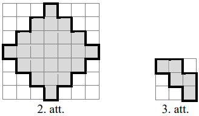
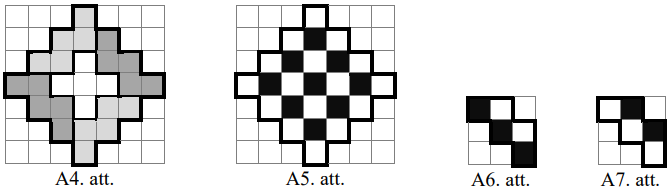
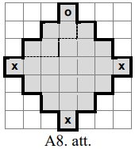
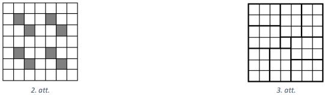

# 7. klase · Tests A · 1. daļa

Vārds, uzvārds: \_\_\_\_\_\_\_\_\_\_\_\_\_\_\_\_\_\_\_\_\_\_\_\_\_\_\_\_\_\_\_\_\_\_ Klase: \_\_\_\_\_\_ Rezultāts: \_\_\_\_\_ / 17 p.

**Laiks — 40 minūtes. Vērtē tikai to, kas ierakstīts rindiņā "Atbilde"; aprēķinus vari veikt lapas brīvajā vietā vai uz melnraksta.** Kalkulatoru nelieto; par nepareizu atbildi punktus neatņem; ja jāatrod *visi* skaitļi, uzraksti visus, atdalot ar komatiem.

<!-- SAGATAVE. Zem katra uzdevuma numura slīprakstā ir norāde, kāds uzdevums šeit ievietojams; pirms drukāšanas norādes dzēst.
     Struktūra: 1.-4. uzd. — skolas temats T1 (5.1. Naturālo skaitļu pieraksts); 5. un 10. uzd. — olimpiāžu temats O1 (Ģ7. Sagriešana un noklāšana rūtiņu lapā);
     6.-9. uzd. — skolas temats T2 (5.2. Skaitļa sadalījums reizinātājos un dalāmība). Katrā skolas tematā: 2 uzdevumi SOLO 1-2, 2 uzdevumi SOLO 3 (viens no tiem ar citu tematu).
     Punkti: SOLO 1-2 → 1 p., SOLO 3 → 2 p., olimpiāžu uzdevumi → 2 p. un 3 p. Kopā 17 p. -->

<!-- ŠIS FAILS ir uzdevumu komplekts kopā ar analīzi (metadati <small>, atbildes un pilni atrisinājumi).
     Skolēniem izdalāmajā variantā jāatstāj tikai uzdevumu teksti, zīmējumi un tukšās rindiņas "Atbilde". -->

## 1. uzdevums (1 p.)

<!-- *Šeit ievietot uzdevumu par tematu **naturālo skaitļu pieraksts** (5.1.; S3), SOLO 1–2: tiešs jautājums par ciparu vērtību pozīcijā vai ciparu summu — piemēram, atrast mazāko naturālo skaitli ar dotu ciparu summu vai lielāko trīsciparu skaitli ar dotu ciparu īpašību. Viens spriedums, bez citu tematu zināšanām. Atbilde — skaitlis.* -->

Trīsciparu skaitļa visi cipari ir dažādi, un vienu cipars ir vienāds ar desmitu un simtu ciparu summu. Atrodi lielāko šādu skaitli.

<small>

* source:EE.PK.2006TEST.7.3
* answer:$819$
* questionType:ShortAnswer

</small>

**Atbilde:** $819$

### Atrisinājums

Ja simtu cipars ir $9$, tad arī vienu cipars ir $9$, jo tas nevar būt lielāks par $9$. Šajā gadījumā skaitlī būtu vienādi cipari. Ja simtu cipars ir $8$, tad desmitu cipars var būt ne vairāk kā $1$. Vienu cipars šajā gadījumā ir $9$, tas nesakrīt ar iepriekšējiem cipariem. Skaitlis ir $819$.

## 2. uzdevums (1 p.)

<!-- *Šeit ievietot uzdevumu par tematu **naturālo skaitļu pieraksts** (5.1.; S3), SOLO 2: sistemātiska skaitīšana ciparu pierakstā — piemēram, cik reižu, rakstot visus skaitļus no 1 līdz 100 (vai lapaspušu numurus grāmatā), tiek uzrakstīts dotais cipars, vai cik ciparu kopā vajadzīgs. Jāapvieno vairāki vienkārši gadījumi (vienciparu, divciparu skaitļi). Atbilde — skaitlis.* -->

Cik starp skaitļiem $100$ un $200$ ir tādu naturālu skaitļu, kuru pierakstā ir cipars $3$ vai cipars $7$?

<small>

* source:EE.PK.2008TEST.7.4
* answer:36
* questionType:ShortAnswer

</small>

**Atbilde:** $36$

### Atrisinājums

Ja trīsciparu skaitlis $\overline{1AB}$ nesatur ne ciparu $3$, ne $7$, tad $A$ vietā der $8$ cipari un $B$ vietā arī $8$ cipari. Tātad šādu skaitļu ir $8 \cdot 8 = 64$. Pārējie skaitļi satur ciparu $3$ vai $7$. Tā kā skaitļu formā $\overline{1AB}$ pavisam ir $100$, tad meklējamo skaitļu ir $100 - 64 = 36$.

*Piezīme skolotājam.* Tipiskā kļūda — saskaitīt atsevišķi skaitļus ar ciparu $3$ ($19$) un ar ciparu $7$ ($19$), iegūstot $38$, un neatņemt divreiz ieskaitītos $137$ un $173$.

## 3. uzdevums (2 p.)

<!-- *Šeit ievietot uzdevumu par tematu **naturālo skaitļu pieraksts** (5.1.; S3), SOLO 3: divciparu vai trīsciparu skaitlis, ar kuru manipulē (apmaina ciparus, pieraksta ciparu galā vai priekšā), un dota sakarība starp sākotnējo un iegūto skaitli; jālieto pieraksts $\overline{ab}=10a+b$ un jāatrod **visi** derīgie skaitļi. Atbilde — saraksts (1–3 skaitļi). Līdzīgi: LV.NOL.2020.7.5, LV.NOL.2025.7.5.* -->

Divciparu naturāla skaitļa abi cipari nav nulles. Ja šim skaitlim samaina vietām ciparus, tad iegūtais skaitlis ir par $75\%$ lielāks nekā sākotnējais. Atrodi visus šādus divciparu skaitļus.

<small>

* adaptedFrom:PL.OMJ.2026TEST.7_8.8
* answer:12, 24, 36, 48
* questionType:FindAll

</small>

**Atbilde:** $12,\ 24,\ 36,\ 48$

### Atrisinājums

Divciparu skaitlis ar desmitu ciparu $a$ un vienu ciparu $b$ ir vienāds ar $10a+b$, bet skaitlis, kas iegūts, samainot vietām tā ciparus, ir $10b+a$. Nosacījumu $10b+a=\frac{175}{100}\cdot(10a+b)$ var ekvivalenti pārveidot pēc kārtas par

$$
10b+a=\frac74\cdot(10a+b),\qquad 40b+4a=70a+7b,\qquad 33b=66a,\qquad b=2a.
$$

Tā kā $b\leq 9$, tad $a\in\{1,2,3,4\}$, un iegūstam skaitļus $12$, $24$, $36$, $48$. Pārbaude: $21=12+9=12+\frac{75}{100}\cdot12$, $42=24+\frac{75}{100}\cdot 24$, $63=36+\frac{75}{100}\cdot 36$, $84=48+\frac{75}{100}\cdot 48$.

**Piezīme.** Var arī balstīt spriedumu uz novērojumu, ka starpība starp skaitļiem $10b+a$ un $10a+b$ ir $9(b-a)$, tātad dalās ar $9$. Tāpēc $75\%=\frac34$ no meklētā skaitļa dalās ar $9$, t.i., pats skaitlis dalās ar $12$. Divciparu skaitļi, kas dalās ar $12$ un kuru cipari nav nulles, ir $12, 24, 36, 48, 72, 84, 96$; no tiem, samainot ciparus, palielinās tikai $12, 24, 36, 48$, un visi četri der.

*Pielāgojums.* Oriģinālajā uzdevumā (PL.OMJ.2026TEST.7_8.8) bija jānosaka „jā/nē”, vai eksistē skaitlis, kas palielinās par $20\%$, $25\%$ vai $75\%$; šeit prasīts atrast visus skaitļus, kas palielinās par $75\%$.

## 4. uzdevums (2 p.)

<!-- *Šeit ievietot uzdevumu par tematu **naturālo skaitļu pieraksts** (5.1.; S3) **kombinācijā ar dalāmību** (5.2.), SOLO 3: atrast lielāko vai mazāko skaitli ar dotu ciparu skaitu un ciparu summu, kurš dalās ar 9, 18 vai 12 (dalāmības pazīme ierobežo ciparu summu, pēdējie cipari — dalāmību ar 2 vai 4). Atbilde — skaitlis. Līdzīgi: LV.NOL.2024.7.2, LV.AMO.2023.7.2.* -->

Atrodi mazāko piecciparu skaitli formā $\ast 3 \ast 4 \ast$, kura cipari visi ir dažādi un kurš dalās ar skaitļiem $3$ un $4$. (Katra zvaigznīte jāaizstāj ar vienu ciparu.)

<small>

* source:EE.PK.2021TEST.7.4
* answer:13248
* questionType:ShortAnswer

</small>

**Atbilde:** $13248$

### Atrisinājums

Skaitlis dalās ar $4$ tieši tad, ja no tā pēdējiem diviem cipariem veidotais skaitlis dalās ar $4$. Tātad vienu cipars var būt tikai $0$ vai $8$ (arī $4$ der dalāmībai ar $4$, bet cipari nedrīkst atkārtoties).

Mazākais iespējamais desmittūkstošu cipars ir $1$. Mazākais iespējamais simtu cipars ir $0$, taču tādā gadījumā vienu cipars varētu būt tikai $8$, un skaitļa $13048$ ciparu summa $16$ nedalās ar $3$. Simtu cipars nevar būt $1$, ja desmittūkstošu cipars ir $1$. Pēc lieluma nākamais simtu cipars ir $2$. Izmēģinot atrodam, ka ar vienu ciparu $0$ skaitlis $13240$ nedalās ar $3$ (ciparu summa $10$), bet ar ciparu $8$ skaitlis $13248$ dalās ar $3$ (ciparu summa $18$).

## 5. uzdevums (2 p.)

<!-- *Šeit ievietot uzdevumu par olimpiāžu tematu **figūru sagriešana un salikšana rūtiņu lapā** (Ģ7, 5.–6. kl. līmenis), SOLO 2–3: dota neliela rūtiņu figūra (10–20 rūtiņas) un figūriņa (piem., $1\times 3$ taisnstūris vai "stūrītis"); jānosaka **lielākais** figūriņu skaits, ko var izgriezt, — rūtiņu skaita novērtējums plus konstrukcija, ko skolēns pārbauda zīmējot. Zīmējums drukājams uz rūtiņu tīkla, lai varētu skicēt. Atbilde — skaitlis.* -->

Rūtiņu lapā uzzīmēta figūra (skat. 2. att.). Kāds ir lielākais skaits 3. att. doto figūru, ko var izgriezt no 2. att. figūras? Griezuma līnijām jāiet pa rūtiņu malām; figūras drīkst pagriezt un apgriezt spoguļattēlā.

<small>

* source:LV.NOL.2015.6.4
* answer:4
* questionType:FindOptimal
* domain:Geom
* subdomain:DOM_GridCut
* _hasSolutionConcept: Tiling, ChessboardColoring, Invariant, LatticeGrid, OptimumProofStructure
* _readingDifficulty: medium
* _hasReasoningMethod: ColoringInvariant, CaseAnalysis
* _hasReasoningMistake: UpperBoundWithoutExample, ProofByExampleForUniversalClaim, FromSpecialToGeneral
* _mistakesFit: high

</small>

**Atbilde:** $4$

### Atrisinājums

No dotās figūras var izgriezt četras 3. att. figūras (skat. A4. att.).

Pierādīsim, ka vairāk figūru izgriezt nevar. Izkrāsojam 2. att. doto figūru kā šaha galdiņu (skat. A5. att.), tā satur $9$ melnas rūtiņas. Ir divi dažādi varianti, cik melnās rūtiņas var saturēt 3. att. figūra (skat. A6. att. un A7. att.). Abos gadījumos tā satur vismaz $2$ melnas rūtiņas. Tātad var izgriezt ne vairāk kā $4$ figūras, jo piecas 3. att. figūras kopā satur vismaz $5 \cdot 2=10$ melnās rūtiņas.

### Cits atrisinājums

Tā kā dotā figūra sastāv no $25$ rūtiņām un 3. att. figūra satur $5$ rūtiņas, tad nevarētu izgriezt vairāk kā $25:5=5$ figūras; ja figūras būtu $5$, tās noklātu visu doto figūru.

Ar „$o$” atzīmēto rūtiņu var saturēt tikai figūra, kāda redzama A8. att. (simetrisko gadījumu neapskatām, jo tas ir analoģisks tālāk aprakstītajam). Pēc tam figūras, kas satur ar „$x$” apzīmētās rūtiņas, var izgriezt vienā vienīgā veidā (kā parādīts A4. att.). No atlikušās daļas nevar izgriezt 3. att. doto figūru. Tātad visu figūru noklāt nevar, un lielākais skaits 3. att. figūru, ko var izgriezt no dotās figūras, ir $4$.

*Piezīme skolotājam.* Rūtiņu skaita novērtējums dod tikai $5$; skolēns, kurš neveic konstrukciju un nepārbauda, vai visu figūru var noklāt, visticamāk atbildēs $5$.

<!-- ===== Lapas otrā puse: 6.–10. uzdevums ===== -->

## 6. uzdevums (1 p.)

<!-- *Šeit ievietot uzdevumu par tematu **skaitļa sadalījums reizinātājos** (5.2.; S1, S2), SOLO 1–2: sadalīt doto skaitli pirmreizinātājos un no tā atbildēt tiešu jautājumu — piemēram, cik dotajam skaitlim ir dažādu dalītāju, vai kāds ir MKD/LKD diviem skaitļiem sadzīves situācijā ("pēc cik minūtēm abi autobusi atkal izbrauks reizē"). Atbilde — skaitlis.* -->

Atrodi skaitļa $2016$ lielāko nepāra dalītāju.

<small>

* source:EE.PK.2016TEST.7.2
* answer:$63$
* questionType:ShortAnswer

</small>

**Atbilde:** $63$

### Atrisinājums

Izsakām skaitli $2016$ kā pirmreizinātāju reizinājumu: $2016 = 2^5 \cdot 3^2 \cdot 7$. Nepāra dalītāji ir tie dalītāji, kuru sadalījumā neietilpst reizinātājs $2$, tātad lielākais nepāra dalītājs ir $3^2 \cdot 7 = 63$.

## 7. uzdevums (1 p.)

<!-- *Šeit ievietot uzdevumu par tematu **dalāmības pazīmes** (5.2.; S1), SOLO 2: skaitļa pierakstā ir viens vai divi nezināmi cipari, jāatrod visas to vērtības, lai skaitlis dalītos ar 12, 15, 36 vai 45 (jāapvieno divas pazīmes vienlaikus). Atbilde — saraksts ar cipariem vai skaitļiem.* -->

Cik pavisam ir tādu ciparu pāru $(x, y)$, kuriem sešciparu skaitlis $\overline{20x25y}$ dalās gan ar skaitli $3$, gan ar skaitli $5$?

<small>

* source:EE.PK.2025TEST.7.4
* answer:7
* questionType:ShortAnswer

</small>

**Atbilde:** $7$

### Atrisinājums

Cipars $y$ var būt vai nu $0$, vai $5$, lai skaitlis dalītos ar $5$. Skaitļa ciparu summa ir $9+x+y$, tātad skaitlis dalās ar $3$ tieši tad, ja $x+y$ dalās ar $3$. Ja $y = 0$, tad $x$ var būt $0$, $3$, $6$ vai $9$. Ja $y = 5$, tad analoģiski $x$ var būt $1$, $4$ vai $7$. Kopā iegūstam $4 + 3$ jeb $7$ iespējas (skaitļi $200250$, $203250$, $206250$, $209250$, $201255$, $204255$, $207255$ — tie visi dalās ar $15$).

## 8. uzdevums (2 p.)

<!-- *Šeit ievietot uzdevumu par tematu **skaitļa sadalījums reizinātājos** (5.2.; S2), SOLO 3: dots reizinājums, jāatrod **visi** veidi, kā to izteikt kā vairāku dažādu naturālu skaitļu reizinājumu ar papildu nosacījumu (piem., četri dažādi reizinātāji), — nepieciešams sadalījums pirmreizinātājos un pilna sistemātiska pārlase. Atbilde — saraksts (skaitļu četrinieki vai to skaits). Līdzīgi: LV.NOL.2025.7.2.* -->

Pieņemsim, ka $a$, $b$, $c$, $d$ un $e$ ir tādi dažādi naturāli skaitļi, ka ir patiesa vienādība $a \cdot b \cdot c \cdot d \cdot e = 2025$. Atrodi summu $a + b + c + d + e$.

<small>

* source:EE.PK.2025TEST.7.2
* answer:33
* questionType:ShortAnswer

</small>

**Atbilde:** $33$

### Atrisinājums

Sadalot pirmreizinātājos, iegūstam $2025 = 3 \cdot 3 \cdot 3 \cdot 3 \cdot 5 \cdot 5$. Šie $6$ pirmreizinātāji jāsadala starp skaitļiem $a$, $b$, $c$, $d$, $e$ tā, lai visi $5$ skaitļi būtu dažādi. Acīmredzot kādā no šiem skaitļiem jānonāk vismaz $2$ pirmreizinātājiem. Aplūkosim dažādus gadījumus.

* Ja kādā skaitlī nonāktu $3$ vai vairāk pirmreizinātāju, tad atlikušie ne vairāk kā $3$ pirmreizinātāji jāsadala starp pārējiem $4$ skaitļiem, kas nozīmē, ka vismaz viens skaitlis paliktu bez neviena pirmreizinātāja jeb tam būtu jābūt vienādam ar skaitli $1$. Tā kā skaitļiem jābūt dažādiem, vairāki skaitļi $1$ nevar būt. Tātad katram no pārējiem $3$ skaitļiem jāsatur tieši viens pirmreizinātājs. Taču mums ir izmantojami tikai $2$ dažādi pirmreizinātāji. Pretruna parāda, ka katrs no skaitļiem $a$, $b$, $c$, $d$, $e$ satur ne vairāk kā $2$ pirmreizinātājus.
* Ja skaitļu, kas satur $2$ pirmreizinātājus, būtu $3$, tad pārējie $2$ skaitļi būtu vienādi ar skaitli $1$, kas nav iespējams.
* Ja skaitļu, kas satur $2$ pirmreizinātājus, ir $2$, tad pārējiem $3$ skaitļiem jābūt $1$, $3$ un $5$. Tātad pirmo divu skaitļu izveidošanai izmantojami pirmreizinātāji $3$, $3$, $3$, $5$. Vienīgā iespēja tos salikt pa pāriem tā, lai reizinājumi būtu dažādi, ir $3 \cdot 3$ un $3 \cdot 5$. Tātad $a$, $b$, $c$, $d$, $e$ ir $1$, $3$, $5$, $9$, $15$ kaut kādā secībā, kas dod $a + b + c + d + e = 33$.
* Ja skaitlis, kas satur $2$ pirmreizinātājus, būtu $1$, tad paliktu pāri vismaz divi pirmreizinātāji $3$, tāpēc starp pārējiem skaitļiem skaitlis $3$ atkārtotos. Pretruna parāda, ka arī šis gadījums nav iespējams.

Kopumā $a + b + c + d + e = 33$ ir vienīgā iespēja.

## 9. uzdevums (2 p.)

<!-- *Šeit ievietot uzdevumu par tematu **dalāmība** (5.2.; S1) **kombinācijā ar paritāti vai vienādojuma sastādīšanu** (S4 / A2), SOLO 3: piemēram, no vienādojuma ar veseliem skaitļiem un dotu reizinājumu jāsecina par paritāti un jāatrod, vai un kādi atrisinājumi ir (formulēt kā "atrast visus" vai "cik ir"), vai arī jāsaskaita, cik skaitļu dotā intervālā dalās ar vienu skaitli, bet nedalās ar otru. Atbilde — skaitlis vai saraksts. Līdzīgi: LV.NOL.2019.7.4, LV.NOL.2022.7.2.* -->

Atrodi lielāko iespējamo nepāra skaitļu skaitu starp pieciem naturāliem skaitļiem $a$, $b$, $c$, $d$ un $e$, ja ir spēkā vienādība

$$a \cdot b \cdot c + d \cdot e = 2013.$$

<small>

* source:EE.PK.2013TEST.7.1
* answer:4
* questionType:ShortAnswer

</small>

**Atbilde:** $4$

### Atrisinājums

Tā kā divu reizinājumu summa $2013$ ir nepāra skaitlis, viens reizinājums ir nepāra, bet otrs pāra. Pāra reizinājumā vismaz viens reizinātājs ir pāra skaitlis. Tātad no dotajiem pieciem skaitļiem vismaz vienam jābūt pāra skaitlim, ne vairāk kā četri var būt nepāra. Četri nepāra skaitļi arī ir iespējami, piemēram, $1 \cdot 1 \cdot 1 + 1 \cdot 2012 = 2013$.

## 10. uzdevums (3 p.)

<!-- *Šeit ievietot uzdevumu par olimpiāžu tematu **noklāšana un izgriešana ar novērtējumu** (Ģ7 + M5, 7.–8. kl. līmenis), SOLO 3–4: rūtiņu kvadrātā $5\times 5$ līdz $10\times 10$ jāatrod lielākais izgriežamo figūru skaits vai mazākais iekrāsojamo rūtiņu skaits, lai vairs nevarētu izgriezt doto figūru; pareizai atbildei nepieciešams gan piemērs, gan novērtējums (krāsošanas vai grupēšanas arguments), kaut arī tiek prasīts tikai skaitlis. Šis ir daļas grūtākais uzdevums; formulēt bez "vai var". Atbilde — skaitlis. Līdzīgi: LV.AMO.2024.7.4, LV.NOL.2025.7.1, LV.NOL.2019.7.3.* -->

Kvadrātā ar izmēriem $7 \times 7$ rūtiņas sākotnēji visas rūtiņas ir baltas. Kāds ir mazākais rūtiņu skaits, kas jāiekrāso melnas, lai no dotā kvadrāta nevarētu izgriezt $2 \times 3$ rūtiņu taisnstūri (novietotu gan horizontāli, gan vertikāli), kam visas rūtiņas ir baltas?

<small>

* source:LV.AMO.2018.6.3
* answer:8
* questionType:FindOptimal
* domain:Geom
* subdomain:DOM_GridColoring
* _hasSolutionConcept: Coloring, Tiling, OptimumProofStructure
* _readingDifficulty: medium
* _hasReasoningMethod: ProofByContradiction,PackingDisjointShapes
* _hasReasoningMistake: UpperBoundWithoutExample, ProofByExampleForUniversalClaim, FromSpecialToGeneral
* _mistakesFit: high

</small>

**Atbilde:** $8$

### Atrisinājums

Jāiekrāso $8$ rūtiņas, skat., piemēram, 2. att.: jebkurš $2\times 3$ vai $3\times 2$ rūtiņu taisnstūris kvadrātā satur vismaz vienu melno rūtiņu (melnās rūtiņas ir 2., 3., 5. un 6. rindā, katrā no tām divas, un tās izvietotas ar soli $3$).

Nepietiek iekrāsot mazāk kā $8$ rūtiņas, jo kvadrātā $7 \times 7$ rūtiņas var izvietot astoņus savstarpēji nepārklājošos taisnstūrus ar izmēriem $2 \times 3$ rūtiņas (skat. 3. att.; tie aizņem $48$ no $49$ rūtiņām). Katrā no tiem jābūt vismaz vienai melnai rūtiņai, tātad melno rūtiņu ir vismaz $8$.

*Piezīme skolotājam.* Rūtiņu skaits vien ($49:6<9$) rāda tikai to, ka vairāk par $8$ taisnstūriem kvadrātā neietilpst; to, ka $8$ taisnstūrus tiešām var izvietot (3. att.), un to, ka ar $8$ melnām rūtiņām pietiek (2. att.), skolēnam jāatrod zīmējot.

*Vieta aprēķiniem un zīmējumiem:*

&nbsp;

&nbsp;

&nbsp;

&nbsp;

---

<!-- Skolotājam. Šo sadaļu pirms drukāšanas skolēniem dzēst vai pārcelt uz atsevišķu failu. -->

## Atbilžu atslēga (tikai skolotājam)

| Nr. | Temats | SOLO | P. | Atbilde (A var.) | Pieņemamās ekvivalentās formas |
|---|---|---|---|---|---|
| 1 | T1 5.1. | 1–2 | 1 | 819 | |
| 2 | T1 5.1. | 2 | 1 | 36 | |
| 3 | T1 5.1. | 3 | 2 | 12, 24, 36, 48 | saraksts jebkurā secībā |
| 4 | T1 5.1. + 5.2. | 3 | 2 | 13248 | |
| 5 | O1 Ģ7 | 2–3 | 2 | 4 | |
| 6 | T2 5.2. | 1–2 | 1 | 63 | |
| 7 | T2 5.2. | 2 | 1 | 7 | arī visu 7 skaitļu vai pāru saraksts |
| 8 | T2 5.2. | 3 | 2 | 33 | |
| 9 | T2 5.2. + S4/A2 | 3 | 2 | 4 | |
| 10 | O1 Ģ7 + M5 | 3–4 | 3 | 8 | |

Jomu profils: T1 (1.–4. uzd.) — 6 p.; T2 (6.–9. uzd.) — 6 p.; O1 (5., 10. uzd.) — 5 p. Kopā 17 p.

Avoti: EE.PK (Igaunijas īso atbilžu testi, latviešu tulkojums `math/sources/EE_PK/`), PL.OMJ (`math/sources/PL_OMJ/`, pielāgots), LV.NOL, LV.AMO (`math/problembase/`).
