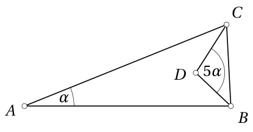
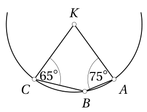

# 8. klase · Tests A · 1. daļa

Vārds, uzvārds: \_\_\_\_\_\_\_\_\_\_\_\_\_\_\_\_\_\_\_\_\_\_\_\_\_\_\_\_\_\_\_\_\_\_ Klase: \_\_\_\_\_\_ Rezultāts: \_\_\_\_\_ / 16 p.

**Laiks — 40 minūtes. Vērtē tikai to, kas ierakstīts rindiņā "Atbilde"; aprēķinus vari veikt lapas brīvajā vietā vai uz melnraksta.** Kalkulatoru nelieto; par nepareizu atbildi punktus neatņem; leņķus raksti grādos, koordinātas — formā $(x;y)$.

<!-- SAGATAVE. Zem katra uzdevuma numura slīprakstā ir norāde, kāds uzdevums šeit ievietojams; pirms drukāšanas norādes dzēst.
     Priekšzināšanas: 1.-7. klases kurss (8. klases temati nav mācīti). Zīmējumi ģeometrijā — obligāti, ar piezīmi "nav mērogā".
     Struktūra: 1.-4. uzd. — skolas temats T1 (7.5., 7.2., 7.6. Trijstūris un leņķi); 5. un 10. uzd. — olimpiāžu temats O1 (K3. Invarianti un procesi; 5.-6./7.-8. kl.);
     6.-9. uzd. — skolas temats T2 (7.4. Lineāra funkcija). Katrā skolas tematā: 2 uzdevumi SOLO 1-2, 2 uzdevumi SOLO 3 (viens ar citu tematu).
     Punkti: SOLO 1-2 → 1 p., SOLO 3 → 2 p., olimpiāžu uzdevumi → 2 p. Kopā 16 p. (4 × 1 p. + 6 × 2 p.) -->

<!-- ŠIS FAILS ir uzdevumu komplekts kopā ar analīzi (metadati <small>, atbildes un pilni atrisinājumi).
     Skolēniem izdalāmajā variantā jāatstāj tikai uzdevumu teksti, zīmējumi un tukšās rindiņas "Atbilde". -->

## 1. uzdevums (1 p.)

<!-- *Šeit ievietot uzdevumu par tematu **leņķi un trijstūra leņķu summa** (7.2., 7.6.; Ģ1), SOLO 1–2: zīmējumā trijstūris ar bisektrisi vai ārējo leņķi, doti divi leņķi, jāatrod trešais vienā vai divos soļos. Atbilde — grādi.* -->

Atrodi trijstūra $ABC$ leņķa $BAC$ lielumu $\alpha$, ja nogriežņi $BD$ un $CD$ ir šī trijstūra leņķu bisektrises un leņķa $BDC$ lielums ir $5\alpha$. (Zīmējums nav mērogā.)

<small>

* source:EE.PK.2012TEST.8.6
* answer:$20^\circ$
* questionType:ShortAnswer

</small>

**Atbilde:** $20^\circ$

### Atrisinājums

Pieņemsim, ka $\beta = \angle DBA = \angle DBC$ un $\gamma = \angle DCA = \angle DCB$ (sk. zīmējumu). No trijstūra $BDC$ atrodam, ka $5\alpha + \beta + \gamma = 180^\circ$, no kurienes $\beta + \gamma = 180^\circ - 5\alpha$. No trijstūra $ABC$ tagad iegūstam, ka $\alpha + 2\beta + 2\gamma = 180^\circ$, no kurienes

$$
\alpha = 180^\circ - 2(\beta + \gamma) = 180^\circ - 2 \cdot (180^\circ - 5\alpha) = 10\alpha - 180^\circ,
$$

t.i., $9\alpha = 180^\circ$ jeb $\alpha = 20^\circ$.

## 2. uzdevums (1 p.)

<!-- *Šeit ievietot uzdevumu par tematu **vienādsānu trijstūris** (7.5.; Ģ1), SOLO 2: divi vienādsānu trijstūri ar kopīgu malu vai virsotni, dots viens leņķis, jāatrod cits, secīgi lietojot pamata leņķu vienādību un leņķu summu. Atbilde — grādi.* -->

Trijstūra $ABC$ malas $AB$ un $AC$ ir vienāda garuma, un leņķa $ACB$ lielums ir $70^\circ$. Uz malas $AC$ ņem punktu $P$ tā, ka $BP$ un $BC$ ir vienāda garuma. Atrodi ar burtu $x$ apzīmētā leņķa lielumu. (Zīmējums nav mērogā.)

<small>

* source:EE.PK.2015TEST.7.6
* answer:30°
* questionType:ShortAnswer

</small>

**Atbilde:** $30^\circ$

### Atrisinājums

Saskaņā ar uzdevuma nosacījumiem $\angle ABC = \angle ACB = 70^\circ$ (vienādsānu trijstūris $ABC$). Tā kā $|BP| = |BC|$, tad $\angle BPC = \angle BCP = 70^\circ$ (vienādsānu trijstūris $BPC$) un $\angle CBP = 180^\circ - 2 \cdot 70^\circ = 40^\circ$. Tātad $x = \angle ABP = 70^\circ - 40^\circ = 30^\circ$.

## 3. uzdevums (2 p.)

<!-- *Šeit ievietot uzdevumu par tematu **leņķu aprēķins ar nezināmo** (7.5., 7.6.; Ģ1), SOLO 3: konfigurācija ar 2–3 vienādsānu trijstūriem, kur leņķi jāizsaka ar vienu nezināmo $x$ un jāsastāda vienādojums (piem., uz malām atlikti punkti tā, ka $AM=AK=AC$); jāatrod konkrēts leņķis. Atbilde — grādi. Līdzīgi: LV.NOL.2024.8.2, LV.NOL.2023.8.3, LV.AMO.2023.8.3 (pārveidot ar konkrētiem $\alpha$, $\beta$).* -->

Vienādsānu trijstūrī $ABC$ ar pamatu $AB$ novilkta bisektrise $AD$. Zināms, ka leņķis $ADB$ ir $6$ reizes lielāks nekā leņķis $BAD$. Atrodi leņķa $ACB$ lielumu. (Zīmējums nav mērogā.)

<small>

* source:EE.PK.2025TEST.9.5
* answer:100°
* questionType:ShortAnswer

</small>

**Atbilde:** $100^\circ$

### Atrisinājums

Pieņemsim, ka $\angle BAD=\alpha$. Saskaņā ar uzdevuma nosacījumiem $\angle ABC=\angle BAC=2\alpha$ un $\angle ADB=6\alpha$. No trijstūra $ABD$ iekšējiem leņķiem iegūstam vienādojumu

$$
\alpha+6\alpha+2\alpha=180^\circ
$$

jeb $9\alpha=180^\circ$, no kurienes $\alpha=20^\circ$. Tātad $\angle ABC=\angle BAC=2\cdot20^\circ=40^\circ$ un $\angle ACB=180^\circ-2\cdot40^\circ=100^\circ$.

*Piezīme skolotājam.* Tipiskā kļūda — atbildē uzrakstīt atrasto $\alpha=20^\circ$ vai $\angle ABC=40^\circ$, nevis prasīto $\angle ACB$.

## 4. uzdevums (2 p.)

<!-- *Šeit ievietot uzdevumu par tematu **trijstūris** (7.5.) **kombinācijā ar riņķa līniju vai trijstūru vienādības pazīmēm** (7.2.; Ģ4 pamati), SOLO 3: uz riņķa līnijas ar centru $O$ atlikti punkti, doti centra leņķi, jāatrod trijstūra leņķis, izmantojot, ka rādiusi ir vienādi (vienādsānu trijstūri ar virsotni $O$); vai jāsaskata vienādi trijstūri, lai pārnestu leņķi. Atbilde — grādi. Līdzīgi: LV.AMO.2024.8.4 (ar konkrētiem leņķiem).* -->

Uz riņķa līnijas ar centru $K$ izvēlas punktus $A$, $B$ un $C$ šādā secībā tā, ka $\angle KAB = 75^\circ$ un $\angle BCK = 65^\circ$. Atrodi leņķa $CKA$ lielumu. (Zīmējums nav mērogā.)

<small>

* source:EE.PK.2025TEST.8.6
* answer:$80^\circ$
* questionType:ShortAnswer

</small>

**Atbilde:** $80^\circ$

### Atrisinājums

*1. atrisinājums.* Tā kā punkti $A$, $B$, $C$ atrodas uz riņķa līnijas ar centru $K$, tad $|KA|=|KB|=|KC|$ (sk. zīmējumu). No vienādsānu trijstūra $KAB$ iegūstam $\angle KBA=\angle KAB=75^\circ$, no vienādsānu trijstūra $KBC$ tāpat $\angle KBC=\angle KCB=65^\circ$. Tātad $\angle ABC=75^\circ+65^\circ=140^\circ$. No četrstūra $KABC$ tagad iegūstam $\angle CKA=360^\circ-75^\circ-65^\circ-140^\circ=80^\circ$.

*2. atrisinājums* (izmanto ievilktā leņķa teorēmu, kas 8. klasē vēl nav mācīta). Apzīmēsim $\angle CKA=\alpha$. Saskaņā ar sakarību starp uz vienas un tās pašas hordas $AC$ balstītu centra leņķi un ievilkto leņķi jābūt spēkā vai nu $\angle ABC=\frac{1}{2}\alpha$, vai $\angle ABC=180^\circ-\frac{1}{2}\alpha$. Pirmajā gadījumā no četrstūra $KABC$ iekšējiem leņķiem iegūstam vienādojumu $75^\circ+65^\circ+(360^\circ-\alpha)+\frac{1}{2}\alpha=360^\circ$, no kurienes $\frac{1}{2}\alpha=140^\circ$ jeb $\alpha=280^\circ$, kas nav iespējams. Otrajā gadījumā analoģiski iegūstam vienādojumu $75^\circ+65^\circ+\alpha+\left(180^\circ-\frac{1}{2}\alpha\right)=360^\circ$, no kurienes $\frac{1}{2}\alpha=40^\circ$ jeb $\alpha=80^\circ$.

## 5. uzdevums (2 p.)

<!-- *Šeit ievietot uzdevumu par olimpiāžu tematu **process ar diviem gājienu tipiem** (K3, 5.–6. kl. līmenis), SOLO 2–3: kalkulators ar pogām "+5" un "+7" (vai cits process ar divām atļautām darbībām), jānosaka **lielākais** skaitlis, ko nevar iegūt, vai cik skaitļu no $1$ līdz $40$ nevar iegūt — pilna, bet neliela pārlase ar atlikumu spriedumu. Atbilde — skaitlis. Līdzīgi: LV.NOL.2020.8.2.* -->

$24$ stāvu mājā ir lifts, kuram ir divas pogas. Nospiežot vienu pogu, lifts paceļas $17$ stāvus uz augšu, nospiežot otru — nolaižas $8$ stāvus uz leju. (Lifts nevar uzbraukt augstāk par $24$. stāvu un zemāk par $1$. stāvu; ja pogu nospiež, bet braukt nav iespējams, lifts paliek uz vietas.) No kura stāva ar šo liftu var nokļūt uz jebkuru citu stāvu šajā mājā? Atbildē uzraksti stāva numuru.

<small>

* adaptedFrom:LV.AMO.2012.5.4
* answer:17
* questionType:ShortAnswer

</small>

**Atbilde:** $17$ (no 17. stāva)

### Atrisinājums

Ievērosim, ka šajā mājā ar doto liftu ne no viena cita stāva nav iespējams nokļūt uz $17.$ stāvu: zemākais stāvs, uz kuru var nokļūt, braucot uz augšu, ir $1+17=18.$ stāvs, bet augstākais stāvs, uz kuru var nokļūt, braucot uz leju, ir $24-8=16.$ stāvs. Tātad meklējamais stāvs var būt tikai $17.$ (no jebkura cita stāva uz $17.$ stāvu nokļūt nevar).

No $17.$ stāva uz visiem citiem stāviem var nokļūt, piem., šādā secībā:

$17 \rightarrow 9 \rightarrow 1 \rightarrow 18 \rightarrow 10 \rightarrow 2 \rightarrow 19 \rightarrow 11 \rightarrow 3 \rightarrow 20 \rightarrow 12 \rightarrow 4 \rightarrow 21 \rightarrow 13 \rightarrow 5 \rightarrow 22 \rightarrow 14 \rightarrow 6 \rightarrow 23 \rightarrow 15 \rightarrow 7 \rightarrow 24 \rightarrow 16 \rightarrow 8.$

*Pielāgojums.* Oriģinālajā uzdevumā bija „noskaidro” (ar pamatojumu); testā jāieraksta tikai stāva numurs. Uzdevums aizstāj sagatavē minēto kalkulatora ar pogām „+5” un „+7” uzdevumu (LV.NOL.2020.8.2), kas ir tā paša veida process ar diviem gājienu tipiem.

<!-- ===== Lapas otrā puse: 6.–10. uzdevums ===== -->

## 6. uzdevums (1 p.)

<!-- *Šeit ievietot uzdevumu par tematu **lineāra funkcija** (7.4.; A4), SOLO 1–2: uzrakstīt funkciju $y=kx+b$, kuras grafiks iet caur diviem dotiem punktiem, vai atrast grafika krustpunktus ar asīm. Atbilde — izteiksme $kx+b$ vai koordinātu pāris.* -->

Taisnes $y=3x-2$ un $y=5x+3$ krusto $y$ asi attiecīgi punktos $A$ un $B$. Atrodi nogriežņa $AB$ garumu.

<small>

* source:EE.PK.2006TEST.8.6
* answer:5
* questionType:ShortAnswer

</small>

**Atbilde:** $5$

### Atrisinājums

Ievietojot vienādojumos $x=0$, iegūstam punktam $A$ $y=-2$, bet punktam $B$ $y=3$ (sk. zīmējumu). Nogriežņa $AB$ garums ir $2+3=5$.

## 7. uzdevums (1 p.)

<!-- *Šeit ievietot uzdevumu par tematu **taišņu savstarpējais novietojums** (7.4.; A4), SOLO 2: divas taisnes ar parametru — jāatrod parametra vērtība, lai tās būtu paralēlas, vai jāatrod taišņu krustpunkts, atrisinot vienādojumu $k_1x+b_1=k_2x+b_2$. Atbilde — skaitlis vai koordinātu pāris.* -->

Funkciju $y=2020x+2021$ un $y=2021x+2022$ grafiki krustojas vienā punktā. Kāda ir šī krustpunkta abscisas kvadrāta un ordinātas kvadrāta summa?

<small>

* source:LV.NOL.2021TEST.8.20
* answer:2
* questionType:ShortAnswer

</small>

**Atbilde:** $2$

### Atrisinājums

Atrisinām vienādojumu $2020x+2021=2021x+2022$: iegūstam $x=-1$, tad $y=2020\cdot(-1)+2021=1$. Funkciju krustpunkta koordinātas ir $(-1;1)$, un $(-1)^2+1^2=2$.

## 8. uzdevums (2 p.)

<!-- *Šeit ievietot uzdevumu par tematu **lineāru funkciju saime vai grafiks bez mēroga** (7.4.; A4), SOLO 3: funkcijas $y=bx+m$ ar sakarību starp $b$ un $m$ (piem., $b+2m=2021$) — jāatrod punkts, caur kuru iet visi grafiki; vai dots zīmējums ar trim taisnēm un jānosaka koeficientu zīmes / kurš no dotajiem koeficientu komplektiem ir iespējams. Atbilde — koordinātu pāris vai burti. Līdzīgi: LV.NOL.2021.8.1, LV.NOL.2021.7.1, LV.AMO.2019.7.1.* -->

Funkciju $y=2003x+4197$, $y=2004x+4198$ un $y=2005x+4199$ grafiki krustojas vienā punktā. Atrodi šī punkta koordinātas.

<small>

* adaptedFrom:LV.NOL.2005.7.2
* answer:(-1; 2194)
* questionType:ShortAnswer

</small>

**Atbilde:** $(-1;\ 2194)$

### Atrisinājums

Katru no funkcijām var uzrakstīt formā $y=kx+(k+2194)=k(x+1)+2194$, kur $k=2003$, $2004$, $2005$. Ja $x=-1$, tad visām trim funkcijām $y=2194$ neatkarīgi no $k$. Tātad visi trīs grafiki iet caur punktu $(-1;\ 2194)$.

**Oriģinālais atrisinājums.** Katri divi grafiki krustojas. Ja $1.$ un $3.$ grafiks krustojas punktā $(a;\ b)$, tad $b=2003a+4197$ un $b=2005a+4199$. Saskaitot šīs vienādības un izdalot rezultātu ar $2$, iegūstam $b=2004a+4198$, t.i., $(a;\ b)$ atrodas arī uz trešā grafika. No $2003a+4197=2005a+4199$ iegūstam $a=-1$, $b=2194$.

*Pielāgojums.* Oriģinālajā uzdevumā bija jānoskaidro, vai grafiki krustojas vienā punktā; šeit jāatrod pats punkts.

## 9. uzdevums (2 p.)

<!-- *Šeit ievietot uzdevumu par tematu **lineāra funkcija** (7.4.) **kombinācijā ar ģeometriju vai kustības modeli** (Ģ5 / 7.3.), SOLO 3: aprēķināt laukumu figūrai, ko ierobežo dotas taisnes koordinātu plaknē (rūtiņu skaitīšana vai trapece/trijstūris), vai no kustības grafika ar diviem dalībniekiem nolasīt tikšanās brīdi un vietu. Atbilde — skaitlis. Līdzīgi: LV.NOL.2022.7.1.* -->

Aprēķini laukumu četrstūrim, kuru ierobežo taisnes $y=-1$, $x=-2$, $x=4$ un $y=\frac{1}{2}x+3$.

<small>

* adaptedFrom:LV.NOL.2022.7.1
* answer:27
* questionType:ShortAnswer

</small>

**Atbilde:** $27$

### Atrisinājums

Taisnes $x=-2$ un $x=4$ ir paralēlas (vertikālas), tātad četrstūris ir trapece ar pamatiem uz šīm taisnēm. Taisne $y=\frac12x+3$ krusto taisni $x=-2$ punktā $(-2;\ 2)$, bet taisni $x=4$ — punktā $(4;\ 5)$. Taisne $y=-1$ krusto tās punktos $(-2;\ -1)$ un $(4;\ -1)$.

Tātad trapeces pamatu garumi ir $2-(-1)=3$ un $5-(-1)=6$, bet augstums (attālums starp taisnēm $x=-2$ un $x=4$) ir $6$. Trapeces laukums ir

$$S=\frac{3+6}{2}\cdot 6=27.$$

*Pielāgojums.* Oriģinālajā uzdevumā (LV.NOL.2022.7.1) bija taisnes $y=1$, $x=-2$, $x=3$, $y=\frac35x+\frac{21}{5}$ (atbilde $17{,}5$); skaitļi mainīti.

## 10. uzdevums (2 p.)

<!-- *Šeit ievietot uzdevumu par olimpiāžu tematu **invariants procesā** (K3, 7.–8. kl. līmenis), SOLO 3–4: uz tāfeles skaitļi (vai daļas), gājienā divus aizstāj pēc likuma (summa, starpība, $a\cdot b$, $\frac{a+b}{2}$) vai "burvji" katrs maina skaitli savā veidā; jānosaka **mazākais gājienu skaits** līdz dotam stāvoklim vai **kuri no dotajiem 3–4 stāvokļiem** ir sasniedzami (uzrakstīt burtus). Atbilde izriet no paritātes, atlikuma vai reizinājuma invarianta. Šis ir daļas grūtākais uzdevums; formulēt bez "vai var". Atbilde — skaitlis vai burti. Līdzīgi: LV.AMO.2024.8.3, LV.NOL.2019.8.4.* -->

Uz tāfeles rindā uzrakstīti naturālie skaitļi no $1$ līdz $20$. Roberts izvēlas jebkurus divus no tiem, nodzēš tos un rindas galā uzraksta šo skaitļu starpību (no lielākā skaitļa atņemot mazāko; ja skaitļi vienādi, uzraksta $0$). Šo darbību atkārto, kamēr uz tāfeles paliek viens skaitlis. Kuri no šiem skaitļiem var būt pēdējais palikušais skaitlis?

**(A)** $0$;  **(B)** $1$;  **(C)** $10$;  **(D)** $19$.

Atbildē uzraksti visu derīgo variantu burtus.

<small>

* adaptedFrom:LV.NOL.2014.6.5
* answer:A, C
* questionType:FindAll

</small>

**Atbilde:** A, C

### Atrisinājums

**Invariants.** Ievērosim, ka, veicot doto pārveidojumu, uz tāfeles esošo skaitļu summas paritāte nemainās: divu skaitļu $a$ un $b$ vietā uzraksta $|a-b|$, un $a+b$ un $|a-b|$ ir vienas paritātes skaitļi. Sākotnējo skaitļu summa $1+2+\ldots+20=210$ ir pāra skaitlis, tāpēc pēdējais skaitlis ir pāra skaitlis. Tātad **(B)** $1$ un **(D)** $19$ nav iespējami.

**(A)** $0$ ir iespējams: vispirms desmit gājienos iegūst

$$(1,2),(3,4),\ldots,(19,20) \rightarrow 1,1,1,1,1,1,1,1,1,1.$$

Pēc tam piecos gājienos $(1,1)\rightarrow 0$ iegūst piecas nulles, un tad četros gājienos $(0,0)\rightarrow 0$ paliek $0$.

**(C)** $10$ ir iespējams: atstājam skaitli $10$ malā. No pārējiem skaitļiem pāri $(2,3),(4,5),(6,7),(8,9)$ un $(11,12),(13,14),(15,16),(17,18),(19,20)$ dod deviņus vieniniekus, kopā ar skaitli $1$ — desmit vieniniekus. Tos, kā (A) punktā, pārvēršam par $0$. Beidzot $(10,0)\rightarrow 10$.

*Pielāgojums.* Oriģinālajā uzdevumā (LV.NOL.2014.6.5) bija jautāts, vai pēdējais skaitlis var būt $0$ un vai tas var būt $1$; šeit jāizvēlas visi derīgie no četriem variantiem. Tipiskā kļūda — atzīmēt tikai **(A)** (neatrodot konstrukciju skaitlim $10$) vai iekļaut **(B)**.

*Vieta aprēķiniem un zīmējumiem:*

&nbsp;

&nbsp;

&nbsp;

&nbsp;

---

<!-- Skolotājam. Šo sadaļu pirms drukāšanas skolēniem dzēst vai pārcelt uz atsevišķu failu. -->

## Atbilžu atslēga (tikai skolotājam)

| Nr. | Temats | SOLO | P. | Atbilde (A var.) | Pieņemamās ekvivalentās formas |
|---|---|---|---|---|---|
| 1 | T1 7.6. | 1–2 | 1 | 20° | |
| 2 | T1 7.5. | 2 | 1 | 30° | |
| 3 | T1 7.5. | 3 | 2 | 100° | |
| 4 | T1 7.5. + 7.2. | 3 | 2 | 80° | |
| 5 | O1 K3 | 2–3 | 2 | 17 | |
| 6 | T2 7.4. | 1–2 | 1 | 5 | |
| 7 | T2 7.4. | 2 | 1 | 2 | |
| 8 | T2 7.4. | 3 | 2 | (−1; 2194) | |
| 9 | T2 7.4. + Ģ5/7.3. | 3 | 2 | 27 | |
| 10 | O1 K3 | 3–4 | 2 | A, C | burti jebkurā secībā |

Jomu profils: T1 (1.–4. uzd.) — 6 p.; T2 (6.–9. uzd.) — 6 p.; O1 (5., 10. uzd.) — 4 p. Kopā 16 p.

Avoti: EE.PK (`math/sources/EE_PK/`), LV.NOL, LV.AMO (`math/problembase/`, daļa pielāgoti).
