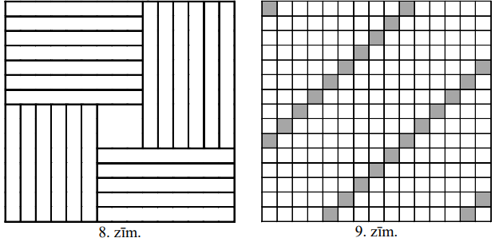
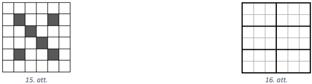

# 8. klase · Tests A · 2. daļa

Vārds, uzvārds: \_\_\_\_\_\_\_\_\_\_\_\_\_\_\_\_\_\_\_\_\_\_\_\_\_\_\_\_\_\_\_\_\_\_ Klase: \_\_\_\_\_\_ Rezultāts: \_\_\_\_\_ / 16 p.

**Laiks — 40 minūtes. Vērtē tikai to, kas ierakstīts rindiņā "Atbilde"; aprēķinus vari veikt lapas brīvajā vietā vai uz melnraksta.** Kalkulatoru nelieto; par nepareizu atbildi punktus neatņem; ja jāatrod *visi* skaitļi, uzraksti visus, atdalot ar komatiem; lielumiem pieraksti mērvienību.

<!-- SAGATAVE. Zem katra uzdevuma numura slīprakstā ir norāde, kāds uzdevums šeit ievietojams; pirms drukāšanas norādes dzēst.
     Priekšzināšanas: 1.-7. klases kurss.
     Struktūra: 11.-14. uzd. — skolas temats T3 (5.1., 5.2. Decimālais pieraksts, dalāmība un pirmskaitļi — 8. klases līmenī); 15. un 20. uzd. — olimpiāžu temats O2 (Ģ7/K4. Rūtiņu figūras un tabulas: sagriešana, izvietojums, lielākais/mazākais skaits);
     16.-19. uzd. — skolas temats T4 (7.8., 7.3. Lineāri vienādojumi un teksta uzdevumi: kustība, vidējais, proporcionalitāte). Katrā skolas tematā: 2 uzdevumi SOLO 1-2, 2 uzdevumi SOLO 3 (viens ar citu tematu).
     Punkti: SOLO 1-2 → 1 p., SOLO 3 → 2 p., olimpiāžu uzdevumi → 2 p. Kopā 16 p. (4 × 1 p. + 6 × 2 p.) Numerācija turpinās (11.-20.). -->

<!-- ŠIS FAILS ir uzdevumu komplekts kopā ar analīzi (metadati <small>, atbildes un pilni atrisinājumi).
     Skolēniem izdalāmajā variantā jāatstāj tikai uzdevumu teksti, zīmējumi un tukšās rindiņas "Atbilde". -->

## 11. uzdevums (1 p.)

<!-- *Šeit ievietot uzdevumu par tematu **dalāmība un pirmskaitļi** (5.2.; S1, S2), SOLO 1–2: sadalīt skaitli pirmreizinātājos un atbildēt tiešu jautājumu (cik dalītāju; ar kādu lielāko pakāpi $2^k$ dalās reizinājums $1\cdot 2\cdots 20$), vai saskaitīt pirmskaitļus dotā intervālā. Atbilde — skaitlis.* -->

Atrodi mazāko naturālo skaitli, ar kuru skaitlis $2520$ nedalās.

<small>

* source:EE.PK.2010TEST.8.3
* answer:11
* questionType:ShortAnswer

</small>

**Atbilde:** $11$

### Atrisinājums

Sadalām pirmreizinātājos: $2520=2^3\cdot 3^2\cdot 5\cdot 7$. Tātad $2520$ dalās ar $2, 3, 4=2^2, 5, 6=2\cdot3, 7, 8=2^3, 9=3^2$ un $10=2\cdot5$, t.i., ar visiem naturālajiem skaitļiem, kas mazāki par $11$. Ar pirmskaitli $11$ tas nedalās, jo $11$ neietilpst tā sadalījumā ($2520 = 229 \cdot 11 + 1$).

*Oriģinālais atrisinājums.* Tā kā skaitļa $2520$ pēdējais cipars ir $0$, tas dalās ar $5$ un $10$. Tā kā tā ciparu summa ir $9$, tas dalās arī ar $3$ un $9$. Ievērosim vēl, ka $2520 = 8 \cdot 315 = 7 \cdot 360$, un no dalāmības ar $8$ izriet arī dalāmība ar $2$ un $4$, bet no dalāmības ar $2$ un $3$ izriet dalāmība ar $6$.

## 12. uzdevums (1 p.)

<!-- *Šeit ievietot uzdevumu par tematu **decimālais pieraksts un dalāmības pazīmes** (5.1.; S3), SOLO 2: skaitļi formā $\overline{xyx}$ vai ar dotu ciparu summu, kuri dalās ar 3, 4, 9 vai 11 — jāatrod **visi** vai jāsaskaita, cik tādu ir; jāapvieno pazīme ar pieraksta struktūru. Atbilde — saraksts vai skaitlis. Līdzīgi: LV.NOL.2019.8.5.* -->

Cik ir trīsciparu skaitļu, kas dalās ar skaitli $4$ un kuru pēdējais cipars arī ir $4$?

<small>

* source:EE.PK.2022TEST.8.9
* answer:45
* questionType:ShortAnswer

</small>

**Atbilde:** $45$

### Atrisinājums

Skaitlis dalās ar $4$ tieši tad, ja no tā diviem pēdējiem cipariem veidotais skaitlis dalās ar $4$. No šādiem skaitļiem ar $4$ beidzas $04$, $24$, $44$, $64$ un $84$, pārējie jeb $14$, $34$, $54$, $74$ un $94$ ar $4$ nedalās. Tātad ar katru simtu ciparu ir tieši $5$ trīsciparu skaitļi ar prasīto īpašību. Kopā to ir $9\cdot 5$ jeb $45$.

## 13. uzdevums (2 p.)

<!-- *Šeit ievietot uzdevumu par tematu **secīgi skaitļi, atlikumi un LKD** (5.2.; S1, S4), SOLO 3: cik skaitļu $x$ no $1$ līdz $N$ ir tādi, ka $x(x+1)$ dalās ar dotu saliktu skaitli (jāsadala nosacījums pa pirmreizinātājiem un jāizmanto, ka $x$ un $x+1$ nav kopīgu dalītāju), vai kāda ir mazākā piecu secīgu skaitļu summa, kas pārsniedz doto skaitli un dalās ar 5. Atbilde — skaitlis. Līdzīgi: LV.NOL.2025.8.2, LV.NOL.2022.8.4.* -->

No trim pēc kārtas sekojošiem naturāliem skaitļiem vidējais, dalot ar skaitli $9$, dod atlikumu $2$. Kādu atlikumu dod šo trīs skaitļu reizinājums, dalot ar skaitli $9$?

<small>

* source:EE.PK.2023TEST.8.5
* answer:$6$
* questionType:ShortAnswer

</small>

**Atbilde:** $6$

### Atrisinājums

Tā kā no trim pēc kārtas sekojošiem skaitļiem vidējais, dalot ar $9$, dod atlikumu $2$, tad pirmais skaitlis dod atlikumu $1$ un trešais — atlikumu $3$. Tātad skaitļi ir $9k+1$, $9k+2$, $9k+3$, un to reizinājums, dalot ar $9$, dod tādu pašu atlikumu kā skaitlis $1\cdot 2\cdot 3$ jeb $6$ (atverot iekavas, visi saskaitāmie, izņemot $1\cdot2\cdot3$, satur reizinātāju $9k$).

*Piezīme skolotājam.* Tipiskā kļūda — atbilde $8$ ($=2^3$, reizinot vidējā skaitļa atlikumu ar sevi).

## 14. uzdevums (2 p.)

<!-- *Šeit ievietot uzdevumu par tematu **decimālais pieraksts** (5.1.) **kombinācijā ar vienādojuma sastādīšanu** (7.8.; S3 + A2), SOLO 3: trīsciparu skaitlis ar dotu ciparu summu, kuram nodzēšot vai pārliekot ciparu iegūst skaitli ar zināmu sakarību pret sākotnējo; jāapzīmē cipari ar burtiem, jāsastāda un jāatrisina vienādojums veselos skaitļos. Atbilde — skaitlis (vai saraksts, ja atrisinājumi vairāki). Līdzīgi: LV.AMO.2023.8.2, LV.NOL.2025.8.5.* -->

Atrodi lielāko piecciparu skaitli, kas dalās ar $15$ un kuram, izsvītrojot pirmo un pēdējo ciparu, paliek skaitlis $107$.

<small>

* source:EE.PK.2007TEST.8.2
* answer:81075
* questionType:ShortAnswer

</small>

**Atbilde:** $81075$

### Atrisinājums

Meklējamais skaitlis ir formā $\overline{a107b}$. Lai tas dalītos ar $15=3\cdot5$, tam jābeidzas ar $0$ vai $5$ ($b\in\{0;5\}$), un tā ciparu summai $a+8+b$ jādalās ar $3$. Lai skaitlis būtu lielākais, vispirms mēģinām lielāko $a$. Ja $a = 9$, tad $b = 5$ un $b = 0$ dod ciparu summu attiecīgi $22$ un $17$ — neder. Ja $a = 8$, tad der $b = 5$, ciparu summa tad ir $21$. Tātad meklējamais skaitlis ir $81075$.

## 15. uzdevums (2 p.)

<!-- *Šeit ievietot uzdevumu par olimpiāžu tematu **figūru izgriešana no rūtiņu taisnstūra** (Ģ7, 5.–6. kl. līmenis), SOLO 2–3: dots taisnstūris (piem., $6\times 12$) un figūra no 5–6 rūtiņām; jānosaka **lielākais** izgriežamo figūru skaits — laukuma novērtējums plus konstrukcija, ko skolēns pārbauda zīmējot uz izdrukāta tīkla. Atbilde — skaitlis. Līdzīgi: LV.NOL.2022.8.2 (pārveidot par "lielākais skaits").* -->

Kvadrāts sastāv no $15 \times 15$ vienādām kvadrātiskām rūtiņām. No tā jāizgriež taisnstūri ar izmēriem $1 \times 9$ rūtiņas (griezumiem jāiet pa rūtiņu līnijām; taisnstūri var būt novietoti gan horizontāli, gan vertikāli). Kādu lielāko daudzumu šādu taisnstūru var izgriezt?

<small>

* source:LV.NOL.2004.7.5
* answer:24
* questionType:FindOptimal

</small>

**Atbilde:** $24$

### Atrisinājums

Atbilde: $24$.

**Piemērs.** 8. zīmējumā redzams, kā izgriezt $24$ taisnstūrus: kvadrāta stūros izvieto četrus blokus $6\times 9$ (katrā $6$ taisnstūri), kas „griežas” ap centrālo $3\times3$ kvadrātu.

**Novērtējums.** Iekrāsosim $24$ rūtiņas, kā parādīts 9. zīmējumā (tās atrodas uz „diagonālēm” ar soli $9$). Viegli redzams, ka katrs $1\times 9$ taisnstūris satur tieši vienu iekrāsotu rūtiņu. Tā kā šādu rūtiņu ir $24$, tad vairāk par $24$ taisnstūriem izgriezt nevar.

*Piezīme skolotājam.* Laukuma novērtējums dod tikai $225:9=25$; atbilde $25$ ir tipiskā kļūda. Sagatavē minētais LV.NOL.2022.8.2 nav izmantots.

<!-- ===== Lapas otrā puse: 16.–20. uzdevums ===== -->

## 16. uzdevums (1 p.)

<!-- *Šeit ievietot uzdevumu par tematu **tiešā un apgrieztā proporcionalitāte** (7.3.), SOLO 1–2: sadzīves situācija (strādnieki un dienas, ātrums un laiks, cena un daudzums), kur viens lielums mainās un jāatrod otrs; viena proporcija. Atbilde — skaitlis ar mērvienību.* -->

Diviem ekskavatoriem trīs vienādu bedru izrakšanai vajag pusotru stundu. Cik ekskavatoru vajag, lai izraktu četras tādas pašas bedres vienā stundā?

<small>

* source:EE.PK.2007TEST.8.4
* answer:4
* questionType:ShortAnswer

</small>

**Atbilde:** $4$

### Atrisinājums

Diviem ekskavatoriem četru vienādu bedru izrakšanai vajag $\frac{4}{3}\cdot 1{,}5 = 2$ stundas (tiešā proporcionalitāte starp bedru skaitu un laiku). Lai paveiktu darbu 2 reizes ātrāk, ekskavatoru jābūt 2 reizes vairāk (apgrieztā proporcionalitāte starp ekskavatoru skaitu un laiku) jeb $4$.

## 17. uzdevums (1 p.)

<!-- *Šeit ievietot uzdevumu par tematu **aritmētiskais vidējais** (7.8. teksta uzdevumi; 6. kl. pamati), SOLO 2: grupas vidējais mainās, kad pievieno vai izņem vienu elementu ar zināmu vērtību — jāatrod elementu skaits vai jaunais vidējais; jālieto "vidējais × skaits = summa". Atbilde — skaitlis. Līdzīgi: LV.AMO.2024.8.1 (vienkāršota versija), LV.NOL.2023.9.5.* -->

Doti $n$ skaitļi, kuru vidējais aritmētiskais ir $20$. Ja tiem pievieno vēl skaitli $100$, šo skaitļu vidējais aritmētiskais būtu $25$. Atrodi skaitli $n$.

<small>

* source:EE.PK.2019TEST.8.5
* answer:15
* questionType:ShortAnswer

</small>

**Atbilde:** $15$

### Atrisinājums

Ja $n$ skaitļu vidējais aritmētiskais ir $20$, tad šo skaitļu summa ir $20n$.

Ja skaitļiem pievieno $100$, skaitļu vidējais aritmētiskais ir $\frac{20n+100}{n+1}$.

Vienādojums $\frac{20n+100}{n+1}=25$ pārveidojas formā $20n+100=25n+25$, no kurienes $n=15$.

## 18. uzdevums (2 p.)

<!-- *Šeit ievietot uzdevumu par tematu **kustības uzdevums ar lineāru vienādojumu** (7.8., 7.3.; A2), SOLO 3: kustība pa upi (pa straumi / pret straumi) ar zināmu laiku turp un atpakaļ, vai divi dalībnieki pa apļveida trasi pretējos virzienos ar dotiem tikšanās laikiem; jāsastāda viens vienādojums ar nezināmo ātrumu vai attālumu. Atbilde — skaitlis ar mērvienību. Līdzīgi: LV.NOL.2020.8.1, LV.NOL.2023.8.5 (vienkāršota), LV.NOL.2021.9.1.* -->

Profesoram Cipariņam ir airu laiva. Profesors stāvošā ūdenī airē ar ātrumu $8~\mathrm{km/h}$. Vienu dienu viņš devās braucienā pa upi: izbraucot no mājām, viņš $5$ stundas airēja pret straumi, līdz nokļuva atpūtas vietā. Pēc atpūtas profesors devās atpakaļ mājās. Pēc $2$ stundu airēšanas viņš no rokām izlaida airus, un atlikušo ceļa gabalu laivu nesa straume. Aprēķini straumes ātrumu, ja zināms, ka ceļā uz atpūtas vietu profesors pavadīja par $2$ stundām vairāk nekā atpakaļceļā.

<small>

* adaptedFrom:LV.NOL.2020.8.1
* answer:3 km/h
* questionType:ShortAnswer

</small>

**Atbilde:** $3$ km/h

### Atrisinājums

Ar $x$ apzīmējam upes straumes ātrumu (km/h). Atpakaļceļš ilga $5-2=3$ stundas: $2$ stundas airējot un $1$ stundu bez airiem. Izmantojot uzdevumā doto, aizpildām tabulu.

|  | $\boldsymbol{v},~\mathrm{km/h}$ | $\boldsymbol{t},~\mathrm{h}$ | $\boldsymbol{s},~\mathrm{km}$ |
| :--- | :---: | :---: | :---: |
| Pret straumi | $8-x$ | $5$ | $5(8-x)$ |
| Pa straumi (airējot) | $8+x$ | $2$ | $2(8+x)$ |
| Pa straumi (bez airiem) | $x$ | $1$ | $x$ |

Tā kā turpceļā un atpakaļceļā veiktais attālums ir viens un tas pats, tad iegūstam vienādojumu:

$$\begin{gathered}
5(8-x)=2(8+x)+x \\
40-5x=16+3x \\
8x=24 \\
x=3
\end{gathered}$$

Līdz ar to upes straumes ātrums ir $3~\mathrm{km/h}$ (pārbaude: $5\cdot 5=25$ km un $2\cdot 11+3=25$ km).

*Pielāgojums.* Oriģinālajā uzdevumā (LV.NOL.2020.8.1) profesors airēja ar ātrumu $7~\mathrm{km/h}$, $8$ stundas pret straumi un $4$ stundas atpakaļ (atbilde $2~\mathrm{km/h}$); skaitļi mainīti.

## 19. uzdevums (2 p.)

<!-- *Šeit ievietot uzdevumu par tematu **teksta uzdevums ar vienādojumu** (7.8.) **kombinācijā ar veselu skaitļu vai dalāmības nosacījumu** (5.2.; S5 pamati), SOLO 3: naudas sadalīšana ar nosacījumiem, kur summa jāsadala tā, lai visas daļas būtu veseli skaitļi (vai centu skaits vesels), vai stabu/sēdvietu skaits, kas jāatrod no kopējā attāluma un nepāra skaita nosacījuma; vienādojums dod vairākus kandidātus, no kuriem derīgs viens. Atbilde — skaitlis. Līdzīgi: LV.AMO.2023.8.4, LV.AMO.2019.8.1.* -->

Trim draugiem kopā ir $75$ automašīnu modeļi. Karlam ir tieši $2$ reizes mazāk automašīnu nekā Albertam un Paulam kopā. Paulam ir tieši par $5$ automašīnām mazāk nekā vienam no viņa diviem draugiem. Cik automašīnu modeļu ir Albertam?

<small>

* source:EE.PK.2015TEST.8.5
* answer:30
* questionType:ShortAnswer

</small>

**Atbilde:** $30$

### Atrisinājums

Pieņemsim, ka Alberta, Paula un Karla automašīnu modeļu skaits ir attiecīgi $a$, $b$ un $c$. Saskaņā ar uzdevuma nosacījumiem $a + b + c = 75$ un $c = \frac{a + b}{2}$ jeb $a + b = 2c$. No šejienes $2c + c = 75$ jeb $c = 25$, un $a+b=50$.

No uzdevuma nosacījumiem vēl iegūstam, ka ir spēkā vai nu $b = a - 5$, vai $b = c - 5$. Tā kā $a + b = 50$ ir pāra skaitlis, tad $a$ un $b$ ir ar vienādu paritāti, tāpēc $b = a - 5$ nav iespējams (tad būtu $2a=55$). Tātad $b = c - 5 = 20$ un $a = 75 - 25 - 20 = 30$.

*Piezīme skolotājam.* Tipiskā kļūda — neapskatīt otru gadījumu vai iegūt neveselu $a=27{,}5$ un to noapaļot.

## 20. uzdevums (2 p.)

<!-- *Šeit ievietot uzdevumu par olimpiāžu tematu **rūtiņu tabula: mazākais/lielākais skaits ar novērtējumu un konstrukciju** (K4 + M5, 7.–8. kl. līmenis), SOLO 3–4: rūtiņu krustpunktu režģis $5\times 5$, no kura jānodzēš **mazākais** punktu skaits, lai nekādi trīs neatrastos uz vienas taisnes, vai tabula $3\times 2n$ ar skaitļiem, kur jāatrod **lielākais** $K$, lai kaimiņu starpība būtu vismaz $K$; pareizai atbildei nepieciešams piemērs un pamatojums, kāpēc labāk nevar. Šis ir daļas grūtākais uzdevums. Atbilde — skaitlis. Līdzīgi: LV.NOL.2024.8.3, LV.NOL.2020.8.4 (ar konkrētu $n$).* -->

Kāds ir mazākais rūtiņu skaits, kas jāiekrāso $6 \times 6$ rūtiņu kvadrātā, lai katrā šī kvadrāta $2 \times 3$ rūtiņu taisnstūrī (tas var būt arī pagriezts vertikāli) būtu vismaz viena iekrāsota rūtiņa?

<small>

* source:LV.AMO.2018.8.5
* answer:6
* questionType:FindOptimal

</small>

**Atbilde:** $6$

### Atrisinājums

Mazākais rūtiņu skaits, kas jāiekrāso, ir $6$, skat., piemēram, 15. att.: katrs $2\times3$ vai $3\times 2$ taisnstūris satur vismaz vienu iekrāsotu rūtiņu.

Pierādīsim, ka nepietiek iekrāsot mazāk rūtiņu. Sadalām kvadrātu sešos taisnstūros $2 \times 3$ (skat. 16. att.); katrā šādā taisnstūrī jābūt iekrāsotai vismaz vienai rūtiņai, tātad kopā jābūt iekrāsotām vismaz $6$ rūtiņām.

*Pielāgojums.* Oriģinālajā uzdevumā ir arī (B) daļa (vai noteikti stūra rūtiņas paliek neiekrāsotas); testā tā izlaista. Uzdevums aizstāj sagatavē minēto punktu dzēšanas uzdevumu (LV.NOL.2024.8.3). Tipiskā kļūda — iekrāsot „pa rindām” un atbildēt $12$ vai vairāk, neatrodot izvietojumu ar $6$ rūtiņām.

*Vieta aprēķiniem un zīmējumiem:*

&nbsp;

&nbsp;

&nbsp;

&nbsp;

---

<!-- Skolotājam. Šo sadaļu pirms drukāšanas skolēniem dzēst vai pārcelt uz atsevišķu failu. -->

## Atbilžu atslēga (tikai skolotājam)

| Nr. | Temats | SOLO | P. | Atbilde (A var.) | Pieņemamās ekvivalentās formas |
|---|---|---|---|---|---|
| 11 | T3 5.2. | 1–2 | 1 | 11 | |
| 12 | T3 5.1. | 2 | 1 | 45 | |
| 13 | T3 5.2. | 3 | 2 | 6 | |
| 14 | T3 5.1. + 7.8. | 3 | 2 | 81075 | |
| 15 | O2 Ģ7 | 2–3 | 2 | 24 | |
| 16 | T4 7.3. | 1–2 | 1 | 4 | |
| 17 | T4 7.8. | 2 | 1 | 15 | |
| 18 | T4 7.8. + 7.3. | 3 | 2 | 3 (km/h) | arī $3$ bez mērvienības |
| 19 | T4 7.8. + 5.2. | 3 | 2 | 30 | |
| 20 | O2 K4 + M5 | 3–4 | 2 | 6 | |

Jomu profils: T3 (11.–14. uzd.) — 6 p.; T4 (16.–19. uzd.) — 6 p.; O2 (15., 20. uzd.) — 4 p. Kopā 16 p. Abas daļas kopā — 32 p.

Avoti: EE.PK (`math/sources/EE_PK/`), LV.NOL, LV.AMO (`math/problembase/`, daļa pielāgoti).
