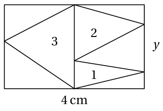
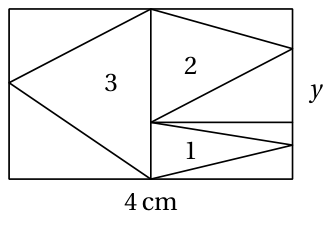
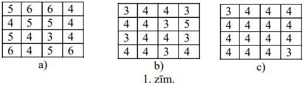
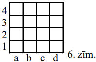

# 9. klase · Tests A · 1. daļa

Vārds, uzvārds: \_\_\_\_\_\_\_\_\_\_\_\_\_\_\_\_\_\_\_\_\_\_\_\_\_\_\_\_\_\_\_\_\_\_ Klase: \_\_\_\_\_\_ Rezultāts: \_\_\_\_\_ / 16 p.

**Laiks — 40 minūtes. Vērtē tikai to, kas ierakstīts rindiņā "Atbilde"; aprēķinus vari veikt lapas brīvajā vietā vai uz melnraksta.** Kalkulatoru nelieto; par nepareizu atbildi punktus neatņem; saknes un daļas raksti precīzi un vienkāršotā formā (piem., $2\sqrt{3}$, $\frac{5}{8}$).

<!-- SAGATAVE. Zem katra uzdevuma numura slīprakstā ir norāde, kāds uzdevums šeit ievietojams; pirms drukāšanas norādes dzēst.
     Priekšzināšanas: 1.-8. klases kurss (9. klases temati — līdzība, kvadrātvienādojums, ievilktais leņķis — nav mācīti).
     Struktūra: 1.-4. uzd. — skolas temats T1 (8.3., 8.6. Kvadrātsaknes un saīsinātās reizināšanas formulas); 5. un 10. uzd. — olimpiāžu temats O1 (K3/S4. Paritāte un invarianti; 7.-8./9.-10. kl.);
     6.-9. uzd. — skolas temats T2 (8.5. Četrstūri: paralelograms, taisnstūris, rombs, kvadrāts; priekšzināšanas — laukumi 8.4., Pitagora teorēma 8.8.). Katrā skolas tematā: 2 uzdevumi SOLO 1-2, 2 uzdevumi SOLO 3 (viens ar citu tematu).
     Punkti: SOLO 1-2 → 1 p., SOLO 3 → 2 p., olimpiāžu uzdevumi → 2 p. Kopā 16 p. (4 × 1 p. + 6 × 2 p.) -->

<!-- ŠIS FAILS ir uzdevumu komplekts kopā ar analīzi (metadati <small>, atbildes un pilni atrisinājumi).
     Skolēniem izdalāmajā variantā jāatstāj tikai uzdevumu teksti, zīmējumi un tukšās rindiņas "Atbilde". -->

## 1. uzdevums (1 p.)

<!-- *Šeit ievietot uzdevumu par tematu **darbības ar kvadrātsaknēm** (8.3.; A1), SOLO 1–2: aprēķināt izteiksmi tipa $(2\sqrt{3}-\sqrt{6})(2\sqrt{3}+\sqrt{6})$ vai $\sqrt{a}\cdot\sqrt{b}-\sqrt{c}$, kur rezultāts ir vesels skaitlis vai īsa sakne; viens formulas lietojums. Atbilde — skaitlis vai izteiksme. Līdzīgi: LV.NOL.2019.8.1.* -->

Aprēķini izteiksmes $\sqrt{(1-\sqrt{2})^2}+\sqrt{2}$ vērtību. Atbildi uzraksti vienkāršākajā formā.

<small>

* adaptedFrom:PL.OMJ.2014TEST.7_8.10
* answer:2\sqrt{2}-1
* questionType:ShortAnswer

</small>

**Atbilde:** $2\sqrt{2}-1$

### Atrisinājums

Ievērosim, ka $\sqrt{t^2}=|t|$. Tā kā $1-\sqrt{2}<0$, tad $|1-\sqrt{2}|=\sqrt{2}-1$. Tātad

$$
\sqrt{(1-\sqrt{2})^2}+\sqrt{2}=|1-\sqrt{2}|+\sqrt{2}=\sqrt{2}-1+\sqrt{2}=2\sqrt{2}-1.
$$

*Pielāgojums.* Oriģinālajā uzdevumā (PL.OMJ.2014TEST.7_8.10) bija jānosaka „jā/nē”, vai šis skaitlis ir vesels, iracionāls un lielāks nekā $1{,}8$; šeit jāaprēķina pati vērtība. Tipiskā kļūda — $\sqrt{(1-\sqrt2)^2}=1-\sqrt2$, kas dod atbildi $1$.

## 2. uzdevums (1 p.)

<!-- *Šeit ievietot uzdevumu par tematu **pilnais kvadrāts zem saknes** (8.3., 8.6.; A1, A3 pamati), SOLO 2: vienkāršot $\sqrt{7-4\sqrt{3}}$ tipa izteiksmi, saskatot $(2-\sqrt{3})^2$, vai salīdzināt $\sqrt{a}+\sqrt{b}$ ar $\sqrt{c}$ — uzrakstīt lielāko. Atbilde — izteiksme. Līdzīgi: LV.NOL.2024.9.2 (viens saskaitāmais).* -->

Aprēķini izteiksmes $\sqrt{3-2\sqrt2}-\sqrt2$ vērtību.

<small>

* adaptedFrom:PL.OMJ.2011TEST.7_8.14
* answer:-1
* questionType:ShortAnswer

</small>

**Atbilde:** $-1$

### Atrisinājums

Ievērosim, ka $3-2\sqrt2=2-2\sqrt2+1=(\sqrt2-1)^2$. Skaitlis $\sqrt2-1$ ir pozitīvs, tāpēc $\sqrt{3-2\sqrt2}=\sqrt2-1$. No tā izriet, ka

$$
\sqrt{3-2\sqrt2}-\sqrt2=\sqrt2-1-\sqrt2=-1.
$$

*Pielāgojums.* Oriģinālajā uzdevumā (PL.OMJ.2011TEST.7_8.14) bija jānosaka „jā/nē”, vai šis skaitlis ir vesels, iracionāls un pozitīvs; šeit jāaprēķina pati vērtība. Tipiskā kļūda — $\sqrt{(\sqrt2-1)^2}$ aizstāt ar $1-\sqrt2$ un iegūt $1-2\sqrt2$.

## 3. uzdevums (2 p.)

<!-- *Šeit ievietot uzdevumu par tematu **saīsinātās reizināšanas formulas lielos skaitļos** (8.6.; A1), SOLO 3: izteiksme ar "olimpiādes gada" skaitļiem (piem., $\frac{2025^2}{2024^2+2026^2-2}$ vai $2025^3-2024^3-\ldots$), kuru formulas reducē līdz mazam skaitlim; tieša rēķināšana neiespējama. Atbilde — skaitlis. Līdzīgi: LV.NOL.2025.9.1.* -->

Atrodi izteiksmes $2017^2 + 2018^2 - 2017 \cdot 2018 - 2017 \cdot 2019$ vērtību.

<small>

* source:EE.PK.2017TEST.9.2
* answer:-2016
* questionType:ShortAnswer

</small>

**Atbilde:** $-2016$

### Atrisinājums

Izmantojot divu skaitļu starpības kvadrāta formulu, iegūstam

$$
\begin{aligned}
2017^2 + 2018^2 - 2017 \cdot 2018 - 2017 \cdot 2019
&= 2017^2 + 2018^2 - 2 \cdot 2017 \cdot 2018 + 2017 \cdot 2018 - 2017 \cdot 2019 \\
&= (2017 - 2018)^2 + 2017 \cdot (2018 - 2019) \\
&= 1 - 2017 \\
&= -2016.
\end{aligned}
$$

## 4. uzdevums (2 p.)

<!-- *Šeit ievietot uzdevumu par tematu **formulas** (8.6.) **kombinācijā ar nevienādību $a^2+b^2\ge 2ab$ vai veseliem skaitļiem** (A3 ★ / S6), SOLO 3: atrast izteiksmes $x^2+\frac{1}{x^2}$ vai $a^2+b^2$ pie dotas summas mazāko vērtību, atrast visus $(x;y)$, kuriem $(x^4+1)(y^4+1)=4x^2y^2$, vai visus naturālos $n$, kuriem $\sqrt{n^2+2n+10}$ ir vesels skaitlis. Atbilde — skaitlis vai saraksts. Līdzīgi: LV.NOL.2023.9.4, LV.AMO.2024.9.1.* -->

Skaitļi $a$ un $b$ ir tādi, ka $a^2 + b^2 = 2ab$ un $a + b = 2{,}2$. Atrodi $a$.

<small>

* source:EE.PK.2020TEST.9.2
* answer:1,1
* questionType:ShortAnswer

</small>

**Atbilde:** $1{,}1$

### Atrisinājums

Nosacījums $a^2 + b^2 = 2ab$ ir ekvivalents vienādībai $a^2 - 2ab + b^2 = 0$ jeb $(a - b)^2 = 0$, no kā izriet vienādība $a = b$. Tā kā $a + b = 2{,}2$, tad $a = b = 1{,}1$.

*Piezīme skolotājam.* Uzdevums ilustrē nevienādību $a^2+b^2\geqslant 2ab$: vienādība ir tikai tad, ja $a=b$.

## 5. uzdevums (2 p.)

<!-- *Šeit ievietot uzdevumu par olimpiāžu tematu **paritāte** (S4, 7.–8. kl. līmenis), SOLO 2–3: skaitļi $1$ līdz $16$ izvietoti pa apli, katriem blakus skaitļiem aprēķināta starpība; jāatrod **lielākā iespējamā** vai jāizvēlas no dotajiem, kāda var būt starpību summa (paritātes arguments izslēdz daļu variantu, konstrukcija pierāda pārējos); vai "$\pm 1\pm 2\ldots\pm n$" mazākā nenegatīvā vērtība. Atbilde — skaitlis vai burti. Līdzīgi: LV.AMO.2023.9.5, LV.NOL.2022.10.5.* -->

Atrodi lielāko iespējamo nepāra skaitļu skaitu starp septiņiem naturāliem skaitļiem $a$, $b$, $c$, $d$, $e$, $f$ un $g$, ja ir spēkā vienādība

$$
(a + b) \cdot (c \cdot d + (e + f) \cdot g) = 12345.
$$

<small>

* source:EE.PK.2013TEST.9.2
* answer:6
* questionType:ShortAnswer

</small>

**Atbilde:** $6$

### Atrisinājums

Tā kā reizinājums $12345$ ir nepāra skaitlis, abi reizinātāji $a + b$ un $c \cdot d + (e + f) \cdot g$ ir nepāra. Lai summa $a + b$ būtu nepāra, vienam no saskaitāmajiem $a$ un $b$ jābūt pāra, bet otram nepāra. Tātad vismaz vienam no septiņiem skaitļiem jābūt pāra, ne vairāk kā seši var būt nepāra. Seši nepāra skaitļi arī ir iespējami, piemēram, $(1 + 2) \cdot (1 \cdot 1 + (1 + 4113) \cdot 1) = 3\cdot 4115=12345$.

*Piezīme skolotājam.* Tipiskā kļūda — atbilde $7$ (visi nepāra, jo „rezultāts ir nepāra”).

<!-- ===== Lapas otrā puse: 6.–10. uzdevums ===== -->

## 6. uzdevums (1 p.)

<!-- *Šeit ievietot uzdevumu par tematu **paralelograma īpašības** (8.5.; Ģ1), SOLO 1–2: paralelogramā dots viens leņķis un bisektrise vai diagonāle, jāatrod cits leņķis vai malas garums (bisektrise nogriež vienādsānu trijstūri). Atbilde — grādi vai skaitlis.* -->

Atrodi leņķa $x$ lielumu, ja zīmējumā attēlotais četrstūris ir paralelograms. (Zīmējums nav mērogā.)

<small>

* source:EE.PK.2018TEST.8.7
* answer:44^\circ
* questionType:ShortAnswer

</small>

**Atbilde:** $44^\circ$

### Atrisinājums

Tā kā paralelograma pretējie leņķi ir vienāda lieluma, tad taisnleņķa trijstūrī $ABC$ (sk. zīmējumu) iegūstam $(90^\circ-\angle x)+44^\circ=90^\circ$. Tātad $90^\circ-\angle x=90^\circ-44^\circ$ jeb $\angle x=44^\circ$.

## 7. uzdevums (1 p.)

<!-- *Šeit ievietot uzdevumu par tematu **četrstūra laukums ar Pitagora teorēmu** (8.5., 8.4., 8.8.; Ģ5), SOLO 2: rombs ar dotu malu un vienu diagonāli, taisnstūris ar diagonāli un malu attiecību, vai trapece ar augstumu, kas jāatrod no sānu malas; jāaprēķina laukums. Atbilde — skaitlis (var būt ar sakni).* -->

Taisnstūra $ABCD$ diagonāle ir taisnstūra $ACEF$ mala, un punkts $D$ atrodas uz malas $EF$. Atrodi piecstūra $ABCEF$ laukumu, ja $|AB| = 12$ cm un $|BC| = 5$ cm. (Zīmējums nav mērogā.)

<small>

* source:EE.PK.2010TEST.8.7
* answer:$90\ \mathrm{cm}^2$
* questionType:ShortAnswer

</small>

**Atbilde:** $90$ cm$^2$

### Atrisinājums

Trijstūra $ACD$ laukums ir puse no taisnstūra $ACEF$ ar tādu pašu pamatu $AC$ un augstumu laukuma. Tātad piecstūra $ABCEF$ laukums ir

$$
S_{ABC} + S_{ACEF} = S_{ABC} + 2 \cdot S_{ACD} = 3 \cdot S_{ABC} = 3 \cdot \frac{1}{2} \cdot |AB| \cdot |BC| = 90\ \mathrm{cm}^2.
$$

**Ar Pitagora teorēmu.** $|AC|=\sqrt{12^2+5^2}=13$ cm. Taisnstūra $ACEF$ otra mala ir vienāda ar attālumu no $D$ līdz $AC$, t.i., ar taisnleņķa trijstūra $ACD$ augstumu $h=\frac{12\cdot 5}{13}=\frac{60}{13}$ cm. Tātad $S_{ACEF}=13\cdot\frac{60}{13}=60$ cm$^2$ un $S_{ABCEF}=30+60=90$ cm$^2$.

*Piezīme skolotājam.* Uzdevumu var atrisināt arī bez Pitagora teorēmas (ar laukumu metodi), bet otrais ceļš atbilst tematam „laukums ar Pitagora teorēmu”.

## 8. uzdevums (2 p.)

<!-- *Šeit ievietot uzdevumu par tematu **laukumu sadalīšana četrstūrī** (8.5., 8.4.; Ģ5 "laukumu metode"), SOLO 3: punkts kvadrāta vai paralelograma iekšpusē savienots ar virsotnēm vai malu punktiem; dotas dažu daļu laukumi, jāatrod cita daļa (trijstūri ar kopīgu pamatu un augstumu), vai četrstūrī ar diagonāles viduspunktu un paralēlu nogriezni jāatrod malas garums (viduslīnija). Atbilde — skaitlis. Līdzīgi: LV.NOL.2019.9.3 (ar konkrētiem skaitļiem), LV.AMO.2024.9.4, LV.NOL.2023.9.3.* -->

Taisnstūris sadalīts divos taisnstūros, un tie savukārt — trijstūros. Zīmējumā trijstūros ierakstīti to laukumi kvadrātcentimetros. Taisnstūra vienas malas garums ir $4$ cm. Atrodi taisnstūra otras malas garumu $y$. (Zīmējums nav mērogā.)

<small>

* source:EE.PK.2012TEST.8.7
* answer:3 cm
* questionType:ShortAnswer

</small>

**Atbilde:** $3$ cm

### Atrisinājums

Sadalām labās puses taisnstūri savukārt divos taisnstūros, kā parādīts zīmējumā. Lielais taisnstūris tagad sastāv no trim mazākiem taisnstūriem, no kuriem katra laukums ir vienāds ar tajā esošā trijstūra divkāršu laukumu (trijstūrim un taisnstūrim kopīgs pamats un augstums). Tātad lielā taisnstūra laukums ir $6 + 4 + 2 = 12$ kvadrātcentimetri, un šī taisnstūra otras malas garums ir $\frac{12\ \text{cm}^2}{4\ \text{cm}} = 3$ cm.

## 9. uzdevums (2 p.)

<!-- *Šeit ievietot uzdevumu par tematu **kvadrāts** (8.5.) **kombinācijā ar vienādojuma sastādīšanu un Pitagora teorēmu** (8.8., 7.8.), SOLO 3: uz kvadrāta malas izvēlēts punkts ar nosacījumu, kas saista nogriežņu garumus (piem., $AB+AE=CE$), jāapzīmē nezināmais, jāsastāda vienādojums no Pitagora teorēmas un jāatrod garums vai laukums. Atbilde — skaitlis (daļa). Līdzīgi: LV.NOL.2021.9.3, LV.NOL.2024.9.3 (pārveidot par aprēķinu).* -->

Taisnstūrī $ABCD$ malu garumi ir $|AB|=12$ cm un $|BC|=6$ cm. Uz malām $AB$ un $CD$ izvēlēti attiecīgi punkti $X$ un $Y$ tā, ka četrstūris $AXCY$ ir rombs. Atrodi šī romba malas garumu.

<small>

* adaptedFrom:UKMT.EPK.2003.21
* sourceNote:2003 European Pink Kangaroo, 21. uzd. (UKMT Yearbook 2002-03); tulkots, pārformulēts bez locīšanas zīmējuma, izvēles varianti noņemti
* answer:7,5 cm
* questionType:ShortAnswer

</small>

**Atbilde:** $7{,}5$ cm

### Atrisinājums

Apzīmēsim romba malas garumu ar $x$ cm. Tad $|XC|=|AX|=x$, $|XB|=12-x$ un $|BC|=6$. Pēc Pitagora teorēmas taisnleņķa trijstūrim $XBC$:

$$
x^2 = 6^2 + (12- x)^2 \quad\Rightarrow\quad x^2 = 36 + 144 - 24x + x^2 \quad\Rightarrow\quad 24x = 180,
$$

tātad romba malas garums ir $7{,}5$ cm.

*Pielāgojums.* Oriģinālajā uzdevumā taisnstūrveida papīra lapu $6\times 12$ cm saloka pa diagonāli, nogriež pārkarošās daļas un lapu atloka — iegūst rombu; jautāts romba malas garums (varianti A $2\sqrt5$ cm, B $7{,}35$ cm, C $7{,}5$ cm, D $7{,}85$ cm, E $8{,}1$ cm). Šeit tas pats rombs aprakstīts tieši.

## 10. uzdevums (2 p.)

<!-- *Šeit ievietot uzdevumu par olimpiāžu tematu **invariants procesā** (K3, 9.–10. kl. līmenis), SOLO 3–4: uz tāfeles trīs skaitļi (piem., $11, 12, 13$) un gājiens "vienu skaitli aizstāj ar divkāršotu pārējo summu mīnus tas pats", vai daļa, kurai skaitītājam un saucējam pieskaita/reizina, vai rūtiņu taisnstūris ar kaķiem, kas pārlec uz blakus rūtiņu; jānosaka, **kuri no dotajiem 3–4 stāvokļiem** ir sasniedzami (uzrakstīt burtus) vai **mazākais tukšo rūtiņu skaits**. Nepieciešams invariants (atlikums pēc moduļa, starpība, šaha dēļa krāsojums). Šis ir daļas grūtākais uzdevums; formulēt bez "vai var". Atbilde — burti vai skaitlis. Līdzīgi: LV.AMO.2024.9.3, LV.AMO.2023.9.1, LV.NOL.2024.9.4.* -->

Kvadrāts sastāv no $4 \times 4$ rūtiņām. Katrā no tām ierakstīts vesels pozitīvs skaitlis. Ar vienu gājienu drīkst pieskaitīt vieninieku skaitļiem divās rūtiņās, kurām ir kopīga mala. Kuros no zīmējumā parādītajiem sākotnējiem izvietojumiem **(A)**, **(B)** un **(C)** var panākt, lai visi skaitļi rūtiņās būtu vienādi? Atbildē uzraksti visu derīgo izvietojumu burtus.

<small>

* adaptedFrom:LV.AMO.2007.6.3
* answer:A
* questionType:FindAll

</small>

**Atbilde:** A

### Atrisinājums

**Atbilde:** tikai **(A)**.

**(A)** Var, piemēram, izdarot šādus gājienus (rūtiņu apzīmējumi — sk. 6. zīm.; kolonnas $a$–$d$, rindas $1$–$4$ no apakšas):

visi skaitļi kļūs vienādi ar $6$:

$a4a3,\ a3a2,\ b3c3,\ d4d3,\ d4d3,\ b1b2,\ b1b2,\ c1c2,\ c2d2,\ c2d2.$

**(B)** Sākumā visu ierakstīto skaitļu summa ir nepāra skaitlis (nepāra skaitā rūtiņu ierakstīti nepāra skaitļi). Ar katru gājienu šī summa palielinās par $2$, tātad paliek nepāra skaitlis. Bet, ja visi skaitļi kļūtu vienādi ar $n$, tad to summa $16n$ būtu pāra skaitlis.

**(C)** Iepriekšējā pierādījuma metode neder — visu ierakstīto skaitļu summa ir pāra skaitlis, bet lietosim citu. Izkrāsosim rūtiņas šaha galdiņa kārtībā. Tad melnajās un baltajās rūtiņās ierakstīto skaitļu summas nav vienādas. Ar katru gājienu par $1$ palielinās gan viena, gan otra summa (kaimiņu rūtiņas ir dažādās krāsās), tātad starpība starp tām nemainās un tās paliek dažādas. Bet, ja visi skaitļi kļūtu vienādi, tad abām šīm summām arī būtu jākļūst vienādām.

*Pielāgojums.* Oriģinālajā uzdevumā bija jāatbild „jā/nē” katram izvietojumam ar pamatojumu; testā jāuzraksta derīgo izvietojumu burti. Tipiskā kļūda — iekļaut arī **(C)**, jo paritātes pārbaude to neizslēdz.

*Vieta aprēķiniem un zīmējumiem:*

&nbsp;

&nbsp;

&nbsp;

&nbsp;

---

<!-- Skolotājam. Šo sadaļu pirms drukāšanas skolēniem dzēst vai pārcelt uz atsevišķu failu. -->

## Atbilžu atslēga (tikai skolotājam)

| Nr. | Temats | SOLO | P. | Atbilde (B var.) | Pieņemamās ekvivalentās formas |
|---|---|---|---|---|---|
| 1 | T1 8.3. | 1–2 | 1 | 2√2 − 1 | $\sqrt8-1$ |
| 2 | T1 8.3./8.6. | 2 | 1 | −1 | |
| 3 | T1 8.6. | 3 | 2 | −2016 | |
| 4 | T1 8.6. + A3/S6 | 3 | 2 | 1,1 | 11/10 |
| 5 | O1 S4 | 2–3 | 2 | 6 | |
| 6 | T2 8.5. | 1–2 | 1 | 44° | |
| 7 | T2 8.5. + 8.8. | 2 | 1 | 90 (cm²) | |
| 8 | T2 8.5. + Ģ5 | 3 | 2 | 3 (cm) | |
| 9 | T2 8.5. + 8.8./7.8. | 3 | 2 | 7,5 (cm) | 15/2 |
| 10 | O1 K3 | 3–4 | 2 | A | burti jebkurā secībā |

Jomu profils: T1 (1.–4. uzd.) — 6 p.; T2 (6.–9. uzd.) — 6 p.; O1 (5., 10. uzd.) — 4 p. Kopā 16 p.

Avoti: EE.PK (`math/sources/EE_PK/`), PL.OMJ (`math/sources/PL_OMJ/`, pielāgoti), UKMT (2003 European Pink Kangaroo, `math/sources/UKMT/Yearbook-2002-03.pdf`, tulkots un pielāgots), LV.AMO (`math/problembase/`, pielāgots).
